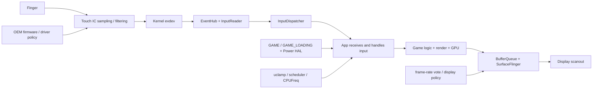

# OEM 游戏模式输入优先级与触控调度

“打开游戏模式后触控更跟手”是一条体验描述，不能直接推导出 InputDispatcher 获得了游戏专属优先级。Android 17 的 AOSP Game Mode、InputDispatcher 和窗口刷新率源码中，没有一条公开的“游戏事件优先队列”。

体验改善可能来自触控 IC 采样、驱动与固件、输入分发、线程调度、CPU/GPU 频率、渲染队列、刷新率或显示扫描。每一段都能缩短端到端时间，也可能互相抵消。排查工作要回答两个问题：

1. 延迟减少发生在哪一段？
2. 这一变化来自 AOSP 标准机制、OEM 私有实现，还是游戏自身策略？

平台源码锚定 Android 17 / API 37 / `android-17.0.0_r1`。Android 12 到 Android 16 的内容只用于说明 Game Mode、Game State 与 Power HAL 能力的演进。

## 先建立端到端输入路径

触摸反馈从手指到屏幕，会经过多段不同性质的处理：

- 触控控制器按固件策略采样、滤波并上报；
- 内核驱动生成 evdev 事件；
- EventHub 与 InputReader 读取、转换和组装事件；
- InputDispatcher 选择目标窗口并通过 InputChannel 发送；
- App 线程接收并处理 `MotionEvent`；
- 游戏逻辑、渲染线程与 GPU 生成画面；
- SurfaceFlinger 合成，显示设备在某次刷新中扫描输出。

下面的图用来标出常见优化入口和观测点。



“输入分发延迟”通常只覆盖 InputDispatcher 发出事件到 App 接收或 ACK 的一段；“触摸到显示延迟”一直延伸到关联帧 present。两者差一个渲染与显示阶段，报告中不能混用。

## AOSP Game Mode 提供了什么

Game Mode API 从 Android 12 开始提供。官方文档要求游戏在恢复到前台时重新调用 `GameManager#getGameMode()`，因为用户可能在游戏暂停期间切换 Standard、Performance 或 Battery 模式。游戏可据此调整画质、目标帧率和资源使用。

Game Mode interventions 面向未自行适配的游戏，由设备厂商配置 FPS throttling、缩放等产品策略。游戏声明自己支持某个 Game Mode 后，应自行完成对应优化；平台会避免继续套用冲突的 OEM intervention。intervention 仍然不等于输入事件调度规则。

### `GAME` 与 `GAME_LOADING` 是 Power HAL 信号

Android 13 引入 `GAME_LOADING` power mode。游戏通过 Game State 报告 loading，`GameManagerService` 在 Performance 模式下通知 Power HAL，并用超时限制 loading boost 时长。

Android 14 引入 `GAME` power mode。Android 17 的 `GameManagerService` 观察前台 UID：当前台只剩游戏应用时打开 `Mode.GAME`，没有游戏在前台时关闭。Power HAL 可以据此调整 CPU、GPU、调度或温控策略，具体动作由设备实现。

下面的 Android 17 代码用于确认 loading 信号的条件与出口。

```java
final boolean boostEnabled =
        getGameMode(packageName, userId)
                == GameManager.GAME_MODE_PERFORMANCE;

if (boostEnabled) {
    mPowerManagerInternal.setPowerMode(
            Mode.GAME_LOADING, isLoading);
}
```

代码只向 PowerManager 传递 power mode，没有调用 InputDispatcher，也没有修改触摸事件的队列顺序。OEM 可以在 Power HAL 收到 `GAME` 或 `GAME_LOADING` 后提高前台任务的容量请求，但这属于调度与功耗策略。

AOSP 官方的 Power HAL 文档把“提高前台游戏 CPU 优先级”列为 OEM 可选措施之一。它表示游戏线程可能更快获得 CPU，不能写成 InputDispatcher 对游戏事件插队。

## InputDispatcher 没有 Game Mode 分支

Android 17 的 `InputDispatcher.cpp` 不依赖 `GameManager`、`GAME_MODE_PERFORMANCE` 或游戏包名。它按照事件类型走不同的目标选择路径：

- key 事件和非 pointer motion 事件使用焦点窗口；
- pointer 事件按 display、坐标、窗口可接收性、输入配置和 touch state 寻找目标；
- 新的触摸序列从前到后遍历窗口，选择首个能接收该触点的非 spy 窗口，并按规则加入 spy、wallpaper 或 outside target；
- move、up、cancel 等后续事件沿已保存的 touch state 继续分发；
- split touch、pointer capture、pilfer、drag、stylus interceptor、多显示等场景还有各自约束。

触摸目标不能简化成“焦点窗口”。一个未获得键盘焦点但可触摸的窗口仍可能接收触摸；遮挡、安全策略和窗口 input config 也会改变结果。

下面的 Android 17 代码展示新触点怎样从窗口栈中选择目标。

```cpp
sp<WindowInfoHandle> DispatcherWindowInfo::findTouchedWindowAt(
        ui::LogicalDisplayId displayId, float x, float y, bool isStylus,
        const sp<WindowInfoHandle> ignoreWindow) const {
    const auto& windows = getWindowHandlesForDisplay(displayId);
    for (const sp<WindowInfoHandle>& window : windows) {
        if (ignoreWindow && haveSameToken(window, ignoreWindow)) {
            continue;
        }
        const WindowInfo& info = *window->getInfo();
        if (!info.isSpy() &&
                windowAcceptsTouchAt(info, displayId, x, y, isStylus)) {
            return window;
        }
    }
    return nullptr;
}
```

遍历顺序是前到后，但“处于最上层”仍不足以成为目标；窗口必须通过 `windowAcceptsTouchAt()` 的区域、配置与安全检查。游戏模式没有参与这个函数。

### `FOREGROUND` 是目标属性

`InputTarget::Flags::FOREGROUND` 标识该 target 是本次事件的前台目标。它会参与注入结果、超时和 ACK 等处理。`ACTION_OUTSIDE`、spy window 或 wallpaper 等附加 target 可能没有该 flag。

这个 flag 来源于窗口路由结果，不代表“前台游戏享有更高调度优先级”，也不对应 Game Mode Performance。看到 trace 或日志中的 `FOREGROUND` 时，应把它解释成输入目标角色。

### policy 回调能做什么

`InputDispatcherPolicyInterface` 提供 `interceptKeyBeforeQueueing()` 和 `interceptMotionBeforeQueueing()`。注释给出的职责是电源管理、早期预处理与更新 policy flags，例如决定事件是否传给用户。按键还有 dispatch 前的 policy 处理。

这些接口没有接收“游戏模式”参数，也没有提供通用的队列优先级字段。OEM 可以维护自己的 framework 或 inputflinger fork，但若要声称某设备在这里识别游戏并重排事件，需要 vendor diff 或 trace 支持。

`notifyWindowUnresponsive()` 和 `notifyWindowResponsive()` 是输入超时与恢复通知。前者启动 ANR 相关处理，后者通知系统该连接恢复响应。把 `notifyWindowResponsive()` 描述成游戏识别或输入重定向入口，和 Android 17 的接口定义不符。

## 异步注入不等于零延迟

`InputManager.INJECT_INPUT_EVENT_MODE_ASYNC` 在 Android 17 对应 `InputEventInjectionSync.NONE`。调用需要 `INJECT_EVENTS` 特权权限。InputDispatcher 仍会验证事件、调用 policy、创建 `EventEntry`，再通过 `enqueueInboundEventLocked()` 放入 inbound queue。

下面的 Android 17 代码用于说明异步模式改变的是等待行为。

```cpp
while (!injectedEntries.empty()) {
    needWake |= enqueueInboundEventLocked(
            std::move(injectedEntries.front()));
    injectedEntries.pop();
}

if (syncMode == InputEventInjectionSync::NONE) {
    injectionResult = InputEventInjectionResult::SUCCEEDED;
}
```

`NONE` 让注入调用方在事件入队后直接拿到成功结果，不等待目标解析，也不等待 App 处理完成。事件仍要经过 InputDispatcher、窗口选择、InputChannel 和 App 消费；焦点、target UID、安全与权限检查仍然有效。

因此，异步注入不能当作游戏触控提速方案，也不能称为“零排队”。它更适合说明注入 API 的同步语义。肩键映射、宏或无障碍工具若合成事件，还要分析原始事件到合成事件之间新增的处理时间。

## View 层拦截只作用于 App 内部

传统 View 层中，父 `ViewGroup` 可以在 `onInterceptTouchEvent()` 中接管子 View 的手势。父容器开始拦截后，原目标子 View 会收到 `ACTION_CANCEL`，后续事件交给父容器。

子 View 可调用 `requestDisallowInterceptTouchEvent(true)`，将 `FLAG_DISALLOW_INTERCEPT` 沿父链向上传递。Android 17 在新的触摸序列开始前会重置触摸状态，因此应用需要在合适的 gesture 生命周期内维护请求。

下面的源码用于界定这个 flag 的作用范围。

```java
final boolean disallowIntercept =
        (mGroupFlags & FLAG_DISALLOW_INTERCEPT) != 0;
if (!disallowIntercept) {
    intercepted = onInterceptTouchEvent(ev);
} else {
    intercepted = false;
}
```

它只阻止父 ViewGroup 通过 `onInterceptTouchEvent()` 接管当前序列，不能改变 InputDispatcher 的窗口目标选择，也不能绕过系统手势、窗口安全策略、pointer pilfer 或另一个窗口的输入权限。

Unity、Unreal、GameActivity 或纯 Native 游戏常把输入交给引擎自己的队列。此时还要检查引擎采样输入的时机、事件合并、游戏 tick 与渲染帧之间的同步，ViewGroup 规则可能不在主路径上。

## 刷新率为什么会改变“跟手”感

Android 17 的 `RefreshRatePolicy` 计算窗口的 frame-rate selection priority：

- 获得焦点且设置 `preferredDisplayModeId` 的窗口优先级最高；
- 获得焦点但没有指定 mode 的窗口位于下一档；
- 未获焦点但指定 mode 的窗口仍可投票；
- 没有相关 vote 的窗口保持 unset。

`WindowState` 把 priority 写入 `SurfaceControl.Transaction.setFrameRateSelectionPriority()`，SurfaceFlinger 再结合所有 layer vote、显示能力和切换策略选择刷新率。它是显示策略输入，不能保证某个请求一定成为物理刷新率。

刷新率从 60 Hz 提升到 120 Hz，刷新间隔从约 16.67 ms 变为约 8.33 ms；144 Hz 约为 6.94 ms。游戏若能按时产出帧，输入到下一次可见更新的等待上限可能缩短。App 或 GPU 已经积压时，提高刷新率无法让 MotionEvent 更早送达，也无法补回错过的渲染 deadline。

Game Mode 还可能通过 FPS throttling intervention 限制游戏帧率。Perfetto 的 `android.game_interventions` 数据源可以记录当前 Game Mode 与 intervention，分析时要确认刷新率、游戏目标 FPS、实际 present cadence 三者是否一致。

## OEM 可能改动的层级

厂商宣传中的“触控增强”可能覆盖以下任意层级：

| 层级 | 可能动作 | 能支持结论的证据 | 不能直接推出的结论 |
|---|---|---|---|
| 触控 IC / 固件 | 提高采样率、改滤波或预测参数 | 控制器规格、固件配置、原始报点间隔 | InputDispatcher 获得优先级 |
| 内核驱动 | 改中断、批处理、事件上报或 touch boost | vendor kernel、tracepoint、evdev 时间戳 | App 处理更快 |
| InputReader / InputDispatcher | 私有识别、过滤、合并或路由 | vendor 源码差异、输入 trace | 所有同品牌设备行为一致 |
| Power HAL / scheduler | `GAME`、触摸 boost、uclamp、affinity、CPUFreq | power、sched、freq、task profile 数据 | 输入路由规则改变 |
| 游戏与引擎 | 更早采样、减少 input-to-simulation 等待、调整 frame pacing | 引擎 marker、源码、frame timeline | 系统输入链路更短 |
| SurfaceFlinger / display | 高刷、刷新率投票、低延迟合成或面板模式 | display mode、FrameTimeline、present fence | 事件更早到 App |
| 游戏工具服务 | 防误触、肩键、映射、录屏、悬浮窗 | 系统服务、权限、配置和 trace | 属于公开 Game Mode API |

“触控采样率 1000 Hz”也不能直接换算成端到端延迟。采样间隔只是前端预算，驱动批处理、事件预测、游戏 tick、GPU 队列和显示扫描仍会增加时间。

OEM 文档或广告没有给出实现层级时，应把它记录为产品能力描述，再用设备证据确定发生位置。

## Android Game Service 的边界

平台的 `GameService`、`GameSessionService` 和 `GameSession` 为 OEM 游戏工具提供会话、overlay、截图或重启游戏等系统集成能力。相关服务由受信任的系统组件实现，普通 App 不能把它当成任意输入控制接口。

Game Service 本身没有定义触摸优先级。游戏空间中的肩键映射、防误触、触控参数、插帧或网络功能，可能由系统应用、privileged permission、vendor daemon、硬件 HAL 和内核节点共同完成。报告应按观察到的实现分层，避免把整个游戏工具箱归入 `GameManager#getGameMode()`。

## 用 Perfetto 拆分延迟

Android 的 `android.input.inputevent` Perfetto 数据源能记录 InputReader 和 InputDispatcher 事件，但官方配置明确限制在 debuggable 的 userdebug/eng build。该数据源可按规则记录 dispatcher inbound event、目标窗口 dispatch 和 evdev event。

Trace Processor 的 `android.input` 标准库提供 `android_input_events`，字段包括：

- `read_time`：InputReader 读取事件的时间；
- `dispatch_ts`：系统开始向窗口分发的时间；
- `dispatch_latency_dur`：系统发送到 App 收到的时间；
- `handling_latency_dur`：App 收到到发出 ACK 的时间；
- `ack_latency_dur`：ACK 回到系统的时间；
- `total_latency_dur`：dispatch 到系统收到 ACK；
- `end_to_end_latency_dur`：input read 到关联帧 present；无法关联帧时为空。

下面的查询用于按事件列出游戏进程的分发、处理、ACK 与端到端时长。

```sql
INCLUDE PERFETTO MODULE android.input;

SELECT
  event_action,
  event_time,
  dispatch_latency_dur / 1e6 AS dispatch_ms,
  handling_latency_dur / 1e6 AS handling_ms,
  ack_latency_dur / 1e6 AS ack_ms,
  total_latency_dur / 1e6 AS dispatch_to_ack_ms,
  end_to_end_latency_dur / 1e6 AS input_to_present_ms
FROM android_input_events
WHERE process_name = 'com.example.game'
ORDER BY event_time;
```

这张表能把“交付慢”“App 处理慢”和“输入已处理但关联帧呈现慢”分开。`end_to_end_latency_dur` 为空时，不要填成零；它表示 trace 没有把事件关联到 present frame。

量产 user build 通常无法启用这套详细输入数据。此时可使用 FrameTimeline、sched、freq、idle、power、SurfaceFlinger、游戏自定义 marker 与 `dumpsys input` 辅助判断，但证据精度较低。`getevent -lt` 会持续读取输入设备，可能影响系统行为，而且 raw evdev timestamp 与终端打印时间不是同一个概念；它适合实验室短时检查报点节奏，不适合直接计算触摸到显示延迟。

## A/B 实验怎样组织

建议至少采集四种条件：

1. Game Mode 为 Standard，关闭 OEM 游戏面板中的触控、高刷、插帧等附加项。
2. Game Mode 为 Performance，OEM 附加项仍关闭。
3. Game Mode 保持一致，只打开 OEM 触控增强。
4. 按产品实际使用方式打开 OEM 游戏模式全套配置。

每种条件都要固定设备、固件、游戏版本、关卡、画质、目标 FPS、显示刷新率、亮度、网络、电量和温度。自动化输入会改变输入源与注入路径，必须在报告中标记；研究物理触摸延迟时，应使用可重复的硬件触发或高速摄像方案。

观测顺序可按以下路径执行：

1. 用 `android.game_interventions` 或 `cmd game` 确认 Game Mode 与 intervention。
2. 记录显示 mode、游戏目标 FPS、FrameTimeline 与 present cadence。
3. 在 debuggable build 上读取 `android_input_events` 的分段延迟。
4. 对齐主线程、RenderThread、引擎线程、Binder 和 GPU driver 的 sched 数据。
5. 叠加 CPU/GPU 频率、idle、thermal 与功耗数据。
6. 检查 system_server、SurfaceFlinger、音频和后台工作是否受到挤压。

多轮实验应报告分布，至少包含中位数、P90/P95/P99、样本数与温度区间。一次 tap、单帧截图或平均 FPS 很难覆盖抖动和尾延迟。

## 多窗口、折叠屏和外设输入

多窗口与多显示会改变焦点窗口、坐标空间、displayId 和刷新率投票。游戏窗口可接收触摸，却未必拥有键盘焦点；外接显示上的 game surface 也可能与触控设备关联到不同 display。

输入设备类型同样要分开：

- 键盘与手柄按键依赖焦点和 key policy；
- 鼠标包含 hover、button、pointer capture 和 cursor 合成；
- 触控板可能生成 pointer、scroll 或 gesture；
- 触摸屏依赖命中测试与 touch state；
- 手写笔还可能经过 stylus interceptor 和 palm rejection。

OEM 游戏工具若只识别全屏主显示游戏，多窗口或外接显示下可能不启用同一策略。结论中应记录窗口模式、displayId、输入设备 descriptor 和焦点状态。

## 给 App 与系统团队的行动清单

App 或引擎团队可以控制：

- 在 `onResume()` 读取 Game Mode，统一目标 FPS、画质和 frame pacing；
- 减少输入到 simulation 之间的跨线程排队；
- 避免主线程在输入关键窗口执行长任务；
- 为输入处理、simulation、render submit 和 present 建立可关联 marker；
- 正确处理 `ACTION_CANCEL`、多指、pointer capture 和 ViewGroup 拦截；
- 用 ADPF 和 Game State 表达负载，避免依赖未公开的 vendor 节点。

系统或 OEM 团队还要验证：

- `GAME` 与 `GAME_LOADING` 在 Power HAL 中触发了什么动作；
- 触控增强改变了采样、滤波、驱动、调度还是显示阶段；
- 私有 inputflinger 改动是否保持焦点、安全、ANR 与注入语义；
- 高刷与 CPU/GPU boost 的温升是否让长时间体验退化；
- 游戏收益是否挤压 system_server、SurfaceFlinger、音频和后台任务。

## Android 17 的工程结论

- AOSP Game Mode 没有游戏专属 InputDispatcher 优先队列。
- `GAME` 与 `GAME_LOADING` 向 Power HAL 传递场景，OEM 可以据此调整性能；这条路径不修改标准窗口路由。
- 触摸目标由 display、坐标、窗口可接收性和 touch state 等条件决定，焦点不能概括全部 pointer 路径。
- `FOREGROUND` 是 InputTarget 角色，不能解释成游戏性能优先级。
- `notifyWindowResponsive()` 用于 ANR 恢复通知，不是游戏识别或事件重定向接口。
- 异步注入只让调用方不等待结果，事件仍进入 InputDispatcher inbound queue；它不能消除输入延迟。
- `requestDisallowInterceptTouchEvent()` 只影响 App 内的父 ViewGroup 拦截。
- 手感改善要按触控前端、输入交付、App 处理、渲染和 present 分段归因。

## 参考资料

- [Android 17 `GameManagerService.java`](https://android.googlesource.com/platform/frameworks/base/+/refs/tags/android-17.0.0_r1/services/core/java/com/android/server/app/GameManagerService.java)
- [Android 17 `InputDispatcher.cpp`](https://android.googlesource.com/platform/frameworks/native/+/refs/tags/android-17.0.0_r1/services/inputflinger/dispatcher/InputDispatcher.cpp)
- [Android 17 `InputDispatcherPolicyInterface.h`](https://android.googlesource.com/platform/frameworks/native/+/refs/tags/android-17.0.0_r1/services/inputflinger/dispatcher/include/InputDispatcherPolicyInterface.h)
- [Android 17 `InputManager.java`](https://android.googlesource.com/platform/frameworks/base/+/refs/tags/android-17.0.0_r1/core/java/android/hardware/input/InputManager.java)
- [Android 17 `RefreshRatePolicy.java`](https://android.googlesource.com/platform/frameworks/base/+/refs/tags/android-17.0.0_r1/services/core/java/com/android/server/wm/RefreshRatePolicy.java)
- [Android 17 `WindowState.java`](https://android.googlesource.com/platform/frameworks/base/+/refs/tags/android-17.0.0_r1/services/core/java/com/android/server/wm/WindowState.java)
- [Android 17 `ViewGroup.java`](https://android.googlesource.com/platform/frameworks/base/+/refs/tags/android-17.0.0_r1/core/java/android/view/ViewGroup.java)
- [Android 17 `GameServiceProviderInstanceImpl.java`](https://android.googlesource.com/platform/frameworks/base/+/refs/tags/android-17.0.0_r1/services/core/java/com/android/server/app/GameServiceProviderInstanceImpl.java)
- [Game Mode API](https://developer.android.com/games/optimize/adpf/gamemode/gamemode-api)
- [Game Mode 与 Game Mode interventions](https://developer.android.com/games/optimize/adpf/gamemode/about-API-and-interventions)
- [AOSP 游戏 Power HAL boost](https://source.android.com/docs/core/perf/boost)
- [Game Mode FPS throttling 与 `android.game_interventions`](https://developer.android.com/games/optimize/adpf/gamemode/fps-throttling)
- [ViewGroup 触摸事件管理](https://developer.android.com/develop/ui/views/touch-and-input/gestures/viewgroup)
- [Perfetto Android input event 配置](https://perfetto.dev/docs/reference/trace-config-proto#AndroidInputEventConfig)
- [Perfetto `android.input` 标准库](https://perfetto.dev/docs/analysis/stdlib-docs#android-input)
