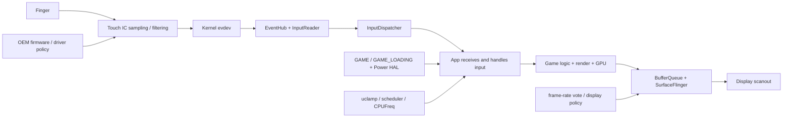

# OEM 游戏模式输入优先级与触控调度

“打开游戏模式后触控更跟手”只描述了体验，无法据此判断 InputDispatcher 给游戏设置了专属优先级。Android 17 的 AOSP Game Mode、InputDispatcher 和窗口刷新率实现中，没有公开的“游戏事件优先队列”。

体验改善可能来自触控控制器采样、驱动与固件、输入分发、线程调度、CPU/GPU 频率、渲染队列、刷新率或显示扫描。触控控制器也常写作 touch IC，指触摸屏中负责采样与上报触点的芯片。各阶段都可能缩短从触摸到画面更新的总时间，也可能因后续等待而抵消。排查时要回答两个问题：

1. 延迟减少发生在哪一段？
2. 这一变化来自 AOSP 标准机制、OEM 私有实现，还是游戏自身策略？

本文以 Android 17、API 37 和 `android-17.0.0_r1` 为源码基线。Android 12 到 Android 16 的内容只用于说明 Game Mode、Game State 与 Power HAL 能力的演进。

## 先建立端到端输入路径

一次触摸变成屏幕上的画面反馈，要经过多段处理：

- 触控控制器按固件策略采样、滤波并上报；
- 内核驱动生成 evdev 事件；evdev 是 Linux 向用户空间提供输入事件的设备接口；
- EventHub 与 InputReader 读取、转换和组装事件；
- InputDispatcher 选择目标窗口，再经输入通道 `InputChannel` 发送；
- 应用线程接收并处理 `MotionEvent`；
- 游戏逻辑、渲染线程与 GPU 生成画面；
- SurfaceFlinger 合成，显示设备在某次刷新中扫描输出。

下面的图用来标出常见优化入口和观测点。



“输入分发延迟”通常只覆盖 InputDispatcher 发出事件到应用接收或返回确认回执（ACK）的阶段；“触摸到显示延迟”还包括游戏逻辑、渲染、合成，直到关联画面完成显示呈现（present）。两种指标的终点不同，报告中不能混用。

## AOSP Game Mode 提供了什么

Game Mode API 和相关干预机制可用于部分 Android 12 设备，并从 Android 13 起面向运行该版本及以上的设备提供。官方文档要求游戏每次从暂停状态恢复时重新调用 `GameManager#getGameMode()`，因为用户可能在暂停期间切换 Standard、Performance 或 Battery 模式。游戏可据此调整画质、目标帧率和资源使用。

游戏模式干预（Game Mode interventions）是设备厂商为未自行适配的游戏设置的系统侧优化，可包含帧率上限（FPS throttling）和分辨率缩放。游戏声明支持某个 Game Mode 后，需要自行完成对应优化；平台会清除此前针对该模式施加的厂商干预，避免两套策略冲突。这类干预没有定义输入事件的调度顺序。

### `GAME` 与 `GAME_LOADING` 是 Power HAL 信号

Android 13 引入 `GAME_LOADING` 电源模式。游戏通过 Game State（游戏向系统上报的运行状态）报告 `isLoading`，`GameManagerService` 只在 Performance 模式下通知 Power HAL，并通过超时限制加载加速的持续时间。

Android 14 引入 `GAME` 电源模式。Android 17 的 `GameManagerService` 观察处于 TOP 进程状态的 UID：当这些 UID 全部属于游戏时开启 `Mode.GAME`；出现非游戏 TOP UID，或前台集合变空时关闭。分屏中同时存在非游戏前台应用，也会使该模式关闭。Power HAL 可以据此调整 CPU、GPU、调度或温控策略，具体动作由设备实现。

下面的 Android 17 代码节选显示：只有 Performance 模式会把 `isLoading` 传给 PowerManager。

```java
final boolean boostEnabled =
        getGameMode(packageName, userId)
                == GameManager.GAME_MODE_PERFORMANCE;

if (boostEnabled) {
    mPowerManagerInternal.setPowerMode(
            Mode.GAME_LOADING, isLoading);
}
```

这段代码只向 PowerManager 传递电源模式，没有调用 InputDispatcher，也没有修改触摸事件的队列顺序。设备厂商可以在 Power HAL 收到 `GAME` 或 `GAME_LOADING` 后提高 CPU 时钟频率或前台游戏任务的 CPU 调度优先级；这些动作属于性能、温控与功耗策略。

AOSP 的 Power HAL 文档把“提高前台游戏应用的 CPU 优先级”列为设备厂商可选措施之一。它可能让游戏线程更快获得 CPU 时间，却不会让 InputDispatcher 中的游戏事件自动插到其他事件前面。

## InputDispatcher 没有 Game Mode 分支

Android 17 的 `InputDispatcher.cpp` 不依赖 `GameManager`、`GAME_MODE_PERFORMANCE` 或游戏包名。它根据事件类型选择目标：

- 按键事件和非指针类运动事件使用焦点窗口；
- 指针类事件包含触摸屏、鼠标和手写笔输入，会按逻辑显示屏、坐标、窗口可接收性、输入配置与触摸序列状态寻找目标；
- 新的触摸序列从窗口栈前端向后遍历，选择首个能接收该触点、且不是旁路观察窗口（spy window）的窗口；系统还可按规则把事件副本送给观察窗口、壁纸窗口或请求 `ACTION_OUTSIDE` 的窗口；
- `MOVE`、`UP`、`CANCEL` 等后续事件沿已保存的触摸序列状态继续分发；
- 多指拆分（split touch，不同手指可发给不同窗口）、指针捕获（pointer capture，由焦点窗口接收鼠标事件）、指针流接管（pilfer，由受信任观察窗口接管后续事件）、拖放、手写笔拦截和多显示屏各有额外约束。

触摸目标不能概括成“焦点窗口”。未获得键盘焦点但可触摸的窗口仍可能接收触摸；窗口遮挡、安全检查和输入配置标志也会改变结果。

下面的片段依据 Android 17 的实现整理，用于展示遍历与接受条件。为便于阅读，它省略了外围作用域并缩短了局部变量名，不是可直接替换进 AOSP 的补丁。

```cpp
sp<WindowInfoHandle> DispatcherWindowInfo::findTouchedWindowAt(
        ui::LogicalDisplayId displayId, float x, float y, bool isStylus,
        const sp<WindowInfoHandle> ignoreWindow) const {
    const auto& windows = getWindowHandlesForDisplay(displayId);
    for (const sp<WindowInfoHandle>& window : windows) {
        if (ignoreWindow && haveSameToken(window, ignoreWindow)) {
            continue;
        }
        const WindowInfo& info = *window->getInfo();
        if (!info.isSpy() &&
                windowAcceptsTouchAt(info, displayId, x, y, isStylus)) {
            return window;
        }
    }
    return nullptr;
}
```

遍历顺序是从前到后，但位于最上层仍不足以成为目标；窗口必须通过 `windowAcceptsTouchAt()` 对显示屏、可见性、可触摸区域和安全条件的检查。游戏模式没有参与这个函数。

### `FOREGROUND` 是目标属性

`InputTarget::Flags::FOREGROUND` 标识某个 `InputTarget` 是本次事件的主要前台目标。对于 `WAIT_FOR_FINISHED` 同步注入，InputDispatcher 会统计带该标志的待完成分发，并等待这些分发收到完成回执或被释放。`ACTION_OUTSIDE`、旁路观察窗口或壁纸窗口等附加目标可能不带该标志。

这个标志来自窗口路由结果，不表示“前台游戏享有更高的 CPU 或队列优先级”，也不对应 Game Mode Performance。跟踪记录或日志中的 `FOREGROUND` 描述的是输入目标角色。

### 策略回调能做什么

`InputDispatcherPolicyInterface` 提供 `interceptKeyBeforeQueueing()` 和 `interceptMotionBeforeQueueing()`。源码注释列出的职责包括电源管理、入队前预处理和更新策略标志位（policy flags），例如设置 `POLICY_FLAG_PASS_TO_USER`，决定事件是否继续交给应用。按键在正式分发前还有一次 `interceptKeyBeforeDispatching()` 策略处理。

这些接口不接收“游戏模式”参数，也没有通用的队列优先级字段。设备厂商可以维护自己的 framework 或 inputflinger 私有分支；若要判断某款设备是否在这里识别游戏并重排事件，需要厂商源码差异或跟踪数据支持。

`notifyWindowUnresponsive()` 和 `notifyWindowResponsive()` 分别报告输入超时与恢复。前者通知系统窗口无响应，并启动应用无响应（ANR）处理；后者只会在该窗口先被标记为无响应后调用，用于撤下可能存在的 ANR 对话框并允许以后重新检测。Android 17 没有把 `notifyWindowResponsive()` 定义成游戏识别或输入重定向入口。

## 异步注入不等于零延迟

`InputManager.INJECT_INPUT_EVENT_MODE_ASYNC` 在 Android 17 对应 `InputEventInjectionSync.NONE`。调用需要系统级 `INJECT_EVENTS` 权限。InputDispatcher 仍会验证事件、执行策略回调、创建 `EventEntry`，再通过 `enqueueInboundEventLocked()` 放入入站队列 `mInboundQueue`。

下面的片段按 Android 17 的控制流整理，省略了入队与判断之间的解锁、唤醒和重新加锁代码，用于说明异步模式改变的是调用方的等待行为。

```cpp
while (!injectedEntries.empty()) {
    needWake |= enqueueInboundEventLocked(
            std::move(injectedEntries.front()));
    injectedEntries.pop();
}

if (syncMode == InputEventInjectionSync::NONE) {
    injectionResult = InputEventInjectionResult::SUCCEEDED;
}
```

`NONE` 让注入调用方在事件入队后直接拿到成功结果，不等待目标解析，也不等待应用处理完成。这个返回值只表示事件已被接受入队，不能证明它已经送达目标。事件随后仍要经过窗口选择、输入通道和应用消费；焦点、`targetUid` 所有权与安全条件仍可能使事件无法交付。`INJECT_EVENTS` 权限则在进入这条路径前检查。

异步注入不能当作游戏触控提速方案，也不能称为“零排队”。它只是注入 API 的一种等待语义。肩键映射、连招宏或无障碍工具若合成新事件，还要测量从原始事件到合成事件之间新增的识别与转发时间。

## View 层拦截只作用于 App 内部

传统 View 层中，父 `ViewGroup` 可以在 `onInterceptTouchEvent()` 中接管原本发给子 View 的手势。父容器开始拦截后，原目标子 View 会收到 `ACTION_CANCEL`，后续事件交给父容器。

子 View 可调用 `requestDisallowInterceptTouchEvent(true)`，将 `FLAG_DISALLOW_INTERCEPT` 沿父 View 链向上传递。Android 17 会在新一轮 `ACTION_DOWN` 开始前重置触摸状态并清除该标志，所以请求只对当前手势序列有效。

下面的源码节选显示该标志怎样跳过父容器的拦截回调。

```java
final boolean disallowIntercept =
        (mGroupFlags & FLAG_DISALLOW_INTERCEPT) != 0;
if (!disallowIntercept) {
    intercepted = onInterceptTouchEvent(ev);
} else {
    intercepted = false;
}
```

它只阻止父 ViewGroup 通过 `onInterceptTouchEvent()` 接管当前序列，不能改变 InputDispatcher 的窗口目标选择，也不能绕过系统手势、窗口安全策略、受信任窗口的指针流接管或其他窗口的输入权限。

Unity、Unreal、GameActivity 或主要使用原生代码的游戏，常把输入交给引擎自己的队列。此时还要检查引擎读取输入的时机、事件合并，以及游戏逻辑更新周期（常称 tick）与渲染帧怎样同步；ViewGroup 可能不在主要输入路径上。

## 刷新率为什么会改变“跟手”感

Android 17 的 `RefreshRatePolicy` 会计算窗口的帧率选择优先级（frame-rate selection priority）。这组优先级只比较窗口焦点与 `preferredDisplayModeId`：

- 获得焦点且设置 `preferredDisplayModeId` 的窗口优先级最高；
- 获得焦点但没有指定显示模式 ID 的窗口位于下一档；
- 未获焦点但指定显示模式 ID 的窗口仍会被 SurfaceFlinger 考虑；
- 未获焦点且没有指定显示模式 ID 的窗口保持未设置状态。

`WindowState` 通过 `SurfaceControl.Transaction.setFrameRateSelectionPriority()` 写入这个优先级，同时还会把窗口的帧率值与选择策略写给 SurfaceFlinger。这里的“帧率投票”（frame-rate vote）是窗口或图层提交的偏好提示。SurfaceFlinger 会结合各图层投票、屏幕能力和切换策略选择刷新率，单个窗口的请求不保证成为最终物理刷新率。

刷新率从 60 Hz 提升到 120 Hz，刷新间隔从约 16.67 ms 变为约 8.33 ms；144 Hz 的间隔约为 6.94 ms。游戏若能按时产出帧，输入等待下一次可见更新的时间可能缩短。应用或 GPU 已经积压时，提高刷新率无法让 `MotionEvent` 更早送达，也无法补回已经错过的渲染提交时限。

Game Mode 还可能通过 FPS throttling 干预设置帧率上限；这种干预只能限速，不能把游戏从 60 FPS 提升到 120 FPS。Perfetto 的 `android.game_interventions` 数据源可在 userdebug 构建上记录当前 Game Mode 与干预配置，SQL 中对应 `android_game_intervention_list` 表。分析时要同时核对屏幕刷新率、游戏目标 FPS 和画面呈现节奏，也就是相邻画面实际显示的间隔。

## OEM 可能改动的层级

厂商宣传中的“触控增强”可能覆盖以下任意层级：

| 层级 | 可能动作 | 能支持结论的证据 | 不能直接推出的结论 |
|---|---|---|---|
| 触控控制器 / 固件 | 提高采样率、修改滤波或预测参数 | 控制器规格、固件配置、原始报点间隔 | InputDispatcher 获得优先级 |
| 内核驱动 | 调整中断、批处理、事件上报，或在触摸时短时提高 CPU 性能 | 厂商内核、内核跟踪点、evdev 时间戳 | 应用处理更快 |
| InputReader / InputDispatcher | 私有识别、过滤、合并或路由 | 厂商源码差异、输入跟踪数据 | 同品牌所有设备行为一致 |
| Power HAL / CPU 调度器 | `GAME`、触摸加速、CPU 利用率钳位（uclamp）、CPU 亲和性、CPUFreq 调频 | 电源模式、CPU 调度、频率与任务配置数据 | 输入路由规则改变 |
| 游戏与引擎 | 更早读取输入、减少输入进入本帧游戏逻辑前的等待、调整帧调度（frame pacing） | 引擎跟踪标记、源码、FrameTimeline | 系统输入链路更短 |
| SurfaceFlinger / 显示系统 | 提高刷新率、提交帧率投票、使用低延迟合成或面板模式 | 显示模式、FrameTimeline、画面呈现同步栅栏 | 事件更早到达应用 |
| 游戏工具服务 | 防误触、肩键映射、录屏或悬浮工具 | 系统服务、权限、配置和跟踪数据 | 这些能力属于公开 Game Mode API |

“触控采样率 1000 Hz”也不能直接换算成从触摸到显示的总延迟。它只说明理想采样间隔约为 1 ms；驱动批处理、事件预测、游戏逻辑更新、GPU 队列和显示扫描仍会增加时间。

厂商文档或广告没有说明改动发生在哪一层时，应先把它记录为产品能力描述，再用设备上的源码、配置或跟踪数据确定位置。

## Android Game Service 的边界

平台的 `GameService`、`GameSessionService` 和 `GameSession` 为设备厂商的游戏工具提供会话、受信任任务叠加层（overlay）、截图和重启游戏等系统集成能力。Android 17 的控制接口要求 `MANAGE_GAME_ACTIVITY` 权限，由受信任的系统组件实现；普通应用不能把它当成通用输入控制接口。

Game Service 没有定义触摸优先级。游戏空间中的肩键映射、防误触、触控参数、插帧或网络功能，可能由预装系统应用、仅授予特权应用的权限、厂商后台守护进程、硬件抽象层（HAL）和内核接口共同完成。报告应按观察到的实现位置分别记录，不能把整个游戏工具箱都归入 `GameManager#getGameMode()`。

## 用 Perfetto 分段测量延迟

Android 的 Perfetto 数据源 `android.input.inputevent` 能记录 InputReader 和 InputDispatcher 事件。官方配置明确规定，详细输入跟踪只能在可调试的 userdebug 或 eng 构建上采集，不能用于普通量产 user 构建。该数据源可按规则记录 InputDispatcher 的入站事件、发往各目标窗口的事件和内核 evdev 事件；完整模式还可能包含敏感的坐标或按键内容。

Trace Processor 的 `android.input` 标准库提供 `android_input_events` 表。输入通过套接字式通道交付，应用处理后会返回 ACK，因此可以分成以下时间段：

- `read_time`：InputReader 读取事件的时间；
- `dispatch_ts`：系统开始向窗口分发的时间；
- `dispatch_latency_dur`：系统发送事件到应用收到事件的时间；
- `handling_latency_dur`：应用收到事件到发出 ACK 的时间；
- `ack_latency_dur`：ACK 回到系统的时间；
- `total_latency_dur`：系统开始分发到收到 ACK 的总时间；
- `end_to_end_latency_dur`：InputReader 读取事件到关联画面完成呈现的时间；没有关联画面时为空。

下面的查询按事件列出指定游戏进程的分发、处理、ACK 与触摸到画面呈现时长。表中的时长以纳秒保存，除以 `1e6` 后得到毫秒。

```sql
INCLUDE PERFETTO MODULE android.input;

SELECT
  event_action,
  event_time,
  dispatch_latency_dur / 1e6 AS dispatch_ms,
  handling_latency_dur / 1e6 AS handling_ms,
  ack_latency_dur / 1e6 AS ack_ms,
  total_latency_dur / 1e6 AS dispatch_to_ack_ms,
  end_to_end_latency_dur / 1e6 AS input_to_present_ms
FROM android_input_events
WHERE process_name = 'com.example.game'
ORDER BY event_time;
```

这张表能区分“系统交付慢”“应用处理慢”和“输入已经处理、关联画面却呈现较晚”。`end_to_end_latency_dur` 为空时不能填成零，它表示这份跟踪没有把输入事件关联到某个呈现帧。`is_speculative_frame` 为真时，帧关联还是推测结果，也应在报告中标注。

量产 user 构建无法启用这套详细输入数据。此时可结合 FrameTimeline、CPU 调度与频率、空闲状态、电源模式、SurfaceFlinger、游戏自定义跟踪标记和 `dumpsys input` 辅助判断，但无法得到同等精细的输入分段。`getevent -lt` 会持续读取输入设备，可能影响系统行为；它打印的原始 evdev 事件时间戳也不同于终端输出时刻。该命令适合在实验室短时检查报点间隔，不适合直接计算触摸到显示延迟。

## A/B 实验怎样组织

建议至少采集四种条件：

1. Game Mode 为 Standard，关闭 OEM 游戏面板中的触控、高刷、插帧等附加项。
2. Game Mode 为 Performance，OEM 附加项仍关闭。
3. Game Mode 保持一致，只打开 OEM 触控增强。
4. 按产品实际使用方式打开 OEM 游戏模式全套配置。

每种条件都要固定设备、固件、游戏版本、关卡、画质、目标 FPS、显示刷新率、亮度、网络、电量和温度。自动化输入会改变输入源与注入路径，必须在报告中标记。研究手指触屏的物理延迟时，应使用可重复的硬件触发或高速摄像方案。

观测顺序可按以下路径执行：

1. 在 userdebug 构建上用 `android.game_interventions`，或在其他可用环境中用 `cmd game` 确认 Game Mode 与干预配置。
2. 记录显示模式 ID、游戏目标 FPS、FrameTimeline 与画面呈现间隔。
3. 在 userdebug 或 eng 构建上读取 `android_input_events` 的分段延迟。
4. 对齐主线程、RenderThread、引擎线程、Binder 调用和 GPU 驱动线程的 CPU 调度时间线。
5. 叠加 CPU/GPU 频率、CPU 空闲状态、温控限频与功耗数据。
6. 检查 system_server、SurfaceFlinger、音频和后台工作是否受到挤压。

多轮实验应报告分布，至少包含中位数、P90/P95/P99、样本数与温度区间。一次点击、单帧截图或平均 FPS 无法反映抖动和少量高延迟样本。

## 多窗口、折叠屏和外设输入

多窗口与多显示会改变焦点窗口、坐标空间、逻辑显示屏 ID（`displayId`）和刷新率投票。游戏窗口可以接收触摸，却未必拥有键盘焦点；外接屏上的游戏渲染图层也可能与触控设备关联到不同的逻辑显示屏。

输入设备类型同样要分开：

- 键盘与手柄按键依赖焦点和按键策略；
- 鼠标涉及悬停（hover）、按键、指针捕获和光标合成；
- 触控板可能生成指针移动、滚动或多指手势；
- 触摸屏依赖坐标命中测试与已保存的触摸序列状态；
- 手写笔还可能经过手写笔拦截窗口和防掌误触（palm rejection）。

厂商游戏工具若只识别主显示屏上的全屏游戏，在多窗口或外接屏场景下可能不启用同一策略。结论中应记录窗口模式、`displayId`、输入设备描述符（descriptor，用于区分设备的稳定标识字符串）和焦点状态。

## 给 App 与系统团队的行动清单

应用或引擎团队可以控制：

- 在 `onResume()` 读取 Game Mode，统一目标 FPS、画质和帧调度策略；
- 减少输入进入游戏逻辑模拟前的跨线程排队；
- 避免主线程在输入关键窗口执行长任务；
- 为输入处理、游戏逻辑模拟、渲染命令提交和画面呈现建立可关联的跟踪标记；
- 正确处理 `ACTION_CANCEL`、多指、指针捕获和 ViewGroup 拦截；
- 用 Android Dynamic Performance Framework（ADPF）和 Game State 表达负载，避免依赖未公开的厂商内核接口。

系统或 OEM 团队还要验证：

- `GAME` 与 `GAME_LOADING` 在 Power HAL 中触发了哪些动作；
- 触控增强改变了采样、滤波、驱动、调度还是显示阶段；
- 私有 inputflinger 改动是否保持焦点、安全、ANR 与注入语义；
- 高刷新率与 CPU/GPU 加速带来的温升是否让长时间体验退化；
- 游戏收益是否挤压 system_server、SurfaceFlinger、音频和后台任务。

## Android 17 的工程结论

- AOSP Game Mode 没有游戏专属 InputDispatcher 优先队列。
- `GAME` 与 `GAME_LOADING` 向 Power HAL 传递场景，OEM 可以据此调整性能；这条路径不修改标准窗口路由。
- 触摸目标由逻辑显示屏、坐标、窗口可接收性和触摸序列状态等条件决定，焦点不能概括所有指针事件路径。
- `FOREGROUND` 表示 InputTarget 的目标角色，不表示游戏性能优先级。
- `notifyWindowResponsive()` 用于 ANR 后的恢复通知，没有游戏识别或事件重定向语义。
- 异步注入只让调用方不等待后续结果，事件仍进入 InputDispatcher 入站队列，无法消除输入延迟。
- `requestDisallowInterceptTouchEvent()` 只影响应用内部父 ViewGroup 的拦截。
- 手感改善要按触控前端、输入交付、应用处理、渲染和画面呈现分段归因。

## 参考资料

- [Android 17 `GameManagerService.java`](https://android.googlesource.com/platform/frameworks/base/+/refs/tags/android-17.0.0_r1/services/core/java/com/android/server/app/GameManagerService.java)
- [Android 17 `InputDispatcher.cpp`](https://android.googlesource.com/platform/frameworks/native/+/refs/tags/android-17.0.0_r1/services/inputflinger/dispatcher/InputDispatcher.cpp)
- [Android 17 `InputDispatcherPolicyInterface.h`](https://android.googlesource.com/platform/frameworks/native/+/refs/tags/android-17.0.0_r1/services/inputflinger/dispatcher/include/InputDispatcherPolicyInterface.h)
- [Android 17 `InputManager.java`](https://android.googlesource.com/platform/frameworks/base/+/refs/tags/android-17.0.0_r1/core/java/android/hardware/input/InputManager.java)
- [Android 17 `RefreshRatePolicy.java`](https://android.googlesource.com/platform/frameworks/base/+/refs/tags/android-17.0.0_r1/services/core/java/com/android/server/wm/RefreshRatePolicy.java)
- [Android 17 `WindowState.java`](https://android.googlesource.com/platform/frameworks/base/+/refs/tags/android-17.0.0_r1/services/core/java/com/android/server/wm/WindowState.java)
- [Android 17 `ViewGroup.java`](https://android.googlesource.com/platform/frameworks/base/+/refs/tags/android-17.0.0_r1/core/java/android/view/ViewGroup.java)
- [Android 17 `GameServiceProviderInstanceImpl.java`](https://android.googlesource.com/platform/frameworks/base/+/refs/tags/android-17.0.0_r1/services/core/java/com/android/server/app/GameServiceProviderInstanceImpl.java)
- [Game Mode API](https://developer.android.com/games/optimize/adpf/gamemode/gamemode-api)
- [Game Mode 与 Game Mode interventions](https://developer.android.com/games/optimize/adpf/gamemode/about-API-and-interventions)
- [AOSP 游戏 Power HAL boost](https://source.android.com/docs/core/perf/boost)
- [Game Mode FPS throttling 与 `android.game_interventions`](https://developer.android.com/games/optimize/adpf/gamemode/fps-throttling)
- [ViewGroup 触摸事件管理](https://developer.android.com/develop/ui/views/touch-and-input/gestures/viewgroup)
- [Perfetto Android input event 配置](https://perfetto.dev/docs/reference/trace-config-proto#AndroidInputEventConfig)
- [Perfetto `android.input` 标准库](https://perfetto.dev/docs/analysis/stdlib-docs#android-input)
