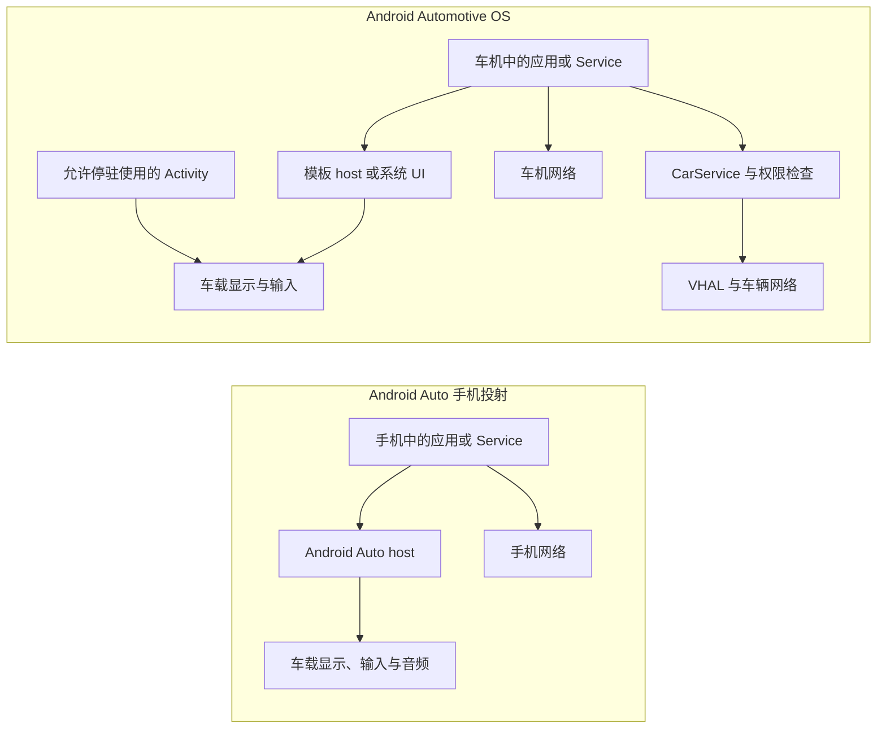

# Android Auto 与 Android Automotive OS 性能优化

Android Auto 和 Android Automotive OS（AAOS）都能在车载屏幕上提供应用体验，但执行位置、界面生成、网络归属和电源生命周期不同。性能分析若没有先区分平台，容易把手机投射延迟归到车机应用，或把 AAOS 的车辆接口套到 Android Auto 客户端。

本文按 Android 17 / API 37 / `android-17.0.0_r1` 与内核标签 `android17-6.18-2026-06_r6` 核对 AAOS 系统侧。Android Auto 场景中，该内核标签只能描述运行手机客户端的一端；车机投射接收端使用什么操作系统和内核，取决于具体产品，普通应用无法检查或控制。

## 两种平台，三种 UI 责任

### Android Auto：应用与 host 在手机，体验投向车端

Android Auto 平台运行在手机上，并把体验投射到兼容车机。Car App Library 是用于构建车载模板应用的 Jetpack 库；它所说的 host（宿主）由手机上的 Android Auto 实现，负责发现应用、管理生命周期，并把应用返回的 `Template` 数据转换成符合驾驶限制的界面。车机是显示、输入和音频端点。

媒体应用还可通过 `MediaBrowserService` 或 Media3 的 `MediaLibraryService` 暴露内容，并通过 `MediaSession` 提供播放状态和控制。应用不拥有 Android Auto 的 USB、Wi-Fi 或蓝牙投射协议，也不能接管车机接收端的重连算法。它能优化的是自己的会话恢复、模板生成、业务网络、地图 Surface 和媒体处理流程。

### AAOS：应用安装在车机

AAOS 是直接运行在车载硬件上的 Android 系统。应用进程、存储、网络和系统服务都位于车辆端。Car App Library 的 host 在这里是车机中的系统应用。模板应用向 host 提供界面模型；导航、POI（Point of Interest，兴趣点）、天气等允许绘图的类别可以取得 host 提供的 `Surface` 来绘制地图。AAOS 上允许停驻使用的 Activity 采用常规 Android 渲染路径。

AAOS 还包含 CarService、VHAL、CarWatchdog 和车辆电源状态机。CarService 是车载系统服务入口；VHAL（Vehicle Hardware Abstraction Layer，车辆硬件抽象层）把车辆网络能力表示为属性；CarWatchdog 监测进程健康与闪存写入。它们会影响启动、休眠、I/O 和车辆属性访问，但多数控制接口受签名或特权权限保护。

下面的图用于定位应用进程、host、网络和车辆接口。Android Auto 子图中的 host 位于手机，末端节点才代表车机显示、输入与音频。



模板应用的模型构建发生在客户端进程，布局和控件绘制发生在 host。地图 Surface 与停驻 Activity 由应用提交图形内容。UI 指用户界面；定位卡顿时，应先确定问题属于模板模型、host 绘制、投射传输，还是应用自己的 Surface。

## Android 17 不是唯一版本轴

车载应用至少要记录四类版本：

| 版本轴 | 决定什么 | 调试时怎样记录 |
|---|---|---|
| Android SDK API level | Framework 行为、权限和平台 API | 手机或车机的 SDK、软件构建指纹（build fingerprint） |
| Car App API level | host 与客户端之间可用的模板和 Car App 服务能力 | 应用清单（manifest）的 `minCarApiLevel`、运行时 host 支持 |
| `androidx.car.app` 版本 | 客户端库 API 与兼容修复 | Gradle 依赖版本和发布说明（release notes） |
| host / 整车厂（OEM）软件版本 | 模板渲染、输入、投射和车辆集成 | Android Auto/host 版本、车机软件版本 |

Android 17 不会自动开启某个 Car App Library 模板，Jetpack 库升级也不会改变旧 host 的能力。产品代码应查询 host 能力和内容限制。当前文档还区分发布阶段：Car App Library 媒体体验在 Android 17 及更高版本 AAOS 上获得完整支持，在 Android Auto 上仍受早期访问与测试轨道限制；停驻游戏等类别也有各自的平台与发布轨道要求。不能只用 Android API level 推断类别可用性。

## 模板应用的性能重点

### 冷启动路径

典型模板应用要经过 `CarAppService` 绑定、`Session` 创建、首个 `Screen` 创建和 `Screen.onGetTemplate()` 返回。`Screen` 是管理一页模板及其生命周期的对象；host 只有拿到首个合法模板后才能呈现内容。

`onGetTemplate()` 是同步取模接口。不要在回调中等待网络、数据库迁移、图片解码或路线计算。更稳妥的结构是：

1. 进程启动时恢复一份小而完整的本地快照；
2. `onGetTemplate()` 只读取不可变界面状态（view state）并构建模板；
3. 网络和磁盘工作在后台执行；
4. 新状态就绪后在主线程调用 `Screen.invalidate()`；
5. 页面销毁或 host 断开时取消无用请求。

`invalidate()` 只请求 host 再次调用 `onGetTemplate()`，应从主线程调用。它发出一次刷新请求后，在新模板返回前继续调用不会产生新请求。host 还会限制车屏更新频率；短时间内返回多个模板时，车屏可能只显示末次结果。因此不能把 `invalidate()` 当成动画时钟，也不应为每个网络分片刷新界面。

### 模板配额和内容限制

host 会限制一个任务中的模板步数，最多显示五个模板。配额计算的是 Template 数量，不是 `Screen` 实例数；同类内容刷新、返回上一级（back）和结束一项任务后重置（reset）各有专门规则。耗尽配额后继续发送新模板，host 可以显示错误并关闭应用。

不同车辆允许展示的条目数量也不同。下面的代码用于按 host 的网格限制裁剪业务数据。

```kotlin
val constraints = carContext.getCarService(ConstraintManager::class.java)
val gridLimit = constraints.getContentLimit(
    ConstraintManager.CONTENT_LIMIT_TYPE_GRID
)
val visibleItems = items.take(gridLimit)
```

`ConstraintManager` 返回 host 设定的内容上限，客户端不能修改。按运行时上限准备模型，比按某个车机分辨率或品牌维护固定列表更可靠；分页和“更多”操作也要服从对应模板的驾驶限制。

### 模板生成应测什么

模板 UI 由 host 绘制。FrameTimeline 是 Android 记录应用帧生命周期与延迟的工具，但客户端进程中的 FrameTimeline 覆盖不到 host 的完整绘制和车端显示。客户端仍应记录：

- service 绑定到首个模板返回的时间；
- 每次 `onGetTemplate()` 的执行时间分布；
- 界面状态版本、模板类型、条目数和图片数量；
- `invalidate()` 请求到下一次模板返回的间隔；
- host 断开后会话和首屏恢复时间。

车屏端到端延迟还包含 IPC（进程间通信）、投射链路、host 更新限制、布局绘制和显示扫描。trace 是带时间戳的执行事件记录；没有车端 trace 时，可用高速摄像和可识别的输入/画面标记测量触摸到可见反馈。

## 导航与地图 Surface

### Surface 生命周期

导航、POI 和天气类模板取得地图 Surface 前，要声明相应模板权限以及 `androidx.car.app.ACCESS_SURFACE`。应用通过 `AppManager.setSurfaceCallback()` 接收 `onSurfaceAvailable()` 与 `onSurfaceDestroyed()`。

每次 `onSurfaceAvailable()` 都要以 `SurfaceContainer` 提供的宽、高、DPI（每英寸像素数）和 `Surface` 为准。尺寸或 DPI 变化时，即使底层 Surface 尚未销毁，也可能再次收到该回调。每个收到的 `Surface` 实例都必须调用 `release()`；`onSurfaceDestroyed()` 到达后要停止提交帧，并释放实现中创建的 `VirtualDisplay`（虚拟显示）、`Presentation`（显示内容容器）、EGL 图形接口关联的绘图表面、图形缓冲区和地图引擎引用。

投射断开、host 重建、昼夜模式或配置变化都可能改变 Surface。host 还会通过 `onVisibleAreaChanged()` 告知当前保证无遮挡的 visible area，并通过 `onStableAreaChanged()` 给出考虑动态遮挡后长期稳定的最小区域。当前必须可见的重要内容应位于 visible area；不希望随 host 控件显隐移动的持续内容应位于 stable area。固定安全边距会在超宽屏、远端屏和不同旋转输入布局上出错。

### 地图渲染预算

地图 Surface 才有应用可控的持续帧处理流程。这里的帧预算指生成并提交一帧画面可用的时间。优化时分开观察：

- 路线和定位状态更新；
- 地图瓦片（按区域切分的小块地图数据）请求、缓存命中与磁盘读取；
- 矢量解析、文字标签排布（label placement）和图标纹理集（atlas）；
- RenderThread、GPU（图形处理器）提交与 BufferQueue；
- host 覆盖层（overlay）与显示呈现。

RenderThread 是 Android 提交绘制命令的专用线程，BufferQueue 在图形生产者和显示消费者之间传递缓冲区。路线计算、瓦片解码和图标生成不应阻塞渲染线程。快速拖动时可以取消已经离开当前地图范围的请求，合并重复瓦片，限制正在解码的任务数，并复用图形资源。热压力较高或 GPU 可用性能余量（headroom）不足时，可以减少非导航覆盖物、阴影和预取范围；路线、下一转向和安全相关提示仍要保持可读。

不能把地图刷新率固定为 60 Hz。Surface 尺寸、host 显示模式和车辆产品配置会改变每帧可用时间。以设备报告和 trace 为准，并分别记录平均帧率、jank（迟到或丢失的帧）、帧呈现时间与功耗。

### 导航状态和语音

Car App Library 导航应用通过 `NavigationManager` 更新 `Trip`、`TravelEstimate` 和逐向导航状态；host 也可能调用 `onStopNavigation()`。应用应持久记录路线会话是否活跃，不能只依赖当前 `Screen` 是否存在。

导航语音需要请求 audio focus（音频焦点，决定多个声音如何协调），并使用 `AudioAttributes.USAGE_ASSISTANCE_NAVIGATION_GUIDANCE`。官方建议的短时焦点类型是 `AUDIOFOCUS_GAIN_TRANSIENT_MAY_DUCK`，允许其他媒体暂时降低音量；duck 就是这类自动压低音量。语音生成、媒体降音量和播放完成事件要带会话 ID，避免重算路线后播出旧指令。

定位请求频率应服务于导航精度和路线匹配，不能长期使用设备最高采样率。GNSS 是卫星定位系统；记录定位时间戳、精度、速度、路线匹配耗时和渲染使用的位置版本，才能区分定位波动、路线计算慢和画面更新慢。

## 媒体应用

媒体浏览和播放应围绕 `MediaBrowserService` 或 Media3 的 `MediaLibraryService` 与 `MediaSession` 组织。内容浏览树（browse tree）是供 host 分层浏览的目录；MediaSession 提供播放状态、队列、元数据（metadata，例如标题和封面）以及播放、暂停、跳转等控制。Car App Library 媒体体验仍需按 host 能力和发布要求保留这些组件或兼容路径。

性能工作可以分为四块：

- **浏览树**：根节点和常用分类从本地索引快速返回；远端结果分页加载，错误状态可恢复。
- **图片**：封面按 host 所需尺寸解码，设置内存和磁盘缓存上限，避免为每个条目保存一份原图。
- **播放状态**：播放器状态先写入 `MediaSession`，UI 作为状态的消费者；host 重连后可立即拿到当前队列和位置。
- **音频**：正确处理音频焦点、自动降音量（duck）、蓝牙或车载输出变化，以及 `ACTION_AUDIO_BECOMING_NOISY`（音频输出设备断开）事件；不要在 UI 线程准备解码器或等待 DRM（数字版权管理）与网络响应。

车载扬声器端到端时延还包含 Android 音频栈、AAOS CarAudioService 或 Android Auto host、DSP（数字信号处理器）和车辆放大器。应用 trace 只能覆盖其中一段。测量时分段记录命令接收、播放器状态变化、首个音频缓冲区和车内声学输出。

视频、游戏和浏览器等停驻体验要按当前平台支持、车辆停驻状态和发布轨道处理。当前文档中，视频与浏览器主要面向 AAOS，停驻游戏可面向 Android Auto 与 AAOS，但部分能力仍处于受限测试阶段。普通媒体应用不能因为屏幕尺寸足够就允许行驶中播放视频。

## 网络与断线恢复

### 区分投射连接和业务网络

Android Auto 的投射传输由手机上的 Android Auto 与车机接收端管理。客户端的业务请求通常使用手机网络，通过 `ConnectivityManager` 观察网络是否可用、是否按流量计费。AAOS 应用使用车机网络，可能来自蜂窝、Wi-Fi、以太网或厂商网关。

应用不应通过私有 Wi-Fi 或蓝牙操作重建 Android Auto 连接。它要处理的是 host 会话生命周期和标准网络变化。两者可能独立发生：投射仍在但业务网络断开，或业务网络可用但 host 已离开。

### 可恢复的数据管线

导航和媒体的网络层应具备以下属性：

- 请求可取消，切换路线、账号或 Screen 后不会把旧结果写回新状态；
- 分页和下载可续传，每次失败后逐步延长重试等待时间，并加入少量随机量以避免大量客户端同时重试；
- 缓存条目带版本、过期时间和校验值，以便发现不完整或损坏的数据；
- 写入采用事务或临时文件，成功后再替换正式文件，避免进程死亡留下半成品；
- 大文件下载服从网络计费、存储余量和 AAOS power policy；
- 离线状态也返回一个合法模板，`onGetTemplate()` 不等待网络。

AAOS power policy（电源策略）可以按车辆状态关闭网络、显示、音频或定位等组件。Android Auto 和 AAOS 的账号状态同步宜以服务端版本号或只增不减的修订号（revision）为准。播放、收藏、路线目的地等命令应设计成幂等操作，即同一请求重复执行也不会产生额外副作用。不能把一条永久存活的手机到车机 socket（网络连接）当作业务状态的唯一来源。

## AAOS 资源与电源边界

### CarWatchdog 与磁盘写入

AAOS CarWatchdog 通过内核 `/proc/uid_io/stats` 暴露的 per-UID（按应用身份）I/O（磁盘读写）统计，跟踪应用和服务的磁盘写入。写入量从每个 UTC（协调世界时）自然日开始累计，跨同一天内的多次车辆启动保留。第三方应用反复超过配置阈值时，可以被设为 `COMPONENT_ENABLED_STATE_DISABLED_UNTIL_USED`，即停用到用户再次启动或手动启用。地图和媒体类别可以有较高的独立阈值，具体数值及处理动作由系统和厂商配置共同决定。

`CarWatchdogManager.getResourceOveruseStats(resourceFlag, maxStatsPeriod)` 可以查询调用包当前一天或过去最多 30 天的资源超限统计。`addResourceOveruseListener(executor, resourceFlag, listener)` 为调用包注册监听器；I/O 写入达到阈值的约 80% 或 100% 时，监听器可收到接近超限或已经超限的通知。地图应用应特别检查：

- 瓦片和路线缓存是否反复覆盖同一文件；
- SQLite WAL（预写日志）执行 checkpoint（把日志内容合并回主数据库）的频率与日志保留；
- 图片转码和临时文件是否重复生成；
- 离线包解压是否可复用；
- 每次位置更新是否触发持久化。

写放大指底层实际写入量大于业务数据量。减少反复改写和无效淘汰，通常比单纯扩大缓存更有效。应同时记录逻辑下载字节、文件系统写入字节、缓存命中率和淘汰量。

### 车辆电源状态

AAOS 的 `CarPowerManagementService`（CPMS）与 VHAL 协调启动（On）、关机准备（Shutdown Prepare）、内存挂起（Suspend-to-RAM，CPU 停止执行而内存继续供电）、磁盘休眠（Suspend-to-Disk，内存写入非易失存储后断电）和关机等状态。`CarPowerPolicyDaemon` 是集中管理电源策略的常驻后台进程，策略可以关闭显示、音频、定位、蓝牙或其他组件。

`CarPowerManager` 的多项状态与完成回调属于仅面向系统组件的受权限保护 System API。`setListenerWithCompletion()` 需要 `CONTROL_SHUTDOWN_PROCESS` 权限，普通第三方应用不能用它延长电源切换。应用要按常规 Android 生命周期持久化最小恢复状态，接受进程随时被终止，并在网络、位置或音频能力恢复后重建会话。

在 `android-17.0.0_r1` 中，`CarPowerStateListenerWithCompletion` 只会为允许等待完成的状态传入非空 `CompletablePowerStateChangeFuture`，其中包括 `STATE_SHUTDOWN_PREPARE`、`STATE_SUSPEND_ENTER` 和 `STATE_HIBERNATION_ENTER` 等状态。特权服务完成清理后应在 `getExpirationTime()` 给出的期限前调用 `complete()`；到期后系统仍会继续转换。挂起或关机准备阶段不应启动大规模同步与缓存整理。

### 热环境与充电

车内高温、阳光直射、无线投射、手机充电和持续导航可能同时增加热负载。测试至少覆盖冷车（车辆静置并降至环境温度）、热浸后启动（在高温环境静置到座舱和部件充分升温）、持续导航加充电、弱信号和昼夜模式切换。

应用可以结合 `PowerManager` 的温控状态与 thermal headroom（接近严重温控阈值的归一化指标）调整地图细节、预取、后台同步和动画。测试持续负载下温度趋于稳定的热稳态时，应保留原有散热条件；主动风冷只用于组件隔离实验，并与原机结果分开。

## VHAL、车辆属性与 ADAS

Android 17 的 VHAL 接口使用 AIDL（Android Interface Definition Language，用于定义跨进程接口）文件 `IVehicle.aidl`。VHAL 把车速、挡位、空调等车辆属性转换成 Android 侧的统一接口。应用通过 CarService 的 `CarPropertyManager` 读取这些属性，并接受相应的权限检查；普通应用不能绕过 CarService 直接向车内总线发送消息。

在 `android-17.0.0_r1` 中，旧的 `registerCallback()` 已弃用。设备开放相应功能开关时，新代码宜使用 `subscribePropertyEvents()`；需要兼容旧系统或未开放该接口的产品时，仍要保留旧订阅路径。连续属性的采样率是请求值，VHAL 不保证按精确频率回调。新接口默认启用可变更新率（variable update rate），数值没有变化时可以省略重复回调；只有业务需要固定频率样本时才关闭它。

同步 `getProperty()` 或各类型的同步读取方法可能耗时数秒，不能从主线程调用。一次读取多个属性时可以使用 `getPropertiesAsync()`，或在受控后台线程执行兼容路径。订阅回调未显式指定 `Executor`（负责调度回调任务的执行器）时，会使用创建 `Car` 时传入的事件线程；没有提供该线程时通常落到主线程。回调中只保存快照并投递后续任务，解析、聚合和网络上传放到有队列上限的线程池。单次回调数据量过大，或 OEM 自定义车辆属性更新过于频繁，都会挤占车辆属性通道。

Android Auto 客户端不能直接访问 AAOS VHAL。跨平台需要有限车辆信息时，应使用 Car App Library 对应的 Car Hardware API，并处理 host 不支持该能力或权限受限的情况。

ADAS（Advanced Driver Assistance Systems，高级驾驶辅助系统）和其他安全相关控制不应依赖普通应用的网络、模板或地图渲染时序。AAOS 通过 CarService 权限、SELinux 和 VHAL 过滤保护车辆系统；SELinux 会按进程身份与资源标签执行强制访问控制。车辆控制器还应具备独立的安全机制。信息娱乐应用可以显示经过授权的数据，但必须定义时间戳、过期判定和数据不可用状态，不能让界面上的陈旧数据参与车辆控制。

## 端到端诊断

### 分段定义延迟

同一个“点击后卡了”在两种平台上的阶段不同：

| 场景 | 建议拆分的时间段 |
|---|---|
| Android Auto 模板 | 车机输入传到手机 → 手机 host 调用应用 → 状态准备 → 模板返回 → host 生成车机界面 |
| AAOS 模板 | 车机输入 → host 调用应用 → 状态准备 → 模板返回 → host 绘制 |
| 地图 Surface | 输入或位置到达 → 路线或相机状态 → 提交渲染命令 → 图形缓冲区呈现 |
| 媒体控制 | host 命令 → MediaSession 回调 → 播放器状态 → 首个音频缓冲区 → 扬声器输出 |
| AAOS 启动/恢复 | 点火或系统恢复 → Android 系统可用 → 用户解锁或切换 → 应用会话 → 可用首屏 |

应用用 `Trace.beginSection()` 标记业务阶段和模板构建，网络层记录请求 ID 与状态版本，媒体层记录 MediaSession 命令与播放器事件。Android Auto 还要在手机与 DHU 或车机日志中记录同一个测试事件，或使用可对齐的单调时钟；单调时钟只向前递增，不受用户校时影响，适合计算阶段耗时。

### 工具选择

- **Android Auto**：先用 Desktop Head Unit（DHU，在电脑上模拟兼容车机的测试程序）验证连接、旋钮或触摸等输入和 host 行为，再到多款量产车机做只能从外部观察结果的黑盒延迟与断线实验。
- **AAOS**：用通用 Automotive Emulator 覆盖 API 和屏幕形态，用 OEM 系统镜像验证 CarService 与 VHAL 差异；GPU、音频、启动、休眠和高温表现仍需在量产硬件上测量。
- **Perfetto**：在应用所在设备采集 `sched`（线程调度）、Binder（进程间调用）、CPU 频率、FrameTimeline（帧生命周期）、SurfaceFlinger（系统合成显示服务）、网络和应用自定义轨道。模板 host 位于另一个设备或进程且无法采集时，在报告中标出观测缺口。
- **CarWatchdog / `dumpsys`**：在 AAOS 上检查资源超限、CarService、电源策略、VHAL 和音频状态。`dumpsys` 用于输出系统服务的当前状态；可用命令和字段会随产品构建版本变化，需要在目标车机上确认。
- **Car App Library 测试**：单元测试 `Screen` 返回栈、模板类型、配额流程，以及不同 host 能力下的分支。

模拟器和 DHU 适合重现逻辑与协议问题，不能代表量产车的 GPU、DSP、触控、无线干扰和散热。性能结论至少要在一台目标硬件上复核。

### 建议指标

不要只报平均值。对每项指标记录 p50、p95、p99、样本数和异常条件。p50 是中位数，p95 和 p99 分别表示 95% 和 99% 的样本不超过该值，能够暴露少量慢请求：

- 首个模板可用时间（time to first template）；
- `onGetTemplate()` 执行时间；
- 导航 Surface jank 与可见区域变更后的重绘时间；
- 网络断开到离线 UI、恢复到新鲜数据的时间；
- 媒体命令响应、首个音频缓冲区和 underrun（播放器来不及供给数据造成的音频断续）；
- AAOS 从系统恢复到导航或媒体可用的时间；
- 每个驾驶周期的磁盘写入和缓存命中率；
- 温控状态、温控余量与开始降低画质或任务频率的节点。

## 跨车机适配检查表

### 客户端工程师

- 区分 Android Auto、AAOS 模板和 AAOS Activity 三种执行/渲染模型；
- 首模板只依赖本地快照，后台更新完成后再 `invalidate()`；
- 查询 Car App API 级别、host 支持的能力和 `ConstraintManager` 约束；
- Surface 重建时释放旧资源，按稳定区域与当前可见区域布局地图内容；
- 分别维护投射会话、业务网络和账号状态，避免其中一项变化时误置另外两项；
- 处理进程死亡、会话重建、离线、受限权限和不支持能力。

### AAOS 平台与 OEM 工程师

- 为模板 host、CarService、VHAL、音频服务和电源状态提供可对齐的性能轨迹；
- 验证启动、系统恢复、用户切换和关机准备阶段的超时预算；
- 配置并监控 CarWatchdog I/O，避免系统服务和地图缓存争抢闪存；
- 对车辆属性设置权限、更新率和单次回调数据量上限；
- 在车辆规定的工作温度范围、弱信号、多显示屏、多乘员区域和真实音频 DSP 上测试；乘员区域用于区分驾驶员与各座位能访问的显示和音频资源；
- 隔离安全相关控制与信息娱乐应用，使后者崩溃或阻塞时不会影响车辆控制。

## 结语

Android Auto 的主要性能边界位于手机客户端、投射 host 和车端呈现之间；AAOS 的边界还包含车机 SoC（集成 CPU、GPU 等部件的主芯片）、CarService、VHAL、CarWatchdog 和车辆电源状态。模板应用负责快速提供稳定模型，host 负责生成符合驾驶限制的 UI；导航地图 Surface 和停驻 Activity 才进入应用自己的持续渲染流程。

车载性能优化应从责任边界和可观测范围开始。记录 Android、Car App、Jetpack 与 host 四类版本，按阶段测量模板、地图、网络、媒体和恢复路径，并为不支持、断线、休眠、热压力与进程死亡设计可恢复状态，结论才可跨车辆复查。

## 参考资料

### Android for Cars

- [Android for Cars 概览](https://developer.android.com/training/cars)
- [使用 Android for Cars App Library](https://developer.android.com/training/cars/apps/library)
- [Car App Library 术语与 host 模型](https://developer.android.com/training/cars/apps/library/glossary-concepts)
- [Android for Cars 最新变化](https://developer.android.com/training/cars/whats-new)
- [刷新 Template](https://developer.android.com/training/cars/apps/library/refresh-template)
- [Constraints API](https://developer.android.com/training/cars/apps/library/constraints-api)
- [Template restrictions](https://developer.android.com/training/cars/apps/library/template-restrictions)
- [Draw maps：Surface 与可见区域](https://developer.android.com/training/cars/apps/library/draw-maps)
- [构建导航应用](https://developer.android.com/training/cars/apps/navigation)
- [车载媒体应用](https://developer.android.com/training/cars/media)
- [Car app quality](https://developer.android.com/docs/quality-guidelines/car-app-quality)
- [Desktop Head Unit 测试](https://developer.android.com/training/cars/testing/dhu)
- [AAOS Emulator 测试](https://developer.android.com/training/cars/testing/emulator)

### AAOS 平台与 Android 17 源码

- [Android Automotive 与 Android Auto 的区别](https://source.android.com/docs/automotive/start/what_automotive)
- [VHAL 概览](https://source.android.com/docs/automotive/vhal)
- [车辆系统隔离](https://source.android.com/docs/automotive/security/vehicle_system_isolation)
- [CarWatchdog 系统健康监控](https://source.android.com/docs/automotive/watchdog/wd_system_health)
- [CarWatchdog 闪存写入监控](https://source.android.com/docs/automotive/watchdog/wd_flash_memory)
- [AAOS 电源管理](https://source.android.com/docs/automotive/power/power)
- [AAOS 电源策略](https://source.android.com/docs/automotive/power/power_policy)
- [AAOS 系统性能工具](https://source.android.com/docs/automotive/tools/sys-perf)
- [`CarPropertyManager.java`（android-17.0.0_r1）](https://android.googlesource.com/platform/packages/services/Car/+/android-17.0.0_r1/car-lib/src/android/car/hardware/property/CarPropertyManager.java)
- [`CarPowerManager.java`（android-17.0.0_r1）](https://android.googlesource.com/platform/packages/services/Car/+/android-17.0.0_r1/car-lib/src/android/car/hardware/power/CarPowerManager.java)
- [`CarWatchdogManager.java`（android-17.0.0_r1）](https://android.googlesource.com/platform/packages/services/Car/+/android-17.0.0_r1/car-lib/src/android/car/watchdog/CarWatchdogManager.java)
- [`CarWatchdogService.java`（android-17.0.0_r1）](https://android.googlesource.com/platform/packages/services/Car/+/android-17.0.0_r1/service/src/com/android/car/watchdog/CarWatchdogService.java)
- [`CarPowerManagementService.java`（android-17.0.0_r1）](https://android.googlesource.com/platform/packages/services/Car/+/android-17.0.0_r1/service/src/com/android/car/power/CarPowerManagementService.java)
- [`IVehicle.aidl`（android-17.0.0_r1）](https://android.googlesource.com/platform/hardware/interfaces/+/android-17.0.0_r1/automotive/vehicle/aidl/android/hardware/automotive/vehicle/IVehicle.aidl)
