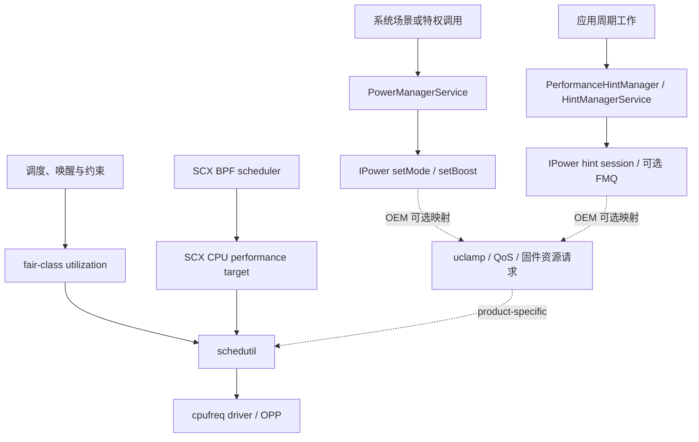

# SoC 功耗控制：Power HAL、schedutil 与厂商差异

同一款应用在三台旗舰机上出现不同的耗电、温升和稳态性能，原因通常不止 CPU 核心数量。系统软件会把帧预算、交互、相机、音频等工作负载信息送给厂商实现，内核再结合调度负载、频率约束、温控上限和固件决策控制硬件。SoC 型号、整机散热、屏幕、基带、厂商参数及应用行为都会改变结果。

平台锚点为 Android 17 / API 37 / `android-17.0.0_r1`，内核锚点为 `android17-6.18-2026-06_r6`。讨论厂商差异时只采用公开源码能够证明的范围。闭源 Power HAL、固件和量产机参数无法从通用内核驱动反推出调用关系，因此相应内容会标明验证边界。

## 先分清四层控制面

功耗问题适合按四层排查。若把四层混在一起，应用接口、HAL hint、内核 governor 和硬件电源控制器很容易被描述成一条固定调用链。

| 层次 | 典型接口或组件 | 谁能直接使用 | 可确认的职责 |
|---|---|---|---|
| 应用层 | `PerformanceHintManager`、`PowerManager`、`SystemHealthManager` | 普通应用，受 API 版本和设备能力约束 | 报告周期工作、读取省电与热状态、读取可选的资源余量和能耗监视器 |
| Framework / HAL 层 | `PowerManagerService`、HintManager、`android.hardware.power.IPower` | 系统进程与厂商服务 | 把系统状态、短时 boost 和 hint session 交给厂商实现 |
| 内核层 | 调度器、`schedutil`、cpufreq/devfreq、cpuidle、thermal | 内核及特权调试工具 | 根据负载和约束选择任务位置、性能级别与空闲状态 |
| 固件 / 硬件层 | 电源控制器、DVFS 控制器、PMIC、片上热传感器 | 厂商固件与驱动 | 执行电压、时钟、电源域和保护动作 |

这四层之间是反馈关系，设备也可以省略某项能力。例如，`IPower.aidl` 明确允许平台忽略某个 `Mode` 或 `Boost`；Framework 应先通过 `isModeSupported()`、`isBoostSupported()` 查询支持情况。看到 AIDL 枚举存在，只能证明接口契约存在。

## Android 17 的 Power AIDL 契约

`android-17.0.0_r1` 冻结的 `android.hardware.power` AIDL 是 v7。`Mode.aidl` 定义 19 个持续状态，包括 `LOW_POWER`、`SUSTAINED_PERFORMANCE`、`LAUNCH`、`GAME` 与多档相机流模式；`Boost.aidl` 定义 6 个短时提示，包括 `INTERACTION`、`DISPLAY_UPDATE_IMMINENT`、`ML_ACC`、音频和相机提示。

`IPower` 还定义 hint session、FMQ session channel、CPU/GPU headroom、合成数据反馈等接口。版本沿革需要准确区分：CPU/GPU headroom、`SupportInfo`、`sendCompositionData()` 和 `sendCompositionUpdate()` 已出现在冻结的 v6 接口中，不能写成 Android 17 才加入。Android 17 的 v7 契约继续保留这些能力。

`IPower.setMode()` 与 `setBoost()` 属于 Framework 到 vendor HAL 的接口，不是普通应用 SDK。应用可以调用 `PowerManager.isPowerSaveMode()` 读取省电模式，也可以动态注册 `ACTION_POWER_SAVE_MODE_CHANGED` 后调整自己的同步、动画和预取策略。`setPowerSaveModeEnabled()` 是隐藏的 `@SystemApi`，还要求 `DEVICE_POWER` 或 `POWER_SAVER` 权限，普通应用不应把它当作控制入口。

厂商 Power HAL 收到 hint 后可以调整 CPU、GPU、内存总线或空闲策略，也可以按本机策略忽略它。由此不能推出固定映射，例如“`LAUNCH` 一定调用 RPMh”或“`GAME` 一定锁定某档 GPU 频率”。这类结论需要目标设备的 HAL 源码、厂商 trace marker 或寄存器级证据。

### Mode/Boost 与 Hint Session 是两条入口

`Mode` 和 `Boost` 由系统场景或特权调用触发。`PowerManagerService` 中的交互、亮灭屏、Device Idle 等事件进入 `setPowerModeInternal()` 或 `setPowerBoostInternal()`；Binder 对外暴露的相应方法要求 `DEVICE_POWER` 权限。例如 `LAUNCH` 在省电策略禁止启动 boost 时会先被 framework 过滤：

```java
private boolean setPowerModeInternal(int mode, boolean enabled) {
    if (mode == Mode.LAUNCH && enabled && mBatterySaverStateMachine != null
            && mBatterySaverStateMachine.getBatterySaverController()
                    .isLaunchBoostDisabled()) {
        return false;
    }
    return mNativeWrapper.nativeSetPowerMode(mode, enabled);
}
```

native 侧依次经过 `PowerManagerService` JNI、`PowerHalController`、`PowerHalLoader` 和 `AidlHalWrapper`。wrapper 会缓存 mode/boost 支持查询，连接失效后让后续调用尝试重连。Android 17 仍保留 HIDL wrapper 作为旧实现兼容路径，量产机应根据实际连接而不是平台版本判断 IPC 形态。

普通应用的 `PerformanceHintManager` 则进入 `HintManagerService`，系统端校验 UID、TGID、TID、进程状态和会话生命周期，再交给 `IPowerHintSession`。Android 17 的 AIDL v7 支持 `createHintSessionWithConfig()`；v5 起还可通过可选 FMQ channel 降低高频报告的 Binder 往返。FMQ 不可用时仍要回退到 Binder 会话路径。



实线是 Android 17 可验证的标准接口，虚线是厂商可选映射。AOSP 没有定义 Power HAL 直接调用 SCX BPF helper 的通用路径。

## Android 17 内核中的频率决策

Android 17 内核锚点 `android17-6.18-2026-06_r6` 中，`schedutil` 的 `sugov_get_util()` 已接入 `sched_ext` 的 CPU 性能目标。下面的节选用于说明 CFS 与 SCX 共同参与时的计算入口。

```c
unsigned long min, max, util = scx_cpuperf_target(sg_cpu->cpu);

if (!scx_switched_all())
    util += cpu_util_cfs_boost(sg_cpu->cpu);
```

SCX BPF scheduler 通过 `scx_bpf_cpuperf_set(cpu, perf)` 写入相对于该 CPU 最大性能的线性目标，范围为 `[0, SCX_CPUPERF_ONE]`，并触发 `cpufreq_update_util()`。这不是 kHz 或 OPP 序号；CPU 分组、policy、OPP、驱动、频率上下限和 thermal 仍会改变最终结果。SCX 启用过程中先把每 CPU target 初始化为 `SCX_CPUPERF_ONE`，运行后再由 BPF 策略更新。

三种运行状态应分开解释：

| SCX 状态 | SCX target | fair-class 利用率 | `schedutil` 输入 |
| --- | ---: | ---: | --- |
| 未启用 | 0 | 加入 | fair-class 利用率及后续约束 |
| partial switch | BPF 目标 | 加入 | SCX target 与 fair-class 利用率之和，再应用约束 |
| full switch | BPF 目标 | 不加入 | SCX target，再应用 iowait、uclamp 等约束 |

因此，把 fair class 描述为仅在 SCX 缺失时启用的备用路径，会漏掉 partial switch。

频率更新节奏也没有跨设备固定为 10 ms。`sugov_should_update_freq()` 先检查 policy 更新资格和 limits 变化，普通更新再受 `freq_update_delay_ns` 约束，初值来自 `cpufreq_policy_transition_delay_us(policy)`。`get_next_freq()` 经 `map_util_freq()` 或 vendor hook 给出原始频率，再由 `cpufreq_driver_resolve_freq()` 解析成驱动支持的档位。支持 fast switch 时直接更新，否则排队进入 deferred path。共享 policy 还会在 policy 内多个 CPU 之间取处理后的最大利用率，给某个 CPU 写 target 不等于硬件只改它的频率。

以下几项不能按 SoC 品牌直接假设：

- `schedutil` 是否为量产配置中的 governor；
- cpufreq policy 如何划分，是否支持 per-core DVFS；
- cpuidle 使用 `menu`、`teo` 还是厂商策略；
- OPP 表、热限频和总功耗预算的取值；
- SCX 调度器是否启用，以及接管了哪些调度类。

排查目标机时，应读取 governor、policy、频率表、idle state 和 thermal zone 的运行态，再结合内核配置与设备树解释 trace。只看通用内核源码不足以还原产品配置。

### Android vendor hook 和异常恢复

`android17-6.18-2026-06_r6/include/trace/hooks/sched.h` 中名称含 `android_vh_scx_` 的 hook 声明共 11 个，覆盖启用状态、异常退出、CPU 可运行性、迁移、入队、slice 和调度类切换修正。它们是 GKI vendor module 扩展点，不是 Power HAL 到 SCX 的标准协议，数量和签名也属于具体 tag。

SCX 遇到 BPF 错误、runnable task stall 或 `SysRq-S` 时会终止调度器并把任务交回 fair class；`SysRq-D` 只触发 dump。退出后 `scx_cpuperf_target()` 返回 0，`scx_switched_all()` 为 false，下次 `schedutil` 更新会重新加入 fair-class 利用率。OEM 在 SCX 之外保留的 boost、uclamp 或固件状态仍需要自己设计超时和清理。Power HAL 服务死亡后的 wrapper 重连与 SCX 退出是两条独立恢复路径。

## 三类厂商公开驱动能证明什么

公开内核树提供了厂商硬件的驱动积木。它能说明某类控制器怎样接入 Linux，也能约束文章的表述范围；量产手机的 vendor module、Power HAL 和固件往往还有额外实现。

### Qualcomm：RPMh 与硬件 cpufreq

Android 17 内核树中的 `drivers/soc/qcom/rpmh.c` 和 `qcom-rpmh-rsc.c` 实现 RPMh/RSC 的内核消息通道。`rpmh_write()`、`rpmh_write_async()` 与 batch API 可以把资源命令送入控制器。该证据支持“Linux 驱动可通过 RPMh 请求资源状态”，不支持“用户空间 Power HAL 直接调用某个内核函数”。

`drivers/cpufreq/qcom-cpufreq-hw.c` 则展示一条硬件 cpufreq 路径：

- 驱动从最多 40 项的硬件 LUT 构建频率表；
- 某些 compatible data 支持 `per_core_dcvs`；
- OPP 与 interconnect 路径可以协同更新；
- 驱动是否具备这些能力取决于 compatible、设备树和硬件版本。

所以，`RPMh`、`DCVS` 和 `Perflock` 不能互换使用。RPMh 是资源请求基础设施，cpufreq-hw 是 CPU 频率驱动路径，Perflock 通常指厂商性能服务及其私有资源表。某次频率上升可能来自调度负载、thermal/qos 约束变化、HAL hint 或厂商服务。若 trace 没有对应 marker，不要仅凭“多个核心同时升频”把事件标为 Perflock。

### MediaTek：软件调压与硬件 LUT 两条路径

Android 17 内核树同时保留 `mediatek-cpufreq.c` 和 `mediatek-cpufreq-hw.c`，两者展示不同硬件代际或平台的实现方式。

`mediatek-cpufreq.c` 会协调 Vproc、可选的 Vsram regulator、CPU clock 与 PLL。升频和降频阶段要按电压约束安排顺序，切换 PLL 时还会使用稳定的中间时钟。`mediatek-cpufreq-hw.c` 从最多 32 项的硬件 LUT 建表，并包含 Energy Model 注册和 hybrid DVFS 变体支持。

这些源码可以证明 MediaTek 平台存在多种 cpufreq 实现，无法证明所有 Dimensity 产品都使用同一个“硬件预测器”，也无法证明 Power HAL 固定经过名为 `mtlp`、`hw_flower` 的用户空间或固件路径。CorePilot 是厂商品牌名；task packing、核心选择和 boost 策略需要目标内核或 trace 证据，不能从品牌名推导。

### Samsung：ASV 和 TMU 的公开边界

公开内核中的 `drivers/soc/samsung/exynos-asv.c` 会读取 ASV 信息、调整 CPU OPP 电压，并在 OPP 更新后刷新 Energy Model 的 chip binning。不过，该文件当前公开实现明确落在 Exynos 5422 支持范围。它能说明 ASV 的一类 Linux 实现，不能据此量化新款 Exynos 或 Xclipse 设备之间的功耗差异。

`drivers/thermal/samsung/exynos_tmu.c` 是 Exynos TMU 热传感器驱动，负责温度读取、阈值、中断和校准等基础工作。它的存在也不能证明量产设备采用某套固定温控策略，更不能证明 ASV 会随温度持续修改 OPP 电压。

Xclipse GPU 的 DVFS、固件和产品策略要以相应设备的公开驱动、vendor source 或测量数据为准。仅凭 `exynos_tmu.c` 和旧款 ASV 支持，无法推出 SurfaceFlinger、Power HAL 与 GPU 驱动之间的完整产品调用关系。

### 品牌不是实验变量

同一厂商的两个 SoC 可能使用不同 CPU 微架构、GPU、制程、DVFS 控制器和调度配置；同一 SoC 放入两种机身后，也会受散热结构、屏幕与固件参数影响。跨设备实验中，“Qualcomm 对 MediaTek”这类标签信息过少。记录表至少应包含：

- 手机型号、SoC、RAM 和软件 build fingerprint；
- Android 版本、内核版本及 governor；
- 分辨率、刷新率和校准后的屏幕亮度；
- 环境温度、起始电池温度、起始电量与充电状态；
- 无线网络制式、信号条件、SIM 与后台账号状态；
- 工作负载版本、输入数据、持续时间和重复次数。

## 应用侧可用的标准能力

应用很少需要知道某个 hint 在芯片内部怎样执行。可移植的做法是报告工作负载意图、读取系统压力，并在本进程内调整任务。

### 用 `PerformanceHintManager` 描述周期工作

`PerformanceHintManager` 从 API 31 提供公开接口，适合渲染、音视频等具有周期预算的长寿命线程。下面的 Kotlin 片段展示最小会话生命周期。

```kotlin
val manager = getSystemService(PerformanceHintManager::class.java)
val targetNs = 6_000_000L
val session = manager?.createHintSession(
    intArrayOf(Process.myTid()),
    targetNs
)

try {
    repeat(frameCount) {
        val startNs = SystemClock.uptimeNanos()
        renderOneFrame()
        val actualNs = SystemClock.uptimeNanos() - startNs
        session?.reportActualWorkDuration(actualNs)
    }
} finally {
    session?.close()
}
```

`frameCount` 和 `renderOneFrame()` 代表业务自己的周期循环。`createHintSession()` 接收 Linux TID 数组和正数目标时长，设备不支持 hint session 时可以返回 `null`。参与线程应长寿命且属于当前进程；每个周期都要报告工作时长，目标预算变化时再调用 `updateTargetWorkDuration()`。目标时长应取该线程组在整条管线中的工作预算，计时使用与 `SystemClock.uptimeNanos()` 一致的基准。

ADPF 提供反馈信号，不保证频率、核心或功耗结果。厂商实现会结合温控和整机预算处理这些报告。应用仍需完成常规优化，例如减少无效工作、控制并发和缩短持锁区间。

### 正确解释 thermal headroom

`PowerManager.getThermalHeadroom(forecastSeconds)` 返回非负的归一化热包络使用量，参数范围为 0 到 60 秒。`1.0` 表示到达 `THERMAL_STATUS_SEVERE` 阈值，返回值可以超过 `1.0`；`0.0` 不对应某个温度或 thermal status。该值没有摄氏度单位。

接口可能返回 `NaN`，包括设备不支持、采样尚未稳定或调用过快等情况。AOSP 文档指出慢变化传感器约一秒更新一次，更高频轮询没有收益。应用可以把 headroom 与 `getCurrentThermalStatus()` 一起用于降画质、减小批量任务或延后预取。

API 36 增加 thermal headroom thresholds 和变更监听能力。阈值由设备定义，旧设备的传感器和阈值模型也可能不同。跨机比较原始 headroom 数字时要保留这项限制。

### CPU/GPU headroom 的含义

API 36 起，`SystemHealthManager` 提供可选的 `getCpuHeadroom()` 与 `getGpuHeadroom()`。有效结果范围为 `[0, 100]`，其中 `0` 表示没有更多对应资源可分配；暂不可用时会返回 `Float.NaN`，设备不支持时会抛出 `UnsupportedOperationException`。

这两个调用至少包含一次同步 Binder 事务，可能超过 1 ms，初次或自定义参数调用还可能更慢。因此不要在渲染、音频或其他时限敏感线程上等待结果。轮询间隔和计算窗口由设备报告，应用应查询：

- `getCpuHeadroomMinIntervalMillis()` / `getGpuHeadroomMinIntervalMillis()`；
- `getCpuHeadroomCalculationWindowRange()` / `getGpuHeadroomCalculationWindowRange()`。

CPU 参数可指定属于本进程的 TID，这些线程还必须具有相同 affinity。接口契约没有固定的 100 ms 轮询间隔，也没有承诺某家 SoC 的计算耗时。

### 不要从应用手工接管调度策略

普通应用不应依赖写 sysfs、厂商私有性能服务或隐藏 Power API。手工绑核、限制 GPU 最高频率、写 `schedtune` 节点都不是可移植的 SDK 方案，还可能破坏调度器和温控系统的联合决策。

若开发的是系统镜像、设备策略或游戏性能服务，绑核和 QoS 调整也应先完成目标设备实验，明确回滚条件，并在 OTA 后重新验证。Android 17 支持 `sched_ext` 不等于 `schedtune` 被一对一替换；两者的对象、接口和部署方式不同。

## 功耗测量：先明确物理量

“功耗”经常混用三类量：

- **功率**，单位 W，描述某个时刻或时间窗的能量消耗速率；
- **能量**，单位 J、Wh 或 uWs，适合比较一次任务完成所需成本；
- **电池电流**，单位 A 或 mA，必须结合电压、方向约定、采样位置和充电状态解释。

只比较任务期间的平均电流，容易把电压变化、充电路径和任务完成时间漏掉。对“完成同一任务谁更省电”的问题，优先比较任务总能量，同时给出耗时、温度、帧性能和置信区间。

### Perfetto 的 Android power 数据源

下面的配置用于采集电池计数器和设备可选的片上电源轨，字段名与 Perfetto 官方 Android power 数据源一致。

```textproto
data_sources {
  config {
    name: "android.power"
    android_power_config {
      battery_poll_ms: 250
      battery_counters: BATTERY_COUNTER_CAPACITY_PERCENT
      battery_counters: BATTERY_COUNTER_CHARGE
      battery_counters: BATTERY_COUNTER_CURRENT
      battery_counters: BATTERY_COUNTER_VOLTAGE
      collect_power_rails: true
    }
  }
}
```

`android.power` 的电池计数器受充电状态影响。USB 数据连接还可能保持额外唤醒条件，因此精密实验要记录供电和调试连接方式。`collect_power_rails` 依赖设备实现；没有 ODPM rail 的设备不会凭配置生成这些数据。

Linux/ChromeOS 文档中的 sysfs 数据源名是 `linux.sysfs_power`。当前官方配置说明中不存在 `linux.power.sysfs`。Android 功耗采集也不应凭空添加 `android.power.stats` 数据源名。

### PowerStats HAL 与公开 power monitor

Android 17 的 PowerStats AIDL 仍是冻结的 v2。它可以报告电源轨能量和 power entity 的状态驻留；组件支持是可选的，rail 名称、覆盖范围和采样属性也由设备决定。Statsd、Perfetto 与 Batterystats 可以消费这些数据。

API 35 起，普通应用可通过 `SystemHealthManager.getSupportedPowerMonitors()` 查询设备公开的 power monitor，再异步调用 `getPowerMonitorReadings()`。支持列表为空是合法结果。监视器可能来自原始 ODPM rail，也可能是模型估算的 energy consumer；分析时要保留 monitor 类型与名称。

ODPM rail 在电池输出的下游测量子系统能量，不受设备是否充电直接影响，但它不一定覆盖屏幕、射频或 PMIC 损耗。不同设备的 rail 名也没有统一可比含义。跨设备总功耗比较仍以校准过的外部功耗仪更稳妥，片上 rail 更适合做单机内部归因。

## 按控制链路做运行态排查

第一步是固定产品配置：build fingerprint、kernel release、`CONFIG_SCHED_CLASS_EXT`、governor、cpufreq policy 分组和当前 thermal 状态。编译进 SCX 不等于已加载 BPF scheduler，加载也不等于 full switch。

Android 17 可读的 sched_ext 状态分两层：

| 节点 | 含义 |
| --- | --- |
| `/sys/kernel/sched_ext/state` | `disabled`、`enabling`、`enabled` 或 `disabling` |
| `/sys/kernel/sched_ext/switch_all` | 当前是否接管全部符合条件的普通任务 |
| `/sys/kernel/sched_ext/nr_rejected` | 显式请求 `SCHED_EXT` 却被拒绝的累计数 |
| `/sys/kernel/sched_ext/enable_seq` | 本次开机成功启用 scheduler 的序列 |
| `/sys/kernel/sched_ext/root/ops` | 当前活动 BPF scheduler 名称 |
| `/sys/kernel/sched_ext/root/events` | 当前 tag 定义的 fallback、dispatch 和 bypass 计数 |

`root/` 只在活动 scheduler 对象存在时创建，采集脚本要允许缺失，也不能把 `events` 字段集当成跨 kernel tag 稳定 ABI。

然后按以下顺序缩小问题：

1. 确认 mode、boost 或 hint session 的发起方、权限、支持结果、持续时间与取消点。
2. 对齐 fair-class runnable、SCX policy、`switch_all`、产品公开的 `cpuperf_target`、iowait 和 uclamp。
3. 检查 governor 更新是否被 remote update、rate limit 或未变化目标挡住，再检查 policy min/max、thermal 与 driver table。
4. 把 driver 请求、实际频率、任务完成时间、帧性能、温度和能量放到同一时间轴。

一次可复查的 trace 至少覆盖 framework 场景与业务 marker、`sched_switch` / `sched_wakeup`、任务 policy 与 CPU 位置、SCX 和产品 trace、cpufreq limits/frequency、thermal 与 uclamp。`setMode()` 是 `oneway` AIDL 调用；没有 HAL marker 时应做启用/取消对照并观察约束变化，不能仅靠时间相邻建立因果。PowerStats 的 rail 或 residency 是结果观测支路，不参与 `schedutil` 选频，具体能力差异见 17.9。

## 一套可复现的实验流程

### 1. 定义问题和指标

先写清要回答的问题，例如“固定 60 Hz 时一次列表冷启动消耗多少能量”，或“20 分钟游戏后的稳态帧率和每帧能量怎样变化”。指标至少包括任务能量、任务耗时、帧性能和热状态。

### 2. 固定可控变量

屏幕亮度应按实测 nit 对齐，百分比刻度不可跨设备直接比较。分辨率、刷新率、色彩模式、网络、账号同步、定位、音量、工作负载数据、起始电量和起始温度都要记录。运行前等待温度回到预设窗口。

主动风冷会改变真实用户场景的热稳态。若目标是分离芯片计算成本，可以增设恒温或主动冷却组；若目标是评估手持设备持续性能，应保留原机散热条件。两组数据要分开报告。

### 3. 预热并随机化顺序

JIT、shader cache、文件缓存和网络缓存都会改变结果。冷启动与热启动应拆成不同实验。多设备轮测时随机化顺序，减少环境温度、服务器负载和电池状态随时间漂移带来的偏差。

### 4. 重复采样并报告分布

单次 benchmark 不能支持厂商级结论。每个条件重复多轮，保留原始数据，报告中位数、离散程度和置信区间。发生充电、thermal status 跨档、后台更新或网络异常的样本应按预先约定的规则处理。

### 5. 用 trace 解释差异

Perfetto 至少同时观察：

- `sched_switch` / `sched_wakeup` 与线程运行位置；
- CPU frequency、idle state 和 cpufreq policy；
- thermal counter 或 thermal status；
- app 自定义 slice、FrameTimeline 或业务阶段；
- 设备支持时的 battery counter 与 power rail。

频率升高和功率尖峰是相关证据，不能单独证明因果。可以对齐唤醒、runnable backlog、hint marker、频率、rail energy 和任务阶段，再用对照实验逐步缩小原因。没有厂商 marker 时，结论应写成“观察到的系统响应”，不要给闭源模块强行命名。

## 面向不同角色的检查表

### 应用工程师

- 使用公开 SDK 报告周期工作和读取系统压力；
- 对 `null`、`NaN`、不支持异常及设备差异做好兼容；
- 在应用内部减少工作量，避免依赖私有 boost、绑核和频率节点；
- 以任务总能量、用户体验和温度一起评估改动。

### Framework / OEM 工程师

- 在调用 `setMode()` / `setBoost()` 前检查 vendor 支持；
- 为每个 hint 定义启用、取消、超时和进程死亡后的清理行为；
- 验证 hint session 更新频率、FMQ 失败回退和 thermal budget；
- 用 trace marker 暴露可审计的策略阶段，避免把闭源行为变成调试盲区；
- 在 Android 17 与 `android17-6.18-2026-06_r6` 上重新验证 governor、SCX 和 cpufreq 驱动交互。

### 性能分析工程师

- 记录完整设备和实验环境，而非只记录 SoC 品牌；
- 区分电池计数器、片上 rail 和外部功耗仪的测量边界；
- 对比功耗时同时对齐工作量和完成时间；
- 把源码可证事实、目标机观测和推断分栏记录。

## 结语

Android 17 为各厂商提供同一套 Power AIDL 契约，厂商仍可按硬件、固件和整机目标选择实现方式。公开源码能够确认接口、通用调度逻辑和部分硬件驱动，却无法替代目标设备验证。

应用侧最稳妥的路径是使用 `PerformanceHintManager`、thermal/headroom 和 power monitor 等公开能力，并通过减少工作量改善能效。系统侧排查则要把 Framework hint、内核调度与频率、thermal 约束、固件响应分层观察。只有控制变量、记录测量边界并保留 trace 证据，跨 SoC 功耗结论才可复查。

## 参考资料

### Android 17 / AOSP

- [Power AIDL `IPower.aidl`（android-17.0.0_r1）](https://android.googlesource.com/platform/hardware/interfaces/+/android-17.0.0_r1/power/aidl/android/hardware/power/IPower.aidl)
- [PowerManagerService（android-17.0.0_r1）](https://android.googlesource.com/platform/frameworks/base/+/android-17.0.0_r1/services/core/java/com/android/server/power/PowerManagerService.java)
- [Power HAL controller（android-17.0.0_r1）](https://android.googlesource.com/platform/frameworks/native/+/android-17.0.0_r1/services/powermanager/PowerHalController.cpp)
- [HintManagerService（android-17.0.0_r1）](https://android.googlesource.com/platform/frameworks/base/+/android-17.0.0_r1/services/core/java/com/android/server/power/hint/HintManagerService.java)
- `hardware/interfaces/power/aidl/android/hardware/power/Mode.aidl`（19 个 Mode）
- `hardware/interfaces/power/aidl/android/hardware/power/Boost.aidl`（6 个 Boost）
- `hardware/interfaces/power/stats/aidl/`（PowerStats AIDL v2）
- [Android 17 kernel `cpufreq_schedutil.c`](https://android.googlesource.com/kernel/common/+/refs/tags/android17-6.18-2026-06_r6/kernel/sched/cpufreq_schedutil.c)
- [Android 17 `sched_ext` 核心实现](https://android.googlesource.com/kernel/common/+/refs/tags/android17-6.18-2026-06_r6/kernel/sched/ext.c)
- [Android 17 scheduler vendor hooks](https://android.googlesource.com/kernel/common/+/refs/tags/android17-6.18-2026-06_r6/include/trace/hooks/sched.h)
- `drivers/soc/qcom/rpmh.c`
- `drivers/soc/qcom/rpmh-rsc.c`
- `drivers/cpufreq/qcom-cpufreq-hw.c`
- `drivers/cpufreq/mediatek-cpufreq.c`
- `drivers/cpufreq/mediatek-cpufreq-hw.c`
- `drivers/soc/samsung/exynos-asv.c`
- `drivers/thermal/samsung/exynos_tmu.c`

### 官方文档

- [PerformanceHintManager API](https://developer.android.com/reference/android/os/PerformanceHintManager)
- [PowerManager API](https://developer.android.com/reference/android/os/PowerManager)
- [SystemHealthManager API](https://developer.android.com/reference/android/os/health/SystemHealthManager)
- [Perfetto：Battery counters and power rails](https://perfetto.dev/docs/data-sources/battery-counters)
- [AOSP：Power statistics HAL](https://source.android.com/docs/core/power/power-stats-hal)

### 交叉阅读

- §17.2 SoC 平台差异：CPU/GPU 硬件架构
- §17.4 sched_ext 与 OEM 调度实践
- §17.9 Android 17 Power Stats HAL 的 OEM 实现差异
- §5.4 DVFS 与功耗管理
- §5.6 Android 功耗管理
- §5.9 ADPF 自适应性能框架
