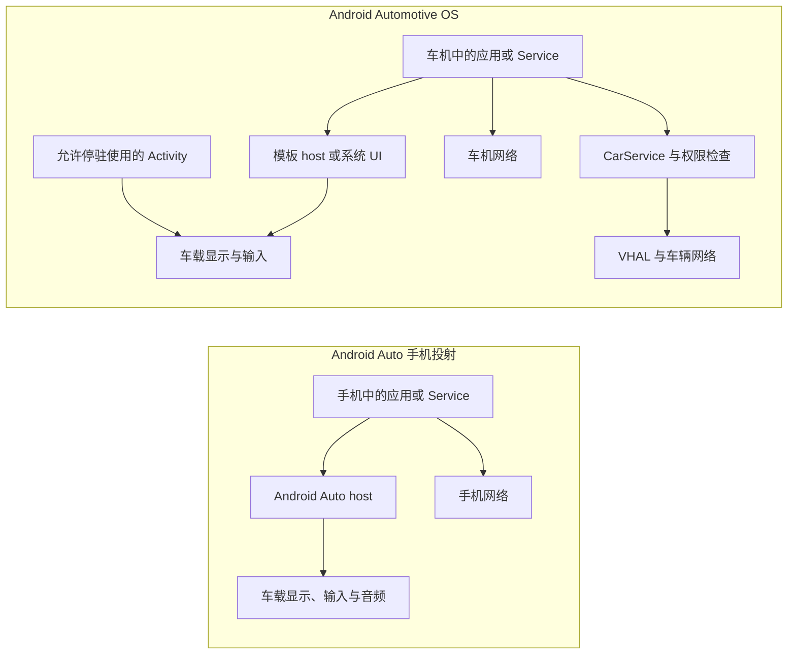

# Android Auto 与 Android Automotive OS 性能优化

Android Auto 和 Android Automotive OS（AAOS）面向同一块车载屏幕，执行位置、渲染责任、网络归属和电源生命周期却不同。性能分析若没有先区分平台，常会把手机投射延迟归到车机应用，或把 AAOS 的 Vehicle HAL 能力套到 Android Auto 客户端。

平台锚点是 Android 17 / API 37 / `android-17.0.0_r1`。AAOS 系统侧源码以该 tag 为准，内核侧以 `android17-6.18-2026-06_r6` 为准。Android Auto 场景中，这个内核锚点只能描述运行客户端的 Android 端点；车载 host 的操作系统和内核由车厂产品决定，普通应用无法检查或控制。

## 两种平台，三种 UI 责任

### Android Auto：应用在手机，host 在车端呈现

Android Auto 由手机提供应用和服务，兼容车机负责显示、输入和音频等 host 能力。使用 Car App Library 的应用返回 `Template` 数据，Android Auto host 根据车辆屏幕、输入方式和驾驶限制渲染界面。媒体应用则通过 `MediaBrowserService` 或 `MediaLibraryService` 暴露内容，并通过 `MediaSession` 提供播放状态和控制。

应用不拥有 Android Auto 的 USB、Wi-Fi 或蓝牙投射协议，也不能接管 host 的重连算法。应用可以优化的是自己的会话恢复、模板生成、业务网络、地图 Surface 和媒体管线。

### AAOS：应用安装在车机

AAOS 是运行在车载硬件上的 Android 系统。应用进程、存储、网络和系统服务都位于车辆端。使用 Car App Library 的模板应用仍由 host app 渲染 UI；导航、POI、天气等类别可以取得 host 提供的 `Surface` 绘制地图。允许停驻使用的 Activity 则采用常规 Android 渲染路径。

AAOS 还增加 CarService、VHAL、CarWatchdog 和车辆电源状态机。它们会影响启动、休眠、I/O 和车辆属性访问，但多数控制接口受签名或特权权限保护。

下面的图用于定位应用进程、host、网络和车辆接口。



模板应用的模型构建发生在客户端进程，布局和控件绘制发生在 host。地图 Surface 与停驻 Activity 由应用提交图形内容。定位卡顿时，先确定问题落在哪一种 UI 责任中。

## Android 17 不是唯一版本轴

车载应用至少要记录四类版本：

| 版本轴 | 决定什么 | 调试时怎样记录 |
|---|---|---|
| Android SDK API level | Framework 行为、权限和平台 API | 手机或车机的 SDK、build fingerprint |
| Car App API level | host 与客户端之间可用的模板和 car service 能力 | manifest 的 `minCarApiLevel`、运行时 host 支持 |
| `androidx.car.app` 版本 | 客户端库 API 与兼容修复 | Gradle 依赖和 release notes |
| host / OEM 软件版本 | 模板渲染、输入、投射和车辆集成 | Android Auto/host 版本、车机软件版本 |

Android 17 不会自动开启某个 Car App Library 模板。Jetpack 版本升级也不会改变旧 host 的能力。产品代码应按 host 能力和内容约束分支，品牌名只用于记录设备，不用于选择未验证的私有路径。

## 模板应用的性能重点

### 冷启动路径

典型模板应用要经过 `CarAppService` 绑定、`Session` 创建、首个 `Screen` 创建和 `Screen.onGetTemplate()` 返回。host 只有拿到首个合法模板后才能呈现内容。

`onGetTemplate()` 是同步取模接口。不要在回调中等待网络、数据库迁移、图片解码或路线计算。更稳妥的结构是：

1. 进程启动时恢复一份小而完整的本地快照；
2. `onGetTemplate()` 只读取不可变 view state 并构建模板；
3. 网络和磁盘工作在后台执行；
4. 新状态就绪后在主线程调用 `Screen.invalidate()`；
5. 页面销毁或 host 断开时取消无用请求。

`invalidate()` 只请求 host 再次调用 `onGetTemplate()`。host 会节制车屏上的更新频率；短时间内返回多个模板时，车屏可能只呈现其中一个。因此不要把 `invalidate()` 当成动画时钟，也不要为每个网络分片刷新界面。

### 模板配额和内容限制

host 会限制一个任务中的模板步数，标准任务最多五个模板；符合 refresh、back 或 reset 语义的更新有专门规则。耗尽配额后继续发送新模板，host 可以显示错误并关闭应用。

不同车辆允许展示的条目数量也不同。下面的代码用于按 host 的网格限制裁剪业务数据。

```kotlin
val constraints = carContext.getCarService(ConstraintManager::class.java)
val gridLimit = constraints.getContentLimit(
    ConstraintManager.CONTENT_LIMIT_TYPE_GRID
)
val visibleItems = items.take(gridLimit)
```

`ConstraintManager` 返回 host 设定的上限，客户端不能修改。按运行时上限准备模型，比按某个车机分辨率或品牌维护硬编码列表更可靠；分页和“更多”操作也要服从对应模板的驾驶限制。

### 模板生成应测什么

模板 UI 由 host 绘制，客户端侧的 FrameTimeline 不能覆盖车屏渲染。客户端仍应记录：

- service 绑定到首个模板返回的时间；
- 每次 `onGetTemplate()` 的执行时间分布；
- view state 版本、模板类型、条目数和图片数量；
- `invalidate()` 请求到下一次模板返回的间隔；
- host 断开后会话和首屏恢复时间。

车屏端到端延迟还包含 IPC、投射链路、host 节流、host 布局绘制和显示扫描。没有车端 trace 时，可用高速摄像和可识别的输入/画面标记测量触摸到可见反馈。

## 导航与地图 Surface

### Surface 生命周期

导航、POI 和天气类模板取得地图 Surface 前，要声明相应模板权限以及 `androidx.car.app.ACCESS_SURFACE`。应用通过 `AppManager.setSurfaceCallback()` 接收 `onSurfaceAvailable()` 与 `onSurfaceDestroyed()`。

每次 `onSurfaceAvailable()` 都要以 `SurfaceContainer` 提供的宽、高、dpi 和 `Surface` 为准。`onSurfaceDestroyed()` 到达后应停止提交帧并释放 `VirtualDisplay`、`Presentation`、EGL surface、buffer 和地图引擎引用。投射断开、host 重建、昼夜模式或配置变化都可能重建 Surface。

host 还会通过 `onVisibleAreaChanged()` 和 `onStableAreaChanged()` 告知被模板控件遮挡后的区域。持续文字和重要路线信息放在 stable area 内；随控件显隐调整的内容可以使用 visible area。硬编码安全边距会在超宽屏、远端屏和不同旋转输入布局上出错。

### 地图渲染预算

地图 Surface 才有应用可控的持续帧管线。优化时分开观察：

- 路线和定位状态更新；
- 瓦片请求、缓存命中与磁盘读取；
- 矢量解析、label placement 和图标 atlas；
- RenderThread/GPU 提交与 buffer queue；
- host overlay 与显示呈现。

路线计算、瓦片解码和图标生成不应阻塞渲染线程。快速拖动时可以取消已经离开视口的请求，合并重复瓦片，限制在途解码数量，并复用图形资源。热压力或 GPU headroom 不足时，可以减少非导航覆盖物、阴影和预取范围；路线、下一转向和安全相关提示仍要保持可读。

不要把地图刷新率写死为 60 Hz。Surface 尺寸、host 显示模式和车辆产品配置会改变帧预算。以设备报告和 trace 为准，并分别记录平均帧率、jank、帧呈现时间与功耗。

### 导航状态和语音

Car App Library 导航应用通过 `NavigationManager` 提交 `Trip`、`TravelEstimate` 和逐向导航状态；host 也可能调用 `onStopNavigation()`。应用应让“路线会话是否活跃”成为可持久恢复的状态，不能只依赖当前 Screen 是否存在。

导航语音需要请求 audio focus，并使用 `AudioAttributes.USAGE_ASSISTANCE_NAVIGATION_GUIDANCE`。官方建议的短时 focus gain 是 `AUDIOFOCUS_GAIN_TRANSIENT_MAY_DUCK`。语音生成、媒体 duck 和播放完成要带会话 ID，避免重算路线后播出旧指令。

定位请求频率应服务于导航精度和路线匹配，不能长期使用设备最高采样率。记录定位时间戳、精度、速度、路线匹配耗时和渲染所消费的位置版本，才能区分 GNSS 抖动、路线计算慢和画面更新慢。

## 媒体应用

媒体浏览和播放应围绕 `MediaBrowserService` 或 `MediaLibraryService` 与 `MediaSession` 组织。host 从 browse tree 获取内容，从 session 获取播放状态、队列、metadata 和 transport controls。模板化媒体体验仍需保留这些基础组件，以支持播放控制、语音和推荐。

性能工作可以分为四块：

- **浏览树**：根节点和常用分类从本地索引快速返回；远端结果分页加载，错误状态可恢复。
- **图片**：封面按 host 所需尺寸解码，设置内存和磁盘缓存上限，避免把原图塞进每个 item。
- **播放状态**：播放器状态先写入 `MediaSession`，UI 作为状态的消费者；host 重连后可立即拿到当前队列和位置。
- **音频**：正确处理 audio focus、duck、蓝牙/车载输出变化和 noisy intent；不要在 UI 线程准备 decoder 或等待 DRM/网络。

车载扬声器端到端时延还包含 Android 音频栈、AAOS CarAudioService 或 Android Auto host、DSP 和车辆放大器。应用 trace 只能覆盖其中一段。测量按“命令接收、player 状态变化、首个音频 buffer、车内声学输出”分阶段记录。

视频和游戏等体验要按当前平台支持、车辆停驻状态和发布类别处理。普通媒体应用不能因为屏幕尺寸足够就允许行驶中播放视频。

## 网络与断线恢复

### 区分投射连接和业务网络

Android Auto 的投射传输由 Android Auto 与车端 host 管理。客户端的业务请求通常使用手机网络环境，通过 `ConnectivityManager` 观察可用性和计费状态。AAOS 应用使用车机网络，可能来自蜂窝、Wi-Fi、以太网或 OEM 网关。

应用不应通过私有 Wi-Fi/蓝牙操作重建 Android Auto 连接。它要处理的输入是 host session 生命周期和标准网络变化。两者可能独立发生：投射仍在而业务网络断开，或业务网络可用但 host 已离开。

### 可恢复的数据管线

导航和媒体的网络层应具备以下属性：

- 请求可取消，切换路线、账号或 Screen 后不会把旧结果写回新状态；
- 分页和下载可续传，重试带退避与随机抖动；
- 缓存条目带版本、过期时间和完整性校验；
- 写入采用事务或临时文件，进程死亡后不会留下半成品；
- 大文件下载服从网络计费、存储余量和 AAOS power policy；
- 离线状态仍能返回一个合法模板，而不是让 `onGetTemplate()` 等待。

Android Auto 和 AAOS 的账号状态同步宜以服务端版本或单调 revision 为准。播放、收藏、路线目的地等命令设计为幂等操作，冲突策略在手机和车机端保持一致。不要依赖一条永久存活的手机到车机 socket 作为业务事实来源。

## AAOS 资源与电源边界

### CarWatchdog 与磁盘写入

AAOS CarWatchdog 通过内核的 per-UID I/O 统计跟踪应用和服务的磁盘写入。第三方应用反复超过产品配置的阈值时，可以被设为 `COMPONENT_ENABLED_STATE_DISABLED_UNTIL_USED`。地图和媒体类别可以有独立阈值，但阈值仍由系统/vendor 配置决定。

`CarWatchdogManager.getResourceOveruseStats(resourceFlag, maxStatsPeriod)` 可以查询调用包的 I/O overuse 统计，也可以通过 `addResourceOveruseListener(executor, resourceFlag, listener)` 注册调用包的资源超限监听。地图应用应特别检查：

- 瓦片和路线缓存是否反复覆盖同一文件；
- SQLite WAL checkpoint 与日志保留；
- 图片转码和临时文件是否重复生成；
- 离线包解压是否可复用；
- 每次位置更新是否触发持久化。

减少写放大比简单扩大缓存更有效。应同时记录逻辑下载字节、文件系统写入字节、缓存命中率和淘汰量。

### 车辆电源状态

AAOS 的 `CarPowerManagementService` 与 VHAL 协调 On、Shutdown Prepare、Suspend-to-RAM、Suspend-to-Disk 和关机等状态。`CarPowerPolicyDaemon` 管理组件 power policy，策略可以关闭显示、音频、定位、蓝牙或其他组件。

`CarPowerManager` 的多项状态与完成回调属于受权限保护的 System API。普通第三方应用不能依赖它延长 shutdown prepare。应用要按常规 Android 生命周期持久化最小恢复状态，接受进程随时被终止，并在网络、位置或音频能力恢复后重建会话。

OEM/system 应用接到带完成通知的电源状态时，应在期限内结束工作并调用 completion。不要在 suspend 准备阶段启动大规模同步或缓存整理。

### 热环境与充电

车内高温、阳光直射、无线投射、手机充电和持续导航可能同时增加热负载。测试至少覆盖冷车、热浸后启动、持续导航加充电、弱信号和昼夜模式切换。

应用可以结合 `PowerManager` thermal status/headroom 调整地图细节、预取、后台同步和动画。测试真实用户热稳态时保留原有散热条件；主动风冷只用于组件隔离实验，并与原机结果分开。

## VHAL、车辆属性与 ADAS

Android 17 的 VHAL 使用 AIDL `IVehicle.aidl`。应用访问车辆属性要经过 CarService 与 `CarPropertyManager`，并通过对应权限检查。非系统应用不能绕过 CarService 直接向车辆网络发送任意消息。

连续车辆属性应按业务需要订阅，不要在 UI 线程高频同步轮询。回调若没有显式 Executor，可能落到创建 `Car` 时提供的 event handler，未提供时可能使用主线程。回调中只做快照和调度，把解析、聚合和网络上传放到受控线程池。大 payload 和高频 vendor property 会拖慢车辆属性通道。

Android Auto 客户端没有 AAOS VHAL 直通能力。跨平台需要有限车辆信息时，应使用 Car App Library 对应的 Car Hardware API，并接受 host 不支持或权限受限。

ADAS 和其他安全相关控制不应放入普通应用的网络、模板或地图渲染时序。AAOS 通过 CarService 权限、SELinux 和 VHAL 的过滤机制保护车辆系统；车辆控制器还应具备独立的安全机制。信息娱乐应用可以显示经过授权的数据，但必须定义时间戳、过期判定和数据不可用状态，不能让陈旧 UI 数据参与车辆控制。

## 端到端诊断

### 分段定义延迟

同一个“点击后卡了”在两种平台上的阶段不同：

| 场景 | 建议拆分的时间段 |
|---|---|
| Android Auto 模板 | 车端输入 → host 调用客户端 → 状态准备 → 模板返回 → host 呈现 |
| AAOS 模板 | 车机输入 → host 调用应用 → 状态准备 → 模板返回 → host 绘制 |
| 地图 Surface | 输入/位置到达 → 路线或相机状态 → render submit → buffer 呈现 |
| 媒体控制 | host 命令 → session callback → player 状态 → 首个音频 buffer → 声学输出 |
| AAOS 启动/恢复 | 点火或 resume → system ready → 用户解锁/切换 → app/session → 可用首屏 |

应用用 `Trace.beginSection()` 标记业务阶段和模板构建，网络层记录 request ID 与状态版本，媒体层记录 session command 与 player event。Android Auto 还要在手机与 DHU/车机日志中保留可对齐的单调时间或显式测试事件。

### 工具选择

- **Android Auto**：用 Desktop Head Unit 验证连接、不同输入和 host 行为，再到多款量产车机做黑盒延迟与断线实验。
- **AAOS**：用通用 Automotive emulator 覆盖 API 和屏幕形态，用 OEM image 验证 CarService/VHAL 差异，量产硬件负责 GPU、音频、启动、休眠和热测试。
- **Perfetto**：在应用所在端采集 sched、binder、frequency、FrameTimeline、SurfaceFlinger、网络和自定义 trace。模板 host 不在同一可观测端时，明确标出 trace 缺口。
- **CarWatchdog / dumpsys**：AAOS 上检查资源超限、CarService、power policy、VHAL 和 audio 状态；命令与字段按产品 build 验证。
- **Car App Library testing**：单元测试 Screen stack、模板类型、配额相关流程和 host capability 分支。

模拟器和 DHU 适合重现逻辑与协议问题，不能代表量产车的 GPU、DSP、触控、无线干扰和散热。性能结论至少要在一台目标硬件上复核。

### 建议指标

不要只报平均值。对每项指标记录 p50、p95、p99、样本数和异常条件：

- time to first template；
- `onGetTemplate()` 执行时间；
- 导航 Surface jank 与可见区域变更后的重绘时间；
- 网络断开到离线 UI、恢复到新鲜数据的时间；
- 媒体命令响应、首帧音频和 underrun；
- AAOS resume 到导航/媒体可用；
- 每个驾驶周期的磁盘写入和缓存命中率；
- thermal status、headroom 与性能降级点。

## 跨车机适配检查表

### 客户端工程师

- 区分 Android Auto、AAOS 模板和 AAOS Activity 三种执行/渲染模型；
- 首模板只依赖本地快照，后台更新完成后再 `invalidate()`；
- 查询 Car App API、host capability 和 `ConstraintManager`；
- Surface 重建时释放旧资源，按 stable/visible area 布局地图内容；
- 把投射生命周期、业务网络和账号状态作为三个独立状态机；
- 处理进程死亡、会话重建、离线、受限权限和不支持能力。

### AAOS 平台与 OEM 工程师

- 给模板 host、CarService、VHAL、audio 和 power state 提供可对齐 trace；
- 验证启动、resume、用户切换和 shutdown prepare 的超时预算；
- 配置并监控 CarWatchdog I/O，避免系统服务和地图缓存争抢闪存；
- 对车辆属性设置权限、更新率和 payload 上限；
- 在车规温度、弱信号、多个 display/occupant zone 和真实音频 DSP 上测试；
- 把安全相关控制与信息娱乐应用的故障域隔离。

## 结语

Android Auto 的主要性能边界位于手机客户端、投射 host 和车端呈现之间；AAOS 的边界还包含车机 SoC、CarService、VHAL、CarWatchdog 和车辆电源状态。模板应用负责快速提供稳定模型，host 负责驾驶优化 UI；导航地图 Surface 和停驻 Activity 才进入应用自己的持续渲染管线。

车载性能优化应从责任边界和可观测范围开始。记录 Android、Car App、Jetpack 与 host 四类版本，按阶段测量模板、地图、网络、媒体和恢复路径，并为不支持、断线、休眠、热压力与进程死亡设计可恢复状态，结论才可跨车辆复查。

## 参考资料

### Android for Cars

- [Android for Cars 概览](https://developer.android.com/training/cars)
- [使用 Android for Cars App Library](https://developer.android.com/training/cars/apps/library)
- [刷新 Template](https://developer.android.com/training/cars/apps/library/refresh-template)
- [Constraints API](https://developer.android.com/training/cars/apps/library/constraints-api)
- [Template restrictions](https://developer.android.com/training/cars/apps/library/template-restrictions)
- [Draw maps：Surface 与可见区域](https://developer.android.com/training/cars/apps/library/draw-maps)
- [构建导航应用](https://developer.android.com/training/cars/apps/navigation)
- [车载媒体应用](https://developer.android.com/training/cars/media)
- [Car app quality](https://developer.android.com/docs/quality-guidelines/car-app-quality)
- [Desktop Head Unit 测试](https://developer.android.com/training/cars/testing/dhu)
- [AAOS Emulator 测试](https://developer.android.com/training/cars/testing/emulator)

### AAOS 平台与 Android 17 源码

- [Android Automotive 与 Android Auto 的区别](https://source.android.com/docs/automotive/start/what_automotive)
- [VHAL 概览](https://source.android.com/docs/automotive/vhal)
- [车辆系统隔离](https://source.android.com/docs/automotive/security/vehicle_system_isolation)
- [CarWatchdog 系统健康监控](https://source.android.com/docs/automotive/watchdog/wd_system_health)
- [CarWatchdog 闪存写入监控](https://source.android.com/docs/automotive/watchdog/wd_flash_memory)
- [AAOS 电源管理](https://source.android.com/docs/automotive/power/power)
- [AAOS 系统性能工具](https://source.android.com/docs/automotive/tools/sys-perf)
- [`CarPropertyManager.java`（android-17.0.0_r1）](https://android.googlesource.com/platform/packages/services/Car/+/android-17.0.0_r1/car-lib/src/android/car/hardware/property/CarPropertyManager.java)
- [`CarWatchdogManager.java`（android-17.0.0_r1）](https://android.googlesource.com/platform/packages/services/Car/+/android-17.0.0_r1/car-lib/src/android/car/watchdog/CarWatchdogManager.java)
- [`CarWatchdogService.java`（android-17.0.0_r1）](https://android.googlesource.com/platform/packages/services/Car/+/android-17.0.0_r1/service/src/com/android/car/watchdog/CarWatchdogService.java)
- [`CarPowerManagementService.java`（android-17.0.0_r1）](https://android.googlesource.com/platform/packages/services/Car/+/android-17.0.0_r1/service/src/com/android/car/power/CarPowerManagementService.java)
- [`IVehicle.aidl`（android-17.0.0_r1）](https://android.googlesource.com/platform/hardware/interfaces/+/android-17.0.0_r1/automotive/vehicle/aidl/android/hardware/automotive/vehicle/IVehicle.aidl)
