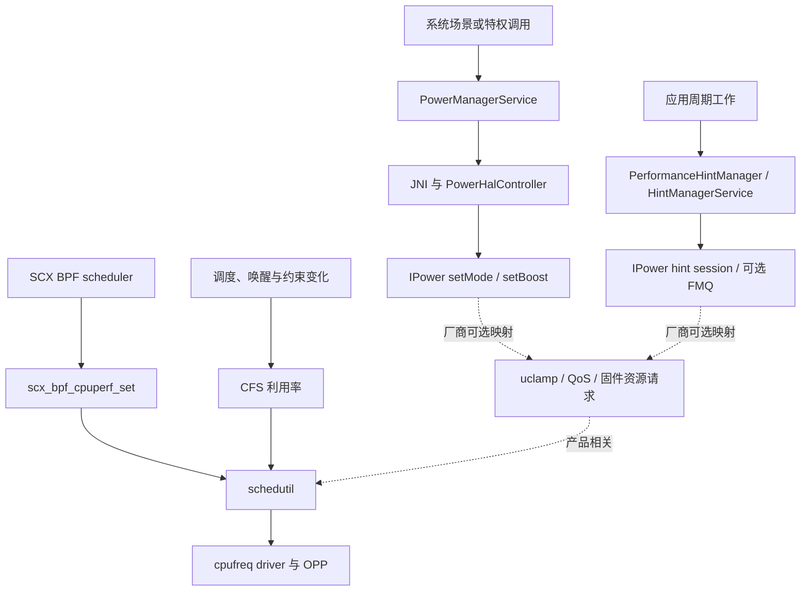

# 17.21 Android 17 SoC 厂商 Power HAL 与 schedutil 控制路径

Android 17 的 Power HAL、`sched_ext` 和 `schedutil` 会共同影响性能与能耗，但 AOSP 没有规定三者必须首尾相接。Power HAL 表达系统场景和周期工作；SCX BPF 调度器可以设置每个 CPU 的相对性能目标；`schedutil` 在被产品启用时，把调度侧输入和频率约束换算成 cpufreq 请求。厂商可以在 HAL、内核模块和固件中增加自己的映射。

锚点为 `android-17.0.0_r1` 和 `android17-6.18-2026-06_r6`，重点围绕三个问题：

- Framework 的 mode、boost 与 hint session 怎样到达 Power HAL；
- SCX 全量、部分和未启用三种状态怎样进入 `sugov_get_util()`；
- 调试时怎样区分标准源码路径、产品配置和厂商私有行为。

## 两条 Framework 入口

### Mode 与 Boost：系统场景入口

Android 17 冻结的 `android.hardware.power` AIDL 是 v7，包含 19 个 `Mode` 和 6 个 `Boost`。`Mode` 适合表达可启用和取消的状态，`Boost` 用于可能到来的短时负载。`IPower.aidl` 允许厂商忽略某个提示，因此调用方要检查 `isModeSupported()` 或 `isBoostSupported()`。

在 `PowerManagerService` 中，交互、亮灭屏、Device Idle 等系统事件会进入 `setPowerModeInternal()` 或 `setPowerBoostInternal()`。Binder 暴露的 `setPowerMode()`、`setPowerModeChecked()` 和 `setPowerBoost()` 都要求 `DEVICE_POWER` 权限，它们不是普通应用入口。

下面的源码节选用于说明 mode 从 Java 进入 native 层前的 Framework 处理。

```java
private boolean setPowerModeInternal(int mode, boolean enabled) {
    if (mode == Mode.LAUNCH && enabled && mBatterySaverStateMachine != null
            && mBatterySaverStateMachine.getBatterySaverController()
                    .isLaunchBoostDisabled()) {
        return false;
    }
    return mNativeWrapper.nativeSetPowerMode(mode, enabled);
}
```

`LAUNCH` 在省电策略禁止启动 boost 时会被过滤，其余 mode 通过 JNI 进入 `PowerHalController.setMode()`。这条调用没有依赖 `DIRTY_*` 位掩码；`DIRTY_*` 用于 `PowerManagerService` 的电源状态重计算，不能概括所有 Power HAL hint 的入口。

native 侧的路径可以按以下顺序阅读：

1. `com_android_server_power_PowerManagerService.cpp` 把整数转换为 AIDL `Mode` 或 `Boost`；
2. `PowerHalController` 取得 Power HAL wrapper，并处理连接失效后的重连；
3. `PowerHalLoader` 优先连接 `android.hardware.power.IPower/default`；
4. `AidlHalWrapper` 缓存每个 mode/boost 的支持查询结果，再调用 vendor service。

Android 17 的 controller 代码仍保留 HIDL wrapper 作为旧实现兼容路径。阅读量产机 trace 时，应确认本机连接的是 AIDL 还是兼容 wrapper，不能仅按平台版本猜测 IPC 形态。

### Hint session：应用周期工作入口

普通应用通过 `PerformanceHintManager` 创建会话，系统端由 `HintManagerService` 校验 UID、TGID、TID、进程状态和会话生命周期。会话创建、目标时长更新和工作时长报告最终交给 Power HAL 的 `IPowerHintSession`。

Android 17 的 AIDL v7 支持 `createHintSessionWithConfig()`。v5 起还可通过 `getSessionChannel()` 获取 FMQ channel，以减少高频工作时长报告的 Binder 往返。FMQ 是可选能力；设备不支持时，Framework 仍需使用 Binder 会话路径。

Mode/Boost 和 hint session 共用 Power HAL 契约，却承载不同语义。前者来自系统场景，后者描述一组长寿命线程的周期预算。把应用的 `PerformanceHintManager` 调用写成 `PowerManagerService.setMode()`，会把两条入口混为一谈。

## Power HAL 与内核之间没有固定直连

`IPower.setMode()` 的注释只规定提示可能调整 cpufreq governor 或其他设备侧控制项。AOSP 没有给出“Mode 到某个 sysfs 节点”的通用映射，也没有规定 Power HAL 调用 SCX BPF helper。

厂商实现可以影响 uclamp、PM QoS、cpufreq/devfreq 约束、空闲策略、固件资源请求或其他产品控制面。这些只是可选实现类别。某台设备采用哪条路径，要用 vendor source、HAL 日志、trace marker 或前后状态差异验证。

下面的图用于区分标准入口、调度侧输入和厂商可选映射。



实线表示 Android 17 源码中存在的标准接口关系，虚线表示厂商可以选择的映射。图中没有从 Power HAL 直达 BPF scheduler 的标准实线；OEM 若建立这条关联，应由自己的接口和 trace 证明。

## SCX 怎样进入 `schedutil`

### `scx_bpf_cpuperf_set()` 写入什么

SCX BPF scheduler 可以调用 `scx_bpf_cpuperf_set(cpu, perf)`。`perf` 的合法范围是 `[0, SCX_CPUPERF_ONE]`，表示相对于该 CPU 最大性能的线性目标。helper 会把值写入 `rq->scx.cpuperf_target`，随后调用 `cpufreq_update_util(rq, 0)` 触发 governor 更新。

这个 helper 提交的是相对性能目标。最终频率还受 CPU 分组、policy、OPP、驱动能力、最小/最大频率和热约束影响，因此不能把 `perf` 值直接当成 kHz 或 OPP 序号。

SCX 启用过程中，内核先把每个 CPU 的 `cpuperf_target` 初始化为 `SCX_CPUPERF_ONE`。BPF scheduler 可以在运行后更新目标。这个初始化行为也说明，加载 SCX 与第一次策略更新之间不能按零性能目标解释。

### 全量、部分与关闭三种状态

`kernel/sched/cpufreq_schedutil.c` 的这段代码决定调度利用率怎样汇入 governor。

```c
static void sugov_get_util(struct sugov_cpu *sg_cpu, unsigned long boost)
{
    unsigned long min, max, util = scx_cpuperf_target(sg_cpu->cpu);

    if (!scx_switched_all())
        util += cpu_util_cfs_boost(sg_cpu->cpu);
    util = effective_cpu_util(sg_cpu->cpu, util, &min, &max);
    util = max(util, boost);
    sg_cpu->bw_min = min;
    sg_cpu->util = sugov_effective_cpu_perf(sg_cpu->cpu, util, min, max);
}
```

这里读取的不是简单二选一。三种状态的含义如下：

| SCX 状态 | `scx_cpuperf_target()` | CFS 利用率 | `schedutil` 的输入 |
|---|---:|---:|---|
| 未启用 | 返回 0 | 加入 | CFS 利用率及后续约束 |
| 部分切换 | BPF 写入的目标 | 加入 | SCX 目标与仍在 fair class 中的 CFS 利用率之和，再应用约束 |
| 全量切换 | BPF 写入的目标 | 不加入 | SCX 目标，再应用 iowait、有效最小/最大利用率等约束 |

部分切换由 `SCX_OPS_SWITCH_PARTIAL` 控制：只有 `SCHED_EXT` policy 的任务交给 SCX，`SCHED_NORMAL`、`SCHED_BATCH` 和 `SCHED_IDLE` 仍由 fair class 调度。因此，“SCX 启用后 CFS 只作备用”的说法遗漏了部分切换。

### 从利用率到驱动请求

`schedutil` 的后续路径分为四步：

1. `sugov_should_update_freq()` 检查当前 CPU 能否更新 policy，并处理 policy limit 变化；
2. 普通更新受 `freq_update_delay_ns` 约束，初始值来自 `cpufreq_policy_transition_delay_us(policy)`；
3. `get_next_freq()` 通过 `map_util_freq()` 或 Android vendor hook 的结果计算原始频率，再交给 `cpufreq_driver_resolve_freq()` 按 policy 和驱动能力取可用档位；
4. 驱动支持 fast switch 时调用 `cpufreq_driver_fast_switch()`，否则排队进入 deferred update。

`rate_limit_us` 没有跨 SoC 固定值。它由 policy/driver 的 transition delay 初始化，也可以经 governor tunable 调整。SCX helper 调用了 `cpufreq_update_util()`，仍可能被更新间隔挡住；policy limit 或特定带宽约束变化可以要求重新计算。

共享 policy 还会遍历 policy 内 CPU，取处理后的最大利用率来选频。因此，“BPF 给某个核心写目标”与“硬件只改变该核心频率”不是同一件事，结果取决于 cpufreq policy 的分组。

## Android vendor hook 的边界

在 `android17-6.18-2026-06_r6/include/trace/hooks/sched.h` 中，名字含 `android_vh_scx_` 的 hook 声明共有 11 个。13 个的统计值与当前 tag 不符。它们可以按用途分组：

- 生命周期与异常：`scx_enabled`、`scx_ops_enable_state`、`scx_exit_on_abnormal`；
- CPU 可运行性与迁移：`scx_set_cpus_allowed`、`scx_task_can_run_on`、`scx_ops_consider_migration`；
- 队列、slice 与切换修正：`scx_enq_to_priq`、`scx_switch_repeat_skip`、`scx_fix_prev_slice`、`scx_task_switch_finish`；
- 调度类切换标志修正：`scx_restore_flags`。

这些 hook 是 GKI vendor module 的扩展点，不是应用 API，也不自动构成 Power HAL 到 SCX 的通信协议。数量和签名属于具体内核 tag；升级 kernel 时要重新核对。

OEM 使用 vendor hook 时还要保留 SCX 的安全约束。hook 若改变 CPU 可运行性、migration 或 slice，要验证 cpuset、affinity、hotplug、RT/DL 调度类、partial switch 和异常退出。仅通过正常负载测试不足以覆盖这些边界。

## 运行态观测

### `sched_ext` sysfs

Android 17 内核锚点创建 `/sys/kernel/sched_ext/`。全局属性与活动 scheduler 的属性位于不同层次：

| 节点 | 读取内容 |
|---|---|
| `/sys/kernel/sched_ext/state` | `disabled`、`enabling`、`enabled` 或 `disabling` |
| `/sys/kernel/sched_ext/switch_all` | 当前 switch-all 状态标志 |
| `/sys/kernel/sched_ext/nr_rejected` | 请求 `SCHED_EXT` 后被拒绝的任务计数 |
| `/sys/kernel/sched_ext/hotplug_seq` | CPU hotplug 序列号 |
| `/sys/kernel/sched_ext/enable_seq` | scheduler 成功启用的累计序列号 |
| `/sys/kernel/sched_ext/root/ops` | 当前活动 BPF scheduler 名称 |
| `/sys/kernel/sched_ext/root/events` | `SELECT_CPU_FALLBACK`、dispatch、bypass 等事件计数 |

`root/` 是活动 scheduler 对象的 kobject。SCX 未加载或退出后，该子目录可能不存在，因此采集脚本要允许缺失。`events` 的字段也来自当前 tag 的 `scx_event_stats`，升级后不应假设字段集合不变。

### Trace 需要同时覆盖四类信号

单看 CPU Frequency track 无法说明谁发起了请求。一次可复查的采集至少包含：

- Framework 的 `setHalInteractive`、业务阶段和应用自定义 slice；
- `sched_switch`、`sched_wakeup`、任务 policy 与 CPU 位置；
- `sched_ext_event`、`sched_ext_dump` 及产品自己的 SCX trace；
- cpufreq frequency/limits、thermal、uclamp 或设备公开的 QoS counter。

Power HAL 的 `setMode()` 是 `oneway` AIDL 调用；支持查询和连接错误仍要从 wrapper 或 vendor service 日志观察。若 HAL 没有公开 marker，可以做启用/取消对照并检查约束变化，不能仅靠时间相邻建立因果。

### PowerStats 是结果观测支路

Android 17 的 PowerStats AIDL 仍是冻结的 v2。`PowerEntity` 的状态驻留和 `EnergyConsumer` 的能量读数可以帮助判断策略结果，却不参与 `schedutil` 的频率选择。

`vendor_available: true` 表示接口库可供 vendor 使用，不代表厂商必须上报固定名称的 CPU、GPU、Modem 或 sleep state。实体名称、数量和支持范围都要从目标机枚举。按 Qualcomm、MediaTek、Samsung 列出固定表缺少 AOSP 契约依据。

## 异常退出与恢复

SCX 发现运行时错误、runnable task stall，或收到 `SysRq-S` 后，会终止 BPF scheduler 并把任务交回 fair class。`SysRq-D` 只触发调试 dump，不终止 scheduler。

SCX 退出后，`scx_cpuperf_target()` 因 `scx_enabled()` 为 false 返回 0，`scx_switched_all()` 也为 false，下一次 `schedutil` 更新会重新加入 CFS 利用率。若产品使用 `schedutil`，这条恢复由内核代码完成，不需要 Power HAL 接收一条 AOSP 标准回调。

厂商若在 SCX 外还维护 boost、uclamp 或固件状态，仍需为自己的状态设计超时和清理。这里应分别测试：

- scheduler 正常卸载；
- BPF 错误退出和 watchdog stall；
- `SysRq-S`；
- CPU hotplug 与 suspend/resume；
- Power HAL service 死亡和重连；
- partial switch 下任务在 fair class 与 SCX 间切换。

Power HAL 连接失败时，`PowerHalController` 会清除 handle，并让后续调用尝试重连。这是 HAL IPC 的恢复路径，与 SCX 异常退出互相独立。

## 一套按证据推进的排查顺序

### 1. 确认产品配置

记录 build fingerprint、kernel release、`CONFIG_SCHED_CLASS_EXT`、当前 governor、cpufreq policy 分组和 `/sys/kernel/sched_ext/state`。编译进 SCX 不等于已经加载 BPF scheduler，加载 scheduler 也不等于使用全量切换。

### 2. 确认场景信号

找出 mode、boost 或 hint session 的发起方，确认权限、持续时间、取消时机与 Power HAL 支持结果。Hint session 还要核对 TID、目标预算、报告频率、pause/resume 和进程死亡清理。

### 3. 确认调度输入

在相同业务阶段对齐 CFS runnable、SCX policy、`switch_all`、`cpuperf_target` 的产品 trace，以及 iowait/uclamp 约束。若没有 `cpuperf_target` trace，可通过 BPF scheduler 自己的统计补齐。

### 4. 确认频率解析

检查 `sugov_should_update_freq()` 是否被 remote update、rate limit 或未变化的目标挡住，再检查 `cpufreq_driver_resolve_freq()` 受到的 policy min/max、thermal 和 driver table 约束。

### 5. 确认执行结果

把 driver 请求、CPU frequency、任务完成时间、帧性能、温度和能量放在同一时间轴。频率高不必然表示能耗更差，较短完成时间也可能降低一次任务的总能量；应按实验问题选择功率或能量指标。

## 容易写错的五个结论

1. **“Power HAL hint 会直接写 `schedutil`。”** AOSP 只定义 HAL 契约，vendor 映射由设备实现。
2. **“SCX 启用后只采用 BPF 性能目标。”** partial switch 会把 SCX target 与 CFS 利用率一起送入后续约束计算。
3. **“`scx_bpf_cpuperf_set()` 选择了具体频率。”** helper 设置相对目标，policy 和 cpufreq driver 决定可用频率。
4. **“某次全核升频可以证明 Perflock、RPMh 或 mtlp 生效。”** 没有 marker 或状态差异时，只能记录频率响应。
5. **“PowerStats 的 rail 变化证明它参与调频。”** PowerStats 提供观测数据，时间相关不等于控制关系。

## 结语

Android 17 的 Power HAL 提供系统场景和 ADPF 会话入口，SCX 提供可编程任务放置与 CPU 性能目标，`schedutil` 在产品启用它时负责把利用率和约束转换成 cpufreq 请求。三者可以协作，标准源码却没有定义一条固定的 Power HAL → SCX → `schedutil` 直线。

源码复核时应分开记录接口契约、内核计算、产品配置和厂商扩展。SCX partial switch、driver 相关的 rate limit、活动 scheduler 的 `root/` sysfs 目录，以及 11 个 tag-specific vendor hook，都是判断 trace 时不可省略的边界。

## 参考资料

### Android 17 平台源码

- [PowerManagerService.java（android-17.0.0_r1）](https://android.googlesource.com/platform/frameworks/base/+/android-17.0.0_r1/services/core/java/com/android/server/power/PowerManagerService.java)
- [PowerManagerService JNI（android-17.0.0_r1）](https://android.googlesource.com/platform/frameworks/base/+/android-17.0.0_r1/services/core/jni/com_android_server_power_PowerManagerService.cpp)
- [PowerHalController.cpp（android-17.0.0_r1）](https://android.googlesource.com/platform/frameworks/native/+/android-17.0.0_r1/services/powermanager/PowerHalController.cpp)
- [PowerHalWrapper.cpp（android-17.0.0_r1）](https://android.googlesource.com/platform/frameworks/native/+/android-17.0.0_r1/services/powermanager/PowerHalWrapper.cpp)
- [HintManagerService.java（android-17.0.0_r1）](https://android.googlesource.com/platform/frameworks/base/+/android-17.0.0_r1/services/core/java/com/android/server/power/hint/HintManagerService.java)
- [IPower.aidl（android-17.0.0_r1）](https://android.googlesource.com/platform/hardware/interfaces/+/android-17.0.0_r1/power/aidl/android/hardware/power/IPower.aidl)

### Android 17 内核源码

- [sched_ext 核心实现](https://android.googlesource.com/kernel/common/+/refs/tags/android17-6.18-2026-06_r6/kernel/sched/ext.c)
- [sched_ext 内部调度接口](https://android.googlesource.com/kernel/common/+/refs/tags/android17-6.18-2026-06_r6/kernel/sched/ext.h)
- [schedutil governor](https://android.googlesource.com/kernel/common/+/refs/tags/android17-6.18-2026-06_r6/kernel/sched/cpufreq_schedutil.c)
- [Android scheduler vendor hooks](https://android.googlesource.com/kernel/common/+/refs/tags/android17-6.18-2026-06_r6/include/trace/hooks/sched.h)
- [sched_ext 官方内核文档](https://android.googlesource.com/kernel/common/+/refs/tags/android17-6.18-2026-06_r6/Documentation/scheduler/sched-ext.rst)
- [AOSP Power statistics HAL](https://source.android.com/docs/core/power/power-stats-hal)

### 交叉阅读

- §17.4 Android 17 `sched_ext` 与 OEM BPF 调度器
- §17.9 SoC 特异性功耗优化策略
- §5.4 DVFS 与功耗管理
- §5.6 Android 功耗管理
