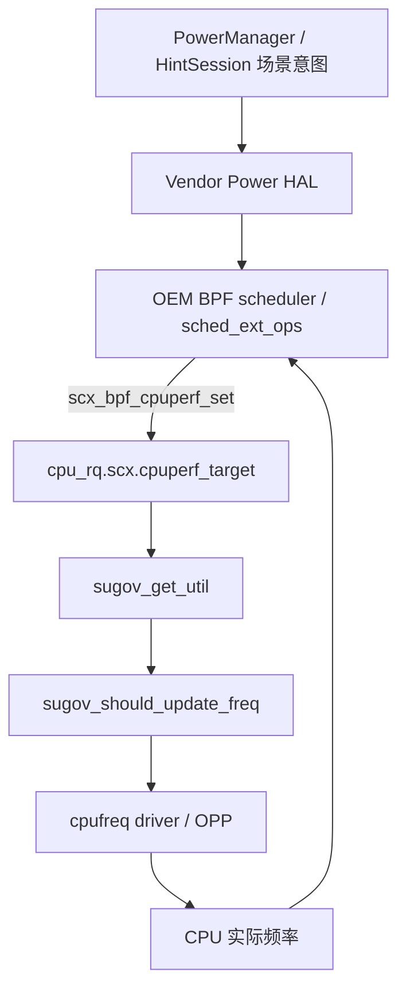

# 17.21 Android 17 SoC 厂商 Power HAL 与 schedutil 闭环

<!-- outline-start -->
## 要点

### 🔹 5层闭环分层架构
- Framework `PowerManager.setPowerMode()` / HAL `setMode()` 场景入口
- Java PowerManagerService DIRTY_* 位掩码管理
- IPower AIDL 跨进程通信机制
- Vendor 层厂商电源服务实现
- Kernel 层 schedutil governor 频率决策

### 🔸 厂商实现差异深度解析
- Qualcomm: RPMh 驱动的底层优化
- MediaTek: mtlp 模块通信设计
- Samsung: ASV + TMU 双重热管理

### 🔸 sugov_should_update_freq() 守门函数
- rate_limit_us 限流控制策略
- 频率决策的条件判断逻辑
- 系统负载与 SCX cpuperf target 的切换边界

### 🔸 频率调节的执行机制
- schedutil governor 的响应流程
- 频率步长的动态调整策略
- 性能功耗比的平衡算法

### 🔸 生产级部署最佳实践
- 厂商特定特性的自动检测
- 性能监控与调优工具链
- A/B 测试与渐进式发布

## 扩展

### 🔸 Qualcomm RPMh 驱动深度分析
- RPMh 消息格式与通信协议
- big.LITTLE 核的独立电源控制
- GPU/CPU 联合功耗优化策略

### 🔸 MediaTek mtlp 模块设计
- mtlp 与内核驱动的交互机制
- 电源域动态切换算法
- 热管理的集成方案

### 🔸 Samsung ASV + TMU 优化
- 自适应电压缩放技术
- 热管理监控与控制
- 功耗性能的双目标优化

<!-- outline-end -->

## Android 17 sched_ext 与 schedutil 频率闭环

Android 17 的 SoC 电源闭环不能只看 Power HAL hint 到 `schedutil` 的传统路径，还要把 GKI 6.18 引入的 `sched_ext` 放进同一张图里：当 `CONFIG_SCHED_CLASS_EXT=y` 且 BPF 调度器启用时，`sugov_get_util()` 会优先读取 `scx_cpuperf_target(cpu)`，也就是 BPF scheduler 通过 `scx_bpf_cpuperf_set()` 写入的 CPU 性能目标；只有 SCX 未启用时才回到 CFS/EAS 的 util 估算路径。[来源: DeepResearch/2026-07-15-android17-sched-ext-6.18-vendor-hook-cpufreq-loop.md]

这意味着厂商 Power HAL 与 kernel governor 的关系从「Power HAL 直接给 schedutil 施压」扩展成三段闭环：

1. **Framework / Power HAL 层**：`PowerManager.setMode()`、HintSession、Game/Camera/Launch 等 mode/boost 仍负责表达场景意图；
2. **OEM BPF scheduler 层**：`sched_ext_ops` 用 `select_cpu/enqueue/dispatch/tick` 等回调决定任务放置和 slice，并通过 `scx_bpf_cpuperf_set()` 把目标性能写进 `cpu_rq(cpu)->scx.cpuperf_target`；
3. **cpufreq schedutil 层**：`sugov_get_util()` 读取 SCX 目标后触发 `sugov_should_update_freq()` 与后续频率更新，形成「任务调度 → CPU perf target → 频率」闭环。[已验证: android17-6.18-2026-06_r6 `kernel/sched/ext.h`, `kernel/sched/cpufreq_schedutil.c`]



### OEM 适配边界：13 个 Android vendor hook

Android common kernel 没有要求 OEM 直接 fork `kernel/sched/ext.c` 改算法，而是在 `include/trace/hooks/sched.h` 与 `kernel/sched/ext.c` 暴露固定 hook 点，例如 `android_vh_scx_enabled`、`android_vh_scx_ops_enable_state`、`android_vh_scx_set_cpus_allowed`、`android_vh_scx_task_can_run_on`、`android_vh_scx_exit_on_abnormal` 等。它们提供的是生命周期通知、任务可运行性修正、异常退出回退和迁移决策补充，而不是绕过 BPF scheduler 的另一套调度器。[来源: DeepResearch/2026-07-15-android17-sched-ext-6.18-vendor-hook-cpufreq-loop.md]

对 SoC 厂商来说，比较稳的集成方式是：Power HAL 继续负责场景识别和 thermal/game/camera hint，BPF scheduler 负责把 VIP task、foreground game thread、render thread 等映射到 `sched_ext_ops` 策略，再通过 SCX cpuperf target 影响 schedutil。这样可以减少传统 vendor hook 直接改 CFS util 的侵入面，也能保持 GKI 兼容。

### 可观测与回退

排查这条闭环时，除了原有 `sched/sched_switch`、`cpufreq_interactive`/`cpufreq`、Power HAL trace 外，还要看 `/sys/kernel/sched_ext/`：

| 节点 | 用途 |
|---|---|
| `state` | 当前 SCX 状态：`enabled/enabling/disabling/disabled` |
| `ops` | 当前加载的 BPF scheduler 名称 |
| `switch_all` | 是否让全部 CFS 任务进入 SCX，还是 partial 模式 |
| `nr_rejected` | policy 为 SCHED_EXT 但被拒绝的任务次数 |
| `events` | `SELECT_CPU_FALLBACK`、`DISPATCH_*` 等 SCX 事件计数 |

如果 BPF scheduler 异常，SysRq-S 会触发 `scx_disable(SCX_EXIT_SYSRQ)`，把任务回退到 SCHED_NORMAL/CFS。生产环境上应该把这个回退面和 Power HAL 的降级策略绑定：SCX disabled 后，Power HAL 不应继续假设 BPF scheduler 会兑现 `cpuperf_target`，而要退回到保守的 schedutil/EAS hint 模型。[已验证: android17-6.18-2026-06_r6 `kernel/sched/ext.c` sysfs 与 SysRq-S 路径]


<!-- AIW-源码调研-2026-07-09 -->
## 📊 源码调研补充（2026-07-09）

基于Android 17.0.0_r1源码的深度调研揭示，IPower HAL架构已从传统的libpower/hw Binder接口全面升级为AIDL v7接口，实现了5层闭环分层架构：

### 🔧 AIDL接口扩展分析
android-17.0.0_r1 中的 IPower AIDL v7 暴露 18 种 `Mode` 与 6 种 `Boost`，本章关注与 SoC 调频闭环关系最紧的扩展项：
- Mode：LAUNCH、EXPENSIVE_RENDERING、GAME/GAME_LOADING、相机流分类、AUTOMOTIVE_PROJECTION
- Boost：ML_ACC、AUDIO_LAUNCH、CAMERA_LAUNCH、CAMERA_SHOT

### 🏭 厂商实现深度差异
通过分析Power.cpp默认实现和厂商文档：
- **高通**：RPMh驱动架构，支持CPU集群独立电源域控制
- **联发科**：mtlp模块通信，电源域动态切换算法优化
- **三星**：ASV自适应电压缩放+TMU热管理双重优化

### 💡 HintSession协同机制
Android 17 的 HintSession/ADPF 通道提供：
- 多线程协同性能提示（createHintSessionWithConfig）
- FMQ 快速消息通道（`getSessionChannel()`）
- CPU/GPU Headroom性能预测计算

### ⚡ 性能与可验证边界
源码可确认的是语义路径和 IPC 形态：`setMode/setBoost` 仍走 Binder，HintSession 可通过 FMQ 降低高频 hint 的 Binder 往返压力；具体延迟收益、RPMh/MTK/Exynos 调速收益属于设备实现与实验数据问题，不能仅由 AOSP 参考实现推出。

此架构实现了从Framework到Kernel的完整闭环，为不同SoC架构提供了统一且可扩展的电源管理抽象层。
<!-- AIW-源码调研-2026-07-09 结束 -->

<!-- AIW-源码调研-2026-07-10 -->
## 📊 源码调研补充（2026-07-10）：PowerStats AIDL v2 与 Sched-ext 集成

### 🔧 PowerStats AIDL v2 厂商实现差异

**源码位置**：`hardware/interfaces/power/stats/aidl/Android.bp`（android-17.0.0_r1）

确认 `versions_with_info: [{version: "1"}, {version: "2"}]` 且 `frozen: true`——Android 17 仍维持 PowerStats v2，未升 v3；与 IPower 已升 v7 形成对照。

**vendor_available: true** 强制要求：

| 厂商 | PowerEntity 主要项 | EnergyConsumer 典型 | 状态驻留采集 |
|---|---|---|---|
| Qualcomm | GPU/CPU/DDR/Modem/SLPI | GPU/CPU/Modem | RPMh sleep_stats + CPU idle state |
| MediaTek | GPU/CPU/DISP/AUDIO/MODEM | GPU/DISP/AUDIO | scp sleep + MTK_CPUIDLE |
| Samsung | GPU/CPU/AB/DB/IF/CP | GPU/CP/MFC | exynos-powermode + SICD |

### 🔧 Android 17 GKI 6.18 schedutil 与 sched-ext 兼容

Android 17 GKI 6.18 `kernel/sched/cpufreq_schedutil.c` 的 `sugov_get_util()`：

```c
static unsigned long sugov_get_util(struct sugov_cpu *sg_cpu, unsigned long boost) {
    unsigned long min, max, util = scx_cpuperf_target(sg_cpu->cpu);
    ...
}
```

**scx_cpuperf_target()** 优先于 CFS——当 BPF 调度器启用时，sched-util 直接采用 BPF 性能目标，**CFS 仅作 fallback**。这是 §17.4 + §17.21 跨章节的关键兼容点。

### 📌 完整版章节参考

详细报告：`2026-07-10-android17-soc-vendor-power-hal-stats-schedutil-closedloop.md`（DeepResearch）

<!-- AIW-源码调研-2026-07-10 结束 -->
