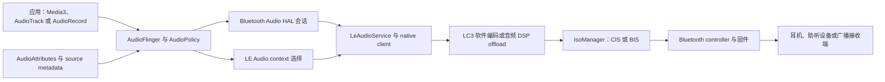

# Android 17 蓝牙低功耗音频与功耗优化

## LE Audio 功耗治理的证据边界

<!-- outline-start -->
## 要点

### 🔹 本章当前能确认什么
- 本次深度审计只采用 Android 17 / API 37、`android-17.0.0_r1` 口径，不外推 Android 18/API38+ 主线行为。
- 现有材料能可靠支撑的是：后台音频硬化在 AudioService/HardeningEnforcer 与 AudioFlinger Track 层共同生效，蓝牙相关应用在持有 `BLUETOOTH_CONNECT` 时只能进入 partial exemption，而不是完全绕过硬化。
- 现有材料还能支撑 Android 音频低延迟路径的通用边界：FAST Mixer 面向低延迟混音，AAudio MMAP 依赖 HAL/硬件能力，尤其 EXCLUSIVE 模式才可能绕开 AudioServer 混音器。

### 🔹 暂不能确认什么
- 当前材料不足以证明 Android 17 新增了专门面向 LE Audio 的 `AudioFormat.ENCODING_LC3_LOW_LATENCY` Java API、固定的 7.5ms 帧间隔策略，或统一的 LC3 低延迟平台策略。
- 当前材料不足以给出“LC3 相比 SBC 降低 40% 功耗”“整机蓝牙功耗下降 25-30%”“TWS 续航从 6 小时到 9 小时”等平台级量化结论。
- 当前材料不足以证明系统存在统一的跨厂商 LE Audio 兼容性检测框架、自动设备佩戴/距离切换算法、空间音频低码率渲染策略，或车载蓝牙语音响应时间固定降至 80ms 以下。

### 🔹 蓝牙场景与后台音频硬化
- Android 17 后台音频硬化不是单个开关：Java 侧 `HardeningEnforcer` 会拦截焦点/音量等 AudioManager 入口，C++ 侧 AudioFlinger `Tracks::getHardeningDecision()` 会在播放 Track 创建/运行侧按 usage、权限、targetSdk 与 override 状态判定。
- `BLUETOOTH_CONNECT` 的意义应写成“蓝牙相关场景可获得 partial exemption”，而不是写成“LE Audio 可无条件低功耗运行”。当后台音频异常出现在蓝牙路由、耳机切换或通话保持时，仍需要同时检查 AppOps、usage、targetSdk、AudioFocus 与 Track 层日志。
- 对 targetSdk 37 的应用，若没有闹钟、特权权限或蓝牙连接等豁免，后台焦点/播放路径可能进入 full enforcement；这属于后台音频治理边界，不等同于 Bluetooth controller 或 LC3 codec 的功耗策略。

### 🔹 低延迟音频路径的正确边界
- FAST Mixer 是 Android 音频栈中长期存在的低延迟混音路径；材料只支持“降低到几十毫秒量级”的描述，不支持把它直接写成蓝牙 LE Audio 的 `<20ms` 平台保证。
- AAudio MMAP 在 Android 8.1 之后提供更低延迟路径，但是否可用依赖设备 HAL/驱动实现；EXCLUSIVE 模式才可能绕开 AudioServer 混音器，SHARED 模式仍通过 AudioServer 内部混音器。
- 因此，蓝牙耳机链路的端到端延迟应拆成 App/API、AudioFlinger/AudioPolicy、Bluetooth stack、codec/controller、对端设备能力等多段分析，不能只用 FAST Mixer 或 MMAP 材料推出 LE Audio 全链路结论。

## 扩展

### 🔸 排障检查表
1. **确认版本边界**：只按 Android 17 / API 37 与 `android-17.0.0_r1` 判定；不要把 Android 18 或厂商主线实现写入本章结论。
2. **确认应用状态**：targetSdk、可见性、前台服务、AudioAttributes usage、是否持有 `BLUETOOTH_CONNECT` 或精确闹钟相关权限。
3. **确认 Java 层门禁**：检查 AudioFocus、音量 API 与 HardeningEnforcer/AppOps 日志，区分“焦点申请失败”和“音量控制被拒绝”。
4. **确认 Track 层门禁**：检查 AudioFlinger Track 创建、hardening decision、Offload/MMAP 是否触发异步 OP 校验；不要只看应用层返回值。
5. **确认低延迟路径条件**：FAST Mixer、AAudio MMAP、Offload 是否真的被设备启用；蓝牙端到端延迟还需要 Bluetooth/audio HAL 与对端能力证据。

### 🔸 后续需要补齐的源码材料
- Bluetooth LE Audio stack 与 profile service 在 `android-17.0.0_r1` 下的路由、ISO/BIS/CIS、codec capability 协商证据。
- AudioPolicy / audio HAL / Bluetooth audio HAL 对 LC3、offload、spatial audio、latency mode 的真实分支。
- Perfetto 或 dumpsys 采样证据，用于把 AudioFlinger 低延迟路径与蓝牙链路状态关联起来。
- 设备级功耗数据（Battery Historian、Perfetto power rails、厂商控制器指标等），用于支撑任何百分比或续航提升结论。

## 实际应用场景

### 无线耳机功耗优化
在缺少 Bluetooth HAL 与实测功耗数据前，本文不再给出固定续航提升百分比。可执行的安全建议是：先核对应用是否满足后台音频硬化豁免路径，再通过设备日志确认蓝牙路由、AudioFocus、Track 与 codec/offload 状态，最后以同一设备、同一耳机、同一音量/码率/场景的功耗采样作结论。

### 车载与多设备音频
车载语音、通话保持、多设备切换都可能同时涉及 AudioFocus、MediaSession、Bluetooth profile 与厂商策略。现有材料只能支持“需要把硬化 partial 路径纳入排障”，不能支持统一的自动切换时延、语音识别准确率或跨厂商兼容性结论。

<!-- outline-end -->

这次复核已经补入 Android 17 的 Bluetooth profile service、native LE Audio client、LC3 codec manager 和 Bluetooth Audio HAL 源码。原审计删除的虚构 API、固定时延和固定功耗收益仍不恢复；新增内容集中说明能从 `android-17.0.0_r1` 直接确认的调用路径，以及应用和系统工程师分别能控制什么。

本章的平台锚点是 Android 17 / API 37 / `android-17.0.0_r1`，内核锚点是 `android17-6.18-2026-06_r6`。多数 Android 手机把蓝牙链路时序和编码位置交给 Bluetooth stack、Bluetooth Audio HAL、控制器固件与音频 DSP。内核 tag 只能约束主机驱动和调度分析，不能替代控制器与耳机侧证据。

## 1. 先区分 BLE、LE Audio 与 ASHA

BLE 是低功耗蓝牙传输基础；LE Audio 是建立在 Bluetooth Low Energy 与 isochronous transport 上的一组音频 profile。Android 还保留 ASHA hearing aid 路径。ASHA 使用 LE Credit Based L2CAP Channel 和 G.722，不能拿来解释采用 LC3、CIS/BIS 的 LE Audio 会话。

LE Audio 的两种主要形态如下：

| 形态 | 传输对象 | 典型用途 | Android 侧观察点 |
|---|---|---|---|
| Unicast | CIG 中的一条或多条 CIS | 耳机媒体、通话、双向采集 | group、ASE、audio context、CIS、codec/QoS |
| Broadcast | BIG 中的一条或多条 BIS | 音频分享、公共广播 | broadcast ID、subgroup、BIS、broadcast metadata |

CIS 可以双向传输，适合同时播放与采集；BIS 从广播源单向发送。耳机左右单元可能各占一条 CIS，也可能由单条 CIS 承载多个 channel allocation。看到“两只耳机”时不能直接推导 CIS 数量。

## 2. Android 17 的端到端路径

下面的图用于分开定位应用、Framework、Bluetooth 模块和硬件。



普通应用提交 PCM 或播放器内容，`AudioAttributes` 表达媒体、语音通信、游戏等用途。AudioPolicy 选择 BLE audio device，Bluetooth Audio HAL 建立软件或硬件 offload session。`LeAudioService` 负责 profile 状态、活动 group 与 native 交互，native client 再完成 PACS/ASCS 能力协商、ASE 状态机、CIS/BIS 建立与数据传输。

`client.cc` 在初始化 LE Audio client 时检查控制器是否支持 Connected Isochronous Stream central 或 peripheral；两个能力都缺失时直接终止初始化。该文件还要求 Bluetooth Audio HAL 至少具备 2.1 接口能力。系统设置里出现蓝牙开关，只能证明基础蓝牙可用，不能证明 LE Audio profile 已满足这两项门槛。

## 3. 普通应用可见的能力边界

### 3.1 查询平台能力

Android 13 已公开 LE Audio 与 Broadcast Source 的能力查询。方法返回 `BluetoothStatusCodes`，返回值不是 Boolean。下面的代码用于在 Android 17 上记录设备能力。

```kotlin
val bluetoothManager = context.getSystemService(BluetoothManager::class.java)
val adapter = bluetoothManager.adapter

val leAudioSupported =
    adapter?.isLeAudioSupported() == BluetoothStatusCodes.FEATURE_SUPPORTED
val broadcastSourceSupported =
    adapter?.isLeAudioBroadcastSourceSupported() ==
        BluetoothStatusCodes.FEATURE_SUPPORTED
```

`ERROR_BLUETOOTH_NOT_ENABLED`、`ERROR_UNKNOWN` 与 `FEATURE_NOT_SUPPORTED` 要分开记录。关闭蓝牙时得到错误码，不能把它存成设备永久不支持。应用也不能从这两个查询推导 LC3 offload、空间音频或某个 frame duration 已启用。

### 3.2 Android 17 新增的设备类型

`AudioDeviceInfo` 在 API 37 增加了三类设备常量：

- `TYPE_BLE_HEARING_AID`：LE Audio hearing aid；
- `TYPE_BLE_CENTRAL`：Android 设备处于蓝牙音频 peripheral mode 时，对端 central 对应的输入或输出设备；该模式还可能承载 A2DP 或 HFP，不能只凭常量名判定 LE Audio；
- `TYPE_BLE_CENTRAL_BROADCAST`：Android 设备以 LE Audio peripheral mode 接收广播时的输入设备。

它们补充了既有的 `TYPE_BLE_HEADSET`、`TYPE_BLE_SPEAKER` 与 `TYPE_BLE_BROADCAST`。AOSP 的类型映射还受 `bleHearingAidDevice()` 和 `blePeripheralDevices()` flag 控制，所以“常量存在”和“当前产品会枚举该设备”属于两件事。

下面的辅助函数用于筛选 Android 17 中可能与 LE Audio 有关的 route，便于埋点和日志归一化。

```kotlin
fun AudioDeviceInfo.isLeAudioRouteCandidate(): Boolean = when (type) {
    AudioDeviceInfo.TYPE_BLE_HEADSET,
    AudioDeviceInfo.TYPE_BLE_SPEAKER,
    AudioDeviceInfo.TYPE_BLE_BROADCAST,
    AudioDeviceInfo.TYPE_BLE_HEARING_AID,
    AudioDeviceInfo.TYPE_BLE_CENTRAL,
    AudioDeviceInfo.TYPE_BLE_CENTRAL_BROADCAST -> true
    else -> false
}
```

设备枚举只反映可用端点，`TYPE_BLE_CENTRAL` 还需要 profile 证据才能归类。对正在播放的 `AudioTrack`，API 36 起优先读取 `getRoutedDevices()`；它能覆盖同时路由到多个设备的场景。该查询只在 Track 处于播放状态时有效。`setPreferredDevice()` 表达偏好，AudioPolicy 和用户选择仍可能给出不同的当前 route。

### 3.3 应用不能直接控制的参数

普通应用没有公开 API 可以指定下列 LE Audio 参数：

- LC3 的 sampling frequency、frame duration 与 octets per codec frame；
- CIG、CIS、BIG、BIS 数量和 controller data path；
- presentation delay、retransmission number 与 transport latency；
- host LC3 编码或音频 DSP offload；
- group 内的 ASE 配置和 channel allocation。

`BluetoothLeAudio.getCodecStatus()` 与 `setCodecConfigPreference()` 在 Android 17 源码中属于隐藏 System API，并要求 `BLUETOOTH_PRIVILEGED`。`AudioFormat.ENCODING_LC3_LOW_LATENCY` 不存在。产品应用若使用反射或私有 binder 调整 codec，兼容性、安全模型和上架行为都无法得到平台承诺。

## 4. LC3 软件路径与硬件 offload

### 4.1 软件编码路径

`system/bta/le_audio/codec_interface.cc` 使用 liblc3 创建 encoder/decoder。编码器参数来自已经协商好的 codec configuration，包括 PCM sample rate、LC3 sample rate、data interval 和每帧字节数。编码后的 ISO data 由 `IsoManager` 发送给 controller。

Android 17 的配置同时包含 7.5 ms 与 10 ms data interval 组合。7.5 ms 是可协商选项，不是统一低延迟模式。选中哪组配置还会受远端 PAC、audio context、QoS、设备组形态和产品配置影响。

软件路径中，应用产生 PCM，AudioFlinger 与 Bluetooth Audio HAL 把 PCM 交给 Bluetooth stack，host CPU 执行 LC3 编码，再经 HCI data path 送往 controller。CPU 时间、内存带宽和唤醒频率都可能进入主机侧功耗。

### 4.2 ADSP offload 路径

`codec_manager.cc` 只有在下列条件同时成立时才尝试 LE Audio hardware offload：

1. `ro.bluetooth.leaudio_offload.supported` 为 true；
2. `persist.bluetooth.leaudio_offload.disabled` 没有禁用 offload；
3. `LeAudioHalVerifier::SupportsLeAudioHardwareOffload()` 返回支持；
4. HAL 报告的 codec capability 能与目标 audio set configuration 匹配。

命中后，codec location 切到 `ADSP`，并通过 controller data path 配置和 Bluetooth Audio HAL 传递 stream map、codec 与 broadcast 参数。属性只代表产品声明，HAL 能力和当次配置匹配仍可能让会话回到 host software path。

`AudioTrack.isOffloadedPlayback()` 表示 Android 的 compressed audio offload Track。它不能证明 Bluetooth LC3 位于 ADSP，也不能说明 ISO data path 是否绕过 host。判断 LE Audio codec location 要检查 Bluetooth stack dump、Bluetooth Audio HAL session 与产品 trace。

硬件 offload 常可减少应用处理器上的编码负载，但节省量依赖 DSP、电源域、内存路径、控制器和播放时长。没有同机 A/B 功耗采样时，不给百分比结论。

## 5. 应用侧怎样减少无效功耗

### 5.1 正确表达音频用途

`AudioAttributes` 会参与 AudioPolicy 与 LE Audio context 选择。媒体播放用 `USAGE_MEDIA`，VoIP 用 `USAGE_VOICE_COMMUNICATION`，游戏按交互需求使用 `USAGE_GAME`。为了追求低延迟而把音乐伪装成通话，可能改变焦点、音量、双向链路、codec configuration 和设备侧处理，功耗也可能升高。

应用应让播放器、AudioFocus、MediaSession 和前台服务状态保持一致。暂停后继续写静音 PCM 会保留 Track、HAL session、CIS 与对端解码器活动；停止或长暂停时释放不再使用的 Track 和采集资源，系统才有机会拆除链路。

### 5.2 避免高频轮询

使用 `AudioDeviceCallback` 和 `AudioRouting.OnRoutingChangedListener` 观察设备与 route 变化。不要通过定时器反复调用设备枚举、蓝牙状态查询或播放器 position API。回调中只记录轻量快照，把上传和聚合放到批处理任务。

双耳设备切换、group 成员暂时离线和手机/平板之间转移都可能触发多次 route 变化。状态机应按单调 session ID 丢弃旧回调，等待稳定状态后再启动昂贵的封面加载、均衡器重建或网络同步。

### 5.3 不强制无依据的 PCM 配置

固定 48 kHz、stereo 或很小的应用 buffer 不会强制 LE Audio 使用相同的空中参数。AudioFlinger、Audio HAL 和 Bluetooth stack 仍可能重采样、重新分配 channel 或选择另一组 LC3 配置。调优时记录应用 PCM、HAL PCM 与 LC3 codec configuration 三组数据，才能发现重复转换。

游戏和实时乐器要同时测应用 buffer underrun、AudioFlinger、Bluetooth session、controller 与耳机 presentation。FAST Mixer 或 AAudio MMAP 只缩短链路前段，不能给蓝牙端到端时延设上限。

### 5.4 空间音频与 head tracking

Android 的 LE Audio head tracking 可以使用 LE-ACL、LE-ISO software 或 LE-ISO hardware tunnel。Framework 会结合 vendor transport preference、Audio HAL latency mode 和 Spatializer 能力选择路径。低延迟模式可能缩短耳机 jitter buffer，却可能增加射频重传或解码活动；关闭 head tracking 后，系统可以选择更稳健的 free-latency 配置。

应用只负责声明空间化意图并响应系统能力。私自固定 vendor 属性或假设所有耳机支持同一 tunnel，会破坏设备协商。动态空间音频的功耗要同时测 IMU、sensor path、Spatializer、Bluetooth transport 和耳机侧。

## 6. Android 17 后台音频硬化

后台硬化与 LC3 编码位置是两套决策。Java 侧 `HardeningEnforcer` 处理焦点和音量入口，AudioFlinger 的 `getHardeningDecision()` 为每条播放 Track 计算 enforcement level。

在 Android 17 的 C++ strict hardening 分支中，持有 `BLUETOOTH_CONNECT` 的 UID 获得 `PARTIAL` enforcement level；targetSdk 低于 37 的 UID 也进入 partial。该条件只描述 Track hardening 的豁免等级，不会开启 LE Audio、不会保持 profile 连接，也不会让应用跳过 AudioFocus、AppOps 或前台服务约束。

排查“连接正常但没有声音”时，至少分开检查：

- AudioFocus 是否被拒绝；
- AudioManager 音量调用是否被 hardening 拦截；
- Track 是否收到 full/partial enforcement；
- AudioPolicy 是否已路由到 BLE device；
- LE Audio group、ASE 和 CIS 是否进入 streaming；
- HAL session 是 software path 还是 offload path。

后台音频硬化的完整决策表见 [12.33 Android 17 后台音频硬化与 LE Audio 功耗边界](../../part3-system/ch12-audio-performance/12.33-android17-background-audio-hardening-leaudio-power.md)。

## 7. 功耗与时延应分段测量

### 7.1 四个功耗对象

一条 LE Audio 会话至少涉及四个不同的能耗对象：

| 对象 | 主要活动 | 合适的证据 |
|---|---|---|
| Application Processor | AudioFlinger、软件 LC3、数据搬运、业务线程 | Perfetto CPU/frequency、进程时间、power rail |
| 音频 DSP | 混音、效果、LC3 offload、Spatializer | Audio HAL/Bluetooth HAL trace、DSP rail 或 vendor counter |
| Bluetooth controller | ISO 调度、射频收发、重传 | controller/vendor metrics、HCI snoop、BT rail |
| 耳机或接收端 | 射频、jitter buffer、解码、功放、IMU | 耳机 telemetry、外部电流计、可复现实验 |

Android `batterystats` 适合做整机和 UID 辅助归因，不能单独拆出耳机端耗电。Perfetto power rail 也依赖设备是否提供相应 PowerStats 数据源。

### 7.2 A/B 测试设计

比较 software 与 offload path 时固定以下变量：

- 同一手机 build、耳机固件和耳机电量区间；
- 同一音频文件、音量、EQ、空间音频和 head tracking 状态；
- 同一射频环境、距离、佩戴方式和屏幕状态；
- 相同播放时长，并丢弃连接建立与缓存预热阶段；
- 同时记录 route、group、codec config、data interval 和 codec location。

每组至少报告样本数、均值、p50、p95 和温度。若 offload 开关同时改变 LC3 配置或空间音频状态，这组数据只能说明整个产品配置的差异，不能只归因于编码位置。

### 7.3 时延拆分

端到端时延可以拆成以下时间段：

1. 应用写入或采集；
2. AudioFlinger/AudioPolicy 与 HAL buffer；
3. LC3 编码或解码；
4. ISO scheduling、controller queue 与空中传输；
5. 耳机 jitter buffer、解码和 DAC；
6. 声学输出或麦克风回传。

Android timestamp 只能覆盖链路中的一部分。测声学端到端时延要用 loopback、声卡或高速采集装置，并把有线/扬声器基线与 LE Audio 结果分开。

## 8. 系统级诊断

下面的命令用于采集 Android 17 主机侧的基础快照。

```bash
adb shell dumpsys bluetooth_manager > bluetooth.txt
adb shell dumpsys media.audio_policy > audio-policy.txt
adb shell dumpsys media.audio_flinger > audio-flinger.txt
adb shell getprop ro.bluetooth.leaudio_offload.supported
adb shell getprop persist.bluetooth.leaudio_offload.disabled
adb logcat -d -b all | grep -E \
  'LeAudio|IsoManager|BluetoothAudio|AudioHardening|AudioFlinger'
```

`bluetooth_manager` dump 中的 LE Audio client、group、ASE、stream 和 ISO 信息取决于产品是否保留对应 dump；两个属性也只覆盖 offload gate 的一部分。量产 user build 可能裁剪日志，缺少字段时要改用 OEM trace、bugreport 或可调试 build，不能把“日志没有打印”写成“功能没有运行”。

Perfetto 采集建议包含 sched、frequency、binder、audio、power rails 和应用自定义 trace。把“开始播放、route 变更、HAL session start、CIS streaming、首个声学输出”标到同一时间轴。Bluetooth controller 与耳机没有进入该 trace 时，在报告里明确标注观测缺口。

HCI snoop 可能包含设备标识、会话元数据或其他敏感信息。只在受控测试设备上启用，采集后按安全流程存储和清理。

## 9. 常见误判

| 现象 | 容易给出的解释 | 应补查的证据 |
|---|---|---|
| 系统显示已连接，应用无声 | LE Audio codec 失败 | AudioFocus、hardening、实际 route、Track state、ASE/CIS state |
| CPU 下降 | LC3 已硬件 offload | codec location、HAL session type、音频效果是否同步变化 |
| 延迟下降 | 选中了 7.5 ms LC3 | codec config、presentation delay、jitter buffer、耳机模式 |
| `isLeAudioSupported()` 返回支持 | 当前耳机正在使用 LE Audio | `AudioTrack.getRoutedDevices()`、profile/group 与 stream state |
| `TYPE_BLE_HEADSET` 出现 | 使用了低功耗配置 | codec/QoS、offload、RF 与实测功耗 |
| AAudio 进入 MMAP | 蓝牙链路全程低延迟 | Bluetooth HAL、CIS、controller 与声学测量 |
| 持有 `BLUETOOTH_CONNECT` | 后台播放不会受限 | Java gate、Track partial enforcement、AppOps、前台服务 |

## 10. 工程检查表

### 应用工程师

- 通过 `BluetoothAdapter` 能力查询和运行时 route 同时判定；
- 使用准确的 `AudioAttributes`，不伪装 usage；
- 播放停止后释放无用 Track、采集和效果器；
- 用回调观察 route，避免高频轮询；
- 把断连、group 切换和旧回调做成可取消状态；
- 对低延迟结论补齐声学端到端测量。

### 系统与 OEM 工程师

- 确认 controller ISO 能力和 Bluetooth Audio HAL 版本；
- 同时验证 software LC3 与 ADSP offload session；
- 记录 PAC/ASE、CIS/BIS、codec/QoS 与 presentation delay；
- 核对 AudioPolicy device port、mix port 和 route；
- 将 AP、DSP、controller 与耳机功耗分别测量；
- 在弱信号、多设备、双向语音、空间音频与热稳态下复测。

## 结语

Android 17 的公开 API 能让应用查询 LE Audio 能力、识别更多 BLE audio device type，并观察当前 route。LC3 配置、CIS/BIS、presentation delay 与 ADSP offload 仍由系统、HAL、controller 和对端共同决定。

性能优化从分段观测开始：应用侧清理无效 Track、准确声明 usage、用事件回调代替轮询；系统侧验证 codec location、HAL session、ISO 与远端能力；功耗报告分开 AP、DSP、controller 和耳机。这样才能判断收益来自应用生命周期、软件 LC3、硬件 offload、无线条件或耳机固件。

---

## 参考资料

### Android 开发者文档

- [Bluetooth LE Audio 概览](https://developer.android.com/develop/connectivity/bluetooth/ble-audio/overview)
- [`BluetoothAdapter` API](https://developer.android.com/reference/android/bluetooth/BluetoothAdapter)
- [`AudioDeviceInfo` API](https://developer.android.com/reference/android/media/AudioDeviceInfo)
- [`AudioRouting` API](https://developer.android.com/reference/android/media/AudioRouting)
- [`AudioTrack` API](https://developer.android.com/reference/android/media/AudioTrack)

### AOSP 音频文档

- [LE Audio head tracking](https://source.android.com/docs/core/audio/ht-leaudio)
- [空间音频与 head tracking 实现](https://source.android.com/docs/core/audio/implement-spatial-audio)
- [ASHA hearing aid audio](https://source.android.com/docs/core/connect/bluetooth/asha)

### Android 17 源码

- [`BluetoothAdapter.java`](https://android.googlesource.com/platform/packages/modules/Bluetooth/+/android-17.0.0_r1/framework/java/android/bluetooth/BluetoothAdapter.java)
- [`BluetoothLeAudio.java`](https://android.googlesource.com/platform/packages/modules/Bluetooth/+/android-17.0.0_r1/framework/java/android/bluetooth/BluetoothLeAudio.java)
- [`AudioDeviceInfo.java`](https://android.googlesource.com/platform/frameworks/base/+/android-17.0.0_r1/media/java/android/media/AudioDeviceInfo.java)
- [`LeAudioService.java`](https://android.googlesource.com/platform/packages/modules/Bluetooth/+/android-17.0.0_r1/android/app/src/com/android/bluetooth/le_audio/LeAudioService.java)
- [`LeAudioServiceBinder.java`](https://android.googlesource.com/platform/packages/modules/Bluetooth/+/android-17.0.0_r1/android/app/src/com/android/bluetooth/le_audio/LeAudioServiceBinder.java)
- [`client.cc`](https://android.googlesource.com/platform/packages/modules/Bluetooth/+/android-17.0.0_r1/system/bta/le_audio/client.cc)
- [`codec_interface.cc`](https://android.googlesource.com/platform/packages/modules/Bluetooth/+/android-17.0.0_r1/system/bta/le_audio/codec_interface.cc)
- [`codec_manager.cc`](https://android.googlesource.com/platform/packages/modules/Bluetooth/+/android-17.0.0_r1/system/bta/le_audio/codec_manager.cc)
- [`audio_set_configurations.json`](https://android.googlesource.com/platform/packages/modules/Bluetooth/+/android-17.0.0_r1/system/bta/le_audio/audio_set_configurations.json)
- [`le_audio_software_aidl.cc`](https://android.googlesource.com/platform/packages/modules/Bluetooth/+/android-17.0.0_r1/system/audio_hal_interface/aidl/le_audio_software_aidl.cc)
- [`HardeningEnforcer.java`](https://android.googlesource.com/platform/frameworks/base/+/android-17.0.0_r1/services/core/java/com/android/server/audio/HardeningEnforcer.java)
- [`Tracks.cpp`](https://android.googlesource.com/platform/frameworks/av/+/android-17.0.0_r1/services/audioflinger/Tracks.cpp)
- [Android 17 common kernel tag `android17-6.18-2026-06_r6`](https://android.googlesource.com/kernel/common/+/refs/tags/android17-6.18-2026-06_r6)
