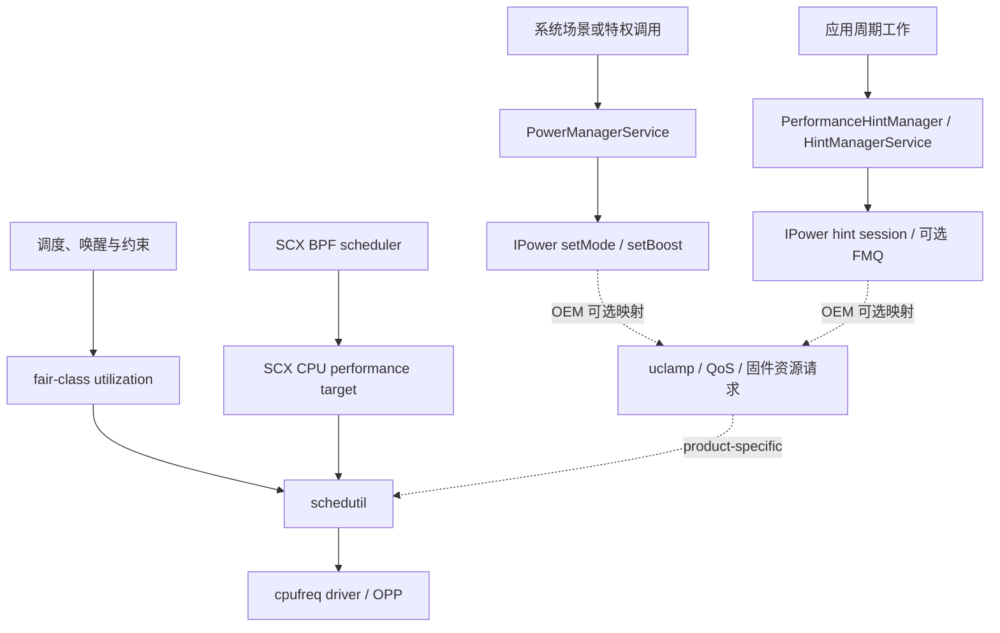

# Power HAL、schedutil 与 Power Stats

同一款应用在三台旗舰机上可能出现不同的耗电、温升和持续性能，原因通常不止 CPU 核心数量。系统软件会把帧预算（每帧可用的处理时间）、交互、相机、音频等工作负载信息交给厂商实现，内核再结合调度负载、频率约束、温控上限和固件决策控制硬件。SoC 型号、整机散热、屏幕、基带、厂商参数及应用行为都会改变结果。

本文按 Android 17 / API 37 / `android-17.0.0_r1` 与内核标签 `android17-6.18-2026-06_r6` 核对。讨论厂商差异时只采用公开源码能够证明的范围。闭源 Power HAL、固件和量产机参数无法从通用内核驱动反推出调用关系，因此相应内容会标明验证边界。

Power HAL 把场景提示传给厂商电源策略，schedutil 根据利用率调节 CPU 频率，Power Stats HAL 汇报设备能量实体和状态驻留。控制与统计是两条相关但独立的路径。

## Power Hint、schedutil 与 SoC 控制环

### 先分清四层职责

功耗问题适合按四层排查。Framework 指 Android 系统服务层，HAL（Hardware Abstraction Layer，硬件抽象层）负责连接系统与厂商实现，governor 是 CPU 调频策略。若把这些层次混在一起，很容易把提示、调度和硬件动作误写成一条固定调用链。

| 层次 | 典型接口或组件 | 谁能直接使用 | 可确认的职责 |
|---|---|---|---|
| 应用层 | `PerformanceHintManager`、`PowerManager`、`SystemHealthManager` | 普通应用，受 API 版本和设备能力约束 | 报告周期工作、读取省电与热状态、读取可选的资源余量和能耗监视器 |
| Framework / HAL 层 | `PowerManagerService`、HintManager、`android.hardware.power.IPower` | 系统进程与厂商服务 | 把系统状态、短时 `Boost` 和 Hint Session 交给厂商实现 |
| 内核层 | 调度器、`schedutil`、cpufreq/devfreq、cpuidle、thermal | 内核及特权调试工具 | 根据负载和约束选择任务位置、CPU/GPU 性能级别与空闲状态 |
| 固件 / 硬件层 | 电源控制器、DVFS 控制器、PMIC、片上热传感器 | 厂商固件与驱动 | 执行电压、时钟、电源域和过热保护动作 |

cpufreq、devfreq 和 cpuidle 分别管理 CPU 频率、其他设备频率与 CPU 空闲状态；thermal 是内核温控子系统。DVFS（Dynamic Voltage and Frequency Scaling）会配合负载调整电压和频率，PMIC（Power Management Integrated Circuit）是电源管理芯片。每层都会改变下一层收到的输入或约束，再根据温度、性能和能耗结果继续调整。

设备可以不实现某项可选能力。例如，`IPower.aidl` 明确允许平台忽略某个 `Mode` 或 `Boost`；调用方应通过 `isModeSupported()`、`isBoostSupported()` 查询支持情况。AIDL 枚举存在，只能证明接口契约存在。

### Android 17 的 Power AIDL 契约

AIDL（Android Interface Definition Language，Android 接口定义语言）描述跨进程接口契约。`android-17.0.0_r1` 冻结的 `android.hardware.power` AIDL 是 v7。`Mode.aidl` 定义 19 个持续状态，包括 `LOW_POWER`、`SUSTAINED_PERFORMANCE`、`LAUNCH`、`GAME` 与多档相机流模式；`Boost.aidl` 定义 6 个短时提示，包括 `INTERACTION`、`DISPLAY_UPDATE_IMMINENT`、`ML_ACC`、音频和相机提示。

Hint Session 让一组线程持续报告目标时长和实际用时。Binder 是 Android 的进程间通信机制；FMQ（Fast Message Queue）是基于共享内存的快速消息队列，可减少高频 Binder 调用。headroom 表示当前还能分配多少 CPU 或 GPU 资源的估计值。`IPower` 还定义 FMQ Session Channel、CPU/GPU headroom 和显示合成反馈等接口。

版本沿革需要准确区分：CPU/GPU headroom、`SupportInfo`、`sendCompositionData()` 和 `sendCompositionUpdate()` 已出现在冻结的 v6 接口中，不能写成 Android 17 才加入。Android 17 的 v7 契约继续保留这些能力。

`IPower.setMode()` 与 `setBoost()` 属于 Framework 到厂商 HAL 的接口，不是普通应用 SDK。应用可以调用 `PowerManager.isPowerSaveMode()` 读取省电模式，也可以动态注册 `ACTION_POWER_SAVE_MODE_CHANGED` 后调整自己的同步、动画和预取策略。`setPowerSaveModeEnabled()` 是隐藏的 `@SystemApi`，还要求 `DEVICE_POWER` 或 `POWER_SAVER` 权限，普通应用不应把它当作控制入口。

厂商 Power HAL 收到提示后可以调整 CPU、GPU、内存总线或空闲策略，也可以按本机策略忽略它。由此不能推出固定映射，例如“`LAUNCH` 一定调用 Qualcomm 的 RPMh 硬件资源请求通道”或“`GAME` 一定锁定某档 GPU 频率”。这类结论需要目标设备的 HAL 源码、厂商跟踪标记（trace marker）或寄存器级证据。

#### Mode/Boost 与 Hint Session 是两条入口

`Mode` 和 `Boost` 由系统场景或特权调用触发。`PowerManagerService` 中的交互、亮灭屏、设备空闲（Device Idle）等事件进入 `setPowerModeInternal()` 或 `setPowerBoostInternal()`。Binder 对外暴露的相应方法要求 `DEVICE_POWER` 权限。例如，省电策略禁用启动加速时，Framework 会过滤 `LAUNCH`：

```java
private boolean setPowerModeInternal(int mode, boolean enabled) {
    if (mode == Mode.LAUNCH && enabled && mBatterySaverStateMachine != null
            && mBatterySaverStateMachine.getBatterySaverController()
                    .isLaunchBoostDisabled()) {
        return false;
    }
    return mNativeWrapper.nativeSetPowerMode(mode, enabled);
}
```

本地 C++ 层（native）依次经过 `PowerManagerService` 的 JNI 边界、`PowerHalController`、`PowerHalLoader` 和 `AidlHalWrapper`。JNI 连接 Java 与本地代码，封装层（wrapper）会缓存 Mode/Boost 支持查询；连接失效后，后续调用会尝试重连。Android 17 仍保留 HIDL（旧版 HAL 接口定义）封装层来兼容旧实现。量产机要读取运行时连接，不能只用平台版本推断进程间通信接口。

普通应用的 `PerformanceHintManager` 请求会进入 `HintManagerService`。系统端校验 UID（应用身份）、TGID（进程 ID）、TID（线程 ID）、进程状态和会话生命周期，再交给 `IPowerHintSession`。Android 17 的 AIDL v7 支持 `createHintSessionWithConfig()`；v5 起还可通过可选 FMQ Channel 减少高频报告的 Binder 往返。FMQ 不可用时仍走 Binder 会话路径。



实线是 Android 17 可验证的标准接口，虚线是厂商可选映射。AOSP 没有定义 Power HAL 直接调用内核调度器辅助函数的通用路径。

### Android 17 内核中的频率决策

在内核标签 `android17-6.18-2026-06_r6` 中，`schedutil` 这项基于调度器负载的 CPU 调频策略，已通过 `sugov_get_util()` 接入 `sched_ext` 的 CPU 性能目标。`sched_ext`，简称 SCX，允许用 BPF 程序定义调度策略；BPF 程序在受约束的内核执行环境中运行。CFS/fair class 指 Linux 普通任务使用的公平调度类。下面的节选展示 CFS 与 SCX 同时参与时的计算入口。

```c
unsigned long min, max, util = scx_cpuperf_target(sg_cpu->cpu);

if (!scx_switched_all())
    util += cpu_util_cfs_boost(sg_cpu->cpu);
```

SCX BPF 调度器通过 `scx_bpf_cpuperf_set(cpu, perf)` 写入相对于该 CPU 最大性能的线性目标，范围为 `[0, SCX_CPUPERF_ONE]`，并触发 `cpufreq_update_util()`。这个目标是归一化性能值，不是 kHz 或 OPP 序号；OPP（Operating Performance Point，运行性能点）是一组可用的频率与电压配置。CPU 分组、cpufreq policy（共用一次调频决策的 CPU 组）、OPP、驱动、频率上下限和温控约束仍会改变最终结果。SCX 启用时先把每个 CPU 的 target 初始化为 `SCX_CPUPERF_ONE`，运行后再由 BPF 策略更新。

三种运行状态应分开解释：

| SCX 状态 | SCX target | fair-class 利用率 | `schedutil` 输入 |
| --- | ---: | ---: | --- |
| 未启用 | 0 | 加入 | 普通调度类利用率及后续约束 |
| partial switch（部分接管） | BPF 目标 | 加入 | SCX target 与普通调度类利用率之和，再应用约束 |
| full switch（全部接管） | BPF 目标 | 不加入 | SCX target，再应用 iowait、uclamp 等约束 |

iowait boost 会在任务等待 I/O 后唤醒时临时抬高利用率，uclamp（utilization clamp）则给任务或任务组设置利用率上下限。因此，把 fair class 描述为只在 SCX 缺失时启用的备用路径，会漏掉 partial switch。

频率更新节奏没有跨设备固定为 10 ms。`sugov_should_update_freq()` 会检查 policy 是否可以更新以及频率上下限是否变化，普通更新还受 `freq_update_delay_ns` 的速率限制，初值来自 `cpufreq_policy_transition_delay_us(policy)`。`get_next_freq()` 经 `map_util_freq()` 或厂商钩子给出原始频率，再由 `cpufreq_driver_resolve_freq()` 解析成驱动支持的档位。支持 fast switch（快速切换）时会直接更新，否则由工作线程延后执行。共用一个 policy 的多个 CPU 会取处理后的最大利用率；给某个 CPU 写入 target，不代表硬件只改变这个 CPU 的频率。

以下几项不能按 SoC 品牌直接假设：

- `schedutil` 是否为量产配置中的调频策略；
- cpufreq policy 如何划分，是否支持每核独立 DVFS；
- cpuidle 使用 `menu`、`teo` 还是厂商策略；
- OPP 表、热限频和总功耗预算的取值；
- SCX 调度器是否启用，以及接管了哪些调度类。

排查目标机时，应读取调频策略、policy、频率表、空闲状态和温区的当前值，再结合内核配置与设备树解释跟踪记录（trace）。只看通用内核源码不足以还原产品配置。

#### Android 厂商扩展钩子与异常恢复

`android17-6.18-2026-06_r6/include/trace/hooks/sched.h` 中，名称含 `android_vh_scx_` 的钩子声明共 11 个，覆盖启用状态、异常退出、CPU 可运行性、迁移、入队、时间片（slice）和调度类切换修正。它们供 GKI（Generic Kernel Image，通用内核镜像）的厂商模块扩展调度行为，不是 Power HAL 到 SCX 的标准协议；数量和函数签名也只对应这个内核标签。

SCX 遇到 BPF 错误、可运行任务长时间得不到执行（runnable task stall）或 `SysRq-S` 时，会终止调度器并把任务交回 fair class；`SysRq-D` 只输出诊断信息（dump）。退出后 `scx_cpuperf_target()` 返回 0，`scx_switched_all()` 为 false，下次 `schedutil` 更新会重新加入 fair-class 利用率。设备厂商在 SCX 之外保留的 Boost、uclamp 或固件状态仍需自行设计超时和清理。Power HAL 服务死亡后的封装层重连，与 SCX 退出是两条独立恢复路径。

### 三类厂商公开驱动能证明什么

公开内核树提供了部分厂商硬件的基础驱动。这些代码能说明某类控制器怎样接入 Linux，也能限定本文可以确认的范围；量产手机的厂商模块、Power HAL 和固件往往还有额外实现。

#### Qualcomm：RPMh 与硬件 cpufreq

Android 17 内核树中的 `drivers/soc/qcom/rpmh.c` 和 `drivers/soc/qcom/rpmh-rsc.c` 实现 RPMh/RSC 的内核消息通道。RPMh（Resource Power Manager hardware）负责接收资源状态请求，RSC（Resource State Coordinator）是向 RPMh 发送这些请求的控制器。`rpmh_write()`、`rpmh_write_async()` 与批量 API 可以把资源命令送入控制器。该证据支持“Linux 驱动可通过 RPMh 请求资源状态”，不支持“用户空间 Power HAL 直接调用某个内核函数”。

`drivers/cpufreq/qcom-cpufreq-hw.c` 则展示一条硬件 cpufreq 路径：

- 驱动从最多 40 项的硬件 LUT（Lookup Table，查找表）构建频率表；
- 某些设备匹配数据支持 `per_core_dcvs`，即每核独立的动态时钟与电压调节；
- OPP 与 interconnect（片上互连）带宽路径可以协同更新；
- 驱动是否具备这些能力取决于设备匹配信息、设备树和硬件版本。

`RPMh`、`DCVS` 和 `Perflock` 不能互换使用。DCVS（Dynamic Clock and Voltage Scaling）指动态调整时钟与电压；RPMh 是资源请求基础设施；cpufreq-hw 是 CPU 频率驱动路径；Perflock 通常指厂商的性能锁服务及私有资源表。某次频率上升可能来自调度负载、温控或 QoS（服务质量）约束变化、HAL 提示或厂商服务。若跟踪记录没有对应标记，不能只凭“多个核心同时升频”把事件标为 Perflock。

#### MediaTek：软件调压与硬件 LUT 两条路径

Android 17 内核树同时保留 `mediatek-cpufreq.c` 和 `mediatek-cpufreq-hw.c`，两者展示不同硬件代际或平台的实现方式。

`mediatek-cpufreq.c` 会协调 CPU 核心电压 Vproc、可选的 SRAM 电压 Vsram、CPU 时钟与 PLL（Phase-Locked Loop，锁相环）。regulator 是内核中的稳压器接口。升频和降频阶段要按电压约束安排顺序，切换 PLL 时还会使用稳定的中间时钟。`mediatek-cpufreq-hw.c` 从最多 32 项的硬件 LUT 建表，并包含 Energy Model（内核能耗模型）注册和软硬件混合 DVFS 变体支持。

这些源码可以证明 MediaTek 平台存在多种 cpufreq 实现，无法证明所有 Dimensity 产品都使用同一个“硬件预测器”，也无法证明 Power HAL 固定经过名为 `mtlp`、`hw_flower` 的用户空间或固件路径。CorePilot 是厂商品牌名；task packing（把可运行任务集中到较少 CPU 上）、核心选择和 Boost 策略需要目标内核或跟踪证据，不能从品牌名推导。

#### Samsung：ASV 和 TMU 的公开边界

公开内核中的 `drivers/soc/samsung/exynos-asv.c` 会读取 ASV（Adaptive Supply Voltage，自适应供电电压）信息，根据芯片体质分档（chip binning）调整 CPU OPP 电压，并在 OPP 更新后刷新 Energy Model。不过，该文件当前公开实现明确落在 Exynos 5422 支持范围。它能说明 ASV 的一类 Linux 实现，不能据此量化新款 Exynos 或 Xclipse GPU 设备之间的功耗差异。

`drivers/thermal/samsung/exynos_tmu.c` 是 Exynos TMU（Thermal Management Unit，热管理单元）驱动，负责温度读取、阈值、中断和校准等基础工作。它的存在不能证明量产设备采用某套固定温控策略，也不能证明 ASV 会随温度持续修改 OPP 电压。

Xclipse GPU 的 DVFS、固件和产品策略要以相应设备的公开驱动、厂商源码或测量数据为准。仅凭 `exynos_tmu.c` 和旧款 ASV 支持，无法推出 SurfaceFlinger、Power HAL 与 GPU 驱动之间的完整产品调用关系。

#### 品牌不是实验变量

同一厂商的两个 SoC 可能使用不同 CPU 微架构、GPU、制程、DVFS 控制器和调度配置；同一 SoC 放入两种机身后，也会受散热结构、屏幕与固件参数影响。跨设备实验中，“Qualcomm 对 MediaTek”这类标签信息过少。记录表至少应包含：

- 手机型号、SoC、RAM 和软件构建指纹（build fingerprint，用于标识一版系统构建的字符串）；
- Android 版本、内核版本及调频策略；
- 分辨率、刷新率和校准后的屏幕亮度；
- 环境温度、起始电池温度、起始电量与充电状态；
- 无线网络制式、信号条件、SIM 与后台账号状态；
- 工作负载版本、输入数据、持续时间和重复次数。

### 应用侧可用的标准能力

应用很少需要知道某个 Hint 在芯片内部怎样执行。可移植的做法是报告周期任务的目标用时与实际用时，读取系统压力，并在本进程内调整工作量。

#### 用 `PerformanceHintManager` 描述周期工作

`PerformanceHintManager` 从 API 31 提供公开接口，适合渲染、音视频等具有周期预算的长寿命线程。下面的 Kotlin 片段展示最小会话生命周期。

```kotlin
val manager = getSystemService(PerformanceHintManager::class.java)
val targetNs = 6_000_000L
val session = manager?.createHintSession(
    intArrayOf(Process.myTid()),
    targetNs
)

try {
    repeat(frameCount) {
        val startNs = SystemClock.uptimeNanos()
        renderOneFrame()
        val actualNs = SystemClock.uptimeNanos() - startNs
        session?.reportActualWorkDuration(actualNs)
    }
} finally {
    session?.close()
}
```

`frameCount` 和 `renderOneFrame()` 代表业务自己的周期循环。`createHintSession()` 接收 Linux TID 数组和正数目标时长；设备不支持 Hint Session，或线程不属于当前进程时，可以返回 `null`。参与线程应长期存活且属于当前进程；每个周期都要报告工作时长，目标预算变化时再调用 `updateTargetWorkDuration()`。目标时长应取该线程组在整条处理管线中的工作预算，计时使用与 `SystemClock.uptimeNanos()` 一致的时钟基准。

ADPF（Android Dynamic Performance Framework，Android 动态性能框架）提供反馈信号，不保证频率、核心或功耗结果。厂商实现会结合温控和整机预算处理这些报告。应用仍需完成常规优化，例如减少无效工作、控制并发和缩短持锁区间。

#### 正确解释 thermal headroom

`PowerManager.getThermalHeadroom(forecastSeconds)` 返回非负的归一化热压力指标，参数范围为 0 到 60 秒。虽然 API 名称中有 headroom（热余量），返回值越高表示越接近严重温控阈值。`1.0` 表示到达 `THERMAL_STATUS_SEVERE` 阈值，返回值可以超过 `1.0`；`0.0` 不对应某个固定温度或温控状态。该值没有摄氏度单位。

接口可能返回 `NaN`（Not a Number，表示当前没有有效数值），包括设备不支持、采样尚未稳定或调用过快等情况。AOSP 文档指出慢变化传感器约一秒更新一次，更高频轮询没有收益。应用可以把 headroom 与 `getCurrentThermalStatus()` 一起用于降低画质、减小批量任务或延后预取。

`getThermalHeadroomThresholds()` 从 API 35 开始提供，用于读取设备为各温控状态定义的 headroom 阈值。不同设备的传感器和阈值模型可能不同，跨机比较原始 headroom 数字时要保留这项限制。

#### CPU/GPU headroom 的含义

API 36 起，`SystemHealthManager` 提供可选的 `getCpuHeadroom()` 与 `getGpuHeadroom()`，用于估计 CPU 或 GPU 还剩多少可用能力。有效结果范围为 `[0, 100]`，其中 `0` 表示没有更多对应资源可分配；暂不可用时会返回 `Float.NaN`，设备不支持时会抛出 `UnsupportedOperationException`。

这两个调用至少包含一次同步 Binder 事务，可能超过 1 ms，初次或自定义参数调用还可能更慢。因此不要在渲染、音频或其他时限敏感线程上等待结果。轮询间隔和计算窗口由设备报告，应用应查询：

- `getCpuHeadroomMinIntervalMillis()` / `getGpuHeadroomMinIntervalMillis()`；
- `getCpuHeadroomCalculationWindowRange()` / `getGpuHeadroomCalculationWindowRange()`。

CPU 参数可指定属于本进程的 TID，这些线程还必须具有相同的 CPU affinity（允许线程运行的 CPU 集合）。接口契约没有固定的 100 ms 轮询间隔，也没有承诺某家 SoC 的计算耗时。

#### 不要从应用手工接管调度策略

sysfs 是 Linux 通过虚拟文件暴露内核设备和状态的接口。普通应用不应依赖写 sysfs、厂商私有性能服务或隐藏 Power API。手工绑核、限制 GPU 最高频率、写旧式 `schedtune` 调度参数节点都不是可移植的 SDK 方案，还可能破坏调度器和温控系统的联合决策。

若开发的是系统镜像、设备策略或游戏性能服务，绑核和 QoS 调整也应完成目标设备实验，明确撤销条件，并在 OTA（系统无线更新）后重新验证。Android 17 支持 `sched_ext`，不代表 `schedtune` 被一对一替换；两者的对象、接口和部署方式不同。

### 功耗测量：先明确物理量

“功耗”经常混用三类量：

- **功率**，单位 W，描述某个时刻或时间窗的能量消耗速率；
- **能量**，单位 J、Wh 或 µW·s，适合比较一次任务完成所需成本；
- **电池电流**，单位 A 或 mA，必须结合电压、方向约定、采样位置和充电状态解释。

只比较任务期间的平均电流，容易把电压变化、充电路径和任务完成时间漏掉。对“完成同一任务谁更省电”的问题，优先比较任务总能量，同时给出耗时、温度、帧性能和置信区间；置信区间用于表达重复采样下估计值可能落入的范围。

#### Perfetto 的 Android power 数据源

下面的配置用于采集电池计数器和设备可选的片上电源轨，字段名与 Perfetto 官方 Android power 数据源一致。

```textproto
data_sources {
  config {
    name: "android.power"
    android_power_config {
      battery_poll_ms: 250
      battery_counters: BATTERY_COUNTER_CAPACITY_PERCENT
      battery_counters: BATTERY_COUNTER_CHARGE
      battery_counters: BATTERY_COUNTER_CURRENT
      battery_counters: BATTERY_COUNTER_VOLTAGE
      collect_power_rails: true
    }
  }
}
```

`android.power` 的电池计数器受充电状态影响。USB 数据连接还可能让设备保持额外的唤醒状态，因此精密实验要记录供电和调试连接方式。`collect_power_rails` 依赖设备实现；ODPM（片上功耗测量）rail 是硬件能够单独计量的一条供电支路，没有相应硬件的设备不会凭配置生成数据。

Linux/ChromeOS 文档中，通过 sysfs 读取功耗的 Perfetto 数据源名是 `linux.sysfs_power`。当前官方配置说明中不存在 `linux.power.sysfs`。Android 功耗采集也不应自行添加 `android.power.stats` 数据源名。

#### PowerStats HAL 与公开功耗监视器

Android 17 的 PowerStats AIDL 仍是冻结的 v2。它可以报告电源轨能量，以及 power entity（可独立统计电源状态的子系统或电源域）的状态驻留时间；residency 指组件在某个电源状态中累计停留的时间。组件支持是可选的，rail 名称、覆盖范围和采样属性也由设备决定。系统统计服务 Statsd、Perfetto 与 Batterystats 可以使用这些数据。

API 35 起，普通应用可通过 `SystemHealthManager.getSupportedPowerMonitors()` 查询设备公开的功耗监视器，再异步调用 `getPowerMonitorReadings()`。支持列表为空是合法结果。监视器可能来自原始 ODPM rail，也可能来自 energy consumer（按硬件读数或模型归集的耗能组件）；分析时要保留监视器类型与名称。

ODPM rail 在电池输出的下游测量子系统能量，读数不直接取决于设备是否正在充电，但它不一定覆盖屏幕、射频或 PMIC 转换损耗。不同设备的 rail 名也没有统一可比含义。跨设备总功耗比较仍以校准过的外部功耗仪更稳妥，片上 rail 更适合分析同一台设备内各子系统的贡献。

### 按控制链路做运行态排查

排查前要固定产品配置：软件构建指纹、内核版本（kernel release）、`CONFIG_SCHED_CLASS_EXT`、调频策略、cpufreq policy 分组和当前温控状态。内核包含 SCX 支持，不代表设备已经加载 BPF 调度器；加载调度器后，也未必进入 full switch。

Android 17 的 sched_ext 状态来自两组 sysfs 节点：顶层节点描述全局启用情况，`root/` 描述当前活动的 BPF 调度器。

| 节点 | 含义 |
| --- | --- |
| `/sys/kernel/sched_ext/state` | `disabled`、`enabling`、`enabled` 或 `disabling` |
| `/sys/kernel/sched_ext/switch_all` | 当前是否接管全部符合条件的普通任务 |
| `/sys/kernel/sched_ext/nr_rejected` | 显式请求 `SCHED_EXT` 却被拒绝的累计数 |
| `/sys/kernel/sched_ext/enable_seq` | 本次开机中，调度器每次成功启用后递增的序号 |
| `/sys/kernel/sched_ext/root/ops` | 当前活动 BPF 调度器名称 |
| `/sys/kernel/sched_ext/root/events` | 当前内核标签定义的选核回退、任务派发和绕过调度器等计数 |

`root/` 只在活动调度器对象存在时创建，采集脚本要允许缺失。ABI 是外部工具依赖的接口约定；`events` 的字段集会随内核标签变化，不能按跨版本稳定 ABI 使用。

然后按以下顺序缩小问题：

1. 确认 Mode、Boost 或 Hint Session 的发起方、权限、支持结果、持续时间与取消点。
2. 对齐普通调度类中的可运行任务、SCX 策略、`switch_all`、产品公开的 `cpuperf_target`、iowait 和 uclamp。
3. 检查调频更新是否受其他 CPU 发起的更新、速率限制或未变化的目标影响，再检查 policy 的最低/最高频率、温控约束与驱动频率表。
4. 把驱动请求、实际频率、任务完成时间、帧性能、温度和能量放到同一时间轴。

一次可复查的跟踪记录至少要覆盖 Framework 场景与业务标记、`sched_switch` / `sched_wakeup`、任务调度策略与所在 CPU、SCX 和产品自定义事件、cpufreq 频率上下限与当前频率、温控事件及 uclamp。`setMode()` 是 `oneway` AIDL 调用，调用方发送后不会同步等待 HAL 处理结果；没有 HAL 标记时，应做启用/取消对照并观察约束变化，不能只靠时间相邻建立因果。PowerStats 的 rail 或 residency 用来观察结果，不参与 `schedutil` 选频，具体能力差异见本篇后半部分。

### 一套可复现的实验流程

#### 1. 定义问题和指标

先写清要回答的问题，例如“固定 60 Hz 时一次列表冷启动消耗多少能量”，或“20 分钟游戏后的稳态帧率和每帧能量怎样变化”。指标至少包括任务能量、任务耗时、帧性能和热状态。

#### 2. 固定可控变量

屏幕亮度应按实测 nit 对齐；nit 是亮度单位，1 nit 等于 1 cd/m²。系统百分比刻度不可跨设备直接比较。分辨率、刷新率、色彩模式、网络、账号同步、定位、音量、工作负载数据、起始电量和起始温度都要记录。运行前等待温度回到预设范围。

主动风冷会改变真实用户场景的热稳态。若目标是分离芯片计算成本，可以增设恒温或主动冷却组；若目标是评估手持设备持续性能，应保留原机散热条件。两组数据要分开报告。

#### 3. 预热并随机化顺序

JIT（Just-In-Time，即时编译）、着色器缓存（shader cache）、文件缓存和网络缓存都会改变结果。冷启动与热启动应拆成不同实验。多设备轮测时随机化顺序，减少环境温度、服务器负载和电池状态随时间漂移带来的偏差。

#### 4. 重复采样并报告分布

单次基准测试（benchmark）不能支持厂商级结论。每个条件重复多轮，保留原始数据，报告中位数、离散程度和置信区间。发生充电、温控状态跨档、后台更新或网络异常的样本应按预先约定的规则处理。

#### 5. 用 trace 解释差异

Perfetto 至少同时观察：

- `sched_switch` / `sched_wakeup` 与线程运行位置；
- CPU 频率、空闲状态和 cpufreq policy；
- 温度计数器或温控状态；
- 应用自定义时间片（slice）、FrameTimeline 或业务阶段；
- 设备支持时的电池计数器与 power rail。

频率升高和功率尖峰是相关证据，不能单独证明因果。可以对齐唤醒、等待运行的任务队列（runnable backlog）、Hint 标记、频率、rail 能量和任务阶段，再用对照实验逐步缩小原因。没有厂商标记时，结论应写成“观察到的系统响应”，不要给闭源模块强行命名。

### 面向不同角色的检查表

#### 应用工程师

- 使用公开 SDK 报告周期工作和读取系统压力；
- 对 `null`、`NaN`、不支持异常及设备差异做好兼容；
- 在应用内部减少工作量，避免依赖私有 Boost、绑核和频率节点；
- 以任务总能量、用户体验和温度一起评估改动。

#### 系统与设备厂商工程师

- 在调用 `setMode()` / `setBoost()` 前检查厂商实现是否支持；
- 为每个 Hint 定义启用、取消、超时和进程死亡后的清理行为；
- 验证 Hint Session 更新频率、FMQ 失败回退和温控限制；
- 用跟踪标记暴露可审计的策略阶段，避免闭源行为缺少可用的调试线索；
- 在 Android 17 与 `android17-6.18-2026-06_r6` 上重新验证调频策略、SCX 和 cpufreq 驱动交互。

#### 性能分析工程师

- 记录完整设备和实验环境，而非只记录 SoC 品牌；
- 区分电池计数器、片上 rail 和外部功耗仪的测量边界；
- 对比功耗时同时对齐工作量和完成时间；
- 把源码可证事实、目标机观测和推断分栏记录。

### 结语

Android 17 为各厂商提供同一套 Power AIDL 契约，厂商仍可按硬件、固件和整机目标选择实现方式。公开源码能够确认接口、通用调度逻辑和部分硬件驱动，却无法替代目标设备验证。

应用侧较稳妥的路径是使用 `PerformanceHintManager`、温控状态、资源余量和功耗监视器等公开能力，并通过减少工作量改善能效。系统侧排查要分层观察 Framework 提示、内核调度与频率、温控约束和固件响应。控制变量、记录测量边界并保留跟踪证据，才能让跨 SoC 功耗结论经得起复查。

## Power Stats 能量实体、驻留与归因

控制环决定硬件状态，Power Stats 用于观察能量和驻留结果。统计覆盖、单位和更新频率由 OEM 实现，不能假设所有设备一致。

Android 17 的 PowerStats 链路用三类对象描述设备数据。`PowerEntity` 是子系统、外设或电源域，报告各状态的累计驻留时间；`EnergyConsumer` 报告组件累计能量，并可选择附带按 UID（应用身份）分摊的结果；`Channel` 是能量计量通道，常对应一条电源 rail（供电支路）。OEM 指设备厂商。

AOSP 定义稳定的 HAL（Hardware Abstraction Layer，硬件抽象层）接口、Framework 系统服务和数据使用路径。设备能提供多少 rail、是否包含 UID 分摊、计数器是否可靠，仍取决于厂商实现。本文按 `android-17.0.0_r1` 核对；Pixel、高通、MediaTek、三星等闭源或受限仓库的细节不作源码级断言。

### 标准架构与厂商差异

#### PowerStats HAL 标准架构

Android 17 冻结的 `android.hardware.power.stats` AIDL 是 v2。AIDL（Android Interface Definition Language）描述进程间接口；`IPowerStats.aidl` 定义以下 6 个方法：

```aidl
PowerEntity[]              getPowerEntityInfo();
StateResidencyResult[]     getStateResidency(in int[] powerEntityIds);
EnergyConsumer[]           getEnergyConsumerInfo();
EnergyConsumerResult[]     getEnergyConsumed(in int[] energyConsumerIds);
Channel[]                  getEnergyMeterInfo();
EnergyMeasurement[]        readEnergyMeter(in int[] channelIds);
```

这 6 个方法组成三组数据：

1. **状态驻留**：`PowerEntity` / `StateResidencyResult` 记录每种状态自开机以来的累计时长、进入次数和最近一次进入时间。实体名与状态名由设备定义，Framework 不解释其硬件含义。
2. **组件能量**：`EnergyConsumer` / `EnergyConsumerResult` 记录自开机以来的累计能量与采集时间，也可附带 `EnergyConsumerAttribution[]` 做 UID 分摊。分摊数组是可选项，其总和不得超过该组件的累计能量。
3. **计量通道**：`Channel` / `EnergyMeasurement` 记录采集时间 `timestampMs`、累计时长 `durationMs` 和累计能量。通道可能对应总线、采样电阻或电源 rail，名称与子系统字段由设备定义。

能量字段的单位是微瓦秒（µW·s，数值上等于微焦耳），AIDL 时间戳使用从开机起计时且包含休眠时间的 `CLOCK_BOOTTIME`。ID 数组为空时表示请求全部可用对象；某个对象暂时没有结果时，HAL 可以不返回该项。接口只约定对象和数据格式，不保证设备覆盖某个组件，也不保证提供 UID 分摊。

#### AOSP 默认实现不是真实设备基线

AOSP 默认实现位于 `hardware/interfaces/power/stats/aidl/default/`。`main.cpp` 注册 3 条虚构 rail、2 个虚构状态提供者和 2 个虚构 EnergyConsumer，供接口联调与 VINTF（Vendor Interface，系统和厂商组件之间的兼容契约）验证。这类 fake 数据只用于测试，不能当作真实设备基线。

这也是 OEM 差异的根源：

- 厂商只接入少量 rail 时，系统服务诊断命令 `dumpsys powerstats` 仍会列出对象，但覆盖范围有限。
- 厂商没有提供 `EnergyConsumerAttribution[]` 时，PowerStats 数据不能给出该组件的 UID 分摊。
- 计数器复位、时间戳错误或单位换算错误，会让上层工具读到格式正确但无法比较的数据。

#### Framework 有三条数据使用路径

`PowerStatsHALWrapper` 优先连接稳定 AIDL v2；连接不到时会尝试旧版 HIDL 1.0。HIDL（HAL Interface Definition Language）1.0 能提供 rail 与状态驻留，Framework 的兼容封装会把 EnergyConsumer 信息和结果返回为空数组。设备有 PowerStats 服务，不代表三组数据都可用。

下面列出主要类名，便于在源码中定位。箭头表示组件关系；含有存储、PowerMonitor 和 `dumpsys` 的那一行列出不同使用入口，它们不会按文字顺序互相调用。

```text
vendor PowerStats HAL
  → PowerStatsHALWrapper
  → PowerStatsService
  → PowerStatsLogger
  → PowerStatsDataStorage / PowerMonitor / dumpsys
```

`PowerStatsService` 封装 HAL 后，数据分三路使用：

1. **持久化日志**：`PowerStatsLogger` 按收到的消息类型，把计量通道（meter）、组件能量（model）或状态驻留（residency）写入滚动存储；触发器与数据类型的对应关系见下文。
2. **公开 Power Monitor**：`SystemHealthManager` 通过 `PowerStatsService` 直接读取 Channel 或 EnergyConsumer，并在服务内使用独立缓存；它不读取 `PowerStatsLogger` 的文件。
3. **StatsD 拉取**：StatsD 是 Android 的系统统计守护进程。`StatsPullAtomCallbackImpl` 从本地服务读取 rail 和状态驻留，注册 `ON_DEVICE_POWER_MEASUREMENT` 与 `SUBSYSTEM_SLEEP_STATE` 两个统计项。

BatteryTrigger 在系统报告的电池百分比下降时记录状态驻留。TimerTrigger 默认每 2 分钟记录 rail 与不含 UID 分摊的组件能量，每 1 小时记录包含 UID 分摊的组件能量；启用相应平台开关后，产品资源配置可以改写这两个周期。

持久化目录是设备加密存储中的 `/data/system_de/0/powerstats/`，常见文件包括：

- `log.powerstats.meter.0`
- `log.powerstats.model.0`
- `log.powerstats.residency.0`

`PowerStatsLogger` 写文件前，会按本次开机的时钟偏移把 HAL 的开机时间戳转换为 Unix 时间。对象元数据在重启后发生变化时，Logger 会清理对应的旧日志。无参数的 `dumpsys powerstats` 列出当前对象与 Logger 状态；`--proto meter/model/residency` 导出各自的二进制 protobuf（Protocol Buffers，结构化序列化格式）日志。

#### 用四个维度判断设备能力

评估一台 Android 17 设备时，“服务存在”只说明接口可以连接，还要检查以下四项：

| 维度 | 需要确认的问题 | 对工具结果的影响 |
|---|---|---|
| 对象覆盖 | Channel、EnergyConsumer、PowerEntity 是否覆盖 CPU、显示、蜂窝网络、Wi-Fi、GNSS 等关键组件 | 决定能分析哪些子系统，缺失对象不能靠上层补出 |
| 采集方式 | 数据来自片上电源监视器、PMIC（电源管理芯片）、内核计数器或软件模型 | 决定数值是直接测量、状态统计还是估算 |
| UID 分摊 | 是否提供 `EnergyConsumerAttribution[]`，分摊总和与 UID 映射是否有效 | 决定能否在对应组件内分析应用归因 |
| 计数器与时钟 | 累计值是否单调、重启后是否复位，`timestampMs` 与 `durationMs` 是否符合字段定义 | 决定窗口差值是否可用，以及多路数据能否对齐 |

同一厂商的不同 SoC、内核、PMIC 和整机配置可能提供不同对象。报告设备能力时，应记录这四项证据，不能只写厂商品牌。

#### Power Monitor 的缓存、权限与随机扰动

公开 Power Monitor API 从 API 35 开始提供。`getSupportedPowerMonitors()` 异步返回两类对象：直接测得的 `POWER_MONITOR_TYPE_MEASUREMENT` 与直接测量或模型计算的 `POWER_MONITOR_TYPE_CONSUMER`。空列表是合法结果。PowerMonitor 的 index 在重启后不保证稳定，应用只能使用本次查询返回的对象，不能把 index 持久化。

`ACCESS_FINE_POWER_MONITORS` 是 `signature|privileged|development` 级别权限，普通第三方应用通常无法获得。Android 17 的服务为两类调用方维护独立缓存：

- 无该权限时，缓存最长复用 20 秒，结果标为 `GRANULARITY_UNSPECIFIED`；
- 有该权限时，缓存最长复用 250 毫秒，结果标为 `GRANULARITY_FINE`。

这两个阈值决定服务何时重新请求 HAL，不代表硬件传感器按同样周期采样。服务还会在前后两次累计值之间加入按调用 UID 保持一段时间的随机扰动，两类权限路径都会经过该处理。公开结果以 µW·s 报告自开机以来的累计能量，包含电池供电与外接电源期间的能量，重启后不会延续。该 API 不返回 `EnergyConsumerAttribution[]`。

这里的 granularity 指结果新鲜度等级。排查 Power Monitor 读数时，应同时确认设备功能开关、对象列表、结果时间戳、累计值是否增长、调用方权限和返回的 granularity。20 秒或 250 毫秒的缓存规则不能替代 HAL 计数器本身的采样说明。

### 能力分级与部署

#### 按能力描述 OEM 实现

闭源实现无法从 AOSP 主线核对时，可以按观测到的能力给设备分级。L0–L4 是本文使用的验收约定，不是 Android 官方等级：

| 能力等级 | 典型表现 | 适合的分析场景 |
|---|---|---|
| L0：没有可用数据 | HAL 未初始化、对象为空，或设备部署了默认 fake 数据 | 只能验证接口或故障处理 |
| L1：计量通道可用 | 能读取部分 `Channel` / `EnergyMeasurement` | 可观察同一设备上的供电支路趋势，覆盖范围有限 |
| L2：组件能量可用 | 多个 `EnergyConsumer` 覆盖关键硬件 | 可分析设备定义的 CPU、显示、蜂窝网络等组件 |
| L3：UID 分摊可用 | 部分 EnergyConsumer 稳定返回合法的 `EnergyConsumerAttribution[]` | 可在对应组件和采样窗口内分析 UID 分摊 |
| L4：测量链已验证 | 累计值、时间戳、单位和覆盖范围经过外部仪器与重复实验核对 | 可支持目标机型上的定量实验，报告仍需写明测量边界 |

能力等级描述的是一台设备上的一版软件，不能自动推广到同品牌的其他机型或 OTA 版本。

#### 跨厂商比较先统一口径

跨厂商比较前，要统一对象映射、计算方式和时间窗口：

1. **保存对象清单**：记录 `getPowerEntityInfo()`、`getEnergyConsumerInfo()` 和 `getEnergyMeterInfo()` 的完整返回值。设备自定义名称对 Framework 是不透明字符串，同名对象也未必测量同一范围。
2. **使用累计值差分**：一次任务的能量取结束累计值减去开始累计值。若计数器下降，要先排除重启、HAL 复位、回绕或对象映射变化，不能把负差值当成耗能结果。
3. **区分两种时间戳**：原始 HAL 结果使用 `CLOCK_BOOTTIME`；Logger 的落盘数据转换为 Unix 时间。混合两条路径时要先转换到同一时间轴。
4. **对齐实验窗口**：保持工作负载、屏幕状态、电量区间、温度和网络条件一致。平均功率可用能量差除以同一窗口的时长计算。
5. **单独标注 UID 分摊**：组件总能量与 UID 分摊的证据强度不同。分摊缺失，只能说明 HAL 没有返回这项数据，不能推出某个应用没有耗电。
6. **用外部仪器校验**：片上 rail 可能漏掉屏幕、射频或 PMIC 转换损耗。跨设备总能量结论应同时给出外部功耗仪或电池侧测量的校验结果。
7. **记录来源**：报告中写明机型、软件构建指纹、内核版本、HAL 路径、对象清单、采样时长、权限与 Power Monitor granularity。

不同设备的对象无法一一对应时，可以比较各自覆盖范围内的趋势，但不应拼成一个统一的绝对总量。

#### 企业设备与实验室设备池

设备进入实验池前，先保存对象清单并验证计数器：

```bash
adb shell dumpsys powerstats
adb shell dumpsys powerstats --proto meter
adb shell dumpsys powerstats --proto model
adb shell dumpsys powerstats --proto residency
```

后三条命令输出二进制 protobuf。正式采集时应使用 `adb exec-out dumpsys powerstats --proto meter > powerstats-meter.pb` 这类重定向保存方式，避免终端或 shell 改写二进制内容；`model` 与 `residency` 同理。

验收清单：

- `dumpsys powerstats` 中是否能列出 PowerEntity、Channel、EnergyConsumer；
- 明确 Framework 连接的是 AIDL v2 还是 HIDL 1.0，后者不会提供 EnergyConsumer；
- 在亮屏、灭屏、视频、网络和定位等场景中，比较前后两次 meter/model 累计值是否合理增长；
- `EnergyConsumerResult` 是否带 UID 分摊，分摊总和是否不超过组件总能量；
- 重启或 OTA 后重新采集对象 ID、名称与类型，不能沿用旧映射；
- 导出的 protobuf 是否能由与当前 schema（字段结构定义）匹配的内部工具解析；
- 外部功耗仪与片上计数器的能量差是否在预先设定的误差范围内。

监控平台应把设备能力等级、HAL 路径、对象清单版本和测量边界保存为元数据。混合 L1 与 L3 设备生成同一张应用耗电榜，会把“没有 UID 数据”误当成“应用耗电较低”。

### 实战排查：为什么不同手机的功耗榜差异很大？

同一个 APK 在两台 Android 17 设备上出现不同耗电归因时，可以按以下顺序排查：

1. **确认 HAL 路径**：区分 AIDL v2、HIDL 1.0 与未初始化状态，记录服务是否使用默认 fake 实现。
2. **检查对象清单**：对象数量、名称或类型不同，统计覆盖范围已经不同。
3. **核对累计值**：用同一对象的结束值减开始值，排除重启、复位、回绕和对象 ID 变化。
4. **检查 UID 分摊**：缺少 UID 分摊数据的设备无法仅靠 PowerStats 给出组件内的应用分摊。
5. **区分采集路径**：Logger 的默认 2 分钟/1 小时周期、BatteryTrigger、公开 Power Monitor 的缓存是三种不同节奏。
6. **确认权限和扰动**：记录 `PowerMonitorReadings.getGranularity()`；公开读数还包含按 UID 生成的随机扰动。
7. **比较业务代码**：测量范围和时间窗口一致后，再分析线程、网络、渲染或媒体行为。

报告中至少保留以下信息：

```text
设备：<model/build/kernel>
PowerStats 能力：L1/L2/L3/L4
对象数量：PowerEntity=<n>, Channel=<n>, EnergyConsumer=<n>
采样窗口：<start/end/duration>
权限路径：legacy / ACCESS_FINE_POWER_MONITORS
结论：仅在上述口径内成立
```

模板中的 `model/build/kernel` 分别指机型、软件构建指纹和内核版本。`legacy` 只是原模板对“没有细粒度权限”的简称，不是 Framework 的正式路径名；正式报告宜写 `GRANULARITY_UNSPECIFIED` 或 `GRANULARITY_FINE`。

### 版本与实现边界

- 本文固定在 `android-17.0.0_r1` / Android 17（API 37）。该标签冻结 PowerStats AIDL v2，同时保留 HIDL 1.0 回退。
- Pixel、高通、MediaTek、三星等厂商 HAL 的闭源细节没有纳入确定性结论。
- `StatsPullAtomCallbackImpl` 已核对：它向 StatsD 注册片上功耗测量与子系统休眠状态两类拉取项。
- AOSP 官方文档把 StatsD、Perfetto 与 Batterystats 列为 PowerStats 客户端，但这不等于 Battery Historian 会直接解析 `dumpsys powerstats --proto` 的三类文件。内部工具需要单独验证输入 schema 与消费路径。
- 公开 Power Monitor 从 API 35 开始提供，只公开 Channel/EnergyConsumer 累计值，不公开 PowerEntity 状态驻留或 EnergyConsumer 的 UID 分摊数组。

## 小结

Power HAL 与 schedutil 负责把场景、利用率和约束转成设备侧控制，Power Stats 负责报告能量与状态驻留结果；统计数据不会反向参与选频。跨设备比较时必须分别核对控制入口、调度/频率响应、PowerStats 对象覆盖和外部仪器校验，不能把同名 rail、SoC 品牌或服务存在当作等价测量口径。

## 参考资料

### Android 17 / AOSP

- [Power AIDL `IPower.aidl`（android-17.0.0_r1）](https://android.googlesource.com/platform/hardware/interfaces/+/android-17.0.0_r1/power/aidl/android/hardware/power/IPower.aidl)
- [PowerManagerService（android-17.0.0_r1）](https://android.googlesource.com/platform/frameworks/base/+/android-17.0.0_r1/services/core/java/com/android/server/power/PowerManagerService.java)
- [Power HAL controller（android-17.0.0_r1）](https://android.googlesource.com/platform/frameworks/native/+/android-17.0.0_r1/services/powermanager/PowerHalController.cpp)
- [HintManagerService（android-17.0.0_r1）](https://android.googlesource.com/platform/frameworks/base/+/android-17.0.0_r1/services/core/java/com/android/server/power/hint/HintManagerService.java)
- [`Mode.aidl`（19 个 Mode，android-17.0.0_r1）](https://android.googlesource.com/platform/hardware/interfaces/+/android-17.0.0_r1/power/aidl/android/hardware/power/Mode.aidl)
- [`Boost.aidl`（6 个 Boost，android-17.0.0_r1）](https://android.googlesource.com/platform/hardware/interfaces/+/android-17.0.0_r1/power/aidl/android/hardware/power/Boost.aidl)
- [PowerStats AIDL v2（android-17.0.0_r1）](https://android.googlesource.com/platform/hardware/interfaces/+/android-17.0.0_r1/power/stats/aidl/)
- [Android 17 kernel `cpufreq_schedutil.c`](https://android.googlesource.com/kernel/common/+/refs/tags/android17-6.18-2026-06_r6/kernel/sched/cpufreq_schedutil.c)
- [Android 17 `sched_ext` 核心实现](https://android.googlesource.com/kernel/common/+/refs/tags/android17-6.18-2026-06_r6/kernel/sched/ext.c)
- [Android 17 scheduler vendor hooks](https://android.googlesource.com/kernel/common/+/refs/tags/android17-6.18-2026-06_r6/include/trace/hooks/sched.h)
- [`drivers/soc/qcom/rpmh.c`](https://android.googlesource.com/kernel/common/+/refs/tags/android17-6.18-2026-06_r6/drivers/soc/qcom/rpmh.c)
- [`drivers/soc/qcom/rpmh-rsc.c`](https://android.googlesource.com/kernel/common/+/refs/tags/android17-6.18-2026-06_r6/drivers/soc/qcom/rpmh-rsc.c)
- [`drivers/cpufreq/qcom-cpufreq-hw.c`](https://android.googlesource.com/kernel/common/+/refs/tags/android17-6.18-2026-06_r6/drivers/cpufreq/qcom-cpufreq-hw.c)
- [`drivers/cpufreq/mediatek-cpufreq.c`](https://android.googlesource.com/kernel/common/+/refs/tags/android17-6.18-2026-06_r6/drivers/cpufreq/mediatek-cpufreq.c)
- [`drivers/cpufreq/mediatek-cpufreq-hw.c`](https://android.googlesource.com/kernel/common/+/refs/tags/android17-6.18-2026-06_r6/drivers/cpufreq/mediatek-cpufreq-hw.c)
- [`drivers/soc/samsung/exynos-asv.c`](https://android.googlesource.com/kernel/common/+/refs/tags/android17-6.18-2026-06_r6/drivers/soc/samsung/exynos-asv.c)
- [`drivers/thermal/samsung/exynos_tmu.c`](https://android.googlesource.com/kernel/common/+/refs/tags/android17-6.18-2026-06_r6/drivers/thermal/samsung/exynos_tmu.c)

#### 官方文档

- [PerformanceHintManager API](https://developer.android.com/reference/android/os/PerformanceHintManager)
- [PowerManager API](https://developer.android.com/reference/android/os/PowerManager)
- [SystemHealthManager API](https://developer.android.com/reference/android/os/health/SystemHealthManager)
- [Perfetto：Battery counters and power rails](https://perfetto.dev/docs/data-sources/battery-counters)
- [AOSP：Power statistics HAL](https://source.android.com/docs/core/power/power-stats-hal)

#### 交叉阅读

- §19.2 SoC 平台差异：CPU/GPU 硬件架构
- §19.3 sched_ext 与 OEM 调度实践
- 本篇后半部分：Android 17 Power Stats HAL 的 OEM 实现差异
- §5.2 DVFS 与功耗管理
- §5.2 Android 功耗管理
- §5.4 ADPF 自适应性能框架

#### Android 17 / AOSP 源码

- [PowerStats AIDL v2 构建与冻结版本](https://android.googlesource.com/platform/hardware/interfaces/+/android-17.0.0_r1/power/stats/aidl/Android.bp)
- [`IPowerStats.aidl`](https://android.googlesource.com/platform/hardware/interfaces/+/android-17.0.0_r1/power/stats/aidl/android/hardware/power/stats/IPowerStats.aidl)
- [`EnergyConsumerResult.aidl`](https://android.googlesource.com/platform/hardware/interfaces/+/android-17.0.0_r1/power/stats/aidl/android/hardware/power/stats/EnergyConsumerResult.aidl)
- [`EnergyMeasurement.aidl`](https://android.googlesource.com/platform/hardware/interfaces/+/android-17.0.0_r1/power/stats/aidl/android/hardware/power/stats/EnergyMeasurement.aidl)
- [AOSP 默认 fake PowerStats 服务](https://android.googlesource.com/platform/hardware/interfaces/+/android-17.0.0_r1/power/stats/aidl/default/main.cpp)
- [`PowerStatsHALWrapper`：AIDL v2 与 HIDL 1.0 回退](https://android.googlesource.com/platform/frameworks/base/+/android-17.0.0_r1/services/core/java/com/android/server/powerstats/PowerStatsHALWrapper.java)
- [`PowerStatsService`](https://android.googlesource.com/platform/frameworks/base/+/android-17.0.0_r1/services/core/java/com/android/server/powerstats/PowerStatsService.java)
- [`PowerStatsLogger`](https://android.googlesource.com/platform/frameworks/base/+/android-17.0.0_r1/services/core/java/com/android/server/powerstats/PowerStatsLogger.java)
- [`TimerTrigger`](https://android.googlesource.com/platform/frameworks/base/+/android-17.0.0_r1/services/core/java/com/android/server/powerstats/TimerTrigger.java)
- [`BatteryTrigger`](https://android.googlesource.com/platform/frameworks/base/+/android-17.0.0_r1/services/core/java/com/android/server/powerstats/BatteryTrigger.java)
- [`StatsPullAtomCallbackImpl`](https://android.googlesource.com/platform/frameworks/base/+/android-17.0.0_r1/services/core/java/com/android/server/powerstats/StatsPullAtomCallbackImpl.java)
- [`ACCESS_FINE_POWER_MONITORS` 权限声明](https://android.googlesource.com/platform/frameworks/base/+/android-17.0.0_r1/core/res/AndroidManifest.xml)


- [`SystemHealthManager` API](https://developer.android.com/reference/android/os/health/SystemHealthManager)
- [AOSP：Power stats HAL](https://source.android.com/docs/core/power/power-stats-hal)
