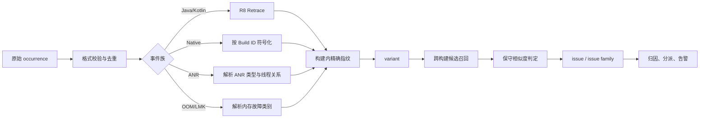

# 应用稳定性度量、聚合与归因

稳定性排查先要区分用户现象和进程结局。用户看到的“闪退、卡死、白屏、重新启动”，可能来自应用崩溃（Crash）、系统判定应用无响应（ANR，Application Not Responding）、内存不足（OOM，Out of Memory）或低内存杀进程，也可能只是 WebView 网页渲染进程退出。把故障事件、进程是否退出和证据来源分开后，才能选择合适的指标与修复方法。

平台源码按 Android 17 / API 37 / `android-17.0.0_r1` 核对；涉及内核内存回收的内容按 `android17-6.18-2026-06_r6` 核对。

稳定性治理先定义 Crash、ANR、OOM、进程退出和功能不可用等结果，再统一用户、会话、设备和版本分母。客户端聚合负责去重与补充上下文，服务端归因负责把问题分配到版本、模块和责任变更。

## 故障类型、恢复能力与治理范围

### 先区分“故障事件”和“进程退出”

Crash、ANR、OOM 描述的不是同一层概念：

| 类别 | 触发条件 | 进程是否必然退出 | 首选证据 |
|---|---|---:|---|
| Java Crash | 未捕获的 `Throwable` 到达线程顶层 | 是，默认处理链会终止应用进程 | Java 堆栈、异常链、日志、版本映射 |
| Native Crash | 致命信号，如 `SIGSEGV`、`SIGABRT`、`SIGBUS` | 是 | tombstone（系统生成的 Native 崩溃报告）、原始符号、Build ID（用于匹配二进制文件与符号版本的构建标识） |
| ANR | 系统监测的输入分发或组件执行期限被突破 | 否；进程可能恢复、被用户关闭或被系统处理 | ANR trace（线程堆栈等诊断记录）、原因文本、Perfetto、系统日志 |
| Java 堆 OOM | ART（Android Runtime，Android 运行时）无法满足对象分配 | 不一定；未捕获时通常转成 Java Crash | OOM 异常消息、堆水位、堆转储、分配轨迹 |
| Native 分配失败 | `malloc`、映射或线程创建等资源申请失败 | 不一定；取决于调用方是否正确处理 | tombstone、`errno`（系统错误码）、内存映射表、线程与映射数量 |
| LMKD 终止 | 系统内存压力下，低内存终止守护进程 `lmkd` 选择目标进程 | 是，且应用没有可靠的临终回调 | `ApplicationExitInfo`、Android vitals、系统内存状态 |
| WebView 渲染进程退出 | 渲染进程崩溃或被系统回收 | 宿主进程可以存活 | `onRenderProcessGone()`、`RenderProcessGoneDetail` |

`OutOfMemoryError` 表示进程内分配失败，`REASON_LOW_MEMORY` 是系统在进程退出历史中记录的低内存终止原因，两者不能互相替代。ANR 也不能简化成“主线程卡住五秒”：`BroadcastReceiver` 可以运行在自定义 `Handler` 对应的线程，系统还会为 Service、Provider 等组件使用不同的期限。

### Crash 的两条终止链

#### Java Crash：未捕获异常到默认处理器

当 `Throwable` 逃出线程入口，Java 层会进入 [`Thread.dispatchUncaughtException()`](https://android.googlesource.com/platform/libcore/+/refs/tags/android-17.0.0_r1/ojluni/src/main/java/java/lang/Thread.java)。Android 进程初始化时，[`RuntimeInit.commonInit()`](https://android.googlesource.com/platform/frameworks/base/+/refs/tags/android-17.0.0_r1/core/java/com/android/internal/os/RuntimeInit.java) 安装两个处理器：

1. `LoggingHandler` 被注册为 pre-handler（前置未捕获异常处理器），负责写入致命异常日志。应用可以替换默认处理器，但不能通过公开的 `Thread` API 替换这个前置处理器。
2. `KillApplicationHandler` 被注册为 default handler（默认未捕获异常处理器）。它向 ActivityManager 报告 `ParcelableCrashInfo`，并在 `finally` 代码块中依次调用 `Process.killProcess(Process.myPid())` 和 `System.exit(10)`。

应用或第三方崩溃采集 SDK（Software Development Kit，软件开发工具包）调用 `Thread.setDefaultUncaughtExceptionHandler()` 后，会替换 `KillApplicationHandler` 的默认位置。自定义处理器应保存并调用安装前的处理器；若只写文件或发网络请求后直接返回，就会改变系统默认语义，也无法确认进程还能安全运行。

致命路径还要接受三个限制：

- 任意线程都可能触发，主线程、线程池和第三方 SDK 线程都要覆盖。
- 进程可能处于锁状态异常、内存紧张或 Binder（Android 进程间通信机制）不可用状态，上传只能尽力而为。
- 应在崩溃前持续写入少量 breadcrumb（用户操作和状态变化线索）；崩溃时只保存固定大小、可校验的数据，重启后再补传。

Java 堆栈需要与当前版本的 R8 混淆映射文件（mapping）、动态特性模块和热修复版本对应。堆栈可读不代表根因就在栈顶：异步切换、反射、协程恢复和异常包装都可能丢失上游调用信息。[20.2 Java Crash、异常架构与线程堆栈分析](02-java-crash-exception-stack-analysis.md) 会继续讨论异常架构、反混淆和聚类。

#### Native Crash：信号处理器、`crash_dump` 与 `tombstoned`

Android 17 的 Native Crash 不能概括为“debuggerd 守护进程捕获信号”。更准确的链路是：

1. Android C 库 bionic 与 debuggerd 诊断组件在进程内安装致命信号处理器，处理 `SIGSEGV`、`SIGABRT`、`SIGBUS` 等信号。
2. [`debuggerd_signal_handler`](https://android.googlesource.com/platform/system/core/+/refs/tags/android-17.0.0_r1/debuggerd/handler/debuggerd_handler.cpp) 保存 `siginfo_t` 与 `ucontext_t`，派生子进程并执行相应位数的 `crash_dump32` 或 `crash_dump64`。
3. [`crash_dump`](https://android.googlesource.com/platform/system/core/+/refs/tags/android-17.0.0_r1/debuggerd/crash_dump.cpp) 通过 `ptrace`（进程跟踪接口）暂停并读取目标线程，连接 `tombstoned` 取得输出文件描述符，生成文本和 Protocol Buffers（protobuf，结构化二进制格式）形式的 tombstone。
4. [`tombstoned`](https://android.googlesource.com/platform/system/core/+/refs/tags/android-17.0.0_r1/debuggerd/tombstoned/tombstoned.cpp) 管理 tombstone 的存储与轮转；栈回溯使用的是 Android 的 `libunwindstack`，不应写成泛指的 `libunwind`。

tombstone 的诊断价值来自信号、`si_code`、故障地址、寄存器、线程栈、内存映射、Build ID 和内存标签等信息。线上符号化必须按 ABI（Application Binary Interface，二进制接口约定）、Build ID 和发布版本取回未剥离符号；只按 `.so` 文件名匹配，很容易把地址解析到错误源码。系统信号、debuggerd 链路、栈回溯与符号解析统一见 [20.3 Native Crash、堆栈回溯与符号化](03-native-crash-unwinding-symbolication.md)。

### ANR：系统的超时判定

ANR 表示系统认定应用没有在规定时间内完成某类交互或组件工作。它是一段诊断与策略流程，不是某个异常类，也不保证进程立刻退出。

常见入口及其边界如下：

| 入口 | Android 17 下应怎样理解 |
|---|---|
| Input dispatching timeout（输入分发超时） | AOSP 与 Pixel 的默认期限是 5 秒，设备厂商可以调整。输入事件没有得到可继续分发的响应时，由 InputDispatcher 发起判定。 |
| BroadcastReceiver timeout（广播接收超时） | Android 13 及更低版本中，带 `FLAG_RECEIVER_FOREGROUND` 的广播默认 10 秒，其他广播默认 60 秒；Android 14 起，进程因调度得不到足够 CPU 时间时可分别放宽到 10～20 秒和 60～120 秒。 |
| Service execution timeout（Service 执行超时） | AOSP 与 Pixel 的默认期限是前台 Service 20 秒、后台 Service 200 秒；设备配置可以调整，各类前台服务还有独立的执行期限。 |
| ContentProvider 响应超时 | 调用方可通过 `ContentProviderClient.setDetectNotResponding()` 设置检测期限；Provider 启动、发布和访问还涉及 `system_server` 内的其他等待路径。 |

“主线程栈看起来空闲”不能直接排除 ANR。以广播为例，广播接收器可以通过自定义 `Handler` 运行在非主线程，也可以调用 `goAsync()` 转交异步工作；同步接收器以 `onReceive()` 返回为完成点，异步接收器以 `PendingResult.finish()` 为完成点。应检查实际执行线程、Binder 对端和 CPU 调度情况。输入 ANR 也可能来自无焦点窗口、窗口尚未就绪、主线程等待 Binder 或锁。

进入 [`AnrHelper`](https://android.googlesource.com/platform/frameworks/base/+/refs/tags/android-17.0.0_r1/services/core/java/com/android/server/am/AnrHelper.java) 后，Android 核心系统服务进程 `system_server` 会协调堆栈与进程状态采集，再依据可见性、后台策略和用户操作处理事件。前台可能出现“应用无响应”对话框；后台静默 ANR 可能只留下报告。用户选择等待后，进程可以继续运行，因此不能把每次 ANR 都计为一次退出。

诊断 ANR 时至少对齐以下信息：

- ANR 原因文本与发生时间；
- 主线程及相关工作线程的完整栈；
- 持锁线程、Binder 对端和进程 CPU 状态；
- 当时的窗口、组件与进程重要性；
- 同一时间段的 Perfetto（Android 系统级性能轨迹工具）调度、Binder、I/O 和 GC（垃圾回收）轨迹。

官方的 [ANR 诊断指南](https://developer.android.com/topic/performance/anrs/diagnose-and-fix-anrs) 给出了不同入口的判定方法；[20.4 ANR 治理策略](04-anr-governance.md)会按输入、广播、Service 和 Provider 分析证据。

### OOM 与低内存杀进程：四条资源路径

#### Java 堆分配失败

ART 对象分配通常先走分配器的快速路径；空间不足时会触发与分配相关的 GC、尝试扩展堆，并在仍无法满足请求时抛出 `OutOfMemoryError`。异常消息可能指出 Java 堆空间不足、线程创建失败或其他分配场景，不能只凭异常类型判定为“内存泄漏”。

`Runtime.maxMemory()` 与 `ActivityManager.getMemoryClass()`、`getLargeMemoryClass()` 的值取决于设备和运行时配置。`android:largeHeap="true"` 只请求较大的应用堆类别，没有固定的 512 MB 保证，也不会消除 Native 内存、图形内存或系统内存压力。它通常只是推迟故障并增加 GC 成本，应先修正对象生命周期和峰值内存设计。

在局部操作里捕获 `OutOfMemoryError` 只适用于准备充分的降级路径，例如图片解码失败后释放临时资源并返回占位图。未捕获 OOM 到达线程顶层时，进程可能已经缺少再次分配、加锁或启动线程所需的资源，不应在未捕获异常处理器中创建大对象、生成完整堆转储或同步上传。

#### Native 堆、映射与地址空间

Native `malloc` 分配失败通常返回 `nullptr` 并设置错误码；调用方若未检查，后续空指针访问会表现为 Native crash。连续映射、地址空间碎片、地址空间布局限制、驱动映射和 Native 泄漏也可能使申请失败。此时只看 Java 堆曲线会得出错误结论。

#### 线程和文件描述符

创建线程需要线程控制结构、栈映射和内核任务资源。`pthread_create` 返回 `EAGAIN`（当前资源不足）或其他错误后，Java 层可能抛出带有 `pthread_create` 信息的 `OutOfMemoryError`。这种故障应同时检查线程数量、线程来源、栈大小和进程资源限制。

FD（File Descriptor，文件描述符）耗尽通常表现为 `EMFILE`（进程打开的文件描述符达到上限），随后文件或网络套接字创建失败。它与虚拟地址空间耗尽是两类故障。FD 泄漏还会引发数据库、网络、资源加载或 Binder 相关异常，监控时应单列 FD 数量与类别。[20.7 FD 耗尽监控与故障排查](07-fd-resource-monitoring.md)会展开这类资源故障。

#### LMKD 与内核 OOM

内存压力下，Android 的 [`lmkd`](https://android.googlesource.com/platform/system/memory/lmkd/+/refs/tags/android-17.0.0_r1/lmkd.cpp) 会读取 PSI（Pressure Stall Information，资源压力导致任务停顿的内核统计）等信号，结合 `oom_score_adj`、进程重要性和预计回收量选择目标进程。被选中的应用没有可靠的 Java 临终回调，进程可能直接以 `SIGKILL` 结束。这类结果简称 LMK（low-memory kill，低内存终止）。

内核 OOM killer 是系统无法释放足够内存时的更底层终止机制，Android 17 对应实现见 [`android17-6.18-2026-06_r6/mm/oom_kill.c`](https://android.googlesource.com/kernel/common/+/refs/tags/android17-6.18-2026-06_r6/mm/oom_kill.c)。排查线上 LMK 时，应优先使用 `ApplicationExitInfo`、Android vitals 和设备内存分层数据；每次应用低内存退出不一定都有内核 OOM 日志。

[20.5 OOM、进程资源治理与 WebView Renderer 恢复](05-oom-webview-renderer-recovery.md)会继续区分 Java heap、Native heap、线程、映射、图形内存与 LMK。

### 用 `ApplicationExitInfo` 读取“上一次进程发生了什么”

API 30 引入的 [`ApplicationExitInfo`](https://developer.android.com/reference/android/app/ApplicationExitInfo) 是进程退出后留下的系统记录，不是实时崩溃回调。常见原因码（reason）的解释如下：

| reason | 含义与使用边界 |
|---|---|
| `REASON_CRASH` | 未处理的 Java 异常导致进程退出；结合应用侧异常堆栈确认。 |
| `REASON_CRASH_NATIVE` | Native crash；API 31 起 `getTraceInputStream()` 可能返回 tombstone protobuf。 |
| `REASON_ANR` | 进程因 ANR 被记录为退出；trace 可能存在，也可能因轮转等原因返回 `null`。 |
| `REASON_LOW_MEMORY` | 系统低内存终止进程；设备不支持精确上报时，可能只看到 `REASON_SIGNALED` 与 `SIGKILL`。可用 `ActivityManager.isLowMemoryKillReportSupported()` 检查支持情况。 |
| `REASON_SIGNALED` | 进程因信号退出；必须结合 `getStatus()` 与上下文判断，不能一律归为 Native crash。 |
| `REASON_INITIALIZATION_FAILURE` | 进程在初始化或 attach 阶段失败。 |
| `REASON_DEPENDENCY_DIED` | 依赖进程死亡导致本进程退出。 |
| `REASON_EXCESSIVE_RESOURCE_USAGE` | 系统因资源使用过量终止进程。 |
| `REASON_USER_REQUESTED` | 用户强行停止应用或将其移出最近任务。Android 13 及更低版本还可能用它记录应用更新或组件状态变化。 |
| `REASON_PACKAGE_STATE_CHANGE` / `REASON_PACKAGE_UPDATED` | API 34 起分别记录组件状态变化和应用更新，避免再与用户操作混为一类。 |

下面的代码只演示重启后枚举退出记录；生产实现还需要持久化已消费的时间戳或唯一键，并在后台读取大 trace。

```kotlin
@RequiresApi(30)
fun readRecentExits(context: Context): List<ApplicationExitInfo> {
    val am = context.getSystemService(ActivityManager::class.java)
    return am.getHistoricalProcessExitReasons(
        /* packageName = */ null,
        /* pid = */ 0,
        /* maxNum = */ 20,
    )
}
```

返回列表应按 `processName`、`timestamp`、`reason`、`status` 和 `importance` 处理。`getPss()` 返回按比例分摊共享内存后的驻留量，`getRss()` 返回全部驻留物理内存；两者都是系统最近一次采样值，可能为 0，也不是死亡瞬间的精确快照。`getTraceInputStream()` 的数据保存在全局环形缓冲区中，可能被其他应用的新记录覆盖而返回 `null`。如果进程发生 ANR 后恢复，随后因别的原因死亡，该退出记录仍可能附带之前的 ANR trace，所以原因码与 trace 内容要分别判断。

从事件到证据，可以用下面这条路径做快速分流。

```text
用户现象
  ├─ 应用进程退出
  │    ├─ 未捕获 Throwable ── Java stack ── Java Crash
  │    ├─ 致命 signal ────── tombstone ─── Native Crash
  │    └─ 无临终回调 ─────── ExitInfo ──── LMKD / 系统终止 / 用户操作
  ├─ 应用进程仍在
  │    └─ 系统超时报告 ───── ANR trace ─── Input / Broadcast / Service / Provider
  └─ 宿主仍在但页面消失
       └─ onRenderProcessGone ──────────── WebView renderer 退出
```

这条分流只负责选择证据，不直接判定根因。例如 `SIGABRT` 可能来自显式 `abort()`、内存分配器自检或运行时主动终止；`REASON_LOW_MEMORY` 也不能单独证明应用存在泄漏。

### Google Play Android vitals 与内部指标

#### Play 的口径和阈值

截至 2026-08-14，Google Play 将用户感知崩溃率和用户感知 ANR 率列为稳定性 core vitals（影响应用在 Play 中可见性的核心指标）：

| 指标 | 口径 | 全机型不良行为阈值 | 单手机型号阈值 |
|---|---|---:|---:|
| 用户感知崩溃率（User-perceived crash rate） | 每日用户中，至少一次在活跃使用期间遇到崩溃的用户占比 | 1.09% | 8% |
| 用户感知 ANR 率（User-perceived ANR rate） | 每日活跃用户中，至少一次遇到用户感知 ANR 的用户占比 | 0.47% | 8% |

对用户感知崩溃，官方给出的活跃使用示例包括显示 Activity 或运行前台服务（foreground service）。当前用户感知 ANR 率只统计 input dispatching timed out（输入分发超时）类型。daily active user（DAU，每日活跃用户）按“设备上的一个用户在一天内使用过应用”计数；同一用户、同一设备当天打开多次仍计一次。Google Play 通常使用最近 28 天数据评估质量，出现突增时也可能提前采取措施。达到或超过阈值可能降低应用在 Play 的可见性，也可能在商店详情页显示警告；官方没有把它表述为固定的审核拒绝线。当前阈值以 [Play Console Android vitals 帮助页](https://support.google.com/googleplay/android-developer/answer/9844486) 为准。

Android vitals 与 SDK 看板出现不同结果很常见。这里的 session 指按团队规则划定的一次连续使用，会话中的 event 指一次具体故障事件：

- Android vitals 来自 Android 系统，能够覆盖 SDK 初始化前的部分故障；
- 只纳入符合 Play 数据条件的认证设备、Play 安装和同意共享数据的用户；
- 受隐私最小样本与展示延迟影响；
- Play 以每日用户或每日活跃用户为主要分母，很多 SDK 使用会话数或事件数作为分母。

不应期待两个系统使用相同数据源或得到接近的数值。团队需要明确每张看板回答的问题，无须强行对齐数字。定义与数据条件见 [Android Vitals](https://developer.android.com/topic/performance/vitals) 和 [Crash 指标说明](https://developer.android.com/topic/performance/vitals/crash)。

#### 团队内部指标必须写清分子与分母

内部没有适用于所有应用的“0.2% 红线”或“99.5% 行业基线”。业务使用时长、进程模型、会话定义和设备分布不同，直接复制一个百分比没有比较价值。建议至少维护以下指标：

| 指标 | 计算方式 | 适合回答的问题 |
|---|---|---|
| 受影响用户率 | 发生目标事件的去重用户数 ÷ 同窗口活跃用户数 | 有多少用户受到影响 |
| 无崩溃用户率（Crash-free users） | 1 − Crash 受影响用户率 | 版本总体体验 |
| 无崩溃会话率（Crash-free sessions） | 无崩溃的会话数 ÷ 全部会话数 | 一次使用能否完成；前提是固定会话边界 |
| 事件率 | 事件次数 ÷ 会话数，可换算为每万次会话 | 高频重复故障是否恶化 |
| 启动致命故障率 | 启动阶段致命崩溃次数 ÷ 启动次数 | 用户是否无法进入核心页面 |
| ANR 受影响用户率 | 发生目标 ANR 的去重用户数 ÷ 活跃用户数 | ANR 的用户影响 |
| LMK 退出率 | `REASON_LOW_MEMORY` 等受支持记录 ÷ 可观测进程运行或活跃用户 | 内存压力是否导致进程丢失 |
| 新增故障簇影响 | 新版本新增问题簇的用户数、事件数和关键路径占比 | 是否由本次发布引入 |

每个指标都要附版本、渠道、机型或内存容量档位、ABI、时间窗口、分子、分母和最小样本量。样本很少时，单个百分比会剧烈波动；发版门禁应同时参考历史基线、表示统计不确定范围的置信区间，以及故障严重度。

### 采集方式怎么选

| 方式 | 覆盖重点 | 优势 | 主要缺口 |
|---|---|---|---|
| Google Play Android vitals | Crash、ANR、LMK 等系统质量信号 | 不依赖应用 SDK 存活；能看 Play 设备与型号分布 | 有数据条件、延迟和隐私阈值；自定义业务上下文少 |
| Crashlytics 等崩溃 SDK | Java/Native Crash、部分 ANR 与业务上下文 | 接入快，具备版本、用户影响与聚类能力 | 能力随 SDK、Android 版本和配置变化；致命路径上传仍受进程死亡限制 |
| 自建 Java 异常处理器 | 未捕获 Java `Throwable` | 可以保存业务 breadcrumb 与自有事件模型 | 只能尽力写入；替换默认处理器必须保留委托链 |
| 自建 Native 捕获 | Native 信号、采样与自有 minidump（只保存诊断所需信息的小型转储） | 可控制上下文和符号体系 | 只能使用异步信号安全（signal-safe）操作、处理器可能冲突，且系统迁移和兼容成本高 |
| `ApplicationExitInfo` | API 30+ 的历史退出原因与部分 trace | 能补上 LMK、ANR、信号退出等进程外证据 | 只能在后续进程读取；记录和 trace 可能缺失 |
| `ProfilingManager` | API 35+ 的按请求采集；API 36+ 的系统事件触发采集 | 系统管理速率、存储与结果交付 | 请求与触发都不保证产生结果；必须做版本与能力检测 |

Android 17 / API 37 增加 `ProfilingTrigger.TRIGGER_TYPE_OOM`：发生 Java `OutOfMemoryError` 时，系统可以返回 Java 堆转储。应用需用 `addProfilingTriggers()` 注册触发器，并用 `registerForAllProfilingResults()` 注册结果监听器。若应用安装了自定义 `Thread.UncaughtExceptionHandler`，它必须继续调用默认处理器，否则该 OOM 触发器无法工作。应用设置的触发间隔和系统限流会同时生效，结果不保证交付。API 演进与接入方式见 [14.8 ProfilingManager](../../part3-tools/ch14-other-tools/08-profiling-manager.md)。

是否建设自研采集，不应只看 DAU。更有用的判断标准是：现有平台缺少的证据是否反复导致问题无法定位，团队能否长期维护 Android 版本兼容、隐私治理、符号服务、去重和成本控制。

### 稳定性治理流程

稳定性治理可以按下面的顺序循环，每一步都有可检查的输入和产物。

```text
预防 → 发现 → 证据分类 → 诊断 → 修复 → 分阶段验证
  ↑                                      │
  └──────── 规则、测试与设计约束更新 ─────┘
```

这个流程把“证据分类”单独列出，是为了避免拿 Java Crash 的处理方式分析 ANR，或把所有 `SIGKILL` 都算作 LMK。

#### 预防

- 用 Lint、Detekt 等静态检查工具、编译器检查和自定义规则约束空值、资源关闭、线程创建与主线程 I/O。
- 在调试或测试构建中启用 StrictMode（在运行时发现主线程磁盘或网络访问等问题）、sanitizer（运行时错误检查工具）、GWP-ASan、MTE 等能力，尽早暴露错误。GWP-ASan 与 MTE 用于发现部分 Native 内存安全问题，设备、构建和性能要求见 [20.11 MTE 与 GWP-ASan Native 内存安全检测](11-mte-gwp-asan-native-memory-safety.md)。
- 为主线程任务、Binder 调用、启动阶段、缓存和并发数量制定时间或资源预算。
- 主动制造低内存、进程重建、网络失败、磁盘满、FD 或线程耗尽、服务端降级等条件，验证故障处理路径。这类测试称为故障注入。
- 对高风险变更使用可远程关闭的功能开关、限制高风险功能的安全模式、逐步扩大用户比例的灰度发布，以及能够恢复旧值的配置。

异常捕获不能替代这些设计。给 `WebView` 初始化包一层异常捕获无法处理网页渲染进程退出；把 `SharedPreferences.commit()` 包装起来也不会消除主线程同步 I/O 引起的 ANR。

#### 发现与证据分类

- 看板按版本、渠道、机型、内存容量档位、ABI 和关键路径拆分。
- 告警同时考虑绝对影响用户数、相对历史基线、增长速度和严重度。
- Java/Native Crash 按去除易变地址和行号后的堆栈、异常或信号、Build ID 聚类；ANR 按原因文本、阻塞关系和主线程状态聚类。
- 对重启后的 `ApplicationExitInfo` 去重，避免每次启动重复上报同一条历史记录。
- 区分新出现的问题簇、已有问题再次恶化和单机型异常，避免总体均值掩盖局部故障。

#### 诊断

诊断的目标是提出能够被证据验证或推翻的根因假设：

- Java Crash：异常因果链、异步来源、R8 混淆映射文件、breadcrumb 和输入数据；
- Native Crash：tombstone、Build ID、完整符号、故障地址、寄存器和相关内存工具报告；
- ANR：原因文本、全线程栈、锁与 Binder 关系、CPU 调度、I/O 和 GC；
- OOM/LMK：Java、Native 和图形内存，线程、FD、映射、进程重要性、设备内存容量与退出历史。

堆栈顶帧只能说明故障在哪里被观察到。若假设是“锁竞争导致输入 ANR”，还要找到持锁线程、持锁区间及其 I/O 或 Binder 依赖；若假设是“泄漏导致 LMK”，还要证明保留对象或 Native 分配随生命周期持续增长。

#### 修复与验证

修复方案要同时写明根因、受影响的功能与用户、兼容范围、回归风险和撤回条件。发布时先覆盖内部用户与小比例外部用户，再逐步扩大；验证要比较同一口径下的修复组、历史基线和未修复版本。

以下情况不应只凭一天的百分比宣布修复完成：

- 样本量不足，置信区间仍覆盖历史水平；
- 原故障簇下降，但同根因迁移到了新堆栈；
- 总体指标改善，特定机型、Android 版本或内存容量档位恶化；
- Crash 数下降，但启动失败、ANR 或 LMK 上升。

验证通过后，把能自动检查的经验写入静态规则、测试、资源预算或发布检查项；无法自动检查的部分，要写清负责团队和复查时机。

### 发版门禁与组织责任

发版门禁指扩大用户覆盖前必须满足的一组检查条件，至少包含三类：

1. **绝对条件**：关键路径不可用、启动 Crash、数据损坏或安全问题达到约定严重度时停止扩大发布。
2. **相对条件**：新版本相对可比基线的 Crash、ANR、LMK 或新增问题簇影响显著恶化。
3. **证据条件**：样本达到最低要求，版本、渠道和设备分布可比，监控与符号文件已经就绪。

门禁阈值要来自本产品历史分布与风险承受能力，并定期回看，不能使用来源不明的行业数字。

组织上应明确：

- 每类事件和关键模块的负责团队；
- P0/P1 等团队自定义严重度级别、响应时限与升级路径；
- Native 符号、R8 混淆映射文件、系统性能轨迹和发布配置的保留周期；
- 灰度暂停、配置撤回和紧急发版的决策人；
- 修复验证的结束条件，不能只记录“代码已合入”。

### 专题下钻

- [20.2 Java Crash、异常架构与线程堆栈分析](02-java-crash-exception-stack-analysis.md)：异常处理器、反混淆、异步异常与恢复边界。
- [20.3 Native Crash、堆栈回溯与符号化](03-native-crash-unwinding-symbolication.md)：tombstone、符号化和内存安全工具。
- [20.4 ANR 治理策略](04-anr-governance.md)：不同 ANR 入口的诊断记录与系统链路。
- [20.5 OOM、进程资源治理与 WebView Renderer 恢复](05-oom-webview-renderer-recovery.md)：Java、Native、线程、映射与 LMK，以及宿主进程与网页渲染进程的故障隔离。

### 第一部分的核查入口

- 平台：AOSP [`android-17.0.0_r1`](https://android.googlesource.com/platform/manifest/+/refs/tags/android-17.0.0_r1/)
- Java 致命异常处理：[`RuntimeInit.java`](https://android.googlesource.com/platform/frameworks/base/+/refs/tags/android-17.0.0_r1/core/java/com/android/internal/os/RuntimeInit.java)
- ART 堆：[`heap-inl.h`](https://android.googlesource.com/platform/art/+/refs/tags/android-17.0.0_r1/runtime/gc/heap-inl.h) · [`heap.cc`](https://android.googlesource.com/platform/art/+/refs/tags/android-17.0.0_r1/runtime/gc/heap.cc)
- Native crash：[`debuggerd/handler`](https://android.googlesource.com/platform/system/core/+/refs/tags/android-17.0.0_r1/debuggerd/handler/) · [`crash_dump.cpp`](https://android.googlesource.com/platform/system/core/+/refs/tags/android-17.0.0_r1/debuggerd/crash_dump.cpp) · [`tombstoned`](https://android.googlesource.com/platform/system/core/+/refs/tags/android-17.0.0_r1/debuggerd/tombstoned/) · [`libunwindstack`](https://android.googlesource.com/platform/system/unwinding/+/refs/tags/android-17.0.0_r1/libunwindstack/)
- ANR：[`AnrHelper.java`](https://android.googlesource.com/platform/frameworks/base/+/refs/tags/android-17.0.0_r1/services/core/java/com/android/server/am/AnrHelper.java) · [官方 ANR 诊断指南](https://developer.android.com/topic/performance/anrs/diagnose-and-fix-anrs)
- 退出历史：[`ApplicationExitInfo`](https://developer.android.com/reference/android/app/ApplicationExitInfo)
- 进程隔离：[`WebViewClient.onRenderProcessGone()`](https://developer.android.com/reference/android/webkit/WebViewClient#onRenderProcessGone(android.webkit.WebView,android.webkit.RenderProcessGoneDetail))
- 系统性能采集：[`ProfilingManager`](https://developer.android.com/reference/android/os/ProfilingManager) · [`ProfilingTrigger`](https://developer.android.com/reference/android/os/ProfilingTrigger)
- 内存回收：[`lmkd.cpp`](https://android.googlesource.com/platform/system/memory/lmkd/+/refs/tags/android-17.0.0_r1/lmkd.cpp) · 内核 [`android17-6.18-2026-06_r6/mm/oom_kill.c`](https://android.googlesource.com/kernel/common/+/refs/tags/android17-6.18-2026-06_r6/mm/oom_kill.c)
- 指标：[Android Vitals](https://developer.android.com/topic/performance/vitals) · [User-perceived crash rate](https://developer.android.com/topic/performance/vitals/crash) · [Play Console Android vitals 帮助](https://support.google.com/googleplay/android-developer/answer/9844486)


## 分母、窗口、分位与版本口径

故障分类明确后，每个指标必须固定事件定义和分母。Crash 次数、受影响用户和无崩溃会话回答的问题不同。

前一部分已经说明 Crash、ANR 与 OOM 的边界。同一批故障数据还要算出可以解释、可以复算、可以指导发布的指标。

平台源码按 Android 17（API 37，`android-17.0.0_r1`）核对。Google Play 和 Firebase 的统计规则独立于 AOSP 版本，文中的阈值与产品统计规则按 2026 年 8 月 14 日的官方文档核对。把这些外部数字写进长期发布判定规则前，还要再次确认服务端文档是否更新。

本文所说的“统计规则”包括分子、分母、时间窗、纳入范围和去重方式；团队里常用的“口径”就是这组规则。`fatal` 指数据源标记为致命、会结束进程或会话的 Crash 事件，不能代指所有系统终止。

### 先确定统计对象

“崩溃率”这个名字至少可能指五种分数。它们的分母不同，回答的问题也不同。

| 统计对象 | 分子 | 分母 | 回答的问题 |
|---|---|---|---|
| 活跃安装实例日 | 当天至少发生一次故障的安装实例日 | 当天活跃安装实例日 | 有多大比例的日活受到影响；一个安装实例每个活跃日算一个单位 |
| 用户或安装实例 | 观察期内至少发生一次 fatal 的去重实例 | 观察期内有活动的去重实例 | 观察期内有多少实例保持无崩溃 |
| 会话 | 至少发生一次 fatal 的会话 | 有效会话 | 一次使用过程有多大概率因崩溃结束 |
| 启动尝试 | 以 fatal 或进程异常退出结束的启动尝试 | 有效启动尝试 | 用户能否进入可用界面 |
| 原始故障事件 | Crash、ANR 或其他故障事件 | 启动数、会话数或运行时长 | 故障发生频率与诊断负荷 |

指标文档、事件上报协议和 SQL 必须写出分子、分母、时间窗、范围和去重键（判断两条记录是否属于同一实体的字段）。只写“UV 崩溃率”或“PV 崩溃率”仍然不够：UV（unique visitor，去重访问者）可能指账号、设备或安装实例；PV（page view）在多数分析系统中表示页面浏览量，不能代称 Session（一次连续使用会话）。

#### 原始事件和派生指标分开保存

端侧至少要为一次故障携带这些关联键：

- `event_id`：一次采集事件的稳定标识，用来消除重传产生的重复记录；
- `installation_id`：经过隐私设计的安装实例标识，不要直接上传账号、IMEI 或 Android ID；
- `process_start_id`：区分同一安装实例的不同进程生命周期；
- `session_id`：由团队明确规则生成的会话标识；
- `launch_id`：一次有效启动尝试的标识；
- `cluster_id`：服务端完成符号化（把代码地址还原为函数和行号）与归一化后，为同类根因报告生成的问题组标识。

原始事件表保留每次故障。诸如“同一安装实例、同一问题组、五分钟只算一次”的规则只能用于从原始数据计算出的指标表，不能覆盖原始事件，否则重复崩溃和 crash loop（启动后连续崩溃、用户难以进入应用）会被数据清洗隐藏。

分母也需要可观测。会话开始记录没有成功上传、旧版本没有接入 SDK、用户关闭采集、进程在 SDK 初始化前退出，都会让指标看起来偏好。建议同时展示：

- 具备采集能力的版本覆盖率；
- 会话开始与会话结束的上报完整率；
- 崩溃本地暂存和下次启动补传的成功率；
- Java mapping（混淆名称还原表）、Native 符号表和 Build ID（二进制构建标识）的匹配率；
- Google Play 安装来源、用户授权和隐私门槛带来的样本范围。

采集或上传缺失会直接改变分子、分母，决定指标能否用于发布判定。

### 常用 Crash 指标

#### 日活受影响率

内部系统常把匿名安装实例近似为“用户”。在这种定义下，日活受影响率为：

$$
\text{Daily affected rate}
=
\frac{\text{当天至少发生一次 Crash 的去重安装实例数}}
{\text{当天活跃安装实例数}}
$$

同一个安装实例当天崩溃一次或十次，分子都只增加一。这项指标适合描述影响面，却看不出重复崩溃的严重程度。用户每天使用时长、会话次数和设备分布也会改变暴露机会，因此不同产品之间不宜直接横比。

若产品使用账号去重，必须额外说明游客、多账号和多设备的处理方式。Google Play 与 Crashlytics 都不按业务账号统计，三个系统里的“用户”不能直接视为同一个实体。

#### Crash-Free Users

[Firebase Crashlytics 的官方定义](https://firebase.google.com/docs/crashlytics/crash-free-metrics) 是：

$$
\text{Crash-Free Users}
=
1 -
\frac{\text{观察期内发生过 fatal 的去重安装实例数}}
{\text{观察期内有活动的去重安装实例数}}
$$

Crashlytics 把一台设备上的一次应用安装视为一个 user。一个人在两台设备上安装应用，会被计为两个 user。这个指标只使用 fatal 事件；non-fatal（应用捕获并主动上报、没有结束进程的错误）与 ANR 过滤条件不会进入 Crash-Free 图表。

它是整个观察期的去重聚合，并非每天 Crash-Free Users 的算术平均。观察期越长，同一实例遇到至少一次崩溃的机会越大，所以 1 天与 28 天的数值不能直接比较。

#### Crash-Free Sessions

Crash-Free Sessions 表示观察期内没有因 fatal 结束的会话占比。下面的公式从 1 中减去受影响会话比例：

$$
\text{Crash-Free Sessions}
=
1 -
\frac{\text{发生 fatal 的去重会话数}}
{\text{全部有效会话数}}
$$

这个公式不能改写为 `1 - 崩溃事件数 / 会话数`。Fatal 通常会结束当前会话；若重复上传或数据异常产生多条 fatal 记录，同一个受影响会话仍只能计一次。

Crashlytics 当前把冷启动视为新会话；应用进入后台至少 30 分钟后再次回到前台，也开始新会话。自建指标可以采用别的边界，但名字中要标明是内部会话，避免与 Crashlytics 数值互相校验时产生误判。

会话指标减少了“重度用户只计一个 user”的影响，却没有消除会话长度、前后台切换习惯和事件上报完整率的差异。跨应用比较前，仍要确认会话定义和采集范围一致。

#### 启动失败率

把 `Application.onCreate()` 到第一个 Activity `onResume()` 当作启动窗口，会漏掉 `Application.onCreate()` 之前的崩溃，也无法区分“界面出现”与“内容可用”。应为冷启动（新建进程）、温启动（进程存在但 Activity 需要重建）和热启动（Activity 仍在内存）分别建立启动尝试，并为每次尝试记录终态：

- `first_frame_presented`：第一帧画面已经提交，用户能看到界面；
- `fully_drawn`：关键内容可用，可与 `Activity.reportFullyDrawn()` 的语义对应；
- `fatal`：启动窗口内发生 Java 或 Native Crash；
- `abnormal_exit`：没有采集到 fatal 事件，但系统记录到相关进程异常退出；
- `abandoned`：应用转入后台或用户离开，不能误算为成功。

以“关键内容可用”为成功条件时，可以计算：

$$
\text{Startup failure rate}
=
\frac{\text{以 fatal 或 abnormal\_exit 结束的有效 launch\_id 数}}
{\text{全部有效 launch\_id 数}}
$$

API 35 起，[`ApplicationStartInfo`](https://developer.android.com/reference/android/app/ApplicationStartInfo) 提供系统记录的应用启动信息；[`ActivityManager.addStartInfoTimestamp()`](https://developer.android.com/reference/android/app/ActivityManager) 允许在 `reportFullyDrawn()` 之前补充开发者时间点，参数必须是单调时钟的纳秒值。键要使用系统为开发者保留的范围；同一个键再次写入会覆盖前值，`reportFullyDrawn()` 之后写入则会被丢弃。它们可以改善启动时间线，但进程内采集仍看不到自身启动前的所有故障，需要和 Android vitals、Crash 平台以及下次进程启动读取的退出记录互相补充。

启动发布规则不应照搬一个通用百分比。支付、导航等关键路径与内容浏览应用面临的风险不同；冷启动量、分阶段发布样本和历史波动也不同。目标应来自稳定版本基线和产品容忍度。

#### 重复崩溃与 crash loop

Crash loop 指应用在连续启动中反复因同一问题崩溃，用户难以进入可用界面。“相同堆栈事件数 / 全部崩溃事件数”混合了问题热度、用户活跃度和重试次数，不能单独表示恢复能力。更有解释力的两个指标是：

$$
\text{Repeated-affected rate}_{cluster}
=
\frac{\text{观察期内该问题组发生至少两次的受影响安装实例数}}
{\text{观察期内该问题组的全部受影响安装实例数}}
$$

$$
\text{Crash-loop launch rate}_{cluster}
=
\frac{\text{连续若干次启动均命中该问题组的安装实例数}}
{\text{该问题组受影响安装实例数}}
$$

“连续若干次”和观察窗口要由产品的启动频率确定。例如，短时间内连续三次启动都在同一初始化问题组崩溃，可以作为 crash loop 候选；低频工具应用可能需要更长窗口。这个条件是团队规则，不是 Android 系统阈值。

### Google Play Android vitals 的统计规则

Android vitals 使用系统侧数据，覆盖范围受安装来源、设备认证、用户数据共享选择和匿名报告门槛影响。它与自建 SDK 的数据不必完全一致。[官方 FAQ](https://developer.android.com/topic/performance/vitals) 也列出了 SDK 初始化前故障、统计范围和分母差异。

#### Crash

[Android vitals Crash 文档](https://developer.android.com/topic/performance/vitals/crash) 给出三项不同指标：

| 指标 | 官方分子 |
|---|---|
| Crash rate | 当天经历过任意类型 Crash 的日活用户 |
| User-perceived crash rate | 当天在应用处于 active use 时至少经历一次 Crash 的日活用户 |
| Multiple crash rate | 当天至少经历两次 Crash 的日活用户 |

这里的 daily active user（DAU，当日活跃用户）按“单个设备上的单日活跃用户”计算：同一人在两台设备使用应用，会贡献两个日活；多人当天使用同一设备，只计一个日活。一次日活可以包含多个应用会话。

对手机和平板，active use（用户正在使用）指应用正在显示 Activity 或执行 foreground service（前台服务）。后台组件崩溃仍会进入总体 Crash rate，只是不一定进入 user-perceived crash rate。Wear OS 有单独规则，不能沿用手机和平板的统计规则。

User-perceived crash rate 是 Google Play 的 core vital，即会影响应用在商店中可见度的主要质量指标。内部“UV 崩溃率”只有在事件范围、日活定义和采样范围均一致时，才可能与它接近。

#### ANR

[Android vitals ANR 文档](https://developer.android.com/topic/performance/vitals/anr) 也区分总体 ANR rate、user-perceived ANR rate 和 multiple ANR rate。当前只有 `Input dispatching timed out` 被计为 user-perceived ANR。Service、Broadcast、ContentProvider、JobService 等 ANR 仍要进入内部故障分析，但不能直接加到 Play 的 user-perceived 分子里。

各类 ANR 的系统期限和版本差异见 [20.4 ANR 治理策略](04-anr-governance.md)。不能用一张“统一超时表”代替系统判断，因为 Input、Broadcast、Service、FGS（前台服务）与 Provider 走的是不同检测路径，部分超时也会以异常退出结束。

#### Bad behavior thresholds（不良行为阈值）

截至 2026 年 8 月 14 日，[Google Play 公布的手机阈值](https://developer.android.com/topic/performance/vitals) 如下：

| Core vital | 全机型阈值 | 单手机型号阈值 |
|---|---:|---:|
| User-perceived crash rate | 1.09% | 8% |
| User-perceived ANR rate | 0.47% | 8% |

达到或超过阈值属于 bad behavior。Play 可能降低应用在商店中的可见度，也可能在详情页显示警告；这些结果都不保证每次发生。Play 每天用最近 28 天的平均值评估质量。这些阈值是商店质量边界，不是团队 SLO 的推荐值。

也不能用 `100% - 1.09% = 98.91%` 推导 Crashlytics 的 Crash-Free Users 发布阈值。两边的故障范围、用户定义、采样范围和时间聚合均不相同。

### Android 17 下的 ANR 观测

#### 四类数据各有边界

| 数据来源 | 能看到什么 | 不能据此断言什么 |
|---|---|---|
| Google Play Android vitals | Play 范围内的系统 Crash/ANR、问题组与 core vitals | 不能代表全部安装来源，也没有应用自定义上下文 |
| 主线程 watchdog（周期向主线程投递轻量探针的监测器） | 消息延迟、线程栈和卡顿前后的业务状态 | 检测到卡顿不等于系统已经判定 ANR |
| `ApplicationExitInfo` | API 30+ 的近期进程死亡记录；部分 ANR trace（现场线程栈和诊断信息） | ANR 可能恢复而不杀进程；历史记录采用只保留近期条目的环形缓冲，trace 也可能为空 |
| ANR warning / profiling trigger | 系统给出的预警信息或诊断产物 | 系统只会尽力提供，回调或产物可能缺席 |

普通应用不能依赖读取 `/data/anr/`。`FileObserver` 即使能观察路径变化，也不意味着进程有权读取系统 traces。

API 30 起，`ActivityManager.getHistoricalProcessExitReasons()` 返回近期进程死亡记录。只有关联记录存在时，才能从 [`ApplicationExitInfo.getTraceInputStream()`](https://developer.android.com/reference/android/app/ApplicationExitInfo#getTraceInputStream()) 尝试读取 trace；该方法允许返回 `null`，系统的全局环形缓冲也可能已经覆盖旧数据。API 37 的 `ApplicationExitInfo.getAnrInfo()` 会在 `reason == REASON_ANR` 时提供结构化 ANR 信息，其他退出原因返回 `null`。

API 36 起，可以通过 [`ProfilingTrigger.TRIGGER_TYPE_ANR`](https://developer.android.com/reference/android/os/ProfilingTrigger#TRIGGER_TYPE_ANR) 请求系统在识别 ANR 后提供运行中的 system trace（记录线程调度、CPU 和系统事件的性能时间线）快照。触发不表示应用一定被杀，系统也不保证每次都返回产物。

API 37 新增 [`ActivityManager.registerAnrWarningListener()`](https://developer.android.com/reference/android/app/ActivityManager#registerAnrWarningListener(java.util.concurrent.Executor,%20java.util.function.Consumer%3Candroid.app.AnrWarningResult%3E))。下面的示意代码只负责在非主线程保存轻量预警字段：

```kotlin
@RequiresApi(37)
fun registerAnrWarningCollector(
    activityManager: ActivityManager,
    executor: Executor,
    persist: (AnrWarningResult) -> Unit,
): Consumer<AnrWarningResult> {
    val listener = Consumer<AnrWarningResult> { warning ->
        persist(warning)
    }
    activityManager.registerAnrWarningListener(executor, listener)
    return listener
}
```

调用方要保存返回的同一个 `Consumer`，停止采集时传给 `unregisterAnrWarningListener()`。Executor（任务执行器）不能使用主线程，`persist` 也应有严格耗时上限。[`AnrWarningResult`](https://developer.android.com/reference/android/app/AnrWarningResult) 提供 `anrId`、`anrType`、`consumedMillis`、`timeoutMillis` 和不保证格式稳定的描述；若事件后来成为 ANR，`anrId` 可与退出信息关联。预警回调可能缺席，也可能来不及执行，不能在这里安排网络请求或复杂恢复。

### Crash 采集与问题分组

#### 端侧只做必要工作

Java/Kotlin 未捕获异常可以由 `Thread.UncaughtExceptionHandler` 记录。自定义处理器必须把异常继续交给安装前保存的默认处理器，并限制磁盘写入量。Android 17 的 [`RuntimeInit.KillApplicationHandler`](https://android.googlesource.com/platform/frameworks/base/+/android-17.0.0_r1/core/java/com/android/internal/os/RuntimeInit.java) 在 `finally` 中调用 `Process.killProcess()` 和 `System.exit(10)`；吞掉默认处理会破坏系统 Crash 语义，也可能让 OOM profiling trigger 等能力拿不到预期信号。更完整的实现和故障边界见 [20.2 Java Crash、异常架构与线程堆栈分析](02-java-crash-exception-stack-analysis.md)。

Native Crash 不能只写成“读取 debuggerd tombstone”。Tombstone 是系统为 native crash 生成的现场记录，普通应用不能任意读取系统文件。可用数据包括自有信号处理器生成的 minidump（只保存必要崩溃上下文的小型文件）、Crash 平台 SDK 产物，以及 API 31+ 在 `ApplicationExitInfo` 中可能提供的 `REASON_CRASH_NATIVE` protobuf（二进制结构化格式）tombstone。Native 符号化必须按 ABI（应用二进制接口）、版本和 Build ID 找到完全匹配的未裁剪符号，详见 [20.3 Native Crash、堆栈回溯与符号化](03-native-crash-unwinding-symbolication.md)。

Crash 或 ANR 时进程随时可能结束，端侧应优先写入应用私有目录的短记录，并在下次启动补传。同步网络上报、长时间加锁、大对象序列化和再次分配大量内存都会扩大失败概率。

#### 问题分组不能只取前几帧

问题分组也叫聚类，目的是把可能来自同一根因的报告放在一起。同一根因在混淆、协程、内联和版本变化后，堆栈前几帧可能变化；不同根因也可能共享顶部框架帧。分组至少要考虑：

- Java/Kotlin：异常类型、cause 链（异常的逐层原因链）、归一化后的应用代码根因帧、mapping 版本；
- Native：signal、fault 类型、归一化后的应用帧、ABI、Build ID 和符号版本；
- ANR：ANR 类型、主线程阻塞点、锁持有者或 Binder 对端、组件类型；
- 公共字段：应用版本、动态模块版本、Android 版本和必要的功能开关。

分组算法更新时要保留旧 `cluster_id` 到新 `cluster_id` 的映射，否则看板会把算法变化误判成新问题或问题消失。

问题排序也不应只看事件数。建议同时展示受影响实例数、受影响会话数、重复受影响率、crash loop、是否命中启动或支付等关键路径、首次出现版本和近期增长速度。

### 看板怎样组织

看板是集中展示质量指标和诊断信息的页面。一张图承载不了商店风险、发版判断、问题诊断和采集健康度，更清楚的做法是分成四层。

#### 质量概览

- Play user-perceived crash rate 与 user-perceived ANR rate，标出 28 天窗口和官方阈值；
- 内部 all-crash、all-ANR 与 OOM/LMK 等分类指标；
- Crash-Free Users、Crash-Free Sessions、启动成功率；
- 当前版本覆盖率、Play 分阶段发布比例和主要渠道占比。

单位或含义不同的指标应使用时间轴对齐的上下图。避免把两条单位不同的曲线放在左右两个纵轴上，因为曲线缩放后容易产生并不存在的相关性。每条曲线都应在图例中写明数据源和分母。

#### 发版对比

新旧版本对比要满足相近的日期、渠道、国家、Android 版本、机型档位与使用场景。新版本只向少量用户分阶段发布时，绝对事件数低并不表示质量更好。

比例指标应同时给出：

- 分子、分母和点估计，即用当前样本直接算出的比例；
- 绝对变化，例如增加 `0.03` 个百分点；“百分点”是两个百分比直接相减得到的差；
- 相对变化，例如相对基线增加 `20%`；
- Wilson 区间或其他适合二项比例的置信区间，用一个范围表达抽样不确定性；Wilson 区间在样本较少或比例接近 0、1 时通常比简单的正态近似稳健；
- 与基线采用相同统计规则的版本和时间窗。

“从 0.10% 上升到 0.12%”的相对增幅是 20%，绝对增幅只有 0.02 个百分点。只展示其中一个数字都可能放大或掩盖风险。样本很少时，置信区间会很宽；此时应继续分阶段发布以收集样本，或补充按设备、渠道等条件分组后的证据，不能把波动直接归因给新版本。

#### 问题诊断

问题组表至少包含影响实例数、事件数、受影响会话数、首次与近期出现时间、版本、机型/API 分布、符号化状态、责任模块和修复状态。Top N 指按某项指标排序后只展示前 N 项；它只是展示数量限制，不代表这些问题必然覆盖固定比例。

机型与 API 热力图用颜色深浅表示不同组合的数值，每个格子还要同时显示分母。只有三次启动的机型出现一次崩溃，样本算出的比例会很高，但证据不足以支持大范围机型屏蔽。

#### 采集链路健康

单独展示 SDK 覆盖率、上报成功率、延迟分布、事件重传率、会话配对率、符号匹配率和各数据源差异。采集链路异常时，质量曲线下降可能只是漏报。

### 告警与分阶段发布规则

固定写死“上涨 20% 就停发”会同时产生两类错误：基线事件数很少时，新增一两个事件就可能触发大量告警；基线样本很大时，新增许多受影响用户也可能因为相对增幅不高而被放过。较稳健的规则通常组合四类信号：

1. **绝对质量边界**：超过团队 SLO 或 Play 公布的不良行为阈值；
2. **相对回归**：同人群、同时间窗下显著差于稳定版本；
3. **新问题组**：新出现的问题组命中启动、登录、支付等高风险路径；
4. **重复失败**：出现 crash loop 或同一实例短时间多次 ANR。

规则还要设置最小分母、置信条件、持续时间和恢复条件。P1/P2 通常表示最高和次高处理优先级，其响应时限由团队值班能力与业务损失确定，不存在适用于所有 Android 应用的每日告警配额。

分阶段发布系统应记录每次提高发布比例、暂停发布和恢复到上一稳定版本的时间点。告警评估使用当时接触到新版本的用户或会话数量作为分母，不能使用全量 DAU。异常只出现在特定设备、国家或渠道时，可以暂停向对应人群发布；证据不足时，不应直接推断所有用户都会出现同样的质量倒退。

### 用 SLO（服务目标）和 Error Budget（错误预算）管理稳定性

#### SLI、SLO 与 SLA

- **SLI（Service Level Indicator，服务水平指标）**：带完整统计规则的观测指标；
- **SLO（Service Level Objective，服务水平目标）**：某个时间窗内 SLI 要达到的目标；
- **SLA（Service Level Agreement，服务水平协议）**：面向外部的承诺及违约后果。

这些定义遵循 [Google SRE 对 SLI、SLO 与 SLA 的说明](https://sre.google/sre-book/service-level-objectives/)。多数 Android 团队需要的是内部 SLO。若没有对客户或合作方作出带后果的承诺，不必把内部发布条件称为 SLA。

一个可执行的 SLO 要写全六项：事件范围、分母、观察窗口、用户范围、数据延迟与完整率要求、例外处理。例如：

> 生产环境 Google Play 渠道中，已接入指定采集版本的有效会话，滚动 30 天 Crash-Free Sessions 不低于 99.8%；会话开始记录完整率低于 99% 时，该窗口只告警采集异常，不给出发版通过结论。

“滚动 30 天”指观察窗口每天向前移动，始终只统计最近 30 天。上面的 99.8% 只是演示写法，不是行业推荐值。团队应根据稳定版本分布、关键场景风险和可承受的故障量选择目标。

#### 错误预算（Error Budget）的单位必须与 SLI 一致

[Google SRE 将错误预算定义为 `1 - SLO`](https://sre.google/workbook/error-budget-policy/)，它表示目标允许消耗的失败份额。指标按会话统计，预算也要按会话计算；指标按安装实例日统计，预算就不能换成事件数。

如果 SLO 是 Crash-Free Sessions：

$$
\text{Allowed bad-session ratio}
=
1 - \text{SLO target}
$$

假设滚动 30 天有 3000 万个有效会话，目标为 99.8%，预算是 6 万个受影响会话。一个受影响会话里出现多条 Crash 记录，仍只消耗一个会话单位。

如果 SLI 使用日活受影响率，预算单位则是“受影响安装实例日”，不是跨 30 天去重后的“用户数”。把 `30 × DAU × 0.2%` 描述成允许崩溃的独立用户数，会重复计算多日活跃的同一实例。

#### Burn rate（预算消耗速率）让告警对应预算消耗

Burn rate 表示当前坏事件比例相对允许比例的倍数。数值为 1，表示按当前速度持续下去会在整个 SLO 窗口内刚好用完预算；数值为 3，表示预算消耗速度是预期速度的三倍：

$$
\text{Burn rate}
=
\frac{\text{observed bad-event ratio}}
{\text{allowed bad-event ratio}}
$$

目标 99.8% 时，允许坏会话比例为 0.2%。若最近一小时坏会话比例为 0.6%，该小时 burn rate 为 3。短观察窗口能发现突发故障，长观察窗口能过滤瞬时噪声。[Google SRE 的多窗口告警方法](https://sre.google/workbook/alerting-on-slos/) 把两者组合，比单个固定百分比更适合控制 30 天预算。

预算耗尽后的动作也要预先约定，例如停止提高分阶段发布比例、只允许稳定性修复进入版本，或恢复到变更前的稳定版本。动作强度取决于剩余预算、问题范围和修复把握，不由某个匿名“行业及格线”决定。

### 复核清单

发布稳定性数据或把它接入发布规则前，可以按下面的顺序复核：

1. 指标名称之后是否写清分子、分母、时间窗、范围和去重键；
2. Google Play、Crashlytics 与内部系统的“用户”“会话”“前台”是否被错误等同；
3. 原始事件是否保留，重复事件与受影响实体是否分别统计；
4. 启动、Crash、ANR、OOM、LMK 的终态是否互斥且可解释；
5. 新旧版本是否在相近暴露人群上比较，并展示分母和统计区间；
6. API 30/31/35/36/37 的采集能力是否按版本降级，系统不保证每次提供的数据是否被误当成必达；
7. 看板是否能识别漏报、延迟、符号缺失和 SDK 覆盖变化；
8. Error Budget 的单位是否与 SLI 一致。

稳定性指标的用途，是把“哪些用户在什么场景受到何种影响”变成可复查的证据。统计规则写清之后，团队才知道应该暂停分阶段发布、修哪个问题组，以及修复后该用什么数据证明风险已经下降。


## 指纹、聚合、变更与责任归因

指标发现回归后，需要用堆栈、信号、设备和版本字段聚合事件，并结合发布变更定位责任范围。

前一部分把 Crash 事件、受影响安装实例、会话和启动尝试分成了不同指标。服务端随后要把海量 occurrence（单次原始故障报告）归入可解释的问题组，判断问题集中在哪些版本、设备或使用场景，并把证据交给合适的团队。本文所说的“归因”是寻找这些集中条件和候选责任模块，不表示仅凭相关性证明因果关系。

平台锚点是 Android 17（API 37，`android-17.0.0_r1`）。聚合算法本身不属于 Android API，但输入数据受 `Throwable`、R8、debuggerd tombstone、`ApplicationExitInfo` 和构建产物约束。忽略这些约束，哈希做得再复杂也只会稳定地产生错误分组。

### 先把四个对象分清

| 对象 | 含义 | 是否可变 |
|---|---|---|
| occurrence / event（原始事件） | 一次 Crash、ANR 或其他故障报告 | 原始内容不可改，只能补充解析结果 |
| variant（堆栈变体） | 同一失败点下非常相似的一组调用路径 | 可随分组算法拆分或合并 |
| issue（待修问题） | 团队准备按一个根因跟踪和修复的问题 | 可人工合并、拆分、关闭或重开 |
| issue family（问题族） | 跨构建、跨版本的相似问题关系 | 只表示分析关系，不应覆盖原始事件的原归属 |

一个 `event_id` 负责消除上传重试产生的重复记录；`variant_id` 和 `issue_id` 负责归类。不能用“同一安装实例五分钟内只计一次”删除原始事件，那会隐藏重复崩溃和 crash loop（连续启动崩溃）。

[Firebase Crashlytics 的公开说明](https://firebase.google.com/docs/crashlytics/troubleshooting) 也采用 issue 与 variant 两层：issue 中的事件有共同失败点，variant 再表示相似堆栈。公开文档只能证明这种产品语义，不能据此推断其未公开算法。

### 聚合流水线

下面的流程把三项工作分开：符号化把混淆名或代码地址还原为函数和源码位置；确定性指纹让相同输入总是生成相同签名；相似度分组再寻找不完全相同但可能同根因的报告。



符号化失败的事件仍要保留，但进入 `unsymbolicated`（未符号化）队列。不能先用不可读的混淆名或绝对地址建立长期 issue，再在符号文件到齐后静默改变它的含义。

#### 先按事件族隔离

Java Crash、Native Crash、ANR 和 OOM/LMK 的证据结构不同，不能只因为“顶部堆栈相似”就放进同一个问题组。LMK 指系统因内存压力结束进程，LMKD 是执行这项判断的 low memory killer daemon（低内存终止守护进程）。

| 事件族 | 主证据 |
|---|---|
| Java/Kotlin fatal | 异常类型、cause 链（逐层异常原因）、崩溃线程帧、suppressed exceptions（被主异常附带记录的次要异常）摘要、构建 mapping（混淆名称还原表） |
| Native fatal | signal、`si_code`、abort message、崩溃线程、模块 Build ID、相对 PC（程序计数器在模块内的偏移）、内存错误报告 |
| ANR | ANR 类型、组件、主线程阻塞点、锁持有者或 Binder 对端、时间窗口 |
| Java heap OOME | ART 的 `OutOfMemoryError` 文案类别、分配点、堆与垃圾回收摘要、进程阶段 |
| LMKD kill | `ApplicationExitInfo` 退出原因、进程重要级、内存压力与进程状态；它不存在 Java 异常堆栈 |

同一功能缺陷可能同时造成 ANR 与后续 Crash，可以在 issue family 或事故层关联，但原始事件族和各自指标必须保留。

### 符号化是聚合前置条件

#### Java / Kotlin：mapping 必须绑定构建

R8 混淆后的 `a.b.c` 只在对应构建中有意义。官方 [R8 retrace](https://developer.android.com/tools/retrace) 使用该构建的 `mapping.txt` 恢复类、方法和行号；mapping 每次构建可能被覆盖，发布系统要按不可变 artifact ID（构建产物标识）保存。

artifact ID 至少包含：

- application ID、version code、build ID；
- product flavor（产品变体）、build type（例如 debug、release）、动态功能模块版本；
- mapping 文件的内容哈希；
- 源码提交版本和依赖锁文件版本。

[Crashlytics 的 Android 指南](https://firebase.google.com/docs/crashlytics/android/get-deobfuscated-reports) 也要求上传与混淆变体对应的 mapping。mapping 缺失时，不能尝试删掉短混淆名中的数字后猜原方法，这会把无关代码合并。

Kotlin inline、协程状态机和 R8 优化可能让一个混淆帧对应多个源位置。聚合器要保存 retrace 的歧义候选，不应只取第一个结果后丢弃其他可能性。

#### Native：Build ID 决定符号版本

绝对 PC（program counter，程序计数器）会受到 ASLR（地址空间布局随机化）影响；不同构建的函数布局也会变化。Native 符号化至少使用 ABI、模块路径、ELF Build ID（二进制构建标识）与模块相对 PC。官方 [`ndk-stack` 文档](https://developer.android.com/ndk/guides/ndk-stack) 要求提供对应 ABI 的未裁剪库；[Native debug symbols 指南](https://developer.android.com/build/include-native-symbols) 说明 `SYMBOL_TABLE` 可恢复函数名，`FULL` 还能恢复文件和行号。

发布流水线要验证：

- 每个随包交付的 `.so` 都有 Build ID；
- stripped（已裁剪调试信息）与 unstripped（保留调试信息）文件的 Build ID 完全相同；
- 符号包按 app build、ABI、模块 Build ID 可检索；
- 动态模块和第三方 Native SDK 也有独立记录；
- 上传成功有回读或抽样符号化验证，不能只看构建任务退出码。

Android 12/API 31 起，应用可能从 [`ApplicationExitInfo.getTraceInputStream()`](https://developer.android.com/reference/android/app/ApplicationExitInfo) 得到 Native tombstone（崩溃现场记录）的 protobuf（二进制结构化格式）数据。Android 17 的 [`tombstone.proto`](https://android.googlesource.com/platform/system/core/+/android-17.0.0_r1/debuggerd/proto/tombstone.proto) 包含 `signal_info`、`abort_message`、`causes`、线程、帧、内存映射与 Build ID。聚合器应解析结构化字段，避免从面向人的文本中用容易失效的正则表达式猜字段。

### 两层指纹：构建内精确，跨构建保守

#### 为什么不能把行号和偏移全部删除

同一个方法里可以有多个独立 throw site（抛出异常的位置）；同一个 Native 函数里也可能有多个越界点。删除 Java 行号和 Native 相对偏移，可能把不同根因压进一个 issue。

反过来，跨版本仍然保留精确行号，会因为插入一行日志就把同一问题拆开。解决办法是同时生成两类签名：

- **exact fingerprint（构建内精确指纹）**：用于同一构建产物内的 variant，保留 retrace 后的源位置或 Native 相对位置；
- **family fingerprint（跨构建问题族指纹）**：用于从不同构建中筛出候选问题，保留稳定的异常类型、函数序列和失败语义，降低行号与偏移的权重。

下面的伪代码展示签名的输入边界：

```text
if event.family == JAVA_FATAL:
    exact = hash(
        schema_version,
        artifact_id,
        exception_chain,
        ordered_crash_thread_frames_with_source_line,
        stable_message_code
    )
    family = hash(
        schema_version,
        outer_and_root_exception_types,
        ordered_stable_frames_without_source_line,
        stable_message_code
    )

if event.family == NATIVE_FATAL:
    exact = hash(
        schema_version,
        module_build_id,
        signal,
        si_code,
        ordered_frames_with_relative_pc,
        normalized_abort_code
    )
    family = hash(
        schema_version,
        signal,
        si_code,
        ordered_module_and_function_frames,
        normalized_abort_code
    )
```

`schema_version`（指纹规则版本）不能省。规范化规则变化时，用新版本重新计算从原始事件得到的签名，并保留旧 issue 到新 issue 的映射和审计记录；不能在数据库里直接覆盖旧指纹。

#### Java 指纹该保留什么

Android 17 的 [`Throwable.java`](https://android.googlesource.com/platform/libcore/+/android-17.0.0_r1/ojluni/src/main/java/java/lang/Throwable.java) 同时保存 message、cause、stack trace 和 suppressed exceptions。聚合只取 root cause（最底层原因异常）会丢掉外层 API 语义，只取最外层异常又可能把相同底层失败拆散。

更稳的 Java 特征包括：

- 外层异常类型、root cause 类型和 cause 链类型序列；
- 每一层第一个指向具体业务或库代码的帧，而非只看整条链的顶部；
- 崩溃线程中有顺序的业务与关键库帧；
- suppressed 异常的类型摘要，用于并发失败和资源关闭场景；
- 经过允许值列表（allowlist）规范化的稳定错误码。

异常 message 默认不应整段进入指纹。文件路径、URL、账号、时间戳、对象地址和服务端文案会产生大量不同取值，还可能携带隐私数据。若 SDK 或业务拥有稳定 error code，优先使用该代码；需要 message 模板时，按异常类型维护明确的 parser（解析规则），并监控规则成功识别模板的比例。

“系统帧一律删除”也过于粗糙。系统帧是 Android 或 Java 框架代码产生的调用帧；`Looper.loop()`、`ActivityThread.main()` 等公共尾帧几乎没有区分度，可以赋予较低权重。`SQLiteConnection`、`WebView`、Binder proxy 或特定库帧可能正是失败语义的一部分，应保留在辅助特征中。

#### Native 指纹该保留什么

Native exact fingerprint 常用字段包括：

- signal 与 `si_code`；
- crash thread 的模块、Build ID、函数和相对 PC；
- `abort_message` 中经过规则提取的稳定 sanitizer（内存错误检测器）或 allocator（内存分配器）错误码；
- [MTE、GWP-ASan、HWASan](11-mte-gwp-asan-native-memory-safety.md) 等内存错误检测机制报告的类型；
- fault address（故障地址）的类别，例如 near-null（接近空地址）、tag mismatch（内存标签不匹配）或不可访问映射。

原始 fault address 不适合作为哈希键：ASLR、堆布局和隐私都会使它变化。near-null 也不能只看地址后直接定性为空指针，仍要结合 signal、mapping 与指令。

所有线程可以帮助诊断死锁或并发关系，却不宜直接拼入 exact fingerprint；无关线程调度会造成同一 Crash 每次得到不同 ID。通常只把 crash thread 放进强签名，把其他线程作为相似度和人工分析证据。

#### ANR、OOM 与低信息事件单独设计签名

ANR fingerprint 可以由 ANR 类型、组件、主线程阻塞帧、锁持有者、Binder 对端和带版本的场景标识组成。Input、Broadcast、Service、Provider 等类型不能混在一个“主线程卡住”的大问题组里。

Java OOME 至少按 ART message 类别、分配点、进程阶段和堆摘要分组。`Failed to allocate`、`pthread_create`、FD（文件描述符）耗尽、Bitmap/native-backed 分配和 LMKD kill 属于不同问题，详见 [20.5 OOM、进程资源治理与 WebView Renderer 恢复](05-oom-webview-renderer-recovery.md)。

没有堆栈的事件进入带原因的 fallback bucket（信息不足时使用的后备分组），例如 `java_oome:no_stack:startup`。这个分组用于显示数据缺失和影响量，不应自动认定其中所有原始事件有同一根因。

### 相似度分组：只负责寻找候选，不替代证据

固定指纹会因为调用路径变化产生重复 issue，相似度层用于寻找“可能属于同一问题”的候选。推荐流程是：

1. 用事件族、异常或信号类型、关键模块、构建产物范围先建立严格分组；
2. 只在组内筛出少量候选 issue；
3. 比较有顺序的帧序列、cause 结构、稳定 message code 和场景；
4. 达到高置信规则才自动合并，中间区域进入人工确认；
5. 保存支持与反对合并的证据。

帧集合的 Jaccard 相似度只计算两个集合的交并比，会丢失调用顺序；编辑距离计算把一条序列变成另一条所需的增删改次数，容易被很长的公共尾帧支配。可使用带位置衰减的 weighted LCS（加权最长公共子序列）、按帧类型加权的编辑距离，或把应用、关键库和公共框架帧分别计分。

阈值不能从文章复制。团队需要一批已经人工标注为“同根因/不同根因”的事件对，在自己的代码和混淆配置上选择阈值。把不同根因错误合并通常比把同一根因重复拆开更危险：它会把两个修复状态、责任团队和回归趋势混在一起。

#### 防止传递式误合并

A 与 B 相似、B 与 C 相似，不代表 A 与 C 相似。若直接使用 single-link clustering（单链聚类，只要新样本与组内任一样本足够接近就合并），公共中间样本会把两个问题连成一个大组。自动合并应同时满足：

- 与问题组的代表样本相似；
- 与组内关键约束一致，例如相同 root type 或 Native signal；
- 组内最大距离不超过上限；
- 新样本不会显著增加组内多样性。

每个 issue 保留多个代表 variant，避免只用最早一条样本代表持续演化的问题。人工拆分（split）后要写入禁止再次自动合并的约束。

#### 分组质量要可观测

| 指标 | 含义 |
|---|---|
| pairwise precision（事件对精确率） | 判为同组的事件对中，人工确认同根因的比例 |
| pairwise recall（事件对召回率） | 人工确认同根因的事件对中，被算法放在同组的比例 |
| over-merge rate（错误合并率） | 一个 issue 含多个根因的比例 |
| duplicate-issue rate（重复问题率） | 一个根因被拆成多个 issue 的比例 |
| unsymbolicated rate（未符号化率） | 无法进入可靠指纹的事件比例 |
| manual split/merge rate（人工拆并率） | 人工纠正算法的频率 |

只报一个“分组准确率”没有解释力。数据集规模、版本跨度、事件族分布、标注规则和置信区间都要一并记录。

### 崩溃归因：比较发生率，不比较原始计数

聚合回答“哪些事件相似”，归因回答“问题在哪些接触到该版本或功能的条件下更常发生”。任何归因表都需要分子和分母。表中的“混杂因素”指同时影响分组条件和故障率、可能造成错误解释的第三项因素。

| 维度 | 分子示例 | 分母示例 | 常见混杂因素 |
|---|---|---|---|
| App 构建/Play track | 该构建受影响安装实例日 | 该构建活跃安装实例日 | 分阶段发布比例、发布时间、用户人群 |
| Android API | 该 API 受影响实例日 | 该 API 活跃实例日 | 设备档位、厂商、版本采用率 |
| 机型/SoC/GPU | 该设备分组受影响实例日 | 该设备分组活跃实例日 | 地区、内存、驱动版本 |
| ABI/Native Build ID | 该 ABI/Build ID 事件或受影响实例 | 使用对应 ABI/Build ID 的实例数 | 动态模块安装率 |
| 页面/功能开关 | 场景内受影响会话 | 进入该场景的有效会话 | 场景使用频次、实验分流 |
| WebView/SDK 版本 | 该组件版本受影响实例 | 该组件版本活跃实例 | 系统更新与机型分布 |

“某机型有 50 次 Crash”无法说明机型问题。如果该机型贡献了大部分活跃量，事件多很正常。应比较同一时间窗内的 rate ratio（该组发生率 ÷ 基线发生率）或 rate difference（该组发生率 - 基线发生率），并展示分母、置信区间和最小样本规则。

#### 首次观测不等于引入版本

某 issue 第一次出现在 3.3.0，只能称为 first observed build（首次观测到它的构建）。下面这些情况都会让旧问题看似新出现：

- 旧版本没有采集或 mapping/符号缺失；
- 分组算法刚升级；
- 新版本让更多用户进入某项功能；
- 旧版本样本量太小；
- 服务端 message 或远程配置改变；
- 同一根因在新构建中换了失败表现。

判断 introduced build（首次引入问题的构建）需要结合各版本的实际使用量、旧构建故障率上界、代码差异、功能开关和复现证据。`git bisect` 是在提交历史中二分查找首次坏提交的工具，只适用于有稳定自动复现、明确 good/bad（正常/异常）边界且每个中间构建都可运行的情况。没有复现条件时，候选提交范围、代码所有权与发布变更只能提供调查线索。

#### 场景和 breadcrumb 要受控

breadcrumb（操作轨迹）是故障前最近一小段页面跳转或用户操作的有界记录。页面、路由、网络类型、前后台状态、实验组和最近操作能缩小范围，但采集要使用允许值列表和枚举值。禁止把完整 URL、搜索词、聊天内容、Intent extras（Intent 携带的额外参数）或账号直接写入 breadcrumb。

[Crashlytics 自定义报告文档](https://firebase.google.com/docs/crashlytics/android/customize-crash-reports) 当前限制每份报告最多 64 个自定义键值对、每项最多 1 kB，并把每个会话的日志限制在 64 kB，超出后删除较早记录。文档也警告不要在 exception message 中加入用户 ID、时间戳等唯一值。自建 SDK 同样需要字段数量、单值长度、环形缓冲、采样、脱敏和删除周期。

归因结果使用“相关”“集中”或“候选条件”描述，不能仅凭线上相关性认定厂商 ROM、某次代码提交或某个团队制造了故障。

### 自动分派：派给团队，不直接派给个人

#### 从符号化帧映射源码

只有 retrace 或 Native symbolization（符号化）成功后，类名、源文件和函数才能可靠映射到代码仓库。分派候选可以来自：

- 模块注册表：构建产物或模块 → 负责团队；
- 源码路径 → [CODEOWNERS](https://docs.github.com/en/repositories/managing-your-repositorys-settings-and-features/customizing-your-repository/about-code-owners) 中配置的代码评审团队；
- 构建依赖：第三方 SDK → 内部接入团队或供应商接口人；
- 功能开关或页面 → 产品模块负责人；
- 历史 issue：相同 family 的已确认责任团队。

顶部第一个应用帧也不一定是根因。回调适配层、反射入口、序列化框架和公共基础库经常出现在顶部。分派器应从 cause 链、失败点、关键调用帧和模块依赖生成候选团队，并给出证据。

`git blame` 只能说明某一行最近由哪次提交修改，不能说明谁引入了故障，也不适合自动创建个人责任工单。它可以附在 triage（初步分类与定级）页面，工单默认派给团队队列；证据冲突或命中多个团队时，交由稳定性团队复核分类。

#### 工单状态与幂等

推荐的状态集合是：

- `new`（新建）：新 issue，尚未确认；
- `triaged`（已分类）：事件族、影响面和候选负责团队已确认；
- `in_progress`（处理中）：修复或缓解进行中；
- `fixed_pending_exposure`（待验证）：修复构建已发布，但实际使用样本不足；
- `verified`（已验证）：在约定样本量和观察窗口下通过；
- `regressed`（已回归）：满足问题再次出现的规则后重开；
- `ignored_with_reason`（有理由忽略）：有到期时间和明确理由。

工单创建使用 `issue_id + environment` 作为幂等键，即相同键重复提交只会得到同一张工单。同一个 issue 的新 variant、影响扩大和版本变化都更新原工单，不能每次告警都新建一张。

“某天没有事件”不能自动标记 verified。若修复版本有 `n` 个相互独立的使用单位且观察到 0 次故障，在简化的独立同分布假设下，故障率的 95% 上界约为 `3/n`，这常被称为 rule of three（三法则）。线上会话并不完全独立，所以还要结合历史率、同一用户的重复会话、采集完整率和时间窗口解释。

### 趋势分析与告警

#### 每个 issue 同时看影响面和频率

| 指标 | 用途 |
|---|---|
| 受影响安装实例日 / 活跃安装实例日 | 衡量日活影响面 |
| 受影响会话 / 有效会话 | 衡量使用过程风险 |
| occurrence（原始事件）数 | 发现重复 Crash 和采集压力 |
| repeated-affected rate（重复受影响率） | 发现同一实例反复命中 |
| crash-loop rate（启动崩溃循环率） | 发现启动循环 |
| first seen / last seen / build exposure | 用首次、最近出现时间和构建使用量判断版本关系 |
| variant entropy（变体分布熵）或 variant 数 | 判断事件是否从少数变体均匀扩散到更多变体，即 issue 内部是否正在变杂 |
| symbolication completeness（符号化完整率） | 判断趋势变化是否来自符号缺失 |

新增 issue、影响扩大、回归和 SLO 错误预算快速消耗都可以触发告警，具体定义沿用前一部分的指标口径。规则必须带最小分母和持续时间。基线事件很少时，固定“相对上一观察期翻倍”很容易误报；只看固定绝对人数，又会漏掉分阶段发布早期样本少但比例很高的问题。

可组合四类信号：

1. 修复版本相对同人群基线显著回归；
2. 新 issue 命中启动、登录、支付等高风险路径；
3. 某 issue 的 error-budget burn rate（错误预算消耗速度相对预期速度的倍数）在短、长观察窗口同时升高；
4. 单机型、API、ABI 或功能开关分组出现有分母支持的集中异常。

报告补传和处理延迟会让旧事件在短时间涌入。告警使用 event time（故障实际发生时间）计算趋势，用 ingestion time（服务端收到事件的时间）监控处理延迟；二者混用会把补传误判成线上突增。

#### 静默不等于停止评估

issue 告警后可以对同级通知设置静默期，但系统仍要更新影响量。出现以下变化时应突破静默：

- 严重级别上升；
- 新版本或新轨道开始受影响；
- 进入 crash loop；
- 原负责团队拒绝接单或证据指向另一模块；
- 修复后满足回归条件。

MTTD（Mean Time to Detect，平均发现时间）、MTTA（Mean Time to Acknowledge，平均响应确认时间）、缓解时间和验证时间都值得统计。目标值来自值班覆盖、发布能力和业务损失，不存在适用于所有团队的五分钟或二十四小时标准。

### AI 辅助归类：输出候选和证据

AI 适合处理确定性聚合之后的高成本环节：

- 为新 issue 生成可读摘要；
- 从历史 issue 中检索相似修复；
- 给出候选负责团队和相关代码位置；
- 解释两个 variant 可能同根因的依据与反证；
- 从长 tombstone、ANR trace 中提取调查清单。

AI 不应直接改变原始事件归属、关闭 issue、认定某位开发者负责，或在没有源码和构建证据时宣布 root cause（根因）。

#### 输入是不可信数据

exception message、breadcrumb、服务端响应和日志都可能包含用户内容或攻击者控制的文本。把它们送进模型前要：

- 脱敏并截断；
- 区分代码、系统字段和自由文本；
- 把日志中的指令视为普通数据，防止 prompt injection（攻击者把指令藏进输入文本，诱导模型偏离既定任务）；
- 按仓库与团队权限限制源码、工单和用户数据；
- 记录模型版本、prompt（模型指令模板）版本和检索证据 ID；
- 对输出执行 schema（字段结构与类型规则）校验。

模型输出可以强制为下面的证据结构：

```json
{
  "candidate_issue_ids": ["ISSUE-123"],
  "candidate_owner_teams": ["payments-runtime"],
  "supporting_frames": ["PaymentStore.commit"],
  "counter_evidence": ["different root exception type"],
  "missing_evidence": ["mapping for build 42017"],
  "confidence": 0.72
}
```

`confidence` 只是该模型在当前标注集上给候选排序的分数，不能当成客观概率。分派器还要检查 mapping、Build ID、事件族和权限，缺少关键证据时保持待确认。

#### 用标注集评估，不写想象中的提升

AI/ML（机器学习）上线前建立按时间切分的标注集，至少覆盖：

- 常见与低频 Java 异常；
- Native signal、sanitizer 与未符号化事件；
- 不同 ANR 类型；
- 同根因跨版本变体；
- 很相似但根因不同的 hard negatives（困难负样本）；
- 多团队、第三方 SDK 和负责团队未知的事件。

评估分别报告候选合并的精确率与召回率、负责团队 top-k（前 k 个候选中包含正确团队的比例）、摘要事实错误率、证据引用正确率和人工节省时间。测试集和检索库不能同时包含同一 issue 的近重复样本，否则模型等于提前看过答案。

代码、R8、NDK、SDK 和模型升级后都可能产生漂移，即线上输入分布或模型表现逐渐偏离评估集。应监控人工驳回率、拆分/合并率和各事件族质量；质量下降时恢复使用确定性指纹与人工分类。

### 上线前检查

1. 原始事件是否不可变，重传去重是否只依赖 `event_id`；
2. Java mapping 与 Native 符号文件是否按不可变构建和 Build ID 保存并验证；
3. 构建内 exact fingerprint 与跨构建 family fingerprint 是否分开；
4. Java 行号和 Native 相对 PC 是否只在适当层级弱化，而非一律删除；
5. cause、suppressed、signal、`si_code`、ANR 类型和 OOM 类别是否分别建模；
6. `fingerprint_schema_version` 是否入库，重新分组是否可审计并能恢复到上一版结果；
7. 相似度合并是否有强约束、人工区间和防传递误合并；
8. 归因表是否展示分母、置信区间、实际使用量、观察时间和采集完整率；
9. first observed（首次观测）是否被错误写成 introduced（首次引入）；
10. CODEOWNERS、模块表和 `git blame` 是否只生成团队候选与证据；
11. 告警是否区分故障发生时间、服务端接收时间、分阶段发布和补传；
12. AI 输入是否脱敏、防注入、按权限检索，输出是否带反证和缺失证据。

崩溃聚合的价值不在于把 issue 数量压得尽可能少。好的系统会保留每次原始事件，谨慎合并有共同根因的报告，并让任何归因、分派和修复结论都能回到构建产物、堆栈与实际使用数据复查。

## 小结

稳定性治理的主链路是：先把 Crash、ANR、OOM 和资源失败归一为可核对的原始事件，再用稳定分母和时间窗口计算指标，随后按构建产物、堆栈与设备上下文聚合成 issue，最后把证据交给责任团队并用可比发布数据验证修复。任何一层缺少版本、分母或采集完整率，最终的告警和归因都只能降级为候选线索。


## 参考资料

- [Android vitals 总览与 bad behavior thresholds](https://developer.android.com/topic/performance/vitals)
- [Android vitals：Crashes](https://developer.android.com/topic/performance/vitals/crash)
- [Android vitals：ANR](https://developer.android.com/topic/performance/vitals/anr)
- [Google Play Console：监控应用技术质量](https://support.google.com/googleplay/android-developer/answer/9844486)
- [Firebase Crashlytics：Crash-Free 指标定义](https://firebase.google.com/docs/crashlytics/crash-free-metrics)
- [Android 17 `RuntimeInit.java`](https://android.googlesource.com/platform/frameworks/base/+/android-17.0.0_r1/core/java/com/android/internal/os/RuntimeInit.java)
- [`ApplicationExitInfo`](https://developer.android.com/reference/android/app/ApplicationExitInfo)
- [`ActivityManager.registerAnrWarningListener()`](https://developer.android.com/reference/android/app/ActivityManager#registerAnrWarningListener(java.util.concurrent.Executor,%20java.util.function.Consumer%3Candroid.app.AnrWarningResult%3E))
- [`ApplicationStartInfo`](https://developer.android.com/reference/android/app/ApplicationStartInfo)
- [`ActivityManager`](https://developer.android.com/reference/android/app/ActivityManager)
- [`AnrWarningResult`](https://developer.android.com/reference/android/app/AnrWarningResult)
- [`ProfilingTrigger`](https://developer.android.com/reference/android/os/ProfilingTrigger)
- [Google SRE：SLI、SLO 与 SLA](https://sre.google/sre-book/service-level-objectives/)
- [Google SRE：多窗口 Burn rate 告警](https://sre.google/workbook/alerting-on-slos/)
- [Google SRE：Error Budget Policy](https://sre.google/workbook/error-budget-policy/)

- [Android 17 `Throwable.java`](https://android.googlesource.com/platform/libcore/+/android-17.0.0_r1/ojluni/src/main/java/java/lang/Throwable.java)
- [Android 17 debuggerd `tombstone.proto`](https://android.googlesource.com/platform/system/core/+/android-17.0.0_r1/debuggerd/proto/tombstone.proto)
- [R8 retrace](https://developer.android.com/tools/retrace)
- [Android NDK `ndk-stack`](https://developer.android.com/ndk/guides/ndk-stack)
- [在 Release 构建中包含 Native symbols](https://developer.android.com/build/include-native-symbols)
- [Firebase Crashlytics：issue grouping 与 variants](https://firebase.google.com/docs/crashlytics/troubleshooting)
- [Firebase Crashlytics：自定义 Crash 报告](https://firebase.google.com/docs/crashlytics/android/customize-crash-reports)
- [GitHub CODEOWNERS](https://docs.github.com/en/repositories/managing-your-repositorys-settings-and-features/customizing-your-repository/about-code-owners)
