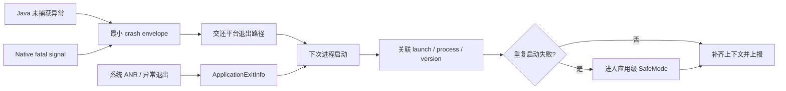
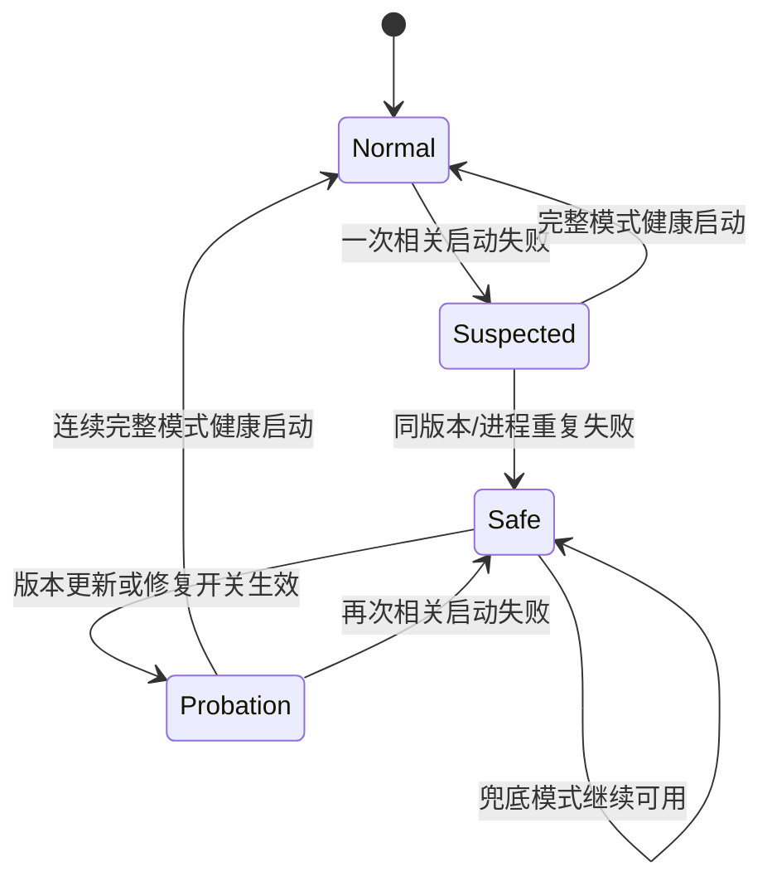

# Java Crash、异常架构与线程堆栈分析

异常处理架构面对的是一个很苛刻的时刻：线程可能持有锁，堆可能已经耗尽，文件系统可能正在写入，系统也可能马上结束进程。架构目标因此分成三件事：在当前进程保留最小证据，在下次启动限制重复失败，通过分阶段发布、暂停发布和修复版本控制影响范围。

平台锚点是 Android 17（API 37，`android-17.0.0_r1`）。本文负责 Java Crash 的异常边界、现场记录和下次启动恢复；Native Crash、ANR 和 OOM 的系统机制分别见 [20.3 Native Crash、堆栈回溯与符号化](03-native-crash-unwinding-symbolication.md)、[20.4 ANR 治理策略](04-anr-governance.md) 和 [20.5 OOM、进程资源治理与 WebView Renderer 恢复](05-oom-webview-renderer-recovery.md)。本文把一次应用启动尝试简称为 launch；SafeMode 指应用在下次启动时主动跳过高风险模块的安全模式。

Java 异常先在调用栈中传播，未被处理时进入 UncaughtExceptionHandler 并触发进程终止。治理既要设计异常边界，也要在 Crash 状态下可靠记录当前线程、其他线程和锁等待。

## Crash 恢复架构、SafeMode 与发布治理

### 全局异常捕获框架设计

#### 把“当前进程”和“下次启动”分开

下面这张图标出故障发生后的两段工作。图中的 crash envelope（最小崩溃记录）是一个有严格大小上限、只保存关联和诊断字段的小文件，并非完整业务快照：



Crash handler（未捕获异常处理器）所处的左半段只适合做有上限的同步写入。数据库查询、网络请求、动态配置拉取、复杂序列化和线程切换都放到右半段。尚未完成的异步任务会在默认处理器结束进程时一并消失。

#### Java 未捕获异常入口

Android 17 的 [`RuntimeInit.java`](https://android.googlesource.com/platform/frameworks/base/+/android-17.0.0_r1/core/java/com/android/internal/os/RuntimeInit.java) 在 `commonInit()` 中安装两个入口：

- `LoggingHandler` 通过 `RuntimeHooks.setUncaughtExceptionPreHandler()` 注册为 pre-handler（前置处理器，在默认未捕获异常处理器之前运行），应用不能替换它；
- `KillApplicationHandler` 成为默认 `Thread.UncaughtExceptionHandler`（线程未捕获异常处理器），向 ActivityManager 报告后，在 `finally` 中调用 `Process.killProcess()` 和 `System.exit(10)`。

应用或 Crash SDK 替换默认处理器时，要保存替换前的处理器，并在自己的最小记录结束后调用它。不再调用默认处理器会改变系统对 fatal（致命、会终止进程）异常的处理，可能留下状态损坏的进程，也会绕过 `KillApplicationHandler` 向 ActivityManager 报告并终止进程的默认路径。

多个 SDK 都想接管入口时，注册顺序必须可查询。推荐由宿主统一安装一个分发器，其他 SDK 只注册有超时和大小限制的 observer（观察者回调）。若只能使用处理器链，每一层都要保证：

- 观察者回调抛出异常时仍会进入前一个处理器；
- 同一个 `Throwable` 不会被多层重复写入大文件；
- 记录路径不依赖正在崩溃的业务数据库；
- 递归崩溃有一次性保护，不能反复进入 Crash SDK。

#### Native fatal signal 入口

Native signal handler（信号处理函数）的限制比 Java 处理器更严格。`SIGSEGV`、`SIGABRT` 等信号可能发生在内存分配器、动态链接器或持锁代码里。处理函数只能调用 [async-signal-safe（异步信号安全）函数](https://man7.org/linux/man-pages/man7/signal-safety.7.html)，即 POSIX 明确允许在信号处理期间调用的有限函数集合；日志框架、C++ 容器、JNI、`malloc`、互斥锁和大部分文件封装都不在这个集合里。

生产方案通常使用 Crashpad、Breakpad 或经过验证的 APM（Application Performance Monitoring，应用性能监控）Native SDK，由预先打开的文件描述符、独立 dumper（转储）进程或系统调试守护进程 debuggerd 保留现场。应用自己的信号处理函数还要考虑旧处理函数链、用于取得详细信号信息的 `SA_SIGINFO`、备用信号栈、重入，以及恢复默认 disposition（信号处置动作）。系统信号链路、回溯与符号化细节统一见 [20.3 Native Crash、堆栈回溯与符号化](03-native-crash-unwinding-symbolication.md)。

#### 协程异常不是新的系统 Crash 类型

Kotlin 协程改变异常的传播位置，却没有增加一种 Android 进程退出原因。未处理异常到达线程的未捕获异常处理器时，仍按 Java Crash 进入 `RuntimeInit`；在业务边界被捕获并转为失败状态时，它只是一条业务错误或 non-fatal（已捕获并主动上报、不会结束进程）记录。

因此，统一上报模型要区分：

| 事件 | 进程是否必然退出 | 进入稳定性 Crash 指标 |
|---|---|---|
| Java/Kotlin 未捕获异常到达默认 handler | 是 | 是 |
| Native fatal signal | 通常是 | 是 |
| `async` 的异常被 `await()` 捕获 | 否 | 否，按业务错误统计 |
| `CancellationException` | 否 | 否 |
| `CoroutineExceptionHandler` 收到根协程未处理异常 | 取决于平台如何继续传播 | 只有进入线程未捕获异常处理器并导致退出时才算 Crash |

#### 最小崩溃记录（crash envelope）只保存关联所需字段

故障当下的记录不需要复制全部业务上下文。一个有长度上限的最小崩溃记录通常包括：

| 字段 | 用途 |
|---|---|
| `event_id`、`launch_id`、`process_start_id` | 消除重复记录，并关联启动尝试和进程生命周期 |
| 版本号、构建号、进程名、pid/tid | 区分发布版本与多进程；pid/tid 分别是进程和线程标识 |
| wall clock（系统日历时间）与 `elapsedRealtime`（本次开机后的单调时间） | 关联系统退出记录并识别时钟回拨 |
| 异常/信号类型、有限堆栈或 dump（内存与线程现场转储）引用 | 生成用于归并同类问题的指纹 |
| 当前页面、功能开关版本的短标识 | 判断故障范围 |
| 完整长度、格式版本、校验值 | 下次启动识别 partial（只写入一部分的残缺）文件 |

账号、访问令牌（Token）、URL 查询参数、用户输入和完整 Intent 不应进入 Crash 文件。`ActivityManager.setProcessStateSummary()`（API 30+）可以向后续 `ApplicationExitInfo` 附带最多 128 字节的非敏感状态，但系统可能限制过于频繁的调用；它适合写版本、`process_start_id` 和阶段标识，不适合频繁同步页面状态。

### ApplicationExitInfo：补全证据，不替代应用采集

API 30 起，`ActivityManager.getHistoricalProcessExitReasons()` 返回近期进程死亡记录。它可以补充异常处理器没来得及写完的事件，也能解释用户强停、系统 LMK（Low Memory Killer，系统因内存压力终止进程）和包更新等非 Crash 退出。

#### Android 17 的 reason 边界

`android-17.0.0_r1` 的 [`ApplicationExitInfo.java`](https://android.googlesource.com/platform/frameworks/base/+/android-17.0.0_r1/core/java/android/app/ApplicationExitInfo.java) 定义 17 个 `REASON_*` 常量，编号为 0～16。SafeMode 不应把它们全部当成启动崩溃。

| 分类 | reason | SafeMode 处理 |
|---|---|---|
| 明确故障候选 | `REASON_CRASH`、`REASON_CRASH_NATIVE`、`REASON_ANR`、`REASON_INITIALIZATION_FAILURE` | 只有时间、进程和未完成 launch 同时匹配才计数 |
| 通常不是应用缺陷 | `REASON_EXIT_SELF`、`REASON_USER_REQUESTED`、`REASON_USER_STOPPED`、`REASON_PACKAGE_UPDATED`、`REASON_PACKAGE_STATE_CHANGE`、`REASON_PERMISSION_CHANGE`、`REASON_FREEZER` | 不计入启动失败 |
| 资源或依赖变化 | `REASON_LOW_MEMORY`、`REASON_DEPENDENCY_DIED` | 单独统计，不直接触发代码降级 |
| 需要更多证据 | `REASON_UNKNOWN`、`REASON_SIGNALED`、`REASON_EXCESSIVE_RESOURCE_USAGE`、`REASON_OTHER` | 结合公开的退出状态 `status`、进程重要级 `importance`、现场记录 `trace` 和本地最小崩溃记录判断 |

部分设备不支持准确报告 `REASON_LOW_MEMORY`。官方 API 要求先检查 `ActivityManager.isLowMemoryKillReportSupported()`；不支持时，LMK 可能表现为 `REASON_SIGNALED` 与 `SIGKILL`。因此，看到 `SIGKILL` 不能直接断言是 Native Crash 或业务主动结束。

API 37 的 `ApplicationExitInfo.getAnrInfo()` 只在 `reason == REASON_ANR` 时返回结构化 `AnrInfo`。`getDescription()` 是面向人的不稳定文本，不能作为长期分类协议。

#### 历史记录有容量和持久化边界

AOSP Android 17 的 [`AppExitInfoTracker.java`](https://android.googlesource.com/platform/frameworks/base/+/android-17.0.0_r1/services/core/java/com/android/server/am/AppExitInfoTracker.java) 和系统资源默认值 [`config.xml`](https://android.googlesource.com/platform/frameworks/base/+/android-17.0.0_r1/core/res/res/values/config.xml) 给出两个实现细节：

- `APP_EXIT_INFO_PERSIST_INTERVAL` 为 30 分钟；
- `config_app_exit_info_history_list_size` 的 AOSP 默认值为每包 16 条。

这两个数字都不是公开 API 契约。历史容量来自系统资源，厂商可以调整；30 分钟表示 Android 核心系统进程 system_server 限制内存状态写入磁盘频率的周期，不表示应用在同一开机周期内必须等 30 分钟才能查询。若设备在写盘前重启，近期记录可能丢失，所以应用仍要保留自己的小型 launch marker（启动标记，用来记录一次启动是否走到成功点）与最小崩溃记录。

`getTraceInputStream()` 也不是必有数据。API 30 起可能返回 ANR trace（现场线程栈与诊断信息），API 31 起 `REASON_CRASH_NATIVE` 可能返回 tombstone（Native Crash 现场记录）的 protobuf（二进制结构化格式）数据。底层 trace 使用全局环形缓冲，只保留有限的近期条目，可能被其他应用的新记录覆盖；该方法允许返回 `null`，读取时也可能抛出 `IOException`。

#### 关联必须指向同一次启动尝试

仅判断“历史列表里存在一个 Crash”会把几天前的故障归到本次启动。关联至少检查：

- `processName` 与本地启动标记一致；
- 退出时间戳位于启动开始之后、成功标记之前或允许的短窗口内；
- 本地版本和 `process_start_id` 与 `getProcessStateSummary()` 一致；取不到进程状态摘要时降低证据等级；
- 同一退出记录只匹配一次；
- 已经写入 `launch_success` 的运行期 Crash 不计作启动循环。

下一段示意代码只演示 exit reason 与 launch 的相关性，不负责持久化：

```kotlin
data class PreviousLaunch(
    val processName: String,
    val startedAtEpochMs: Long,
    val state: LaunchState,
    val hasLocalFatalEnvelope: Boolean,
)

fun isCorrelatedStartupFailure(
    launch: PreviousLaunch,
    exit: ApplicationExitInfo?,
    startupWindowMs: Long,
): Boolean {
    if (launch.state != LaunchState.ATTEMPTED) return false

    if (exit == null) {
        return launch.hasLocalFatalEnvelope
    }
    if (exit.processName != launch.processName) return false

    val delayMs = exit.timestamp - launch.startedAtEpochMs
    if (delayMs !in 0..startupWindowMs) return false

    return when (exit.reason) {
        ApplicationExitInfo.REASON_CRASH,
        ApplicationExitInfo.REASON_CRASH_NATIVE,
        ApplicationExitInfo.REASON_ANR,
        ApplicationExitInfo.REASON_INITIALIZATION_FAILURE -> true
        else -> false
    }
}
```

启动标记缺失不能当成失败：首次安装、数据被清理或写入尚未开始都会出现这种状态。只有“未完成的启动标记 + 相关系统记录”或“未完成的启动标记 + 本地 fatal 最小记录”才形成一次启动失败证据。生产代码还要持久化已经匹配过的退出记录标识，避免重复计数，并处理系统时间变化。

### 安全气囊（SafeMode）机制

这里的 SafeMode 是应用自己的 circuit breaker（熔断器）：检测到重复启动失败后，下一次启动先关闭可疑模块，阻止同一故障不断重演。它与 Android 系统安全模式无关，也不能挽救已经发生 fatal 的当前进程。

#### 状态机比一个布尔开关可靠

SafeMode 至少需要区分正常、观察、受限和试运行状态。下面是一套可按产品调整的状态关系：



`Suspected` 避免一次偶发故障直接关闭大量功能；`Probation` 避免兜底页能启动就被误判为原问题已经修复。只有在完整模式或逐步恢复的模块集合下成功，才能消除对应失败计数。

#### 判定输入

一次可用于状态迁移的失败记录要同时回答四个问题：

1. 是否为同一版本、构建号和进程；
2. 是否发生在同一次未完成的 `launch_id`；
3. 是否属于同一个问题组（经过堆栈归一化后判断为同一根因）或同一个初始化模块；
4. 证据来自本地 fatal 最小崩溃记录、`ApplicationExitInfo`，还是二者互证。

阈值要按启动量、故障代价和误触发成本选择。阈值可以由远程配置更新，但启动时只能依赖已经校验并缓存到本地的配置；正在崩溃循环的设备往往无法完成网络拉取。本地保守默认值必须独立可用。

启动标记的写入位置要早于可选 SDK 和动态业务容器。若应用支持 Direct Boot（设备重启后、用户首次解锁前也能运行部分组件），还要明确标记存放在 device-protected storage（解锁前可读的设备加密存储）还是 credential-protected storage（用户解锁后才可读的凭据加密存储）；不能在用户尚未解锁时误读另一存储域的旧状态。

#### 分级动作

| 等级 | 适用证据 | 动作 |
|---|---|---|
| L1：模块隔离 | 问题组稳定指向某个可选模块 | 关闭该模块、实验或 SDK，保留主流程 |
| L2：页面降级 | 首页容器或关键页面连续失败 | 使用静态/轻量页面，保留登录、设置、反馈 |
| L3：修复入口 | 主进程初始化在最小依赖集内仍失败 | 只加载诊断、升级、反馈和安全重置能力 |

动作要有依赖图。关闭广告 SDK 后，由 ContentProvider 自动执行的初始化、后台任务和数据上报适配器也要停止；只隐藏入口却继续初始化，无法减少启动故障。

“清理数据”不能作为默认恢复动作。数据库、登录态和用户文件可能没有问题，整库删除会把稳定性故障扩大为数据丢失。若某个缓存已由校验和、版本号或复现证据确认损坏，只清理该缓存，并记录清理原因。

#### 退出与防振荡

退出 SafeMode 可由新版本安装、已签名的本地修复配置、问题模块被关闭，或一组成功试运行触发。每次只恢复一组依赖，失败后回到上一个已知可用状态。

需要额外限制：

- 同一设备的状态切换设置最短间隔，避免每次启动在正常与受限之间抖动；
- SafeMode 自身只依赖平台和小型本地存储，不能复用可疑的数据库或动态容器；
- 记录 `safe_mode_enter`、禁用模块、证据等级和退出原因，但不把兜底模式的成功算作完整模式成功；
- 版本升级后保留上一版本的失败摘要用于分析，同时清空不再适用的 SafeMode 失败计数。

#### 启动租约：先记录进度，再判断失败

启动租约（`LaunchLease`）是一份带版本、进程和阶段的短记录，用来说明某次启动进行到了哪里。一个残留的启动标记只能说明上一次没有走到成功点，不能单独证明发生了 Crash；用户强停、LMK、设备重启、覆盖安装、并发进程写入和文件提交中断都可能留下相同状态。SafeMode 应把三类数据分开：

| 数据 | 回答的问题 | 保存边界 |
|---|---|---|
| `LaunchLease`（启动租约） | 上一次启动走到了哪个阶段 | 按版本、进程和入口隔离 |
| `FailureOccurrence`（一次失败证据） | 哪个退出证据能与该启动关联 | 有数量、时间和隐私上限 |
| `DegradationPlan`（降级计划） | 下次启动跳过哪些模块 | 按模块、页面、进程和版本限定 |

启动租约可按 `LAUNCHING → PROCESS_READY → INTERACTIVE → PROBATION → HEALTHY` 推进。入口必须先读取旧租约，再写入本轮 `launchId`；若先覆盖文件，上一轮阶段和时间窗都会丢失。租约至少保存 schema（数据结构版本）、`versionCode`、安装时间、进程角色、随机 `launchId`、大致启动入口、系统日历时间、`elapsedRealtime`、boot sequence（本次开机的标识）、阶段和 plan ID（降级计划标识）。不要保存 URL、账号或 Intent 参数。

`ApplicationExitInfo.getTimestamp()` 使用系统日历时间，`elapsedRealtime()` 只适合同一次开机内计算时长，两者不能直接相减。开机标识变化、`elapsedRealtime` 倒退或系统日历时间偏移异常时，应降低证据置信度，不能增加失败次数。

`AtomicFile` 可以让单文件保持旧版或新版可读，但不提供线程锁和跨进程锁。单进程仍需串行读写；多进程应使用 `lease-main`、`lease-push`、`lease-web` 等独立文件，再指定一个汇总进程统一处理。格式还要有版本、长度上限、校验和与损坏文件隔离，读不到时按保守默认值运行。

#### 两阶段证据核对

SafeMode 决策分成快速路径和补全路径：

1. **快速路径**只读取此前已经确认的本地失败样本，在可选 SDK、插件和 WebView 预热之前选择计划。单独残留的 `LAUNCHING` 只允许触发低风险动作，例如推迟非必要预热。
2. **补全路径**在启动后查询 `ApplicationExitInfo`，按进程、时间窗、版本、旧租约阶段、本地 fatal 最小记录和已消费标识关联上一轮退出。先筛选进程、时间等元数据，再在后台限量读取 trace；trace 为空不能反证没有 ANR 或 Native Crash。

退出原因要分类处理：`REASON_CRASH`、`REASON_CRASH_NATIVE`、启动窗口内的 `REASON_ANR` 和 `REASON_INITIALIZATION_FAILURE` 在完成关联后可参与 crash loop（连续启动崩溃）判断；`REASON_LOW_MEMORY` 与过量资源进入资源保护；用户停止、包更新、权限变化和主动退出默认不增加 Crash 计数。`SIGKILL` 也不能自动解释为 LMK。

`ActivityManager.setProcessStateSummary()` 可附带最多 128 字节的关联摘要，适合保存格式版本、`launchId` 短哈希（由完整标识计算出的定长摘要）、进程角色、阶段和 plan ID。它不是 UI 状态仓库，也不是隐私保护机制；只在关键里程碑更新。

#### 多进程、版本和恢复计划

每个进程独立持有租约，只有指定的汇总进程能更新失败样本与计划。独立服务或推送进程死亡时，默认只隔离对应功能；进程仍存活时，其他进程不能仅凭租约年龄判定它已经失败。

建议用下面的键组织有界历史：

```text
installationEpoch / versionCode / processRole / startupRoute / signature
```

新版本不能直接沿用旧版本那组历史记录作决策，但可以保留诊断摘要；经审核后，可以让共用同一 Native 库或配置的版本继承特定计划。恢复时一次只启用一组依赖，并设置两次尝试之间的冷却时间、最长持续时间、最大尝试次数和单独的进入/退出条件，避免在完整模式与受限模式之间来回切换。

计划应表示为 `moduleId + action + scope + reason + expiry`。图片预热、动态插件、推荐和数据分析上报等可选能力可以延迟或关闭；数据库强制迁移、身份认证和支付校验不能绕过。WebView renderer（渲染进程）退出属于页面级恢复，不直接增加宿主主进程的连续启动崩溃计数。

#### SafeMode 验证组合

测试应覆盖状态与证据的组合，不能只测计数器：

- Java Crash、Native Crash、启动 ANR、LMK、用户停止在各租约阶段的分类；
- 系统日历时间前后跳、设备重启、覆盖安装、升级与回退版本；
- 同名进程多条退出记录、重复消费和候选歧义；
- 租约为空、截断、未知数据结构版本和校验失败；
- 多进程并发启动、汇总进程中断和计划传播；
- 观察期成功、复发、过期和用户主动尝试正常启动；
- WebView 渲染进程反复退出只触发页面计划；
- 故障注入后系统 tombstone、退出历史和本地最小崩溃记录仍可关联。

指标至少包括 SafeMode 进入率、候选记录经系统证据确认的比例、退出记录成功匹配或存在多个候选的比例、普通与降级启动的交互成功率、计划误触发率和重复进入率。兜底模式启动成功不能计作完整模式恢复。

### 降级策略：功能、页面与进程

#### 在明确边界捕获异常

降级适合“边界有替代结果”的场景，例如远程配置解析失败后使用已验证缓存、图片编辑器初始化失败后隐藏编辑入口、页面数据组合失败后显示局部错误态。

不要在任意层用 `catch (Throwable)` 继续运行。`OutOfMemoryError`、`LinkageError`、VM 错误和协程取消都可能表示当前操作已不具备恢复条件。协程边界捕获 `CancellationException` 后要继续抛出；普通业务错误应转换成有类型的失败结果，由页面决定重试或降级。

#### 功能降级

功能开关至少要有这些属性：

- 启动前可读，并带 schema/version；
- 本地默认值能在离线时生效；
- 远程值经过签名或可信通道校验；
- 开关依赖与互斥关系可验证；
- 每次命中记录版本和原因；
- 关闭动作可重复执行，不依赖模块已经初始化成功。

服务端兼容也属于功能降级。客户端新字段或新协议出现问题时，服务端按版本回退响应，常常比等待新包更快，也不会引入端侧动态代码风险。

#### 页面降级与兜底页

页面降级要在导航或页面状态边界处理。兜底页保持依赖小：不加载广告、运行时加载页面或业务的动态容器、WebView、复杂图片管线和非必要分析 SDK。它至少提供可理解的错误说明、有限次数的重试、更新入口和反馈入口。

Compose 没有通用的 Error Boundary（组件树发生异常时用备用 UI 替换整段内容），不能保证在组合（Composition）阶段捕获任意异常后继续生成 UI。数据加载异常应在协程和状态层转为错误状态；组合期间的编程错误仍可能导致进程 Crash，不能用外围 `try/catch` 假装页面已经恢复。

#### WebView renderer 退出

系统 WebView renderer 由 WebView 提供方管理，不是应用在 manifest 中声明的 `:web` 进程。应用不能在该渲染进程内安装自己的 Crash 处理器。API 26 起，[`WebViewClient.onRenderProcessGone()`](https://developer.android.com/reference/android/webkit/WebViewClient#onRenderProcessGone(android.webkit.WebView,%20android.webkit.RenderProcessGoneDetail)) 通知宿主清理受影响的 WebView。

下面的代码展示单个回调应完成的最小清理：

```kotlin
override fun onRenderProcessGone(
    view: WebView,
    detail: RenderProcessGoneDetail,
): Boolean {
    rendererExitReporter.record(
        didCrash = detail.didCrash(),
        priorityAtExit = detail.rendererPriorityAtExit(),
    )

    (view.parent as? ViewGroup)?.removeView(view)
    webViewRegistry.remove(view)
    view.destroy()

    showRendererFallback(allowRetry = retryBudget.tryAcquire())
    return true
}
```

同一个渲染进程可能服务多个 WebView，系统会为每个受影响实例分别调用回调。代码只清理参数给出的实例，同时确保 Activity、Fragment、适配器和 WebView 注册表不再持有它；不能在第一次回调里假设其他 WebView 仍可用。返回 `false` 时，渲染进程若崩溃会导致应用 Crash，若被系统杀死则应用会被杀。

`didCrash() == false` 表示渲染进程被系统结束，常见背景是内存压力，但不能仅凭该布尔值断言 OOM。恢复策略要限制重建次数；持续内存压力下立即创建同样的 WebView，容易形成反复重建。[20.5 OOM、进程资源治理与 WebView Renderer 恢复](05-oom-webview-renderer-recovery.md) 专门讨论 WebView renderer OOM 恢复。

### 分阶段发布、版本恢复与热修复

异常架构要让每条记录都能关联版本、构建号、渠道、发布轨道（例如 Google Play 的 production 正式发布、open testing 开放测试）、设备/API、ABI、功能开关版本和实验组。没有这些字段，服务端只能看到故障增加，却无法判断应该暂停向哪组用户发布。

#### 分阶段发布规则

分阶段发布判断应使用 [20.1 应用稳定性度量、聚合与归因](01-stability-metrics-aggregation-attribution.md) 定义的相同统计规则和问题组证据。常见动作包括：

- 暂停提高新版本的发布比例，保留当前样本继续判断故障来源；
- 只把服务端配置或实验恢复到变更前的状态；
- 停止向特定设备、API 或 ABI 发布新版本；
- 通过 Google Play 发布修复版本或回退到已验证构建；
- 启用已随 APK 交付的本地降级实现。

“暂停 staged rollout（分阶段发布）”只阻止更多用户获得该版本，已经安装的设备不会自动退回旧包。SafeMode 和服务端开关用于保护已经安装新版本的设备，新包用于修复代码。

#### 热修复有分发与安全边界

热修复指不等待用户完整安装下一版本，直接调整已发布应用行为。Android 平台没有通用、无风险的应用热修复 API。对 Google Play 分发的应用，[Device and Network Abuse 政策](https://support.google.com/googleplay/android-developer/answer/16559646) 禁止从 Google Play 之外下载 dex、JAR 或 `.so` 等可执行代码来修改、替换或更新应用。该限制不适用于在虚拟机或解释器中运行、只间接访问 Android API 的代码，例如 WebView 中的 JavaScript；运行时加载的解释型代码仍不得帮助应用违反其他 Google Play 政策。

因此，Play 应用的在线恢复手段优先选择：

- 关闭已经随包交付的功能；
- 把服务端协议、配置和实验恢复到变更前的状态；
- 切换随包交付的备用实现；
- 使用 Play 的更新机制发布新构建。

企业内部分发或其他商店有各自政策，也不能省略补丁签名、目标版本约束、类加载边界、Native ABI、恢复路径和审计记录。任何补丁都要使用与目标构建完全匹配的 mapping（混淆名称还原表）、Native 符号和依赖集合进行验证。

### 多进程异常隔离

每个应用进程都有自己的 `Application`、默认未捕获异常处理器、协程全局入口和内存空间。只在主进程安装捕获器，会漏掉播放器、下载、推送和自有 `:web` 进程。

#### 按进程分配职责

| 进程 | 记录与恢复职责 |
|---|---|
| 主进程 | 管理启动状态、SafeMode、页面降级和汇总上报 |
| 远程业务进程 | 独立写入最小崩溃记录；由主进程决定是否重启或关闭功能 |
| 自有 `:web` / `:h5` 进程 | 按普通应用进程处理；不要与系统 WebView 渲染进程混淆 |
| 上传进程 | 只扫描已经完整写入的记录并上传，不能依赖主进程内存对象 |

每个文件名带进程名哈希摘要、进程标识 pid 和只增不减的序号。各进程写自己的目录或文件，主进程只在下一次正常阶段汇总，避免 Crash 时争抢跨进程锁。

远程进程死亡可通过 Binder death（Binder 对端进程死亡通知）或业务连接回调感知，但“连接断开”不等于 Crash。要结合 `ApplicationExitInfo`、本地最小崩溃记录和服务端记录分类。自动重启采用指数退避，即每次失败后逐步延长等待时间，并设置次数上限；持续重启后关闭对应功能，让用户可以回到主流程。

### Crash 文件的持久化边界

#### 原子替换不等于每次都能落盘

AOSP Android 17 的 [`AtomicFile.java`](https://android.googlesource.com/platform/frameworks/base/+/android-17.0.0_r1/core/java/android/util/AtomicFile.java) 采用 `.new` 文件：

1. `startWrite()` 打开新文件；
2. `finishWrite()` 调用 `FileUtils.sync()`，关闭后重命名为目标文件；
3. `failWrite()` 同步、关闭并删除 `.new`。

这能让读取者在旧完整版本与新完整版本之间选择，避免直接覆盖目标文件留下半截内容。实现没有对父目录执行 `fsync`（要求系统把缓冲中的文件或目录元数据写向存储），所以不能把它描述成掉电条件下的严格事务。应用若要求重命名后的目录项也尽量持久化，可通过公开的 `android.system.Os.open()`、`Os.fsync()` 和 `Os.close()` 处理父目录 fd（file descriptor，文件描述符）；还要按文件系统能力处理失败，不能假定所有设备表现一致。

文件协议本身还要包含 magic（固定文件头，用来快速识别格式）、schema version（结构版本）、payload length（有效内容长度）、序号和校验值。下次启动扫描时：

| 状态 | 处理 |
|---|---|
| `completed`（完成）且校验通过 | 消除重复记录后进入待上报队列 |
| `completed` 但校验失败 | 标记为 `corrupt`（损坏），保留短摘要后隔离 |
| `tmp/new`（临时文件）且完整 | 可按协议恢复为 `completed` |
| `tmp/new` 不完整 | 记录 `partial`（残缺）计数后删除 |
| 已上报 | 按保留周期清理 |

AOSP [`DropBoxManagerService.java`](https://android.googlesource.com/platform/frameworks/base/+/android-17.0.0_r1/services/core/java/com/android/server/DropBoxManagerService.java) 采用只尽力完成、不保证成功的轻量协议：临时文件关闭后直接重命名，没有额外 `fsync`；服务启动扫描到 `.tmp` 时直接删除。[`ActivityManagerService.java`](https://android.googlesource.com/platform/frameworks/base/+/android-17.0.0_r1/services/core/java/com/android/server/am/ActivityManagerService.java) 只有在 system_server 自身 Crash 的特定路径上才等待 DropBox 后台线程最多两秒。普通应用不能从这些实现推导出“异步 Crash 上报一定来得及”。

#### Java 与 Native 的写入策略不能共用

Java 未捕获异常处理器可以尝试一次有大小限制的同步写入，但仍可能遇到 OOM、文件系统阻塞或递归异常。记录器应预先创建目录、限制文件数、避免 JSON 反射和大对象复制，并确保无论写入成功与否都会调用前一个默认处理器。

Native 信号处理函数只能使用异步信号安全操作。若方案需要压缩、符号化、锁或堆分配，就应放到独立转储进程或下次启动。不能把 Java 版本的“临时文件 + rename”代码直接移进信号处理函数。

Crash 文件属于应用私有诊断数据，也要限制文件数量和占用空间，并执行加密与删除策略。存储满时保留事件摘要和丢弃计数，比无限写入直到影响用户数据更安全。

### Kotlin Coroutine 异常处理

当前官方 [Coroutine exceptions handling](https://kotlinlang.org/docs/exception-handling.html) 把协程构建函数（builder）分成两类。这里的根协程指没有父协程继续接管其异常的协程：

- 根协程 `launch` 把未处理异常视为未捕获异常；
- 根协程 `async` / `produce` 把异常保存在结果中，调用方通过 `await()` / `receive()` 消费；
- 普通子协程的异常向父协程传播并取消父级，子协程上的 `CoroutineExceptionHandler` 通常不会截断传播；
- `supervisorScope` 或 `SupervisorJob` 使子任务失败不自动取消同级任务，每个子任务仍要处理自己的失败；
- `CancellationException` 用于协作取消，通常不进入错误上报。

`CoroutineExceptionHandler` 在协程已经以异常完成后才被调用，不能恢复该协程。它适合记录根协程未处理异常，不能代替 `try/catch`、`await()` 处的错误处理或结构化并发（用父子作用域约束任务生命周期和取消传播）。

下面的例子只捕获调用契约中允许恢复的网络错误，其他编程错误继续传播：

```kotlin
viewModelScope.launch {
    try {
        uiState.value = UiState.Content(repository.load())
    } catch (cancelled: CancellationException) {
        throw cancelled
    } catch (error: IOException) {
        nonFatalReporter.record(error)
        uiState.value = UiState.Error(retryable = true)
    }
}
```

这里的 `IOException` 被转换成页面状态，不应计为 Crash。若数据仓库接口还声明了明确的业务错误，可以逐类处理；不要用 `runCatching` 把 `Error` 等任意 `Throwable` 一起变成页面错误。若希望多个子任务互不取消，可在 `supervisorScope` 内分别处理；不能只加一个 `CoroutineExceptionHandler` 后忽略各子任务的失败结果。

kotlinx.coroutines 1.11.0 的 [JVM `CoroutineExceptionHandlerImpl.kt`](https://github.com/Kotlin/kotlinx.coroutines/blob/1.11.0/kotlinx-coroutines-core/jvm/src/internal/CoroutineExceptionHandlerImpl.kt) 通过 Java 服务发现机制 `ServiceLoader` 加载平台处理器，最终兜底时调用当前线程的 `uncaughtExceptionHandler`。Android 模块的 [`AndroidExceptionPreHandler.kt`](https://github.com/Kotlin/kotlinx.coroutines/blob/1.11.0/ui/kotlinx-coroutines-android/src/AndroidExceptionPreHandler.kt) 只为 API 26/27 的 Oreo pre-handler 差异做反射补偿；Android 17 仍回到线程未捕获异常处理器与 `RuntimeInit` 的平台路径。

协程记录要带 `CoroutineName`、作用域类型、页面生命周期和 Dispatcher（决定协程在哪个线程或线程池执行的调度器）。不能在 `CoroutineExceptionHandler` 中同步访问网络或执行大规模序列化，它可能运行在主线程或已经处于失败传播过程的工作线程上。

### 上线前检查

1. Java 自定义处理器是否无条件调用替换前的默认处理器；
2. Native 信号处理函数是否只使用异步信号安全能力，并处理重入和旧处理函数；
3. 最小崩溃记录是否有大小、数量、隐私和校验限制；
4. 启动标记缺失是否被错误计为启动失败；
5. `ApplicationExitInfo` 是否按进程、时间和未完成的启动尝试关联，而非扫描到任意 Crash 就触发；
6. `REASON_LOW_MEMORY`、用户强停、包更新和权限变化是否排除在代码 Crash 计数之外；
7. SafeMode 是否有 Suspected、Probation、退出和防振荡规则；
8. 兜底页是否避开原故障模块，数据清理是否限制到已证实损坏的对象；
9. 每个应用进程是否独立安装捕获入口，系统 WebView 渲染进程是否走 `onRenderProcessGone()`；
10. 暂停分阶段发布、恢复服务端配置、发布 Play 新包和保护已安装设备是否各有负责人；
11. Google Play 应用是否避免从 Play 之外下载 dex、JAR 或 Native 可执行代码；
12. 协程取消、可恢复业务错误和进程级 Crash 是否进入不同指标。

异常处理架构的成败不由“捕获了多少异常”决定。严谨的实现会承认当前进程不可恢复的边界，把少量可信证据带到下一次启动，再用受控降级和发布动作阻止同一故障反复伤害用户。

## 未捕获异常、现场记录与退出

异常边界决定哪些错误可以局部处理，剩余未捕获异常进入 Crash 路径。现场采集必须避免递归异常、死锁和长时间阻塞。

Java Crash 指 `Throwable` 沿当前线程的调用路径传播时一直没有被处理，最终逃出线程入口。Android 的默认致命异常处理器（fatal handler）随后终止应用进程。异常类型只能帮助选择排查方向；能否恢复还取决于失败发生在哪个边界、数据与状态是否一致，以及调用方能否返回明确的失败或降级结果。

平台与 ART 源码按 Android 17 / API 37 / `android-17.0.0_r1` 核对。

### Java 异常分类：语法类别不等于恢复策略

所有 Java 异常都继承自 `Throwable`，主要分为 `Exception` 与 `Error`。工程上要同时看语言规则和故障语义。

| 类别 | 编译器约束 | 常见例子 | 治理重点 |
|---|---|---|---|
| Checked Exception（受检异常） | Java 调用方必须捕获或声明抛出 | `IOException`、`GeneralSecurityException` | 在 I/O、加密、进程间调用等边界定义重试、降级或向上返回 |
| `RuntimeException` | 编译器不强制处理 | `NullPointerException`、`IndexOutOfBoundsException`、`IllegalStateException` | 修正契约、状态机、生命周期或并发错误 |
| `Error` | 编译器不强制处理 | `OutOfMemoryError`、`StackOverflowError`、`NoSuchMethodError` | 判断运行时资源、递归、依赖或二进制兼容问题，避免宽泛恢复 |

Checked Exception 也可能由程序错误引起，例如关闭顺序错误导致读写失败；`RuntimeException` 也可能来自系统或第三方 API 的版本差异。分类只是线索。

`Error` 抛出后不会自动由虚拟机终止进程。它和其他 `Throwable` 一样可以被异常捕获；只有未处理并逃出线程入口时，才进入未捕获异常处理链。许多 `Error` 表示进程资源或链接状态已经异常：

- `OutOfMemoryError` 发生后，再分配日志对象或创建上传线程都可能失败。不能通过应用代码突破 ART 为该设备配置的堆上限（heap limit）。
- `StackOverflowError` 常见于无界递归，也可能来自过深的合法递归或较小线程栈。
- `NoSuchMethodError`、`NoClassDefFoundError` 属于链接错误（linkage error），应检查依赖解析、R8、动态特性模块、插件化、设备厂商差异和 API 兼容；额外包一层异常捕获通常只会隐藏错误。

判断是否捕获时可以问三个问题：

1. 当前层是否拥有足够信息给出业务可解释的结果？
2. 捕获后，数据与状态机是否仍保持一致？
3. 调用方能否明确收到成功、失败或取消结果，避免在没有结果的情况下继续？

如果三个问题不能回答清楚，就应让异常沿调用链传播到拥有决策权的边界。

### Android 17 的默认致命异常处理链

#### 从 ART 到 `Thread.dispatchUncaughtException()`

ART 把当前未处理异常保存在每个线程的 pending exception（待处理异常）状态中。解释器或已编译代码按照异常处理器表查找处理位置并展开栈帧；当异常逃出线程入口，线程销毁路径中的 [`Thread::HandleUncaughtExceptions()`](https://android.googlesource.com/platform/art/+/refs/tags/android-17.0.0_r1/runtime/thread.cc) 取出并清除该状态，然后调用 Java 层 [`Thread.dispatchUncaughtException(Throwable)`](https://android.googlesource.com/platform/libcore/+/refs/tags/android-17.0.0_r1/ojluni/src/main/java/java/lang/Thread.java)。

Java 层的顺序是：

1. 调用 Android 私有的 uncaught exception pre-handler（前置未捕获异常处理器）；
2. 调用该线程显式安装的处理器；如果没有，则交给它的 `ThreadGroup`；
3. 根 `ThreadGroup` 再委托给 `Thread.getDefaultUncaughtExceptionHandler()` 返回的默认处理器。

[`RuntimeInit.commonInit()`](https://android.googlesource.com/platform/frameworks/base/+/refs/tags/android-17.0.0_r1/core/java/com/android/internal/os/RuntimeInit.java) 在应用代码运行前安装平台处理器：

| 处理器 | 安装位置 | Android 17 行为 |
|---|---|---|
| `LoggingHandler` | 前置处理器（pre-handler） | 写入 `FATAL EXCEPTION`、线程、进程、PID（进程编号）和异常栈。应用通过公开 `Thread` API 不能替换它。 |
| `KillApplicationHandler` | 默认处理器（default handler） | 必要时补写日志，调用 ActivityManager 上报 Crash，并在 `finally` 中执行 `Process.killProcess()` 与 `System.exit(10)`。 |

应用调用 `Thread.setDefaultUncaughtExceptionHandler()` 会替换当前默认处理器。平台前置处理器仍会先执行，但 `KillApplicationHandler` 只有在自定义处理器继续调用安装前保存的处理器时才会运行。

线程级处理器的优先级高于 `ThreadGroup` 和默认处理器。如果某个线程通过 `setUncaughtExceptionHandler()` 安装处理器后不再委托，它也会截断进程级采集链。排查 SDK（Software Development Kit，软件开发工具包）冲突时，两种注册方式都要检查。

#### 自定义处理器的最小正确结构

下面的示例强调委托和故障隔离。`CrashSpool.tryAppendMinimal()` 代表正常运行时已经初始化好的有界暂存区；spool 是等待下次启动校验和上传的追加式临时存储。致命异常路径中不应临时创建复杂对象。

```kotlin
class DelegatingFatalHandler(
    private val previous: Thread.UncaughtExceptionHandler?,
    private val crashSpool: CrashSpool,
) : Thread.UncaughtExceptionHandler {
    private val entered = AtomicBoolean(false)

    override fun uncaughtException(thread: Thread, error: Throwable) {
        try {
            if (entered.compareAndSet(false, true)) {
                crashSpool.tryAppendMinimal(thread, error)
            }
        } catch (_: Throwable) {
            // Fatal 路径只能尽力保存，采集失败不能截断平台退出链。
        } finally {
            if (previous != null) {
                previous.uncaughtException(thread, error)
            } else {
                Process.killProcess(Process.myPid())
                exitProcess(10)
            }
        }
    }
}

fun installFatalHandler(crashSpool: CrashSpool) {
    val previous = Thread.getDefaultUncaughtExceptionHandler()
    Thread.setDefaultUncaughtExceptionHandler(
        DelegatingFatalHandler(previous, crashSpool)
    )
}
```

`AtomicBoolean` 保证多个线程接近同时崩溃时，只有一个线程进入最小写入路径。`finally` 保证自有采集失败后仍委托旧处理器。Android 应用进程里的 `previous` 通常是平台处理器或先注册的 SDK 处理器；示例保留空值分支，避免异常线程返回后留下状态未知的进程。

这个示例不承诺崩溃记录一定保存成功。致命路径可能同时面临 OOM、磁盘满、文件锁被占用、栈溢出或进程被外部终止，因此无法保证记录或上报必达。

#### 致命路径只做最少工作

较稳妥的设计把采集拆成正常运行期和致命异常发生时两部分。

正常运行期持续维护：

- 固定容量的 breadcrumb（近期用户操作和状态变化线索）环形缓冲区；
- 版本、进程、会话、页面和关键状态的紧凑快照；
- R8 混淆映射文件、构建 ID（用于把崩溃记录匹配到准确二进制和符号文件的版本标识）、动态模块与配置版本；
- 已打开并可独占写入的应用私有暂存区，或不需要复杂初始化的追加写入策略。

致命异常处理器内只尝试写入：

- 墙上时钟时间（可对应日志中的日期）与单调时间（只向前递增，适合计算耗时）；
- 进程名、线程名和线程 ID；
- 异常类、限制长度的消息、原因链（cause）与附加异常（suppressed）摘要；
- 已准备好的 breadcrumb；
- 完整性字段，如长度、版本和校验值。

不要在这里发送同步网络请求、生成完整堆转储、等待其他线程释放普通业务锁，或初始化数据库与大型序列化框架。即使把记录传给独立进程，IPC（Inter-Process Communication，进程间通信）也只能尽力而为：对端可能尚未启动，同一 UID（应用身份）下的进程可能同时被系统处理，Binder 调用也可能阻塞。

普通第三方应用不应把系统 `DropBoxManager` 当作自有崩溃暂存区。它是系统级、容量受限的诊断设施，条目可能被丢弃，写入与读取还受平台权限和设备策略约束。自有数据应写入应用私有存储，并在下次进程启动后校验、去重、脱敏和上传。

#### 安装时机与多 SDK 链

`Application.attachBaseContext()` 是应用侧常用的早期安装点。Android 17 的 [`ActivityThread.handleBindApplication()`](https://android.googlesource.com/platform/frameworks/base/+/refs/tags/android-17.0.0_r1/core/java/android/app/ActivityThread.java) 先创建 `Application` 并在此过程中调用 `attachBaseContext()`，再安装常规 ContentProvider，随后调用 `Application.onCreate()`。它仍覆盖不了自定义 `Application` 构造、类加载或处理器安装前发生的故障；这些事件要依赖平台日志、Android vitals 等进程外来源。

多个 SDK 都修改默认处理器时，后注册者只能看到注册当时的前一个处理器。每个处理器都应在 `finally` 中继续委托，并限制自己的执行时间与写入量。建议在测试构建中记录处理器类名和安装顺序，主动注入以下故障条件：

- 主线程与后台线程分别抛出未捕获异常；
- 自有持久化抛异常；
- OOM 或磁盘满时进入处理器；
- 两个线程接近同时崩溃；
- SDK 初始化顺序变化。

测试要确认平台退出链没有被截断、记录未损坏、重启后只上传一次；仅确认处理器被调用还不够。

### Throwable 堆栈的成本与信息边界

#### `kMaxSavedFrames = 256` 是优化阈值

`Throwable` 默认构造会执行 `fillInStackTrace()`，ART 再通过 [`Thread::CreateInternalStackTrace()`](https://android.googlesource.com/platform/art/+/refs/tags/android-17.0.0_r1/runtime/thread.cc) 遍历当前由 ART 管理的 Java/Kotlin 调用栈。

Android 17 源码中的 `kMaxSavedFrames = 256` 用于减少重复回溯：

1. 第一次 `WalkStack()` 计算深度，并尝试在 `saved_frames` 数组中保存前 256 个栈帧（frame）；
2. 实际深度小于 256 时，直接使用已保存栈帧构造内部堆栈记录；
3. 深度达到或超过 256 时，再执行一次 `WalkStack()` 构造完整结果。

所以 256 不是最大 Java 栈深度，也不限定日志展示的栈帧数。最终结果还会受到原因链中重复尾部栈帧的折叠、日志截断、采集 SDK 限制和服务端处理影响。

#### `Thread.getStackTrace()` 也有成本

`new Throwable()`、`Throwable.getStackTrace()`、`Thread.currentThread().getStackTrace()` 和跨线程取栈都会产生不同程度的栈遍历、`StackTraceElement` 对象创建或目标线程停顿。改用 `Thread.getStackTrace()` 不能据此认定成本更低。

在高频路径采集调用来源时，应先定义：

- 采样率与每个会话的上限；
- 最大栈帧数、字符串长度和去重策略；
- 是否只在异常状态或慢事件超过阈值后采集；
- 对目标线程的停顿预算；
- 数据是否包含业务参数、文件路径或其他敏感信息。

性能结论要用目标设备和目标构建实测。debug（调试）、profileable（接近发布配置但允许性能采集）与 release（发布）构建的运行方式不同；JIT（运行时即时编译）、AOT（安装或构建时预先编译）和混淆状态也会改变结果，三类构建不能互相代替。

#### 一份可诊断的 Java crash 记录

只保存 `Throwable.toString()` 通常不够。建议保留：

- 异常类型、消息、原因链与附加异常；
- 原始栈帧，包括类、方法、文件和行号；
- 线程名、进程名、应用版本名、版本号与构建标识；
- R8 混淆映射标识和动态模块版本；
- 受限、脱敏的 breadcrumb 与关键状态；
- 首次出现版本、受影响用户数和重复次数。

R8 混淆映射文件必须和产生 Crash 的构建一一对应。重复使用同一版本号发布不同构建、错配渠道包或丢失动态模块的映射文件，都会让反混淆结果指向错误代码。

### 高频 Crash 模式：从栈顶继续追状态

异常分布由业务和技术栈决定，不存在可泛用的“前五类占 80%”。下面这些模式常见，但治理优先级仍要依据本应用数据。

#### `NullPointerException`

NPE 的栈顶告诉你在哪里解引用了 `null`，不一定告诉你它为什么变成 `null`。排查时按来源拆分：

- **边界数据**：服务端字段、数据库迁移、Intent/Bundle 参数是否声明可空，缺失时是拒绝、默认还是降级；
- **初始化顺序**：依赖是否在多进程、延迟初始化或冷启动竞态中尚未准备；
- **生命周期**：Fragment 的 View 已销毁、Activity 已结束，或回调到达时拥有该任务的生命周期对象已经失效；
- **并发可见性**：共享字段是否由另一线程清空，是否缺少同步或不可变快照。

补 `?.` 或空字符串只能改变症状。若字段是业务必需项，应在解析边界返回明确失败，并记录协议版本；若字段允许缺失，类型本身就应声明为 nullable（可空类型）或显式可选状态。

#### `IndexOutOfBoundsException`

越界常见于“检查列表长度”和“按索引访问”使用了不同版本的数据快照：

- 后台更新列表，UI 仍使用旧位置；
- 分页请求乱序返回，旧响应覆盖新数据；
- Adapter 已提交新列表，点击回调仍保存旧位置；
- 多个 `add/remove/clear` 没有在同一串行状态容器中执行。

RecyclerView 点击时应重新读取 `bindingAdapterPosition` 并处理表示位置已经失效的 `NO_POSITION`，但这只是 UI 边界保护。数据层仍应使用不可变列表、单一写入者或受控同步，确保“选择项”和“读取项”来自同一版本。

#### `ClassCastException`

类型转换失败常见于 JSON 多态字段、Bundle/Intent 参数、`Serializable`/`Parcelable`、反射和插件接口。同一 APK 的多个进程通常来自同一安装版本；动态模块、插件 class loader（类加载器）以及进程重启时恢复的旧状态，仍可能造成类定义或 schema（数据结构约定）不匹配。

安全转换 `as?` 适合业务允许该类型缺失的场景。若类型是协议必需项，应让解析失败携带字段、实际类型和 schema 版本，不能默默使用默认值继续写入错误数据。

#### `IllegalStateException` 与生命周期错误

`IllegalStateException` 表示调用时状态不满足 API 契约，常见证据包括：

- FragmentManager 已保存状态后提交事务；
- Fragment 的 View 已销毁，异步回调仍访问旧的 View 引用（binding）；
- 生命周期已经低于所需状态，回调或收集任务仍运行；
- 同一个一次性结果、导航动作或状态转换被重复消费。

`commitAllowingStateLoss()` 只适合允许丢失的展示事务。支付结果、用户输入、导航主状态等不能用它掩盖时序错误。更稳妥的做法是把任务绑定到 `viewLifecycleOwner` 表示的 Fragment View 生命周期，使用 `repeatOnLifecycle` 在指定生命周期内启动或停止数据收集，并让状态机拒绝重复或过期事件。

#### `OutOfMemoryError`、`StackOverflowError` 与链接错误

- OOM 要区分 Java 堆、线程创建、Native（原生/C++）或图形内存的间接压力与 LMK（低内存终止），详见 [20.5 OOM、进程资源治理与 WebView Renderer 恢复](05-oom-webview-renderer-recovery.md)。
- 栈溢出要从重复栈帧、递归深度、线程栈大小和生成代码入手；捕获后继续在同一深栈执行也有风险。
- `NoSuchMethodError`、`NoClassDefFoundError` 要按依赖图、R8 保留规则（keep rules）、API 级别、动态模块和类加载器排查，不能归入普通业务异常。

### Kotlin 协程异常如何到达 Java 致命异常处理器

协程异常是否触发 Java Crash，取决于它能否传播给调用者、父协程或结果对象。`Job` 是表示协程生命周期及父子关系的句柄；安装 `CoroutineExceptionHandler` 只是其中一个条件。

| 场景 | 异常去向 |
|---|---|
| `coroutineScope` 内的子协程失败 | 取消异常以外的失败通常传播给父协程并取消同级任务，`coroutineScope` 再向调用者抛出异常 |
| 没有父 `Job` 的根 `launch`，或 `SupervisorJob`（子任务失败不会自动取消监督者及其他子任务）下没有其他传播路径的 `launch` | 交给 `CoroutineExceptionHandler`；没有合适处理器时进入平台最终处理，JVM/Android 上可能调用当前线程的未捕获异常处理器 |
| `async` | 异常保存在返回的 `Deferred` 结果对象中，由 `await()` 重新抛出；作为子协程时还要考虑父 `Job` 的传播关系 |
| 在具体挂起调用外捕获异常 | 当前边界可以转换为重试、失败结果或继续向上抛 |
| `CancellationException` | 通常表示协程之间的协作取消，不应当作业务 Crash；捕获 `Throwable` 时要重新抛出或以其他方式保留取消语义 |

`CoroutineExceptionHandler` 在协程已经失败、无法继续时收到异常，只能用于报告或执行失败后的动作，不能恢复该协程。给普通子 `launch` 单独安装处理器也未必生效，因为结构化并发会把子任务的生命周期和失败绑定到父协程，异常可能先传播给父协程。

协程行为应以项目锁定的 `kotlinx.coroutines` 版本为准。本文核对的 1.11.0 官方 [`CoroutineExceptionHandler`](https://kotlinlang.org/api/kotlinx.coroutines/kotlinx-coroutines-core/kotlinx.coroutines/-coroutine-exception-handler/) 文档说明：JVM 的最终处理流程会调用通过 `ServiceLoader`（运行时发现服务实现的标准机制）找到的处理器，以及当前线程的 `Thread.uncaughtExceptionHandler`。旧版 `kotlinx-coroutines-android` 的反射实现不能视为 Android 17 平台的固定机制。

恢复与发布治理应与前半篇的 Crash 架构使用同一套责任边界。

### 第三方 SDK：线程隔离不等于进程隔离

把 SDK 放到独立线程池，可以限制排队长度、线程数和耗时任务之间的干扰，但不能隔离未捕获异常。后台线程的异常到达 Android 默认处理器后，`KillApplicationHandler` 仍会终止整个应用进程。

治理第三方 SDK 可以按风险从低到高处理：

- 在有明确契约的同步调用边界捕获已知异常，并转换为 SDK 不可用或业务降级；
- 对回调做生命周期、线程和重复调用保护；
- 固定、审计并回归测试 SDK 版本，保留其 R8 混淆映射文件与 Native 符号文件；符号文件用于把本地代码地址还原为函数和源码位置；
- 为非关键功能提供本地或远程关闭开关，并确保关闭路径不依赖故障 SDK 初始化成功；
- 对不可信、可独立关闭且 IPC 成本可接受的能力使用独立进程；同时处理进程死亡、重连和状态恢复。

不要用线程级 `UncaughtExceptionHandler` 吞掉未知 SDK 异常后继续运行。异常线程已经终止，共享状态是否一致无法确认；这类处理会把显式 Crash 变成更难诊断的数据错乱或无响应。

### 治理优先级与反馈流程

#### 先评估用户伤害，再评估修复成本

修复成本影响排期和方案选择，不应降低故障本身的严重度。建议按以下信息排序：

| 维度 | 需要回答的问题 |
|---|---|
| 用户伤害 | 是否阻断启动、登录、支付、创作或数据保存；是否进入启动后反复崩溃的 crash loop |
| 影响范围 | 受影响用户数、用户率、会话率、机型与渠道分布 |
| 回归证据 | 是否由当前版本新增，是否随分阶段发布比例同步增长 |
| 重复伤害 | 同一用户是否反复触发，是否每次进入固定路径都崩溃 |
| 可恢复性 | 重启是否恢复，是否需要清数据、回滚配置或安全模式 |
| 修复风险 | 改动范围、兼容性、服务端配合、验证样本和撤回能力 |

事件次数与受影响用户数都要看。一个用户在 crash loop 中产生一百次事件，严重度可能高于一百个用户各触发一次可绕过的边缘功能错误；不能固定只用 UV（去重用户数）或事件次数排序。

#### 从聚类到验证

1. **聚类**：按反混淆后的异常类型、根原因与稳定栈帧生成候选问题簇，保留应用版本、混淆映射 ID 和协程或反射边界。
2. **分层**：按新旧版本、设备、Android 版本、渠道、内存容量档位和关键业务路径比较。
3. **建立假设**：从栈顶继续追输入、状态、生命周期和并发关系，写出能被日志或复现推翻的根因。
4. **修复**：优先修契约与状态机；临时保护要有监控、撤除条件和失败语义。
5. **分阶段发布**：定义暂停扩大用户比例与撤回条件，确认混淆映射文件、告警和新问题簇监控已就绪。
6. **验证**：在相同分母和可比样本下确认原问题簇下降，同时检查 Crash 是否迁移为 ANR、数据错误或新堆栈。
7. **预防复发**：把能够自动识别的根因加入静态规则、契约测试、生命周期测试或故障注入。

告警阈值应来自产品自己的历史基线、版本样本和风险等级，不使用来源不明的固定崩溃率。小比例发布的样本较少时，要同时看表示统计不确定范围的置信区间、绝对用户数和故障严重度。

### 第二部分的核查入口

- 平台：AOSP [`android-17.0.0_r1`](https://android.googlesource.com/platform/manifest/+/refs/tags/android-17.0.0_r1/)
- Java 未捕获异常接口：[`Thread.UncaughtExceptionHandler`](https://developer.android.com/reference/java/lang/Thread.UncaughtExceptionHandler)
- 应用启动顺序：[`ActivityThread.java`](https://android.googlesource.com/platform/frameworks/base/+/refs/tags/android-17.0.0_r1/core/java/android/app/ActivityThread.java)
- ART 未捕获异常与栈回溯：[`runtime/thread.cc`](https://android.googlesource.com/platform/art/+/refs/tags/android-17.0.0_r1/runtime/thread.cc) · [`java_lang_Throwable.cc`](https://android.googlesource.com/platform/art/+/refs/tags/android-17.0.0_r1/runtime/native/java_lang_Throwable.cc)
- Java 未捕获异常分发：[`Thread.java`](https://android.googlesource.com/platform/libcore/+/refs/tags/android-17.0.0_r1/ojluni/src/main/java/java/lang/Thread.java) · [`ThreadGroup.java`](https://android.googlesource.com/platform/libcore/+/refs/tags/android-17.0.0_r1/ojluni/src/main/java/java/lang/ThreadGroup.java)
- Android 致命异常处理：[`RuntimeInit.java`](https://android.googlesource.com/platform/frameworks/base/+/refs/tags/android-17.0.0_r1/core/java/com/android/internal/os/RuntimeInit.java)
- 官方 Crash 指南：[Crashes](https://developer.android.com/topic/performance/vitals/crash)
- 协程异常：[`CoroutineExceptionHandler`](https://kotlinlang.org/api/kotlinx.coroutines/kotlinx-coroutines-core/kotlinx.coroutines/-coroutine-exception-handler/) · [Coroutine exceptions handling](https://kotlinlang.org/docs/exception-handling.html)

## 线程快照、锁等待与采集风险

主异常堆栈说明触发点，其他线程和锁关系用于判断并发背景。Crash 状态下运行时可能已经受损，采集策略需要限时并允许降级。

Crash 时获取全部 Java 栈，需要先区分四类现场：Java 未捕获异常、Native 致命信号、系统 ANR，以及进程退出后的证据读取。它们的运行时状态、权限和安全边界各不相同。若统一塞进 signal handler（信号处理函数），一次可诊断的故障可能演变成死锁、二次崩溃或残缺报告。

本文的平台与 ART（Android Runtime，执行 Java/Kotlin 字节码并管理对象、线程和垃圾回收的运行时）源码锚点为 Android 17 / API 37 / `android-17.0.0_r1`。涉及 futex 与线程调度时，内核锚点为 `android17-6.18-2026-06_r6`。futex 是 Linux 的快速用户态互斥机制：无竞争时主要在用户态完成，发生竞争后才进入内核等待。Java monitor（`synchronized` 和 `Object.wait()` 使用的对象锁结构）的 owner、held lock 和栈帧仍由 ART 解释，无法从一条内核睡眠状态直接反推。

### 1. 先按现场选择取证路径

OOM 指 `OutOfMemoryError`，即 Java 堆或相关内存资源无法满足分配请求。ANR 是 Application Not Responding，表示系统判定应用在规定时间内没有响应。`SIGQUIT` 是 Android/ART 用来请求诊断转储的信号，SignalCatcher 是 ART 中专门等待并处理这类信号的线程。Perfetto trace 是按时间记录系统与应用事件的诊断轨迹。

breadcrumb 是故障前预先保存的少量关键事件记录；`siginfo_t` 保存信号编号、故障地址等信号信息，`ucontext_t` 保存信号发生时的寄存器上下文；tombstone 是 Android debuggerd 生成的 Native 崩溃诊断文件；minidump 是由应用或外部采集器生成的紧凑二进制转储。JNI 是 Java 与 C/C++ 代码互相调用的接口。`ApplicationExitInfo` 则是 API 30 引入的历史进程退出记录。

fatal handler 指致命故障发生后、进程终止前执行的回调。Java 与 Native 的回调环境不同，不能共享一套安全假设。`sigaction()` 是注册 Unix 信号处理动作的系统接口；应用自行接管 `SIGQUIT` 会与 ART 的诊断机制冲突，也不属于 Android SDK 承诺兼容的用法。

| 现场 | 进程状态 | 应用可优先保存的证据 | 不应依赖的动作 |
| --- | --- | --- | --- |
| Java 未捕获异常 | ART 通常还能运行，但可能正处于 OOM、栈溢出或锁异常 | 已抛出的 `Throwable`、崩溃线程、预存 breadcrumb；资源允许时补少量目标线程 | 无限制遍历全部线程、同步网络、等待业务锁 |
| 系统 ANR / 调试 SIGQUIT | 进程仍存在，由 ART 的 SignalCatcher 执行诊断流程 | 系统 ANR trace、重复的主线程预采样、Perfetto trace | 把自定义 `sigaction(SIGQUIT)` 当成稳定公开接口 |
| Native 致命信号 | Java 堆、线程栈或运行时锁都可能不一致 | `siginfo_t`、`ucontext_t`、debuggerd tombstone 或外部 minidump | JNI、Java API、私有 ART 遍历、普通分配和锁 |
| 进程已经退出 | 进程内 Java 状态已经不存在 | `ApplicationExitInfo`、tombstone/ANR trace、进程退出前写好的记录 | 重启后再查询旧进程的 Java 对象或 monitor |

选路依据是现场边界，而非某个函数在平时能否调用。正常运行期可用的 API 未必适合未捕获异常回调；Java fatal handler 中偶尔成功的代码，也不能移入 Native signal handler。

### 2. `Thread.getAllStackTraces()` 的 Android 17 语义

#### 2.1 它逐线程取栈，不做全局 `SuspendAll`

Android 17 的 [`Thread.getAllStackTraces()`](https://android.googlesource.com/platform/libcore/+/refs/tags/android-17.0.0_r1/ojluni/src/main/java/java/lang/Thread.java) 先取得活动线程数组，再循环调用每个线程的 `getStackTrace()`。下面的等价伪代码只保留影响快照一致性的部分：

```java
AllThreadsRecord record = getAllThreadsInternal();
Map<Thread, StackTraceElement[]> result = new HashMap<>();
for (int i = 0; i < record.count; i++) {
    Thread thread = record.threads[i];
    result.put(thread, thread.getStackTrace());
}
```

这段流程会分配线程数组、`HashMap`、各线程的栈数组和 `StackTraceElement` 对象。`getAllThreadsInternal()` 先用 `ThreadGroup.activeCount()` 估算数组大小，再调用 `enumerate()`；若线程正在并发创建，枚举结果不承诺覆盖每条活动线程。线程列表与各条栈的采样时刻也不相同，遍历期间线程仍可运行、创建或退出。公开 API 文档将每条栈定义为快照，并注明它们可能在不同时间取得。

下面两种理解均不符合 Android 17 的实现：

- “`getAllStackTraces()` 会先触发一次全局 GC 暂停，再原子地抓取全进程。”
- “这张 Map 表示同一个时刻的完整线程与锁状态。”

它适合正常运行期诊断、受控 watchdog（看门狗，用于定时检查目标线程是否响应的监控组件）或测试工具，无法单独证明一组严格同时发生的死锁关系。

#### 2.2 当前线程与其他线程走不同路径

`Thread.getStackTrace()` 会进入 Android 私有的 `VMStack.getThreadStackTrace()`。Android 17 的 [`dalvik_system_VMStack.cc`](https://android.googlesource.com/platform/art/+/refs/tags/android-17.0.0_r1/runtime/native/dalvik_system_VMStack.cc) 在 `GetThreadStack()` 中区分两种情况：

1. 目标就是调用线程：直接调用 `Thread::CreateInternalStackTrace()`。
2. 目标是另一条 Java 线程：调用线程先离开 Runnable 状态，再用 `ThreadList::SuspendThreadByPeer()` 挂起目标线程；栈对象生成后恢复目标线程。

Runnable 是 ART 中可执行托管代码并持有 mutator lock 共享访问权的线程状态。mutator lock 是 ART 用来协调 Java 堆访问、垃圾回收与线程挂起的运行时锁。调用线程先离开这个状态，才能等待并检查另一条线程。跨线程取栈会逐个挂起目标线程，不会一次挂起全部线程。目标线程若迟迟到不了 suspend point（允许 ART 安全暂停线程的检查点），取栈延迟会增加；目标已经退出时，结果可以为空。

`CreateInternalStackTrace()` 通过 `StackVisitor` 遍历 managed stack（由 ART 管理的 Java/Kotlin 调用栈），并在 Java 堆上构造内部 trace 和后续的 `StackTraceElement[]`。这条路径要求 ART 的线程协调、对象访问与内存分配仍能工作。它不满足 async-signal-safe 要求；该术语指函数可在异步信号打断任意指令时安全调用。OOM 现场也不能依赖它完成最小数据写入。

#### 2.3 `Throwable` 栈记录异常发生点

未捕获异常到达 handler 时，传入的 `Throwable` 通常已经保存了对象创建时或上次调用 `fillInStackTrace()` 时的栈。它是 Java Crash 的主证据，采样时刻可能早于 handler 执行时刻：

- 异常对象可以先创建、稍后抛出；
- 代码可以重写 `fillInStackTrace()` 或再次调用它；
- cause（异常原因链）与 suppressed exception（被抑制异常）各自保存栈；
- R8 代码压缩与混淆、日志截断和服务端长度限制会影响可见结果。

handler 再调用 `thread.getStackTrace()` 得到的是较晚的采样，栈顶很可能已经进入 handler。分析时应保留原始 `Throwable`，不要用 handler 时刻的新栈覆盖它。

### 3. ART SIGQUIT 线程转储与应用 Crash Handler 的边界

#### 3.1 SignalCatcher 在普通线程上下文中处理 SIGQUIT

ART 会让相关线程屏蔽 `SIGQUIT`，再由专门的 SignalCatcher 线程通过 `sigwait()` 同步等待这个信号。`sigwait()` 在普通线程控制流里返回信号编号，不会把处理逻辑插入某条业务线程正在执行的指令中。Android 17 的 [`SignalCatcher::HandleSigQuit()`](https://android.googlesource.com/platform/art/+/refs/tags/android-17.0.0_r1/runtime/signal_catcher.cc) 调用 `Runtime::DumpForSigQuit()`，后者再进入 `ThreadList::DumpForSigQuit()` 等诊断模块。

这个流程不会给每条 Java 线程各发送一次 `SIGQUIT`，也不会在任意业务线程的异步 signal handler 中直接遍历 Java 堆。SignalCatcher 已附着到 ART，可以按运行时规则使用锁、C++ 输出流和诊断对象；普通应用的 Native fatal handler 没有这些前提。

Android 17 的 [`ThreadList::Dump()`](https://android.googlesource.com/platform/art/+/refs/tags/android-17.0.0_r1/runtime/thread_list.cc) 创建 `DumpCheckpoint`，通过 `RunCheckpoint()` 请求各线程执行 dump checkpoint，再等待并按诊断价值排序输出。checkpoint 是 ART 发给线程的协作式诊断请求：运行中的线程到达安全位置后执行；已经挂起的线程可由请求方代为检查。native unwind 指沿保存的寄存器和栈内存回溯 C/C++ 调用帧，也在这条诊断路径中发生。

由此得到三个诊断边界：

- 各线程的 dump 仍不是同一 CPU 指令时刻的原子快照；
- checkpoint、栈遍历、native unwind 和输出都可能耗时，故障或进程退出也可能让 trace 缺帧；
- 这条系统路径可以服务 ANR 和调试，不能被简化成普通 SDK 可复制的 `ThreadList::ForEach()` 调用。

#### 3.2 ART dump 可以附加 Java monitor 关系

monitor owner 是当前持有对象 monitor 的线程，held lock 是线程在某个栈帧处被识别为仍持有的 monitor。Android 17 的 [`StackDumpVisitor`](https://android.googlesource.com/platform/art/+/refs/tags/android-17.0.0_r1/runtime/thread.cc) 会把这些信息写在相应 Java frame 附近：

- `waiting to lock ... held by thread N`：线程处于 `BLOCKED` 或 monitor 竞争等待，ART 找到了目标 monitor 及 owner。
- `waiting on ...`：线程在 `Object.wait()` 一类等待中；它已经释放该对象 monitor，不能把该对象当前 owner 直接解释为唤醒责任方。
- `locked ...`：该 frame 被识别为持有某个 Java monitor。

下面是用于说明读取方式的简化示例，不是固定的 Android 17 输出格式：

```text
"main" ... tid=1 Blocked
  at com.example.Cache.read(Cache.kt:81)
  - waiting to lock <0x01234567> held by thread 23

"cache-writer" ... tid=23 TimedWaiting
  at com.example.Cache.refresh(Cache.kt:132)
  - locked <0x01234567>
  at java.lang.Object.wait(Native method)
  - waiting on <0x07654321>
```

这份样本支持“main 正在等待 thread 23 持有的第一个 monitor”。第二个 `waiting on` 表示 `cache-writer` 在等待通知或超时，无法据此判断第二个对象被某线程长期持有。`held by thread 23` 应与同一份 ART dump 头部的 Java `tid=23` 对应；`sysTid` 才是 Linux 内核线程 ID，两个编号不能混用。

#### 3.3 `AnnotatedStackTraceElement` 属于隐藏的平台能力

ART 的 `Thread::CreateAnnotatedStackTrace()` 能构造带 `blockedOn`（当前阻塞对象）与 `heldLocks`（当前持有对象列表）的对象数组。frameworks/base 中的 [`WatchdogDiagnostics`](https://android.googlesource.com/platform/frameworks/base/+/refs/tags/android-17.0.0_r1/services/core/java/com/android/server/WatchdogDiagnostics.java) 会通过隐藏的 `VMStack.getAnnotatedThreadStackTrace()` 使用这项能力。隐藏 API 指系统镜像内部可调用、普通应用 SDK 不承诺可用或兼容的接口。

这项能力有两个限制：

- 它是 `system_server` 等平台代码可用的内部接口。`system_server` 是承载 Android 大多数 Java 系统服务的核心进程，普通应用不具备相同权限与类路径。
- 实现会遍历 Java 栈、访问对象并分配数组，不是 Native fatal signal 下的安全替代方案。

公开的 `Thread.getStackTrace()` 只返回 `StackTraceElement[]`，不包含持锁对象、阻塞对象或 owner。普通应用不能假设存在稳定的 `thread.getLockedObjects()`。Java SE 提供 `ThreadMXBean.findDeadlockedThreads()` 等管理接口，但 Android 17 的[公共 API 清单](https://android.googlesource.com/platform/libcore/+/refs/tags/android-17.0.0_r1/api/current.txt)中没有 `java.lang.management.ThreadMXBean`，应用代码不应把它当作 Android SDK 能力。

### 4. 不同故障现场怎样取 Java 栈

#### 4.1 Java 未捕获异常：以已有 `Throwable` 为主

`Thread.UncaughtExceptionHandler` 是线程即将因未捕获异常退出时收到回调的接口，自定义 handler 通常就在抛出异常的线程上执行。此时 ART 多半还能执行 Java 代码，可用操作多于 Native signal handler；内存、栈空间和锁状态仍无法保证。

建议按下面的顺序限制采集范围：

1. 设置一次性 guard（原子进入标记），避免多线程同时崩溃时重复进入采集器。
2. 优先保存传入的 `Throwable`、崩溃线程标识和正常运行期已经准备好的 breadcrumb。
3. 只有在不是 `OutOfMemoryError`、`StackOverflowError`，并且写入预算允许时，补采主线程或少量白名单线程。
4. 限制 frame 数、cause 深度、suppressed 数量和总字节数。
5. 在 `finally` 中委托安装前保存的 default handler，让 Android 的上报与进程终止链继续执行。

时间预算只能阻止采集器继续处理下一条线程，无法中断一次已经进入 `getStackTrace()` 的跨线程挂起。若 fatal 回调必须在极短时间内返回，就不应在这里枚举全部线程。

OOM 路径需要把操作压到最少。`getAllStackTraces()` 会创建 `Map` 和大量对象，完整 JSON、压缩、数据库事务也会继续申请内存。可在正常运行期维护固定容量的记录，让 OOM handler 只写固定字段和已经存在的数据。自定义 handler 的委托结构使用前半篇定义的同一终止链。

应用不应通过“吞掉未捕获异常”来保留现场。Android 17 的 [`RuntimeInit.KillApplicationHandler`](https://android.googlesource.com/platform/frameworks/base/+/refs/tags/android-17.0.0_r1/core/java/com/android/internal/os/RuntimeInit.java) 会先向 `ActivityManager` 报告 Crash，随后在 `finally` 中调用 `Process.killProcess()` 和 `System.exit(10)`。自定义 handler 若截断这条链，部分线程与业务状态会留在未定义的失败后状态。标准应用进程会退出，因此“崩溃线程留下了一把永远不释放的锁”不适用于默认终止流程；强行续命的进程也没有可依赖的一致性。

#### 4.2 Native 致命信号：不要进入 ART 私有遍历

`SIGSEGV`、`SIGABRT`、`SIGBUS` 等同步致命信号发生时，故障可能位于 allocator（内存分配器）、GC、JNI、线程栈或 ART 自身。应用 signal handler 中不应执行以下工作：

- 调 JNI 或 Java 方法，包括 `Thread.getAllStackTraces()`；
- 通过偏移寻找 `Runtime::instance_`、`ThreadList`、`ManagedStack` 或 `ArtMethod`；
- 调 `SuspendAll()`、`SuspendThreadByPeer()`，或构造 ART handle scope（保护托管对象引用的内部作用域）；
- 使用 `malloc/new`、STL（C++ 标准库）容器扩容、普通 mutex（互斥锁）、数据库和网络；
- 用 `sigsetjmp/siglongjmp` 非局部跳转越过错误并继续运行应用。

`ArtMethod` 是 ART 的方法元数据结构，JIT frame 是即时编译代码的调用帧，read barrier 是 GC 读取对象引用时使用的校验或转发屏障，ART APEX 则是可独立更新的运行时系统模块。它们的布局与行为都属于私有实现。按设备版本维护偏移只会增加脆弱性，无法让已损坏的进程成为可信调试目标。采样 profiler 可以在受控挂起点完成 Java unwind（调用栈回溯），不代表同一逻辑能在任意 fatal signal 中安全执行。

Android 8 的 debuggerd handler 会先创建一个与故障进程共享地址空间的辅助线程；该线程再创建子进程，并按进程位数 `exec` [`/system/bin/crash_dump32` 或 `crash_dump64`](https://android.googlesource.com/platform/system/core/+/refs/tags/android-8.0.0_r1/debuggerd/handler/debuggerd_handler.cpp)。`exec` 会用指定程序替换子进程当前执行的程序映像。随后 `crash_dump` 连接 tombstoned（接收并保存系统 tombstone 的守护进程）并生成诊断数据。系统 tombstone 至少包含崩溃线程寄存器、maps（进程虚拟内存映射）和进程内各线程的 Native backtrace。能否识别托管代码帧取决于运行时与回溯器可获得的信息，采集端不应把它当作 ART SIGQUIT 的 Java monitor dump，也不能指望它给出 Java monitor owner。

普通应用应保留 debuggerd 的 signal 链。Android 12 / API 31 起，应用可在下次启动查询 `ApplicationExitInfo.REASON_CRASH_NATIVE`，并从 `getTraceInputStream()` 读取 tombstone protobuf；protobuf 是 Protocol Buffers 的二进制序列化格式，不能按普通文本解析。Native 栈回溯、符号化与系统 signal/debuggerd 链路统一见 [20.3 Native Crash、堆栈回溯与符号化](03-native-crash-unwinding-symbolication.md)。

#### 4.3 ANR：系统 trace 与事前采样互补

系统 ANR trace 更适合分析全线程 Java 状态和 monitor 关系。API 30 起，应用可在后续启动通过 `ActivityManager.getHistoricalProcessExitReasons()` 查询历史记录，并尝试从 `ApplicationExitInfo.getTraceInputStream()` 读取关联 trace。

使用这份数据时要保留以下条件：

- trace 位于独立的全局循环存储，可能被后续记录覆盖，所以流可以为 `null`；
- 进程发生 ANR 后若恢复、后来因别的原因退出，该退出记录仍可能带有早先 ANR trace；
- trace 抓取可能晚于阻塞点；`nativePollOnce()` 表示 Looper 正在等待事件，无法证明此前主线程一直空闲；
- 系统 trace 缺失时，单个 crash handler 或单次主线程栈不能补出完整 ANR 因果。

端侧 watchdog 可以在正常 Java 环境中定期或按触发条件采集主线程栈，并在持续卡顿期间保留少量连续样本。它能补充“阻塞从何时开始、栈是否变化”，却没有 system_server 掌握的输入分发、广播、Service 或 ContentProvider 超时上下文，只能标记为疑似卡顿或疑似 ANR。系统侧方法见 [ANR 分析](../../part2-performance/ch09-anr/02-anr-kernel-trace-diagnosis.md)。

#### 4.4 进程退出后：只合并进程外与预存证据

旧进程死亡后，新的应用进程不能再访问旧 ART 的线程、Java 对象或 monitor。重启后的工作是：

1. 查询 `ApplicationExitInfo`，按时间、进程名、PID（进程 ID）、reason 和 status 去重。
2. 区分 ANR 文本 trace 与 API 31+ Native tombstone protobuf，不能都按 UTF-8 解析。
3. 用进程启动时生成的 session ID（本次进程生命周期的唯一标识）关联 Crash 前 breadcrumb、资源水位和业务阶段。
4. 保存“系统证据”“端侧预判”“服务端推断”三种来源，不用一个字段混写。

没有拿到 trace 时，应记录缺失原因和采集版本。退出时间附近的一条普通日志只能作为旁证，不能补写成“完整线程现场”。

### 5. 锁等待分析：先确认等待类型

#### 5.1 Java 线程状态不等于锁类型

`BLOCKED`、`WAITING` 和 `TIMED_WAITING` 是 Java 线程状态，只描述采样时的等待形态。AQS（AbstractQueuedSynchronizer，`ReentrantLock` 等并发工具使用的队列同步框架）、Binder 同步调用、Looper 事件循环和 Native 条件变量都可能让线程等待，却不归 ART Java monitor 的 owner 模型管理。`LockSupport.park()` 是 AQS 常用的线程暂停原语，直到收到唤醒许可、中断或发生伪唤醒才返回。

分析时需要把状态、栈帧和对应同步机制一起看：

| 表象 | 常见路径 | 能否直接从 ART monitor dump 找 owner | 分析重点 |
| --- | --- | --- | --- |
| `BLOCKED` + `waiting to lock` | `synchronized` 进入对象 monitor | 通常可以，dump 可给 `held by thread N` | owner 的栈、持锁栈帧、等待链 |
| `WAITING` + `Object.wait()` | monitor 的等待集合 | 不能把等待对象当成当前 owner；调用者已释放 monitor | 谁负责 `notify/notifyAll`、条件是否可能成立 |
| `WAITING/TIMED_WAITING` + `LockSupport.park()` | AQS、`ReentrantLock`、`Condition` | 不属于 ART monitor owner 模型 | AQS 队列、业务锁对象、重复样本或锁事件记录 |
| native `futex_wait*` | `pthread_mutex`、condvar（条件变量）或其他 futex 用户 | 不能 | Native 栈、锁事件记录、调度时间线 |
| `BinderProxy.transact*` | 同步 Binder IPC 等待回复 | 不能 | 客户端请求、服务端线程与后续等待 |
| `nativePollOnce()` / `epoll_wait()` | Looper 或事件循环等待事件 | 通常没有需要修复的 owner | 是否有到期消息、trace 是否抓晚 |

`ReentrantLock` 底层可能使用 park/futex，但它不属于对象 monitor；Native mutex 也不在 ART monitor 表中。内核的 `futex_wait` 只说明线程进入某个 futex 竞争等待，无法证明它对应哪一把上层锁，也不会自动给出 owner。

#### 5.2 等待图只接受有 owner 的边

wait-for graph（等待关系图）以线程为节点，以“等待者正在等待 owner”作为有向边。从 ART dump 构图时，可以把 `waiting to lock ... held by thread N` 转换为 `waiter -> owner`。`locked ...` 用于核对 owner 当前持有的 monitor；`waiting on ...`、Binder、I/O 和普通 park 没有同类 owner 证据，不能凭猜测加入 monitor 图。

一个可用的判断流程是：

1. 在同一份 dump 内按 Java `tid` 关联 waiter 与 owner。
2. 核对 waiter 等待的对象标识与 owner 的 `locked` 对象是否一致。
3. 继续检查 owner 是否又 `waiting to lock` 另一把 monitor。
4. 出现循环等待时，用第二份样本或 Perfetto 再确认；各线程快照没有严格的同时性。
5. 没有循环等待时，继续判断是长持锁、owner 未获 CPU、owner 在 I/O/Binder，还是 trace 已经抓晚。

单次 dump 只能证明“采样附近观察到了等待关系”，不能给出锁已经持有多久。对象标识也只适合同一份现场内关联，不能跨进程或跨多次 GC 当作永久锁标识。

#### 5.3 需要时长时，引入时间轴

堆栈回答“采样时在哪里”，trace 可以回答“持续多久、期间怎样变化”。Perfetto 是 Android 的系统级 trace 采集与分析工具；slice 是 trace 中带开始时间和持续时间的区间事件，data source 是配置中指定的数据生产来源。PerfettoSQL 是查询 Perfetto trace 的 SQL 方言。Android 17 上可按问题类型选择：

- Java monitor：采集包含 ART monitor-contention slice 的 Perfetto trace，导入 [`android.monitor_contention` PerfettoSQL 模块](https://android.googlesource.com/platform/external/perfetto/+/refs/tags/android-17.0.0_r1/src/trace_processor/perfetto_sql/stdlib/android/monitor_contention.sql)，再查询 `android_monitor_contention` 表中的 waiter、owner、双方方法和等待时长。模块名是 SQL 导入入口，不是 trace 配置里的 data source 名。
- 线程调度：查看 `sched_switch`（内核线程切换事件）和线程状态，确认 owner 正在运行、等待 CPU，还是已经睡眠。
- Binder：关联 transaction 与 reply，沿同步 IPC 进入服务端线程。
- Native 锁：结合 Native 调用栈、futex wait 和应用或平台记录的锁事件。
- 主线程长任务：结合 Looper/atrace slice、帧时间线和多次主线程栈。

Perfetto 没记录到锁竞争事件，仍可能存在竞争；trace 配置、采样窗口、设备实现和数据裁剪都会影响可见性。系统化的锁诊断见 [锁竞争与同步性能分析](../../part1-fundamentals/ch01-architecture/08-messagequeue-lock-contention.md)。

### 6. 推荐的端侧采集分层

#### 6.1 正常运行期

- 维护固定容量 breadcrumb、进程 session ID、页面或任务阶段，以及内存、线程数、文件描述符等资源水位。
- 对主线程卡顿使用有线程数、频率和总字节上限且可关闭的选定线程采样。
- 对关键业务锁记录等待开始、获得、释放和稳定的逻辑锁名；不要上传对象地址。
- 记录线程名时同时保留稳定角色，例如 main、render、binder-worker、业务 executor（线程池执行器）。
- 采集代码本身要有耗时、分配量、失败率和丢弃数监控。

#### 6.2 Java fatal handler

- 原始 `Throwable` 是主栈，不再用 handler 栈覆盖。
- OOM/栈溢出走最小写入路径。
- 只在预算允许时补主线程或少量白名单线程。
- 不同步上传，不等待普通业务锁。
- 委托之前保存的 default handler。

#### 6.3 Native fatal handler

- 使用预注册的 signal handler、备用信号栈、固定内存，以及预先打开的 IPC 通道和 FD（文件描述符）。
- 只保存 signal、fault address、寄存器上下文和预存注解，或通知外部 dumper（独立转储进程）。
- 继续交给 debuggerd/既有 handler，避免吞掉系统 tombstone。
- Java 全线程与 monitor 图留给 ANR/SIGQUIT、正常期采样或平台级工具。

#### 6.4 下次启动

- 避开应用启动和首帧的关键时段，再读取历史退出记录。
- 给 trace 读取设置字节数与耗时上限，并校验类型、大小和完整性。
- 用 build ID、R8 mapping ID、版本和 ABI 做精确符号化。build ID 是 ELF（Android Native 可执行文件和共享库使用的二进制格式）中的构建标识，R8 mapping ID 对应一次混淆映射，ABI 表示处理器架构与二进制调用约定。
- 合并预存证据并上传，服务端按证据强度对相似故障分组。

### 7. Android 版本边界

| 版本 | 相关的公开或系统能力 |
| --- | --- |
| Android 8 / API 26 | Native crash 进入按需启动的 `crash_dump32/64` 架构；普通应用仍不能读取系统 tombstone 目录 |
| Android 11 / API 30 | `ApplicationExitInfo` 与历史退出查询公开，可在 trace 尚未被覆盖时读取 ANR 记录 |
| Android 12 / API 31 | `REASON_CRASH_NATIVE` 的 trace stream 可返回 tombstone protobuf |
| Android 17 / API 37 | 源码锚点；公开 `Thread` API 仍不给普通应用 monitor owner 或原子全线程快照 |

Android 17 的 Java monitor 解释不能直接套到内核。`android17-6.18-2026-06_r6` 的 scheduler/futex 证据用于说明线程为何睡眠或迟迟未运行；`synchronized` 对象、held lock 与 owner 的解释仍以 `android-17.0.0_r1` 的 ART dump 为准。

### 8. 源码与文档入口

- Android 17 [`java.lang.Thread`](https://android.googlesource.com/platform/libcore/+/refs/tags/android-17.0.0_r1/ojluni/src/main/java/java/lang/Thread.java)：核对逐线程 `getAllStackTraces()` 与公开栈语义。
- Android 17 [`dalvik_system_VMStack.cc`](https://android.googlesource.com/platform/art/+/refs/tags/android-17.0.0_r1/runtime/native/dalvik_system_VMStack.cc)：核对当前线程直接取栈、其他线程 `SuspendThreadByPeer()` 路径。
- Android 17 [`thread_list.cc`](https://android.googlesource.com/platform/art/+/refs/tags/android-17.0.0_r1/runtime/thread_list.cc) 与 [`signal_catcher.cc`](https://android.googlesource.com/platform/art/+/refs/tags/android-17.0.0_r1/runtime/signal_catcher.cc)：核对 SIGQUIT、checkpoint 与线程 dump。
- Android 17 [`thread.cc`](https://android.googlesource.com/platform/art/+/refs/tags/android-17.0.0_r1/runtime/thread.cc)、[`stack.cc`](https://android.googlesource.com/platform/art/+/refs/tags/android-17.0.0_r1/runtime/stack.cc) 与 [`monitor.cc`](https://android.googlesource.com/platform/art/+/refs/tags/android-17.0.0_r1/runtime/monitor.cc)：核对 StackVisitor、locked/waiting/blocked 输出和 monitor owner。
- Android 17 [`WatchdogDiagnostics.java`](https://android.googlesource.com/platform/frameworks/base/+/refs/tags/android-17.0.0_r1/services/core/java/com/android/server/WatchdogDiagnostics.java)：核对平台隐藏 annotated stack 的使用边界。
- Android 17 [`RuntimeInit.java`](https://android.googlesource.com/platform/frameworks/base/+/refs/tags/android-17.0.0_r1/core/java/com/android/internal/os/RuntimeInit.java) 与 [libcore 公共 API 清单](https://android.googlesource.com/platform/libcore/+/refs/tags/android-17.0.0_r1/api/current.txt)：核对默认 Java Crash 终止链和 `ThreadMXBean` 的 SDK 边界。
- Android 8 [`debuggerd_handler.cpp`](https://android.googlesource.com/platform/system/core/+/refs/tags/android-8.0.0_r1/debuggerd/handler/debuggerd_handler.cpp)、[`crash_dump.cpp`](https://android.googlesource.com/platform/system/core/+/refs/tags/android-8.0.0_r1/debuggerd/crash_dump.cpp) 与 [`Android.bp`](https://android.googlesource.com/platform/system/core/+/refs/tags/android-8.0.0_r1/debuggerd/Android.bp)：核对 `crash_dump32/64` 的生成和按需执行路径。
- [`Thread.getAllStackTraces()` API](<https://developer.android.com/reference/java/lang/Thread#getAllStackTraces()>)：核对非原子、多时刻快照的公开契约。
- [`ApplicationExitInfo`](https://developer.android.com/reference/android/app/ApplicationExitInfo)：核对 ANR trace、API 31+ Native tombstone stream 与可能为空的循环存储。
- [Android Native crash 与 tombstone](https://source.android.com/docs/core/tests/debug/native-crash)：核对 debuggerd 产物和全线程 backtrace。
- [查找 ANR 无响应线程](https://developer.android.com/topic/performance/anrs/find-unresponsive-thread)：核对 monitor、Binder、I/O 和抓取过晚等诊断分支。
- Android 17 [`monitor_contention.sql`](https://android.googlesource.com/platform/external/perfetto/+/refs/tags/android-17.0.0_r1/src/trace_processor/perfetto_sql/stdlib/android/monitor_contention.sql)：核对模块名、`android_monitor_contention` 表及 waiter/owner 字段。
- [Perfetto Android trace 分析示例](https://perfetto.dev/docs/analysis/common-queries#find-app-startups-blocked-on-monitor-contention)：核对 `android.monitor_contention` 模块及其 waiter/owner 解析字段。
- kernel `android17-6.18-2026-06_r6` 的 [ftrace 文档](https://android.googlesource.com/kernel/common/+/refs/tags/android17-6.18-2026-06_r6/Documentation/trace/ftrace.rst)：核对调度与内核 trace 能力，不把内核等待状态误写成 Java monitor owner。

### 验证清单

- [ ] Java Crash 样本保留原始 `Throwable`，没有被 handler 当前栈覆盖。
- [ ] 自定义 handler 委托原 default handler，多 SDK 安装顺序经过测试。
- [ ] OOM 与 `StackOverflowError` 不执行全线程 `Map`、压缩或数据库事务。
- [ ] 正常期线程采样限制线程数、frame 数、总字节和会话频率。
- [ ] Native handler 不调用 JNI、Java、私有 ART、allocator 或普通 mutex。
- [ ] Native crash 后能保留系统 tombstone，API 31+ 按 protobuf 读取。
- [ ] ANR trace 与端侧 watchdog 样本分别标明系统证据和疑似事件。
- [ ] `waiting to lock`、`waiting on`、park、Binder 和 futex 使用不同解释。
- [ ] wait-for graph 使用 Java `tid`，并通过重复样本或 Perfetto 确认循环等待。
- [ ] 无 trace、截断、读取失败和被覆盖都作为明确结果上报。

### 常见误判

| 误判 | 修正 |
| --- | --- |
| `getAllStackTraces()` 会全局暂停并生成原子快照 | Android 17 逐线程调用 `getStackTrace()`，每条栈采样时间不同 |
| `Thread.getStackTrace()` 只读内存，几乎没有成本 | 跨线程路径会挂起目标线程，并创建 Java 栈对象 |
| Native Crash 时直接调用 ART `ThreadList::ForEach()` 更完整 | 私有 ABI、运行时锁和对象分配在 fatal signal 下都不安全 |
| SIGQUIT 会逐个 signal 所有 Java 线程 | ART SignalCatcher 用 `sigwait()` 接收，再通过 checkpoint 组织线程 dump |
| 公开 `StackTraceElement[]` 能看到锁 owner | 普通公开栈没有 blocked/held object；详细注解来自 ART/platform 私有路径 |
| `WAITING` 就是等某线程持锁 | `Object.wait()` 已释放 monitor；park、Binder、I/O 也可表现为等待 |
| 一个 `futex_wait` frame 就能定位 Java 锁 | futex 是底层等待原语，还要用 native/Java 栈和事件关联语义 |
| 单次线程 dump 能证明死锁和等待时长 | 它只是一组时间接近的快照；循环等待与持续时间应由重复样本或 trace 确认 |
| Crash handler 返回后继续运行能保住用户数据 | 未捕获异常后的共享状态不可依赖，还会截断 Android 的报告与终止链 |
| `ApplicationExitInfo` 一定带完整 trace | trace 可能缺失或被全局循环存储覆盖，类型也随退出原因不同 |

## 小结

Java Crash 治理要把三段责任连起来：正常运行期用异常边界和有界采样保留证据，fatal 阶段委托 Android 默认终止链并避免高开销采集，下次启动再用 SafeMode、发布门禁和历史退出证据恢复。线程快照、锁等待和 Native tombstone 都是为这条链提供证据，不能取代原始 `Throwable` 和精确构建信息。

## 参考资料

- [Android 17 `RuntimeInit.java`](https://android.googlesource.com/platform/frameworks/base/+/android-17.0.0_r1/core/java/com/android/internal/os/RuntimeInit.java)
- [Android 17 `ActivityManager.java`](https://android.googlesource.com/platform/frameworks/base/+/android-17.0.0_r1/core/java/android/app/ActivityManager.java)
- [Android 17 `ApplicationExitInfo.java`](https://android.googlesource.com/platform/frameworks/base/+/android-17.0.0_r1/core/java/android/app/ApplicationExitInfo.java)
- [Android 17 `AppExitInfoTracker.java`](https://android.googlesource.com/platform/frameworks/base/+/android-17.0.0_r1/services/core/java/com/android/server/am/AppExitInfoTracker.java)
- [Android 17 `config.xml` 默认资源](https://android.googlesource.com/platform/frameworks/base/+/android-17.0.0_r1/core/res/res/values/config.xml)
- [Android 17 `AtomicFile.java`](https://android.googlesource.com/platform/frameworks/base/+/android-17.0.0_r1/core/java/android/util/AtomicFile.java)
- [Android 17 `DropBoxManagerService.java`](https://android.googlesource.com/platform/frameworks/base/+/android-17.0.0_r1/services/core/java/com/android/server/DropBoxManagerService.java)
- [Android 17 `ActivityManagerService.java`](https://android.googlesource.com/platform/frameworks/base/+/android-17.0.0_r1/services/core/java/com/android/server/am/ActivityManagerService.java)
- [`ApplicationExitInfo` API](https://developer.android.com/reference/android/app/ApplicationExitInfo)
- [`ActivityManager.setProcessStateSummary()` API](https://developer.android.com/reference/android/app/ActivityManager#setProcessStateSummary(byte%5B%5D))
- [`WebViewClient.onRenderProcessGone()` API](https://developer.android.com/reference/android/webkit/WebViewClient#onRenderProcessGone(android.webkit.WebView,%20android.webkit.RenderProcessGoneDetail))
- [`RenderProcessGoneDetail` API](https://developer.android.com/reference/android/webkit/RenderProcessGoneDetail)
- [Kotlin 协程异常处理](https://kotlinlang.org/docs/exception-handling.html)
- [kotlinx.coroutines 1.11.0 Android 模块](https://github.com/Kotlin/kotlinx.coroutines/tree/1.11.0/ui/kotlinx-coroutines-android)
- [Google Play Device and Network Abuse 政策](https://support.google.com/googleplay/android-developer/answer/16559646)
- [signal-safety(7)：async-signal-safe 函数边界](https://man7.org/linux/man-pages/man7/signal-safety.7.html)
