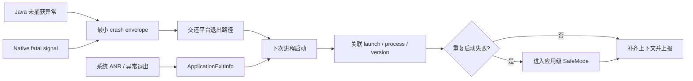
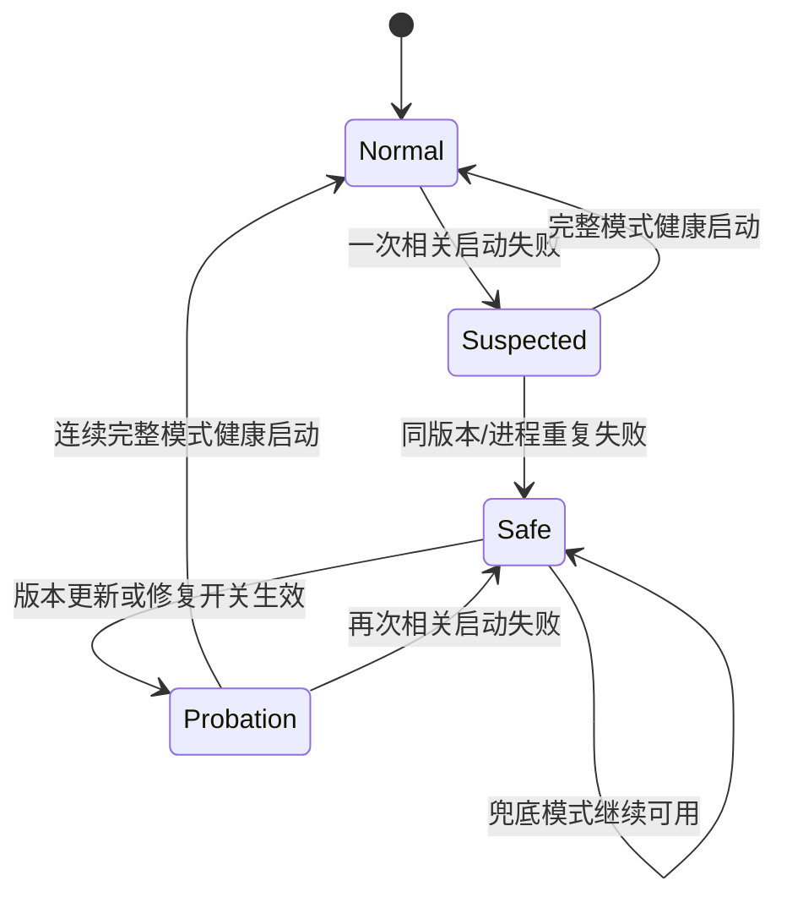

# 异常处理架构设计

异常处理架构面对的是一个很苛刻的时刻：线程可能持有锁，堆可能已经耗尽，文件系统可能正在写入，系统也可能马上结束进程。架构目标因此分成三件事：在当前进程保留最小证据，在下次启动限制重复失败，把版本风险交给灰度和发布系统处理。

平台锚点是 Android 17（API 37，`android-17.0.0_r1`）。Java Crash、Native Crash、ANR 和 OOM 的系统机制分别见 20.2～20.5；这里讨论它们进入同一套应用侧恢复架构之后，边界应该怎样划分。

## 全局异常捕获框架设计

### 把“当前进程”和“下次启动”分开

下面这张图标出故障发生后的两段工作：



Crash handler 所处的左半段只适合做有上限的同步写入。数据库查询、网络请求、动态配置拉取、复杂序列化和线程切换都放到右半段。异步任务一旦尚未完成，默认 handler 结束进程时就会一并消失。

### Java 未捕获异常入口

Android 17 的 [`RuntimeInit.java`](https://android.googlesource.com/platform/frameworks/base/+/android-17.0.0_r1/core/java/com/android/internal/os/RuntimeInit.java)在 `commonInit()` 中安装两个入口：

- `LoggingHandler` 通过 `RuntimeHooks.setUncaughtExceptionPreHandler()` 注册，应用不能替换这个 pre-handler；
- `KillApplicationHandler` 成为默认 `Thread.UncaughtExceptionHandler`，向 ActivityManager 报告后，在 `finally` 中调用 `Process.killProcess()` 和 `System.exit(10)`。

应用或 Crash SDK 替换默认 handler 时，要保存替换前的 handler，并在自己的最小记录结束后调用它。吞掉默认 handler 会改变系统的 fatal 语义，可能留下状态损坏的进程，也会绕过 `KillApplicationHandler` 向 ActivityManager 报告并终止进程的默认路径。

多个 SDK 都想接管入口时，注册顺序必须可查询。推荐由宿主统一安装一个分发器，其他 SDK 注册有超时和大小限制的 observer。若只能使用 handler 链，每一层都要保证：

- observer 抛出异常时仍会进入前一个 handler；
- 同一个 `Throwable` 不会被多层重复写入大文件；
- 记录路径不依赖正在崩溃的业务数据库；
- 递归崩溃有一次性保护，不能反复进入 Crash SDK。

### Native fatal signal 入口

Native signal handler 的限制比 Java handler 更严格。`SIGSEGV`、`SIGABRT` 等信号可能发生在 allocator、动态链接器或持锁代码里，handler 不能调用非 async-signal-safe 函数。日志框架、C++ 容器、JNI、malloc、互斥锁和大部分文件封装都不在安全范围内。

生产方案通常使用 Crashpad、Breakpad 或经过验证的 APM Native SDK，由预先建立的文件描述符、独立 dumper 进程或系统 debuggerd 保留现场。应用自己的 handler 还要考虑旧 handler 链、`SA_SIGINFO`、备用信号栈、重入和恢复默认 disposition，系统链路见 20.3，回溯与符号化细节见 20.16。

### 协程异常不是新的系统 Crash 类型

Kotlin 协程改变异常的传播位置，却没有增加一种 Android 进程退出原因。未处理异常到达线程的 uncaught handler 时，仍按 Java Crash 进入 `RuntimeInit`；在业务边界被捕获并转为失败状态时，它只是一条业务错误或 non-fatal 记录。

因此，统一上报模型要区分：

| 事件 | 进程是否必然退出 | 进入稳定性 Crash 指标 |
|---|---|---|
| Java/Kotlin 未捕获异常到达默认 handler | 是 | 是 |
| Native fatal signal | 通常是 | 是 |
| `async` 的异常被 `await()` 捕获 | 否 | 否，按业务错误统计 |
| `CancellationException` | 否 | 否 |
| `CoroutineExceptionHandler` 收到根协程未处理异常 | 取决于平台传播 | 只有进入 uncaught handler 并导致退出时才算 Crash |

### crash envelope 只保存关联所需字段

故障当下的记录不需要复制全部业务上下文。一个有长度上限的 envelope 通常包括：

| 字段 | 用途 |
|---|---|
| `event_id`、`launch_id`、`process_start_id` | 去重并关联启动和进程 |
| 版本号、构建号、进程名、pid/tid | 区分发布版本与多进程 |
| wall clock 与 `elapsedRealtime` | 关联系统退出记录并识别时钟回拨 |
| 异常/信号类型、有限堆栈或 dump 引用 | 生成问题指纹 |
| 当前页面、功能开关版本的短标识 | 判断故障范围 |
| 完整长度、格式版本、校验值 | 下次启动识别 partial 文件 |

账号、Token、URL 查询参数、用户输入和完整 Intent 不应进入 Crash 文件。`ActivityManager.setProcessStateSummary()`（API 30+）可以向后续 `ApplicationExitInfo` 附带最多 128 字节的非敏感状态，但系统可能节流调用；它适合写版本、`process_start_id` 和阶段标识，不适合频繁同步页面状态。

## ApplicationExitInfo：补偿证据，不替代采集

API 30 起，`ActivityManager.getHistoricalProcessExitReasons()` 返回近期进程死亡记录。它可以补充 handler 没来得及写完的事件，也能解释用户强停、系统 LMK 和包更新等非 Crash 退出。

### Android 17 的 reason 边界

`android-17.0.0_r1` 的 [`ApplicationExitInfo.java`](https://android.googlesource.com/platform/frameworks/base/+/android-17.0.0_r1/core/java/android/app/ApplicationExitInfo.java)定义 17 个 `REASON_*` 常量，编号为 0～16。SafeMode 不应把它们全部当成启动崩溃。

| 分类 | reason | SafeMode 处理 |
|---|---|---|
| 明确故障候选 | `REASON_CRASH`、`REASON_CRASH_NATIVE`、`REASON_ANR`、`REASON_INITIALIZATION_FAILURE` | 只有时间、进程和未完成 launch 同时匹配才计数 |
| 通常不是应用缺陷 | `REASON_EXIT_SELF`、`REASON_USER_REQUESTED`、`REASON_USER_STOPPED`、`REASON_PACKAGE_UPDATED`、`REASON_PACKAGE_STATE_CHANGE`、`REASON_PERMISSION_CHANGE`、`REASON_FREEZER` | 不计入启动失败 |
| 资源或依赖变化 | `REASON_LOW_MEMORY`、`REASON_DEPENDENCY_DIED` | 单独统计，不直接触发代码降级 |
| 需要更多证据 | `REASON_UNKNOWN`、`REASON_SIGNALED`、`REASON_EXCESSIVE_RESOURCE_USAGE`、`REASON_OTHER` | 结合公开的 status、importance、trace 和本地 envelope 判断 |

部分设备不支持准确报告 `REASON_LOW_MEMORY`。官方 API 要求先检查 `ActivityManager.isLowMemoryKillReportSupported()`；不支持时，LMK 可能表现为 `REASON_SIGNALED` 与 `SIGKILL`。因此，看到 `SIGKILL` 不能直接断言是 Native Crash 或业务主动结束。

API 37 的 `ApplicationExitInfo.getAnrInfo()` 只在 `reason == REASON_ANR` 时返回结构化 `AnrInfo`。`getDescription()` 是面向人的不稳定文本，不能作为长期分类协议。

### 历史记录有容量和持久化边界

AOSP Android 17 的 [`AppExitInfoTracker.java`](https://android.googlesource.com/platform/frameworks/base/+/android-17.0.0_r1/services/core/java/com/android/server/am/AppExitInfoTracker.java)有两个实现细节：

- `APP_EXIT_INFO_PERSIST_INTERVAL` 为 30 分钟；
- `config_app_exit_info_history_list_size` 的 AOSP 默认值为每包 16 条。

这两个数字都不是公开 API 契约。历史容量来自系统资源，厂商可以调整；30 分钟表示 system_server 把内存状态写入磁盘的节流周期，不表示应用在同一开机周期内必须等 30 分钟才能查询。若设备在写盘前重启，近期记录可能丢失，所以应用仍要保留自己的小型 launch marker 与 crash envelope。

`getTraceInputStream()` 也不是必有数据。API 30 起可能返回 ANR trace，API 31 起 `REASON_CRASH_NATIVE` 可能返回 tombstone protobuf；底层 trace 使用全局环形缓冲，可能被其他应用的新记录覆盖，方法允许返回 `null` 并抛出 `IOException`。

### 关联必须指向同一次 launch

仅判断“历史列表里存在一个 Crash”会把几天前的故障归到本次启动。关联至少检查：

- `processName` 与本地 launch marker 一致；
- exit timestamp 位于启动开始之后、成功标记之前或允许的短窗口内；
- 本地版本和 `process_start_id` 与 `getProcessStateSummary()` 一致；取不到 summary 时降低证据等级；
- 同一 exit 记录只消费一次；
- 已经写入 `launch_success` 的运行期 Crash 不计作启动循环。

下一段示意代码只演示 exit reason 与 launch 的相关性，不负责持久化：

```kotlin
data class PreviousLaunch(
    val processName: String,
    val startedAtEpochMs: Long,
    val state: LaunchState,
    val hasLocalFatalEnvelope: Boolean,
)

fun isCorrelatedStartupFailure(
    launch: PreviousLaunch,
    exit: ApplicationExitInfo?,
    startupWindowMs: Long,
): Boolean {
    if (launch.state != LaunchState.ATTEMPTED) return false

    if (exit == null) {
        return launch.hasLocalFatalEnvelope
    }
    if (exit.processName != launch.processName) return false

    val delayMs = exit.timestamp - launch.startedAtEpochMs
    if (delayMs !in 0..startupWindowMs) return false

    return when (exit.reason) {
        ApplicationExitInfo.REASON_CRASH,
        ApplicationExitInfo.REASON_CRASH_NATIVE,
        ApplicationExitInfo.REASON_ANR,
        ApplicationExitInfo.REASON_INITIALIZATION_FAILURE -> true
        else -> false
    }
}
```

marker 缺失不能当成失败：首次安装、数据被清理或写入尚未开始都会出现这种状态。只有“未完成的 launch marker + 相关系统记录”或“未完成的 launch marker + 本地 fatal envelope”才形成一次启动失败证据。生产代码还要持久化已消费的 exit 标识，并处理系统时间变化。

## 安全气囊（SafeMode）机制

这里的 SafeMode 是应用自己的 circuit breaker，与 Android 系统安全模式无关。它不能挽救已经发生 fatal 的当前进程，只能让下一次启动跳过高风险路径。

### 状态机比一个布尔开关可靠

SafeMode 至少需要区分正常、观察、受限和试运行状态。下面是一套可按产品调整的状态关系：



`Suspected` 避免一次偶发故障直接关闭大量功能；`Probation` 避免兜底页能启动就被误判为原问题已经修复。只有在完整模式或逐步恢复的模块集合下成功，才能消除对应失败计数。

### 判定输入

一次可用于状态迁移的失败记录要同时回答四个问题：

1. 是否为同一版本、构建号和进程；
2. 是否发生在同一次未完成的 `launch_id`；
3. 是否属于相同问题簇或相同初始化模块；
4. 证据来自本地 fatal envelope、`ApplicationExitInfo`，还是二者互证。

阈值要按启动量、故障代价和误触发成本选择。阈值可以由远程配置更新，但启动时只能依赖已经校验并缓存到本地的配置；正在崩溃循环的设备往往无法完成网络拉取。本地保守默认值必须独立可用。

launch marker 的写入位置要早于可选 SDK 和动态业务容器。若应用支持 Direct Boot，还要明确 marker 位于 device-protected 还是 credential-protected storage；不要在用户尚未解锁时误读另一存储域的旧状态。

### 分级动作

| 等级 | 适用证据 | 动作 |
|---|---|---|
| L1：模块隔离 | 问题簇稳定指向某个可选模块 | 关闭该模块、实验或 SDK，保留主流程 |
| L2：页面降级 | 首页容器或关键页面连续失败 | 使用静态/轻量页面，保留登录、设置、反馈 |
| L3：修复入口 | 主进程初始化在最小依赖集内仍失败 | 只加载诊断、升级、反馈和安全重置能力 |

动作要有依赖图。关闭广告 SDK 后，其初始化 provider、后台任务和埋点 adapter 也要停止；只隐藏入口却继续初始化，无法减少启动故障。

“清理数据”不能作为默认恢复动作。数据库、登录态和用户文件可能没有问题，整库删除会把稳定性故障扩大为数据丢失。若某个缓存已由校验和、版本号或复现证据确认损坏，只清理该缓存，并记录清理原因。

### 退出与防振荡

退出 SafeMode 可由新版本安装、已签名的本地修复配置、问题模块被关闭，或一组成功试运行触发。每次只恢复一组依赖，失败后回到上一个已知可用状态。

需要额外限制：

- 同一设备的状态切换设置最短间隔，避免每次启动在正常与受限之间抖动；
- SafeMode 自身只依赖平台和小型本地存储，不能复用可疑的数据库或动态容器；
- 记录 `safe_mode_enter`、禁用模块、证据等级和退出原因，但不把兜底模式的成功算作完整模式成功；
- 版本升级后保留上一版本的失败摘要用于分析，同时清空不再适用的 breaker 计数。

### 启动租约：先记录进度，再判断失败

一个残留 marker 只能说明上一次没有走到成功点，不能单独证明发生了 Crash。用户强停、LMK、设备重启、覆盖安装、并发进程写入和文件提交中断都可能留下相同状态。SafeMode 应把三类数据分开：

| 数据 | 回答的问题 | 保存边界 |
|---|---|---|
| `LaunchLease` | 上一次启动走到了哪个阶段 | 按版本、进程和入口隔离 |
| `FailureOccurrence` | 哪个退出证据能与该启动关联 | 有数量、时间和隐私上限 |
| `DegradationPlan` | 下次启动跳过哪些模块 | 按模块、页面、进程和版本限定 |

启动租约可按 `LAUNCHING → PROCESS_READY → INTERACTIVE → PROBATION → HEALTHY` 推进。入口必须先读取旧租约，再写入本轮 `launchId`；若先覆盖文件，上一轮阶段和时间窗都会丢失。租约至少保存 schema、`versionCode`、安装时间、进程角色、随机 `launchId`、粗粒度启动入口、墙钟、`elapsedRealtime`、boot sequence、阶段和 plan ID。不要保存 URL、账号或 Intent 参数。

`ApplicationExitInfo.getTimestamp()` 使用墙钟，`elapsedRealtime()` 只适合同一次开机内计算时长，两者不能直接相减。boot sequence 变化、elapsed 倒退或墙钟偏移异常时，应降低证据置信度，而不是增加失败次数。

`AtomicFile` 可以让单文件保持旧版或新版可读，但不提供线程锁和跨进程锁。单进程仍需串行化读写；多进程应使用 `lease-main`、`lease-push`、`lease-web` 等独立文件，再由一个明确 owner 汇总。格式还要有版本、长度上限、校验和与损坏文件隔离，读不到时安全退化。

### 两阶段证据核对

SafeMode 决策分成快速路径和补偿路径：

1. **快速路径**只读取此前已经确认的本地失败样本，在可选 SDK、插件和 WebView 预热之前选择计划。单独残留的 `LAUNCHING` 只允许触发低风险动作，例如推迟非必要预热。
2. **补偿路径**在启动后查询 `ApplicationExitInfo`，按进程、时间窗、版本、旧租约阶段、本地 fatal envelope 和已消费标识关联上一轮退出。先筛元数据，再在后台受限读取 trace；trace 为空不能反证没有 ANR 或 Native Crash。

退出原因要分流：`REASON_CRASH`、`REASON_CRASH_NATIVE`、启动窗口内的 `REASON_ANR` 和 `REASON_INITIALIZATION_FAILURE` 在完成关联后可参与 Crash Loop；`REASON_LOW_MEMORY` 与过量资源进入资源保护；用户停止、包更新、权限变化和主动退出默认不增加 Crash 计数。`SIGKILL` 也不能自动解释为 LMK。

`ActivityManager.setProcessStateSummary()` 可附带最多 128 字节的关联摘要，适合保存格式版本、`launchId` 短哈希、进程角色、阶段和 plan ID。它不是 UI 状态仓库，也不是隐私保护机制；只在关键里程碑更新。

### 多进程、版本和恢复计划

每个进程独立持有租约，只有汇总 owner 能更新失败样本与计划。独立服务或推送进程死亡时，默认只隔离对应功能；进程仍存活时，其他进程不能仅凭租约年龄判定它已经失败。

建议用下面的键组织有界历史：

```text
installationEpoch / versionCode / processRole / startupRoute / signature
```

新版本关闭旧桶的直接决策权，但保留诊断摘要；经审核后，可以让共用同一 native 库或配置的版本继承特定计划。恢复时一次只启用一组依赖，并设置冷却时间、最长持续时间、最大尝试次数和单独的进入/退出条件，避免在完整模式与受限模式之间振荡。

计划应表示为 `moduleId + action + scope + reason + expiry`。图片预热、动态插件、推荐和埋点等可选能力可以延迟或关闭；数据库强制迁移、身份认证和支付校验不能绕过。WebView renderer gone 属于页面级恢复，不直接增加宿主主进程的 Crash Loop。

### SafeMode 验证矩阵

测试应覆盖状态与证据的组合，而不是只测计数器：

- Java Crash、Native Crash、启动 ANR、LMK、用户停止在各租约阶段的分类；
- 墙钟前后跳、设备重启、覆盖安装、升级与回滚；
- 同名进程多条退出记录、重复消费和候选歧义；
- 租约为空、截断、未知 schema 和校验失败；
- 多进程并发启动、owner 中断和计划传播；
- 观察期成功、复发、过期和用户主动尝试正常启动；
- WebView renderer 反复退出只触发页面计划；
- 故障注入后系统 tombstone、退出历史和本地 envelope 仍可关联。

指标至少包括进入率、候选转确认率、退出记录匹配/歧义率、普通与降级启动的交互成功率、计划误触发率和重复进入率。兜底模式启动成功不能计作完整模式恢复。

## 降级策略：功能、页面与进程

### 在明确边界捕获异常

降级适合“边界有替代结果”的场景，例如远程配置解析失败后使用已验证缓存、图片编辑器初始化失败后隐藏编辑入口、页面数据组合失败后显示局部错误态。

不要在任意层用 `catch (Throwable)` 继续运行。`OutOfMemoryError`、`LinkageError`、VM 错误和协程取消都可能表示当前操作已不具备恢复条件。协程边界捕获 `CancellationException` 后要继续抛出；普通业务错误应转换成有类型的失败结果，由页面决定重试或降级。

### 功能降级

功能开关至少要有这些属性：

- 启动前可读，并带 schema/version；
- 本地默认值能在离线时生效；
- 远程值经过签名或可信通道校验；
- 开关依赖与互斥关系可验证；
- 每次命中记录版本和原因；
- 关闭动作可重复执行，不依赖模块已经初始化成功。

服务端兼容也属于功能降级。客户端新字段或新协议出现问题时，服务端按版本回退响应，常常比等待新包更快，也不会引入端侧动态代码风险。

### 页面降级与兜底页

页面降级要在导航或页面状态边界处理。兜底页保持依赖小：不加载广告、动态化容器、WebView、复杂图片管线和非必要分析 SDK。它至少提供可理解的错误说明、有限次数的重试、更新入口和反馈入口。

Compose 没有可包住任意组合异常并安全继续组合的通用 Error Boundary。数据加载异常应在协程和状态层转为错误状态；组合期间的编程错误仍可能导致进程 Crash，不要用外围 `try/catch` 假装页面已经恢复。

### WebView renderer 退出

系统 WebView renderer 由 WebView 提供方管理，不是应用在 manifest 中声明的 `:web` 进程。应用不能在 renderer 内安装自己的 Crash handler。API 26 起，[`WebViewClient.onRenderProcessGone()`](https://developer.android.com/reference/android/webkit/WebViewClient#onRenderProcessGone(android.webkit.WebView,%20android.webkit.RenderProcessGoneDetail))通知宿主清理受影响的 WebView。

下面的代码展示单个回调应完成的最小清理：

```kotlin
override fun onRenderProcessGone(
    view: WebView,
    detail: RenderProcessGoneDetail,
): Boolean {
    rendererExitReporter.record(
        didCrash = detail.didCrash(),
        priorityAtExit = detail.rendererPriorityAtExit(),
    )

    (view.parent as? ViewGroup)?.removeView(view)
    webViewRegistry.remove(view)
    view.destroy()

    showRendererFallback(allowRetry = retryBudget.tryAcquire())
    return true
}
```

同一个 renderer 可能服务多个 WebView，系统会为每个受影响实例分别调用回调。代码只清理参数给出的实例，同时确保 Activity、Fragment、adapter 和 registry 不再持有它；不能在第一次回调里假设其他 WebView 仍可用。返回 `false` 时，renderer 若崩溃会导致应用 Crash，若被系统杀死则应用会被杀。

`didCrash() == false` 表示 renderer 被系统结束，常见背景是内存压力，但不能仅凭该布尔值断言 OOM。恢复策略要限制重建次数；持续内存压力下立即创建同样的 WebView，容易形成 renderer 重建循环。20.9 专门讨论 WebView renderer OOM 恢复。

## 灰度发布、回滚与热修复

异常架构要让每条记录都能关联版本、构建号、渠道、发布轨道、设备/API、ABI、功能开关版本和实验组。没有这些字段，服务端只能看到故障增加，却无法判断该暂停哪个暴露人群。

### 灰度门禁

灰度判断使用 20.6 的同口径指标和问题簇证据。常见动作包括：

- 暂停继续扩量，保留当前样本做归因；
- 只回滚服务端配置或实验；
- 对特定设备、API、ABI 停止扩量；
- 通过 Google Play 发布修复版本或回退到已验证构建；
- 启用已随 APK 交付的本地降级实现。

“暂停 staged rollout”只阻止更多用户获得该版本，已经安装的设备不会自动退回旧包。SafeMode 和服务端开关用于保护这些存量设备，新包用于修复代码。

### 热修复有分发与安全边界

Android 平台没有通用、无风险的应用热修复 API。对 Google Play 分发的应用，[Device and Network Abuse 政策](https://support.google.com/googleplay/android-developer/answer/16559646)禁止从 Google Play 之外下载 dex、JAR 或 `.so` 等可执行代码来修改、替换或更新应用。

因此，Play 应用的在线恢复手段优先选择：

- 关闭已经随包交付的功能；
- 回滚服务端协议、配置和实验；
- 切换随包交付的备用实现；
- 使用 Play 的更新机制发布新构建。

企业内部分发或其他商店有各自政策，也不能省略补丁签名、目标版本约束、类加载边界、Native ABI、回滚路径和审计记录。任何补丁都要在与目标构建一致的 mapping、符号和依赖集合上验证。

## 多进程异常隔离

每个应用进程都有自己的 `Application`、默认 uncaught handler、协程全局入口和内存空间。只在主进程安装捕获器，会漏掉播放器、下载、推送和自有 `:web` 进程。

### 按进程分配职责

| 进程 | 记录与恢复职责 |
|---|---|
| 主进程 | 管理 launch 状态、SafeMode、页面降级和汇总上报 |
| 远程业务进程 | 独立记录 envelope；由主进程决定是否重启或关闭功能 |
| 自有 `:web` / `:h5` 进程 | 按普通应用进程处理；不要与系统 WebView renderer 混淆 |
| 上传进程 | 只扫描 completed 记录并上传，不能依赖主进程内存对象 |

每个文件名带进程名哈希、pid 和单调序号。各进程写自己的目录或文件，主进程只在下一次正常阶段汇总，避免 Crash 时争抢跨进程锁。

远程进程死亡可通过 Binder death 或业务连接回调感知，但“连接断开”不等于 Crash。要结合 `ApplicationExitInfo`、本地 envelope 和服务端记录分类。自动重启采用指数退避与次数上限；持续重启后关闭对应功能，并让用户可见地回到主流程。

## Crash 文件的持久化边界

### 原子替换不等于每次都能落盘

AOSP Android 17 的 [`AtomicFile.java`](https://android.googlesource.com/platform/frameworks/base/+/android-17.0.0_r1/core/java/android/util/AtomicFile.java)采用 `.new` 文件：

1. `startWrite()` 打开新文件；
2. `finishWrite()` 调用 `FileUtils.sync()`，关闭后 rename 到目标文件；
3. `failWrite()` 同步、关闭并删除 `.new`。

这能让读取者在旧完整版本与新完整版本之间选择，避免直接覆盖目标文件留下半截内容。实现没有对父目录执行 fsync，所以不能把它描述成掉电条件下的严格事务。应用若要求更强的目录项持久性，可通过公开的 `android.system.Os.open()`、`Os.fsync()` 和 `Os.close()` 处理父目录 fd；还要按文件系统能力处理失败，不能假定所有设备表现一致。

文件协议本身还要包含 magic、schema version、payload length、序号和校验值。下次启动扫描时：

| 状态 | 处理 |
|---|---|
| completed 且校验通过 | 去重后进入待上报队列 |
| completed 但校验失败 | 标记 corrupt，保留短摘要后隔离 |
| tmp/new 且完整 | 可按协议恢复为 completed |
| tmp/new 不完整 | 记录 partial 计数后删除 |
| 已上报 | 按保留周期清理 |

AOSP [`DropBoxManagerService.java`](https://android.googlesource.com/platform/frameworks/base/+/android-17.0.0_r1/services/core/java/com/android/server/DropBoxManagerService.java)选择了更轻的 best-effort 协议：临时文件 close 后 rename，没有额外 fsync；服务启动扫描到 `.tmp` 时直接删除。[`ActivityManagerService.java`](https://android.googlesource.com/platform/frameworks/base/+/android-17.0.0_r1/services/core/java/com/android/server/am/ActivityManagerService.java)只有在 system_server 自身 Crash 的特定路径上才等待 DropBox worker 最多两秒。普通应用不能从这些实现推导出“异步 Crash 上报一定来得及”。

### Java 与 Native 的写入策略不能共用

Java handler 可以尝试一次有大小限制的同步写入，但仍可能遇到 OOM、文件系统阻塞或递归异常。记录器应预先创建目录、限制文件数、避免 JSON 反射和大对象复制，并确保无论写入成功与否都会调用前一个默认 handler。

Native signal handler 只能使用 async-signal-safe 操作。若方案需要压缩、符号化、锁或堆分配，就应放到独立 dumper 或下次启动。不要把 Java 版本的“临时文件 + rename”代码直接移进信号处理函数。

Crash 文件属于应用私有诊断数据，也要执行配额、加密与删除策略。存储满时保留事件摘要和丢弃计数，比无限写入直到影响用户数据更安全。

## Kotlin Coroutine 异常处理

当前官方 [Coroutine exceptions handling](https://kotlinlang.org/docs/exception-handling.html)把 builder 分成两类：

- 根协程 `launch` 把未处理异常视为 uncaught；
- 根协程 `async` / `produce` 把异常保存在结果中，调用方通过 `await()` / `receive()` 消费；
- 普通子协程的异常向父协程传播并取消父级，子协程上的 `CoroutineExceptionHandler` 通常不会截断传播；
- `supervisorScope` 或 `SupervisorJob` 使子任务失败不自动取消同级任务，每个子任务仍要处理自己的失败；
- `CancellationException` 用于协作取消，通常不进入错误上报。

`CoroutineExceptionHandler` 在协程已经以异常完成后才被调用，不能恢复该协程。它适合记录根协程未处理异常，不能代替 `try/catch`、`await()` 处的错误处理或结构化并发。

下面的例子只捕获调用契约中允许恢复的网络错误，其他编程错误继续传播：

```kotlin
viewModelScope.launch {
    try {
        uiState.value = UiState.Content(repository.load())
    } catch (cancelled: CancellationException) {
        throw cancelled
    } catch (error: IOException) {
        nonFatalReporter.record(error)
        uiState.value = UiState.Error(retryable = true)
    }
}
```

这里的 `IOException` 被转换成页面状态，不应计为 Crash。若仓库契约还有明确的领域错误，可以逐类处理；不要用 `runCatching` 把 `Error` 等任意 `Throwable` 一起变成页面错误。若希望多个子任务互不取消，可在 `supervisorScope` 内分别处理；不能只加一个 handler 后忽略各子任务的失败结果。

kotlinx.coroutines 1.11.0 的 [JVM `CoroutineExceptionHandlerImpl.kt`](https://github.com/Kotlin/kotlinx.coroutines/blob/1.11.0/kotlinx-coroutines-core/jvm/src/internal/CoroutineExceptionHandlerImpl.kt)通过 `ServiceLoader` 加载平台 handler，兜底时调用当前线程的 `uncaughtExceptionHandler`。Android 模块的 [`AndroidExceptionPreHandler.kt`](https://github.com/Kotlin/kotlinx.coroutines/blob/1.11.0/ui/kotlinx-coroutines-android/src/AndroidExceptionPreHandler.kt)只为 API 26/27 的 Oreo pre-handler 差异做反射补偿；Android 17 仍回到线程 uncaught handler 与 `RuntimeInit` 的平台路径。

协程记录要带 `CoroutineName`、作用域类型、页面生命周期和 Dispatcher。不要在 `CoroutineExceptionHandler` 中同步访问网络或执行大规模序列化，它可能运行在主线程或已处于失败传播过程的工作线程上。

## 上线前检查

1. Java 自定义 handler 是否无条件调用替换前的默认 handler；
2. Native handler 是否只使用 async-signal-safe 能力，并处理重入和旧 handler；
3. crash envelope 是否有大小、数量、隐私和校验限制；
4. launch marker 缺失是否被错误计为启动失败；
5. `ApplicationExitInfo` 是否按进程、时间和未完成 launch 关联，而非扫描到任意 Crash 就触发；
6. `REASON_LOW_MEMORY`、用户强停、包更新和权限变化是否排除在代码 Crash 计数之外；
7. SafeMode 是否有 Suspected、Probation、退出和防振荡规则；
8. 兜底页是否避开原故障模块，数据清理是否限制到已证实损坏的对象；
9. 每个应用进程是否独立安装捕获入口，系统 WebView renderer 是否走 `onRenderProcessGone()`；
10. 灰度暂停、服务端回滚、Play 新包和存量设备保护是否各有负责人；
11. Google Play 应用是否避免从 Play 之外下载 dex、JAR 或 Native 可执行代码；
12. 协程取消、可恢复业务错误和进程级 Crash 是否进入不同指标。

异常处理架构的成败不由“捕获了多少异常”决定。严谨的实现会承认当前进程不可恢复的边界，把少量可信证据带到下一次启动，再用受控降级和发布动作阻止同一故障反复伤害用户。

## 参考资料

- [Android 17 `RuntimeInit.java`](https://android.googlesource.com/platform/frameworks/base/+/android-17.0.0_r1/core/java/com/android/internal/os/RuntimeInit.java)
- [Android 17 `ApplicationExitInfo.java`](https://android.googlesource.com/platform/frameworks/base/+/android-17.0.0_r1/core/java/android/app/ApplicationExitInfo.java)
- [Android 17 `AppExitInfoTracker.java`](https://android.googlesource.com/platform/frameworks/base/+/android-17.0.0_r1/services/core/java/com/android/server/am/AppExitInfoTracker.java)
- [Android 17 `AtomicFile.java`](https://android.googlesource.com/platform/frameworks/base/+/android-17.0.0_r1/core/java/android/util/AtomicFile.java)
- [Android 17 `DropBoxManagerService.java`](https://android.googlesource.com/platform/frameworks/base/+/android-17.0.0_r1/services/core/java/com/android/server/DropBoxManagerService.java)
- [Android 17 `ActivityManagerService.java`](https://android.googlesource.com/platform/frameworks/base/+/android-17.0.0_r1/services/core/java/com/android/server/am/ActivityManagerService.java)
- [`ApplicationExitInfo` API](https://developer.android.com/reference/android/app/ApplicationExitInfo)
- [`ActivityManager.setProcessStateSummary()` API](https://developer.android.com/reference/android/app/ActivityManager#setProcessStateSummary(byte%5B%5D))
- [`WebViewClient.onRenderProcessGone()` API](https://developer.android.com/reference/android/webkit/WebViewClient#onRenderProcessGone(android.webkit.WebView,%20android.webkit.RenderProcessGoneDetail))
- [Kotlin 协程异常处理](https://kotlinlang.org/docs/exception-handling.html)
- [kotlinx.coroutines 1.11.0 Android 模块](https://github.com/Kotlin/kotlinx.coroutines/tree/1.11.0/ui/kotlinx-coroutines-android)
- [Google Play Device and Network Abuse 政策](https://support.google.com/googleplay/android-developer/answer/16559646)
