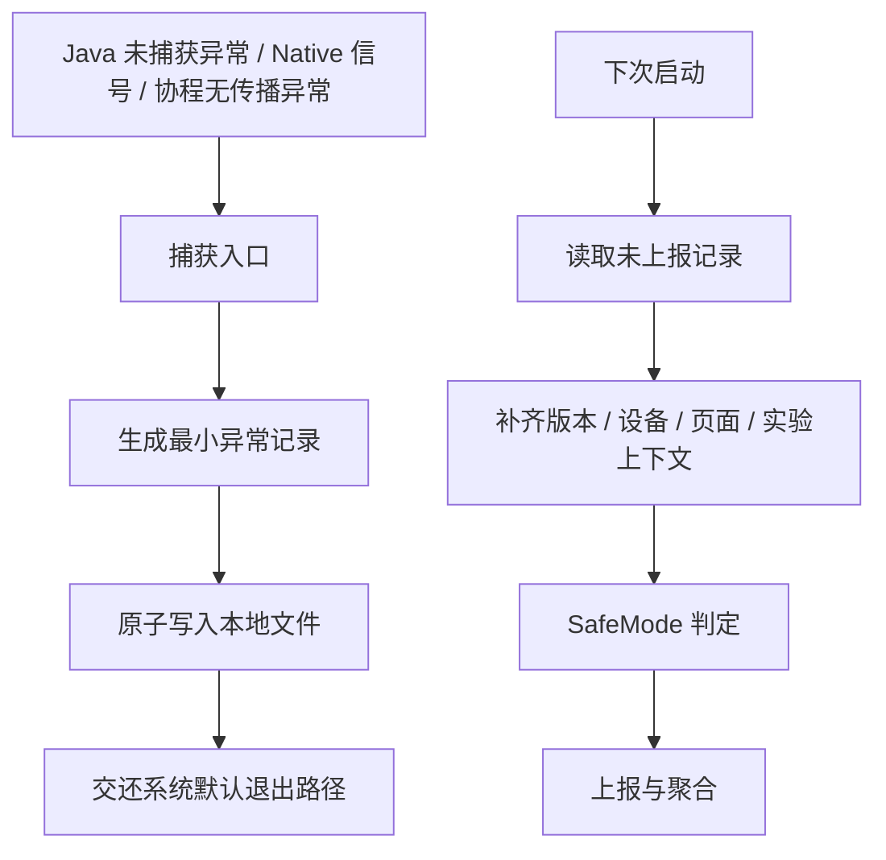

# 异常处理架构设计

<!-- outline-start -->
## 本节要点大纲

### 锚点(必须覆盖)

- 🔹 全局异常捕获框架设计
- 🔹 安全气囊(SafeMode)机制
- 🔹 降级策略:功能降级、页面降级、兜底页
- 🔹 灰度发布与热修复集成

### 扩展(可选深入)

- 🔸 多进程异常隔离
- 🔸 Kotlin Coroutine 异常处理

### OpenClaw 加工指引

> **锚点**是最低覆盖要求,加工时必须逐条落实并标注验证结果。
> **扩展**视素材丰富程度选择性深入。
> 如果从 Obsidian 素材或 AOSP 源码中发现大纲未列出但与本节强相关的知识点,
> 可**就地插入**最相关的锚点之后,并用 `[自动发现]` 标注,方便后续 review。
> 锚点内容需 L1/L2 验证,扩展内容至少 L2 验证,自动发现内容至少标注来源。
<!-- outline-end -->

异常处理架构解决的不是"把异常都捕获后吞掉",而是在进程可能退出、功能可能不可用、版本可能已经放量的情况下,尽量保留现场、限制影响面,并给下一次启动留下恢复路径。

20.2、20.3 已经分别讲过 Java Crash 和 Native Crash 的系统机制,26.2 讲 Crash 上报体系。本节聚焦 App 侧架构:捕获入口怎样接入,SafeMode 怎样避免崩溃循环,降级和热修复怎样接入发布系统。

[结构参考: Clippings/Android 应用稳定性剖析与优化 - Java Crash 监控:实现自定义 Crash 处理器.md]

## 全局异常捕获框架设计

全局异常捕获框架分三层:语言运行时入口、进程内最小现场、下次启动补偿。三层职责分开后,Crash handler 里就不会塞进数据库、网络请求、复杂线程调度这些高风险动作。



Java 入口使用 `Thread.UncaughtExceptionHandler`。Android 官方文档说明,线程因未捕获异常即将终止时,虚拟机会通知对应 handler;AOSP `RuntimeInit.commonInit()` 默认注册 `LoggingHandler` 和 `KillApplicationHandler`,前者写 `FATAL EXCEPTION` 日志,后者通知 AMS 并结束进程。自定义 handler 处理完后必须调用上一个 handler,不能吞掉系统退出路径。详见 20.2。[已验证: 官方文档, developer.android.com/reference/java/lang/Thread.UncaughtExceptionHandler][已验证: AOSP android-16.0.0_r1, frameworks/base/core/java/com/android/internal/os/RuntimeInit.java]

Native 入口通常交给 Crashpad、Breakpad 或厂商 APM SDK。信号处理函数的安全边界比 Java handler 更窄,不能依赖锁、堆分配、日志框架和网络。端侧只写最小记录,堆栈符号化、聚合和告警放到 26.2 的上报系统处理。详见 20.3。[已验证: AOSP android-16.0.0_r1, system/core/debuggerd/crash_dump.cpp]

异常记录建议拆成两份:崩溃当下写入 `crash_envelope`,下次启动再补 `runtime_context`。

| 记录 | 写入时机 | 字段 | 设计边界 |
|------|----------|------|----------|
| `crash_envelope` | 崩溃入口 | 时间、进程名、线程名、异常类型、栈顶摘要、版本号、构建号 | 只做原子文件写入,不做网络请求 |
| `runtime_context` | 下次启动 | 设备、系统版本、页面、登录态摘要、实验分组、最近开关变更 | 可读数据库和配置中心,但要脱敏 |
| `exit_reason` | Android 11+ 下次启动 | `ApplicationExitInfo` 的 reason、status、importance、trace | 用于补 Java/Native handler 没拿到的退出原因 |

Android 11 引入 `ApplicationExitInfo`,应用可通过 `ActivityManager.getHistoricalProcessExitReasons()` 查询历史进程退出原因。它适合补偿"进程被系统杀死、handler 没来得及执行、Native crash 只留下系统 trace"的场景,但不能替代 Crash handler;它拿到的是系统记录,不保证包含业务上下文。[已验证: 官方文档, developer.android.com/reference/android/app/ApplicationExitInfo]

`getTraceInputStream()` 的返回内容随版本变化。Android 11/API 30 引入该方法,用于 `REASON_ANR` 的 ANR trace;Android 12/API 31 起,`REASON_CRASH_NATIVE` 也可通过该方法读取 tombstone protobuf 流,但底层存储是全局循环缓冲区,高崩溃频率下会被覆盖并返回 `null`。调用方必须处理 `null` 和 `IOException`,不能把它当作 native crash 的主链路--Crashpad/Breakpad 仍然是 native 崩溃捕获的首选。[已验证: 官方文档, developer.android.com/reference/android/app/ApplicationExitInfo]

全局捕获框架的边界要写进 SDK 契约:

- 捕获入口只保证留证,不保证恢复当前进程。
- Java Crash handler 处理完必须交还默认 handler。
- Native signal handler 只做异步信号安全范围内的记录。
- 业务上下文在下次启动补齐,不能在崩溃线程里临时查数据库。
- 多个 SDK 同时接管 handler 时,注册顺序必须可观测,后注册者要保存并调用前一个 handler。

[结构参考: Clippings/Android 应用稳定性剖析与优化 - Java 堆栈:深入了解 Throwable.md]

## 安全气囊(SafeMode)机制

SafeMode 是 App 侧的"崩溃循环保护"。它不等同于 Android 系统安全模式;它只在应用内部关闭高风险模块,让用户能进入基础页面,给远程配置、热修复或版本回滚争取时间。

进入 SafeMode 的判定来自本地崩溃记录。常用规则是:同一版本、同一进程、短时间内连续启动失败,且栈顶摘要或崩溃类型高度相似。阈值不要写死在代码里,应当由本地默认值和远程配置共同决定;远程配置不可用时,本地默认值仍然能生效。[待验证: 具体阈值需要结合产品 DAU、启动路径和 Crash 分布设定]

SafeMode 的判定时机要早于大多数 SDK 初始化。实践上可以放在 `Application.attachBaseContext()` 或主进程 `Application.onCreate()` 的最前段,至少要早于动态配置拉取、AB 实验初始化、广告 SDK、埋点 SDK 和首页业务容器。这样即使问题来自这些模块,也能先把它们关掉。

判定逻辑不能只看 crash 指纹频次。没有 launch marker 状态机和退出原因过滤，SafeMode 无法区分"启动阶段崩溃""后台 runtime restart 后崩溃""用户主动杀进程后偶发崩溃""系统低内存杀进程"，误触发和漏触发概率都会升高。

下面用 launch marker 三态 + ApplicationExitInfo 退出原因补全判定链路。

**Launch marker 状态机**

每次冷启动时在本地写入 `launch_attempt` 标记（含时间戳和进程名）；首屏或主 Activity 稳定展示后写入 `launch_success`；如果崩溃发生在 `launch_success` 写入之前，`crash_envelope` 里记录 `crash_before_success`。三个标记构成"启动 → 稳定 → 崩溃"的判定基础：

```kotlin
// 示意代码：launch marker 三态，不代表可直接复制到生产环境。
class LaunchMarker(private val fileDir: File) {
    // 1. 冷启动入口写入
    fun markLaunchAttempt(processName: String) {
        val marker = mapOf(
            "state" to "launch_attempt",
            "ts" to System.currentTimeMillis(),
            "process" to processName
        )
        atomicWrite(File(fileDir, "launch_marker.json"), marker)
    }

    // 2. 首屏/主页面稳定后写入
    fun markLaunchSuccess() {
        atomicWrite(File(fileDir, "launch_marker.json"),
            mapOf("state" to "launch_success", "ts" to System.currentTimeMillis()))
    }

    // 3. 崩溃入口处调用：在 crash_envelope 写入前读取当前 marker
    fun isCrashBeforeSuccess(): Boolean {
        val marker = readMarker()
        return marker == null || marker["state"] != "launch_success"
    }
}
```

**SafeMode 判定流程**

判定模型从单一的"指纹频次"扩展为四个维度：launch marker 状态、近期 crash 指纹频次、ApplicationExitInfo 退出原因、远程配置可用性。

```kotlin
// 示意代码：SafeMode 全量判定模型，不代表可直接复制到生产环境。
class SafeModeController(
    private val crashStore: CrashStore,
    private val launchMarker: LaunchMarker,
    private val exitInfoCollector: ExitInfoCollector,
    private val localSwitch: LocalSwitch
) {
    fun evaluate(appVersion: String, processName: String): SafeModeDecision {
        // 维度 1：是否为启动阶段崩溃
        val isLaunchCrash = launchMarker.isCrashBeforeSuccess()

        // 维度 2：近期同指纹崩溃是否超阈值
        val recent = crashStore.recentCrashes(appVersion, processName)
        val fingerprintMatches = recent
            .filter { it.crashBeforeSuccess == isLaunchCrash }  // 按启动阶段过滤，不混算
            .groupBy { it.stackFingerprint }
            .any { (_, crashes) -> crashes.size >= localSwitch.safeModeCrashThreshold }

        // 维度 3：退出原因过滤——排除用户主动杀进程、系统低内存杀
        val lastExitIsCrash = exitInfoCollector.lastExitReasons().any { info ->
            info.reason == ApplicationExitInfo.REASON_CRASH ||
            info.reason == ApplicationExitInfo.REASON_CRASH_NATIVE ||
            info.reason == ApplicationExitInfo.REASON_ANR
        }

        // 维度 4：远程配置不可用时本地默认规则继续生效
        val threshold = localSwitch.safeModeCrashThreshold

        val matched = isLaunchCrash && fingerprintMatches && lastExitIsCrash

        return if (matched) {
            localSwitch.enable("safe_mode")
            SafeModeDecision.Enabled(
                reason = "repeated_launch_crash",
                level = if (threshold <= 2) SafeModeLevel.L3 else SafeModeLevel.L2
            )
        } else {
            SafeModeDecision.Disabled
        }
    }
}
```

维度 3 依赖 Android 11+ 的 `ApplicationExitInfo.getHistoricalProcessExitReasons()`；Android 10 及以下无此 API，只依赖 crash 本地记录。维度 4 的关键点：SafeMode 阈值不能只依赖远程配置。远程配置拉取本身就可能在崩溃循环中失败，本地默认值必须能独立生效。建议用一个本地硬默认（如 3 次 / 60 秒内启动崩溃）作为最底线的保护规则。

生产实现还要处理文件损坏、跨进程并发写入、系统时间回拨、版本升级后清理旧记录、onCreate() 重入和首次启动无历史记录的边界。

SafeMode 打开的内容要分级,避免"一进保护模式就什么都不能用":

| 等级 | 触发条件 | 动作 | 用户体验 |
|------|----------|------|----------|
| L1 | 新版本轻微崩溃升高 | 关闭实验、延迟非必要 SDK、停用高风险入口 | 首页可用,部分功能隐藏 |
| L2 | 启动阶段连续崩溃 | 跳过首页复杂容器,进入轻量首页或兜底页 | 可登录、可查看基础内容 |
| L3 | 主进程启动即崩 | 只保留修复入口、反馈入口和升级提示 | 功能受限,但进程不再循环退出 |

退出 SafeMode 也要有规则。常见做法是版本升级后自动清理;同一版本连续若干次冷启动成功后降级为 L1;远程配置确认问题已关闭后退出。退出规则不能只依赖服务端,因为触发 SafeMode 的设备可能正处在离线状态。

[自动发现] Android Vitals 的用户感知崩溃率会影响 Google Play 上的质量评估。SafeMode 的价值不只是减少 crash 次数,也是在新版本出现集中问题时减少用户感知崩溃。阈值和告警策略应与 20.6、26.2 的稳定性指标合并设计。[已验证: 官方文档, developer.android.com/topic/performance/vitals/crash]

## 降级策略:功能降级、页面降级、兜底页

降级策略要和异常类型绑定。所有异常都跳到兜底页,会把可恢复的小问题放大成产品不可用;所有异常都只打日志,又会让启动崩溃反复发生。

### 功能降级

功能降级适合"单个模块失败但主流程可继续"的场景,例如推荐排序异常、图片编辑组件初始化失败、某个 SDK 初始化超时。处理方式是关闭模块入口、切换本地实现、延迟初始化,或返回缓存数据。

功能降级的实现依赖本地开关表。开关表必须具备三个能力:启动前可读、远程配置可覆盖、版本升级可重置。不要把降级开关只放在内存里;进程崩溃后,下一次启动还要继续生效。

### 页面降级

页面降级适合"页面容器或数据组合失败"的场景。典型例子是首页某个 feed 模块崩溃、WebView 容器初始化失败、Compose 页面状态恢复失败。页面层不要把异常直接抛到进程级 handler,而应当在页面边界捕获并切换轻量页面。

页面降级需要保留来源信息:页面名、路由参数摘要、实验分组、最近一次配置版本。没有这些信息,服务端只能看到一批相似堆栈,无法判断是页面代码、配置数据还是实验导致的问题。

### 兜底页

兜底页是 L2/L3 SafeMode 的保护入口。它只承担三件事:让进程稳定存活、给用户明确反馈、提供恢复动作。兜底页不应该继续加载复杂 SDK、广告、推荐流和动态容器。

兜底页至少包含这些动作:

- 重新尝试进入主流程,但要限制频率。
- 清理最近一次动态配置、实验分组或页面缓存。
- 引导升级到新版本或打开反馈入口。
- 写入一条明确的 SafeMode 事件,供 26.2 的上报体系聚合。

降级策略的设计原则是"尽量缩小故障半径"。模块能降级就不影响页面,页面能降级就不影响进程,进程已进入崩溃循环才进入 SafeMode。

## 灰度发布与热修复集成

异常处理架构要和发布系统共用同一套风险控制字段:版本号、构建号、渠道、设备型号、系统版本、实验分组、功能开关版本。Crash 上报、SafeMode 判定、灰度暂停和热修复命中都依赖这些字段。

灰度发布阶段建议把异常分成三类处理:

| 类型 | 判定依据 | 发布动作 |
|------|----------|----------|
| 明确代码缺陷 | 新版本新堆栈、集中在同一代码路径、复现稳定 | 暂停灰度,准备热修复或新包 |
| 配置 / 实验问题 | 同版本内只影响某个实验组或配置版本 | 关闭实验、回滚配置、保持版本灰度暂停 |
| 设备 / 系统相关 | 集中在特定机型、系统版本或 ABI | 限制设备放量,补兼容策略 |

热修复适合修确定性代码缺陷,不适合修资源生命周期混乱、线程时序竞争、Native ABI 不匹配这类难以验证的问题。热修复补丁上线前要经过三个检查:补丁是否能在目标版本加载,是否能覆盖崩溃栈对应代码,失败时是否会回退到旧逻辑而不是制造新崩溃。[待验证: 具体热修复框架的加载时机、类加载边界和兼容范围需按项目 SDK 验证]

SafeMode 与热修复的关系可以这样设计:

1. SafeMode 先抑制崩溃循环,保证用户能启动应用。
2. 远程配置关闭高风险功能,降低继续触发的概率。
3. 热修复或新包解决代码缺陷。
4. 连续稳定启动后退出 SafeMode,恢复功能开关。

灰度系统还要把"未命中热修复但进入 SafeMode"的设备单独标出来。这类设备往往存在网络不可用、补丁下载失败、ABI 不匹配、补丁被清理等问题,不能只看服务端补丁成功率。

## 多进程异常隔离

多进程架构能把故障限制在某个进程里,但也会让异常捕获变复杂。每个进程都有自己的 `Application`、默认 handler、文件锁和初始化路径;只在主进程注册 Crash handler,会漏掉远程服务进程、播放器进程和推送进程的崩溃。

多进程异常隔离建议按进程角色设计:

| 进程 | 典型职责 | 异常策略 |
|------|----------|----------|
| 主进程 | UI、路由、账号、基础业务 | 捕获完整上下文,触发 SafeMode 判定 |
| 远程服务进程 | 下载、播放、长任务 | 独立记录 crash,失败后由主进程决定是否重启 |
| App 自有 WebView 进程(`:web` / `:h5`) | H5、动态页面 | 页面级兜底优先,必要时销毁容器进程 |
| 上传进程 | Crash 样本上传 | 只做补偿上传,不能依赖主进程内存状态 |

这里要区分两类 WebView 进程:App 在 `AndroidManifest.xml` 中声明的自有 `:web` / `:h5` 进程,和 Android 系统为 WebView 渲染创建的 renderer 进程。自有进程走上面的 Crash handler 注册逻辑,与主进程类似。系统 WebView renderer 进程则不同:它由 WebView 提供方(Android System WebView 或 Chrome)管理,App 不能在 renderer 进程里安装 Crash handler,也不能控制它的生命周期。App 侧通过 `WebViewClient.onRenderProcessGone()` 接收 renderer 退出通知:

```java
@Override
public boolean onRenderProcessGone(WebView view, RenderProcessGoneDetail detail) {
    // 1. 记录崩溃信息
    if (detail.didCrash()) {
        // renderer 崩溃退出,记录堆栈上下文
        crashReporter.log("WebView renderer crashed");
    } else {
        // renderer 被 OS 杀死(OOM / 内存压力),不是崩溃
        crashReporter.log("WebView renderer killed by OS");
    }
    // 2. 销毁受影响的 WebView 实例
    view.destroy();
    // 3. 显示兜底页或重建 WebView
    showFallbackPage();
    return true; // 已处理,不让系统走默认行为
}
```

`onRenderProcessGone()` 返回 `true` 表示 App 已处理 renderer 退出;返回 `false` 会让系统杀掉 App 进程。renderer 退出后,受影响的 `WebView` 实例不可再用,必须调用 `destroy()` 释放资源后再重建。如果是 OOM 导致的 renderer 被杀(`didCrash()` 返回 `false`),兜底页应避免再次创建 WebView,而是提示用户稍后重试。[已验证: Android Developer Docs, developer.android.com/reference/android/webkit/WebViewClient.html#onRenderProcessGone]

记录文件要带进程名和 pid。跨进程写同一个文件容易损坏，建议按进程分文件，再由下次启动的主进程或上传进程汇总。

**最小可靠写入协议**

`临时文件 + rename` 不能保证目录项在崩溃后一定落盘。文件系统和存储固件可能在 rename 之后、父目录元数据刷盘之前断电，导致 rename 丢失、tmp 残留或 completed 文件为空。最小可靠协议需要补三步：

1. **tmp 写入后 flush**：`FileOutputStream` 写完内容后调用 `fd.sync()`（或 Java 层 `FileDescriptor.sync()`），确保数据从 OS 缓冲区刷到存储设备。
2. **rename 到 completed 后父目录 fsync**：`File.renameTo()` 是文件系统元数据操作，目录项不一定立即持久化。rename 之后打开父目录对应的目录 fd 并调用 `fsync(dirfd)`（通常通过 NDK 封装；纯 Java/Kotlin 没有直接 API），确保目录项落盘。
3. **下次启动扫描与清理**：恢复流程要区分三种文件状态——

| 状态 | 文件名 | 处理方式 |
|------|--------|----------|
| completed | `crash_{pid}_{seq}.completed` | 校验完整性后标记待上报，上报成功后删除 |
| tmp | `crash_{pid}_{seq}.tmp` | 尝试解析：完整则视为有效记录并 rename 为 completed；损坏则删除 |
| partial | `crash_{pid}_{seq}.partial` | 同 tmp 处理；它代表上一次扫描时发现写入未完成 |

简化版实现（示意，不代表可直接复制到生产环境）：

```kotlin
// 示意代码：crash 文件最小可靠写入协议
fun atomicWriteCrashFile(dir: File, pid: Int, content: ByteArray): Boolean {
    val seq = System.currentTimeMillis()
    val tmpFile = File(dir, "crash_${pid}_${seq}.tmp")
    val completedFile = File(dir, "crash_${pid}_${seq}.completed")

    return try {
        // 1. 写入 tmp 并 sync
        FileOutputStream(tmpFile).use { fos ->
            fos.write(content)
            fos.fd.sync()  // 数据落盘
        }

        // 2. rename 为 completed
        if (!tmpFile.renameTo(completedFile)) {
            tmpFile.delete()
            return false
        }

        // 3. 父目录 fsync（需反射或 NDK）
        syncParentDir(dir)
        true
    } catch (e: Exception) {
        tmpFile.delete()
        false
    }
}
```

`syncParentDir` 需要打开父目录的文件描述符并 `fsync`。Java/Kotlin 标准库没有直接暴露这个能力，通常通过 `FileDescriptor` 反射获取或 NDK 封装。如果项目无法引入 NDK 调用，至少做 `fd.sync()` + rename；`tmp` 文件会在下次启动扫描时被兜底发现并转为 completed，丢记录的概率降低但未完全消除。

多进程重启要限制次数。远程服务进程崩溃后立刻拉起,可能形成后台崩溃风暴;更稳的策略是指数退避、本地计数、达到阈值后关闭该服务入口,并把"重启被抑制"作为事件上报。[待验证: 具体重启策略需要结合业务保活要求和厂商后台限制验证]

[自动发现] 线程监控也要纳入异常架构。参考书给出通过 ASM 字节码插桩把无名 `Thread()` 改成带调用来源的 `Thread(String)` 的思路。这个能力可以帮助异常记录区分 `Thread-7` 这类匿名线程,减少崩溃归因成本。现代 Android Gradle Plugin 下需要用当前项目可用的 ASM 接入点实现,不能沿用已废弃的 Transform API 方案。[待验证: AGP 版本与可用 ASM 接入点需按当前项目确认][结构参考: Clippings/Android 应用稳定性剖析与优化 - 线程监控:如何解决"匿名"线程?.md]

## Kotlin Coroutine 异常处理

协程异常不能只依赖 `Thread.UncaughtExceptionHandler`。Kotlin 官方文档把协程异常分成两类:`launch` 根协程的未捕获异常会向外报告;`async` 会把异常保存在 `Deferred` 中,直到调用 `await()` 时抛出。`CoroutineExceptionHandler` 只处理没有传播路径的异常,不能当成普通 `try/catch` 使用。[已验证: Kotlin 官方文档, kotlinlang.org/docs/exception-handling.html]

协程异常路径可以按创建方式区分:

| 创建方式 | 异常去向 | 工程处理 |
|----------|----------|----------|
| `launch` 根协程 | 交给 `CoroutineExceptionHandler` 或平台兜底 | 在业务边界注册 handler,记录协程名和页面 |
| 子协程 `launch` | 传播到父协程,通常取消父协程 | 在作用域边界处理,避免页面整体被取消后无提示 |
| `async` | 存在 `Deferred`,`await()` 时抛出 | `await()` 位置要有明确错误处理 |
| `supervisorScope` 子任务 | 子任务失败不取消同级任务 | 给子任务单独记录失败事件 |

`kotlinx.coroutines` 的 JVM 实现会通过 `ServiceLoader` 加载平台级 `CoroutineExceptionHandler`。在 Android 上,`kotlinx-coroutines-android` 提供 `AndroidExceptionPreHandler`,用于处理 Android 8.0/8.1 的 pre-handler 行为差异;之后仍会走到线程未捕获异常兜底路径。[已验证: kotlinx-coroutines-core/jvm/src/internal/CoroutineExceptionHandlerImpl.kt][已验证: kotlinx-coroutines-android/src/AndroidExceptionPreHandler.kt]

协程接入异常架构时,要补三类上下文:

- 协程名称:通过 `CoroutineName` 写入业务作用域,避免只看到 Dispatcher 线程名。
- 页面生命周期:`viewModelScope`、`lifecycleScope` 的异常要带页面和状态,方便判断是否与页面销毁时序有关。
- 结构化并发边界:`supervisorScope`、`SupervisorJob` 会改变异常传播方式,Crash 记录里要能看出作用域类型。

协程 handler 里仍然不能做重操作。它可能运行在主线程、IO 线程或自定义 Dispatcher 上,执行耗时逻辑会扩大故障影响。建议只写最小记录,然后把上报交给统一 Crash SDK。

## 小结

异常处理架构的目标是把故障分层处理:入口层保留证据,SafeMode 防止崩溃循环,降级层限制影响范围,灰度和热修复层控制版本风险。Java、Native、协程、多进程各有不同入口,但最终都要汇入同一套本地记录、上报聚合和发布控制系统。

本节没有重复 20.2、20.3 的底层机制,也没有展开 26.2 的服务端上报实现。实际接入前还要核对三件事:SafeMode 阈值是否符合业务现状,多进程文件写入是否具备原子性,热修复框架边界是否和当前项目一致。

## 源码核验：SafeMode 状态机与 ApplicationExitInfo 的 AOSP 锚点

本节对 launch marker / SafeMode 状态机中引用的 AOSP 锚点做源码核验（android-15.0.0_r1）。

### `ApplicationExitInfo` 退出原因全集

`frameworks/base/core/java/android/app/ApplicationExitInfo.java` 在 android-15 共 17 个 `REASON_*` 常量（0–16），本节列出的 `REASON_CRASH` / `REASON_CRASH_NATIVE` / `REASON_ANR` / `REASON_LOW_MEMORY` / `REASON_USER_REQUESTED` 全部存在，**应补的还有**：

- `REASON_INITIALIZATION_FAILURE`（7）：启动初始化失败，SafeMode 维度 3 白名单应纳入。
- `REASON_FREEZER`（14）/ `REASON_PACKAGE_STATE_CHANGE`（15）/ `REASON_PACKAGE_UPDATED`（16）/ `REASON_USER_STOPPED`（11）/ `REASON_PERMISSION_CHANGE`（8）/ `REASON_DEPENDENCY_DIED`（12）：应明确加入黑名单，避免被误算为启动崩溃。

`getTraceInputStream()` 签名是 `@Nullable InputStream getTraceInputStream() throws IOException`，对 `mAppTraceRetriever` 为空的 reason 必然返回 `null`——"拿不到 trace" 是正常路径，不能当作 "没有 native crash"。

### `AtomicFile` 持久化协议（核验维度 4 的边界）

`frameworks/base/core/java/android/util/AtomicFile.java:172` 的 `finishWrite()` 流程：

```java
// 关键代码
if (!FileUtils.sync(str)) Log.e(LOG_TAG, "Failed to sync file output stream");  // 仅 fsync 数据文件
str.close();
rename(mNewName, mBaseName);  // POSIX rename(2)
```

`FileUtils.sync()`（`core/java/android/os/FileUtils.java:275`）只调 `FileDescriptor.sync()`，**不 fsync 父目录**。崩溃后父目录 inode 未落盘，下一次启动 `openRead()` 可能看到不一致状态——本节维度 4 提到的"父目录 fsync 边界"在 AOSP `AtomicFile` 里**没有实现**，生产实现若要更严格需自行补 `parentFile.fdatasync()`。

`failWrite()` 只删 `mNewName`，**不回退 `mBaseName`**；崩溃期间未完成 `finishWrite` 之前失败，下次读到的是旧版本，与本节"崩溃入口写文件时 partial 清理规则"一致。

### `AppExitInfoTracker` 离线补偿的两个数字

`frameworks/base/services/core/java/com/android/server/am/AppExitInfoTracker.java`：

- `APP_EXIT_INFO_PERSIST_INTERVAL = TimeUnit.MINUTES.toMillis(30)`（line 102）——**30 分钟 debounce**，不是每次 `noteAppKill` 都落盘。
- `mAppExitInfoHistoryListSize` 来自资源 `config_app_exit_info_history_list_size=16`（line 268–269）——**单包 16 条上限**，超出按最旧优先丢弃。
- 路径：`data/system/procexitstore/procexitinfo`（`APP_EXIT_STORE_DIR` / `APP_EXIT_INFO_FILE`）。

应用启动期做 SafeMode 判定时：30 分钟内强停 + 断电的场景，**这条 `REASON_USER_REQUESTED` 还没落盘就丢失**。生产实现若依赖 `ApplicationExitInfo` 做离线补偿，要么在 `forceStop` 前主动触发一次 `immediately=true` 同步，要么在 `Application.onCreate` 顶端额外叠加本地未上报队列。

### `ProcessList` 退出原因来源链

`frameworks/base/services/core/java/com/android/server/am/ProcessList.java:907–911`：

```java
noteAppKill(oomKill.getPid(), oomKill.getUid(),
        ApplicationExitInfo.REASON_LOW_MEMORY,
        ApplicationExitInfo.SUBREASON_OOM_KILL, "oom");
```

AOSP 把"用户主动强停"和"系统低内存"分别落到了 `REASON_USER_REQUESTED`（AMS `forceStopPackageLocked` → `ProcessList.killProcessGroup`）和 `REASON_LOW_MEMORY`（`OomConnection` / `LmkdConnection` 回调），且不与 `REASON_CRASH` 系列混用。`SafeModeController` 维度 3 可以直接按 reason 整数判定，**不需要解析 `mDescription` 字符串**。`Process.killProcess`（`core/java/android/os/Process.java:1439`）→ `sendSignal(pid, SIGNAL_KILL=9)`，是被三条路径共用的底层调用。

### 客户端 API 边界

`frameworks/base/core/java/android/app/ActivityManager.java:4457` 的 `getHistoricalProcessExitReasons(packageName, pid, maxNum)`：

- `maxNum=0` 表示"返回所有匹配记录"（line 4451 注释），按 `mAppExitInfoHistoryListSize=16` 上限传入 `maxNum=16` 即可。
- `isLowMemoryKillReportSupported()` 是**静态方法**，先确认设备支持上报 LMK kill 再走 `REASON_LOW_MEMORY` 路径；部分厂商 ROM 不上报时该 reason 退化为 `REASON_SIGNALED`，过滤会失效。

### 信息源（全部 android-15.0.0_r1）

- `frameworks/base/core/java/android/app/ApplicationExitInfo.java`
- `frameworks/base/core/java/android/util/AtomicFile.java`
- `frameworks/base/core/java/android/os/FileUtils.java`
- `frameworks/base/core/java/android/os/Process.java`
- `frameworks/base/services/core/java/com/android/server/am/ProcessList.java`
- `frameworks/base/services/core/java/com/android/server/am/AppExitInfoTracker.java`
- `frameworks/base/core/java/android/app/ActivityManager.java`
- `core/res/res/values/config.xml`

### 源码调研补充：AOSP `DropBoxManagerService` 的 Crash 文件持久化真实协议

本节在 §20.7"最小可靠写入协议"的基础上，给出 AOSP 真实实现的源码级核验。**基于 android-15.0.0_r1**。#### 写入路径（DBMS.java:540-573 → 925-944）

`DropBoxManagerService.add()` 真正写入的代码：

```java
// DropBoxManagerService.java:548-553
temp = new File(mDropBoxDir, "drop" + Thread.currentThread().getId() + ".tmp");
try (FileOutputStream out = new FileOutputStream(temp)) {
    entry.writeTo(out.getFD());
}
// DropBoxManagerService.java:942
if (!temp.renameTo(file)) {
    throw new IOException("Can't rename " + temp + " to " + file);
}
```

关键点：
- `try-with-resources` 自动 `close()`，**不调用 `FileUtils.sync()`**（工具本身存在于 `FileUtils.java:275`，DBMS 显式不调用）。
- `File.renameTo()` 是 POSIX `rename(2)` 的 Java 封装，**不刷父目录 inode**。
- `add()` 的 `catch` 块只 `Slog.e("Can't write: " + tag, e)`，**不补偿**——失败的 tmp 由下次启动的 `init()` 删除。

#### 启动恢复（DBMS.java:1107-1112）

```java
for (File file : files) {
    if (file.getName().endsWith(".tmp")) {
        Slog.i(TAG, "Cleaning temp file: " + file);
        file.delete();
        continue;
    }
    EntryFile entry = new EntryFile(file, mBlockSize);
    ...
}
```

**与生产期望的边界差异**：本节"最小可靠写入协议"表格里描述 tmp 解析后 rename 为 completed，但 AOSP DBMS 的真实行为是 **tmp 直接 delete**——这是有意取舍，dbms 不做 partial recovery。

#### Tombstone 模式（DBMS.java:951-960, 1287-1291）

被 trim 或配额超限的条目**不直接删除**，而是创建 0 字节 + `IS_EMPTY` 标志的 tombstone：

```java
// DBMS.java:951-960
public EntryFile(File dir, String tag, long timestampMillis) throws IOException {
    this.tag = TextUtils.safeIntern(tag);
    this.timestampMillis = timestampMillis;
    this.flags = DropBoxManager.IS_EMPTY;
    this.blocks = 0;
    new FileOutputStream(getFile(dir)).close();
}
```

含义：**"曾经有崩溃"的信号保留，内容丢失**。生产应用要按 tag+timestamp 看到 tombstone 才能区分"没崩溃过"和"崩溃过但日志已 GC"。

#### system_server 自崩溃的 2 秒 join（AMS.java:10051-10070）

```java
worker.start();
if (process != null && process.mPid == MY_PID && "crash".equals(eventType)) {
    // We're actually crashing, let's wait for up to 2 seconds before killing ourselves,
    // so the data could be persisted into the dropbox.
    try {
        worker.join(2000);
    } catch (InterruptedException ignored) {
    }
}
```

**这是整个协议最关键的可靠性补丁**：
- 普通应用 crash 没有 `worker.join`——依赖 worker 在进程死亡前自然完成，**不保证落盘**。
- 只有 `system_server` 自己 crash 时才阻塞 2 秒等 DropBox 落盘——这是有意的可靠性权衡。
- `DropboxRateLimiter.shouldRateLimit()` 命中时直接 return，连 worker 都不启动（AMS.java:9893-9895）。

#### 信息源（全部 android-15.0.0_r1）

- `frameworks/base/services/core/java/com/android/server/DropBoxManagerService.java`（1324 行）
- `frameworks/base/services/core/java/com/android/server/am/ActivityManagerService.java`（21170 行，节选 9872-10070）
- `frameworks/base/core/java/android/os/FileUtils.java`（节选 269-279）

#### 生产实现的差距提示

如果项目要严格持久化 crash 记录，必须补 §20.7 现有协议没覆盖的三件事：

1. **flush 数据文件**：`out.getFD().sync()` 或 `FileUtils.sync(out)`——DBMS 故意不做。
2. **fsync 父目录**：rename 后打开 `dir` 的 fd 调 `fsync(dirfd)`——DBMS 故意不做，需 NDK/反射封装。
3. **partial 解析与 rename**：DBMS 的 `init()` 对 `.tmp` 一律 delete，不做解析恢复——生产若想保留，必须在 delete 前做解析。

但要意识到 DBMS 的取舍动机：eMMC/UFS 上 `fsync(dirfd)` 通常 1-10ms，对 1KB-300KB 大小的 crash dump 是显著开销。DropBox 选择 best-effort + tombstone 信号，避免阻塞应用死亡路径。


## 参考资料

### Kotlin 协程异常处理与 UncaughtExceptionHandler 三层级联体系
Kotlin 协程异常处理形成 CoroutineExceptionHandler(Context级)→ ServiceLoader 全局 handler → Thread.uncaughtExceptionHandler 三层级联。Android 8.0/8.1 存在 AndroidExceptionPreHandler 反射兼容问题，协程可能绕过 pre-handler。详见 DeepResearch 调研。
