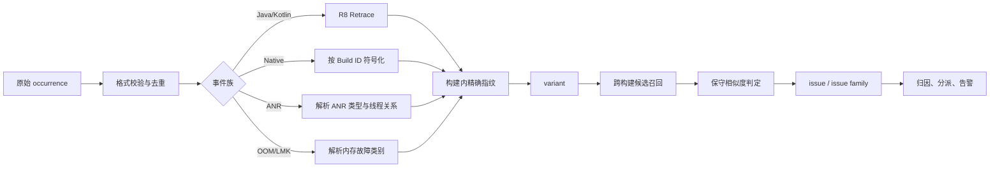

# 崩溃聚合与归因分析

20.6 节把 Crash 事件、受影响安装实例、会话和启动尝试分成了不同指标。服务端随后要把海量 occurrence 归入可解释的问题簇，判断它集中在哪些人群，并把证据交给合适的团队。

平台锚点是 Android 17（API 37，`android-17.0.0_r1`）。聚合算法本身不属于 Android API，但输入数据受 `Throwable`、R8、debuggerd tombstone、`ApplicationExitInfo` 和构建产物约束。忽略这些约束，哈希做得再复杂也只会稳定地产生错误分组。

## 先把四个对象分清

| 对象 | 含义 | 是否可变 |
|---|---|---|
| occurrence / event | 一次原始 Crash、ANR 或其他故障报告 | 原始内容不可改，只能补充解析结果 |
| variant | 同一失败点下非常相似的一组调用路径 | 可随聚类算法拆分或合并 |
| issue | 团队准备按一个根因跟踪和修复的问题 | 可人工合并、拆分、关闭或重开 |
| issue family | 跨构建、跨版本的相似问题关系 | 是分析关系，不应覆盖 occurrence 的原归属 |

一个 `event_id` 负责消除上传重试；`variant_id` 和 `issue_id` 负责归类。不能用“同一安装实例五分钟内只计一次”删除 occurrence，那会隐藏重复崩溃和 crash loop。

[Firebase Crashlytics 的公开说明](https://firebase.google.com/docs/crashlytics/troubleshooting)也采用 issue 与 variant 两层：issue 中的事件有共同失败点，variant 再表示相似堆栈。公开文档只能证明这种产品语义，不能据此推断其未公开算法。

## 聚合流水线

下面的流程把符号化、确定性指纹和相似度聚类分开：



符号化失败的事件仍要保留，但进入 `unsymbolicated` 队列。不要先用不可读的混淆名或绝对地址建立长期 issue，再在符号到齐后静默改变含义。

### 先按事件族隔离

Java Crash、Native Crash、ANR 和 OOM/LMK 的证据结构不同，不能只因为“顶部堆栈相似”就放进同一簇。

| 事件族 | 主证据 |
|---|---|
| Java/Kotlin fatal | exception/cause 链、崩溃线程帧、suppressed 摘要、构建 mapping |
| Native fatal | signal、`si_code`、abort message、crash thread、模块 Build ID、相对 PC、内存错误报告 |
| ANR | ANR 类型、组件、主线程阻塞点、锁持有者或 Binder 对端、时间窗口 |
| Java heap OOME | ART OOME 文案类别、分配点、堆/GC 摘要、进程阶段 |
| LMKD kill | `ApplicationExitInfo` reason、importance、内存压力与进程状态，不存在 Java 异常堆栈 |

同一功能缺陷可能同时造成 ANR 与后续 Crash，可以在 issue family 或事故层关联，但原始事件族和各自指标必须保留。

## 符号化是聚合前置条件

### Java / Kotlin：mapping 必须绑定构建

R8 混淆后的 `a.b.c` 只在对应构建中有意义。官方 [R8 retrace](https://developer.android.com/tools/retrace)使用该构建的 `mapping.txt` 恢复类、方法和行号；mapping 每次构建可能被覆盖，发布系统要按不可变 artifact ID 保存。

artifact ID 至少包含：

- application ID、version code、build ID；
- product flavor、build type、动态功能模块版本；
- mapping 文件的内容哈希；
- 源码 commit 和依赖锁文件版本。

[Crashlytics 的 Android 指南](https://firebase.google.com/docs/crashlytics/android/get-deobfuscated-reports)也要求上传与混淆变体对应的 mapping。mapping 缺失时，不要尝试删掉短混淆名中的数字后猜原方法，这会把无关代码合并。

Kotlin inline、协程状态机和 R8 优化可能让一个混淆帧对应多个源位置。聚合器要保存 retrace 的歧义候选，不应只取第一个结果后丢弃其他可能性。

### Native：Build ID 决定符号版本

绝对 PC 会受到 ASLR 影响；不同构建的函数布局也会变化。Native 符号化至少使用 ABI、模块路径、ELF Build ID 与模块相对 PC。官方 [`ndk-stack` 文档](https://developer.android.com/ndk/guides/ndk-stack)要求提供对应 ABI 的未裁剪库，[Native debug symbols 指南](https://developer.android.com/build/include-native-symbols)说明了 `SYMBOL_TABLE` 和 `FULL` 的差别。

发布流水线要验证：

- 每个随包交付的 `.so` 都有 Build ID；
- stripped 与 unstripped 文件的 Build ID 完全相同；
- 符号包按 app build、ABI、模块 Build ID 可检索；
- 动态模块和第三方 Native SDK 也有独立记录；
- 上传成功有回读或抽样符号化验证，不能只看构建任务退出码。

Android 12/API 31 起，应用可能从 `ApplicationExitInfo.getTraceInputStream()` 得到 Native tombstone protobuf。Android 17 的 [`tombstone.proto`](https://android.googlesource.com/platform/system/core/+/android-17.0.0_r1/debuggerd/proto/tombstone.proto)包含 `signal_info`、`abort_message`、`causes`、线程、帧、memory mappings 与 Build ID。聚合器应解析结构化字段，避免从人类可读文本中用脆弱正则猜字段。

## 两层指纹：构建内精确，跨构建保守

### 为什么不能把行号和偏移全部删除

同一个方法里可以有多个独立 throw site；同一个 Native 函数里也可能有多个越界点。删除 Java 行号和 Native 相对偏移，可能把不同根因压进一个 issue。

反过来，跨版本仍然保留精确行号，会因为插入一行日志就把同一问题拆开。解决办法是同时生成两类签名：

- **exact fingerprint**：用于同一 artifact 内的 variant，保留 retrace 后的源位置或 Native 相对位置；
- **family fingerprint**：用于跨 artifact 召回候选，保留稳定的异常类型、函数序列和失败语义，弱化行号与偏移。

下面的伪代码展示签名的输入边界：

```text
if event.family == JAVA_FATAL:
    exact = hash(
        schema_version,
        artifact_id,
        exception_chain,
        ordered_crash_thread_frames_with_source_line,
        stable_message_code
    )
    family = hash(
        schema_version,
        outer_and_root_exception_types,
        ordered_stable_frames_without_source_line,
        stable_message_code
    )

if event.family == NATIVE_FATAL:
    exact = hash(
        schema_version,
        module_build_id,
        signal,
        si_code,
        ordered_frames_with_relative_pc,
        normalized_abort_code
    )
    family = hash(
        schema_version,
        signal,
        si_code,
        ordered_module_and_function_frames,
        normalized_abort_code
    )
```

`schema_version` 不能省。规范化规则变化时，用新版本重算派生签名，并保留旧/new issue 映射和审计记录；不要在数据库里原地覆盖旧指纹。

### Java 指纹该保留什么

Android 17 的 [`Throwable.java`](https://android.googlesource.com/platform/libcore/+/android-17.0.0_r1/ojluni/src/main/java/java/lang/Throwable.java)同时保存 message、cause、stack trace 和 suppressed exceptions。聚合只取 root cause 会丢掉外层 API 语义，只取最外层又可能把相同底层失败拆散。

更稳的 Java 特征包括：

- 外层异常类型、root cause 类型和 cause 链类型序列；
- 每一层第一个可归因帧，而非只看整条链的顶部；
- 崩溃线程中有顺序的业务与关键库帧；
- suppressed 异常的类型摘要，用于并发失败和资源关闭场景；
- 经过 allowlist 规范化的稳定错误码。

异常 message 默认不应整段进入指纹。文件路径、URL、账号、时间戳、对象地址和服务端文案都会制造高基数，还可能携带隐私数据。若 SDK 或业务拥有稳定 error code，优先用 code；需要 message 模板时，按异常类型维护显式 parser，并监控模板命中率。

“系统帧一律删除”也过于粗糙。`Looper.loop()`、`ActivityThread.main()` 等公共尾帧几乎没有区分度，可以降权；`SQLiteConnection`、`WebView`、Binder proxy 或特定库帧可能正是失败语义的一部分，应保留在辅助特征中。

### Native 指纹该保留什么

Native exact fingerprint 常用字段包括：

- signal 与 `si_code`；
- crash thread 的模块、Build ID、函数和相对 PC；
- `abort_message` 中经过规则提取的稳定 sanitizer/allocator 错误码；
- MTE、GWP-ASan、HWASan 等 memory error 类型；
- fault address 的类别，例如 near-null、tag mismatch 或不可访问映射。

原始 fault address 不适合作为哈希键：ASLR、堆布局和隐私都会使它变化。near-null 也不能只看地址后直接定性为空指针，仍要结合 signal、mapping 与指令。

所有线程可以帮助诊断死锁或并发关系，却不宜直接拼入 exact fingerprint；无关线程调度会造成同一 Crash 每次得到不同 ID。通常只把 crash thread 放进强签名，把其他线程作为相似度和人工分析证据。

### ANR、OOM 与低信息事件单独设计签名

ANR fingerprint 可以由 ANR 类型、组件、主线程阻塞帧、锁 owner/Binder peer 和版本化场景组成。Input、Broadcast、Service、Provider 等类型不能混在一个“main thread 卡住”大簇里。

Java OOME 至少按 ART message 类别、分配点、进程阶段和堆摘要分桶。`Failed to allocate`、`pthread_create`、FD 耗尽、Bitmap/native-backed 分配和 LMKD kill 属于不同问题，详见 20.5。

没有堆栈的事件进入带原因的 fallback bucket，例如 `java_oome:no_stack:startup`。fallback bucket 用于显示数据缺失和影响量，不应自动认定其中所有 occurrence 有同一根因。

## 相似度聚类：只负责候选，不替代证据

固定指纹会因为调用路径漂移产生重复 issue，相似度层用于寻找“可能属于同一问题”的候选。推荐流程是：

1. 用事件族、异常/信号类型、关键模块、artifact 范围建立强分桶；
2. 只在桶内召回少量候选 issue；
3. 比较有顺序的帧序列、cause 结构、稳定 message code 和场景；
4. 达到高置信规则才自动合并，中间区域进入人工确认；
5. 保存支持与反对合并的证据。

帧集合的 Jaccard 相似度会丢失顺序；单纯编辑距离又容易被公共长尾支配。可使用带位置衰减的 weighted LCS、按帧类型加权的编辑距离，或把应用/关键库/公共框架帧分别计分。

阈值不能从文章复制。团队需要一批已经人工标注为“同根因/不同根因”的事件对，在自己代码和混淆配置上选择阈值。过度合并通常比重复拆簇更危险：它会把两个修复状态、责任团队和回归趋势混在一起。

### 防止传递式误合并

A 与 B 相似、B 与 C 相似，不代表 A 与 C 相似。若直接用单链聚类，公共中间样本会把两个问题连成大簇。自动合并应同时满足：

- 与簇代表样本相似；
- 与簇内关键约束一致，例如相同 root type 或 Native signal；
- 簇内最大距离不超过上限；
- 新样本不会显著增加簇内多样性。

每个 issue 保留多个代表 variant，避免只用最早一条样本代表持续演化的问题。人工 split 后要写入不能再次自动合并的约束。

### 聚类质量要可观测

| 指标 | 含义 |
|---|---|
| pairwise precision | 判为同簇的事件对中，人工确认同根因的比例 |
| pairwise recall | 人工确认同根因的事件对中，被算法放在同簇的比例 |
| over-merge rate | 一个 issue 含多个根因的比例 |
| duplicate-issue rate | 一个根因被拆成多个 issue 的比例 |
| unsymbolicated rate | 无法进入可靠指纹的事件比例 |
| manual split/merge rate | 人工纠正算法的频率 |

只报一个“聚类准确率”没有解释力。数据集规模、版本跨度、事件族分布、标注规则和置信区间都要一并记录。

## 崩溃归因：比较发生率，不比较裸计数

聚合回答“哪些事件相似”，归因回答“问题在哪些暴露条件下更常发生”。任何归因表都需要分子和分母。

| 维度 | 分子示例 | 分母示例 | 常见混杂因素 |
|---|---|---|---|
| App 构建/Play track | 该构建受影响安装实例日 | 该构建活跃安装实例日 | 灰度比例、发布时间、用户人群 |
| Android API | 该 API 受影响实例日 | 该 API 活跃实例日 | 设备档位、厂商、版本采用率 |
| 机型/SoC/GPU | 该设备分层受影响实例日 | 该设备分层活跃实例日 | 地区、内存、驱动版本 |
| ABI/Native Build ID | 该 ABI/Build ID 事件或受影响实例 | 对应 ABI/Build ID 暴露量 | 动态模块安装率 |
| 页面/功能开关 | 场景内受影响会话 | 进入该场景的有效会话 | 场景使用频次、实验分流 |
| WebView/SDK 版本 | 该组件版本受影响实例 | 该组件版本活跃实例 | 系统更新与机型分布 |

“某机型有 50 次 Crash”无法说明机型问题。如果该机型贡献了大部分活跃量，事件多很正常。应比较同时间窗内的 rate ratio 或 rate difference，并展示分母、置信区间和最小样本规则。

### 首次观测不等于引入版本

某 issue 第一次出现在 3.3.0，只能称为 first observed build。下面这些情况都会让旧问题看似新出现：

- 旧版本没有采集或 mapping/符号缺失；
- 聚类算法刚升级；
- 新版本提高了某功能的曝光；
- 旧版本样本量太小；
- 服务端 message 或远程配置改变；
- 同一根因在新构建中换了失败表现。

判断 introduced build 需要结合版本暴露、旧构建上界、代码差异、功能开关和复现证据。`git bisect` 只适用于有稳定自动复现、明确 good/bad 边界且每个中间构建可运行的情况。没有复现条件时，commit range、代码所有权与发布变更只能提供候选。

### 场景和 breadcrumb 要受控

页面、路由、网络类型、前后台状态、实验组和最近操作能缩小范围，但采集要使用 allowlist 和枚举值。禁止把完整 URL、搜索词、聊天内容、Intent extras 或账号直接写入 breadcrumb。

[Crashlytics 自定义报告文档](https://firebase.google.com/docs/crashlytics/android/customize-crash-reports)公开了其 key 数量、单 key 大小和日志总量限制，也警告不要在 exception message 中加入唯一值。自建 SDK 同样需要字段数量、单值长度、环形缓冲、采样、脱敏和删除周期。

归因结果使用“相关”“集中”或“候选条件”描述，不能仅凭线上相关性认定厂商 ROM、某次 commit 或某个团队制造了故障。

## 自动分派：派给团队，不自动归罪个人

### 从符号化帧映射源码

只有 retrace 或 Native symbolization 成功后，类名、源文件和函数才能可靠映射仓库。分派候选可以来自：

- 模块注册表：artifact/module → owning team；
- 源码路径 → [CODEOWNERS](https://docs.github.com/en/repositories/managing-your-repositorys-settings-and-features/customizing-your-repository/about-code-owners)；
- 构建依赖：第三方 SDK → 内部接入团队或供应商接口人；
- feature flag / 页面 → 产品模块负责人；
- 历史 issue：相同 family 的已确认责任团队。

顶部第一个应用帧也不一定是根因。回调适配层、反射入口、序列化框架和公共基础库经常出现在顶部。路由器应从 cause 链、失败点、关键 frame 和模块依赖生成候选团队，并给出证据。

`git blame` 只能说明某一行最近由谁修改，不能说明谁引入了故障，也不适合自动创建个人责任工单。它可以附在 triage 页面，工单默认派给团队队列；证据冲突或多团队命中时进入稳定性 triage。

### 工单状态与幂等

推荐的状态集合是：

- `new`：新 issue，尚未确认；
- `triaged`：事件族、影响面和候选 owner 已确认；
- `in_progress`：修复或缓解进行中；
- `fixed_pending_exposure`：修复构建已发布，暴露量不足；
- `verified`：在约定暴露量和窗口下通过；
- `regressed`：满足回归规则后重开；
- `ignored_with_reason`：有到期时间和明确理由。

工单创建使用 `issue_id + environment` 作为幂等键。同一个 issue 的新 variant、影响扩大和版本变化更新原工单，不要每次告警都新建一张。

“某天没有事件”不能自动标记 verified。若修复版本有 `n` 个独立暴露单位且观察到 0 次，在简化的独立同分布假设下，95% 上界约为 `3/n`；线上会话并不完全独立，所以还要结合历史率、用户聚类、采集完整率和时间窗口解释。

## 趋势分析与告警

### 每个 issue 同时看影响面和频率

| 指标 | 用途 |
|---|---|
| 受影响安装实例日 / 活跃安装实例日 | 衡量日活影响面 |
| 受影响会话 / 有效会话 | 衡量使用过程风险 |
| occurrence 数 | 发现重复 Crash 和采集压力 |
| repeated-affected rate | 发现同一实例反复命中 |
| crash-loop rate | 发现启动循环 |
| first seen / last seen / build exposure | 判断版本关系 |
| variant entropy 或 variant 数 | 发现 issue 内部是否正在变杂 |
| symbolication completeness | 判断趋势变化是否来自符号缺失 |

新增 issue、影响扩大、回归和 SLO burn 都可以触发告警，但规则必须带最小分母和持续时间。固定“环比两倍”在低基数下很容易误报，固定绝对人数又会漏掉小规模灰度中的严重问题。

可组合四类信号：

1. 修复版本相对同人群基线显著回归；
2. 新 issue 命中启动、登录、支付等高风险路径；
3. 某 issue 的 error-budget burn rate 在短、长窗口同时升高；
4. 单机型、API、ABI 或功能开关分层出现有分母支持的集中异常。

报告补传和处理延迟会让旧事件在短时间涌入。告警使用 event time 计算趋势，用 ingestion time 监控处理延迟；二者混用会把补传误判成线上突增。

### 静默不等于停止评估

issue 告警后可以对同级通知设置静默期，但系统仍要更新影响量。出现以下变化时应突破静默：

- 严重级别上升；
- 新版本或新轨道开始受影响；
- 进入 crash loop；
- 原 owner 拒绝或证据指向另一模块；
- 修复后满足回归条件。

MTTD、MTTA、缓解时间和验证时间都值得统计。目标值来自值班覆盖、发布能力和业务损失，不存在适用于所有团队的五分钟或二十四小时标准。

## AI 辅助归类：输出候选和证据

AI 适合处理确定性聚合之后的高成本环节：

- 为新 issue 生成可读摘要；
- 从历史 issue 中检索相似修复；
- 给出候选 owner 和相关代码位置；
- 解释两个 variant 可能同根因的依据与反证；
- 从长 tombstone、ANR trace 中提取调查清单。

AI 不应直接改变 occurrence 归属、关闭 issue、认定某位开发者负责，或在没有源码和构建证据时宣布 root cause。

### 输入是不可信数据

exception message、breadcrumb、服务端响应和日志都可能包含用户内容或攻击者控制的文本。把它们送进模型前要：

- 脱敏并截断；
- 区分代码、系统字段和自由文本；
- 把日志中的指令视为数据，防止 prompt injection；
- 按仓库与团队权限限制源码、工单和用户数据；
- 记录模型版本、prompt 版本和检索证据 ID；
- 对输出执行 schema 校验。

模型输出可以强制为下面的证据结构：

```json
{
  "candidate_issue_ids": ["ISSUE-123"],
  "candidate_owner_teams": ["payments-runtime"],
  "supporting_frames": ["PaymentStore.commit"],
  "counter_evidence": ["different root exception type"],
  "missing_evidence": ["mapping for build 42017"],
  "confidence": 0.72
}
```

`confidence` 只是该模型和标注集上的排序信号，不能当成客观概率。分派器还要检查 mapping、Build ID、事件族和权限，缺少关键证据时保持待确认。

### 用标注集评估，不写想象中的提升

AI/ML 上线前建立按时间切分的标注集，至少覆盖：

- 常见与长尾 Java 异常；
- Native signal、sanitizer 与无符号事件；
- 不同 ANR 类型；
- 同根因跨版本变体；
- 很相似但根因不同的 hard negatives；
- 多团队、第三方 SDK 和未知 owner。

评估分别报告候选合并 precision/recall、owner top-k、摘要事实错误率、证据引用正确率和人工节省时间。测试集不能和检索库泄漏同一 issue 的近重复样本。

代码、R8、NDK、SDK 和模型升级后都可能产生漂移。监控人工驳回率、split/merge 率和各事件族质量；质量下降时回退到确定性指纹与人工 triage。

## 上线前检查

1. occurrence 是否不可变，重传去重是否只依赖 `event_id`；
2. Java mapping 与 Native symbols 是否按不可变构建/Build ID 保存并验证；
3. exact fingerprint 与跨构建 family fingerprint 是否分开；
4. Java 行号和 Native 相对 PC 是否只在适当层级弱化，而非一律删除；
5. cause、suppressed、signal、`si_code`、ANR 类型和 OOM 类别是否分别建模；
6. `fingerprint_schema_version` 是否入库，重聚类是否可审计和回滚；
7. 相似度合并是否有强约束、人工区间和防传递误合并；
8. 归因表是否展示分母、置信区间、暴露时间和采集完整率；
9. first observed 是否被错误写成 introduced；
10. CODEOWNERS、模块表和 `git blame` 是否只生成团队候选与证据；
11. 告警是否区分 event time、ingestion time、灰度和补传；
12. AI 输入是否脱敏、防注入、按权限检索，输出是否带反证和缺失证据。

崩溃聚合的价值不在于把 issue 数量压得尽可能少。好的系统会保留每次 occurrence，谨慎合并有共同根因的事件，并让任何归因、分派和修复结论都能回到构建产物、堆栈与暴露数据复查。

## 参考资料

- [Android 17 `Throwable.java`](https://android.googlesource.com/platform/libcore/+/android-17.0.0_r1/ojluni/src/main/java/java/lang/Throwable.java)
- [Android 17 debuggerd `tombstone.proto`](https://android.googlesource.com/platform/system/core/+/android-17.0.0_r1/debuggerd/proto/tombstone.proto)
- [R8 retrace](https://developer.android.com/tools/retrace)
- [Android NDK `ndk-stack`](https://developer.android.com/ndk/guides/ndk-stack)
- [在 Release 构建中包含 Native symbols](https://developer.android.com/build/include-native-symbols)
- [Firebase Crashlytics：issue grouping 与 variants](https://firebase.google.com/docs/crashlytics/troubleshooting)
- [Firebase Crashlytics：自定义 Crash 报告](https://firebase.google.com/docs/crashlytics/android/customize-crash-reports)
- [GitHub CODEOWNERS](https://docs.github.com/en/repositories/managing-your-repositorys-settings-and-features/customizing-your-repository/about-code-owners)
