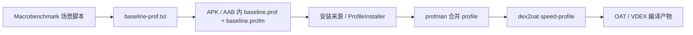

# Baseline Profile 实战

<!-- outline-start -->
## 本节要点大纲

### 锚点（必须覆盖）

- 🔹 Baseline Profile 原理与 AOT 编译加速
- 🔹 Profile 生成方法：Macrobenchmark + BaselineProfileRule
- 🔹 Cloud Profile 与 Play 分发
- 🔹 效果度量与 A/B 验证

### 扩展（可选深入）

- 🔸 Startup Profile 与 Dex Layout 优化

### OpenClaw 加工指引

> **锚点**是最低覆盖要求，加工时必须逐条落实并标注验证结果。
> **扩展**视素材丰富程度选择性深入。
> 如果从 Obsidian 素材或 AOSP 源码中发现大纲未列出但与本节强相关的知识点，
> 可**就地插入**最相关的锚点之后，并用 `[自动发现]` 标注，方便后续 review。
> 锚点内容需 L1/L2 验证，扩展内容至少 L2 验证，自动发现内容至少标注来源。
<!-- outline-end -->

## 为什么要做 Baseline Profile

21.1 节已经把启动耗时拆成进程初始化、`Application` 初始化、`Activity` 创建和首帧绘制几段。Baseline Profile 处理的是其中一类成本：启动路径上的类和方法还没被 ART 提前编译，首装、首更、清数据后的前几次启动会经历解释执行、JIT 预热和后台编译等待。

它不能替代延迟初始化，也不能消掉主线程 I/O、锁等待、网络请求和 SDK 同步初始化。它的价值是把已经确认的启动路径和高频路径随包交给 ART，让安装后更早进入 `speed-profile` 编译状态。详见 8.7 节和 19.15 节，本节只写 App 团队怎样生成、接入、验证和维护。

[已验证: 官方文档, developer.android.com/topic/performance/baselineprofiles/overview]
[已验证: AOSP, art/profman/profman.cc + art/dex2oat/dex2oat.cc]
[结构参考: Clippings/Android 性能优化 - 原理：重新认识应用的速度优化.md]

## Baseline Profile 原理与 AOT 编译加速

Baseline Profile 是一份随 APK / AAB 分发的热点类和方法清单。构建阶段，AGP 把可读的 `baseline-prof.txt` 转成 ART 能消费的二进制 `baseline.prof` 和 `baseline.profm`；安装后，系统或 `ProfileInstaller` 把 profile 交给 ART；后续由 `profman` 合并 profile，再由 `dex2oat` 以 `speed-profile` 这类策略编译命中的方法。



这条路径里最容易误判的是“文件存在”和“已完成编译”。包内有 `baseline.prof` 只能说明构建产物带上了规则；`ProfileVerifier` 返回 `RESULT_CODE_PROFILE_ENQUEUED_FOR_COMPILATION` 只能说明 profile 已经入队；`RESULT_CODE_COMPILED_WITH_PROFILE` 才能说明当前包已经按 profile 完成编译。

从启动优化角度看，Baseline Profile 只影响代码执行和类加载相关成本。若 Perfetto 显示耗时集中在 `SharedPreferences` 同步读、数据库升级、主线程锁等待或网络阻塞，profile 带来的收益会被这些成本盖住。处理顺序应该是：先用 21.1 的启动分析确认瓶颈，再判断 profile 是否是合适工具。

| 观测现象 | Baseline Profile 是否优先 | 判断方式 |
|---|---|---|
| 首装首开慢，后续打开逐渐变快 | 优先检查 | 对比清数据后的前几次启动，检查编译状态 |
| Release 包比 Debug 包首开慢，但主线程没有明显 I/O | 可以检查 | 用 Macrobenchmark 对比 `CompilationMode.Partial()` 和无 profile |
| 页面初始化里有大量反射、Compose / Jetpack 初始化、复杂路由加载 | 可以检查 | 生成场景覆盖该路径后测 TTID / TTFD |
| trace 中主要是磁盘读写、锁等待、网络阻塞 | 不优先 | 先改同步任务，再回头看 profile |

[已验证: 官方文档, developer.android.com/topic/performance/baselineprofiles/debug-baseline-profiles]

## Profile 生成方法：Macrobenchmark + BaselineProfileRule

生成脚本应该模拟真实用户路径，而不是只把启动 Activity 跑起来。冷启动到首页首屏是最低覆盖，首页滚动、主导航切换、搜索、详情页、支付等高频 CUJ 要按业务优先级加入。路径太少会漏掉热点，路径太多会增加编译范围和维护成本。

下面这段示例只保留生成脚本的骨架，重点看 `collect` 里驱动的用户路径。

```kotlin
@RunWith(AndroidJUnit4::class)
class BaselineProfileGenerator {
    @get:Rule
    val rule = BaselineProfileRule()

    @Test
    fun generate() = rule.collect(
        packageName = "com.example.app"
    ) {
        pressHome()
        startActivityAndWait()

        device.wait(Until.hasObject(By.res("home_list")), 5_000)
        device.findObject(By.res("home_list")).fling(Direction.DOWN)

        device.findObject(By.text("Search")).click()
        device.wait(Until.hasObject(By.res("search_box")), 3_000)

        device.findObject(By.text("Profile")).click()
        device.waitForIdle()
    }
}
```

这类脚本的质量取决于路径选择。启动页如果有登录态、灰度开关、远程配置、广告页或隐私弹窗，CI 里要固定前置状态，否则每次生成出来的 profile 会覆盖不同路径，回归时很难判断差异来自代码还是环境。

实践中建议把 profile 场景分成三组：

- 启动必经路径：冷启动到首屏，包括 `Application`、入口 Activity、首页基础布局和首屏数据骨架。
- 高频交互路径：首页滚动、主 tab 切换、搜索入口、详情页打开，覆盖新用户第一天会反复触发的路径。
- 高风险路径：大 SDK 初始化、Compose 首次进入、动态特性模块、复杂路由或反射密集页面。

生成后的 `baseline-prof.txt` 应该进入版本库，并和启动相关改动一起 review。只让 CI 自动覆盖文件而无人看 diff，容易把一次异常路径写进发布包。

[已验证: 官方文档, developer.android.com/topic/performance/baselineprofiles/create-baselineprofile]

## 打包与接入检查清单

接入完成后，检查顺序按“源码文件 → 构建产物 → 设备编译状态 → 性能收益”走。跳过中间任何一步，都可能把问题定位错。

| 阶段 | 检查项 | 通过标准 |
|---|---|---|
| 源码 | `baseline-prof.txt` 已提交，内容来自 Release 近似环境 | diff 能解释本次启动路径变化 |
| 构建 | APK 内存在 `assets/dexopt/baseline.prof` 和 `.profm`；AAB 内存在 `BUNDLE-METADATA/com.android.tools.build.profiles/` | 文件存在且和当前 variant 对应 |
| 安装 | 安装来源符合验证目标：Play、Android Studio / Gradle、其他 installer 分开看 | 不用本地安装结果替代商店结果 |
| 编译 | `ProfileVerifier` 或 `dumpsys package dexopt` 能看到 profile 编译状态 | 编译状态能解释 Macrobenchmark 结果 |
| 收益 | TTID / TTFD / 首屏慢帧有稳定对比 | 多轮测试方向一致，方差可接受 |

下面的命令用于本地确认 release APK 是否带上 profile 文件。

```bash
unzip -l app-release.apk | grep 'assets/dexopt/baseline.prof'
unzip -l app-release.apk | grep 'assets/dexopt/baseline.profm'
```

如果命令没有输出，先检查 Gradle 插件配置和 variant。不要继续做启动耗时对比，因为当前包没有携带可供 ART 消费的 baseline profile。

设备侧再确认编译状态。下面的命令适合线下复现，不代表所有安装渠道都会立即触发同样行为。

```bash
adb shell dumpsys package dexopt | grep -A 8 com.example.app
adb shell cmd package compile -m speed-profile -f com.example.app
adb shell dumpsys package dexopt | grep -A 8 com.example.app
```

`cmd package compile -m speed-profile -f` 可以验证当前 profile 是否能被编译器消费。发布验证仍要按实际渠道测一遍，尤其是 Google Play、第三方商店和侧载包的差异。

[已验证: 官方文档, developer.android.com/topic/performance/baselineprofiles/debug-baseline-profiles]

## Cloud Profile 与 Play 分发

Android 7 以后，设备本地会收集运行时 profile，并在空闲、充电等时机做 profile-guided 编译。Android 9 以后，Google Play 还可以分发 Cloud Profile，用真实用户聚合数据补充新版本热点。Baseline Profile、Cloud Profile、本地 JIT Profile 的区别在生产者和可用时机。

| 类型 | 生产者 | 可用时机 | 适用边界 |
|---|---|---|---|
| Baseline Profile | App 团队 / 库作者 / CI | 打包时随 APK / AAB 分发 | Android 7+，不依赖用户历史数据 |
| Cloud Profile | Google Play 聚合 | 通过 Play 分发并积累数据后 | Android 9+，依赖 Google Play 路径 |
| 本地 JIT Profile | 用户设备运行时 | 用户用过应用之后 | 单设备持续收敛，不能改善新用户首开 |

发布早期不要指望 Cloud Profile 已经覆盖启动路径。灰度首批用户、新安装用户、刚升级用户，仍然依赖包内 Baseline Profile 获得 Day-0 收益。Cloud Profile 更像后续补充，能覆盖真实用户里开发脚本没跑到的热点。

Android 16 的云端编译能力在公开材料中被描述为 Google Play 分发侧的增强：部分编译工作迁到云端，并通过 Secure Dex Metadata 一类产物交付到设备。[待验证] 公开资料不足以稳定确认 SDM 文件格式、签名绑定和设备端是否完全跳过本地编译。本节只把它作为 Play 分发方向记录，不把它写成通用安装渠道能力。

[已验证: 官方文档, developer.android.com/topic/performance/baselineprofiles/overview]
[来源: intake/research-feeds/2026-04-07-11-android16-cloud-compilation-baseline-startup-profiles.md]

## 效果度量与 A/B 验证

Baseline Profile 的收益要用相同安装状态、相同设备池、相同测试路径来比较。单次冷启动数据没有判断价值，至少要看多轮 Macrobenchmark 和线上实验分组指标。

Macrobenchmark 的本地验证可以拆成两组：无 profile 编译与部分 profile 编译。下面的示例只展示比较思路，具体指标按项目启动定义选择 `StartupTimingMetric`、自定义 trace section 或帧指标。

```kotlin
@LargeTest
@RunWith(AndroidJUnit4::class)
class StartupBenchmark {
    @get:Rule
    val benchmarkRule = MacrobenchmarkRule()

    @Test
    fun startupWithoutProfile() = benchmarkRule.measureRepeated(
        packageName = "com.example.app",
        metrics = listOf(StartupTimingMetric()),
        compilationMode = CompilationMode.None(),
        startupMode = StartupMode.COLD,
        iterations = 10
    ) {
        pressHome()
        startActivityAndWait()
    }

    @Test
    fun startupWithBaselineProfile() = benchmarkRule.measureRepeated(
        packageName = "com.example.app",
        metrics = listOf(StartupTimingMetric()),
        compilationMode = CompilationMode.Partial(),
        startupMode = StartupMode.COLD,
        iterations = 10
    ) {
        pressHome()
        startActivityAndWait()
    }
}
```

`CompilationMode.None()` 给出没有 profile 帮助时的冷启动基线，`CompilationMode.Partial()` 更接近 Baseline Profile 参与后的状态。两组测试要在同一批设备、同一套数据状态下跑，避免把账号状态、网络、服务端数据和弹窗差异算进 profile 收益。

线上 A/B 要按用户状态分层：

- 新安装用户：最能体现 Baseline Profile 对首开和前几次打开的收益。
- 刚升级用户：适合观察新版本 profile 是否覆盖改动后的启动路径。
- 清数据用户：接近冷状态，但样本可能少，需要和实验平台确认样本量。
- 老用户全量：会被本地 JIT Profile、缓存、登录态和历史数据稀释，只能作为辅助观察。

指标建议同时看 TTID、TTFD、启动阶段慢帧、首屏可交互时间和崩溃 / ANR 副作用。Profile 生成脚本若引入大范围编译，可能增加安装后后台编译成本；线上验证要观察低端机和低电量场景是否有异常波动。

## Startup Profile 与 DEX Layout 优化

[自动发现] 参考书把 Dex 类文件重排序作为速度优化案例，重点是把启动相关类按访问局部性集中摆放，减少启动阶段的加载和缓存未命中。现代 Android 工程里，Startup Profile 和 AGP / R8 / D8 的 DEX layout 优化承担了类似方向：从手工收集类顺序，转为构建系统根据 profile 规则调整启动代码布局。

[结构参考: Clippings/Android 性能优化 - 缓存优化：冷热端分离+重排序，提升缓存命中率.md]
[来源: intake/research-feeds/2026-04-04-07-ch08-startup-profiles-dex-layout-optimization.md]

Baseline Profile 和 Startup Profile 的职责不同：

| 能力 | 作用对象 | 优化目标 | 验证方式 |
|---|---|---|---|
| Baseline Profile | ART 编译器 | 让热点方法更早 AOT 编译 | `ProfileVerifier`、`dumpsys package dexopt`、Macrobenchmark |
| Startup Profile | D8 / R8 构建流程 | 调整启动代码在 DEX 中的位置 | 检查构建配置、对比启动 trace 与 Macrobenchmark |

如果启动路径方法很多、DEX 数量多、低端机 page fault 明显，Startup Profile 的收益会更容易体现。它不能替代 Baseline Profile：一个改善编译状态，一个改善启动代码布局。两者同时维护时，生成脚本最好复用同一组用户路径，避免“编译覆盖了 A 路径，DEX 布局却按 B 路径优化”。

AGP 8.3 以后 DEX layout 优化默认开启的公开资料较多；AGP 8.1-8.2 项目需要单独确认配置。写发布检查表时，把 AGP 版本、R8 状态、profile 文件位置、最终 APK / AAB 检查结果一起记录。

[已验证: 官方文档, developer.android.com/topic/performance/baselineprofiles/overview]

## 回归排查清单

Baseline Profile 回归通常不是“profile 机制失效”，而是启动路径变了、生成脚本没更新、安装来源变了或编译状态没确认。排查时按下面顺序走：

1. 产物是否还带 `baseline.prof` / `baseline.profm`，并且属于本次 release variant。
2. 生成脚本是否还能走到首页、主 tab、搜索、详情页等关键路径。
3. 近期是否改了包名、模块拆分、动态特性、R8 配置、导航入口或登录态。
4. `ProfileVerifier` 是否返回已编译状态；若只是入队，等待或手工触发编译后再测。
5. Macrobenchmark 中 profile-enabled 和 profile-disabled 的差距是否缩小。
6. Perfetto 中启动耗时是否转移到 I/O、锁等待、网络或 SDK 初始化。
7. 线上 A/B 是否按新装、升级、老用户分层，避免全量平均掩盖收益。

如果第 6 步确认主要成本已经不在代码解释执行或类加载，回到 21.2、21.3、21.6 这几节处理启动任务本身。Baseline Profile 是启动优化流程里的编译侧工具，不能把业务初始化问题包装成 profile 问题。
