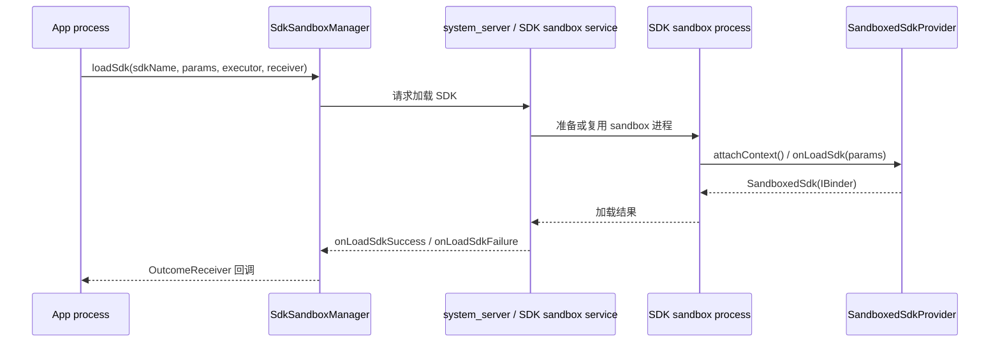

# 21.10 SDK Runtime 与广告 SDK 启动隔离性能

SDK Runtime 把符合条件的第三方广告 SDK 放到独立运行环境中，启动优化的关注点随之改变：宿主 App 不再只管少初始化几个类，还要管理一次 sandbox 进程启动、一次 `loadSdk()` 异步加载，以及后续 Binder 通信的成本。

内容聚焦启动路径里的接入策略和观测口径。App 启动全流程的系统侧细节详见 8.2 节，启动任务编排详见 21.1、21.2、21.6 节，线上指标设计详见 26.3 节。

[结构参考: Clippings/Android 性能优化 - 原理：重新认识应用的速度优化.md]
[结构参考: Clippings/Android 性能优化 - CPU 优化（下）：减少 CPU 闲置时刻和等待，提升利用率.md]
[结构参考: Clippings/Android 性能优化 - 虚拟内存优化（上）：线程+多进程优化.md]
[结构参考: Clippings/Android 性能优化 - 原理：掌握 App 运行时的内存模型.md]

## 要点

### 🔹 SDK Runtime 解决的工程问题

传统广告 SDK 接入方式把 SDK 代码放在宿主 App 进程内执行。启动阶段常见问题有三类：SDK 在 `Application.onCreate()` 里同步初始化；SDK 与宿主共享同一份进程内存、线程、`SharedPreferences` 和权限上下文；业务侧很难区分“首屏必须执行的初始化”和“广告请求前才需要的准备工作”。

SDK Runtime 的平台定位是把 runtime-enabled SDK 放入独立的 SDK sandbox 进程。官方架构文档把它描述为 Android 14 引入的平台能力，目标是让第三方广告 SDK 与宿主 App 通过进程边界和受控 API 交互。[已验证: 官方文档, privacysandbox.google.com/private-advertising/sdk-runtime/architecture]

从启动优化角度看，它带来的变化不是“广告 SDK 免费异步化”，而是把成本换了位置：宿主主进程少了一部分 SDK 代码加载、静态初始化和内存共享风险，同时多了 sandbox 进程创建、SDK 加载回调、跨进程调用和数据同步成本。优化目标从“禁止 SDK 抢主线程”变成“把 SDK Runtime 纳入启动 DAG”。

判断一项广告 SDK 初始化是否适合迁移到 SDK Runtime，要看它是否满足三个条件：

- 它不是首帧前的强依赖；首屏渲染不应该等待广告 SDK 完成 runtime 加载。
- 它可以通过明确的接口传参；跨进程边界会放大隐式全局状态和大对象传递的代价。
- 它的失败可以降级；sandbox 不可用、SDK 未安装、加载超时和低版本回退都不能阻断首页展示。

### 🔹 `SdkSandboxManager.loadSdk()` 的加载路径

App 侧通过系统服务拿到 `SdkSandboxManager`，再调用 `loadSdk(String sdkName, Bundle params, Executor executor, OutcomeReceiver<SandboxedSdk, LoadSdkException> receiver)`。AOSP API 源码显示，`SdkSandboxManager.loadSdk()` 会把宿主包名、可选的 app process token、SDK 名称、调用时间和参数传给系统侧 `ISdkSandboxManager`，成功后通过 `OutcomeReceiver` 返回 `SandboxedSdk`。[已验证: AOSP android-34, platform/prebuilts/fullsdk/sources/android-34/android/app/sdksandbox/SdkSandboxManager.java]

`SandboxedSdk` 里携带 SDK 暴露给 App 的 `IBinder` 接口。AOSP 源码对它的定位是 `loadSdk()` 成功后的返回对象，App 通过 `getInterface()` 拿到 SDK 的 Binder 入口。[已验证: AOSP android-34, platform/prebuilts/fullsdk/sources/android-34/android/app/sdksandbox/SandboxedSdk.java]

SDK 侧需要实现 `SandboxedSdkProvider`。源码注释明确要求 `onLoadSdk()` 只做让 SDK 能处理后续请求的准备工作，不应执行长时间 I/O 或网络调用，也不应依赖其他 SDK 已加载完成。[已验证: AOSP android-34, platform/prebuilts/fullsdk/sources/android-34/android/app/sdksandbox/SandboxedSdkProvider.java]

加载路径可以按下面的工程节点理解：

这条路径里至少有两段异步边界：App 到系统服务，系统服务到 sandbox 进程。它适合放在首屏后、广告位曝光前、用户触达前预热这类阶段，不适合放在首帧前的同步栅栏里。

### 🔹 启动耗时与首屏路径隔离

SDK Runtime 对冷启动的收益取决于原来的广告 SDK 初始化是否占用了主进程启动关键路径。如果原先的 SDK 在 `Application.onCreate()` 同步读配置、建线程池、初始化网络栈、加载 so、访问磁盘，迁移后主进程可少做一部分工作；如果迁移后仍在 `Activity.onCreate()` 等 `loadSdk()` 回调，再马上发起广告请求，首屏仍会被 SDK Runtime 拖慢。

更稳的做法是把广告 SDK 相关任务拆成三档：

- 首帧前必须完成：只保留不会跨进程、不触发网络、不等待 SDK Runtime 的最小开关读取，例如本地 AB 配置和“广告位是否启用”的布尔判断。
- 首帧后异步启动：调用 `loadSdk()`，记录开始时间、回调时间和失败码，不把回调绑定到 UI 首次绘制。
- 用户触达前预热：在用户可能进入广告场景前完成 SDK 接口握手、轻量参数同步和必要的缓存读取。

这套拆法来自速度优化里的任务调度思路：核心场景减少指令数，非关键任务放到 CPU 相对空闲或业务低峰阶段执行。参考书提供的是结构方法，落到 SDK Runtime 时要补上进程边界和回调失败处理。[结构参考: Clippings/Android 性能优化 - CPU 优化（下）：减少 CPU 闲置时刻和等待，提升利用率.md]

线上指标不能只看 App 进程的 cold start。至少要把三段时间拆开：

| 指标 | 采集位置 | 用途 |
|------|----------|------|
| `sdk_runtime_load_start` | App 调用 `loadSdk()` 前 | 判断 SDK Runtime 是否进入首屏关键路径 |
| `sdk_runtime_load_callback` | `OutcomeReceiver` 成功或失败 | 统计加载耗时、超时率和失败码分布 |
| `first_ad_request_after_load` | 首次广告请求前 | 判断加载完成到广告请求之间是否还有隐性同步工作 |
| `first_frame_time` / `time_to_full_display` | 启动指标体系 | 观察 SDK Runtime 调度是否影响 TTID / TTFD |

如果 `loadSdk()` 大量出现在首帧前，先改任务编排；如果 `loadSdk()` 在首帧后但广告页打开仍慢，再拆 SDK 接口调用和广告请求耗时。两类问题的责任边界不同。

### 🔹 进程、Binder 与 SharedPreferences 同步成本

SDK Runtime 的隔离也有成本。独立 sandbox 进程会引入额外 PSS，SDK 与 App 的方法调用要经过 Binder，参数通过 `Bundle` 或 SDK 自己定义的 AIDL / Binder 接口传递，频繁小调用会把调度成本摊到每一次业务请求上。

AOSP API 文档显示，SDK sandbox 是运行在独立 UID 范围内的 Java 进程，每个 App 可以拥有自己的 SDK sandbox 进程。[已验证: 官方文档, developer.android.com/design-for-safety/privacy-sandbox/reference/sdksandbox/SdkSandboxManager]

`SdkSandboxManager` 还提供 `addSyncedSharedPreferencesKeys(Set<String> keys)`、`removeSyncedSharedPreferencesKeys(Set<String> keys)` 和 `getSyncedSharedPreferencesKeys()`。源码注释说明，App 默认 `SharedPreferences` 中被登记的 key 会同步到 SDK sandbox；App 重启后需要重新调用 API 建立同步 key 集合；该类不支持跨多个进程使用。[已验证: AOSP android-34, platform/prebuilts/fullsdk/sources/android-34/android/app/sdksandbox/SdkSandboxManager.java]

工程上要把同步 key 当成一份显式契约：

- 只同步 SDK 必需的稳定小字段，例如地区、年龄段标签、广告开关、实验分组，不同步整块业务配置。
- 参数传递避免大 `Bundle` 和频繁往返，把一次广告请求需要的上下文收敛成固定结构。
- Binder 接口按粗粒度设计，例如“准备广告位”“请求广告”“上报曝光”，不要把每个 getter 都做成跨进程调用。
- sandbox 进程内存单独计入广告 SDK 成本，不能只看主进程 PSS 下降。

Perfetto 里可观察的信号包括 App 主线程的 `binder transaction`、SDK sandbox 进程线程状态、App 与 sandbox 的 CPU 时间分布，以及启动阶段是否出现磁盘 I/O。线上侧可记录 SDK Runtime 加载耗时、加载失败码、sandbox 进程死亡回调次数、跨进程调用频率和广告首请求耗时。

### 🔹 向低版本兼容的 Jetpack sdkruntime 路径

AndroidX `privacysandbox-sdkruntime` 提供 `sdkruntime-client`、`sdkruntime-core`、`sdkruntime-provider` 等组件，官方 release notes 将其定位为在旧 Android 平台上构建和加载 runtime-enabled SDK 的 Jetpack 库。[已验证: 官方文档, developer.android.com/jetpack/androidx/releases/privacysandbox-sdkruntime]

兼容层的价值是把接入代码和 SDK provider 模型尽量统一，但它不等同于平台级 SDK Runtime。Android 14+ 的平台能力有系统服务、独立 UID 范围和 SDK sandbox 进程；低版本兼容层能降低调用侧差异，却不能把旧系统改造成同样的隔离模型。[待验证: AndroidX 兼容层在不同 API 级别的具体进程模型需要结合当前版本源码复核]

接入时建议把能力判断写成四种状态，不要只写 `if (SDK_INT >= 34)`：

- 平台 SDK Runtime 可用：走系统 `SdkSandboxManager`，记录平台加载指标。
- Jetpack 兼容路径可用：走 AndroidX compat API，指标名称保留 compat 标记。
- 运行时 SDK 不可用：走已有非 runtime-enabled SDK，但不得回到首帧前同步初始化。
- SDK 加载失败：触发功能降级，广告位显示占位、延迟加载或关闭，不阻塞页面可交互。

这层抽象可以放在广告 SDK 网关里，业务页面只依赖“广告能力是否 ready”和“请求广告”两个接口。低版本和失败路径的差异留在网关内部处理。

### 🔹 广告 SDK 接入的回退策略

SDK Runtime 接入的高风险点在失败策略。官方 API 暴露了 `LoadSdkException` 和多类错误码，例如 SDK 不存在、SDK 已加载、SDK sandbox 被禁用、SDK sandbox 进程不可用等。App 必须把这些错误转成业务可接受的降级结果。[已验证: 官方文档, developer.android.com/design-for-safety/privacy-sandbox/reference/sdksandbox/SdkSandboxManager]

回退策略可以按场景定级：

| 场景 | 处理策略 | 启动约束 |
|------|----------|----------|
| sandbox 被禁用或不可用 | 标记本次会话 SDK Runtime 不可用，走兼容路径或关闭广告位 | 不重试阻塞首屏 |
| SDK 未找到 | 上报配置错误，关闭对应广告源 | 不在用户路径内下载或修复 |
| SDK 已加载 | 复用已有 `SandboxedSdk` 接口 | 避免重复加载 |
| `onLoadSdk()` 超时或失败 | 记录失败码，延迟重试或切换广告源 | 重试放到首帧后 |
| sandbox 进程死亡 | 清理 Binder 引用，等待下一次业务触发重建 | 不在主线程同步恢复 |

代码层面要避免两个反模式。其一，`loadSdk()` 失败后立刻在主线程回退到旧 SDK 同步初始化；这会把 SDK Runtime 的失败路径变成更重的启动阻塞。其二，把广告请求、配置拉取、归因注册都塞进 `onLoadSdk()`；AOSP 源码已经把 `onLoadSdk()` 定位成启动处理请求前的准备工作，长时间 I/O 应放到 SDK 自己的异步流程里。

## 扩展

### 🔸 与启动框架任务编排的关系

把 SDK Runtime 当成启动 DAG 的一个异步节点更合适。节点输入是平台能力、广告开关、最小请求参数；节点输出是 `SandboxedSdk` Binder 接口或失败结果。业务页面不直接等待该节点，广告容器根据 ready 状态决定展示占位、延迟请求或关闭广告位。

一个可执行的拆法：

1. `Application.onCreate()` 只注册广告网关，不加载 SDK。
2. 首页首帧后触发 `loadSdk()`，设置超时和失败上报。
3. 广告位进入可见区域前检查 SDK ready 状态。
4. ready 时发起广告请求；未 ready 时显示占位或跳过本次曝光。
5. sandbox 死亡或加载失败后进入会话级降级，不在同一页面内反复重试。

这套策略会牺牲部分“首个广告位立即可用”的概率，换来首页稳定的 TTID / TTFD。广告收入与启动体验之间的取舍需要用实验分组确认，不能只按技术偏好决定。

### 🔸 与隐私沙盒 Attribution Reporting / Topics 的边界

SDK Runtime 是 SDK 执行环境隔离能力，不等同于 Attribution Reporting、Topics 或 Protected Audience API。后几类 API 解决广告归因、兴趣主题和受保护竞价等业务问题；SDK Runtime 解决的是第三方 SDK 运行位置、权限边界和数据访问方式。

工程接入时建议把它们拆成两层：

- 运行层：SDK Runtime / AndroidX compat，负责加载 SDK、跨进程接口、生命周期和失败降级。
- 广告能力层：Topics、Attribution Reporting、Protected Audience 或广告 SDK 自有能力，负责请求、归因、转化和实验策略。

这样做的好处是启动指标能归因到“运行层加载慢”还是“广告能力层请求慢”。两者混在一起时，Perfetto 和线上日志都很难解释首个广告位为什么晚出现。

### 🔸 Trace 与线上指标设计

Trace 侧建议同时抓 App 进程、SDK sandbox 进程和系统服务相关线程。排查时按四个问题走：

- `loadSdk()` 是否发生在首帧前：如果是，先调整启动 DAG。
- App 主线程是否在等待 Binder 回调：如果是，检查 UI 代码有没有同步等待 SDK ready。
- sandbox 进程是否在加载期做 I/O 或网络：如果是，推动 SDK provider 拆分轻量加载与异步准备。
- SharedPreferences 同步 key 是否过多：如果是，收敛同步字段或改成明确接口传参。

线上指标按“加载、调用、降级、资源”四组采集：

| 组别 | 指标 | 说明 |
|------|------|------|
| 加载 | 加载耗时 P50/P90/P99、失败码、超时率 | 评估 SDK Runtime 节点自身质量 |
| 调用 | Binder 调用次数、首个广告请求耗时、广告 ready 延迟 | 评估跨进程接口设计 |
| 降级 | sandbox 不可用率、兼容路径比例、会话级关闭比例 | 评估回退策略是否稳定 |
| 资源 | App 主进程 PSS、sandbox 进程 PSS、线程数、CPU 时间 | 评估隔离后总资源是否变重 |

指标口径要把平台 SDK Runtime 和 AndroidX compat 分开。否则一个版本低端机的兼容层问题，可能会被误判成 Android 14+ 平台隔离机制的问题。
