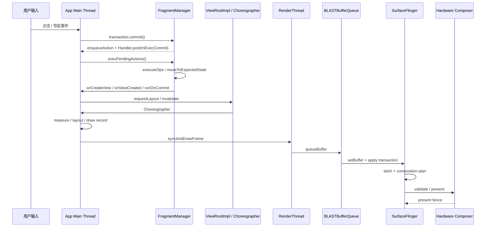

# Fragment、Predictive Back 与 Navigation Compose 页面切换

Fragment 页面切换不能只测 `commit()`。它成功返回只说明事务已加入 `FragmentManager` 的待执行队列；View 创建、生命周期推进和动画准备发生在随后处理队列的 `execPendingActions()` 中。排查时要把 Fragment 事务、inflate（解析 XML 并实例化 View）、一轮 View 树遍历（traversal，包含 measure、layout、draw）和帧结果放到同一条性能轨迹（trace）上：Android 12+ 可以用 FrameTimeline（帧时间线），Android 10/11 则结合 `Choreographer`、RenderThread（渲染线程）切片和自定义 trace。

现代应用的 Fragment 性能排查应以 AndroidX Fragment 为准。平台 `android.app.Fragment` 已废弃，不再作为新代码优化对象。

本文把源码版本分成两组：Fragment 事务实现固定到 AndroidX `androidx-fragment-release` 的提交 `f39ca3510efb2347ebfef231e25a3e804922450d`；`Choreographer`、`ViewRootImpl`、HWUI、BLASTBufferQueue 与 SurfaceFlinger 固定到 Android 17 / API 37 的 `android-17.0.0_r1`。AndroidX 独立发布，不能用 Android 平台标签反推某台设备采用的 Fragment 版本。

页面切换从 Fragment 或 Navigation 提交开始，经过生命周期、视图创建、动画和首帧。Predictive Back 增加可取消的进度阶段，要求导航状态和系统返回动画在提交前保持一致。

## Fragment 提交、生命周期与首帧

### `commit()` 只排队，事务执行在后一个主线程消息里

AndroidX 的 `BackStackRecord` 是 `FragmentTransaction` 的具体实现。`commit()`、`commitAllowingStateLoss()` 和 `commitNow()` 的分叉点很早：前两者走 `commitInternal(..., true)`，把当前事务交给 `FragmentManager.enqueueAction()`；`commitNow()` 跳过待执行队列，直接走 `execSingleAction()`。以下代码保留三个常用分支；第四个提交方法 `commitNowAllowingStateLoss()` 同样调用 `execSingleAction()`，但把 `allowStateLoss` 设为 `true`。

这段摘录保留上述三个常用分支：

```java
@Override
public int commit() {
    return commitInternal(false, true);
}

@Override
public int commitAllowingStateLoss() {
    return commitInternal(true, true);
}

@Override
public void commitNow() {
    disallowAddToBackStack();
    mManager.execSingleAction(this, false);
}
```

`commitInternal()` 会检查重复提交、分配返回栈编号（back stack index），然后在 `commitAction == true` 时进入 `FragmentManager.enqueueAction()`：

```java
int commitInternal(boolean allowStateLoss, boolean commitAction) {
    if (mCommitted) {
        throw new IllegalStateException("commit already called");
    }
    mCommitted = true;
    if (mAddToBackStack) {
        mIndex = mManager.allocBackStackIndex();
    } else {
        mIndex = -1;
    }
    if (commitAction) {
        mManager.enqueueAction(this, allowStateLoss);
    }
    return mIndex;
}
```

`enqueueAction()` 决定了异步语义。事务被加入 `mPendingActions`，也就是待执行操作（pending action）列表后，`scheduleCommit()` 通过宿主 `Handler` 投递 `mExecCommit`：

```java
void enqueueAction(@NonNull OpGenerator action, boolean allowStateLoss) {
    if (!allowStateLoss) {
        if (mHost == null) {
            throw new IllegalStateException("FragmentManager has not been attached to a host.");
        }
        checkStateLoss();
    }
    synchronized (mPendingActions) {
        if (mHost == null) {
            if (allowStateLoss) {
                return;
            }
            throw new IllegalStateException("Activity has been destroyed");
        }
        mPendingActions.add(action);
        scheduleCommit();
    }
}

void scheduleCommit() {
    synchronized (mPendingActions) {
        boolean pendingReady = mPendingActions.size() == 1;
        if (pendingReady) {
            mHost.getHandler().removeCallbacks(mExecCommit);
            mHost.getHandler().post(mExecCommit);
            updateOnBackPressedCallbackEnabled();
        }
    }
}
```

从性能排查看，有两个结论：

- `commit()` 返回快，不代表页面切换便宜。View 创建、生命周期推进、动画准备和 `SpecialEffectsController` 的动画/过渡处理，都在后面的主线程消息里发生。
- 多次连续 `commit()` 可能被同一个 `execPendingActions()` 批处理。排查 Perfetto 时，除了点击回调里的 `commit()`，还要检查随后主线程消息中的生命周期和 View 创建耗时。

### 提交与强制执行 API 的边界

状态丢失（state loss）是指 Activity 已保存 Fragment 状态后又修改界面，进程重建时这次修改可能无法恢复；它不是业务数据丢失的同义词。`AllowingStateLoss` 只表示调用方接受这项恢复风险，也不保证宿主销毁后事务仍会执行。

| API | 执行方式 | 返回栈 | 状态保存后的行为 | 性能风险 |
|---|---|---|---|---|
| `commit()` | 异步排队，后续主线程消息执行 | 支持 | `isStateSaved()` 后提交会抛异常 | 调用点轻，但后续可能集中执行多笔事务 |
| `commitAllowingStateLoss()` | 异步排队 | 支持 | 可在状态保存后提交；宿主不可用时可能丢弃事务 | UI 状态可能与恢复结果不一致，不能用它规避性能问题 |
| `commitNow()` | 当前主线程同步执行当前事务 | 不支持；源码会 `disallowAddToBackStack()` | 状态保存后提交会抛异常 | 生命周期与 View 创建都进入当前调用栈 |
| `commitNowAllowingStateLoss()` | 当前主线程同步执行当前事务 | 不支持 | 可忽略状态保存检查；宿主未连接或已销毁时直接丢弃 | 同步成本与 `commitNow()` 相同，另有无法恢复或不执行的风险 |
| `executePendingTransactions()` | 调用 `execPendingActions(true)`，随后 `forcePostponedTransactions()` | 执行队列中原有事务，不改变各事务的返回栈属性 | 不检查 `isStateSaved()`；宿主未连接或已销毁时仍会抛异常 | 会把其他模块的待执行事务一起处理，时序影响范围比 `commitNow()` 大 |

`executePendingTransactions()` 是 `FragmentManager` 的队列执行方法，不是另一种事务提交方法。官方文档建议：如果只想同步提交一个不修改返回栈的事务，优先用 `commitNow()`，不要组合 `commit()` 与 `executePendingTransactions()`；后者会尝试执行当前所有待执行事务。

工程上可以按这条规则选：需要进入返回栈的页面切换使用 `commit()`；必须同步取得 Fragment View 的小型局部初始化，可以考虑 `commitNow()`；通用导航路径不要调用 `executePendingTransactions()` 来追求同步完成。只有界面恢复时允许缺少这次修改，才考虑两个 `AllowingStateLoss` 变体。

`executePendingTransactions()` 还有两个边界。第一，它传入 `allowStateLoss = true` 执行 `execPendingActions(true)`，处理当前 FragmentManager 的全部待执行事务；这不会让此前已被 `commit()` 拒绝的事务重新出现。第二，它会在待执行操作处理后调用 `forcePostponedTransactions()`，强制启动原本延后的入场过渡。页面切换期间如果 Navigation Component 或其他使用同一 FragmentManager 的模块已经排队，这些工作也会进入当前主线程执行窗口。

### `execPendingActions()`：同一主线程消息中的批处理循环

`mExecCommit` 被 `Handler.post()` 后，主线程会调用 `execPendingActions(true)`。执行前，`ensureExecReady()` 做三类保护：

- `mExecutingActions` 不能为 `true`，避免在事务处理过程中再次同步执行事务。
- 当前线程必须是宿主 `Handler` 所在线程，否则抛出 “Must be called from main thread of fragment host”。
- 未允许状态丢失时执行 `checkStateLoss()`，避免宿主保存状态后继续修改 Fragment 状态。

以下摘录保留三项检查；完整实现还会区分宿主未连接与已销毁，并初始化临时列表：

```java
private void ensureExecReady(boolean allowStateLoss) {
    if (mExecutingActions) {
        throw new IllegalStateException("FragmentManager is already executing transactions");
    }
    if (mHost == null) {
        throw new IllegalStateException("FragmentManager has not been attached to a host.");
    }
    if (Looper.myLooper() != mHost.getHandler().getLooper()) {
        throw new IllegalStateException("Must be called from main thread of fragment host");
    }
    if (!allowStateLoss) {
        checkStateLoss();
    }
}
```

准备完成后，`execPendingActions()` 进入循环：从 `mPendingActions` 取出所有 `OpGenerator`，生成 `BackStackRecord` 列表，再调用 `removeRedundantOperationsAndExecute()`。以下摘录是普通提交路径，省略了预测式返回被新操作中断时对 `mTransitioningOp` 的取消与重新提交：

```java
boolean execPendingActions(boolean allowStateLoss) {
    ensureExecReady(allowStateLoss);

    boolean didSomething = false;
    while (generateOpsForPendingActions(mTmpRecords, mTmpIsPop)) {
        mExecutingActions = true;
        try {
            removeRedundantOperationsAndExecute(mTmpRecords, mTmpIsPop);
        } finally {
            cleanupExec();
        }
        didSomething = true;
    }

    updateOnBackPressedCallbackEnabled();
    doPendingDeferredStart();
    mFragmentStore.burpActive();
    return didSomething;
}
```

`generateOpsForPendingActions()` 会在同步块内遍历当前 FragmentManager 的 `mPendingActions`，再清空列表并移除已投递的 `mExecCommit`。一次点击即使只调用一次 `commit()`，性能轨迹中仍可能出现多个 Fragment 的生命周期推进：同一事务可以操作多个 Fragment，同一 FragmentManager 也可能已有其他事务或 Navigation 操作排队。子 FragmentManager 使用自己的队列，判断它是否参与了同一主线程消息要继续看调用栈。

性能排查不能停在“FragmentManager 慢”这个结论，还要列出同一个主线程消息包含的具体工作：`onCreate()`、`onCreateView()`、ViewBinding 创建 View、RecyclerView 适配器初始化、首批图片同步解码、`onViewCreated()` 中的同步 I/O，以及子 Fragment 随父生命周期发生的状态推进或同步事务。

### Fragment 事务与一帧渲染的时序

Fragment 事务不属于 `Choreographer#doFrame` 的固定阶段。它是主线程消息队列中的普通工作；事务处理后，新增或变更的 View 才会在后续 traversal 中参与 measure、layout 和 draw。和 [§18.1 Android View 标准管线](../../part2-performance/ch18-rendering-pipelines/01-android-view-pipeline-analysis.md) 合起来看，典型时序是：



图中的 `BBQ` 是 App 窗口使用的 BLASTBufferQueue，`SF` 是负责系统图层合成的 SurfaceFlinger，`HWC` 是 Hardware Composer（硬件合成器）。Android 17 的标准 HWUI 窗口中，RenderThread 的 `queueBuffer()` 把 buffer（图像缓冲）和 producer completion fence（生产端完成栅栏，用来同步绘制完成状态）交给 BLAST；App 进程内的 BLAST Consumer 再把缓冲更新写入 `SurfaceControl.Transaction`。`queueBuffer()` 返回、transaction 到达 SF、SF latch（锁存本次要合成的缓冲）、HWC present（送显）是四个不同边界，前一个边界不能单独证明画面已经显示。

页面切换卡顿经常“不在 `doFrame` 里”，原因就在这里：Fragment 的生命周期和 View 创建可能发生在 `mExecCommit` 对应的主线程消息中。如果这段消息执行 30 ms，下一次 `Choreographer#doFrame` 的开始时间已经被推迟。Perfetto 的 FrameTimeline 可能标出对应帧错过 deadline（帧截止时间），但耗时来源仍在 `doFrame` 前面的 Fragment 消息。

FrameTimeline 要分开读 App `SurfaceFrame` 和 SF `DisplayFrame`。Expected Timeline 表示调度器给出的预计时间预算，Actual Timeline 记录该帧经历的时间。App Actual `SurfaceFrame` 的结束时刻取 buffer post（应用把帧交给 SurfaceFlinger）与 GPU 完成时刻中的较晚者；SF `DisplayFrame` 才覆盖后续合成和上屏。App Actual 超期可以说明应用未按 deadline 交帧，仍要结合 SF Actual、目标 layer 的 latch 和 present fence 判断最终显示时间。

这个观察点只适用于 Android 12 / API 31+。Android 10/11 设备没有 `android.surfaceflinger.frametimeline` 数据源，排查时要退回 `Choreographer#doFrame`、`performTraversals`、RenderThread 切片和业务 trace。

排查时应同时看三段：

- `mExecCommit` 所在主线程消息：看是否有 Fragment 生命周期、View 创建、同步读取配置、数据库或磁盘访问。没有自定义 trace 时，可以打开 Java/Kotlin 调用栈采样，或在关键生命周期加 `Trace.beginSection()`。
- 后续 `Choreographer#doFrame`：看 traversal 内的 measure、layout、draw 是否因为新页面 View 树过重而超时，详见 [§18.1 Android View 标准管线](../../part2-performance/ch18-rendering-pipelines/01-android-view-pipeline-analysis.md)。
- RenderThread / FrameTimeline（Android 12+）：看提交后的 `syncFrameState`、`dequeueBuffer`、GPU 工作或 SurfaceFlinger 合成是否继续增加总延迟；Android 10/11 先看 RenderThread 切片和自定义 trace，详见 [§13.2 Perfetto View 解读](../../part3-tools/ch13-perfetto/02-perfetto-ui-state-tracks.md)。

### `runOnCommit()` 的边界：事务执行完成，不等于帧已绘制

`runOnCommit()` 常被用来“等 Fragment 提交完成后再做事”。它的边界比名字更窄：它只保证事务已经执行，不保证这一帧已经完成绘制，也不保证 Fragment 已经完成异步数据加载。

AndroidX 文档说明，如果事务启用了 reordering（事务重排），`runOnCommit()` 可能在后续事务也执行之后才运行，当前事务中的某些操作也可能因批处理优化被移除。它不能与 `addToBackStack()` 共用，因为 Runnable（待执行的任务对象）无法写入返回栈的持久化状态。

性能上要避免两类用法：

- 在 `runOnCommit()` 里继续做耗时工作。这里仍在主线程事务处理尾部，继续创建 View、同步查询或计算大批列表差异，会进一步推迟下一帧。
- 在 `runOnCommit()` 里继续提交事务。同步调用 `commitNow()` 或 `executePendingTransactions()` 会被 `mExecutingActions` 保护拦住；异步 `commit()` 可以重新进入待执行队列，还可能被当前 `execPendingActions()` 的下一轮循环继续取走，延长同一个主线程消息。如果原事务通过 `commitAllowingStateLoss()` 提交，回调里的普通 `commit()` 仍会检查 `isStateSaved()`；`runOnCommit()` 不会继承允许状态丢失的语义。

把 `runOnCommit()` 限定为轻量状态同步，或用于启动不阻塞主线程的异步任务。需要延后入场过渡（postponed transition）时，目标 Fragment 应在过渡开始前调用 `postponeEnterTransition()`；依赖的数据、图片或布局准备好以后，再从合适的生命周期回调调用 `startPostponedEnterTransition()`，不要等到 `runOnCommit()` 才暂停过渡。

`viewLifecycleOwner.lifecycleScope` 只负责把协程生命周期绑定到 Fragment View，默认启动位置仍是主线程。CPU 密集计算和阻塞 I/O 要放到数据层，或明确使用 `Dispatchers.Default` / `Dispatchers.IO`；回到主线程时只提交小批量 UI 状态。需要随可见性启停的数据收集，再配合 `repeatOnLifecycle()`。

### `setReorderingAllowed(true)` 的性能边界

官方 Fragment transaction 文档建议每个事务使用 `setReorderingAllowed(true)`。这个 API 的默认值仍是 `false`，需要显式开启。它不会让单个生命周期回调直接变快；它允许 `FragmentManager` 在一批事务中消除冗余操作，并调整 Fragment 状态变化顺序，让动画和场景过渡（transition）保持一致。

AndroidX 源码中的注释给了典型例子：事务 A 添加 Fragment A，随后事务 B 用 Fragment B 替换它。允许事务重排时，A 的 `add()` / `remove()` 可以被优化掉，A 可能不会经历完整的 `onCreate()` / `onDestroy()`；多个 `pop` 操作也可能合并执行。省略具体实现后，决策意图可以概括为以下两行注释：

```java
private void removeRedundantOperationsAndExecute(
        ArrayList<BackStackRecord> records,
        ArrayList<Boolean> isRecordPop) {
    // Proximate records that allow reordering are executed together.
    // Redundant operations can be removed before execution.
}
```

这个能力对快速连续导航、`replace` 后又 `pop`、同一 Fragment 容器内多次替换尤其有用。代价是生命周期顺序可能与逐条执行事务时不同。AndroidX `FragmentTransaction.java` 注释说明，新增 Fragment 的 `onCreate()` 可能早于被替换 Fragment 的 `onDestroy()`；`postponeEnterTransition()` 也要求 `setReorderingAllowed(true)`。

工程判断：

- 常规页面导航应显式调用 `setReorderingAllowed(true)`，尤其是带动画、transition 或返回栈的事务。
- 不要在 Fragment 生命周期回调里依赖“旧页面一定先 destroy，新页面才 create”这种顺序假设；共享资源应由明确的生命周期拥有者负责释放。
- 如果事务重排暴露了顺序问题，优先修复生命周期所有权。直接关掉重排还可能影响动画、transition 和冗余事务优化。

### 页面切换的 Perfetto 排查清单

页面切换问题可以按“主线程消息 → traversal → RenderThread → SurfaceFlinger”排查。先确认 CPU 时间花在哪个线程、哪个消息、哪个等待点，再决定是否调整任务范围或优先级。

| 观察点 | Perfetto 中看什么 | 常见根因 | 处理动作 |
|---|---|---|---|
| 点击后的主线程消息 | Java/Kotlin 调用栈、业务自定义 trace、`androidx.fragment` 调用栈 | `execPendingActions()` 批量执行、`onCreateView()` 创建 View 较慢、`onViewCreated()` 同步 I/O | 给生命周期关键点加 trace；同步 I/O 移出首帧；子 Fragment 延后创建 |
| 首次 traversal | `Choreographer#doFrame`、`performTraversals`、measure / layout / draw | 新页面 View 树过深、ConstraintLayout 约束复杂、RecyclerView 首屏绑定耗时 | 减少布局层级；首屏只绑定可见的最少数据；复杂 View 延迟到首帧后 |
| RenderThread | `syncFrameState`、`dequeueBuffer`、GPU 工作 | Bitmap 纹理上传、RenderNode 状态同步耗时，buffer 等待，GPU 绘制压力 | 压缩首屏图片；减少首帧动画和阴影；Android 12+ 参考 [§18.1 Android View 标准管线](../../part2-performance/ch18-rendering-pipelines/01-android-view-pipeline-analysis.md) 的 BLAST / FrameTimeline 分析，Android 10/11 结合 RenderThread 与业务 trace |
| SurfaceFlinger / FrameTimeline（Android 12+） | Actual 晚于 Expected、卡顿分类、SF 合成耗时 | App 提交晚、GPU fence 晚、合成压力高 | 回到 App 主线程和 RenderThread 定位；Android 10/11 先看 `doFrame`、RenderThread 与业务 trace；合成侧再看 HWC 与 layer（图层）数量 |
| Binder / I/O | Binder transaction（跨进程调用）、磁盘读写、SQLite | 页面创建期间同步拉配置、读缓存、跨进程查询 | 预取、缓存、异步化；把首帧必须字段和可延后字段分开 |

`Trace.beginSection()` 建议放在这些位置：导航点击回调、`commit()` 前后、目标 Fragment 的 `onAttach()` / `onCreate()` / `onCreateView()` / `onViewCreated()`、适配器首次提交数据、首屏数据绑定、首帧后任务入口。section 名不要包含取值种类极多的字段，例如用户 ID、订单 ID、URL；这类高基数字段会让同一操作产生大量不同名称，线上难以聚合，Perfetto 中也难按名称过滤。

### 工程治理：把页面切换拆成三段预算

页面切换不要只设一个“打开耗时”。更可控的拆法是三段预算：

1. **事务执行预算**：从点击到 `execPendingActions()` 完成。目标是让 Fragment 生命周期推进和最小 View 树创建尽快结束。
2. **首帧预算**：从 `requestLayout()` / `invalidate()` 到首个可见帧。Android 12+ 用 App `SurfaceFrame` 与 SF `DisplayFrame` 对齐；Android 10/11 用首个 traversal、RenderThread 和自定义 trace 标记近似分段。目标是先显示首屏，复杂内容可以暂用占位 UI。
3. **首帧后预算**：从第一帧之后到页面可完整交互。目标是补数据、启动动画、预加载二级内容，但不能继续阻塞输入。

对应到实现策略：

- **页面分段创建**：首屏必须出现的 View 留在 Fragment 根布局；非首屏模块可以用按需展开布局的 `ViewStub`、延后创建的子 Fragment，或等数据就绪后再在主线程创建。复杂列表页只创建首屏必要的列表项，后续内容交给 RecyclerView 预取。
- **异步创建的边界**：`AsyncLayoutInflater` 会在后台线程尝试 inflate。如果 View 构造依赖主线程 Looper / Handler，或父容器不能在线程安全地生成布局参数，失败后仍可能回到 UI 线程重试。1.1.0 已支持显式 `AsyncLayoutFactory`，AppCompat 可使用 `AsyncAppCompatFactory`，因此旧版“不支持 Factory”的结论不再适用于所有用法；要用 trace 确认目标 View 的构造工作是否在线程池执行。详见 [AsyncLayoutInflater 版本说明](https://developer.android.com/jetpack/androidx/releases/asynclayoutinflater)。
- **事务批处理**：同一 Fragment 容器的连续 `replace()` 尽量合入一次事务，并开启 `setReorderingAllowed(true)`。`add()` / `hide()` / `show()` 可以减少重复创建 View，却会保留更多 Fragment、View 和相关资源；只有测得重建成本高且内存、生命周期都可控时才采用。
- **`commitNow()` 边界**：只用于不进返回栈、必须同步完成的小型局部事务。为了立刻取得 Fragment View 而普遍使用 `commitNow()`，通常说明组件初始化接口还需分段；通用导航、返回栈操作和深层子 Fragment 批量创建都不适合这条路径。
- **首帧前后任务切分**：首帧前只在主线程构建最小可见 UI。首屏依赖的网络和数据库读取可以尽早在后台启动，避免等首帧后才增加内容等待；非首屏结果绑定、图片解码提交和批量埋点写入再延后，并遵守 Fragment View 的取消边界。
- **结果通信**：Fragment Result API 适合轻量结果传递；不要为了传结果把页面保活在内存里。共享 ViewModel 只放同一导航图或同一 Activity 范围内的状态，避免无意延长对象生命周期。

线程和 CPU 优先级排在常规页面切换优化后面。《Android 性能优化》的任务调度章节会讨论主线程、RenderThread 优先级和大核绑定，但这些方案依赖设备、权限和厂商策略，风险比布局拆分、任务延后和事务合并更高。

### 如何使用固定版本的 AndroidX 源码

AndroidX 源码版本固定到 `androidx-fragment-release` 分支的提交 `f39ca3510efb2347ebfef231e25a3e804922450d`。这个提交可通过 `android.googlesource.com/platform/frameworks/support` 读取 `FragmentManager.java`、`BackStackRecord.java` 和 `FragmentTransaction.java`，避免 `androidx-main` 分支持续更新后改变本文依据。

固定 commit 不代表 Fragment 1.4 到 1.9 的每条路径都相同。`commitInternal()`、`enqueueAction()`、`scheduleCommit()`、`execPendingActions()` 可以作为主流程；预测式返回（predictive back）相关的 `mTransitioningOp` 取消和重新提交属于较新版本行为，不能反推到 Fragment 1.4 / 1.6。排查线上问题时，要同时记录应用依赖的 `androidx.fragment:fragment` 版本和设备 Android 版本。

### AndroidX Fragment 版本差异

| 版本线 | 与页面切换相关的变化 | 排查含义 |
|---|---|---|
| Fragment 1.4 | 引入 `FragmentStrictMode`；加入 `saveBackStack()` / `restoreBackStack()` / `clearBackStack()` 支持多返回栈；`FragmentManager` 改用 `SavedStateRegistry` 保存状态 | 可用 StrictMode 检查过时 API；保存的多返回栈事务必须开启重排并保持自包含，排查切换成本时要覆盖保存与恢复 |
| Fragment 1.6 | `OnBackStackChangedListener` 增加 `onBackStackChangeStarted()`、`onBackStackChangeCommitted()` 等回调，部分回调时机有调整 | 做导航监控时要标明 Fragment 版本，否则返回栈回调时序可能不一致 |
| Fragment 1.7 | 支持基于 AndroidX Transition 的预测式返回 | 返回手势可能进入可取消的 transition 流程；源码里会出现 `mTransitioningOp` 这类过渡事务路径 |
| Fragment 1.8 | `fragment-compose` 增加 `AndroidFragment` Composable；`onBackStackChangeCancelled()` 的回调时机修复 | Fragment 与 Compose 混用有官方组件入口，但仍要关注生命周期和状态保存成本 |
| Fragment 1.9.0-rc01 | 1.9 线为 `AndroidFragment` 增加 `maxLifecycle` 参数，并支持通过 Jetpack Tracing 把 Fragment 生命周期事件写入 system trace（系统性能轨迹） | RC 仍不是稳定版；生产诊断基线继续按项目锁定的版本判断，不能因 trace 中出现生命周期时间片就假定事务已完成或帧已显示 |

截至 2026-08-15，Fragment 稳定版是 1.8.9，1.9.0-rc01 是候选版；官方已把 Fragment 标为 maintenance mode（维护模式），只接收关键修复，并建议新 UI 优先使用 Jetpack Compose。已有 Fragment 工程仍需维护事务、生命周期和返回栈的性能证据；这项维护策略不要求立即重写运行稳定的页面。

现代 AndroidX Fragment 的状态推进主要落在 `FragmentStateManager.moveToExpectedState()` 这一类路径上，旧资料里常见的 `moveToState(Fragment, ...)` 叙述只能作为历史背景。阅读源码或对照 trace 时，应以项目实际依赖的 Fragment 版本为准。

平台 `android.app.Fragment` 与 AndroidX Fragment 的源码路径、生命周期实现和缺陷修复节奏都不同。新代码不要再围绕平台 Fragment 做优化；历史代码迁移时，应把行为差异作为兼容性问题处理，不能只替换 `import`。

### 基于 Fragment 的 Navigation 额外成本

这里的 Navigation 2 指传统的 `NavController` 与导航图 API，本节只讨论由 `FragmentNavigator` 承载 Fragment 目标页面的情况。它仍通过 Fragment 事务切换页面，并处理目标匹配、参数 `Bundle`、返回栈、动画、deep link（深层链接）和 `NavController` 状态保存。多数场景下，这层封装的 CPU 成本较小，主要耗时仍来自目标 Fragment 的 View 创建和首帧渲染。

排查 Navigation 页面切换时，把问题拆成三类：

- **导航图和参数**：目标页面解析、argument（页面参数）反序列化、deep link 匹配是否增加了点击后主线程消息的耗时。
- **事务和动画**：`FragmentNavigator` 创建事务后是否带动画、shared element transition（共享元素过渡）和事务重排；动画本身是否触发大量 `invalidate()`。
- **目标页面初始化**：`onCreateView()` / `onViewCreated()` 中是否同步创建复杂 View、提交列表，或注册多个数据观察者后立即收到已有数据。

Fragment 目标页面无法靠“绕过 FragmentTransaction”优化。应减少目标页首帧工作、合并导航期间的重复事务，并为 shared element transition 明确指定参与 View，避免整棵 View 树都进入过渡计算。

### Compose 与 Fragment 混用边界

`ComposeView` 放在 Fragment 里时，销毁策略要与 Fragment View 生命周期绑定。Composition 是 Compose 保存 UI 结构与状态关联的运行时实例。`ViewCompositionStrategy.Default` 当前对应 `DisposeOnDetachedFromWindowOrReleasedFromPool`：普通容器中的 `ComposeView` 离开窗口时会释放 Composition；位于 RecyclerView 这类 pooling container（会复用子 View 的池化容器）中时，会在容器离开窗口或该列表项被池丢弃时释放。Fragment View 更适合使用 `DisposeOnViewTreeLifecycleDestroyed`，让 Composition 随 `ViewTreeLifecycleOwner` 销毁。

页面切换性能上，Compose 与 Fragment 混用有三类风险：

- `ComposeView.setContent {}` 先保存内容；初次 Composition 在 View 接入窗口或显式调用 `createComposition()` 时发生，以较早者为准。因此，复杂初次组合可能出现在 Fragment 事务尾部或后续帧，不能只测 `onCreateView()`。Compose 优化细节见 [22.3 Compose 性能、Compiler 与 Modifier.Node 诊断](03-compose-compiler-modifier-diagnostics.md)，时序定义见 [`ComposeView` API](https://developer.android.com/reference/kotlin/androidx/compose/ui/platform/ComposeView)。
- RecyclerView item 中嵌入 `ComposeView` 时，Composition 复用和池化容器语义要与 RecyclerView、Compose UI 版本一起验证；手动 `disposeComposition()` 可能破坏复用，不释放则可能延长状态生命周期。
- Fragment 嵌套 Compose，再嵌 `AndroidView` 或 Fragment，会增加生命周期边界。排查时要列出 Activity、Fragment、Fragment View、Compose Composition 与 RecyclerView 回收池分别何时创建和销毁，以及由哪个生命周期拥有者负责清理。

纯 Compose 的新导航图可以评估稳定版 Navigation 3；截至 2026-08-15，稳定版为 1.1.5。仍含 View 或 Fragment 目标页面的迁移工程可以继续使用基于 Fragment 的 Navigation，等页面逐步替换为 Compose 后再规划导航迁移。迁移期可以混用，但不要把 Fragment 当作每个 Compose 子页面的默认容器。Fragment 适合承接既有生命周期、返回栈、权限和多模块边界，无需给每个 Composable 再套一层事务。版本记录见 [Navigation 3 release notes](https://developer.android.com/jetpack/androidx/releases/navigation3)。

### 源码与文档入口

- [`BackStackRecord.java`](https://android.googlesource.com/platform/frameworks/support/+/f39ca3510efb2347ebfef231e25a3e804922450d/fragment/fragment/src/main/java/androidx/fragment/app/BackStackRecord.java)、[`FragmentManager.java`](https://android.googlesource.com/platform/frameworks/support/+/f39ca3510efb2347ebfef231e25a3e804922450d/fragment/fragment/src/main/java/androidx/fragment/app/FragmentManager.java) 与 [`FragmentTransaction.java`](https://android.googlesource.com/platform/frameworks/support/+/f39ca3510efb2347ebfef231e25a3e804922450d/fragment/fragment/src/main/java/androidx/fragment/app/FragmentTransaction.java)：核对固定 AndroidX commit 下的提交、队列、批处理、reordering 与 `runOnCommit()` 语义。
- [Fragment transactions](https://developer.android.com/guide/fragments/transactions) 与 [Fragment release notes](https://developer.android.com/jetpack/androidx/releases/fragment)：核对公开 API 用法、稳定版、预览版和 maintenance mode。
- [Compose in Views](https://developer.android.com/develop/ui/compose/migrate/interoperability-apis/compose-in-views)、[`ComposeView` API](https://developer.android.com/reference/kotlin/androidx/compose/ui/platform/ComposeView)、[Navigation 3](https://developer.android.com/guide/navigation/navigation-3) 与 [Navigation 3 release notes](https://developer.android.com/jetpack/androidx/releases/navigation3)：核对 Fragment View 中 Composition 的创建/销毁时机及纯 Compose 导航边界。
- [`Choreographer.java`](https://android.googlesource.com/platform/frameworks/base/+/android-17.0.0_r1/core/java/android/view/Choreographer.java)、[`ViewRootImpl.java`](https://android.googlesource.com/platform/frameworks/base/+/android-17.0.0_r1/core/java/android/view/ViewRootImpl.java) 与 [`ThreadedRenderer.java`](https://android.googlesource.com/platform/frameworks/base/+/android-17.0.0_r1/core/java/android/view/ThreadedRenderer.java)：核对 Android 17 主线程帧调度、traversal 与 HWUI 入口。
- [`BLASTBufferQueue.cpp`](https://android.googlesource.com/platform/frameworks/native/+/android-17.0.0_r1/libs/gui/BLASTBufferQueue.cpp) 与 [`FrameTimeline.cpp`](https://android.googlesource.com/platform/frameworks/native/+/android-17.0.0_r1/services/surfaceflinger/Scheduler/FrameTimeline.cpp)：核对 App Window buffer transaction、SurfaceFrame 和 DisplayFrame 的实现边界；字段解释再对照 [Perfetto FrameTimeline](https://perfetto.dev/docs/data-sources/frametimeline)。

### Fragment 切换小结

Fragment 页面切换有三个主要判断点：`commit()` 只负责排队，事务执行成本出现在 `execPendingActions()`；Fragment 生命周期推进通常发生在普通主线程消息里，可能在 `doFrame` 之前推迟下一帧；`setReorderingAllowed(true)` 通过合并和重排减少冗余操作，但会改变生命周期顺序。

排查时从点击后的主线程消息开始，再检查 Fragment 生命周期、首帧 traversal、RenderThread 和 Android 12+ FrameTimeline。优化顺序与之对应：减少首帧创建、延后非必要内容、批量提交事务、首帧后补充页面。能通过页面结构和任务范围解决的问题，不要交给 `commitNow()` 或线程优先级处理。

## Predictive Back 进度、取消与提交

普通事务完成一次性导航，预测式返回在用户手势期间持续更新并可能取消。提前销毁页面会破坏回退语义。

预测式返回（Predictive Back）把“返回”从一次离散事件改成一段可以取消、预览并由进度值驱动的交互。页面切换的性能观察点也随之提前：卡顿不再只发生在 `popBackStack()` 或 `finish()` 之后，手指从屏幕边缘滑动的每一帧都可能暴露主线程、布局、动画和合成成本。系统手势入口见 [3.3 系统手势导航与 Predictive Back](../../part1-fundamentals/ch03-input/03-gesture-navigation-predictive-back.md)，View 一帧的执行顺序见 [§18.1 Android View 标准管线](../../part2-performance/ch18-rendering-pipelines/01-android-view-pipeline-analysis.md)，FragmentTransaction 的提交语义已由本文第一节界定；本节聚焦应用侧的接入、降级和 Perfetto 定位方法。

分析时要分别看每帧计算量、状态读写范围、主线程排队和渲染提交。任务调度会改变响应延迟，因此不要把数据加载、页面销毁和事务提交放进手势进度回调。

平台返回事件分发和窗口动画以 Android 17 / API 37 的 `android-17.0.0_r1` 源码为准。Activity、Fragment、Transition 与 NavigationEvent 都是独立发布的 AndroidX 库，版本结论要分别查阅各自的发布说明，不能从 Android 平台版本推导。

### 返回事件分发：Android 13 之后多了一段“可预览”的过程

Android 13 引入 `OnBackInvokedDispatcher` / `OnBackInvokedCallback`，提供新的返回完成分发；Android 14 的 `OnBackAnimationCallback` 才把开始、进度和取消事件公开给应用。AndroidX Activity 1.8.0 为 `OnBackPressedCallback` 增加 `handleOnBackStarted()`、`handleOnBackProgressed()`、`handleOnBackCancelled()` 和 `handleOnBackPressed()`，但 Android 13 及更低版本没有平台进度事件，无法运行由连续手势进度控制的同类动画。

Android 15 起，返回主屏幕、跨任务和跨 Activity 的系统动画不再受开发者选项控制，但应用仍须迁移到受支持的返回 API，并且没有启用中的消费型回调拦截本次返回。消费型回调会接管返回动作，使系统无法继续预览原来的返回目标。对于运行在 Android 16 及更高版本、同时以 API 36 及更高版本为目标的应用，这些系统动画默认启用；旧的 `onBackPressed()` 不再被调用，`KEYCODE_BACK` 也不再作为返回键事件分发。迁移期间可以在应用或 Activity 上设置 `android:enableOnBackInvokedCallback="false"` 临时关闭：系统动画会停用，平台 `OnBackInvokedCallback` 会被忽略，但 AndroidX `OnBackPressedCallback` 的完成回调仍可工作。

这几个入口分别负责不同层次的返回处理：

- `OnBackInvokedCallback`：Android 13+ 的平台完成回调。用 `PRIORITY_DEFAULT` 或 `PRIORITY_OVERLAY` 注册消费型回调后，系统预测式返回动画不再运行，应用要自行提供界面反馈并执行返回动作。
- `OnBackAnimationCallback`：Android 14+ 的平台进度接口。它继承 `OnBackInvokedCallback`，增加开始、进度和取消回调；完成仍走 `onBackInvoked()`。
- `OnBackPressedDispatcher`：AndroidX 兼容层，低版本仍能处理返回完成。Activity 1.8.0+ 提供四段式方法，但只有 Android 14+ 能从平台得到连续进度。
- `PredictiveBackHandler`：Compose 入口，来自 `androidx.activity:activity-compose:1.8.0+`。它通过 `Flow<BackEventCompat>` 连续发送手势事件；手势取消时，收集这个异步事件流的协程会收到 `CancellationException`。
- `NavigationEventDispatcher`：面向 Compose、Kotlin Multiplatform（KMP，Kotlin 多平台）和自定义导航容器的底层抽象。Activity 1.12.0 已在 NavigationEvent 之上重写 `OnBackPressed` API；截至 2026-08-15，Activity 稳定版为 1.13.0，NavigationEvent 稳定版为 1.1.2。

Android 16 增加 `PRIORITY_SYSTEM_NAVIGATION_OBSERVER`：应用可以用观察型回调记录根 Activity 离开，而不消费返回事件，返回主屏幕的系统动画仍可播放。Android 17 的 `OnBackInvokedDispatcher` 明确写出版本差异：API 36 同时只能注册一个此类回调，API 37 起不再限制数量。多个观察型回调的执行顺序没有保证，因此它们只适合日志或不改变导航结果的收尾工作，不能拦截返回，也不要负责页面切换。

### 手势进度进入动画系统后，回调只能做每帧能承受的事

预测式返回至少包含四类信号：

- 开始：适合创建或取得动画控制对象，并记录起始状态。
- 进度：`progress` 的范围为 `0f..1f`，用于按进度定位（seek）动画。系统已经把手势距离换算成平滑进度，不要再按“滑动像素 ÷ 屏幕宽度”重复计算。`swipeEdge` 用于区分左右边缘。Android 16 / API 36 还加入帧时间 `frameTimeMillis`，以及代表三键或硬件返回、没有触摸边缘的 `EDGE_NONE`；此时 `touchX`、`touchY` 可能是“不是有效数值”的 `NaN`，不能用于计算动画中心。AndroidX Activity 1.11.0 把这些字段带入 `BackEventCompat`。
- 取消：用户取消后，系统仍可能继续发送进度事件，直到 `progress` 平滑退回 `0f`。取消回调无论执行一次还是多次，都应把临时界面状态恢复到起点，不能依赖某次进度事件完成清理。
- 完成：手势越过提交阈值后，应用执行返回动作，例如 `popBackStack()`、`finish()` 或更新导航状态。

与会触发测量、布局的参数相比，`translationX`、`alpha`、`scaleX`、`scaleY` 更适合由进度驱动，但大图层的透明度和缩放仍会增加 GPU 或合成压力。Fragment 转场和共享元素转场还可能牵涉 View 层级匹配、Transition 起止状态捕获和目标状态计算。Compose 接入时，进度事件会进入状态系统；如果读取这个状态的范围太大，手势期间可能反复执行组合（Composition）和布局（Layout）。

这段 Kotlin 展示 View 场景下的最小接入方式。`handleOnBackProgressed()` 只写不会触发布局的属性，完成回调直接交给负责当前页面的导航对象，避免再次分发同一个返回事件。

```kotlin
fun createPredictiveBackCallback(
    contentView: View,
    onBackCommitted: () -> Unit,
) = object : OnBackPressedCallback(true) {
    override fun handleOnBackStarted(backEvent: BackEventCompat) {
        contentView.animate().cancel()
        contentView.pivotX = when (backEvent.swipeEdge) {
            BackEventCompat.EDGE_LEFT -> 0f
            BackEventCompat.EDGE_RIGHT -> contentView.width.toFloat()
            else -> contentView.width / 2f
        }
    }

    override fun handleOnBackProgressed(backEvent: BackEventCompat) {
        val p = backEvent.progress.coerceIn(0f, 1f)
        val direction = when (backEvent.swipeEdge) {
            BackEventCompat.EDGE_LEFT -> 1f
            BackEventCompat.EDGE_RIGHT -> -1f
            else -> 0f
        }
        contentView.translationX = direction * p * contentView.width
        contentView.alpha = 1f - 0.18f * p
        contentView.scaleX = 1f - 0.04f * p
        contentView.scaleY = 1f - 0.04f * p
    }

    override fun handleOnBackCancelled() {
        contentView.animate()
            .translationX(0f)
            .alpha(1f)
            .scaleX(1f)
            .scaleY(1f)
            .setDuration(120L)
            .start()
    }

    override fun handleOnBackPressed() {
        onBackCommitted()
    }
}
```

`onBackCommitted` 应由 FragmentManager、NavController、Navigation 3 返回栈或页面自己的状态机提供。Activity 1.9.0 已加入 Lint 静态检查警告：在 `OnBackPressedCallback`、`BackHandler` 或 `PredictiveBackHandler` 处理期间再次调用 `onBackPressedDispatcher.onBackPressed()`，会破坏预测式返回动画。`EDGE_NONE` 表示事件不是从屏幕边缘手势开始：示例不会产生横向位移，即使收到进度也只会更新透明度和缩放。三键或硬件返回通常没有可连续映射的滑动距离，可以只在返回完成时执行动作，不提供连续预览。

### Fragment / Navigation：手势期间不要制造新的页面切换成本

Fragment 1.7.0+ 支持应用内预测式返回，但连续按进度定位动画只在 Android 14 / API 34+ 生效。返回事务使用 `Animator` 或 AndroidX Transition 1.5.0+ 时，FragmentManager 可以按手势进度控制动画，再根据完成或取消提交或回滚；旧的 `Animation` 和平台 `Transition` 不支持这条路径。

项目应明确记录这些版本边界：

| 场景 | 最低版本 | 性能边界 |
| --- | --- | --- |
| `OnBackPressedCallback` 进度 API | Activity 1.8.0+；连续进度需要 Android 14+ | 进度回调内只更新动画状态，不提交导航动作 |
| AndroidX Transition 进度控制 | Transition 1.5.0+，Android 14+ | 用 `controlDelayedTransition()` / `TransitionSeekController` 控制进度 |
| Fragment 预测式返回 | Fragment 1.7.0+，Android 14+ | 返回事务涉及的动画必须全是 `Animator` 或支持按进度控制的 AndroidX Transition |
| Compose `PredictiveBackHandler` | Activity Compose 1.8.0+；连续进度需要 Android 14+ | 进度状态的读写范围要限制在动画层 |
| NavigationEvent | NavigationEvent 1.0+ | 手势状态与导航历史分开观察，避免每帧改导航栈 |

Fragment 的官方发布说明中多次记录预测式返回取消、快速连续返回、空白页和生命周期状态不一致等修复。因此，接入时不能只看 API 是否存在，还要固定最低 Fragment / Transition 版本，并把取消回滚列入测试用例。

截至 2026-08-15，Activity 稳定版是 1.13.0，Fragment 稳定版是 1.8.9、候选发布版是 1.9.0-rc01，Transition 稳定版是 1.7.0，NavigationEvent 稳定版是 1.1.2，Navigation 3 稳定版是 1.1.5。Activity 1.12.2 修复了能感知生命周期的回调在 `isEnabled` 状态上的问题；Fragment 与 Transition 已进入仅维护、不再积极扩展功能的阶段。新工程应优先评估当前稳定版，表中的最低版本只表示功能入口已经出现，不代表包含后续的取消、预测式返回和生命周期修复。

Fragment 页面切换的性能预算可以分成三段：

- 手势开始：准备动画控制对象、读取当前 View 尺寸，并确认 FragmentManager 已有可预览的返回目标。不要在应用回调中手动创建上一页的 View。
- 手势进行：只改动画进度或可由合成阶段处理的属性。不要执行 `commitNow()`、网络请求、数据库读取、图片解码或 WebView 初始化。
- 手势完成：只提交返回动作与轻量状态。生命周期要求同步释放的引用照常清理；磁盘写入、缓存整理和其他阻塞工作交给后台线程，不能靠 `post` 到下一帧来维持正确性。

`TransitionManager.controlDelayedTransition()` 的用法与普通 `beginDelayedTransition()` 不同：前者返回可以控制进度的对象，适合把 `BackEvent.progress` 映射到 `currentFraction`；后者启动后由时间驱动，不适合由手势直接定位动画进度。

这段代码只展示如何在同一 View 容器内按进度控制 Transition。FragmentManager 已经接管预测式返回事务时，不要为同一事务再创建一层控制器。

```kotlin
private val backTransition = TransitionSet()
    .addTransition(Fade(Fade.MODE_OUT))
    .addTransition(ChangeBounds())
    .addTransition(Fade(Fade.MODE_IN))

private var seekController: TransitionSeekController? = null

private fun resetPreview() {
    restoreCurrentState()
    seekController = null
}

val callback = object : OnBackPressedCallback(true) {
    override fun handleOnBackStarted(backEvent: BackEventCompat) {
        seekController =
            TransitionManager.controlDelayedTransition(container, backTransition)
        showPreviousStateForPreview()
    }

    override fun handleOnBackProgressed(backEvent: BackEventCompat) {
        seekController
            ?.takeIf { it.isReady }
            ?.currentFraction = backEvent.progress.coerceIn(0f, 1f)
    }

    override fun handleOnBackCancelled() {
        val controller = seekController
        if (controller?.isReady == true) {
            controller.animateToStart { resetPreview() }
        } else {
            resetPreview()
        }
    }

    override fun handleOnBackPressed() {
        seekController?.animateToEnd()
    }
}
```

`controlDelayedTransition()` 需要 Android 14+，每次动画只能使用一个控制器，自定义 Transition 也要明确支持按进度控制。设备版本过低、同一容器正在捕获另一个 Transition，或者容器尚未完成布局时，该方法可能返回 `null`。这里要重点排查 `showPreviousStateForPreview()`：如果它触发新的 Fragment View 创建、`RecyclerView` 首屏绑定或图片加载，返回手势一开始就会占满主线程预算。Fragment 1.5+ 已自行控制返回栈动画时，不应再手动创建第二个控制器或额外调用 `popBackStack()`；事务执行边界见本文第一节。

### Compose NavigationEvent：把进度状态限制在动画层

Compose 接入时要先确定由谁处理导航。Navigation 3 已内建预测式返回时，应使用它提供的返回栈和动画，不再叠加自定义处理器；`PredictiveBackHandler` 适合页面内自定义动画；NavigationEvent 适合自定义导航容器、跨平台组件，或需要独立观察手势状态的场景。官方示例组合使用 `NavigationEventTransitionState.InProgress`、`rememberNavigationEventState()` 和 `NavigationBackHandler()`：`transitionState` 只描述手势是否正在进行及其最新事件，页面历史则由另一组状态描述。

Compose 的性能风险来自状态读取位置。如果顶层导航容器、整页 `Scaffold` 布局或复杂列表读取 `progress`，手指移动就会扩大重组范围；如果只在 `graphicsLayer` 更新块中读取稳定的 State 对象，Compose 可以直接安排图层属性更新，避开组合和布局阶段。Compose 的状态读取阶段与排查方法见 [22.3 Compose 性能、Compiler 与 Modifier.Node 诊断](03-compose-compiler-modifier-diagnostics.md)。

这段 Compose 代码接收稳定的 `FloatState` / `State<Int>` 对象，并只在 `graphicsLayer` 更新块中读取它们。调用方应通过 `remember { mutableFloatStateOf(...) }` 等方式保留同一 State 实例。

```kotlin
@Composable
fun PredictiveBackPage(
    progress: FloatState,
    edge: State<Int>,
    content: @Composable () -> Unit,
) {
    Box(
        modifier = Modifier
            .graphicsLayer {
                val p = progress.floatValue.coerceIn(0f, 1f)
                val direction = when (edge.value) {
                    BackEventCompat.EDGE_LEFT -> 1f
                    BackEventCompat.EDGE_RIGHT -> -1f
                    else -> 0f
                }
                translationX = size.width * p * direction
                alpha = 1f - p * 0.18f
                scaleX = 1f - p * 0.04f
                scaleY = 1f - p * 0.04f
            }
    ) {
        content()
    }
}
```

这里的图层更新不代表动画没有成本：大面积透明度、缩放仍可能增加离屏渲染或 GPU 合成压力；`content()` 内部如果读取同一个进度状态，也会扩大失效范围。先用 Compose tracing 检查组合和布局是否随手势反复出现，再沿 RenderThread、GPU 和 SurfaceFlinger 检查渲染与显示阶段。

取消路径要和完成路径同等测试。`PredictiveBackHandler` 的事件流会在取消时抛出 `CancellationException`；Activity 发布说明还记录过“同一帧禁用后仍处理手势”、回调顺序和生命周期感知回调的 `isEnabled` 状态问题。处理器应一直留在 Composition 中，通过 `enabled` 表达是否接管返回，避免在条件分支里反复添加和移除。工程测试至少覆盖快速半滑取消、连续返回、返回过程中页面状态变化、空返回栈和配置变更后的返回。

### Perfetto：按输入、主线程、FrameTimeline、RenderThread 四段定位

预测式返回的慢帧通常分四类：输入分发慢、主线程进度回调慢、布局或重组范围扩大、渲染提交或 GPU 完成慢。分析 Perfetto 时不能只看主线程轨道，要把输入、`Choreographer#doFrame`、FrameTimeline、RenderThread 和 SurfaceFlinger 放在同一时间窗口中观察。

| 观察对象 | Perfetto 里看什么 | 典型结论 |
| --- | --- | --- |
| 输入事件 | InputDispatcher / 应用主线程消息间隔 | 手势事件进入应用前已经排队，问题偏系统负载或主线程消息拥塞 |
| 主线程回调 | `handleOnBackProgressed()` 附近的自定义轨迹、`Choreographer#doFrame` | 每帧计算、状态写入、同步 I/O 或锁等待占用预算 |
| View / Compose 布局 | `performTraversals`、Compose 的组合与布局时间片 | 进度变化触发测量、布局或大范围重组 |
| RenderThread | `DrawFrame`、`syncAndDrawFrame`、GPU 提交 | 主线程耗时短但绘制复杂，可能是阴影、模糊、大图层或过多 RenderNode 更新 |
| FrameTimeline（Android 12+） | 应用 `SurfaceFrame` 与 SurfaceFlinger（SF）`DisplayFrame` 的 Expected / Actual、卡顿原因 | 区分应用未在截止时间前产出帧，还是显示侧合成或呈现超时 |
| SurfaceFlinger | 缓冲区事务 `BufferTX`、目标图层采纳（latch）、合成与呈现时间 | 应用侧交帧及时但系统采纳或显示晚，继续查缓冲区、同步栅栏（fence）、GPU 或硬件合成器（HWC） |

FrameTimeline 从 Android 12 起可用。Expected 表示系统为一帧安排的预期时间窗口，Actual 表示这一帧的实际执行记录。应用的 Actual `SurfaceFrame` 结束位置综合了缓冲区提交和 GPU 完成时间，可用于判断应用是否在截止时间前产出；SurfaceFlinger 的 Actual `DisplayFrame` 还覆盖图层采纳、合成与呈现。应用帧按时结束并不能证明窗口已经显示，仍要对照 SurfaceFlinger 的 `DisplayFrame`、目标图层和呈现时间。

这段代码使用固定的 Trace 区间名，并用计数器保存进度，便于按时间戳比较回调成本和手势位置：

```kotlin
Trace.beginSection("pb_progress")
try {
    Trace.setCounter(
        "pb_progress_percent",
        (backEvent.progress.coerceIn(0f, 1f) * 100).toLong(),
    )
    updateBackProperties(backEvent)
} finally {
    Trace.endSection()
}
```

不要把百分比、页面 ID 或 URL 拼进 section 名；否则时间片名称会随动态值不断增多，形成难以聚合的高基数数据。输入进度事件也不等于 Choreographer 帧，分析时要按时间戳找到相邻的应用 `SurfaceFrame`，再回到主线程与 RenderThread，判断这次属性更新落入哪一帧。

### 工程接入清单

预测式返回不必一次改完整个导航系统，可以按页面类型分批接入：

1. 清点返回入口：Activity、Fragment、Compose、WebView、Dialog、底部弹窗分别列出当前使用的 `onBackPressed()`、`OnBackPressedCallback`、`BackHandler`、`OnBackInvokedCallback`。
2. 固定依赖：记录 Activity、Fragment、Transition、Navigation / NavigationEvent 的确切版本。新接入优先使用当前稳定版；最低版本只用于解释功能边界。
3. 检查临时关闭项：查看 application 与各 Activity 的 `android:enableOnBackInvokedCallback`。先在返回目标单一的页面移除 `false`，再验证系统动画、自定义回调和低版本回退。
4. 分离埋点和消费：日志使用 Android 16+ 的 `PRIORITY_SYSTEM_NAVIGATION_OBSERVER`，或者在页面销毁时记录，不要为了打点注册消费型回调。API 36 还要遵守只能注册一个观察型回调的限制。
5. 压低进度回调成本：只改属性、动画进度或轻量状态；禁止同步 I/O、图片解码、数据库读取、网络请求和新的 Fragment 事务。
6. 控制动画对象生命周期：Transition 配置、Animator、`Animatable` 与 `graphicsLayer` 容器避免每帧重建；`TransitionSeekController` 每次手势创建一个，取消或完成后丢弃。
7. 覆盖取消测试：半滑取消、快速连续返回、返回时切后台、横竖屏切换、空返回栈、进程恢复后返回。
8. 建立 Perfetto 基线：每类页面至少保留一条正常返回轨迹和一条半滑取消轨迹，并记录设备刷新率、Android 版本以及 Activity / Fragment / Compose 版本。

混合栈页面要明确返回优先级：WebView 浏览历史、页面内弹层、Fragment 返回栈和 Activity 结束不能同时处理同一次手势。优先级不清会造成预览目标与最终返回目标不一致。

### 扩展：WebView 预测式返回

WebView 有自己的 `canGoBack()` / `goBack()` 历史栈。页面里嵌 WebView 时，返回优先级建议写成状态机：

- WebView 可回退：手势开始时固定本次目标为网页历史；进度只驱动 WebView 容器或提示层，完成后调用 `webView.goBack()`，Activity 不出栈。
- WebView 不可回退但页面有弹层：弹层消费返回，手势动画绑定弹层退出。
- 页面无内部返回目标：交给 Fragment / Activity 返回栈。

提前分发（ahead-of-time dispatch）要求在手势开始前就确定哪个处理器接管返回。官方 WebView codelab 在 `WebViewClient.doUpdateVisitedHistory()` 中用 `webView.canGoBack()` 更新 `OnBackPressedCallback.isEnabled`：有网页历史时由 WebView 回调接管，没有历史时禁用该回调，让外层 Fragment 或 Activity 处理。已有自定义 `WebViewClient` 时，应把这段状态更新并入原实现，不能为了处理返回而覆盖其他导航、证书或资源回调。

`canGoBack()` / `goBack()` 只提供历史判断与完成动作，并不提供一张可按手势进度控制的上一页画面。手势开始后要锁定本轮由 WebView 处理；进度回调只读取这个决定并更新容器或提示层，不反复查询历史、执行 JavaScript 或读取文档对象模型（DOM）。取消时只恢复容器，不能调用 `goBack()`。

### 扩展：跨 Activity 转场

跨 Activity 和返回主屏幕的动画属于系统转场。Android 15 起，这些动画不再依赖开发者选项；应用要移除根 Activity 上没有必要的消费型回调，并确认清单中没有临时关闭预测式返回。Android 16 增加观察型回调，允许日志在不消费返回的情况下运行；Android 17 则取消 API 36 只能注册一个此类回调的限制。

跨 Activity 自定义动画的风险之一是目标窗口的准备时间。如果返回目标 Activity 先前已被系统销毁，它需要重建复杂 View 树或重新绑定列表；在目标内容准备好之前，用户可能看到任务快照或尚未更新的内容。这不是每次跨 Activity 返回都会发生的固定流程，应结合 Activity 生命周期和实际轨迹判断。性能评估仍要包含返回目标 Activity 的首帧，并和 21.x 启动优化、本节前文的 Fragment 事务成本一起分析。

### 扩展：大屏、多窗口与折叠屏

大屏和多窗口下，返回手势的起始边缘、窗口宽度、任务边界和转场幅度都可能变化。动画距离不要写死为手机全屏宽度，应根据当前窗口边界或容器尺寸计算；折叠屏还要考虑铰链区域、分屏比例变化和任务窗口移动。

这类场景的测试范围至少覆盖手机全屏、平板横屏、分屏、桌面窗口和折叠屏展开态。每个场景都要测试完成与取消两条路径，因为取消路径更容易暴露状态恢复错误。

### 源码与文档入口

- [`OnBackInvokedDispatcher.java`](https://android.googlesource.com/platform/frameworks/base/+/android-17.0.0_r1/core/java/android/window/OnBackInvokedDispatcher.java)、[`OnBackAnimationCallback.java`](https://android.googlesource.com/platform/frameworks/base/+/android-17.0.0_r1/core/java/android/window/OnBackAnimationCallback.java) 与 [`BackEvent.java`](https://android.googlesource.com/platform/frameworks/base/+/android-17.0.0_r1/core/java/android/window/BackEvent.java)：核对 Android 17 的回调优先级、观察型回调数量差异、进度、起始边缘与帧时间。
- [`WindowOnBackInvokedDispatcher.java`](https://android.googlesource.com/platform/frameworks/base/+/android-17.0.0_r1/core/java/android/window/WindowOnBackInvokedDispatcher.java) 与 [`BackNavigationController.java`](https://android.googlesource.com/platform/frameworks/base/+/android-17.0.0_r1/services/core/java/com/android/server/wm/BackNavigationController.java)：核对窗口侧回调注册、最高优先级回调与 WMS 返回导航的控制范围。
- [Predictive Back 迁移](https://developer.android.com/guide/navigation/custom-back/predictive-back-gesture)、[Android 16 目标版本行为变化](https://developer.android.com/about/versions/16/behavior-changes-16)、[Compose 自定义动画](https://developer.android.com/guide/navigation/custom-back/support-animations) 与 [View / AndroidX Transition 动画](https://developer.android.com/guide/navigation/custom-back/support-animations-views)：核对临时关闭项、回调优先级、目标版本条件与 Android 14+ 进度动画。
- [AndroidX 版本总表](https://developer.android.com/jetpack/androidx/versions)、[Activity](https://developer.android.com/jetpack/androidx/releases/activity)、[Fragment](https://developer.android.com/jetpack/androidx/releases/fragment)、[Transition](https://developer.android.com/jetpack/androidx/releases/transition) 与 [NavigationEvent](https://developer.android.com/jetpack/androidx/releases/navigationevent) 发布说明：核对各库独立的版本号和预测式返回修复。
- [Fragment predictive back 动画](https://developer.android.com/guide/fragments/animate)、[NavigationEvent handle-back](https://developer.android.com/guide/navigation/navigation-event/handle-back)、[Navigation 3](https://developer.android.com/guide/navigation/navigation-3)、[WebView Back codelab](https://codelabs.developers.google.com/handling-gesture-back-navigation) 与 [Perfetto FrameTimeline](https://perfetto.dev/docs/data-sources/frametimeline)：核对受支持的动画类型、Compose 处理器状态、导航责任归属、WebView 回调启用状态与轨迹字段。

### Predictive Back 小结

预测式返回的性能重点是把返回拆成开始、进度、取消和完成四段，并让进度阶段只负责每帧能够完成的动画更新。Fragment、Compose、WebView 和 Activity 混合栈需要同时控制返回优先级、状态恢复和每帧成本。在 Perfetto 中，先按时间戳对应输入、主线程和应用 `SurfaceFrame`，再沿 RenderThread、SurfaceFlinger `DisplayFrame`、目标图层与呈现时间判断慢帧出现在哪个阶段。

## Navigation Compose 状态、过渡与保留

Compose 导航把目的地状态和过渡放进 composition。需要控制 back stack、saveable state 和动画期间的重组范围。

本文只分析 Navigation 2.x 的 Compose API，也就是由 `NavController`、`NavHost` 和 `NavBackStackEntry` 组成的导航方案。`NavBackStackEntry` 表示返回栈里的一次目的地实例，本文简称 entry；同一个目的地连续入栈，会产生多个 entry。Navigation 3 已有稳定版 1.1.6，它改由应用持有返回栈、`NavDisplay` 根据栈内容显示页面，两套库的状态与生命周期实现不同，本文结论不能直接套到 Navigation 3。[Navigation 3 发布说明](https://developer.android.com/jetpack/androidx/releases/navigation3#1.1.6)

导航性能不能只看 `navigate()` 的执行时间。目标页何时开始组合、转场期间保留几份内容、状态保存多久，以及哪一帧送到显示设备，都会影响用户感受到的速度。本文沿 Navigation 2.9.8 的返回栈、转场和状态恢复实现说明这些边界，并给出可复现的测量方法。

### 1. 版本基线与边界

本文的 Navigation 2.x 基线固定为 `androidx.navigation:navigation-compose:2.9.8`。截至 2026 年 8 月 15 日，它仍是 2.x 稳定版；该版本于 2026 年 4 月 22 日发布，并修复了 `NavHost` 在预测返回期间可能触发空指针异常的竞态。这里的“竞态”指多个异步状态变化的先后顺序不定，某种次序恰好触发错误。类型安全路由从 Navigation 2.8.0 起已经稳定，示例统一使用这套 API。[Navigation 2.9.8 发布说明](https://developer.android.com/jetpack/androidx/releases/navigation#2.9.8)

Navigation 2 已进入维护模式，仍会收到关键修复。新的纯 Compose 项目可以同时评估 Navigation 3；迁移会把 `NavController`/`NavHost` 换成应用持有的返回栈与 `NavDisplay`，不能只替换依赖版本。[Navigation 3 指南](https://developer.android.com/guide/navigation/navigation-3)

平台源码固定到 Android 17 / API 37 的 `android-17.0.0_r1`，内核源码固定到 `android17-6.18-2026-06_r6`。需要把三个版本域分开：

- Navigation Compose、Compose 运行时和 Compose 编译器随应用发布，Android 平台源码标签不能证明它们的行为。
- Android 17 提供系统输入、预测返回、负责调度帧回调的 `Choreographer`、HWUI、连接窗口缓冲区与 Surface 事务的 BLAST、系统合成器 `SurfaceFlinger`，以及硬件合成器（Hardware Composer，HWC）等宿主能力。
- 内核源码标签用于解释 CPU 调度和调频观测，不能用来解释 `NavController` 的返回栈规则。

Hilt 示例采用 AndroidX Hilt 1.4.0。从 Hilt 1.3.0 起，Compose 的 `hiltViewModel()` 已迁移到 `androidx.hilt:hilt-lifecycle-viewmodel-compose` 依赖和 `androidx.hilt.lifecycle.viewmodel.compose` 包；旧包中的同名函数已经弃用并指向新包。`hilt-lifecycle-viewmodel-compose:1.4.0` 使用 `compileSdk 37`，引用它的模块至少需要 AGP 9.2.0；Hilt 1.4.0 还要求 Kotlin Gradle Plugin（KGP）不低于 2.2.0。[Hilt 发布说明](https://developer.android.com/jetpack/androidx/releases/hilt#1.4.0)

源码只能说明生命周期、状态与渲染边界，无法给出固定的性能收益。耗时和内存差异都要在目标应用上做基准测试。

### 2. 一次导航跨过哪些阶段

`NavController.navigate()` 返回，只说明控制器已经处理这次导航请求。目标页面还要经历返回栈分发、组合（Composition）、布局（Layout）、绘制（Draw）、`RenderThread` 执行绘制命令、窗口图形缓冲区提交和显示合成，API 返回时间不能代表用户已经看到目标页。

以普通纯 Compose 页面为例，一次前进导航可以拆成下面几段：

1. 点击回调调用 `navigate()`，`NavController` 根据路由（route）、`NavOptions` 和当前导航图（graph）处理 `popUpTo`、状态恢复或新 entry。
2. `ComposeNavigator.pushWithTransition()` 把离开页和进入页加入正在转场的 entry 集合，进入页的生命周期上限暂时停在 `STARTED`。
3. `NavHost` 收集 `ComposeNavigator.backStack` 与 `NavController.visibleEntries`，用 `SeekableTransitionState` 和 `AnimatedContent` 驱动内容切换。
4. 进入页完成组合、测量、放置与绘制；离开页在转场结束前也可能保留组合并参与绘制。
5. `NavHost` 在动画稳定后调用 `onTransitionComplete()`，进入页才允许升到 `RESUMED`，已经弹出的离开页才允许进入 `DESTROYED`；未请求保存的 entry 随后可以清理 `ViewModelStore`。
6. 宿主窗口继续沿 `Choreographer → ViewRootImpl / Compose 宿主 → HWUI RenderThread → BLAST → SurfaceFlinger → HWC` 生成并合成画面。

`Surface` 是系统管理图形缓冲区队列和合成图层的对象，并不对应某个 Composable。普通 `NavHost` 不会为每个目的地建立独立 `Surface`：进入页和离开页的 Compose 内容写进同一个应用窗口缓冲区，`SurfaceFlinger` 通常只看到宿主窗口这一层。完整显示路径见 [18.8 Jetpack Compose 渲染管线：Composition、Layout 与 RenderNode](../../part2-performance/ch18-rendering-pipelines/08-compose-rendering-pipeline.md)，动画阶段见 [22.4 View、Compose 动画与共享元素性能](04-view-compose-animation-shared-transition.md)。

这条链把问题分成四类：

| 现象 | 优先检查 | 证据 |
|---|---|---|
| 点击后很久才开始切换 | 点击回调、route 编码、主线程阻塞、返回栈操作 | 应用自定义跟踪区间（trace section）、主线程时间片（slice） |
| 转场期间掉帧 | 两页同时组合/布局/绘制、动画属性、GPU 成本 | Compose 组合跟踪、帧时间线（FrameTimeline）、GPU/RenderThread 区间 |
| 页面出现后仍不稳定 | 数据加载、图片解码、列表首次测量、重复执行的副作用 | 页面状态时间点、Compose 跟踪时间片、网络/数据库 trace |
| 返回或切换标签页（Tab）后内存上升 | 保存的返回栈、ViewModel 作用域、`rememberSaveable` 内容 | 堆内存快照、返回栈记录、状态恢复测试 |

先按现象选择证据，再判断时间消耗发生在控制器、页面工作还是显示阶段；只记录 `navigate()` 时长无法覆盖后三类问题。

### 3. 路由只承载定位信息

Navigation 官方建议只传递能定位数据的最小参数，再由目标页从数据源读取当前数据。大对象或 JSON 放进 route 会增加编码、字符串分配、参数解析与已保存状态的体积，还可能在进程重建后得到过期副本。[Navigation Compose 文档](https://developer.android.com/develop/ui/compose/navigation)

Navigation 2.9.8 的类型安全 route 可以这样注册和读取：

```kotlin
@Serializable
data object HomeRoute

@Serializable
data class ProfileRoute(val userId: String)

NavHost(
    navController = navController,
    startDestination = HomeRoute
) {
    composable<HomeRoute> {
        HomeScreen(
            onOpenProfile = { userId ->
                navController.navigate(ProfileRoute(userId))
            }
        )
    }

    composable<ProfileRoute> { entry ->
        val route = entry.toRoute<ProfileRoute>()
        ProfileRouteContent(userId = route.userId)
    }
}
```

`ProfileRoute` 只携带不可变的 `userId`。注册端、调用端和读取端共享同一个 Kotlin 类型，可以避免手写路径（path）、查询参数（query）与字符串解析规则逐渐不一致。[类型安全路由文档](https://developer.android.com/guide/navigation/design/type-safety)

页面使用 ViewModel 时，可以直接从 `SavedStateHandle` 还原 route。下面的 ViewModel 在创建时读取 entry 参数，数据查询键也能随已保存参数恢复：

```kotlin
@HiltViewModel
class ProfileViewModel @Inject constructor(
    savedStateHandle: SavedStateHandle,
    repository: ProfileRepository
) : ViewModel() {
    private val route = savedStateHandle.toRoute<ProfileRoute>()

    val uiState: StateFlow<ProfileUiState> =
        repository.observeProfile(route.userId)
            .map { profile -> ProfileUiState.Content(profile) }
            .stateIn(
                scope = viewModelScope,
                started = SharingStarted.WhileSubscribed(5_000),
                initialValue = ProfileUiState.Loading
            )
}
```

`SavedStateHandle.toRoute<T>()` 负责还原导航参数，Repository（仓库层，用于统一访问数据库、网络等数据源）仍是业务数据来源。`SavedStateHandle` 适合 id、筛选项、步骤号等轻量恢复字段；Bitmap、大列表、数据库实体和打开的文件句柄应留在缓存或数据层。

需要临时共享编辑草稿时，可选择父图 ViewModel。需要跨进程恢复时，应把必要字段写入 Room、DataStore 或其他持久化存储。route 只负责导航定位，不能替代业务存储。

### 4. 读取当前目的地时控制失效范围

Navigation Compose 2.9.8 的 `currentBackStackEntryAsState()` 实现只有一行：把 `currentBackStackEntryFlow` 通过 `collectAsState(null)` 转成 Compose `State`。当前 entry 或其参数变化时，读取这份 `State` 的重组作用域会被标记为需要重新检查。

“顶层读取一次”不会自动让整棵 UI 都执行昂贵重组。Compose 从 `State` 的读取位置安排重组，后续子节点还能依据参数稳定性被跳过。不过，把读取放在包含大量本地计算的宽作用域中，会让这段父级代码每次都重新执行。标题、底栏选中态和目标内容最好各自在最窄的使用位置读取或接收已经归一化的值。

`remember(currentRoute) { derivedStateOf { currentRoute.toTopLevelTab() } }` 不适合这里。`derivedStateOf` 只有在读取 Compose `State`，且派生结果比输入更少变化时，才可能减少读取方的无效执行。这里的代码块没有读取 Compose `State`，无法减少上游发值次数；route 到 Tab 的映射也很轻，直接计算即可。

底栏可以在自己的作用域收集当前 entry，再用目的地层级（destination hierarchy）判断嵌套图归属：

```kotlin
private enum class TopLevelTab {
    HOME,
    SEARCH,
    ACCOUNT
}

private fun NavDestination?.belongsTo(tab: TopLevelTab): Boolean =
    this?.hierarchy?.any { destination ->
        when (tab) {
            TopLevelTab.HOME -> destination.hasRoute<HomeGraph>()
            TopLevelTab.SEARCH -> destination.hasRoute<SearchGraph>()
            TopLevelTab.ACCOUNT -> destination.hasRoute<AccountGraph>()
        }
    } == true

@Composable
private fun AppBottomBar(
    navController: NavHostController,
    onSelect: (TopLevelTab) -> Unit
) {
    val entry by navController.currentBackStackEntryAsState()
    val destination = entry?.destination

    NavigationBar {
        TopLevelTab.entries.forEach { tab ->
            NavigationBarItem(
                selected = destination.belongsTo(tab),
                onClick = { onSelect(tab) },
                icon = { TopLevelIcon(tab) },
                label = { Text(tab.name) }
            )
        }
    }
}
```

`hierarchy` 从当前目的地开始，逐级检查它所属的父导航图。详情页位于 `HomeGraph` 时，Home 仍保持选中；代码不依赖 route 字符串的内部编码。若底栏项很多，映射又包含较多分支或查询，可先测量，再把结果归一化成稳定枚举。

检查重组时要区分三种信号：

- `State` 发出新值（emission），只说明读取它的重组作用域会被标记为待检查。
- Composable 被调用，表示对应的可重新启动组（restart group，即编译器划出的独立重组单元）执行了。
- 子节点被跳过，表示 Compose 判断其输入未变，没有执行该节点的组合代码。

Layout Inspector 的重组/跳过计数和 Compose 编译器报告可以验证后两项。单看 `currentBackStackEntryFlow` 的发值次数无法估算帧成本。[Compose 稳定性诊断](https://developer.android.com/develop/ui/compose/performance/stability/diagnose)

### 5. NavHost 转场期间有两份可见内容

Navigation Compose 2.9.8 的 `NavHost` 同时收集 `ComposeNavigator.backStack` 与 `NavController.visibleEntries`。`visibleEntries` 的公开契约按生命周期排序：

- 正在完成退出动画的 entry 可处于 `CREATED`，其中也可能包含已经从返回栈弹出的 entry。
- 正在进入或被浮动窗口部分覆盖的 entry 可处于 `STARTED`。
- 列表末尾是顶层 entry；只有进入动画完成后，它才可能到 `RESUMED`。

这些状态还是上限：宿主 Activity 或 Fragment 没到 `RESUMED` 时，任何 entry 都不能升到 `RESUMED`。

`AnimatedContent` 以 entry id 作为内容键（content key），用它区分转场前后的页面实例。前进、返回或 `launchSingleTop` 触发转场时，离开页与进入页会暂时共存；二者的布局、绘制、副作用与状态观察都值得检查。转场结束后，普通返回栈中被遮住的页面通常已经离开组合，但对应 entry、`ViewModelStore` 或已保存状态仍可能存活。组合、返回栈和 ViewModel 的寿命要分别判断。

优化转场时应按成本来源处理：

- 离开页无需继续更新的动画、传感器或高频 `Flow` 数据流，应以 `RESUMED` 为运行条件，或由业务显式暂停。转场期间离开页仍可能处于 `STARTED`，只按 `STARTED` 收集不会停下来。
- 进入页先绘制轻量骨架，图片解码、数据库查询和大列表数据通过异步状态到达。
- `enterTransition`、`exitTransition` 和 `sizeTransform` 会影响组合、布局或绘制，属性动画不能统一视为同一种成本。
- 两页同时存在时，模糊、阴影、大面积透明度、离屏图层和复杂绘制修饰符（draw modifier）可能同时增加 GPU 工作。

若页面嵌入 `SurfaceView`、`TextureView`、视频或 `WebView`，这些组件可能使用独立 `Surface` 或缓冲区路径，画面生成过程会出现分支。“同一个应用窗口缓冲区”只适用于普通 View/Compose/HWUI 主体。

### 6. 预测返回：手势进度直接控制转场

Android 14 到 Android 17 的系统返回手势由平台和 Activity 返回事件 API 提供进度。Navigation Compose 2.9.8 在 Android 端把 `androidx.activity.compose.PredictiveBackHandler` 接入 `NavHost`：

1. 手势开始时，当前 entry 与前一个 entry 被加入正在转场的集合。
2. 手势更新时，`SeekableTransitionState.seekTo(progress, previousEntry)` 驱动返回动画。
3. 手势完成时，当前 entry 被弹出。
4. 手势取消时，返回事件的 `Flow` 被取消；`NavHost` 退出预测返回模式，把当前动画进度（fraction）逐步降到 0，再复位到当前 entry。

这段过程会让前一页提前参与组合和绘制。前一页恢复时若同步重建列表、重新发起请求或恢复昂贵资源，拖动过程就可能出现慢帧。2.9.8 已修复一处预测返回竞态，但应用仍需在 Android 14、15、16、17 的真机上覆盖完成、取消、快速反向与连续返回。

平台手势输入、Activity 返回事件分发器（back dispatcher）、Navigation 动画和 HWUI 画面生成属于不同层。某一层出现修复，不能推导其余层没有问题。预测返回的专项边界已由本文前一节说明。

### 7. 多返回栈：恢复位置会延长状态寿命

底部栏或导航抽屉常希望每个顶层入口保留自己的子栈。Navigation 提供 `saveState` 与 `restoreState`：切走时保存被弹出目的地的返回栈状态，切回时按 route 恢复。`launchSingleTop` 只有两种情况能避免新增栈层级：普通目的地已经在栈顶，或目标导航图在当前栈中的子层级与预期层级完全一致。[多返回栈文档](https://developer.android.com/guide/navigation/backstack/multi-back-stacks)

官方文档中的顶层导航选项可以封装成这个扩展函数：

```kotlin
fun <T : Any> NavHostController.navigateTopLevel(route: T) {
    navigate(route) {
        popUpTo(graph.findStartDestination().id) {
            saveState = true
        }
        launchSingleTop = true
        restoreState = true
    }
}
```

`saveState = true` 会保存被弹出 entry 的参数与可保存状态，并保留恢复所需的映射；这些 entry 已创建的 `ViewModelStore` 也会继续占用内存，直到返回栈被恢复后再次正常弹出、通过 `clearBackStack()` 清除，或控制器销毁。页面组合不会因此一直留在内存，业务对象也不会自动持久化。进程被杀后，内存中的 ViewModel 不会恢复，只有能写入 `SavedState` 的数据可以随控制器状态重建。

多标签页（Tab）方案需要写清产品规则：

- 再次点当前 Tab，是停留在当前子页、回到该 Tab 根页，还是滚到列表顶部？
- 从 Tab A 的详情页切到 Tab B 后再回来，是恢复详情页，还是恢复 A 的起始页？
- 注销、账号切换或权限失效时，哪些已保存返回栈必须清除？
- 每个 Tab 的 ViewModel、`rememberSaveable` 和缓存可占多少内存？

`launchSingleTop` 不能替代点击防抖。目标不在栈顶时，连续事件仍可能新增 entry；命中 `launchSingleTop` 条件时，Navigation 也会用新参数重建相应的 entry 对象，因此页面仍可能更新。支付、提交、打开详情等事件应有业务级幂等控制，也就是同一请求重复到达时只允许生效一次；还可以在交互进行中暂时禁用入口。

### 8. ViewModel 作用域跟随 entry

`NavHost` 通过 `LocalOwnersProvider` 把当前 `NavBackStackEntry` 同时提供为三种状态所有者（owner）：`ViewModelStoreOwner` 决定 ViewModel 存在哪个 `ViewModelStore`，`LifecycleOwner` 提供生命周期，`SavedStateRegistryOwner` 管理可写入 `SavedState` 的字段。`SaveableStateHolder` 则按 entry 保存 `rememberSaveable` 状态。因此，无参 `hiltViewModel()` 默认取得当前目的地范围内的实例。

登录、下单或开户等多步骤流程适合用父导航图的 entry 共享 ViewModel。下面的写法把流程状态固定到 `CheckoutGraph`，并使用当前子 entry 作为 `remember` 的键：

```kotlin
@Serializable
data object CheckoutGraph

@Serializable
data object AddressRoute

navigation<CheckoutGraph>(
    startDestination = AddressRoute
) {
    composable<AddressRoute> { childEntry ->
        val parentEntry = remember(childEntry) {
            navController.getBackStackEntry<CheckoutGraph>()
        }
        val viewModel: CheckoutViewModel =
            hiltViewModel(viewModelStoreOwner = parentEntry)

        AddressScreen(viewModel)
    }
}
```

`remember(childEntry)` 会在目的地 entry 被替换时，重新查询仍在返回栈内的父导航图。只用 `remember(navController)`，可能在换图、恢复或重新进入流程后继续持有旧的父 entry。`getBackStackEntry<T>()` 要求目标导航图仍在返回栈中，因此应在该图的子目的地内调用。

父导航图以 `saveState = false` 弹出且转场完成后，对应 `ViewModelStore` 才能清理。使用 `saveState = true` 保留流程栈会延长相关状态寿命。把流程 ViewModel 提升到 Activity 级会进一步延长寿命，适用于全局会话状态，不适合只服务一次流程的大对象。

### 9. Lazy 列表：分别检查滚动和点击

列表滚动阶段关注列表项的 key、`contentType`、参数稳定性、测量、预取与图片工作；导航点击阶段关注事件重复、route 构造和目标页首帧。把两类采样混在一起，很难判断耗时来自哪一段。

列表项只在点击发生时创建轻量 route：

```kotlin
LazyColumn {
    items(
        items = users,
        key = { user -> user.id },
        contentType = { "user" }
    ) { user ->
        UserRow(
            user = user,
            onClick = {
                navController.navigate(ProfileRoute(user.id))
            }
        )
    }
}
```

稳定 key 用于保持业务对象身份，`contentType` 用于声明哪些列表项可以复用同类组合；二者都不负责阻止重复导航。若 `UserRow` 在滚动时频繁执行，检查列表实例、列表项参数、父级 `State` 读取，以及回调是否捕获了频繁变化的值。Lazy 布局细节见 [22.2 RecyclerView 与 Compose LazyList 性能](02-recyclerview-compose-lazylist.md)。

处理快速连点时，可在业务层只接受一次未完成操作，或在 UI 状态进入 `Navigating` 后暂时禁用按钮。基于 `currentDestination` 做简单判重只能覆盖一部分情况，因为返回栈分发、动画和业务事件可能处在不同时间点。

### 10. 深链：冷启动和页内导航要分开

深链可能同时包含 Activity 冷启动、Intent 分发、URI 匹配、认证、导航图构建、状态恢复、目标页查询和图片加载。只测 `navigate()` 时长会遗漏多数工作。

URI 到 route 的转换应保持纯粹和轻量：

- 校验 URI 的协议（scheme）、主机名（host）、路径（path）与允许的参数。
- 把外部字符串转换为应用内部的类型安全 route。
- 只保留资源 id、筛选项或模式。
- 把认证和数据访问交给独立状态机与 Repository。
- 失败路径返回明确的安全页面，避免在组合期间反复重定向。

冷启动深链与已运行应用内的深链要使用两套场景。前者用 `StartupTimingMetric` 观察 `timeToInitialDisplayMs`（TTID，从启动请求到目标页首帧）和 `timeToFullDisplayMs`（TTFD，从启动请求到完整内容就绪后的首帧）。Compose 页面应在内容就绪条件满足时使用 `ReportDrawnWhen` 或 `ReportDrawnAfter` 发出完整绘制（fully drawn）信号，不要直接调用 Activity 的 `reportFullyDrawn()`。后者用 `FrameTimingMetric` 覆盖导航和转场帧。[Macrobenchmark 指标](https://developer.android.com/topic/performance/benchmarking/macrobenchmark-metrics)

认证跳转还要检查循环：深链目标需要登录时，登录完成后只处理一次待导航 route；旋转、进程恢复或重复 Intent 不能多次压入同一目标。

### 11. 大屏、多窗格与可访问性

普通手机的 `NavHost` 通常只有一个顶层可交互目的地。Navigation 2.9 允许自定义 Navigator 让目的地实现 `SupportingPane`；这个标记表示当前目的地与前一个目的地并排显示，并共享生命周期，因此同屏窗格（pane）可以同时处于 `RESUMED`。`FloatingWindow` 表示覆盖在其他内容之上的浮动窗口目的地，被它覆盖但仍可见的页面通常保持 `STARTED`。所以，“永远只有一个 `RESUMED` entry”只适用于不含这些特殊目的地的普通栈。

大屏布局同时显示列表与详情时，需要检查：

- 两个窗格是否重复收集同一份高频 `Flow` 数据流。
- 窗口尺寸变化是否触发导航图重建或重复导航。
- 列表选择是否可以更新详情状态，避免每次选择都重建整套导航层。
- 折叠到单窗格后，返回路径和选中项能否一致恢复。
- 预测返回期间两个窗格的动画与焦点是否同步。

TalkBack、键盘和旋钮导航会增加焦点与语义状态恢复要求。减少无意义语义嵌套可以降低遍历成本，但不能删除控件角色、状态说明或可操作名称。状态恢复后应验证焦点落在当前可见目的地，避免焦点仍指向退出页。

### 12. 用数据定位导航慢帧

一套可复用的测量用例表应覆盖下面的场景：

页内导航不是启动测试。测量这类操作时，`startupMode` 应留空，并在 `setupBlock` 中把应用带到起点；`COLD` 只用于需要完整创建进程的冷启动。`WARM` 的定义是“进程已存在，但重新创建 Activity”，不能用它泛指应用已经运行。进程死亡恢复还要专门构造可恢复任务与已保存状态，不能只设置 `COLD`。[StartupMode API](https://developer.android.com/reference/androidx/benchmark/macro/StartupMode)

| 场景 | 准备状态 | 操作 | 主要指标 |
|---|---|---|---|
| 首页到详情 | 应用已运行 | 单次点击、等待转场稳定 | `FrameTimingMetric`、组合/布局/绘制 |
| 详情返回 | 应用已运行 | 返回完成与取消各一组 | `FrameTimingMetric`、预测返回进度、两页工作 |
| Tab 切换 | 应用已运行 | 首次进入、恢复旧栈、重复点当前 Tab | 帧时间、返回栈数量、内存 |
| 冷启动深链 | COLD | Intent 直达目标 | `StartupTimingMetric`、TTID、TTFD |
| 运行中深链 | 应用已运行 | 接收新 Intent | 路由解析、认证、帧时间 |
| 进程死亡恢复 | 专用恢复场景 | 重建任务并恢复状态 | 恢复正确性、TTFD、重复请求 |
| 大屏双窗格 | 应用已运行 | 选择、缩放窗口、返回 | 两个窗格的重组、生命周期、焦点 |

这张表先固定场景边界，再为每类问题选择指标；不同场景的 TTID、帧分布或内存值不能直接混成一个“导航耗时”。

工具各自回答不同问题：

- **Macrobenchmark `FrameTimingMetric`**：比较导航、返回和 Tab 切换期间的帧分布。使用经过发布优化且允许性能采集的 `release`/`profileable` 构建，并固定编译模式、设备状态、刷新率与测试数据。
- **Macrobenchmark `StartupTimingMetric`**：测冷启动深链的初显与完整绘制；它不适合替代运行中页面切换测量。
- **Perfetto FrameTimeline**：把应用窗口帧（App `SurfaceFrame`）与最终显示帧（`DisplayFrame`）按时间对应起来，识别错过截止时间、延迟呈现、GPU 合成或缓冲区堆积（buffer stuffing）。它描述宿主窗口帧，route 归属要靠应用事件补充。[FrameTimeline 文档](https://perfetto.dev/docs/data-sources/frametimeline)
- **组合跟踪（Composition tracing）**：查看目标页哪些 Composable 在转场窗口内执行，配合 `runtime-tracing` 与系统跟踪使用。[Compose tracing](https://developer.android.com/develop/ui/compose/tooling/tracing)
- **Layout Inspector 与编译器报告**：检查重组/跳过次数和参数稳定性；Debug 构建的计数适合定位，不用于发布性能结论。
- **JankStats**：用 `PerformanceMetricsState` 给帧附加当前 route、交互类型和转场阶段，线上聚合慢帧时保留页面上下文。[JankStats 文档](https://developer.android.com/topic/performance/jankstats)
- **TestNavHostController**：验证 route、参数、`popUpTo` 和返回栈正确性；它不执行真实窗口出图，不能证明导航帧性能。

可以在跟踪数据中添加三个自定义事件：`NavRequest(route)` 表示请求发出，`DestinationChanged(route)` 表示控制器完成目的地分发，`ContentReady(route)` 表示页面得到可展示状态。这些名称是应用自行约定的标记，不是 Navigation 自动生成的事件；画面何时显示还要继续与 FrameTimeline 对应。三者能把控制器处理、页面数据与显示提交的时间分开。

### 13. Android 17 显示与内核源码入口

Navigation 请求最终仍要生成并显示一帧。Android 17 的普通 Compose 页面可以沿这些固定源码入口核查：

- [`Choreographer.java`](https://android.googlesource.com/platform/frameworks/base/+/refs/tags/android-17.0.0_r1/core/java/android/view/Choreographer.java) 与 [`ViewRootImpl.java`](https://android.googlesource.com/platform/frameworks/base/+/refs/tags/android-17.0.0_r1/core/java/android/view/ViewRootImpl.java)：垂直同步（VSync）回调、一次视图树测量/布局/绘制调度（Traversal）和窗口绘制入口。
- [`DrawFrameTask.cpp`](https://android.googlesource.com/platform/frameworks/base/+/refs/tags/android-17.0.0_r1/libs/hwui/renderthread/DrawFrameTask.cpp) 与 [`CanvasContext.cpp`](https://android.googlesource.com/platform/frameworks/base/+/refs/tags/android-17.0.0_r1/libs/hwui/renderthread/CanvasContext.cpp)：界面线程与 `RenderThread` 同步、绘制和图形缓冲区交换。
- [`BLASTBufferQueue.cpp`](https://android.googlesource.com/platform/frameworks/native/+/refs/tags/android-17.0.0_r1/libs/gui/BLASTBufferQueue.cpp)、[SurfaceFlinger FrontEnd](https://android.googlesource.com/platform/frameworks/native/+/refs/tags/android-17.0.0_r1/services/surfaceflinger/FrontEnd/) 与 [`HWComposer.cpp`](https://android.googlesource.com/platform/frameworks/native/+/refs/tags/android-17.0.0_r1/services/surfaceflinger/DisplayHardware/HWComposer.cpp)：窗口缓冲区事务、快照与锁存、合成策略和最终呈现。

如果跟踪数据表明线程已处于可运行态却迟迟没获得 CPU，或出现频繁 CPU 迁移、频率响应过慢，再核对固定的内核源码标签：

- [`kernel/sched/core.c`](https://android.googlesource.com/kernel/common/+/refs/tags/android17-6.18-2026-06_r6/kernel/sched/core.c) 与 [`kernel/cgroup/cpuset.c`](https://android.googlesource.com/kernel/common/+/refs/tags/android17-6.18-2026-06_r6/kernel/cgroup/cpuset.c)：调度、`uclamp`（限制任务利用率估计的上下界）与 `cpuset`（限制任务可运行的 CPU 集合）。
- [`kernel/sched/cpufreq_schedutil.c`](https://android.googlesource.com/kernel/common/+/refs/tags/android17-6.18-2026-06_r6/kernel/sched/cpufreq_schedutil.c)：调度器利用率进入 `schedutil` 调频策略的路径。

厂商电源 HAL（Vendor Power HAL）、温控策略、私有调频策略和设备刷新率规则不在 GKI（Generic Kernel Image，通用内核映像）文件里。AOSP/GKI 只能说明可观察机制，目标设备的跟踪数据才能说明某次导航为何迟到。

### 14. 固定来源

| 范围 | 来源 | 使用点 |
|---|---|---|
| Navigation 版本 | [Navigation 2.9.8 release notes](https://developer.android.com/jetpack/androidx/releases/navigation#2.9.8) | 稳定版本、预测返回竞态修复 |
| Navigation 3 边界 | [Navigation 3 1.1.6 release notes](https://developer.android.com/jetpack/androidx/releases/navigation3#1.1.6) | 当前稳定版本、与 Navigation 2 分界 |
| 类型安全 route | [Type safety in Kotlin DSL and Navigation Compose](https://developer.android.com/guide/navigation/design/type-safety) | `composable<T>()`、`toRoute<T>()`、`SavedStateHandle.toRoute<T>()` |
| 多返回栈 | [Support multiple back stacks](https://developer.android.com/guide/navigation/backstack/multi-back-stacks) | `saveState`、`restoreState`、`launchSingleTop` |
| Hilt Compose | [Hilt 1.4.0 release notes](https://developer.android.com/jetpack/androidx/releases/hilt#1.4.0)、[`hilt-lifecycle-viewmodel-compose:1.4.0` sources](https://dl.google.com/dl/android/maven2/androidx/hilt/hilt-lifecycle-viewmodel-compose/1.4.0/hilt-lifecycle-viewmodel-compose-1.4.0-sources.jar) | 新依赖、包名、ViewModel 状态所有者 |
| Navigation Compose 源码 | [`navigation-compose:2.9.8` sources](https://dl.google.com/dl/android/maven2/androidx/navigation/navigation-compose/2.9.8/navigation-compose-2.9.8-sources.jar) | `NavHost`、`currentBackStackEntryAsState()`、`LocalOwnersProvider` |
| Navigation 运行时源码 | [`navigation-runtime:2.9.8` sources](https://dl.google.com/dl/android/maven2/androidx/navigation/navigation-runtime/2.9.8/navigation-runtime-2.9.8-sources.jar) | `visibleEntries`、entry 生命周期、状态保存与恢复 |
| Navigation Common 源码 | [`navigation-common:2.9.8` sources](https://dl.google.com/dl/android/maven2/androidx/navigation/navigation-common/2.9.8/navigation-common-2.9.8-sources.jar) | `NavigatorState` 转场契约 |
| 帧测量 | [Macrobenchmark metrics](https://developer.android.com/topic/performance/benchmarking/macrobenchmark-metrics)、[StartupMode API](https://developer.android.com/reference/androidx/benchmark/macro/StartupMode)、[Perfetto FrameTimeline](https://perfetto.dev/docs/data-sources/frametimeline) | TTID/TTFD、完整绘制信号、启动条件、帧时间、显示截止时间 |
| Compose 诊断 | [Compose tracing](https://developer.android.com/develop/ui/compose/tooling/tracing)、[Stability diagnosis](https://developer.android.com/develop/ui/compose/performance/stability/diagnose) | 组合跟踪时间片、重组与跳过 |

本文对 Navigation 2 行为的判断以 2.9.8 源码 JAR 为准；Android 17 与固定内核源码标签只用于说明宿主帧和调度边界。升级 Navigation 2 后，应重新核对 `NavHost`、entry 生命周期、状态恢复和预测返回实现；迁移到 Navigation 3 时，则要按 `NavDisplay` 和应用自有返回栈重新分析。

### 检查清单

提交导航相关改动前，逐项核查：

- 依赖锁定到已记录的 Navigation、Compose、Kotlin 和 Hilt 版本。
- route 使用类型安全 API，只携带 id、枚举或轻量筛选条件。
- `currentBackStackEntryAsState()` 位于需要导航状态的窄作用域。
- route 到界面模型的轻量映射没有套用无效的 `derivedStateOf`。
- 顶层选中态按目的地层级判断，可覆盖嵌套详情页。
- 转场期间允许进入页和离开页共存，二者都没有在主线程同步执行耗时工作。
- 预测返回覆盖完成、取消、快速反向和连续返回。
- `launchSingleTop` 的使用范围明确，重复业务事件另有幂等保护。
- `saveState` / `restoreState` 的交互规则与内存代价经过测试。
- ViewModel 的状态所有者与当前目的地或父导航图一致，父 entry 查询随子 entry 更新。
- 冷启动深链和运行中深链分开测量。
- 普通 Compose、`SurfaceView`、`TextureView`、视频和 `WebView` 使用各自的画面生成模型。
- TestNavHostController 只负责正确性测试，性能结论来自真实窗口和真机。
- Macrobenchmark、Perfetto、组合跟踪与线上 route 标签可以按时间互相对应。

## 全文小结

无论页面由 Fragment 还是 Navigation Compose 承载，切换成本都不等于 `commit()` 或 `navigate()` 返回所用的时间。事务或返回栈更新之后，还有目标内容创建、转场两端共存、生命周期与状态恢复、布局绘制和窗口显示。Predictive Back 只是把这条链进一步拆成可取消的开始、进度、完成与恢复。

工程上应先固定导航所有者、返回优先级、entry/ViewModel 作用域和转场期间的资源生命周期，再把首帧前工作压到最小可见集合。验收时从点击或返回输入出发，沿主线程消息、Composition/Traversal、RenderThread/GPU、SurfaceFlinger 到 actual present 闭合，并为完成、取消、深链、多栈和进程恢复分别建立用例。
