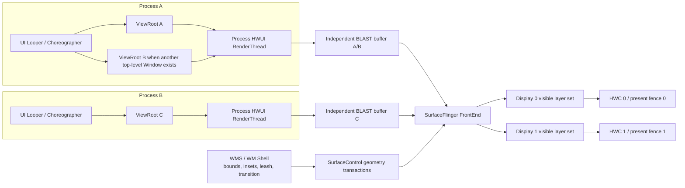

# 自适应布局、桌面窗口与多形态设备性能

自适应布局应响应当前窗口和姿态，而不是猜测设备类别；桌面窗口、折叠状态和旋转都可能在运行中改变可用空间。把尺寸决策集中在页面入口，并限制重组与重新布局范围，才能同时保证正确性和性能。

## 版本范围与源码依据

自适应界面（Adaptive UI）依据当前应用窗口的可用空间、折叠姿态和输入方式调整布局。设备名称只能用于概括使用场景，不能代替运行时窗口信息：平板上的分屏窗口可能属于紧凑（Compact）宽度，手机连接桌面显示器后也可能属于大（Large）或超大（Extra-large）宽度。

本文采用这些版本：

| 层级 | 版本依据 | 说明 |
|---|---|---|
| Android 平台 | Android 17 / API 37 / `android-17.0.0_r1` | `ViewRootImpl`、WindowManager、WM Shell、BLAST、SurfaceFlinger 与 HWC 按该源码标签核查 |
| Android 内核 | `android17-6.18-2026-06_r6` | 调度、cpuset 与 dma-fence 只说明公共内核机制，不推断厂商 DPU/GPU 实现 |
| Compose UI | 1.11.4 稳定版 | Compose 独立发布，不随 API 37 一起定版 |
| Material 3 Adaptive | 1.2.0 稳定版 | 示例代码使用这一版公开 API；Large / Extra-large 分类需要显式开启 |
| Jetpack WindowManager | 1.5.1 稳定版 | `WindowInfoTracker`、`FoldingFeature` 与 `WindowMetricsCalculator` 按这一版说明 |

Material 3 Adaptive 1.3.0-rc01 是候选发布版（release candidate，RC），已经调整部分窗口信息 API。生产项目若采用 1.3.x，应按该版本的迁移说明改写调用；1.3.x 标记弃用的 API 在 1.2.0 中仍可能是正确用法。

## 一、窗口尺寸类别描述窗口，不描述设备

### 1. 宽度有五档，高度有三档

当前官方窗口分类如下：

| 分类 | 当前窗口可用尺寸 |
|---|---|
| 紧凑（Compact）宽度 | `width < 600dp` |
| 中等（Medium）宽度 | `600dp ≤ width < 840dp` |
| 扩展（Expanded）宽度 | `840dp ≤ width < 1200dp` |
| 大（Large）宽度 | `1200dp ≤ width < 1600dp` |
| 超大（Extra-large）宽度 | `width ≥ 1600dp` |
| 紧凑（Compact）高度 | `height < 480dp` |
| 中等（Medium）高度 | `480dp ≤ height < 900dp` |
| 扩展（Expanded）高度 | `height ≥ 900dp` |

宽度适合决定导航形态、窗格（pane）数量和信息密度，高度也不能省略。横屏手机或桌面上的矮窗口可能具有中等或扩展宽度，同时只有紧凑高度；此时机械地切成双窗格会压缩触控区域、列表和详情内容。

Material 3 Adaptive 1.2.0 的 `currentWindowAdaptiveInfo()` 默认仍按 Compact、Medium、Expanded 三档计算。传入 `supportLargeAndXLargeWidth = true` 后，计算才会包含 1200dp 与 1600dp 两个断点。`calculatePaneScaffoldDirective()` 生成窗格布局指令：Compact 和 Medium 默认允许一个横向分区，Expanded 允许两个，Large 和 Extra-large 最多允许三个。`calculatePaneScaffoldDirectiveWithTwoPanesOnMediumWidth()` 会让 Medium 使用双窗格，但源码文档也提醒，这可能使内容过密，只适合确有需求的页面。

### 2. 类别变化和连续调整窗口不是同一频率

拖动自由窗口时，原始约束可能连续变化；窗口尺寸类别只在跨越 600、840、1200、1600dp 等断点时变化。上层页面模式因此只有少数离散状态，但断点范围内依然会产生布局成本：

- 父约束每次变化都可能触发 Compose 测量、布局，或 View 的遍历（traversal）；
- 文本宽度、行数、Lazy 容器的可见项、图片目标尺寸和系统占用区域都可能在同一尺寸类别内变化；
- `remember` 保存计算结果或对象身份，不会阻止约束变化引发测量；
- `derivedStateOf` 只适合把高频可观察输入转换成变化较少的派生状态，不能普遍加速窗口尺寸调整。

窗口尺寸类别用于页面级决策。组件能否排下按钮、图表或卡片内容，仍要依据组件收到的约束，不必把整个窗口类别逐层传到每个子组件。

### 3. 系统栏和窗口装饰仍占用内容空间

桌面窗口标题栏（caption）、状态栏、导航栏、显示缺口和输入法（IME）都会改变内容可用区域。窗口达到 Expanded 宽度，不代表扣除系统占用区域（Insets）后，每个窗格仍满足设计的最小宽度。边到边（edge-to-edge）页面应在统一位置处理 `WindowInsets`，避免页面布局容器、窗格和子组件重复增加内边距。

`LocalWindowInfo.current.containerSize`、平台 `WindowMetrics` 和布局阶段得到的内容约束处于不同层次。页面模式可以由窗口级信息决定，具体窗格的排版应以自身测量约束为准。混用这些尺寸而不注明坐标空间，容易重复扣除 Insets，或者误把窗口尺寸当成内容尺寸。

## 二、把自适应决策集中在页面入口

### 1. 各依赖使用自己的版本号

这些依赖用于 Compose 的典型列表—详情布局，以及直接读取折叠特征。三个 Material 3 Adaptive 依赖模块保持同一版本，WindowManager 单独指定版本。

```kotlin
dependencies {
    implementation("androidx.compose.material3.adaptive:adaptive:1.2.0")
    implementation("androidx.compose.material3.adaptive:adaptive-layout:1.2.0")
    implementation("androidx.compose.material3.adaptive:adaptive-navigation:1.2.0")
    implementation("androidx.window:window:1.5.1")
}
```

版本目录或 Compose BOM（统一管理 Compose 依赖版本的物料清单）可以替代硬编码版本，但构建产物仍要能还原最终解析到的依赖模块版本。平台 API 37、Compose UI 和 Material 3 Adaptive 不能共用一个“Android 17 版本”标签。

### 2. 一个页面只计算一次上层布局指令

这段代码展示稳定版 1.2.0 的列表—详情入口。它显式启用五档宽度分类，并把同一个 `PaneScaffoldDirective` 同时交给导航器和窗格布局；`ArticleList` 与 `ArticleDetail` 是页面自己的内容组件。

```kotlin
@OptIn(ExperimentalMaterial3AdaptiveApi::class)
@Composable
fun AdaptiveArticleRoute(
    articles: List<ArticleSummary>,
) {
    val adaptiveInfo =
        currentWindowAdaptiveInfo(
            supportLargeAndXLargeWidth = true,
        )
    val directive = calculatePaneScaffoldDirective(adaptiveInfo)
    val navigator =
        rememberListDetailPaneScaffoldNavigator<Long>(
            scaffoldDirective = directive,
        )
    val coroutineScope = rememberCoroutineScope()

    ListDetailPaneScaffold(
        directive = navigator.scaffoldDirective,
        value = navigator.scaffoldValue,
        listPane = {
            AnimatedPane {
                ArticleList(
                    articles = articles,
                    onArticleClick = { articleId ->
                        coroutineScope.launch {
                            navigator.navigateTo(
                                pane = ListDetailPaneScaffoldRole.Detail,
                                contentKey = articleId,
                            )
                        }
                    },
                )
            }
        },
        detailPane = {
            AnimatedPane {
                ArticleDetail(
                    articleId = navigator.currentDestination?.contentKey,
                )
            }
        },
    )
}
```

`rememberListDetailPaneScaffoldNavigator()` 用可保存状态记录目的地历史，泛型内容键（key）必须能写入 Android 的状态容器 `Bundle`。示例使用 `Long`，不会把完整业务对象放进保存状态。布局指令随窗口信息变化时，导航器会接收新值；列表数据和选中内容仍应由 ViewModel、数据仓库或其他页面状态持有。

`AnimatedPane` 提供窗格进入、退出和适配动画。它不会自动降低图片解码、数据库查询或复杂内容组合的成本。拖动窗口时，如果动画与资源加载重叠，应分别测量，并根据产品设计缩小动画范围或停用不必要的过渡。

### 3. `BoxWithConstraints` 只处理组件级约束

`BoxWithConstraints` 基于 `SubcomposeLayout`：它先取得父级约束，再据此组合子内容。内容读取 `maxWidth`、`maxHeight` 等约束后，约束变化可能使该内容重新组合并再次测量。它适合卡片、工具栏、图表等局部组件；页面每一层都使用它，会增加这种二阶段组合和测量工作。

判断某个组件是否需要它，可以问三个问题：

- 分支是否只依赖这个组件收到的约束？
- 分支内是否执行了解析、排序、图片请求或其他不该处于组合阶段的工作？
- 父级已经给出明确模式时，子级能否直接接收枚举或数据，省去重复分类？

Compose 的强跳过（strong skipping）、稳定参数和 Lazy 列表项键解决的是不同问题。强跳过决定参数满足条件时能否省略一次可组合函数调用，稳定的键用于维持列表项身份；二者都不能取消父约束变化后的测量和布局。

### 4. 窗格变化时要保留用户状态

单窗格与双窗格往往使用不同的 Compose 调用位置。即使数据键相同，内容换到另一个调用位置也可能创建新的组合实例。滚动位置、草稿、筛选条件和导航选择应有明确的状态所有者：

- 业务数据和选中项放在 ViewModel 或业务状态容器；
- 短期 UI 状态使用 `rememberSaveable`，并确认保存键与保存策略；
- 多个窗格需要各自的滚动位置时，按窗格和内容 ID 保存；
- Lazy 列表项键使用不可变业务 ID，不使用索引或会变化的标题；
- 不因窗口尺寸类别变化重新发起同一网络请求或清空导航历史。

“移动已有界面”只是视觉描述。Compose 用槽位表（slot table）记录组合结构；调用位置改变时，原来的组合实例不一定能够复用。性能目标应写成可验证的状态保留、组合范围和帧时间。

## 三、折叠姿态不等于连续铰链角度

### 1. `FoldingFeature` 提供哪些信息

WindowManager 1.5.1 的 `FoldingFeature` 公开：

- `state`：`FLAT` 表示平坦展开，`HALF_OPENED` 表示半开姿态；
- `orientation`：`HORIZONTAL` 表示特征横向延伸，`VERTICAL` 表示纵向延伸；
- `occlusionType`：`NONE` 表示特征区域不遮挡内容，`FULL` 表示其边界范围完全遮挡内容；
- `isSeparating`：显示特征是否把内容区域分成两个逻辑区域；
- `bounds`：该特征在当前窗口坐标空间中的边界。

它不提供连续的铰链角度。产品若需要角度传感器数据，必须使用设备明确支持的其他 API，并单独处理能力探测、权限、采样频率和兼容性；不能从 `HALF_OPENED` 推导固定角度。

Material 3 Adaptive 的 `WindowAdaptiveInfo` 已包含由窗口折叠特征计算出的姿态对象 `Posture`。只做典型布局时可直接使用这份信息；页面还要处理遮挡区域、相机预览或设备特定交互时，再直接订阅 `WindowInfoTracker`。

### 2. 订阅必须跟随当前 Activity 生命周期

这段 Activity 代码只在生命周期达到 `STARTED` 后收集当前窗口的折叠特征，并保存在 Activity 自己的 `StateFlow` 状态流中。每次开始收集前先清除旧值，Activity 重建后也会为新实例建立新的数据流订阅。

```kotlin
class FoldAwareActivity : ComponentActivity() {
    private val _foldingFeature = MutableStateFlow<FoldingFeature?>(null)
    val foldingFeature: StateFlow<FoldingFeature?> =
        _foldingFeature.asStateFlow()

    override fun onCreate(savedInstanceState: Bundle?) {
        super.onCreate(savedInstanceState)

        lifecycleScope.launch {
            repeatOnLifecycle(Lifecycle.State.STARTED) {
                _foldingFeature.value = null
                try {
                    WindowInfoTracker
                        .getOrCreate(this@FoldAwareActivity)
                        .windowLayoutInfo(this@FoldAwareActivity)
                        .map { layoutInfo ->
                            layoutInfo.displayFeatures
                                .filterIsInstance<FoldingFeature>()
                                .firstOrNull()
                        }
                        .distinctUntilChanged()
                        .collect { feature ->
                            _foldingFeature.value = feature
                        }
                } finally {
                    _foldingFeature.value = null
                }
            }
        }
    }
}
```

`windowLayoutInfo(activity)` 首次发出数据的时机取决于设备实现，页面要允许暂时没有 `FoldingFeature`。它返回的数据流与当前 Activity 的窗口实例绑定，不应缓存到跨 Activity 单例中长期复用。页面可以在 Compose 中按生命周期收集公开的 `StateFlow`；业务数据仍由 ViewModel 管理。一个窗口也可能报告多个显示特征；示例只取第一个是业务约束，不是 API 的全局保证。

### 3. 窗口姿态和内容状态分开

窗口姿态只决定内容如何摆放，不决定内容是否存在。列表选择、表单输入、媒体位置和文档编辑状态不应被 `FLAT ↔ HALF_OPENED` 变化重置。可把页面输入拆成两组：

| 状态 | 示例 | 推荐所有者 |
|---|---|---|
| 内容状态 | 选中 ID、草稿、滚动位置、加载结果 | ViewModel、SavedStateHandle、保存状态容器 |
| 布局状态 | 窗口尺寸类别、姿态、Insets、窗格布局指令 | 当前窗口/组合生命周期 |

这种分组也便于性能分析：内容状态没有变化却发生大量业务计算，说明布局事件进入了数据处理；内容状态发生变化时，则应按业务更新链路分析。

## 四、调整窗口大小会同时改变应用内容和系统几何

### 1. 单窗口标准路径

普通 View 或 Compose 页面仍走标准应用窗口路径：

`Choreographer#doFrame` → `ViewRootImpl` 遍历 → HWUI RenderThread → 窗口 BLAST 缓冲区 → SurfaceFlinger → 目标显示设备的 HWC → 呈现栅栏（present fence）。

其中，`ViewRootImpl` 遍历包含一轮测量、布局和绘制准备；BLAST 负责协调窗口缓冲区与 `SurfaceControl` 事务；HWC 是硬件合成器（Hardware Composer）；呈现栅栏是显示设备完成本轮呈现时发出的同步信号。

约束变化可能让 Compose 重新组合、测量、布局和记录绘制命令，也可能只触发其中一部分。`ViewRootImpl.performTraversals()` 只有在尺寸、可见性、Insets、`LayoutParams`、Surface 等条件满足时，才通过 `IWindowSession.relayout()` 请求窗口管理服务（WMS）重新布局；内容稳定的帧不会固定执行一次 `relayout()`。WMS 维护窗口状态，WM Shell 则在系统界面进程中负责多窗口和转场等上层交互。

### 2. 窗口、进程和显示设备要分别分析

这张图区分应用内容缓冲区、WMS/WM Shell 维护的窗口几何状态，以及每个显示设备的呈现结果。它同时覆盖同进程多窗口与跨进程窗口；屏幕上并排的两个窗格不一定是两个顶层窗口。



同一 UI Looper 上的多个 `ViewRootImpl` 共享 Choreographer 回调队列，同进程的硬件加速窗口还共享进程级 RenderThread；每个窗口有自己的 Surface 和缓冲区周转。不同进程有独立的 UI 线程和 RenderThread，但位于同一显示设备时，仍共享 SurfaceFlinger、GPU/内存带宽、HWC 硬件合成平面和显示截止时间。

双栏 Compose/View 布局通常仍只有一个顶层窗口和一个应用窗口缓冲区。Activity Embedding 会在同一任务中嵌入多个 Activity；加上 Dialog、Popup、画中画（PiP）、自由窗口或多实例后，顶层窗口数量要根据实际的进程编号（pid）、UI 线程编号（tid）、`ViewRootImpl`、`WindowState`、SurfaceFlinger 图层和 `displayId` 判断，不能根据视觉形态猜测。

### 3. 窗口几何、缓冲区和显示呈现对应三个时间点

调整窗口大小或执行转场时，系统同时处理：

- 任务（Task）/窗口边界，以及转场控制 Surface（leash）的位置和裁剪等几何属性；
- 应用按新约束绘制的窗口缓冲区；
- SurfaceFlinger 为目标显示设备选择可见图层并完成本轮呈现。

过渡阶段可能出现新窗口几何配旧缓冲区，系统会缩放旧内容，或用任务快照、启动窗口填补应用重绘间隙。WMS 的 `BLASTSyncEngine` 可以等待已加入同步组的窗口容器（WindowContainer）完成绘制和事务；公开的 `SurfaceSyncGroup` 面向应用或嵌入式 Surface。未加入同步组的相机、编解码器或渲染引擎生产者，仍要由业务自行协调时序。

应用的 `queueBuffer()` 返回，只说明生产者（Producer）已经提交缓冲区。此时 GPU 完成栅栏可能尚未发出信号，SurfaceFlinger 也可能尚未采纳（latch）该缓冲区，目标显示设备自然还没有完成呈现。定位窗口调整卡顿时，既不能只查 Compose 测量，也不能因为应用帧按时就排除显示端。

### 4. 每个显示设备有自己的呈现结果

窗口移动到外接屏后，密度、刷新率、色彩模式、Insets、HWC 能力和输入路由都可能变化。SurfaceFlinger 按显示设备建立可见图层集合，HWC 策略与呈现栅栏也分别产生。默认屏正常不能证明外接屏正常；同一进程的两个窗口也不要求在两个屏幕同时呈现。

公共内核源码标签可用于解释线程调度、限制线程可用 CPU 范围的 cpuset，以及在设备间同步缓冲区访问的 dma-fence。某台设备的硬件叠加平面、显示处理器（DPU）缩放单元、GPU 调度或显示驱动延迟，仍需厂商轨迹、设备配置和实际同步栅栏作为证据。

## 五、Android 17 让固定方向假设失效

面向 API 36 的应用运行在 Android 16 大屏设备上时，系统会忽略方向、宽高比和可调整大小限制。应用或单个 Activity 可以用清单属性 `PROPERTY_COMPAT_ALLOW_RESTRICTED_RESIZABILITY` 暂时恢复旧的兼容模式，但这个属性不能保证大屏设备锁定方向。面向 API 37 的应用运行在 Android 17 上时，这个临时选项不再生效。

这个变化适用于显示设备最小宽度达到 600dp 的大屏范围，也就是官方资料中的 `sw600dp` 及以上。以下配置或调用不能再作为布局前提：

- `screenOrientation` 的 `portrait` / `landscape` 系列固定值；
- `setRequestedOrientation()` 和 `getRequestedOrientation()` 对应的固定方向值；
- `resizeableActivity`；
- `minAspectRatio` 与 `maxAspectRatio`。

游戏类别、低于 `sw600dp` 的屏幕，以及用户在设备宽高比设置中明确选择应用原有行为，属于官方列出的例外。不同厂商的桌面窗口能力和窗口策略也有差异，验收记录要包含设备与窗口模式。

这项变化没有替换 `ViewRootImpl`、BLAST 或 SurfaceFlinger 渲染路径，但应用会更常遇到旋转、自由调整窗口、分屏和多种宽高比。兼容工作包括：

- 不以固定竖屏尺寸初始化导航、相机预览或画布；
- Activity 重建后恢复输入、选中项、滚动位置和导航历史；
- 自行处理配置变化时，逐项验证资源、Insets、密度和窗口状态更新；
- 相机预览使用传感器方向、目标旋转和 `Matrix` 变换，不把设备自然方向当成窗口方向；
- 动画起止位置按当前窗口边界计算，避免沿用启动时缓存的屏幕宽高。

## 六、大屏成本由实际窗口和内容决定

### 1. 面板分辨率不等于应用窗口缓冲区尺寸

3840×2160 的像素数是 1920×1080 的四倍，但应用工作量不能只由显示器标称分辨率推出。窗口可能只占屏幕一部分，系统可能使用不同渲染尺度，HWC 也可能把部分图层交给硬件合成。应记录：

- 当前窗口边界、密度和实际缓冲区尺寸；
- 可见区域与裁剪；
- 重叠绘制（同一像素在一帧内被多次绘制）、模糊、阴影、透明混合和离屏层；
- SurfaceFlinger 最终选择客户端合成（CLIENT）还是硬件合成（DEVICE）；
- GPU、内存带宽和 HWC 限制。

同一页面在更大窗口中通常会显示更多列表项、文字、图片和窗格。节点数量和像素填充可能同时增加，也可能只增加一项。性能报告应使用 Perfetto 轨迹、GPU 工具和内存数据描述实际变化，不能写成“进入大屏就固定增加四倍成本”。

### 2. 图片按展示目标请求

调整窗口时同步解码最大尺寸图片会占用 CPU、堆内存和主线程时间。图片管线应：

- 根据目标展示尺寸请求合适采样结果；
- 把磁盘读取与解码移出主线程；
- 对快速变化的尺寸做请求合并或选择有限的尺寸档；
- 取消已离开可见区域的请求；
- 为内存缓存设定与设备、页面和并发窗口相符的上限；
- 区分缩略图、预览和原图，不在每个拖动像素上创建新原图请求。

窗口变大后是否立即加载更高分辨率资源，取决于内容清晰度、网络与内存目标。可以等窗口尺寸稳定后再升级图片，也可以保留已有预览并异步替换；两种策略都要检查闪烁、峰值内存和无障碍缩放。

### 3. 更多窗格会扩大活跃工作集

活跃工作集是页面当前仍保留并参与更新的状态、图片、订阅和界面节点。双窗格或三窗格可能同时保留列表、详情、辅助内容、导航与动画。Lazy 容器只组合可见项，不代表所有窗格的状态、图片和订阅都会自动暂停。应检查：

- 不可见窗格是否仍在运行动画或定时刷新；
- 详情切换是否保留过多大图和文本布局；
- 多个窗格是否重复订阅同一个持续活跃的数据流，并执行相同转换；
- 预取范围是否因窗口变大而没有上限；
- 关闭窗格后，业务缓存和组合状态何时释放。

缓存策略要围绕可重复使用的数据与明确容量设计，不能把窗口扩展理解为允许无限保留内容。

## 七、多窗口生命周期和输入不能只看 `onPause()`

多窗口支持多恢复（multi-resume）：多个 Activity 可以同时处于 `RESUMED`，但只有一个是 top-resumed，也就是系统当前优先交互的 Activity。可见窗口也可能没有输入焦点。播放器、相机、动画、协作光标和轮询任务应综合：

- 生命周期状态；
- 窗口可见性与遮挡；
- top-resumed 状态；
- 输入焦点；
- 独占硬件可用性；
- 用户是否要求继续播放、采集或同步。

“失去焦点便停止全部工作”会中断仍需显示的内容，“只在 `onPause()` 降载”又可能让后台可见窗口持续高频刷新。策略应按业务类型定义，并在分屏切焦点、PiP、桌面多实例和外接屏中验证。

### 桌面窗口的多实例、拖拽与共享状态

桌面窗口化会让同一应用同时拥有多个任务（task），甚至跨显示器展示同一业务对象。`PROPERTY_SUPPORTS_MULTI_INSTANCE_SYSTEM_UI` 只允许系统界面提供“新窗口”入口，不会自动解决启动模式、路由、草稿冲突和数据库并发。状态可以分成三层：实例内的滚动、选择和窗格状态；由数据仓库管理、带修订版本号和事务的共享业务状态；以及可以共享但不能隐含“当前窗口”的进程级缓存与连接池。

跨窗口拖放只在回调中传递轻量的 `ClipData`、URI 和访问授权；MIME 类型校验、Bitmap 解码、缩略图生成与导入事务放到后台。Android 15 提供 `DRAG_FLAG_GLOBAL_SAME_APPLICATION`，允许拖放跨越同一应用的窗口；`DRAG_FLAG_START_INTENT_SENDER_ON_UNHANDLED_DRAG` 则在没有窗口接收放下动作时启动 `IntentSender`。这两个入口仍要重新经过任务路由和权限验证，不能把大对象序列化进 Intent 或 Binder 调用。

同一进程的多个窗口各有 `ViewRootImpl` 和缓冲区周转，却可能共享 UI Looper 与进程级 RenderThread。即使窗口 B 自身的 `DrawFrame` 很短，也可能排在窗口 A 的长任务之后，错过显示截止时间；跨显示器则要分别记录 `displayId`、密度、刷新率、色彩模式和每个屏幕的呈现结果。连接或断开外屏、跨屏拖动、最大化或还原、输入焦点切换都应作为独立用例。

桌面窗口还要覆盖鼠标悬停、滚轮、右键、键盘快捷键、Tab 焦点和窗口标题栏 Insets。精确指针参与模式 `EngagementMode.PRECISE_POINTER` 到 WindowManager 1.6.0-alpha05 才加入，不属于 1.5.1 稳定版，不能用这项预览 API 描述稳定版实现。

## 八、资源限定符只处理稳定的资源差异

`sw<N>dp`、`w<N>dp`、方向、密度等限定符适合选择资源，但它们与运行时窗口分类并不完全等价：

- `sw<N>dp` 描述配置中的最小宽度，不随每次自由窗口宽度变化；
- `w<N>dp` 更接近当前可用宽度，但资源重选仍经过 Configuration/Resources 路径；
- Compose 窗口尺寸类别是运行时布局输入；
- 组件测量约束描述的是局部可用空间。

同一项目可以同时使用这些机制，但每一种只处理自己的层级。间距、最小窗格宽度和列数可以放在 `values` 资源中；页面结构由窗口尺寸类别和姿态决定；组件内部由约束完成排版。复制多份完整布局会增加维护与状态恢复难度，也容易让某个资源目录长期无人测试。

检查资源时应覆盖横竖屏、分屏、自由窗口、字体缩放、显示缩放、外接屏，以及不同语言和地区设置（locale）。图片资源目录不应成为运行时图片尺寸策略的唯一输入。

## 九、视觉正确性和帧性能要分别验证

### 1. 尺寸测试组合覆盖断点两侧

每个关键页面至少覆盖：

| 维度 | 建议样本 |
|---|---|
| 宽度断点 | 599/600dp、839/840dp、1199/1200dp、1599/1600dp |
| 高度断点 | 479/480dp、899/900dp |
| 窗口行为 | 旋转、分屏进入或退出、自由调整大小、最大化或还原 |
| 折叠行为 | FLAT、HALF_OPENED、分隔/遮挡特征、内外屏切换 |
| 显示拓扑 | 内屏、外接屏、跨屏移动、不同刷新率/密度 |
| 输入 | 触摸、鼠标、键盘、焦点切换、IME |
| 状态恢复 | Activity 重建、进程恢复、多实例、显示设备断开 |

Compose Preview、Compose UI Check、`DeviceConfigurationOverride` 和截图测试适合验证布局。它们不会运行完整的真实设备显示路径，因此不能证明 UI 线程、RenderThread、GPU、SurfaceFlinger 或 HWC 的帧时间。

### 2. Macrobenchmark 只测试可重复的用户操作

启动、滚动、窗格导航和预设尺寸切换适合用 Macrobenchmark 做自动化基准测试。连续拖动桌面窗口的系统手势在不同设备和 Shell 实现上不一定能够稳定复现，此时应使用固定环境的脚本化操作，或者在手工操作时采集 Perfetto，并记录每次窗口边界。

每组性能数据应记录设备、Android 源码标签或系统构建、目标 SDK、Material 3 Adaptive/Compose 版本、窗口尺寸、密度、`displayId`、刷新率、温度、编译模式、基线配置文件（Baseline Profile）和输入脚本。单独一组平均帧率无法解释跨越断点或调整窗口时的短时异常。

### 3. FrameTimeline 要按 SurfaceFrame 和 DisplayFrame 读取

这段 PerfettoSQL 比较目标应用窗口的 Expected 和 Actual `SurfaceFrame`：Expected 表示系统预期的帧时间窗，Actual 表示实际执行记录。`$target_upid` 是 Perfetto 中的目标进程编号，`$layer_glob` 是目标窗口图层的匹配模式；两者必须依据本次轨迹确定，不能只用包名模糊匹配整个系统。

```sql
WITH actual_app AS (
  SELECT
    upid,
    surface_frame_token,
    display_frame_token,
    layer_name,
    ts AS actual_start_ns,
    ts + dur AS actual_end_ns,
    jank_type,
    present_type
  FROM actual_frame_timeline_slice
  WHERE upid = $target_upid
    AND surface_frame_token != 0
    AND layer_name GLOB $layer_glob
),
expected_app AS (
  SELECT
    upid,
    surface_frame_token,
    ts AS expected_start_ns,
    ts + dur AS expected_end_ns
  FROM expected_frame_timeline_slice
  WHERE upid = $target_upid
    AND surface_frame_token != 0
)
SELECT
  a.surface_frame_token,
  a.display_frame_token,
  a.layer_name,
  e.expected_start_ns,
  e.expected_end_ns,
  a.actual_start_ns,
  a.actual_end_ns,
  a.actual_end_ns - e.expected_end_ns AS overrun_ns,
  a.jank_type,
  a.present_type
FROM actual_app AS a
JOIN expected_app AS e
  USING (upid, surface_frame_token)
ORDER BY a.actual_start_ns;
```

`overrun_ns > 0` 表示 Actual 结束时间晚于 Expected 截止时间，差值单位是纳秒，但这个数值本身不说明原因。应用 `SurfaceFrame` 异常时，应检查 UI 线程、RenderThread、GPU、缓冲区和同步栅栏；应用按时，但 `display_frame_token` 对应的 `DisplayFrame` 异常时，再检查 WMS/Shell 事务、SurfaceFlinger、客户端合成（CLIENT）、HWC 与目标屏幕的呈现时间。

同一进程有多个窗口时，要分别查看各自的图层、`ViewRootImpl` 和缓冲区队列；同一显示设备有多个进程时，要分别确认每个应用是否按时提交。`surface_frame_token` 与 `display_frame_token` 是关联应用帧和显示帧的标识。缓冲区事务 `BufferTX`、这些 FrameTimeline 标识、图层快照和呈现栅栏共同构成证据，单个时间片名称不足以定位责任模块。

### 4. 调整窗口轨迹的分析顺序

1. 记录异常发生时的 `displayId`、窗口边界与目标呈现时间。
2. 列出可见窗口、转场控制 Surface（leash）、窗口标题栏、IME 和 SurfaceFlinger 图层。
3. 为每个窗口标明进程编号、UI 线程编号、RenderThread、`ViewRootImpl` 与 BLAST 图层。
4. 查看 Compose/View 是否发生组合、测量、布局或绘制，以及是否伴随业务计算、GC 或同步 I/O。
5. 按时间戳对应 Configuration 变化、`relayout()`、窗口容器事务（WCT）、WMS 同步和 Shell 转场。
6. 确认窗口几何事务和应用窗口缓冲区分别在哪个 `DisplayFrame` 生效。
7. 检查获取、释放和呈现同步栅栏，以及 HWC 合成策略。
8. 找到最早偏离目标时间线的对象，再决定优化应用、Shell/WMS、SurfaceFlinger/HWC 或设备驱动。

## 十、常见误判

| 现象 | 先查什么 | 不能直接下的结论 |
|---|---|---|
| 跨过 840dp 时卡一下 | 窗格数量、组合与测量、图片请求、过渡动画 | `WindowSizeClass` 分类计算很重 |
| 断点内拖动仍持续测量 | 父约束、文本换行、Lazy 可见项、Insets | 尺寸类别没变就不应布局 |
| 双窗格页面只有一个 `DrawFrame` | 是否只是同一窗口内两个普通窗格 | 系统漏画了第二个窗口 |
| Dialog 出现后主窗口延迟 | 同一 UI 回调队列的顺序、共享 RenderThread、显示图层集合 | Dialog 面积小，不影响主窗口 |
| `queueBuffer()` 按时 | 获取栅栏、SurfaceFlinger 是否已采纳缓冲区、`DisplayFrame`、呈现时间 | 用户已经看到该帧 |
| 外接屏慢、内屏正常 | `displayId`、显示模式、HWC、每屏呈现栅栏 | 同进程窗口应同时显示 |
| 折叠后详情重新加载 | 内容状态所有者、组合位置、保存状态键 | `FoldingFeature` 自动清空状态 |
| 4K 显示器 GPU 升高 | 实际缓冲区、窗口面积、重叠绘制、CLIENT 合成 | 分辨率必然带来固定四倍耗时 |
| 非焦点窗口仍在刷新 | 生命周期、top-resumed、可见性和业务策略 | `onPause()` 一定会停止它 |
| 面向 API 37 时大屏方向变化 | 固定方向限制被忽略、Activity 重建、资源与 Insets | Android 17 更换了显示管线 |

## 十一、提交前检查清单

- [ ] 平台结论固定到 Android 17 / API 37 / `android-17.0.0_r1`
- [ ] 内核结论固定到 `android17-6.18-2026-06_r6`
- [ ] 记录 Compose UI、Material 3 Adaptive 与 WindowManager 的独立版本
- [ ] 页面按当前窗口分类，不使用 `isTablet` 代替窗口信息
- [ ] 已明确选择是否启用五档宽度分类，没有把 Large/Extra-large 误算进默认三档
- [ ] Compact 高度下的横屏和矮窗口有单独验收
- [ ] 页面级布局指令只在上层计算，组件级约束留给组件处理
- [ ] `BoxWithConstraints` 内没有数据库、网络、同步解码或高成本解析
- [ ] 窗格切换不清空选中项、表单、滚动位置和导航历史
- [ ] `FoldingFeature` 没有被当成连续铰链角度
- [ ] WindowInfoTracker 订阅与当前 Activity 生命周期绑定
- [ ] 图片请求按展示目标、可见性和缓存容量设计
- [ ] 多窗口任务综合生命周期、top-resumed、输入焦点与业务意图
- [ ] 已测试 Android 17 上面向 API 37 时的方向、宽高比和尺寸调整行为
- [ ] 调整窗口的轨迹区分几何事务、缓冲区提交与显示呈现
- [ ] 多窗口标出进程、线程、ViewRoot 和图层，多显示设备分别看呈现栅栏
- [ ] 视觉测试、Macrobenchmark 和 Perfetto 各自回答对应问题

## 全文小结

自适应布局的核心输入是当前窗口、设备姿态、Insets 和输入能力，而不是设备名称或应用启动时记录的一次屏幕宽度。页面入口负责把连续的环境信息收敛成离散布局指令，组件再依据局部约束完成布局；内容状态应当独立持有，避免随布局模式切换而丢失或重复加载。

性能验收也要分层：应用侧区分组合、测量与布局，系统侧区分 WMS/Shell 几何变化、应用 buffer 生产和各显示设备的 present。测试矩阵至少覆盖断点两侧、连续拖拽、多窗口、多实例、多显示设备以及状态恢复。

## 参考资料

- [Android 16：自适应布局行为变化](https://developer.android.com/about/versions/16/behavior-changes-16)
- [Android 17：方向、可调整大小和宽高比限制被忽略](https://developer.android.com/about/versions/17/changes/ff-restrictions-ignored)
- [Android 17 target 37 行为变更](https://developer.android.com/about/versions/17/behavior-changes-17)
- [AndroidX 当前版本](https://developer.android.com/jetpack/androidx/versions)
- [窗口尺寸分类](https://developer.android.com/develop/adaptive-apps/guides/use-window-size-classes)
- [Adaptive layout 入门](https://developer.android.com/develop/adaptive-apps/guides/get-started-with-adaptive-apps)
- [List-detail canonical layout](https://developer.android.com/develop/adaptive-apps/guides/list-detail)
- [折叠屏窗口特征](https://developer.android.com/develop/adaptive-apps/guides/foldables/make-your-app-fold-aware)
- [`FoldingFeature` API](https://developer.android.com/reference/androidx/window/layout/FoldingFeature)
- [`WindowInfoTracker` API](https://developer.android.com/reference/androidx/window/layout/WindowInfoTracker)
- [桌面窗口支持](https://developer.android.com/develop/adaptive-apps/guides/support-desktop-windowing)
- [Material 3 Adaptive 1.2.0 发布说明](https://developer.android.com/jetpack/androidx/releases/compose-material3-adaptive)
- [WindowManager 1.5.1 发布说明](https://developer.android.com/jetpack/androidx/releases/window)
- [Perfetto FrameTimeline](https://perfetto.dev/docs/data-sources/frametimeline)
- [`WindowAdaptiveInfo.kt`（Material 3 Adaptive 1.2.0）](https://android.googlesource.com/platform/frameworks/support/+/bda0327f6fc5c110aeed6f8802d8e5210cdefc38/compose/material3/adaptive/adaptive/src/commonMain/kotlin/androidx/compose/material3/adaptive/WindowAdaptiveInfo.kt)
- [`PaneScaffoldDirective.kt`（Material 3 Adaptive 1.2.0）](https://android.googlesource.com/platform/frameworks/support/+/bda0327f6fc5c110aeed6f8802d8e5210cdefc38/compose/material3/adaptive/adaptive-layout/src/commonMain/kotlin/androidx/compose/material3/adaptive/layout/PaneScaffoldDirective.kt)
- [`ThreePaneScaffoldNavigator.kt`（Material 3 Adaptive 1.2.0）](https://android.googlesource.com/platform/frameworks/support/+/bda0327f6fc5c110aeed6f8802d8e5210cdefc38/compose/material3/adaptive/adaptive-navigation/src/commonMain/kotlin/androidx/compose/material3/adaptive/navigation/ThreePaneScaffoldNavigator.kt)
- [`FoldingFeature.kt`（WindowManager 1.5.1）](https://android.googlesource.com/platform/frameworks/support/+/be8b763fe78ab805aa1c9a3bff09f1ff8081dbb2/window/window/src/main/java/androidx/window/layout/FoldingFeature.kt)
- [`WindowInfoTracker.kt`（WindowManager 1.5.1）](https://android.googlesource.com/platform/frameworks/support/+/be8b763fe78ab805aa1c9a3bff09f1ff8081dbb2/window/window/src/main/java/androidx/window/layout/WindowInfoTracker.kt)
- [`ViewRootImpl.java`（Android 17）](https://android.googlesource.com/platform/frameworks/base/+/refs/tags/android-17.0.0_r1/core/java/android/view/ViewRootImpl.java)
- [`Choreographer.java`（Android 17）](https://android.googlesource.com/platform/frameworks/base/+/refs/tags/android-17.0.0_r1/core/java/android/view/Choreographer.java)
- [`RenderThread.cpp`（Android 17）](https://android.googlesource.com/platform/frameworks/base/+/refs/tags/android-17.0.0_r1/libs/hwui/renderthread/RenderThread.cpp)
- [`BLASTSyncEngine.java`（Android 17）](https://android.googlesource.com/platform/frameworks/base/+/refs/tags/android-17.0.0_r1/services/core/java/com/android/server/wm/BLASTSyncEngine.java)
- [`BLASTBufferQueue.cpp`（Android 17）](https://android.googlesource.com/platform/frameworks/native/+/refs/tags/android-17.0.0_r1/libs/gui/BLASTBufferQueue.cpp)
- [`SurfaceFlinger.cpp`（Android 17）](https://android.googlesource.com/platform/frameworks/native/+/refs/tags/android-17.0.0_r1/services/surfaceflinger/SurfaceFlinger.cpp)
- [`HWComposer.cpp`（Android 17）](https://android.googlesource.com/platform/frameworks/native/+/refs/tags/android-17.0.0_r1/services/surfaceflinger/DisplayHardware/HWComposer.cpp)
- [`kernel/sched/core.c`（android17-6.18-2026-06_r6）](https://android.googlesource.com/kernel/common/+/refs/tags/android17-6.18-2026-06_r6/kernel/sched/core.c)
- [`dma-fence.c`（android17-6.18-2026-06_r6）](https://android.googlesource.com/kernel/common/+/refs/tags/android17-6.18-2026-06_r6/drivers/dma-buf/dma-fence.c)
