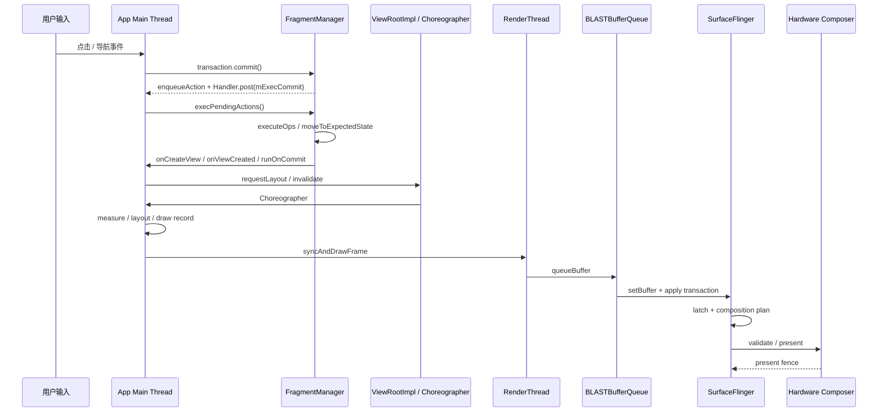

# FragmentTransaction 提交链路与页面切换性能

Fragment 页面切换不能只测 `commit()`。它成功返回只说明事务已加入 `FragmentManager` 的待执行队列；View 创建、生命周期推进和动画准备发生在随后处理队列的 `execPendingActions()` 中。排查时要把 Fragment 事务、inflate（解析 XML 并实例化 View）、一轮 View 树遍历（traversal，包含 measure、layout、draw）和帧结果放到同一条性能轨迹（trace）上：Android 12+ 可以用 FrameTimeline（帧时间线），Android 10/11 则结合 `Choreographer`、RenderThread（渲染线程）切片和自定义 trace。

现代应用的 Fragment 性能排查应以 AndroidX Fragment 为准。平台 `android.app.Fragment` 已废弃，不再作为新代码优化对象。

本文把源码版本分成两组：Fragment 事务实现固定到 AndroidX `androidx-fragment-release` 的提交 `f39ca3510efb2347ebfef231e25a3e804922450d`；`Choreographer`、`ViewRootImpl`、HWUI、BLASTBufferQueue 与 SurfaceFlinger 固定到 Android 17 / API 37 的 `android-17.0.0_r1`。AndroidX 独立发布，不能用 Android 平台标签反推某台设备采用的 Fragment 版本。

## `commit()` 只排队，事务执行在后一个主线程消息里

AndroidX 的 `BackStackRecord` 是 `FragmentTransaction` 的具体实现。`commit()`、`commitAllowingStateLoss()` 和 `commitNow()` 的分叉点很早：前两者走 `commitInternal(..., true)`，把当前事务交给 `FragmentManager.enqueueAction()`；`commitNow()` 跳过待执行队列，直接走 `execSingleAction()`。以下代码保留三个常用分支；第四个提交方法 `commitNowAllowingStateLoss()` 同样调用 `execSingleAction()`，但把 `allowStateLoss` 设为 `true`。

这段摘录保留上述三个常用分支：

```java
@Override
public int commit() {
    return commitInternal(false, true);
}

@Override
public int commitAllowingStateLoss() {
    return commitInternal(true, true);
}

@Override
public void commitNow() {
    disallowAddToBackStack();
    mManager.execSingleAction(this, false);
}
```

`commitInternal()` 会检查重复提交、分配返回栈编号（back stack index），然后在 `commitAction == true` 时进入 `FragmentManager.enqueueAction()`：

```java
int commitInternal(boolean allowStateLoss, boolean commitAction) {
    if (mCommitted) {
        throw new IllegalStateException("commit already called");
    }
    mCommitted = true;
    if (mAddToBackStack) {
        mIndex = mManager.allocBackStackIndex();
    } else {
        mIndex = -1;
    }
    if (commitAction) {
        mManager.enqueueAction(this, allowStateLoss);
    }
    return mIndex;
}
```

`enqueueAction()` 决定了异步语义。事务被加入 `mPendingActions`，也就是待执行操作（pending action）列表后，`scheduleCommit()` 通过宿主 `Handler` 投递 `mExecCommit`：

```java
void enqueueAction(@NonNull OpGenerator action, boolean allowStateLoss) {
    if (!allowStateLoss) {
        if (mHost == null) {
            throw new IllegalStateException("FragmentManager has not been attached to a host.");
        }
        checkStateLoss();
    }
    synchronized (mPendingActions) {
        if (mHost == null) {
            if (allowStateLoss) {
                return;
            }
            throw new IllegalStateException("Activity has been destroyed");
        }
        mPendingActions.add(action);
        scheduleCommit();
    }
}

void scheduleCommit() {
    synchronized (mPendingActions) {
        boolean pendingReady = mPendingActions.size() == 1;
        if (pendingReady) {
            mHost.getHandler().removeCallbacks(mExecCommit);
            mHost.getHandler().post(mExecCommit);
            updateOnBackPressedCallbackEnabled();
        }
    }
}
```

从性能排查看，有两个结论：

- `commit()` 返回快，不代表页面切换便宜。View 创建、生命周期推进、动画准备和 `SpecialEffectsController` 的动画/过渡处理，都在后面的主线程消息里发生。
- 多次连续 `commit()` 可能被同一个 `execPendingActions()` 批处理。排查 Perfetto 时，除了点击回调里的 `commit()`，还要检查随后主线程消息中的生命周期和 View 创建耗时。

## 提交与强制执行 API 的边界

状态丢失（state loss）是指 Activity 已保存 Fragment 状态后又修改界面，进程重建时这次修改可能无法恢复；它不是业务数据丢失的同义词。`AllowingStateLoss` 只表示调用方接受这项恢复风险，也不保证宿主销毁后事务仍会执行。

| API | 执行方式 | 返回栈 | 状态保存后的行为 | 性能风险 |
|---|---|---|---|---|
| `commit()` | 异步排队，后续主线程消息执行 | 支持 | `isStateSaved()` 后提交会抛异常 | 调用点轻，但后续可能集中执行多笔事务 |
| `commitAllowingStateLoss()` | 异步排队 | 支持 | 可在状态保存后提交；宿主不可用时可能丢弃事务 | UI 状态可能与恢复结果不一致，不能用它规避性能问题 |
| `commitNow()` | 当前主线程同步执行当前事务 | 不支持；源码会 `disallowAddToBackStack()` | 状态保存后提交会抛异常 | 生命周期与 View 创建都进入当前调用栈 |
| `commitNowAllowingStateLoss()` | 当前主线程同步执行当前事务 | 不支持 | 可忽略状态保存检查；宿主未连接或已销毁时直接丢弃 | 同步成本与 `commitNow()` 相同，另有无法恢复或不执行的风险 |
| `executePendingTransactions()` | 调用 `execPendingActions(true)`，随后 `forcePostponedTransactions()` | 执行队列中原有事务，不改变各事务的返回栈属性 | 不检查 `isStateSaved()`；宿主未连接或已销毁时仍会抛异常 | 会把其他模块的待执行事务一起处理，时序影响范围比 `commitNow()` 大 |

`executePendingTransactions()` 是 `FragmentManager` 的队列执行方法，不是另一种事务提交方法。官方文档建议：如果只想同步提交一个不修改返回栈的事务，优先用 `commitNow()`，不要组合 `commit()` 与 `executePendingTransactions()`；后者会尝试执行当前所有待执行事务。

工程上可以按这条规则选：需要进入返回栈的页面切换使用 `commit()`；必须同步取得 Fragment View 的小型局部初始化，可以考虑 `commitNow()`；通用导航路径不要调用 `executePendingTransactions()` 来追求同步完成。只有界面恢复时允许缺少这次修改，才考虑两个 `AllowingStateLoss` 变体。

`executePendingTransactions()` 还有两个边界。第一，它传入 `allowStateLoss = true` 执行 `execPendingActions(true)`，处理当前 FragmentManager 的全部待执行事务；这不会让此前已被 `commit()` 拒绝的事务重新出现。第二，它会在待执行操作处理后调用 `forcePostponedTransactions()`，强制启动原本延后的入场过渡。页面切换期间如果 Navigation Component 或其他使用同一 FragmentManager 的模块已经排队，这些工作也会进入当前主线程执行窗口。

## `execPendingActions()`：同一主线程消息中的批处理循环

`mExecCommit` 被 `Handler.post()` 后，主线程会调用 `execPendingActions(true)`。执行前，`ensureExecReady()` 做三类保护：

- `mExecutingActions` 不能为 `true`，避免在事务处理过程中再次同步执行事务。
- 当前线程必须是宿主 `Handler` 所在线程，否则抛出 “Must be called from main thread of fragment host”。
- 未允许状态丢失时执行 `checkStateLoss()`，避免宿主保存状态后继续修改 Fragment 状态。

以下摘录保留三项检查；完整实现还会区分宿主未连接与已销毁，并初始化临时列表：

```java
private void ensureExecReady(boolean allowStateLoss) {
    if (mExecutingActions) {
        throw new IllegalStateException("FragmentManager is already executing transactions");
    }
    if (mHost == null) {
        throw new IllegalStateException("FragmentManager has not been attached to a host.");
    }
    if (Looper.myLooper() != mHost.getHandler().getLooper()) {
        throw new IllegalStateException("Must be called from main thread of fragment host");
    }
    if (!allowStateLoss) {
        checkStateLoss();
    }
}
```

准备完成后，`execPendingActions()` 进入循环：从 `mPendingActions` 取出所有 `OpGenerator`，生成 `BackStackRecord` 列表，再调用 `removeRedundantOperationsAndExecute()`。以下摘录是普通提交路径，省略了预测式返回被新操作中断时对 `mTransitioningOp` 的取消与重新提交：

```java
boolean execPendingActions(boolean allowStateLoss) {
    ensureExecReady(allowStateLoss);

    boolean didSomething = false;
    while (generateOpsForPendingActions(mTmpRecords, mTmpIsPop)) {
        mExecutingActions = true;
        try {
            removeRedundantOperationsAndExecute(mTmpRecords, mTmpIsPop);
        } finally {
            cleanupExec();
        }
        didSomething = true;
    }

    updateOnBackPressedCallbackEnabled();
    doPendingDeferredStart();
    mFragmentStore.burpActive();
    return didSomething;
}
```

`generateOpsForPendingActions()` 会在同步块内遍历当前 FragmentManager 的 `mPendingActions`，再清空列表并移除已投递的 `mExecCommit`。一次点击即使只调用一次 `commit()`，性能轨迹中仍可能出现多个 Fragment 的生命周期推进：同一事务可以操作多个 Fragment，同一 FragmentManager 也可能已有其他事务或 Navigation 操作排队。子 FragmentManager 使用自己的队列，判断它是否参与了同一主线程消息要继续看调用栈。

性能排查不能停在“FragmentManager 慢”这个结论，还要列出同一个主线程消息包含的具体工作：`onCreate()`、`onCreateView()`、ViewBinding 创建 View、RecyclerView 适配器初始化、首批图片同步解码、`onViewCreated()` 中的同步 I/O，以及子 Fragment 随父生命周期发生的状态推进或同步事务。

## Fragment 事务与一帧渲染的时序

Fragment 事务不属于 `Choreographer#doFrame` 的固定阶段。它是主线程消息队列中的普通工作；事务处理后，新增或变更的 View 才会在后续 traversal 中参与 measure、layout 和 draw。和 [§18.2 Android View 标准管线](../../part2-performance/ch18-rendering-pipelines/02-android-view-standard.md) 合起来看，典型时序是：



图中的 `BBQ` 是 App 窗口使用的 BLASTBufferQueue，`SF` 是负责系统图层合成的 SurfaceFlinger，`HWC` 是 Hardware Composer（硬件合成器）。Android 17 的标准 HWUI 窗口中，RenderThread 的 `queueBuffer()` 把 buffer（图像缓冲）和 producer completion fence（生产端完成栅栏，用来同步绘制完成状态）交给 BLAST；App 进程内的 BLAST Consumer 再把缓冲更新写入 `SurfaceControl.Transaction`。`queueBuffer()` 返回、transaction 到达 SF、SF latch（锁存本次要合成的缓冲）、HWC present（送显）是四个不同边界，前一个边界不能单独证明画面已经显示。

页面切换卡顿经常“不在 `doFrame` 里”，原因就在这里：Fragment 的生命周期和 View 创建可能发生在 `mExecCommit` 对应的主线程消息中。如果这段消息执行 30 ms，下一次 `Choreographer#doFrame` 的开始时间已经被推迟。Perfetto 的 FrameTimeline 可能标出对应帧错过 deadline（帧截止时间），但耗时来源仍在 `doFrame` 前面的 Fragment 消息。

FrameTimeline 要分开读 App `SurfaceFrame` 和 SF `DisplayFrame`。Expected Timeline 表示调度器给出的预计时间预算，Actual Timeline 记录该帧经历的时间。App Actual `SurfaceFrame` 的结束时刻取 buffer post（应用把帧交给 SurfaceFlinger）与 GPU 完成时刻中的较晚者；SF `DisplayFrame` 才覆盖后续合成和上屏。App Actual 超期可以说明应用未按 deadline 交帧，仍要结合 SF Actual、目标 layer 的 latch 和 present fence 判断最终显示时间。

这个观察点只适用于 Android 12 / API 31+。Android 10/11 设备没有 `android.surfaceflinger.frametimeline` 数据源，排查时要退回 `Choreographer#doFrame`、`performTraversals`、RenderThread 切片和业务 trace。

排查时应同时看三段：

- `mExecCommit` 所在主线程消息：看是否有 Fragment 生命周期、View 创建、同步读取配置、数据库或磁盘访问。没有自定义 trace 时，可以打开 Java/Kotlin 调用栈采样，或在关键生命周期加 `Trace.beginSection()`。
- 后续 `Choreographer#doFrame`：看 traversal 内的 measure、layout、draw 是否因为新页面 View 树过重而超时，详见 [§18.2 Android View 标准管线](../../part2-performance/ch18-rendering-pipelines/02-android-view-standard.md)。
- RenderThread / FrameTimeline（Android 12+）：看提交后的 `syncFrameState`、`dequeueBuffer`、GPU 工作或 SurfaceFlinger 合成是否继续增加总延迟；Android 10/11 先看 RenderThread 切片和自定义 trace，详见 [§13.3 Perfetto View 解读](../../part3-tools/ch13-perfetto/03-perfetto-view.md)。

## `runOnCommit()` 的边界：事务执行完成，不等于帧已绘制

`runOnCommit()` 常被用来“等 Fragment 提交完成后再做事”。它的边界比名字更窄：它只保证事务已经执行，不保证这一帧已经完成绘制，也不保证 Fragment 已经完成异步数据加载。

AndroidX 文档说明，如果事务启用了 reordering（事务重排），`runOnCommit()` 可能在后续事务也执行之后才运行，当前事务中的某些操作也可能因批处理优化被移除。它不能与 `addToBackStack()` 共用，因为 Runnable（待执行的任务对象）无法写入返回栈的持久化状态。

性能上要避免两类用法：

- 在 `runOnCommit()` 里继续做耗时工作。这里仍在主线程事务处理尾部，继续创建 View、同步查询或计算大批列表差异，会进一步推迟下一帧。
- 在 `runOnCommit()` 里继续提交事务。同步调用 `commitNow()` 或 `executePendingTransactions()` 会被 `mExecutingActions` 保护拦住；异步 `commit()` 可以重新进入待执行队列，还可能被当前 `execPendingActions()` 的下一轮循环继续取走，延长同一个主线程消息。如果原事务通过 `commitAllowingStateLoss()` 提交，回调里的普通 `commit()` 仍会检查 `isStateSaved()`；`runOnCommit()` 不会继承允许状态丢失的语义。

把 `runOnCommit()` 限定为轻量状态同步，或用于启动不阻塞主线程的异步任务。需要延后入场过渡（postponed transition）时，目标 Fragment 应在过渡开始前调用 `postponeEnterTransition()`；依赖的数据、图片或布局准备好以后，再从合适的生命周期回调调用 `startPostponedEnterTransition()`，不要等到 `runOnCommit()` 才暂停过渡。

`viewLifecycleOwner.lifecycleScope` 只负责把协程生命周期绑定到 Fragment View，默认启动位置仍是主线程。CPU 密集计算和阻塞 I/O 要放到数据层，或明确使用 `Dispatchers.Default` / `Dispatchers.IO`；回到主线程时只提交小批量 UI 状态。需要随可见性启停的数据收集，再配合 `repeatOnLifecycle()`。

## `setReorderingAllowed(true)` 的性能边界

官方 Fragment transaction 文档建议每个事务使用 `setReorderingAllowed(true)`。这个 API 的默认值仍是 `false`，需要显式开启。它不会让单个生命周期回调直接变快；它允许 `FragmentManager` 在一批事务中消除冗余操作，并调整 Fragment 状态变化顺序，让动画和场景过渡（transition）保持一致。

AndroidX 源码中的注释给了典型例子：事务 A 添加 Fragment A，随后事务 B 用 Fragment B 替换它。允许事务重排时，A 的 `add()` / `remove()` 可以被优化掉，A 可能不会经历完整的 `onCreate()` / `onDestroy()`；多个 `pop` 操作也可能合并执行。省略具体实现后，决策意图可以概括为以下两行注释：

```java
private void removeRedundantOperationsAndExecute(
        ArrayList<BackStackRecord> records,
        ArrayList<Boolean> isRecordPop) {
    // Proximate records that allow reordering are executed together.
    // Redundant operations can be removed before execution.
}
```

这个能力对快速连续导航、`replace` 后又 `pop`、同一 Fragment 容器内多次替换尤其有用。代价是生命周期顺序可能与逐条执行事务时不同。AndroidX `FragmentTransaction.java` 注释说明，新增 Fragment 的 `onCreate()` 可能早于被替换 Fragment 的 `onDestroy()`；`postponeEnterTransition()` 也要求 `setReorderingAllowed(true)`。

工程判断：

- 常规页面导航应显式调用 `setReorderingAllowed(true)`，尤其是带动画、transition 或返回栈的事务。
- 不要在 Fragment 生命周期回调里依赖“旧页面一定先 destroy，新页面才 create”这种顺序假设；共享资源应由明确的生命周期拥有者负责释放。
- 如果事务重排暴露了顺序问题，优先修复生命周期所有权。直接关掉重排还可能影响动画、transition 和冗余事务优化。

## 页面切换的 Perfetto 排查清单

页面切换问题可以按“主线程消息 → traversal → RenderThread → SurfaceFlinger”排查。先确认 CPU 时间花在哪个线程、哪个消息、哪个等待点，再决定是否调整任务范围或优先级。

| 观察点 | Perfetto 中看什么 | 常见根因 | 处理动作 |
|---|---|---|---|
| 点击后的主线程消息 | Java/Kotlin 调用栈、业务自定义 trace、`androidx.fragment` 调用栈 | `execPendingActions()` 批量执行、`onCreateView()` 创建 View 较慢、`onViewCreated()` 同步 I/O | 给生命周期关键点加 trace；同步 I/O 移出首帧；子 Fragment 延后创建 |
| 首次 traversal | `Choreographer#doFrame`、`performTraversals`、measure / layout / draw | 新页面 View 树过深、ConstraintLayout 约束复杂、RecyclerView 首屏绑定耗时 | 减少布局层级；首屏只绑定可见的最少数据；复杂 View 延迟到首帧后 |
| RenderThread | `syncFrameState`、`dequeueBuffer`、GPU 工作 | Bitmap 纹理上传、RenderNode 状态同步耗时，buffer 等待，GPU 绘制压力 | 压缩首屏图片；减少首帧动画和阴影；Android 12+ 参考 [§18.2 Android View 标准管线](../../part2-performance/ch18-rendering-pipelines/02-android-view-standard.md) 的 BLAST / FrameTimeline 分析，Android 10/11 结合 RenderThread 与业务 trace |
| SurfaceFlinger / FrameTimeline（Android 12+） | Actual 晚于 Expected、卡顿分类、SF 合成耗时 | App 提交晚、GPU fence 晚、合成压力高 | 回到 App 主线程和 RenderThread 定位；Android 10/11 先看 `doFrame`、RenderThread 与业务 trace；合成侧再看 HWC 与 layer（图层）数量 |
| Binder / I/O | Binder transaction（跨进程调用）、磁盘读写、SQLite | 页面创建期间同步拉配置、读缓存、跨进程查询 | 预取、缓存、异步化；把首帧必须字段和可延后字段分开 |

`Trace.beginSection()` 建议放在这些位置：导航点击回调、`commit()` 前后、目标 Fragment 的 `onAttach()` / `onCreate()` / `onCreateView()` / `onViewCreated()`、适配器首次提交数据、首屏数据绑定、首帧后任务入口。section 名不要包含取值种类极多的字段，例如用户 ID、订单 ID、URL；这类高基数字段会让同一操作产生大量不同名称，线上难以聚合，Perfetto 中也难按名称过滤。

## 工程治理：把页面切换拆成三段预算

页面切换不要只设一个“打开耗时”。更可控的拆法是三段预算：

1. **事务执行预算**：从点击到 `execPendingActions()` 完成。目标是让 Fragment 生命周期推进和最小 View 树创建尽快结束。
2. **首帧预算**：从 `requestLayout()` / `invalidate()` 到首个可见帧。Android 12+ 用 App `SurfaceFrame` 与 SF `DisplayFrame` 对齐；Android 10/11 用首个 traversal、RenderThread 和自定义 trace 标记近似分段。目标是先显示首屏，复杂内容可以暂用占位 UI。
3. **首帧后预算**：从第一帧之后到页面可完整交互。目标是补数据、启动动画、预加载二级内容，但不能继续阻塞输入。

对应到实现策略：

- **页面分段创建**：首屏必须出现的 View 留在 Fragment 根布局；非首屏模块可以用按需展开布局的 `ViewStub`、延后创建的子 Fragment，或等数据就绪后再在主线程创建。复杂列表页只创建首屏必要的列表项，后续内容交给 RecyclerView 预取。
- **异步创建的边界**：`AsyncLayoutInflater` 会在后台线程尝试 inflate。如果 View 构造依赖主线程 Looper / Handler，或父容器不能在线程安全地生成布局参数，失败后仍可能回到 UI 线程重试。1.1.0 已支持显式 `AsyncLayoutFactory`，AppCompat 可使用 `AsyncAppCompatFactory`，因此旧版“不支持 Factory”的结论不再适用于所有用法；要用 trace 确认目标 View 的构造工作是否在线程池执行。详见 [AsyncLayoutInflater 版本说明](https://developer.android.com/jetpack/androidx/releases/asynclayoutinflater)。
- **事务批处理**：同一 Fragment 容器的连续 `replace()` 尽量合入一次事务，并开启 `setReorderingAllowed(true)`。`add()` / `hide()` / `show()` 可以减少重复创建 View，却会保留更多 Fragment、View 和相关资源；只有测得重建成本高且内存、生命周期都可控时才采用。
- **`commitNow()` 边界**：只用于不进返回栈、必须同步完成的小型局部事务。为了立刻取得 Fragment View 而普遍使用 `commitNow()`，通常说明组件初始化接口还需分段；通用导航、返回栈操作和深层子 Fragment 批量创建都不适合这条路径。
- **首帧前后任务切分**：首帧前只在主线程构建最小可见 UI。首屏依赖的网络和数据库读取可以尽早在后台启动，避免等首帧后才增加内容等待；非首屏结果绑定、图片解码提交和批量埋点写入再延后，并遵守 Fragment View 的取消边界。
- **结果通信**：Fragment Result API 适合轻量结果传递；不要为了传结果把页面保活在内存里。共享 ViewModel 只放同一导航图或同一 Activity 范围内的状态，避免无意延长对象生命周期。

线程和 CPU 优先级排在常规页面切换优化后面。《Android 性能优化》的任务调度章节会讨论主线程、RenderThread 优先级和大核绑定，但这些方案依赖设备、权限和厂商策略，风险比布局拆分、任务延后和事务合并更高。

## 如何使用固定版本的 AndroidX 源码

AndroidX 源码版本固定到 `androidx-fragment-release` 分支的提交 `f39ca3510efb2347ebfef231e25a3e804922450d`。这个提交可通过 `android.googlesource.com/platform/frameworks/support` 读取 `FragmentManager.java`、`BackStackRecord.java` 和 `FragmentTransaction.java`，避免 `androidx-main` 分支持续更新后改变本文依据。

固定 commit 不代表 Fragment 1.4 到 1.9 的每条路径都相同。`commitInternal()`、`enqueueAction()`、`scheduleCommit()`、`execPendingActions()` 可以作为主流程；预测式返回（predictive back）相关的 `mTransitioningOp` 取消和重新提交属于较新版本行为，不能反推到 Fragment 1.4 / 1.6。排查线上问题时，要同时记录应用依赖的 `androidx.fragment:fragment` 版本和设备 Android 版本。

## AndroidX Fragment 版本差异

| 版本线 | 与页面切换相关的变化 | 排查含义 |
|---|---|---|
| Fragment 1.4 | 引入 `FragmentStrictMode`；加入 `saveBackStack()` / `restoreBackStack()` / `clearBackStack()` 支持多返回栈；`FragmentManager` 改用 `SavedStateRegistry` 保存状态 | 可用 StrictMode 检查过时 API；保存的多返回栈事务必须开启重排并保持自包含，排查切换成本时要覆盖保存与恢复 |
| Fragment 1.6 | `OnBackStackChangedListener` 增加 `onBackStackChangeStarted()`、`onBackStackChangeCommitted()` 等回调，部分回调时机有调整 | 做导航监控时要标明 Fragment 版本，否则返回栈回调时序可能不一致 |
| Fragment 1.7 | 支持基于 AndroidX Transition 的预测式返回 | 返回手势可能进入可取消的 transition 流程；源码里会出现 `mTransitioningOp` 这类过渡事务路径 |
| Fragment 1.8 | `fragment-compose` 增加 `AndroidFragment` Composable；`onBackStackChangeCancelled()` 的回调时机修复 | Fragment 与 Compose 混用有官方组件入口，但仍要关注生命周期和状态保存成本 |
| Fragment 1.9.0-rc01 | 1.9 线为 `AndroidFragment` 增加 `maxLifecycle` 参数，并支持通过 Jetpack Tracing 把 Fragment 生命周期事件写入 system trace（系统性能轨迹） | RC 仍不是稳定版；生产诊断基线继续按项目锁定的版本判断，不能因 trace 中出现生命周期时间片就假定事务已完成或帧已显示 |

截至 2026-08-15，Fragment 稳定版是 1.8.9，1.9.0-rc01 是候选版；官方已把 Fragment 标为 maintenance mode（维护模式），只接收关键修复，并建议新 UI 优先使用 Jetpack Compose。已有 Fragment 工程仍需维护事务、生命周期和返回栈的性能证据；这项维护策略不要求立即重写运行稳定的页面。

现代 AndroidX Fragment 的状态推进主要落在 `FragmentStateManager.moveToExpectedState()` 这一类路径上，旧资料里常见的 `moveToState(Fragment, ...)` 叙述只能作为历史背景。阅读源码或对照 trace 时，应以项目实际依赖的 Fragment 版本为准。

平台 `android.app.Fragment` 与 AndroidX Fragment 的源码路径、生命周期实现和缺陷修复节奏都不同。新代码不要再围绕平台 Fragment 做优化；历史代码迁移时，应把行为差异作为兼容性问题处理，不能只替换 `import`。

## 基于 Fragment 的 Navigation 额外成本

这里的 Navigation 2 指传统的 `NavController` 与导航图 API，本节只讨论由 `FragmentNavigator` 承载 Fragment 目标页面的情况。它仍通过 Fragment 事务切换页面，并处理目标匹配、参数 `Bundle`、返回栈、动画、deep link（深层链接）和 `NavController` 状态保存。多数场景下，这层封装的 CPU 成本较小，主要耗时仍来自目标 Fragment 的 View 创建和首帧渲染。

排查 Navigation 页面切换时，把问题拆成三类：

- **导航图和参数**：目标页面解析、argument（页面参数）反序列化、deep link 匹配是否增加了点击后主线程消息的耗时。
- **事务和动画**：`FragmentNavigator` 创建事务后是否带动画、shared element transition（共享元素过渡）和事务重排；动画本身是否触发大量 `invalidate()`。
- **目标页面初始化**：`onCreateView()` / `onViewCreated()` 中是否同步创建复杂 View、提交列表，或注册多个数据观察者后立即收到已有数据。

Fragment 目标页面无法靠“绕过 FragmentTransaction”优化。应减少目标页首帧工作、合并导航期间的重复事务，并为 shared element transition 明确指定参与 View，避免整棵 View 树都进入过渡计算。

## Compose 与 Fragment 混用边界

`ComposeView` 放在 Fragment 里时，销毁策略要与 Fragment View 生命周期绑定。Composition 是 Compose 保存 UI 结构与状态关联的运行时实例。`ViewCompositionStrategy.Default` 当前对应 `DisposeOnDetachedFromWindowOrReleasedFromPool`：普通容器中的 `ComposeView` 离开窗口时会释放 Composition；位于 RecyclerView 这类 pooling container（会复用子 View 的池化容器）中时，会在容器离开窗口或该列表项被池丢弃时释放。Fragment View 更适合使用 `DisposeOnViewTreeLifecycleDestroyed`，让 Composition 随 `ViewTreeLifecycleOwner` 销毁。

页面切换性能上，Compose 与 Fragment 混用有三类风险：

- `ComposeView.setContent {}` 先保存内容；初次 Composition 在 View 接入窗口或显式调用 `createComposition()` 时发生，以较早者为准。因此，复杂初次组合可能出现在 Fragment 事务尾部或后续帧，不能只测 `onCreateView()`。Compose 优化细节见 [§22.3 Jetpack Compose 性能优化实战](03-compose-performance.md)，时序定义见 [`ComposeView` API](https://developer.android.com/reference/kotlin/androidx/compose/ui/platform/ComposeView)。
- RecyclerView item 中嵌入 `ComposeView` 时，Composition 复用和池化容器语义要与 RecyclerView、Compose UI 版本一起验证；手动 `disposeComposition()` 可能破坏复用，不释放则可能延长状态生命周期。
- Fragment 嵌套 Compose，再嵌 `AndroidView` 或 Fragment，会增加生命周期边界。排查时要列出 Activity、Fragment、Fragment View、Compose Composition 与 RecyclerView 回收池分别何时创建和销毁，以及由哪个生命周期拥有者负责清理。

纯 Compose 的新导航图可以评估稳定版 Navigation 3；截至 2026-08-15，稳定版为 1.1.5。仍含 View 或 Fragment 目标页面的迁移工程可以继续使用基于 Fragment 的 Navigation，等页面逐步替换为 Compose 后再规划导航迁移。迁移期可以混用，但不要把 Fragment 当作每个 Compose 子页面的默认容器。Fragment 适合承接既有生命周期、返回栈、权限和多模块边界，无需给每个 Composable 再套一层事务。版本记录见 [Navigation 3 release notes](https://developer.android.com/jetpack/androidx/releases/navigation3)。

## 源码与文档入口

- [`BackStackRecord.java`](https://android.googlesource.com/platform/frameworks/support/+/f39ca3510efb2347ebfef231e25a3e804922450d/fragment/fragment/src/main/java/androidx/fragment/app/BackStackRecord.java)、[`FragmentManager.java`](https://android.googlesource.com/platform/frameworks/support/+/f39ca3510efb2347ebfef231e25a3e804922450d/fragment/fragment/src/main/java/androidx/fragment/app/FragmentManager.java) 与 [`FragmentTransaction.java`](https://android.googlesource.com/platform/frameworks/support/+/f39ca3510efb2347ebfef231e25a3e804922450d/fragment/fragment/src/main/java/androidx/fragment/app/FragmentTransaction.java)：核对固定 AndroidX commit 下的提交、队列、批处理、reordering 与 `runOnCommit()` 语义。
- [Fragment transactions](https://developer.android.com/guide/fragments/transactions) 与 [Fragment release notes](https://developer.android.com/jetpack/androidx/releases/fragment)：核对公开 API 用法、稳定版、预览版和 maintenance mode。
- [Compose in Views](https://developer.android.com/develop/ui/compose/migrate/interoperability-apis/compose-in-views)、[`ComposeView` API](https://developer.android.com/reference/kotlin/androidx/compose/ui/platform/ComposeView)、[Navigation 3](https://developer.android.com/guide/navigation/navigation-3) 与 [Navigation 3 release notes](https://developer.android.com/jetpack/androidx/releases/navigation3)：核对 Fragment View 中 Composition 的创建/销毁时机及纯 Compose 导航边界。
- [`Choreographer.java`](https://android.googlesource.com/platform/frameworks/base/+/android-17.0.0_r1/core/java/android/view/Choreographer.java)、[`ViewRootImpl.java`](https://android.googlesource.com/platform/frameworks/base/+/android-17.0.0_r1/core/java/android/view/ViewRootImpl.java) 与 [`ThreadedRenderer.java`](https://android.googlesource.com/platform/frameworks/base/+/android-17.0.0_r1/core/java/android/view/ThreadedRenderer.java)：核对 Android 17 主线程帧调度、traversal 与 HWUI 入口。
- [`BLASTBufferQueue.cpp`](https://android.googlesource.com/platform/frameworks/native/+/android-17.0.0_r1/libs/gui/BLASTBufferQueue.cpp) 与 [`FrameTimeline.cpp`](https://android.googlesource.com/platform/frameworks/native/+/android-17.0.0_r1/services/surfaceflinger/Scheduler/FrameTimeline.cpp)：核对 App Window buffer transaction、SurfaceFrame 和 DisplayFrame 的实现边界；字段解释再对照 [Perfetto FrameTimeline](https://perfetto.dev/docs/data-sources/frametimeline)。

## 小结

Fragment 页面切换有三个主要判断点：`commit()` 只负责排队，事务执行成本出现在 `execPendingActions()`；Fragment 生命周期推进通常发生在普通主线程消息里，可能在 `doFrame` 之前推迟下一帧；`setReorderingAllowed(true)` 通过合并和重排减少冗余操作，但会改变生命周期顺序。

排查时从点击后的主线程消息开始，再检查 Fragment 生命周期、首帧 traversal、RenderThread 和 Android 12+ FrameTimeline。优化顺序与之对应：减少首帧创建、延后非必要内容、批量提交事务、首帧后补充页面。能通过页面结构和任务范围解决的问题，不要交给 `commitNow()` 或线程优先级处理。
