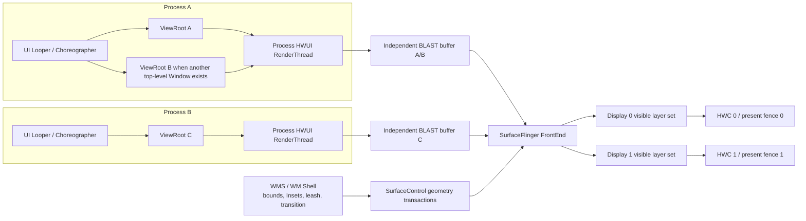

# Adaptive Layout、桌面窗口与多形态设备性能

## 版本口径与源码锚点

Adaptive UI 处理的是**当前应用窗口可用的空间、姿态和输入条件**。设备名称只能帮助产品沟通，不能代替运行时窗口信息：平板上的分屏窗口可能落入 Compact，手机连接桌面显示器后也可能进入 Large 或 Extra-large。

固定口径如下：

| 层级 | 版本锚点 | 说明 |
|---|---|---|
| Android 平台 | Android 17 / API 37 / `android-17.0.0_r1` | `ViewRootImpl`、WindowManager、WM Shell、BLAST、SurfaceFlinger 与 HWC 按该 tag 核查 |
| Android kernel | `android17-6.18-2026-06_r6` | 调度、cpuset 与 dma-fence 只说明公共 kernel 机制，不推断厂商 DPU/GPU 实现 |
| Compose UI | 1.11.4 稳定版 | Compose 独立发布，不随 API 37 一起定版 |
| Material 3 Adaptive | 1.2.0 稳定版 | 示例代码使用这一版公开 API；Large / Extra-large 需要显式开启 |
| Jetpack WindowManager | 1.5.1 稳定版 | `WindowInfoTracker`、`FoldingFeature` 与 `WindowMetricsCalculator` 按这一版说明 |

Material 3 Adaptive 1.3.0 候选版本已经调整部分窗口信息 API。生产项目若采用 1.3.x，应按该版本迁移说明改写调用；不能把 1.3.x 的弃用信息反推成 1.2.0 代码错误。

## 一、Window size class 描述窗口，不描述设备

### 1. 宽度有五档，高度有三档

当前官方窗口分类如下：

| 分类 | 当前窗口可用尺寸 |
|---|---|
| Compact width | `width < 600dp` |
| Medium width | `600dp ≤ width < 840dp` |
| Expanded width | `840dp ≤ width < 1200dp` |
| Large width | `1200dp ≤ width < 1600dp` |
| Extra-large width | `width ≥ 1600dp` |
| Compact height | `height < 480dp` |
| Medium height | `480dp ≤ height < 900dp` |
| Expanded height | `height ≥ 900dp` |

宽度适合决定导航形态、pane 数量和信息密度，高度仍不能省略。横屏手机或桌面上的矮窗口可能具有 Medium/Expanded 宽度和 Compact 高度，此时机械切成双 pane 会压缩触控区域、列表和详情内容。

Material 3 Adaptive 1.2.0 的 `currentWindowAdaptiveInfo()` 默认仍按 Compact、Medium、Expanded 三档计算。传入 `supportLargeAndXLargeWidth = true` 后，内部才会选择包含 1200dp 与 1600dp 断点的计算路径。`calculatePaneScaffoldDirective()` 在 Compact/Medium 下默认允许一个横向分区，在 Expanded 下允许两个；Large/Extra-large 分支最多允许三个。`calculatePaneScaffoldDirectiveWithTwoPanesOnMediumWidth()` 会让 Medium 进入双 pane，但源码文档也提醒，这会使内容过密，只适合产品确有需求的页面。

### 2. 分类变化和 resize 事件不是同一频率

自由窗口拖动时，原始约束可能连续变化；size class 只在跨越 600、840、1200、1600dp 等断点时变化。由此可以把高层页面模式限制为少数离散状态，却不能据此认为断点内没有布局成本：

- 父约束每次变化都可能触发 Compose measure/layout 或 View 的 traversal；
- 文本宽度、行数、Lazy 可见项、图片目标尺寸和 Insets 都可能在同一 size class 内变化；
- `remember` 保存计算结果或对象身份，不会阻止约束变化引发测量；
- `derivedStateOf` 只适合把高频可观察输入压成较少变化的派生状态，不是 resize 的通用加速器。

size class 应用于页面级决策。组件自身是否能排下按钮、图表或卡片内容，仍应使用组件收到的约束，而不是把整个窗口分类逐层传递到每个叶子节点。

### 3. Insets 和系统装饰仍占用内容空间

桌面 caption、状态栏、导航栏、显示缺口和 IME 会改变内容可用区域。窗口宽度达到 Expanded，不代表扣除 Insets 后每个 pane 都满足设计最小宽度。edge-to-edge 页面应统一消费 `WindowInsets`，避免 scaffold、pane 和叶子组件各自重复加 padding。

`LocalWindowInfo.current.containerSize`、平台 `WindowMetrics` 和布局阶段拿到的内容约束处于不同抽象层。页面模式可以由窗口级信息决定，具体 pane 的排版应以其测量约束为准。混用这些尺寸而不标明坐标空间，常会产生重复扣除 Insets 或把窗口尺寸当成内容尺寸的问题。

## 二、把自适应决策集中在页面入口

### 1. 稳定版依赖要按独立版本声明

下面的依赖用于 Compose canonical layout 和直接读取折叠特征。三个 adaptive artifact 保持同一版本，WindowManager 单独定版。

```kotlin
dependencies {
    implementation("androidx.compose.material3.adaptive:adaptive:1.2.0")
    implementation("androidx.compose.material3.adaptive:adaptive-layout:1.2.0")
    implementation("androidx.compose.material3.adaptive:adaptive-navigation:1.2.0")
    implementation("androidx.window:window:1.5.1")
}
```

版本目录或 Compose BOM 可以替代硬编码版本，但构建产物仍要能还原最终解析到的 artifact 版本。平台 API 37、Compose UI 和 adaptive library 不能共用一个“Android 17 版本”标签。

### 2. 一个页面只计算一次高层 directive

下面的片段展示稳定版 1.2.0 的 list-detail 入口。它显式启用五档宽度分类，把同一个 `PaneScaffoldDirective` 同时交给 navigator 和 scaffold；`ArticleList` 与 `ArticleDetail` 是页面自身的内容组件。

```kotlin
@OptIn(ExperimentalMaterial3AdaptiveApi::class)
@Composable
fun AdaptiveArticleRoute(
    articles: List<ArticleSummary>,
) {
    val adaptiveInfo =
        currentWindowAdaptiveInfo(
            supportLargeAndXLargeWidth = true,
        )
    val directive = calculatePaneScaffoldDirective(adaptiveInfo)
    val navigator =
        rememberListDetailPaneScaffoldNavigator<Long>(
            scaffoldDirective = directive,
        )
    val coroutineScope = rememberCoroutineScope()

    ListDetailPaneScaffold(
        directive = navigator.scaffoldDirective,
        value = navigator.scaffoldValue,
        listPane = {
            AnimatedPane {
                ArticleList(
                    articles = articles,
                    onArticleClick = { articleId ->
                        coroutineScope.launch {
                            navigator.navigateTo(
                                pane = ListDetailPaneScaffoldRole.Detail,
                                contentKey = articleId,
                            )
                        }
                    },
                )
            }
        },
        detailPane = {
            AnimatedPane {
                ArticleDetail(
                    articleId = navigator.currentDestination?.contentKey,
                )
            }
        },
    )
}
```

`rememberListDetailPaneScaffoldNavigator()` 使用可保存状态保存目的地历史，泛型 key 必须能写入 `Bundle`。示例使用 `Long`，不会把完整业务对象塞进保存状态。directive 随窗口信息变化时，navigator 会接收新值；列表数据和选中内容仍应由 ViewModel、仓库或其他页面状态持有。

`AnimatedPane` 提供 pane 进入、退出和适配动画。它不会自动降低图片解码、数据库查询或复杂内容组合的成本。窗口拖动期间若动画与资源加载重叠，应分别测量，并依据产品设计减少动画范围或停用不必要的过渡。

### 3. `BoxWithConstraints` 只处理组件级约束

`BoxWithConstraints` 基于 `SubcomposeLayout`。内容读取 `maxWidth`、`maxHeight` 等约束后，约束变化可能使该内容重新组合并再次测量。它适合卡片、工具栏、图表等局部组件，页面每一层都套一层会增加子组合与测量工作。

判断某个组件是否需要它，可以问三个问题：

- 分支是否只依赖这个组件收到的约束？
- 分支内是否执行了解析、排序、图片请求或其他不该处于组合阶段的工作？
- 父级已经给出明确模式时，子级能否直接接收枚举或数据，而不再重复分类？

Compose 的强跳过、稳定参数和 Lazy key 解决的是不同问题。强跳过影响可组合调用能否跳过，稳定 key 维护列表项身份；二者都不能取消父约束变化后的 measure/layout。

### 4. pane 迁移时保存的是用户状态

单 pane 与双 pane 往往使用不同的组合位置。即使数据 key 相同，内容从一个调用位置移动到另一个调用位置也可能创建新的组合实例。滚动位置、草稿、筛选条件和导航选择应有明确所有者：

- 业务数据和选中项放在 ViewModel 或业务状态容器；
- 短期 UI 状态使用 `rememberSaveable`，并确认 key 与保存策略；
- 多 pane 需要各自滚动位置时，按 pane/内容 ID 保存；
- Lazy 列表 key 使用不可变业务 ID，不使用索引或会变化的标题；
- 不因 size class 变化重新发起同一网络请求或清空导航历史。

“移动已有 UI”是视觉描述，不等于 Compose 会把整棵 slot table 无成本搬到新位置。性能目标应写成可验证的状态保留、组合范围和帧时间。

## 三、折叠姿态不是铰链角度

### 1. `FoldingFeature` 提供哪些信息

WindowManager 1.5.1 的 `FoldingFeature` 公开：

- `state`：`FLAT` 或 `HALF_OPENED`；
- `orientation`：`HORIZONTAL` 或 `VERTICAL`；
- `occlusionType`：`NONE` 或 `FULL`；
- `isSeparating`：显示特征是否把内容区域分成两个逻辑区域；
- `bounds`：该特征在当前窗口坐标空间中的边界。

它不提供连续 hinge angle。产品若需要角度传感器数据，必须使用设备明确支持的其他 API，并单独处理能力探测、权限、频率和兼容性；不能从 `HALF_OPENED` 推导一个固定角度。

Material 3 Adaptive 的 `WindowAdaptiveInfo` 已包含由窗口折叠特征计算出的 `Posture`。只做 canonical layout 时可直接使用这份信息。页面还要处理遮挡区域、相机预览或设备特定交互时，再直接订阅 `WindowInfoTracker`。

### 2. 订阅必须跟随当前 Activity 生命周期

下面的 Activity 片段只在 `STARTED` 及以上收集当前窗口的折叠特征，并保存在 Activity 局部的 `StateFlow`。每次开始收集前先清除旧值，Activity 重建后也会为新实例建立新的 Flow 订阅。

```kotlin
class FoldAwareActivity : ComponentActivity() {
    private val _foldingFeature = MutableStateFlow<FoldingFeature?>(null)
    val foldingFeature: StateFlow<FoldingFeature?> =
        _foldingFeature.asStateFlow()

    override fun onCreate(savedInstanceState: Bundle?) {
        super.onCreate(savedInstanceState)

        lifecycleScope.launch {
            repeatOnLifecycle(Lifecycle.State.STARTED) {
                _foldingFeature.value = null
                try {
                    WindowInfoTracker
                        .getOrCreate(this@FoldAwareActivity)
                        .windowLayoutInfo(this@FoldAwareActivity)
                        .map { layoutInfo ->
                            layoutInfo.displayFeatures
                                .filterIsInstance<FoldingFeature>()
                                .firstOrNull()
                        }
                        .distinctUntilChanged()
                        .collect { feature ->
                            _foldingFeature.value = feature
                        }
                } finally {
                    _foldingFeature.value = null
                }
            }
        }
    }
}
```

`windowLayoutInfo(activity)` 的首次发射时机和设备实现有关，页面要允许暂时没有 `FoldingFeature`。Flow 与 Activity 的窗口上下文关联，不应缓存到跨 Activity 的单例后长期复用。页面可在 Compose 中按生命周期收集公开的 `StateFlow`；业务数据仍由 ViewModel 管理。一个窗口也可能报告多个 display feature；示例只取一个是业务约束，不是 API 的全局保证。

### 3. posture 和内容状态分开

窗口姿态只决定内容如何摆放，不决定内容是否存在。列表选择、表单输入、媒体位置和文档编辑状态不应被 `FLAT ↔ HALF_OPENED` 变化重置。可把页面输入拆成两组：

| 状态 | 示例 | 推荐所有者 |
|---|---|---|
| 内容状态 | 选中 ID、草稿、滚动位置、加载结果 | ViewModel、SavedStateHandle、保存状态容器 |
| 布局状态 | size class、posture、Insets、pane directive | 当前窗口/组合生命周期 |

这种拆分也便于性能分析：内容状态没有变化却发生大量业务计算，说明布局事件泄漏进了数据处理；内容状态发生变化时，则应按业务更新链路分析。

## 四、resize 会同时改变应用内容和系统几何

### 1. 单窗口标准路径

普通 View 或 Compose 页面仍走标准 App Window：

`Choreographer#doFrame` → `ViewRootImpl` traversal → HWUI RenderThread → 窗口 BLAST buffer → SurfaceFlinger → 目标 Display 的 HWC → present fence。

约束变化可能让 Compose 重新组合、测量、布局和记录绘制命令，也可能只触发其中一部分。`ViewRootImpl.performTraversals()` 只有在尺寸、可见性、Insets、LayoutParams、surface 等条件命中时才通过 `IWindowSession.relayout()` 进入 WMS；稳定内容帧不会固定执行一次 relayout。

### 2. Window、进程和 Display 要分别建模

下面的图用于区分应用内容 buffer、WMS/Shell 几何状态和每个 Display 的 present。它覆盖同进程多窗口与跨进程窗口，不把屏幕上的两个 pane 直接等同为两个 Window。



同一 UI Looper 上的多个 `ViewRootImpl` 共享 Choreographer callback 队列，同进程硬件窗口还共享进程级 RenderThread；它们各自拥有窗口 Surface 和 buffer 周转。不同进程有独立 UI/RenderThread 执行，但位于同一 Display 时仍共享 SurfaceFlinger、GPU/内存带宽、HWC plane 和 display deadline。

双栏 Compose/View 布局通常仍只有一个顶层 Window 和一个 App Window buffer。Activity Embedding、Dialog、Popup、PiP、自由窗口或多实例则要从实际的 pid、UI tid、`ViewRootImpl`、`WindowState`、SF layer 与 `displayId` 判断，不能根据视觉形态猜测。

### 3. geometry、buffer 和 present 是三个时间点

resize 或 transition 期间，系统同时处理：

- Task/window bounds、leash position/crop 等 geometry；
- 应用按新约束绘制的 App Window buffer；
- SurfaceFlinger 为目标 Display 选择可见 layer 并完成本轮 present。

过渡阶段可能出现新 geometry 配旧 buffer，系统将旧内容缩放或用 snapshot/starting window 覆盖应用重绘间隙。WMS 的 `BLASTSyncEngine` 可以等待注册进同步组的 WindowContainer draw/transaction，公开的 `SurfaceSyncGroup` 则面向应用或嵌入 Surface；两者不会替未注册的 Camera、codec 或引擎 Producer 建立业务时刻关系。

应用 `queueBuffer()` 返回只说明 Producer 已提交 buffer。GPU completion fence 可能尚未 signal，SurfaceFlinger 也可能尚未 latch，该内容更没有因此完成目标 Display 的 present。把 resize 卡顿全部归给 Compose measure，或只因应用帧正常便排除显示端，都缺少完整证据。

### 4. 每个 Display 有自己的结果

窗口移动到外接屏后，密度、刷新率、色彩模式、Insets、HWC 能力和输入路由都可能变化。SurfaceFlinger 按 Display 建立可见 layer 集合，HWC 策略与 present fence 也按 Display 产生。默认屏正常不能证明外接屏正常；同一进程的两个窗口也不要求在两个屏幕同时 present。

公共 kernel tag 可用于解释线程调度、cpuset 和 dma-fence 的通用语义。某台设备的 overlay plane、DPU scaler、GPU 调度或显示驱动延迟仍需 vendor trace、设备配置和实际 fence 证据。

## 五、Android 17 让固定方向假设失效

Android 16 为 target 36 应用引入大屏方向、宽高比和可调整大小限制被忽略的行为，同时保留临时开发者退出方式。Android 17 对 target 37 应用移除了这项退出能力。

在官方称为 `sw600dp` 的大屏范围内，以下配置或调用不能再作为布局前提：

- `screenOrientation` 的 portrait/landscape 系列固定值；
- `setRequestedOrientation()` 对应的固定方向值；
- `resizeableActivity`；
- `minAspectRatio` 与 `maxAspectRatio`。

游戏类别、低于 `sw600dp` 的屏幕以及用户在设备宽高比设置中明确选择应用默认行为属于官方列出的例外。设备厂商的 desktop windowing 能力和窗口策略也存在差异，验收记录要包含设备与窗口模式。

这项变化没有替换 `ViewRootImpl`、BLAST 或 SurfaceFlinger 渲染主线。它提高了应用遇到旋转、自由 resize、分屏和多种宽高比的概率。兼容工作的重点包括：

- 不以固定 portrait 尺寸初始化导航、相机预览或画布；
- Activity 重建后恢复输入、选中项、滚动位置和导航历史；
- 自行处理配置变化时，逐项验证资源、Insets、密度和窗口状态更新；
- 相机预览使用传感器方向、目标旋转和 `Matrix` 变换，不把设备自然方向当成窗口方向；
- 动画起止位置按当前 bounds 计算，避免沿用启动时缓存的屏幕宽高。

## 六、大屏成本由实际窗口和内容决定

### 1. 面板分辨率不等于 App Window buffer 尺寸

3840×2160 的像素数是 1920×1080 的四倍，但应用工作量不能只由显示器标称分辨率推出。窗口可能只占屏幕一部分，系统可能使用不同渲染尺度，HWC 也可能把部分 layer 交给硬件合成。应记录：

- 当前窗口 bounds、density 和实际 buffer 尺寸；
- 可见区域与裁剪；
- overdraw、模糊、阴影、透明混合和离屏层；
- SurfaceFlinger 的 CLIENT/DEVICE composition 结果；
- GPU、内存带宽和 HWC 限制。

同一页面在更大窗口中常会显示更多列表项、文字、图片和 pane。节点数量和像素填充可能同时增加，也可能只有其中一项增加。性能报告应使用 trace、GPU 工具和内存数据描述实际变化，不写“进入大屏就固定增加四倍成本”。

### 2. 图片按展示目标请求

resize 时同步解码最大尺寸图片会占用 CPU、堆内存和主线程时间。图片管线应：

- 根据目标展示尺寸请求合适采样结果；
- 把磁盘读取与解码移出主线程；
- 对快速变化的尺寸做请求合并或选择有限的尺寸档；
- 取消已离开可见区域的请求；
- 为内存缓存设定与设备、页面和并发窗口相符的上限；
- 区分缩略图、预览和原图，不在每个拖动像素上创建新原图请求。

窗口变大后立即加载更高分辨率资源是否合适，取决于内容清晰度、网络与内存目标。可以在 resize 稳定后升级图片，也可以保留已有预览并异步替换；两种策略都应检查闪烁、峰值内存和无障碍缩放。

### 3. 更多 pane 会扩大活跃工作集

双 pane 或三 pane 可能同时保留列表、详情、辅助内容、导航与动画。Lazy 容器只组合可见项，不代表所有 pane 的状态、图片和订阅都会自动暂停。应检查：

- 不可见 pane 是否仍在运行动画或定时刷新；
- 详情切换是否保留过多大图和文本布局；
- 多个 pane 是否重复订阅同一热流并执行相同转换；
- 预取范围是否因窗口变大而没有上限；
- 关闭 pane 后，业务缓存和组合状态何时释放。

缓存策略要围绕可重复使用的数据与明确容量设计，不能把窗口扩展理解为允许无限保留内容。

## 七、多窗口生命周期和输入不能只看 `onPause()`

多窗口与 multi-resume 下，多个 Activity 可能处于 `RESUMED`，只有一个是 top-resumed；可见窗口也可能没有输入焦点。播放器、相机、动画、协作光标和轮询任务应综合：

- Lifecycle 状态；
- 窗口可见性与遮挡；
- top-resumed 状态；
- input focus；
- 独占硬件可用性；
- 用户是否要求继续播放、采集或同步。

“失去焦点便停止全部工作”会中断仍需显示的内容，“只在 `onPause()` 降载”又可能让后台可见窗口持续高频刷新。策略应按业务类型定义，并在分屏切焦点、PiP、桌面多实例和外接屏中验证。

### 桌面窗口的多实例、拖拽与共享状态

桌面窗口化会让同一应用同时拥有多个 task，甚至跨显示器展示同一业务对象。`PROPERTY_SUPPORTS_MULTI_INSTANCE_SYSTEM_UI` 只允许系统 UI 提供新窗口入口，不会自动解决 launch mode、路由、草稿冲突和数据库并发。状态应拆成三层：实例内的滚动/选择/pane 状态、由 repository 管理并带 revision/事务的共享业务状态，以及可共享但不能隐含“当前窗口”的进程级缓存与连接池。

跨窗口拖拽只在回调里传递轻量 `ClipData`、URI 和授权；MIME 校验、Bitmap 解码、缩略图与导入事务放后台。Android 15 的同应用跨窗口 drag flag 与未处理 drop 的 `IntentSender` 入口也需要重新经过 task 路由和权限验证，不能把大对象序列化进 Intent 或 Binder。

同一进程的多个 Window 各有 `ViewRootImpl` 和 buffer 周转，却可能共享 UI Looper 与进程级 RenderThread。窗口 B 自身的 `DrawFrame` 很短，也可能排在窗口 A 的长任务之后错过 deadline；跨显示器则要分别记录 `displayId`、density、刷新率、color mode 和每屏 present。连接/断开外屏、跨屏拖动、最大化/还原、输入焦点切换都应作为独立用例。

桌面窗口还要覆盖鼠标 hover、滚轮、右键、键盘快捷键、Tab 焦点和 caption Insets。WindowManager 1.6 alpha 才引入的精确指针 engagement API 不属于 1.5.1 稳定基线，不能用 alpha API 描述稳定版实现。

## 八、资源限定符只处理稳定的资源差异

`sw<N>dp`、`w<N>dp`、方向、密度等限定符适合选择资源，但它们与运行时窗口分类并不完全等价：

- `sw<N>dp` 描述配置中的 smallest width，不随每次自由窗口宽度变化；
- `w<N>dp` 更接近当前可用宽度，但资源重选仍经过 Configuration/Resources 路径；
- Compose window size class 是运行时窗口布局输入；
- 组件测量约束描述的是局部可用空间。

同一项目可以同时使用这些机制，但每一种只处理自己的层级。间距、最小 pane 宽度和列数可以由 token/values 资源表达；页面结构由 size class/posture 决定；组件内部由约束完成排版。复制多份完整布局会增加维护与状态恢复难度，也容易让某个资源桶长期无人测试。

检查资源时应覆盖横竖屏、分屏、自由窗口、字体缩放、显示缩放、外接屏和 locale。图片资源目录不应成为运行时图片尺寸策略的唯一输入。

## 九、测试要拆开视觉正确性和帧性能

### 1. 尺寸测试组合覆盖断点两侧

每个关键页面至少覆盖：

| 维度 | 建议样本 |
|---|---|
| 宽度断点 | 599/600dp、839/840dp、1199/1200dp、1599/1600dp |
| 高度断点 | 479/480dp、899/900dp |
| 窗口行为 | 旋转、分屏进入/退出、自由 resize、最大化/还原 |
| 折叠行为 | FLAT、HALF_OPENED、分隔/遮挡特征、内外屏切换 |
| 显示拓扑 | 内屏、外接屏、跨屏移动、不同刷新率/密度 |
| 输入 | 触摸、鼠标、键盘、焦点切换、IME |
| 状态恢复 | Activity 重建、进程恢复、多实例、Display 断开 |

Preview、Compose UI Check、`DeviceConfigurationOverride` 和 screenshot test 适合验证布局。它们不能证明真实设备上的 UI/RenderThread、GPU、SurfaceFlinger 或 HWC 帧时间。

### 2. Macrobenchmark 只测可重复的用户操作

启动、滚动、pane 导航和预设尺寸切换适合自动化 benchmark。连续拖动 desktop window 的系统手势在不同设备和 Shell 实现上不一定可重复，此时应使用固定环境的脚本化操作，或在手工操作外层采集 Perfetto，并记录每次窗口 bounds。

每组性能数据应记录设备、Android tag/构建、target SDK、adaptive/Compose 版本、窗口尺寸、density、displayId、刷新率、温度、编译模式、Baseline Profile 和输入脚本。只给一组平均帧率，无法解释断点切换或 resize 中的短时异常。

### 3. FrameTimeline 要按 SurfaceFrame 和 DisplayFrame 读取

下面的 PerfettoSQL 用于比较目标应用窗口的 expected/actual SurfaceFrame。`$target_upid` 和 `$layer_glob` 必须由本次 trace 的目标进程与窗口 layer 确定，不能用包名模糊匹配整个系统。

```sql
WITH actual_app AS (
  SELECT
    upid,
    surface_frame_token,
    display_frame_token,
    layer_name,
    ts AS actual_start_ns,
    ts + dur AS actual_end_ns,
    jank_type,
    present_type
  FROM actual_frame_timeline_slice
  WHERE upid = $target_upid
    AND surface_frame_token != 0
    AND layer_name GLOB $layer_glob
),
expected_app AS (
  SELECT
    upid,
    surface_frame_token,
    ts AS expected_start_ns,
    ts + dur AS expected_end_ns
  FROM expected_frame_timeline_slice
  WHERE upid = $target_upid
    AND surface_frame_token != 0
)
SELECT
  a.surface_frame_token,
  a.display_frame_token,
  a.layer_name,
  e.expected_start_ns,
  e.expected_end_ns,
  a.actual_start_ns,
  a.actual_end_ns,
  a.actual_end_ns - e.expected_end_ns AS overrun_ns,
  a.jank_type,
  a.present_type
FROM actual_app AS a
JOIN expected_app AS e
  USING (upid, surface_frame_token)
ORDER BY a.actual_start_ns;
```

`overrun_ns > 0` 表示 actual end 晚于 expected end，不直接给出原因。应用 SurfaceFrame 异常时回到 UI、RenderThread、GPU、buffer 和 fence；应用按时但对应 `display_frame_token` 的 DisplayFrame 异常时，再检查 WMS/Shell transaction、SurfaceFlinger、client composition、HWC 与目标屏 present。

同一进程有多个 Window 时，要把 layer、`ViewRootImpl` 和 buffer queue 分开；同一 Display 有多个进程时，要分别证明每个应用是否按时提交。`BufferTX`、FrameTimeline token、layer snapshot 和 present fence 共同构成证据，单个 slice 名不足以定位责任模块。

### 4. resize trace 的复原顺序

1. 记录异常发生的 `displayId`、窗口 bounds 与目标 present。
2. 列出可见 Window、transition leash、caption/IME 和 SF layer。
3. 为每个 Window 标明 pid、UI tid、RenderThread、`ViewRootImpl` 与 BLAST layer。
4. 查看 Compose/View 是否发生组合、measure/layout/draw，是否伴随业务计算、GC 或同步 I/O。
5. 对齐 configuration、relayout、WCT、WMS sync 与 Shell transition。
6. 区分 geometry transaction 和 App Window buffer 在哪个 DisplayFrame 生效。
7. 检查 acquire/release/present fence 与 HWC composition strategy。
8. 找到最早偏离目标时间线的对象，再决定优化应用、Shell/WMS、SF/HWC 或设备驱动。

## 十、常见误判

| 现象 | 先查什么 | 不能直接下的结论 |
|---|---|---|
| 跨过 840dp 时卡一下 | pane 数量、组合/测量、图片请求、过渡动画 | `WindowSizeClass` 分类计算很重 |
| 断点内拖动仍持续 measure | 父约束、文本换行、Lazy 可见项、Insets | size class 没变就不应布局 |
| 双 pane 页面只有一个 `DrawFrame` | 是否只是同一 Window 内两个普通 pane | 系统漏画了第二个窗口 |
| Dialog 出现后主窗延迟 | 同 UI callback 顺序、共享 RenderThread、Display layer 集合 | Dialog 面积小，不影响主窗 |
| `queueBuffer()` 按时 | acquire fence、SF latch、DisplayFrame、present | 用户已经看到该帧 |
| 外接屏慢、内屏正常 | displayId、mode、HWC、每屏 present fence | 同进程窗口应同时显示 |
| 折叠后详情重新加载 | 内容状态所有者、组合位置、保存状态 key | `FoldingFeature` 自动清空状态 |
| 4K 显示器 GPU 升高 | 实际 buffer、窗口面积、overdraw、CLIENT composition | 分辨率必然带来固定四倍耗时 |
| 非焦点窗口仍在刷新 | lifecycle、top-resumed、可见性和业务策略 | `onPause()` 一定会停止它 |
| target 37 大屏方向变化 | 固定方向限制被忽略、Activity 重建、资源与 Insets | Android 17 更换了显示管线 |

## 十一、提交前检查清单

- [ ] 平台结论固定到 Android 17 / API 37 / `android-17.0.0_r1`
- [ ] kernel 结论固定到 `android17-6.18-2026-06_r6`
- [ ] 记录 Compose UI、Material 3 Adaptive 与 WindowManager 的独立版本
- [ ] 页面按当前 Window 分类，不使用 `isTablet` 代替窗口信息
- [ ] 五档宽度分类已明确选择，Large/Extra-large 没有被默认三档吞并
- [ ] Compact height 下的横屏和矮窗口有单独验收
- [ ] 页面级 directive 只在高层计算，组件级约束留给组件处理
- [ ] `BoxWithConstraints` 内没有数据库、网络、同步解码或高成本解析
- [ ] pane 切换不清空选中项、表单、滚动位置和导航历史
- [ ] `FoldingFeature` 没有被当成连续 hinge angle
- [ ] WindowInfoTracker 订阅与当前 Activity 生命周期绑定
- [ ] 图片请求按展示目标、可见性和缓存容量设计
- [ ] 多窗口任务综合 lifecycle、top-resumed、focus 与业务意图
- [ ] Android 17 target 37 的方向、宽高比和 resizability 行为已测试
- [ ] resize trace 区分 geometry、buffer 与 present
- [ ] 多 Window 标出 pid/tid/ViewRoot/layer，多 Display 分别看 present fence
- [ ] 视觉测试、Macrobenchmark 和 Perfetto 各自回答对应问题

## 参考资料

- [Android 17：方向、可调整大小和宽高比限制被忽略](https://developer.android.com/about/versions/17/changes/ff-restrictions-ignored)
- [Android 17 target 37 行为变更](https://developer.android.com/about/versions/17/behavior-changes-17)
- [窗口尺寸分类](https://developer.android.com/develop/adaptive-apps/guides/use-window-size-classes)
- [Adaptive layout 入门](https://developer.android.com/develop/adaptive-apps/guides/get-started-with-adaptive-apps)
- [List-detail canonical layout](https://developer.android.com/develop/adaptive-apps/guides/list-detail)
- [折叠屏窗口特征](https://developer.android.com/develop/adaptive-apps/guides/foldables/make-your-app-fold-aware)
- [`FoldingFeature` API](https://developer.android.com/reference/androidx/window/layout/FoldingFeature)
- [`WindowInfoTracker` API](https://developer.android.com/reference/androidx/window/layout/WindowInfoTracker)
- [桌面窗口支持](https://developer.android.com/develop/adaptive-apps/guides/support-desktop-windowing)
- [Material 3 Adaptive 1.2.0 发布说明](https://developer.android.com/jetpack/androidx/releases/compose-material3-adaptive)
- [WindowManager 1.5.1 发布说明](https://developer.android.com/jetpack/androidx/releases/window)
- [Perfetto FrameTimeline](https://perfetto.dev/docs/data-sources/frametimeline)
- [`WindowAdaptiveInfo.kt`（Material 3 Adaptive 1.2.0）](https://android.googlesource.com/platform/frameworks/support/+/bda0327f6fc5c110aeed6f8802d8e5210cdefc38/compose/material3/adaptive/adaptive/src/commonMain/kotlin/androidx/compose/material3/adaptive/WindowAdaptiveInfo.kt)
- [`PaneScaffoldDirective.kt`（Material 3 Adaptive 1.2.0）](https://android.googlesource.com/platform/frameworks/support/+/bda0327f6fc5c110aeed6f8802d8e5210cdefc38/compose/material3/adaptive/adaptive-layout/src/commonMain/kotlin/androidx/compose/material3/adaptive/layout/PaneScaffoldDirective.kt)
- [`ThreePaneScaffoldNavigator.kt`（Material 3 Adaptive 1.2.0）](https://android.googlesource.com/platform/frameworks/support/+/bda0327f6fc5c110aeed6f8802d8e5210cdefc38/compose/material3/adaptive/adaptive-navigation/src/commonMain/kotlin/androidx/compose/material3/adaptive/navigation/ThreePaneScaffoldNavigator.kt)
- [`FoldingFeature.kt`（WindowManager 1.5.1）](https://android.googlesource.com/platform/frameworks/support/+/be8b763fe78ab805aa1c9a3bff09f1ff8081dbb2/window/window/src/main/java/androidx/window/layout/FoldingFeature.kt)
- [`WindowInfoTracker.kt`（WindowManager 1.5.1）](https://android.googlesource.com/platform/frameworks/support/+/be8b763fe78ab805aa1c9a3bff09f1ff8081dbb2/window/window/src/main/java/androidx/window/layout/WindowInfoTracker.kt)
- [`ViewRootImpl.java`（Android 17）](https://android.googlesource.com/platform/frameworks/base/+/refs/tags/android-17.0.0_r1/core/java/android/view/ViewRootImpl.java)
- [`Choreographer.java`（Android 17）](https://android.googlesource.com/platform/frameworks/base/+/refs/tags/android-17.0.0_r1/core/java/android/view/Choreographer.java)
- [`RenderThread.cpp`（Android 17）](https://android.googlesource.com/platform/frameworks/base/+/refs/tags/android-17.0.0_r1/libs/hwui/renderthread/RenderThread.cpp)
- [`BLASTSyncEngine.java`（Android 17）](https://android.googlesource.com/platform/frameworks/base/+/refs/tags/android-17.0.0_r1/services/core/java/com/android/server/wm/BLASTSyncEngine.java)
- [`BLASTBufferQueue.cpp`（Android 17）](https://android.googlesource.com/platform/frameworks/native/+/refs/tags/android-17.0.0_r1/libs/gui/BLASTBufferQueue.cpp)
- [`SurfaceFlinger.cpp`（Android 17）](https://android.googlesource.com/platform/frameworks/native/+/refs/tags/android-17.0.0_r1/services/surfaceflinger/SurfaceFlinger.cpp)
- [`HWComposer.cpp`（Android 17）](https://android.googlesource.com/platform/frameworks/native/+/refs/tags/android-17.0.0_r1/services/surfaceflinger/DisplayHardware/HWComposer.cpp)
- [`kernel/sched/core.c`（android17-6.18-2026-06_r6）](https://android.googlesource.com/kernel/common/+/refs/tags/android17-6.18-2026-06_r6/kernel/sched/core.c)
- [`dma-fence.c`（android17-6.18-2026-06_r6）](https://android.googlesource.com/kernel/common/+/refs/tags/android17-6.18-2026-06_r6/drivers/dma-buf/dma-fence.c)
