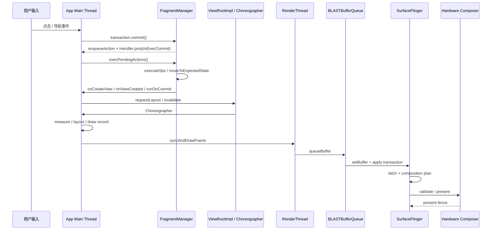

# 22.12 FragmentTransaction 提交链路与页面切换性能

Fragment 页面切换的耗时，不能只看 `commit()` 调用点。`commit()` 多数时候只把事务放进 `FragmentManager` 的待执行队列；页面是否创建 View、何时触发布局、是否挤占下一帧，取决于后续 `execPendingActions()` 这段主线程工作。做页面切换性能排查时，要把 Fragment 事务、View inflate / layout、动画和帧观测放到同一条时间线上看；Android 12+ 可以用 FrameTimeline，Android 10/11 设备则退回 Choreographer / RenderThread 切片和自定义 trace。

现代应用的 Fragment 性能排查应以 AndroidX Fragment 为准。平台 `android.app.Fragment` 已废弃，不再作为新代码优化对象。

源码分两组锚定：Fragment 事务实现固定到 AndroidX `androidx-fragment-release` 的提交 `f39ca3510efb2347ebfef231e25a3e804922450d`；`Choreographer`、`ViewRootImpl`、HWUI、BLASTBufferQueue 与 SurfaceFlinger 固定到 Android 17 / API 37 的 `android-17.0.0_r1`。涉及线程调度时只按 `android17-6.18-2026-06_r6` 解释可观察机制，不从 platform 或 kernel tag 反推独立发布的 AndroidX Fragment 行为。

## `commit()` 只排队，事务执行在后一个主线程消息里

AndroidX 的 `BackStackRecord` 是 `FragmentTransaction` 的具体实现。`commit()`、`commitAllowingStateLoss()` 和 `commitNow()` 的分叉点很早：前两者走 `commitInternal(..., true)`，把当前事务交给 `FragmentManager.enqueueAction()`；`commitNow()` 跳过待执行队列，直接走 `execSingleAction()`。

源码骨架如下，只看三个分支就够：

```java
@Override
public int commit() {
    return commitInternal(false, true);
}

@Override
public int commitAllowingStateLoss() {
    return commitInternal(true, true);
}

@Override
public void commitNow() {
    disallowAddToBackStack();
    mManager.execSingleAction(this, false);
}
```

`commitInternal()` 内部会检查重复提交、分配 back stack index，然后在 `commitAction == true` 时进入 `FragmentManager.enqueueAction()`：

```java
int commitInternal(boolean allowStateLoss, boolean commitAction) {
    if (mCommitted) {
        throw new IllegalStateException("commit already called");
    }
    mCommitted = true;
    if (mAddToBackStack) {
        mIndex = mManager.allocBackStackIndex();
    } else {
        mIndex = -1;
    }
    if (commitAction) {
        mManager.enqueueAction(this, allowStateLoss);
    }
    return mIndex;
}
```

`enqueueAction()` 才是异步语义的落点。事务被加入 `mPendingActions` 后，`scheduleCommit()` 通过宿主 `Handler` 投递 `mExecCommit`：

```java
void enqueueAction(@NonNull OpGenerator action, boolean allowStateLoss) {
    if (!allowStateLoss) {
        if (mHost == null) {
            throw new IllegalStateException("FragmentManager has not been attached to a host.");
        }
        checkStateLoss();
    }
    synchronized (mPendingActions) {
        if (mHost == null) {
            if (allowStateLoss) {
                return;
            }
            throw new IllegalStateException("Activity has been destroyed");
        }
        mPendingActions.add(action);
        scheduleCommit();
    }
}

void scheduleCommit() {
    synchronized (mPendingActions) {
        boolean pendingReady = mPendingActions.size() == 1;
        if (pendingReady) {
            mHost.getHandler().removeCallbacks(mExecCommit);
            mHost.getHandler().post(mExecCommit);
            updateOnBackPressedCallbackEnabled();
        }
    }
}
```

从性能排查看，有两个结论：

- `commit()` 返回快，不代表页面切换便宜。View 创建、生命周期推进、动画准备、特殊效果控制器执行，都在后面的主线程消息里发生。
- 多次连续 `commit()` 可能被同一个 `execPendingActions()` 批处理。排查 trace 时，不能只找某个业务点击回调中的 `commit()`，还要找后续主线程消息中的生命周期和 inflate 耗时。

## 四种提交 API 的边界

| API | 执行方式 | back stack | 状态保存后的行为 | 性能风险 |
|---|---|---|---|---|
| `commit()` | 异步排队，后续主线程消息执行 | 支持 | `isStateSaved()` 后提交会抛异常 | 调用点轻，但后续可能集中执行多笔事务 |
| `commitAllowingStateLoss()` | 异步排队 | 支持 | 允许状态丢失；宿主不可用时可能丢弃事务 | UI 状态可能与恢复状态不一致，不应用来规避性能问题 |
| `commitNow()` | 当前主线程同步执行当前事务 | 不支持；源码会 `disallowAddToBackStack()` | 状态保存后提交会抛异常 | 生命周期、inflate、layout 请求都压在当前调用栈里 |
| `executePendingTransactions()` | 调用 `execPendingActions(true)`，随后 `forcePostponedTransactions()` | 支持 | 允许 state loss 路径；会强制启动 postponed transaction | 容易把别处排队的事务一起执行，时序副作用比 `commitNow()` 大 |

官方文档对 `commitNow()` 的描述很直接：如果只想同步提交一个不修改 back stack 的事务，优先用 `commitNow()`，不要用 `commit()` 加 `executePendingTransactions()`，后者会尝试提交当前所有 pending transaction。

工程上可以按这条规则选：需要进入返回栈的页面切换走 `commit()`；必须同步拿到 Fragment View 的局部组件初始化，可以考虑 `commitNow()`；通用导航路径不要调用 `executePendingTransactions()` 来追求同步完成。

`executePendingTransactions()` 还有两个容易漏掉的边界。第一，它传入 `allowStateLoss = true` 执行 `execPendingActions(true)`，语义覆盖当前所有 pending transaction。第二，它会在 pending action 执行后调用 `forcePostponedTransactions()`，把 postponed transaction 推进到开始状态。页面切换期间如果已有 Navigation Component、child FragmentManager 或其他模块排队事务，这个调用会把它们一起带进当前主线程窗口。

## `execPendingActions()`：一次清空 pending action 的主线程批处理

`mExecCommit` 被 `Handler.post()` 后，主线程会调用 `execPendingActions(true)`。执行前，`ensureExecReady()` 做三类保护：

- `mExecutingActions` 不能为 true，避免事务执行过程中递归执行事务。
- 当前线程必须是宿主 `Handler` 所在线程，否则抛出 “Must be called from main thread of fragment host”。
- 未允许 state loss 时执行 `checkStateLoss()`，避免宿主状态保存后继续修改 Fragment 状态。

源码骨架如下：

```java
private void ensureExecReady(boolean allowStateLoss) {
    if (mExecutingActions) {
        throw new IllegalStateException("FragmentManager is already executing transactions");
    }
    if (mHost == null) {
        throw new IllegalStateException("FragmentManager has not been attached to a host.");
    }
    if (Looper.myLooper() != mHost.getHandler().getLooper()) {
        throw new IllegalStateException("Must be called from main thread of fragment host");
    }
    if (!allowStateLoss) {
        checkStateLoss();
    }
}
```

`execPendingActions()` 之后进入循环：从 `mPendingActions` 取出所有 `OpGenerator`，生成 `BackStackRecord` 列表，再调用 `removeRedundantOperationsAndExecute()`：

```java
boolean execPendingActions(boolean allowStateLoss) {
    ensureExecReady(allowStateLoss);

    boolean didSomething = false;
    while (generateOpsForPendingActions(mTmpRecords, mTmpIsPop)) {
        mExecutingActions = true;
        try {
            removeRedundantOperationsAndExecute(mTmpRecords, mTmpIsPop);
        } finally {
            cleanupExec();
        }
        didSomething = true;
    }

    updateOnBackPressedCallbackEnabled();
    doPendingDeferredStart();
    mFragmentStore.burpActive();
    return didSomething;
}
```

`generateOpsForPendingActions()` 会在同步块内遍历 `mPendingActions`，再清空队列并移除已投递的 `mExecCommit`。这解释了一个常见现象：一次页面点击只写了一次 `commit()`，trace 中却出现多个 Fragment 的生命周期推进。原因通常是此前已有事务排队，或 Navigation / child FragmentManager 也投递了事务。

这段代码对应到性能排查，重点不该停在“FragmentManager 慢”这个结论，而要继续拆它把哪些操作集中到了同一个主线程消息里：`onCreate()`、`onCreateView()`、ViewBinding inflate、RecyclerView adapter 初始化、图片首批 decode、`onViewCreated()` 里的同步 I/O、child Fragment 的嵌套事务，都会被这个消息一起吞掉。

## Fragment 事务与一帧渲染的时序

Fragment 事务不属于 `Choreographer#doFrame` 的固定阶段。它是主线程消息队列中的普通工作；事务执行完后，新增或变更的 View 才会在后续 traversal 中参与 measure / layout / draw。和 [§18.2 Android View 标准管线](../../part2-performance/ch18-rendering-pipelines/02-android-view-standard.md) 合起来看，典型时序是：



图中的 `BBQ` 是 App Window 使用的 BLASTBufferQueue，`HWC` 是 Hardware Composer。Android 17 标准 HWUI 窗口中，RenderThread 的 `queueBuffer()` 只把 buffer 和 producer completion fence 交给 BLAST；App 进程内的 BLAST Consumer 再把 buffer 变成 `SurfaceControl.Transaction`。`queueBuffer()` 返回、transaction 到达 SF、SF latch、HWC present 是四个不同边界，任一前置信号都不能单独证明画面已经显示。

页面切换卡顿经常“不在 `doFrame` 里”，原因就在这里：Fragment 的生命周期和 inflate 可能发生在 `mExecCommit` 对应的主线程消息中。如果这段消息执行 30ms，下一次 `Choreographer#doFrame` 的开始时间已经被推迟。Perfetto 的 FrameTimeline 可能标出对应帧错过 deadline，但耗时根因仍在 `doFrame` 前面的 Fragment 消息。

FrameTimeline 要分开读 App `SurfaceFrame` 和 SF `DisplayFrame`。Expected Timeline 表示预测的时间预算，Actual Timeline 记录该帧在对应阶段经历的时间；App actual `SurfaceFrame` 的结束位置会综合 buffer post 与 GPU completion，SF `DisplayFrame` 才继续覆盖 latch、合成和 present。App actual 超期可以说明应用侧未按 deadline 交帧，不能替代 SF actual、目标 layer latch 与 present fence 来证明最终显示结果。

这个观察点只适用于 Android 12 / API 31+。Android 10/11 设备没有 `android.surfaceflinger.frametimeline` 数据源，排查时要退回 `Choreographer#doFrame`、`performTraversals`、RenderThread 切片和业务 trace。

排查时应同时看三段：

- `mExecCommit` 所在主线程消息：看是否有 Fragment 生命周期、inflate、同步读取配置、数据库或磁盘访问。没有自定义 trace 时，可以打开 Java/Kotlin callstack sampling，或在关键生命周期加 `Trace.beginSection()`。
- 后续 `Choreographer#doFrame`：看 traversal 内的 measure / layout / draw 是否因为新页面 View 树过重而超时，详见 [§18.2 Android View 标准管线](../../part2-performance/ch18-rendering-pipelines/02-android-view-standard.md)。
- RenderThread / FrameTimeline（Android 12+）：看提交后的 `syncFrameState`、`dequeueBuffer`、GPU work 或 SurfaceFlinger 合成是否继续放大卡顿；Android 10/11 先看 RenderThread 切片和自定义 trace，详见 §13.3。

## `runOnCommit()` 的边界：事务执行完成，不等于帧已绘制

`runOnCommit()` 常被用来“等 Fragment 提交完成后再做事”。它的边界比名字更窄：它只保证 transaction 已经执行，不保证这一帧已经完成绘制，也不保证 Fragment 已经完成异步数据加载。

AndroidX 文档写得很清楚：如果事务启用了 reordering，`runOnCommit()` 可能在后续事务也执行之后才运行，当前事务中的某些操作也可能因为批处理优化被移除；它不能与 `addToBackStack()` 共用，因为 Runnable 不能被持久化进 back stack 状态。

性能上要避免两类用法：

- 在 `runOnCommit()` 里继续做重活。这里仍在主线程事务执行尾部，继续 inflate、同步查询或大量 adapter diff，会把下一帧推得更晚。
- 在 `runOnCommit()` 里继续提交事务。同步调用 `commitNow()` 或 `executePendingTransactions()` 会被 `mExecutingActions` 保护拦住；异步 `commit()` 可以重新进入 pending 队列，还可能被当前 `execPendingActions()` 的下一轮循环继续取走，延长同一个主线程消息。

把 `runOnCommit()` 限定为轻量状态同步或启动一个不阻塞主线程的异步任务。需要 postponed transition 时，应在事务执行和动画启动前调用 `postponeEnterTransition()`；依赖的数据、图片或布局准备好以后，再从合适的生命周期回调调用 `startPostponedEnterTransition()`，不要等到 `runOnCommit()` 才开始 postpone。

`viewLifecycleOwner.lifecycleScope` 只负责把协程生命周期绑定到 Fragment View，默认启动位置仍是主线程。CPU 密集计算和阻塞 I/O 要在 repository 或明确的 `Dispatchers.Default` / `Dispatchers.IO` 上执行，回到主线程时只提交小批量 UI 状态；需要随可见性启停的收集再配合 `repeatOnLifecycle()`。

## `setReorderingAllowed(true)` 的性能边界

官方 Fragment transaction 文档建议每个事务使用 `setReorderingAllowed(true)`。它不会让某个生命周期回调直接变快；价值在于允许 `FragmentManager` 在一批事务中消除冗余操作，并调整 Fragment 状态变化顺序，让动画和 transition 更一致。

AndroidX 源码中的注释给了典型例子：事务 A 添加 Fragment A，随后事务 B 用 Fragment B 替换它。允许 reordering 时，A 的 add / remove 可以被优化掉，A 可能不会经历完整 create / destroy 生命周期；多个 pop 操作也可能合并执行。

```java
private void removeRedundantOperationsAndExecute(
        ArrayList<BackStackRecord> records,
        ArrayList<Boolean> isRecordPop) {
    // Proximate records that allow reordering are executed together.
    // Redundant operations can be removed before execution.
}
```

这个能力对性能有帮助，尤其是快速连续导航、replace 后又 pop、同一 container 内多次替换这些场景。但代价也明确：生命周期顺序可能和“逐条事务顺序执行”的直觉不一致。AndroidX `FragmentTransaction.java` 注释里写到，新增 Fragment 的 `onCreate()` 可能早于被替换 Fragment 的 `onDestroy()`；`postponeEnterTransition()` 也要求 `setReorderingAllowed(true)`。

工程判断：

- 常规页面导航默认开启 `setReorderingAllowed(true)`，尤其是带动画、transition、back stack 的事务。
- 不要在 Fragment 生命周期回调里依赖“旧页面一定先 destroy，新页面才 create”这种顺序假设；共享资源释放应放到明确的 owner 生命周期里。
- 如果某个页面因 reordering 暴露顺序问题，优先修复生命周期所有权，不要直接关掉 reordering。关掉后可能让动画、transition 和冗余事务表现更差。

## 页面切换的 Perfetto 排查清单

页面切换问题可以按“主线程消息 → traversal → RenderThread → SurfaceFlinger”顺序排。这个顺序来自速度优化里的任务调度视角：先确认 CPU 时间花在哪个线程、哪个消息、哪个等待点，再决定是否拆任务或调整优先级。

| 观察点 | Trace 里看什么 | 常见根因 | 处理动作 |
|---|---|---|---|
| 点击后的主线程消息 | Java/Kotlin callstack、业务自定义 trace、`androidx.fragment` 调用栈 | `execPendingActions()` 批量执行、`onCreateView()` inflate 重、`onViewCreated()` 同步 I/O | 给生命周期关键点加 trace；同步 I/O 移出首帧；child Fragment 延后创建 |
| 首次 traversal | `Choreographer#doFrame`、`performTraversals`、measure / layout / draw | 新页面 View 树过深、ConstraintLayout 约束复杂、RecyclerView 首屏绑定重 | 拆布局层级；首屏只绑定可见最小数据；复杂 View 延迟到首帧后 |
| RenderThread | `syncFrameState`、`dequeueBuffer`、GPU work | Bitmap / RenderNode 同步重、Buffer 等待、GPU 绘制压力 | 压缩首屏图片；减少首帧动画和阴影；Android 12+ 参考 [§18.2 Android View 标准管线](../../part2-performance/ch18-rendering-pipelines/02-android-view-standard.md) 的 BLAST / FrameTimeline 分析，Android 10/11 退回 RenderThread 与业务 trace |
| SurfaceFlinger / FrameTimeline（Android 12+） | Actual 晚于 Expected、jank tag、SF 合成耗时 | App 提交晚、GPU fence 晚、合成压力高 | 回到 App 主线程和 RenderThread 定位；Android 10/11 设备先看 `doFrame`、RenderThread 与业务 trace；合成侧问题再看 HWC / layer 数 |
| Binder / I/O | Binder transaction、disk read / write、SQLite | 页面创建期间同步拉配置、读缓存、跨进程查询 | 预取、缓存、异步化；把首帧必须字段和可延后字段拆开 |

`Trace.beginSection()` 建议放在这些位置：导航点击回调、`commit()` 前后、目标 Fragment 的 `onAttach()` / `onCreate()` / `onCreateView()` / `onViewCreated()`、adapter 首次 submit、首屏数据绑定、首帧后任务入口。section 名不要带高基数字段，例如用户 ID、订单 ID、URL；否则线上聚合会失效，Perfetto 里也很难按名称过滤。

## 工程治理：把页面切换拆成三段预算

页面切换不要只设一个“打开耗时”。更可控的拆法是三段预算：

1. **事务执行预算**：从点击到 `execPendingActions()` 完成。目标是让 Fragment 生命周期推进和最小 View 树创建尽快结束。
2. **首帧预算**：从 requestLayout / invalidate 到首个可见帧。Android 12+ 用 App `SurfaceFrame` 与 SF `DisplayFrame` 对齐；Android 10/11 用首个 traversal、RenderThread 和自定义 marker 近似分段。目标是首屏能上屏，复杂内容允许占位。
3. **首帧后预算**：从第一帧之后到页面可完整交互。目标是补数据、启动动画、预加载二级内容，但不能继续阻塞输入。

对应到实现策略：

- **页面拆分**：首屏必须出现的 View 留在 Fragment 根布局；非首屏模块可以用 `ViewStub`、延后创建的 child Fragment，或等数据就绪后再在主线程 inflate。`AsyncLayoutInflater` 只适合可异步构造且不依赖特殊 `LayoutInflater.Factory` / 主线程约束的布局，不能把任意 XML include 视为安全的异步工作。复杂列表页只创建首屏必要 item，二屏以后交给 RecyclerView 预取。
- **事务批处理**：同一 container 的连续 replace 尽量合入一次 transaction，并开启 `setReorderingAllowed(true)`。`add()` / `hide()` / `show()` 可以减少反复建 View，却会保留更多 Fragment、View 和相关资源；只有测得重建成本高且内存、生命周期都可控时才采用。
- **`commitNow()` 边界**：只用于不进 back stack、必须同步完成的小型局部事务。为了立刻拿 Fragment View 而普遍使用 `commitNow()`，通常说明组件初始化接口需要重新拆分；通用导航、返回栈操作和深层 child Fragment 批量创建都不适合这条路径。
- **首帧前后任务切分**：首帧前只在主线程构建最小可见 UI。首屏依赖的网络和数据库读取可以尽早在后台启动，避免等首帧后才增加内容等待；非首屏结果绑定、图片解码提交和批量埋点写入再延后，并遵守 Fragment View 的取消边界。
- **结果通信**：Fragment Result API 适合轻量结果传递；不要为了传结果把页面保活在内存里。共享 ViewModel 只放同一导航图或同一 Activity 范围内的状态，避免无意延长对象生命周期。

线程和 CPU 优先级排在常规页面切换优化后面。《Android 性能优化》的任务调度章节会讨论主线程、RenderThread 优先级和大核绑定，但这些方案依赖设备、权限和厂商策略，风险比布局拆分、任务延后和事务合并更高。

## AndroidX 源码锚点怎么读

源码锚点采用 AndroidX `androidx-fragment-release` 分支的提交 `f39ca3510efb2347ebfef231e25a3e804922450d`。这个提交可通过 `android.googlesource.com/platform/frameworks/support` 读取 `FragmentManager.java`、`BackStackRecord.java` 和 `FragmentTransaction.java`，避免 `androidx-main` 分支漂移影响结论。

固定 commit 不代表 Fragment 1.4 到 1.8 的每条路径完全相同。`commitInternal()`、`enqueueAction()`、`scheduleCommit()`、`execPendingActions()` 这些主链路可以作为稳定骨架；predictive back 相关的 `mTransitioningOp` 取消和重提交路径属于较新的 Fragment release 行为，不能反推到 Fragment 1.4 / 1.6。排查线上问题时，要同时记录应用依赖的 `androidx.fragment:fragment` 版本和设备 Android 版本。

## AndroidX Fragment 版本差异

| 版本线 | 与页面切换相关的变化 | 排查含义 |
|---|---|---|
| Fragment 1.4 | FragmentStrictMode、SavedState / Result API 路径逐步稳定 | 可用 StrictMode 抓错误用法；结果传递不必依赖页面实例引用 |
| Fragment 1.6 | `OnBackStackChangedListener` 增加 started / committed 等回调，回调时机有调整 | 做导航监控时要标明 Fragment 版本，否则 back stack 回调时序可能不一致 |
| Fragment 1.7 | 支持基于 AndroidX Transition 的 predictive back | 返回手势可能进入可取消的 transition 流程；源码里会出现 `mTransitioningOp` 这类过渡事务路径 |
| Fragment 1.8 | `fragment-compose` 增加 `AndroidFragment` Composable；back stack cancel 回调时机修复 | Fragment 与 Compose 混用有官方组件入口，但仍要关注生命周期和状态保存成本 |
| Fragment 1.9.0-alpha02 | `AndroidFragment` 增加 `maxLifecycle` 参数；Fragment 生命周期事件可通过 Jetpack Tracing 进入 system trace | 两项能力仍在 alpha 线；生产诊断基线继续按项目锁定的稳定版本判断，不能因 trace 中出现生命周期 slice 就假定事务已完成或帧已显示 |

截至 2026-07-29，Fragment 稳定版是 1.8.9，1.9.0-alpha02 是预览版；官方已把 Fragment 标为 maintenance mode，只接收关键修复，并建议新 UI 优先使用 Jetpack Compose。已有 Fragment 工程仍需维护事务、生命周期和返回栈的性能证据；这条维护策略不等于需要立即重写稳定页面。

现代 AndroidX Fragment 的状态推进主要落在 `FragmentStateManager.moveToExpectedState()` 这一类路径上，旧资料里常见的 `moveToState(Fragment, ...)` 叙述只能作为历史背景。阅读源码或对照 trace 时，应以项目实际依赖的 Fragment 版本为准。

平台 `android.app.Fragment` 与 AndroidX Fragment 的源码路径、生命周期实现和 bug 修复节奏都不同。新代码不要再围绕平台 Fragment 做优化；历史代码迁移时，应把行为差异作为兼容性问题处理，单纯替换 import 不够。

## Fragment-based Navigation 的额外成本

这里讨论以 Fragment 为 destination 的 Navigation 2：`FragmentNavigator` 仍通过 Fragment 事务完成页面切换，并额外处理目的地匹配、参数 Bundle、back stack、动画、deep link 和 `NavController` 状态保存。多数场景下，这些封装的 CPU 成本不是主因；主因仍是目标 Fragment 的 View 创建和首帧渲染。

排查 Navigation 页面切换时，把问题拆成三类：

- **导航图和参数**：目的地解析、argument 反序列化、deep link 匹配是否放大了点击后的主线程消息。
- **事务和动画**：FragmentNavigator 创建事务后是否带动画、shared element transition、reordering；动画本身是否触发大量 invalidation。
- **目标页面初始化**：`onCreateView()` / `onViewCreated()` 中是否同步创建复杂 View、提交列表、注册多个 observer 后立即触发数据回放。

Navigation 不适合用“绕过 FragmentTransaction”来优化。更有效的是减少目标页首帧工作、合并导航期间的重复事务、给 shared element transition 设置清晰的参与 View，避免整棵 View 树都进入过渡计算。

## Compose 与 Fragment 混用边界

`ComposeView` 放在 Fragment 里时，销毁策略要跟 Fragment View 生命周期绑定。官方文档给出的互操作规则是：`ViewCompositionStrategy.Default` 会在 `ComposeView` 从窗口 detach 时释放 Composition，但如果它位于 RecyclerView 这类 pooling container 中，会等到池释放 item；Fragment View 中更稳的选择是 `DisposeOnViewTreeLifecycleDestroyed`，让 Composition 跟随 `ViewTreeLifecycleOwner` 销毁。

页面切换性能上，Compose 与 Fragment 混用有三类风险：

- Fragment `onCreateView()` 里立即 `setContent {}`，复杂 Composition 会进入同一个主线程消息，推迟后续 traversal。Compose 优化细节见 §22.3。
- RecyclerView item 里嵌 `ComposeView` 时，composition 复用和 pooling container 语义要跟 RecyclerView 版本、Compose UI 版本一起验证；手动 dispose 可能破坏复用，完全不 dispose 又可能延长状态生命周期。
- Fragment 嵌套 Compose，再嵌 AndroidView / Fragment，会让生命周期边界变复杂。性能问题出现时，先画出 owner：Activity、Fragment、Fragment View、Compose Composition、RecyclerView pool 分别何时创建和销毁。

纯 Compose 的新导航图可以评估稳定版 Navigation 3；仍含 View 或 Fragment destination 的迁移工程继续使用 Fragment-based Navigation，把页面逐步替换成 Compose 后再单独规划导航迁移。迁移期混用可以接受，但不要把 Fragment 当作每个 Compose 子页面的默认容器。Fragment 适合承接既有生命周期、返回栈、权限和多模块边界，无需给每个 Composable 再套一层事务。

## 源码与文档入口

- [`BackStackRecord.java`](https://android.googlesource.com/platform/frameworks/support/+/f39ca3510efb2347ebfef231e25a3e804922450d/fragment/fragment/src/main/java/androidx/fragment/app/BackStackRecord.java)、[`FragmentManager.java`](https://android.googlesource.com/platform/frameworks/support/+/f39ca3510efb2347ebfef231e25a3e804922450d/fragment/fragment/src/main/java/androidx/fragment/app/FragmentManager.java) 与 [`FragmentTransaction.java`](https://android.googlesource.com/platform/frameworks/support/+/f39ca3510efb2347ebfef231e25a3e804922450d/fragment/fragment/src/main/java/androidx/fragment/app/FragmentTransaction.java)：核对固定 AndroidX commit 下的提交、队列、批处理、reordering 与 `runOnCommit()` 语义。
- [Fragment transactions](https://developer.android.com/guide/fragments/transactions) 与 [Fragment release notes](https://developer.android.com/jetpack/androidx/releases/fragment)：核对公开 API 用法、稳定版、预览版和 maintenance mode。
- [Compose in Views](https://developer.android.com/develop/ui/compose/migrate/interoperability-apis/compose-in-views) 与 [Navigation 3](https://developer.android.com/guide/navigation/navigation-3)：核对 Fragment View 中 Composition 的销毁策略及纯 Compose 导航边界。
- [`Choreographer.java`](https://android.googlesource.com/platform/frameworks/base/+/android-17.0.0_r1/core/java/android/view/Choreographer.java)、[`ViewRootImpl.java`](https://android.googlesource.com/platform/frameworks/base/+/android-17.0.0_r1/core/java/android/view/ViewRootImpl.java) 与 [`ThreadedRenderer.java`](https://android.googlesource.com/platform/frameworks/base/+/android-17.0.0_r1/core/java/android/view/ThreadedRenderer.java)：核对 Android 17 主线程帧调度、traversal 与 HWUI 入口。
- [`BLASTBufferQueue.cpp`](https://android.googlesource.com/platform/frameworks/native/+/android-17.0.0_r1/libs/gui/BLASTBufferQueue.cpp) 与 [`FrameTimeline.cpp`](https://android.googlesource.com/platform/frameworks/native/+/android-17.0.0_r1/services/surfaceflinger/Scheduler/FrameTimeline.cpp)：核对 App Window buffer transaction、SurfaceFrame 和 DisplayFrame 的实现边界；字段解释再对照 [Perfetto FrameTimeline](https://perfetto.dev/docs/data-sources/frametimeline)。

## 小结

Fragment 页面切换的性能判断点有三条：`commit()` 只是排队，事务执行成本出现在 `execPendingActions()`；Fragment 生命周期推进通常发生在普通主线程消息里，可能在 `doFrame` 之前拖慢下一帧；`setReorderingAllowed(true)` 通过合并和重排减少冗余操作，但会改变生命周期顺序假设。

排查时从点击后的主线程消息开始，顺着 Fragment 生命周期、首帧 traversal、RenderThread 和 Android 12+ FrameTimeline 往后看。优化也按这个顺序做：少创建、晚创建、批量提交、首帧后再补齐。能用结构拆分解决的问题，不要交给 `commitNow()` 或线程优先级处理。
