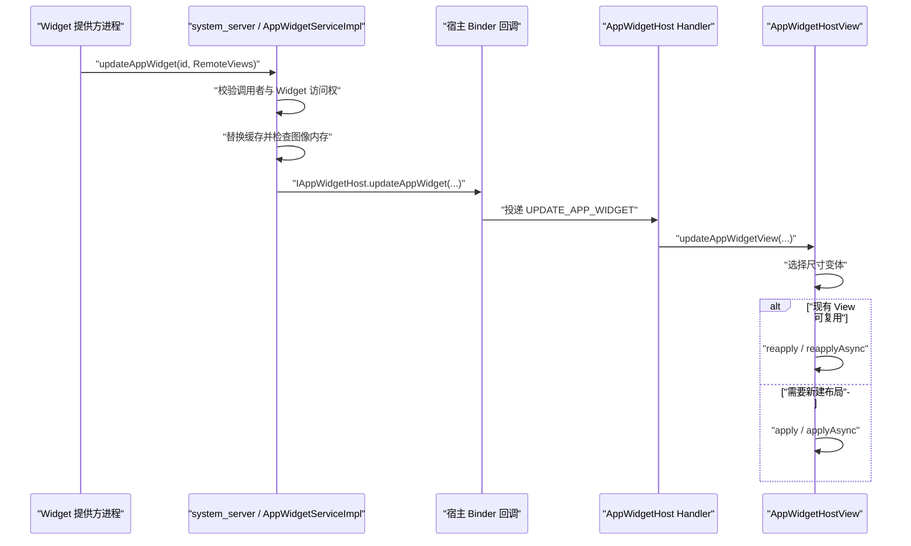

# App Widget 更新性能：RemoteViews IPC 与 Glance 渲染

App Widget 的界面由 Launcher（桌面启动器）、SystemUI（系统界面进程）或其他实现了 `AppWidgetHost` 的宿主承载。提供方进程生成 `RemoteViews`，`system_server`（承载多数系统服务的系统进程）负责校验和缓存，宿主进程再创建 View、执行属性动作并绘制界面。这套 IPC（进程间通信）模型决定了优化重点：减少重复更新和无效动作，控制布局创建、集合数据与图像内存的成本。

本文以 Android 17 / API 37 / `android-17.0.0_r1` 为平台源码基线，Glance 部分以当前稳定版 1.1.1 为准。文中的更新、缓存和宿主应用逻辑都发生在 Android 框架与 Jetpack 库中，不延伸到内核实现。

## 一、Android 17 的执行模型

### 1. `RemoteViews` 是布局说明和动作集合

提供方不会把已经创建好的 View 层级传给宿主；这里的 View 层级是宿主进程中一组有父子关系的界面对象。`RemoteViews` 保存布局资源、可能的尺寸变体和内部动作列表 `mActions`。例如，`setTextViewText()` 会记录一项文本属性设置，`setImageViewBitmap()` 会记录携带位图的 `BitmapReflectionAction`。宿主收到对象后才加载布局，再按顺序执行这些动作。

这一区别直接影响分析方法：

- 提供方进程中的耗时主要来自取数、构造 `RemoteViews`、准备图像和发起 Binder 调用；Binder 是 Android 的进程间调用机制。
- `system_server` 负责检查调用者、更新缓存、检查图像内存，并把有效快照通知给宿主。这里的快照是能够描述 Widget 某一时刻界面状态的一份 `RemoteViews`。
- 宿主进程负责布局加载、动作应用、测量、布局、绘制等 UI 工作。
- 提供方完成 `updateAppWidget()` 调用，只代表更新请求已经交给系统服务，不代表桌面像素已经刷新。

下面的时序图用于定位一次完整更新经过的进程和线程。



图中的两个 Binder 方向分别覆盖“提供方到系统服务”和“系统服务到宿主”。`AppWidgetHost.Callbacks` 收到 Binder 回调后，先向指定的 `Handler` 发送消息；`Handler` 是 Android 在线程消息队列上安排任务的组件，因此宿主还会经历一次线程切换。

### 2. `apply()` 与 `reapply()` 由宿主选择

Android 17 的 `AppWidgetHostView.applyRemoteViews()` 会先选择适合当前尺寸的 `RemoteViews`。宿主配置了异步 `Executor`（执行任务的线程调度接口）时，代码进入 `inflateAsync()`；同步路径会调用 `canRecycleView(mView)`。布局与现有 View 满足复用条件时执行 `reapply()`，否则由 `apply()` 创建新内容。异步路径使用同样的判断，分别调用 `reapplyAsync()` 或 `applyAsync()`。

提供方没有“强制宿主执行 `reapply()`”的公开接口。以下变化容易让复用条件失效或增加宿主工作量：

- 完整更新切换了布局资源或尺寸变体；
- 响应式布局需要按宿主尺寸选择另一套结构；
- 宿主的颜色映射发生变化；
- 动作集合需要处理较大的图像或较多子 View；
- 宿主没有设置异步执行器，只能在自己的界面线程同步应用更新。

提供方应减少无意义的布局切换，并把稳定结构留在 XML 中。性能验证还要查看宿主侧的 Perfetto 系统跟踪，确认 `apply`、测量和绘制耗时；只测提供方函数会漏掉桌面侧开销。

## 二、三种更新语义不能混用

Android 的 Widget 更新接口分为完整更新、局部更新和集合数据刷新。它们操作的对象不同：

| 更新类型 | 公开入口 | Android 17 服务端行为 | 适用场景 |
| --- | --- | --- | --- |
| 完整更新 | `updateAppWidget()` | 用新 `RemoteViews` 替换已缓存快照 | 首次显示、结构变化、需要重建完整状态 |
| 局部更新 | `partiallyUpdateAppWidget()` | 把新动作合并进已缓存快照，再通知宿主 | 布局不变，只更新少量属性 |
| 集合刷新 | `notifyAppWidgetViewDataChanged()` | 通知旧式远程适配器重新取数 | 仍使用服务适配器的 `ListView`、`GridView`；该入口已在 API 35 弃用 |

完整更新建立可恢复的缓存基线，局部更新修改这份基线中的少量属性，集合刷新只让服务适配器重新提供列表项。先按当前适配器类型选择入口，再比较每次更新的数据量；三种调用不能仅凭“哪一个看起来更轻”互换。

### 1. 完整更新是缓存基线

`AppWidgetServiceImpl.updateAppWidgetInstanceLocked()` 在完整更新分支中直接替换 `widget.views`。系统缓存的对象必须能够独立描述当前 Widget。提供方进程死亡不会立即清除 `system_server` 中的缓存，宿主重新连接时仍可能收到这份快照；设备重启后的重新更新属于另一条生命周期路径，不能假定内存快照会跨重启保留。

下面的 Kotlin 示例构造一份完整状态，并一次更新同一提供方的多个实例。

```kotlin
fun updateWeatherWidgets(
    context: Context,
    appWidgetIds: IntArray,
    temperatureText: CharSequence,
    updatedAtText: CharSequence,
) {
    if (appWidgetIds.isEmpty()) return

    val views = RemoteViews(context.packageName, R.layout.widget_weather).apply {
        setTextViewText(R.id.temperature, temperatureText)
        setTextViewText(R.id.updated_at, updatedAtText)
    }

    AppWidgetManager.getInstance(context).updateAppWidget(appWidgetIds, views)
}
```

这段代码适合所有实例展示相同内容的情况。若每个实例绑定了不同城市或账户，应分别构造快照，不能为了合并一次调用而发送错误内容。

### 2. 局部更新依赖已经存在的完整快照

`partiallyUpdateAppWidget()` 在 API 11 引入；从 API 17 起，新属性会追加到服务缓存，后续完整更新再替换合并后的缓存。公开 API 契约要求实例先收到一次完整更新，官方文档说明缺少这份基线时局部更新会被忽略。

Android 17 的 `AppWidgetServiceImpl` 在缓存为空时会把传入对象暂存为当前 `widget.views`，没有执行合并。这个内部分支不改变公开契约：传入对象仍可能只含少量动作，无法完整描述界面，其他 Android 版本和厂商实现也无需保持该行为。应用必须先提交完整更新，不能依赖这项内部处理。

下面的示例只修改更新时间文字，调用方必须先为该实例提交过完整更新。

```kotlin
fun updateWidgetTimestamp(
    context: Context,
    appWidgetId: Int,
    updatedAtText: CharSequence,
) {
    val delta = RemoteViews(context.packageName, R.layout.widget_weather).apply {
        setTextViewText(R.id.updated_at, updatedAtText)
    }

    AppWidgetManager.getInstance(context)
        .partiallyUpdateAppWidget(appWidgetId, delta)
}
```

局部更新减少的是提供方发送的动作和参数。宿主仍需接收更新并执行对应动作，收益要结合更新频率、动作大小和宿主实现测量。业务状态容易偏离完整数据时，可以在明确事件（如配置变化、数据版本迁移）后重新提交完整快照，使界面恢复到一致状态；这是一项工程策略，不是系统要求的固定周期任务。

### 3. 集合刷新只针对集合数据

旧式集合 Widget 通过 `RemoteViewsService` 创建 `RemoteViewsFactory`，由另一个服务按宿主请求提供列表项。调用 `notifyAppWidgetViewDataChanged(appWidgetId, viewId)` 后，宿主可以继续显示旧数据，同时触发 `onDataSetChanged()`，随后再调用 `getCount()`、`getViewAt()` 等方法读取新数据。

服务断开连接本身不会触发 `onDataSetChanged()`。把刷新逻辑依赖在断连事件上，会造成不同宿主上行为不一致。

Android 12 / API 31 增加了 `RemoteViews.setRemoteAdapter(viewId, RemoteCollectionItems)`。`RemoteCollectionItems` 是随 `RemoteViews` 一起提交的集合项快照，不需要宿主再绑定 `RemoteViewsService`。Android 17 的 `AppWidgetManager` 也包含旧式远程适配器的兼容转换逻辑。API 35 已弃用 `notifyAppWidgetViewDataChanged()` 及其对应的 `Intent` 适配器，新实现应优先评估 `RemoteCollectionItems`；维护旧实现时可按数据规模判断：

- 项目较少、每项结构简单、数据已经在内存中：`RemoteCollectionItems` 易于维护。
- 项目较多、取数需要服务生命周期、希望按宿主请求生成项目：保留 `RemoteViewsService` 路径。
- 无论使用哪条路径，都要限制单项动作和图像体积。集合会把一次更新的成本放大到多个项目。

### 4. 集合项的优化位置

`RemoteViewsFactory.getViewAt(position)` 返回的是单项 `RemoteViews`。可以在 `onDataSetChanged()` 中完成一次数据快照，然后让 `getViewAt()` 只做确定性的映射：

1. 在后台完成数据库查询、排序和业务计算。
2. 生成不可变的数据列表，并在回调结束前原子替换旧快照，也就是一次发布整份新引用，不让读取方看到只更新了一半的数据。
3. `getViewAt()` 只读取快照，设置文本、资源和点击模板所需的填充参数。
4. 对相同内容复用资源引用，避免为每一项重复创建相同位图。
5. 数据暂不可用时返回稳定的加载或空状态，避免宿主反复收到结构差异很大的布局。

官方文档允许 `onDataSetChanged()` 和 `getViewAt()` 执行较重的同步工作，但这不等于可以忽略总延迟。桌面滚动时，项目迟迟无法交付仍会表现为空白、占位或更新滞后。

## 三、更新调度与数据时效等级

Widget 的更新频率应来自产品语义。天气摘要、日历倒计时、媒体进度和即时告警需要不同机制，不能统一套用一个周期。

### 1. `updatePeriodMillis` 的 Android 17 边界

提供方 XML 中的 `updatePeriodMillis` 只适合低频周期刷新。Android 17 的 `AppWidgetServiceImpl` 使用以下规则注册更新：

- 值为 `0` 时不注册周期更新；
- 正值会与 `MIN_UPDATE_PERIOD` 取较大值；
- 非调试构建的 `MIN_UPDATE_PERIOD` 是 30 分钟；
- 服务端使用 `AlarmManager.setInexactRepeating(ELAPSED_REALTIME_WAKEUP, ...)`。

下面的配置关闭系统周期广播，把刷新交给业务事件或任务调度器。

```xml
<appwidget-provider
    xmlns:android="http://schemas.android.com/apk/res/android"
    android:initialLayout="@layout/widget_weather"
    android:minWidth="180dp"
    android:minHeight="110dp"
    android:updatePeriodMillis="0" />
```

关闭周期广播后，应用需要覆盖首次添加、配置变化、用户主动刷新、数据变化以及必要的后台任务。`0` 不会让 Widget 自动获得新的调度来源。

### 2. `AppWidgetProvider` 的广播入口要尽快返回

`AppWidgetProvider` 继承 `BroadcastReceiver`。系统文档要求接收器通常在约 10 秒内完成；网络访问、批量图片解码或大型数据库迁移不应留在 `onUpdate()` 中。合适的处理顺序是：

1. 读取已经缓存的轻量状态；
2. 尽快提交可显示的 `RemoteViews`；
3. 需要联网或持久化计算时，登记受系统约束的后台任务；
4. 任务完成后根据最新 Widget ID 再提交一次更新。

WorkManager 是 Jetpack 的可延迟后台任务调度器，可以表达网络、电量、充电等约束，也能把一次性任务去重。它不保证精确执行时刻，周期任务还受最小周期、应用待机分桶（系统按活跃度限制后台资源的等级）、省电模式和执行配额影响。把它当成精确定时器会误判数据时效。

### 3. API 37 的监听器精确闹钟有进程生命周期限制

Android 17 / API 37 为 `AlarmManager` 增加了带 `Executor` 的监听器重载：

`setExactAndAllowWhileIdle(type, triggerAtMillis, tag, executor, listener)`

这个入口可以把回调交给指定执行器，适合某个 `Activity`、`Service` 或 `ContentProvider` 仍在运行期间的一次性短期任务。Android 17 源码和 API 文档都说明：监听器闹钟要求请求进程持续运行；进程没有运行中的组件或进入缓存状态后，系统可能取消或丢弃回调。

Android 17 上的监听器形式不需要 `SCHEDULE_EXACT_ALARM` 特殊访问权限，代价是受进程生命周期约束。调用方应在所属组件结束时调用 `cancel(OnAlarmListener)`；进程死亡后仍要触发更新时，应评估 `PendingIntent` 形式。`PendingIntent` 是由系统代应用保存、可在应用进程不存在时触发的操作令牌，其精确闹钟形式需要满足对应的访问规则。允许延迟时优先使用 WorkManager 或系统的非精确周期机制。

### 4. 可见状态与刷新节奏

标准 AppWidget API 没有跨宿主统一的“当前是否可见”回调。`onEnabled()`、`onDisabled()` 和 `onAppWidgetOptionsChanged()` 分别描述实例集合生命周期或尺寸选项变化，不能当作可见性信号。刷新逻辑应具备以下性质：

- 相同数据版本重复到达时不再发送同一份更新；
- 多个相同配置的实例可以合并取数和构造；
- 只有在自有宿主或当前存活组件能够提供可靠可见性时，才按可见状态启停高频内存计时器；
- 用户主动刷新可以提升优先级，但要做点击去重；
- 失败时保留最近一次可用快照，并显示可理解的时间戳或错误状态。

媒体播放进度一类高频信息还要优先考虑系统已有的媒体会话和宿主能力。用周期 Binder 更新模拟每一帧进度，会同时增加提供方、`system_server` 和 Launcher 的工作。

## 四、图像内存与 Binder 成本

### 1. Widget 有独立于通用 Binder 缓冲区的图像上限

“每次 Binder 只能传 1 MB”不能完整解释 Widget 图像问题。Binder 的事务缓冲区由进程内并发事务共享，序列化后的数据量也会影响是否成功；AppWidget 服务还会单独检查 `RemoteViews` 的图像内存。

Android 17 在启动时读取真实显示尺寸，并计算：

`mMaxWidgetBitmapMemory = 6 × displayWidth × displayHeight`

源码注释给出的含义是 1.5 个屏幕、每像素 4 字节。每次更新完成缓存合并或替换后，服务都会检查该 Widget 的 `RemoteViews` 图像估算值。`targetSdkVersion` 表示应用声明适配的 Android API 级别：目标版本不高于 37 时，强制上限只计普通位图缓存，超限会清空该次缓存并抛出 `IllegalArgumentException`；`Icon` 对象内携带的位图会计入总量，目标版本不高于 37 且总量超限时记录警告。目标版本高于 37 后，普通位图与 `Icon` 位图的总量都会用于强制检查。

这个上限随设备显示尺寸变化，不能写成固定的 1 MB、8 MB 或某个机型测得值。设计时仍应让峰值显著低于系统上限，因为同一宿主还要同时处理桌面、其他 Widget 和自身图形资源。

### 2. 图像优化按来源处理

- 静态图标和背景优先使用资源 ID，让宿主按资源加载。
- 网络图片按 Widget 实际显示尺寸解码，避免把相机原图缩放后再塞入 `RemoteViews`。
- 相同位图在一次快照中尽量复用，避免内容相同却创建多个对象。
- 使用内容 URI（统一资源标识符）时确认目标宿主具备读权限，并保证 URI 生命周期覆盖显示周期。
- 提交新图片前先取消已经过时的下载或解码任务，防止旧请求覆盖新状态。
- 集合中的缩略图要按总量估算，不能只检查单项大小。

Android 17 的服务端会遍历 `RemoteViews` 中的 URI：`content://` 要求调用 UID（Android 用来标识应用身份的 Linux 用户编号）自己具有读权限，`android.resource://` 可以通过，`file://` 和其他 URI 方案会被拒绝。这项检查不会替提供方补齐宿主读权限。URI 可以减少在动作中直接携带大位图的压力，但宿主权限、文件存活和读取耗时也会影响性能与正确性。

### 3. 动作数量也会累积

纯文本更新没有大位图，仍需要序列化动作、执行 Binder 调用、合并缓存并由宿主重放动作。常见减负方法包括：

- 比较数据版本，跳过内容完全相同的更新；
- 把多字段变化合成一次完整更新；
- 只改一个稳定属性时使用局部更新；
- 多个实例内容相同且接口允许时，使用 `int[]` 批量提交；
- 避免在每次更新中重复设置从未变化的点击动作、可见性和资源。

批量提交减少提供方发起调用和重复构造的次数。系统仍需逐个维护 Widget 实例并通知相应宿主，不能把一次 API 调用等同于一次宿主工作。

## 五、Glance 的成本模型

### 1. Glance 使用 Compose Runtime，输出仍是 `RemoteViews`

Glance 1.1.1 建立在 Compose Runtime 上，用声明式 API 生成 App Widget 内容。Compose Runtime 会根据状态执行可组合函数并形成界面描述；Glance 再把这份描述转换为 `RemoteViews`。它不使用 Compose UI 的 `LayoutNode`（Compose UI 内部的布局节点）和绘制管线，也不支持任意 Compose UI 可组合组件，因此不能直接把应用页面中的 Compose UI 组件放到桌面。

一次 Glance 更新大致包含：

1. 读取 `GlanceId` 对应状态；
2. 运行 Glance 组合；
3. 根据尺寸模式生成可表达为 `RemoteViews` 的结构与动作；
4. 通过 AppWidget 更新接口交给系统；
5. 由宿主应用并绘制结果。

Glance 1.1.1 的 `GlanceAppWidget` 会在 `CoroutineWorker`（用 Kotlin 协程执行任务的 WorkManager 工作单元）中执行 `provideGlance()`。内部会话类 `AppWidgetSession` 再把组合结果转换成 `RemoteViews`，并调用 `AppWidgetManager.updateAppWidget()`。Glance 简化了状态到 Widget 界面的映射，但 Binder、服务端缓存、宿主布局创建和图像上限仍然存在，性能分析要覆盖完整跨进程路径。

同一个 `provideGlance()` 仍在运行时，再次调用 `update()` 不会重启它。需要展示的新数据应先写入 Glance 能观察到的状态，由现有会话重新组合；反复调用 `update()` 不能替代状态同步。

### 2. 状态变化不等于逐项增量更新

Glance 可以利用 Compose Runtime 计算声明式内容，最终交付单位仍受 `RemoteViews` 表达能力约束。不能假设 `LazyColumn` 只序列化变化的某一项，也不能用 Compose UI 的重组跳过率直接推导桌面更新成本。

使用 Glance 时，优化重点是：

- 业务主动触发更新时，先比较会影响界面的持久状态版本，跳过完全相同的数据；平台生命周期事件仍按对应回调处理；
- 在 `provideContent()` 启动持续组合前完成初始网络和数据库读取，后续变化通过可观察状态提供；
- 同一个列表项保持稳定的项目标识；
- 限制列表项数量、层级和图像；
- 用系统跟踪和宿主表现检验一次更新生成了多少工作。

### 3. 响应式尺寸优先使用有限断点

Android 12 / API 31 通过 `OPTION_APPWIDGET_SIZES` 向提供方暴露宿主支持的尺寸集合。平台 `RemoteViews` 可以为不同尺寸保存变体；Glance 提供 `SizeMode.Responsive` 和 `SizeMode.Exact`。

尺寸能够归纳为几个明确阈值时，`SizeMode.Responsive` 可以预先生成有限布局；这里的阈值就是响应式设计常说的尺寸断点。Android 12 及以上版本会为传入的响应式尺寸分别生成内容，再由框架选择合适变体。`SizeMode.Exact` 会在每次尺寸变化时按精确尺寸重新创建内容，官方文档提示它可能增加开销，并造成调整大小时的界面跳变。布局连续依赖精确宽高、有限断点无法表达时，再选用 `SizeMode.Exact`。

### 4. 选择手写 `RemoteViews` 还是 Glance

| 维度 | 手写 `RemoteViews` | Glance |
| --- | --- | --- |
| 更新控制 | 可直接选择完整、局部和集合接口 | 由 Glance API 生成并提交内容 |
| 状态表达 | 需要自行维护数据与 View 动作映射 | 声明式状态映射较集中 |
| 可用组件 | 受 `RemoteViews` 允许的 View 类型和方法范围限制 | 受 Glance 组件和底层 `RemoteViews` 限制 |
| 性能定位 | 动作与平台调用较直观 | 还要观察组合和翻译阶段 |
| 迁移成本 | 既有 XML 与代码可继续维护 | 适合希望统一 Kotlin 声明式写法的团队 |

Glance 更适合集中维护声明式状态，手写 `RemoteViews` 对更新类型和动作控制更直接。二者都要经过 Android 17 的 AppWidget 服务与宿主，选择时应同时核对功能约束、维护成本和实测结果。

## 六、权限、多用户和可靠性边界

### 1. 更新调用有明确的身份校验

Android 17 的 `AppWidgetServiceImpl.updateAppWidgetIds()` 会校验调用包与 UID，并检查调用者是否有权访问目标 Widget。服务还会遍历 `RemoteViews` 中的 URI，通过 URI 授权服务确认调用 UID 对 `content://` URI 具有读权限。

应用不需要、也没有公开的 `RemoteViews.CallingIdentity` API 来替代这些校验。更新失败时应先确认：

- 当前进程的包名是否与提供方一致；
- `appWidgetId` 是否仍属于当前提供方和用户；
- 工作资料或多用户环境中是否使用了错误用户的数据；
- 内容 URI 是否由正确用户下的 `ContentProvider` 提供，并具有可授予的读权限；
- `PendingIntent` 的可变性和目标是否符合当前平台安全要求。

### 2. 每个用户和配置文件分别维护状态

`AppWidgetServiceImpl` 的提供方、宿主和实例记录都带有用户维度。个人资料与工作资料中的同名包仍属于不同身份。数据库缓存、图片 URI、任务唯一名称和 `appWidgetId` 映射都要纳入用户边界。

把一个整数 ID 复制到另一份资料中，不能定位另一侧实例。工作资料暂停、锁定或移除后，提供方还要停止任务并清理对应缓存。

### 3. 最近可用快照比空白更可靠

Widget 更新涉及多个进程，任何一段都可能暂时不可用。稳健实现通常保留一份可快速构造的最近数据：

- 首次添加时先显示结构完整的本地状态；
- 后台刷新成功后一次性发布完整的新数据版本；
- 网络失败时保留旧值并更新错误提示；
- 图片加载失败时使用稳定资源占位；
- 收到删除回调后取消该实例不再需要的工作。

这套策略也能缩短广播入口的执行时间，避免每次启动都等待网络再提交首屏。

## 七、测量与排查

### 1. 先把三段耗时分开

建议分别记录：

1. 提供方：取数、图像准备、构造 `RemoteViews`、调用更新接口；
2. `system_server`：AppWidget 更新与回调调度；
3. 宿主：接收消息、`apply` 或 `reapply`、测量、布局和绘制。

Perfetto 中同时观察提供方进程、`system_server` 和当前 Launcher。若只能看到提供方函数很快结束，还不能判断桌面更新是否顺畅。帧问题还要结合 [渲染管线总览](../../part2-performance/ch18-rendering-pipelines/01-android-view-pipeline-analysis.md) 和 [Perfetto 入门](../../part3-tools/ch13-perfetto/01-perfetto-intro-capture-reliability.md) 的分析方法。

下面的命令用于查看系统已登记的提供方、宿主、实例和更新周期。

```bash
adb shell dumpsys appwidget
```

输出适合确认实例归属、`updatePeriodMillis`、宿主和提供方状态。它不是耗时分析报告，仍需与系统跟踪、应用日志以及 Launcher 行为对应。

### 2. 建立可复现的更新实验

一次有效的优化实验至少固定以下条件：

- 同一设备、Launcher、Widget 尺寸和实例数量；
- 相同数据量、图片尺寸和缓存状态；
- 区分完整更新、局部更新与集合刷新；
- 同时记录宿主首次创建布局和复用现有布局的更新；
- 报告多次样本的分布，不用单次最小值代表结果；
- 检查省电模式、应用待机分桶和工作资料状态。

若优化只减少了提供方构造时间，而宿主的布局或绘制没有变化，应如实限定收益范围。

### 3. 常见现象与检查顺序

| 现象 | 优先检查 |
| --- | --- |
| 更新调用成功，桌面没有变化 | 实例 ID、宿主连接、完整快照是否存在、数据版本是否被去重 |
| 局部更新第一次无效 | 该实例是否先收到过完整更新 |
| 列表长时间显示旧数据 | 是否调用正确的集合刷新接口，`onDataSetChanged()` 是否完成快照替换 |
| 调整尺寸时跳变 | 尺寸模式、布局变体数量、是否使用 `SizeMode.Exact` |
| 更新抛出图像内存异常 | 解码尺寸、集合总图像量、缓存快照中的位图与 `Icon` |
| 只在应用前台收到监听器闹钟 | `OnAlarmListener` 的进程生命周期边界 |
| 多用户或工作资料显示错数据 | `UserHandle`（Android 的用户身份句柄）、实例映射、URI，以及用于隔离不同用户数据的数据库命名范围 |

排查时先确认实例、用户与宿主归属，再按本次调用属于完整更新、局部更新还是集合刷新继续检查。这样可以先排除身份或更新类型错误，避免一开始就在图像解码和绘制耗时中寻找原因。

## 八、提交前检查清单

- [ ] 每个实例首次显示前提交完整 `RemoteViews`
- [ ] 局部更新只包含稳定布局上的少量属性变化
- [ ] 集合刷新路径与所用适配器类型匹配
- [ ] `RemoteViewsFactory` 从不可变快照读取数据
- [ ] `onUpdate()` 不执行网络、批量解码或长事务
- [ ] 调度机制与数据时效等级一致
- [ ] 不把 WorkManager 或非精确重复闹钟当成精确定时器
- [ ] API 37 监听器闹钟只用于进程组件仍存活的场景
- [ ] 位图按实际显示尺寸解码，并按整个快照估算总量
- [ ] 内容 URI 的授权与生命周期覆盖宿主读取
- [ ] 多实例共用取数结果，但保留实例配置差异
- [ ] 业务触发的 Glance 更新已按影响界面的持久状态版本去重
- [ ] 响应式布局优先使用有限尺寸断点
- [ ] Perfetto 覆盖提供方、`system_server` 和 Launcher

## 参考资料

- [AppWidgetManager.java（Android 17）](https://android.googlesource.com/platform/frameworks/base/+/refs/tags/android-17.0.0_r1/core/java/android/appwidget/AppWidgetManager.java)
- [AppWidgetServiceImpl.java（Android 17）](https://android.googlesource.com/platform/frameworks/base/+/refs/tags/android-17.0.0_r1/services/appwidget/java/com/android/server/appwidget/AppWidgetServiceImpl.java)
- [AppWidgetHost.java（Android 17）](https://android.googlesource.com/platform/frameworks/base/+/refs/tags/android-17.0.0_r1/core/java/android/appwidget/AppWidgetHost.java)
- [AppWidgetHostView.java（Android 17）](https://android.googlesource.com/platform/frameworks/base/+/refs/tags/android-17.0.0_r1/core/java/android/appwidget/AppWidgetHostView.java)
- [RemoteViews.java（Android 17）](https://android.googlesource.com/platform/frameworks/base/+/refs/tags/android-17.0.0_r1/core/java/android/widget/RemoteViews.java)
- [RemoteViewsService.java（Android 17）](https://android.googlesource.com/platform/frameworks/base/+/refs/tags/android-17.0.0_r1/core/java/android/widget/RemoteViewsService.java)
- [AlarmManager.java（Android 17）](https://android.googlesource.com/platform/frameworks/base/+/refs/tags/android-17.0.0_r1/apex/jobscheduler/framework/java/android/app/AlarmManager.java)
- [高级 Widget 指南](https://developer.android.com/develop/ui/views/appwidgets/advanced)
- [集合 Widget 指南](https://developer.android.com/develop/ui/views/appwidgets/collections)
- [Jetpack Glance 概览](https://developer.android.com/develop/ui/compose/glance)
- [使用 Glance 构建响应式界面](https://developer.android.com/develop/ui/compose/glance/build-ui)
- [AlarmManager API 参考](https://developer.android.com/reference/android/app/AlarmManager)
- [AppWidgetManager API 参考](https://developer.android.com/reference/android/appwidget/AppWidgetManager)
- [Glance 1.1.1 发行说明](https://developer.android.com/jetpack/androidx/releases/glance#1.1.1)
- [`glance-appwidget:1.1.1` 源码 JAR](https://dl.google.com/dl/android/maven2/androidx/glance/glance-appwidget/1.1.1/glance-appwidget-1.1.1-sources.jar)
- [精确闹钟调度指南](https://developer.android.com/develop/background-work/services/alarms)

本文的平台判断固定到 `android-17.0.0_r1`，Glance 判断固定到 1.1.1。升级 Android 或 Glance 后，应重新核对局部更新缓存、图像上限、集合适配器弃用状态、`GlanceAppWidget` 的会话执行方式和尺寸模式实现。
