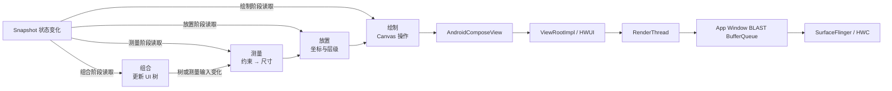
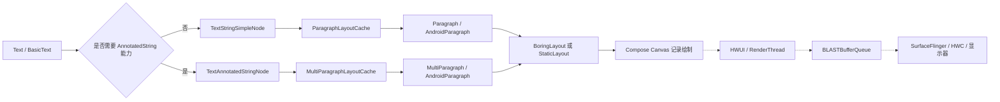

# Compose 布局、测量与文字渲染

Compose 布局性能要回答三个问题：哪个状态读取触发了布局、哪些节点重新测量或放置、这些工作是否让目标帧错过显示截止时间。重组是 Compose 因状态变化而重新执行部分可组合函数的过程；重组次数只能解释组合阶段，不能代替布局证据。

平台锚点是 Android 17 / API 37 / `android-17.0.0_r1`。Compose UI、Compose Runtime 与 Compose Foundation 独立发布，本文固定到当前稳定版 1.12.0，并以该发行提交范围的终点 `963bf914f78b389bdddef0da7f36bee19d897274` 读取源码。Android 版本决定宿主 View 与系统显示路径，Compose 依赖版本决定 `LayoutNode`、Modifier 节点、前瞻布局（lookahead）和跟踪事件。分析报告还要记录 Compose BOM（统一声明 Compose 库版本的物料清单）、Kotlin 版本和 Compose Compiler 插件。

这里不采用固定的布局耗时、优化百分比或重组阈值。帧预算随刷新率变化，布局成本还受节点数量、文本、约束、设备性能、编译状态和业务数据影响。所有收益都要在目标场景中测量。

Compose 布局由约束、测量和放置组成，SubcomposeLayout 在测量阶段引入额外组合；文字渲染还包含字体解析、整形、换行、布局和绘制。文本频繁变化会同时影响两条路径。

## 约束、测量、放置与 Subcompose

### 一、Compose 布局处在整帧的什么位置

#### 1. 组合、布局、绘制是 Compose 的失效阶段

Compose 官方文档把一次 UI 更新分成三个阶段：

1. **组合（Composition）**：执行需要运行的 Composable；Composable 是由 `@Composable` 标记、用来描述界面的函数。组合会创建或更新 UI 树。
2. **布局（Layout）**：测量节点尺寸，再放置节点位置。测量和放置各有自己的重启作用域。
3. **绘制（Drawing）**：让需要重绘的节点向 Canvas 发出绘制操作。

重启作用域是状态变化后可以单独重新执行的一段代码。这三个阶段描述状态依赖和可跳过工作，不表示每个显示帧都会完整执行三遍。某个状态只在绘制代码中读取时，变化可以只触发绘制；状态在放置代码中读取时，局部节点可以只重新放置；组合结果和尺寸约束都没变时，测量可以复用已有结果。

这张图把 Compose 阶段与 Android 17 标准应用窗口路径放在同一条时间线上。图中的 Snapshot 是 Compose 的状态快照系统，它负责在一致的状态视图中记录读取并通知变化。



`ComposeView` 和 `AndroidComposeView` 仍在 `ViewRootImpl` 管理的 View 树中。HWUI 是 Android 的硬件加速二维渲染库，`RenderThread` 是执行其部分渲染工作的线程；二者把应用窗口内容写入图形缓冲区。缓冲区随后经过 BLAST BufferQueue（窗口缓冲区与事务协调队列）、SurfaceFlinger（系统合成服务）和 HWC（Hardware Composer，硬件合成接口）进入显示流程。

Compose 布局变慢属于应用侧原因。`queueBuffer()` 表示应用提交图形缓冲区；其后的排队、合成和显示等待仍要按标准渲染路径分析，不能归入 Compose 测量耗时。

#### 2. Android 宿主如何调用 Compose 布局

Compose UI 1.12.0 的 `AndroidComposeView` 提供了几处明确入口：

- `onMeasure()` 会在根节点尚未挂载时先完成挂载，再把 View 的 `MeasureSpec`（父 View 传入的测量要求）转成 Compose `Constraints`（宽高最小值与最大值），更新根约束并调用 `measureOnly()`。
- `onLayout()` 调用 `measureAndLayout()`，完成仍待处理的测量与放置。
- `dispatchDraw()` 在绘制前再次处理待完成的 `measureAndLayout()`，随后调用根 `LayoutNode.draw()`。
- `onRequestMeasure()` 和 `onRequestRelayout()` 把节点失效交给 `MeasureAndLayoutDelegate`，再决定调用 View `requestLayout()` 还是 `invalidate()`。

Android 17 的 `ViewRootImpl` 仍通过一次视图树遍历组织宿主 View 的测量、布局和绘制，再由 `ThreadedRenderer` 进入 HWUI。Compose 自己的三个阶段嵌在这次平台遍历中，但两者使用不同的 API 名称。Perfetto 中要同时观察 Compose 跟踪事件、`AndroidOwner:*`、`performTraversals()` 和 `syncAndDrawFrame()`。

### 二、测量与放置是两个重启作用域

#### 1. 状态读取位置决定失效范围

| 状态读取位置 | 变化后的直接工作 | 可能继续发生的工作 |
| --- | --- | --- |
| Composable 函数体 | 重新组合读取者 | 组合结果改变后可能测量、放置和绘制 |
| `MeasureScope.measure()` | 重新测量对应节点 | 尺寸变化后父节点、放置和绘制可能更新 |
| `layout {}`、`Modifier.offset {}` | 重新执行放置 | 位置变化后绘制更新；局部测量可跳过 |
| `drawBehind`、`drawWithContent`、`Canvas` | 重新绘制 | 组合和布局可以跳过 |

这张表按状态的读取位置判断直接失效范围；同一个状态对象在不同阶段读取，触发的工作可能不同。`rememberSaveable` 只改变状态在 Activity 重建或已保存状态恢复时的存活方式，不会改变读取阶段；失效范围仍由读取 `value` 的代码位置决定。

这段代码把高频位移状态推迟到放置用的匿名函数中读取，省略的只有导入语句。

```kotlin
@Composable
fun PlacementOffset(
    offsetYPx: () -> Int,
    modifier: Modifier = Modifier,
    content: @Composable BoxScope.() -> Unit,
) {
    Box(
        modifier = modifier.offset {
            IntOffset(x = 0, y = offsetYPx())
        },
        content = content,
    )
}
```

调用方把 `LazyListState` 或动画状态包装成 `offsetYPx`。该值变化时，读取发生在放置步骤，当前节点不需要因为这次读取重新执行组合和测量。父子坐标依赖、对齐线或其他状态仍可能让相邻节点进入布局，结论要以系统跟踪为准。

#### 2. 单次布局过程限制子节点测量次数

普通 Compose 布局遵守单遍测量规则：父节点给子节点一组 `Constraints`，每个 `Measurable`（尚未测量的子节点接口）在当前布局过程只能调用一次 `measure()`。调用返回 `Placeable`，它保存测得的宽高并可在放置阶段使用。父节点据此决定自身尺寸，再在 `layout(width, height) {}` 中放置子节点；对同一个子节点用两组约束连续测量会触发运行时错误。

以下自定义列布局展示一遍测量和一遍放置的完整结构，代码省略导入语句。

```kotlin
@Composable
fun OnePassColumn(
    modifier: Modifier = Modifier,
    content: @Composable () -> Unit,
) {
    Layout(
        content = content,
        modifier = modifier,
    ) { measurables, constraints ->
        val childConstraints = constraints.copy(minWidth = 0, minHeight = 0)
        val placeables = measurables.map { measurable ->
            measurable.measure(childConstraints)
        }

        val desiredWidth = placeables.maxOfOrNull { it.width } ?: 0
        val desiredHeight = placeables
            .sumOf { it.height.toLong() }
            .coerceAtMost(Int.MAX_VALUE.toLong())
            .toInt()

        val width = constraints.constrainWidth(desiredWidth)
        val height = constraints.constrainHeight(desiredHeight)

        layout(width, height) {
            var y = 0
            placeables.forEach { placeable ->
                placeable.placeRelative(x = 0, y = y)
                y += placeable.height
            }
        }
    }
}
```

测量代码必须保存 `Placeable`，以便放置阶段使用；为此创建一个列表属于该实现的明确成本。频繁执行的布局代码应先减少重复测量、无用节点和昂贵计算，不能为了追求“零对象”而删除必要状态。

#### 3. 对齐线可能把读取带回布局

`FirstBaseline` 等 `AlignmentLine`（对齐线）让子节点向父节点报告基线一类内部参考坐标。父节点在测量或放置阶段读取对齐线时，Compose 会记录依赖；子节点的对齐线变化后，对应父节点需要重新测量或放置。

文本基线、复杂表格和自定义对齐布局经常出现这种依赖。看到父节点重新布局时，应检查是否读取了对齐线，不能只检查传入约束。

### 三、测量结果如何复用

#### 1. 复用条件由约束和失效标记共同决定

Compose UI 1.12.0 的 `MeasurePassDelegate` 是处理常规测量的内部委托类，其 `remeasure()` 直接给出复用条件：

- `layoutNode.measurePending == true`：执行 `performMeasure()`；
- 本次 `Constraints` 与 `measurementConstraints` 不同：执行 `performMeasure()`；
- 两者都不成立：当前节点复用已有尺寸，同时检查子树中是否还有待测量节点。

`performMeasure()` 会清除当前节点的 `measurePending`，并通过 Snapshot 观察器记录测量代码读取了哪些状态。测量完成后通常会把放置标记为待处理。

这套机制跨帧保存上次约束和结果，不限于“同一帧缓存一个 `MeasureResult`”。约束相同也不能保证整棵子树没有工作：子节点可能因自己的状态读取失效，`forceMeasureTheSubtree()` 会处理这些待测量节点。

#### 2. 测量与放置使用不同标记

`LayoutNode` 通过内部委托对象维护两组主要状态：

- `measurePending`：节点尺寸需要重新计算；
- `layoutPending`：节点或子节点位置需要重新计算。

`MeasureAndLayoutDelegate` 把待处理节点放进按树深排序的集合。父节点已经处于测量待处理状态时，子节点通常不用再作为独立根重复登记；子节点测量后尺寸发生变化，依赖它尺寸的父节点会继续更新。未放置或停用的节点会保留待处理标记，但不会无条件触发一轮完整树遍历。

失效传播没有固定的逐级父节点路径。它还取决于节点是否被放置、父节点上次在测量还是放置代码中使用子节点、尺寸是否变化，以及是否存在前瞻布局或对齐线依赖。

#### 3. `@Stable` 不控制布局缓存

`@Stable` 与 Compose Compiler 的稳定性推断影响 Composable 能否跳过。它不会修改 `MeasurePassDelegate` 的约束比较，也不会直接清除 `measurePending`。减少重组可能让相同的 Modifier、测量策略和节点结构继续复用，从而间接减少布局失效；错误标注还可能让 UI 漏更新。

排查时要分开看：

- Compose Compiler 报告（编译期生成的稳定性与可跳过性信息）和 Layout Inspector（Android Studio 的布局检查器）回答“哪些 Composable 运行或跳过”；
- Compose 布局跟踪事件和源码标记回答“哪些节点测量或放置”；
- FrameTimeline（把应用帧与显示截止时间对应起来的 Perfetto 数据源）回答“这些工作是否影响目标帧”。

### 四、固有尺寸（Intrinsic）查询的准确含义

#### 1. 固有尺寸查询发生在正式测量之前

`minIntrinsicWidth()`、`maxIntrinsicWidth()`、`minIntrinsicHeight()` 和 `maxIntrinsicHeight()` 用于在最终约束尚未确定时询问内容所需尺寸。官方文档明确说明：固有尺寸查询不会把同一个子节点正式测量两次。父节点先查询固有尺寸，再根据结果生成最终约束，随后执行一次正式 `measure()`。

查询仍然需要计算。`IntrinsicSize.Min` 会递归询问相关子树，文本固有尺寸可能运行段落宽高计算，自定义 `MeasurePolicy` 的默认实现还会复用测量逻辑做近似。成本取决于布局实现、查询方向、节点数量和内容，不能统一写成随树深线性增长的 `O(depth)`、指数增长或“一次完整子树测量”。

#### 2. 默认固有尺寸只是近似

自定义 `Layout` 没有覆写固有尺寸方法时，`MeasurePolicy` 会提供近似的默认实现。它对部分布局足够，对具有特殊约束协商的布局可能返回不合适的结果。

需要精确的固有尺寸语义时，应只覆写会被父节点查询的方法，并保证：

- 与正式测量的尺寸语义一致；
- 同一输入返回稳定结果；
- 不访问网络、磁盘或可变业务集合；
- 文本、密度和字体缩放变化后不会复用旧值；
- 基准测试覆盖真实内容长度和字体配置。

把固有尺寸结果缓存在业务层也有失效风险。字体、区域设置、`Density`、`fontScale`、布局方向、文本内容和约束输入都可能改变结果。

#### 3. Subcompose 布局不支持固有尺寸查询

Compose UI 1.12.0 的 `SubcomposeLayout` 使用 `NoIntrinsicsMeasurePolicy`。错误消息明确列出 Lazy 列表、`BoxWithConstraints`、`TabRow` 等基于 Subcompose 的组件：这些组件在测量时才决定要组合哪些内容，父节点无法在组合之前得到可靠的固有尺寸。

需要“与父尺寸匹配”时，可以让外层自定义布局控制测量顺序，或给 Subcompose 组件明确尺寸约束。对 `LazyColumn` 调用 `height(IntrinsicSize.Min)` 不会得到低成本的列表总高度查询。

### 五、Modifier 链不会为每一项创建 `LayoutNode`

#### 1. `LayoutNode` 与 `Modifier.Node` 是两层结构

`Modifier` 是 Compose 为界面元素附加布局、绘制、输入和语义行为的有序链。`LayoutNode` 持有对应的 `NodeChain`；Modifier 元素会创建或更新 `Modifier.Node`。实现 `LayoutModifierNode` 的节点还会获得 `LayoutModifierNodeCoordinator`，由这个协调对象在被包装内容的外层参与约束转换、测量和放置。

所以，`padding + background + clickable` 不等于三个额外 `LayoutNode`：

- `padding` 属于布局 Modifier，会参与约束和尺寸计算；
- `background` 属于绘制 Modifier，参与绘制；
- `clickable` 涉及输入、交互状态和语义；
- 多能力 Modifier 节点还可以通过委托同时提供多种行为。

长链仍会增加节点更新、遍历和对应能力的工作，但要按节点类型分析，不能把每个 Modifier 都计成一层布局树。

Compose UI 1.12.0 把 Modifier 元素差异比较所用的临时列表改为 `MutableObjectList`，并从根 `NodeChain` 统一复用缓冲区和遍历栈；这里的栈是暂存待展开 Modifier 的后进先出列表。这是减少临时集合分配的实现调整，不会合并 Modifier 节点，也不会改变链的顺序语义。

#### 2. 顺序决定语义，没有通用的“size 放最前”

Modifier 从外到内包装内容。`padding(16.dp).size(40.dp)` 与 `size(40.dp).padding(16.dp)` 接收和传递的约束不同，最终外部尺寸也可能不同。`clip().background()` 与 `background().clip()` 的绘制范围同样不同。

调整顺序属于 UI 行为变更，需要先确认设计语义，再测性能。`Modifier.then()` 只连接两段 Modifier，不会自动合并相邻节点，也不能作为减少节点数量的优化接口。

#### 3. 自定义布局 Modifier 的频繁执行路径

`Modifier.layout { measurable, constraints -> ... }` 的测量匿名函数运行在布局阶段。这里适合执行：

- 约束变换；
- 一次子节点测量；
- 基于 `Placeable` 尺寸的整数计算；
- 返回稳定的放置块。

业务取数、排序、字符串解析、图片解码和日志格式化应在布局前完成。`LayoutCoordinates` 表示节点在布局树中的坐标关系，不保存测量结果，也不能代替 `measure()`。

### 六、Subcompose 与 Lookahead 的额外工作

#### 1. Subcompose 把部分组合推迟到测量

`SubcomposeLayout` 允许测量匿名函数根据当前约束或可见范围调用 `subcompose(slotId, content)`，把部分组合推迟到测量阶段。Lazy 布局、`BoxWithConstraints` 和部分 Material 组件依赖这一能力。它们会复用槽位（用于标识一份子组合内容）和节点，不能概括为“每次测量都重建全部内容”。

成本来自当前这轮需要新增、复用、重新组合、测量和处置的槽位。以下变化常让工作增加：

- 约束变化导致可见项目或布局分支变化；
- 槽位键不稳定，旧内容无法复用；
- 单个可见项目组合或测量很重；
- 预取、前瞻布局和正式布局在同一交互中叠加；
- 组件嵌套让一个外层约束变化影响多个 Subcompose 区域。

普通 `Layout` 适合子节点集合在组合阶段已经确定的场景。单纯把内容参数改成可组合匿名函数，不会得到“测量时按约束选择组合内容”的能力。第七节继续说明 Subcompose 的槽位身份、复用和测量成本。

#### 2. Compose 1.12.0 使用 `LookaheadScope`

当前公开模型以 `LookaheadScope` 和 `approachLayout` 为主。`LookaheadScope` 会让范围内布局先计算目标尺寸与位置，再运行接近阶段，逐步接近目标。源码会创建一个只用于组织前瞻坐标的虚拟根节点，不会给 `content` 额外插入普通 `Layout`。

Lookahead 也不能简化成“每帧固定两次测量，耗时翻倍”。源码分别维护 `lookaheadMeasurePending`、`lookaheadLayoutPending`、`measurePending` 和 `layoutPending`。`isMeasurementApproachInProgress()` 与 `isPlacementApproachInProgress()` 都返回 `false` 后，系统可以跳过不再需要的接近阶段。

适合 Lookahead 的场景包括共享元素转场、布局尺寸过渡和需要提前知道目标坐标的动画。静态页面没有目标布局过渡时，不要为了预计算而扩大 Lookahead 范围。评估时分别统计：

- `Compose:lookaheadMeasure`；
- `Compose:lookaheadLayout`；
- `Compose:measure`；
- `Compose:layout`；
- 动画期间创建、复用和绘制的节点数。

### 七、SubcomposeLayout：槽位身份、复用与实际成本

普通 `Layout` 在测量前已经拿到确定的 `Measurable`；`SubcomposeLayout` 则允许测量代码根据约束或兄弟尺寸调用 `subcompose(slotId, content)`。它适合 Lazy 布局、`BoxWithConstraints`、先测主体再决定覆盖层等确有测量依赖的场景，不应只因组件“复杂”就使用。

`slotId` 是子组合的身份边界；子组合指 `SubcomposeLayout` 独立创建并管理的一组内容。同一逻辑槽位的 ID 在相邻测量中必须稳定，在一次测量中必须唯一。无参 `SubcomposeLayoutState()` 使用 `NoOpSubcomposeSlotReusePolicy`，默认不保留已经离场的槽位；自定义复用策略还要分别定义保留哪些 ID、两个 ID 是否兼容。

Foundation 1.12.0 的 LazyLayout 在这套机制之上用业务键（`key`）维护身份，用 `contentType` 判断内容结构，并在同一次测量中缓存已经组合的 `Measurable`。这些是当前源码实现，不构成跨版本固定的复用池容量契约。

一次测量的成本来自实际请求的槽位数、内容是否失效、产生的节点数量和子树测量，不是固定“两趟”，也不会仅因嵌套层数就必然指数增长。父约束变化会重新执行测量策略；若结构只在少数尺寸断点变化，可先归纳为紧凑或展开模式（compact / expanded），避免每个列表项各自套一层 `BoxWithConstraints`。

`SubcomposeLayout` 使用 `NoIntrinsicsMeasurePolicy`。父级通过 `IntrinsicSize.Min/Max` 查询到它时会直接失败，不会先完成固有尺寸组合再正式测量。要实现匹配父尺寸一类依赖，应重写父布局的测量顺序；组件尺寸能由外层约束表达时，直接传入约束。Compose UI 1.12.0 也没有公开的 `@IntrinsicMeasurer` 注解可绕过这项限制。

Lookahead 先得到目标尺寸和坐标，接近阶段再逐步到达目标；它与“测量时才决定组合哪些内容”是两种能力。嵌套两者时要分别观察前瞻布局、正式测量、子组合和绘制，不能把额外一轮布局误写成额外的 GPU 渲染。Compose Compiler 报告只能解释槽位内容能否跳过，Layout Inspector 只提供组合线索；实际的子组合与测量次数需要 Perfetto、自定义稳定计数或最小对照实验。

### 八、`Remeasurement.forceRemeasure()` 的边界

公开的 `Remeasurement` 关联一个布局节点。`forceRemeasure()` 会在不另行安排下一轮布局的情况下请求重测量，并立即调用宿主的 `measureAndLayout()`；节点会同步重测量，待处理的放置工作也可能随这次调用执行。官方 API 只建议把它用于少数复杂布局，例如滚动过程中必须同步消费偏移并重新测量子节点。

常规业务状态更新应依赖 Snapshot 失效。强制重测量会把同步工作放到调用线程，即使节点此前没有标记为需要重测量也会执行。`RemeasurementModifier` 是把关联节点的 `Remeasurement` 对象交给调用方的公开接口；项目中出现它时，要确认调用频率、线程、约束和帧内位置。Compose UI 1.12.0 没有公开的 `Modifier.remeasure` 便捷扩展。

高频动画还可以按需求选择更晚的读取阶段：

- 尺寸改变：测量阶段读取；
- 位置改变：`offset {}` 或自定义放置块读取；
- 纯视觉位移、缩放、透明度：优先评估 `graphicsLayer`；
- 颜色和绘制参数：`drawWithContent`、`drawBehind` 或 `Canvas` 中读取。

后移读取不能改变 UI 语义。点击区域、父布局占位或可访问性边界必须随位置变化时，图层变换和布局位移的行为并不相同。

### 九、怎样测量 Compose 布局成本

#### 1. 跟踪事件名称有语义，颜色没有

Compose UI 1.12.0 的 `AndroidComposeView` 会写入 `AndroidOwner:onMeasure`、`AndroidOwner:onLayout` 和 `AndroidOwner:measureAndLayout`。更细的 `Compose:*` 布局事件受 `ComposeToolingFlags.isVerboseTracingEnabled` 控制；该开关默认是 `false`，因为详细跟踪会增加运行开销。

需要这些详细事件时，应在专用诊断构建中选择加入 `ComposeToolingApi`，并在 Compose 库代码加载前把 `ComposeToolingFlags.isVerboseTracingEnabled` 设为 `true`。比较性能数据时，基线与实验组必须使用相同开关状态。观察时应区分两层事件：

- 宿主入口：`AndroidOwner:onMeasure`、`AndroidOwner:onLayout`、`AndroidOwner:measureAndLayout`；
- 开启详细跟踪后：`Compose:measure`、`Compose:layout`；
- 开启详细跟踪后：`Compose:lookaheadMeasure`、`Compose:lookaheadLayout`；
- 开启详细跟踪后，局部处理还可能出现 `Compose:remeasure`、`Compose:lookaheadRemeasure`。

Perfetto UI 会给时间片（一段带开始时间和持续时间的跟踪事件）分配颜色，颜色不表示“测量”“警告”或“超预算”。名称、线程、开始时间、持续时间和调用上下文才是证据。

下面的 PerfettoSQL（Perfetto Trace Processor 使用的 SQL 方言）用于汇总 Compose UI 1.12.0 的布局时间片，并保留进程与线程维度。未开启详细跟踪时，查询仍可返回 `AndroidOwner:*`，但不会出现受开关控制的 `Compose:*` 结果。

```sql
SELECT
  p.name AS process_name,
  t.name AS thread_name,
  s.name AS slice_name,
  COUNT(*) AS occurrences,
  ROUND(SUM(s.dur) / 1e6, 3) AS total_ms,
  ROUND(MAX(s.dur) / 1e6, 3) AS max_ms
FROM slice AS s
JOIN thread_track AS tt ON s.track_id = tt.id
JOIN thread AS t ON tt.utid = t.utid
LEFT JOIN process AS p ON t.upid = p.upid
WHERE s.dur > 0
  AND s.name IN (
    'AndroidOwner:onMeasure',
    'AndroidOwner:onLayout',
    'AndroidOwner:measureAndLayout',
    'Compose:measure',
    'Compose:layout',
    'Compose:lookaheadMeasure',
    'Compose:lookaheadLayout',
    'Compose:remeasure',
    'Compose:lookaheadRemeasure'
  )
GROUP BY p.name, t.name, s.name
ORDER BY total_ms DESC;
```

`slice.dur` 的单位是纳秒，查询把总时长和最大值换算成毫秒。聚合结果用于寻找工作量集中在哪类阶段；它不会自动指出某个 Composable 或 `LayoutNode`，还要回到对应帧和调用栈核对。

#### 2. Layout Inspector 与 Compose Compiler 报告只覆盖组合线索

Layout Inspector 可以显示 Composable 的组合次数和跳过次数。Compose Compiler 报告中的 `restartable`、`skippable` 分别表示函数可因状态变化重新执行、可在输入稳定时跳过；报告还会列出参数稳定性。两类工具都不会直接给出节点测量次数或布局耗时。

使用顺序可以按证据分层：

1. Macrobenchmark（从应用进程外启动并测量完整场景的基准测试库）的 `FrameTimingMetric` 记录目标交互的 `frameOverrunMs`（相对显示截止时间的超前或逾期）和 `frameDurationCpuMs`（应用界面线程与 RenderThread 生成一帧的 CPU 时间）分布，并输出跟踪文件。
2. FrameTimeline 找到错过截止时间的应用帧，区分 UI 线程、RenderThread 和显示侧问题。
3. UI 线程变长时查看 `AndroidOwner:*`、已开启的 `Compose:*` 与业务自定义跟踪事件。
4. 组合时间片变长再看 Layout Inspector、组合跟踪和 Compose Compiler 报告。
5. 布局时间片变长再检查约束变化、状态读取阶段、固有尺寸、Subcompose、Lookahead 和 Modifier 类型。
6. App 侧按时提交后，继续沿 RenderThread、BLAST、SurfaceFlinger 与 HWC 查找等待。

调试构建、热重载和 Layout Inspector 连接都会改变性能。用于性能判断的应用应设为 `profileable`（允许性能分析工具附加）且 `non-debuggable`（关闭调试运行时开销），并尽量接近发布版；设备、刷新率、数据、滚动手势和编译模式也要固定。

#### 3. 组合跟踪（Composition tracing）的覆盖边界

系统跟踪默认不会列出每个 Composable。需要函数级组合事件时，按官方文档加入由 BOM 管理版本的 `androidx.compose.runtime:runtime-tracing`，并保证 Perfetto 配置包含 `track_event` 数据源。这个依赖会保留跟踪字符串并增加一定安装包体积，测试报告应记录是否启用。

`runtime-tracing` 负责显示可组合函数，不会替应用开启 `ComposeToolingFlags.isVerboseTracingEnabled`；函数级组合事件和详细布局事件是两套独立配置。

即使启用了组合跟踪，布局节点归因仍可能需要自定义 `Trace.beginSection()`、最小复现或基准变体。某个 Composable 的组合时间片只包含组合工作，不能代表它的全部测量与绘制成本。

### 十、排查案例的判断顺序

#### 场景 A：没有明显重组，滚动仍掉帧

1. 用 FrameTimeline 选中具体的卡顿帧。
2. 确认 UI 线程是否卡在 `AndroidOwner:measureAndLayout` 或 `Compose:measure`。
3. 对比本帧与正常帧的约束、可见项目数、Subcompose 槽位和图片/文本数据。
4. 检查高频状态是否在测量匿名函数中读取。
5. UI 线程没超时则转向 RenderThread、缓冲区反压和显示侧；反压表示生产缓冲区的速度超过后续消费速度，队列开始积压。

“重组次数正常”只能排除一部分组合工作，不能排除局部重测量、放置、绘制或系统后段等待。

#### 场景 B：父布局频繁重新测量

1. 确认子节点尺寸是否变化。
2. 检查父节点是否在测量匿名函数中使用该子节点，或读取了固有尺寸、对齐线。
3. 检查窗口尺寸、`Insets`（状态栏、导航栏或输入法占用的边缘区域）、字体缩放和约束是否变化。
4. 检查 Modifier 顺序是否改变了约束语义。
5. 对 Subcompose 组件确认槽位键和布局分支是否稳定。

父节点传入相同约束时，子节点自身失效仍可能触发局部重测量；子节点返回尺寸变化后，父节点可能继续更新。两种情况要分开记录。

#### 场景 C：布局动画启用后成本增加

1. 分开统计前瞻布局与正式测量、放置的时间片。
2. 缩小 `LookaheadScope` 到需要目标坐标的子树。
3. 检查接近阶段的完成条件能否按时返回 `false`。
4. 区分尺寸动画和纯图层变换，确认点击区域与语义要求。
5. 用相同动画进度、帧数和节点数据比较前后的系统跟踪。

只比较平均帧率会掩盖少数长帧。`FrameTimingMetric` 的分位数和对应跟踪文件能保留异常帧位置。

### 十一、提交前检查清单

- [ ] 记录 Android 版本、Compose BOM、Compose UI、Kotlin 与 Compose Compiler 插件
- [ ] 用 FrameTimeline 确认目标帧已经错过截止时间
- [ ] 区分组合、测量、放置、绘制和 RenderThread
- [ ] 不使用 Perfetto 时间片颜色判断阶段
- [ ] 需要 `Compose:*` 布局事件时，在专用诊断构建中尽早开启详细跟踪，并让对照组使用相同配置
- [ ] 高频状态读取位于满足 UI 语义的最晚阶段
- [ ] 自定义 Layout 对每个子节点只调用一次 `measure()`
- [ ] 测量匿名函数不做业务 I/O（磁盘或网络读写）、解码、排序或日志格式化
- [ ] 固有尺寸查询有明确的尺寸语义和真实成本测量
- [ ] 不对 Subcompose 组件请求不受支持的固有尺寸
- [ ] Modifier 调整顺序前确认布局、绘制、输入和语义变化
- [ ] 不把每个 Modifier 节点算成独立 `LayoutNode`
- [ ] Subcompose 槽位键稳定，并限制测量期新增内容
- [ ] Lookahead 范围只包含需要目标布局的节点
- [ ] 常规业务不调用 `forceRemeasure()`
- [ ] Macrobenchmark 使用接近发布版的可分析构建
- [ ] 应用侧按时提交后继续检查 HWUI、BLAST、SurfaceFlinger 与 HWC


## 字体整形、文本布局与绘制缓存

通用布局确定可用尺寸后，文本组件才能整形和换行。缓存键必须包含字体、样式、宽度和文本内容。

Compose 文本卡顿不能只看重组次数。重组是 Compose 因状态变化重新执行部分可组合函数的过程；一次文本更新还可能停在测量、字体解析、绘制或显示系统中的任意一段。同样的 `Text` 调用也可能进入两套不同的 Modifier 节点实现；Modifier 节点挂在界面元素上，负责布局、绘制或语义等行为。排查时要同时回答：哪项输入变了、是否重新排版、目标帧在哪个阶段错过显示截止时间。

平台源码锚点是 Android 17 / API 37 / `android-17.0.0_r1`，Compose UI 与 Foundation 源码锚点是稳定版 1.12.0 的发行范围终点 `963bf914f78b389bdddef0da7f36bee19d897274`。Compose 与 Android 平台独立发布，报告中应分别记录 Compose BOM（统一声明 Compose 库版本的物料清单）、Compose UI、Kotlin、Compose Compiler 插件和 Android 版本。涉及调度、缺页（访问尚未驻留内存页时由内核处理）或内存回收时，内核侧统一使用 `android17-6.18-2026-06_r6`；普通文本排版结论不能从内核标签直接推导。

这里不提供固定耗时、提升比例或文本长度阈值。文字内容、字体、语言、字形、断行、约束、设备、刷新率和编译状态都会改变结果，性能判断必须附带可复现的场景和系统跟踪。

### 一、Android 上的一段 Compose 文本怎样显示

#### 1. 从 `Text` 到 Android 文本布局

下面的流程图用于区分 Compose 文本排版与 Android 整帧显示。虚线后的 HWUI、BLAST、SurfaceFlinger 和 HWC 属于普通应用窗口（App Window）的显示流程。



`Text` 的组合节点负责保存输入和发起失效，`Paragraph`/`MultiParagraph` 负责文本测量与排版。Android 实现只有在系统判定文本适合简化路径、内容不换行时所需的最大宽度不超过可用宽度，并且没有基线偏移样式时，才使用适合单行简单文本的 `BoringLayout`；其余情况交给支持换行和复杂样式的 `StaticLayout`。

绘制结果记录到宿主 `ComposeView` 所在窗口。HWUI 是 Android 的硬件加速二维渲染库，RenderThread 执行其中一部分渲染工作；BLAST BufferQueue 协调窗口缓冲区与事务，SurfaceFlinger（常缩写为 SF）负责系统合成，HWC（Hardware Composer）是硬件合成接口。声明一个 `Text` 不会创建独立图形缓冲层（Surface）。

这条分层对诊断很有用。Perfetto 中的 `TextLayout:initLayout` 时间片很长，说明 Android 文本排版工作较重；RenderThread 或 SurfaceFlinger 较晚时，继续调整重组稳定性通常不会解决那一帧。

#### 2. 普通 `String` 文本有专用实现

Compose Foundation 1.12.0 的 `BasicText(String, ...)` 在以下条件都满足时使用 `TextStringSimpleNode`：

- 未启用文本选择；
- 没有 `onTextLayout` 回调；
- 没有启用 `autoSize`。

这个节点使用 `ParagraphLayoutCache`，并且只在无障碍语义请求布局结果时创建完整的 `TextLayoutResult`。只要需要选择、`onTextLayout` 或自动字号，`BasicText` 就会把 `String` 转为 `AnnotatedString`，改用 `TextAnnotatedStringNode` 和 `MultiParagraphLayoutCache`。

这项差异不要求业务删除必要能力。选择、布局回调和自动字号有明确产品价值时应保留；性能报告需要把它们记为测试变量，避免把两种实现的结果混在同一组数据中。

#### 3. `AnnotatedString` 保存样式和注解，内联内容另行传入

`AnnotatedString` 可以携带 `SpanStyle`（作用于字符范围的样式）、`ParagraphStyle`、链接和 TTS（文字转语音）注解。内联内容通过 `inlineContent` 映射单独传给 `BasicText`，再解析为占位范围和对应的可组合子节点，不是 `AnnotatedString` 自身的字段。`MultiParagraph` 会按段落样式拆分输入，并把各段的 `Paragraph` 结果组合起来；文本排版给出占位区域后，布局还要测量和放置对应子节点。

复杂度不能只用字符数表示。两段等长文本可能因为语言、双向文本、表情符号（emoji）、字体回退、连字、断词、段落数量和字符范围样式分布不同而产生不同成本。基准数据应包含线上会出现的语言和标记结构。

### 二、布局缓存怎样判断能否复用

#### 1. 节点把布局属性与绘制属性分开处理

`TextStringSimpleNode` 和 `TextAnnotatedStringNode` 更新参数时，都会分别调用 `hasSameLayoutAffectingAttributes()` 与 `hasSameDrawAffectingAttributes()`。对应的失效范围如下：

| 变化 | 常见例子 | 节点动作 |
|---|---|---|
| 文本内容或文字注解变化 | 字符、字符范围样式、段落样式、占位内容 | 更新缓存输入，重新测量并重绘 |
| 影响布局的样式变化 | 字号、字重、字体、字距、行高、断行相关样式 | 重新测量并重绘 |
| 布局参数变化 | 约束、`maxLines`、`minLines`、`softWrap`、`overflow`、布局方向、密度 | 重新计算或更新布局结果 |
| 字体异步解析完成 | 回退字体换成目标 `Typeface`（Android 字体对象） | 旧的固有尺寸结果过期，重新测量 |
| 只影响绘制的样式变化 | 颜色、画刷、阴影、文字装饰、部分绘制参数 | 保留排版，重绘 |
| 回调对象变化 | `onTextLayout`、占位内容回调、选择控制器 | 完整节点会请求重新测量 |

表中的回调项常被忽略。`TextAnnotatedStringNode.doInvalidations()` 把回调对象变化纳入测量失效条件。高频父级重组中反复创建语义相同、身份不同的回调，会增加无用的测量请求；Compose Compiler 对匿名函数的记忆规则还受构建版本和实际参数影响，应通过编译器报告确认。

Compose 1.12.0 还把 `softWrap` 显式传入 `ParagraphIntrinsics` 和 `TextLayoutInput`。是否允许软换行会参与固有尺寸和布局输入，修改它时不能只按绘制属性处理。

#### 2. 相同宽度通常比相同高度更有复用价值

`ParagraphLayoutCache.newLayoutWillBeDifferent()` 会检查旧段落、字体解析状态、布局方向和新约束。约束完全相同时可直接复用。宽度不变且新的高度仍能容纳旧段落时，断行不会变化，缓存可以保留已有 `Paragraph`；最大宽度或最小宽度变化时需要重新排版。

高度仍可能影响裁剪和省略。旧段落高于新的最大高度，或旧结果已经超过 `maxLines` 时，缓存会重新计算。列表项宽度在滚动期间保持不变，通常有利于复用；窗口尺寸、折叠状态、Insets（状态栏、导航栏或输入法占用的边缘区域）或父布局反复改变宽度，会让文本重新断行。

更完整的 Compose 测量失效机制见 [22.14 Compose 布局、测量与文字渲染](14-compose-layout-text-rendering.md)。

#### 3. 创建新对象不等于一定重新排版

`TextAnnotatedStringNode.updateText()` 比较字符内容和注解内容。新建但内容相等的 `AnnotatedString` 不会因为对象身份不同就自动使文本布局失效。`TextStyle` 也按布局属性和绘制属性比较。

不过，新建大对象仍会产生分配和内容比较。`remember` 适合缓存构造昂贵、输入稳定的富文本；一个只有少量字段的 `TextStyle` 通常不值得为了“避免重排”单独缓存。主题样式还依赖 `CompositionLocal`（沿组合树提供配置值的机制），错误的 `remember` 键可能让颜色或排版参数停留在旧主题。

#### 4. 字体结果是布局输入

Compose 的 `FontFamily.Resolver`（字体解析器）返回可观察的字体状态。使用异步字体时，首轮排版可以先采用回退字体；目标字体返回后，`hasStaleResolvedFonts` 会让旧缓存失效，文本重新测量。两种字体的字宽、基线和行高不同，周围布局也可能变化。

首屏或滚动基准应分别覆盖冷字体缓存与热字体缓存。下载字体还要记录字体提供方、证书、网络状态、回退顺序和失败处理，不能把一次下载等待写成稳定的 Compose 布局成本。

### 三、哪些输入容易增加文本工作量

#### 1. 换行和字体塑形

文本排版至少要处理字符到字形的映射、字体回退、双向文本、字距、断行和行度量。Android 的 `TextLayout` 对满足简化条件且能在给定宽度内显示的文本可以选择 `BoringLayout`；包含复杂的字符范围样式、需要换行或不满足简化条件时会使用 `StaticLayout`。

下面这些变化常使一次排版包含更多工作：

- 文本变长，或段落数量增加；
- 可用宽度变窄，换行候选增加；
- 同一段中混合多种字体、字号、语言或文字方向；
- 大量字符范围样式在相邻范围频繁切换；
- 开启断词、两端对齐或更复杂的换行策略；
- 表情符号和缺字触发额外字体回退；
- 占位内容需要和文字基线共同布局。

`maxLines` 和省略号可以限制输出行数与显示尺寸，但不能假定成本会按行数同比下降。Android 文本布局仍需确定可见部分如何断行和省略，收益要用目标文本测量。

#### 2. 自动字号会执行候选字号布局

Compose 1.12.0 的 `TextAutoSize.StepBased` 使用二分查找选择能放入约束的最大字号。每个候选字号都通过 `performLayout()` 试排；搜索收敛后，源码还会尝试再增大一个步长。缓存能复用所选布局结果，但新的文本或约束仍可能触发多轮试排。

步长越小，候选空间越密。标题、按钮等少量短文本可以直接测量；长文档列表中大面积启用自动字号时，应记录试排成本以及尺寸变化是否影响父布局。产品只要求限制行数时，固定排版规则通常更容易预测。

#### 3. `onTextLayout` 会改变节点类型，也可能产生反馈更新

`onTextLayout` 只在节点计算出新的 `TextLayoutResult` 时调用，适合读取行数、基线、溢出和坐标映射。回调非空会让普通 `String` 放弃简化节点，因此不应只为了长期日志而给每个列表项都加回调。

回调中写 Compose 状态时，要避免用布局结果持续改动影响本次布局的输入。例如，根据 `lineCount` 改 `maxLines`，新一轮测量又改变 `lineCount`，很容易形成反复更新。需要保存结果时，先比较旧值，并让回调对象保持稳定。

下面的示例用于读取最终尺寸，同时避免每次重组都换一个回调对象，也不会重复写入相同尺寸。

```kotlin
@Composable
fun MeasuredTitle(
    text: String,
    onSizeChanged: (IntSize) -> Unit,
) {
    val latestOnSizeChanged by rememberUpdatedState(onSizeChanged)
    val lastSize = remember { mutableStateOf(IntSize.Zero) }
    val textLayoutCallback = remember {
        { result: TextLayoutResult ->
            if (result.size != lastSize.value) {
                lastSize.value = result.size
                latestOnSizeChanged(result.size)
            }
        }
    }

    Text(
        text = text,
        maxLines = 2,
        overflow = TextOverflow.Ellipsis,
        onTextLayout = textLayoutCallback,
    )
}
```

`rememberUpdatedState` 让稳定回调读取最新的外部处理函数，`lastSize` 过滤相同结果。外部函数仍不应同步执行 I/O（磁盘或网络读写）、解析或网络上报；这些工作应交给受控的异步任务。

#### 4. 选择、链接和无障碍语义都有额外职责

可选择文本需要选择控制器、手势、选择高亮和坐标查询。链接需要命中区域与交互状态，占位内容要参与测量和放置。无障碍服务请求 `getTextLayoutResult` 时，简化节点也可能创建完整布局结果。

这些能力不能按“无用节点”批量删除。基准要与线上功能一致，并分别测试无障碍服务开启、文本选择和链接交互；测试环境的差异应写入报告。

### 四、重组稳定性只解释组合阶段

#### 1. 强跳过模式改变了旧版经验

把 `List<T>` 传给 Composable（由 `@Composable` 标记、用于描述界面的函数）不再等价于“父级重组时该函数一定执行”。强跳过模式是 Compose Compiler 的编译选项：它能把带不稳定参数的可重启 Composable 标记为可跳过。从 Kotlin 2.0.20 起，该模式默认开启；不稳定参数通常按对象身份比较，稳定参数按相等性比较。项目若关闭强跳过模式，规则会不同。

因此，排查清单至少要记录：

- Kotlin 与 Compose Compiler 插件版本；
- 强跳过模式是否启用；
- 编译器报告中的 `restartable`（可重启）、`skippable`（可跳过）与参数稳定性；
- 调用点传入的是同一集合实例还是每次新建；
- 目标 Composable 是否读取了会变化的状态。

相关诊断方法见 [22.3 Compose 性能、Compiler 与 Modifier.Node 诊断](03-compose-compiler-modifier-diagnostics.md)。

#### 2. `@Stable` 和 `@Immutable` 是开发者承诺

注解不会把可变对象改造成不可变对象。`@Immutable` 要求构造完成后所有公开属性都不再变化，方法在相同输入下保持相同结果；`@Stable` 允许可变，但 Compose 必须能观察会影响公开结果的变化。错误标注可能让界面漏掉更新。

数据类只有 `val` 也不一定满足条件：属性类型如果是普通 `List`、可变容器或来自未运行 Compose Compiler 的模块，编译器仍可能无法证明稳定。可选办法包括使用受支持的不可变集合、把外部模型转换为 UI 模型，或在确认契约后通过稳定性配置文件声明编译器无法分析的类型。注解应排在验证之后。

#### 3. Lazy 列表的 key 解决身份问题

稳定的 `key` 是 Lazy 布局识别列表项身份的键。插入、删除和移动后，布局可以据此保留对应的组合身份和可复用状态。它不会让内容变化的文本跳过排版，也不会修复昂贵的富文本构造；同级列表项的键必须唯一、长期稳定，并且不随显示文本变化。

下面的示例用业务 ID 维护段落身份，同时复用主题提供的排版样式。这里没有为了一个轻量 `TextStyle.copy()` 强行增加 `remember`。

```kotlin
@Immutable
data class ParagraphUiModel(
    val id: Long,
    val text: String,
)

@Composable
fun ArticleBody(paragraphs: List<ParagraphUiModel>) {
    val paragraphStyle =
        MaterialTheme.typography.bodyLarge.copy(lineHeight = 26.sp)

    LazyColumn {
        items(
            items = paragraphs,
            key = ParagraphUiModel::id,
        ) { paragraph ->
            Text(
                text = paragraph.text,
                style = paragraphStyle,
                modifier = Modifier.padding(horizontal = 16.dp, vertical = 8.dp),
            )
        }
    }
}
```

`ParagraphUiModel` 只有不可变的基础类型，满足示例中的 `@Immutable` 契约；`List` 参数本身仍要结合强跳过规则判断。长文章使用 Lazy 布局只组合可见项，详细复用条件见 [22.2 RecyclerView 与 Compose LazyList 性能](02-recyclerview-compose-lazylist.md)。

### 五、怎样写富文本和自绘文本

#### 1. 缓存昂贵的富文本构造

解析 Markdown、匹配关键词或建立大量字符范围样式时，构造成本可能高于短文本排版本身。输入不变时可以在组合作用域缓存 `AnnotatedString`；输入来自后台解析器时，也可以先在后台线程生成不可变结果，再交给 Compose 展示。

下面的示例只在正文、匹配范围或强调色变化时重建富文本。范围来自业务解析结果，不在组合中重新执行正则表达式。

```kotlin
@Immutable
data class HighlightRange(
    val start: Int,
    val endExclusive: Int,
)

@Composable
fun HighlightedParagraph(
    text: String,
    highlights: List<HighlightRange>,
) {
    val emphasisColor = MaterialTheme.colorScheme.tertiary
    val annotatedText =
        remember(text, highlights, emphasisColor) {
            buildAnnotatedString {
                append(text)
                for (range in highlights) {
                    if (range.start in 0..text.length &&
                        range.endExclusive in range.start..text.length
                    ) {
                        addStyle(
                            style = SpanStyle(color = emphasisColor),
                            start = range.start,
                            end = range.endExclusive,
                        )
                    }
                }
            }
        }

    Text(text = annotatedText)
}
```

颜色属于绘制属性，但它被写进 `AnnotatedString` 的字符范围样式，变更时会产生新的注解内容并更新文字节点。若颜色需要高频动画，可考虑把视觉效果放到更适合的绘制层；先确认高亮范围、无障碍和选择语义没有改变。

#### 2. `TextMeasurer` 服务于自定义绘制

普通 `Text` 已有节点级 `ParagraphLayoutCache` 或 `MultiParagraphLayoutCache`，无需再包一层 `TextMeasurer`。`rememberTextMeasurer()` 主要用于 `Canvas`、`drawBehind`、`drawWithCache` 等自定义绘制场景。

`TextMeasurer` 用 LRU（最近最少使用）策略缓存 `TextLayoutInput` 到 `TextLayoutResult` 的映射。缓存键包含文字、布局样式、占位内容、行数、换行、溢出、密度、布局方向、字体解析器和约束；颜色、画刷、阴影和文字装饰等非布局属性不参与键比较。动画只改颜色时可以复用布局，动画字号或宽度时则会产生不同键。

下面的示例在绘制区域尺寸或文本输入变化时测量一次，随后用已有 `TextLayoutResult` 绘制颜色。

```kotlin
@Composable
fun LabeledBackground(
    label: String,
    color: Color,
    modifier: Modifier = Modifier,
) {
    val textMeasurer = rememberTextMeasurer(cacheSize = 4)

    Spacer(
        modifier =
            modifier.drawWithCache {
                val layoutResult =
                    textMeasurer.measure(
                        text = label,
                        style = TextStyle(fontSize = 16.sp),
                        constraints = Constraints(maxWidth = size.width.toInt()),
                    )

                onDrawBehind {
                    drawRoundRect(color = color.copy(alpha = 0.18f))
                    drawText(
                        textLayoutResult = layoutResult,
                        color = color,
                        topLeft = Offset(12.dp.toPx(), 8.dp.toPx()),
                    )
                }
            }
    )
}
```

`drawWithCache` 的构建块会在尺寸或读取到的状态变化时重新执行。`color` 在该块中参与背景和文本绘制，所以颜色变化也会重建绘制缓存，但 `TextMeasurer` 仍可复用布局结果。若颜色每帧变化且这段重建产生了可测成本，可在绘制匿名函数中读取最新颜色，把测量输入保持不变。Canvas 的其他约束见 [22.8 Runtime 图形效果与 Compose Canvas](08-runtime-effects-compose-canvas.md)。

#### 3. 缓存容量按重复输入数量设置

`TextMeasurer` 默认缓存容量不是“越大越快”。容量单位是不同布局输入的数量。滚动中不断出现新文本时，过大的缓存会保留更多 `TextLayoutResult` 和段落数据；字号、约束或文本每帧变化时，大多数请求仍会未命中。

可按场景选择：

- 少量静态标签反复绘制：容量覆盖会重复出现的布局输入；
- 每帧只测同一段文本：容量为 1 已有专用单项实现；
- 输入几乎每次都不同：评估 `skipCache = true`，同时确认没有其他重复调用；
- 需要长期保存大量文章段落：由业务设计明确的分页或缓存上限，不能把 `TextMeasurer` 当全文缓存。

### 六、用系统跟踪判断时间花在哪里

#### 1. 基准先固定输入

滚动、长文展示、主题切换、字体返回和文本更新是不同的用户操作，应拆成独立用例。每组结果至少记录：

- 设备型号、SoC（片上系统）、刷新率、温度和电源状态；
- Android 版本、Compose 版本、Kotlin 与编译器插件；
- 可分析且不可调试、接近发布版的构建；
- 编译模式与基线配置文件（Baseline Profile）状态；该文件供 Android 运行时（ART）预编译关键代码；
- 文本条数、字符数分布、语言、字符范围样式数、字体缓存状态；
- 列表宽度、窗口模式、字体缩放和显示密度；
- 手势、迭代次数与启动模式。

Macrobenchmark（从应用进程外启动并测量完整场景的基准测试库）的 `FrameTimingMetric` 给出 `frameOverrunMs`（相对显示截止时间的超前或逾期）与 `frameDurationCpuMs`（界面线程和 RenderThread 生成一帧的 CPU 时间）分布，并为每次迭代保存系统跟踪文件。Android 12 及以上才提供 `frameOverrunMs`；Android 10 到 11 的兼容测试要使用对应平台可用的帧指标和跟踪证据。

#### 2. 源码中的文本时间片可以辅助定位

Compose UI 1.12.0 的文本实现包含 `TextStringSimpleNode::measure`、`TextAnnotatedStringNode:measure` 和 Android 端 `TextLayout:initLayout` 等跟踪名称。前两个名称通过 Compose UI 的 `trace()` 写入，Android 实现会直接调用 `Trace.beginSection()`；第三个名称也直接使用 Android Trace。它们不受 `ComposeToolingFlags.isVerboseTracingEnabled` 控制，但跟踪配置仍要采集应用时间片，目标代码也必须在采集期间执行。

下面的 PerfettoSQL（Perfetto Trace Processor 使用的 SQL 方言）用于汇总这些已确认的文本测量时间片，并保留进程和线程维度。

```sql
SELECT
  p.name AS process_name,
  t.name AS thread_name,
  s.name AS slice_name,
  COUNT(*) AS occurrences,
  ROUND(SUM(s.dur) / 1e6, 3) AS total_ms,
  ROUND(MAX(s.dur) / 1e6, 3) AS max_ms
FROM slice AS s
JOIN thread_track AS tt ON s.track_id = tt.id
JOIN thread AS t ON tt.utid = t.utid
LEFT JOIN process AS p ON t.upid = p.upid
WHERE s.dur > 0
  AND s.name IN (
    'TextStringSimpleNode::measure',
    'TextAnnotatedStringNode:measure',
    'TextLayout:initLayout'
  )
GROUP BY p.name, t.name, s.name
ORDER BY total_ms DESC;
```

`slice.dur` 使用纳秒，查询换算为毫秒。聚合适合比较同一用例的前后版本；定位异常帧时还要回到单帧时间线，看对应时间片是否位于超时帧，以及调用前后是否有 GC（垃圾回收）、业务解析或父布局测量。

#### 3. 诊断顺序从目标帧开始

1. 在 FrameTimeline（把应用帧与显示截止时间对应起来的 Perfetto 数据源）中选中错过截止时间的应用帧。
2. 查看界面线程（UI 线程）是否出现 Compose 测量、`TextLayout:initLayout`、富文本构造、业务跟踪时间片、GC 或同步 I/O。
3. 文本测量较长时，对比文字、字符范围样式、字体、宽度、行数、自动字号和回调条件。
4. 组合工作较长时，再看 Layout Inspector（Android Studio 的布局检查器）、组合跟踪和 Compose Compiler 报告。
5. UI 线程按时完成后，继续检查 RenderThread、GPU、BLAST、SurfaceFlinger 和显示侧等待。

Compose Text 仍使用标准应用窗口显示流程。`queueBuffer()` 只表示生产者把图形缓冲区提交到队列，不能证明画面已经显示；整帧判断方法见 [18.1 Android View 渲染管线与分析方法](../../part2-performance/ch18-rendering-pipelines/01-android-view-pipeline-analysis.md)。

### 七、常见现象怎样归因

| 现象 | 先查什么 | 常见原因 | 不应直接得出的结论 |
|---|---|---|---|
| 列表滚动时 UI 线程文本测量变长 | 列表项宽度、文本和 `key` 是否稳定 | 新列表项首次排版、宽度变化、字体返回、富文本构造 | “所有 Text 都在重复重组” |
| 主题切换时大量文本更新 | 变化的是布局样式还是绘制样式 | 字号/字体变化触发测量，颜色变化触发绘制 | “颜色变化必然重新排版” |
| 首次进入页面慢，第二次正常 | 字体、编译、磁盘和文本缓存冷热状态 | 字体解析、类加载、JIT（即时编译）、首次段落构造 | “Paragraph 缓存有内存泄漏” |
| `onTextLayout` 页面反复测量 | 回调身份与回调写入的状态 | 新回调对象、布局反馈更新、父约束变化 | “回调本身每帧都会执行” |
| 自动字号卡顿 | 候选范围、步长、文本和约束 | 多轮候选字号试排 | “二分搜索只测一次” |
| UI 线程正常但仍有卡顿 | RenderThread、GPU、SF 与 HWC | 绘制复杂度、GPU 压力、缓冲区或显示等待 | “Compose 重组是唯一原因” |

### 八、提交前检查清单

- [ ] 记录 Android 17 / API 37 / `android-17.0.0_r1` 或实际历史测试版本
- [ ] 记录 Compose BOM、Compose UI、Kotlin、Compose Compiler 插件和强跳过配置
- [ ] 区分 `TextStringSimpleNode` 与 `TextAnnotatedStringNode` 的适用条件
- [ ] 不为采集长期日志给每个列表项添加 `onTextLayout`
- [ ] 回调写状态前比较新旧值，并检查是否形成布局反馈更新
- [ ] 富文本解析不放在高频组合或测量代码中
- [ ] Lazy 列表使用唯一、稳定且不随显示内容变化的 key
- [ ] `@Stable` / `@Immutable` 的对象满足对应契约
- [ ] 不把普通 `List` 参数简单判定为“必然无法跳过”
- [ ] 不为轻量 `TextStyle` 构造默认增加 `remember`
- [ ] 自动字号记录候选范围、步长和试排成本
- [ ] 字体测试区分冷缓存、热缓存、回退字体和异步返回
- [ ] `TextMeasurer` 容量与重复布局输入数量相符
- [ ] Macrobenchmark 使用接近发布版的可分析构建
- [ ] 通过 FrameTimeline 确认目标帧超时后再归因
- [ ] UI 线程按时完成时继续检查 RenderThread 和显示端


## 参考资料

- [Compose UI 1.12.0 发布说明](https://developer.android.com/jetpack/androidx/releases/compose-ui#1.12.0)
- [Compose Foundation 1.12.0 发布说明](https://developer.android.com/jetpack/androidx/releases/compose-foundation#1.12.0)
- [Compose 布局](https://developer.android.com/develop/ui/compose/layouts)
- [Jetpack Compose phases](https://developer.android.com/develop/ui/compose/phases)
- [Compose phases and performance](https://developer.android.com/develop/ui/compose/performance/phases)
- [Custom layouts](https://developer.android.com/develop/ui/compose/layouts/custom)
- [Intrinsic measurements](https://developer.android.com/develop/ui/compose/layouts/intrinsic-measurements)
- [`MeasurePolicy` API](https://developer.android.com/reference/kotlin/androidx/compose/ui/layout/MeasurePolicy)
- [`Remeasurement` API](https://developer.android.com/reference/kotlin/androidx/compose/ui/layout/Remeasurement)
- [`LookaheadScope` API](https://developer.android.com/reference/kotlin/androidx/compose/ui/layout/LookaheadScope)
- [Debug your Compose UI](https://developer.android.com/develop/ui/compose/tooling/debug)
- [Composition tracing](https://developer.android.com/develop/ui/compose/tooling/tracing)
- [Macrobenchmark metrics](https://developer.android.com/topic/performance/benchmarking/macrobenchmark-metrics)
- [`LayoutNode.kt`（Compose UI 1.12.0）](https://android.googlesource.com/platform/frameworks/support/+/963bf914f78b389bdddef0da7f36bee19d897274/compose/ui/ui/src/commonMain/kotlin/androidx/compose/ui/node/LayoutNode.kt)
- [`MeasurePassDelegate.kt`（Compose UI 1.12.0）](https://android.googlesource.com/platform/frameworks/support/+/963bf914f78b389bdddef0da7f36bee19d897274/compose/ui/ui/src/commonMain/kotlin/androidx/compose/ui/node/MeasurePassDelegate.kt)
- [`MeasureAndLayoutDelegate.kt`（Compose UI 1.12.0）](https://android.googlesource.com/platform/frameworks/support/+/963bf914f78b389bdddef0da7f36bee19d897274/compose/ui/ui/src/commonMain/kotlin/androidx/compose/ui/node/MeasureAndLayoutDelegate.kt)
- [`NodeChain.kt`（Compose UI 1.12.0）](https://android.googlesource.com/platform/frameworks/support/+/963bf914f78b389bdddef0da7f36bee19d897274/compose/ui/ui/src/commonMain/kotlin/androidx/compose/ui/node/NodeChain.kt)
- [`SubcomposeLayout.kt`（Compose UI 1.12.0）](https://android.googlesource.com/platform/frameworks/support/+/963bf914f78b389bdddef0da7f36bee19d897274/compose/ui/ui/src/commonMain/kotlin/androidx/compose/ui/layout/SubcomposeLayout.kt)
- [`LookaheadScope.kt`（Compose UI 1.12.0）](https://android.googlesource.com/platform/frameworks/support/+/963bf914f78b389bdddef0da7f36bee19d897274/compose/ui/ui/src/commonMain/kotlin/androidx/compose/ui/layout/LookaheadScope.kt)
- [`RemeasurementModifier.kt`（Compose UI 1.12.0）](https://android.googlesource.com/platform/frameworks/support/+/963bf914f78b389bdddef0da7f36bee19d897274/compose/ui/ui/src/commonMain/kotlin/androidx/compose/ui/layout/RemeasurementModifier.kt)
- [`AndroidComposeView.android.kt`（Compose UI 1.12.0）](https://android.googlesource.com/platform/frameworks/support/+/963bf914f78b389bdddef0da7f36bee19d897274/compose/ui/ui/src/androidMain/kotlin/androidx/compose/ui/platform/AndroidComposeView.android.kt)
- [`ComposeToolingFlags.kt`（Compose Runtime 1.12.0）](https://android.googlesource.com/platform/frameworks/support/+/963bf914f78b389bdddef0da7f36bee19d897274/compose/runtime/runtime/src/commonMain/kotlin/androidx/compose/runtime/tooling/ComposeToolingFlags.kt)
- [`LazyLayoutMeasureScope.kt`（Compose Foundation 1.12.0）](https://android.googlesource.com/platform/frameworks/support/+/963bf914f78b389bdddef0da7f36bee19d897274/compose/foundation/foundation/src/commonMain/kotlin/androidx/compose/foundation/lazy/layout/LazyLayoutMeasureScope.kt)
- [`ViewRootImpl.java`（Android 17）](https://android.googlesource.com/platform/frameworks/base/+/refs/tags/android-17.0.0_r1/core/java/android/view/ViewRootImpl.java)
- [`Choreographer.java`（Android 17）](https://android.googlesource.com/platform/frameworks/base/+/refs/tags/android-17.0.0_r1/core/java/android/view/Choreographer.java)
- [FrameTimeline](https://perfetto.dev/docs/data-sources/frametimeline)
- [标准渲染管线](../../part2-performance/ch18-rendering-pipelines/01-android-view-pipeline-analysis.md)

本文的 Compose 内部实现固定到 1.12.0 的发行范围终点。升级 Compose 后，应重新核对测量复用条件、Subcompose 默认复用策略、LazyLayout 单次测量缓存、Lookahead 完成条件、强制重测量实现，以及详细布局跟踪的开关和事件名。

### 旧版本参考锚点

以下链接保留用于核对 Compose 1.11.4（含 BOM 2026.06.00）到 1.12.0 的实现差异；正文版本边界仍以文中说明为准。

- [Compose UI 1.11.4 发布说明](https://developer.android.com/jetpack/androidx/releases/compose-ui)
- [`LayoutNode.kt`（Compose UI 1.11.4）](https://android.googlesource.com/platform/frameworks/support/+/854220f44ea8ea80fee824a6c5a045f39bede289/compose/ui/ui/src/commonMain/kotlin/androidx/compose/ui/node/LayoutNode.kt)
- [`MeasurePassDelegate.kt`（Compose UI 1.11.4）](https://android.googlesource.com/platform/frameworks/support/+/854220f44ea8ea80fee824a6c5a045f39bede289/compose/ui/ui/src/commonMain/kotlin/androidx/compose/ui/node/MeasurePassDelegate.kt)
- [`MeasureAndLayoutDelegate.kt`（Compose UI 1.11.4）](https://android.googlesource.com/platform/frameworks/support/+/854220f44ea8ea80fee824a6c5a045f39bede289/compose/ui/ui/src/commonMain/kotlin/androidx/compose/ui/node/MeasureAndLayoutDelegate.kt)
- [`NodeChain.kt`（Compose UI 1.11.4）](https://android.googlesource.com/platform/frameworks/support/+/854220f44ea8ea80fee824a6c5a045f39bede289/compose/ui/ui/src/commonMain/kotlin/androidx/compose/ui/node/NodeChain.kt)
- [`SubcomposeLayout.kt`（Compose UI 1.11.4）](https://android.googlesource.com/platform/frameworks/support/+/854220f44ea8ea80fee824a6c5a045f39bede289/compose/ui/ui/src/commonMain/kotlin/androidx/compose/ui/layout/SubcomposeLayout.kt)
- [`LookaheadScope.kt`（Compose UI 1.11.4）](https://android.googlesource.com/platform/frameworks/support/+/854220f44ea8ea80fee824a6c5a045f39bede289/compose/ui/ui/src/commonMain/kotlin/androidx/compose/ui/layout/LookaheadScope.kt)
- [`AndroidComposeView.android.kt`（Compose UI 1.11.4）](https://android.googlesource.com/platform/frameworks/support/+/854220f44ea8ea80fee824a6c5a045f39bede289/compose/ui/ui/src/androidMain/kotlin/androidx/compose/ui/platform/AndroidComposeView.android.kt)

- [Compose 文本布局配置](https://developer.android.com/develop/ui/compose/text/configure-layout)
- [Compose 字体](https://developer.android.com/develop/ui/compose/text/fonts)
- [Compose 稳定性](https://developer.android.com/develop/ui/compose/performance/stability)
- [强跳过模式](https://developer.android.com/develop/ui/compose/performance/stability/strongskipping)
- [修复稳定性问题](https://developer.android.com/develop/ui/compose/performance/stability/fix)
- [`TextMeasurer` API](https://developer.android.com/reference/kotlin/androidx/compose/ui/text/TextMeasurer)
- [Compose 自定义绘制与文本测量](https://developer.android.com/develop/ui/compose/graphics/draw/overview)
- [Macrobenchmark Compose UI 交互](https://developer.android.com/topic/performance/benchmarking/macrobenchmark-overview)
- [Macrobenchmark 指标](https://developer.android.com/topic/performance/benchmarking/macrobenchmark-metrics)
- [Android 17 common kernel 标签](https://android.googlesource.com/kernel/common/+/refs/tags/android17-6.18-2026-06_r6)
- [`BasicText.kt`（Compose Foundation 1.12.0）](https://android.googlesource.com/platform/frameworks/support/+/963bf914f78b389bdddef0da7f36bee19d897274/compose/foundation/foundation/src/commonMain/kotlin/androidx/compose/foundation/text/BasicText.kt)
- [`TextStringSimpleNode.kt`（Compose Foundation 1.12.0）](https://android.googlesource.com/platform/frameworks/support/+/963bf914f78b389bdddef0da7f36bee19d897274/compose/foundation/foundation/src/commonMain/kotlin/androidx/compose/foundation/text/modifiers/TextStringSimpleNode.kt)
- [`TextAnnotatedStringNode.kt`（Compose Foundation 1.12.0）](https://android.googlesource.com/platform/frameworks/support/+/963bf914f78b389bdddef0da7f36bee19d897274/compose/foundation/foundation/src/commonMain/kotlin/androidx/compose/foundation/text/modifiers/TextAnnotatedStringNode.kt)
- [`ParagraphLayoutCache.kt`（Compose Foundation 1.12.0）](https://android.googlesource.com/platform/frameworks/support/+/963bf914f78b389bdddef0da7f36bee19d897274/compose/foundation/foundation/src/commonMain/kotlin/androidx/compose/foundation/text/modifiers/ParagraphLayoutCache.kt)
- [`MultiParagraphLayoutCache.kt`（Compose Foundation 1.12.0）](https://android.googlesource.com/platform/frameworks/support/+/963bf914f78b389bdddef0da7f36bee19d897274/compose/foundation/foundation/src/commonMain/kotlin/androidx/compose/foundation/text/modifiers/MultiParagraphLayoutCache.kt)
- [`TextAutoSize.kt`（Compose Foundation 1.12.0）](https://android.googlesource.com/platform/frameworks/support/+/963bf914f78b389bdddef0da7f36bee19d897274/compose/foundation/foundation/src/commonMain/kotlin/androidx/compose/foundation/text/TextAutoSize.kt)
- [`TextMeasurer.kt`（Compose UI 1.12.0）](https://android.googlesource.com/platform/frameworks/support/+/963bf914f78b389bdddef0da7f36bee19d897274/compose/ui/ui-text/src/commonMain/kotlin/androidx/compose/ui/text/TextMeasurer.kt)
- [`TextLayout.android.kt`（Compose UI 1.12.0）](https://android.googlesource.com/platform/frameworks/support/+/963bf914f78b389bdddef0da7f36bee19d897274/compose/ui/ui-text/src/androidMain/kotlin/androidx/compose/ui/text/android/TextLayout.android.kt)
- [`AnnotatedString.kt`（Compose UI 1.12.0）](https://android.googlesource.com/platform/frameworks/support/+/963bf914f78b389bdddef0da7f36bee19d897274/compose/ui/ui-text/src/commonMain/kotlin/androidx/compose/ui/text/AnnotatedString.kt)
- [`AndroidTrace.android.kt`（Compose UI 1.12.0）](https://android.googlesource.com/platform/frameworks/support/+/963bf914f78b389bdddef0da7f36bee19d897274/compose/ui/ui-util/src/androidMain/kotlin/androidx/compose/ui/util/AndroidTrace.android.kt)

本文的 Compose 内部实现固定到 1.12.0 的发行范围终点。升级 Compose 后，应重新核对简化文本节点的选择条件、段落缓存复用、自动字号搜索、`TextMeasurer` 缓存键、文本跟踪名称和强跳过默认配置。


- [`BasicText.kt`（Compose UI 1.11.4）](https://android.googlesource.com/platform/frameworks/support/+/854220f44ea8ea80fee824a6c5a045f39bede289/compose/foundation/foundation/src/commonMain/kotlin/androidx/compose/foundation/text/BasicText.kt)
- [`TextStringSimpleNode.kt`（Compose UI 1.11.4）](https://android.googlesource.com/platform/frameworks/support/+/854220f44ea8ea80fee824a6c5a045f39bede289/compose/foundation/foundation/src/commonMain/kotlin/androidx/compose/foundation/text/modifiers/TextStringSimpleNode.kt)
- [`TextAnnotatedStringNode.kt`（Compose UI 1.11.4）](https://android.googlesource.com/platform/frameworks/support/+/854220f44ea8ea80fee824a6c5a045f39bede289/compose/foundation/foundation/src/commonMain/kotlin/androidx/compose/foundation/text/modifiers/TextAnnotatedStringNode.kt)
- [`ParagraphLayoutCache.kt`（Compose UI 1.11.4）](https://android.googlesource.com/platform/frameworks/support/+/854220f44ea8ea80fee824a6c5a045f39bede289/compose/foundation/foundation/src/commonMain/kotlin/androidx/compose/foundation/text/modifiers/ParagraphLayoutCache.kt)
- [`MultiParagraphLayoutCache.kt`（Compose UI 1.11.4）](https://android.googlesource.com/platform/frameworks/support/+/854220f44ea8ea80fee824a6c5a045f39bede289/compose/foundation/foundation/src/commonMain/kotlin/androidx/compose/foundation/text/modifiers/MultiParagraphLayoutCache.kt)
- [`TextAutoSize.kt`（Compose UI 1.11.4）](https://android.googlesource.com/platform/frameworks/support/+/854220f44ea8ea80fee824a6c5a045f39bede289/compose/foundation/foundation/src/commonMain/kotlin/androidx/compose/foundation/text/TextAutoSize.kt)
- [`TextMeasurer.kt`（Compose UI 1.11.4）](https://android.googlesource.com/platform/frameworks/support/+/854220f44ea8ea80fee824a6c5a045f39bede289/compose/ui/ui-text/src/commonMain/kotlin/androidx/compose/ui/text/TextMeasurer.kt)
- [`TextLayout.android.kt`（Compose UI 1.11.4）](https://android.googlesource.com/platform/frameworks/support/+/854220f44ea8ea80fee824a6c5a045f39bede289/compose/ui/ui-text/src/androidMain/kotlin/androidx/compose/ui/text/android/TextLayout.android.kt)
