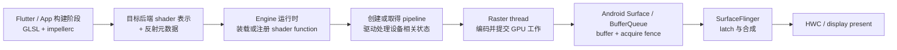

# Vulkan 管线缓存与 Impeller 着色器编译实战

“异步编译管线管理器”可以概括一类工程方案，却不是 Android 17 面向所有应用提供的系统接口。普通 View/Compose 应用、直接使用 Vulkan 的游戏，以及经 ANGLE 运行的 OpenGL ES 应用，分别由不同组件创建图形管线，应用可控制的范围也不同。若没有先分清渲染路径，后续看到的缓存、线程、系统跟踪和优化建议很容易互相错配。

本文按 Android 17 / API 37 / `android-17.0.0_r1` 核查平台实现，按 `android17-6.18-2026-06_r6` 核查 Android 内核。内容回答四个问题：

1. 管线创建时间消耗在哪一侧，为什么它会造成帧停顿；
2. Android 17 的 HWUI、Skia Graphite、原生 Vulkan 和 ANGLE 各自负责什么；
3. 应用怎样安排创建任务、保存缓存并设计降级；
4. Perfetto、FrameTimeline、FrameMetrics 和 Android GPU Inspector（AGI）分别能证明什么。

Vulkan pipeline 和 shader 编译会在首次使用或状态组合变化时产生 CPU 和驱动开销。Impeller 预编译一部分 shader，但设备后端和 Pipeline State Object 仍可能在运行时建立。

机制章的 [Vulkan、HWUI 与多队列渲染管线](../../part2-performance/ch13-rendering-pipelines/05-vulkan-hwui-multi-queue.md) 和 [Flutter 渲染管线](../../part2-performance/ch13-rendering-pipelines/07-flutter-rendering-pipeline.md) 负责解释端到端架构；本文只负责应用或引擎能控制的管线键、创建调度、缓存、预热、降级与验证方法。

## Pipeline Cache、编译与提交时机

### 一、先确认应用走哪条图形路径

| 应用类型 | Android 17 中的典型路径 | 管线创建的直接控制者 | 应用可直接管理 `VkPipelineCache` |
| --- | --- | --- | --- |
| View / Compose 标准窗口 | UI 线程 → HWUI 渲染线程 `RenderThread` → HWUI → Skia Ganesh → GL 或 Vulkan | HWUI、Skia 和驱动 | 否 |
| 原生 Vulkan / 游戏引擎 | 应用线程 → Vulkan 加载器（loader）→ GPU 厂商驱动 | 应用与驱动 | 是 |
| OpenGL ES | 应用 → EGL/GLES → 原生 GLES 驱动，或 ANGLE → Vulkan | GLES 驱动或 ANGLE | 否 |

同一个 APK 里也可能同时存在多条路径。例如，Activity 的控件由 HWUI 绘制，`SurfaceView` 内的游戏画面由原生 Vulkan 绘制，视频再由独立的缓冲生产者提交。排查时要以发生慢帧的 `Surface` 和进程线程为准。

#### 1. Android 17 的 HWUI 仍使用 Ganesh

`android-17.0.0_r1` 的 `Properties.h` 只声明了 `SkiaGL`、`SkiaVulkan` 和 `SkiaCpu` 三种 HWUI 渲染管线。`VulkanManager::createContext()` 返回的是 `GrDirectContexts::MakeVulkan(...)`，其中 `GrDirectContext` 属于 Skia Ganesh。

下面的源码摘录用于确认 Android 17 HWUI 的后端类型，不用于演示应用 API。

```cpp
enum class RenderPipelineType {
    SkiaGL,
    SkiaVulkan,
    SkiaCpu,
    NotInitialized = 128
};

return GrDirectContexts::MakeVulkan(backendContext, options);
```

这两处代码界定了平台边界：AOSP 仓库里虽然包含 Graphite 源码，Android 17 的标准 HWUI Vulkan 上下文仍由 Ganesh 创建。普通 View 或 Compose 页面不能依据 `external/skia/src/gpu/graphite` 的实现细节，推断自己的 `RenderThread` 已经使用 Graphite。

#### 2. Vulkan 后端不等于应用拥有 Vulkan

HWUI 选择 Vulkan 后端时，应用仍然向 `Canvas`、`RenderNode` 或 Compose UI 提交绘制描述。`VkDevice`、`VkQueue`、管线缓存和提交同步均由平台管理。应用无法取得 HWUI 内部的 `VkPipelineCache`，也不应通过反射或私有符号干预它。

原生 Vulkan 应用的责任完全不同。它创建 `VkDevice`、管线布局、图形管线、命令缓冲和同步对象，也要决定何时编译、怎样并发以及何时保存缓存。以下涉及编译线程、`VK_PIPELINE_COMPILE_REQUIRED` 和缓存文件的代码只适用于这条路径。

#### 3. ANGLE 必须先证明后端已启用

OpenGL ES 应用可能使用设备的原生 GLES 驱动，也可能经 ANGLE 把 GLES 调用翻译为 Vulkan。开发者选项、系统配置、应用包配置和采集工具都可能影响选择结果。

因此，ANGLE 内部的状态缓存不能当作所有 GLES 应用共有的“四级缓存”。应记录 `GL_VENDOR`、`GL_RENDERER`、`GL_VERSION` 和 EGL 信息，并结合设备配置或 AGI 采集方式确认后端。ANGLE 的内部缓存也不等于应用可持久化的原生 `VkPipelineCache`。

### 二、管线创建消耗的是主机端时间

一个 Vulkan 图形管线通常由以下输入共同决定：

- 着色器阶段及其 SPIR-V；
- 管线布局、描述符集布局（descriptor set layout，用于规定着色器怎样绑定缓冲与图像）和推送常量（push constant，用于随命令直接传入少量数据）的范围；
- 顶点输入（vertex input）、图元拓扑、光栅化、深度/模板和混合状态；
- 渲染过程及其子过程（render pass / subpass），或动态渲染（dynamic rendering）所用颜色、深度等附件（attachment）的格式；
- 采样数（sample count）、创建管线时固定的专门化常量（specialization constant），以及未声明为动态状态（dynamic state）的其他状态；
- 驱动版本、GPU 设备及驱动内部策略。

构建时把 GLSL 或 HLSL 编译成 SPIR-V，可以去掉应用进程里的着色器前端编译。厂商驱动仍可能在 `vkCreateGraphicsPipelines()` 中校验、优化并生成设备指令。SPIR-V 文件存在，不代表运行时创建成本已经消失。

`vkCreateGraphicsPipelines()` 是主机端命令。它可以在 `RenderThread` 或编译线程上消耗 CPU 和驱动时间，但这段工作不会作为 GPU 命令提交到某个 `VkQueue`。增加图形队列（graphics queue）数量不会自动提高管线编译并行度。

一次卡顿可能出现以下时间关系。

下面的时间线用于区分主机端创建、GPU 提交和显示完成。

```text
CPU / driver:  build state -> vkCreateGraphicsPipelines -> record -> vkQueueSubmit
GPU:                                                        wait -> execute
BufferQueue:                                                              queue
SurfaceFlinger / display:                                                     latch -> compose -> present
```

`vkCreateGraphicsPipelines()` 过长会推迟录制或提交。GPU 可能在前一段时间处于空闲状态，随后又因提交过晚错过显示期限。它与“GPU 执行着色器太慢”是两种问题，需要不同证据。

#### 普通 `uniform` 值通常不会增加管线变体

同一着色器程序和固定状态下，修改普通 `uniform` 变量——绘制时传给着色器、但不写入管线静态状态的数据——通常不需要新建图形管线。下列变化更容易产生新变体：

- 着色器源码或入口发生变化；
- 专门化常量改变；
- 附件格式或采样数改变；
- 混合、深度/模板、图元拓扑等静态状态改变；
- 管线布局不兼容；
- 渲染过程的兼容性条件改变。

优化前应记录管线键由哪些字段组成。把圆角半径、模糊半径或颜色值一概视为“新着色器”，会夸大变体数量；只有这些值被写进着色器源码、专门化常量或其他管线状态时，才会改变对应键。

### 三、标准 View / Compose 应用能做什么

#### 1. 平台负责 HWUI 缓存

Android 17 的 `android_graphics_HardwareRenderer.cpp` 会为 OpenGL 着色器缓存、Skia 着色器缓存和 Skia 管线缓存配置不同路径。`PersistentGraphicsCache.cpp` 在 `separate_pipeline_cache` 开关启用时使用独立管线缓存，并在 Vulkan 帧完成刷新（flush）后检查是否出现新数据。该版本源码把一次保存的数据上限写为 2 MiB。

这些都是 `android-17.0.0_r1` 的平台实现细节，不是 SDK 契约。系统可以在后续版本修改文件格式、上限、写入节奏和失效策略。应用无需也无法自行加载这份 HWUI 缓存。

#### 2. 应用控制的是变体来源和首次出现时机

标准 UI 应用可从以下位置减少首次使用成本：

- `RuntimeShader` 源码保持稳定，把可变化参数放在 `uniform` 变量中；
- 重用已经创建的 `RuntimeShader`、`RenderEffect`、`Shader` 和 `Paint`，避免在每帧重新构造对象；
- 避免在一次关键点击里同时出现大量此前未渲染的效果、字体、图片格式和图层组合；
- 对必须首用的复杂效果，用目标设备上的真实用户操作衡量是否需要提前初始化；
- 让图片解码尺寸、色彩格式和实际显示需求一致，减少不必要的上传与内存带宽；
- 对可接受的视觉效果准备简单实现，并根据实测帧结果选择。

“在冷启动首帧前绘制不可见的 1×1 View”不是可靠的预编译接口。不可见节点可能不进入绘制，1×1 目标也可能产生不同的裁剪区域（clip）、渲染目标（render target）或图层状态；即使触发了某些编译，它也会把额外工作放进启动关键路径。

若业务需要预热，应使用与线上相同的页面、尺寸、颜色空间和效果组合，放在用户可接受的非关键阶段，并用 Macrobenchmark 证明首个关键操作改善且启动没有退化。标准 HWUI 没有公开 API 保证“预热完成了全部目标管线”。

#### 3. Baseline Profile 不保存 GPU 管线

Baseline Profile（基准配置文件）能改善应用 Java/Kotlin 与部分原生代码的编译和执行状态。它不包含厂商 GPU 指令，也不会替代 Skia 或 Vulkan 管线缓存。一次优化同时加入 Baseline Profile 和页面预热后，需要分别验证 CPU 方法执行与图形首次使用成本，避免把收益归错原因。

#### 4. `FrameMetrics.GPU_DURATION` 只描述 GPU 完成时间

API 31 起，`FrameMetrics.GPU_DURATION` 表示该帧在 GPU 上完成所用的总时间；`getMetric()` 在指标不可用时返回 `-1`。它没有提供“着色器编译耗时”分类。主机端管线创建发生在提交之前，可能让帧整体变晚，但不一定让 `GPU_DURATION` 变大。

下面的 Kotlin 代码用于正确采集窗口帧指标，并把回调移出主线程。

```kotlin
class WindowFrameMetricsCollector(
    private val window: Window,
    private val onGpuDuration: (gpuDurationNanos: Long, droppedCallbacks: Int) -> Unit,
) : AutoCloseable {
    private val thread = HandlerThread("frame-metrics").apply { start() }
    private val handler = Handler(thread.looper)

    private val listener = Window.OnFrameMetricsAvailableListener {
            _: Window,
            metrics: FrameMetrics,
            droppedSinceLastInvocation: Int,
        ->
        val gpuDuration = metrics.getMetric(FrameMetrics.GPU_DURATION)
        if (gpuDuration >= 0L) {
            onGpuDuration(gpuDuration, droppedSinceLastInvocation)
        }
    }

    fun start() {
        window.addOnFrameMetricsAvailableListener(listener, handler)
    }

    override fun close() {
        window.removeOnFrameMetricsAvailableListener(listener)
        thread.quitSafely()
    }
}
```

监听器注册在 `Window` 上，参数类型是 `android.view.FrameMetrics`。代码只上报可用值，并保留回调丢失数量。线上阈值应来自同一设备组、刷新率和用户操作的分布，不能用固定的 15 ms 推断管线编译。

### 四、HWUI 的两个 Vulkan 队列解决什么问题

`VulkanManager.cpp` 从同一个图形队列族（graphics queue family，一组能力和调度属性相同的队列）请求两个 `VkQueue`：索引 0 保存到 `mGraphicsQueue`，索引 1 保存到 `mAHBUploadQueue`。`HardwareBitmapUploader` 创建上传用的 Ganesh 上下文时选择后者。

下面的源码摘录用于核对队列数量、优先级数组和索引。

```cpp
constexpr auto kRequestedQueueCount = 2;
float queuePriorities[kRequestedQueueCount] = {0.0};

// 同一个 VkDeviceQueueCreateInfo:
// queueFamilyIndex = mGraphicsQueueIndex
// queueCount = kRequestedQueueCount
// pQueuePriorities = queuePriorities

mGetDeviceQueue(mDevice, mGraphicsQueueIndex, 0, &mGraphicsQueue);
mGetDeviceQueue(mDevice, mGraphicsQueueIndex, 1, &mAHBUploadQueue);
```

这段实现有四个边界：

1. 两个队列来自同一个队列族；
2. `queuePriorities` 的两个元素都为 `0.0f`；
3. 可选的全局队列优先级（global priority）挂在同一份 `VkDeviceQueueCreateInfo` 上，没有为上传队列设置单独的低优先级；
4. Vulkan 允许多个队列独立提交，但设备可以在同一硬件引擎上串行执行，源码无法保证物理并行。

`VK_EXT_global_priority` 也不是普通应用可依赖的“渲染高、上传低”策略。HWUI 只有在上下文优先级非零、扩展可用且请求值满足设备条件时，才会附加全局队列优先级；不支持时会放弃该请求或由驱动返回错误。

`HardwareBitmapUploader` 的 Vulkan 路径使用专用上传线程和上传队列，但代码内部还会调用 `queue().runSync(...)`，提交时使用 `GrSyncCpu::kYes`。这表示上传工作与 `RenderThread` 使用不同上下文和队列，不表示每个调用都能让调用者立即返回。

两个队列的价值在于隔离提交状态，并减少相互等待的机会。最终能否并行、内存带宽是否竞争、上传是否延迟渲染，仍要在目标设备上查看 GPU 阶段和同步栅栏（fence）。

### 五、Graphite `PipelineManager` 的准确边界

#### 1. `PipelineCreationTask` 先处理重复请求

`external/skia` 的 Graphite `PipelineManager::createHandle()` 按以下次序处理请求：

1. 查询同一个管线键是否已有正在执行的任务；
2. 查询全局缓存是否已有管线；
3. 在自旋锁（spinlock，等待期间持续检查锁状态的轻量锁）保护下再次确认，并创建或复用任务。

这个设计避免并发请求为同一个键重复创建管线。`SkSpinlock` 只保护正在执行的任务表及其短临界区；它不是管线编译队列，也没有“先到请求拥有更高优先级”的语义。

#### 2. Android 17 标签中的 Vulkan 基础实现是同步调用

`PipelineCreationTask.h` 把任务描述为“可能交给线程的工作单元”。“可能”不能省略。`PipelineManager::startPipelineCreationTask()` 在当前实现中直接调用 `SharedContext::findOrCreateGraphicsPipeline()`，完成后设置 `fCompleted`。`resolveHandle()` 还明确说明，非线程版本在执行到这里之前已经完成任务。

`DrawPass::prepareResources()` 的当前顺序是：

- 创建句柄（handle）；
- 立即调用 `startPipelineCreationTask()`；
- 随后调用 `resolveHandle()`。

所以，不能把它概括为“在 `snap` 时派发到后台，到 `insertRecording` 时统一等待”。是否异步取决于具体后端、执行器（executor，即负责把任务交给线程运行的调度实现）和调用方式；`android-17.0.0_r1` 的这条 Vulkan 基础路径没有展示一个通用的后台编译调度器。

#### 3. Graphite 跟踪名称不能套到 HWUI

该标签中的 Graphite Vulkan 源码使用 `skia.shaders` 跟踪类别，并包含下列已核对的区间名称：

- `CreateGraphicsPipeline`
- `CreateGraphicsPipeline-CacheLookup`
- `CreateGraphicsPipeline-CompileAfterCacheMiss`
- `CreateGraphicsPipeline-CacheLookupOrCompile`

这些名称只在相应 Graphite 构建和跟踪配置中有意义。AOSP 没有一个可对所有应用保证的 `gpu.graphite` 轨道（track，即 Perfetto 中按线程或数据源组织的一行时间数据）。标准 Android 17 HWUI 使用 Ganesh；即使看到 `RenderThread` 的 `flush` 区间变长，也不足以认定 Graphite 任务正在等待。

Graphite 的 Vulkan 实现仍提供了一种可参考的控制方式：设备支持管线创建缓存控制（pipeline creation cache control）时，它先带 `FAIL_ON_PIPELINE_COMPILE_REQUIRED` 查询缓存；收到 `VK_PIPELINE_COMPILE_REQUIRED` 后，去掉该标志，再执行允许编译的调用。原生 Vulkan 引擎可以采用相同思路，但必须自行安排编译线程和降级管线。

### 六、原生 Vulkan 的任务调度

#### 1. 构建稳定的管线键

应用应先为每个可执行管线定义稳定键。键至少覆盖：

- 着色器内容哈希、入口和专门化常量；
- 管线布局版本；
- 附件格式、采样数与渲染模式；
- 所有静态光栅化、深度/模板和混合状态；
- 会影响兼容性的引擎版本。

管线键用于任务去重、缓存统计和回归定位。不要把整个 `VkGraphicsPipelineCreateInfo` 直接浅拷贝进工作队列，它含有大量指针；调用者离开作用域后，编译线程可能读到失效内存。队列应保存 `PipelineKey`，或持有完整、不可变的创建配方，并由编译线程在调用时重建创建信息结构（create info）。

#### 2. 队列只接收缺失且仍需要的任务

一个实用状态机可以包含：

| 状态 | 含义 | 前台渲染行为 |
| --- | --- | --- |
| `Unknown` | 尚未查询内存表或驱动缓存 | 发起仅缓存查询 |
| `Ready` | 已有可绑定的 `VkPipeline` | 直接使用 |
| `Queued` | 管线键已进入编译队列 | 使用兼容的降级管线或延后该物体 |
| `Compiling` | 编译线程正在创建 | 不重复提交 |
| `Failed` | 创建失败，保留 `VkResult` 和上下文 | 选择明确降级，限制重试 |

任务优先级应来自用户可见性和截止时间。例如，当前加载界面即将结束的场景高于远处尚未加载的关卡。优先级不能从“着色器代码越短越高”推导；源码长度与驱动创建成本没有稳定对应关系。

编译线程数量也没有通用答案。过多线程会争用 CPU、驱动内部锁和管线缓存。应在代表设备上比较 1、2、4 个编译线程的总完成时间、关键线程调度和峰值内存，再决定上限。

#### 3. 用仅缓存查询保护渲染线程

Vulkan 1.3 核心功能包含管线创建缓存控制；较旧实现可通过 `VK_EXT_pipeline_creation_cache_control` 提供同类能力。应用必须查询并启用对应功能位（feature），不能仅凭 API 版本字符串使用标志。

下面的 C++ 函数用于执行一次“不允许现场编译”的图形管线查询。

```cpp
VkResult tryCreateCachedGraphicsPipeline(
        VkDevice device,
        VkPipelineCache cache,
        const VkGraphicsPipelineCreateInfo& baseInfo,
        VkPipeline* pipeline) {
    VkGraphicsPipelineCreateInfo queryInfo = baseInfo;
    queryInfo.flags |=
            VK_PIPELINE_CREATE_FAIL_ON_PIPELINE_COMPILE_REQUIRED_BIT;
    *pipeline = VK_NULL_HANDLE;
    return vkCreateGraphicsPipelines(
            device,
            cache,
            1,
            &queryInfo,
            nullptr,
            pipeline);
}
```

调用期间，`baseInfo` 引用的所有数组和 `pNext` 结构必须保持有效。返回 `VK_SUCCESS` 时可发布管线；返回 `VK_PIPELINE_COMPILE_REQUIRED` 时，应把对应键交给编译线程，并让它用不带该标志的创建信息执行允许编译的调用。其他错误要按 `VkResult` 处理，不能全部当成缓存未命中（cache miss）。

这个标志只阻止当前调用执行昂贵编译，不会自动创建后台任务，也不提供降级管线。降级管线必须与渲染过程、管线布局、描述符绑定和资源格式兼容；兼容条件无法满足时，应延后绘制，不能绑定错误管线。

#### 4. 控制并发与发布

编译线程完成 `vkCreateGraphicsPipelines()` 后，应通过互斥锁、原子状态或线程安全队列把结果发布给渲染线程。发布前不能让其他线程看到只初始化了一部分的业务对象。`VkPipeline` 的销毁要等待使用它的 GPU 工作完成，不能因为业务键被替换，就立即销毁仍被命令缓冲（command buffer）引用的管线。

默认创建的 `VkPipelineCache` 可由多个线程同时传给管线创建命令，规范要求驱动对这种使用做内部同步。如果创建缓存时设置了 `VK_PIPELINE_CACHE_CREATE_EXTERNALLY_SYNCHRONIZED_BIT`，应用就接管了修改命令的同步责任，所有会修改该缓存的调用都要按规范串行化。

驱动的内部同步仍可能限制扩展性。两种常见方案都需要实测：

- 多个编译线程共用一个默认缓存，代码简单，驱动负责同步；
- 每个编译线程使用独立缓存，在受控时点用 `vkMergePipelineCaches()` 合并。

后一种方案会增加内存、合并和持久化复杂度。没有测量结果时，共用默认缓存更容易保持正确。

### 七、正确保存 `VkPipelineCache`

#### 1. 缓存数据是不透明的驱动数据

`vkGetPipelineCacheData()` 返回的内容可以在后续运行中作为初始数据传给 `VkPipelineCacheCreateInfo::pInitialData`。除文件头（header）外，其余字节都是驱动定义的不透明数据；应用不能自行解释，也不能把一个设备的数据分发给所有设备。

版本一文件头包含：

- `headerSize`；
- `headerVersion`；
- `vendorID`；
- `deviceID`；
- `pipelineCacheUUID`。

驱动会忽略不兼容的初始数据。应用仍应在加载前校验文件头，以便删除损坏文件、记录失效原因，并避免把无关数据反复交给驱动。缓存文件名还应包含应用的图形资源版本；着色器或管线布局发生不兼容变更时，应使用新的命名空间。

下面的 C++ 函数按 Vulkan 规定的小端字节布局，校验版本一文件头。

```cpp
bool isCompatiblePipelineCache(
        std::span<const std::byte> data,
        const VkPhysicalDeviceProperties& properties) {
    constexpr size_t kHeaderSize = 4 * sizeof(uint32_t) + VK_UUID_SIZE;
    if (data.size() < kHeaderSize) {
        return false;
    }

    const auto readLe32 = [&data](size_t offset) {
        return static_cast<uint32_t>(std::to_integer<uint8_t>(data[offset])) |
                (static_cast<uint32_t>(
                         std::to_integer<uint8_t>(data[offset + 1]))
                 << 8) |
                (static_cast<uint32_t>(
                         std::to_integer<uint8_t>(data[offset + 2]))
                 << 16) |
                (static_cast<uint32_t>(
                         std::to_integer<uint8_t>(data[offset + 3]))
                 << 24);
    };

    return readLe32(0) == kHeaderSize &&
            readLe32(4) == VK_PIPELINE_CACHE_HEADER_VERSION_ONE &&
            readLe32(8) == properties.vendorID &&
            readLe32(12) == properties.deviceID &&
            std::memcmp(
                    data.data() + 4 * sizeof(uint32_t),
                    properties.pipelineCacheUUID,
                    VK_UUID_SIZE) == 0;
}
```

这段代码没有依赖 C++ 结构体的填充字节（padding）。调用文件需要包含 `<cstddef>`、`<cstdint>`、`<cstring>` 和 `<span>`。检查通过后仍要处理 `vkCreatePipelineCache()` 的返回值；文件头兼容只说明数据可以尝试使用，不保证每次创建或后续查询都会命中缓存。

#### 2. 写文件要服从 Vulkan 对象生命周期

可靠的保存流程如下：

1. 停止接收新的管线创建任务，并等待当前编译线程到达约定的安全点；
2. 第一次调用 `vkGetPipelineCacheData()` 取得所需大小；
3. 分配缓冲并再次调用，接受 `VK_SUCCESS`，按设计处理 `VK_INCOMPLETE`；
4. 写到同目录临时文件，`fsync` 需求由产品的数据耐久策略决定；
5. 原子替换正式文件；
6. 保存成功后再更新业务版本标记。

这里暂停编译线程，主要是为了得到与当前引擎版本一致、便于复现的快照，并避免与缓存或设备销毁过程交错。若使用外部同步缓存，即设置了 `VK_PIPELINE_CACHE_CREATE_EXTERNALLY_SYNCHRONIZED_BIT`，还必须满足对应的主机端同步要求。

不要在每一帧写缓存。适合的时机包括加载阶段结束、累计产生新管线后的受控后台时点，以及正常退出流程中仍有足够生命周期时。Android 进程可能被直接终止，缓存正确性不能依赖退出回调一定执行。

#### 3. 缓存失效要使用图形身份

推荐的缓存身份至少包含：

- `vendorID`、`deviceID` 和 `pipelineCacheUUID`；
- 应用或引擎的管线结构版本；
- 着色器包内容版本；
- 影响创建信息的渲染配置版本。

`Build.SOC_MODEL` 表示片上系统（system-on-chip，SoC）的型号，适合用作诊断标签，不适合单独决定缓存兼容性。系统升级后若 `pipelineCacheUUID` 改变，应丢弃旧数据；如果 UUID 没变，仍由驱动判断初始数据是否可用。

### 八、可选 Vulkan 能力怎样使用

#### 1. 管线创建反馈

Vulkan 1.3 核心类型 `VkPipelineCreationFeedback`（或对应的扩展别名）用于返回管线创建耗时和状态标志。只有 `VK_PIPELINE_CREATION_FEEDBACK_VALID_BIT` 置位时，其余字段才有定义；`duration` 的单位是纳秒。

`VK_PIPELINE_CREATION_FEEDBACK_APPLICATION_PIPELINE_CACHE_HIT_BIT` 表示驱动从应用传入的管线缓存中找到了可立即使用的结果，从而避开了大部分创建工作。这个反馈适合统计真实管线键的命中率和创建耗时分布，比预设“单条管线必须小于多少毫秒”更可靠。

反馈是驱动对一次创建调用的报告，不是 GPU 执行时间。使用时应同时记录管线键、线程、场景、创建结果、是否命中缓存和调用耗时，但线上日志不要包含着色器源码，也不要生成数量不受控的动态名称。

#### 2. 图形管线库

`VK_EXT_graphics_pipeline_library` 可以把图形管线分为四部分：顶点输入接口（vertex input interface）、光栅化前着色器（pre-rasterization shaders）、片段着色器（fragment shader）和片段输出接口（fragment output interface）。应用可以复用公共部分，再把它们链接为可执行管线。该扩展依赖 `VK_KHR_pipeline_library`，并提供独立的功能位和属性（properties，描述设备支持程度但不能由应用启用的只读值）。

应用需要查询并启用 `graphicsPipelineLibrary` 功能位。`graphicsPipelineLibraryFastLinking` 属性会影响即时链接策略：值为 `VK_TRUE` 时，不使用链接时优化的链接成本应与录制一条命令相近；值为 `VK_FALSE` 时，链接通常仍比完整编译便宜，但不能再假定成本接近命令录制。链接时优化（link-time optimization）还可能用更长的创建时间换取更好的运行性能。

该扩展适合材质组合多、公共状态复用明显的引擎。它不会消除变体数量，也不保证所有 Android 17 设备支持。接入前要比较：

- 加载总时间；
- 首次使用的长尾；
- 管线缓存体积；
- 链接后 GPU 执行时间；
- 驱动稳定性和内存增长。

#### 3. 动态状态

设备支持相应动态状态时，把频繁变化的固定功能状态改为录制命令时设置，可以减少管线组合数。代价可能包括驱动路径差异、录制复杂度和运行时性能变化。应从实际管线键统计中找出取值种类很多的维度，再选择设备能力允许的状态，不能一次性启用所有动态状态。

### 九、把创建任务放在合适的用户阶段

#### 普通 UI

普通 UI 没有公开的管线编译队列。优化重点是减少不必要的效果变体，让目标效果在可接受阶段首次出现，并以真实页面的帧结果验证。若某效果只在低频入口出现，提前初始化它可能只会增加大多数用户的启动与内存成本。

#### 游戏和原生渲染器

游戏可以在加载界面、关卡流式加载或资源包安装后创建下一阶段必需的管线。进度条应由已完成的必要任务驱动，不能只按已提交任务数量推进。加载结束前要确认当前场景的必需集合进入 `Ready`，可选集合可以延迟创建或使用兼容的降级管线。

任务优先级建议考虑：

- 距离可见的帧数或场景阶段；
- 是否存在视觉可接受的降级管线；
- 资源依赖是否已经就绪；
- 该管线键是否正在创建；
- 最近的创建耗时分布；
- 当前 CPU 热状态和编译队列长度。

设备策略应基于运行时功能位、属性和实测分布。按“高端、中端、低端”写死 SoC 名单很快会失效，也无法反映同一 GPU 在不同驱动和散热状态下的差异。

#### 热更新

着色器包或原生引擎更新后，应提升业务管线结构版本或着色器包版本。只删除发生变化的逻辑键可以减少重建量，但驱动缓存本身是整体不透明数据；应用不能从二进制文件中安全移除单个条目。

灰度期间应比较相同设备身份、相同场景和相同刷新率下的：

- 仅缓存查询命中率；
- 管线创建反馈的长尾耗时；
- 加载时长；
- 首次交互慢帧；
- GPU 执行时间；
- 缓存文件体积和创建失败率。

### 十、诊断时按时间域收集证据

#### 1. 原生 Vulkan：在调用点添加固定跟踪标记

原生引擎能直接测量自己的管线创建。跟踪标记（trace marker）名称应固定，动态管线键应写入结构化遥测字段，避免为每个键生成新的跟踪名称。

下面的 C++ 代码用于测量一次主机端创建调用，并在 Perfetto 中留下可定位的区间。

```cpp
struct PipelineCreateSample {
    VkResult result;
    VkPipeline pipeline;
    int64_t wallTimeNanos;
};

PipelineCreateSample createMeasuredGraphicsPipeline(
        VkDevice device,
        VkPipelineCache cache,
        const VkGraphicsPipelineCreateInfo& createInfo) {
    ATrace_beginSection("NativeVulkan::CreateGraphicsPipeline");
    const auto begin = std::chrono::steady_clock::now();

    VkPipeline pipeline = VK_NULL_HANDLE;
    const VkResult result = vkCreateGraphicsPipelines(
            device,
            cache,
            1,
            &createInfo,
            nullptr,
            &pipeline);

    const auto end = std::chrono::steady_clock::now();
    const auto wallTimeNanos =
            std::chrono::duration_cast<std::chrono::nanoseconds>(
                    end - begin)
                    .count();
    ATrace_endSection();
    return PipelineCreateSample{result, pipeline, wallTimeNanos};
}
```

调用文件需要包含 `<android/trace.h>`、`<chrono>` 和 `<cstdint>`。显式转换保证 `wallTimeNanos` 使用纳秒单位。`ATrace` 区间和调用耗时都描述调用线程上的主机端时间；GPU 是否繁忙、该管线后续执行多久，需要 GPU 跟踪、时间戳查询（timestamp query）或 AGI 提供独立证据。

#### 2. 标准 HWUI：只能做关联，不能越级归因

在标准 View/Compose 页面中，应用看不到 HWUI 内部每个 `vkCreateGraphicsPipelines()` 调用。排查顺序可以是：

1. 用 FrameTimeline 找到同一用户操作中的慢帧，并区分应用与 SurfaceFlinger 两侧；
2. 检查主线程是否及时完成 UI、测量、布局和绘制记录；
3. 检查 `RenderThread` 是否在同一帧出现异常长区间或提交变晚；
4. 比较效果首次出现与重复出现；
5. 用可控开关移除某个 `RuntimeShader`、`RenderEffect` 或图层组合后复测；
6. 需要源码级结论时，使用带对应平台跟踪点的系统构建或 GPU 厂商工具。

“首次出现时 `RenderThread` 变长、第二次恢复”是缓存或初始化问题的线索，还可能来自字形栅格化、图片上传、图层分配、驱动初始化等工作。没有调用级证据时，结论应写成相关性。

#### 3. AGI 的适用范围

AGI 的帧分析器（Frame Profiler）可以展示 Vulkan API 调用、管线数据、渲染状态、着色器资源和 GPU 性能数据。它适合直接使用 Vulkan 的应用；对 OpenGL ES，AGI 会使用定制 ANGLE，把调用翻译为 Vulkan 后再采集单帧。这个采集环境可能不同于用户设备原本的 GLES 后端，结论要标明条件。

AGI 能看到一帧内的 API 调用和 GPU 工作，但长时间加载阶段不能只靠单帧采集解释。大量管线预编译应同时使用系统跟踪、引擎遥测和阶段统计。

#### 4. 缓冲生命周期只能缩小范围

渲染链路中常见的时间段可以这样读取：

| 时间段 | 可以说明 | 不能单独说明 |
| --- | --- | --- |
| `DEQUEUE → QUEUE` | 缓冲生产者（producer）从取得缓冲到提交缓冲的总区间变长 | 具体由管线创建、CPU 绘制、GPU 执行还是等待造成 |
| `QUEUE → LATCH` | 缓冲提交后没有在预期时点被 SurfaceFlinger 采用 | 着色器编译发生在 GPU，或 SurfaceFlinger 一定在等待该编译 |
| `LATCH → PRESENT` | 合成、显示调度和呈现相关区间变长 | 应用的 `RenderThread` 正在编译着色器 |

`queueBuffer()` 返回只表示缓冲生产者完成了提交动作。`vkQueueSubmit()` 和 `vkQueuePresentKHR()` 返回也不等于 GPU 工作完成或像素已经显示。还要查看获取、释放和呈现同步栅栏（acquire/release/present fence）、FrameTimeline 与显示事件。

#### 5. 内核证据的责任范围

`android17-6.18-2026-06_r6` 可用于解释：

- 编译线程或 `RenderThread` 是否获得 CPU；
- 唤醒后是否长时间等待调度；
- `dma-fence` / `sync_file`（Linux 内核与用户空间传递同步完成状态的机制）何时发出完成信号；
- CPU 频率、空闲状态、热限制和内存压力是否影响主机端调用；
- GPU 厂商驱动线程是否出现可观察的等待。

通用内核代码不知道业务 `PipelineKey`，也无法仅凭一个同步栅栏名称判断驱动正在编译哪段着色器。GPU 指令编译和执行的详细原因通常需要厂商驱动跟踪、AGI 或应用自己的调用标记。

### 十一、工程检查清单

#### 标准 View / Compose

- [ ] 已确认慢帧属于目标应用窗口和目标 `Surface`；
- [ ] 已区分 UI 主线程、`RenderThread`、GPU、SurfaceFlinger 和显示阶段；
- [ ] 没有把 Graphite 源码当成 Android 17 HWUI 默认路径；
- [ ] `RuntimeShader` 的变化参数优先使用 `uniform`；
- [ ] 没有用不可见 1×1 View 代替真实场景验证；
- [ ] `FrameMetrics.GPU_DURATION` 只用于 GPU 时间统计；
- [ ] 优化前后使用相同设备、刷新率和用户操作复测。

#### 原生 Vulkan

- [ ] 管线键覆盖着色器、管线布局、附件和静态状态；
- [ ] 编译线程持有不可变创建配方，未浅拷贝悬空指针；
- [ ] 已查询并启用管线创建缓存控制；
- [ ] 仅缓存查询未命中时会进入去重队列，不会在渲染线程直接编译；
- [ ] 降级管线与管线布局、渲染过程和资源绑定兼容；
- [ ] 编译线程数量来自目标设备实测；
- [ ] 管线缓存文件头校验厂商 ID、设备 ID 和 UUID；
- [ ] 缓存通过临时文件和原子替换保存；
- [ ] 外部同步缓存有明确同步策略；
- [ ] 管线销毁等待相关 GPU 使用完成；
- [ ] 创建反馈、`ATrace` 和 GPU 数据分别记录主机端创建与 GPU 执行。

### 十二、版本与实现边界

| 项目 | 采用的边界 |
| --- | --- |
| Android 平台 | Android 17 / API 37 / `android-17.0.0_r1` |
| HWUI | 标准路径按 Skia Ganesh 核查；不把 Graphite 源码等同于 HWUI 默认实现 |
| Vulkan | 以设备实际报告并启用的 API、扩展、功能位和属性为准 |
| Android 内核 | `android17-6.18-2026-06_r6`，用于调度、同步栅栏和驱动线程证据 |
| 厂商驱动 | 设备相关；AOSP 公共源码无法保证编译并行度、缓存命中成本和 GPU 队列的物理并行 |

Android 16 的历史数据可以用于对比，但相关源码名称、跟踪标记和 HWUI 缓存实现只对 Android 17 锚点作核查。后续平台若把 HWUI 切换到 Graphite，应重新核对 `RenderPipelineType`、上下文创建点、管线任务执行方式和跟踪类别，不能沿用这里的结论。

### 十三、常见错误结论

| 错误结论 | 修正后的判断 |
| --- | --- |
| Android 17 HWUI 默认使用 Graphite | `android-17.0.0_r1` 的 HWUI 创建 Ganesh `GrDirectContext` |
| `PipelineCreationTask` 一定在后台线程执行 | 当前 Graphite 基础实现可在调用线程直接创建并立即解析句柄（resolve） |
| 两个 Vulkan 队列能并行编译管线 | 管线创建是主机端命令，队列承载 GPU 提交 |
| HWUI 给渲染队列高优先级、上传队列低优先级 | 两个队列使用同一份创建信息，优先级数组均为 `0.0f` |
| 有 SPIR-V 就没有运行时编译 | 厂商驱动仍可能在管线创建中生成设备代码 |
| `GPU_DURATION` 变高可确认着色器编译 | 该指标描述 GPU 完成时间，不提供主机端编译归因 |
| `DEQUEUE → QUEUE` 长就能确认编译卡顿 | 它只限定缓冲生产者区间，仍需调用级和线程证据 |
| 改变普通 `uniform` 一定生成新管线 | 普通 `uniform` 值通常不进入管线键 |
| Android 17 设备都支持图形管线库 | 必须在运行时查询该设备扩展和功能位 |
| Baseline Profile 会预编译 GPU 管线 | 它针对应用代码执行，不保存厂商 GPU 管线 |

### 十四、Vulkan 管线小结

标准 View/Compose 应用只能控制效果变体与首次出现时机，HWUI 的 Vulkan 设备、队列和持久化缓存由平台管理；直接使用 Vulkan 的引擎才负责管线键、创建线程、缓存文件、发布与销毁。管线创建属于主机端工作，不能用 GPU 队列数量、`GPU_DURATION` 或单段缓冲生命周期直接归因。

工程优化应先确认实际图形路径，再以仅缓存查询、任务去重、兼容降级和可验证的持久化降低关键帧首次创建成本。所有可选扩展与并发策略都必须按设备能力和真实分布启用。

## Impeller Shader、PSO 与预热

原生 Vulkan 的 pipeline 机制同样约束 Impeller 后端。预编译、缓存命中和设备驱动差异决定首帧是否仍出现编译抖动。

### 1. 先区分着色器、图形管线与一帧显示

离线编译只覆盖着色器处理的一部分，运行时仍有图形管线创建和驱动处理成本。需要分别观察四个阶段：

- **着色器源码编译与反射**：`impellerc` 在 Flutter 引擎或应用构建阶段把 GLSL 转换成目标后端需要的表示，并生成资源绑定信息。设备运行时不再解析同一份 GLSL，也不需要为 Impeller 内建着色器重复执行运行时反射。
- **着色器模块装载或注册**：运行时还要从引擎内置的着色器归档文件或应用资源中读取目标后端代码，并向图形后端注册可用的着色器函数。
- **管线状态对象创建**：Vulkan 必须根据着色器阶段、顶点布局、混合模式、颜色或深度附件（attachment）格式和采样数等描述创建管线状态对象。驱动可以在这个阶段做验证、链接、特化和设备相关优化。
- **GPU 执行与显示**：管线可用后，光栅线程（Raster 线程）才会编码绘制命令。CPU 提交 GPU 工作不等于内容已经显示；缓冲还要经过 Android `Surface`、SurfaceFlinger、硬件合成器 HWC 或 RenderEngine，再由显示系统呈现。

这张流程图用于确定每类耗时属于哪一层。



图中离线完成的是着色器前端处理和反射。管线创建、GPU 执行、缓冲交付与显示都发生在设备运行期间，分析卡顿时不能把它们合成一个“着色器编译”标签。

Flutter 官方页面把 Impeller 的目标概括为离线编译着色器、预先构建管线和显式管理缓存。Flutter 3.44.7 的实现仍会按需创建管线变体，也支持运行时片段着色器。“预先构建”表示引擎尽早创建常用管线，并通过异步任务降低关键帧等待它的概率；所有可能的管线不会在首帧前全部完成。

### 2. Android 上启用 Impeller 的精确条件

#### 2.1 Flutter 3.44.7 的选择分支

Flutter 3.27 起，官方支持范围是 Android API 29 及以上默认启用 Impeller。Flutter 3.44.7 的 [`Settings::enable_impeller`](https://github.com/flutter/flutter/blob/3.44.7/engine/src/flutter/common/settings.h) 在 Android 构建中默认是 `true`，而 [`FlutterMain::SelectedRenderingAPI()`](https://github.com/flutter/flutter/blob/3.44.7/engine/src/flutter/shell/platform/android/flutter_main.cc) 进一步选择具体渲染路径：

| 条件 | Flutter 3.44.7 返回的路径 |
| --- | --- |
| 显式软件渲染 | 软件渲染；Impeller 不支持该模式 |
| `debug`（调试）或 `profile`（性能分析）模式显式指定 `opengles` | Impeller OpenGL ES |
| `debug` 或 `profile` 模式显式指定 `vulkan` | Impeller Vulkan |
| Impeller 开启、API ≥ 29，且未被 Vivante 条件排除 | Impeller 自动选择 |
| 其余情况 | Skia OpenGL ES |

自动选择由 [`AndroidContextDynamicImpeller`](https://github.com/flutter/flutter/blob/3.44.7/engine/src/flutter/shell/platform/android/android_context_dynamic_impeller.cc) 执行。它先构造 Vulkan 上下文，并检查 API、设备属性、所需扩展和上下文有效性；Vulkan 路径不可用时，创建 `AndroidContextGLImpeller`。因此 API 29+ 的自动选择回退通常是 **Impeller OpenGL ES**；API 29 以下、禁用 Impeller 或更早的选择分支才是 **Skia OpenGL ES**。

Flutter 官方文档把低版本 Android 或 Vulkan 不可用时的行为概括为回退到旧 OpenGL 渲染器。做源码级诊断时需要继续区分 Impeller GLES 与 Skia GLES，因为两者的着色器、管线、轨迹事件和缓存行为不同。设备规避列表属于 Flutter 3.44.7 的实现数据，不宜写成长期兼容性规则。

#### 2.2 配置开关用于诊断，不能替代修复

开发阶段可以用以下命令对比 Impeller 与 Skia。该命令的用途是建立诊断对照组。

```shell
flutter run --profile --no-enable-impeller
```

该开关让 `profile` 构建停用 Impeller。对照结果只能说明问题与渲染路径相关，不能直接证明根因是着色器编译；两条路径还可能在纹理上传、离屏层、驱动接口和缓存状态上有差异。

Flutter 3.44.7 也允许在 `debug` 或 `profile` 模式指定 Impeller 后端。这段 Android Manifest 配置用于把测试固定到 OpenGL ES。

```xml
<application>
    <meta-data
        android:name="io.flutter.embedding.android.ImpellerBackend"
        android:value="opengles" />
</application>
```

[`README.md`](https://github.com/flutter/flutter/blob/3.44.7/engine/src/flutter/impeller/README.md) 和 `SelectedRenderingAPI()` 都把这项后端覆盖限定在 `debug` 或 `profile` 模式。`release`（发布）构建会忽略这条显式后端分支，不能把它当作生产设备分流方案。

部署版本当前可通过 `io.flutter.embedding.android.EnableImpeller=false` 停用 Impeller。Flutter 3.44.7 的引擎会输出警告，说明命令行和 Manifest 中的退出选项将在后续版本移除。生产回退适合短期规避已确认的兼容性问题，同时应保留可复现样例、设备与驱动信息、性能轨迹，并向 Flutter 问题跟踪器提交证据。

### 3. Impeller 如何减少管线首次创建对帧的影响

#### 3.1 内建着色器在引擎构建阶段处理

[`impellerc`](https://github.com/flutter/flutter/tree/3.44.7/engine/src/flutter/impeller/compiler) 以 GLSL 为输入，生成 Vulkan SPIR-V、OpenGL ES GLSL 或其他后端表示，并生成 C++ 绑定信息。生成物随引擎的着色器归档文件一起打包，`impellerc` 本身不会进入应用运行时。

这一步减少的是设备上的着色器前端编译和反射工作。Vulkan 驱动还要处理 `vkCreateGraphicsPipelines` 或 `vkCreateComputePipelines`，所以冷启动或首次使用某个状态组合时可能出现 CPU 峰值。

#### 3.2 常用管线句柄会尽早创建

[`ContentContext`](https://github.com/flutter/flutter/blob/3.44.7/engine/src/flutter/impeller/entity/contents/content_context.cc) 为纯色填充、纹理、裁剪、模糊和混合等常见绘制类型建立默认管线句柄。默认句柄通常以异步方式提交创建任务，让工作线程在渲染开始前后并行处理。

管线描述还包含着色器之外的状态。颜色附件格式、混合模式、模板状态、采样数和其他固定状态都可能形成不同描述。`ContentContextOptions` 变化时，引擎可以从默认描述创建变体；未创建过的变体可能在使用时同步生成。页面只修改 `uniform` 变量——绘制时传给着色器的参数——通常可以复用管线，修改管线描述中的状态则可能增加变体。

#### 3.3 `PipelineCompileQueue` 处理并发、去重与提前执行

Flutter 3.44.7 的 [`PipelineCompileQueue`](https://github.com/flutter/flutter/blob/3.44.7/engine/src/flutter/impeller/renderer/pipeline_compile_queue.cc) 使用并发任务执行器处理管线创建任务，并以 `PipelineDescriptor` 保存尚未执行的任务。Vulkan [`PipelineLibraryVK::GetPipeline()`](https://github.com/flutter/flutter/blob/3.44.7/engine/src/flutter/impeller/renderer/backend/vulkan/pipeline_library_vk.cc) 同时维护描述到异步结果的映射：

1. 已存在的描述直接返回同一个异步结果，避免重复创建。
2. 新描述先写入映射，再把创建任务投到编译队列。
3. 渲染路径需要该管线时，`GenericRenderPipelineHandle::WaitAndGet()` 会调用 `PerformJobEagerly()`。
4. 任务还在待执行映射中时，等待方把它取出并立即执行，然后等待异步结果。

第 4 步说明，异步提交不能保证 Raster 线程始终避开管线创建。工作线程尚未处理到目标任务，而当前帧已经需要它时，等待线程会取走并执行该任务。此时管线创建成本可能进入 Raster 帧区间。

`PipelineCompileQueue` 在任务被提前取走时递增 `PrioritiesElevated` 计数器。它适合判断“当前帧需要的管线曾在队列中等待”，但计数器只表示优先级调整次数，不能给出单次创建耗时，也不能说明 GPU 已经完成相关工作。

#### 3.4 OpenGL ES 与 Vulkan 需要分别观察

Vulkan 后端的管线对象和显式缓存边界清楚；OpenGL ES 驱动会在程序链接、首次绘制或其他内部阶段处理实现相关工作。相同页面在 Vulkan 与 GLES 下出现不同尖峰很常见，但不能据此给 GPU 品牌做固定性能排序。

测试组合至少记录：

- Flutter SDK 与引擎提交；
- Android 构建版本与 API 级别；
- Impeller Vulkan、Impeller GLES 或 Skia GLES；
- GPU 型号、驱动版本和 ABI（应用二进制接口）；
- 冷安装、清缓存后的首次运行，以及保留缓存的后续运行；
- 屏幕刷新率、分辨率、温度和功耗限制状态。

### 4. Vulkan 管线缓存的能力与限制

#### 4.1 内存中的描述缓存

`PipelineLibraryVK` 以完整描述为键，保存图形管线和计算管线的异步结果。在同一个引擎上下文内，相同描述可以复用已经创建或正在创建的对象。这个缓存避免当前进程重复创建同一管线；应用重启后，还需要磁盘缓存协助驱动复用内部数据。

#### 4.2 磁盘中的 `VkPipelineCache` 数据

[`PipelineCacheVK`](https://github.com/flutter/flutter/blob/3.44.7/engine/src/flutter/impeller/renderer/backend/vulkan/pipeline_cache_vk.cc) 创建一个 Vulkan 管线缓存，并把它传给图形与计算管线创建接口。已有缓存数据可作为 `vkCreatePipelineCache` 的初始数据；驱动拒绝该数据时，引擎会创建空缓存继续运行。

Flutter 3.44.7 把数据写入 `flutter.impeller.vkcache`。[`PipelineCacheDataPersist()`](https://github.com/flutter/flutter/blob/3.44.7/engine/src/flutter/impeller/renderer/backend/vulkan/pipeline_cache_data_vk.cc) 在 Vulkan 原始数据前添加 Impeller 文件头（header），并验证下列字段：

- 驱动版本；
- 厂商 ID 与设备 ID；
- 进程 ABI；
- Vulkan 管线缓存 UUID；
- Impeller 缓存魔数（magic，用于识别文件格式的固定值）与数据长度。

不兼容的数据会被忽略。写入使用原子文件替换，持久化操作在工作线程上执行，并由互斥锁（mutex）防止多个工作线程同时写同一文件。

当前实现每取得 50 个渲染表面帧（surface frame）检查一次缓存已变更标记（dirty）；标记存在时，再安排磁盘持久化。这是 Flutter 3.44.7 的内部节奏，不是公开 API 契约，也不能据此假定“运行 50 帧后缓存一定完整”。应用提前退出、驱动返回不完整数据、上下文重建或任务尚未执行都会改变结果。

#### 4.3 缓存命中不代表零成本

Vulkan 管线缓存由驱动解释。已有数据可以减少部分内部编译或优化成本，但应用依然会发起管线创建调用，驱动也要校验输入并返回对象。驱动升级、GPU 变化、ABI 变化或缓存 UUID 变化会使旧数据失效。

测试冷/热差异时应明确清理范围：

- 重启 Activity 不等于新进程；
- 强制停止再启动会重建引擎上下文，但可能保留磁盘缓存；
- 清除应用数据或重新安装会删除应用缓存；
- 系统或 GPU 驱动升级可能让旧缓存被兼容性检查丢弃。

不要在生产代码中依赖 `flutter.impeller.vkcache` 的路径、文件格式或持久化间隔。它们属于引擎私有实现。

### 5. 应用自定义片段着色器的运行时路径

#### 5.1 `.frag` 也会在应用构建阶段编译

应用在 `pubspec.yaml` 的 `shaders` 区域声明 `.frag` 文件后，Flutter 构建工具会调用着色器编译器，生成目标后端代码与运行时元数据，再把编译产物作为资源打入应用包。

这段配置用于声明一个自定义片段着色器。

```yaml
flutter:
  shaders:
    - shaders/background.frag
```

构建产物包含当前目标需要的运行时阶段数据。设备运行时读取的是该产物，不会重新从原始 GLSL 开始完整编译。

#### 5.2 `FragmentProgram.fromAsset()` 会缓存程序，并异步准备初始管线

Flutter 3.44.7 的 [`FragmentProgram.fromAsset()`](https://github.com/flutter/flutter/blob/3.44.7/engine/src/flutter/lib/ui/painting.dart) 以资源键为索引，把程序保存在静态注册表（registry）中。首次加载时，原生方法 [`FragmentProgram::initFromAsset()`](https://github.com/flutter/flutter/blob/3.44.7/engine/src/flutter/lib/ui/painting/fragment_program.cc) 解析运行时着色器阶段数据，选择当前后端的表示，并向 Raster 任务执行器投递 `CacheRuntimeStage()`。

Impeller 的 `CacheRuntimeStage()` 会注册着色器函数，并异步创建一份默认运行时效果管线（runtime-effect pipeline）。`fromAsset()` 返回的 `Future` 是 Dart 的异步结果对象；它完成时，只能确认资源读取和解析已经成功，不会等待后台管线任务全部完成。动画前加载可以给 Raster 任务与编译工作线程更多处理时间，但不能充当“管线一定已完成”的同步栅栏。

这个资源类用于提前加载着色器程序，并复用同一份 `FragmentShader`。

```dart
import 'dart:ui' as ui;

final class BackgroundShaderResources {
  ui.FragmentProgram? _program;
  ui.FragmentShader? _shader;
  Future<void>? _loading;

  Future<void> load() => _loading ??= _load();

  Future<void> _load() async {
    if (_program != null) {
      return;
    }
    final program =
        await ui.FragmentProgram.fromAsset('shaders/background.frag');
    _program = program;
    _shader = program.fragmentShader();
  }

  ui.FragmentShader get shader {
    final value = _shader;
    if (value == null) {
      throw StateError('Background shader has not been loaded');
    }
    return value;
  }

  void dispose() {
    _shader?.dispose();
    _shader = null;
    _program = null;
    _loading = null;
  }
}
```

这段代码避免在每个 `paint()` 中新建 `FragmentShader`。Flutter API 文档允许跨帧复用该对象，每帧只更新 `uniform` 或采样器（sampler）。多个画面需要同时保留不同 `uniform` 值时，应各自持有一个 `FragmentShader`，不能在同一个实例上交错修改。

#### 5.3 运行时效果可以创建按需变体

[`RuntimeEffectContents::BootstrapShader()`](https://github.com/flutter/flutter/blob/3.44.7/engine/src/flutter/impeller/entity/contents/runtime_effect_contents.cc) 会为默认颜色格式安排初始管线。绘制时，附件格式、混合状态和其他 `ContentContextOptions` 发生变化，可能请求新的运行时效果管线；同步路径会等待创建完成。

即使应用已经执行 `await FragmentProgram.fromAsset()`，页面首次使用某个合成状态时，Raster 阶段仍可能出现耗时尖峰。此时要继续检查管线描述变体、纹理首次上传、离屏渲染过程（offscreen pass）与 GPU 工作量，不能把 `await` 当作完整预热。

#### 5.4 自定义着色器的优化重点

- 复用 `FragmentProgram` 与长期使用的 `FragmentShader`，避免每帧分配和初始化 `uniform` 缓冲。
- 用 `uniform` 表达随帧变化的参数，避免用多份近似着色器源文件生成额外程序。
- 控制片段着色器覆盖的像素数、纹理采样次数、分支发散和离屏渲染过程。离线编译不会减少每个像素的执行成本。
- 动画开始前加载会用到的着色器程序、图片和字体，并单独测量这段准备时间，避免把启动变慢当作免费优化。
- 在最慢的受支持设备上同时测试 Vulkan 与实际回退路径。模拟器不能代表手机 GPU 和驱动。

### 6. `ShaderWarmUp` 与 Impeller 的边界

Flutter 框架层保留了 [`ShaderWarmUp`](https://github.com/flutter/flutter/blob/3.44.7/packages/flutter/lib/src/painting/shader_warm_up.dart)，但该类的源码注释、`--trace-skia` 和 `GrGLProgramBuilder` 诊断都明确面向 **Skia 着色器编译**。`PaintingBinding.shaderWarmUp` 默认为 `null`；启用后会生成离屏图像，并让首帧 Raster 等待预热完成。

适用边界如下：

- 使用 Skia 回退路径且性能轨迹已证明存在 Skia 着色器编译卡顿时，可以评估自定义 `ShaderWarmUp`。
- 使用 Impeller 时，不要把 `ShaderWarmUp` 当作 Vulkan 管线缓存的公开控制接口。
- Impeller 的内建管线、运行时效果初始管线和 Vulkan 缓存由引擎管理。
- 需要把首次工作移出动画时，应用可提前加载 `FragmentProgram`、图片和字体，并通过真实轨迹验证收益；不要盲目绘制一组“预热页面”。

旧版 SkSL 捕获、`--cache-sksl` 与 Skia 预热文档解决的是旧渲染器的运行时着色器问题，不能直接套用到 Impeller 优化方案中。

### 7. 从 Flutter 帧定位到管线创建

#### 7.1 `FrameTiming` 只能指出帧阶段

`FrameTiming.buildDuration` 表示 UI 阶段耗时，`rasterDuration` 表示 Raster 线程栅格化耗时，`totalSpan` 表示从垂直同步开始（vsync start）到光栅化结束（raster finish）的时间跨度。它们不会单独列出管线创建、纹理上传或 GPU 执行时间。

这个回调用于把慢帧的阶段数据写入应用日志，供业务事件与性能轨迹对时。

```dart
import 'dart:developer' as developer;
import 'dart:ui' as ui;

import 'package:flutter/scheduler.dart';

void reportFlutterFrameTimings(List<ui.FrameTiming> timings) {
  for (final timing in timings) {
    developer.log(
      'frame=${timing.frameNumber} '
      'build_us=${timing.buildDuration.inMicroseconds} '
      'raster_us=${timing.rasterDuration.inMicroseconds} '
      'total_us=${timing.totalSpan.inMicroseconds} '
      'vsync_overhead_us=${timing.vsyncOverhead.inMicroseconds}',
      name: 'render_timing',
    );
  }
}

void startFrameTimingReport() {
  SchedulerBinding.instance.addTimingsCallback(reportFlutterFrameTimings);
}

void stopFrameTimingReport() {
  SchedulerBinding.instance.removeTimingsCallback(reportFlutterFrameTimings);
}
```

`FrameTiming` 应在 `profile` 或 `release` 模式采集。帧预算由刷新率决定：60 Hz 约 16.67 ms，90 Hz 约 11.11 ms，120 Hz 约 8.33 ms。报告要记录测试时的实际显示模式，不能对所有设备固定使用 16 ms。

#### 7.2 DevTools 先区分 UI 与 Raster 阶段

在 `profile` 模式复现问题，用 DevTools 的性能视图（Performance View）选中异常帧。时间线中的 UI 与 Raster 柱分别表示两个阶段的耗时：

- UI 柱过高：检查 Dart 的构建、布局、绘制，同步 I/O、图片解码、平台消息，以及新版 Flutter 合并平台线程与 UI 线程后的竞争。
- Raster 柱过高：检查 Impeller 跟踪事件、管线创建、`saveLayer`、模糊、裁剪、纹理上传、复杂片段着色器和 GPU 工作量。
- Flutter 两个阶段都按时，用户仍看到迟帧：继续检查 Android 缓冲、SurfaceFlinger、HWC 与显示呈现阶段。

DevTools 的 `shader compilation`（着色器编译）标记来自工具识别逻辑，不能替代引擎标签对应的源码核对。使用 Impeller 时，应结合具体跟踪区间判断它标注的是着色器、管线，还是其他 Raster 工作。

#### 7.3 Perfetto 需要 Flutter 事件与 Android 显示事件同时存在

这条命令让 `profile` 构建把 Flutter 时间线事件送到 Android 系统跟踪器。

```shell
flutter run --profile --trace-systrace
```

采集 Perfetto 时还要包含应用与系统调度、CPU 频率、GPU、`gfx` / `view`、SurfaceFlinger、FrameTimeline 和同步栅栏相关数据源。`--trace-systrace` 只负责把 Flutter 时间线事件输出到系统跟踪，不会替 Perfetto 自动补齐所有数据源。

Flutter 3.44.7 中值得检查的源码级事件包括：

| 事件或计数器 | 能说明什么 | 不能说明什么 |
| --- | --- | --- |
| `PipelineVK::Create` | Vulkan 图形管线创建区间及描述标签 | 后续 GPU 执行完成时间 |
| `PipelineCompileQueue / PrioritiesElevated` | 待执行管线被等待方提前执行的累计次数 | 每次任务耗时与卡顿归因 |
| `FragmentProgram::initFromAsset` | 运行时着色器资源的读取与解析 | 初始管线已完成 |
| Flutter UI / Raster 帧事件 | 图层树（layer tree）与 Raster 阶段耗时 | 缓冲已经显示 |
| GPU 队列 / 同步栅栏 | GPU 工作与同步完成 | Dart 侧为何生成该工作 |
| FrameTimeline / SF / 呈现 | 应用缓冲到系统显示的时序 | Impeller 内部描述细节 |

跟踪名称属于 Flutter 引擎实现，升级后应在对应标签中重新搜索。`PipelineVK::Create` 与慢 Raster 帧重叠，只能证明二者同时发生；还需查看区间耗时、线程运行状态、调用关系、首次/后续差异，以及去掉该状态组合后的对照结果。

#### 7.4 用业务时间线标记首次使用

这个标记用于把“进入页面”和“启动第一段动画”写入 Flutter 时间线。

```dart
import 'dart:developer';

Future<void> runFirstShaderAnimation(Future<void> Function() action) async {
  final task = TimelineTask()..start('shader_screen_first_animation');
  try {
    await action();
  } finally {
    task.finish();
  }
}
```

Perfetto 或 DevTools 中可以用这段业务区间对齐 `FragmentProgram::initFromAsset`、管线创建与 Raster 帧。时间重叠只建立候选关联，结论仍需冷/热运行和功能开关对照。

### 8. Flutter 一帧与 Android 17 显示链路

Flutter 框架在合并后的平台/UI 线程上执行动画、构建、布局和绘制，生成图层树与显示列表（display list）；Raster 线程使用 Impeller 或 Skia 生成 GPU 工作。从 Flutter 3.29 开始，Android 默认移除独立的 Dart UI 线程，让 Dart 代码在原生平台线程上运行。因此，当前跟踪中可能看不到单独的 UI 线程，Raster 线程仍是图形编码的主要观察对象。

以常见的根渲染视图 `FlutterSurfaceView` 为例，显示链路可以概括为：

```text
Android VSync
  → Flutter platform/UI thread：animation / build / layout / paint
  → layer tree / display list
  → Flutter Raster thread：Impeller pipeline / command encoding / submit
  → GPU completion fence
  → Flutter root Surface / BufferQueue
  → SurfaceFlinger latch 与 CompositionEngine
  → HWC 或 RenderEngine client composition
  → display present
```

这段顺序用于确定观测边界。Raster 完成表示引擎已完成本帧的 CPU 栅格化阶段；GPU 同步栅栏发出完成信号，表示缓冲具备安全读取条件；`queueBuffer`、SurfaceFlinger 获取缓冲（latch）与显示呈现分别是不同时间点。

`FlutterTextureView` 会多一段从 `SurfaceTexture` 到宿主 HWUI 应用窗口的采样和提交；`PlatformView`、相机或视频外部纹理（external texture）还可能拥有独立的缓冲生产者（producer）和 `Surface`。页面结构中存在这些对象时，需要先画出实际的 `Surface` / 图层树，再判断哪个缓冲对应用户看到的内容。

Android 17 的 `SurfaceFlinger`、CompositionEngine 和 HWC 不理解 Flutter 组件、着色器名称或管线描述。它们处理图层、缓冲、事务、同步栅栏、合成类型和呈现时间。Android 内核 `android17-6.18-2026-06_r6` 提供共享缓冲与同步栅栏机制，也不负责选择 Impeller 管线或保存 Flutter 缓存。

### 9. 可复现的测试方法

#### 9.1 固定变量

每份结果至少包含：

```text
Android build fingerprint:
Android version / API:
Flutter SDK version:
Flutter engine revision:
Rendering path: Impeller Vulkan / Impeller GLES / Skia GLES
GPU / driver:
ABI:
Device refresh rate / resolution:
Install state: cold data / warm cache
Root render mode:
PlatformView / external texture:
Scenario and iteration count:
```

`build fingerprint` 用于标识确切的 Android 系统构建；`cold data` 表示应用数据已清除，`warm cache` 表示保留已有缓存。这些字段让冷/热、Vulkan/GLES 与不同设备结果可以复查。空缺字段应写 `unknown` 并说明原因，不能用 Android 版本推测 Flutter 引擎或 GPU 驱动。

#### 9.2 分组复现

建议按以下组别采集：

1. 清除应用数据后首次进入目标页面；
2. 同一进程第二次进入；
3. 强制停止后再次进入，保留应用缓存；
4. `profile` 模式的 Impeller 默认路径；
5. `profile` 模式的 Skia 对照；
6. `debug` / `profile` 模式的 Impeller Vulkan 与 Impeller GLES 对照；
7. 至少一台性能较弱的支持设备和一台主流设备。

每组执行多轮，报告中保留分布和异常帧轨迹，避免只展示均值。冷数据测试会删除应用状态，必须在专用测试包和设备上执行。

#### 9.3 归因判据

可以把管线创建列为主要原因，需要同时看到：

- 异常帧位于 Raster 阶段；
- 对应线程上的 `PipelineVK::Create` 或等价后端区间，耗时足以解释该帧超出预算的部分；
- 时间上与首次使用的绘制状态或运行时着色器对齐；
- 热缓存或提前加载后，该跟踪区间（slice）与 Raster 峰值按预期变化；
- 排除 CPU 可运行但未获调度（runnable）延迟、纹理上传、图片解码、垃圾回收（GC）、离屏渲染过程和 GPU 长任务等其他解释。

只有 `rasterDuration` 变长，证据不足以写“着色器编译卡顿”。只有 `PipelineVK::Create` 出现，也不足以证明它错过了当前刷新周期。

### 10. 常见误判与修正

| 误判 | 源码支持的解释 |
| --- | --- |
| Impeller 属于 Android 17 平台模块 | Impeller 随 Flutter 引擎进入应用，AOSP 不含该模块 |
| 离线编译后运行时没有管线创建 | 离线完成着色器前端与反射；设备仍创建管线对象 |
| API 29+ Vulkan 不可用就一定进入 Skia | Flutter 3.44.7 自动选择会尝试 Impeller GLES；其他选择条件才可能进入 Skia GLES |
| 所有管线都在首帧前完成 | 常用默认管线尽早异步创建；变体和运行时效果管线可按需创建 |
| 异步编译队列不会影响 Raster | 当前帧急需待执行管线时，等待方可能提前执行任务 |
| `await FragmentProgram.fromAsset()` 已等待管线完成 | `Future` 只覆盖资源读取和解析；初始管线任务异步投到 Raster/工作线程 |
| `ShaderWarmUp` 是 Impeller 预热 API | 该 Flutter 框架 API 的实现与诊断说明面向 Skia |
| Vulkan 缓存命中后管线创建为零成本 | 驱动仍处理创建调用，并可拒绝旧缓存 |
| Flutter Raster 帧完成就是上屏 | 后面还有 GPU 同步栅栏、BufferQueue、SF、HWC 与显示呈现 |
| Android 17 会优化某个 Impeller 着色器 | Android 提供图形与显示能力；着色器和管线策略由 Flutter 引擎与应用决定 |

### 11. 工程检查清单

#### 版本与路径

- [ ] 同时记录 Android 构建版本、Flutter SDK 和引擎提交。
- [ ] 确认运行路径是 Impeller Vulkan、Impeller GLES 还是 Skia GLES。
- [ ] 记录根渲染模式、`PlatformView` 与外部纹理。
- [ ] 记录 GPU、驱动、ABI、刷新率、分辨率和温度状态。

#### 着色器与管线

- [ ] 自定义 `.frag` 已在 `pubspec.yaml` 声明并由 Flutter 工具构建。
- [ ] `FragmentProgram` 在动画前加载，长期使用的 `FragmentShader` 跨帧复用。
- [ ] 没有把 `uniform` 变化改成多份近似着色器源文件。
- [ ] 已检查混合、附件和采样数等管线变体来源。
- [ ] 没有把 Skia `ShaderWarmUp` 当作 Impeller 缓存接口。

#### 观测与回归

- [ ] 性能数据来自 `profile` / `release` 模式和物理设备。
- [ ] `FrameTiming`、DevTools、Flutter 轨迹与 Perfetto 使用同一业务场景对时。
- [ ] 冷数据、热缓存、进程重启和二次进入分开记录。
- [ ] Raster、GPU 同步栅栏、SurfaceFlinger 与显示呈现分层归因。
- [ ] 结论包含至少一个对照组，并保留异常帧原始轨迹。

### 12. 源码与官方资料

#### Flutter 3.44.7

- [Impeller 官方说明](https://docs.flutter.dev/perf/impeller)
- [Flutter 发布说明：当前文档版本锚点](https://docs.flutter.dev/release/release-notes)
- [Impeller README 与离线着色器编译流程](https://github.com/flutter/flutter/blob/3.44.7/engine/src/flutter/impeller/README.md)
- [`Settings::enable_impeller`](https://github.com/flutter/flutter/blob/3.44.7/engine/src/flutter/common/settings.h)
- [`FlutterMain::SelectedRenderingAPI()`](https://github.com/flutter/flutter/blob/3.44.7/engine/src/flutter/shell/platform/android/flutter_main.cc)
- [`AndroidContextDynamicImpeller`](https://github.com/flutter/flutter/blob/3.44.7/engine/src/flutter/shell/platform/android/android_context_dynamic_impeller.cc)
- [`Shell`：Impeller 退出选项的弃用警告](https://github.com/flutter/flutter/blob/3.44.7/engine/src/flutter/shell/common/shell.cc)
- [`PipelineCompileQueue`](https://github.com/flutter/flutter/blob/3.44.7/engine/src/flutter/impeller/renderer/pipeline_compile_queue.cc)
- [`Pipeline` handle 与 `WaitAndGet()`](https://github.com/flutter/flutter/blob/3.44.7/engine/src/flutter/impeller/renderer/pipeline.h)
- [`ContentContext` 默认管线与变体](https://github.com/flutter/flutter/blob/3.44.7/engine/src/flutter/impeller/entity/contents/content_context.cc)
- [`PipelineLibraryVK`](https://github.com/flutter/flutter/blob/3.44.7/engine/src/flutter/impeller/renderer/backend/vulkan/pipeline_library_vk.cc)
- [`PipelineCacheVK`](https://github.com/flutter/flutter/blob/3.44.7/engine/src/flutter/impeller/renderer/backend/vulkan/pipeline_cache_vk.cc)
- [`PipelineCacheDataPersist()` 与兼容性 header](https://github.com/flutter/flutter/blob/3.44.7/engine/src/flutter/impeller/renderer/backend/vulkan/pipeline_cache_data_vk.cc)
- [自定义 fragment shader 官方说明](https://docs.flutter.dev/ui/design/graphics/fragment-shaders)
- [`FragmentProgram.fromAsset()`](https://github.com/flutter/flutter/blob/3.44.7/engine/src/flutter/lib/ui/painting.dart)
- [`FragmentProgram::initFromAsset()`](https://github.com/flutter/flutter/blob/3.44.7/engine/src/flutter/lib/ui/painting/fragment_program.cc)
- [`RuntimeEffectContents`](https://github.com/flutter/flutter/blob/3.44.7/engine/src/flutter/impeller/entity/contents/runtime_effect_contents.cc)
- [`ShaderWarmUp`](https://github.com/flutter/flutter/blob/3.44.7/packages/flutter/lib/src/painting/shader_warm_up.dart)
- [Flutter 性能分析](https://docs.flutter.dev/perf/ui-performance)
- [DevTools Performance View](https://docs.flutter.dev/tools/devtools/performance)
- [`FrameTiming`](https://api.flutter.dev/flutter/dart-ui/FrameTiming-class.html)
- [Flutter 架构与 Android/iOS 线程合并说明](https://docs.flutter.dev/resources/architectural-overview)

#### Android 17 与内核

- Android 17 [`Surface.java`](https://android.googlesource.com/platform/frameworks/base/+/android-17.0.0_r1/core/java/android/view/Surface.java)
- Android 17 [`SurfaceFlinger.cpp`](https://android.googlesource.com/platform/frameworks/native/+/android-17.0.0_r1/services/surfaceflinger/SurfaceFlinger.cpp)
- Android 17 [`BufferQueueProducer.cpp`](https://android.googlesource.com/platform/frameworks/native/+/android-17.0.0_r1/libs/gui/BufferQueueProducer.cpp)
- Android 17 [Perfetto 数据源配置](https://perfetto.dev/docs/data-sources/atrace)
- Android 内核 [`dma-buf.c`](https://android.googlesource.com/kernel/common/+/refs/tags/android17-6.18-2026-06_r6/drivers/dma-buf/dma-buf.c)
- Android 内核 [`sync_file.c`](https://android.googlesource.com/kernel/common/+/refs/tags/android17-6.18-2026-06_r6/drivers/dma-buf/sync_file.c)

### 版本与实现边界

版本锚点分为三条互相独立的版本线：

| 层次 | 固定锚点 | 适用范围 |
| --- | --- | --- |
| Android 平台 | Android 17 / API 37 / `android-17.0.0_r1` | `Surface`、BufferQueue、SurfaceFlinger、Perfetto 与系统显示边界 |
| Android 内核 | `android17-6.18-2026-06_r6` | `dma-buf`、`dma-fence`、`sync_file` 等共享缓冲与同步机制 |
| Flutter | Flutter 3.44.7，标签 `3.44.7`，提交 `84fc5cbb223bc12f83d65b647ff8a56caf779ffd` | Impeller 启用条件、后端选择、着色器、图形管线与缓存实现 |

Impeller 位于 Flutter 引擎（Flutter Engine），不在 AOSP `android-17.0.0_r1` 源码树。Android 17 提供 Vulkan、OpenGL ES、窗口缓冲、显示合成和系统跟踪能力；Flutter 引擎决定使用哪种渲染器、怎样创建图形管线，以及何时保存缓存。工程记录必须同时写明 Android 构建版本和 Flutter 引擎提交；只写“Android 17 上使用 Impeller”无法确定实现细节。

源码结论固定到 Flutter 3.44.7。Flutter 后续版本可能修改设备规避表、后端回退条件、图形管线创建时机和跟踪事件名称，升级时需要重新核对对应标签。

### 13. Impeller 小结

Impeller 的主要改进是把着色器前端编译和反射移到构建阶段，并用提前创建、异步任务、描述缓存与 Vulkan 磁盘缓存管理管线。设备运行时仍存在着色器函数注册、管线对象创建、驱动处理、GPU 执行和 Android 显示链路成本。

Flutter 3.44.7 在 Android API 29+ 默认启用 Impeller，自动路径优先 Vulkan 并可回退到 Impeller OpenGL ES。自定义 `FragmentProgram` 的资源也在构建阶段编译，但 `fromAsset()` 只异步启动初始管线准备，按需变体仍可能出现在首次绘制路径。

可靠诊断需要把 Flutter UI、Raster、管线创建、GPU 同步栅栏、BufferQueue、SurfaceFlinger 与显示呈现分开观察。Android 17 / API 37、Flutter 3.44.7 和 Android 内核 r6 是三条独立锚点；只有把版本、后端、设备、缓存状态和性能轨迹同时固定，才能得到可复查的结论。

## 全文小结

Vulkan 与 Impeller 都不能用“着色器已经离线编译”概括运行时成本。构建阶段生成的着色器表示、主机端管线创建、驱动缓存、GPU 执行和 Android 显示链是不同阶段；预热或缓存只能移动、复用其中一部分工作。

可靠方案应把变体来源收敛到稳定管线键，在非关键阶段去重创建，并为未就绪或不兼容设备保留明确降级。验收时从用户操作对应的慢帧出发，同时固定图形后端、设备驱动、缓存冷热状态和显示条件，避免把相关性写成编译归因。

## 参考资料

- [AOSP `Properties.h`：HWUI RenderPipelineType（android-17.0.0_r1）](https://android.googlesource.com/platform/frameworks/base/+/refs/tags/android-17.0.0_r1/libs/hwui/Properties.h)
- [AOSP `VulkanManager.cpp`：HWUI Vulkan device、queue 与 Ganesh context](https://android.googlesource.com/platform/frameworks/base/+/refs/tags/android-17.0.0_r1/libs/hwui/renderthread/VulkanManager.cpp)
- [AOSP `HardwareBitmapUploader.cpp`：上传线程与 upload context](https://android.googlesource.com/platform/frameworks/base/+/refs/tags/android-17.0.0_r1/libs/hwui/HardwareBitmapUploader.cpp)
- [AOSP `android_graphics_HardwareRenderer.cpp`：三类持久化图形缓存路径](https://android.googlesource.com/platform/frameworks/base/+/refs/tags/android-17.0.0_r1/libs/hwui/jni/android_graphics_HardwareRenderer.cpp)
- [AOSP `PersistentGraphicsCache.cpp`：HWUI 持久化图形缓存](https://android.googlesource.com/platform/frameworks/base/+/refs/tags/android-17.0.0_r1/libs/hwui/pipeline/skia/PersistentGraphicsCache.cpp)
- [Skia Graphite `PipelineManager.cpp`（android-17.0.0_r1）](https://android.googlesource.com/platform/external/skia/+/refs/tags/android-17.0.0_r1/src/gpu/graphite/PipelineManager.cpp)
- [Skia Graphite `DrawPass.cpp`（android-17.0.0_r1）](https://android.googlesource.com/platform/external/skia/+/refs/tags/android-17.0.0_r1/src/gpu/graphite/DrawPass.cpp)
- [Skia Graphite `VulkanGraphicsPipeline.cpp`（android-17.0.0_r1）](https://android.googlesource.com/platform/external/skia/+/refs/tags/android-17.0.0_r1/src/gpu/graphite/vk/VulkanGraphicsPipeline.cpp)
- [Vulkan Pipeline Cache 规范](https://docs.vulkan.org/spec/latest/chapters/pipelines.html#pipelines-cache)
- [Vulkan pipeline creation cache control](https://docs.vulkan.org/refpages/latest/refpages/source/VK_EXT_pipeline_creation_cache_control.html)
- [Vulkan pipeline creation feedback](https://docs.vulkan.org/refpages/latest/refpages/source/VK_EXT_pipeline_creation_feedback.html)
- [Vulkan graphics pipeline library](https://docs.vulkan.org/refpages/latest/refpages/source/VK_EXT_graphics_pipeline_library.html)
- [Android 16（API 36）兼容性框架变更](https://developer.android.com/about/versions/16/reference/compat-framework-changes)
- [Android 17（API 37）行为变更](https://developer.android.com/about/versions/17/behavior-changes-all)
- [Android Vulkan 原生引擎支持](https://developer.android.com/games/develop/vulkan/native-engine-support)
- [Android `FrameMetrics` API](https://developer.android.com/reference/android/view/FrameMetrics)
- [Android GPU Inspector Frame Profiler](https://developer.android.com/agi/frame-trace/frame-profiler)
