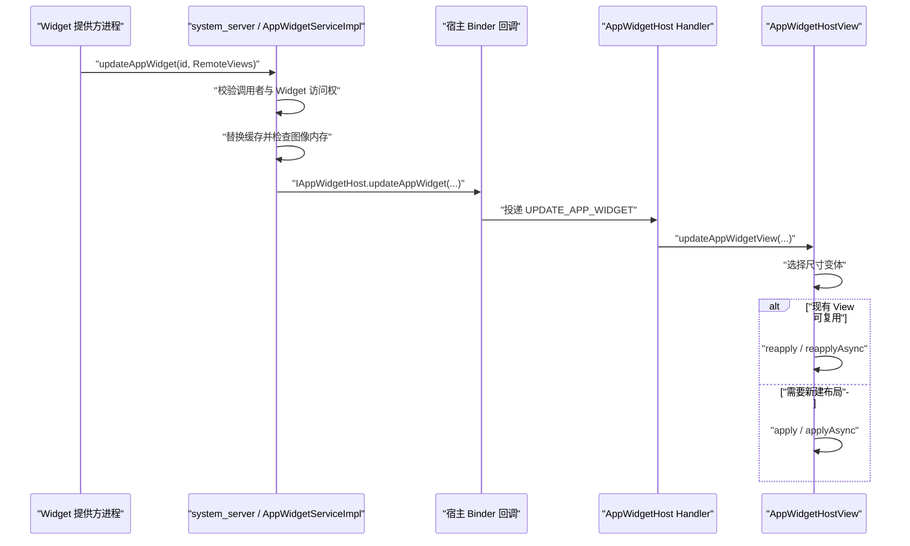

# App Widget 更新性能：RemoteViews IPC 与 Glance 渲染

App Widget 的界面由 Launcher、SystemUI 或其他 `AppWidgetHost` 承载。提供方进程负责生成 `RemoteViews`，`system_server` 中的 AppWidget 服务负责校验和缓存，宿主进程负责创建 View、执行动作并参与后续绘制。这种跨进程模型决定了优化重点：控制更新次数、动作数量、布局创建成本、集合数据量和图像内存。

平台源码锚点是 Android 17 / API 37 / `android-17.0.0_r1`。相关机制不涉及内核实现，因此不引入 kernel 分支结论。

## 一、Android 17 的执行模型

### 1. `RemoteViews` 是布局说明和动作集合

提供方没有把一棵已经创建好的 View 树传给宿主。`RemoteViews` 中保存布局资源、可能的尺寸变体以及 `mActions`。例如，`setTextViewText()` 会记录一次属性设置动作；`setImageViewBitmap()` 会记录携带位图的 `BitmapReflectionAction`。宿主拿到对象后，才会加载布局并逐条执行动作。

这一区别直接影响分析方法：

- 提供方进程中的耗时主要来自取数、构造 `RemoteViews`、准备图像和发起 Binder 调用。
- `system_server` 负责检查调用者、更新缓存、检查图像内存，并把有效快照通知给宿主。
- 宿主进程负责布局加载、动作应用、测量、布局、绘制等 UI 工作。
- 提供方完成 `updateAppWidget()` 调用，只代表更新请求已经交给系统服务，不代表桌面像素已经刷新。

下面的时序图用于定位一次完整更新经过的进程和线程。



图中的两个 Binder 方向分别覆盖“提供方到系统服务”和“系统服务到宿主”。`AppWidgetHost.Callbacks` 收到 Binder 回调后先向指定 `Handler` 发消息，所以宿主应用还会经历一次线程切换。

### 2. `apply()` 与 `reapply()` 由宿主选择

Android 17 的 `AppWidgetHostView.applyRemoteViews()` 会先选择适合当前尺寸的 `RemoteViews`。宿主配置了异步执行器时，代码进入 `inflateAsync()`；同步路径会调用 `canRecycleView(mView)`。布局和现有 View 满足复用条件时执行 `reapply()`，否则执行 `apply()` 创建新内容。异步路径遵循相同原则，分别调用 `reapplyAsync()` 或 `applyAsync()`。

提供方没有“强制宿主执行 `reapply()`”的公开接口。以下变化容易让复用条件失效或增加宿主工作量：

- 完整更新切换了布局资源或尺寸变体；
- 响应式布局需要选择另一套结构；
- 宿主的颜色映射发生变化；
- 动作集合需要处理较大的图像或较多子 View；
- 宿主没有设置异步执行器，只能在其 UI 线程执行同步应用。

因此，提供方应减少无意义的布局切换，并把稳定结构留在 XML 中。仍需用宿主侧 trace 验证 `apply`、测量和绘制成本；只测提供方函数无法覆盖桌面侧开销。

## 二、三种更新语义不能混用

Android 的 Widget 更新接口分为完整更新、局部更新和集合数据刷新。它们操作的对象不同：

| 更新类型 | 公开入口 | Android 17 服务端行为 | 适用场景 |
| --- | --- | --- | --- |
| 完整更新 | `updateAppWidget()` | 用新 `RemoteViews` 替换已缓存快照 | 首次显示、结构变化、需要重建完整状态 |
| 局部更新 | `partiallyUpdateAppWidget()` | 把新动作合并进已缓存快照，再通知宿主 | 布局不变，只更新少量属性 |
| 集合刷新 | `notifyAppWidgetViewDataChanged()` | 通知旧式远程适配器重新取数 | `ListView`、`GridView` 等旧式服务集合 |

### 1. 完整更新是缓存基线

`AppWidgetServiceImpl.updateAppWidgetInstanceLocked()` 在完整更新分支中直接替换 `widget.views`。系统缓存的对象必须能够完整描述当前 Widget。进程死亡、宿主重新连接或系统恢复状态时，这份快照仍可能用于恢复显示。

下面的 Kotlin 示例构造一份完整状态，并一次更新同一提供方的多个实例。

```kotlin
fun updateWeatherWidgets(
    context: Context,
    appWidgetIds: IntArray,
    temperatureText: CharSequence,
    updatedAtText: CharSequence,
) {
    if (appWidgetIds.isEmpty()) return

    val views = RemoteViews(context.packageName, R.layout.widget_weather).apply {
        setTextViewText(R.id.temperature, temperatureText)
        setTextViewText(R.id.updated_at, updatedAtText)
    }

    AppWidgetManager.getInstance(context).updateAppWidget(appWidgetIds, views)
}
```

这段代码适合所有实例展示相同内容的情况。若每个实例绑定了不同城市或账户，应分别构造快照，不能为了合并一次调用而发送错误内容。

### 2. 局部更新依赖已经存在的完整快照

局部更新从 API 17 起会把新动作合并进系统缓存，后续完整更新会替换这份合并后的缓存。某个实例尚未收到完整更新时，`partiallyUpdateAppWidget()` 会被忽略。

下面的示例只修改更新时间文字，调用方必须先为该实例提交过完整更新。

```kotlin
fun updateWidgetTimestamp(
    context: Context,
    appWidgetId: Int,
    updatedAtText: CharSequence,
) {
    val delta = RemoteViews(context.packageName, R.layout.widget_weather).apply {
        setTextViewText(R.id.updated_at, updatedAtText)
    }

    AppWidgetManager.getInstance(context)
        .partiallyUpdateAppWidget(appWidgetId, delta)
}
```

局部更新减少的是提供方发送的动作和参数。宿主仍需接收更新并执行对应动作，收益要结合更新频率、动作大小和宿主实现测量。应用还要定期提交完整快照，避免业务层把长期状态拆成难以验证的增量序列。

### 3. 集合刷新只针对集合数据

旧式集合 Widget 通过 `RemoteViewsService` 创建 `RemoteViewsFactory`。调用 `notifyAppWidgetViewDataChanged(appWidgetId, viewId)` 后，宿主可以继续显示旧数据，同时触发 `onDataSetChanged()`，随后再调用 `getCount()`、`getViewAt()` 等方法读取新数据。

服务断开连接本身不会触发 `onDataSetChanged()`。把刷新逻辑依赖在断连事件上，会造成不同宿主上行为不一致。

Android 12 / API 31 增加了 `RemoteViews.setRemoteAdapter(viewId, RemoteCollectionItems)`。它允许提供方把集合项直接放入 `RemoteViews`，再通过完整或局部更新提交。Android 17 的 `AppWidgetManager` 也包含远程适配器转换逻辑。选择方式时可按数据规模判断：

- 项目较少、每项结构简单、数据已经在内存中：`RemoteCollectionItems` 易于维护。
- 项目较多、取数需要服务生命周期、希望按宿主请求生成项目：保留 `RemoteViewsService` 路径。
- 无论使用哪条路径，都要限制单项动作和图像体积。集合会把一次更新的成本放大到多个项目。

### 4. 集合项的优化位置

`RemoteViewsFactory.getViewAt(position)` 返回的是单项 `RemoteViews`。可以在 `onDataSetChanged()` 中完成一次数据快照，然后让 `getViewAt()` 只做确定性的映射：

1. 在后台完成数据库查询、排序和业务计算。
2. 生成不可变的数据列表，并在回调结束前原子替换旧快照。
3. `getViewAt()` 只读取快照，设置文本、资源和点击模板所需的填充参数。
4. 对相同内容复用资源引用，避免为每一项重复创建相同位图。
5. 数据暂不可用时返回稳定的加载或空状态，避免宿主反复收到结构差异很大的布局。

官方文档允许 `onDataSetChanged()` 和 `getViewAt()` 执行较重的同步工作，但这不等于可以忽略总延迟。桌面滚动时，项目迟迟无法交付仍会表现为空白、占位或更新滞后。

## 三、更新调度与数据时效等级

Widget 的更新频率应来自产品语义。天气摘要、日历倒计时、媒体进度和即时告警需要不同机制，不能统一套用一个周期。

### 1. `updatePeriodMillis` 的 Android 17 边界

提供方 XML 中的 `updatePeriodMillis` 只适合低频周期刷新。Android 17 的 `AppWidgetServiceImpl` 使用以下规则注册更新：

- 值为 `0` 时不注册周期更新；
- 正值会与 `MIN_UPDATE_PERIOD` 取较大值；
- 非调试构建的 `MIN_UPDATE_PERIOD` 是 30 分钟；
- 服务端使用 `AlarmManager.setInexactRepeating(ELAPSED_REALTIME_WAKEUP, ...)`。

下面的配置关闭系统周期广播，把刷新交给业务事件或任务调度器。

```xml
<appwidget-provider
    xmlns:android="http://schemas.android.com/apk/res/android"
    android:initialLayout="@layout/widget_weather"
    android:minWidth="180dp"
    android:minHeight="110dp"
    android:updatePeriodMillis="0" />
```

关闭周期广播后，应用需要覆盖首次添加、配置变化、用户主动刷新、数据变化以及必要的后台任务。`0` 不会让 Widget 自动获得新的调度来源。

### 2. `AppWidgetProvider` 的广播入口要尽快返回

`AppWidgetProvider` 继承 `BroadcastReceiver`。系统文档要求接收器通常在约 10 秒内完成；网络访问、批量图片解码或大型数据库迁移不应留在 `onUpdate()` 中。合适的处理顺序是：

1. 读取已经缓存的轻量状态；
2. 尽快提交可显示的 `RemoteViews`；
3. 需要联网或持久化计算时，登记受系统约束的后台任务；
4. 任务完成后根据最新 Widget ID 再提交一次更新。

WorkManager 可以表达网络、电量、充电等约束，也能把一次性任务去重。它不提供精确时刻保证，周期任务还受最小周期、待机分桶、省电模式和配额影响。将它描述成“高保证定时器”会误导时效设计。

### 3. API 37 的监听器精确闹钟有进程生命周期限制

Android 17 / API 37 为 `AlarmManager` 增加了带 `Executor` 的监听器重载：

`setExactAndAllowWhileIdle(type, triggerAtMillis, tag, executor, listener)`

这个入口可以把回调投递给指定执行器，适合某个 Activity、Service 或 ContentProvider 仍在运行期间的一次性短期任务。Android 17 源码和 API 文档同时说明：监听器闹钟要求请求进程持续运行；进程没有运行中的组件或进入缓存状态后，系统可能取消或丢弃回调。

因此，它不能替代“进程死亡后仍要唤醒提供方”的 Widget 后台刷新。必须跨进程存活时要评估 `PendingIntent` 形式，并满足精确闹钟访问规则；允许延迟时优先使用 WorkManager 或系统的非精确周期机制。

### 4. 可见状态与刷新节奏

标准 AppWidget API 没有跨宿主统一的“当前是否可见”回调。`onEnabled()`、`onDisabled()` 和 `onAppWidgetOptionsChanged()` 分别描述实例集合生命周期或尺寸选项变化，不能当作可见性信号。刷新逻辑应具备以下性质：

- 相同数据版本重复到达时不再发送同一份更新；
- 多个相同配置的实例可以合并取数和构造；
- 只有在自有宿主或当前存活组件能够提供可靠可见性时，才按可见状态启停高频内存计时器；
- 用户主动刷新可以提升优先级，但要做点击去重；
- 失败时保留最近一次可用快照，并显示可理解的时间戳或错误状态。

媒体播放进度一类高频信息还要优先考虑系统已有的媒体会话和宿主能力。用周期 Binder 更新模拟每一帧进度，会同时增加提供方、`system_server` 和 Launcher 的工作。

## 四、图像内存与 Binder 成本

### 1. Widget 有独立于通用 Binder 缓冲区的图像上限

把 Widget 图像问题简单归结为“每次 Binder 只能传 1 MB”不够准确。Binder 事务缓冲区属于进程共享资源，序列化内容和并发事务都会影响结果；AppWidget 服务还执行专门的 `RemoteViews` 图像内存检查。

Android 17 在启动时读取真实显示尺寸，并计算：

`mMaxWidgetBitmapMemory = 6 × displayWidth × displayHeight`

源码注释给出的含义是 1.5 个屏幕、每像素 4 字节。每次更新完成缓存合并或替换后，服务都会检查该 Widget 的 `RemoteViews` 图像估算值。对于 `targetSdkVersion = 37`，超过上限的位图缓存会清空该次缓存并抛出 `IllegalArgumentException`；服务还会统计 `Icon` 携带的位图内存并在组合值过高时记录警告。

这个上限随设备显示尺寸变化，不能写成固定的 1 MB、8 MB 或某个机型测得值。设计时仍应让峰值显著低于系统上限，因为同一宿主还要同时处理桌面、其他 Widget 和自身图形资源。

### 2. 图像优化按来源处理

- 静态图标和背景优先使用资源 ID，让宿主按资源加载。
- 网络图片按 Widget 实际显示尺寸解码，避免把相机原图缩放后再塞入 `RemoteViews`。
- 相同位图在一次快照中尽量复用，避免内容相同却创建多个对象。
- 使用内容 URI 时确认目标宿主具备读权限，并保证 URI 生命周期覆盖显示周期。
- 提交新图片前先取消已经过时的下载或解码任务，防止旧请求覆盖新状态。
- 集合中的缩略图要按总量估算，不能只检查单项大小。

Android 17 的服务端会遍历 `RemoteViews` 中的 URI：`content://` 要求调用 UID 自己具有读权限，`android.resource://` 可以通过，`file://` 和其他 scheme 会被拒绝。这项检查不会替提供方补齐宿主读权限。URI 可以减少在动作中直接携带大位图的压力，但宿主权限、文件存活和读取耗时也进入了性能与正确性边界。

### 3. 动作数量也会累积

纯文本更新没有大位图，仍需要序列化动作、执行 Binder 调用、合并缓存并由宿主重放动作。常见减负方法包括：

- 比较数据版本，跳过内容完全相同的更新；
- 把多字段变化合成一次完整更新；
- 只改一个稳定属性时使用局部更新；
- 多个实例内容相同且接口允许时，使用 `int[]` 批量提交；
- 避免在每次更新中重复设置从未变化的点击动作、可见性和资源。

批量提交减少提供方发起调用和重复构造的次数。系统仍需逐个维护 Widget 实例并通知相应宿主，不能把一次 API 调用等同于一次宿主工作。

## 五、Glance 的成本模型

### 1. Glance 使用 Compose Runtime，输出仍是 `RemoteViews`

Glance 建立在 Compose Runtime 上，用声明式 API 生成 App Widget 内容。它不使用 Compose UI 的 `LayoutNode`、绘制管线和任意 Composable 组件，也不能直接把 Android 应用中的 Compose UI 组件放到桌面。

一次 Glance 更新大致包含：

1. 读取 `GlanceId` 对应状态；
2. 运行 Glance 组合；
3. 根据尺寸模式生成可表达为 `RemoteViews` 的结构与动作；
4. 通过 AppWidget 更新接口交给系统；
5. 由宿主应用并绘制结果。

所以 Glance 简化了状态到 Widget UI 的映射，但不会移除 Binder、服务端缓存、宿主布局创建和图像上限。性能分析仍要覆盖完整跨进程路径。

### 2. 状态变化不等于逐项增量更新

Glance 可以利用 Compose Runtime 计算声明式内容，最终交付单位仍受 `RemoteViews` 表达能力约束。不能假设 `LazyColumn` 只序列化变化的某一项，也不能用 Compose UI 的重组跳过率直接推导桌面更新成本。

使用 Glance 时，优化重点是：

- 只在持久状态版本变化后调用 `update()`；
- 把网络和数据库工作放在组合之前；
- 保持 Widget 结构和 key 稳定；
- 限制列表项数量、层级和图像；
- 用 trace 和宿主表现检验一次更新生成了多少工作。

### 3. 响应式尺寸优先使用有限断点

Android 12 / API 31 通过 `OPTION_APPWIDGET_SIZES` 向提供方暴露宿主支持的尺寸集合。平台 `RemoteViews` 可以为不同尺寸保存变体；Glance 提供 `SizeMode.Responsive` 和 `SizeMode.Exact`。

尺寸能够归纳为几个明确断点时，`SizeMode.Responsive` 可以预先生成有限布局。`SizeMode.Exact` 会在每次尺寸变化时按精确尺寸重新创建内容，官方文档提示它可能带来性能问题和调整大小时的界面跳变。只有布局连续依赖精确宽高、有限断点无法表达时，才需要选用 Exact。

### 4. 选择手写 `RemoteViews` 还是 Glance

| 维度 | 手写 `RemoteViews` | Glance |
| --- | --- | --- |
| 更新控制 | 可直接选择完整、局部和集合接口 | 由 Glance API 生成并提交内容 |
| 状态表达 | 需要自行维护数据与 View 动作映射 | 声明式状态映射较集中 |
| 可用组件 | 受 `RemoteViews` 白名单限制 | 受 Glance 组件和底层 `RemoteViews` 限制 |
| 性能定位 | 动作与平台调用较直观 | 还要观察组合和翻译阶段 |
| 迁移成本 | 既有 XML 与代码可继续维护 | 适合希望统一 Kotlin 声明式写法的团队 |

选择依据应是功能约束、团队维护成本和测量结果。Glance 和手写实现最终都要经过 Android 17 的 AppWidget 服务与宿主。

## 六、权限、多用户和可靠性边界

### 1. 更新调用有明确的身份校验

Android 17 的 `AppWidgetServiceImpl.updateAppWidgetIds()` 会校验调用包与 UID，并检查调用者是否有权访问目标 Widget。服务还会遍历 `RemoteViews` 中的 URI，通过 URI 授权服务确认调用 UID 对 `content://` URI 具有读权限。

应用不需要、也没有公开的 `RemoteViews.CallingIdentity` API 来替代这些校验。更新失败时应先确认：

- 当前进程的包名是否与提供方一致；
- `appWidgetId` 是否仍属于当前提供方和用户；
- 工作配置或多用户环境中是否使用了错误用户的数据；
- 内容 URI 是否由正确用户下的 Provider 提供，并具有可授予的读权限；
- PendingIntent 的可变性和目标是否符合当前平台安全要求。

### 2. 每个用户和配置文件分别维护状态

`AppWidgetServiceImpl` 的提供方、宿主和实例记录都带有用户维度。个人用户与工作配置中的同名包仍属于不同身份。数据库缓存、图片 URI、任务唯一名称和 `appWidgetId` 映射都要纳入用户边界。

跨配置复制一个整数 ID 不能定位另一侧实例。配置文件暂停、锁定或移除后，提供方还要能够停止任务并清理对应缓存。

### 3. 最近可用快照比空白更可靠

Widget 更新涉及多个进程，任何一段都可能暂时不可用。稳健实现通常保留一份可快速构造的最近数据：

- 首次添加时先显示结构完整的本地状态；
- 后台刷新成功后原子替换数据版本；
- 网络失败时保留旧值并更新错误提示；
- 图片加载失败时使用稳定资源占位；
- 收到删除回调后取消该实例不再需要的工作。

这套策略也能缩短广播入口的执行时间，避免每次启动都等待网络再提交首屏。

## 七、测量与排查

### 1. 先把三段耗时分开

建议分别记录：

1. 提供方：取数、图像准备、构造 `RemoteViews`、调用更新接口；
2. `system_server`：AppWidget 更新与回调调度；
3. 宿主：接收消息、`apply` 或 `reapply`、测量、布局和绘制。

Perfetto 中同时观察提供方进程、`system_server` 和当前 Launcher。若只能看到提供方函数很快结束，还不能判断桌面更新是否顺畅。帧问题还要结合 [渲染管线总览](../../part2-performance/ch18-rendering-pipelines/01-pipeline-overview.md) 和 [Perfetto 入门](../../part3-tools/ch13-perfetto/01-perfetto-intro.md) 的分析方法。

下面的命令用于查看系统已登记的提供方、宿主、实例和更新周期。

```bash
adb shell dumpsys appwidget
```

输出适合确认实例归属、`updatePeriodMillis`、宿主和提供方状态。它不是耗时分析报告，仍需与 trace、应用日志以及 Launcher 行为对应。

### 2. 建立可复现的更新实验

一次有效的优化实验至少固定以下条件：

- 同一设备、Launcher、Widget 尺寸和实例数量；
- 相同数据量、图片尺寸和缓存状态；
- 区分完整更新、局部更新与集合刷新；
- 同时记录冷布局创建和可复用布局更新；
- 报告多次样本的分布，不用单次最小值代表结果；
- 检查省电模式、待机分桶和工作配置状态。

若优化只减少了提供方构造时间，而宿主的布局或绘制没有变化，应如实限定收益范围。

### 3. 常见现象与检查顺序

| 现象 | 优先检查 |
| --- | --- |
| 更新调用成功，桌面没有变化 | 实例 ID、宿主连接、完整快照是否存在、数据版本是否被去重 |
| 局部更新第一次无效 | 该实例是否先收到过完整更新 |
| 列表长时间显示旧数据 | 是否调用正确的集合刷新接口，`onDataSetChanged()` 是否完成快照替换 |
| 调整尺寸时跳变 | 尺寸模式、布局变体数量、是否使用 `SizeMode.Exact` |
| 更新抛出图像内存异常 | 解码尺寸、集合总图像量、缓存快照中的位图与 Icon |
| 只在应用前台收到监听器闹钟 | `OnAlarmListener` 的进程生命周期边界 |
| 多用户或工作配置显示错数据 | UserHandle、实例映射、URI 与数据库命名空间 |

## 八、提交前检查清单

- [ ] 每个实例首次显示前提交完整 `RemoteViews`
- [ ] 局部更新只包含稳定布局上的少量属性变化
- [ ] 集合刷新路径与所用适配器类型匹配
- [ ] `RemoteViewsFactory` 从不可变快照读取数据
- [ ] `onUpdate()` 不执行网络、批量解码或长事务
- [ ] 调度机制与数据时效等级一致
- [ ] 不把 WorkManager 或非精确重复闹钟当成精确定时器
- [ ] API 37 监听器闹钟只用于进程组件仍存活的场景
- [ ] 位图按实际显示尺寸解码，并按整个快照估算总量
- [ ] 内容 URI 的授权与生命周期覆盖宿主读取
- [ ] 多实例共用取数结果，但保留实例配置差异
- [ ] Glance 更新只在持久状态版本变化后触发
- [ ] 响应式布局优先使用有限尺寸断点
- [ ] Perfetto 覆盖提供方、`system_server` 和 Launcher

## 参考资料

- [AppWidgetManager.java（Android 17）](https://android.googlesource.com/platform/frameworks/base/+/refs/tags/android-17.0.0_r1/core/java/android/appwidget/AppWidgetManager.java)
- [AppWidgetServiceImpl.java（Android 17）](https://android.googlesource.com/platform/frameworks/base/+/refs/tags/android-17.0.0_r1/services/appwidget/java/com/android/server/appwidget/AppWidgetServiceImpl.java)
- [AppWidgetHost.java（Android 17）](https://android.googlesource.com/platform/frameworks/base/+/refs/tags/android-17.0.0_r1/core/java/android/appwidget/AppWidgetHost.java)
- [AppWidgetHostView.java（Android 17）](https://android.googlesource.com/platform/frameworks/base/+/refs/tags/android-17.0.0_r1/core/java/android/appwidget/AppWidgetHostView.java)
- [RemoteViews.java（Android 17）](https://android.googlesource.com/platform/frameworks/base/+/refs/tags/android-17.0.0_r1/core/java/android/widget/RemoteViews.java)
- [RemoteViewsService.java（Android 17）](https://android.googlesource.com/platform/frameworks/base/+/refs/tags/android-17.0.0_r1/core/java/android/widget/RemoteViewsService.java)
- [AlarmManager.java（Android 17）](https://android.googlesource.com/platform/frameworks/base/+/refs/tags/android-17.0.0_r1/apex/jobscheduler/framework/java/android/app/AlarmManager.java)
- [高级 Widget 指南](https://developer.android.com/develop/ui/views/appwidgets/advanced)
- [集合 Widget 指南](https://developer.android.com/develop/ui/views/appwidgets/collections)
- [Jetpack Glance 概览](https://developer.android.com/develop/ui/compose/glance)
- [使用 Glance 构建响应式界面](https://developer.android.com/develop/ui/compose/glance/build-ui)
- [AlarmManager API 参考](https://developer.android.com/reference/android/app/AlarmManager)
