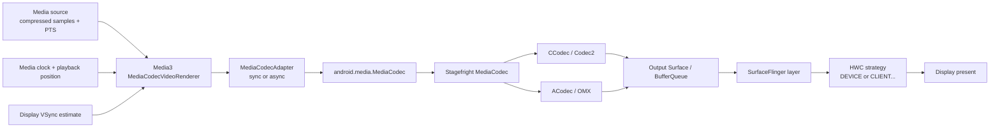

# Media3 视频播放：解码、帧时序与渲染

视频已经被 decoder（解码器）解出，不代表用户已经看见这一帧。普通 Media3 播放还要经过帧时序判断、`releaseOutputBuffer()`、输出 `Surface`、BufferQueue、SurfaceFlinger、HWC 和面板扫描。任一阶段延迟，都可能表现为首帧慢、画面卡住、声音继续或掉帧。

这些阶段需要放回各自的责任层。播放器事件用于解释 Media3 做了什么；Android 平台 trace 用于解释帧怎样到达合成器；present fence 或设备显示证据才接近“画面何时显示”。三类证据不能相互替代。

正文保留源码、日志和 Perfetto 中可检索的英文名，含义统一如下：

- **sample / PTS**：sample 是送入解码器的压缩媒体数据；PTS（Presentation Timestamp，呈现时间戳）说明这帧在媒体时间线上的目标时刻。
- **decoder / renderer / adapter**：decoder 负责解码；Media3 renderer（渲染器）推进播放状态并决定如何处理输出帧；adapter（适配器）封装同步或异步 `MediaCodec` 调用。
- **release timestamp / release action**：release timestamp 是 renderer 请求 Surface 接收该帧的系统时间；release action 是 renderer 对当前输出帧作出的立即释放、定时释放、丢弃、跳过或稍后重试等决定。
- **BufferQueue / fence**：BufferQueue 管理 Producer 与 Consumer 之间循环复用的 buffer；fence 是跨 codec、GPU 与显示硬件传递的完成信号。
- **latch / present**：latch 表示 SurfaceFlinger 为某个显示周期选中一块已就绪 buffer；present 表示该周期已经交给显示路径，仍早于面板像素的光学响应完成。
- **HWC 与 DEVICE / CLIENT composition**：HWC（Hardware Composer，硬件合成器）按当前整屏图层集合选择合成方式。DEVICE 表示交给显示硬件处理；CLIENT 表示 RenderEngine 先用 GPU 合成中间目标。
- **drop / skip**：drop 表示本应显示但因迟到而丢弃；skip 表示 decode-only、joining 追赶等有意跳过。两者可能都不显示画面，统计含义不同。

## 一、版本基线与证据范围

核查基线如下：

| 层级 | 基线 | 关注点 |
| --- | --- | --- |
| Media3 | 1.11.0 稳定版 / `2bc207851df311340767e913931ca7b28cab1794` | renderer、codec adapter、frame release、surface、effects、事件 |
| Android 平台 | Android 17 / API 37 / `android-17.0.0_r1` | MediaCodec、CCodec/ACodec、BufferQueue、SurfaceFlinger |
| Android 内核 | `android17-6.18-2026-06_r6` | dma-buf、dma-fence、sync_file 的共通语义 |

Media3 与 Android 平台独立发布。Android 17 设备可以运行较早的 Media3；升级 Media3 也不会更换设备上的 vendor codec、Composer HAL、显示驱动或固件。涉及常量和默认策略时，必须同时记录库版本与系统 build。

截至 2026-08-15，Google Maven 与官方发布页的最新稳定版都是 Media3 1.11.0；该版本发布于 2026-08-05。历史版本可以用于定位回归，产品结论仍应回到应用实际打包的版本。

系统路径同时沿用 SurfaceView、TextureView 与 video overlay 的通用结论。Android 17 的强证据来自公开源码；vendor codec、HWC plane、secure video path 和驱动等待要靠目标设备补证。

## 二、普通播放的分层模型

这张图展示一次普通 Surface 输出涉及的主要对象。



图中的 CCodec 与 ACodec 是运行时二选一的 native codec 适配路径；不能把两个分支按顺序相加。Media3 选择 codec、安排输入并决定输出帧何时交给 `Surface`。SurfaceFlinger 与 HWC 决定这一层怎样参与当前显示帧的合成。

### Media3 负责什么

与渲染直接相关的职责包括：

- 选择 `MediaCodecInfo` 与对应的 decoder；
- 创建同步或异步 `MediaCodecAdapter`；
- 把压缩 sample 和 PTS 送入 decoder；
- 依据播放位置、倍速和 VSync 估计安排输出帧；
- 主动 skip、drop 或追到关键帧；
- 管理 `SurfaceView`、`TextureView` 或效果管线的输出面；
- 上报 decoder 初始化、格式变化、首帧、掉帧和处理偏移。

Media3 的默认 ABR 不读取 HWC composition type，也不会根据 renderer 掉帧自动降低清晰度。网络选档、解码能力与显示能力需要产品层建立自己的关联策略。

### Android 平台负责什么

Android 侧负责：

- `MediaCodec` Java API 与 native Stagefright 状态机；
- CCodec/Codec2 或 ACodec/OMX 组件接入；
- decoder 输出 graphic buffer 的所有权周转；
- `Surface` 与 BufferQueue 的 queue、acquire、release；
- SurfaceFlinger 的 latch、layer composition 与 HWC 提交；
- fence 在 codec、GPU、合成器、HWC 之间传递完成状态。

`releaseOutputBuffer(index, timestampNs)` 返回，只说明 client 已请求把 buffer 按给定时间送往输出 Surface。它不证明 BufferQueue consumer 已 acquire，也不证明 HWC 已提交或面板已经扫描。

## 三、Media3 的异步 codec adapter

### API 31 及以上的默认行为

Media3 1.11.0 的 `DefaultMediaCodecAdapterFactory` 在 API 31 及以上默认创建 `AsynchronousMediaCodecAdapter`。较早系统通常创建同步 adapter；应用可以从 API 23 起强制启用异步模式，也可以强制关闭。

异步 adapter 包含两组不同工作：

1. `MediaCodec.Callback` 在专用 callback thread 接收 input/output buffer 可用、format change 与 codec error；
2. input buffer 通过另一个 queueing thread 提交，secure input 也由对应 enqueuer 处理。

播放器的 playback thread 仍会从 adapter 的内部队列取 index，并执行 renderer 状态机。异步 callback 没有把完整播放器逻辑搬到 codec callback 线程。

Media3 1.11.0 还默认启用 dynamic scheduling（动态调度）：播放器工作循环尽量等到 renderer 可以继续推进时再唤醒，不再只按固定间隔运行。它控制 playback thread 的唤醒时机，与 `MediaCodec.Callback` 的异步 adapter 是两套机制；排查线程调度时要分别记录。

### 它与 BufferQueue asyncMode 无关

名称相似容易造成误判：

| 机制 | 所在层 | 控制什么 |
| --- | --- | --- |
| `AsynchronousMediaCodecAdapter` | Media3 / MediaCodec API | buffer callback 与 input queueing 的线程模型 |
| `MediaCodec` asynchronous mode | framework codec API | 通过 `MediaCodec.Callback` 提供 buffer 可用事件 |
| BufferQueue `asyncMode` | native 图形队列 | producer queue 时是否采用可替换的 droppable slot 语义 |
| EGL swap interval 0 | EGL producer | native GL producer 的交换节奏，可能触发其输出 Surface 的 asyncMode |

普通 `PlayerView` 播放使用异步 codec adapter，不表示 decoder 输出 BufferQueue 被切成 EGL 的 `asyncMode`。`Surface::setSwapInterval(0)` 只与可控制该 native EGL producer 的链路相关；默认 decoder Surface 输出不提供同名 Java 调优开关。

### 何时考虑强制配置

API 31—37 一般先保留默认值。强制切换适合受控实验：

- 某机型出现 callback 或 flush 竞态；
- 需要验证同步 dequeue 是否造成 playback thread 阻塞；
- 自定义 `RenderersFactory` 已经改变默认 factory；
- 旧系统需要评估 API 23+ 的异步 adapter。

这段代码用于建立同步与异步 adapter 的 A/B 组。

```kotlin
val renderersFactory = DefaultRenderersFactory(context)
    .forceEnableMediaCodecAsynchronousQueueing()

val player = ExoPlayer.Builder(context, renderersFactory)
    .build()
```

实验的另一组应调用 `forceDisableMediaCodecAsynchronousQueueing()`，并保持内容、Surface 类型、codec、DRM、显示模式和温度区间一致。仅比较平均首帧容易掩盖 flush、seek 与 playlist transition 的尾部延迟。

### Android 17 的 crypto async 分支

Media3 1.11.0 在异步 adapter 中还处理 `CONFIGURE_FLAG_USE_CRYPTO_ASYNC`。`DefaultMediaCodecAdapterFactory(Context)` 默认启用这项实验配置，但源码只在 API 36 及以上设置 flag；此时 input buffer 改由同步 enqueuer 提交，crypto 工作交给 codec 的异步路径。它属于 secure input queueing 行为，不能用来推导图形输出 Surface 的异步状态。

## 四、从 PTS 到 release timestamp

### renderer 计算的是“还早多少”

`VideoFrameReleaseControl` 先计算：

`earlyUs = (framePresentationTimeUs - playerPositionUs) / playbackSpeed - loopElapsedUs`

正值表示该帧还早，负值表示已经晚。随后 `VideoFrameReleaseHelper` 根据已观测到的帧间隔、播放倍速与显示 VSync 估计调整 release time。

Media3 1.11.0 的普通输出路径包含几组重要阈值：

| 条件 | 1.11.0 默认处理 |
| --- | --- |
| 帧仍早于目标超过 early scheduling threshold（默认 50 ms） | `TRY_AGAIN_LATER`，暂不释放 |
| 帧晚约 30 ms 以上 | 可以 drop 当前输出帧 |
| 帧晚约 500 ms 以上 | 可以丢到关键帧并 flush/reinitialize codec |
| 帧晚约 30 ms 以上，且超过 100 ms 没有释放新帧 | 可以强制释放一帧，避免画面长时间停住 |
| decoder input 预计晚约 15 ms 以上 | sample 标记为不被后续帧依赖，或 AV1 依赖解析证明安全时，可提前丢输入 |

这些值属于 Media3 1.11.0 的 `MediaCodecVideoRenderer` 与 `VideoFrameReleaseControl`，不是 Android 17 平台常量。1.11.0 新增 `MediaCodecVideoRenderer.Builder.setMaxEarlyUsThreshold()`，可以调整默认 50 ms 的提前调度门槛；子类仍可覆盖部分决策，实验 API 也可以关闭 input drop 门槛。

### 六种 frame release action

1. `FRAME_RELEASE_IMMEDIATELY`：首帧或恢复画面等场景立即释放；
2. `FRAME_RELEASE_SCHEDULED`：带纳秒时间戳释放到 Surface；
3. `FRAME_RELEASE_DROP`：该帧本应显示，但已经太晚；
4. `FRAME_RELEASE_SKIP`：decode-only、joining 追赶等有意跳过；
5. `FRAME_RELEASE_IGNORE`：可能触发更大范围的追赶动作，当前 buffer 暂不结束处理；
6. `FRAME_RELEASE_TRY_AGAIN_LATER`：当前时机过早或条件未满足，下一轮再判断。

drop 与 skip 的业务语义不同。它们最终都可能调用 `releaseOutputBuffer(index, false)`，统计却进入不同 counter。把二者合成“丢帧率”会掩盖 seek、period transition 与播放性能问题的差别。

Media3 1.11.0 调整了 joining 期间的统计：renderer 为追赶播放位置而丢弃的 buffer 计入 skipped，而不再计入 dropped。跨 1.10.1 与 1.11.0 比较掉帧指标时，应同时查看 skipped，并按库版本分桶。

### timestamp 进入 BufferQueue 后会发生什么

Media3 对计划显示的帧调用：

`MediaCodec.releaseOutputBuffer(index, releaseTimeNs)`

CCodec 的 `CCodecBufferChannel::renderOutputBuffer()` 会把 graphic block 和 timestamp 交给输出 Surface。ACodec/OMX 通过自己的 port 与 native window 路径完成同类交付。

Android 17 的 `BufferQueueConsumer::acquireBuffer()` 根据 consumer 的 `expectedPresent` 处理队首：

- 队首目标时间仍在未来时，可以返回 `PRESENT_LATER`；
- 队列里有多帧且后一帧更适合当前 present 时，可以移除过期的前一帧；
- 时间戳偏离 expected present 超过合理范围时，不用该异常时间戳驱动常规丢帧；
- acquire 后还要等待 buffer 对应的 acquire fence。

源码中的 ±1 秒是 BufferQueue 判断时间戳是否合理的保护范围，不是 `releaseOutputBuffer()` 对 SurfaceView 的公开“必须相差 1 秒”约束，也不是播放器的掉帧门槛。

## 五、一次掉帧可能发生在哪一层

播放系统里至少有六类“没有显示新画面”：

| 位置 | 事件 | Media3 counter 能否直接看见 |
| --- | --- | --- |
| source / renderer input | sample 没送入 decoder，或为追赶关键帧而丢弃 | 部分可见 |
| decoder output | renderer 判断帧太晚，`render=false` | 可见 |
| Surface queue | consumer 太慢，过量帧被 Surface 丢弃 | 通常不可完整看见 |
| SurfaceFlinger latch | acquire fence 未就绪，继续使用旧 buffer | 不可见 |
| HWC composition | 当前层组合导致 client composition 或提交延迟 | 不可见 |
| display present | present miss 或面板继续扫描旧内容 | 不可见 |

`onDroppedVideoFrames()` 统计的是 renderer 记录的 dropped input/output buffers。它不等于系统从解码到显示的总丢帧数。

### `KEY_ALLOW_FRAME_DROP` 的准确语义

Android 10 起，Surface 输出默认允许在消费不及时的时候丢弃过量帧。配置格式中没有 `MediaFormat.KEY_ALLOW_FRAME_DROP` 时，Android 17 的 `MediaCodec` 把 `mAllowFrameDroppingBySurface` 设为 `true`；字段存在时，变量读取字段的整数值。

当值为 `0` 时，`MediaCodec::connectToSurface()` 调用 `disableLegacyBufferDropPostQ(surface)`，选择退出该 legacy surface drop 行为。持续消费不及时会让 decoder 更容易受到背压。

这里有两条使用边界：

- Android API 文档把可控退出描述为面向非 View Surface，例如独立 `SurfaceTexture` 或 `ImageReader`；
- `SurfaceView` 与 `TextureView` 的过量帧行为不能靠这一个 key 获得跨设备“零丢帧”保证。

### Media3 1.11.0 何时写 `0`

普通直接输出路径不会无条件设置该 key。启用 Media3 视频效果后，renderer 有 `videoSink`；当 `Util.isFrameDropAllowedOnSurfaceInput(context)` 返回 `false`，也就是 API、target SDK 与机型未命中已知的不可约束条件时，Media3 才向 decoder format 写：

`MediaFormat.KEY_ALLOW_FRAME_DROP = 0`

原因是效果管线要在自己的输入端判断晚帧。若 decoder 输出 Surface 提前丢帧，`VideoGraph` 无法按媒体时间掌握完整输入。Media3 同时限制 decoder 允许积压的输出帧数，避免无限背压。

这段行为说明 key 的主用途是“控制哪一层做帧取舍”，而非画质增强或 HWC overlay 开关。

## 六、SurfaceView、TextureView 与 raw Surface

### PlayerView 默认使用 SurfaceView

Media3 1.11.0 的 `PlayerView` 把 `surface_type` 默认设为 `surface_view`。普通视频通常优先选择它，原因包括：

- decoder 输出保持为独立 SurfaceFlinger layer；
- HWC 可以逐帧评估视频 layer 是否适合 DEVICE composition；
- 大面积视频有机会避免宿主 HWUI 再采样；
- HDR、secure output 与电视端全分辨率路径通常更合适；
- 视频与宿主 UI 可以按各自的出帧节奏工作。

独立 layer 只提供 HWC overlay 的候选条件。缩放、旋转、alpha、HDR/SDR 混合、protected usage、plane 数量、带宽和其他 layer 都会改变最终 composition type。

### TextureView 增加宿主采样阶段

TextureView 路径为：

`decoder → SurfaceTexture BufferQueue → app HWUI / RenderThread → App Window BufferQueue → SurfaceFlinger`

它适合普通 View 级的旋转、裁剪、alpha、圆角和复杂层叠。代价包括宿主帧截止点、GPU 纹理采样、App Window 提交以及独立视频 layer 的消失。SurfaceFlinger 看到的是已经包含视频像素的宿主窗口。

TextureView 也不是“开启视频特效”的必要条件。Media3 的 effects 管线可以用独立输入 Surface 和输出 Surface 完成 GPU 处理；是否选 TextureView，要由最终 UI 变换需求决定。

### 优先交给 Player 跟踪生命周期

如果输出由 `SurfaceView` 或 `TextureView` 持有，使用：

- `player.setVideoSurfaceView(surfaceView)`；
- `player.setVideoTextureView(textureView)`；
- `PlayerView.setPlayer(player)`。

这些 API 会注册 `SurfaceHolder.Callback` 或 `SurfaceTextureListener`。直接调用 `setVideoSurface(surface)` 时，调用方必须在 Surface 销毁前清除输出，并管理 `Surface` 包装对象的释放。

这段代码用于在两个 `PlayerView` 之间转移同一个 player。

```kotlin
PlayerView.switchTargetView(
    player,
    oldPlayerView,
    newPlayerView
)
```

该 API 会先把 player 绑定到新目标，再从旧目标解除，减少切换期间没有有效 Surface 的时间。列表复用、全屏切换和小窗转场仍要记录两侧 Surface callback 与 renderer first-frame 事件。

### Android 14—17 的 Surface 生命周期

API 34 及以上，Media3 1.11.0 创建默认 `SurfaceView` 时把 Surface 生命周期设为 follows-attachment（跟随 View 附着状态）。暂时不可见但仍 attached 的 View 可以保留 Surface，减少销毁和重建；资源也会相应保留更久。

这项策略改善部分滚动与转场，不能替代明确的 player 生命周期所有者。页面离开、列表回收、进程进入后台或业务停止播放时，仍要按产品生命周期解绑、停止或释放 player。

### Compose 中使用 PlayerView

`PlayerView` 放入 `AndroidView` 时，SurfaceView 会跨 View/Compose 与 SurfaceFlinger 的同步边界。Media3 提供 `setEnableComposeSurfaceSyncWorkaround()` 处理 API 34 的特定兼容问题，但该兼容方案默认关闭，因为它会影响 XML View 的 shared element transition。

只需要视频承载面时，Media3 1.11.0 的 `media3-ui-compose` 已提供 `PlayerSurface`；需要宽高比、shutter（首帧前的遮挡层）等基础容器能力时可使用 `ContentFrame`。`PlayerSurface` 仍在内部通过 `AndroidView` 创建 SurfaceView 或 TextureView，并负责调用 Player 的 set/clear API；它不会把 decoder buffer 变成 Compose 纹理。其 SurfaceView 分支会在 API 34 自动使用 `SurfaceSyncGroup` 规避尺寸同步问题，API 35 及以上不走该兼容分支。

Media3 1.11.0 还修复了 `ContentFrame` 在播放中途重组时首帧尺寸错误的问题。这个修复只覆盖对应库内缺陷；应用自己的布局变化、Surface 重建和新尺寸首帧仍要按事件时间线验证。

Compose 页面应把以下状态分开记录：

- composable 是否仍在 composition；
- `AndroidView` 是否 attached；
- SurfaceHolder 是否创建；
- player 是否绑定当前 View；
- decoder 是否仍连接原 Surface；
- 新 Surface 的首帧是否已被 renderer 释放。

Surface 与 Compose 生命周期的详细处理见 [Compose ↔ View 互操作性能实战](11-compose-view-interop.md)。

## 七、Surface 切换与 decoder 复用

### Media3 会先判断能否更新输出面

收到新的 video output 后，`MediaCodecVideoRenderer` 按以下条件处理：

1. 更新 `VideoFrameReleaseControl` 的目标 Surface；
2. 若已有 codec 且无需特效 `videoSink`，判断 codec 是否有可用输出面；
3. 设备不命中 `setOutputSurface` 兼容例外清单时调用 `codec.setOutputSurface()`；
4. 条件不满足时释放 codec，再走初始化；
5. 对新 Surface 重置 first-frame 状态并进入 joining。

API 35 及以上，框架还提供 detached output surface 能力；Media3 只在 codec 报告支持时使用。detach 不能消除 vendor codec 的实现差异。

### generation number 解决旧 buffer 归属

Android 17 的 `MediaCodec::connectToSurface()` 为每次连接生成：

`generation = (pid << 10) | (++counter & ((1 << 10) - 1))`

低 10 bit 是进程内递增计数，高位来自 PID。连接时还会 disconnect/reconnect 并安装 `OnBufferReleasedListener`。generation number 用于防止旧连接留下的 free buffer 被错误附着到新连接。它解决 buffer 身份归属，不保证新 Surface 立刻有内容。

### 复用 codec 需要满足格式边界

Media3 的 `MediaCodecInfo.canReuseCodec()` 会检查 MIME、rotation、resolution、color info、初始化数据和已知设备兼容规则。`MediaCodecVideoRenderer` 还检查：

- 新分辨率是否超过初次配置的 max width/height；
- max input size 是否超过配置范围；
- 某些 frame-rate 变化是否要求丢弃 codec；
- DRM session、secure decoder 与父类 renderer 状态是否允许复用。

不能把 `setOutputSurface()` 写成通用 codec 池。一次 Surface 切换可以复用当前实例，不等于该实例适合跨内容、跨 DRM session 或跨 profile 长期共享。

### playlist transition 与 prewarming

Media3 1.11.0 提供实验性的 secondary `MediaCodecVideoRenderer` prewarming。secondary renderer 是与当前 renderer 并存的第二个视频渲染器；prewarming（预热）让它在转场前初始化 codec 并提前处理相邻 media item。该开关默认关闭，启用后会增加 decoder、buffer、内存和功耗占用。

启用前要确认：

- 目标设备能否同时创建两组所需 decoder；
- secure codec 的实例数量限制；
- 多 item 的 MIME、profile、resolution 与 DRM 组合；
- transition 失败后的清理与回退；
- 前台功耗和热稳定性。

常规场景先依赖 codec reuse 与准备下一段媒体；transition 尾部延迟仍不可接受时，再评估 prewarming。1.11.0 新增的实验 API `ExoPlayer.Builder.enablePerStreamMediaProgression()` 允许音视频流分别向后推进，可减少部分短内容或列表转场等待；它不会创建 secondary renderer，与 prewarming 要分开做 A/B 实验。

## 八、Codec2/CCodec 与 OMX/ACodec

### Android 17 仍保留两条实现

Stagefright 根据 codec 名称和 owner 字段（组件归属类型）创建 native codec：

- owner 为 `default` 时创建 ACodec，以 `codec2` 开头时创建 CCodec；这个判断优先于名称；
- 没有已识别的 owner 时，名称以 `c2.` 开头创建 CCodec；
- 没有已识别的 owner 时，名称以 `omx.` 开头创建 ACodec。

Android 17 主流新设备以 Codec2 路径为主，源码仍保留 ACodec/OMX 兼容实现。只展示 ACodec 的 port 配置，无法代表 Android 17 的完整视频 decoder 路径。

### CCodec 的输出 Surface 路径

`CCodecBufferChannel::renderOutputBuffer()` 从 `MediaCodecBuffer` 取得 `C2Buffer`，读取 rotation、dataspace、HDR metadata 等信息，构造 `QueueBufferInput`，再调用 component 的 `queueToOutputSurface()`。

这条路径还请求 frame timestamp 回传。输出 Surface 直连显示时，CCodec 可以跟踪 released frame；输出是效果管线的中间 Surface 时，frame-rendered callback 可能在 buffer queue 到该中间面时就触发。此时 callback 更不能解释为 panel present。

### ACodec 只在命中 OMX 时分析

ACodec 使用 OMX port、buffer ownership 与 native window 协调输出。排查 OMX codec 时可以看：

- input/output port definition；
- port settings changed；
- `OMX_FillThisBuffer` 与 output ownership；
- native window buffer 数量；
- flush、disable/enable port 和状态转换。

命中 `c2.vendor.*` 时，应改看 C2Work、CCodecBufferChannel、component store 和 graphic block。两条路径的 Java `MediaCodec` API 相同，native trace 读法不同。

### 不使用 Block Model 推导默认 Media3 路径

Android 17 的 `MediaCodec` 支持 `BUFFER_MODE_BLOCK`、`QueueRequest` 与 block model flag。Media3 1.11.0 的普通 `MediaCodecVideoRenderer` 默认 adapter 并未把视频输入改成这条通用 block model API。

异步 adapter 仍通过 `getInputBuffer(index)`、`queueInputBuffer()` 或 `queueSecureInputBuffer()` 工作。看到 AOSP 存在 block model 分支，不能据此宣称 Media3 默认获得“Block Model 零拷贝”。

## 九、视频效果管线

### 启用效果后多了一次应用侧处理

调用 `ExoPlayer.setVideoEffects()` 后，Media3 通过 `PlaybackVideoGraphWrapper`、`VideoSink` 与 `VideoFrameProcessor` 建立处理图；应用还要包含对应的 `media3-effect` 依赖，否则 1.11.0 会在设置 effects 时抛出 `IllegalStateException`。典型拓扑为：

`decoder → input Surface → VideoGraph / GL processing → display Surface → SurfaceFlinger`

与直接播放相比，它增加：

- decoder 输出到中间 Surface 的 queue/acquire；
- effect processor 的纹理导入；
- 一个或多个 shader pass；
- effect 输出 Surface 的 queue；
- 输入与输出两侧的 fence 等待；
- 额外 graphic buffer 与 GPU 带宽。

效果是否改变分辨率、颜色空间、HDR 信息和输出节奏，要按 effect 实现与目标 Surface 验证。

### 晚帧在效果之前处理

Media3 1.11.0 的 `PlaybackVideoGraphWrapper` 默认把预计晚 15 ms 以上的输入帧作为可丢候选。这个值是效果输入侧门槛，与普通 renderer 的输出晚 30 ms 门槛属于两个位置。

1.11.0 还修复了效果管线在 flush 时未清除 redraw 标记（待重绘状态），可能导致 seek 后播放器停住的问题。升级后仍出现同类现象时，要用 input/output Surface 与 GPU 时间线确认是否是新的等待点，不能只按旧缺陷归因。

效果很重时，帧可能在以下任一点迟到：

1. decoder output 晚；
2. input Surface acquire fence 晚；
3. shader pass 超过预算；
4. output Surface queue 晚；
5. SurfaceFlinger/HWC 没赶上目标 present。

只看 renderer dropped counter，无法定位 shader 或输出 Surface 的等待。

### ANGLE 只在命中时进入归因

Media3 的效果组件常以 OpenGL ES 为接口。设备可能使用 vendor GLES driver，也可能通过 ANGLE 落到 Vulkan。是否命中 ANGLE，应从同一播放器进程的 `GL_RENDERER` 与已加载动态库确认。

命中 ANGLE 后，滤镜冷启动可以包含：

- GLSL 到 SPIR-V 的翻译；
- Vulkan pipeline 创建与缓存未命中；
- EGL native fence 导入 Vulkan semaphore；
- ANGLE GPU thread 上的 submit 与 wait。

未命中 ANGLE 时，不应把 TranslatorSPIRV、Vulkan semaphore 或 ANGLE shader 缓存列为原因。驱动切换也要以进程冷启动为实验单位，已有 EGL 环境不会在播放中热切换后端。

### 效果预热要测总成本

预热常用 shader 可以降低第一次启用滤镜的峰值，但会把编译、pipeline 创建、buffer 分配和 GPU 活动移到更早时刻。评估项应同时包含：

- 页面首次可交互时间；
- 播放首帧；
- 第一次开启效果的延迟；
- GPU memory 与 graphic buffer 峰值；
- 后台预热的功耗和温升；
- 缓存在进程重启、驱动更新后的命中率。

## 十、HDR、DRM 与 protected content

### HDR 是一组连续约束

HDR 播放至少涉及：

- 容器与 bitstream 的 color metadata；
- decoder 对 MIME、profile、bit depth 的支持；
- output graphic buffer 的 dataspace 与 HDR metadata；
- Surface 类型和 protected usage；
- SurfaceFlinger 的色彩管理；
- HWC、显示器与当前 display mode；
- UI 与视频混合时的 client/device composition 选择。

Media3 1.11.0 能在支持的 codec 上通过 `PARAMETER_KEY_HDR10_PLUS_INFO` 传递 HDR10+ out-of-band metadata（带外元数据）。这个动作不保证当前帧获得 HWC overlay，也不保证外接显示链路保持动态元数据。

### secure decoder 与 secure Surface 要成组验证

DRM 内容可能要求 secure decoder、protected graphic buffer、secure Surface 与受保护的 HWC 路径。普通应用 GPU 不能任意读取 protected 视频纹理，因此以下组合必须在目标设备核查：

- secure decoder + SurfaceView；
- secure decoder + TextureView；
- secure decoder + Media3 effects；
- secure HDR + tunnel；
- secure playback + screenshot、casting 或外接显示。

遇到黑屏时要记录 DRM security level、codec 名、`secure` 后缀、Surface secure 状态、HDCP 与显示路由。只看到 decoder 初始化成功，证据仍不够。

### SurfaceView 也不保证 HDR overlay

SurfaceView 让视频保持独立 layer，HWC 每个 display frame 仍会重新决定 composition type。圆角、alpha、旋转、颜色转换、其他 protected layer、plane 资源与显示带宽都可能使视频回到 CLIENT composition，或触发专用 vendor 路径。

## 十一、tunneled playback

### tunnel 是另一种帧交付模型

普通播放由应用侧 renderer 按帧调用 `releaseOutputBuffer(timestampNs)`。tunneled playback（隧道播放，简称 tunnel）把视频 decoder 与 AudioTrack 的硬件同步关系交给 codec/HAL，并通过 sideband handle（旁带句柄）连接视频 layer；这条旁带路径不依赖应用逐帧提交普通图像 buffer。

典型条件包括：

- 音频与视频 renderer 都报告 tunneling capability；
- 有效的 audio session id；
- codec 支持所选 MIME、secure、HDR、resolution 与 frame rate 组合；
- 输出 Surface 和设备 HWC 支持该路径。

Media3 的 `setTunnelingEnabled(true)` 只是 track selection 偏好。条件不满足时仍可能选择普通 renderer。

这段代码用于请求 tunnel，并保留不满足能力时的普通播放选择。

```kotlin
val trackSelector = DefaultTrackSelector(context).apply {
    parameters = buildUponParameters()
        .setTunnelingEnabled(true)
        .build()
}

val player = ExoPlayer.Builder(context)
    .setTrackSelector(trackSelector)
    .build()
```

上线前应按 codec、DRM、HDR、音频 route、倍速和显示设备建立允许列表。Media3 1.11.0 修复了一项 audio session id 竞态：应用调用 `setAudioSessionId()` 后，初始自动生成的 ID 不应覆盖应用设置值。使用更早版本时要核对实际 ID 与对应发布说明。

### sideband 仍由 SurfaceFlinger 管理

tunnel 没有绕开 SurfaceFlinger。Surface 的 sideband stream（旁带流）仍对应一个 layer，SurfaceFlinger 管理其几何、层级和合成；HWC 按硬件 A/V sync（音视频硬件同步）获取视频内容。

因此，Perfetto 中缺少普通逐帧 BufferQueue transaction 可以是 tunnel 的正常表现。黑屏调查要改看：

- audio session 与 AudioTrack 状态；
- `feature-tunneled-playback` 配置；
- `audio-hw-sync`；
- sideband handle 是否绑定；
- tunnel peek 与 first-tunnel-frame-ready；
- vendor codec/HWC 日志。

### tunnel callback 也不是 panel present

`OnFirstTunnelFrameReadyListener` 表示第一帧已解码并达到 tunnel render 条件。`OnFrameRenderedListener` 表示 codec/HAL 上报 frame rendered。暂停态 tunnel peek、HWC 提交和面板扫描仍可能在它们之后。

产品首帧指标应把“播放器首帧事件”与“用户可见首帧”命名为两个指标，避免把 callback 时间当作显示完成。

更完整的 tunnel、Codec2 与 ABR 内容见 [多媒体播放管线：Codec2、Tunneled Playback 与 Media3 ABR](../../part2-performance/ch18-rendering-pipelines/11-video-overlay-media3-codec-pipeline.md)。

## 十二、帧率匹配与倍速

### Media3 会向 Surface 声明播放帧率

API 30 及以上，`VideoFrameReleaseHelper` 根据 format frame rate 或帧时间估计值计算 media frame rate，再乘播放倍速，调用 `Surface.setFrameRate()`。

Media3 1.11.0 的默认 `videoChangeFrameRateStrategy` 是 `VIDEO_CHANGE_FRAME_RATE_STRATEGY_ONLY_IF_SEAMLESS`。传入非零帧率时使用 `FRAME_RATE_COMPATIBILITY_FIXED_SOURCE`；停止渲染或 Surface 更换时会清除旧声明。

这只是给系统的 mode selection 提示。系统还会综合：

- 用户刷新率设置；
- 其他可见窗口与 layer 的 vote；
- mode 切换是否允许黑屏；
- 电源、热与亮度约束；
- 触控和动画的高刷新率需求；
- 外接显示支持的模式。

### 出帧节奏与刷新率不要求相等

24 fps 视频可以在 48、72、96 或 120 Hz 上以整数次数重复显示，也可能在 60 Hz 上采用不均匀的重复节奏。SurfaceView 的独立 layer 允许视频 buffer 低频更新，宿主控制条继续以更高刷新率绘制。

TextureView 的视频内容进入宿主应用窗口后，视频更新要赶上宿主帧。即使媒体帧率声明正确，宿主 RenderThread 迟到也会影响可见出帧节奏。

### 倍速同时改变多个预算

2 倍速播放会使目标播放帧率与 codec operating rate 提高，网络消耗速度也增加。排查时同时观察：

- `KEY_OPERATING_RATE` 与 codec 能力；
- AudioTrack 或音频处理路径；
- renderer processing offset；
- Surface frame-rate vote；
- decoder output 与 HWC present；
- thermal throttling。

显示刷新率提高不能补偿 decoder 在目标倍速下处理不足。

刷新率选择的系统细节见 [Android 17 DisplayMode 与刷新率选择](../../part1-fundamentals/ch02-rendering/02-framerate-refresh-display-mode.md)。

## 十三、首帧、seek 与转场

### 首帧至少拆成五个阶段

| 阶段 | 建议时间点 |
| --- | --- |
| 数据可用 | manifest/segment 请求完成、首个 sample 入队 |
| decoder ready | create/configure/start 完成 |
| output ready | 第一个目标 PTS 的 output buffer 可处理 |
| renderer release | first frame 调用 render=true 或 timestamp release |
| display present | layer latch、HWC present 或设备可见性证据 |

Media3 的 `onRenderedFirstFrame()` 在 renderer 释放首帧后上报。1.11.0 源码中的 event dispatcher 仍留有 TODO：回调时间使用派发时的 `elapsedRealtime()`，不是 display present time。

### joining 的 5 秒不是首帧超时

`DefaultRenderersFactory.DEFAULT_ALLOWED_VIDEO_JOINING_TIME_MS` 为 5000 ms。joining 指新视频流接入正在进行的播放；在这段时间里，renderer 可以短暂报告 ready，避免新视频尚未出帧时播放器进入中间 buffering 状态。

这个窗口用于状态连续性，不表示系统允许首帧慢 5 秒，也不表示 5 秒内画面已经可见。首帧 SLA 应使用独立计时与报警。

### seek 后要识别 decode-only 与追帧

seek 目标常落在关键帧之后。decoder 需要从前一个同步帧开始解码，目标前的 output 被标记为 decode-only 或 skip。若播放位置已经落后很多，renderer 还可能丢到后续关键帧并 flush codec。

seek 性能需要记录：

- 请求目标时间；
- 实际选中的同步 sample；
- flush 或 reinitialize；
- queued input 数；
- skipped input/output 数；
- dropped-to-keyframe 次数；
- seek 后 renderer first frame；
- seek 后 display present。

只统计 `seekTo()` 到 player ready，无法判断用户看到旧画面的时长。

### 黑屏与旧帧是两种策略

`PlayerView` 的 shutter、`keep_content_on_player_reset`、旧 Surface 的 last buffer 和新 Surface 首帧共同决定转场画面。保留旧帧可以减少黑屏，也可能在内容已经切换后显示过期画面。

产品应明确：

- 内容切换时允许保留旧帧多久；
- DRM/用户切换时是否必须立即遮挡；
- 新 Surface 未出帧时显示 poster、黑色还是旧画面；
- first-frame callback 到来后何时移除遮罩。

## 十四、播放器侧观测

### AnalyticsListener 的边界

这段监听代码用于采集 renderer 级事件，并把平均 processing offset（帧相对目标时刻的处理偏移）保留为有单位的指标。

```kotlin
player.addAnalyticsListener(object : AnalyticsListener {
    override fun onVideoDecoderInitialized(
        eventTime: AnalyticsListener.EventTime,
        decoderName: String,
        initializedTimestampMs: Long,
        initializationDurationMs: Long
    ) {
        videoLog.decoderInitialized(
            decoderName,
            initializedTimestampMs,
            initializationDurationMs
        )
    }

    override fun onVideoInputFormatChanged(
        eventTime: AnalyticsListener.EventTime,
        format: Format,
        decoderReuseEvaluation: DecoderReuseEvaluation?
    ) {
        videoLog.formatChanged(format, decoderReuseEvaluation)
    }

    override fun onDroppedVideoFrames(
        eventTime: AnalyticsListener.EventTime,
        droppedFrames: Int,
        elapsedMs: Long
    ) {
        videoLog.rendererDropped(droppedFrames, elapsedMs)
    }

    override fun onVideoFrameProcessingOffset(
        eventTime: AnalyticsListener.EventTime,
        totalProcessingOffsetUs: Long,
        frameCount: Int
    ) {
        if (frameCount > 0) {
            videoLog.processingOffsetUs(totalProcessingOffsetUs / frameCount)
        }
    }

    override fun onRenderedFirstFrame(
        eventTime: AnalyticsListener.EventTime,
        output: Any,
        renderTimeMs: Long
    ) {
        videoLog.rendererFirstFrame(renderTimeMs, output.javaClass.name)
    }

    override fun onVideoCodecError(
        eventTime: AnalyticsListener.EventTime,
        videoCodecError: Exception
    ) {
        videoLog.codecError(videoCodecError)
    }
})
```

这些回调应带同一个 playback session id，并与 `SystemClock.elapsedRealtimeNanos()` 或 Perfetto 可对齐的单调时间配对。日志里的 `onRenderedFirstFrame` 要命名为 renderer first frame，不要命名为 display first frame。

### DecoderCounters 怎么读

`DecoderCounters` 中常用字段包括：

- `decoderInitCount` / `decoderReleaseCount`：是否频繁重建；
- `queuedInputBufferCount`：输入推进量；
- `skippedInputBufferCount` / `skippedOutputBufferCount`：有意跳过；
- `renderedOutputBufferCount`：renderer 已释放为显示；
- `droppedBufferCount`：renderer 因迟到丢弃；
- `droppedInputBufferCount`：进入 decoder 前的晚帧；
- `maxConsecutiveDroppedBufferCount`：连续卡顿强度；
- `droppedToKeyframeCount`：严重追帧次数；
- `totalVideoFrameProcessingOffsetUs` / count：处理提前量。

这些 counter 为调试用途，跨线程读取前调用 `ensureUpdated()`。线上指标更适合通过 AnalyticsListener 聚合，避免任意线程持续轮询可变对象。

### 每个 session 至少记录什么

- app version、Media3 version、Android build fingerprint；
- 内容 ID、container、MIME、codec string、profile/level；
- 分辨率、bitrate、frame rate、HDR format、DRM；
- codec name、CCodec/ACodec、secure、tunnel；
- SurfaceView/TextureView/effects、Surface identity；
- display mode、requested frame rate、播放倍速；
- decoder init/release、format reuse evaluation；
- renderer first frame、业务可见首帧；
- dropped/skipped/processing offset；
- rebuffer、seek、track switch、route switch；
- 设备温度、CPU/GPU 频率与电源模式。

缺少这些字段时，多设备聚合很容易把网络、codec、Surface 生命周期和显示问题混在同一分布里。

## 十五、Perfetto 取证

### 采集目标

一次可复现采样建议覆盖：

- `sched`、CPU frequency、idle；
- app 主线程、playback thread、codec callback/queueing thread；
- `amedia` / codec 相关 trace；
- BufferQueue、gfx、view；
- SurfaceFlinger、FrameTimeline；
- HWC 与 display 相关 vendor track；
- GPU frequency、memory 与 fence wait；
- AudioTrack/AAudio 或 tunnel 所需音频 track。

播放器自己的事件应写入 trace marker，至少标出 prepare、first input、codec initialized、output available、release、first-frame callback、seek 和 Surface callback。

### 普通 SurfaceView 的追帧顺序

按同一媒体 PTS 查：

1. input sample 何时进入 decoder；
2. output 何时可处理；
3. renderer 选择 drop、skip 或 release；
4. `releaseOutputBuffer` 何时执行；
5. 对应 Surface queue 是否出现；
6. acquire fence 何时 signal；
7. SurfaceFlinger 是否 latch 新 buffer；
8. 当前 display frame 采用哪种 composition；
9. present fence 何时 signal。

若 renderer 已按时 release，而 acquire fence 晚，原因偏向 decoder 输出完成或 buffer 同步。若 fence 已就绪而 SF 没 latch，要查 expected present、layer transaction 与 consumer 节奏。若 SF/HWC 已提交仍出现可见异常，再查 display、面板与采集证据。

### TextureView 要增加宿主阶段

还需检查：

1. `SurfaceTexture` frame available；
2. TextureView 是否触发宿主 frame；
3. RenderThread 何时 acquire 与采样；
4. App Window buffer 何时 queue；
5. 宿主 layer 是否赶上 SurfaceFlinger latch。

视频 input queue 很顺畅，宿主主线程或 RenderThread 迟到时，用户仍会看到卡顿。

### effects 要画两套 Surface

给 decoder input Surface 与 VideoGraph output Surface 分别命名。trace 中分开计算：

- decoder release → effect input acquire；
- effect GPU start/end；
- effect output queue；
- output acquire fence；
- SF latch → present。

ANGLE 只在 renderer 指纹证明命中时加入 GPU backend 分析。

### tunnel 要换证据

tunnel 不依赖普通逐帧 `queueBuffer()` 作为主证据。采样重点转向：

- codec input PTS；
- AudioTrack timestamp 与 HW sync；
- sideband layer 状态；
- first-tunnel-frame-ready / frame-rendered；
- HWC/vendor tunnel track；
- seek、pause、peek、route change。

缺少 vendor trace 时，应把结论标为“framework 已完成配置，设备侧逐帧时序不可见”，不能补写一个没有证据的 display 时间。

## 十六、常见症状的排查路线

### 首帧慢

依次检查：

1. 首个可解码 sample 是否晚到；
2. codec create/configure/start 哪段耗时；
3. secure session 是否等待；
4. 首个 output 是否晚；
5. renderer 是否等待 start、Surface 或 release time；
6. Surface 是否在中途销毁/重建；
7. acquire fence 与 SF latch 是否晚；
8. effects 是否发生 shader cold compile；
9. tunnel 是否停在 first-frame-ready 或 peek。

首帧问题不要仅用 player `STATE_READY` 分类。

### 声音继续、画面停住

先判断画面停住时 renderer 是否持续 release：

- renderer 不再拿到 output：查 decoder、input starvation、resource error；
- renderer 持续 drop：查播放位置、解码吞吐、倍速和追帧；
- renderer 持续 release，Surface queue 不动：查 output Surface 与 codec 连接；
- queue 正常，fence 晚：查 codec/GPU 同步；
- SF 持续复用旧 buffer：查 readiness、latch、HWC；
- tunnel 模式：查 audio HW sync、sideband 与 vendor 路径。

### seek 后黑屏

核对：

- seek 前后 Surface identity；
- codec flush 或 reinitialize；
- 目标前 decode-only frame 数；
- output Surface 是否仍 valid；
- renderer first-frame 状态；
- shutter 是否移除过早；
- secure/tunnel 状态是否重新配置。

频繁重复 seek 时，要观察异步 callback 队列在 flush 后是否丢弃旧 callback。Media3 1.11.0 的 `AsynchronousMediaCodecAdapter.flush()` 按 buffer enqueuer、codec、callback 队列、codec restart 的顺序清理。

### 只有滤镜开启时掉帧

固定同一 decoder 与 Surface，对比：

- effects off；
- 单个轻量 shader；
- 完整效果组；
- vendor GLES；
- ANGLE（目标设备允许时）。

记录 GPU time、input/output Surface fence、分辨率、颜色格式和效果输入 drop。若 shader 时间正常而 input acquire 很晚，问题可能仍在 decoder；若 output queue 后才迟到，应转向宿主 Surface 或显示链路。

### HDR 或 DRM 设备分化

按组合建表，不能只按机型：

- codec + secure；
- HDR format + bit depth；
- Surface type；
- effects/tunnel；
- display route；
- composition type；
- Widevine/HDCP 状态。

相同机型在内屏、HDMI、投屏和不同 DRM session 下可能走不同路径。

### 列表滑动时黑帧

检查 View 是否 attached、Surface 是否保留、player 是否被复用到错误 cell，以及旧 codec 是否仍连接旧 generation。使用 `switchTargetView()` 或明确的 detach/attach 协议，避免多个 cell 同时争用同一个 player output。

## 十七、优化优先级

### 低风险项

- 使用稳定的 Media3 版本并记录准确版本；
- 普通长视频保留 PlayerView 默认 SurfaceView；
- 使用生命周期感知的 Surface API；
- 日志区分 dropped、skipped、Surface drop 与 display miss；
- 对 codec、DRM、HDR、Surface、display mode 分桶；
- 把 renderer 事件写进 Perfetto 单调时间轴；
- 在目标设备上证明 HWC composition，不根据控件名称猜测。

### 需要设备覆盖验证的项

- 强制同步或异步 codec adapter；
- decoder fallback；
- `setOutputSurface()` 跨 View/Surface 切换；
- tunnel allowlist；
- effects、ANGLE 与 shader 预热；
- experimental renderer prewarming；
- 自定义 late-frame threshold；
- HDR/secure/effects 组合；
- 非无缝 display mode 切换。

### 不应作为通用建议的项

- 给 `PlayerView` 设置 native `swapInterval(0)`；
- 假设 SurfaceView 固定三缓冲；
- 假设 BufferQueue 初始 slot 数就是运行时 decoder 队列深度；
- 用 ACodec/OMX 解释所有 Android 17 codec；
- 宣称 Media3 默认使用 `BUFFER_MODE_BLOCK`；
- 把 `onRenderedFirstFrame()` 当作面板显示完成；
- 把 SurfaceView 等同于 HWC overlay；
- 为避免掉帧而无条件把 `KEY_ALLOW_FRAME_DROP` 设为 `0`；
- 在不同 DRM、profile 或 resolution 之间无条件池化 decoder。

## 十八、核查清单

### 版本与输入

- [ ] 记录 Media3 与 Android build；
- [ ] 记录 codec name、MIME、profile/level；
- [ ] 记录 resolution、frame rate、HDR、DRM、tunnel；
- [ ] 记录播放倍速、display mode 与 route。

### Surface

- [ ] 确认 SurfaceView、TextureView 或 effects；
- [ ] 确认 Surface 所有者与生命周期回调；
- [ ] 确认 Surface identity、validity 与 generation 切换；
- [ ] Compose 场景确认 attachment 与 Surface 状态。

### renderer

- [ ] 区分 sync/async adapter；
- [ ] 记录 decoder init/release 与 reuse evaluation；
- [ ] 分开 dropped、skipped、dropped-to-keyframe；
- [ ] 记录 processing offset 与 first-frame event。

### 系统显示

- [ ] 对齐 output PTS、release timestamp 与 Surface queue；
- [ ] 检查 acquire/release/present fence；
- [ ] 检查 SF latch 与 HWC composition；
- [ ] 将 renderer first frame 与 display evidence 分开。

### 特殊路径

- [ ] effects 记录 input/output 两套 Surface；
- [ ] ANGLE 由运行时 renderer 指纹确认；
- [ ] tunnel 记录 audio session、HW sync 与 sideband；
- [ ] protected content 记录 secure Surface 与 display route。

## 相关章节

- [SurfaceView 与 TextureView 渲染性能选型实战](17-surfaceview-textureview.md)
- [Compose ↔ View 互操作性能实战](11-compose-view-interop.md)
- [多媒体播放管线：Codec2、Tunneled Playback 与 Media3 ABR](../../part2-performance/ch18-rendering-pipelines/11-video-overlay-media3-codec-pipeline.md)
- [Android 17 DisplayMode 与刷新率选择](../../part1-fundamentals/ch02-rendering/02-framerate-refresh-display-mode.md)

## 源码与官方资料

### Media3 1.11.0

- [Media3 1.11.0 `DefaultMediaCodecAdapterFactory.java`](https://github.com/androidx/media/blob/1.11.0/libraries/exoplayer/src/main/java/androidx/media3/exoplayer/mediacodec/DefaultMediaCodecAdapterFactory.java)：API 31+ 异步 adapter 与 API 36+ crypto async 默认选择。
- [Media3 1.11.0 `AsynchronousMediaCodecAdapter.java`](https://github.com/androidx/media/blob/1.11.0/libraries/exoplayer/src/main/java/androidx/media3/exoplayer/mediacodec/AsynchronousMediaCodecAdapter.java)：callback、queueing、flush 与 Surface 切换。
- [Media3 1.11.0 `DefaultRenderersFactory.java`](https://github.com/androidx/media/blob/1.11.0/libraries/exoplayer/src/main/java/androidx/media3/exoplayer/DefaultRenderersFactory.java)：joining、decoder input 丢帧门槛与实验性 renderer 预热。
- [Media3 1.11.0 `ExoPlayer.java`](https://github.com/androidx/media/blob/1.11.0/libraries/exoplayer/src/main/java/androidx/media3/exoplayer/ExoPlayer.java)：动态调度与 per-stream media progression 配置。
- [Media3 1.11.0 `MediaCodecVideoRenderer.java`](https://github.com/androidx/media/blob/1.11.0/libraries/exoplayer/src/main/java/androidx/media3/exoplayer/video/MediaCodecVideoRenderer.java)：codec 配置、frame drop、release、reuse、HDR 与 tunnel。
- [Media3 1.11.0 `VideoFrameReleaseControl.java`](https://github.com/androidx/media/blob/1.11.0/libraries/exoplayer/src/main/java/androidx/media3/exoplayer/video/VideoFrameReleaseControl.java)：帧 release action、joining 统计与 early scheduling 门槛。
- [Media3 1.11.0 `VideoFrameReleaseHelper.java`](https://github.com/androidx/media/blob/1.11.0/libraries/exoplayer/src/main/java/androidx/media3/exoplayer/video/VideoFrameReleaseHelper.java)：VSync 调整与 `Surface.setFrameRate()`。
- [Media3 1.11.0 `PlaybackVideoGraphWrapper.java`](https://github.com/androidx/media/blob/1.11.0/libraries/exoplayer/src/main/java/androidx/media3/exoplayer/video/PlaybackVideoGraphWrapper.java)：effects 输入、输出与晚帧控制。
- [Media3 1.11.0 `PlayerView.java`](https://github.com/androidx/media/blob/1.11.0/libraries/ui/src/main/java/androidx/media3/ui/PlayerView.java)：默认 SurfaceView、Surface 生命周期与 Compose 兼容方案。
- [Media3 1.11.0 `PlayerSurface.kt`](https://github.com/androidx/media/blob/1.11.0/libraries/ui_compose/src/main/java/androidx/media3/ui/compose/PlayerSurface.kt)：Compose Surface 的绑定、复用与 API 34 同步处理。
- [Media3 ExoPlayer Maven metadata](https://dl.google.com/dl/android/maven2/androidx/media3/media3-exoplayer/maven-metadata.xml)：稳定版本核对。

### 历史参考：Media3 1.10.1

- [Media3 1.10.1 `DefaultMediaCodecAdapterFactory.java`](https://github.com/androidx/media/blob/1.10.1/libraries/exoplayer/src/main/java/androidx/media3/exoplayer/mediacodec/DefaultMediaCodecAdapterFactory.java)：API 31+ 异步 adapter 默认选择。
- [Media3 1.10.1 `AsynchronousMediaCodecAdapter.java`](https://github.com/androidx/media/blob/1.10.1/libraries/exoplayer/src/main/java/androidx/media3/exoplayer/mediacodec/AsynchronousMediaCodecAdapter.java)：callback、queueing、flush 与 Surface 切换。
- [Media3 1.10.1 `MediaCodecVideoRenderer.java`](https://github.com/androidx/media/blob/1.10.1/libraries/exoplayer/src/main/java/androidx/media3/exoplayer/video/MediaCodecVideoRenderer.java)：codec 配置、frame drop、release、reuse、HDR 与 tunnel。
- [Media3 1.10.1 `VideoFrameReleaseControl.java`](https://github.com/androidx/media/blob/1.10.1/libraries/exoplayer/src/main/java/androidx/media3/exoplayer/video/VideoFrameReleaseControl.java)：帧 release action 与 50 ms early 门槛。
- [Media3 1.10.1 `VideoFrameReleaseHelper.java`](https://github.com/androidx/media/blob/1.10.1/libraries/exoplayer/src/main/java/androidx/media3/exoplayer/video/VideoFrameReleaseHelper.java)：VSync 调整与 `Surface.setFrameRate()`。
- [Media3 1.10.1 `PlaybackVideoGraphWrapper.java`](https://github.com/androidx/media/blob/1.10.1/libraries/exoplayer/src/main/java/androidx/media3/exoplayer/video/PlaybackVideoGraphWrapper.java)：effects 输入、输出与晚帧控制。
- [Media3 1.10.1 `PlayerView.java`](https://github.com/androidx/media/blob/1.10.1/libraries/ui/src/main/java/androidx/media3/ui/PlayerView.java)：默认 SurfaceView、Surface 生命周期与 Compose 兼容方案。
- [Media3 1.10.1 `PlayerSurface.kt`](https://github.com/androidx/media/blob/1.10.1/libraries/ui_compose/src/main/java/androidx/media3/ui/compose/PlayerSurface.kt)：Compose Surface 的绑定、复用与 API 34 同步处理。
- [Media3 release notes](https://developer.android.com/jetpack/androidx/releases/media3)
- [Media3 surface types](https://developer.android.com/media/media3/ui/surface)
- [Media3 `PlayerSurface` reference](https://developer.android.com/reference/kotlin/androidx/media3/ui/compose/PlayerSurface.composable)
- [Media3 customization](https://developer.android.com/media/media3/exoplayer/customization)
- [VideoRendererEventListener reference](https://developer.android.com/reference/androidx/media3/exoplayer/video/VideoRendererEventListener)

### Android 17 / API 37

- [Android 17 `MediaCodec.java`](https://android.googlesource.com/platform/frameworks/base/+/android-17.0.0_r1/media/java/android/media/MediaCodec.java)：Surface 输出、callback 与 timestamp release。
- [Android 17 `MediaCodec.cpp`](https://android.googlesource.com/platform/frameworks/av/+/android-17.0.0_r1/media/libstagefright/MediaCodec.cpp)：CCodec/ACodec 选择、Surface generation 与 frame-drop 配置。
- [Android 17 `CCodecBufferChannel.cpp`](https://android.googlesource.com/platform/frameworks/av/+/android-17.0.0_r1/media/codec2/sfplugin/CCodecBufferChannel.cpp)：C2 graphic buffer 到输出 Surface。
- [Android 17 `ACodec.cpp`](https://android.googlesource.com/platform/frameworks/av/+/android-17.0.0_r1/media/libstagefright/ACodec.cpp)：OMX 兼容路径。
- [Android 17 `BufferQueueConsumer.cpp`](https://android.googlesource.com/platform/frameworks/native/+/android-17.0.0_r1/libs/gui/BufferQueueConsumer.cpp)：expected present、drop 与 `PRESENT_LATER`。
- [Android 17 `BufferQueueProducer.cpp`](https://android.googlesource.com/platform/frameworks/native/+/android-17.0.0_r1/libs/gui/BufferQueueProducer.cpp)：queue、droppable 与 asyncMode。
- [Android frame-rate guide](https://developer.android.com/media/optimize/performance/frame-rate)
- [Android multimedia tunneling](https://source.android.com/docs/devices/tv/multimedia-tunneling)

### Kernel `android17-6.18-2026-06_r6`

- [dma-buf](https://android.googlesource.com/kernel/common/+/refs/tags/android17-6.18-2026-06_r6/drivers/dma-buf/dma-buf.c)
- [sync_file](https://android.googlesource.com/kernel/common/+/refs/tags/android17-6.18-2026-06_r6/drivers/dma-buf/sync_file.c)
- [dma-fence](https://android.googlesource.com/kernel/common/+/refs/tags/android17-6.18-2026-06_r6/include/linux/dma-fence.h)

## 小结

Media3 1.11.0 在 API 31+ 默认采用异步 codec adapter，并由 `MediaCodecVideoRenderer` 根据媒体时钟和 VSync 安排输出。这个异步 adapter、BufferQueue asyncMode 与 EGL swap interval 是三套机制，诊断时必须分开；1.11.0 默认启用的动态调度又是播放器工作循环的第四个维度。

普通帧从 `releaseOutputBuffer(timestampNs)` 到可见画面，还要经过 Surface queue、fence、SurfaceFlinger、HWC 与 display present。renderer first-frame 和 dropped-frame 事件只覆盖播放器侧边界；端到端结论需要平台 trace 与显示证据。

SurfaceView 给视频独立 layer 与 HWC 评估机会，TextureView 把视频采样进宿主窗口，effects 又增加一套输入/输出 Surface 和 GPU 处理。HDR、DRM、tunnel、ANGLE 与 vendor codec 都会改变路径。稳定的优化来自版本固定、责任分层、同一时间轴取证和目标设备组合测试。
