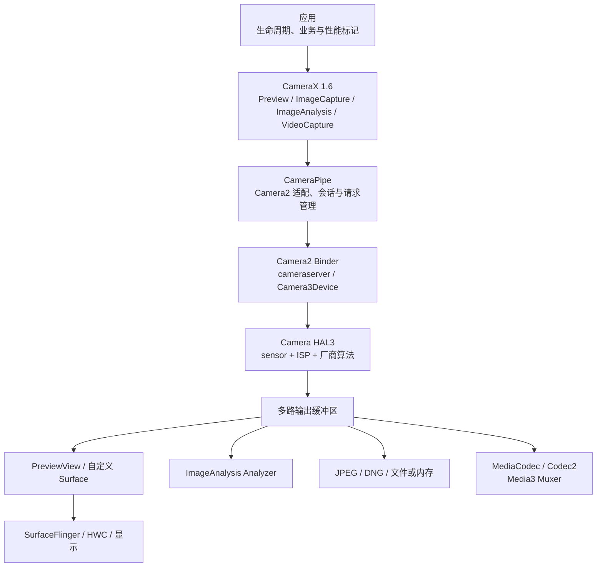

# CameraX：UseCase、Camera2 映射与性能

CameraX 是 Jetpack 的相机库。它把预览、拍照、图像分析和录像分别表达为 `Preview`、`ImageCapture`、`ImageAnalysis` 与 `VideoCapture` 四类 UseCase（相机用例）。这里的 UseCase 指一路输出及其配置约束，并非产品文档里的业务用例。

CameraX 的性能问题不能用“多了一层封装”概括。设备执行的仍是相机服务、Camera HAL、sensor、ISP、输出 Surface、编码器与各个消费者。一次卡顿可能发生在用例配置、会话重建、HAL 出帧、预览合成、分析线程、编码或文件写入中的任一段。

平台锚点为 Android 17 / API 37 / `android-17.0.0_r1`，稳定库基线为 CameraX 1.6.1。涉及跨设备缓冲区共享与同步时，Android common kernel（通用内核）源码锚点为 `android17-6.18-2026-06_r6`。重点是应用侧配置和诊断；HAL3 request-result（请求提交与结果回传）、BufferQueue、fence 与显示管线的完整推导见 [18.10 Android Camera 平台管线：HAL3、Buffer、ZSL 与显示](../../part2-performance/ch18-rendering-pipelines/10-camera-pipeline.md)。

为便于对照 API、日志与 Perfetto 轨迹，文中保留常见英文标识。它们在本文中的含义如下：

| 术语 | 本文含义 |
|---|---|
| Camera2 / Camera HAL | Camera2 是应用访问平台相机的框架 API；Camera HAL（硬件抽象层）是设备厂商连接 Android 相机框架与相机硬件的实现。 |
| sensor / ISP | sensor 是图像传感器；ISP（图像信号处理器）负责去马赛克、降噪、色彩处理等图像流水线工作。 |
| Surface / BufferQueue | Surface 是图像生产者写入缓冲区的目标；BufferQueue 是连接生产者与消费者的缓冲区队列。 |
| fence | 缓冲区同步信号，用来说明生产或读取何时完成；等待 fence 不等同于 CPU 一直执行计算。 |
| layer / HWC / overlay | layer 是显示系统参与合成的一层内容；HWC 是硬件合成器；overlay 是 HWC 可直接扫描输出的硬件平面。是否使用 overlay 由每帧的完整图层组合决定。 |
| latch / present | latch 指 SurfaceFlinger 选定某个缓冲区参加目标显示帧；present 指合成结果提交到显示设备。 |
| quirk | CameraX 针对特定设备、相机或系统版本启用的兼容性修正，不是泛指“设备异常”。 |
| 3A / ZSL | 3A 是自动曝光、自动对焦和自动白平衡；ZSL（零快门时滞）会从已缓存的候选帧中选择接近按键时刻的图像。 |
| codec / Muxer | codec 是编解码器；Muxer（封装器）把编码后的音视频样本写入 MP4、WebM 等容器。 |
| Extensions / CameraEffect | Extensions 调用设备厂商提供的夜景、HDR 等扩展算法；CameraEffect 把应用效果插入 CameraX 输出处理过程。 |
| Camera2Interop | CameraX 与部分 Camera2 配置之间的桥接接口，不会把底层会话控制权交给应用。 |

性能结论必须指明等待发生在哪个对象，单写“CameraX 慢”或“fence 慢”无法定位责任方。

## 1. 先固定四个版本坐标

“运行在 Android 17”无法说明 CameraX 行为。诊断记录至少要包含以下四项：

| 坐标 | 基线 | 用途 |
|---|---|---|
| Android 平台 | Android 17 / API 37 / `android-17.0.0_r1` | Camera2、相机服务、HAL 接口与显示系统 |
| CameraX 稳定版 | 1.6.1 | 应用依赖、兼容修复、CameraPipe、录像与用例配置 |
| CameraX 预览版 | 1.7.0-alpha03，仅作观察 | 不进入生产基线，也不据此描述稳定能力 |
| Android common kernel | `android17-6.18-2026-06_r6` | dma-buf、dma-fence 与 sync_file（把 fence 暴露为文件描述符的接口）公共语义 |

截至 2026-08-15，AndroidX 官方版本页列出的 CameraX 稳定版是 1.6.1，预览版是 1.7.0-alpha03。没有可核验的 3.0 主版本发布物，因此不据此描述版本能力。

CameraX 与 Android API level 分开发布。Android 17 设备可以运行较旧的 CameraX，旧库却未必认识平台新增的相机元数据（metadata）。CameraX 1.5.1 及更早版本在部分 Android 17 设备遇到新的 dynamic range profile（动态范围档位标识）时，可能在绑定阶段崩溃；官方要求升级到 1.5.2、1.6.0 或更高版本。本文采用 1.6.1。

下面的依赖片段用于把相机模块锁定到同一稳定版本。

```kotlin
// build.gradle.kts
val cameraxVersion = "1.6.1"

dependencies {
    implementation("androidx.camera:camera-core:$cameraxVersion")
    implementation("androidx.camera:camera-camera2:$cameraxVersion")
    implementation("androidx.camera:camera-lifecycle:$cameraxVersion")
    implementation("androidx.camera:camera-view:$cameraxVersion")
    implementation("androidx.camera:camera-video:$cameraxVersion")
}
```

`camera-core`、`camera-camera2`、`camera-lifecycle`、`camera-view` 和 `camera-video` 应使用同一版本。Extensions 也要遵守这条规则；混用版本会让 API 与内部实现组合脱离官方发布包。

CameraX 的关键版本变化可按下面的顺序理解：

- CameraX 1.2 引入实验性的 ZSL 捕获模式；
- CameraX 1.3 扩展了并发相机与录像镜像等能力；
- CameraX 1.5 开始提供 `SessionConfig`、高速录像会话和更完整的特性组合表达；
- CameraX 1.5.2 修复 Android 17 新 dynamic range profile 造成的绑定崩溃；
- CameraX 1.6 把默认 Camera2 实现迁移到 CameraPipe，录像的 MP4 / 3GPP 封装默认使用 Media3 Muxer，并稳定 `SessionConfig`、`HighSpeedVideoSessionConfig` 与 `isSessionConfigSupported()`；
- CameraX 1.6.1 修复 1.6.0 的依赖编译问题；
- CameraX 1.7 仍处于 alpha 阶段。1.7.0-alpha02 加入面向 GPU 的 `ImageAnalysis`、QHD（2560 × 1440）录像等接口；1.7.0-alpha03 又加入新的 Camera2Interop 配置方式、UseCase Kotlin DSL（领域专用配置语法），并移除预览与录像镜像控制的实验注解。这些能力均不属于 1.6.1 稳定基线。

## 2. CameraX 1.6 的位置：CameraPipe 仍在 Camera2 与 HAL 之上

CameraX 1.6 的架构变化需要单独说明。CameraPipe 是 CameraX 内部负责 Camera2 适配、会话和请求管理的模块。`Camera2Config.defaultConfig()` 已返回基于 CameraPipe 的配置，CameraX 不再沿用早期那套 Camera2 内部实现。CameraPipe 使用的仍是平台 Camera2 接口，也会经过相机服务进程 `cameraserver`、Camera HAL、sensor 和 ISP。

下图用于标出配置层与数据消费者，避免把所有耗时都记在 CameraX 名下。



图里的分层也给出了归因规则：用例协商、quirk 与绑定行为属于 CameraX；请求提交和结果分发跨越 CameraPipe 与平台。Binder 是 Android 的跨进程通信机制，图中的 Camera2 Binder 表示应用进程与 `cameraserver` 之间的调用。曝光、ISP 和厂商多帧算法属于设备；分析、编码、封装、存储和显示各有独立消费者。

| CameraX 用例 | 主要下游 | 常见限制 |
|---|---|---|
| `Preview` | 输出 Surface、BufferQueue、SurfaceFlinger / HWC | 实际承载类型、裁剪、旋转、显示合成 |
| `ImageAnalysis` | 以 ImageReader 为代表的图像消费者、Analyzer 执行器 | 回压、格式转换、图像归还、模型耗时 |
| `ImageCapture` | 静态拍照请求（still request）、3A、ISP、编码、I/O | 画质模式、ZSL、闪光灯、多帧处理 |
| `VideoCapture` | 相机输出、编码器、Muxer、文件 | 质量组合、dynamic range、持续吞吐 |
| Extensions | 扩展会话、厂商算法 | 支持范围、延迟、内存、热与设备差异 |

Android 17 的 `Camera3OutputStream` 仍从 `ANativeWindow` 取得缓冲区，等待 acquire fence（生产者允许写入的同步点），再把 HAL 返回的 release fence（消费者可以读取的同步点）随缓冲区交给消费者。CameraX 的 Java/Kotlin API 不改变这条所有权链。Analyzer 长时间持有 `ImageProxy`、编码器消费变慢或显示端等待，都可能向上游施加压力。

## 3. 会话配置先于单个参数优化

CameraX 需要把所有同时运行的用例转换为一组底层输出。某个尺寸能够单独打开，不能证明它能和另外三路输出并发。分辨率、格式、帧率、dynamic range（动态范围）、防抖、扩展模式及设备 quirk 都会参与组合选择。

### 3.1 一次绑定完整用例集合

应用已知要同时运行的用例时，应在同一次 `bindToLifecycle()` 中提交。CameraX 会基于完整集合协商输出。先绑定 Preview，再多次加入或移除其他用例，可能反复触发会话配置、缓冲区准备和首帧等待。

CameraX 1.6 的 `SessionConfig` 是“一次相机会话需要哪些用例和特性”的完整配置对象，可以把用例、帧率、视口、效果和特性组放在一起。对正在运行的生命周期再次绑定新 `SessionConfig` 仍可能暂时停止数据并重新初始化，不能把该调用当成无缝更新保证。

下面的代码用于在绑定前查询完整组合，并在不支持时进入产品定义的降级分支。

```kotlin
val sessionConfig = SessionConfig(
    preview,
    imageCapture,
    imageAnalysis,
)

val cameraInfo = cameraProvider.getCameraInfo(cameraSelector)
if (!cameraInfo.isSessionConfigSupported(sessionConfig)) {
    showUnsupportedCombination()
} else {
    cameraProvider.bindToLifecycle(
        lifecycleOwner,
        cameraSelector,
        sessionConfig,
    )
}
```

`isSessionConfigSupported()` 检查这组会话包含的 Surface、特性和参数。它比单独读取 `CONTROL_AE_AVAILABLE_TARGET_FPS_RANGES` 或某个输出尺寸更接近最终配置，但运行时稳定性、厂商算法耗时和热状态仍需实测。

### 3.2 能力查询与运行结果要分开记录

诊断表应同时保存“请求值”和“协商结果”：

- CameraX artifact（发布组件）版本、相机 id、前后摄，以及 logical camera（聚合多个镜头的逻辑相机）/ physical camera（单个物理镜头）；
- 已绑定用例及其格式、最终尺寸、crop rect（裁剪矩形）与 target rotation；
- 目标帧率范围、实际 CaptureResult（每帧相机结果元数据）中的帧时长与曝光时间；
- dynamic range、防抖、ZSL、Extensions、CameraEffect 与 Camera2Interop 配置；
- `PreviewView` 请求的实现模式及实际 View / 显示 layer；
- 设备温度、运行时长、充电状态与显示刷新率。

`QualitySelector`、`ResolutionSelector` 和帧率范围表达的是选择规则。最终结果可能因组合限制或 quirk 变化；业务代码和性能日志都应读取绑定后的信息。

### 3.3 避免无意义的重绑

以下操作常引起完整或局部重配：

- 切换相机、Extensions、dynamic range 或高帧率模式；
- 增删 `ImageAnalysis`、`ImageCapture` 或 `VideoCapture`；
- 修改会影响输出选择的分辨率、宽高比或效果；
- 生命周期频繁进入 STARTED / STOPPED；
- 每次 Compose 重组或 View 重建都创建新用例并重新绑定。

界面状态变化若只影响覆盖层、焦点框或分析开关，优先保留会话。停止分析可以清除 Analyzer；恢复时再设置 Analyzer，不必为每次暂停都重建全部用例。

Android 17 / API 37 新增的 `CameraCaptureSession.updateOutputConfigurations()` 是 Camera2 平台接口，可替换既有、属性兼容的输出 Surface，无需重建整个会话。它不能增加或删除输出配置，传入数量必须与现有输出一致。CameraX 1.6 没有承诺把任意用例切换自动映射为该 API。需要精确控制 Android 17 动态输出更新时，应评估 Camera2。

## 4. Preview：请求模式不等于实际显示路径

### 4.1 `PERFORMANCE` 与 `COMPATIBLE`

`PreviewView.ImplementationMode.PERFORMANCE` 是默认值。它会尽量使用 `SurfaceView`；`COMPATIBLE` 使用 `TextureView`。

- `SurfaceView` 为预览提供独立 Surface，SurfaceFlinger 可以把它作为独立 layer 参与合成。满足设备条件时，HWC 有机会使用 overlay，因而减少宿主窗口的纹理采样；
- `TextureView` 把相机图像作为纹理进入宿主窗口，裁剪、旋转、动画和 View 变换更灵活，但每帧还要经过宿主 HWUI（Android 界面硬件加速渲染器）/ GPU 路径；
- overlay 是 HWC 对当帧 layer 集合的决定。使用 `SurfaceView` 不能证明每帧都走硬件 overlay。

下面的代码用于普通取景页明确表达低开销预览偏好。

```kotlin
previewView.implementationMode =
    PreviewView.ImplementationMode.PERFORMANCE

val preview = Preview.Builder().build().also {
    it.setSurfaceProvider(previewView.surfaceProvider)
}
```

这段配置只表达偏好。CameraX 仍可因 API level、LEGACY camera、设备 quirk 等条件选择 `TextureView`。LEGACY 是 Camera2 公布的最低硬件能力等级，常见于由旧相机栈兼容接入的设备。性能报告要通过 View 层级、SurfaceFlinger layer 或实际内部 View 确认承载方式。

CameraX 1.6.1 的 `PreviewView` 说明文档把 target rotation（目标旋转角）与显示旋转不一致列为 `TextureView` 回退条件；同版本源码中的决策方法 `shouldUseTextureView()` 尚未实现这项判断，当前判断包含 API 24 及以下、LEGACY camera 与 SurfaceView quirk。工程结论应以锁定版本的源码和设备观测为准，不能只根据枚举名称推断。

### 4.2 首帧至少分成四段

“页面打开到有画面”应拆成：

1. `ProcessCameraProvider` 初始化；
2. 用例绑定与底层会话配置；
3. 首个有效相机输出到达预览消费者；
4. SurfaceFlinger latch 这帧预览缓冲区，并把包含该 layer 的显示帧 present 到屏幕。

`PreviewView.getPreviewStreamState()` 可辅助判断数据流状态，但 `PERFORMANCE` 模式下 `STREAMING` 可能早于画面可见。需要精确首帧指标时，要加应用标记，并关联 Camera、BufferQueue 与 SurfaceFlinger 轨迹。

### 4.3 分辨率、裁剪与帧率要一起看

预览分辨率只需覆盖显示和业务裁剪需求。超过屏幕与识别需求的输出会增加 ISP、缓冲区、内存带宽和 TextureView / 特效路径的 GPU 工作。降低分辨率也可能让 HAL 选择另一 sensor mode（传感器工作模式），因此效果要在同一设备上复测。

帧率判断应使用目标帧周期：

- 30 fps 的周期约为 33.33 ms；
- 60 fps 的周期约为 16.67 ms；
- 可变帧率与弱光长曝光下，单纯按显示帧率判断 HAL 掉帧会误报。

不要设置一条跨设备的“超过多少毫秒就是 CameraX 卡顿”规则。统计 sensor timestamp（传感器采集时间戳）、相机输出和显示 present 三组间隔，才能区分相机产帧变化与显示漏帧。

## 5. ImageAnalysis：吞吐、等待时间和归还责任

`ImageAnalysis` 是应用最容易直接造成相机回压的位置。回压（backpressure）指消费者处理速度跟不上图像生产速度后，缓冲区队列把等待压力传回生产端。CameraX 1.6.1 的源码提供两种策略：

| 策略 | 行为 | 适合场景 |
|---|---|---|
| `STRATEGY_KEEP_ONLY_LATEST` | Analyzer（分析回调）忙时替换待处理的旧帧；队列深度配置被忽略 | 扫码、姿态、预览叠加等关注最新结果的实时任务 |
| `STRATEGY_BLOCK_PRODUCER` | 按顺序保留帧；队列满后生产端等待，影响同一 camera device（相机设备）的其他用例 | 每帧都必须处理且平均吞吐能跟上输入的任务 |

`KEEP_ONLY_LATEST` 是默认策略。`BLOCK_PRODUCER` 的默认队列深度为 6，深度包含正在分析的图像。增加深度只能吸收短时抖动，同时会增加内存占用和结果等待时间；平均处理速度低于输入速度时，队列迟早会占满。

下面的 Analyzer 适合实时识别。它保留最新帧，并用 ATrace（应用写入 Perfetto 的命名时间区间）标出处理过程。

```kotlin
val analysis = ImageAnalysis.Builder()
    .setOutputImageFormat(
        ImageAnalysis.OUTPUT_IMAGE_FORMAT_YUV_420_888
    )
    .setBackpressureStrategy(
        ImageAnalysis.STRATEGY_KEEP_ONLY_LATEST
    )
    .build()

analysis.setAnalyzer(analysisExecutor) { imageProxy ->
    Trace.beginSection("CameraX#analyze")
    try {
        analyzeFrame(imageProxy)
    } finally {
        imageProxy.close()
        Trace.endSection()
    }
}
```

`ImageProxy.close()` 把底层图像归还 CameraX。应用可以读取包装的 `Media.Image`，但不能直接调用 `Media.Image.close()`。漏关图像会让后续帧被丢弃或停住；在 `BLOCK_PRODUCER` 下，还可能影响 Preview 和其他绑定用例。

异步模型需要把关闭操作放到异步任务完成回调中。若 `analyzeFrame()` 只是提交任务就返回，而 `finally` 立即关闭，模型随后访问的图像已失效；若一直等待业务回调才关闭，又会延长缓冲区持有时间。解决办法是让分析任务明确拥有这次 `ImageProxy` 的生命周期，并为超时、异常和取消路径都注册关闭操作。

### 5.1 格式转换也属于分析耗时

`YUV_420_888` 是默认输出。请求 `RGBA_8888` 时，CameraX 会在内部执行 YUV 到 RGBA 的转换，并把结果放进第一个数据平面（plane）。这段转换时间也要计入分析成本。

分析预算应至少分为：

- 等待 Analyzer 开始；
- 图像旋转、裁剪与格式转换；
- 模型预处理；
- 推理；
- 后处理与坐标映射；
- `ImageProxy` 持有总时间。

只记录模型的 `process()` 耗时会低估应用消费者对相机管线的占用。实时任务还应记录输入帧数、实际分析帧数、主动跳过帧数和结果年龄。

### 5.2 降低分析负载的顺序

建议按影响范围逐步处理：

1. 改用 `KEEP_ONLY_LATEST`，消除旧结果排队；
2. 减少输入尺寸，确认识别准确率仍满足产品要求；
3. 避免每帧分配 Bitmap、ByteArray 或大对象；
4. 直接使用 YUV plane，减少无必要的 YUV → RGB → Bitmap 转换；
5. 降低分析频率或依据场景变化触发分析；
6. 选择更轻的模型或合适的 NNAPI（Android 神经网络 API）/ GPU 执行路径；
7. 只有必须逐帧处理时才使用 `BLOCK_PRODUCER`，并对队列等待时间设监控。

## 6. ImageCapture：捕获模式只表达偏好

`ImageCapture` 的端到端延迟可能包含 3A、曝光、sensor readout（传感器逐行读出）、ISP、厂商多帧处理、JPEG / DNG 编码、应用回调和存储写入。`takePicture()` 到回调的单个数值无法说明是哪一段变慢。

### 6.1 三种捕获模式

- `CAPTURE_MODE_MINIMIZE_LATENCY`：默认值，优先减少捕获延迟；
- `CAPTURE_MODE_MAXIMIZE_QUALITY`：允许设备选择更重的画质路径；
- `CAPTURE_MODE_ZERO_SHUTTER_LAG`：实验能力，从候选历史帧中选择接近按键时刻的帧，再执行 reprocess（把已捕获图像作为输入重新处理）。

ZSL 的名称不承诺文件立即可用；它只表达优先复用历史候选帧的捕获策略。公开能力边界与 CameraX 1.6.1 的具体实现必须分开：设备能力、用例组合和单次 ring 取帧都可能让请求降级，固定实现见 6.4。

### 6.2 把拍照延迟拆成可解释的时间点

建议记录：

| 时间点 | 说明 |
|---|---|
| 用户触发 | 产品定义的起点 |
| 捕获请求提交 | 区分应用调度与相机等待 |
| shutter / sensor timestamp | 曝光对应的采集时刻 |
| 静态拍照缓冲区可读 | HAL / ISP 输出完成 |
| 编码结果可用 | JPEG、DNG 或内存图像完成 |
| 文件写入完成 | 包含存储与 MediaStore 工作 |

弱光下曝光时间增长是预期现象。HDR、夜景、Extensions 等多帧处理会拉长 ISP / 厂商算法段。文件写入慢时，相机数据可能已经完成，优化方向应转向编码、磁盘或 `ContentResolver`。

### 6.3 Android 17 RAW14 与 CameraX RAW 不可直接画等号

Android 17 / API 37 新增 `ImageFormat.RAW14`，表示紧密打包的单平面 14 位传感器原始数据；设备还必须公布相应输出能力。CameraX 1.6 的 RAW / RAW+JPEG 能力通过 `ImageCaptureCapabilities` 和 CameraX 输出格式表达。CameraX 支持 RAW 不能证明它把平台 `RAW14` 暴露给应用。

业务需要指定 `RAW14`、精确管理 RAW Surface、手动请求参数或读取底层格式时，应使用 Camera2 并查询 `StreamConfigurationMap` 与相机特征。普通 DNG 拍摄则先查询 CameraX 的输出格式能力，避免只按 API level 开启。

### 6.4 CameraX 1.6.1 ZSL：3 帧 ring 与 CameraPipe 重处理

6.1 说明公开模式偏好；这一节锁定 CameraX 1.6.1，回答一次请求怎样从能力检查走到 PRIVATE 候选帧、CameraPipe `InputRequest` 和资源回收。升级 CameraX 后，ring 容量、quirk、过滤条件与后端路径都要重新核对。

#### 能力预筛选、会话校验与禁用条件

下面的示例用于在构建 `ImageCapture` 前选择拍照模式：

```kotlin
@OptIn(ExperimentalZeroShutterLag::class)
fun buildImageCapture(cameraInfo: CameraInfo): ImageCapture {
    val captureMode = if (cameraInfo.isZslSupported) {
        ImageCapture.CAPTURE_MODE_ZERO_SHUTTER_LAG
    } else {
        ImageCapture.CAPTURE_MODE_MINIMIZE_LATENCY
    }

    return ImageCapture.Builder()
        .setCaptureMode(captureMode)
        .setFlashMode(ImageCapture.FLASH_MODE_OFF)
        .build()
}
```

这段代码只做能力选择。最终能否建立 ZSL 会话，还要等 CameraX 合并所有用例配置并检查流组合。

在 CameraX 1.6.1 的 Camera2 实现中，`CameraInfoAdapter.isZslSupported()` 主要检查两项：

- CameraCharacteristics 包含 `REQUEST_AVAILABLE_CAPABILITIES_PRIVATE_REPROCESSING`；
- 当前设备没有命中 `ZslDisablerQuirk` 兼容性特例。

API 文档还规定最低系统版本为 Android 6.0（API 23）。这个返回值不检查当前闪光灯模式、`VideoCapture`、Camera Extension 和分辨率策略，也不验证本次会话最终选中的所有 `Surface` 能否同时配置。

可以把判定分成三层：

| 层次 | 典型检查 | 失败结果 |
|---|---|---|
| 设备能力 | API 23 及以上、支持 `PRIVATE_REPROCESSING`、无禁用兼容性特例 | 不宣称支持 ZSL |
| 会话配置 | `PRIVATE` 输入尺寸有效、支持 `PRIVATE → JPEG`、用例组合可配置 | 不建立重处理输入流 |
| 单次拍照 | 闪光灯为 `OFF`、环形队列中存在带完整元数据的合格帧 | 改用普通静态拍照 |

##### CameraX 1.6.1 的禁用与兼容性条件

以下情况会禁用或绕过 CameraX ZSL：

- 绑定 `VideoCapture`；
- 启用 Camera Extension；
- 闪光灯模式为 `ON` 或 `AUTO`；
- 请求高分辨率优先模式，导致 `OPTION_ZSL_DISABLED` 被设置；
- 命中 `ZslDisablerQuirk` 设备特例；
- 设备没有 `PRIVATE_REPROCESSING`；
- `StreamConfigurationMap` 没有可用的 `PRIVATE` 输入尺寸；
- `getValidOutputFormatsForInput(PRIVATE)` 不包含 JPEG；
- 拍照时环形队列为空，或其中没有可用的元数据。

闪光灯的处理需要单独说明。CameraX 可以保留已经建立的可重处理会话，只在闪光灯为 `ON` 或 `AUTO` 时提交普通静态拍照；用户切回 `OFF` 后，无需仅为这一变化重建整个会话。用例配置、设备能力或兼容性特例不允许 ZSL 时，`ZslControlImpl` 会跳过输入流的建立。

CameraX 1.6.1 的兼容性特例列表包含若干 Samsung Fold4、S22、S24 型号和 Xiaomi Mi 8，原因是重处理图像可能出现颜色异常或变焦冻结。机型名单属于库版本的实现细节，升级 CameraX 后应重新检查相应版本的 `ZslDisablerQuirk`。

#### `PRIVATE` output、input Surface 与 reprocessable session

##### 输入格式与合法输出

`ZslControlImpl` 把 ZSL 格式固定为 `ImageFormat.PRIVATE`。它从：

```text
StreamConfigurationMap.getInputSizes(ImageFormat.PRIVATE)
```

选择面积最大的输入尺寸，然后确认：

```text
getValidOutputFormatsForInput(ImageFormat.PRIVATE)
```

包含 `ImageFormat.JPEG`。

这些查询解决两个不同问题：

- 输入尺寸决定哪一种 `PRIVATE` 图像可以送回设备；
- 输入/输出格式映射决定这种输入能否重处理成 JPEG。

`PRIVATE` 表示应用不读取图像的像素布局。CameraX 持有的是 `Image` 与 `GraphicBuffer` 句柄以及元数据，设备端按照实现定义的缓冲区契约处理。不能用“宽 × 高 × 固定每像素字节数”精确计算这批缓冲区的物理内存。

##### 同一 session 的候选输出与重处理输入

CameraX 会创建一个 `MetadataImageReader`，把它的 `Surface` 加入重复请求的输出目标。这路输出会持续接收可作为候选帧的 `PRIVATE` 图像。

CameraX 还会为会话设置宽、高和格式相同的 `InputConfiguration`。Camera2 建立可重处理捕获会话后，会话会暴露一个输入 `Surface`。CameraPipe 在这个输入 `Surface` 上创建 `ImageWriter`，供拍照时把候选图像送回相机设备。

结构可以画成：

```text
regular repeating request
  ├─ preview output → PreviewView / Surface
  └─ ZSL PRIVATE output → MetadataImageReader → ZslRingBuffer

selected PRIVATE Image
  → ImageWriter → session input Surface
  → reprocess request
  → JPEG output Surface
```

上半部分仍是传感器采集，下半部分以已有缓冲区为输入，不再触发新的传感器曝光。

#### 三帧 ring、元数据匹配与 3A 过滤

##### 图像与 metadata 先按 timestamp 配对

`MetadataImageReader` 同时监听 `ImageReader` 和 `CameraCaptureCallback`。图像与 `CameraCaptureResult` 的到达顺序可能不同，它会根据时间戳把二者配成一个带有 `ImageInfo` 的 `ImageProxy`。

只有匹配成功后，`ZslRingBuffer` 才能读取相应的 AF、AE、AWB 状态。图像和捕获结果长时间无法匹配时，旧数据会被清理；不能把“`ImageReader` 回调到达”当成“环形队列中已有可重处理帧”。

##### AF、AE、AWB 决定候选资格

`ZslRingBuffer.isValidZslFrame()` 的条件是：

- AF（自动对焦）为 `LOCKED_FOCUSED` 或 `PASSIVE_FOCUSED`；
- AE（自动曝光）为 `CONVERGED`；
- AWB（自动白平衡）为 `CONVERGED`。

任一条件不满足，`ImageProxy` 都会立即关闭，不会进入环形队列。这只是依据枚举状态过滤元数据，没有分析图像内容。弱光下 AE 长时间不收敛、连续对焦扫描、快速切换场景或元数据缺失，都可能让环形队列为空。

##### ring、ImageReader 与 input 的三个上限

CameraX 1.6.1 源码中出现了三个含义不同的缓冲区数量：

| 名称 | 数值 | 约束对象 |
|---|---:|---|
| `RING_BUFFER_CAPACITY` | 3 | 可供 ZSL 选择的合格 `ImageProxy` 数量 |
| `ZslControlImpl.MAX_IMAGES` | 9 | 传给 `MetadataImageReader` 的图像上限，源码中为环形队列容量的 3 倍 |
| CameraPipe 输入端 `maxImages` | 1 | 会话输入 `Surface` 上的 `ImageWriter` 并发图像数 |

“ZSL 缓存 3 帧”不代表整个相机处理流水线只分配 3 个 `GraphicBuffer`。预览、JPEG、ZSL 输出、HAL 处理中的缓冲区、`ImageReader` 和输入流各有自己的队列约束，驻留量要逐条流统计。

##### 当前实现没有图像评分器

`ZslRingBuffer` 继承自 `ArrayRingBuffer`。新帧通过 `addFirst()` 加入，`dequeue()` 通过 `removeLast()` 取出；容量已满时，会先移除并关闭队尾最旧的帧。

按这段实现，CameraX 1.6.1 的行为是：

1. 监听器每次通过 `acquireLatestImage()` 取得当时最新的已匹配图像；
2. 图像先经过 AF、AE、AWB 过滤；
3. 环形队列最多持有 3 帧；
4. 拍照时取出当前队列里最早保留的合格帧。

`ImageCapture` API 注释把目标概述为交付时间戳接近快门的中间结果，但 1.6.1 的这段实现没有按触摸时间遍历候选，也没有清晰度评分或运动补偿。排查具体版本时，应以该版本源码和实测 `SENSOR_TIMESTAMP` 为准。

#### CameraPipe 怎样构造并回收重处理请求

CameraX 1.6.1 的 Camera2 后端已经迁移到 CameraPipe。较早资料中常见的 `androidx.camera.camera2.internal.*` 路径不能直接代表这个版本；对应的核心实现位于 `androidx.camera.camera2.adapter` 和 `androidx.camera.camera2.pipe.compat`。

##### `CaptureConfigAdapter` 生成 InputRequest

当捕获配置的模板为 `TEMPLATE_ZERO_SHUTTER_LAG`，并且用例和闪光灯设置没有禁用 ZSL 时，`CaptureConfigAdapter` 会尝试从环形队列取出一帧。

取帧成功后，它完成三件事：

1. 从 `ImageProxy.imageInfo` 取回匹配的 `CameraCaptureResult`；
2. 把底层 `Image` 包装为 CameraPipe 的图像对象；
3. 把图像与相应的 `FrameInfo` 组合成 `InputRequest`。

如果环形队列为空，`inputRequest` 会保持为空，CameraX 随后把请求模板改为普通的 `TEMPLATE_STILL_CAPTURE`。环形队列中的帧已经完成元数据匹配；若内部图像与结果的类型或非空约束被破坏，源码会在构造 `InputRequest` 时失败，不能把这种异常当作普通降级。

##### ImageWriter 排入 session input

CameraPipe 会为可重处理会话的输入 `Surface` 创建 `ImageWriter`。准备提交请求时，`Camera2CaptureSequenceProcessor` 先调用以下方法，把选中的历史帧排入输入队列：

```text
imageWriter.queueInputImage(selectedImage)
```

这一步把 CameraX 持有的 `PRIVATE` 图像排入 Camera2 会话的输入队列。它没有复制出一张可由应用访问的位图，也没有把 JPEG 数据送回 HAL。

##### TotalCaptureResult 初始化 reprocess request

CameraPipe 从 `FrameInfo` 中解包同一源帧的 `TotalCaptureResult`，再调用以下方法创建重处理请求：

```text
cameraDevice.createReprocessCaptureRequest(totalCaptureResult)
```

设备需要原始捕获结果中的曝光、白平衡、镜头、裁剪和厂商元数据，才能按照源图像的拍摄条件进行重处理。Android Camera2 要求输入图像来自同一台相机设备，并在同一个会话中直接或间接产生；随意组合其他相机或其他会话的图像与结果，不符合接口约定。

创建请求构建器后，CameraPipe 会添加本次静态拍照的目标 `Surface`，通常是 CameraX 图像流水线的 JPEG 输出端，并写入 JPEG 方向、质量等请求参数。

##### 成功、失败、取消都要回收 input image

被选中的 `ImageProxy` 在排入 `ImageWriter` 后仍持有底层资源。CameraX 会为请求安装监听器，并在以下路径中通过同一个原子引用关闭它：

- 请求完成；
- 请求失败；
- 请求中止；
- 完整捕获结果到达。

多个回调可能先后发生，原子引用可以保证资源只关闭一次。若自行实现 Camera2 ZSL，也要在提交失败、会话关闭、请求中止和异常路径中完整回收输入图像。

失败边界分为两种：如果拍照时没有候选帧，CameraX 会改用普通静态拍照；如果已经构造 `InputRequest`，随后 `ImageWriter.queueInputImage()` 或 `createReprocessCaptureRequest()` 失败，CameraPipe 会让本次捕获序列构建失败。不能假定这一阶段仍会自动重试普通拍照。

#### 候选帧也占用 stream buffer

环形队列保存的是尚未关闭的 `ImageProxy`。每保留一帧，就有一块 `PRIVATE` 输出缓冲区无法回到生产方队列。队列满后会关闭被淘汰的帧，拍照完成或失败后会关闭被选中的帧，会话重置时则会清空全部帧。

如果图像没有按预期关闭，可能出现：

- `MetadataImageReader` 达到 `maxImages`；
- ZSL 输出流没有空闲缓冲区；
- 重复请求被输出端背压拖慢；
- 预览、分析或其他共享 camera 资源出现连带延迟。

这类问题要按照 [Camera 平台管线的逐 stream Buffer 方法](../../part2-performance/ch18-rendering-pipelines/10-camera-pipeline.md)中的方法逐条流检查。预览正常不能证明 ZSL 输出流和输入队列正常。

#### 应用条件、降级与日志证据

##### 记录应用层条件

每次拍照至少记录：

- CameraX 版本；
- 相机 ID；
- `CameraInfo.isZslSupported()`；
- 拍照模式；
- 闪光灯模式；
- 已绑定的用例；
- Camera Extension 是否启用；
- 目标分辨率策略；
- `SENSOR_INFO_TIMESTAMP_SOURCE`；
- 按键的 `elapsedRealtimeNanos()`；
- 输出图像或捕获结果的传感器时间戳；
- 成功、失败和错误码。

不能只记录一个 `zsl=true` 布尔值。它无法说明会话是否建立了输入流，也无法说明本次拍照是否从环形队列中取得了历史帧。

##### 检查 CameraX 日志

CameraX 1.6.1 源码中可直接定位的诊断文本包括：

- `Private reprocessing isn't supported`；
- `Unable to find a supported size for ZSL`；
- `JPEG isn't valid output for ZSL format`；
- `Selected ZSL size`；
- `No such element`；
- `Queuing image ... for reprocessing to ImageWriter`；
- `Failed to create a ReprocessingCaptureRequest.Builder`。

前三项用于说明能力或会话配置，`No such element` 表示拍照时环形队列中没有帧；末尾两项才接近单次重处理请求的提交阶段。

#### CameraX 1.6.1 与 Android 17 的双版本边界

| 版本 | 相关边界 |
|---|---|
| Android 6.0（API 23） | Camera2 可重处理会话、`createReprocessCaptureRequest()` 和 `ImageWriter` 能力成为 CameraX ZSL 的系统基础 |
| CameraX 1.2.0 | `CAPTURE_MODE_ZERO_SHUTTER_LAG` 作为实验 API 引入 |
| Android 14（API 34） | 重处理请求的 `CONTROL_CAPTURE_INTENT` 默认设为 `STILL_CAPTURE`；更早版本需要调用方自行留意 |
| CameraX 1.6.0 | Camera2 后端迁移到 CameraPipe，排障时应使用新的 adapter 与 pipe 实现路径 |
| CameraX 1.6.1 | 库侧锚点；固定 3 帧环形队列、`PRIVATE` 重处理、当前兼容性特例和降级逻辑均按该版本源码核对 |
| Android 17（API 37） | 平台源码锚点；Camera2 重处理、Camera3 输入流与 AIDL `CaptureRequest.inputBuffer` 均按 `android-17.0.0_r1` 核对 |

CameraX 是独立于 Android 系统发布的 Jetpack 库。同一台 Android 17 设备可以运行不同的 CameraX 版本，因此分析报告必须同时写明系统源码标签、厂商构建版本和 CameraX 版本。

## 7. VideoCapture：相机、编码、封装和存储是四段

CameraX 1.6 的录像路径有两个版本事实：

- 默认 Camera2 实现已迁移到 CameraPipe；
- `Recorder` 对 MP4 / 3GPP 默认创建 `Media3MuxerImpl`，WebM 仍走基于平台 `MediaMuxer` 的实现。

因此，把所有录像尾部耗时都归到平台 `MediaMuxer` 已不准确。诊断要记录 CameraX 版本与输出格式。

### 7.1 `QualitySelector` 不能证明完整组合可绑定

`QualitySelector.getSupportedQualities()` 返回的质量保证针对 `VideoCapture` 单独运行，或 `Preview + VideoCapture` 组合。再加入 `ImageCapture`、`ImageAnalysis`、HDR、稳定或 CameraEffect 后，绑定仍可能失败或改用不同配置。

下面的选择器用于优先 1080p，并允许在不支持时选择较低质量。

```kotlin
val qualitySelector = QualitySelector.fromOrderedList(
    listOf(Quality.FHD, Quality.HD, Quality.SD),
    FallbackStrategy.lowerQualityOrHigherThan(Quality.SD),
)

val recorder = Recorder.Builder()
    .setQualitySelector(qualitySelector)
    .build()

val videoCapture = VideoCapture.withOutput(recorder)
```

选择器给出了优先级和回退规则。绑定后仍要记录最终尺寸、帧率、dynamic range、编码器与输出 `MediaFormat`，不能把 `FHD` 当成固定 codec、码率或色彩格式。`FHD` 只表示分辨率等级，具体编码格式和码率仍由配置与设备能力决定。

### 7.2 丢帧按四段归因

| 段 | 观测 | 常见问题 |
|---|---|---|
| 相机输出 | sensor timestamp、相机输出间隔 | 曝光、HAL、ISP、会话配置、热限制 |
| 编码输入 | Surface 缓冲区队列、编码器输入节奏 | 输出组合、GPU 效果、编码器背压 |
| 编码输出 | MediaCodec / Codec2 输出时间戳 | codec 负载、关键帧、设备 quirk |
| 封装与写入 | Muxer 写入、文件大小、存储延迟 | 存储空间、文件系统、MediaStore、I/O 抖动 |

只看最终文件的时间戳间隔无法区分相机漏产、编码器丢帧或时间戳修正。Perfetto 中应同时看 camera、codec、调度、频率和应用标记。

### 7.3 高速录像与多路输出

CameraX 1.6 的 `HighSpeedVideoSessionConfig` 已是稳定 API。应用应使用对应 `SessionConfig` 查询支持的帧率范围，再绑定；普通 `CameraInfo.getSupportedFrameRateRanges()` 中出现某个范围，不保证当前输出组合支持。

高帧率、4K、HDR、稳定、分析与效果会竞争 sensor mode、ISP、内存带宽、编码器和热预算。产品降级顺序应由业务定义，例如：

- 保留录像，降低或关闭分析；
- 保留目标帧率，降低分辨率；
- 保留画质，降低帧率；
- 高温时关闭效果或稳定；
- 存储空间不足时及时结束并处理 `VideoRecordEvent.Finalize`。

这些策略没有跨设备的固定优先级，需要用设备覆盖和场景测试确定。

## 8. Extensions：把厂商算法当作独立工作模式

Night（夜景）、HDR（高动态范围）、Bokeh（背景虚化）、Face Retouch（人像润饰）等 Extensions 会建立扩展会话，并调用设备厂商实现。它们可能使用多帧采集、额外中间缓冲区和后处理线程，延迟、内存与热表现不能从普通 `ImageCapture` 推导。

CameraX 1.6 提供稳定的 `ExtensionSessionConfig`。该配置可以在绑定前参与 `getCameraInfo()` 和 `isSessionConfigSupported()` 查询，但它不支持 `ImageAnalysis`。需要 Extension 与分析同时运行的产品必须设计模式切换，不能假设普通会话的用例组合可直接搬入扩展会话。

Android 17 平台还允许厂商定义 Camera Extension mode，例如超分辨率或厂商 AI 增强。应用可通过 Camera2 的 `isExtensionSupported(int)` 查询这类模式。这个平台能力不表示 CameraX 1.6.1 已为所有厂商自定义模式提供等价的稳定接口；CameraX 无法表达需求时，再评估 Camera2。

Extensions 的测试记录至少包含：

- extension mode、相机 id 与 CameraX 版本；
- 预览首帧、拍照 shutter、图像可用与文件完成时间；
- 连续拍摄间隔与设备忙状态；
- 冷机和热稳定状态下的差异；
- 失败、不可用与普通模式回退；
- 内存、dma-buf 和厂商进程变化。

## 9. ML Kit、CameraEffect 与自研 GPU 管线

ML Kit 集成通常运行在 `ImageAnalysis` 消费端。CameraEffect 或自研 OpenGL / Vulkan 管线则可能位于预览、录像或拍照输出之间。两者的资源竞争方式不同：

- CPU Analyzer 会占用 CPU、内存带宽，并持有分析图像；
- GPU Analyzer 或效果会增加纹理导入、同步、shader（着色器程序）与输出 Surface 工作；
- NNAPI / GPU 模型可能与预览效果争用 GPU 或内存；
- 逐帧 YUV → RGB 与 Bitmap 分配会增加 CPU、内存和 GC（垃圾回收）压力；
- 结果覆盖层若每帧触发复杂 UI 重绘，还会增加宿主窗口的帧耗时。

性能计时要覆盖从相机 timestamp 到结果显示的端到端延迟。模型推理很快，但输入帧在队列里等待较久时，用户看到的仍是旧结果。

坐标转换也要使用 CameraX 提供的 rotation、crop rect 与 transformation 信息。直接用传感器坐标绘制到 `PreviewView`，在裁剪、镜像和旋转场景会错位；为修错位反复复制或旋转 Bitmap，会引入额外开销。

## 10. 热稳定：峰值数据不能代表持续录像

相机持续运行会同时使用 sensor、ISP、DDR 内存、CPU、GPU、NPU（神经网络处理器）、编码器、显示与存储。短时间测试可能处于高频状态；几分钟后，系统热管理策略可能调整处理器频率或设备算法，帧率和延迟分布也会变化。

长时间场景应固定：

- 室温、充电状态、屏幕亮度和网络活动；
- 前后摄、分辨率、帧率、dynamic range 与稳定；
- Preview 承载方式、Analyzer 模型和效果；
- 录像编码设置与存储位置；
- 预热时间、总时长和系统热状态。

降级应由状态机控制，升降级使用不同温度阈值，形成滞回，避免温度在边界附近时反复重绑会话。只降低应用线程优先级通常不能解决 ISP、GPU、编码器或 DDR 的热限制。

公共 kernel 的 dma-buf 与 dma-fence 源码可分别解释“设备间如何共享同一缓冲区”和“设备间如何表达工作完成”。相机 sensor、ISP、频率和带宽策略通常位于厂商驱动、固件与 HAL。缺少厂商轨迹时，不要把 kernel 调度等待直接写成 ISP 结论。

## 11. 性能观测：先定义时间点，再看工具

### 11.1 最小指标集

| 指标 | 起点与终点 | 需要关联的证据 |
|---|---|---|
| `ProcessCameraProvider` 初始化 | 请求 provider → provider 可用 | 应用标记（marker）、Binder、线程调度 |
| 绑定耗时 | `bindToLifecycle` → 会话可出帧 | CameraX 日志、camera configure、HAL |
| 首个相机输出 | 首个 repeating request（重复捕获请求）→ 首个有效输出 | camera ATrace、frame number（帧编号）、stream（输出流） |
| 首个可见预览 | 页面动作 → layer present | 应用 marker、BufferQueue、SF / HWC |
| Analyzer 等待 | 图像可交付 → Analyzer 开始 | CameraX / 应用 marker |
| Analyzer 持有 | Analyzer 收到 → `ImageProxy.close()` | ATrace、计数器、异常路径 |
| 拍照延迟 | 用户触发 → shutter / 图像 / 文件 | 拍照回调（capture callback）、sensor timestamp、I/O |
| 录像稳定性 | 录制开始 → `VideoRecordEvent.Finalize` | camera、codec、Muxer、存储、热状态 |

平均值会隐藏首帧、弱光、切镜头和热限制的长尾。至少报告 p50、p95、p99、最大值、失败数与样本场景。p95 表示 95% 的样本不超过该值，p99 同理；样本量不足时直接说明，不补造百分位。

### 11.2 Perfetto 需要哪些轨迹

CameraX 问题的基础采集通常包括：

- `camera`、`hal`：相机服务、请求与厂商可见切片；
- `gfx`、`view`、SurfaceFlinger frame：预览与界面显示；
- Binder、sched（线程调度）与 CPU 频率：跨进程调用、线程切换与算力变化；
- MediaCodec / Codec2：录像编码；
- thermal（热状态）、CPU / GPU / 内存频率：持续运行；
- 应用 ATrace：用于标出页面动作、绑定、Analyzer、拍照与录制状态。

FrameTimeline 是系统记录的应用窗口帧时间线，主要解释界面帧。`SurfaceView` 预览是独立 layer 时，应用窗口 jank（卡顿帧）不能替代相机输出与预览 layer present 证据。`TextureView` 则还要查看宿主 HWUI 和应用窗口提交。

[14.14 Android Camera 性能与 Perfetto 分析](../../part3-tools/ch14-other-tools/14-camera-performance-analysis.md) 给出了 Android 17 的 Perfetto 配置、CameraService 打开相机阶段、输出流首缓冲区、请求延迟直方图与 ZSL 时间边界，可直接沿用其采集配置。

### 11.3 内存必须分域

相机内存可能分布在：

- Java / Kotlin heap（托管堆）：业务对象、Bitmap、模型输入输出；
- native heap（原生堆）：CameraX、图像转换、codec、厂商库；
- GraphicBuffer / dma-buf：Preview、Analysis、录像与拍照输出；
- GPU、ISP、codec 与厂商私有池；
- ZSL、Extensions 和多帧算法的候选图像。

进程 RSS（驻留在物理内存中的进程页）增长不能直接换算为 `ImageAnalysis` 队列大小。先确认未关闭的 `ImageProxy`、Bitmap 分配和 native heap，再结合 dma-buf、Surface 与厂商数据判断。

## 12. CameraX、Camera2Interop 与 Camera2 的选择

### 12.1 CameraX 适合的范围

以下场景通常留在 CameraX：

- Preview、普通拍照、扫码、文档扫描和常规录像；
- 可以通过 `SessionConfig`、分辨率、帧率、回压与降级表达需求；
- 需要 CameraX 的生命周期、quirk 与设备兼容处理；
- 轨迹显示问题位于 Analyzer、应用 UI、编码或存储，而非抽象能力缺失。

CameraX 1.6 的 CameraPipe 和稳定 `SessionConfig` 已覆盖比旧版本更宽的高级配置范围。迁移到 Camera2 前，应先确认当前稳定版是否已有对应能力。

### 12.2 Camera2Interop 的边界

`Camera2Interop` 可以向 CameraX 配置加入部分 `CaptureRequest` 选项或读取 Camera2 信息。它不会把 CameraX 用例变成应用自管的 `CameraCaptureSession`，也不给应用直接管理输出流（stream）、Surface、请求序列和回调顺序。

Interop 选项还可能与 CameraX 自己的 3A、帧率、稳定或特性组配置冲突。设置成功只表示参数进入配置；设备是否支持、HAL 是否接受以及运行效果仍需查询和 CaptureResult 证据。

### 12.3 需要 Camera2 的明确条件

出现以下需求时再评估 Camera2：

- 精确创建 `OutputConfiguration`、输入 / reprocess 会话或物理相机输出；
- 使用 Android 17 `updateOutputConfigurations()` 管理既有输出 Surface；
- 指定 API 37 `RAW14` 或读取 CameraX 未暴露的格式；
- 管理 vendor tag（厂商自定义相机元数据键）、厂商自定义 Extension 或细粒度手动曝光；
- 使用 CameraX 无法表达的 Surface 组合、高速模式或请求序列；
- 已有轨迹证明瓶颈来自 CameraX 配置选择，且 Camera2 能给出不同的可支持配置。

改用 Camera2 会把设备能力查询、生命周期、会话恢复、quirk 和错误处理交给应用维护。性能收益必须通过相同 camera id、输出组合、分辨率、帧率、dynamic range、预热状态和首帧定义对比。

## 13. 一条可执行的排查顺序

遇到预览卡顿、拍照慢、分析延迟或录像掉帧时，按下面的顺序缩小范围：

1. 记录 Android build、CameraX 版本、camera id、用例组合和实际输出配置；
2. 仅绑定 Preview，建立首帧与稳定帧间隔基线；
3. 加入 ImageCapture，观察是否发生会话重配及 Preview 变化；
4. 加入 ImageAnalysis，记录 Analyzer 等待、处理和持有时间；
5. 加入 VideoCapture 或 Extensions，重新查询完整 `SessionConfig`；
6. 分别降低分析尺寸、录像质量或效果负载，每次只改一个变量；
7. 采集 Perfetto，把 camera output、消费者和显示时间轴对齐；
8. 复测长时间热稳定状态；
9. 只有在 CameraX 无法表达所需会话时，使用 Camera2 做同配置对照。

排查结论要能回答“慢在哪一段、由哪个持有方等待、哪项配置改变了结果”。“CameraX 慢”“设备差”或“HAL 卡住”都不足以指导修复。

## Android 17 / CameraX 1.6.1 源码锚点

### CameraX 1.6.1

- [`Camera2Config.kt`](https://android.googlesource.com/platform/frameworks/support/+/987b9ac8585b31424a397206c492196dd163997b/camera/camera-camera2/src/main/java/androidx/camera/camera2/Camera2Config.kt)：默认 CameraPipe 配置；
- [`PreviewView.java`](https://android.googlesource.com/platform/frameworks/support/+/987b9ac8585b31424a397206c492196dd163997b/camera/camera-view/src/main/java/androidx/camera/view/PreviewView.java)：实现模式、实际回退条件与预览状态；
- [`ImageAnalysis.java`](https://android.googlesource.com/platform/frameworks/support/+/987b9ac8585b31424a397206c492196dd163997b/camera/camera-core/src/main/java/androidx/camera/core/ImageAnalysis.java)：回压策略、默认队列深度与图像归还责任；
- [`SessionConfig.kt`](https://android.googlesource.com/platform/frameworks/support/+/987b9ac8585b31424a397206c492196dd163997b/camera/camera-core/src/main/java/androidx/camera/core/SessionConfig.kt)：用例、帧率、特性组与会话配置；
- [`Recorder.java`](https://android.googlesource.com/platform/frameworks/support/+/987b9ac8585b31424a397206c492196dd163997b/camera/camera-video/src/main/java/androidx/camera/video/Recorder.java)：质量选择、编码结果消费与 Muxer 实现选择。

### Android 17 平台

- [`CameraDevice.java`](https://android.googlesource.com/platform/frameworks/base/+/refs/tags/android-17.0.0_r1/core/java/android/hardware/camera2/CameraDevice.java)、[`CameraCaptureSession.java`](https://android.googlesource.com/platform/frameworks/base/+/refs/tags/android-17.0.0_r1/core/java/android/hardware/camera2/CameraCaptureSession.java)：Camera2 会话与 API 37 动态输出更新；
- [`Camera3Device.cpp`](https://android.googlesource.com/platform/frameworks/av/+/refs/tags/android-17.0.0_r1/services/camera/libcameraservice/device3/Camera3Device.cpp)：请求线程、在途请求与 HAL 交互；
- [`Camera3Stream.cpp`](https://android.googlesource.com/platform/frameworks/av/+/refs/tags/android-17.0.0_r1/services/camera/libcameraservice/device3/Camera3Stream.cpp)、[`Camera3OutputStream.cpp`](https://android.googlesource.com/platform/frameworks/av/+/refs/tags/android-17.0.0_r1/services/camera/libcameraservice/device3/Camera3OutputStream.cpp)：输出缓冲区、fence、dequeue 与 queue；
- [`ICameraDeviceSession.aidl`](https://android.googlesource.com/platform/hardware/interfaces/+/refs/tags/android-17.0.0_r1/camera/device/aidl/android/hardware/camera/device/ICameraDeviceSession.aidl)：Android 17 HAL 会话、请求、flush 与 stream 配置；
- [`ImageFormat.java`](https://android.googlesource.com/platform/frameworks/base/+/refs/tags/android-17.0.0_r1/graphics/java/android/graphics/ImageFormat.java)：API 37 `RAW14`。

### Kernel 6.18

- [`dma-buf.c`](https://android.googlesource.com/kernel/common/+/refs/tags/android17-6.18-2026-06_r6/drivers/dma-buf/dma-buf.c)：跨设备共享缓冲区；
- [`dma-fence.c`](https://android.googlesource.com/kernel/common/+/refs/tags/android17-6.18-2026-06_r6/drivers/dma-buf/dma-fence.c)、[`sync_file.c`](https://android.googlesource.com/kernel/common/+/refs/tags/android17-6.18-2026-06_r6/drivers/dma-buf/sync_file.c)：fence 状态、等待、回调与 fd 接口。

## 参考资料

- [CameraX 版本说明](https://developer.android.com/jetpack/androidx/releases/camera)
- [CameraX 架构](https://developer.android.com/media/camera/camerax/architecture)
- [CameraX 配置与多用例组合](https://developer.android.com/media/camera/camerax/configuration)
- [`PreviewView` 预览实现](https://developer.android.com/media/camera/camerax/preview)
- [`ImageAnalysis` 回压与图像归还](https://developer.android.com/media/camera/camerax/analyze)
- [CameraX ZSL](https://developer.android.com/media/camera/camerax/take-photo/zsl)
- [CameraX VideoCapture](https://developer.android.com/media/camera/camerax/video-capture)
- [`SessionConfig`](https://developer.android.com/reference/androidx/camera/core/SessionConfig)
- [`ExtensionSessionConfig`](https://developer.android.com/reference/androidx/camera/extensions/ExtensionSessionConfig)
- [Android 17 Camera 更新](https://developer.android.com/about/versions/17/release-notes)
- [Camera2 API](https://developer.android.com/reference/android/hardware/camera2/package-summary)
- [18.10 Android Camera 平台管线：HAL3、Buffer、ZSL 与显示](../../part2-performance/ch18-rendering-pipelines/10-camera-pipeline.md)
- [14.14 Android Camera 性能与 Perfetto 分析](../../part3-tools/ch14-other-tools/14-camera-performance-analysis.md)
