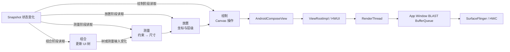

# Compose 布局、SubcomposeLayout 与测量性能

Compose 布局性能要回答三个问题：哪个状态读取触发了布局、哪些节点进入了测量或放置、这些工作是否让目标帧错过截止时间。重组次数只能解释组合阶段，无法代替布局证据。

平台锚点是 Android 17 / API 37 / `android-17.0.0_r1`；Compose UI 独立发布，源码锚点是当前稳定版 1.11.4 及其发布提交 `854220f44ea8ea80fee824a6c5a045f39bede289`。Android 12 到 Android 17 决定宿主 View、HWUI、FrameTimeline 和显示路径，Compose 依赖版本决定 `LayoutNode`、Modifier 节点、lookahead 与 trace 标记。分析报告必须同时记录平台版本、Compose BOM、Kotlin 和 Compose Compiler 插件。

这里不采用固定的布局耗时、优化百分比或重组阈值。帧预算随刷新率变化，布局成本还受节点数量、文本、约束、设备性能、编译状态和业务数据影响。所有收益都要在目标场景中测量。

## 一、Compose 布局处在整帧的什么位置

### 1. 组合、布局、绘制是 Compose 的失效阶段

Compose 官方文档把一次 UI 更新分成三个阶段：

1. **组合（Composition）**：执行需要运行的 Composable，创建或更新 UI 树。
2. **布局（Layout）**：测量节点尺寸，再放置节点位置。测量和放置各有自己的重启作用域。
3. **绘制（Drawing）**：让需要重绘的节点向 Canvas 发出绘制操作。

这三个阶段描述状态依赖和可跳过工作，不表示每个显示帧都会完整执行三遍。某个状态只在绘制代码中读取时，变化可以只触发绘制；状态在放置代码中读取时，局部节点可以只重新放置；组合结果和约束都没变时，测量可以复用已有结果。

这张图把 Compose 阶段与 Android 17 标准 App Window 路径放在同一条线上。



`ComposeView` 和 `AndroidComposeView` 仍在 `ViewRootImpl` 管理的 View 树中。Compose 生成的绘制内容通过当前 App Window 的 HWUI surface 提交；RenderThread 之后继续经过 BLAST、SurfaceFlinger、HWC 和 present。Compose 布局变慢属于 App 侧原因，`queueBuffer()` 之后的等待仍要按标准渲染路径分析。

### 2. Android 宿主如何调用 Compose 布局

Compose UI 1.11.4 的 `AndroidComposeView` 提供了几处明确入口：

- `onMeasure()` 把 View `MeasureSpec` 转成 Compose `Constraints`，更新根约束并调用 `measureOnly()`。
- `onLayout()` 调用 `measureAndLayout()`，完成仍待处理的测量与放置。
- `dispatchDraw()` 在绘制前再次处理待完成的 `measureAndLayout()`，随后调用根 `LayoutNode.draw()`。
- `onRequestMeasure()` 和 `onRequestRelayout()` 把节点失效交给 `MeasureAndLayoutDelegate`，再决定调用 View `requestLayout()` 还是 `invalidate()`。

Android 17 的 `ViewRootImpl` 仍通过 traversal 组织宿主 View 的 measure、layout 和 draw，再由 `ThreadedRenderer` 进入 HWUI。Compose 自己的三个阶段和平台 traversal 相关，但两者不是同一套 API 名称。Perfetto 中要同时观察 Compose trace、`AndroidOwner:*`、`performTraversals()` 和 `syncAndDrawFrame()`。

## 二、测量与放置是两个重启作用域

### 1. 状态读取位置决定失效范围

| 状态读取位置 | 变化后的直接工作 | 可能继续发生的工作 |
| --- | --- | --- |
| Composable 函数体 | 重新组合读取者 | 组合结果改变后可能测量、放置和绘制 |
| `MeasureScope.measure()` | 重新测量对应节点 | 尺寸变化后父节点、放置和绘制可能更新 |
| `layout {}`、`Modifier.offset {}` | 重新执行放置 | 位置变化后绘制更新；局部测量可跳过 |
| `drawBehind`、`drawWithContent`、`Canvas` | 重新绘制 | 组合和布局可以跳过 |

“把状态放进 `rememberSaveable`”不会改变读取阶段。保存位置只影响状态存活方式，失效范围由读取 `value` 的代码位置决定。

这段代码把高频位移状态推迟到放置 lambda 中读取，省略的只有 import。

```kotlin
@Composable
fun PlacementOffset(
    offsetYPx: () -> Int,
    modifier: Modifier = Modifier,
    content: @Composable BoxScope.() -> Unit,
) {
    Box(
        modifier = modifier.offset {
            IntOffset(x = 0, y = offsetYPx())
        },
        content = content,
    )
}
```

调用方把 `LazyListState` 或动画状态包装成 `offsetYPx`。该值变化时，读取发生在放置步骤，当前节点不需要因为这次读取重新执行组合和测量。父子坐标依赖、对齐线或其他状态仍可能让相邻节点进入布局，结论要以 trace 为准。

### 2. 单次布局过程限制子节点测量次数

普通 Compose 布局遵守单遍测量规则：父节点给子节点一组 `Constraints`，每个 `Measurable` 在当前布局过程只能调用一次 `measure()`。父节点根据子节点返回的 `Placeable` 决定自身尺寸，再在 `layout(width, height) {}` 中放置子节点。对同一个子节点用两组约束连续测量会触发运行时错误。

以下自定义列布局展示一遍测量和一遍放置的完整结构，代码省略 import。

```kotlin
@Composable
fun OnePassColumn(
    modifier: Modifier = Modifier,
    content: @Composable () -> Unit,
) {
    Layout(
        content = content,
        modifier = modifier,
    ) { measurables, constraints ->
        val childConstraints = constraints.copy(minWidth = 0, minHeight = 0)
        val placeables = measurables.map { measurable ->
            measurable.measure(childConstraints)
        }

        val desiredWidth = placeables.maxOfOrNull { it.width } ?: 0
        val desiredHeight = placeables
            .sumOf { it.height.toLong() }
            .coerceAtMost(Int.MAX_VALUE.toLong())
            .toInt()

        val width = constraints.constrainWidth(desiredWidth)
        val height = constraints.constrainHeight(desiredHeight)

        layout(width, height) {
            var y = 0
            placeables.forEach { placeable ->
                placeable.placeRelative(x = 0, y = y)
                y += placeable.height
            }
        }
    }
}
```

测量代码必须保存 `Placeable`，以便放置阶段使用；为此创建一个列表属于该实现的明确成本。热路径优化应从测量次数、节点数量和昂贵计算入手，不能以“零对象”为目标删除必要状态。

### 3. 对齐线可能把读取带回布局

`FirstBaseline` 等 `AlignmentLine` 允许父节点根据子节点内部位置做布局。对齐线在父测量或放置阶段被读取时，Compose 会记录依赖；子节点的对齐线变化后，对应父节点需要重新测量或放置。

文本基线、复杂表格和自定义对齐布局经常出现这种依赖。看到父节点重新布局时，应检查是否读取了 alignment line，而不是只检查传入约束。

## 三、测量结果如何复用

### 1. 复用条件由约束和失效标记共同决定

Compose UI 1.11.4 的 `MeasurePassDelegate.remeasure()` 直接给出复用条件：

- `layoutNode.measurePending == true`：执行 `performMeasure()`；
- 本次 `Constraints` 与 `measurementConstraints` 不同：执行 `performMeasure()`；
- 两者都不成立：当前节点复用已有尺寸，同时检查子树中是否还有待测量节点。

`performMeasure()` 会清除当前节点的 `measurePending`，并通过 Snapshot observer 记录测量代码读取了哪些状态。测量完成后通常会把放置标记为待处理。

这套机制跨帧保存上次约束和结果，不限于“同一帧缓存一个 `MeasureResult`”。约束相同也不能保证整棵子树没有工作：子节点可能因自己的状态读取失效，`forceMeasureTheSubtree()` 会处理这些待测量节点。

### 2. 测量与放置使用不同标记

`LayoutNode` 通过 delegate 维护两组主要状态：

- `measurePending`：节点尺寸需要重新计算；
- `layoutPending`：节点或子节点位置需要重新计算。

`MeasureAndLayoutDelegate` 把待处理节点放进按深度排序的集合。父节点已经处于测量待处理状态时，子节点通常不用再作为独立根重复登记；子节点测量后尺寸发生变化，依赖它尺寸的父节点会继续更新。未放置或停用的节点会保留脏状态，但不会无条件触发一轮全树 traversal。

因此，“失效总是一路上传到某个可吸收祖先”过于粗糙。传播还取决于节点是否被放置、父节点上次在测量还是放置代码中使用子节点、尺寸是否变化、是否存在 lookahead 和 alignment line 依赖。

### 3. `@Stable` 不控制布局缓存

`@Stable` 与 Compose Compiler 的稳定性推断影响 Composable 能否跳过。它不会修改 `MeasurePassDelegate` 的约束比较，也不会直接清除 `measurePending`。减少重组可能让相同的 Modifier、测量策略和节点结构继续复用，从而间接减少布局失效；错误标注还可能让 UI 漏更新。

排查时要分开看：

- Compose Compiler 报告和 Layout Inspector 回答“哪些 Composable 运行或跳过”；
- Compose layout trace 和源码标记回答“哪些节点测量或放置”；
- FrameTimeline 回答“这些工作是否影响目标帧”。

## 四、Intrinsic（固有尺寸）查询的准确含义

### 1. Intrinsic 查询发生在正式测量之前

`minIntrinsicWidth()`、`maxIntrinsicWidth()`、`minIntrinsicHeight()` 和 `maxIntrinsicHeight()` 用于在最终约束尚未确定时询问内容需要的尺寸。官方文档明确说明：intrinsic 查询不会把同一个子节点正式测量两次。父节点先查询 intrinsic，再根据结果生成最终约束，随后执行一次正式 `measure()`。

查询仍然需要计算。`IntrinsicSize.Min` 会递归询问相关子树，文本 intrinsic 可能运行段落宽高计算，自定义 `MeasurePolicy` 的默认实现还会复用 `measure` 逻辑做近似。成本取决于布局实现、查询方向、节点数量和内容，不能统一写成固定的 O(depth)、指数增长或“一次完整子树测量”。

### 2. 默认 intrinsic 只是近似

自定义 `Layout` 没有覆写 intrinsic 方法时，`MeasurePolicy` 提供尽力而为的默认实现。它对部分布局足够，对具有特殊约束协商的布局可能返回不合适的结果。

需要精确 intrinsic 语义时，应只覆写会被父节点查询的方法，并保证：

- 与正式测量的尺寸语义一致；
- 同一输入返回稳定结果；
- 不访问网络、磁盘或可变业务集合；
- 文本、密度和字体缩放变化后不会复用旧值；
- 基准测试覆盖真实内容长度和字体配置。

把 intrinsic 结果缓存在业务层也有失效风险。字体、locale、`Density`、`fontScale`、布局方向、文本内容和约束输入都可能改变结果。

### 3. Subcompose 布局不支持 intrinsic

Compose UI 1.11.4 的 `SubcomposeLayout` 使用 `NoIntrinsicsMeasurePolicy`。错误消息明确列出 lazy list、`BoxWithConstraints`、`TabRow` 等基于 Subcompose 的组件：这些组件在测量时才决定要组合哪些内容，父节点无法在组合之前得到可靠 intrinsic。

需要“与父尺寸匹配”时，可以让外层自定义布局控制测量顺序，或给 Subcompose 组件明确尺寸约束。对 `LazyColumn` 调用 `height(IntrinsicSize.Min)` 不会得到一个廉价的列表总高度查询。

## 五、Modifier 链不会为每一项创建 `LayoutNode`

### 1. `LayoutNode` 与 `Modifier.Node` 是两层结构

Compose UI 的 `LayoutNode` 持有一条 `NodeChain`。Modifier 元素会创建或更新对应的 `Modifier.Node`；实现 `LayoutModifierNode` 的节点还会获得 `LayoutModifierNodeCoordinator`，在被包装内容的外层参与约束转换、测量和放置。

所以，`padding + background + clickable` 不等于三个额外 `LayoutNode`：

- `padding` 属于布局 Modifier，会参与约束和尺寸计算；
- `background` 属于绘制 Modifier，参与绘制；
- `clickable` 涉及输入、交互状态和语义；
- 多能力 Modifier 节点还可以通过 delegation 同时提供多种行为。

长链仍会增加节点更新、遍历和对应能力的工作，但要按节点类型分析，不能把每个 Modifier 都计成一层布局树。

### 2. 顺序决定语义，没有通用的“size 放最前”

Modifier 从外到内包装内容。`padding(16.dp).size(40.dp)` 与 `size(40.dp).padding(16.dp)` 接收和传递的约束不同，最终外部尺寸也可能不同。`clip().background()` 与 `background().clip()` 的绘制范围同样不同。

调整顺序属于 UI 行为变更，需要先确认设计语义，再测性能。`Modifier.then()` 只连接两段 Modifier，不会自动合并相邻节点，也不能作为减少节点数量的优化接口。

### 3. 自定义布局 Modifier 的热路径约束

`Modifier.layout { measurable, constraints -> ... }` 的测量 lambda 运行在布局阶段。适合放入：

- 约束变换；
- 一次子节点测量；
- 基于 `Placeable` 尺寸的整数计算；
- 返回稳定的放置块。

业务取数、排序、字符串解析、图片解码和日志格式化应在布局前完成。`LayoutCoordinates` 用于查询坐标关系，不是测量缓存，也不能代替 `measure()`。

## 六、Subcompose 与 Lookahead 的额外工作

### 1. Subcompose 把部分组合推迟到测量

`SubcomposeLayout` 允许测量 lambda 根据当前约束或可见范围调用 `subcompose(slotId, content)`。Lazy 布局、`BoxWithConstraints` 和部分 Material 组件依赖这一能力。它们会复用槽位（slot）和节点，不能概括为“每次测量都重建全部内容”。

成本来自当前这轮需要新增、复用、重新组合、测量和处置的槽位。以下变化常让工作增加：

- 约束变化导致可见项目或布局分支变化；
- 槽位键不稳定，旧内容无法复用；
- 单个可见项目组合或测量很重；
- 预取、lookahead 和正式布局在同一交互中叠加；
- 组件嵌套让一个外层约束变化影响多个 Subcompose 区域。

普通 `Layout` 适合子节点集合在组合阶段已经确定的场景。单纯换成 `ComposableLambda` 不会提供测量期按约束组合的能力。Subcompose 的节点复用、预取和测量细节在下文集中说明。

### 2. Compose 1.11.4 使用 `LookaheadScope`

当前公开模型以 `LookaheadScope` 和 `approachLayout` 为主。`LookaheadScope` 会让范围内布局先计算目标尺寸与位置，再运行接近阶段（approach pass）逐步接近目标。它创建虚拟 lookahead 根节点，不会给 `content` 额外插入一个普通 `Layout`。

Lookahead 也不能简化成“每帧固定两次测量，耗时翻倍”。源码分别维护 `lookaheadMeasurePending`、`lookaheadLayoutPending`、`measurePending` 和 `layoutPending`。`isMeasurementApproachInProgress()` 与 `isPlacementApproachInProgress()` 都返回 false 后，系统可以跳过不再需要的接近阶段。

适合 Lookahead 的场景包括共享元素、布局尺寸过渡和需要提前知道目标坐标的动画。静态页面没有目标布局过渡时，不要为了预计算而扩大 Lookahead 范围。评估时分别统计：

- `Compose:lookaheadMeasure`；
- `Compose:lookaheadLayout`；
- `Compose:measure`；
- `Compose:layout`；
- 动画期间创建、复用和绘制的节点数。

## 七、SubcomposeLayout：slot 身份、复用与实际成本

普通 `Layout` 在 measure 前已经拿到确定的 `Measurable`；`SubcomposeLayout` 则允许 measure 根据约束或兄弟尺寸调用 `subcompose(slotId, content)`。它适合 Lazy layout、`BoxWithConstraints`、先测主体再决定覆盖层等真实依赖，不应只因组件“复杂”就使用。

slotId 是子 Composition 的身份边界，同一逻辑 slot 在相邻 pass 中必须稳定，在一次 pass 内必须唯一。无参 `SubcomposeLayoutState()` 默认不保留离场 slot；自定义复用策略还要分别定义保留哪些 id、两个 id 是否兼容。LazyLayout 在此之上用 key 维护业务身份、用 `contentType` 判断结构兼容，并缓存当前 measure pass 已请求的 item；这些都不是跨版本可依赖的固定池容量契约。

一次 measure 的成本来自实际请求的 slot 数、content 是否失效、产生的节点数量和子树测量，而不是固定“两趟”或随嵌套层数指数增长。父约束变化会重新执行 measure policy；若结构只在少数断点变化，可在页面上层先归约为 compact/expanded 模式，避免每个 item 各自套 `BoxWithConstraints`。

SubcomposeLayout 使用 `NoIntrinsicsMeasurePolicy`。父级通过 `IntrinsicSize.Min/Max` 查询到它时会直接失败，不会先完整 intrinsic 组合再正式测量。要实现 match-parent 类依赖，应重写父布局的测量顺序；组件尺寸能由外层约束表达时，直接传入约束。当前 Compose UI 也没有公开的 `@IntrinsicMeasurer` 注解可绕过这项限制。

Lookahead 负责先得到目标 geometry，approach pass 再接近目标；它与“测量时才决定组合哪些内容”是两种能力。嵌套两者时分别观察 lookahead、正式 measure、subcompose 和 draw，不能把额外布局 pass 误写成额外 GPU render。工具侧 Compiler Metrics 只能解释 slot content 的可跳过性，Layout Inspector 只给组合线索；实际 subcompose/measure 次数需要 Perfetto、自定义稳定计数或最小对照实验。

## 八、`Remeasurement.forceRemeasure()` 的边界

公开的 `Remeasurement` 关联一个布局节点，`forceRemeasure()` 会同步标记并执行该节点的测量/布局。官方 API 把它限定在少数复杂布局，例如滚动过程中必须同步消费偏移并重新测量子节点。

常规业务状态更新应依赖 Snapshot 失效。强制重测量会绕过“只有输入变化才测量”的常规节奏，也会把同步工作放到调用线程。项目中出现 `RemeasurementModifier` 时，要确认调用频率、线程、约束和帧内位置；不存在公开的 `Modifier.remeasure` 快捷 API。

高频动画还可以按需求选择更晚的读取阶段：

- 尺寸改变：测量阶段读取；
- 位置改变：`offset {}` 或自定义放置块读取；
- 纯视觉位移、缩放、透明度：优先评估 `graphicsLayer`；
- 颜色和绘制参数：`drawWithContent`、`drawBehind` 或 `Canvas` 中读取。

后移读取不能改变 UI 语义。点击区域、父布局占位或可访问性边界必须随位置变化时，图层变换和布局位移的行为并不相同。

## 九、怎样测量 Compose 布局成本

### 1. Trace 名称有语义，颜色没有

Compose UI 1.11.4 源码包含以下布局 trace 名称：

- `AndroidOwner:onMeasure`、`AndroidOwner:onLayout`、`AndroidOwner:measureAndLayout`；
- `Compose:measure`、`Compose:layout`；
- `Compose:lookaheadMeasure`、`Compose:lookaheadLayout`；
- 局部处理还可能出现 `Compose:remeasure`、`Compose:lookaheadRemeasure`。

Perfetto UI 给 slice 分配的颜色不表示“测量”“警告”或“超预算”。不能用橙色、红色判断阶段。名称、线程、开始时间、持续时间和调用上下文才是证据。

下面的 PerfettoSQL 用于汇总 Compose UI 1.11.4 的布局 slice，并保留进程与线程维度。

```sql
SELECT
  p.name AS process_name,
  t.name AS thread_name,
  s.name AS slice_name,
  COUNT(*) AS occurrences,
  ROUND(SUM(s.dur) / 1e6, 3) AS total_ms,
  ROUND(MAX(s.dur) / 1e6, 3) AS max_ms
FROM slice AS s
JOIN thread_track AS tt ON s.track_id = tt.id
JOIN thread AS t ON tt.utid = t.utid
LEFT JOIN process AS p ON t.upid = p.upid
WHERE s.dur > 0
  AND s.name IN (
    'AndroidOwner:onMeasure',
    'AndroidOwner:onLayout',
    'AndroidOwner:measureAndLayout',
    'Compose:measure',
    'Compose:layout',
    'Compose:lookaheadMeasure',
    'Compose:lookaheadLayout',
    'Compose:remeasure',
    'Compose:lookaheadRemeasure'
  )
GROUP BY p.name, t.name, s.name
ORDER BY total_ms DESC;
```

`slice.dur` 的单位是纳秒，查询把总时长和最大值换算成毫秒。聚合结果用于寻找工作量集中在哪类阶段；它不会自动指出某个 Composable 或 `LayoutNode`，还要回到对应帧和调用栈核对。

### 2. Layout Inspector 与 Compose Compiler 报告只覆盖组合线索

Layout Inspector 可以显示 Composable 的组合次数和跳过次数。Compose Compiler report 描述 restartable、skippable 和参数稳定性。两者都不会直接给出节点测量次数或布局耗时。

使用顺序可以按证据分层：

1. Macrobenchmark 的 `FrameTimingMetric` 记录目标交互的 `frameOverrunMs` 和 `frameDurationCpuMs` 分布，并保存每次迭代 trace。
2. FrameTimeline 找到错过截止时间的应用帧，区分 UI 线程、RenderThread 和显示侧问题。
3. UI 线程变长时查看 `AndroidOwner:*`、`Compose:*` 与业务自定义 trace。
4. 组合 slice 变长再看 Layout Inspector、组合跟踪和 Compose Compiler 报告。
5. 布局 slice 变长再检查约束变化、状态读取阶段、intrinsic、Subcompose、Lookahead 和 Modifier 类型。
6. App 侧按时提交后，继续沿 RenderThread、BLAST、SurfaceFlinger 与 HWC 查找等待。

调试构建、热重载和 Layout Inspector 连接都会改变性能。发布判断要使用 profileable、non-debuggable、接近发布版的构建，并固定设备、刷新率、数据、滚动手势和编译模式。

### 3. Composition tracing 的覆盖边界

系统 trace 默认不会列出每个 Composable。需要函数级组合事件时，按官方文档加入与 BOM 对齐的 `androidx.compose.runtime:runtime-tracing`，并保证 Perfetto 配置包含 `track_event`。这个依赖增加 trace 字符串和一定体积，测试报告应记录是否启用。

即使启用了组合跟踪，布局节点归因仍可能需要自定义 `Trace.beginSection()`、最小复现或基准变体。不要把某个 Composable 的组合 slice 当作它全部测量与绘制成本。

## 十、排查案例的判断顺序

### 场景 A：没有明显重组，滚动仍掉帧

1. 用 FrameTimeline 选中具体的卡顿帧。
2. 确认 UI 线程是否卡在 `AndroidOwner:measureAndLayout` 或 `Compose:measure`。
3. 对比本帧与正常帧的约束、可见项目数、Subcompose 槽位和图片/文本数据。
4. 检查高频状态是否在测量 lambda 中读取。
5. UI 线程没超时则转向 RenderThread、缓冲区反压和显示侧。

“重组次数正常”只能排除一部分组合工作，不能排除局部重测量、放置、绘制或系统后段等待。

### 场景 B：父布局频繁重新测量

1. 确认子节点尺寸是否变化。
2. 检查父节点是否在测量 lambda 中使用该子节点，或读取了 intrinsic、对齐线。
3. 检查窗口尺寸、Insets、字体缩放和约束是否变化。
4. 检查 Modifier 顺序是否改变了约束语义。
5. 对 Subcompose 组件确认槽位键和布局分支是否稳定。

父节点传入相同约束时，子节点自身失效仍可能触发局部重测量；子节点返回尺寸变化后，父节点可能继续更新。两种情况要分开记录。

### 场景 C：布局动画启用后成本增加

1. 分开统计 lookahead 和正式 measure/layout slice。
2. 缩小 `LookaheadScope` 到需要目标坐标的子树。
3. 检查 approach 完成条件能否按时返回 false。
4. 区分尺寸动画和纯图层变换，确认点击区域与语义要求。
5. 用相同动画进度、帧数和节点数据比较前后 trace。

只比较平均帧率会掩盖少数长帧。FrameTimingMetric 的分位数和对应 trace 能保留异常帧位置。

## 十一、提交前检查清单

- [ ] 记录 Android 版本、Compose BOM、Compose UI、Kotlin 与 Compose Compiler 插件
- [ ] 用 FrameTimeline 确认目标帧已经错过截止时间
- [ ] 区分组合、测量、放置、绘制和 RenderThread
- [ ] 不使用 Perfetto slice 颜色判断阶段
- [ ] 高频状态读取位于满足 UI 语义的最晚阶段
- [ ] 自定义 Layout 对每个子节点只调用一次 `measure()`
- [ ] 测量 lambda 不做业务 IO、解码、排序或日志格式化
- [ ] intrinsic 查询有明确的尺寸语义和真实成本测量
- [ ] 不对 Subcompose 组件请求不受支持的 intrinsic
- [ ] Modifier 调整顺序前确认布局、绘制、输入和语义变化
- [ ] 不把每个 Modifier 节点算成独立 `LayoutNode`
- [ ] Subcompose 槽位键稳定，并限制测量期新增内容
- [ ] Lookahead 范围只包含需要目标布局的节点
- [ ] 常规业务不调用 `forceRemeasure()`
- [ ] Macrobenchmark 使用接近发布版的可分析构建
- [ ] App 侧按时提交后继续检查 HWUI、BLAST、SF 与 HWC

## 参考资料

- [Compose UI 1.11.4 发布说明](https://developer.android.com/jetpack/androidx/releases/compose-ui)
- [Jetpack Compose phases](https://developer.android.com/develop/ui/compose/phases)
- [Compose phases and performance](https://developer.android.com/develop/ui/compose/performance/phases)
- [Custom layouts](https://developer.android.com/develop/ui/compose/layouts/custom)
- [Intrinsic measurements](https://developer.android.com/develop/ui/compose/layouts/intrinsic-measurements)
- [`MeasurePolicy` API](https://developer.android.com/reference/kotlin/androidx/compose/ui/layout/MeasurePolicy)
- [`Remeasurement` API](https://developer.android.com/reference/kotlin/androidx/compose/ui/layout/Remeasurement)
- [`LookaheadScope` API](https://developer.android.com/reference/kotlin/androidx/compose/ui/layout/LookaheadScope)
- [Debug your Compose UI](https://developer.android.com/develop/ui/compose/tooling/debug)
- [Composition tracing](https://developer.android.com/develop/ui/compose/tooling/tracing)
- [Macrobenchmark metrics](https://developer.android.com/topic/performance/benchmarking/macrobenchmark-metrics)
- [`LayoutNode.kt`（Compose UI 1.11.4）](https://android.googlesource.com/platform/frameworks/support/+/854220f44ea8ea80fee824a6c5a045f39bede289/compose/ui/ui/src/commonMain/kotlin/androidx/compose/ui/node/LayoutNode.kt)
- [`MeasurePassDelegate.kt`（Compose UI 1.11.4）](https://android.googlesource.com/platform/frameworks/support/+/854220f44ea8ea80fee824a6c5a045f39bede289/compose/ui/ui/src/commonMain/kotlin/androidx/compose/ui/node/MeasurePassDelegate.kt)
- [`MeasureAndLayoutDelegate.kt`（Compose UI 1.11.4）](https://android.googlesource.com/platform/frameworks/support/+/854220f44ea8ea80fee824a6c5a045f39bede289/compose/ui/ui/src/commonMain/kotlin/androidx/compose/ui/node/MeasureAndLayoutDelegate.kt)
- [`NodeChain.kt`（Compose UI 1.11.4）](https://android.googlesource.com/platform/frameworks/support/+/854220f44ea8ea80fee824a6c5a045f39bede289/compose/ui/ui/src/commonMain/kotlin/androidx/compose/ui/node/NodeChain.kt)
- [`SubcomposeLayout.kt`（Compose UI 1.11.4）](https://android.googlesource.com/platform/frameworks/support/+/854220f44ea8ea80fee824a6c5a045f39bede289/compose/ui/ui/src/commonMain/kotlin/androidx/compose/ui/layout/SubcomposeLayout.kt)
- [`LookaheadScope.kt`（Compose UI 1.11.4）](https://android.googlesource.com/platform/frameworks/support/+/854220f44ea8ea80fee824a6c5a045f39bede289/compose/ui/ui/src/commonMain/kotlin/androidx/compose/ui/layout/LookaheadScope.kt)
- [`AndroidComposeView.android.kt`（Compose UI 1.11.4）](https://android.googlesource.com/platform/frameworks/support/+/854220f44ea8ea80fee824a6c5a045f39bede289/compose/ui/ui/src/androidMain/kotlin/androidx/compose/ui/platform/AndroidComposeView.android.kt)
- [`ViewRootImpl.java`（Android 17）](https://android.googlesource.com/platform/frameworks/base/+/refs/tags/android-17.0.0_r1/core/java/android/view/ViewRootImpl.java)
- [`Choreographer.java`（Android 17）](https://android.googlesource.com/platform/frameworks/base/+/refs/tags/android-17.0.0_r1/core/java/android/view/Choreographer.java)
- [FrameTimeline](https://perfetto.dev/docs/data-sources/frametimeline)
- [标准渲染管线](../../part2-performance/ch18-rendering-pipelines/01-pipeline-overview.md)
