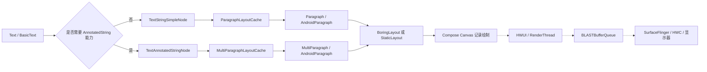

# Compose Text 性能深度优化

Compose 文本卡顿不能只看重组次数。一次文本更新可能停在组合、测量、字体解析、绘制或显示系统中的任意一段；同样的 `Text` 调用还可能进入两套不同的 Modifier 节点实现。排查时要同时回答：哪项输入变了、是否重新排版、目标帧最终晚在什么位置。

平台源码锚点是 Android 17 / API 37 / `android-17.0.0_r1`，Compose UI 源码锚点是稳定版 1.11.4 的发布提交 `854220f44ea8ea80fee824a6c5a045f39bede289`。Compose 与 Android 平台独立发布，报告中应分别记录 Compose BOM、Compose UI、Kotlin、Compose Compiler 插件和 Android 版本。涉及调度、缺页或内存回收时，内核侧统一使用 `android17-6.18-2026-06_r6`；普通文本排版结论不能从内核标签直接推导。

这里不提供固定耗时、提升比例或文本长度阈值。文字内容、字体、语言、字形、断行、约束、设备、刷新率和编译状态都会改变结果，性能判断必须附带可复现的场景和系统跟踪。

## 一、Android 上的一段 Compose 文本怎样显示

### 1. 从 `Text` 到 Android 文本布局

下面的流程图用于区分 Compose 文本排版与 Android 整帧显示。虚线后的 HWUI、BLAST、SurfaceFlinger 和 HWC 属于普通 App Window 的显示流程。



`Text` 的组合节点负责保存输入和发起失效，`Paragraph`/`MultiParagraph` 负责文本测量与排版。Android 实现中的 `TextLayout` 会在满足简单文本条件时使用 `BoringLayout`，其余情况使用 `StaticLayout`。绘制结果记录到宿主 `ComposeView` 所在窗口，并继续经过 HWUI 和系统显示端；声明一个 `Text` 不会创建独立 Surface。

这条分层对诊断很有用。`TextLayout:initLayout` 很长说明 Android 文本排版工作较重；RenderThread 或 SurfaceFlinger 较晚时，继续调整重组稳定性通常不会解决那一帧。

### 2. 普通 `String` 文本有专用实现

Compose Foundation 1.11.4 的 `BasicText(String, ...)` 在以下条件都满足时使用 `TextStringSimpleNode`：

- 当前文本不参与选择；
- 没有 `onTextLayout` 回调；
- 没有启用 `autoSize`。

这个节点使用 `ParagraphLayoutCache`，并且只在无障碍语义请求布局结果时创建完整的 `TextLayoutResult`。只要需要选择、`onTextLayout` 或自动字号，`BasicText` 就会把 `String` 转为 `AnnotatedString`，改用 `TextAnnotatedStringNode` 和 `MultiParagraphLayoutCache`。

这项差异不要求业务删除必要能力。选择、布局回调和自动字号有明确产品价值时应保留；性能报告需要把它们记为测试变量，避免把两种实现的结果混在同一组数据中。

### 3. `AnnotatedString` 还会处理段落、占位内容和链接

`AnnotatedString` 可以携带 `SpanStyle`、`ParagraphStyle`、链接、TTS 注解和占位内容。`MultiParagraph` 会按段落样式拆分输入，并把各段的 `Paragraph` 结果组合起来。占位内容还要在文本尺寸确定后测量对应子节点。

复杂度不能只用字符数表示。两段等长文本可能因为语言、双向文本、emoji、字体回退、连字、断词、段落数量和 span 样式分布不同而产生不同成本。基准数据应包含线上会出现的语言和标记结构。

## 二、布局缓存怎样判断能否复用

### 1. 节点把布局属性与绘制属性分开处理

`TextStringSimpleNode` 和 `TextAnnotatedStringNode` 更新参数时，都会分别调用 `hasSameLayoutAffectingAttributes()` 与 `hasSameDrawAffectingAttributes()`。对应的失效范围如下：

| 变化 | 常见例子 | 节点动作 |
|---|---|---|
| 文本内容或文字注解变化 | 字符、span 样式、段落样式、占位内容 | 更新缓存输入，重新测量并重绘 |
| 影响布局的样式变化 | 字号、字重、字体、字距、行高、断行相关样式 | 重新测量并重绘 |
| 布局参数变化 | 约束、`maxLines`、`minLines`、`softWrap`、`overflow`、布局方向、密度 | 重新计算或更新布局结果 |
| 字体异步解析完成 | 回退字体换成目标 Typeface | 旧 intrinsic（固有尺寸）结果过期，重新测量 |
| 只影响绘制的样式变化 | 颜色、画刷、阴影、文字装饰、部分绘制参数 | 保留排版，重绘 |
| 回调对象变化 | `onTextLayout`、占位内容回调、选择控制器 | 完整节点会请求重新测量 |

表中的回调项常被忽略。`TextAnnotatedStringNode.doInvalidations()` 把回调对象变化纳入测量失效条件。高频父级重组中反复创建语义相同、身份不同的回调，会增加无用的测量请求；Compose Compiler 对 lambda 的记忆规则、构建版本和实际参数仍要通过编译器报告确认。

### 2. 相同宽度通常比相同高度更有复用价值

`ParagraphLayoutCache.newLayoutWillBeDifferent()` 会检查旧段落、字体解析状态、布局方向和新约束。约束完全相同时可直接复用。宽度不变且新的高度仍能容纳旧段落时，断行不会变化，缓存可以保留已有 `Paragraph`；最大宽度或最小宽度变化时需要重新排版。

高度仍可能影响裁剪和省略。旧段落高于新的最大高度，或旧结果已经超过 `maxLines` 时，缓存会重新计算。列表项宽度在滚动期间保持不变，通常有利于复用；窗口尺寸、折叠状态、Insets 或父布局反复改变宽度会让文本重新断行。

更完整的 Compose 测量失效机制见 [22.19 Compose 布局测量性能](19-compose-layout-measurement.md)。

### 3. 创建新对象不等于一定重新排版

`TextAnnotatedStringNode.updateText()` 比较字符内容和注解内容。新建但内容相等的 `AnnotatedString` 不会因为对象身份不同就自动使文本布局失效。`TextStyle` 也按布局属性和绘制属性比较。

不过，新建大对象仍会产生分配和内容比较。`remember` 适合缓存构造昂贵、输入稳定的富文本；一个只有少量字段的 `TextStyle` 通常不值得为了“避免重排”单独缓存。主题样式还依赖 CompositionLocal，错误的 `remember` key 可能让颜色或排版参数停留在旧主题。

### 4. 字体结果是布局输入

Compose 的 `FontFamily.Resolver` 返回可观察的字体状态。使用异步字体时，首轮排版可以先采用回退字体；目标字体返回后，`hasStaleResolvedFonts` 会让旧缓存失效，文本重新测量。两种字体的字宽、基线和行高不同，周围布局也可能变化。

首屏或滚动基准应分别覆盖冷字体缓存与热字体缓存。下载字体还要记录字体提供方、证书、网络状态、回退顺序和失败处理，不能把一次下载等待写成稳定的 Compose 布局成本。

## 三、哪些输入容易增加文本工作量

### 1. 换行和字体塑形

文本排版至少要处理字符到字形的映射、字体回退、双向文本、字距、断行和行度量。Android 的 `TextLayout` 对简单且能在给定宽度内显示的文本可以选择 `BoringLayout`；包含复杂 span 样式、需要换行或不满足 `BoringLayout` 条件时会使用 `StaticLayout`。

下面这些变化常使一次排版包含更多工作：

- 文本变长，或段落数量增加；
- 可用宽度变窄，换行候选增加；
- 同一段中混合多种字体、字号、语言或文字方向；
- 大量 span 样式在相邻范围频繁切换；
- 开启断词、两端对齐或更复杂的换行策略；
- emoji 和缺字触发额外字体回退；
- 占位内容需要和文字基线共同布局。

`maxLines` 和省略号可以限制输出行数与显示尺寸，但不能假定成本会按行数同比下降。Android 文本布局仍需确定可见部分如何断行和省略，收益要用目标文本测量。

### 2. 自动字号会执行候选字号布局

Compose 1.11.4 的 `TextAutoSize.StepBased` 使用二分查找选择能放入约束的最大字号。每个候选字号通过 `performLayout()` 试排，搜索结束后还可能测试上一个步长。缓存能复用搜索所得的合适结果，但一次新的文本或约束仍可能包含多轮布局。

步长越小，候选空间越密。标题、按钮等少量短文本可以直接测量；长文档列表中大面积启用自动字号时，应记录试排成本以及尺寸变化是否影响父布局。产品只要求限制行数时，固定排版规则通常更容易预测。

### 3. `onTextLayout` 会改变节点类型，也可能产生反馈更新

`onTextLayout` 只在节点计算出新的 `TextLayoutResult` 时调用，适合读取行数、基线、溢出和坐标映射。回调非空会让普通 `String` 放弃简化节点，因此不应只为了长期日志而给每个列表项都加回调。

回调中写 Compose 状态时，要避免用布局结果持续改动影响本次布局的输入。例如，根据 `lineCount` 改 `maxLines`，新一轮测量又改变 `lineCount`，很容易形成反复更新。需要保存结果时，先比较旧值，并让回调对象保持稳定。

下面的示例用于读取最终尺寸，同时避免每次重组都换一个回调对象，也不会重复写入相同尺寸。

```kotlin
@Composable
fun MeasuredTitle(
    text: String,
    onSizeChanged: (IntSize) -> Unit,
) {
    val latestOnSizeChanged by rememberUpdatedState(onSizeChanged)
    val lastSize = remember { mutableStateOf(IntSize.Zero) }
    val textLayoutCallback = remember {
        { result: TextLayoutResult ->
            if (result.size != lastSize.value) {
                lastSize.value = result.size
                latestOnSizeChanged(result.size)
            }
        }
    }

    Text(
        text = text,
        maxLines = 2,
        overflow = TextOverflow.Ellipsis,
        onTextLayout = textLayoutCallback,
    )
}
```

`rememberUpdatedState` 让稳定回调读取最新的外部处理函数，`lastSize` 过滤相同结果。外部函数仍不应同步执行 IO、解析或网络上报；这些工作应交给受控的异步任务。

### 4. 选择、链接和无障碍语义都有额外职责

可选择文本需要选择控制器、手势、选择高亮和坐标查询。链接需要命中区域与交互状态，占位内容要参与测量和放置。无障碍服务请求 `getTextLayoutResult` 时，简化节点也可能创建完整布局结果。

这些能力不能按“无用节点”批量删除。基准要与线上功能一致，并分别测试无障碍服务开启、文本选择和链接交互；测试环境的差异应写入报告。

## 四、重组稳定性只解释组合阶段

### 1. 强跳过模式改变了旧版经验

把 `List<T>` 传给 Composable 不再等价于“父级重组时该函数一定执行”。强跳过模式从 Kotlin 2.0.20 起默认开启，可让带不稳定参数的可重启 Composable 具备跳过能力；不稳定参数通常按对象身份比较，稳定参数按相等性比较。项目若关闭强跳过模式，规则会不同。

因此，排查清单至少要记录：

- Kotlin 与 Compose Compiler 插件版本；
- 强跳过模式是否启用；
- 编译器报告中的 restartable、skippable 与参数稳定性；
- 调用点传入的是同一集合实例还是每次新建；
- 目标 Composable 是否读取了会变化的状态。

相关诊断方法见 [22.22 Compose Compiler 指标与重组诊断](22-compose-compiler-recomposition-diagnostics.md)。

### 2. `@Stable` 和 `@Immutable` 是开发者承诺

注解不会把可变对象改造成不可变对象。`@Immutable` 要求构造完成后所有公开属性都不再变化，方法在相同输入下保持相同结果；`@Stable` 允许可变，但 Compose 必须能观察会影响公开结果的变化。错误标注可能让界面漏掉更新。

数据类只有 `val` 也不一定满足条件：属性类型如果是普通 `List`、可变容器或来自未运行 Compose Compiler 的模块，编译器仍可能无法证明稳定。可选办法包括使用受支持的不可变集合、把外部模型转换为 UI 模型，或在确认契约后配置稳定性文件。注解应排在验证之后。

### 3. Lazy 列表的 key 解决身份问题

稳定 key 让 Lazy 布局在插入、删除和移动时识别同一列表项，保留对应组合身份和可复用状态。它不会让内容变化的文本跳过排版，也不会修复昂贵的富文本构造。key 必须在同级列表项中唯一、长期稳定，并且不随显示文本变化。

下面的示例用业务 ID 维护段落身份，同时复用主题提供的排版样式。这里没有为了一个轻量 `TextStyle.copy()` 强行增加 `remember`。

```kotlin
@Immutable
data class ParagraphUiModel(
    val id: Long,
    val text: String,
)

@Composable
fun ArticleBody(paragraphs: List<ParagraphUiModel>) {
    val paragraphStyle =
        MaterialTheme.typography.bodyLarge.copy(lineHeight = 26.sp)

    LazyColumn {
        items(
            items = paragraphs,
            key = ParagraphUiModel::id,
        ) { paragraph ->
            Text(
                text = paragraph.text,
                style = paragraphStyle,
                modifier = Modifier.padding(horizontal = 16.dp, vertical = 8.dp),
            )
        }
    }
}
```

`ParagraphUiModel` 只有不可变的基础类型，满足示例中的 `@Immutable` 契约；`List` 参数本身仍要结合强跳过规则判断。长文章使用 Lazy 布局只组合可见项，详细复用条件见 [22.16 Compose LazyList 性能](16-compose-lazylist-performance.md)。

## 五、怎样写富文本和自绘文本

### 1. 缓存昂贵的富文本构造

解析 Markdown、匹配关键词或建立大量 span 样式时，构造成本可能高于短文本排版本身。输入不变时可以在组合作用域缓存 `AnnotatedString`；输入来自后台解析器时，也可以先在非 UI 线程生成不可变结果，再交给 Compose 展示。

下面的示例只在正文、匹配范围或强调色变化时重建富文本。范围来自业务解析结果，不在组合中重新执行正则表达式。

```kotlin
@Immutable
data class HighlightRange(
    val start: Int,
    val endExclusive: Int,
)

@Composable
fun HighlightedParagraph(
    text: String,
    highlights: List<HighlightRange>,
) {
    val emphasisColor = MaterialTheme.colorScheme.tertiary
    val annotatedText =
        remember(text, highlights, emphasisColor) {
            buildAnnotatedString {
                append(text)
                for (range in highlights) {
                    if (range.start in 0..text.length &&
                        range.endExclusive in range.start..text.length
                    ) {
                        addStyle(
                            style = SpanStyle(color = emphasisColor),
                            start = range.start,
                            end = range.endExclusive,
                        )
                    }
                }
            }
        }

    Text(text = annotatedText)
}
```

颜色属于绘制属性，但它被写进 `AnnotatedString` 的 span 样式，变更时会产生新的注解内容并更新文字节点。若颜色需要高频动画，可考虑把视觉效果放到更适合的绘制层；先确认高亮范围、无障碍和选择语义没有改变。

### 2. `TextMeasurer` 服务于自定义绘制

普通 `Text` 已有节点级 `ParagraphLayoutCache` 或 `MultiParagraphLayoutCache`，无需再包一层 `TextMeasurer`。`rememberTextMeasurer()` 主要用于 `Canvas`、`drawBehind`、`drawWithCache` 等自定义绘制场景。

`TextMeasurer` 保存 `TextLayoutInput` 到 `TextLayoutResult` 的 LRU 缓存。缓存键包含文字、布局样式、占位内容、行数、换行、溢出、密度、布局方向、字体解析器和约束；颜色、画刷、阴影和文字装饰等非布局属性不参与键比较。动画只改颜色时可以复用布局，动画字号或宽度时则会产生不同键。

下面的示例在绘制区域尺寸或文本输入变化时测量一次，随后用已有 `TextLayoutResult` 绘制颜色。

```kotlin
@Composable
fun LabeledBackground(
    label: String,
    color: Color,
    modifier: Modifier = Modifier,
) {
    val textMeasurer = rememberTextMeasurer(cacheSize = 4)

    Spacer(
        modifier =
            modifier.drawWithCache {
                val layoutResult =
                    textMeasurer.measure(
                        text = label,
                        style = TextStyle(fontSize = 16.sp),
                        constraints = Constraints(maxWidth = size.width.toInt()),
                    )

                onDrawBehind {
                    drawRoundRect(color = color.copy(alpha = 0.18f))
                    drawText(
                        textLayoutResult = layoutResult,
                        color = color,
                        topLeft = Offset(12.dp.toPx(), 8.dp.toPx()),
                    )
                }
            }
    )
}
```

`drawWithCache` 的构建块会在尺寸或读取到的状态变化时重跑。`color` 在该块中参与背景和文本绘制，所以颜色变化也会重建绘制缓存，但 `TextMeasurer` 仍可复用布局结果。若颜色每帧变化且这段重建可测得成本，可用绘制 lambda 读取最新颜色，把测量输入保持不变。Canvas 的其他约束见 [22.28 Compose Canvas 自定义绘制性能](28-compose-canvas-custom-drawing.md)。

### 3. 缓存容量按重复输入数量设置

`TextMeasurer` 默认缓存容量不是“越大越快”。容量单位是不同布局输入的数量。滚动中不断出现新文本时，过大的缓存会保留更多 `TextLayoutResult` 和段落数据；字号、约束或文本每帧变化时，大多数请求仍会未命中。

可按场景选择：

- 少量静态标签反复绘制：容量覆盖会重复出现的布局输入；
- 每帧只测同一段文本：容量为 1 已有专用单项实现；
- 输入几乎每次都不同：评估 `skipCache = true`，同时确认没有其他重复调用；
- 需要长期保存大量文章段落：由业务设计明确的分页或缓存上限，不能把 `TextMeasurer` 当全文缓存。

## 六、用系统跟踪判断时间花在哪里

### 1. 基准先固定输入

滚动、长文展示、主题切换、字体返回和文本更新是不同的用户操作，应拆成独立用例。每组结果至少记录：

- 设备型号、SoC、刷新率、温度和电源状态；
- Android 版本、Compose 版本、Kotlin 与编译器插件；
- 可分析且不可调试、接近发布版的构建；
- 编译模式与 Baseline Profile 状态；
- 文本条数、字符数分布、语言、span 样式数、字体缓存状态；
- 列表宽度、窗口模式、字体缩放和显示密度；
- 手势、迭代次数与启动模式。

Macrobenchmark 的 `FrameTimingMetric` 给出 `frameOverrunMs` 与 `frameDurationCpuMs` 分布，并为每次迭代保存系统跟踪文件。Android 12 及以上才提供 `frameOverrunMs`；Android 10 到 11 的兼容测试要使用对应平台可用的帧指标和跟踪证据。

### 2. 源码中的文本 slice（切片）可以辅助定位

Compose UI 1.11.4 的文本实现包含 `TextStringSimpleNode::measure`、`TextAnnotatedStringNode:measure` 和 Android 端 `TextLayout:initLayout` 等跟踪名称。它们是否出现在最终文件中，还取决于构建、Compose 跟踪配置和代码是否执行。

下面的 PerfettoSQL 用于汇总这些已确认的文本测量 slice，并保留进程和线程维度。

```sql
SELECT
  p.name AS process_name,
  t.name AS thread_name,
  s.name AS slice_name,
  COUNT(*) AS occurrences,
  ROUND(SUM(s.dur) / 1e6, 3) AS total_ms,
  ROUND(MAX(s.dur) / 1e6, 3) AS max_ms
FROM slice AS s
JOIN thread_track AS tt ON s.track_id = tt.id
JOIN thread AS t ON tt.utid = t.utid
LEFT JOIN process AS p ON t.upid = p.upid
WHERE s.dur > 0
  AND s.name IN (
    'TextStringSimpleNode::measure',
    'TextAnnotatedStringNode:measure',
    'TextLayout:initLayout'
  )
GROUP BY p.name, t.name, s.name
ORDER BY total_ms DESC;
```

`slice.dur` 使用纳秒，查询换算为毫秒。聚合适合比较同一用例的前后版本；定位异常帧时还要回到单帧时间线，看对应切片是否位于超时帧，以及调用前后是否有 GC、业务解析或父布局测量。

### 3. 诊断顺序从目标帧开始

1. 在 FrameTimeline 选中错过截止时间的应用帧。
2. 查看 UI 线程是否出现 Compose 测量、`TextLayout:initLayout`、富文本构造、业务跟踪切片、GC 或同步 IO。
3. 文本测量较长时，对比文字、span 样式、字体、宽度、行数、自动字号和回调条件。
4. 组合工作较长时，再看 Layout Inspector、组合跟踪和 Compose Compiler 报告。
5. UI 线程按时完成后，继续检查 RenderThread、GPU、BLAST、SurfaceFlinger 和显示侧等待。

Compose Text 仍使用标准 App Window 显示流程。`queueBuffer` 只表示生产者提交了缓冲区，不能证明画面已经显示；整帧判断方法见 [18.1 渲染流程总览](../../part2-performance/ch18-rendering-pipelines/01-pipeline-overview.md)。

## 七、常见现象怎样归因

| 现象 | 先查什么 | 常见原因 | 不应直接得出的结论 |
|---|---|---|---|
| 列表滚动时 UI 线程文本测量变长 | 列表项宽度、文本和 key 是否稳定 | 新列表项首次排版、宽度变化、字体返回、富文本构造 | “所有 Text 都在重复重组” |
| 主题切换时大量文本更新 | 变化的是布局样式还是绘制样式 | 字号/字体变化触发测量，颜色变化触发绘制 | “颜色变化必然重新排版” |
| 首次进入页面慢，第二次正常 | 字体、编译、磁盘和文本缓存冷热状态 | 字体解析、类加载、JIT、首次段落构造 | “Paragraph 缓存有内存泄漏” |
| `onTextLayout` 页面反复测量 | 回调身份与回调写入的状态 | 新回调对象、布局反馈更新、父约束变化 | “回调本身每帧都会执行” |
| 自动字号卡顿 | 候选范围、步长、文本和约束 | 多轮候选字号试排 | “二分搜索只测一次” |
| UI 线程正常但仍有卡顿 | RenderThread、GPU、SF 与 HWC | 绘制复杂度、GPU 压力、缓冲区或显示等待 | “Compose 重组是唯一原因” |

## 八、提交前检查清单

- [ ] 记录 Android 17 / API 37 / `android-17.0.0_r1` 或实际历史测试版本
- [ ] 记录 Compose BOM、Compose UI、Kotlin、Compose Compiler 插件和强跳过配置
- [ ] 区分 `TextStringSimpleNode` 与 `TextAnnotatedStringNode` 的适用条件
- [ ] 不为采集长期日志给每个列表项添加 `onTextLayout`
- [ ] 回调写状态前比较新旧值，并检查是否形成布局反馈更新
- [ ] 富文本解析不放在高频组合或测量代码中
- [ ] Lazy 列表使用唯一、稳定且不随显示内容变化的 key
- [ ] `@Stable` / `@Immutable` 的对象满足对应契约
- [ ] 不把普通 `List` 参数简单判定为“必然无法跳过”
- [ ] 不为轻量 `TextStyle` 构造默认增加 `remember`
- [ ] 自动字号记录候选范围、步长和试排成本
- [ ] 字体测试区分冷缓存、热缓存、回退字体和异步返回
- [ ] `TextMeasurer` 容量与重复布局输入数量相符
- [ ] Macrobenchmark 使用接近发布版的可分析构建
- [ ] 通过 FrameTimeline 确认目标帧超时后再归因
- [ ] UI 线程按时完成时继续检查 RenderThread 和显示端

## 参考资料

- [Compose UI 1.11.4 发布说明](https://developer.android.com/jetpack/androidx/releases/compose-ui)
- [Compose 文本布局配置](https://developer.android.com/develop/ui/compose/text/configure-layout)
- [Compose 字体](https://developer.android.com/develop/ui/compose/text/fonts)
- [Compose 稳定性](https://developer.android.com/develop/ui/compose/performance/stability)
- [强跳过模式](https://developer.android.com/develop/ui/compose/performance/stability/strongskipping)
- [修复稳定性问题](https://developer.android.com/develop/ui/compose/performance/stability/fix)
- [`TextMeasurer` API](https://developer.android.com/reference/kotlin/androidx/compose/ui/text/TextMeasurer)
- [Compose 自定义绘制与文本测量](https://developer.android.com/develop/ui/compose/graphics/draw/overview)
- [Macrobenchmark Compose UI 交互](https://developer.android.com/topic/performance/benchmarking/macrobenchmark-overview)
- [`BasicText.kt`（Compose UI 1.11.4）](https://android.googlesource.com/platform/frameworks/support/+/854220f44ea8ea80fee824a6c5a045f39bede289/compose/foundation/foundation/src/commonMain/kotlin/androidx/compose/foundation/text/BasicText.kt)
- [`TextStringSimpleNode.kt`（Compose UI 1.11.4）](https://android.googlesource.com/platform/frameworks/support/+/854220f44ea8ea80fee824a6c5a045f39bede289/compose/foundation/foundation/src/commonMain/kotlin/androidx/compose/foundation/text/modifiers/TextStringSimpleNode.kt)
- [`TextAnnotatedStringNode.kt`（Compose UI 1.11.4）](https://android.googlesource.com/platform/frameworks/support/+/854220f44ea8ea80fee824a6c5a045f39bede289/compose/foundation/foundation/src/commonMain/kotlin/androidx/compose/foundation/text/modifiers/TextAnnotatedStringNode.kt)
- [`ParagraphLayoutCache.kt`（Compose UI 1.11.4）](https://android.googlesource.com/platform/frameworks/support/+/854220f44ea8ea80fee824a6c5a045f39bede289/compose/foundation/foundation/src/commonMain/kotlin/androidx/compose/foundation/text/modifiers/ParagraphLayoutCache.kt)
- [`MultiParagraphLayoutCache.kt`（Compose UI 1.11.4）](https://android.googlesource.com/platform/frameworks/support/+/854220f44ea8ea80fee824a6c5a045f39bede289/compose/foundation/foundation/src/commonMain/kotlin/androidx/compose/foundation/text/modifiers/MultiParagraphLayoutCache.kt)
- [`TextAutoSize.kt`（Compose UI 1.11.4）](https://android.googlesource.com/platform/frameworks/support/+/854220f44ea8ea80fee824a6c5a045f39bede289/compose/foundation/foundation/src/commonMain/kotlin/androidx/compose/foundation/text/TextAutoSize.kt)
- [`TextMeasurer.kt`（Compose UI 1.11.4）](https://android.googlesource.com/platform/frameworks/support/+/854220f44ea8ea80fee824a6c5a045f39bede289/compose/ui/ui-text/src/commonMain/kotlin/androidx/compose/ui/text/TextMeasurer.kt)
- [`TextLayout.android.kt`（Compose UI 1.11.4）](https://android.googlesource.com/platform/frameworks/support/+/854220f44ea8ea80fee824a6c5a045f39bede289/compose/ui/ui-text/src/androidMain/kotlin/androidx/compose/ui/text/android/TextLayout.android.kt)
