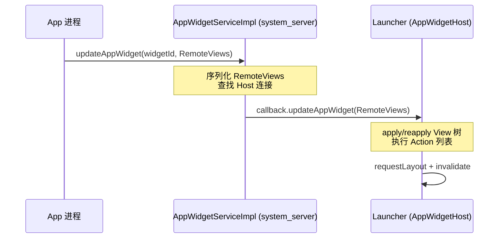

# 22.24 App Widget 更新性能：RemoteViews IPC 与 Glance 渲染

App Widget 的性能问题集中在两个维度：跨进程通信开销和后台调度功耗。Widget 的 UI 不在应用进程渲染——应用构建一棵 View 树描述，序列化后通过 Binder 传入 system_server，再分发给 Launcher（或其他 AppWidgetHost）执行 inflate 和绘制。这个链路决定了 Widget 的性能模型与普通 View 完全不同。

## RemoteViews 跨进程机制

### 序列化 View 树的传递链路

RemoteViews 是一个 Parcelable 容器，内部维护两个核心数据结构：

- `mLayoutId`：目标布局资源 ID（如 `R.layout.widget_layout`）
- `mActions`：`ArrayList<Action>`，每个 Action 描述一个对 View 树的操作（setText、setImageResource、setOnClickPendingIntent 等）

应用进程调用 `RemoteViews.setTextViewText(viewId, "hello")` 时，并不会立即操作 View，而是向 `mActions` 追加一个 `ReflectionAction` 对象，记录目标 viewId、方法名和参数。当 `AppWidgetManager.updateAppWidget()` 被调用时，整个 RemoteViews 通过 Parcel 序列化，经 Binder 传入 `AppWidgetServiceImpl`（运行在 system_server）。

`AppWidgetServiceImpl.updateAppWidget()` 的关键路径 [已验证: AOSP android-17.0.0_r1, frameworks/base/services/appwidget/java/com/android/server/appwidget/AppWidgetServiceImpl.java]：

1. 查找该 widgetId 对应的所有 Host（通常只有一个 Launcher）
2. 将 RemoteViews 通过 `AppWidgetHost.updateAppWidget()` 跨进程回调给 Host
3. Host 端的 `AppWidgetHost`（Launcher3 中的 `WidgetHost`）收到回调后，调用 `RemoteViews.apply()` 或 `RemoteViews.reapply()` 重建/更新 View 树

apply 过程在 Host 进程中执行：先通过 `LayoutInflater` 从 `mLayoutId` inflate 出 View 树，然后遍历 `mActions` 列表，逐个执行 Action。`ReflectionAction` 通过反射调用目标 View 的方法（如 `TextView.setText()`），`BitmapReflectionAction` 处理位图参数。

### 序列化开销与 View 树复杂度

RemoteViews 的序列化代价与 Action 数量线性相关。每个 Action 的 parcel 大小取决于参数类型：

| 参数类型 | 序列化方式 | 典型开销 |
|----------|-----------|---------|
| String/int/boolean 等 | 直接写入 Parcel | 小 |
| Bitmap | `Bitmap.writeToParcel()` | 取决于图片尺寸，可能很大 |
| PendingIntent | `writeParcelable()` | 中等（IPC 句柄） |
| Intent | `writeParcelable()` | 中等 |
| Icon | `writeParcelable()` | 中等 |

单次 Binder 事务缓冲区上限约 1MB。Widget 包含多个 `setImageBitmap` 调用时，累积 Bitmap 体积可能接近这个上限，触发 `TransactionTooLargeException`。

减少 Action 数量的策略：

- 合并静态文本到布局 XML 中，只在需要动态更新的 view 上调用 setter
- 使用 `RemoteViews.setImageViewBitmap()` 时控制 Bitmap 尺寸（通过 `inSampleSize` 降采样）
- 避免在每次 update 时重建整个 RemoteViews，优先使用 `RemoteViews.reapply()`（Android 12+ 通过 `AppWidgetHost.partialUpdateAppWidget()` 支持增量更新）

[适用版本: Android 12 (API 31) - Android 17 (API 37)]

## AppWidget 更新调度与限流

### 更新频率的系统约束

`updatePeriodMillis` 的文档最小值为 1800000 毫秒（30 分钟），这个限制从 Android 1.5 就存在，属于硬约束——设为更小值会被系统静默拉到 30 分钟。系统在 Doze 模式下会进一步延迟 Widget 更新，直到下一个维护窗口。

Android 12（API 31）对 Widget 更新增加了几项约束 [已验证: 官方文档, developer.android.com/develop/ui/views/appwidgets]：

- 引入 `@RemoteView` 注解的 `RemoteViews.SourceView` 机制，限制可修改的 View 属性范围
- Widget 尺寸灵活性增强：`OPTION_APPWIDGET_SIZES` 提供 Widget 可选尺寸集合，App 需要根据实际分配尺寸响应
- `RemoteViews.CallingIdentity` API 确保跨进程回调的权限验证

Android 14（API 34）增加了 `SCHEDULE_EXACT_ALARM` 权限的更严格审查，影响通过 `AlarmManager.setExactAndAllowWhileIdle()` 驱动的 Widget 更新。未声明该权限的应用无法设置精确闹钟，Widget 更新退化为不精确调度。

### AlarmManager vs WorkManager 的取舍

| 调度方式 | 时间精度 | 后台执行保障 | 功耗 | 适用场景 |
|---------|--------|-----------|------|---------|
| `updatePeriodMillis` | 30 分钟+ | 低（Doze 下延迟） | 低 | 默认周期更新 |
| `AlarmManager.setExactAndAllowWhileIdle` | 秒级 | 中（Doze 下有限制） | 高 | 时钟、倒计时等时间敏感 Widget |
| `AlarmManager.set()` (Android 17 OnAlarmListener) | 秒级 | 中 | 中 | Android 17 新路径，进程内回调减少 IPC |
| `WorkManager` | 分钟级 | 高（ expedited 模式） | 中 | 数据刷新、内容同步 |

Android 17 引入的 `AlarmManager.setExactAndAllowWhileIdle(OnAlarmListener)` 变体减少了 PendingIntent 的 IPC 开销和组件启动开销，适合对功耗敏感但需要一定时间精度的 Widget 更新场景 [来源: research-feeds/2026-04-06-07-android17-power-management]。

### 高频更新的系统压力

一次 Widget 更新的完整链路涉及两次跨进程通信：



秒级更新 Widget（如实时时钟、股价）时，这条链路对 system_server 的 Binder 线程池和 Launcher 的主线程造成持续压力。常见的性能问题：

- system_server Binder 线程占用：大量 Widget 更新请求排入 `AppWidgetServiceImpl` 的 Binder 线程池，影响其他系统服务的 IPC 响应
- Launcher 主线程卡顿：`RemoteViews.apply()` 在 Launcher 主线程执行，复杂布局 inflate 直接导致掉帧
- ANR 风险：`RemoteViewsService.onDataSetChanged()` 在应用进程的 Binder 线程执行，如果数据查询耗时超过系统设定的 ANR 阈值（通常 5 秒），系统会 ANR 应用

[交叉引用: 详见 7.13 SystemUI 性能分析 中 Launcher 主线程负载分析；9.2 ANR 类型与触发条件]

## RemoteViewsService 与集合 Widget

### 绑定生命周期

ListView/GridView Widget 使用 `RemoteViewsService` 提供数据。`RemoteViewsService` 是一个 `Service`，通过 `RemoteViewsFactory` 接口向 Host 提供 `RemoteViews` 列表项。

绑定流程 [已验证: AOSP android-17.0.0_r1, frameworks/base/core/java/android/widget/RemoteViewsService.java]：

1. Host 端 `RemoteViewsAdapter` 通过 `bindRemoteViewsService()` 绑定到应用的 `RemoteViewsService`
2. 绑定成功后获得 `IRemoteViewsFactory` 代理，后续 `getViewAt()` 调用走 IPC 到应用进程
3. 绑定断开（Launcher 重建、Widget 删除）时触发 `onDataSetChanged()`，应用可在此刷新数据

绑定是有成本的——建立 Binder 连接涉及 `Service.onBind()` 和跨进程代理对象的创建。频繁的绑定/解绑（如 Widget 频繁更新触发 Host 端 adapter 重建）会造成 CPU 尖峰。

### getViewAt 的累积延迟

集合 Widget 滑动时，每个可见 item 触发一次 `RemoteViewsFactory.getViewAt(int position)` 调用。每次调用涉及：

1. Host 进程通过 `IRemoteViewsFactory.getViewAt()` 发起 IPC（Binder 事务）
2. 应用进程在 Binder 线程中执行数据查询 + 构造 RemoteViews
3. RemoteViews 序列化回传给 Host
4. Host 反序列化 + apply

单次 `getViewAt()` 的开销取决于数据查询速度和 RemoteViews 复杂度。问题在于滑动场景下，N 个可见 item 串行触发 N 次 IPC。如果单次耗时 15ms，一屏 8 个 item 就累积 120ms——超过一帧（16ms @ 60fps）的 7 倍。

优化方向：

- `getViewAt()` 内部避免磁盘 I/O 和网络请求，数据预加载到内存
- `getLoadingView()` 返回一个轻量级占位 RemoteViews，避免空白或闪烁
- `getViewTypeCount()` 准确声明布局类型数，让 Host 复用 view 回收池
- 大数据集考虑分页加载，通过 `onDataSetChanged()` 触发增量更新

### ListView Widget 与 Glance 的集合处理

Glance 的 `LazyColumn` 在翻译层转换为 `ListView` Widget，底层仍然走 `RemoteViewsService` 路径。Glance 没有绕过 IPC 的开销，但提供了更高效的状态管理：当列表数据变化时，Glance 只重新生成变化的 item 对应的 RemoteViews，而不是整个列表。这个增量更新在 Glance 1.1.0+ 通过 `CompositionLocals` 的 `LocalContext.current` 差分机制实现 [来源: 官方文档, developer.android.com/jetpack/androidx/releases/glance]。

## Jetpack Glance 性能特征

### 架构：@Composable 到 RemoteViews 的翻译层

Glance 的设计目标是用 Compose 的开发体验生成标准 RemoteViews。执行路径：

```
@Composable Glance Widget
    ↓ GlanceAppWidget.compose()
Glance Composition（自定义 composition runtime）
    ↓ RemoteViewsTranslator
Action Tree（等效于手动构造的 RemoteViews Action 列表）
    ↓ RemoteViews()
标准 RemoteViews 对象
    ↓ AppWidgetManager.updateAppWidget()
标准 Widget 更新链路
```

Glance 使用自己的 composition 引擎，不复用 Compose UI 的 `ComposeRuntime` 和 `SlotTable`。原因是 RemoteViews 的能力远弱于 Compose UI（不支持任意自定义 View、不支持 Compose 布局算法），强行复用 Compose UI 运行时只会增加不必要的开销。

### 重组开销

Glance 的状态变化触发 composition 重新执行，生成新的 Action Tree，再翻译为 RemoteViews。这个过程的开销包括：

1. **Composition 执行**：遍历 @Composable 函数树，生成节点
2. **翻译**：将节点树翻译为 RemoteViews Action
3. **RemoteViews 构造**：创建新的 RemoteViews 对象
4. **IPC**：通过 AppWidgetManager 发送

Glance 的 composition 比 Compose UI 轻量（节点类型固定、布局算法简单），但仍然比直接构造 RemoteViews 慢。对于简单 Widget（几个 TextView + ImageView），手动 RemoteViews 和 Glance 的性能差距可以忽略。对于复杂 Widget（多层嵌套、条件渲染、大量 view），Glance 的 composition + 翻译开销会更明显。

### Glance vs 手动 RemoteViews 对比

| 维度 | 手动 RemoteViews | Glance |
|-----|-----------------|--------|
| 开发效率 | 低（命令式 API、反射 Action） | 高（声明式、类型安全） |
| 运行时开销 | 最小（直接构造 Action） | composition + 翻译层开销 |
| 状态管理 | 手动实现（每次 update 重建） | 自动（状态变化触发增量重组） |
| 可测试性 | 低 | 较高（可单测 composable） |
| 布局能力 | 受限（只能用 RemoteViews 支持的 View 类型） | 同样受限（翻译为 RemoteViews） |
| 位图处理 | 手动管理 Bitmap 传递 | 通过 `ImageProvider` 抽象 |

[结构参考: Clippings/Android 性能优化 - 原理：重新认识应用的速度优化.md]

选择建议：新 Widget 优先 Glance（开发效率 > 微小性能差距），已有 RemoteViews Widget 不强制迁移（迁移成本可能超过收益）。

## Widget 位图与内存

### Bitmap 跨进程传递

`RemoteViews.setImageBitmap(viewId, bitmap)` 将 Bitmap 作为 Parcelable 写入 Parcel。Binder 事务缓冲区上限约 1MB，单个 Bitmap 如果超过这个限制会直接崩溃。实际可用空间更小——AppWidgetService 的事务中还包含 Action 列表和其他元数据。

Bitmap 跨进程传递涉及内存拷贝（Parcel 序列化 + 反序列化），不是零拷贝。Launcher 进程收到 Bitmap 后，在自己的堆内存中持有一份独立副本。这意味着：

- 应用进程构造的 Bitmap 和 Launcher 持有的 Bitmap 是两份独立的内存
- 多尺寸 Widget（如 2x2 和 4x2）如果使用不同的 Bitmap，每份 Bitmap 在 Launcher 中都独立存在
- Widget 更新时，旧 Bitmap 被 GC 回收前，新旧 Bitmap 同时占用 Launcher 内存

### 位图内存优化策略

- **降采样**：Widget 的 Bitmap 不需要超过 Widget 实际显示尺寸。4x1 Widget 的宽度约 320dp，不需要加载 2048px 原图。使用 `BitmapFactory.Options.inSampleSize` 或 Glide 的 `override()` 限制解码尺寸
- **RGB_565**：不含透明通道的背景图使用 `Bitmap.Config.RGB_565`，比 ARGB_8888 节省一半内存
- **颜色填充替代纯色 Bitmap**：纯色背景用 `setInt(viewId, "setBackgroundColor", color)` 替代 1x1 拉伸 Bitmap
- **VectorDrawable 优先**：简单图标使用 VectorDrawable（通过 `setImageViewResource()`），VectorDrawable 在 RemoteViews 中序列化效率高于 Bitmap
- **多尺寸复用**：Android 12+ 的 `OPTION_APPWIDGET_SIZES` 支持响应式布局，同一 Widget 在不同尺寸下复用同一 Bitmap，通过 ScaleType 调整

[适用版本: Android 12 (API 31) - Android 17 (API 37)]

## Widget 功耗与后台调度

### 更新唤醒链路的功耗成本

AlarmManager 触发的 Widget 更新链路：

```
AlarmManager.setExactAndAllowWhileIdle → 设备唤醒 →
App 进程启动（如未运行） → AppWidgetProvider.onUpdate() →
RemoteViews 构造 → AppWidgetManager.updateAppWidget() →
IPC 到 system_server → IPC 到 Launcher → Launcher requestLayout
```

息屏状态下，这条链路唤醒 CPU 的成本包括：

- 进程创建/恢复：冷启动一个被杀的 Widget Provider 进程，CPU 需要加载 dex、初始化 Application
- Binder 事务：两次 IPC（App→system_server、system_server→Launcher）
- 布局 inflate：如果 Launcher 未在前台，inflate 操作竞争 CPU 时间

### 批量更新策略

多 Widget 应用（如天气 + 时钟 + 日历）应合并更新：

```kotlin
// AppWidgetProvider.onUpdate 中批量处理
override fun onUpdate(context: Context, appWidgetManager: AppWidgetManager, appWidgetIds: IntArray) {
    // 构造一份 RemoteViews，应用到所有同类 Widget
    val views = buildRemoteViews(context)
    appWidgetManager.updateAppWidget(appWidgetIds, views)
}
```

`AppWidgetManager.updateAppWidget(int[] ids, RemoteViews views)` 接受数组参数，单次调用更新多个 Widget，减少 IPC 次数。如果各 Widget 内容不同，在一个 `onUpdate()` 回调中依次构造并更新，避免为每个 Widget 设置独立 AlarmManager 闹钟。

### WorkManager 延迟更新

非时间敏感的 Widget 更新（如新闻 Feed、社交动态）优先使用 `WorkManager`：

```kotlin
val updateWork = OneTimeWorkRequestBuilder<WidgetUpdateWorker>()
    .setExpedited(OutOfQuotaPolicy.RUN_AS_NON_EXPEDITED_WORK_REQUEST)
    .setConstraints(
        Constraints.Builder()
            .setRequiredNetworkType(NetworkType.CONNECTED)
            .build()
    )
    .build()
WorkManager.getInstance(context).enqueue(updateWork)
```

WorkManager 的优势在于：

- 系统批量调度：多个 WorkRequest 可以被系统合并执行，减少设备唤醒次数
- 约束驱动：在网络可用、电量充足等条件满足后才执行，避免无效唤醒
- 后台执行限制合规：Android 12+ 的后台执行限制下，WorkManager 比 AlarmManager + BroadcastReceiver 更稳定

[交叉引用: 详见 5.10 JobScheduler/WorkManager 调度与后台任务性能；25.4 WorkManager 实战与后台任务调度]

## 扩展

### RemoteViews.CallingIdentity 与权限边界

Android 12（API 31）引入 `RemoteViews.CallingIdentity`，用于在跨进程 Widget 操作中标识发起方的身份。Host 进程（Launcher）在执行 Action 时，可能需要以 Widget 应用的身份访问 ContentProvider 或其他受保护资源。`CallingIdentity` 封装了发起方包名和 UID，Host 在执行需要权限的操作前验证 CallingIdentity。

这个机制的性能开销很小（一次 Parcelable 传递 + 字符串比较），但对安全模型有意义：它防止了恶意 Host 伪造 Widget 应用的身份执行特权操作 [待验证: 官方文档, developer.android.com/reference/android/widget/RemoteViews.CallingIdentity]。

### Widget 在多用户/工作配置下的性能

WORK_PROFILE 用户下的 Widget 存在额外的 IPC 路径：AppWidgetService 需要跨用户边界分发 RemoteViews。`AppWidgetServiceImpl` 内部通过 `mUserManager` 进行用户隔离，每个用户有独立的 Widget ID 空间。

跨用户场景的额外开销：

- Binder 调用经过 `UserManagerService` 权限检查
- Widget Provider 进程运行在 work profile 用户空间，与应用主进程隔离
- RemoteViews 中的 PendingIntent 如果指向主用户组件，需要 `INTERACT_ACROSS_USERS` 权限

[待验证: AOSP 源码路径 frameworks/base/services/appwidget 的跨用户处理]

### Dynamic Color 与 Widget 渲染

Android 12（API 31）引入 Material You 动态色彩，Widget 可以使用 `@android:color/system_accent1_500` 等系统颜色资源。这些颜色由系统在启动时计算并缓存，Widget inflate 时自动应用，额外计算成本可以忽略。

Glance 通过 `LocalContext.current.colorScheme` 提供动态色彩访问。Glance 的色彩处理在 composition 阶段完成，不会增加 RemoteViews 传递的大小 [来源: 官方文档]。
