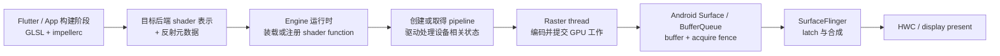

# Impeller Shader 编译性能与 Flutter 渲染稳定性

## 版本锚点与结论范围

版本锚点分为三条互相独立的版本线：

| 层次 | 固定锚点 | 适用范围 |
| --- | --- | --- |
| Android 平台 | Android 17 / API 37 / `android-17.0.0_r1` | `Surface`、BufferQueue、SurfaceFlinger、Perfetto 与系统显示边界 |
| Android kernel | `android17-6.18-2026-06_r6` | dma-buf、dma-fence、sync_file 等 buffer 与同步语义 |
| Flutter | Flutter 3.44.7，tag `3.44.7`，commit `84fc5cbb223bc12f83d65b647ff8a56caf779ffd` | Impeller 启用条件、后端选择、着色器、图形管线与缓存实现 |

Impeller 位于 Flutter Engine，不在 AOSP `android-17.0.0_r1` 源码树。Android 17 提供 Vulkan、OpenGL ES、窗口 buffer、显示合成和 tracing 能力；Flutter Engine 决定使用哪种渲染器、怎样创建图形管线，以及何时保存缓存。工程记录必须同时写 Android build 和 Flutter engine revision，只写“Android 17 上使用 Impeller”无法确定实现细节。

源码结论固定到 Flutter 3.44.7。Flutter 后续版本可能修改设备规避表、后端回退条件、图形管线创建时机和轨迹事件名称，升级时需要重新核对对应 tag。

## 1. 先区分着色器、图形管线与一帧显示

“Impeller 已经离线编译着色器”经常被误读成“运行时没有任何图形编译成本”。这两句话覆盖的对象不同。

- **着色器源码编译与反射**：`impellerc` 在 Flutter Engine 或 App 构建阶段把 GLSL 转换成目标后端需要的表示，并生成资源绑定信息。设备运行时不再解析同一份 GLSL，也不需要为 Impeller 内建着色器做运行时反射。
- **着色器模块装载或注册**：运行时还要从 Engine 内置着色器归档文件或 App 资源读取目标后端代码，并向图形后端注册可用的着色器函数。
- **管线状态对象创建**：Vulkan 必须根据着色器阶段、顶点布局、混合模式、attachment 格式和采样数等描述调用管线创建接口。驱动可以在这个阶段做验证、链接、特化和设备相关优化。
- **GPU 执行与显示**：管线可用后，Raster 线程才会编码绘制命令。CPU 提交 GPU 工作也不等于内容已经上屏；buffer 还要经过 Android Surface、SurfaceFlinger、HWC/RenderEngine 与 display present。

这张流程图用于确定每类耗时属于哪一层。



图中离线完成的是着色器前端处理和反射。管线创建、GPU 执行、buffer 交付与显示都发生在设备运行期间，分析卡顿时不能把它们合成一个“着色器编译”标签。

Flutter 官方页面把 Impeller 的目标概括为离线编译着色器、预先构建管线和显式管理缓存。Flutter 3.44.7 的实现也保留按需变体与运行时片段着色器路径。“预先构建”表示 Engine 尽早创建常用管线，并通过异步任务减少它进入关键帧的概率；所有可能的管线并不会在首帧前全部完成。

## 2. Android 上启用 Impeller 的精确条件

### 2.1 Flutter 3.44.7 的选择分支

Flutter 3.27 起，官方支持范围是 Android API 29 及以上默认启用 Impeller。Flutter 3.44.7 的 [`Settings::enable_impeller`](https://github.com/flutter/flutter/blob/3.44.7/engine/src/flutter/common/settings.h) 在 Android 构建中默认是 `true`，而 [`FlutterMain::SelectedRenderingAPI()`](https://github.com/flutter/flutter/blob/3.44.7/engine/src/flutter/shell/platform/android/flutter_main.cc) 进一步选择具体渲染路径：

| 条件 | Flutter 3.44.7 返回的路径 |
| --- | --- |
| 显式软件渲染 | Software；Impeller 不支持软件渲染 |
| debug/profile 显式指定 `opengles` | Impeller OpenGL ES |
| debug/profile 显式指定 `vulkan` | Impeller Vulkan |
| Impeller 开启、API ≥ 29，且未被 Vivante 条件排除 | Impeller 自动选择 |
| 其余情况 | Skia OpenGL ES |

自动选择由 [`AndroidContextDynamicImpeller`](https://github.com/flutter/flutter/blob/3.44.7/engine/src/flutter/shell/platform/android/android_context_dynamic_impeller.cc) 执行。它先构造 Vulkan 上下文，并检查 API、设备属性、所需扩展和上下文有效性；Vulkan 路径不可用时，创建 `AndroidContextGLImpeller`。因此 API 29+ 的自动选择回退通常是 **Impeller OpenGL ES**；API 29 以下、禁用 Impeller 或更早的选择分支才是 **Skia OpenGL ES**。

Flutter 官方文档把低版本 Android 或 Vulkan 不可用时的行为概括为回退到旧 OpenGL 渲染器。做源码级诊断时需要继续区分 Impeller GLES 与 Skia GLES，因为两者的着色器、管线、轨迹事件和缓存行为不同。设备规避列表属于 Flutter 3.44.7 的实现数据，不宜写成长期兼容性规则。

### 2.2 配置开关适合诊断，不适合替代修复

开发阶段可以用以下命令对比 Impeller 与 Skia。该命令的用途是建立诊断对照组。

```shell
flutter run --profile --no-enable-impeller
```

该开关让 profile 构建停用 Impeller。对照结果只能说明问题与渲染路径相关，不能直接证明根因是着色器编译；两条路径还可能在纹理上传、离屏层、驱动接口和缓存状态上有差异。

Flutter 3.44.7 也允许在 debug/profile 模式指定 Impeller 后端。这段 manifest 片段用于把测试固定到 OpenGL ES。

```xml
<application>
    <meta-data
        android:name="io.flutter.embedding.android.ImpellerBackend"
        android:value="opengles" />
</application>
```

[`README.md`](https://github.com/flutter/flutter/blob/3.44.7/engine/src/flutter/impeller/README.md) 和 `SelectedRenderingAPI()` 都限定该后端覆盖为 debug/profile 能力。release 构建会忽略这条显式后端分支，不能把它当作生产设备分流方案。

部署版本当前可通过 `io.flutter.embedding.android.EnableImpeller=false` 停用 Impeller，但 Flutter 已提示未来会移除这项能力。生产回退适合短期规避已确认的兼容性问题，同时应保留可复现样例、设备与驱动信息、性能轨迹，并向 Flutter issue tracker 提交证据。

## 3. Impeller 如何减少管线首次创建对帧的影响

### 3.1 内建着色器在 Engine 构建阶段处理

[`impellerc`](https://github.com/flutter/flutter/tree/3.44.7/engine/src/flutter/impeller/compiler) 以 GLSL 为输入，生成 Vulkan SPIR-V、OpenGL ES GLSL 或其他后端表示，并生成 C++ 绑定信息。生成物随 Engine 着色器归档文件一起打包，`impellerc` 本身不会进入 App 运行时。

这一步减少的是设备上的着色器前端编译和反射工作。Vulkan 驱动还要处理 `vkCreateGraphicsPipelines` 或 `vkCreateComputePipelines`，所以冷启动或首次使用某个状态组合时可能出现 CPU 峰值。

### 3.2 常用管线句柄会尽早创建

[`ContentContext`](https://github.com/flutter/flutter/blob/3.44.7/engine/src/flutter/impeller/entity/contents/content_context.cc) 为纯色填充、纹理、裁剪、模糊和混合等常见绘制类型建立默认管线句柄。默认句柄通常以异步方式提交创建任务，让工作线程在渲染开始前后并行处理。

管线描述包含的不只有着色器。颜色 attachment 格式、混合模式、模板状态、采样数和其他固定状态都可能形成不同描述。`ContentContextOptions` 变化时，Engine 可以从默认描述创建变体；未创建过的变体可能在使用时同步生成。页面只改 uniform 通常可以复用管线，改变管线描述中的状态则可能增加变体。

### 3.3 `PipelineCompileQueue` 处理并发、去重与提前执行

Flutter 3.44.7 的 [`PipelineCompileQueue`](https://github.com/flutter/flutter/blob/3.44.7/engine/src/flutter/impeller/renderer/pipeline_compile_queue.cc) 使用并发任务执行器处理管线创建任务，并以 `PipelineDescriptor` 保存尚未执行的任务。Vulkan [`PipelineLibraryVK::GetPipeline()`](https://github.com/flutter/flutter/blob/3.44.7/engine/src/flutter/impeller/renderer/backend/vulkan/pipeline_library_vk.cc) 同时维护描述到异步结果的映射：

1. 已存在的描述直接返回同一个异步结果，避免重复创建。
2. 新描述先写入映射，再把创建任务投到编译队列。
3. 渲染路径需要该管线时，`GenericRenderPipelineHandle::WaitAndGet()` 会调用 `PerformJobEagerly()`。
4. 任务还在待执行映射中时，等待方把它取出并立即执行，然后等待异步结果。

第 4 步有一个重要性能含义：异步提交不会保证 Raster 线程永远不碰管线创建。工作线程尚未处理到目标任务，而当前帧已经需要它时，等待线程会提前执行这份任务，避免继续排队。此时管线创建成本可能进入 Raster 帧区间。

`PipelineCompileQueue` 在任务被提前取走时递增 `PrioritiesElevated` 计数器。它适合判断“当前帧需要的管线曾在队列中等待”，但计数器只表示优先级调整次数，不能给出单次创建耗时，也不能说明 GPU 已经完成相关工作。

### 3.4 OpenGL ES 与 Vulkan 需要分别观察

Vulkan 后端的管线对象和显式缓存边界清楚；OpenGL ES 驱动会在程序链接、首次绘制或其他内部阶段处理实现相关工作。相同页面在 Vulkan 与 GLES 下出现不同尖峰很常见，但不能据此给 GPU 品牌做固定性能排序。

测试组合至少记录：

- Flutter SDK 与 engine revision；
- Android build 与 API level；
- Impeller Vulkan、Impeller GLES 或 Skia GLES；
- GPU 型号、驱动版本和 ABI；
- 冷安装、清缓存后的首次运行，以及保留缓存的后续运行；
- 屏幕刷新率、分辨率、温度和功耗限制状态。

## 4. Vulkan 管线缓存的能力与限制

### 4.1 内存中的描述缓存

`PipelineLibraryVK` 以完整描述为 key 保存图形管线和计算管线的异步结果。同一 Engine 上下文内，相同描述可以复用已经创建或正在创建的对象。这个缓存避免当前进程重复创建同一管线，但 App 重启后需要磁盘缓存协助驱动复用内部数据。

### 4.2 磁盘中的 `VkPipelineCache` 数据

[`PipelineCacheVK`](https://github.com/flutter/flutter/blob/3.44.7/engine/src/flutter/impeller/renderer/backend/vulkan/pipeline_cache_vk.cc) 创建一个 Vulkan 管线缓存，并把它传给图形与计算管线创建接口。已有缓存数据可作为 `vkCreatePipelineCache` 的初始数据；驱动拒绝该数据时，Engine 会创建空缓存继续运行。

Flutter 3.44.7 把数据写入 `flutter.impeller.vkcache`。[`PipelineCacheDataPersist()`](https://github.com/flutter/flutter/blob/3.44.7/engine/src/flutter/impeller/renderer/backend/vulkan/pipeline_cache_data_vk.cc) 在 Vulkan 原始数据前添加 Impeller header，并验证以下字段：

- driver version；
- vendor ID 与 device ID；
- 进程 ABI；
- Vulkan 管线缓存 UUID；
- Impeller 缓存 magic 与数据长度。

不兼容的数据会被忽略。写入使用原子文件替换，持久化操作在工作线程上执行，并由 mutex 防止多个工作线程同时写同一文件。

当前实现每取得 50 个 surface frame 检查一次 dirty 状态，dirty 时安排磁盘持久化。这是 Flutter 3.44.7 的内部节奏，不是公开 API 契约，也不应转成“运行 50 帧后缓存一定完整”的测试假设。App 提前退出、驱动返回不完整数据、上下文重建或任务尚未执行都会改变结果。

### 4.3 缓存命中不代表零成本

Vulkan 管线缓存由驱动解释。已有数据可以减少部分内部编译或优化成本，但 App 依然会发起管线创建调用，驱动也要校验输入并返回对象。驱动升级、GPU 变化、ABI 变化或缓存 UUID 变化会使旧数据失效。

测试冷/热差异时应明确清理范围：

- 重启 Activity 不等于新进程；
- 强制停止再启动会重建 Engine 上下文，但可能保留磁盘缓存；
- 清除 App 数据或重新安装会删除 App 缓存；
- 系统或 GPU 驱动升级可能让旧缓存被兼容性检查丢弃。

不要在生产代码中依赖 `flutter.impeller.vkcache` 的路径、文件格式或持久化间隔。它们属于 Engine 私有实现。

## 5. App 自定义片段着色器的运行时路径

### 5.1 `.frag` 也会在 App 构建阶段编译

App 在 `pubspec.yaml` 的 `shaders` 区域声明 `.frag` 文件后，Flutter tool 调用着色器编译器生成目标后端代码与运行时元数据，再把编译产物作为资源打入 App。

这段配置用于声明一个自定义片段着色器。

```yaml
flutter:
  shaders:
    - shaders/background.frag
```

构建产物包含当前目标需要的运行时阶段数据。设备运行时读取的是该产物，不会重新从原始 GLSL 开始完整编译。

### 5.2 `FragmentProgram.fromAsset()` 会缓存程序，并异步准备初始管线

Flutter 3.44.7 的 [`FragmentProgram.fromAsset()`](https://github.com/flutter/flutter/blob/3.44.7/engine/src/flutter/lib/ui/painting.dart) 把程序按资源 key 保存在静态 registry。首次加载时，native [`FragmentProgram::initFromAsset()`](https://github.com/flutter/flutter/blob/3.44.7/engine/src/flutter/lib/ui/painting/fragment_program.cc) 解析运行时阶段，选择当前后端的数据，并向 Raster 任务执行器投递 `CacheRuntimeStage()`。

Impeller 的 `CacheRuntimeStage()` 会注册着色器函数，并异步创建一份默认 runtime-effect 管线。`fromAsset()` 的 Future 完成表示资源已成功读取和解析；它不会等待后台管线任务全部完成。动画前提前加载可以给 Raster 任务与编译工作线程更多处理时间，但不能作为“管线一定已完成”的同步栅栏。

这个资源类用于提前加载着色器程序，并复用同一份 `FragmentShader`。

```dart
import 'dart:ui' as ui;

final class BackgroundShaderResources {
  ui.FragmentProgram? _program;
  ui.FragmentShader? _shader;
  Future<void>? _loading;

  Future<void> load() => _loading ??= _load();

  Future<void> _load() async {
    if (_program != null) {
      return;
    }
    final program =
        await ui.FragmentProgram.fromAsset('shaders/background.frag');
    _program = program;
    _shader = program.fragmentShader();
  }

  ui.FragmentShader get shader {
    final value = _shader;
    if (value == null) {
      throw StateError('Background shader has not been loaded');
    }
    return value;
  }

  void dispose() {
    _shader?.dispose();
    _shader = null;
    _program = null;
    _loading = null;
  }
}
```

这段代码避免在每个 `paint()` 中新建 `FragmentShader`。Flutter API 文档明确允许跨帧复用该对象；每帧只更新 uniform 或 sampler。多个画面需要同时保留不同 uniform 时，应各自持有一个 `FragmentShader`，不能在同一个实例上交错修改。

### 5.3 运行时效果可以创建按需变体

[`RuntimeEffectContents::BootstrapShader()`](https://github.com/flutter/flutter/blob/3.44.7/engine/src/flutter/impeller/entity/contents/runtime_effect_contents.cc) 会为默认颜色格式安排初始管线。绘制时，attachment 格式、混合状态和其他 `ContentContextOptions` 变化可能请求新的 runtime-effect 管线；同步路径会等待创建完成。

这解释了一个常见现象：App 已经 `await FragmentProgram.fromAsset()`，页面首次使用某个合成状态时 Raster 依然可能出现尖峰。需要继续检查管线描述变体、纹理首次上传、离屏 pass 与 GPU 工作量，不能把 `await` 当作完整预热。

### 5.4 自定义着色器的优化重点

- 复用 `FragmentProgram` 与长期使用的 `FragmentShader`，避免每帧分配和初始化 uniform buffer。
- 用 uniform 表达随帧变化的参数，避免用多份近似着色器源文件制造额外程序。
- 控制 fragment 覆盖面积、纹理采样次数、分支发散和离屏 pass。离线编译不会减少每个像素的执行成本。
- 动画开始前加载会用到的着色器程序、图片和字体，并单独测量这段准备时间，避免把启动变慢当作免费优化。
- 在最慢的受支持设备上同时测试 Vulkan 与实际回退路径。模拟器不能代表手机 GPU 和驱动。

## 6. `ShaderWarmUp` 与 Impeller 的边界

Flutter framework 保留了 [`ShaderWarmUp`](https://github.com/flutter/flutter/blob/3.44.7/packages/flutter/lib/src/painting/shader_warm_up.dart)，但该类的源码注释、`--trace-skia` 和 `GrGLProgramBuilder` 诊断都明确面向 **Skia 着色器编译**。`PaintingBinding.shaderWarmUp` 默认是 `null`，执行时会在 Raster 线程同步生成离屏 image，并推迟首帧 Raster。

因此：

- 使用 Skia 回退路径且性能轨迹已证明存在 Skia 着色器编译卡顿时，可以评估自定义 `ShaderWarmUp`。
- 使用 Impeller 时，不要把 `ShaderWarmUp` 当作 Vulkan 管线缓存的公开控制接口。
- Impeller 的内建管线、runtime effect bootstrap 与 Vulkan 缓存由 Engine 自己管理。
- 需要把首次工作移出动画时，App 可提前加载 `FragmentProgram`、图片和字体，并通过真实轨迹验证收益；不要盲目绘制一组“预热页面”。

旧版 SkSL capture、`--cache-sksl` 与 Skia warm-up 文档解决的是旧渲染器的运行时着色器问题。它们不应直接复制到 Impeller 优化方案中。

## 7. 从 Flutter 帧定位到管线创建

### 7.1 `FrameTiming` 只能指出帧阶段

`FrameTiming.buildDuration` 表示 UI 阶段耗时，`rasterDuration` 表示 Raster 线程栅格化耗时，`totalSpan` 是从 vsync start 到 raster finish 的跨度。它们不会单独列出管线创建、纹理上传或 GPU 执行时间。

这个回调用于把慢帧的阶段数据写入应用日志，供业务事件与性能轨迹对时。

```dart
import 'dart:developer' as developer;
import 'dart:ui' as ui;

import 'package:flutter/scheduler.dart';

void reportFlutterFrameTimings(List<ui.FrameTiming> timings) {
  for (final timing in timings) {
    developer.log(
      'frame=${timing.frameNumber} '
      'build_us=${timing.buildDuration.inMicroseconds} '
      'raster_us=${timing.rasterDuration.inMicroseconds} '
      'total_us=${timing.totalSpan.inMicroseconds} '
      'vsync_overhead_us=${timing.vsyncOverhead.inMicroseconds}',
      name: 'render_timing',
    );
  }
}

void startFrameTimingReport() {
  SchedulerBinding.instance.addTimingsCallback(reportFlutterFrameTimings);
}

void stopFrameTimingReport() {
  SchedulerBinding.instance.removeTimingsCallback(reportFlutterFrameTimings);
}
```

`FrameTiming` 应在 profile 或 release 模式采集。帧预算由刷新率决定：60 Hz 约 16.67 ms，90 Hz 约 11.11 ms，120 Hz 约 8.33 ms。报告要记录测试时的实际显示模式，不能对所有设备固定使用 16 ms。

### 7.2 DevTools 先判断 UI 还是 Raster

在 profile 模式复现问题，用 DevTools Performance View 选中异常帧：

- UI bar 高：检查 Dart build/layout/paint、同步 I/O、图片解码、platform message，以及新版 Flutter 中 platform/UI 线程合并后的竞争。
- Raster bar 高：检查 Impeller 轨迹、管线创建、`saveLayer`、模糊、裁剪、纹理上传、复杂片段着色器和 GPU 工作量。
- Flutter 两个阶段都按时，用户仍看到迟帧：继续检查 Android buffer、SurfaceFlinger、HWC 与 display present。

DevTools 的“shader compilation”标记来自工具识别逻辑，不能替代 Engine tag 的源码核对。使用 Impeller 时应结合具体轨迹区间判断它标注的是着色器、管线，还是其他 Raster 工作。

### 7.3 Perfetto 需要 Flutter 事件与 Android 显示事件同时存在

这条命令让 profile 构建把 Flutter timeline 事件送到 Android system tracer。

```shell
flutter run --profile --trace-systrace
```

采集 Perfetto 时还要包含应用与系统调度、CPU 频率、GPU、gfx/view、SurfaceFlinger、FrameTimeline 和 fence 相关数据源。`--trace-systrace` 只负责 Flutter timeline 到系统轨迹的输出选择，不会替 Perfetto 自动补齐所有数据源。

Flutter 3.44.7 中值得检查的源码级事件包括：

| 事件或 counter | 能说明什么 | 不能说明什么 |
| --- | --- | --- |
| `PipelineVK::Create` | Vulkan 图形管线创建区间及描述标签 | 后续 GPU 执行完成时间 |
| `PipelineCompileQueue / PrioritiesElevated` | 待执行管线被等待方提前执行的累计次数 | 每次任务耗时与卡顿归因 |
| `FragmentProgram::initFromAsset` | 运行时着色器资源的读取与解析 | 初始管线已完成 |
| Flutter UI / Raster 帧事件 | layer tree 与 Raster 阶段耗时 | buffer 已经显示 |
| GPU queue / fence | GPU 工作与同步完成 | Dart 侧为何生成该工作 |
| FrameTimeline / SF / present | App buffer 到系统显示的时序 | Impeller 内部描述细节 |

轨迹名称属于 Flutter Engine 实现，升级后应在对应 tag 中重新搜索。`PipelineVK::Create` 与慢 Raster 帧重叠，只能证明同一时间发生；还需查看区间耗时、线程运行状态、调用关系、首次/后续差异，以及去掉该状态组合后的对照结果。

### 7.4 用业务时间线标记首次使用

这个标记用于把“进入页面”和“启动第一段动画”写入 Flutter timeline。

```dart
import 'dart:developer';

Future<void> runFirstShaderAnimation(Future<void> Function() action) async {
  final task = TimelineTask()..start('shader_screen_first_animation');
  try {
    await action();
  } finally {
    task.finish();
  }
}
```

Perfetto 或 DevTools 中可以用这段业务区间对齐 `FragmentProgram::initFromAsset`、管线创建与 Raster 帧。时间重叠只建立候选关联，结论仍需冷/热运行和功能开关对照。

## 8. Flutter 一帧与 Android 17 显示链路

Flutter framework 在 platform/UI 线程上执行 animation、build、layout 和 paint，生成 layer tree/display list；Raster 线程使用 Impeller 或 Skia 生成 GPU 工作。Flutter 3.29 及后续版本在 Android 默认合并 platform 与 Dart UI 线程，因此当前轨迹中可能看不到独立 UI 线程，Raster 线程仍是图形编码的主要观察对象。

以常见 `FlutterSurfaceView` root 为例，链路可以概括为：

```text
Android VSync
  → Flutter platform/UI thread：animation / build / layout / paint
  → layer tree / display list
  → Flutter Raster thread：Impeller pipeline / command encoding / submit
  → GPU completion fence
  → Flutter root Surface / BufferQueue
  → SurfaceFlinger latch 与 CompositionEngine
  → HWC 或 RenderEngine client composition
  → display present
```

这段顺序用于确定观测边界。Raster 完成表示 Engine 已完成本帧的 CPU 栅格化阶段；GPU fence signal 表示 buffer 具备安全读取条件；`queueBuffer`、SurfaceFlinger latch 与 display present 分别是不同时间点。

`FlutterTextureView` 会多一段 SurfaceTexture 到宿主 HWUI/App Window 的采样和提交；PlatformView、相机或视频 external texture 还可能拥有独立 producer 和 Surface。页面结构中存在这些对象时，需要先画出实际 Surface/layer 树，再判断哪个 buffer 对应用户看到的内容。

Android 17 的 `SurfaceFlinger`、CompositionEngine 和 HWC 不理解 Flutter widget、着色器名称或管线描述。它们处理的是 layer、buffer、transaction、fence、composition type 与 present timing。kernel `android17-6.18-2026-06_r6` 提供共享 buffer 与 fence 机制，也不负责选择 Impeller 管线或保存 Flutter 缓存。

## 9. 可复现的测试方法

### 9.1 固定变量

每份结果至少包含：

```text
Android build fingerprint:
Android version / API:
Flutter SDK version:
Flutter engine revision:
Rendering path: Impeller Vulkan / Impeller GLES / Skia GLES
GPU / driver:
ABI:
Device refresh rate / resolution:
Install state: cold data / warm cache
Root render mode:
PlatformView / external texture:
Scenario and iteration count:
```

这份清单的用途是让冷/热、Vulkan/GLES 与不同设备结果可以复查。空缺字段应写 `unknown` 并说明原因，不能用 Android 版本推测 Flutter engine 或 GPU driver。

### 9.2 分组复现

建议按以下组别采集：

1. 清 App 数据后的首次进入目标页面；
2. 同一进程第二次进入；
3. 强制停止后再次进入，保留 App 缓存；
4. profile 模式 Impeller 默认路径；
5. profile 模式 Skia 对照；
6. debug/profile 模式 Impeller Vulkan 与 Impeller GLES 对照；
7. 至少一台性能较弱的支持设备和一台主流设备。

每组执行多轮，报告中保留分布和异常帧轨迹，避免只展示均值。冷数据测试会删除应用状态，必须在专用测试包和设备上执行。

### 9.3 归因判据

可以把管线创建列为主要原因，需要同时看到：

- 异常帧位于 Raster 阶段；
- 对应线程存在有意义时长的 `PipelineVK::Create` 或等价后端证据；
- 时间上与首次使用的绘制状态或运行时着色器对齐；
- 热缓存或提前加载后该 slice 与 Raster 峰值按预期变化；
- 排除 CPU runnable 延迟、纹理上传、图片解码、GC、离屏 pass 和 GPU 长任务等竞争解释。

只有 `rasterDuration` 变长，证据不足以写“着色器编译卡顿”。只有 `PipelineVK::Create` 出现，也不足以证明它错过了当前刷新周期。

## 10. 常见误判与修正

| 误判 | 源码支持的解释 |
| --- | --- |
| Impeller 属于 Android 17 平台模块 | Impeller 随 Flutter Engine 进入 App，AOSP 不含该模块 |
| 离线编译后运行时没有管线创建 | 离线完成着色器前端与反射；设备仍创建管线对象 |
| API 29+ Vulkan 不可用就一定进入 Skia | Flutter 3.44.7 自动选择会尝试 Impeller GLES；其他选择条件才可能进入 Skia GLES |
| 所有管线都在首帧前完成 | 常用默认管线尽早异步创建；变体和 runtime effect 可按需创建 |
| 异步编译队列不会影响 Raster | 当前帧急需待执行管线时，等待方可能提前执行任务 |
| `await FragmentProgram.fromAsset()` 已等待管线完成 | Future 覆盖资源读取和解析；初始管线任务异步投到 Raster/工作线程 |
| `ShaderWarmUp` 是 Impeller 预热 API | 该 framework API 的实现与诊断说明面向 Skia |
| Vulkan 缓存命中后管线创建为零成本 | 驱动仍处理创建调用，并可拒绝旧缓存 |
| Flutter Raster 帧完成就是上屏 | 后面还有 GPU fence、BufferQueue、SF、HWC 与 present |
| Android 17 会优化某个 Impeller 着色器 | Android 提供图形与显示能力；着色器和管线策略在 Flutter Engine/App |

## 11. 工程检查清单

### 版本与路径

- [ ] 同时记录 Android build、Flutter SDK 和 engine revision。
- [ ] 确认运行路径是 Impeller Vulkan、Impeller GLES 还是 Skia GLES。
- [ ] 记录 root render mode、PlatformView 与 external texture。
- [ ] 记录 GPU、驱动、ABI、刷新率、分辨率和温度状态。

### 着色器与管线

- [ ] 自定义 `.frag` 已在 `pubspec.yaml` 声明并由 Flutter tool 构建。
- [ ] `FragmentProgram` 在动画前加载，长期使用的 `FragmentShader` 跨帧复用。
- [ ] 没有把 uniform 变化改成多份近似着色器源文件。
- [ ] 已检查混合、attachment 和采样数等管线变体来源。
- [ ] 没有把 Skia `ShaderWarmUp` 当作 Impeller 缓存接口。

### 观测与回归

- [ ] 性能数据来自 profile/release 和物理设备。
- [ ] `FrameTiming`、DevTools、Flutter 轨迹与 Perfetto 使用同一业务场景对时。
- [ ] 冷数据、热缓存、进程重启和二次进入分开记录。
- [ ] Raster、GPU fence、SurfaceFlinger 与 present 分层归因。
- [ ] 结论包含至少一个对照组，并保留异常帧原始轨迹。

## 12. 源码与官方资料

### Flutter 3.44.7

- [Impeller 官方说明](https://docs.flutter.dev/perf/impeller)
- [Impeller README 与离线着色器编译流程](https://github.com/flutter/flutter/blob/3.44.7/engine/src/flutter/impeller/README.md)
- [`Settings::enable_impeller`](https://github.com/flutter/flutter/blob/3.44.7/engine/src/flutter/common/settings.h)
- [`FlutterMain::SelectedRenderingAPI()`](https://github.com/flutter/flutter/blob/3.44.7/engine/src/flutter/shell/platform/android/flutter_main.cc)
- [`AndroidContextDynamicImpeller`](https://github.com/flutter/flutter/blob/3.44.7/engine/src/flutter/shell/platform/android/android_context_dynamic_impeller.cc)
- [`PipelineCompileQueue`](https://github.com/flutter/flutter/blob/3.44.7/engine/src/flutter/impeller/renderer/pipeline_compile_queue.cc)
- [`Pipeline` handle 与 `WaitAndGet()`](https://github.com/flutter/flutter/blob/3.44.7/engine/src/flutter/impeller/renderer/pipeline.h)
- [`ContentContext` 默认管线与变体](https://github.com/flutter/flutter/blob/3.44.7/engine/src/flutter/impeller/entity/contents/content_context.cc)
- [`PipelineLibraryVK`](https://github.com/flutter/flutter/blob/3.44.7/engine/src/flutter/impeller/renderer/backend/vulkan/pipeline_library_vk.cc)
- [`PipelineCacheVK`](https://github.com/flutter/flutter/blob/3.44.7/engine/src/flutter/impeller/renderer/backend/vulkan/pipeline_cache_vk.cc)
- [`PipelineCacheDataPersist()` 与兼容性 header](https://github.com/flutter/flutter/blob/3.44.7/engine/src/flutter/impeller/renderer/backend/vulkan/pipeline_cache_data_vk.cc)
- [自定义 fragment shader 官方说明](https://docs.flutter.dev/ui/design/graphics/fragment-shaders)
- [`FragmentProgram.fromAsset()`](https://github.com/flutter/flutter/blob/3.44.7/engine/src/flutter/lib/ui/painting.dart)
- [`FragmentProgram::initFromAsset()`](https://github.com/flutter/flutter/blob/3.44.7/engine/src/flutter/lib/ui/painting/fragment_program.cc)
- [`RuntimeEffectContents`](https://github.com/flutter/flutter/blob/3.44.7/engine/src/flutter/impeller/entity/contents/runtime_effect_contents.cc)
- [`ShaderWarmUp`](https://github.com/flutter/flutter/blob/3.44.7/packages/flutter/lib/src/painting/shader_warm_up.dart)
- [Flutter 性能分析](https://docs.flutter.dev/perf/ui-performance)
- [DevTools Performance View](https://docs.flutter.dev/tools/devtools/performance)
- [`FrameTiming`](https://api.flutter.dev/flutter/dart-ui/FrameTiming-class.html)
- [Flutter 架构与 Android/iOS 线程合并说明](https://docs.flutter.dev/resources/architectural-overview)

### Android 17 与 kernel

- Android 17 [`Surface.java`](https://android.googlesource.com/platform/frameworks/base/+/android-17.0.0_r1/core/java/android/view/Surface.java)
- Android 17 [`SurfaceFlinger.cpp`](https://android.googlesource.com/platform/frameworks/native/+/android-17.0.0_r1/services/surfaceflinger/SurfaceFlinger.cpp)
- Android 17 [`BufferQueueProducer.cpp`](https://android.googlesource.com/platform/frameworks/native/+/android-17.0.0_r1/libs/gui/BufferQueueProducer.cpp)
- Android 17 [Perfetto 数据源配置](https://perfetto.dev/docs/data-sources/atrace)
- kernel [`dma-buf.c`](https://android.googlesource.com/kernel/common/+/refs/tags/android17-6.18-2026-06_r6/drivers/dma-buf/dma-buf.c)
- kernel [`sync_file.c`](https://android.googlesource.com/kernel/common/+/refs/tags/android17-6.18-2026-06_r6/drivers/dma-buf/sync_file.c)

## 小结

Impeller 的主要改进是把着色器前端编译和反射移到构建阶段，并用提前创建、异步任务、描述缓存与 Vulkan 磁盘缓存管理管线。设备运行时仍存在着色器函数注册、管线对象创建、驱动处理、GPU 执行和 Android 显示链路成本。

Flutter 3.44.7 在 Android API 29+ 默认启用 Impeller，自动路径优先 Vulkan 并可回退到 Impeller OpenGL ES。自定义 `FragmentProgram` 的资源也在构建阶段编译，但 `fromAsset()` 只异步启动初始管线准备，按需变体仍可能出现在首次绘制路径。

可靠诊断需要把 Flutter UI、Raster、管线创建、GPU fence、BufferQueue、SurfaceFlinger 与 present 分开观察。Android 17 / API 37、Flutter 3.44.7 和 kernel r6 是三条独立锚点；只有把版本、后端、设备、缓存状态和性能轨迹同时固定，才能得到可复查的结论。
