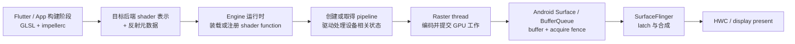

# Impeller 着色器编译性能与 Flutter 渲染稳定性

## 版本锚点与结论范围

版本锚点分为三条互相独立的版本线：

| 层次 | 固定锚点 | 适用范围 |
| --- | --- | --- |
| Android 平台 | Android 17 / API 37 / `android-17.0.0_r1` | `Surface`、BufferQueue、SurfaceFlinger、Perfetto 与系统显示边界 |
| Android 内核 | `android17-6.18-2026-06_r6` | `dma-buf`、`dma-fence`、`sync_file` 等共享缓冲与同步机制 |
| Flutter | Flutter 3.44.7，标签 `3.44.7`，提交 `84fc5cbb223bc12f83d65b647ff8a56caf779ffd` | Impeller 启用条件、后端选择、着色器、图形管线与缓存实现 |

Impeller 位于 Flutter 引擎（Flutter Engine），不在 AOSP `android-17.0.0_r1` 源码树。Android 17 提供 Vulkan、OpenGL ES、窗口缓冲、显示合成和系统跟踪能力；Flutter 引擎决定使用哪种渲染器、怎样创建图形管线，以及何时保存缓存。工程记录必须同时写明 Android 构建版本和 Flutter 引擎提交；只写“Android 17 上使用 Impeller”无法确定实现细节。

源码结论固定到 Flutter 3.44.7。Flutter 后续版本可能修改设备规避表、后端回退条件、图形管线创建时机和跟踪事件名称，升级时需要重新核对对应标签。

## 1. 先区分着色器、图形管线与一帧显示

离线编译只覆盖着色器处理的一部分，运行时仍有图形管线创建和驱动处理成本。需要分别观察四个阶段：

- **着色器源码编译与反射**：`impellerc` 在 Flutter 引擎或应用构建阶段把 GLSL 转换成目标后端需要的表示，并生成资源绑定信息。设备运行时不再解析同一份 GLSL，也不需要为 Impeller 内建着色器重复执行运行时反射。
- **着色器模块装载或注册**：运行时还要从引擎内置的着色器归档文件或应用资源中读取目标后端代码，并向图形后端注册可用的着色器函数。
- **管线状态对象创建**：Vulkan 必须根据着色器阶段、顶点布局、混合模式、颜色或深度附件（attachment）格式和采样数等描述创建管线状态对象。驱动可以在这个阶段做验证、链接、特化和设备相关优化。
- **GPU 执行与显示**：管线可用后，光栅线程（Raster 线程）才会编码绘制命令。CPU 提交 GPU 工作不等于内容已经显示；缓冲还要经过 Android `Surface`、SurfaceFlinger、硬件合成器 HWC 或 RenderEngine，再由显示系统呈现。

这张流程图用于确定每类耗时属于哪一层。



图中离线完成的是着色器前端处理和反射。管线创建、GPU 执行、缓冲交付与显示都发生在设备运行期间，分析卡顿时不能把它们合成一个“着色器编译”标签。

Flutter 官方页面把 Impeller 的目标概括为离线编译着色器、预先构建管线和显式管理缓存。Flutter 3.44.7 的实现仍会按需创建管线变体，也支持运行时片段着色器。“预先构建”表示引擎尽早创建常用管线，并通过异步任务降低关键帧等待它的概率；所有可能的管线不会在首帧前全部完成。

## 2. Android 上启用 Impeller 的精确条件

### 2.1 Flutter 3.44.7 的选择分支

Flutter 3.27 起，官方支持范围是 Android API 29 及以上默认启用 Impeller。Flutter 3.44.7 的 [`Settings::enable_impeller`](https://github.com/flutter/flutter/blob/3.44.7/engine/src/flutter/common/settings.h) 在 Android 构建中默认是 `true`，而 [`FlutterMain::SelectedRenderingAPI()`](https://github.com/flutter/flutter/blob/3.44.7/engine/src/flutter/shell/platform/android/flutter_main.cc) 进一步选择具体渲染路径：

| 条件 | Flutter 3.44.7 返回的路径 |
| --- | --- |
| 显式软件渲染 | 软件渲染；Impeller 不支持该模式 |
| `debug`（调试）或 `profile`（性能分析）模式显式指定 `opengles` | Impeller OpenGL ES |
| `debug` 或 `profile` 模式显式指定 `vulkan` | Impeller Vulkan |
| Impeller 开启、API ≥ 29，且未被 Vivante 条件排除 | Impeller 自动选择 |
| 其余情况 | Skia OpenGL ES |

自动选择由 [`AndroidContextDynamicImpeller`](https://github.com/flutter/flutter/blob/3.44.7/engine/src/flutter/shell/platform/android/android_context_dynamic_impeller.cc) 执行。它先构造 Vulkan 上下文，并检查 API、设备属性、所需扩展和上下文有效性；Vulkan 路径不可用时，创建 `AndroidContextGLImpeller`。因此 API 29+ 的自动选择回退通常是 **Impeller OpenGL ES**；API 29 以下、禁用 Impeller 或更早的选择分支才是 **Skia OpenGL ES**。

Flutter 官方文档把低版本 Android 或 Vulkan 不可用时的行为概括为回退到旧 OpenGL 渲染器。做源码级诊断时需要继续区分 Impeller GLES 与 Skia GLES，因为两者的着色器、管线、轨迹事件和缓存行为不同。设备规避列表属于 Flutter 3.44.7 的实现数据，不宜写成长期兼容性规则。

### 2.2 配置开关用于诊断，不能替代修复

开发阶段可以用以下命令对比 Impeller 与 Skia。该命令的用途是建立诊断对照组。

```shell
flutter run --profile --no-enable-impeller
```

该开关让 `profile` 构建停用 Impeller。对照结果只能说明问题与渲染路径相关，不能直接证明根因是着色器编译；两条路径还可能在纹理上传、离屏层、驱动接口和缓存状态上有差异。

Flutter 3.44.7 也允许在 `debug` 或 `profile` 模式指定 Impeller 后端。这段 Android Manifest 配置用于把测试固定到 OpenGL ES。

```xml
<application>
    <meta-data
        android:name="io.flutter.embedding.android.ImpellerBackend"
        android:value="opengles" />
</application>
```

[`README.md`](https://github.com/flutter/flutter/blob/3.44.7/engine/src/flutter/impeller/README.md) 和 `SelectedRenderingAPI()` 都把这项后端覆盖限定在 `debug` 或 `profile` 模式。`release`（发布）构建会忽略这条显式后端分支，不能把它当作生产设备分流方案。

部署版本当前可通过 `io.flutter.embedding.android.EnableImpeller=false` 停用 Impeller。Flutter 3.44.7 的引擎会输出警告，说明命令行和 Manifest 中的退出选项将在后续版本移除。生产回退适合短期规避已确认的兼容性问题，同时应保留可复现样例、设备与驱动信息、性能轨迹，并向 Flutter 问题跟踪器提交证据。

## 3. Impeller 如何减少管线首次创建对帧的影响

### 3.1 内建着色器在引擎构建阶段处理

[`impellerc`](https://github.com/flutter/flutter/tree/3.44.7/engine/src/flutter/impeller/compiler) 以 GLSL 为输入，生成 Vulkan SPIR-V、OpenGL ES GLSL 或其他后端表示，并生成 C++ 绑定信息。生成物随引擎的着色器归档文件一起打包，`impellerc` 本身不会进入应用运行时。

这一步减少的是设备上的着色器前端编译和反射工作。Vulkan 驱动还要处理 `vkCreateGraphicsPipelines` 或 `vkCreateComputePipelines`，所以冷启动或首次使用某个状态组合时可能出现 CPU 峰值。

### 3.2 常用管线句柄会尽早创建

[`ContentContext`](https://github.com/flutter/flutter/blob/3.44.7/engine/src/flutter/impeller/entity/contents/content_context.cc) 为纯色填充、纹理、裁剪、模糊和混合等常见绘制类型建立默认管线句柄。默认句柄通常以异步方式提交创建任务，让工作线程在渲染开始前后并行处理。

管线描述还包含着色器之外的状态。颜色附件格式、混合模式、模板状态、采样数和其他固定状态都可能形成不同描述。`ContentContextOptions` 变化时，引擎可以从默认描述创建变体；未创建过的变体可能在使用时同步生成。页面只修改 `uniform` 变量——绘制时传给着色器的参数——通常可以复用管线，修改管线描述中的状态则可能增加变体。

### 3.3 `PipelineCompileQueue` 处理并发、去重与提前执行

Flutter 3.44.7 的 [`PipelineCompileQueue`](https://github.com/flutter/flutter/blob/3.44.7/engine/src/flutter/impeller/renderer/pipeline_compile_queue.cc) 使用并发任务执行器处理管线创建任务，并以 `PipelineDescriptor` 保存尚未执行的任务。Vulkan [`PipelineLibraryVK::GetPipeline()`](https://github.com/flutter/flutter/blob/3.44.7/engine/src/flutter/impeller/renderer/backend/vulkan/pipeline_library_vk.cc) 同时维护描述到异步结果的映射：

1. 已存在的描述直接返回同一个异步结果，避免重复创建。
2. 新描述先写入映射，再把创建任务投到编译队列。
3. 渲染路径需要该管线时，`GenericRenderPipelineHandle::WaitAndGet()` 会调用 `PerformJobEagerly()`。
4. 任务还在待执行映射中时，等待方把它取出并立即执行，然后等待异步结果。

第 4 步说明，异步提交不能保证 Raster 线程始终避开管线创建。工作线程尚未处理到目标任务，而当前帧已经需要它时，等待线程会取走并执行该任务。此时管线创建成本可能进入 Raster 帧区间。

`PipelineCompileQueue` 在任务被提前取走时递增 `PrioritiesElevated` 计数器。它适合判断“当前帧需要的管线曾在队列中等待”，但计数器只表示优先级调整次数，不能给出单次创建耗时，也不能说明 GPU 已经完成相关工作。

### 3.4 OpenGL ES 与 Vulkan 需要分别观察

Vulkan 后端的管线对象和显式缓存边界清楚；OpenGL ES 驱动会在程序链接、首次绘制或其他内部阶段处理实现相关工作。相同页面在 Vulkan 与 GLES 下出现不同尖峰很常见，但不能据此给 GPU 品牌做固定性能排序。

测试组合至少记录：

- Flutter SDK 与引擎提交；
- Android 构建版本与 API 级别；
- Impeller Vulkan、Impeller GLES 或 Skia GLES；
- GPU 型号、驱动版本和 ABI（应用二进制接口）；
- 冷安装、清缓存后的首次运行，以及保留缓存的后续运行；
- 屏幕刷新率、分辨率、温度和功耗限制状态。

## 4. Vulkan 管线缓存的能力与限制

### 4.1 内存中的描述缓存

`PipelineLibraryVK` 以完整描述为键，保存图形管线和计算管线的异步结果。在同一个引擎上下文内，相同描述可以复用已经创建或正在创建的对象。这个缓存避免当前进程重复创建同一管线；应用重启后，还需要磁盘缓存协助驱动复用内部数据。

### 4.2 磁盘中的 `VkPipelineCache` 数据

[`PipelineCacheVK`](https://github.com/flutter/flutter/blob/3.44.7/engine/src/flutter/impeller/renderer/backend/vulkan/pipeline_cache_vk.cc) 创建一个 Vulkan 管线缓存，并把它传给图形与计算管线创建接口。已有缓存数据可作为 `vkCreatePipelineCache` 的初始数据；驱动拒绝该数据时，引擎会创建空缓存继续运行。

Flutter 3.44.7 把数据写入 `flutter.impeller.vkcache`。[`PipelineCacheDataPersist()`](https://github.com/flutter/flutter/blob/3.44.7/engine/src/flutter/impeller/renderer/backend/vulkan/pipeline_cache_data_vk.cc) 在 Vulkan 原始数据前添加 Impeller 文件头（header），并验证下列字段：

- 驱动版本；
- 厂商 ID 与设备 ID；
- 进程 ABI；
- Vulkan 管线缓存 UUID；
- Impeller 缓存魔数（magic，用于识别文件格式的固定值）与数据长度。

不兼容的数据会被忽略。写入使用原子文件替换，持久化操作在工作线程上执行，并由互斥锁（mutex）防止多个工作线程同时写同一文件。

当前实现每取得 50 个渲染表面帧（surface frame）检查一次缓存已变更标记（dirty）；标记存在时，再安排磁盘持久化。这是 Flutter 3.44.7 的内部节奏，不是公开 API 契约，也不能据此假定“运行 50 帧后缓存一定完整”。应用提前退出、驱动返回不完整数据、上下文重建或任务尚未执行都会改变结果。

### 4.3 缓存命中不代表零成本

Vulkan 管线缓存由驱动解释。已有数据可以减少部分内部编译或优化成本，但应用依然会发起管线创建调用，驱动也要校验输入并返回对象。驱动升级、GPU 变化、ABI 变化或缓存 UUID 变化会使旧数据失效。

测试冷/热差异时应明确清理范围：

- 重启 Activity 不等于新进程；
- 强制停止再启动会重建引擎上下文，但可能保留磁盘缓存；
- 清除应用数据或重新安装会删除应用缓存；
- 系统或 GPU 驱动升级可能让旧缓存被兼容性检查丢弃。

不要在生产代码中依赖 `flutter.impeller.vkcache` 的路径、文件格式或持久化间隔。它们属于引擎私有实现。

## 5. 应用自定义片段着色器的运行时路径

### 5.1 `.frag` 也会在应用构建阶段编译

应用在 `pubspec.yaml` 的 `shaders` 区域声明 `.frag` 文件后，Flutter 构建工具会调用着色器编译器，生成目标后端代码与运行时元数据，再把编译产物作为资源打入应用包。

这段配置用于声明一个自定义片段着色器。

```yaml
flutter:
  shaders:
    - shaders/background.frag
```

构建产物包含当前目标需要的运行时阶段数据。设备运行时读取的是该产物，不会重新从原始 GLSL 开始完整编译。

### 5.2 `FragmentProgram.fromAsset()` 会缓存程序，并异步准备初始管线

Flutter 3.44.7 的 [`FragmentProgram.fromAsset()`](https://github.com/flutter/flutter/blob/3.44.7/engine/src/flutter/lib/ui/painting.dart) 以资源键为索引，把程序保存在静态注册表（registry）中。首次加载时，原生方法 [`FragmentProgram::initFromAsset()`](https://github.com/flutter/flutter/blob/3.44.7/engine/src/flutter/lib/ui/painting/fragment_program.cc) 解析运行时着色器阶段数据，选择当前后端的表示，并向 Raster 任务执行器投递 `CacheRuntimeStage()`。

Impeller 的 `CacheRuntimeStage()` 会注册着色器函数，并异步创建一份默认运行时效果管线（runtime-effect pipeline）。`fromAsset()` 返回的 `Future` 是 Dart 的异步结果对象；它完成时，只能确认资源读取和解析已经成功，不会等待后台管线任务全部完成。动画前加载可以给 Raster 任务与编译工作线程更多处理时间，但不能充当“管线一定已完成”的同步栅栏。

这个资源类用于提前加载着色器程序，并复用同一份 `FragmentShader`。

```dart
import 'dart:ui' as ui;

final class BackgroundShaderResources {
  ui.FragmentProgram? _program;
  ui.FragmentShader? _shader;
  Future<void>? _loading;

  Future<void> load() => _loading ??= _load();

  Future<void> _load() async {
    if (_program != null) {
      return;
    }
    final program =
        await ui.FragmentProgram.fromAsset('shaders/background.frag');
    _program = program;
    _shader = program.fragmentShader();
  }

  ui.FragmentShader get shader {
    final value = _shader;
    if (value == null) {
      throw StateError('Background shader has not been loaded');
    }
    return value;
  }

  void dispose() {
    _shader?.dispose();
    _shader = null;
    _program = null;
    _loading = null;
  }
}
```

这段代码避免在每个 `paint()` 中新建 `FragmentShader`。Flutter API 文档允许跨帧复用该对象，每帧只更新 `uniform` 或采样器（sampler）。多个画面需要同时保留不同 `uniform` 值时，应各自持有一个 `FragmentShader`，不能在同一个实例上交错修改。

### 5.3 运行时效果可以创建按需变体

[`RuntimeEffectContents::BootstrapShader()`](https://github.com/flutter/flutter/blob/3.44.7/engine/src/flutter/impeller/entity/contents/runtime_effect_contents.cc) 会为默认颜色格式安排初始管线。绘制时，附件格式、混合状态和其他 `ContentContextOptions` 发生变化，可能请求新的运行时效果管线；同步路径会等待创建完成。

即使应用已经执行 `await FragmentProgram.fromAsset()`，页面首次使用某个合成状态时，Raster 阶段仍可能出现耗时尖峰。此时要继续检查管线描述变体、纹理首次上传、离屏渲染过程（offscreen pass）与 GPU 工作量，不能把 `await` 当作完整预热。

### 5.4 自定义着色器的优化重点

- 复用 `FragmentProgram` 与长期使用的 `FragmentShader`，避免每帧分配和初始化 `uniform` 缓冲。
- 用 `uniform` 表达随帧变化的参数，避免用多份近似着色器源文件生成额外程序。
- 控制片段着色器覆盖的像素数、纹理采样次数、分支发散和离屏渲染过程。离线编译不会减少每个像素的执行成本。
- 动画开始前加载会用到的着色器程序、图片和字体，并单独测量这段准备时间，避免把启动变慢当作免费优化。
- 在最慢的受支持设备上同时测试 Vulkan 与实际回退路径。模拟器不能代表手机 GPU 和驱动。

## 6. `ShaderWarmUp` 与 Impeller 的边界

Flutter 框架层保留了 [`ShaderWarmUp`](https://github.com/flutter/flutter/blob/3.44.7/packages/flutter/lib/src/painting/shader_warm_up.dart)，但该类的源码注释、`--trace-skia` 和 `GrGLProgramBuilder` 诊断都明确面向 **Skia 着色器编译**。`PaintingBinding.shaderWarmUp` 默认为 `null`；启用后会生成离屏图像，并让首帧 Raster 等待预热完成。

适用边界如下：

- 使用 Skia 回退路径且性能轨迹已证明存在 Skia 着色器编译卡顿时，可以评估自定义 `ShaderWarmUp`。
- 使用 Impeller 时，不要把 `ShaderWarmUp` 当作 Vulkan 管线缓存的公开控制接口。
- Impeller 的内建管线、运行时效果初始管线和 Vulkan 缓存由引擎管理。
- 需要把首次工作移出动画时，应用可提前加载 `FragmentProgram`、图片和字体，并通过真实轨迹验证收益；不要盲目绘制一组“预热页面”。

旧版 SkSL 捕获、`--cache-sksl` 与 Skia 预热文档解决的是旧渲染器的运行时着色器问题，不能直接套用到 Impeller 优化方案中。

## 7. 从 Flutter 帧定位到管线创建

### 7.1 `FrameTiming` 只能指出帧阶段

`FrameTiming.buildDuration` 表示 UI 阶段耗时，`rasterDuration` 表示 Raster 线程栅格化耗时，`totalSpan` 表示从垂直同步开始（vsync start）到光栅化结束（raster finish）的时间跨度。它们不会单独列出管线创建、纹理上传或 GPU 执行时间。

这个回调用于把慢帧的阶段数据写入应用日志，供业务事件与性能轨迹对时。

```dart
import 'dart:developer' as developer;
import 'dart:ui' as ui;

import 'package:flutter/scheduler.dart';

void reportFlutterFrameTimings(List<ui.FrameTiming> timings) {
  for (final timing in timings) {
    developer.log(
      'frame=${timing.frameNumber} '
      'build_us=${timing.buildDuration.inMicroseconds} '
      'raster_us=${timing.rasterDuration.inMicroseconds} '
      'total_us=${timing.totalSpan.inMicroseconds} '
      'vsync_overhead_us=${timing.vsyncOverhead.inMicroseconds}',
      name: 'render_timing',
    );
  }
}

void startFrameTimingReport() {
  SchedulerBinding.instance.addTimingsCallback(reportFlutterFrameTimings);
}

void stopFrameTimingReport() {
  SchedulerBinding.instance.removeTimingsCallback(reportFlutterFrameTimings);
}
```

`FrameTiming` 应在 `profile` 或 `release` 模式采集。帧预算由刷新率决定：60 Hz 约 16.67 ms，90 Hz 约 11.11 ms，120 Hz 约 8.33 ms。报告要记录测试时的实际显示模式，不能对所有设备固定使用 16 ms。

### 7.2 DevTools 先区分 UI 与 Raster 阶段

在 `profile` 模式复现问题，用 DevTools 的性能视图（Performance View）选中异常帧。时间线中的 UI 与 Raster 柱分别表示两个阶段的耗时：

- UI 柱过高：检查 Dart 的构建、布局、绘制，同步 I/O、图片解码、平台消息，以及新版 Flutter 合并平台线程与 UI 线程后的竞争。
- Raster 柱过高：检查 Impeller 跟踪事件、管线创建、`saveLayer`、模糊、裁剪、纹理上传、复杂片段着色器和 GPU 工作量。
- Flutter 两个阶段都按时，用户仍看到迟帧：继续检查 Android 缓冲、SurfaceFlinger、HWC 与显示呈现阶段。

DevTools 的 `shader compilation`（着色器编译）标记来自工具识别逻辑，不能替代引擎标签对应的源码核对。使用 Impeller 时，应结合具体跟踪区间判断它标注的是着色器、管线，还是其他 Raster 工作。

### 7.3 Perfetto 需要 Flutter 事件与 Android 显示事件同时存在

这条命令让 `profile` 构建把 Flutter 时间线事件送到 Android 系统跟踪器。

```shell
flutter run --profile --trace-systrace
```

采集 Perfetto 时还要包含应用与系统调度、CPU 频率、GPU、`gfx` / `view`、SurfaceFlinger、FrameTimeline 和同步栅栏相关数据源。`--trace-systrace` 只负责把 Flutter 时间线事件输出到系统跟踪，不会替 Perfetto 自动补齐所有数据源。

Flutter 3.44.7 中值得检查的源码级事件包括：

| 事件或计数器 | 能说明什么 | 不能说明什么 |
| --- | --- | --- |
| `PipelineVK::Create` | Vulkan 图形管线创建区间及描述标签 | 后续 GPU 执行完成时间 |
| `PipelineCompileQueue / PrioritiesElevated` | 待执行管线被等待方提前执行的累计次数 | 每次任务耗时与卡顿归因 |
| `FragmentProgram::initFromAsset` | 运行时着色器资源的读取与解析 | 初始管线已完成 |
| Flutter UI / Raster 帧事件 | 图层树（layer tree）与 Raster 阶段耗时 | 缓冲已经显示 |
| GPU 队列 / 同步栅栏 | GPU 工作与同步完成 | Dart 侧为何生成该工作 |
| FrameTimeline / SF / 呈现 | 应用缓冲到系统显示的时序 | Impeller 内部描述细节 |

跟踪名称属于 Flutter 引擎实现，升级后应在对应标签中重新搜索。`PipelineVK::Create` 与慢 Raster 帧重叠，只能证明二者同时发生；还需查看区间耗时、线程运行状态、调用关系、首次/后续差异，以及去掉该状态组合后的对照结果。

### 7.4 用业务时间线标记首次使用

这个标记用于把“进入页面”和“启动第一段动画”写入 Flutter 时间线。

```dart
import 'dart:developer';

Future<void> runFirstShaderAnimation(Future<void> Function() action) async {
  final task = TimelineTask()..start('shader_screen_first_animation');
  try {
    await action();
  } finally {
    task.finish();
  }
}
```

Perfetto 或 DevTools 中可以用这段业务区间对齐 `FragmentProgram::initFromAsset`、管线创建与 Raster 帧。时间重叠只建立候选关联，结论仍需冷/热运行和功能开关对照。

## 8. Flutter 一帧与 Android 17 显示链路

Flutter 框架在合并后的平台/UI 线程上执行动画、构建、布局和绘制，生成图层树与显示列表（display list）；Raster 线程使用 Impeller 或 Skia 生成 GPU 工作。从 Flutter 3.29 开始，Android 默认移除独立的 Dart UI 线程，让 Dart 代码在原生平台线程上运行。因此，当前跟踪中可能看不到单独的 UI 线程，Raster 线程仍是图形编码的主要观察对象。

以常见的根渲染视图 `FlutterSurfaceView` 为例，显示链路可以概括为：

```text
Android VSync
  → Flutter platform/UI thread：animation / build / layout / paint
  → layer tree / display list
  → Flutter Raster thread：Impeller pipeline / command encoding / submit
  → GPU completion fence
  → Flutter root Surface / BufferQueue
  → SurfaceFlinger latch 与 CompositionEngine
  → HWC 或 RenderEngine client composition
  → display present
```

这段顺序用于确定观测边界。Raster 完成表示引擎已完成本帧的 CPU 栅格化阶段；GPU 同步栅栏发出完成信号，表示缓冲具备安全读取条件；`queueBuffer`、SurfaceFlinger 获取缓冲（latch）与显示呈现分别是不同时间点。

`FlutterTextureView` 会多一段从 `SurfaceTexture` 到宿主 HWUI 应用窗口的采样和提交；`PlatformView`、相机或视频外部纹理（external texture）还可能拥有独立的缓冲生产者（producer）和 `Surface`。页面结构中存在这些对象时，需要先画出实际的 `Surface` / 图层树，再判断哪个缓冲对应用户看到的内容。

Android 17 的 `SurfaceFlinger`、CompositionEngine 和 HWC 不理解 Flutter 组件、着色器名称或管线描述。它们处理图层、缓冲、事务、同步栅栏、合成类型和呈现时间。Android 内核 `android17-6.18-2026-06_r6` 提供共享缓冲与同步栅栏机制，也不负责选择 Impeller 管线或保存 Flutter 缓存。

## 9. 可复现的测试方法

### 9.1 固定变量

每份结果至少包含：

```text
Android build fingerprint:
Android version / API:
Flutter SDK version:
Flutter engine revision:
Rendering path: Impeller Vulkan / Impeller GLES / Skia GLES
GPU / driver:
ABI:
Device refresh rate / resolution:
Install state: cold data / warm cache
Root render mode:
PlatformView / external texture:
Scenario and iteration count:
```

`build fingerprint` 用于标识确切的 Android 系统构建；`cold data` 表示应用数据已清除，`warm cache` 表示保留已有缓存。这些字段让冷/热、Vulkan/GLES 与不同设备结果可以复查。空缺字段应写 `unknown` 并说明原因，不能用 Android 版本推测 Flutter 引擎或 GPU 驱动。

### 9.2 分组复现

建议按以下组别采集：

1. 清除应用数据后首次进入目标页面；
2. 同一进程第二次进入；
3. 强制停止后再次进入，保留应用缓存；
4. `profile` 模式的 Impeller 默认路径；
5. `profile` 模式的 Skia 对照；
6. `debug` / `profile` 模式的 Impeller Vulkan 与 Impeller GLES 对照；
7. 至少一台性能较弱的支持设备和一台主流设备。

每组执行多轮，报告中保留分布和异常帧轨迹，避免只展示均值。冷数据测试会删除应用状态，必须在专用测试包和设备上执行。

### 9.3 归因判据

可以把管线创建列为主要原因，需要同时看到：

- 异常帧位于 Raster 阶段；
- 对应线程上的 `PipelineVK::Create` 或等价后端区间，耗时足以解释该帧超出预算的部分；
- 时间上与首次使用的绘制状态或运行时着色器对齐；
- 热缓存或提前加载后，该跟踪区间（slice）与 Raster 峰值按预期变化；
- 排除 CPU 可运行但未获调度（runnable）延迟、纹理上传、图片解码、垃圾回收（GC）、离屏渲染过程和 GPU 长任务等其他解释。

只有 `rasterDuration` 变长，证据不足以写“着色器编译卡顿”。只有 `PipelineVK::Create` 出现，也不足以证明它错过了当前刷新周期。

## 10. 常见误判与修正

| 误判 | 源码支持的解释 |
| --- | --- |
| Impeller 属于 Android 17 平台模块 | Impeller 随 Flutter 引擎进入应用，AOSP 不含该模块 |
| 离线编译后运行时没有管线创建 | 离线完成着色器前端与反射；设备仍创建管线对象 |
| API 29+ Vulkan 不可用就一定进入 Skia | Flutter 3.44.7 自动选择会尝试 Impeller GLES；其他选择条件才可能进入 Skia GLES |
| 所有管线都在首帧前完成 | 常用默认管线尽早异步创建；变体和运行时效果管线可按需创建 |
| 异步编译队列不会影响 Raster | 当前帧急需待执行管线时，等待方可能提前执行任务 |
| `await FragmentProgram.fromAsset()` 已等待管线完成 | `Future` 只覆盖资源读取和解析；初始管线任务异步投到 Raster/工作线程 |
| `ShaderWarmUp` 是 Impeller 预热 API | 该 Flutter 框架 API 的实现与诊断说明面向 Skia |
| Vulkan 缓存命中后管线创建为零成本 | 驱动仍处理创建调用，并可拒绝旧缓存 |
| Flutter Raster 帧完成就是上屏 | 后面还有 GPU 同步栅栏、BufferQueue、SF、HWC 与显示呈现 |
| Android 17 会优化某个 Impeller 着色器 | Android 提供图形与显示能力；着色器和管线策略由 Flutter 引擎与应用决定 |

## 11. 工程检查清单

### 版本与路径

- [ ] 同时记录 Android 构建版本、Flutter SDK 和引擎提交。
- [ ] 确认运行路径是 Impeller Vulkan、Impeller GLES 还是 Skia GLES。
- [ ] 记录根渲染模式、`PlatformView` 与外部纹理。
- [ ] 记录 GPU、驱动、ABI、刷新率、分辨率和温度状态。

### 着色器与管线

- [ ] 自定义 `.frag` 已在 `pubspec.yaml` 声明并由 Flutter 工具构建。
- [ ] `FragmentProgram` 在动画前加载，长期使用的 `FragmentShader` 跨帧复用。
- [ ] 没有把 `uniform` 变化改成多份近似着色器源文件。
- [ ] 已检查混合、附件和采样数等管线变体来源。
- [ ] 没有把 Skia `ShaderWarmUp` 当作 Impeller 缓存接口。

### 观测与回归

- [ ] 性能数据来自 `profile` / `release` 模式和物理设备。
- [ ] `FrameTiming`、DevTools、Flutter 轨迹与 Perfetto 使用同一业务场景对时。
- [ ] 冷数据、热缓存、进程重启和二次进入分开记录。
- [ ] Raster、GPU 同步栅栏、SurfaceFlinger 与显示呈现分层归因。
- [ ] 结论包含至少一个对照组，并保留异常帧原始轨迹。

## 12. 源码与官方资料

### Flutter 3.44.7

- [Impeller 官方说明](https://docs.flutter.dev/perf/impeller)
- [Flutter 发布说明：当前文档版本锚点](https://docs.flutter.dev/release/release-notes)
- [Impeller README 与离线着色器编译流程](https://github.com/flutter/flutter/blob/3.44.7/engine/src/flutter/impeller/README.md)
- [`Settings::enable_impeller`](https://github.com/flutter/flutter/blob/3.44.7/engine/src/flutter/common/settings.h)
- [`FlutterMain::SelectedRenderingAPI()`](https://github.com/flutter/flutter/blob/3.44.7/engine/src/flutter/shell/platform/android/flutter_main.cc)
- [`AndroidContextDynamicImpeller`](https://github.com/flutter/flutter/blob/3.44.7/engine/src/flutter/shell/platform/android/android_context_dynamic_impeller.cc)
- [`Shell`：Impeller 退出选项的弃用警告](https://github.com/flutter/flutter/blob/3.44.7/engine/src/flutter/shell/common/shell.cc)
- [`PipelineCompileQueue`](https://github.com/flutter/flutter/blob/3.44.7/engine/src/flutter/impeller/renderer/pipeline_compile_queue.cc)
- [`Pipeline` handle 与 `WaitAndGet()`](https://github.com/flutter/flutter/blob/3.44.7/engine/src/flutter/impeller/renderer/pipeline.h)
- [`ContentContext` 默认管线与变体](https://github.com/flutter/flutter/blob/3.44.7/engine/src/flutter/impeller/entity/contents/content_context.cc)
- [`PipelineLibraryVK`](https://github.com/flutter/flutter/blob/3.44.7/engine/src/flutter/impeller/renderer/backend/vulkan/pipeline_library_vk.cc)
- [`PipelineCacheVK`](https://github.com/flutter/flutter/blob/3.44.7/engine/src/flutter/impeller/renderer/backend/vulkan/pipeline_cache_vk.cc)
- [`PipelineCacheDataPersist()` 与兼容性 header](https://github.com/flutter/flutter/blob/3.44.7/engine/src/flutter/impeller/renderer/backend/vulkan/pipeline_cache_data_vk.cc)
- [自定义 fragment shader 官方说明](https://docs.flutter.dev/ui/design/graphics/fragment-shaders)
- [`FragmentProgram.fromAsset()`](https://github.com/flutter/flutter/blob/3.44.7/engine/src/flutter/lib/ui/painting.dart)
- [`FragmentProgram::initFromAsset()`](https://github.com/flutter/flutter/blob/3.44.7/engine/src/flutter/lib/ui/painting/fragment_program.cc)
- [`RuntimeEffectContents`](https://github.com/flutter/flutter/blob/3.44.7/engine/src/flutter/impeller/entity/contents/runtime_effect_contents.cc)
- [`ShaderWarmUp`](https://github.com/flutter/flutter/blob/3.44.7/packages/flutter/lib/src/painting/shader_warm_up.dart)
- [Flutter 性能分析](https://docs.flutter.dev/perf/ui-performance)
- [DevTools Performance View](https://docs.flutter.dev/tools/devtools/performance)
- [`FrameTiming`](https://api.flutter.dev/flutter/dart-ui/FrameTiming-class.html)
- [Flutter 架构与 Android/iOS 线程合并说明](https://docs.flutter.dev/resources/architectural-overview)

### Android 17 与内核

- Android 17 [`Surface.java`](https://android.googlesource.com/platform/frameworks/base/+/android-17.0.0_r1/core/java/android/view/Surface.java)
- Android 17 [`SurfaceFlinger.cpp`](https://android.googlesource.com/platform/frameworks/native/+/android-17.0.0_r1/services/surfaceflinger/SurfaceFlinger.cpp)
- Android 17 [`BufferQueueProducer.cpp`](https://android.googlesource.com/platform/frameworks/native/+/android-17.0.0_r1/libs/gui/BufferQueueProducer.cpp)
- Android 17 [Perfetto 数据源配置](https://perfetto.dev/docs/data-sources/atrace)
- Android 内核 [`dma-buf.c`](https://android.googlesource.com/kernel/common/+/refs/tags/android17-6.18-2026-06_r6/drivers/dma-buf/dma-buf.c)
- Android 内核 [`sync_file.c`](https://android.googlesource.com/kernel/common/+/refs/tags/android17-6.18-2026-06_r6/drivers/dma-buf/sync_file.c)

## 小结

Impeller 的主要改进是把着色器前端编译和反射移到构建阶段，并用提前创建、异步任务、描述缓存与 Vulkan 磁盘缓存管理管线。设备运行时仍存在着色器函数注册、管线对象创建、驱动处理、GPU 执行和 Android 显示链路成本。

Flutter 3.44.7 在 Android API 29+ 默认启用 Impeller，自动路径优先 Vulkan 并可回退到 Impeller OpenGL ES。自定义 `FragmentProgram` 的资源也在构建阶段编译，但 `fromAsset()` 只异步启动初始管线准备，按需变体仍可能出现在首次绘制路径。

可靠诊断需要把 Flutter UI、Raster、管线创建、GPU 同步栅栏、BufferQueue、SurfaceFlinger 与显示呈现分开观察。Android 17 / API 37、Flutter 3.44.7 和 Android 内核 r6 是三条独立锚点；只有把版本、后端、设备、缓存状态和性能轨迹同时固定，才能得到可复查的结论。
