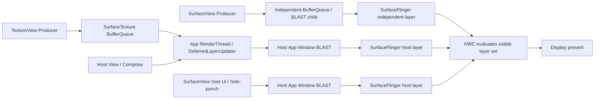

# SurfaceView 与 TextureView：渲染路径、选型与排障

`SurfaceView` 和 `TextureView` 都能接收 Camera、MediaCodec、EGL 或 Vulkan 生成的 buffer（图像缓冲区），差别在于消费 buffer 的位置：

- `SurfaceView` 保留独立内容流，SurfaceFlinger 能看到对应的 buffer layer；
- `TextureView` 由应用进程内的 HWUI 消费输入 buffer，再把像素画入宿主应用窗口（App Window）。

这个分界决定了延迟组成、GPU 带宽、HWC 机会、变换能力、生命周期和 trace（性能轨迹）读法。控件名称本身不能保证低延迟、低功耗或硬件叠加；所有性能结论都要回到当前设备的 Producer、BufferQueue、layer、fence 和 display present。

正文保留源码和 Perfetto 中可检索的英文名，含义统一如下：

- **Producer / Consumer**：Producer 是写入画面的生产者，例如相机、解码器或游戏引擎；Consumer 是取得并使用 buffer 的消费者，例如 SurfaceFlinger 或 HWUI。
- **BufferQueue / slot**：BufferQueue 管理可循环复用的 buffer；slot 是队列中标识某块 buffer 的槽位，不等于固定的双缓冲或三缓冲。
- **layer**：SurfaceFlinger 可独立定位、裁剪并参与合成的图层。`TextureView` 的 `TextureLayer` 是 HWUI 对象，不属于 SurfaceFlinger layer。
- **transaction**：一组原子提交的图层或 buffer 更新；同一 transaction 内的状态一起生效，但不会让尚未完成的 buffer 提前就绪。
- **fence**：跨 CPU、GPU 与显示硬件同步的完成信号。acquire fence 保护即将读取的 buffer，release fence 表示旧 buffer 可以复用，present fence 标记一次显示提交的完成边界。
- **latch / present**：latch 表示 SurfaceFlinger 为某个显示周期选中一块已就绪 buffer；present 表示该周期已经交给显示路径，仍早于面板像素的光学响应完成。
- **HWC 与 DEVICE / CLIENT composition**：HWC（Hardware Composer，硬件合成器）按当前整屏图层集合选择合成方式。DEVICE 表示交给显示硬件处理；CLIENT 表示 RenderEngine 先用 GPU 合成 client target（供 HWC 使用的中间整屏目标）。
- **BLAST**：Android 用来协调 BufferQueue 内容与 `SurfaceControl.Transaction` 的缓冲提交路径，源码和 trace 中常见 `BLASTBufferQueue`、BLAST child 与 `BufferTX`。
- **hole-punch**：宿主窗口把 `SurfaceView` 对应区域处理为透明，露出处在更低合成层级的独立内容图层。

## 版本基线与术语校正

源码锚点如下：

| 层级 | 基线 | 用途 |
| --- | --- | --- |
| Android 平台 | Android 17 / API 37 / `android-17.0.0_r1` | `SurfaceView`、`TextureView`、BLAST、HWUI、SurfaceFlinger、HWC |
| Android 内核 | `android17-6.18-2026-06_r6` | sync file、dma-fence 等底层同步语义 |
| Jetpack Compose | Compose BOM 2026.08.00；UI 与 Foundation 1.12.0 | `AndroidView` 与外部 Surface 的互操作边界 |
| Media3 / CameraX | 使用项目锁定的稳定版 | 组件策略独立发布，不能由 platform tag 代替 |

版本演进保留 Android 12—17 的现代路径。Android 10/11 只用于兼容性判断，不把早期实现套到 Android 17。

几项常见描述需要按当前实现收窄：

| 常见描述 | Android 17 中的准确边界 |
| --- | --- |
| SurfaceView 是“独立窗口” | 它仍是宿主 View 树中的 View；内容由宿主 bounds layer 下的 container、BLAST child 与背景 color layer 承载，不是另一个应用 Window |
| TextureView 是“View 树内硬件层” | Java `TextureLayer` 是应用内 HWUI 对象，不是 SurfaceFlinger layer；RenderThread 通过 `DeferredLayerUpdater` 消费 `SurfaceTexture` |
| SurfaceView 固定低延迟 | 独立路径有机会省去宿主纹理采样；端到端结果仍受 Producer、queue、fence、latch、HWC 和 display 约束 |
| TextureView 固定多一个 SurfaceFlinger GPU 渲染步骤 | 宿主 HWUI 必须采样输入纹理；SurfaceFlinger 只看到最终宿主 layer，是否生成 client target 由整屏 HWC 合成策略决定 |
| SurfaceView 固定双缓冲、TextureView 固定三缓冲 | BufferQueue slot、最大 dequeued 数和 present mode 由 Producer、Consumer 与配置决定，没有通用固定值 |
| `SurfaceControl.BufferChangedListener` | API 37 没有这个公开类型；应区分 transaction committed/completed listener、BLAST callback 与 acquire/release/present fence |
| SurfaceView 必定走 overlay | 独立 layer 只获得被 HWC 单独评估的机会；DEVICE/CLIENT 结果由整屏 layer 集合与硬件能力决定 |
| Vulkan 直接绑定 SurfaceControl | Vulkan WSI 使用 `ANativeWindow` 创建 `VkSurfaceKHR`；SurfaceControl 管 layer 状态，不是 Vulkan swapchain 的通用直接目标 |

## 一、两条显示拓扑

### SurfaceView：宿主和内容各走一条生产线

Android 17 的 `SurfaceView.createBlastSurfaceControls()` 维护三个主要对象：

- `mSurfaceControl`：container layer，承载位置、crop、相对层级等管理状态；
- `mBlastSurfaceControl`：container 的 BLAST child，接收 Producer buffer；
- `mBackgroundControl`：按条件显示的 background color layer。

它们挂在 `ViewRootImpl.updateAndGetBoundsLayer()` 返回的宿主 bounds layer 下。`SurfaceHolder.getSurface()` 暴露 Producer 侧 `Surface`，Producer 可以位于应用线程、codec/camera 服务或厂商进程。

默认 composition order 小于 0 时，内容 layer 的合成层级低于宿主窗口。宿主 HWUI 把对应区域处理为透明，并通过 `Canvas.punchHole()` 露出独立内容。控制条、字幕和其它 View 仍画进宿主应用窗口；视频、预览或游戏帧进入独立 BLAST child。

一次屏幕更新会包含两组提交：

1. 宿主 `Choreographer#doFrame()` 更新 View 树、hole-punch 和 SurfaceView 几何；
2. 内容 Producer 按自己的节奏向独立 Surface queue buffer；
3. SurfaceFlinger 把宿主 layer 与 SurfaceView child 一起交给 HWC；
4. 每个 layer 可以采用新 buffer，也可以继续使用上次内容。

宿主 120 Hz、视频 30 fps 时，多次 display present 复用同一视频 buffer 属于正常节奏。需要定位的是新 buffer 是否赶上业务期望的 present，以及几何、遮罩和内容是否对应同一业务时刻。

### TextureView：外部流先回到宿主 HWUI

`TextureView` 至少涉及两套 BufferQueue：

1. 外部 Producer → `SurfaceTexture`；
2. 宿主 HWUI → App Window BLAST → SurfaceFlinger。

Android 17 的主要执行点如下：

1. Producer 向 `SurfaceTexture` queue buffer；
2. `OnFrameAvailableListener` 投递到 ViewRoot 所在线程；
3. listener 调用 `updateLayer()` 与 `invalidate()`；
4. UI 线程的 `TextureView.draw()` 调用 `TextureLayer.updateSurfaceTexture()`，把 updater 加入 RenderThread pending list；
5. `DrawFrameTask::syncFrameState()` 处理 pending update；
6. `DeferredLayerUpdater::apply()` 通过 `ASurfaceTexture_dequeueBuffer()` 取得最新 `AHardwareBuffer`；
7. HWUI 将其包装为可采样 `SkImage`，与其它 View 一起画进 App Window；
8. 宿主 RenderThread 再向 App Window BLAST 提交窗口 buffer。

`onSurfaceTextureUpdated()` 发生在 UI 线程提交 layer update 之后，不能证明 RenderThread 已取得输入、GPU 已完成采样或画面已经 present。

### 一张图比较两条路径

这张图只保留决定选型的对象边界。



SurfaceView 内容保持独立 layer，宿主 UI 仍有自己的窗口 buffer；TextureView 输入在 RenderThread 结束第一套队列周转，SurfaceFlinger 只接收已经包含该内容的宿主 buffer。

## 二、延迟、功耗与内存要怎样比较

### 延迟不是固定相差一帧

SurfaceView 的一块内容帧大致经过：

`Producer fill → queueBuffer → BLAST acquire/transaction → SF readiness/latch → HWC/RenderEngine → present`

TextureView 的一块内容帧大致经过：

`Producer fill → SurfaceTexture queue → frame-available → host frame → RT acquire/sample → host queue → SF readiness/latch → HWC/RenderEngine → present`

TextureView 多了宿主 callback、宿主帧截止点、输入 acquire 和纹理采样。若输入恰好赶上已经安排的 host frame，这些工作可能落在同一 VSync 周期；若到达晚于 RenderThread pending layer update，它会等下一次宿主帧。不能统一写成“必定多一帧”。

SurfaceView 也可能迟到：

- Producer 没有按目标 timestamp 提交；
- acquire fence 未 signal；
- BLAST transaction 受同步条件阻挡；
- 独立 layer 因 HWC 能力回到 CLIENT；
- display mode、frame-rate override 或 present deadline 不匹配；
- Producer 被自己的 release fence 与 queue slot 反压。

评估触摸到显示、相机 sensor 到预览或解码到显示时，应给起点和终点下定义。Perfetto 的 present fence 只能提供 Android 显示栈边界，不能代替光电传感器测得的 panel 响应。

### 功耗优势依赖 DEVICE composition

SurfaceView 常用于视频和相机，因为独立 layer 能交给 HWC 单独评估。若该 layer 满足格式、缩放、旋转、颜色、保护和 plane 资源等要求，HWC 可以选择 DEVICE composition，从而避免宿主 GPU 对大面积内容再次采样。

这个机会不等于保证。以下变化都可能让 strategy 改变：

- 透明度、blend、复杂 crop 或旋转；
- HDR、dataspace、color transform；
- protected/secure 属性；
- 同屏 overlay plane、scaler 或带宽被其它 layer 占用；
- 系统栏、圆角、dim、窗口动画或外接显示；
- 厂商 Composer HAL 的限制与错误回退。

TextureView 的输入必须经宿主 GPU 采样。外部 buffer 通常以 `AHardwareBuffer` 导入 GPU，不需要 CPU 逐像素复制；仍会产生 image import、fence、缩放、过滤、颜色处理、blend、采样带宽和宿主 render pass 成本。

功耗测试至少记录：

- 视频/预览分辨率、帧率、bit depth、dataspace；
- 显示刷新率、亮度、HDR/SDR、温度和电源状态；
- SurfaceView child 与宿主 layer 的 DEVICE/CLIENT 结果；
- RenderEngine、应用 GPU、memory bandwidth 和相关 power rail；
- 同一内容、同一时长和相同 UI overlay。

只比较整机平均电流会混入 modem、音频、显示亮度、解码器和温控差异。应先固定这些变量，再解释 Surface 类型带来的增量。

### 内存不能用“双缓冲/FIFO”概括

SurfaceView 页面通常有宿主窗口队列与独立内容队列；TextureView 页面有外部 `SurfaceTexture` 队列与宿主窗口队列。两者都有两套 buffer 周转，只是 Consumer 和最终 layer 位置不同。

一块单平面、未压缩 buffer 的粗略下界可以按这个式子估算：

`rowStride × allocationHeight × bytesPerPixel`

YUV、多平面、压缩 modifier、tile 对齐、metadata、HDR 与厂商 gralloc 会改变占用，不能只用 `width × height × 4`。总量还取决于：

- 已分配 slot 数与当前 dequeued/queued/acquired 状态；
- Producer swapchain 或 codec/camera 内部池；
- TextureView 的 `SkImage`/导入缓存；
- 宿主 App Window buffer；
- 中间 render target、client target 和截图/特效资源。

测量时结合 `dumpsys SurfaceFlinger --list`、完整 SurfaceFlinger dump、layer trace、Perfetto graphics memory、`dumpsys meminfo`、GPU/vendor 工具和 gralloc dump。任何“某分辨率固定占用 N MB”的结论都要同时给出 format、stride、slot、usage、压缩与设备信息。

### 不提供跨 SoC 的“典型范围”

不同 SoC 的 GPU、DPU、plane、scaler、内存压缩、codec/camera pipeline 和 Composer HAL 差异很大。没有统一的 Android 17 延迟、功耗或内存区间。

可靠的基准应包含：

| 维度 | 固定条件 | 输出 |
| --- | --- | --- |
| 内容 | 同一视频/相机配置/游戏场景 | Producer 出帧节奏、分辨率、format、HDR |
| UI | 相同遮罩、变换、动画与窗口状态 | layer 集合、crop、alpha、composition type |
| 设备 | 同型号、同系统 build、同刷新率 | thermal、频率、驱动与 HAL 版本 |
| 时序 | 预热（warmup）后多轮、相同持续时间 | 中位数、P90/P95/P99、丢帧与延迟 present |
| 功耗 | 同亮度、网络、音频、温度区间 | 电源轨能耗、GPU busy、带宽、CLIENT 时间 |
| 内存 | 相同 slot 稳态与操作步骤 | gralloc allocation、heap、GPU resource |

跨设备对比可以回答兼容性和分布，不能拿一台设备的 overlay 成功率替另一台下结论。

## 三、SurfaceControl 在 Android 17 中负责什么

### 几何 transaction 与内容 buffer 分开

SurfaceView 的 position、matrix、crop、alpha、composition order、show/hide 等状态由 `SurfaceControl.Transaction` 管理。内容 Producer 的 frame 进入 BLAST child BufferQueue。两类更新可以合进同一 transaction，也可能来自不同时间。

硬件加速路径使用 `RenderNode.PositionUpdateListener` 取得最终位置和 host frame number，再经 `ViewRootImpl.mergeWithNextTransaction()` 与宿主目标帧合并。UI 线程的其它更新可由 `applyTransactionOnDraw()` 随下一次 ViewRoot draw 应用。

需要把状态绑定到 SurfaceView 下一块内容 buffer 时，可以使用 `applyTransactionToFrame()`。源码按 `lastAcquiredFrameNum + 1` 合并目标 transaction。连续 Producer 中“下一块”不能映射成业务上的固定逻辑帧；没有新内容 buffer 时，该更新也可能不生效。

### `apply()`、sync 与 async

公开 `Transaction.apply()` 会原子提交这笔 transaction 内的状态，并清空对象供后续复用。它走非同步 apply；源码中的 `apply(boolean sync)` 是隐藏入口，注释直接称其为更容易造成 jank 的版本。

应用不应为了“立刻看到”而寻找同步 apply。原子提交只保证同一 transaction 内的状态一起应用，不保证 acquire fence 已完成，也不保证指定 display 已 present。需要控制目标时间时，API 35 提供 `setDesiredPresentTimeNanos()` 与 `setFrameTimeline(vsyncId)`；它们是调度提示，不能让未完成 buffer 越过 fence。

### 没有 `BufferChangedListener`

API 37 的公开回调应按用途区分：

| 机制 | 回调时点 | 能回答什么 |
| --- | --- | --- |
| `addTransactionCommittedListener()` | transaction 已 applied，更新 ready to be presented | 是否已进入可呈现阶段；不能证明 present 或 buffer release |
| `addTransactionCompletedListener()` | transaction 已 presented 后 | transaction 的显示栈完成信息；仍不等于 panel 光学完成 |
| acquire fence | Producer 完成写入后 signal | Consumer 何时能安全读这块 buffer |
| per-layer release fence | Consumer/HWC 不再读旧 buffer 后 signal | 旧 slot 何时可复用 |
| present fence | 本次 display present 的完成边界 | 最终 display 时序反馈 |

BLAST 内部还有 buffer transaction、frame number 和 release callback。分析时要写明对象和队列，不能把任意回调统称为“buffer changed”。

### BLAST 怎样提交内容

Android 17 的 `BLASTBufferQueue::acquireNextBufferLocked()` 从 Consumer 侧取得 `BufferItem`，把 buffer、acquire fence、frame number、dataspace、HDR metadata、crop 与 transform 等写入 `SurfaceComposerClient::Transaction`。

`mergeWithNextTransaction()` 按 frame number 保存外部状态；对应 buffer 到达后，`mergePendingTransactions()` 将其合入同一 buffer transaction。这个机制能协调已知 frame number 的状态，不能替 Camera、codec 或游戏 Producer 提前产出画面。

### 多 Surface 一致性要明确参与者

同一 `SurfaceControl.Transaction` 能让多项 layer 状态原子应用，却不会等待未加入 transaction 的 Producer 生成业务上的下一帧。API 34 的 `SurfaceSyncGroup` 可以收集 `AttachedSurfaceControl`、`SurfaceControlViewHost.SurfacePackage` 与附加 transaction；调用 `markSyncReady()` 后，系统等待已经注册的 child sync 完成，再应用最终合并的 transaction。

同步组只约束加入组的对象。Camera HAL、MediaCodec 或游戏引擎若独立向 Surface 输出，而且没有通过受控 Surface 的同步回调参与该组，`SurfaceSyncGroup` 无法判断哪块 buffer 对应业务期望的逻辑帧。`setDesiredPresentTimeNanos()` 与 `setFrameTimeline()` 也只提供显示调度目标，不会代替 Producer 完成内容。

Perfetto 中看到 Android 13 引入的 `AutoSingleLayer` latch-unsignaled 路径，也不能据此推断多个 Surface 已经同步。AOSP 把它限制在单 layer 的纯 buffer update；跨 layer、几何变化和 sync transaction 都不属于这个优化范围。

### HWC 硬件叠加的准确边界

SurfaceFlinger 为当前 display 构建可见 layer 集合，HWC 再返回 DEVICE/CLIENT composition 建议。SurfaceView child 作为独立 layer，可获得独立的格式、source crop、destination frame、dataspace 和保护属性。

以下说法要分开：

- **DEVICE composition**：HWC 接受该 layer 交给 display hardware；
- **CLIENT composition**：SurfaceFlinger 的 RenderEngine 先把相关 layer 合成 client target；
- **overlay plane**：设备硬件实现细节，常与 DEVICE composition 相关，但公共 trace 不一定暴露具体 plane 编号；
- **宿主 layer DEVICE**：TextureView 已经画在宿主 buffer 中，宿主 layer 走 DEVICE 不表示内部视频区域获得独立 overlay。

多 SurfaceView 也不会按 layer 数线性增加或减少 GPU。增加一个独立 layer 可能让视频进入 DEVICE，也可能消耗有限 plane，让另一层回到 CLIENT。

## 四、生命周期与黑屏

### SurfaceView 以 SurfaceHolder 回调为边界

Activity 已恢复（resumed）、View 已附着（attached）与 Surface 可用（valid）是三个独立状态。Producer 只能在 `surfaceCreated()` 后使用当前 Surface，并且在 `surfaceDestroyed()` 返回前停止所有线程对它的访问。

这段骨架强调 Surface 所有权；`FrameProducer` 是业务接口。

```kotlin
private interface FrameProducer {
    fun attach(surface: Surface)
    fun resize(width: Int, height: Int, format: Int)
    fun detachAndWaitUntilIdle()
}

surfaceView.holder.addCallback(object : SurfaceHolder.Callback {
    override fun surfaceCreated(holder: SurfaceHolder) {
        producer.attach(holder.surface)
    }

    override fun surfaceChanged(
        holder: SurfaceHolder,
        format: Int,
        width: Int,
        height: Int,
    ) {
        producer.resize(width, height, format)
    }

    override fun surfaceDestroyed(holder: SurfaceHolder) {
        producer.detachAndWaitUntilIdle()
    }
})
```

`detachAndWaitUntilIdle()` 必须保证 EGL/Vulkan、codec、camera 或远端 Producer 不再碰旧 Surface。只发一个异步 stop 消息后立即返回，仍可能与底层销毁竞态。

Android 14 起，`setSurfaceLifecycle()` 可选择随 visibility 或 attachment 管理 Surface。attachment 策略能在暂时不可见时保留 Surface，减少重建，也会延长 buffer 和 Producer 资源寿命。Media3 的 `PlayerView` 从 Android 14 起会利用 attachment 策略改善滚动/复用时机。

### TextureView 以 SurfaceTextureListener 为边界

`TextureView` 只能在硬件加速窗口中显示内容。同一实例同时只能连接一个 Producer。`onSurfaceTextureDestroyed()` 返回值决定 `SurfaceTexture` 的释放方。

这段骨架同时管理应用创建的 `Surface`。

```kotlin
private interface TextureFrameProducer {
    fun attach(surface: Surface, width: Int, height: Int)
    fun resize(width: Int, height: Int)
    fun detachAndWaitUntilIdle()
}

private var producerSurface: Surface? = null

textureView.surfaceTextureListener = object : TextureView.SurfaceTextureListener {
    override fun onSurfaceTextureAvailable(
        surfaceTexture: SurfaceTexture,
        width: Int,
        height: Int,
    ) {
        producerSurface = Surface(surfaceTexture).also {
            textureProducer.attach(it, width, height)
        }
    }

    override fun onSurfaceTextureSizeChanged(
        surfaceTexture: SurfaceTexture,
        width: Int,
        height: Int,
    ) {
        textureProducer.resize(width, height)
    }

    override fun onSurfaceTextureUpdated(surfaceTexture: SurfaceTexture) = Unit

    override fun onSurfaceTextureDestroyed(surfaceTexture: SurfaceTexture): Boolean {
        textureProducer.detachAndWaitUntilIdle()
        producerSurface?.release()
        producerSurface = null
        return true
    }
}
```

返回 `true` 表示由 TextureView 释放当前 SurfaceTexture；返回 `false` 表示调用方接管，后续必须自行调用 `release()`。应用通过 `Surface(surfaceTexture)` 创建的包装对象始终由应用调用 `release()`。

`setSurfaceTexture(newTexture)` 会立即释放旧对象，且不会为旧对象调用 destroyed 回调，也不会为新对象调用 available 回调。复用旧 SurfaceTexture 时要显式记录所有权，以及它是否已经从原 GL 环境分离。

### 黑屏按对象逐项检查

Android 17 的 SurfaceView 黑屏可能来自多个对象。按这组顺序检查：

1. container、BLAST child 或 TextureLayer 是否已经创建；
2. Producer 是否连接当前而非旧 Surface；
3. 首个 buffer 是否 queue；
4. acquire fence 是否在目标 present 前 signal；
5. layer visibility、crop、alpha、composition order 或 host hole-punch 是否正确；
6. HWC 是否接受 format、dataspace、protected/secure 属性；
7. 宿主硬件加速、TextureView listener 与 RenderThread acquire 是否工作；
8. 模式切换后 layer id、BufferQueue 和 Producer 是否已经变化。

`setSecure(true)` 表达安全输出要求，不能用于修复一般黑屏。protected buffer 需要端到端保护路径；设备、外接显示或 HWC 不满足条件时，可能拒绝显示。移除 secure 以换取普通 GPU 读取会破坏 DRM/安全模型。

`setAlpha()` 也有明确边界。Android 14 起 SurfaceView 支持任意 alpha；composition order 小于 0 时 alpha 调制 hole-punch，非负时直接作用于 Surface 内容。多个重叠的 Z-below SurfaceView 不保证得到普通 View 那样的混合结果。

## 五、场景选型

### 相机预览

CameraX `PreviewView` 的 `PERFORMANCE` 是默认模式，支持时使用 SurfaceView；`COMPATIBLE` 使用 TextureView。即使选择 `PERFORMANCE`，CameraX 也会在 API 24 及以下、LEGACY camera hardware，或目标旋转与 display rotation 不一致时回退到 TextureView。

这段代码适用于明确需要普通 View 变换兼容性的页面。

```kotlin
previewView.implementationMode =
    PreviewView.ImplementationMode.COMPATIBLE
```

`COMPATIBLE` 会选择 TextureView。若页面只做常规预览并关注功耗或延迟，应保留 `PERFORMANCE`，再在目标设备确认实际实现和 HWC 合成策略。

相机选型还要考虑：

- 预览是否需要任意旋转、动画、复杂 clip 或 shader；
- 画面分析是否另走 `ImageAnalysis`，不要把 preview Surface 当分析输入；
- sensor timestamp 到 present 的延迟目标；
- protected camera、HDR、10-bit 与 color space；
- 前后台和 session 重建期间的首 buffer。

### 视频播放

Media3 `PlayerView` 的 `surface_type` 默认是 `surface_view`，官方也建议常规视频优先 SurfaceView，理由包括多设备上的功耗、帧时序、HDR、secure output 和 Android TV 全分辨率。

这段 XML 只在需要 TextureView 语义时使用。

```xml
<androidx.media3.ui.PlayerView
    android:id="@+id/player_view"
    android:layout_width="match_parent"
    android:layout_height="match_parent"
    app:surface_type="texture_view" />
```

选择 TextureView 后应重新验证 HDR、DRM、功耗和宿主 GPU。贴纸若只是普通 View 或 Compose 覆盖层，SurfaceView 默认处在宿主 UI 的较低合成层级，宿主 UI 仍可覆盖视频；贴纸必须与视频像素一起经过 shader、mask 或统一纹理变换时，再选择 TextureView 或 GL 视频路径。

### 地图与游戏

地图 SDK 的输出方式由具体版本和配置决定，不能仅凭“地图”标签选控件。若 SDK 能提供 SurfaceView 和 TextureView 两种模式，按变换、层级、功耗与设备兼容性基准选择。

`GLSurfaceView` 建立在 SurfaceView 上。Vulkan 引擎通常从 Java `Surface` 得到 `ANativeWindow`，再创建 `VkSurfaceKHR` 和 swapchain。它可以使用 Activity 主窗口，也可以使用 SurfaceView 暴露的 Surface。

这段原生代码只展示 Vulkan WSI 的对象关系。

```cpp
ANativeWindow* window = ANativeWindow_fromSurface(env, javaSurface);

VkAndroidSurfaceCreateInfoKHR createInfo{
    VK_STRUCTURE_TYPE_ANDROID_SURFACE_CREATE_INFO_KHR
};
createInfo.window = window;

VkSurfaceKHR vkSurface = VK_NULL_HANDLE;
vkCreateAndroidSurfaceKHR(instance, &createInfo, nullptr, &vkSurface);

ANativeWindow_release(window);
```

`vkCreateAndroidSurfaceKHR` 使用 `ANativeWindow`；SurfaceControl 负责 layer tree 与 transaction。引擎还要管理 swapchain 重建、预旋转（pre-rotation）、semaphore/fence 和帧节奏控制（Frame Pacing），不能依赖 `vkAcquireNextImageKHR` 或 `vkQueuePresentKHR` 的阻塞行为同步无关 CPU 工作。

Unity、Unreal 或自研引擎的内部 Surface 拓扑会随版本、渲染后端和嵌入方式变化。是否获得独立 layer、是否多一次采样，必须从实际 layer tree 和队列确认。

### 直播与弹幕

常见方案有三类：

| 方案 | 优点 | 约束 |
| --- | --- | --- |
| SurfaceView 视频 + 宿主 View/Compose 弹幕 | 视频可独立评估 HWC；弹幕开发简单 | 两路出帧节奏独立，字幕时间要靠 media clock 对齐 |
| TextureView 视频 + 宿主弹幕 | 视频可按 View 语义变换 | 视频仍经宿主 GPU，弹幕与视频未自动成为同一纹理 pass |
| 视频和弹幕统一进 GL/Vulkan | shader、mask、滤镜和时钟更可控 | GPU、内存带宽、颜色/HDR 与资源生命周期由应用负责 |

只为让弹幕盖在视频上，不必直接选择 TextureView。默认 Z-below SurfaceView 允许宿主 UI 覆盖；需要复杂交叉透明或把两者一起做后处理时，再评估统一 GPU 路径。

### 快速决策表

| 需求 | 优先候选 | 切换条件 |
| --- | --- | --- |
| 常规 Media3 视频 | SurfaceView | 必须使用普通 View 级纹理变换或统一 shader |
| CameraX 常规预览 | `PERFORMANCE` | CameraX 回退条件或明确需要 `COMPATIBLE` |
| DRM/secure/HDR 视频 | SurfaceView | 目标设备与内容链另有受支持方案 |
| 任意 rotation/scale/alpha/clip | TextureView | SurfaceControl API 已覆盖视觉需求且实测更合适 |
| 大尺寸高帧率外部内容 | SurfaceView | HWC 一直 CLIENT，或业务必须宿主采样 |
| 小尺寸低帧率动效纹理 | TextureView | GPU/带宽或宿主 frame deadline 不满足 |
| 游戏全屏 | 主窗口 Surface 或 SurfaceView | 嵌入 UI、层级和引擎架构要求改变 |
| 同像素 pass 的滤镜/贴纸 | TextureView 或统一 GL/Vulkan | 普通 overlay 已能满足 |

## 六、Perfetto 中怎样证明路径

### 采集项

至少开启：

- app `gfx` / `view` atrace 与 `sched`；
- SurfaceFlinger、transactions、layer trace、FrameTimeline；
- fence/sync 与可用的 GPU 数据源；
- Camera、codec、Binder 或厂商轨迹，按场景添加；
- 支持时采集 HWC composition type 或 Winscope layer 信息。

Perfetto 的 FrameTimeline 对 SurfaceView 内容流没有完整覆盖。SurfaceFrame 记录一个 Surface 产生帧的时间线，DisplayFrame 记录一次显示周期汇总；宿主应用窗口的两类记录仍有价值。SurfaceView 主体还要补查独立 layer、表示 buffer transaction 的 `BufferTX`、Producer 队列和 fence。

### SurfaceView 的对象表

| 对象 | 主要字段 | 目的 |
| --- | --- | --- |
| 宿主应用窗口 | layer id/name、host BLAST、FrameTimeline token | 观察控制层与 hole-punch |
| SurfaceView container | parent、position、crop、composition order | 观察几何和层级 |
| SurfaceView BLAST child | buffer size、frame number、dataspace、composition type | 观察主体内容 |
| background / embedded child | parent、visible region、type | 避免把辅助层当内容 |
| Producer | connect/dequeue/queue、completion fence | 判断内容生成和反压 |

layer 名称可能包含 SurfaceView tag、窗口短名与 SurfaceFlinger 序号。不要只靠硬编码正则；parent-child 关系、buffer 属性和 Producer connection 应同时匹配。

### TextureView 的对象表

| 对象 | 主要时间点 | 目的 |
| --- | --- | --- |
| 外部 Producer | dequeue、fill、queue、completion fence | 输入是否按时 |
| SurfaceTexture queue | frame available、acquire latest、release slot | 第一套队列是否反压 |
| TextureView/TextureLayer | listener、invalidate、applyUpdate | UI 是否提交更新 |
| RenderThread | pending layer apply、image import、GPU sample | 本轮采到哪块输入 |
| Host BLAST | host queue、BufferTX、latch | 宿主是否按时提交 |
| DisplayFrame | HWC 合成策略、present/release | 用户对应的显示周期 |

SurfaceFlinger layer tree 中找不到独立 TextureView buffer layer 属于预期结果。第一套队列必须从应用、Producer、SurfaceTexture callback 或业务 trace 回溯。

### 从异常 present 反向查

一次可复用的顺序是：

1. 锁定用户看到异常的 DisplayFrame 与 present time；
2. 列出该轮可见 layer 和每层采用的新/旧 buffer；
3. 记录 DEVICE/CLIENT composition 与 client target；
4. SurfaceView 路径继续检查 container 几何、host hole-punch 和 BLAST child；
5. TextureView 路径展开宿主 buffer，检查外部 queue → callback → RT acquire → host queue；
6. 给每个 acquire、release、present fence 标明归属方；
7. 回到最早偏离业务 deadline 的 Producer 或同步边界。

从最长 CPU slice 开始容易把结果当成原因。比如宿主主线程很空，SurfaceView Producer 仍可能迟到；Producer queue 很早，TextureView 也可能错过宿主 acquire。

### HWC Overlay 不能靠一个字符串判定

不同设备和 trace 配置不会统一提供名为 “layer type: overlay” 的标记。更稳妥的证据包括：

- layer trace / Winscope 中目标 layer 的 composition type；
- SurfaceFlinger dump 中 DEVICE/CLIENT 结果；
- RenderEngine client target 是否出现、面积和 GPU 时间；
- HWC validate changes、display requests 与 vendor Composer 轨迹；
- 变化前后相同 layer 属性和整屏 layer 集合。

目标 SurfaceView child 走 DEVICE，只说明当前 display frame 的 HWC 合成策略接受它；不能推出固定使用某个硬件 plane，也不能外推到后续帧或另一台设备。

### 四类常见等待

| 等待位置 | 队列/对象 | 常见上游 |
| --- | --- | --- |
| SurfaceView Producer dequeue/swap | 独立内容队列 | child release fence、slot、display 反压 |
| TextureView Producer dequeue/swap | SurfaceTexture 队列 | HWUI 消费慢、输入 slot release |
| TextureView RenderThread acquire | SurfaceTexture 输入 | Producer completion、import/ownership |
| 宿主 RenderThread dequeue | 应用窗口 BLAST | host release fence、缓冲堆积（buffer stuffing）、display 反压 |

报告中只写“卡在 dequeueBuffer”没有足够信息。队列名、layer、slot、frame number 与 fence 归属方都应记录。

## 七、常见陷阱

### TextureView 动画

对 TextureView 做 scale、rotation、alpha 或 clip 时，外部内容能够按普通 View 语义参与宿主绘制，这是它的能力来源。代价可能包括更大的采样区域、非整数过滤、blend、离屏或更高宿主 GPU 带宽。

`animate()` 不会因为方法名就固定新增一个渲染步骤。要从 RenderThread 和 GPU 捕获结果确认该动画怎样改变 draw、clip 和图形层缓存。动画期间还应检查 Producer 帧率与宿主刷新率是否不同。

### SurfaceView 动画和半透明

Android 7.0 起，SurfaceView 位置与 View 渲染已经同步；旧版本的异步位置伪影不能解释 Android 17 的全部问题。现代设备出现错位时，应检查 host frame number、container transaction、hole-punch 和内容 buffer。

Android 14 alpha、Android 16 composition order 和 Android 17 blur region 扩展了视觉能力，但没有让 SurfaceView 变成普通纹理。blur region 坐标相对 View bounds，尺寸变化后必须更新。

### 多 SurfaceView 与 plane 资源

多独立 layer 会增加 HWC 选择空间，也会竞争有限 plane、scaler、bandwidth 和颜色处理资源。退化证据是 DEVICE/CLIENT 变化、client target、GPU/power 和 vendor HWC 输出，不能仅按 SurfaceView 数量判断。

### secure、HDR 与颜色

- secure SurfaceControl 与 protected buffer 解决不同层级的问题，必须满足完整保护链；
- dataspace、buffer format、HDR metadata、desired HDR headroom 与 display mode 共同影响结果；
- TextureView 经宿主 HWUI 后，颜色处理还受宿主 window 与 Skia backend 约束；
- API 35 `setDesiredHdrHeadroom()` 表达期望，系统会按面板、环境和 bit depth 调整；
- 黑屏、偏色或亮度跳变都要按目标 buffer 和 display present 查证。

### Compose 中包装 SurfaceView/TextureView

`AndroidView.factory` 对每个 View 实例调用一次，随后执行 `update`；后续重组可以再次执行 `update`。`update` 内读取的 Compose 快照状态也会被观察，其变化会安排新的更新。无论是哪种触发方式，重组都不会自动重建 Surface。危险操作包括：

- 在 `update` 中重复切换 Player surface；
- 每次重组注册新的 `SurfaceHolder.Callback` 或 listener；
- 状态 setter 无条件触发 View `requestLayout()`；
- Lazy 列表项没有 `onReset`/`onRelease`，旧 Producer 继续输出；
- 节点离开组合后只释放 View，未停止 codec/camera/EGL/Vulkan。

这段 Compose 宿主把 listener 安装、复用后的重新绑定和资源释放放在明确位置。`CameraPreviewProducer` 是业务接口，其中 `bindIfSurfaceValid()` 必须幂等：只在 holder 已有有效 Surface 且尚未绑定时连接。

```kotlin
private interface CameraPreviewProducer {
    val surfaceCallback: SurfaceHolder.Callback

    fun bindIfSurfaceValid(holder: SurfaceHolder)
    fun detachAndWaitUntilIdle()
}

@Composable
fun CameraSurfaceHost(
    producer: CameraPreviewProducer,
    modifier: Modifier = Modifier,
) {
    key(producer) {
        AndroidView(
            modifier = modifier,
            factory = { context ->
                SurfaceView(context).also { view ->
                    view.holder.addCallback(producer.surfaceCallback)
                }
            },
            update = { view ->
                producer.bindIfSurfaceValid(view.holder)
            },
            onReset = {
                producer.detachAndWaitUntilIdle()
            },
            onRelease = { view ->
                view.holder.removeCallback(producer.surfaceCallback)
                producer.detachAndWaitUntilIdle()
            },
        )
    }
}
```

`onReset` 先解除旧绑定；同一 View 再次启用时，后续 `update` 会检查当前 holder 并重新连接。Compose 也允许 View 在 reset 后暂时处于未启用状态，此时不会立即调用 `update`，所以 reset 阶段不能继续输出。`key(producer)` 使 Producer 身份变化时旧 View 退出组合，避免回调仍指向旧对象。业务实现还要保证 `detachAndWaitUntilIdle()` 幂等。`producer` 由上层持有时，整个 Producer 的终止释放应由上层所有者负责；这里仅解除当前 Surface。

播放器优先使用 Media3 自己的生命周期感知 API。Media3 明确说明 `PlayerView` 并非针对 `AndroidView` 设计，不能统一保证兼容性；API 34 的拉伸、裁剪或 Surface 泄漏问题可依据 Media3 的最新说明评估 `setEnableComposeSurfaceSyncWorkaround()`，但该兼容方案与 XML shared transition 存在冲突。

Compose Foundation 1.12.0 还提供 `AndroidExternalSurface` 与 `AndroidEmbeddedExternalSurface`：前者提供由系统合成器处理的独立 layer，后者把外部内容作为 Compose 层级中的常规元素交给 GPU 合成。两者都通过 `onSurface`、`onChanged` 与 `onDestroyed` 表达 Surface 生命周期；`onDestroyed` 触发后，渲染线程必须停止访问旧 Surface。Media3 Compose 提供生命周期感知的 `PlayerSurface`。这些 API 的 Surface 类型、生命周期与功能限制要按项目锁定版本核查，不能只因 API 名带 Compose 就省略 layer/BufferQueue 分析。

## 八、Android 12—17 演进

| 平台 | SurfaceView | TextureView / HWUI |
| --- | --- | --- |
| Android 12 / API 31 | 已使用 BLAST、container/child 与 host frame transaction 合并 | `DeferredLayerUpdater` 已用 AHardwareBuffer/SkImage 消费输入 |
| Android 13 / API 33 | 主 BLAST 结构延续；公开 Transaction buffer 与 committed listener | HWUI 增加 HDR metadata 处理 |
| Android 14 / API 34 | 任意 alpha、`setSurfaceLifecycle()` | listener→TextureLayer→host window 主结构延续 |
| Android 15 / API 35 | `setDesiredHdrHeadroom()` | frame-rate 请求桥接受平台 flag 与系统策略约束 |
| Android 16 / API 36 | `setCompositionOrder()` | 应用内 Consumer 与宿主再提交路径延续 |
| Android 17 / API 37 | `setBlurRegions()`；当前 container + BLAST + background 锚点 | 当前 `DeferredLayerUpdater` 继续处理 crop、transform、dataspace、HDR 与槽位图像缓存 |

版本表用于确认某项 API 从何时可用，不代表未列出结构变化就一定没有厂商 backport。定位设备差异时，还要记录 build fingerprint、vendor graphics stack、codec/camera 和应用库版本。

## 九、检查与基准清单

### 架构

- [ ] 已确认外部 buffer 的 Producer 和 Consumer；
- [ ] 已确认主体像素最终进入独立 layer 或宿主应用窗口；
- [ ] SurfaceView container 与 BLAST child 分开记录；
- [ ] TextureLayer 与 SurfaceFlinger layer 没有混称；
- [ ] HWC 合成机会没有写成硬件叠加保证。

### 生命周期

- [ ] SurfaceHolder 或 SurfaceTexture callback 是 Producer 有效期边界；
- [ ] 销毁回调返回前，工作线程不再访问旧目标；
- [ ] 应用创建的 `Surface`、接管的 `SurfaceTexture` 有明确 release 方；
- [ ] 模式切换后重新建立 layer、queue 和 Producer 身份；
- [ ] secure/HDR 失败不会用破坏安全或色彩语义的回退掩盖。

### 性能

- [ ] 延迟起点、终点和目标分位数已定义；
- [ ] 两套队列的 slot、fence 和反压分别记录；
- [ ] 记录 DEVICE/CLIENT、client target 和 display mode；
- [ ] 功耗测试固定亮度、内容、音频、网络与温度；
- [ ] 内存结论包含 format、stride、slot、usage 和设备；
- [ ] 没有引用脱离设备条件的“Android 17 典型值”。

### Perfetto

- [ ] 从异常 DisplayFrame/present 反向追输入；
- [ ] 每个 BufferTX 都有 layer name/id；
- [ ] 每个 fence 都标明 acquire/release/present 和归属方；
- [ ] SurfaceView 不只看宿主 FrameTimeline；
- [ ] TextureView 不在 SurfaceFlinger layer tree 里寻找输入 slot；
- [ ] HWC overlay 结论有 composition type 与 client target 证据。

## 结论

SurfaceView 把内容保留在独立 BLAST child，使 Producer 与宿主窗口各自按自己的出帧节奏工作，也让 HWC 能单独评估这块内容。它有机会降低大面积视频、相机和游戏内容的宿主 GPU 采样与功耗，同时增加 Surface 生命周期、几何、hole-punch、独立 fence 和跨 layer 同步工作。

TextureView 把外部 BufferQueue 交给应用内 HWUI。它能够使用普通 View 的变换、裁剪、alpha 和兄弟节点混合；代价是输入必须赶上宿主帧，并由 RenderThread 采样进宿主应用窗口。SurfaceFlinger 无法把其中一个矩形重新拆成独立视频 overlay。

选型时先确定视觉和安全约束，再在目标设备上测延迟、功耗、内存和 HWC 合成策略。Perfetto 分析从目标 present 反向查：SurfaceView 要区分宿主、container 与 BLAST child，TextureView 要区分外部队列、宿主 acquire 与 host BLAST。控件名称只能指出候选路径，trace 和源码才决定结论。

## 相关章节

- [Hardware Bitmap 与 RenderNode](26-bitmap-decode-imagedecoder.md)
- [Adaptive Refresh Rate 实战](14-adaptive-refresh-rate.md)
- [Compose ↔ View 互操作性能实战](13-compose-view-interop.md)
- [Media3 视频渲染管线性能实战](30-media3-video-rendering.md)

## 参考资料

- [Android `SurfaceView` reference](https://developer.android.com/reference/android/view/SurfaceView)
- [Android `TextureView` reference](https://developer.android.com/reference/android/view/TextureView)
- [Android `SurfaceHolder.Callback` reference](https://developer.android.com/reference/android/view/SurfaceHolder.Callback)
- [Android `SurfaceTexture` reference](https://developer.android.com/reference/android/graphics/SurfaceTexture)
- [Android `SurfaceControl.Transaction` reference](https://developer.android.com/reference/android/view/SurfaceControl.Transaction)
- [Android `SurfaceSyncGroup` reference](https://developer.android.com/reference/android/window/SurfaceSyncGroup)
- [CameraX PreviewView implementation mode](https://developer.android.com/reference/androidx/camera/view/PreviewView.ImplementationMode)
- [CameraX preview](https://developer.android.com/media/camera/camerax/preview)
- [Media3 surface types](https://developer.android.com/media/media3/ui/surface)
- [Media3 `PlayerView`](https://developer.android.com/reference/androidx/media3/ui/PlayerView)
- [Compose BOM Maven metadata](https://dl.google.com/dl/android/maven2/androidx/compose/compose-bom/maven-metadata.xml)
- [Compose Foundation 1.12.0 `AndroidExternalSurface` source](https://android.googlesource.com/platform/frameworks/support/+/963bf914f78b389bdddef0da7f36bee19d897274/compose/foundation/foundation/src/androidMain/kotlin/androidx/compose/foundation/AndroidExternalSurface.android.kt)
- [Compose UI 1.12.0 `AndroidView` source](https://android.googlesource.com/platform/frameworks/support/+/963bf914f78b389bdddef0da7f36bee19d897274/compose/ui/ui/src/androidMain/kotlin/androidx/compose/ui/viewinterop/AndroidView.android.kt)
- [Compose `AndroidView`](https://developer.android.com/reference/kotlin/androidx/compose/ui/viewinterop/AndroidView.composable)
- [Compose `AndroidExternalSurface`](https://developer.android.com/reference/kotlin/androidx/compose/foundation/AndroidExternalSurface.composable)
- [Compose `AndroidEmbeddedExternalSurface`](https://developer.android.com/reference/kotlin/androidx/compose/foundation/AndroidEmbeddedExternalSurface.composable)
- [Vulkan on Android](https://developer.android.com/codelabs/beginning-vulkan-on-android)
- [Android game native/Vulkan engine support](https://developer.android.com/games/develop/vulkan/native-engine-support)
- [BufferQueue and gralloc](https://source.android.com/docs/core/graphics/arch-bq-gralloc)
- [HWC composition operations](https://source.android.com/docs/core/graphics/implement-hwc#display_comp_ops)
- [AutoSingleLayer unsignaled buffer latch](https://source.android.com/docs/core/graphics/unsignaled-buffer-latch)
- [Perfetto FrameTimeline](https://perfetto.dev/docs/data-sources/frametimeline)
- [Android 17 `SurfaceView.java`](https://android.googlesource.com/platform/frameworks/base/+/android-17.0.0_r1/core/java/android/view/SurfaceView.java)
- [Android 17 `TextureView.java`](https://android.googlesource.com/platform/frameworks/base/+/android-17.0.0_r1/core/java/android/view/TextureView.java)
- [Android 17 `TextureLayer.java`](https://android.googlesource.com/platform/frameworks/base/+/android-17.0.0_r1/graphics/java/android/graphics/TextureLayer.java)
- [Android 17 `DeferredLayerUpdater.cpp`](https://android.googlesource.com/platform/frameworks/base/+/android-17.0.0_r1/libs/hwui/DeferredLayerUpdater.cpp)
- [Android 17 `DrawFrameTask.cpp`](https://android.googlesource.com/platform/frameworks/base/+/android-17.0.0_r1/libs/hwui/renderthread/DrawFrameTask.cpp)
- [Android 17 `BLASTBufferQueue.cpp`](https://android.googlesource.com/platform/frameworks/native/+/android-17.0.0_r1/libs/gui/BLASTBufferQueue.cpp)
- [Android 17 `SurfaceControl.java`](https://android.googlesource.com/platform/frameworks/base/+/android-17.0.0_r1/core/java/android/view/SurfaceControl.java)
- [Android 17 `SurfaceSyncGroup.java`](https://android.googlesource.com/platform/frameworks/base/+/android-17.0.0_r1/core/java/android/window/SurfaceSyncGroup.java)
- [Android 17 SurfaceFlinger FrontEnd](https://android.googlesource.com/platform/frameworks/native/+/android-17.0.0_r1/services/surfaceflinger/FrontEnd/)
- [Android 17 `HWComposer.cpp`](https://android.googlesource.com/platform/frameworks/native/+/android-17.0.0_r1/services/surfaceflinger/DisplayHardware/HWComposer.cpp)
- [Android 17 kernel `sync_file.c`](https://android.googlesource.com/kernel/common/+/refs/tags/android17-6.18-2026-06_r6/drivers/dma-buf/sync_file.c)
- [Android 17 kernel `dma-fence.c`](https://android.googlesource.com/kernel/common/+/refs/tags/android17-6.18-2026-06_r6/drivers/dma-buf/dma-fence.c)
