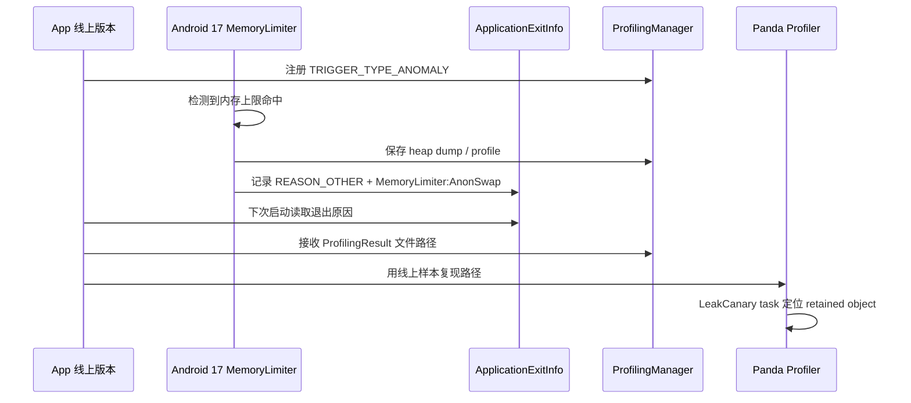

# 23.9 Android 17 App Memory Limits 与内存泄漏治理

<!-- outline-start -->
## 要点

### 🔹 Android 17 App Memory Limits 的边界
说明该限制按设备总 RAM 建立应用内存上限，面向所有运行在 Android 17 上的应用；区分系统级极端内存泄漏限制、LMKD 压力杀进程、Java Heap OOM 与 Native/匿名页膨胀。

### 🔹 MemoryLimiter:AnonSwap 的退出归因
围绕 `ApplicationExitInfo.getDescription()`、`REASON_OTHER` 与 `MemoryLimiter:AnonSwap` 字符串建立线上归因路径，说明它能回答的问题和不能单独证明的原因。

### 🔹 TRIGGER_TYPE_ANOMALY 与触发式堆转储
梳理 `ProfilingManager` 触发式采集在内存上限命中时的使用方式，说明 heap dump、trace、隐私与采样成本的工程边界。

### 🔹 Android Studio Panda LeakCanary Profiler 工作流
整理 IDE 内置 LeakCanary task 的适用场景：本地泄漏复现、源码定位、和线上退出归因互补；避免把开发期泄漏检测当成线上监控替代。

### 🔹 内存基线与灰度门禁
定义版本发布前后的 PSS/RSS/Java Heap/Native Heap/Anon Swap 基线，给出按设备 RAM 档位、页面场景和长驻时长拆分的观测维度。

### 🔹 与 OOM 治理、稳定性治理的交叉
把本节定位为 Android 17 行为变更下的实战补充：详见 20.5 OOM 治理、23.1 内存泄漏检测与治理、26.9 ApplicationExitInfo 与进程退出归因。

## 扩展

### 🔸 AOSP MemoryLimiter 源码路径
追踪 Android 17 中 MemoryLimiter 与进程退出记录的具体实现路径，补齐 ActivityManager / ProcessRecord / ApplicationExitInfo 的调用路径。

### 🔸 设备 RAM 档位与阈值策略
整理低内存设备、主流旗舰、平板/桌面窗口化场景下限制命中的差异，避免给出无设备条件的固定阈值。

### 🔸 线上告警与隐私合规
补充 heap dump 采集的用户授权、数据脱敏、上传策略和采样率控制。

<!-- outline-end -->

Android 17 把一类过去容易被归到“低内存被杀”的问题拆了出来：应用会因为超过系统按设备 RAM 设定的内存上限而退出。官方文档把这个机制描述为面向极端内存泄漏和异常内存膨胀的保护网，目标是在 UI 卡顿、电量消耗放大、系统不稳定之前切断异常进程。[已验证: 官方文档, developer.android.com/about/versions/17/behavior-changes-all#app-memory-limits]

这节不重复 20.5 的 OOM 分类，也不重写 23.1 的泄漏检测原理。这里处理三个实战问题：线上怎么识别这类退出，命中后怎么拿到可分析证据，版本上线前怎么把内存基线纳入灰度门禁。

## Android 17 App Memory Limits 的边界

App Memory Limits 不是 Java Heap 的 `OutOfMemoryError`，也不是 LMKD 在全局内存压力下按 `oom_score_adj` 杀进程。官方说法是：Android 17 会按设备总 RAM 建立应用内存上限，面向所有运行在 Android 17 上的应用，并把当前阈值设得相对保守，用来处理极端泄漏和异常值。[已验证: 官方文档, developer.android.com/about/versions/17/behavior-changes-all#app-memory-limits]

排障时先把四类现象拆开：

| 现象 | 直接信号 | 常见来源 | 处理入口 |
| --- | --- | --- | --- |
| Java Heap OOM | 崩溃堆栈含 `java.lang.OutOfMemoryError` | 集合、图片、缓存、生命周期泄漏 | 20.5、23.1 |
| Native / 匿名页膨胀 | RSS、Native Heap、Anon、Anon Swap 持续上涨 | so 分配、线程栈、mmap、Bitmap、JNI 引用 | 23.3、4.1 |
| LMKD 压力杀 | 退出原因与系统低内存、进程优先级相关 | 全局内存压力、后台进程竞争 | 4.4、20.5 |
| Android 17 MemoryLimiter | `ApplicationExitInfo` 中 `REASON_OTHER` + `MemoryLimiter:AnonSwap` | 进程匿名页或 swap 相关内存持续膨胀 | 本节、26.9、26.12 |

`MemoryLimiter:AnonSwap` 这个名字已经给出排查方向：不要只看 Java Heap 曲线。匿名页、Native 分配、线程栈、图形缓冲、WebView renderer、mmap 缓存都要纳入证据包。[结构参考: Clippings/Android 性能优化 - 原理：掌握 App 运行时的内存模型.md]

## MemoryLimiter:AnonSwap 的退出归因

Android 11 以后，线上进程退出归因的入口是 `ActivityManager.getHistoricalProcessExitReasons()`。Android 17 的 App Memory Limits 命中后，官方文档要求检查 `ApplicationExitInfo.getDescription()`：`getReason()` 为 `REASON_OTHER`，`description` 包含 `MemoryLimiter:AnonSwap`。[已验证: 官方文档, developer.android.com/about/versions/17/behavior-changes-all#app-memory-limits]

`ApplicationExitInfo.java` 中 `REASON_OTHER` 的注释也说明，这类退出要依赖 `getDescription()` 补充系统给出的原因。[已验证: AOSP main, frameworks/base/core/java/android/app/ApplicationExitInfo.java]

这段代码只做归因筛选，重点是三处：`reason`、`description`、`pss/rss` 快照。它不能替代泄漏分析。

```kotlin
fun findAndroid17MemoryLimitExits(context: Context): List<ApplicationExitInfo> {
    val am = context.getSystemService(ActivityManager::class.java)
    return am.getHistoricalProcessExitReasons(null, 0, 20)
        .filter { exit ->
            exit.reason == ApplicationExitInfo.REASON_OTHER &&
                exit.description?.contains("MemoryLimiter:AnonSwap") == true
        }
}
```

命中后，把以下字段随稳定性事件一起上报：

- `timestamp`：退出发生时间，用来和版本、灰度、实验分组、前后台状态关联。
- `processName` / `packageName`：区分主进程、WebView 独立进程、推送进程、图片编辑/直播等重内存进程。
- `pss` / `rss`：退出前系统记录的内存快照，用来判断是共享页还是常驻页上升。
- `description`：保留完整字符串，不只保留布尔标记，后续系统版本可能追加细分信息。
- `traceInputStream`：若系统提供 trace 或 tombstone 输入流，按 26.9 的证据包规则归档。

这个信号能回答“本次退出是否属于 Android 17 内存上限命中”。它不能单独回答“哪一行代码泄漏”。下一步要回到 PSS/RSS 曲线、heap dump、Native allocation、线程数、`/proc/<pid>/smaps` 分类和页面路径复现。

## TRIGGER_TYPE_ANOMALY 与触发式堆转储

Android 17 的 `ProfilingTrigger.TRIGGER_TYPE_ANOMALY` 适合处理 MemoryLimiter 这类难复现问题。API reference 标注该常量 added in API 37，触发条件是系统检测到应用异常行为；Android 17 Beta 4 文档说明，在应用超过系统定义的内存限制时，anomaly trigger 会给应用提供特定于该应用的 heap dump，用于定位内存问题。[已验证: 官方文档, developer.android.com/reference/android/os/ProfilingTrigger][已验证: 官方博客, developer.android.com/blog/posts/the-fourth-beta-of-android-17]

触发式采集的工作方式是系统后台按采样策略运行 trace；触发事件发生时，如果应用已注册且限流允许，系统把触发前后的 profile 保存到应用目录，并通过 `registerForAllProfilingResults()` 回调结果路径。官方文档明确提醒：文件路径应以 `ProfilingResult.getResultFilePath()` 为准，因为目录结构可能变化。[已验证: 官方文档, developer.android.com/topic/performance/tracing/profiling-manager/trigger-based-capture]

下面的代码用于注册 Android 17 anomaly trigger。生产环境要加版本判断、采样策略和上传限制。

```kotlin
@RequiresApi(37)
fun registerMemoryAnomalyProfiling(
    context: Context,
    executor: Executor,
    onProfileReady: (Path) -> Unit,
) {
    val profilingManager = context.getSystemService(ProfilingManager::class.java)
    val trigger = ProfilingTrigger.Builder(ProfilingTrigger.TRIGGER_TYPE_ANOMALY)
        .setRateLimitingPeriodHours(24)
        .build()

    profilingManager.registerForAllProfilingResults(executor) { result ->
        if (result.errorCode == ProfilingResult.ERROR_NONE) {
            onProfileReady(Path.of(result.resultFilePath))
        }
    }
    profilingManager.addProfilingTriggers(listOf(trigger))
}
```

这段注册代码只解决“命中时拿证据”。证据能否上传、保留多久、谁能查看，要交给平台侧策略处理。heap dump 可能包含对象内容、URL、用户输入片段和业务标识；默认不应全量上传。更稳的做法是：灰度包开启低比例采集，端侧先计算摘要，命中白名单场景再上传原始文件，并在服务端设置过期清理。

## Android Studio Panda LeakCanary Profiler 工作流

Android Studio Panda 把 LeakCanary 集成进 Profiler，作为 IDE 内的独立 task，并和源码上下文结合。它的价值在开发期：复现页面路径、抓 heap dump、看 retained object、回到源码修引用关系。[已验证: 官方文档, developer.android.com/about/versions/17/behavior-changes-all#app-memory-limits]

它不替代线上监控。线上 MemoryLimiter 命中时，应用进程已经处在系统限制附近；本地 LeakCanary 更适合把线上归因转成可复现用例。

推荐流程：

1. 从线上事件挑样本：筛 `description` 含 `MemoryLimiter:AnonSwap` 的退出，按设备 RAM、进程名、页面路径、版本号分桶。
2. 在本地构造路径：还原同一页面、登录状态、图片数量、WebView 页面、后台停留时长和横竖屏/窗口化状态。
3. 用 Panda Profiler 跑 LeakCanary task：确认 retained object、GC Root、引用路径和源码位置。
4. 同时观察 RSS / Native Heap / Graphics：如果 Java retained object 不高，转向 Native、Bitmap、线程栈或 WebView renderer。
5. 修复后跑长驻回归：同一路径循环打开/关闭，比较 PSS、RSS、Java Heap、Native Heap、Anon Swap 的斜率。

[结构参考: Clippings/Android 性能优化 - 物理内存优化实战：Java Heap 内存优化.md][结构参考: Clippings/Android 性能优化 - Native 内存优化（上）：so 库申请的内存优化.md][结构参考: Clippings/Android 性能优化 - 虚拟内存优化（上）：线程+多进程优化.md]

## 内存基线与灰度门禁

Android 17 之后，内存基线不能只写“平均 PSS”。MemoryLimiter 面向极端值，门禁也要看尾部样本和增长斜率。

| 维度 | 建议记录 | 判定方式 |
| --- | --- | --- |
| 设备 RAM 档位 | 4GB 以下、6GB、8GB、12GB+，平板/桌面窗口化单独分组 | 不跨档位比较绝对值 |
| 进程 | 主进程、WebView renderer、播放器/图片编辑/推送进程 | 每个进程单独建基线 |
| 页面路径 | 冷启动、首页停留、信息流滚动、详情页来回、后台恢复 | 同路径比较 P50/P90/P99 与增长斜率 |
| 内存指标 | PSS、RSS、Java Heap、Native Heap、Graphics、Anon Swap | 指标同时上升时优先看匿名页和 Native |
| 时间窗口 | 5 分钟、30 分钟、2 小时、隔夜后台 | 长驻场景看斜率，不只看峰值 |
| 退出证据 | `ApplicationExitInfo.reason/description/pss/rss` | `MemoryLimiter:AnonSwap` 单独建稳定性事件 |

灰度门禁建议按“是否出现新型退出”和“是否显著抬高尾部内存”两条线执行：

- Android 17 设备出现 `MemoryLimiter:AnonSwap`：阻断继续放量，先完成样本归因。
- 同版本同页面 P99 RSS 或 Anon Swap 斜率明显高于上一版：暂停放量，补复现场景。
- Java Heap 稳定但 RSS 持续上涨：优先查 Native 分配、线程栈、mmap、Bitmap、WebView renderer。
- 只在低 RAM 档位出现：检查缓存上限、图片规格、后台任务、`onTrimMemory()` 释放策略。

官方 memory guide 给出的方向仍然有效：收到 `onTrimMemory()` 后按等级释放 UI 缓存、后台资源和数据库连接；Android 会给每个应用设置 heap 上限，多进程并不能消除系统总内存约束。[已验证: 官方文档, developer.android.com/topic/performance/memory]

## 与 OOM 治理、稳定性治理的交叉

本节只覆盖 Android 17 新退出信号和取证路径。修复动作要回到已有章节：

- Java / Kotlin 对象泄漏：详见 23.1。这里补充的是 MemoryLimiter 命中后的样本筛选和 Panda Profiler 复现流程。
- Java Heap、Native、线程数、FD、32 位虚拟地址空间 OOM：详见 20.5。这里不重复 OOM 投递路径。
- 低内存杀进程与 LMKD：详见 4.4。MemoryLimiter 命中不能直接等同于系统全局低内存。
- 线上退出归因：详见 26.9。这里补充 `MemoryLimiter:AnonSwap` 的特定筛选条件。
- ProfilingManager 与 ProfilingTrigger 版本能力：详见 26.12。这里只落到内存上限命中的采集策略。
- Android Studio Profiler / LeakCanary task：详见 14.14。这里把 IDE 工作流接到线上样本回放。



图里的两个证据源要分开看：`ApplicationExitInfo` 负责确认退出类别，`ProfilingManager` 负责补触发前后的分析材料。Panda Profiler 负责本地复现和源码定位。

## AOSP MemoryLimiter 源码路径

当前已核到两条公开源码路径：

- `frameworks/base/core/java/android/app/ApplicationExitInfo.java`：`REASON_OTHER` 和 `getDescription()` 是应用侧读取退出原因的 API 边界。[已验证: AOSP main, frameworks/base/core/java/android/app/ApplicationExitInfo.java]
- `packages/modules/Profiling/framework/java/android/os/ProfilingManager.java`、`ProfilingTrigger.java`：触发式 profiling 的注册、回调、限流和触发对象在 Profiling module 中实现。[已验证: AOSP main, packages/modules/Profiling/framework/java/android/os/]

MemoryLimiter 本身与 `AnonSwap` 字符串写入位置还没有在公开 AOSP tag 中完成定位，本节不编源码调用栈。后续复核方向：ActivityManager 退出记录、进程资源监控、memory cgroup / swap accounting、Profiling anomaly 服务之间的连接点。[待验证: Android 17 MemoryLimiter AOSP 具体实现路径]

## 设备 RAM 档位与阈值策略

官方没有公开固定阈值，正文也不应给出“超过 X MB 就会被杀”的数字。工程上按设备档位建自己的风险线：

- 低 RAM 设备：缓存、图片、WebView、长驻后台任务更容易把尾部样本推高，门禁以 P90/P99 和斜率为主。
- 主流旗舰：绝对内存更高，但多窗口、桌面模式、相机/视频/AI 推理同时运行时，RSS 和 Graphics 更容易被忽略。
- 平板和桌面窗口化：多个 Activity、多个窗口和更长后台停留时间会改变复现路径，不能直接套手机基线。

同一指标跨设备比较时，先按 RAM 档位、page size、刷新率、页面路径和进程拆分。没有这些条件，固定阈值只会制造误报。

## 线上告警与隐私合规

MemoryLimiter 命中属于稳定性事件，但 heap dump 属于高敏感证据。推荐把采集分成三层：

- 默认层：只上报 `ApplicationExitInfo` 摘要、版本、设备档位、页面路径、PSS/RSS、前后台状态。
- 诊断层：灰度或内部用户开启 `TRIGGER_TYPE_ANOMALY`，采样收集 profile 文件路径和大小。
- 原始证据层：上传 heap dump 前做授权、脱敏、加密、过期清理，并限制访问权限。

发布门禁只依赖默认层就能发现问题；诊断层和原始证据层用于定位原因，不应变成常态化全量采集。

## 小结

Android 17 App Memory Limits 把极端内存膨胀变成了可归因的线上事件：`REASON_OTHER` 加 `MemoryLimiter:AnonSwap` 用来识别退出，`TRIGGER_TYPE_ANOMALY` 用来补触发式证据，Panda Profiler 用来把线上样本还原成本地泄漏修复路径。治理重点不在背系统阈值，而在建立按设备、进程、页面和长驻时间拆分的内存基线。

## 参考资料

- Android Developers: Behavior changes: all apps — App memory limits
- Android Developers Blog: The Fourth Beta of Android 17
- Android Developers: `ProfilingTrigger` API reference
- Android Developers: Trigger-based profiling
- Android Developers: Manage your app's memory
- AOSP: `frameworks/base/core/java/android/app/ApplicationExitInfo.java`
- AOSP: `packages/modules/Profiling/framework/java/android/os/ProfilingManager.java`
- AOSP: `packages/modules/Profiling/framework/java/android/os/ProfilingTrigger.java`
- [结构参考: Clippings/Android 性能优化 - 原理：掌握 App 运行时的内存模型.md]
- [结构参考: Clippings/Android 性能优化 - 物理内存优化实战：Java Heap 内存优化.md]
- [结构参考: Clippings/Android 性能优化 - Native 内存优化（上）：so 库申请的内存优化.md]
- [结构参考: Clippings/Android 性能优化 - 虚拟内存优化（上）：线程+多进程优化.md]
