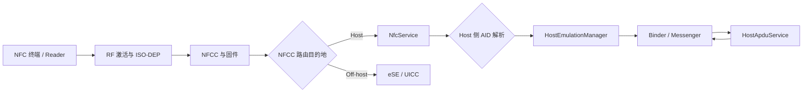

# Android 17 NFC 性能：标签读取、HCE 与无接触支付

NFC（Near Field Communication，近场通信）既可以读取标签，也可以让手机模拟一张卡。本文以 Android 17（API 37，AOSP 标签 `android-17.0.0_r1`）为版本基线，覆盖标签读取、读卡模式（Reader Mode）、主机卡模拟（Host Card Emulation，HCE）和非主机卡模拟（off-host card emulation）。off-host 模式把交易交给安全元件（Secure Element，SE），不由普通应用进程处理。

Android 17 的 NFC 框架和系统服务源码位于 `packages/modules/Nfc`。旧路径 `frameworks/base/core/java/android/nfc/` 与 `packages/apps/Nfc/` 不包含当前完整实现，不能作为 Android 17 的唯一源码入口。

一次无接触支付会经过支付终端、手机的射频控制器、Android NFC 服务、钱包应用或 SE、收单系统和支付网络。Android 文档与 AOSP 源码只能说明手机一侧的分发、路由、服务绑定和数据传递；固定响应时间、成功率、离线额度等指标由具体终端和支付协议决定。性能目标要在目标设备、终端和协议组合上测量。

## 1. 三条 NFC 路径

标签分发（tag dispatch）由系统解析标签并向匹配的 Activity 发送 `Intent`；Reader Mode 则让前台 Activity 通过回调直接取得 `Tag`。NDEF（NFC Data Exchange Format）是 NFC Forum 定义的标签消息格式。卡模拟使用应用协议数据单元（Application Protocol Data Unit，APDU）交换命令与响应，并用应用标识符（Application Identifier，AID）选择卡应用。

| 模式 | 手机扮演的角色 | Android 应用入口 | 数据经过应用进程吗 | 常见场景 |
| --- | --- | --- | --- | --- |
| 标签分发 / Reader Mode | 读卡器 | NFC `Intent`、`ReaderCallback`、`TagTechnology.transceive()` | 经过 | 读标签、门禁读卡、设备配网 |
| HCE | 卡片 | `HostApduService.processCommandApdu()` | 经过 | 软件卡、商户专用储值卡、部分钱包方案 |
| Off-host card emulation | 卡片 | `OffHostApduService` 只声明 AID 与路由信息 | 交易 APDU 不经过 | 嵌入式安全元件（eSE）或 SIM 类安全模块（UICC）中的卡应用 |

表中的关键区别是交易数据是否进入应用进程。HCE 的 APDU 会交给 `HostApduService`，应用启动与执行时间会影响响应；off-host 的 APDU 由 SE 处理，Android 应用只负责声明路由，无法观察 SE 内部的每一步耗时。

这张流程图标出了 HCE 与 off-host 分流的位置。NFCC 是 NFC 控制器（NFC Controller），负责射频收发和底层协议；ISO-DEP 是基于 ISO/IEC 14443-4 的数据交换协议：



NFCC 路由表先把选择应用的 `SELECT AID` 命令指向主处理器（host）或 SE。Host 路由进入 `NfcService` 后，`RegisteredAidCache` 与 `HostEmulationManager` 再从已注册的 HCE 服务中选择目标组件；off-host 路由则把 APDU 交给 SE。省去应用处理环节并不等于端到端延迟固定，终端、射频、SE 中的卡应用和支付协议仍会影响结果。

## 2. HCE 交易的延迟来自哪些阶段

一次 HCE 交易可以拆成六个可观测阶段：

1. **射频发现与激活**：终端持续发出轮询帧，手机进入射频场后完成多卡冲突检测和 ISO-DEP 连接。天线、手机摆放位置、NFCC 固件和终端参数都会影响这一段。
2. **AID 路由**：终端发送 `SELECT AID`，Android 根据已注册服务、默认钱包、前台偏好和设备状态选择目标。
3. **服务就绪**：首选支付服务一般已经由 NFC 进程绑定；普通 HCE 服务可能在首个 `SELECT AID` 到达后才绑定，未运行进程的启动时间会计入这一段。
4. **APDU 处理**：`HostApduService` 在应用主线程收到命令，生成同步响应，或把耗时工作交给其他线程后调用 `sendResponseApdu()`。
5. **响应回传**：应用通过基于 Binder 的消息通道 `Messenger`，把响应 APDU（R-APDU）返回 `HostEmulationManager`，再经原生 NFC 协议栈、NFCC 和射频送回终端。NCI（NFC Controller Interface）是主处理器与 NFCC 之间的标准命令接口。
6. **支付协议与外部系统**：钱包后端、支付令牌（token，用来代替真实卡号的受限凭据）、持卡人验证、收单系统和终端界面不属于 AOSP 的 APDU 分发过程。

Android 17 的 `HostEmulationManager` 状态机记录了路由与服务绑定过程：

- 激活后从空闲状态 `STATE_IDLE` 进入等待选择命令的 `STATE_W4_SELECT`。
- 系统解析 `SELECT AID`；已有服务连接时立即转发，没有连接时保存该 APDU，并进入等待服务的 `STATE_W4_SERVICE`。
- `onServiceConnected()` 收到绑定结果后，再发送缓存的 `SELECT AID`。
- APDU 转发时进入传输状态 `STATE_XFER`；只有当前活动服务返回的非空响应才会交给 `NfcService.sendData()`。
- 射频链路断开或 AID 切换时，系统调用 `onDeactivated()` 并清理活动服务状态。

首个 APDU 慢而后续 APDU 正常时，先检查进程启动和服务绑定；每个 APDU 都慢时，检查应用计算、锁竞争、存储访问和异步依赖。

### 首选支付服务可减少首次绑定等待

`HostEmulationManager.bindPaymentServiceLocked()` 使用 `BIND_AUTO_CREATE` 绑定当前首选支付服务，并保留独立的 `mPaymentService` 连接。普通服务可能等到 AID 命中后才临时绑定。系统会在支付服务死亡后尝试重新绑定；应用仍要处理进程重建、内存状态丢失和支付令牌失效，不能假定进程始终存活。

从 Android 15 开始，`CATEGORY_PAYMENT` 类别通常由默认钱包角色持有者（Wallet role holder）处理；前台 Activity 也可以用 `CardEmulation.setPreferredService()` 临时指定服务。AID 组（AID group）是一组必须整体路由到同一服务的标识符，系统同一时刻只启用一个支付类别 AID 组。钱包角色、AID 或用户选择配置错误时，APDU 不会到达目标服务，调整应用执行速度也无效。

## 3. Android 17 / API 37 的 NFC 变化

API 37 的官方差异页列出了 `NfcAdapter`、`NfcAdapter.ReaderCallback` 和 `NfcAntennaInfo` 的变化：

| 变化 | 适用对象 | 工程含义 |
| --- | --- | --- |
| NFC `Intent`（系统分发给应用的消息对象）限制 | `targetSdkVersion > BAKLAVA`，也就是以 API 37 或更高版本为目标的应用 | 接收 Activity 必须以 `android.permission.DISPATCH_NFC_MESSAGE` 保护；处于 stopped 状态的应用不接收 NFC `Intent` |
| `ACTION_TAG_DISCOVERED` 废弃 | 标签分发应用 | 改用更具体的 `ACTION_NDEF_DISCOVERED` 或 `ACTION_TECH_DISCOVERED` |
| `ReaderCallback.onTagLost(Tag)` | Reader Mode 应用 | API 37 可以收到标签离场回调；它是带空实现的默认方法，旧实现无需立即增加方法 |
| `allowOneTransaction()` | 首选 HCE 服务 / 默认钱包角色持有者 | Observe Mode 开启时临时允许一笔交易，交易结束或射频场消失后恢复 Observe Mode |
| 退出帧（exit frame）与 Reader Mode 注释帧查询 | 钱包、终端模拟与设备集成 | 使用前查询设备能力；具体行为依赖 NFCC 固件 |
| NFC 节电模式查询与设置 | 系统或特权集成 | 设置接口需要 `NFC_SET_CONTROLLER_ALWAYS_ON`；普通应用不能用它控制省电 |
| `NfcAntennaInfo.isDeviceFoldable()` 废弃 | 展示天线位置的界面 | 不再根据该布尔值推断设备形态 |

表格将标签分发、读卡、支付和特权硬件控制分开。新增方法出现在 API 37 SDK 中，并不表示所有 NFC 设备都支持对应硬件能力；带 `is...Supported()` 的功能仍要先查询。

官方差异页还列出 `getGestureExchangeAid()`。它需要 `PERFORM_GESTURE_EXCHANGE` 权限，用于 Tap to Share，不是支付 APDU 优化接口。部分参考页把节电模式和退出帧 API 标为 Android API 36.1，API 37 的 36→37 差异页也收录了这些符号。面向 Android 17 时使用 API 37 SDK 编译；若还要覆盖 API 36.1，则按对应 SDK 版本与功能开关判断，不能只检查硬件能力。

### 3.1 目标 SDK 37 的 NFC `Intent` 适配

这个 Manifest 片段接收一种明确媒体类型（MIME type）的 NDEF 标签：

```xml
<uses-permission android:name="android.permission.NFC" />
<uses-feature
    android:name="android.hardware.nfc"
    android:required="true" />

<application>
    <activity
        android:name=".NdefActivity"
        android:exported="true"
        android:permission="android.permission.DISPATCH_NFC_MESSAGE">
        <intent-filter>
            <action android:name="android.nfc.action.NDEF_DISCOVERED" />
            <category android:name="android.intent.category.DEFAULT" />
            <data android:mimeType="application/vnd.example.asset" />
        </intent-filter>
    </activity>
</application>
```

`DISPATCH_NFC_MESSAGE` 写在 Activity 的 `android:permission` 上，表示启动该组件的调用方必须持有这项签名级权限。普通应用无需申请，也无法按普通运行时权限取得它；Android NFC 系统服务持有该权限。Android 17 的 `NfcDispatcher.isMatchAdditionalActivityFilters()` 会检查目标 SDK、应用的 stopped 标志和 Activity 声明。尚未由用户启动过或被强行停止（force-stop）的应用处于 stopped 状态，不会收到 NFC `Intent`；用户手动启动应用后才解除该状态。

`ACTION_TAG_DISCOVERED` 是在前两种分发均未匹配时使用的宽泛后备入口，API 37 已将它废弃。应用应优先匹配具体的 NDEF MIME 类型、URI 或标签技术列表。Android 16 起，含 HTTP/HTTPS 链接的 NFC 标签改走 `ACTION_VIEW`；Android 17 会先显示打开链接通知，用户确认后才触发 `ACTION_VIEW`。需要接收自有域名的应用应配置 Android App Links，不再等待 `ACTION_NDEF_DISCOVERED`。

### 3.2 Reader Mode 的标签离场回调

这个示例展示前台 Reader Mode 的生命周期和 API 37 标签离场处理：

```kotlin
class ReaderActivity : AppCompatActivity(), NfcAdapter.ReaderCallback {
    private val adapter by lazy { NfcAdapter.getDefaultAdapter(this) }

    override fun onResume() {
        super.onResume()
        adapter?.enableReaderMode(
            this,
            this,
            NfcAdapter.FLAG_READER_NFC_A or NfcAdapter.FLAG_READER_NFC_B,
            null
        )
    }

    override fun onPause() {
        adapter?.disableReaderMode(this)
        super.onPause()
    }

    override fun onTagDiscovered(tag: Tag) {
        // 把 connect/transceive 交给工作线程，并将 UI 更新切回主线程。
    }

    override fun onTagLost(tag: Tag) {
        // API 37：取消与该 Tag 实例关联的任务和界面状态。
    }
}
```

Reader Mode 只在 Activity 位于前台时启用。API 没有承诺 `ReaderCallback` 在主线程执行，因此回调不应直接更新界面；`TagTechnology.connect()` 和 `transceive()` 等可能阻塞的输入输出（I/O）操作放在应用自己的工作线程，并把界面更新派发到主线程。`Tag` 或 `TagTechnology` 连接也不应保存到 Activity 生命周期之外。

标签离场、手机移动和射频噪声都可能让 `connect()` 或 `transceive()` 抛出 I/O 异常。`onTagLost()` 用于补充任务取消和界面清理，不能替代每次 I/O 的异常处理。

`FLAG_READER_SKIP_NDEF_CHECK` 只适合明确无需 NDEF 解析的专有协议。启用后，平台不会执行 NDEF 检查，也不会像常规流程那样枚举 `Ndef` 标签技术。无条件开启该标志可能使原本依赖 NDEF 的标签无法正常处理。

## 4. HCE 服务：注册、路由与 APDU 延迟敏感路径

### 4.1 服务声明决定系统是否接受它

这个声明注册一个示例 HCE 服务。示例 AID 只用于演示，不代表任何支付网络的正式 AID：

```xml
<service
    android:name=".DemoApduService"
    android:exported="true"
    android:permission="android.permission.BIND_NFC_SERVICE">
    <intent-filter>
        <action android:name="android.nfc.cardemulation.action.HOST_APDU_SERVICE" />
    </intent-filter>
    <meta-data
        android:name="android.nfc.cardemulation.host_apdu_service"
        android:resource="@xml/apdu_service" />
</service>
```

系统扫描 HCE 服务时，会检查应用是否声明 `NFC` 权限，以及服务是否由 `BIND_NFC_SERVICE` 保护。任一条件不满足，`RegisteredServicesCache` 都会忽略该服务。

配套的 XML 把一个示例 AID 组注册给同一服务：

```xml
<host-apdu-service
    xmlns:android="http://schemas.android.com/apk/res/android"
    android:description="@string/hce_service_name"
    android:requireDeviceUnlock="true">
    <aid-group
        android:category="other"
        android:description="@string/hce_aid_group">
        <aid-filter android:name="F0010203040506" />
    </aid-group>
</host-apdu-service>
```

系统只会把整个 AID 组路由给同一服务，不能将组内一部分 AID 分给其他服务。生产支付应用要使用按规范分配的 AID、正确的 `payment` 类别和钱包角色，不能复制示例值上线。

### 4.2 `processCommandApdu()` 运行在主线程

`Looper` 是 Android 线程的消息循环，`Handler` 负责向该循环投递消息。`HostApduService` 使用绑定应用主线程 `Looper` 的 `Handler` 接收 `MSG_COMMAND_APDU`，随后直接调用 `processCommandApdu()`；官方文档也明确说明该回调运行在主线程。能立即算出的响应可以直接返回。需要异步处理时返回 `null`，工作完成后从任意线程调用非阻塞的 `sendResponseApdu()`。

这个骨架展示同步响应、异步响应和链路断开后的取消边界：

```kotlin
class DemoApduService : HostApduService() {
    private val scope = CoroutineScope(SupervisorJob() + Dispatchers.Default)
    private val transactionEpoch = AtomicLong(0L)

    override fun processCommandApdu(
        commandApdu: ByteArray,
        extras: Bundle?
    ): ByteArray? {
        parseCheapCommand(commandApdu)?.let { return buildImmediateResponse(it) }

        val epoch = transactionEpoch.get()
        scope.launch {
            val response = buildResponseFromLocalState(commandApdu)
            if (transactionEpoch.get() == epoch) {
                sendResponseApdu(response)
            }
        }
        return null
    }

    override fun onDeactivated(reason: Int) {
        transactionEpoch.incrementAndGet()
        scope.coroutineContext.cancelChildren()
    }

    override fun onDestroy() {
        scope.cancel()
        super.onDestroy()
    }
}
```

这个骨架只表达线程与生命周期关系，没有实现支付协议。`transactionEpoch` 是本地交易代号：每次停用服务时递增，用来阻止旧交易的异步结果误发到新交易；系统也会丢弃非活动服务或错误状态下的响应。

生产实现还要校验 APDU 长度与字段：CLA 表示命令类别，INS 表示指令，P1/P2 是指令参数，Lc 是命令数据长度，Le 是期望响应长度。返回值还要包含协议状态字，并遵守密钥隔离、重放防护和认证要求。

### 4.3 APDU 路径的优化顺序

APDU 采用半双工交换：同一时刻只有一方发送，终端发出一条命令后等待一条响应。Android HCE 只支持一个逻辑通道，耗时任务会延迟同一交易中的后续命令。按以下顺序排查：

1. **确认路由**：核对 AID、类别（category）、钱包角色、前台偏好、解锁要求和亮屏要求。错误路由会表现为服务迟迟收不到首条命令。
2. **减少主线程工作**：解析固定头部时避免反复创建十六进制字符串、JSON 对象和临时集合；不要在回调中访问数据库、文件或网络。
3. **预先加载可安全缓存的数据**：协议允许时，提前读取只读配置、索引和有效支付令牌。缓存仍要遵守密钥策略、有效期、计数器和风控规则。
4. **分别记录异步依赖耗时**：本地存储、硬件密钥操作和后端请求单独计时，不能把网络等待记为 NFC 框架耗时。
5. **在 `onDeactivated()` 清理交易态**：终端移开、AID 切换或链路异常都可能中止交换，迟到响应必须取消。
6. **限制日志与临时对象**：发布版本不要记录完整 APDU、主账号（Primary Account Number，PAN，也就是卡号）、支付令牌、密钥材料或可关联用户的 AID 组合；性能日志只保留命令类型、长度、状态和去标识化延迟。

应用不需要额外启动前台服务来维持 HCE 进程。首选支付服务已有 NFC 系统绑定机制；额外保活会增加功耗与后台限制风险，也不能消除设备、终端和协议差异。

### 4.4 用 Trace 标记应用计算区间

Perfetto 是 Android 的系统追踪工具，`Trace` 可以在记录中创建带名称的时间片。这个示例标记应用生成响应的区间：

```kotlin
override fun processCommandApdu(commandApdu: ByteArray, extras: Bundle?): ByteArray {
    Trace.beginSection("HCE_build_response")
    return try {
        responseEngine.build(commandApdu)
    } finally {
        Trace.endSection()
    }
}
```

该时间片（slice）只覆盖应用计算，不包含此前的射频激活、AID 解析和服务绑定，也不包含响应离开应用后的 NCI 与终端处理。将时间片与系统调度、Binder 事件和外部读卡器时间戳对应起来，才能解释端到端延迟。

## 5. Observe Mode 与 API 37 的单次交易

NFC 终端会循环发送轮询帧（polling frames），寻找附近支持的卡。观察模式（Observe Mode）让手机监听这些帧，但暂不响应终端，也不进入卡交易。它从 Android 15（API 35）开始提供；API 37 增加了单次允许交易、退出帧能力查询和 Reader Mode 注释帧支持。

### `allowOneTransaction()` 的权限边界

`NfcAdapter.allowOneTransaction()` 会临时关闭 Observe Mode，让一笔 HCE 交易继续。Android 17 的 `NfcService` 会检查：

- 特权进程的 UID（Linux 用户标识）可以调用。
- 普通应用的 UID 必须属于当前用户的默认钱包或前台首选支付服务。
- HCE 交易已经激活时，调用会被拒绝。
- `HostEmulationManager` 会在交易结束后恢复 Observe Mode；交易开始前射频场消失时也会恢复。

该方法只控制 Observe Mode 下的一笔 HCE 交易，不会提高 NFC 调度优先级。普通标签应用没有调用资格；钱包也应在轮询序列匹配自身过滤规则后再调用，避免对任意终端放行。

### 退出帧与注释帧依赖控制器能力

退出帧让 NFCC 固件在特定的自动交易轮询过滤器命中时离开 Observe Mode。`isExitFramesSupported()` 只有在固件支持且控制器报告至少一个可用退出帧时才返回 `true`。`isReaderModeAnnotationSupported()` 也来自设备能力。`NfcProprietaryCaps` 会解析控制器上报的厂商能力数据，其中包括节电模式、自动交易过滤器、退出帧数量和 Reader Mode 注释帧支持。

Reader Mode 注释帧是一段由读卡端 Android 设备放入 NFC-A 轮询序列的字节数据。另一台处于 Observe Mode 的 Android 设备会通过 `HostApduService.processPollingFrames()` 收到一个未知类型帧。POS（Point of Sale，销售点支付终端）没有义务识别这种 Android 扩展；它也不能替代 AID 选择、终端支付内核和支付协议协商。

## 6. NFC 节电模式不用于加速支付

API 37 SDK 提供三个接口：

- `isPowerSavingModeSupported()`
- `isPowerSavingModeEnabled()`
- `setPowerSavingMode(boolean)`

`setPowerSavingMode()` 需要签名或特权级的 `NFC_SET_CONTROLLER_ALWAYS_ON` 权限。它设置 NFC 下次关闭时是否进入节电模式；如果 NFC 已关闭，则立即生效。芯片会保持极低功耗而非完全断电，并限制 NFCC 与主处理器通信。模式生效期间，其他 NFC API 不可用。

Android 17 的 `NfcService.setPowerSavingModeInternal()` 会根据当前 NFC 适配器状态临时启停芯片，再调用设备实现。查询 SE 访问权限、准备发送首选支付服务变化事件的代码，在节电模式中也会提前返回。该模式服务于系统待机和硬件集成，不适合在用户靠近终端时动态切换，也不能缩短 HCE 响应时间。

`NfcService.isPowerSavingModeSupported()` 在 NFC 适配器未开启时直接返回 `false`，开启后才向设备抽象层 `DeviceHost` 查询能力。系统集成代码不能把 NFC 关闭状态下得到的 `false` 长期缓存为硬件不支持。

系统集成方评估该模式时，要分别测量：

- NFC 关闭后的静态功耗；
- 从节电模式恢复到可发现状态的时间；
- 不同 NFCC 和固件版本的支持情况；
- 恢复失败、NFC 适配器状态切换和 SE 可用性；
- 屏幕、锁屏、Doze 待机模式与设备厂商电源策略的组合。

普通应用只需根据 NFC 适配器状态和公开能力返回值处理界面，不应通过反射调用隐藏接口，也不应请求无法取得的特权权限。

## 7. HCE 与 off-host 的支付责任边界

| 层 | Android HCE | Off-host Secure Element |
| --- | --- | --- |
| AID 注册 | `host-apdu-service`，可静态或按公开 API 动态注册 | `offhost-apdu-service` 声明已存在于 eSE / UICC 的 AID |
| APDU 执行 | 应用 `HostApduService` | SE 中的卡应用（applet） |
| 服务绑定 | 系统绑定应用服务 | 交易时不会启动或绑定声明用的 Android 服务 |
| 密钥位置 | 由钱包方案决定，可能结合 Android Keystore、可信执行环境（TEE）或服务端 | 通常由 SE 安全域与 applet 管理 |
| Android 可观测点 | 服务绑定、Binder、应用 Trace、NFC 服务日志 | 路由和交易事件可见，applet 内部耗时一般不可见 |

表中的 `OffHostApduService` 只是路由声明，交易时不会启动该 Android Service。它不能代替 SE 处理 APDU。Android 的卡模拟 API 也不提供任意控制 SE 交易 APDU 的能力。OMAPI（Open Mobile API）是应用访问 SE 的另一套接口，受独立访问规则约束，不能与 NFC 终端侧的 APDU 通道混用。

支付令牌化（tokenization，用受限令牌替代真实卡号）、动态密码、持卡人验证、离线额度、风险控制、收单结果和终端认证都由具体支付方案决定。AOSP 没有提供统一配置这些策略的公开 NFC API，应用不能把某个支付方案的规则写成 Android 平台能力。

## 8. 可复现的性能测量

### 8.1 时间点要来自两端

只记录 `processCommandApdu()` 的耗时，会漏掉服务首次绑定和射频通信。至少记录这些时间点：

| 时间点 | 采集位置 | 能回答的问题 |
| --- | --- | --- |
| `T_field` | 外部读卡器 / NFC 协议分析仪 | 手机何时进入射频场 |
| `T_select_tx` | 外部读卡器 | 终端何时发出 `SELECT AID` |
| `T_apdu_in` | `HostApduService` | 命令何时到达应用 |
| `T_response_ready` | 应用 Trace | 应用何时生成响应 |
| `T_response_rx` | 外部读卡器 | 终端何时收到 R-APDU |
| `T_deactivate` | 应用与系统日志 | 链路何时结束、为何结束 |

`T_apdu_in - T_select_tx` 包含 Android 路由和可能的服务绑定；`T_response_ready - T_apdu_in` 是应用生成响应的区间；`T_response_rx - T_response_ready` 包含 Binder、NCI、NFCC 和射频回传。两端时钟无法同步时，用同一测试动作的序号和相对间隔关联记录，不应给出无法证实的亚毫秒精度。

### 8.2 Android 侧只读诊断

这些只读命令保存 NFC 适配器、路由、HCE 绑定和关键日志状态，不会修改 NFC 配置：

```bash
adb shell cmd nfc status
adb shell dumpsys nfc > nfc-dumpsys.txt
adb shell cmd nfc help
adb logcat -v threadtime \
  -s NfcService NfcHostEmulationManager RegisteredAidCache CardEmulationManager
```

`dumpsys nfc` 在 Android 17 会输出 NFC 适配器状态、屏幕状态、节电模式、Observe Mode、轮询与监听技术、当前发现参数、卡模拟管理器、路由表和 NFC 事件日志。`cmd nfc help` 还会列出修改 Observe Mode、Reader Mode、路由与控制器常开状态的命令，其中多数需要 `root`（超级用户）权限，只适合受控测试设备；日常排查使用 `status` 与 `dumpsys` 即可。

Android 17 的 HCE 源码在对应功能开关（feature flag）启用时，还会写入 `hce_active`、`hce_bind_payment_service`、`hce_bind_service`、`hce_command_apdu`、`hce_response_apdu` 和 `hce_polling_frames` 异步 Trace。`hce_command_apdu` 从系统发送命令开始，到应用 `Handler` 完成回调并回复确认消息（ACK）为止；应用返回 `null` 后继续执行的异步工作不在这个区间中。`hce_response_apdu` 覆盖应用发送响应到系统回复 ACK 的过程。设备构建未启用相应功能开关时，缺少这些时间片不能证明 NFC 没有工作。

### 8.3 指标按场景分组

保存分位数与错误分类，不要只报平均值：

- 首个 `SELECT AID` 到应用的 P50、P95 和 P99，即 50%、95% 和 99% 样本不超过的耗时；
- 各类命令 APDU（C-APDU）的应用处理与端到端往返分布；
- 进程尚未启动、进程已在运行、首选支付服务和普通 HCE 服务；
- 屏幕开关、锁屏、用户已解锁、默认钱包角色与前台偏好；
- 手机型号、NFCC、固件、终端型号、终端配置和持机姿态；
- 成功、AID 未路由、需要解锁、服务绑定失败、链路丢失和终端超时；
- CPU 调度延迟、主线程阻塞、内存分配量、垃圾回收（GC）、本地存储与后端请求。

同一次实验只改变一个变量，记录系统版本、NFC 模块版本、应用版本和测试卡配置。支付终端自身有协议超时和重试策略，Android 没有公开统一的 APDU 响应时限；目标值应来自所用协议、认证要求和目标终端组合。

## 9. 故障现象与定位入口

| 现象 | 优先检查 |
| --- | --- |
| 目标 SDK 改为 37 后，NFC 标签不再启动 Activity | Activity 的 `DISPATCH_NFC_MESSAGE` 保护、应用是否被强行停止、NDEF 或标签技术过滤器 |
| HCE 服务从未收到 `SELECT AID` | AID、类别、钱包角色、前台偏好、锁屏与亮屏要求、路由表 |
| 只有首个 APDU 慢 | `hce_bind_service`、进程启动、类初始化、首个磁盘读取 |
| 所有 APDU 都慢 | 主线程 Trace、锁竞争、分配与 GC、密钥操作、数据库或网络 |
| 应用已生成响应但终端仍超时 | `Messenger` 回传、NFC 服务状态、NCI、NFCC、射频链路和终端协议 |
| Observe Mode 一直不进入交易 | 调用方是否为钱包或首选服务、是否已有活动交易、控制器与退出帧能力 |
| 只在某款手机失败 | 天线位置、NFCC 能力、固件、厂商 NFC 硬件抽象层（HAL）、休眠与中断 |
| off-host 交易慢但 HCE 正常 | SE 路由、applet、NFC 执行环境（NFCEE）链路、终端和厂商实现 |

应用没有收到回调时，先查看 `dumpsys nfc` 中的已绑定服务、AID 缓存和路由表，再查看应用日志。确认系统已把 AID 路由到目标组件后，才需要分析应用的 APDU 处理时间。

## 10. 内核与厂商实现的边界

内核版本基线为 `android17-6.18-2026-06_r6`。NFC 控制器可能通过 I²C、SPI、UART 等芯片间总线或厂商专用通道连接。驱动、设备树、时钟、电源域、中断请求（IRQ）和挂起/恢复（suspend/resume）行为，还可能来自芯片系统（SoC）或设备厂商（OEM）的私有分支。Android common kernel 标签只提供共用内核的分析起点，不能证明某款设备使用哪个 NFC 驱动。

出现这些证据时，再检查内核与厂商实现：

- NFCC IRQ 长时间得不到调度；
- 总线传输出现异常重试、超时或运行时电源管理（runtime PM）唤醒延迟；
- 系统挂起并恢复后，NFCC 状态丢失；
- 原生 NFC 协议栈已发出命令，但厂商 HAL 或传输层没有响应；
- 问题只跟某个 NFCC、固件或 OEM 构建相关。

AID 选择、HCE 服务绑定、`processCommandApdu()` 主线程和钱包角色属于 Android 框架或 NFC 模块行为，不能从内核调度器状态直接推导。跨层排查时保留同一交易序号，使应用 Trace、NFC 日志、HAL 日志、内核事件和外部读卡器记录能够相互对应。

## 11. 安全不能用时延换取

HCE 服务由 `BIND_NFC_SERVICE` 保护，只允许 Android 系统绑定，从而让 APDU 通过 NFC 系统进入应用。该权限不会替应用完成支付协议认证、密钥保护、支付令牌生命周期或重放防护。

性能改动至少要守住以下约束：

- 不把密钥、PAN、完整 APDU、动态密码或可关联账户的支付令牌写入日志；
- 不为减少一次 I/O 而延长支付令牌有效期、复用计数器或跳过状态校验；
- 不在 `onDeactivated()` 后发送旧交易的响应；
- 不把服务端失败映射成成功状态字；
- 不因追求冷启动速度而导出无保护组件、放宽 `BIND_NFC_SERVICE` 或解锁要求；
- 按支付方案的认证要求和目标终端集合验证性能版本，不能只依赖两台 Android 手机之间的对测。

## 12. Android 17 迁移与评审清单

- [ ] 源码锚定 `packages/modules/Nfc` 的 `android-17.0.0_r1`。
- [ ] 目标 SDK 为 37 的 NFC `Intent` Activity 使用 `DISPATCH_NFC_MESSAGE` 保护。
- [ ] 已移除 `ACTION_TAG_DISCOVERED` 依赖，URL 标签按 Android App Links 处理。
- [ ] Reader Mode 只注册必要技术，正确处理 I/O 异常与 `onTagLost()`。
- [ ] HCE 服务声明 `BIND_NFC_SERVICE`，AID 组、类别和钱包角色正确。
- [ ] `processCommandApdu()` 主线程无磁盘、数据库和网络阻塞。
- [ ] 异步响应能在 `onDeactivated()` 后取消，不会跨交易发送。
- [ ] Observe Mode、退出帧、注释帧和节电模式都经过能力与权限判断。
- [ ] 外部读卡器与 Android Trace 同时采样，首次绑定与已绑定场景分别统计。
- [ ] 日志不含支付敏感数据，缓存策略没有削弱认证和防重放。
- [ ] 厂商问题按 NFCC、固件、HAL、驱动和内核 `android17-6.18-2026-06_r6` 分层取证。

## 参考资料

- [Android 17 / API 37 android.nfc API diff](https://developer.android.com/sdk/api_diff/37/changes/pkg_android.nfc)
- [Android Developers：NFC basics](https://developer.android.com/develop/connectivity/nfc/nfc)
- [Android Developers：Host-based card emulation](https://developer.android.com/develop/connectivity/nfc/hce)
- [Android Developers：NfcAdapter API](https://developer.android.com/reference/android/nfc/NfcAdapter)
- [Android Developers：ReaderCallback API](https://developer.android.com/reference/android/nfc/NfcAdapter.ReaderCallback)
- [Android Developers：TagTechnology API](https://developer.android.com/reference/android/nfc/tech/TagTechnology)
- [Android Developers：HostApduService API](https://developer.android.com/reference/android/nfc/cardemulation/HostApduService)
- [AOSP `android-17.0.0_r1`：NfcAdapter.java](https://android.googlesource.com/platform/packages/modules/Nfc/+/android-17.0.0_r1/framework/java/android/nfc/NfcAdapter.java)
- [AOSP `android-17.0.0_r1`：HostApduService.java](https://android.googlesource.com/platform/packages/modules/Nfc/+/android-17.0.0_r1/framework/java/android/nfc/cardemulation/HostApduService.java)
- [AOSP `android-17.0.0_r1`：NfcDispatcher.java](https://android.googlesource.com/platform/packages/modules/Nfc/+/android-17.0.0_r1/NfcNci/src/com/android/nfc/NfcDispatcher.java)
- [AOSP `android-17.0.0_r1`：NfcService.java](https://android.googlesource.com/platform/packages/modules/Nfc/+/android-17.0.0_r1/NfcNci/src/com/android/nfc/NfcService.java)
- [AOSP `android-17.0.0_r1`：HostEmulationManager.java](https://android.googlesource.com/platform/packages/modules/Nfc/+/android-17.0.0_r1/NfcNci/src/com/android/nfc/cardemulation/HostEmulationManager.java)
- [AOSP `android-17.0.0_r1`：NfcProprietaryCaps.java](https://android.googlesource.com/platform/packages/modules/Nfc/+/android-17.0.0_r1/NfcNci/src/com/android/nfc/NfcProprietaryCaps.java)
- [AOSP `android-17.0.0_r1`：NfcShellCommand.java](https://android.googlesource.com/platform/packages/modules/Nfc/+/android-17.0.0_r1/NfcNci/src/com/android/nfc/NfcShellCommand.java)
- [Android common kernel：android17-6.18-2026-06_r6](https://android.googlesource.com/kernel/common/+/refs/tags/android17-6.18-2026-06_r6)
