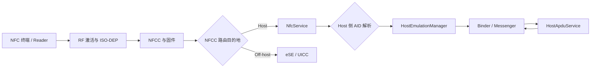

# Android 17 NFC 性能优化与无接触支付

平台锚点为 Android 17 / API 37 / `android-17.0.0_r1`，覆盖 NFC 标签读取、Reader Mode、主机卡模拟（Host Card Emulation，HCE）和 off-host Secure Element 路由。Android 17 中，NFC framework 与系统服务源码都位于 `packages/modules/Nfc`；分析旧路径 `frameworks/base/core/java/android/nfc/` 或 `packages/apps/Nfc/`，会漏掉当前实现。

无接触支付包含终端、射频控制器、Android NFC 服务、钱包应用、Secure Element、收单系统和支付网络。AOSP 能证明 Android 侧的分发、路由、服务绑定与 APDU 传递行为，无法替终端或支付网络承诺固定响应时间、成功率与离线额度。因此不设固定的平台指标，性能目标应由实测数据和业务协议共同确定。

证据分为两类：Android Developers 与 `android-17.0.0_r1` 源码用于解释 Android 侧的路由、服务绑定和 APDU 传递；端到端支付时延与成功率必须在目标终端和支付协议上实测。优化建议聚焦于 Android 侧可观测、可复现的环节，不给出平台无法保证的统一 SLA。

## 1. 先分清三条 NFC 路径

同一部手机上的 NFC 功能可能走三条差异很大的路径：

| 模式 | 手机扮演的角色 | Android 应用入口 | 数据经过应用进程吗 | 常见场景 |
| --- | --- | --- | --- | --- |
| Tag dispatch / Reader Mode | 读卡器 | NFC Intent、`ReaderCallback`、`TagTechnology.transceive()` | 经过 | 读标签、门禁读卡、设备配网 |
| HCE | 卡片 | `HostApduService.processCommandApdu()` | 经过 | 软件卡、商户专用储值卡、部分钱包方案 |
| Off-host card emulation | 卡片 | `OffHostApduService` 只声明 AID 与路由信息 | 交易 APDU 不经过 | eSE / UICC 上的卡应用 |

下面的图用于定位 HCE 与 off-host 分流发生的位置：



NFCC 路由表先把 `SELECT AID` 指向 host 或 Secure Element。Host 路由进入 `NfcService` 后，`RegisteredAidCache` 与 `HostEmulationManager` 再从已注册 HCE 服务中解析目标组件；off-host 路由把 APDU 交给 Secure Element。后者省去了应用处理 APDU 的环节，端到端时延仍会受终端、射频、Secure Element 应用和支付协议影响。

## 2. 一次 HCE 交易的时延花在哪里

把“碰一下很慢”拆成可观测阶段，排查才有方向：

1. **射频发现与激活**：终端轮询、手机进入射频场、抗冲突、ISO-DEP 建链。天线、摆放位置、NFCC 固件和终端参数都在这一段起作用。
2. **AID 路由**：终端发送 `SELECT AID`，系统从已注册服务、钱包角色、前台偏好和设备状态中解析目标。
3. **服务就绪**：首选支付服务通常已经被 NFC 进程绑定；普通 HCE 服务可能在首个 `SELECT AID` 后才绑定，冷进程启动会出现在这里。
4. **APDU 处理**：`HostApduService` 在应用主线程收到命令，生成同步响应，或把耗时工作交给其他线程后调用 `sendResponseApdu()`。
5. **响应回传**：应用经 Messenger 把 R-APDU 返回 `HostEmulationManager`，再经 native NFC 栈、NFCC 和射频送回终端。
6. **协议外等待**：钱包后端、token 生命周期、持卡人验证、收单系统与终端 UI 不属于 AOSP APDU 分发本身。

Android 17 的 `HostEmulationManager` 状态机把前四段写得很直白：

- 激活后从 `STATE_IDLE` 进入 `STATE_W4_SELECT`。
- 系统解析 `SELECT AID`；已有服务连接时立即转发，没有连接时保存该 APDU 并进入 `STATE_W4_SERVICE`。
- `onServiceConnected()` 收到绑定结果后，再发送缓存的 `SELECT AID`。
- APDU 转发时进入 `STATE_XFER`；只有当前活动服务返回的非空响应才会交给 `NfcService.sendData()`。
- 射频链路断开或 AID 切换时，系统调用 `onDeactivated()` 并清理活动服务状态。

这段状态机也解释了两个常见现象。首个 APDU 慢、后续 APDU 正常，优先检查进程和服务绑定；每个 APDU 都慢，优先检查应用计算、锁、存储和异步依赖。

### 首选支付服务为何常比普通 HCE 服务稳定

`HostEmulationManager.bindPaymentServiceLocked()` 使用 `BIND_AUTO_CREATE` 绑定当前首选支付服务，并保留独立的 `mPaymentService` 连接。普通服务在 AID 命中后可能临时绑定。系统会在服务死亡后尝试重新绑定支付服务，不过应用仍需正确处理进程重建、状态丢失与 token 失效，不能假定进程一直存活。

Android 15 起，`CATEGORY_PAYMENT` 的正常入口是 Wallet role holder；前台 Activity 也可通过 `CardEmulation.setPreferredService()` 临时选择服务。Android Developers 的 HCE 文档明确限制同一时刻只能启用一个支付类别 AID group。钱包角色、AID 和用户选择有误时，性能调优不会让 APDU 到达目标服务。

## 3. Android 17 / API 37 的 NFC 变化

API 37 的官方 diff 列出了 `NfcAdapter`、`NfcAdapter.ReaderCallback` 和 `NfcAntennaInfo` 的变化。下面按应用影响归类：

| 变化 | 适用对象 | 工程含义 |
| --- | --- | --- |
| NFC Intent 分发加固 | `targetSdkVersion > BAKLAVA`，即 target 37 及以上的应用 | 接收 Activity 必须以 `android.permission.DISPATCH_NFC_MESSAGE` 保护；处于 stopped 状态的应用不接收 NFC Intent |
| `ACTION_TAG_DISCOVERED` 废弃 | 标签分发应用 | 改用更具体的 `ACTION_NDEF_DISCOVERED` 或 `ACTION_TECH_DISCOVERED` |
| `ReaderCallback.onTagLost(Tag)` | Reader Mode 应用 | 可在 API 37 获取已发现标签离场回调；它是 default 方法，不会迫使旧实现立即补方法 |
| `allowOneTransaction()` | 首选 HCE 服务 / Wallet role holder | Observe Mode 开启时临时允许一笔交易，交易结束或射频场消失后恢复 Observe Mode |
| exit frame 与 Reader Mode annotation 查询 | 钱包、终端模拟与设备集成 | 必须先查询设备能力；行为依赖 NFCC 固件 |
| NFC power-saving mode 查询与设置 | 系统或特权集成 | 设置接口需要 `NFC_SET_CONTROLLER_ALWAYS_ON`，普通应用不能把它当作省电开关 |
| `NfcAntennaInfo.isDeviceFoldable()` 废弃 | 天线位置 UI | 不再用该布尔值推导设备形态 |

API diff 还列出 `getGestureExchangeAid()`。它受 `PERFORM_GESTURE_EXCHANGE` 权限约束，用于 Tap to Share，不属于支付 APDU 优化接口。部分 NFC API 参考页会显示“version 36.1”，而 API 37 的 level-to-level diff 也收录这些符号；应用应使用 API 37 SDK 编译，并同时做版本、feature flag 所对应的平台可用性和硬件能力检查。

### 3.1 target 37 的 NFC Intent 迁移

下面的 Manifest 片段用于接收一种明确 MIME 类型的 NDEF 标签：

```xml
<uses-permission android:name="android.permission.NFC" />
<uses-feature
    android:name="android.hardware.nfc"
    android:required="true" />

<application>
    <activity
        android:name=".NdefActivity"
        android:exported="true"
        android:permission="android.permission.DISPATCH_NFC_MESSAGE">
        <intent-filter>
            <action android:name="android.nfc.action.NDEF_DISCOVERED" />
            <category android:name="android.intent.category.DEFAULT" />
            <data android:mimeType="application/vnd.example.asset" />
        </intent-filter>
    </activity>
</application>
```

`DISPATCH_NFC_MESSAGE` 写在 Activity 的 `android:permission` 上，含义是调用该组件的一方必须持有该签名级权限；普通应用无需、也通常无法获得它。Android 17 的 `NfcDispatcher.isMatchAdditionalActivityFilters()` 会检查 target SDK、应用 stopped 标志和 Activity 声明。应用被用户 force-stop 后收不到 NFC Intent，用户手动启动一次后才会离开 stopped 状态。

`ACTION_TAG_DISCOVERED` 过去是宽泛的兜底入口。API 37 已将它废弃，精确的 NDEF MIME / URI 或 technology filter 能减少错误匹配和选择器干扰。Android 16 起，URL 类型 NFC 标签会触发 `ACTION_VIEW`；这类应用还应配置 App Links，而非等待 `ACTION_NDEF_DISCOVERED`。

### 3.2 Reader Mode 的标签离场回调

下面的示例用于展示前台 Reader Mode 的生命周期和 API 37 标签离场处理：

```kotlin
class ReaderActivity : AppCompatActivity(), NfcAdapter.ReaderCallback {
    private val adapter by lazy { NfcAdapter.getDefaultAdapter(this) }

    override fun onResume() {
        super.onResume()
        adapter?.enableReaderMode(
            this,
            this,
            NfcAdapter.FLAG_READER_NFC_A or NfcAdapter.FLAG_READER_NFC_B,
            null
        )
    }

    override fun onPause() {
        adapter?.disableReaderMode(this)
        super.onPause()
    }

    override fun onTagDiscovered(tag: Tag) {
        // 把 connect/transceive 交给工作线程，并将 UI 更新切回主线程。
    }

    override fun onTagLost(tag: Tag) {
        // API 37：取消与该 Tag 实例关联的任务和界面状态。
    }
}
```

Reader Mode 只在 Activity 位于前台时启用。回调里不应阻塞 UI，也不要把 `Tag` 或 `TagTechnology` 连接长期保存到 Activity 生命周期之外。标签离场、终端移动和射频噪声都会让 `connect()` / `transceive()` 抛出 I/O 异常；`onTagLost()` 能补充状态清理，不能替代 I/O 异常处理。

`FLAG_READER_SKIP_NDEF_CHECK` 只适合确定无需 NDEF 解析的专有协议。它会跳过 NDEF 检查，也会影响系统向应用暴露 `Ndef` technology 的方式。为了缩短一次发现流程而无条件开启该标志，可能破坏标签兼容性。

## 4. HCE 服务：注册、路由与 APDU 热路径

### 4.1 服务声明决定系统是否接受它

下面的声明用于注册一个示例 HCE 服务；示例 AID 属于演示用途，不代表支付网络 AID：

```xml
<service
    android:name=".DemoApduService"
    android:exported="true"
    android:permission="android.permission.BIND_NFC_SERVICE">
    <intent-filter>
        <action android:name="android.nfc.cardemulation.action.HOST_APDU_SERVICE" />
    </intent-filter>
    <meta-data
        android:name="android.nfc.cardemulation.host_apdu_service"
        android:resource="@xml/apdu_service" />
</service>
```

系统扫描 HCE 服务时会校验应用拥有 `NFC` 权限，并校验服务由 `BIND_NFC_SERVICE` 保护。少任意一项，`RegisteredServicesCache` 都会忽略该服务。

下面的 XML 用于把一个示例 AID group 交给同一服务：

```xml
<host-apdu-service
    xmlns:android="http://schemas.android.com/apk/res/android"
    android:description="@string/hce_service_name"
    android:requireDeviceUnlock="true">
    <aid-group
        android:category="other"
        android:description="@string/hce_aid_group">
        <aid-filter android:name="F0010203040506" />
    </aid-group>
</host-apdu-service>
```

一个 AID group 会整体路由给同一服务，不能把组内一部分 AID 分给另一个服务。生产支付应用应使用按规范分配的 AID、正确的 `payment` 类别和钱包角色，不应复制示例值。

### 4.2 `processCommandApdu()` 运行在主线程

`HostApduService` 内部用绑定主 Looper 的 `Handler` 接收 `MSG_COMMAND_APDU`，随后直接调用 `processCommandApdu()`。官方文档也明确标注该回调在应用主线程运行。能立即算出的响应可以直接返回；需要异步处理时返回 `null`，完成后从任意线程调用非阻塞的 `sendResponseApdu()`。

下面的骨架用于展示同步响应、异步响应和链路断开后的取消边界：

```kotlin
class DemoApduService : HostApduService() {
    private val scope = CoroutineScope(SupervisorJob() + Dispatchers.Default)
    private val transactionEpoch = AtomicLong(0L)

    override fun processCommandApdu(
        commandApdu: ByteArray,
        extras: Bundle?
    ): ByteArray? {
        parseCheapCommand(commandApdu)?.let { return buildImmediateResponse(it) }

        val epoch = transactionEpoch.get()
        scope.launch {
            val response = buildResponseFromLocalState(commandApdu)
            if (transactionEpoch.get() == epoch) {
                sendResponseApdu(response)
            }
        }
        return null
    }

    override fun onDeactivated(reason: Int) {
        transactionEpoch.incrementAndGet()
        scope.coroutineContext.cancelChildren()
    }

    override fun onDestroy() {
        scope.cancel()
        super.onDestroy()
    }
}
```

这个骨架只表达线程与生命周期关系，不实现支付协议。`transactionEpoch` 防止旧交易的异步结果误发到新交易；系统侧也会丢弃非活动服务或错误状态下的响应。生产实现还需处理 APDU 长度、CLA / INS / P1 / P2 / Lc / Le、状态字、密钥边界、重放防护和协议认证。

### 4.3 热路径的优化顺序

APDU 是半双工交换：终端发一条命令，然后等待一条响应。Android HCE 只支持单逻辑通道，长任务会阻塞同一交易中的后续命令。优化时可按下面的顺序处理：

1. **让路由正确**：核对 AID、category、Wallet role、前台偏好、解锁要求和亮屏要求。错误路由常被误诊为“首包慢”。
2. **缩短主线程工作**：解析固定头部时避免反复创建十六进制字符串、JSON 对象和临时集合；不要在回调中访问数据库、文件或网络。
3. **预备可安全缓存的数据**：协议允许时，提前加载只读配置、索引和有效 token。缓存不能绕开密钥策略、有效期、计数器和风控。
4. **把异步依赖分层计时**：本地存储、硬件密钥操作和后端请求分别打点。网络耗时不能记成 NFC framework 耗时。
5. **在 `onDeactivated()` 清理交易态**：终端移开、AID 切换或链路异常都可能中止交换，迟到响应必须取消。
6. **控制日志与分配**：发布版本不要打印完整 APDU、PAN、token、密钥材料或可关联用户的 AID 组合；性能日志只保留命令类型、长度、状态和匿名化时延。

应用无需通过前台服务或保活技巧强留 HCE 进程。首选支付服务已有 NFC 系统绑定机制，额外保活会增加功耗和系统限制风险，也不能消除设备、终端与协议差异。

### 4.4 用应用 Trace 标出可控区间

下面的代码用于在 Perfetto 中标记应用生成响应的区间：

```kotlin
override fun processCommandApdu(commandApdu: ByteArray, extras: Bundle?): ByteArray {
    Trace.beginSection("HCE_build_response")
    return try {
        responseEngine.build(commandApdu)
    } finally {
        Trace.endSection()
    }
}
```

该 slice 只覆盖应用计算。它不包含此前的射频激活、AID 解析和服务绑定，也不包含响应离开应用后的 NCI 与终端处理。把 slice 与系统调度、Binder 和外部 reader 时间戳对齐，才能解释端到端延迟。

## 5. Observe Mode 与 API 37 的单次交易

Observe Mode 让 NFC 硬件观察 reader polling frames，同时暂不进入交易。它从 API 35 已存在；API 37 增加了更明确的单次放行、exit frame 能力查询和 Reader Mode annotation 支持。

### `allowOneTransaction()` 的权限边界

`NfcAdapter.allowOneTransaction()` 会临时关闭 Observe Mode，让一笔 HCE 交易继续。Android 17 的 `NfcService` 对调用方执行以下检查：

- 特权 UID 可调用。
- 普通 UID 必须对应当前用户的 Wallet role holder 或首选支付服务。
- HCE 交易已经激活时，调用会被拒绝。
- `HostEmulationManager` 在交易结束后延迟恢复 Observe Mode；射频场丢失也会进入恢复路径。

因此，这个方法不等同于通用的“提高 NFC 优先级”。普通标签应用不能借它抢占支付；钱包也应在识别到符合自身过滤规则的 polling loop 后使用，避免无条件放行。

### Exit frames 与 annotation 都依赖控制器能力

`isExitFramesSupported()` 要求固件支持 exit frames，并且控制器报告的可用数量大于零。`isReaderModeAnnotationSupported()` 同样来自设备能力。`NfcProprietaryCaps` 会从控制器上报的 proprietary capability 数据中解析 power-saving、auto-transact filter、exit frame 数量和 reader annotation 支持。

Reader Mode annotation 用于一个 Android reader 把 NFC-A polling annotation 交给另一台处于 Observe Mode 的 Android 设备，接收端通过 `HostApduService.processPollingFrames()` 获得 unknown frame。它不是任意 POS 都会识别的标准支付加速信号，也不能替代 AID、终端内核与支付协议协商。

## 6. Power-saving mode 不是支付热路径开关

API 37 SDK 暴露以下接口：

- `isPowerSavingModeSupported()`
- `isPowerSavingModeEnabled()`
- `setPowerSavingMode(boolean)`

`setPowerSavingMode()` 需要签名或特权级的 `NFC_SET_CONTROLLER_ALWAYS_ON` 权限。该模式在 NFC 被关闭时让芯片进入极低功耗、但未完全断电的状态，并限制 NFCC 与主处理器通信；官方 API 文档指出，模式生效时其他 NFC API 不可用。

Android 17 的 `NfcService.setPowerSavingModeInternal()` 还会根据当前 adapter 状态临时启停芯片，再调用设备实现。源码中，为“首选支付服务变化”查询 Secure Element 访问权限的路径也会在该模式下提前返回。这个模式面向系统待机与硬件集成，不适合在用户靠近终端时动态切换，更不能作为 HCE 响应优化接口。

`NfcService.isPowerSavingModeSupported()` 在 adapter 未开启时直接返回 `false`，开启后才向 `DeviceHost` 查询能力。系统集成代码不要把 NFC 关闭状态下得到的 `false` 长期缓存为硬件结论。

系统集成方评估该模式时，要分别测量：

- NFC 关闭后的静态功耗；
- 从 power-saving mode 恢复到可发现状态的时间；
- 不同 NFCC 和固件版本的支持情况；
- 恢复失败、adapter 状态切换和 Secure Element 可用性；
- 屏幕、锁屏、Doze 与设备厂商电源策略的组合。

普通应用只需尊重 adapter 状态和能力返回值，不应反射隐藏接口或请求无法获得的特权权限。

## 7. HCE 与 off-host 的支付责任边界

| 层 | Android HCE | Off-host Secure Element |
| --- | --- | --- |
| AID 注册 | `host-apdu-service`，可静态或按公开 API 动态注册 | `offhost-apdu-service` 声明已存在于 eSE / UICC 的 AID |
| APDU 执行 | 应用 `HostApduService` | Secure Element applet |
| 服务绑定 | 系统绑定应用服务 | 交易时不会启动或绑定声明用的 Android 服务 |
| 密钥位置 | 由钱包方案决定，可能结合 Keystore / TEE / 服务端 | 通常由 Secure Element 安全域与 applet 管理 |
| Android 可观测点 | 服务绑定、Binder、应用 Trace、NFC 服务日志 | 路由和交易事件可见，applet 内部耗时通常不可见 |

`OffHostApduService` 是路由声明，不是让 Android Service 代替 Secure Element 处理 APDU。NFC card-emulation API 也不提供任意直接控制 Secure Element 交易 APDU 的能力；OMAPI 是另一套受访问规则约束的接口，不能与 NFC 终端侧 APDU 通道混用。

支付 tokenization、动态密码、持卡人验证、离线额度、风控、收单结果和终端认证均由具体支付方案决定。AOSP 没有提供可统一配置这些策略的公开 NFC API，应用也不应把这些策略表述为同名平台能力。

## 8. 建立可复现的性能测量

### 8.1 时间点要来自两端

只记录 `processCommandApdu()` 的耗时，会漏掉最常见的服务冷绑定和射频问题。建议至少建立这些时间点：

| 时间点 | 采集位置 | 能回答的问题 |
| --- | --- | --- |
| `T_field` | 外部 reader / NFC 分析仪 | 手机何时进入射频场 |
| `T_select_tx` | 外部 reader | 终端何时发出 `SELECT AID` |
| `T_apdu_in` | `HostApduService` | 命令何时到达应用 |
| `T_response_ready` | 应用 Trace | 应用何时生成响应 |
| `T_response_rx` | 外部 reader | 终端何时收到 R-APDU |
| `T_deactivate` | 应用与系统日志 | 链路何时结束、为何结束 |

`T_apdu_in - T_select_tx` 包含 Android 路由和可能的服务绑定；`T_response_ready - T_apdu_in` 是应用可直接控制的区间；`T_response_rx - T_response_ready` 涵盖 Binder、NCI、NFCC 和射频回传。两端时钟无法直接同步时，可用同一测试动作的序号和相对间隔对齐，不要伪造亚毫秒精度。

### 8.2 Android 侧只读诊断

下面的命令用于保存 adapter、路由、HCE 绑定和关键日志状态，不会修改 NFC 配置：

```bash
adb shell cmd nfc status
adb shell dumpsys nfc > nfc-dumpsys.txt
adb shell cmd nfc help
adb logcat -v threadtime \
  -s NfcService NfcHostEmulationManager RegisteredAidCache CardEmulationManager
```

`dumpsys nfc` 在 Android 17 会输出 adapter、屏幕、power-saving、Observe Mode、poll/listen technology、当前 discovery 参数、卡模拟管理器、路由表与 NFC event log。`cmd nfc help` 中涉及 Observe Mode、Reader Mode、routing 和 controller always-on 的修改命令多半要求 root，只适合受控测试设备；日常排查可使用 `status` 与 `dumpsys`。

Android 17 的 HCE 源码在 feature flag 开启时还会写入 `hce_active`、`hce_bind_payment_service`、`hce_bind_service`、`hce_command_apdu`、`hce_response_apdu` 与 `hce_polling_frames` 异步 Trace。`hce_command_apdu` 从系统发送命令开始，到应用 Handler 完成回调并回 ACK 为止；异步返回 `null` 后的工作不在这个区间内。`hce_response_apdu` 覆盖应用发送响应到系统回 ACK 的过程。设备构建没有开启对应 flag 时，不应把缺少这些 slice 判断为 NFC 没有工作。

### 8.3 指标按场景分组

建议保存以下分布，而非只报平均值：

- 首个 `SELECT AID` 到应用的 P50 / P95 / P99；
- 各类 C-APDU 的应用处理与端到端往返分布；
- 冷进程、热进程、首选支付服务和普通 HCE 服务；
- 屏幕开关、锁屏、用户已解锁、Wallet role 与前台偏好；
- 手机型号、NFCC、固件、终端型号、终端配置和持机姿态；
- 成功、AID 未路由、需要解锁、服务绑定失败、链路丢失和终端超时；
- CPU 调度延迟、主线程阻塞、分配量、GC、本地存储与后端请求。

同一次实验只改变一个变量，记录系统版本、NFC 模块版本、应用版本和测试卡配置。支付终端自身有协议超时和重试策略，Android 没有公开统一的 APDU 响应时限；目标值应来自所用协议、认证要求和目标终端组合。

## 9. 故障现象与定位入口

| 现象 | 优先检查 |
| --- | --- |
| target 37 后 NFC 标签不再启动 Activity | Activity 的 `DISPATCH_NFC_MESSAGE` 保护、应用是否 force-stop、NDEF / tech filter |
| HCE 服务从未收到 `SELECT AID` | AID、category、Wallet role、前台偏好、锁屏与亮屏要求、路由表 |
| 只有首个 APDU 慢 | `hce_bind_service`、进程启动、类初始化、首个磁盘读取 |
| 所有 APDU 都慢 | 主线程 Trace、锁竞争、分配与 GC、密钥操作、数据库或网络 |
| 应用已生成响应但终端仍超时 | Messenger 回传、NFC 服务状态、NCI / NFCC、射频链路和终端协议 |
| Observe Mode 一直不进入交易 | 调用方是否为钱包或首选服务、是否已有活动交易、控制器与 exit frame 能力 |
| 只在某款手机失败 | 天线位置、NFCC 能力、固件、vendor NFC HAL / 配置、休眠与中断 |
| off-host 交易慢但 HCE 正常 | Secure Element 路由、applet、NFCEE 链路、终端和厂商实现 |

遇到“应用没有回调”时，先看 `dumpsys nfc` 的已绑定服务、AID cache 和 routing table，再看应用日志。只有系统已把 AID 路由到目标组件，分析应用热路径才有意义。

## 10. 内核与厂商实现的边界

kernel 锚点为 `android17-6.18-2026-06_r6`。NFC 控制器可能通过 I²C、SPI、UART 或厂商专用传输连接，驱动、设备树、时钟、电源域、IRQ 和 suspend/resume 行为也可能来自 SoC 或 OEM 分支。Android common kernel 标签只能约束共用内核侧的分析起点，不能证明某款设备使用哪一个 NFC 驱动。

出现下面的证据时，再进入内核与厂商层：

- NFCC IRQ 长时间得不到调度；
- 总线传输有异常重试、超时或 runtime PM 唤醒延迟；
- suspend/resume 后 NFCC 状态丢失；
- native NFC 栈已发命令，但 vendor HAL / transport 无响应；
- 问题只跟某个 NFCC、固件或 OEM 构建相关。

AID 选择、HCE 服务绑定、`processCommandApdu()` 主线程和 Wallet role 属于 framework / NFC 模块行为，不应从内核调度器直接推导。跨层排查时要保留同一交易序号，让应用 Trace、NFC 日志、HAL 日志、内核事件和外部 reader 记录能够对应。

## 11. 安全不能用时延换取

HCE 服务由 `BIND_NFC_SERVICE` 保护，只允许系统绑定，这能保证 APDU 通过 NFC 系统进入应用。它没有替应用完成支付协议认证、密钥保护、token 生命周期或重放防护。

性能改动至少要守住以下约束：

- 不把密钥、PAN、完整 APDU、动态密码或可关联账户的 token 写入日志；
- 不为减少一次 I/O 而延长 token 有效期、复用计数器或跳过状态校验；
- 不在 `onDeactivated()` 后发送旧交易的响应；
- 不把服务端失败映射成成功状态字；
- 不因追求冷启动速度而导出无保护组件、放宽 `BIND_NFC_SERVICE` 或解锁要求；
- 用支付方案的认证要求与目标终端集合验证性能版本，不能只用两台 Android 手机互刷。

## 12. Android 17 迁移与评审清单

- [ ] 源码锚定 `packages/modules/Nfc` 的 `android-17.0.0_r1`。
- [ ] target 37 的 NFC Intent Activity 使用 `DISPATCH_NFC_MESSAGE` 保护。
- [ ] 已移除 `ACTION_TAG_DISCOVERED` 依赖，URL 标签按 App Links 处理。
- [ ] Reader Mode 只注册必要技术，正确处理 I/O 异常与 `onTagLost()`。
- [ ] HCE 服务声明 `BIND_NFC_SERVICE`，AID group、category 和 Wallet role 正确。
- [ ] `processCommandApdu()` 主线程无磁盘、数据库和网络阻塞。
- [ ] 异步响应能在 `onDeactivated()` 后取消，不会跨交易发送。
- [ ] Observe Mode、exit frames、annotation 和 power-saving mode 都做能力与权限判断。
- [ ] 外部 reader 与 Android Trace 同时采样，冷/热路径分别统计。
- [ ] 日志不含支付敏感数据，缓存策略没有削弱认证和防重放。
- [ ] 厂商问题按 NFCC、固件、HAL、驱动和 kernel `android17-6.18-2026-06_r6` 分层取证。

## 参考资料

- [Android 17 / API 37 android.nfc API diff](https://developer.android.com/sdk/api_diff/37/changes/pkg_android.nfc)
- [Android Developers：NFC basics](https://developer.android.com/develop/connectivity/nfc/nfc)
- [Android Developers：Host-based card emulation](https://developer.android.com/develop/connectivity/nfc/hce)
- [Android Developers：NfcAdapter API](https://developer.android.com/reference/android/nfc/NfcAdapter)
- [Android Developers：HostApduService API](https://developer.android.com/reference/android/nfc/cardemulation/HostApduService)
- [AOSP `android-17.0.0_r1`：NfcAdapter.java](https://android.googlesource.com/platform/packages/modules/Nfc/+/android-17.0.0_r1/framework/java/android/nfc/NfcAdapter.java)
- [AOSP `android-17.0.0_r1`：HostApduService.java](https://android.googlesource.com/platform/packages/modules/Nfc/+/android-17.0.0_r1/framework/java/android/nfc/cardemulation/HostApduService.java)
- [AOSP `android-17.0.0_r1`：NfcDispatcher.java](https://android.googlesource.com/platform/packages/modules/Nfc/+/android-17.0.0_r1/NfcNci/src/com/android/nfc/NfcDispatcher.java)
- [AOSP `android-17.0.0_r1`：NfcService.java](https://android.googlesource.com/platform/packages/modules/Nfc/+/android-17.0.0_r1/NfcNci/src/com/android/nfc/NfcService.java)
- [AOSP `android-17.0.0_r1`：HostEmulationManager.java](https://android.googlesource.com/platform/packages/modules/Nfc/+/android-17.0.0_r1/NfcNci/src/com/android/nfc/cardemulation/HostEmulationManager.java)
- [AOSP `android-17.0.0_r1`：NfcProprietaryCaps.java](https://android.googlesource.com/platform/packages/modules/Nfc/+/android-17.0.0_r1/NfcNci/src/com/android/nfc/NfcProprietaryCaps.java)
- [AOSP `android-17.0.0_r1`：NfcShellCommand.java](https://android.googlesource.com/platform/packages/modules/Nfc/+/android-17.0.0_r1/NfcNci/src/com/android/nfc/NfcShellCommand.java)
- [Android common kernel：android17-6.18-2026-06_r6](https://android.googlesource.com/kernel/common/+/refs/tags/android17-6.18-2026-06_r6)
