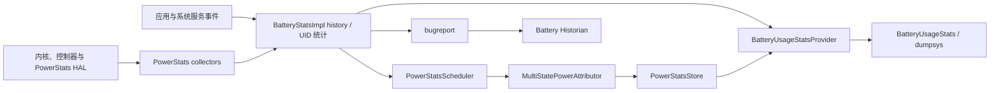

# 功耗诊断与 OEM 后台限制

功耗诊断先固定场景和电量窗口，再用 Battery Historian、batterystats、Perfetto 与设备电源数据定位组件活动。OEM 后台策略会改变任务、网络和进程存活，需要与 AOSP 行为分开记录。

## 场景基线、组件活动与能量证据

### 从问题描述到可归因证据

应用掉电快只是一种感受，不能直接对应到修复项。这个描述缺少设备、系统版本、前后台状态、网络、温度、测试区间和业务动作。缺少这些条件时，电量百分比下降、某条电源轨峰值、某个 Linux 用户标识符（User ID，UID）的 CPU（中央处理器）时间都不能单独证明责任归属。

功耗诊断要完成三次转换：

1. 把用户感受转换成可重复执行的场景。
2. 把设备级能量变化转换成同一时间窗内的 CPU、网络、GNSS（Global Navigation Satellite System，全球卫星导航系统）、WakeLock（唤醒锁；本文主要关注在屏幕关闭后仍让 CPU 运行的 Partial WakeLock）等证据。
3. 把系统证据定位到线程、请求、定位订阅或唤醒锁标签，再验证修改前后的差异。

功耗模型、硬件电流计与 BatteryStats 的计算原则见 §11.1；后台任务、Alarm、网络与定位策略见 §11.2；Battery Historian 的部署见 §15.5。这里专注于采集、解读和归因。

### 先分清三类证据

功耗工具观察的是不同层次。把它们的输出混为一谈，容易把时间相关性误判成应用造成的结果。电源轨是为一个或一组硬件模块供电的电路路径；ODPM（On-Device Power Rail Monitor，设备端电源轨监测器）记录这些路径的能量。BatteryStats 是 Android 的系统功耗统计，Perfetto 是记录并分析系统事件时间线的追踪工具。

| 证据层次 | 常用工具 | 能回答什么 | 不能单独证明什么 |
|---|---|---|---|
| 设备能量 | 外部电源分析仪、ODPM、电池电荷计 | 整机或电源轨在测试区间内消耗了多少能量 | 其中多少能量应归于某个应用 |
| 系统归因 | `dumpsys batterystats`、`BatteryUsageStats`、Android vitals（Google Play 的应用质量指标） | 系统把 CPU、网络、WakeLock、传感器等活动记给了哪个 UID | 每项统计与物理能量完全相等 |
| 执行行为 | Perfetto、应用日志、方法追踪 | 哪个线程、请求或回调在某个时刻运行 | 单次尖峰必然造成可感知续航问题 |

外部电源分析仪更接近整机能量基准；ODPM 和电池计数器仍是设备级读数；BatteryStats 按系统可见的活动和模型做 UID 归因；Perfetto 负责解释时间线上发生了什么。可靠结论通常需要其中两层以上互相印证。

### 设计可比较的测试

基线包与候选包必须在同一台设备、同一系统构建、相近电量和温度下测试。屏幕亮度、刷新率、音量、网络类型、信号条件、账号同步和其他前台应用也要保持一致。若业务依赖服务器响应，还要记录服务端版本和返回数据规模。

场景时长由业务周期和仪器分辨率决定，不存在适用于所有应用的标准分钟数。短场景需要重复执行，直到信号能从测量噪声中辨认出来；后台场景则要覆盖一次完整调度、重试或定位周期。预热、正式采集和冷却阶段要分开，避免把安装、编译、缓存填充或热节流混进业务耗电。

每轮测试应保存这些信息：

- 设备型号、Android 构建指纹和电池健康状态。
- 应用版本、提交号、安装方式及是否清除数据。
- 场景开始与结束时间、屏幕和充电状态。
- 网络类型、信号强度、亮度、刷新率、音量和环境温度。
- `bugreport.zip`、`batterystats` 文本、Perfetto 追踪文件，以及应用侧场景标记。
- 每次重复的原始结果，不只保留均值。

### Battery Historian 与 Power Profiler 实战

#### 工具怎么选

| 工具 | 适合的问题 | 关键边界 |
|---|---|---|
| Battery Historian | 回看一段较长区间内的系统事件、UID 统计、Job（调度任务）、Sync（同步任务）和 WakeLock | 已停止活跃维护；图中的活动条不等于该组件消耗的能量 |
| `dumpsys batterystats` | 获取 BatteryStats 的文本或 checkin（机器可解析）数据，按 UID 比较 CPU、网络、WakeLock 和传感器统计 | 功耗值可能来自模型估算，也可能由硬件能量校准；它不是直接测得的应用能量 |
| Power Profiler | 把 ODPM 电源轨与 System Trace（系统追踪）放在一条时间轴上 | ODPM 是设备级数据，设备和电源轨支持情况不同 |
| Perfetto | 对齐线程调度、CPU 频点、应用追踪标记、唤醒原因和功耗计数器 | 数据源、采样分辨率和轨道名称依设备而异 |
| Macrobenchmark（宏基准测试）[`PowerMetric`](https://developer.android.com/topic/performance/benchmarking/macrobenchmark-metrics) | 对可重复场景做自动化功耗对比 | 仍为实验性接口；高精度 Power/Energy 指标是系统级并受设备范围限制，Battery 类型精度较低 |

Android Developers 已在 [Battery Historian 使用说明](https://developer.android.com/topic/performance/power/setup-battery-historian)中提示该项目不再活跃维护，并建议优先考虑系统追踪、Macrobenchmark `PowerMetric` 或 Power Profiler。Battery Historian 仍适合读取现有 bugreport（系统诊断报告）、观察长时间系统事件，也兼容旧分析流程，但不宜再作为唯一依据。

#### 一轮可复现的 BatteryStats 采集

这些命令用于测试设备。命令会重置 BatteryStats 统计，不应在需要保留故障现场的用户设备上执行。

```bash
# 记录设备和系统身份，避免把不同构建的结果混在一起
adb shell getprop ro.build.fingerprint
adb shell dumpsys battery

# 清除旧的 BatteryStats 区间
adb shell dumpsys batterystats --reset

# 仅在需要逐个查看用户态 Partial WakeLock 时启用
adb shell dumpsys batterystats --enable full-wake-history

# 断开 USB，执行预先定义的测试场景；场景结束后再连接设备
adb bugreport bugreport-power.zip
adb shell dumpsys batterystats --charged > batterystats-charged.txt
adb shell dumpsys batterystats --checkin > batterystats-checkin.csv

# 采集完成后恢复默认的 WakeLock history 粒度
adb shell dumpsys batterystats --disable full-wake-history
```

`--reset` 让本轮数据有清楚的起点；`--charged` 表示输出自上次充满电以来的数据，并不表示设备当前正在充电；`--checkin` 输出便于程序解析的 CSV（逗号分隔值）数据。完整的 WakeLock 历史详情会占用更多记录空间，只在需要时开启。官方采集步骤要求测试期间断开 USB，因为充电会改变电池电流方向和系统电源状态；USB 数据链路在不少设备上还会阻止完整休眠。

#### Battery Historian 应该怎么看

Battery Historian 的系统视图先用于检查实验条件：屏幕、充电、信号、温度、Doze（低功耗待机模式）和其他 UID 是否在目标区间内发生变化。确认环境没有明显干扰后，再看目标应用的 `Userspace Wakelock`（用户空间唤醒锁）、`JobScheduler`、`SyncManager`、网络和进程状态。

图上的一段 `cpu_running`、`gps` 或网络活动只说明该资源在这段时间活跃。官方文档也说明，时间线中的彩色区间不显示组件消耗了多少电。可从异常区间出发，查看同一时间是否有目标 UID 的 WakeLock、Job、网络或前台状态，再回到文本统计和 Perfetto 追踪查责任来源。

#### Power Profiler 和 Perfetto 应该怎么看

[Power Profiler](https://developer.android.com/studio/profile/power-profiler) 从 Android Studio Hedgehog 起展示 ODPM 电源轨。官方支持范围是 Android 10 及以上的 Pixel 6 和后续 Pixel 设备；可见的具体电源轨仍由设备决定。不支持 ODPM 的设备可能只提供电池容量、电荷和电流数据。

ODPM 衡量的是设备或硬件子系统，不是单个应用。若 WLAN（Wireless Local Area Network，无线局域网，本文指 Wi-Fi）电源轨在某个请求期间升高，只能说明两者在时间上重合。要进一步归因，还要排除其他进程的网络活动，并查看目标 UID 的流量、socket tag（网络套接字流量标签）、线程和业务标记。

这个 Perfetto 数据源片段用于在支持的设备上采集电池计数器和 ODPM 电源轨。`250 ms` 来自 Perfetto 官方示例，只表示一个示例采样周期；完整配置应按设备分辨率、场景时长和追踪文件体积评估。

```textproto
data_sources: {
  config {
    name: "android.power"
    android_power_config {
      battery_poll_ms: 250
      battery_counters: BATTERY_COUNTER_CAPACITY_PERCENT
      battery_counters: BATTERY_COUNTER_CHARGE
      battery_counters: BATTERY_COUNTER_CURRENT
      battery_counters: BATTERY_COUNTER_VOLTAGE
      collect_power_rails: true
    }
  }
}
```

设备不支持某个计数器或电源轨时，配置不会凭空产生数据。[Perfetto 功耗数据源文档](https://perfetto.dev/docs/data-sources/battery-counters)说明：电池计数器来自 IHealth HAL，反映整机流入或流出电池的电荷；HAL（Hardware Abstraction Layer，硬件抽象层）是 Android 框架访问设备实现的统一接口。ODPM 由 IPowerStats HAL 提供，测量点在电池下游，不受充放电方向直接影响。二者的存在与分辨率都由设备实现决定。

#### Macrobenchmark 适合做回归，不适合归因单个应用耗电

Macrobenchmark `PowerMetric` 可以把固定操作脚本纳入回归测试。`Type.Power` 和 `Type.Energy` 输出 CPU、显示、GPU、GPS、内存、机器学习和网络等系统级类别的功率或能量变化；当前官方文档仍把接口标为实验性，高精度追踪仅支持 Pixel 6、Pixel 6 Pro 及后续设备。`Type.Battery` 可以作为精度较低的电池放电量测量方式，但不能提供同样的硬件子系统分类。

在使用前先调用 `PowerMetric.deviceSupportsHighPrecisionTracking()` 检查高精度追踪能力；不支持时，可按测试目的改用 `Type.Battery` 或跳过测试，并通过 `PowerMetric.deviceBatteryHasMinimumCharge()` 检查电量条件。测试设备上应尽量减少其他应用与账号活动。回归阈值应来自同型号设备的重复测试分布，不能直接复用另一款设备的绝对数值。

### `dumpsys batterystats` 解读

#### 从包名定位 UID

Android 以 UID 作为很多资源统计的归属单位。共享 UID、多用户和隔离进程都可能让“一个包名对应一个 UID”的假设失效。阅读报告前，应先记录当前安装实例的 UID。

这些命令用于导出目标包统计，并从 checkin 数据中定位常见记录类型。

```bash
adb shell cmd package list packages -U | grep 'com.example.app'
adb shell dumpsys batterystats --charged com.example.app > app-batterystats.txt
adb shell dumpsys batterystats --checkin > batterystats-checkin.csv

rg ',(uid|wl|kwl|wr|nt|sr|jb|sy|apk),' batterystats-checkin.csv
```

文本输出适合人工阅读，checkin 输出适合程序解析。官方 `dumpsys` 文档列出的常见段标识符包括：`wl` 表示 WakeLock，`kwl` 表示内核 WakeLock，`wr` 表示唤醒原因，`nt` 表示网络，`sr` 表示传感器，`jb` 表示 Job，`sy` 表示 Sync。解析器必须同时识别 checkin 版本；不要用固定列号跨 Android 版本直接读取。

#### 先确认统计区间

任何数值都要连同区间一起记录。常见区间包括自充满电、自重置或当前放电会话。`--charged` 不会把统计自动裁成刚执行的业务场景；如果测试开始前没有重置，输出仍可能包含早先活动。

还要区分三种时间：

- 墙钟时间用于对照日志和人工操作。
- `elapsedRealtime` 包含深度睡眠，适合描述开机后的经过时间。
- `uptimeMillis` 不包含深度睡眠，适合辨认设备是否有较长休眠。

比较基线与候选包时，使用同一种统计区间，并保存场景起止标记。如果只比较两个报告的累计值，区间不同就会直接破坏结论。

#### 读数表示什么

| 读数 | 可以说明 | 还要补什么证据 |
|---|---|---|
| UID 的用户态/内核态（user/system）CPU 时间 | 目标 UID 消耗了多少处理器时间 | 调度切片、频点、核簇、热点线程 |
| 网络字节和包数 | UID 传输量及分组数量 | 请求时间、网络类型、信号、蜂窝无线电活跃时间、重试 |
| 蜂窝无线电活跃（mobile radio active） | 蜂窝无线电活跃时间及次数 | 其他 UID 干扰、RAT（Radio Access Technology，无线接入制式）、信号、请求批次 |
| Partial WakeLock 时间 | CPU 被目标 UID 的锁请求保持唤醒多久 | 锁标签、持有区间、业务是否仍需要 |
| GNSS / 传感器时间 | 定位或传感器在 UID 下的活跃情况 | 精度、频率、批处理、前后台状态 |
| 估算功耗（estimated power） | 系统基于模型和可用硬件数据给出的归因结果 | 设备级测量和同条件对照实验 |

CPU 时间不是能量。相同 CPU 时间可能分布在不同核簇和频点上，也可能伴随不同温度。网络字节数也不是无线电能量：批量传输和反复短请求可产生不同的无线电状态切换。BatteryStats 的功耗汇总适合比较和排查，不能当作实验室电源分析仪的等价物。

Android 17 的 `dumpsys batterystats --usage` 仍支持 `--model power-profile`，用于强制采用 `PowerProfile` 功耗模型。不要再依赖旧文档中的 `BatteryConsumer.getPowerModel()` 判断每项究竟来自实测还是模型；Android 17 源码已将该接口标为弃用，并返回未定义值。设备是否提供能量数据，应结合 PowerStats HAL 能力、追踪数据中的电源轨以及目标设备实现判断。

### 功耗归因：CPU / 网络 / GNSS / WakeLock

#### CPU：从 UID 时间追到运行线程

CPU 异常常表现为目标 UID 的用户态或内核态 CPU 时间上升、Perfetto 中线程持续运行，或 CPU 频率轨道长时间处于较高档位。可按四步排查：

1. 用 BatteryStats 判断 CPU 时间是否只在候选包上升。
2. 在 Perfetto 中按目标进程筛选 `sched`（调度）切片，找出运行时间增加的线程。
3. 对齐 CPU 频率、idle（空闲）和 thermal（热状态）轨道，确认设备是否因高频、少休眠或温度发生变化。
4. 回到线程栈和业务标记，区分计算、轮询、序列化、锁竞争与 I/O 等待。

线程存在并不代表线程正在消耗 CPU。等待锁或等待 I/O（Input/Output，输入/输出）的线程可能长时间存活却很少运行；密集唤醒的短任务也可能让设备难以进入低功耗状态。调度和 DVFS（Dynamic Voltage and Frequency Scaling，动态电压频率调节）原理见 §5.1、§5.2。

#### 网络：传输量与唤醒形态要一起看

网络功耗通常同时受传输量、请求批次、无线电接入技术和信号影响。排查时把这些证据放在同一时间窗：

- BatteryStats 的移动网络与 Wi‑Fi 收发字节、包数和蜂窝无线电活跃时间。
- Perfetto 或 Network Inspector 中的请求开始、结束、失败和重试。
- 信号强度、网络切换和是否使用蜂窝网络。
- 应用侧的请求类型、批次、退避和 socket tag。

若候选包多出密集短请求，结论应写明请求来源和触发条件。若只看到 modem（基带调制解调器）或 WLAN 电源轨上升，暂时只能确定硬件活动增加；还不能把全部差值记给目标应用。网络治理见 §24.5、§24.6。

#### GNSS 与传感器：确认订阅是否越过业务边界

定位异常常见于页面离开后没有取消更新、后台仍保留高精度请求、多个 SDK（Software Development Kit，软件开发工具包）重复订阅，或请求参数远高于业务需求。BatteryStats 可以显示 UID 下的 GNSS 和传感器活动，Battery Historian 可以显示它们与屏幕、进程状态的关系。

定位报告至少要记录这些内容：

- 请求由哪个模块或 SDK 发起。
- 前台、前台服务或后台中的哪种状态在使用。
- 精度、最小更新间隔、最小距离和批处理参数。
- 页面、任务或订阅结束后是否及时取消。
- 能否采用 geofence（地理围栏，在设备进入或离开指定区域时触发）、被动定位或批量定位。

同一个 UID 中的多个库会合并计数，BatteryStats 不能代替应用侧订阅日志。定位策略见 §25.4。

#### WakeLock：区分应用锁、内核唤醒源和唤醒原因

这三个名词经常被混用：

- 应用 Partial WakeLock 由 `PowerManager.WakeLock` 请求，目标是让 CPU 在屏幕关闭后继续运行。
- 内核唤醒源（wakeup source）是 Linux 电源管理对象，记录设备驱动阻止 suspend（系统挂起）或触发唤醒的活动。
- 唤醒原因（wakeup reason）描述最近一次系统从挂起恢复或中止挂起的原因。

它们可以相关，但不存在通用的一对一映射。一个应用 WakeLock 可能经由系统服务反映为不同的内核对象；一次硬件中断唤醒也未必由某个应用直接触发。

[Android Vitals 的 excessive partial wake lock 口径](https://developer.android.com/topic/performance/vitals/excessive-wakelock)是：24 小时内，应用处于后台或运行前台服务时，所有非豁免 Partial WakeLock 累计达到 2 小时。音频、定位和 JobScheduler 的 user-initiated（由用户主动触发）API 当前有豁免。若该问题在 28 天内影响超过 5% 的应用会话，可能影响 Play 可见性。

[Stuck partial wake lock 口径](https://developer.android.com/topic/performance/vitals/stuck-wakelock)是：24 小时内至少出现一次在后台连续持有满 1 小时的 Partial WakeLock。Stuck 指标判断一把锁的连续持有时间，excessive 指标计算所有非豁免锁的累计时间，两者条件不同。

本地诊断不应等到触及 vitals 门槛才处理。只要锁持续到业务结束之后，或标签无法识别责任模块，就应检查。示例封装体现两个安全要求：使用可定位的标签，并同时设置超时与 `finally` 释放。

```kotlin
suspend fun <T> PowerManager.withPartialWakeLock(
    operationName: String,
    timeoutMs: Long,
    block: suspend () -> T,
): T {
    require(timeoutMs > 0)

    val wakeLock = newWakeLock(
        PowerManager.PARTIAL_WAKE_LOCK,
        "${BuildConfig.APPLICATION_ID}:$operationName",
    )
    wakeLock.acquire(timeoutMs)

    return try {
        block()
    } finally {
        if (wakeLock.isHeld) {
            wakeLock.release()
        }
    }
}
```

`timeoutMs` 应来自该操作的业务时限，而非随意复制的常量。超时只是额外保护；正常路径和异常路径仍要在 `finally` 中释放。若 WorkManager（Jetpack 的持久后台任务调度库）、媒体、定位或其他库间接持锁，还要按 Android vitals 显示的标签查对应 API。

### 功耗异常检测与定位

#### 用场景定义取代固定时长模板

| 场景 | 场景结束条件 | 主要观察项 | 常见干扰 |
|---|---|---|---|
| 冷启动并完成首屏 | 首屏内容与异步初始化完成 | CPU、存储、网络、显示电源轨 | 安装后编译、首次缓存、服务端冷请求 |
| 息屏后台等待 | 覆盖至少一个预期调度周期 | Partial WakeLock、Job、Alarm、CPU 空闲（idle）状态 | USB、系统同步、消息推送 |
| 导航、录音或播放 | 用户可见任务完成 | GNSS、音频、传感器、WakeLock、温度 | 信号、音量、路线与媒体内容 |
| 弱网重试 | 请求成功或达到产品重试上限 | 蜂窝无线电活跃时间、失败次数、退避间隔 | 网络模拟方式、DNS（域名系统）、服务端限流 |
| 周期同步 | 覆盖完整同步与静默阶段 | 网络批次、Job、Sync、后台 CPU | 账号数据量、系统维护窗口 |

同一场景至少要有基线包和候选包。重复次数由结果波动决定：如果组内波动与版本差值相当，就要增加重复、改善实验控制或更换测量方式，不能直接宣布回退。

#### 从现象走到代码入口

| 现象 | 下一步证据 | 常见入口 |
|---|---|---|
| 息屏后 CPU 仍持续运行 | Partial WakeLock、Job、Alarm、前台服务和线程调度 | `PowerManager.WakeLock`、`WorkManager`、`AlarmManager`、前台服务（Foreground Service，FGS） |
| WLAN 或 modem 轨道出现密集脉冲 | UID 网络统计、请求日志、重试与 socket tag | 轮询、遥测上报、长连接心跳、DNS 更新 |
| GNSS 在业务结束后仍活跃 | 定位订阅日志、页面与服务生命周期 | 地图 SDK、轨迹模块、`FusedLocationProviderClient` |
| CPU 时间上升而网络、GNSS 无明显变化 | 热点线程、频点、锁等待、序列化和数据库扫描 | 线程池、协程调度器、JSON / protobuf（Protocol Buffers）序列化、数据库 |
| 整机能量上升但 UID 指标无明显变化 | 屏幕、温度、其他 UID、系统服务和设备状态 | 测试环境或设备级组件 |

时间重合是定位线索，不能单独证明因果。可采用受控消融，也就是每次只禁用一个可疑模块、延后某类请求或替换一种实现，再观察异常轨道和设备能量是否随之变化。

#### 诊断结论怎么写

一份可执行的结论应包含：

- 设备、系统、应用版本和测试场景。
- 基线与候选包的重复结果及波动。
- 异常发生的时间窗。
- BatteryStats、Perfetto 追踪和应用日志中的相互印证。
- 能定位到的 UID、线程、请求、订阅或 WakeLock 标签。
- 仍未排除的干扰和下一步验证。

示例结论可以这样写：

> 在 Pixel 测试机的息屏上传场景中，候选包在业务结束后仍保留 `com.example.app:upload` Partial WakeLock；同一时间窗内上传线程按固定间隔唤醒并发起失败重试。禁用该重试模块后，WakeLock 区间和移动网络活动一同消失。

其中的设备、区间、间隔和差值都应由本轮原始记录填写，不能套用示例数字。

### Android 17 源码中的功耗归因链

源码分析以 `android-17.0.0_r1` 为平台锚点。Battery Historian 是独立项目，不存在于 `frameworks/base`；AOSP（Android Open Source Project，Android 开源项目）平台负责产生 BatteryStats、PowerStats 和 bugreport 数据。

图中把活动记录、功耗聚合和结果展示三项职责分开。



[`BatteryStatsImpl`](https://android.googlesource.com/platform/frameworks/base/+/android-17.0.0_r1/services/core/java/com/android/server/power/stats/BatteryStatsImpl.java) 保存事件历史和 UID 统计；采集器把 CPU、无线控制器或能量消费者等数据写入功耗统计；`PowerStatsScheduler` 周期聚合；`MultiStatePowerAttributor` 按设备状态与 UID 状态计算；`BatteryUsageStatsProvider` 生成查询结果；Battery Historian 只读取 bugreport 中已经存在的数据。

#### Android 17 的主路径

在 [`BatteryStatsService.systemServicesReady()`](https://android.googlesource.com/platform/frameworks/base/+/android-17.0.0_r1/services/core/java/com/android/server/am/BatteryStatsService.java) 中，CPU、WakeLock、屏幕、移动网络、Wi‑Fi、蓝牙、音视频、GNSS、传感器、相机及自定义能量消费者等组件被统一启用。这里所说的启用表示框架允许采集和归因，不表示所有设备都具有对应的硬件能量计。

[`BatteryUsageStatsProvider`](https://android.googlesource.com/platform/frameworks/base/+/android-17.0.0_r1/services/core/java/com/android/server/power/stats/BatteryUsageStatsProvider.java) 在构建 `BatteryUsageStats` 时调用 `PowerAttributor.estimatePowerConsumption()`。Android 17 使用的 [`MultiStatePowerAttributor`](https://android.googlesource.com/platform/frameworks/base/+/android-17.0.0_r1/services/core/java/com/android/server/power/stats/processor/MultiStatePowerAttributor.java) 配置各功耗组件的处理器，并通过 `PowerStatsExporter` 把聚合结果写入构建器。

各处理器会根据组件采用不同输入。例如 [`CpuPowerStatsProcessor`](https://android.googlesource.com/platform/frameworks/base/+/android-17.0.0_r1/services/core/java/com/android/server/power/stats/processor/CpuPowerStatsProcessor.java) 读取 CPU 活跃时间、核簇和频点对应的 `PowerProfile` 参数；采集结果带有 EnergyConsumer（能量消费者）数据时，还会用硬件能量调整各功耗分组（power bracket）的估算。移动网络处理器也会根据可用信息在 `PowerProfile` 与硬件能量之间校准。因此，Android 17 会按组件组合模型与硬件数据，不能笼统归为全部实测或全部模型估算。

#### BatteryUsageStats、PowerMonitor 与 HealthStats 的能力边界

三套名称相近的接口不能互相替代。`BatteryUsageStats` 是系统生成的功耗归因结果，`PowerMonitor` 表示设备提供的能量监测项，`HealthStats` 记录调用应用的资源活动；[`SystemHealthManager`](https://developer.android.com/reference/android/os/health/SystemHealthManager) 的公开参考页可用于确认 API 等级与回调语义。

| 入口 | 普通应用能否使用 | 数据范围 | 主要用途 |
| --- | --- | --- | --- |
| `BatteryStatsManager.getBatteryUsageStats()` | 不能；属于隐藏系统接口并要求 `BATTERY_STATS` | device（整机）、all-apps（全部应用）、UID、组件及可选状态维度 | 设置页、系统服务和 bugreport 的 UID 功耗归因 |
| `SystemHealthManager.getPowerMonitorReadings()` | API 35 起可以 | 设备提供的 ODPM rail（电源轨）或 modeled consumer（模型估算能耗项），数值是自开机累计的 μWs（微瓦秒） | 同机、同场景的设备级能量窗口比较 |
| `SystemHealthManager.takeMyUidSnapshot()` | 可以 | 本 UID 的 CPU、网络、WakeLock 等资源活动 | 解释应用在同一窗口内做了什么，不直接输出 mAh（毫安时） |

`BatteryUsageStats` 的整机总量可以大于全部应用总量：屏幕、基带待机和共享硬件中无法可靠分摊的部分会留在设备侧。

Android 17 的 CPU 处理器会把频点模型、硬件总量和 UID time-in-bracket（各功耗分组累计时间）结合起来；WakeLock 处理器估算的是阻止 CPU 休眠的机会成本；屏幕总量再按 top activity duration（顶部 Activity 可见时长）分给 UID。这些数值都是归因结果，每个 UID 并没有一块独立电表。

Android 17 的标准 [`BatteryConsumer`](https://android.googlesource.com/platform/frameworks/base/+/android-17.0.0_r1/core/java/android/os/BatteryConsumer.java) 没有 GPU 组件，PowerStats AIDL（Android Interface Definition Language，Android 接口定义语言）的标准 [`EnergyConsumerType`](https://android.googlesource.com/platform/hardware/interfaces/+/android-17.0.0_r1/power/stats/aidl/android/hardware/power/stats/EnergyConsumerType.aidl) 也没有 GPU 枚举。厂商可以暴露名为 GPU、G3D 或其他名称的监测项，但这些数据只适合在相同设备构建上做差值，不能当作跨设备可比的 UID GPU 电量。

普通应用读取 `PowerMonitor` 时还要处理两个实现边界：设备可以返回空列表；Android 17 [`PowerStatsService`](https://android.googlesource.com/platform/frameworks/base/+/android-17.0.0_r1/services/core/java/com/android/server/powerstats/PowerStatsService.java) 的普通权限路径可能复用 20 秒内的缓存读数，并按调用 UID 加入随机扰动。两次快照只有在监测项相同、时间戳前进、累计值未回退时才能做差。短于读数分辨率的启动或单帧场景应改用 Perfetto 电源轨、Power Profiler 或外接仪器。

一次可复核的应用侧实验应把三组增量放在一起保存：监测项的微瓦秒、`HealthStats` 的本 UID CPU/网络/WakeLock 活动，以及完成任务数。这些数据可以分别回答设备能量是否变化、应用行为为何变化，但仍不能声称拿到了系统设置页的 UID 精确电量。

#### Android 15 到 Android 17 的变化

| 版本 | 归因开关与调度器 | 需要记住的边界 |
|---|---|---|
| Android 15 | `streamlinedBatteryStats`、`streamlinedConnectivityBatteryStats`、`streamlinedMiscBatteryStats` 控制采集器和导出器；`PowerStatsScheduler.start(boolean)` | 新旧归因路径处于切换期 |
| Android 16 | 引入 `MultiStatePowerAttributor`，各组件仍受上述功能开关（flag）控制；调度器仍接收 boolean（布尔）参数 | 多状态功耗处理器已进入主要归因路径 |
| Android 17 | `BatteryStatsService` 对相关组件统一传入 `true`；`PowerStatsScheduler.start()` 改为无参 | 平台主锚点不再需要按这些功能开关判断是否启用 |

对应源码可在 [`android-15.0.0_r1 BatteryStatsService`](https://android.googlesource.com/platform/frameworks/base/+/android-15.0.0_r1/services/core/java/com/android/server/am/BatteryStatsService.java)、[`android-16.0.0_r1 BatteryStatsService`](https://android.googlesource.com/platform/frameworks/base/+/android-16.0.0_r1/services/core/java/com/android/server/am/BatteryStatsService.java)和 [`android-17.0.0_r1 PowerStatsScheduler`](https://android.googlesource.com/platform/frameworks/base/+/android-17.0.0_r1/services/core/java/com/android/server/power/stats/PowerStatsScheduler.java)中核对。这里保留 Android 15、16 只为解释迭代；当前结论以 Android 17 为准。

#### PowerStatsScheduler 与 PowerStatsStore

Android 17 的 `PowerStatsScheduler.start()` 会安排功耗聚合，并注册下一次调度。它使用 `AlarmManager.ELAPSED_REALTIME` 的非唤醒闹钟，由后台 `Handler`（线程消息处理器）执行聚合；该闹钟本身不会为了统计而唤醒已经休眠的设备。

[`PowerStatsStore`](https://android.googlesource.com/platform/frameworks/base/+/android-17.0.0_r1/services/core/java/com/android/server/power/stats/PowerStatsStore.java) 接收构造参数 `systemDir`，再创建 `power-stats` 子目录，所以典型路径是 `/data/system/power-stats/`。span（聚合区间）文件名由 19 位补零 ID 和 `.pss` 后缀组成，通过 `Xml.newBinarySerializer()` 写成二进制 XML，并由 `AtomicFile`（原子文件更新封装）更新。

文件采用二进制 XML，不应按普通文本 XML 或旧资料所说的 Protocol Buffers（Proto）日志读取。该目录属于系统内部实现，普通应用不应直接读取。

#### 唤醒原因如何进入 Perfetto 和 BatteryStats

Android 17 的 `BatteryStatsService.WakeupReasonThread` 等待原生层返回唤醒原因。原生实现位于 [`com_android_server_am_BatteryStatsService.cpp`](https://android.googlesource.com/platform/frameworks/base/+/android-17.0.0_r1/services/core/jni/com_android_server_am_BatteryStatsService.cpp)，通过 `ISuspendControlService` 注册唤醒回调。收到原因后，Java 层会：

- 在 `TRACE_TAG_POWER` 的 `wakeup_reason` 轨道写入瞬时事件。
- 把原因交给 `CpuWakeupStats` 做统计与归因。
- 写入 `BatteryStatsImpl` 事件历史。

这条路径为 Perfetto、CPU 唤醒统计与 BatteryStats 事件历史提供了共同时间点，但它不能证明应用行为与物理功耗之间存在因果关系，也没有覆盖平台中的全部功耗追踪入口。分析时仍要结合同一时刻的 IRQ（Interrupt Request，中断请求）、线程、Alarm、Job 和应用事件。

#### `WakeLockStats` 为什么不能由普通应用反射调用

Android 17 的 [`WakeLockStats`](https://android.googlesource.com/platform/frameworks/base/+/android-17.0.0_r1/core/java/android/os/WakeLockStats.java) 带有 `@hide` 标记，不属于公开 SDK；它实现 `Parcelable`（Android 跨进程序列化接口），包含逐锁和聚合列表。每条记录有 UID、名称、总持有数据和后台持有数据。`BatteryStatsImpl.getWakeLockStats()` 用主计时器生成总数据，用子计时器生成后台数据。

[`BatteryStatsService.getWakeLockStats()`](https://android.googlesource.com/platform/frameworks/base/+/android-17.0.0_r1/services/core/java/com/android/server/am/BatteryStatsService.java) 受 `BATTERY_STATS` 权限保护；Android 17 的 [`AndroidManifest.xml`](https://android.googlesource.com/platform/frameworks/base/+/android-17.0.0_r1/core/res/AndroidManifest.xml) 将该权限声明为 `signature|privileged|development`，也就是签名、特权或开发级权限。普通第三方应用不能把它当作 SDK API，也不能靠反射绕过 Binder（Android 跨进程调用机制）权限校验。可行方案分三类：

- 普通应用：使用 Play Console 的 Android vitals、测试设备上的 `adb dumpsys`、bugreport、Perfetto 和应用侧 WakeLock 记录。
- OEM（设备厂商）、系统应用或测试工具：在拥有相应系统权限并维护版本兼容的前提下使用隐藏接口。
- 开发版设备：把隐藏接口调用限制在内部诊断组件，不随生产 APK 发布。

`backgroundWakeLockData` 只是后台计时器的快照字段。Android vitals 的 excessive 和 stuck 判定还包含 24 小时窗口、前后台或前台服务状态、豁免项和会话聚合，不能把一个字段直接等同于 Play 指标。

### SoC（System on a Chip，片上系统）与设备差异：先查能力，再谈精度

Android 17 提供统一接口，不保证每款 SoC 有相同数量的电源域、相同采样率或相同精度。只按 ARM、Qualcomm、MediaTek 或 Samsung 给出固定误差、固定电源轨数量和固定节电比例，却不交代具体设备、硬件设计、固件与实验条件，这样的数字无法作为工程结论。

#### 四类常见数据能力

| 能力 | 平台入口 | 数据含义 | 设备差异 |
|---|---|---|---|
| 电池容量、电荷、电流、电压 | IHealth HAL / `/sys/class/power_supply` | 整机电池侧计数器 | 字段是否存在、更新周期和分辨率不同 |
| ODPM 电源轨 | IPowerStats HAL 能量计 | 某条硬件电源轨累计能量 | 电源轨名称、组合方式和数量不同 |
| EnergyConsumer（能量消费者） | IPowerStats HAL | CPU、显示、移动网络等消费者的累计能量 | 可用消费者和 UID 归因能力不同 |
| StateResidency（状态驻留统计） | IPowerStats HAL | 电源实体在各状态停留的时间和进入次数 | 实体及状态由设备定义 |

Android 17 的 [`IPowerStats.aidl`](https://android.googlesource.com/platform/hardware/interfaces/+/android-17.0.0_r1/power/stats/aidl/android/hardware/power/stats/IPowerStats.aidl) 通过 `getEnergyConsumerInfo()`、`getEnergyMeterInfo()` 和 `getPowerEntityInfo()` 暴露设备能力，再通过对应查询接口返回数据。客户端应先枚举能力，不应按厂商名猜测。

#### 内核锚点告诉了我们什么

在 `android17-6.18-2026-06_r6` 中，[`power_supply_sysfs.c`](https://android.googlesource.com/kernel/common/+/android17-6.18-2026-06_r6/drivers/power/supply/power_supply_sysfs.c) 定义了 `voltage_now`、`current_now`、`current_avg`、`charge_counter`、`energy_now` 等通用属性。具体驱动只会暴露它支持的属性；内核定义了字段，并不表示每台设备都能读取，也不表示刷新速度相同。

同一内核锚点下，[`drivers/base/power/wakeup.c`](https://android.googlesource.com/kernel/common/+/android17-6.18-2026-06_r6/drivers/base/power/wakeup.c) 维护 `wakeup_source` 的 `active_count`、`event_count`、`total_time` 等统计；[`kernel/power/wakeup_reason.c`](https://android.googlesource.com/kernel/common/+/android17-6.18-2026-06_r6/kernel/power/wakeup_reason.c) 记录 suspend 恢复的 IRQ 或中止原因。这些是设备与驱动层证据，不能直接替代 UID 级 BatteryStats。

#### 跨设备比较方法

- 在每台设备上保存 Power Profiler 或 Perfetto 实际列出的电源轨和计数器。
- 同一设备内比较基线与候选包；跨设备更适合比较趋势，不宜直接比较绝对电流。
- 记录系统构建和固件，因为相同硬件的计数器映射也可能随版本变化。
- 用设备级能量验证整机是否改善，用 UID 与 Perfetto 追踪解释哪些行为发生了变化。
- 需要发布绝对精度或节电比例时，说明测量仪器、接线方式、样本量、置信区间和误差来源。

### 功耗诊断小结

功耗诊断的起点是可重复场景，单张电量截图无法完成归因。BatteryStats 负责提供 UID 统计，Battery Historian 适合离线回看系统事件，Power Profiler 和 Perfetto 用于对齐电源轨、计数器与执行行为，Macrobenchmark `PowerMetric` 可用于受支持设备上的自动化回归。

归因时始终保留层次边界：CPU 时间、网络流量、GNSS 活跃和 WakeLock 是活动证据；ODPM 与电池计数器是设备级能量证据；Android 17 的 `MultiStatePowerAttributor` 会按可用输入结合模型与硬件能量。结论只有定位到明确场景、时间窗、UID 和代码入口，并通过基线对照或消融实验复核，才足以指导修改。

## 后台限制、豁免与厂商差异

公共证据链建立后，厂商后台限制需要通过设置、系统日志和跨设备对照确认。应用不能依赖无法公开验证的私有保活策略。

本文以 Android 17（API 37，`android-17.0.0_r1`）为平台基线。排查 OEM（Original Equipment Manufacturer，设备厂商）后台问题时，不从“某厂商会杀应用”的传闻出发，先回答三个有证据可查的问题：

1. AOSP（Android Open Source Project，Android 开源平台）当前如何评价这个 package（应用包名）/UID（系统分配的 Linux 用户标识，用来区分应用身份）：限制等级、待机分组和豁免原因是什么？
2. Job（由 JobScheduler 调度的后台任务）、Alarm（由 AlarmManager 管理的定时事件）、前台服务、网络或进程生命周期中的哪一层没有按预期推进？
3. 两台设备的 AOSP 状态相同时，厂商侧又增加了什么设置、服务、冻结或清理动作？

先校正两个容易误导排查的细节。Android 17 的命令是 `cmd activity get-bg-restriction-level`，没有 `background get-restriction-level` 这一层子命令；`AppRestrictionController` 的 XML 位于每用户的 `/data/system_de/<userId>/apprestriction/settings.xml`，不是 `/data/system/apprestriction/settings.xml`。正文中的命令和路径均按源码校正后的形式给出。

### AOSP 后台限制不是一个总开关

“后台不工作”可能来自多套相互独立的机制：

| 层次 | 典型状态 | 主要影响 |
| --- | --- | --- |
| App Standby（应用待机） | active（活跃）、working set（常用）、frequent（频繁）、rare（很少使用）、restricted（受限）等 bucket（分组） | 根据使用频率限制 Job、Alarm、网络等后台资源 |
| Background restriction | 控制器汇总用户状态、待机分组和系统策略得到的后台限制等级 | 更严格的后台执行、Job、Alarm 和前台服务行为 |
| Doze / Battery Saver | 设备空闲模式、节电模式、临时允许名单 | 全设备范围的网络、Alarm、Job 推迟 |
| FGS 与后台启动规则 | FGS（Foreground Service，前台服务）类型、启动豁免、运行时限 | Service 能否启动、进入前台并持续运行 |
| 进程管理 | cached freezer（缓存进程冻结器）、LMKD（低内存终止守护进程）、force-stop、厂商清理 | 进程是否存在、何时可再次启动 |
| 任务自身 | WorkManager 约束、Job 配额（系统分配的运行额度）、Alarm 类型 | 某项具体任务能否获得执行机会 |

这些状态可能同时出现，也可能只有一项变化。只看进程消失、`dumpsys deviceidle` 或设置页中的“允许后台活动”，都不足以确定原因。

### `AppRestrictionController` 怎样形成限制等级

Android 17 的入口位于 `frameworks/base/services/core/java/com/android/server/am/AppRestrictionController.java`。它维护持久化的 package/UID 限制设置，监听用户限制、App Standby、角色、DeviceConfig 和系统豁免，并汇总多个 `BaseAppStateTracker`（记录某类应用状态并给出限制建议的组件）。

下面是 Android 17 初始化 tracker 的源码骨架：

```java
void initAppStateTrackers(AppRestrictionController controller) {
    mAppBatteryTracker = new AppBatteryTracker(mContext, controller);
    mAppBatteryExemptionTracker = new AppBatteryExemptionTracker(mContext, controller);
    mAppFGSTracker = new AppFGSTracker(mContext, controller);
    mAppMediaSessionTracker = new AppMediaSessionTracker(mContext, controller);
    mAppPermissionTracker = new AppPermissionTracker(mContext, controller);
    controller.mAppStateTrackers.add(mAppBatteryTracker);
    controller.mAppStateTrackers.add(mAppBatteryExemptionTracker);
    controller.mAppStateTrackers.add(mAppFGSTracker);
    controller.mAppStateTrackers.add(mAppMediaSessionTracker);
    controller.mAppStateTrackers.add(mAppPermissionTracker);
    controller.mAppStateTrackers.add(new AppBroadcastEventsTracker(mContext, controller));
    controller.mAppStateTrackers.add(new AppBindServiceEventsTracker(mContext, controller));
}
```

这七个 tracker（状态跟踪组件）的职责并不相同。`AppBatteryTracker` 可以依据后台耗电提出限制等级；FGS、媒体会话、权限、广播和绑定服务 tracker 记录相应活动；`AppBatteryExemptionTracker` 用于核算应从后台耗电中排除的部分。不能把“在 tracker 列表中”直接解释为“每个 tracker 都会单独限制应用”。

当多个 policy（各 tracker 的规则对象）提出候选等级时，控制器选择数值更大的等级，并保留对应 tracker 信息：

```java
for (int i = mAppStateTrackers.size() - 1; i >= 0; i--) {
    final int proposed = mAppStateTrackers.get(i).getPolicy()
            .getProposedRestrictionLevel(packageName, uid, maxLevel);
    level = Math.max(level, proposed);
    if (level != previousLevel) {
        resultTracker = mAppStateTrackers.get(i);
        previousLevel = level;
    }
}
```

这是 tracker 汇总阶段的规则，不是完整决策。控制器还会先处理休眠、force-stop（用户或系统把应用标成已强制停止）、系统豁免、用户后台限制和当前 standby bucket；其中 `BACKGROUND_RESTRICTED` 不能仅凭 tracker 自动进入，源码明确要求用户同意该级别。

#### 限制等级要看名称和来源

Android 17 定义的主要等级如下：

| 数值 | 名称 | 源码语义 |
| ---: | --- | --- |
| 0 | `UNKNOWN` | 尚无有效等级 |
| 10 | `UNRESTRICTED` | 只为少量系统进程预留的最宽状态 |
| 20 | `EXEMPTED` | 用户或系统豁免状态，但不等于不受任何保护规则约束 |
| 30 | `ADAPTIVE_BUCKET` | 普通应用的默认层次，由待机分组继续细分 |
| 40 | `RESTRICTED_BUCKET` | 处于 restricted standby bucket |
| 50 | `BACKGROUND_RESTRICTED` | 用户启用的后台限制 |
| 60 | `FORCE_STOPPED` | 应用处于 force-stop 状态 |
| 70 | `USER_LAUNCH_ONLY` | 只有用户启动后才能恢复的更严格状态 |
| 90 | `CUSTOM` | 为定制限制保留的等级 |

这些数值用来对照源码中的 `Math.max()`，诊断报告仍要记录名称、变更时间，以及能够取得的 reason（主原因）、subReason（细分原因）和 source（来源）。表中名称是源码常量名；`get-bg-restriction-level` 使用另一组输出字符串，例如 `FORCE_STOPPED` 输出 `stopped`，`USER_LAUNCH_ONLY` 输出 `user_only`。`FORCE_STOPPED` 是生命周期状态，不能简单归因为耗电超限；`EXEMPTED` 也不是 CPU、网络和前台服务规则的通行证。

### OEM 可以改变哪些 AOSP 输入

#### 静态 SystemConfig 豁免

`SystemConfig` 是汇总系统分区 XML 配置的框架组件，它会从允许覆盖应用限制的分区中解析 `bg-restriction-exemption`。配置项的形式如下：

```xml
<permissions>
    <bg-restriction-exemption package="com.example.systemapp" />
</permissions>
```

`AppRestrictionController` 通过 `SystemConfig.getBgRestrictionExemption()` 读取这份集合。厂商预装应用若在此列表中，不能作为普通三方应用的对照样本。静态豁免可用 `cmd activity list-bg-exemptions-config` 查看，是否能修改取决于系统镜像和构建权限。

#### DeviceConfig 与其他豁免来源

DeviceConfig 是系统服务读取运行时配置的机制；其 `activity_manager` 命名空间中的 `bg_restriction_exempted_packages` 提供可动态更新的包名集合。除此之外，控制器还会检查 UID 和 package 级原因，包括：

- core UID（系统核心身份）、系统 Device Idle allowlist（设备空闲模式允许名单）和演示模式；
- 系统模块、运营商特权应用；
- DPC（Device Policy Controller，设备策略控制器）保护应用、活动设备管理员；
- `OP_SYSTEM_EXEMPT_FROM_POWER_RESTRICTIONS` 这一 AppOp（按应用身份记录的操作授权）；
- VPN（虚拟专用网络）相关 AppOp、拨号和紧急角色；
- 用户 Device Idle allowlist、关联的 Companion Device（配套设备）应用。

这是后台限制控制器的豁免判断，不代表这些应用在 JobScheduler、AlarmManager、FGS 或网络子系统中处处免检。排查时应分别确认每套 allowlist 的适用范围。

下面的 ADB（Android Debug Bridge，Android 调试桥）只读命令分别查看静态豁免、DeviceConfig 包集合和 Device Idle 允许名单：

```bash
adb shell cmd activity list-bg-exemptions-config
adb shell device_config get \
  activity_manager bg_restriction_exempted_packages
adb shell dumpsys deviceidle whitelist
```

三条输出来自不同配置源。不要把某个包出现在 Device Idle 白名单中，写成它已经命中 `bg-restriction-exemption`。

### `AppBatteryExemptionTracker` 记录的是耗电扣除区间

这个类按 UID 维护各 package 当前活跃的状态位。多个 package 可以通过 `sharedUserId` 等历史机制共享 UID；当同一 UID 中第一个 package 进入某类可豁免状态时，tracker 为 UID 增加开始事件，同 UID 的 package 全部离开该状态时再增加结束事件。

下面的源码片段展示了按 UID 合并状态的关键判断：

```java
if (start) {
    boolean alreadyStarted = false;
    for (int i = pkgsStates.size() - 1; i >= 0; i--) {
        if ((pkgsStates.valueAt(i) & stateType) != 0) {
            alreadyStarted = true;
            break;
        }
    }
    if (!alreadyStarted) {
        addEvent = true;
    }
} else {
    // 只有同 UID 的所有 package 都结束该 stateType，才记录 UID 结束事件。
}
```

这样可以避免同 UID 的两个 package 把同一段状态重复计时。事件还记录开始和结束时的 UID 电量快照，也就是系统到该时刻为止累计的 UID 耗电估算；`getUidBatteryExemptedUsageSince()` 计算这些区间内的用量，`AppBatteryTracker` 再从总后台用量中扣除它。

这里的 exemption 是耗电归因豁免，不是给 UID 一个固定时长的后台执行许可。源码没有“16 ms 生效延迟”或统一“豁免窗口长度”的公共契约，诊断文档不应据此给出时间保证。

### 一轮可复现的诊断

#### 固定设备和应用条件

每次采样都记录以下信息：

- build fingerprint（系统构建的唯一标识）、增量版本、安全补丁和厂商系统版本；
- 应用 versionCode（内部版本号）、targetSdk（适配目标 API 级别）、安装来源、用户 ID 与 UID；
- 电量、充电状态、Battery Saver、Doze、网络和屏幕状态；
- 厂商设置页中与自启动、后台活动、电池优化、锁屏清理相关的选项；
- 测试动作、进入后台时间、预期执行时间和观测窗口。

同一 APK（Android 安装包）在两台设备上对比时，账号、网络、充电、屏幕、用户设置和测试时间线必须一致。否则差异可能来自输入条件，而不是 ROM（设备上的 Android 系统镜像）。

#### 读取 AOSP 限制状态

下面的命令获取限制等级、待机分组和三类豁免输入：

```bash
PACKAGE=com.example.app

adb shell cmd activity get-bg-restriction-level \
  --user current "$PACKAGE"
adb shell am get-standby-bucket \
  --user current "$PACKAGE"
adb shell cmd activity list-bg-exemptions-config
adb shell device_config get \
  activity_manager bg_restriction_exempted_packages
adb shell dumpsys deviceidle whitelist
```

`get-bg-restriction-level` 输出的是 `exempted`、`adaptive_bucket`、`restricted_bucket`、`stopped` 等名称。它和 App Standby bucket 相关但不相同；报告中应保留两项原始输出。

应用自身也可以记录公开 API 可见的两个状态：

```kotlin
val activityManager = getSystemService(ActivityManager::class.java)
val usageStatsManager = getSystemService(UsageStatsManager::class.java)

Log.i(
    "BgState",
    "backgroundRestricted=${activityManager.isBackgroundRestricted}, " +
        "standbyBucket=${usageStatsManager.appStandbyBucket}",
)
```

`isBackgroundRestricted` 只回答当前应用是否被用户置于后台限制状态，`appStandbyBucket` 返回本应用待机分组。它们不暴露系统服务内部的完整 restriction level、reason 或 tracker 详情。

#### 保存控制器与子系统快照

`dumpsys` 是导出系统服务内部状态的诊断命令。Android 17 没有 `dumpsys activity bg-restriction exemption-reason`、`dumpsys activity restriction <package>` 或 `restriction trackers` 这些文本子命令。`AppRestrictionController.dump()` 会在完整 `dumpsys activity -a` 的末尾输出 `APP BACKGROUND RESTRICTIONS`，其中包含设置、policy 配置和各 tracker。

下面的命令保存 AMS（ActivityManagerService，活动与进程管理系统服务）、进程退出、Job、Alarm 和 Device Idle 证据：

```bash
PACKAGE=com.example.app

adb shell dumpsys activity -a > activity-full.txt
adb shell dumpsys activity exit-info "$PACKAGE" > exit-info.txt
adb shell dumpsys jobscheduler > jobscheduler.txt
adb shell dumpsys alarm > alarm.txt
adb shell dumpsys deviceidle > deviceidle.txt
adb shell dumpsys package "$PACKAGE" > package.txt
```

这些文件应在复现前、预期触发点和失败后各保存一次。`activity-full.txt` 很大，可以在主机上检索 `APP BACKGROUND RESTRICTIONS`、包名和 UID；不要依赖固定行号或把其他版本的私有 dumpsys 子命令当作 Android 17 接口。

#### 确认进程为何退出

应用可通过 `ApplicationExitInfo`（系统保存的应用进程退出记录）查询近期进程退出原因：

```kotlin
val activityManager = getSystemService(ActivityManager::class.java)
val exits = activityManager.getHistoricalProcessExitReasons(
    packageName,
    0,
    20,
)

for (exit in exits) {
    Log.i(
        "ExitInfo",
        "time=${exit.timestamp}, reason=${exit.reason}, " +
            "status=${exit.status}, importance=${exit.importance}, " +
            "description=${exit.description}",
    )
}
```

`REASON_LOW_MEMORY`、`REASON_USER_REQUESTED`、`REASON_USER_STOPPED`、`REASON_EXCESSIVE_RESOURCE_USAGE` 和 `REASON_SIGNALED` 指向不同排查方向。`REASON_SIGNALED` 只能证明进程因信号退出，不能单独证明是某个厂商清理组件发起。

### 如何从证据定位层次

| 观察结果 | 下一步 |
| --- | --- |
| restriction level 已是 `background_restricted` 或 `stopped` | 核对用户设置、reason/source、设置变更时间，不先分析 Worker（WorkManager 的执行单元）代码 |
| 两台设备 restriction level 不同 | 对比 standby bucket、SystemConfig、DeviceConfig、Device Idle allowlist、DPC/角色和 AppOp |
| restriction level 相同，Job 状态不同 | 对比 `dumpsys jobscheduler` 的约束、配额、停止原因和 standby 信息 |
| Job 已启动但业务无结果 | 检查 Worker/Service 日志、超时、网络绑定、幂等和外部服务响应 |
| Alarm 未进入交付 | 对比 Alarm 类型、精确闹钟权限、Doze、配额与应用待机分组 |
| 进程退出但限制状态相同 | 查看 `ApplicationExitInfo`、LMKD、force-stop、ANR（应用无响应）、crash（崩溃）、冻结和厂商进程管理日志 |
| AOSP 输出一致，厂商机仍稳定复现差异 | 再检查 bugreport（完整系统诊断报告）中的 vendor（厂商）服务、私有设置、属性和事件日志 |

“AOSP 输出一致”不等于“AOSP 没有影响”。JobScheduler、Alarm、网络和 FGS 都有自己的状态，需要在相同时间窗内一起对比。反过来，发现厂商服务包名也不能直接证明它执行了清理；需要对应的调用、事件或状态变化。

### XML 只用于系统侧复核

`RestrictionSettings.getXmlFileNameForUser()` 使用 `Environment.getDataSystemDeDirectory(userId)`，因此文件路径是：

```text
/data/system_de/<userId>/apprestriction/settings.xml
```

XML 保存 package、UID、当前限制等级、变更时间、组合后的 reason 以及通知时间等状态。普通 user build（面向用户发布的系统构建）通常不能直接读取该文件；取得 root 权限的设备或 userdebug（带调试能力的系统构建）可以在复现前后比较，但不要修改它来模拟用户操作。控制器使用 `AtomicFile`（通过临时文件与替换降低写入中断风险）写入，绕过服务直接改文件还会与内存状态不一致。

### 应用侧怎样降低厂商差异

- 可延迟、需要持久化的工作使用 WorkManager，并把每次执行设计为幂等（重复执行不会产生额外副作用）、可重入（中断后可以安全地重新开始）。
- 需要持续向用户提供能力时使用合法类型的前台服务，按 Android 17 的后台启动、权限和运行时限处理失败。
- 推送只用于提示应用有新工作，业务状态保存在服务端；不能假定每条消息都会在相同时间到达。
- 重要本地状态在产生时持久化，不依赖进程退出回调。
- 对外部副作用使用业务幂等键和检查点（已成功完成的位置记录），进程被停止后可以从已确认位置继续。
- 只有核心功能确受影响时，才向用户解释具体系统设置；不要默认引导所有用户关闭电池优化，也不要跳转未经文档保证的厂商私有 Activity（设置页面组件）。

应用代码无法完全消除厂商限制。可维护的目标是：在 AOSP 允许的执行窗口内完成尽量少的工作，任何中断都能恢复，并让诊断日志说明任务停在哪一层。

## 全文小结

功耗诊断先把用户感受变成可重复场景，再把设备能量、系统 UID 归因和执行时间线对齐。BatteryStats、ODPM、Perfetto 和应用日志处在不同证据层，只有定位到明确时间窗、资源活动与代码入口，并通过同机对照或消融复核，才足以指导修改。

OEM 后台差异应从 AOSP 的限制等级、待机分组、豁免来源和具体子系统状态开始排查，再比较厂商设置、服务与退出证据。应用无法依赖私有保活策略消除差异，能保证的是任务幂等、状态持久、执行可恢复，并准确记录失败停在哪一层。

## 后台限制部分的参考资料

- [Android 17 `AppRestrictionController`](https://android.googlesource.com/platform/frameworks/base/+/refs/tags/android-17.0.0_r1/services/core/java/com/android/server/am/AppRestrictionController.java)
- [Android 17 `AppBatteryExemptionTracker`](https://android.googlesource.com/platform/frameworks/base/+/refs/tags/android-17.0.0_r1/services/core/java/com/android/server/am/AppBatteryExemptionTracker.java)
- [Android 17 `ActivityManager` 限制等级](https://android.googlesource.com/platform/frameworks/base/+/refs/tags/android-17.0.0_r1/core/java/android/app/ActivityManager.java)
- [Android 17 `ActivityManagerShellCommand`](https://android.googlesource.com/platform/frameworks/base/+/refs/tags/android-17.0.0_r1/services/core/java/com/android/server/am/ActivityManagerShellCommand.java)
- [Android 17 `SystemConfig`](https://android.googlesource.com/platform/frameworks/base/+/refs/tags/android-17.0.0_r1/services/core/java/com/android/server/SystemConfig.java)
- [Android 后台优化总览](https://developer.android.com/topic/performance/background-optimization)
- [App Standby Buckets](https://developer.android.com/topic/performance/appstandby)
- [ApplicationExitInfo API](https://developer.android.com/reference/android/app/ApplicationExitInfo)
