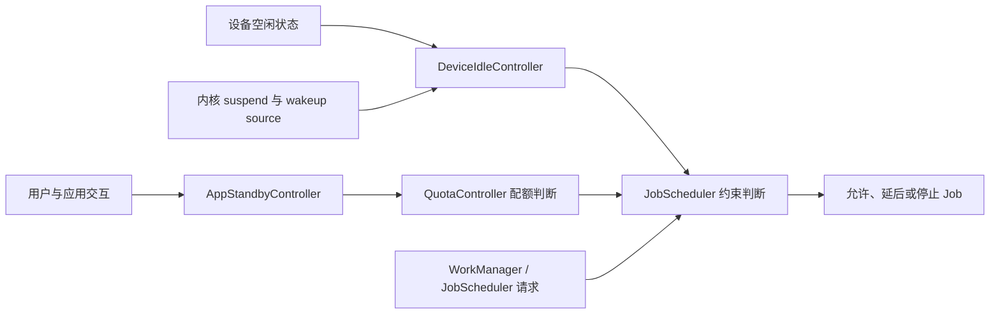
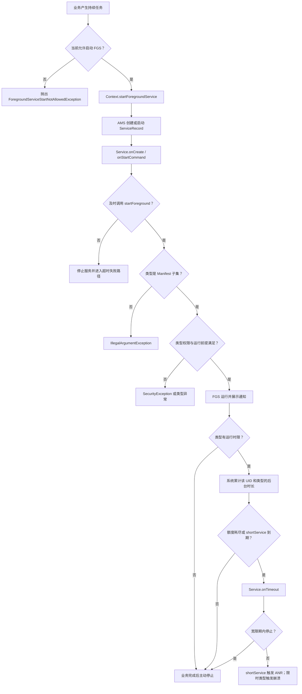

# 后台功耗与前台服务执行边界

后台功耗来自唤醒、网络、定位、传感器和持续计算。Foreground Service 只为用户可感知的持续任务提供执行边界，还受类型、启动时机、通知和超时约束。

## 后台唤醒、网络与任务预算

### 治理范围

后台功耗治理关注应用如何控制不可见阶段的资源消耗。Doze（设备空闲低功耗模式）、App Standby（应用待机）和 Job（由系统调度的后台任务）配额的系统实现见 §5.3；WakeLock（唤醒锁）、Alarm（定时任务）、定位与 FCM（Firebase Cloud Messaging，Firebase 云消息）的横向策略见 §11.2；诊断流程见 §25.1；前台服务（Foreground Service，FGS）超时和 Android 16 Job 配额的专题分析见 §25.2。

后台工作应具备四项性质：允许延后的工作交给系统调度，同一目的的工作可以合并，业务条件失效后可以取消，运行与停止原因可以观测。系统负责限制 CPU（中央处理器）、网络、Job、Alarm 和位置访问，却不了解某次同步是否仍有业务价值，也不知道某段轨迹何时可以降低采样频率。应用必须自己定义任务有效期、停止条件和资源预算。

进程仍然存活并不表示任务可以持续执行。进程存活、组件生命周期、后台启动资格、Job 配额和资源访问权限是不同条件。某项工作即使已经进入进程，也可能因约束变化、配额用完或服务超时而停止。

### Android 后台执行限制演进（Doze / App Standby / 待机分组）

后台工作能否执行，至少受三组条件共同影响：

- **设备状态**：设备未充电、静止且屏幕关闭一段时间后，可能进入 Doze。系统会暂停后台网络，忽略普通 WakeLock，并延后普通 Job、同步和 Alarm，直到维护窗口或退出 Doze。
- **应用使用状态**：App Standby Buckets（应用待机分组）根据用户近期与应用的交互情况，对 Job、Alarm 和网络施加不同限制。
- **任务接口与权限**：WorkManager（Jetpack 的持久后台工作调度库）、JobScheduler（Android 系统任务调度器）、AlarmManager 和前台服务各有调度语义、配额、启动资格及权限要求。

[Doze 与 App Standby 官方说明](https://developer.android.com/training/monitoring-device-state/doze-standby)将前两组条件分开定义。Doze 关注整台设备是否空闲；App Standby 关注某个应用近期是否被使用。两者可以同时影响同一个 WorkManager 任务，因为应用不可见时，WorkManager 的持久化工作会由 JobScheduler 调度。

| 版本阶段 | 后台规则变化 | 应用侧治理动作 |
|----------|--------------|----------------|
| Android 6.0 | 引入 Doze 与 App Standby | 可延后工作迁到 JobScheduler 或 WorkManager；消息到达使用 FCM，避免轮询 |
| Android 8.0 | 限制后台服务和后台定位频率 | 长时间后台服务改为调度任务；区域触发使用地理围栏，机会式位置使用被动请求 |
| Android 9 | 引入 App Standby Buckets | 测试和监控记录待机分组，区分系统延迟与任务故障 |
| Android 12 | 限制应用从后台启动前台服务 | 只从用户可见状态或官方豁免场景启动 FGS，并处理 `ForegroundServiceStartNotAllowedException` |
| Android 14 | 目标版本 34 及以上必须声明 FGS 类型和对应权限；需要使用中权限的服务在创建时接受检查 | 清单声明、启动来源和运行时权限一起验证 |
| Android 15 | 目标版本 35 及以上的 `dataSync`、`mediaProcessing` FGS 获得后台运行时限 | 实现 `Service.onTimeout(int, int)`，主动保存进度并停止服务 |
| Android 16 | Job 运行配额覆盖更多情形，包括应用离开前台后继续执行的 Job，以及与 FGS 并行的 Job | 记录停止原因和待执行原因历史；不要用 FGS 规避 Job 配额 |
| Android 17 | 后台音频播放、音频焦点和音量操作受到更严格的生命周期检查 | 媒体任务按 Android 17 的音频资格要求审查，参见 §25.9 |

`restricted` 是限制最严的待机分组，但仍保留受限的执行机会。Android 13 及以上的官方规则是：不属于豁免范围的应用每天可在一次十分钟批处理时段内运行 Job，可用的 expedited Job（加急任务）更少，并且每天只能触发一次 Alarm。充电时这些限制仍然存在；设备同时处于充电、空闲和非计费网络时，限制会放宽。OEM（设备厂商）可以调整分组算法，应用不应尝试诱导系统将自己放入某个分组。参见 [App Standby Buckets](https://developer.android.com/topic/performance/appstandby)。

#### Android 17 源码中的职责边界

关系图用于定位平台源码，表达组件之间的控制关系；一次后台任务不一定依次经过所有组件。



`DeviceIdleController` 管理设备空闲与维护窗口，`AppStandbyController` 管理待机分组，`QuotaController` 参与 Job 配额计算。内核负责系统挂起（suspend）和唤醒源（wakeup source）的生命周期，并不知道 `STANDBY_BUCKET_RARE` 之类的框架层概念。分析一次唤醒时，需要将框架调度信息、应用任务日志和内核唤醒证据按时间对齐。

Android 17 / API 37 的平台源码可从这些入口开始核对：

- [`DeviceIdleController.java`](https://android.googlesource.com/platform/frameworks/base/+/refs/tags/android-17.0.0_r1/apex/jobscheduler/service/java/com/android/server/DeviceIdleController.java)：Doze 状态机、白名单和维护过程。
- [`AppStandbyController.java`](https://android.googlesource.com/platform/frameworks/base/+/refs/tags/android-17.0.0_r1/apex/jobscheduler/service/java/com/android/server/usage/AppStandbyController.java)：待机分组的框架实现与事件处理。
- [`QuotaController.java`](https://android.googlesource.com/platform/frameworks/base/+/refs/tags/android-17.0.0_r1/apex/jobscheduler/service/java/com/android/server/job/controllers/QuotaController.java)：Job 配额约束。
- [`JobScheduler.java`](https://android.googlesource.com/platform/frameworks/base/+/refs/tags/android-17.0.0_r1/apex/jobscheduler/framework/java/android/app/job/JobScheduler.java)：应用可见的调度接口、待执行原因和停止原因接口。
- [`UsageStatsManager.java`](https://android.googlesource.com/platform/frameworks/base/+/refs/tags/android-17.0.0_r1/core/java/android/app/usage/UsageStatsManager.java)：`ACTIVE`、`WORKING_SET`、`FREQUENT`、`RARE`、`RESTRICTED` 等待机分组常量。
- [`ServiceInfo.java`](https://android.googlesource.com/platform/frameworks/base/+/refs/tags/android-17.0.0_r1/core/java/android/content/pm/ServiceInfo.java)：`FOREGROUND_SERVICE_TYPE_*` 常量及服务类型定义。
- [`drivers/base/power/wakeup.c`](https://android.googlesource.com/kernel/common/+/refs/tags/android17-6.18-2026-06_r6/drivers/base/power/wakeup.c) 与 [`kernel/power/suspend.c`](https://android.googlesource.com/kernel/common/+/refs/tags/android17-6.18-2026-06_r6/kernel/power/suspend.c)：Android 17 对应内核基线中的 wakeup source 和系统休眠入口。

应用可以通过 `UsageStatsManager.getAppStandbyBucket()` 读取自己的当前分组。Android 16 / API 36 起，`JobScheduler.getPendingJobReasonsHistory(jobId)` 可查看某个待执行 Job 的原因历史；该历史会被截断，也不会跨重启保存，不能用作完整审计日志。

评审一个后台任务时，可以连续追问：

- 任务是否由用户刚刚发起，用户是否正在等待结果？
- 结果允许延迟到什么时刻，超过时限后还有没有执行价值？
- 网络、充电、空闲、电量等条件中，哪些是业务要求？
- 重复触发时应保留旧工作、替换旧工作，还是追加新工作？
- 页面关闭、退出账号、权限撤销或数据已被删除时，谁负责取消任务？
- 任务被系统停止后，哪些进度可以安全恢复，哪些步骤必须保证幂等，也就是重复执行不会产生额外副作用？

### 后台任务最佳实践

后台任务按时效和用户可见性分类，比按业务模块分类更有用。用户正在等待的工作走即时路径；需要可靠完成但允许延后的工作走 WorkManager；周期同步和维护工作使用带约束的持久化调度；仅用于维持进程活跃的轮询应当删除。官方的[后台任务耗电优化指南](https://developer.android.com/develop/background-work/background-tasks/optimize-battery)也建议检查任务是否重复、约束是否合理，以及任务为何被系统停止。

| 任务类型 | 推荐 API | 功耗治理点 | 不建议的做法 |
|----------|----------|------------|--------------|
| 用户发起的上传、导出、下载 | 用户发起的数据传输 API、合适类型的 FGS 或 WorkManager 加急工作 | 显示进度，提供取消入口，定义失败后的恢复方式 | 从静默广播启动无类型 FGS |
| 可靠但可延后的同步 | WorkManager `OneTimeWorkRequest` | 设置网络、充电、电量不低等约束；同类任务用唯一工作合并 | 每个业务各起一个周期线程 |
| 周期性刷新 | WorkManager 周期工作或 JobScheduler | 根据数据时效设置周期；后台只同步必要数据 | 用短周期轮询模拟即时消息 |
| 缓存清理、日志压缩、索引构建 | WorkManager / JobScheduler 空闲与充电约束 | 只在空闲、充电、非低电量时运行；任务可中断 | 应用启动后立刻扫描全部文件 |
| 即时消息 | FCM | 只有会展示通知的消息使用高优先级，消息负载包含展示所需信息 | 收到推送后再发起多轮网络请求 |

这个 WorkManager 示例调度批量收件箱同步。场景允许等待非计费网络和较高电量，重试间隔由业务策略传入，避免在公共组件中写死某个业务的退避时间；退避指失败后逐步延长重试间隔。

```kotlin
fun enqueueBulkInboxSync(
    context: Context,
    retryBackoffMillis: Long,
) {
    require(
        retryBackoffMillis in
            WorkRequest.MIN_BACKOFF_MILLIS..WorkRequest.MAX_BACKOFF_MILLIS
    )

    val constraints = Constraints.Builder()
        .setRequiredNetworkType(NetworkType.UNMETERED)
        .setRequiresBatteryNotLow(true)
        .build()

    val request = OneTimeWorkRequestBuilder<InboxSyncWorker>()
        .setConstraints(constraints)
        .setBackoffCriteria(
            BackoffPolicy.EXPONENTIAL,
            retryBackoffMillis,
            TimeUnit.MILLISECONDS,
        )
        .addTag("inbox-sync")
        .build()

    WorkManager.getInstance(context).enqueueUniqueWork(
        "inbox-sync",
        ExistingWorkPolicy.KEEP,
        request,
    )
}
```

示例假定已导入 `java.util.concurrent.TimeUnit`。`UNMETERED` 表示非计费网络约束，`BatteryNotLow` 表示电量不能过低；两者会减少高成本网络与低电量阶段的执行，但也会增加等待时间，只适合允许延迟的批量同步。`KEEP` 表示同名工作尚未结束时忽略新请求；如果新请求代表更新后的用户意图，应重新评估 `REPLACE` 或 `APPEND_OR_REPLACE`。退避只处理 Worker（WorkManager 的任务执行单元）返回 `Result.retry()` 的情况，不能代替网络请求自身的超时和幂等设计。

任务开始时间不能视为承诺时间。Doze、待机分组、约束和系统负载都可能推迟执行。运行后也可能因约束变化、配额或应用取消而停止。WorkManager 可读取 `WorkInfo.getStopReason()`；直接使用 JobScheduler 时，可读取 `JobParameters.getStopReason()`。Android 14 及以上，如果 Job 频繁超时，系统可能将应用放入 `restricted` 分组。

Android 16 进一步扩大了 Job 运行配额的适用范围：

- 应用在前台启动的 Job，如果应用离开可见状态后仍继续运行，会受配额约束。
- 与前台服务同时运行的 Job 也受配额约束。
- 这些变化会影响直接使用 JobScheduler 的任务，也会影响基于它实现的 WorkManager 和 DownloadManager（系统下载管理器）。
- `ACTIVE` 分组拥有较宽裕的运行配额，不等于无限运行。

这些规则来自 [Android 16 后台任务行为变更](https://developer.android.com/about/versions/16/behavior-changes-all)，在 Android 17 上继续生效。

任务观测至少记录这些字段：

| 字段 | 用途 |
|------|------|
| `task_name` | 区分业务任务，避免只看到 Worker 类名 |
| `trigger_source` | 标记来自用户动作、推送、周期任务、冷启动补偿还是重试 |
| `visible_to_user` | 判断是否允许使用前台服务或加急工作 |
| `constraints` | 回放时知道任务为什么没到运行条件 |
| `standby_bucket` | 解释 Job / WorkManager 延迟和配额变化 |
| `stop_reason` | 区分配额、超时、约束变化、取消与其他系统停止原因 |
| `attempt` / `enqueue_time` / `start_time` | 区分排队延迟、执行耗时与重试次数 |
| `network_bytes` / `cpu_time_ms` | 和 §25.1 的 BatteryStats / Perfetto 数据对齐 |

统一封装的价值在于一致记录调度语义，但不应隐藏所有平台差异。业务仍需明确时效、幂等键、取消条件和数据归属；基础组件负责记录调度接口、系统约束、停止原因和资源用量。只修某个 Worker 的执行逻辑，无法解释它为什么被排队、停止或重复触发。

### 前台服务的正确使用与 Android 14+ 限制

前台服务适用于用户明确知道且希望持续进行的工作，例如导航、通话、媒体播放或运动记录。它不是进程保活接口。持续通知只说明服务正在工作，也不会取消 Doze、Job 配额和后台启动限制。

评审 FGS 时，要分别验证五项条件：

1. **业务是否适合 FGS**：工作必须对用户可感知，并有清晰的开始与停止条件。
2. **能否从当前位置启动**：目标版本 31 及以上从后台启动 FGS 受到限制，只有[官方列出的豁免场景](https://developer.android.com/develop/background-work/services/fgs/restrictions-bg-start)可以启动。
3. **服务类型与权限是否匹配**：目标版本 34 及以上必须在清单中声明类型及对应 `FOREGROUND_SERVICE_*` 权限。
4. **受保护资源能否访问**：位置、相机、麦克风和身体传感器的使用中权限（while-in-use permission，一般只在应用可见或满足对应前台服务条件时可用）有自己的可见性要求。
5. **运行时限是否满足**：部分 FGS 类型有系统时限，应用仍需设置更早的业务超时与取消入口。

这个清单片段只展示位置型前台服务的基础声明，用于核对服务类型与权限是否一致。

```xml
<manifest xmlns:android="http://schemas.android.com/apk/res/android">
    <uses-permission android:name="android.permission.FOREGROUND_SERVICE" />
    <uses-permission android:name="android.permission.FOREGROUND_SERVICE_LOCATION" />
    <uses-permission android:name="android.permission.ACCESS_FINE_LOCATION" />

    <application>
        <service
            android:name=".TrackingForegroundService"
            android:exported="false"
            android:foregroundServiceType="location" />
    </application>
</manifest>
```

清单声明不授予运行时位置权限，也不授予任意时刻从后台启动 FGS 的资格。应用还要请求 `ACCESS_COARSE_LOCATION` 或 `ACCESS_FINE_LOCATION`，并验证系统位置开关。需要在应用处于后台时持续读取位置的场景，还要按版本与业务需要评估 `ACCESS_BACKGROUND_LOCATION`。

这里有两个相互独立的门槛，容易混淆：

- `ACCESS_BACKGROUND_LOCATION` 解决的是应用在后台时能否读取位置。
- 后台启动 FGS 的限制解决的是应用能否创建服务。

拥有后台位置权限不会自动获得通用的 FGS 后台启动豁免。反过来，即使命中某个启动豁免，如果位置权限或系统位置开关不满足，服务也不能读取位置。Android 14 及以上会在创建需要使用中权限的 FGS 时检查当前资格，失败时可能抛出 `SecurityException`。

#### 时限与 Android 17 变化

- `shortService` 的系统时限约为三分钟。它适合短暂完成工作，不适合用来延长普通后台任务。
- 目标版本 35 及以上时，`dataSync` 和 `mediaProcessing` 各自在滚动的 24 小时窗口中共享六小时后台运行额度；同一应用内相同类型的所有服务共同消耗对应额度。用户将应用带回前台时，计时器会重置。收到 `Service.onTimeout(int, int)` 后，应保存可恢复进度并在数秒内调用 `stopSelf()`。参见 [Foreground service timeouts](https://developer.android.com/develop/background-work/services/fgs/timeout)。
- Android 17 会检查后台音频播放、音频焦点请求和音量操作是否来自有效生命周期。生命周期无效时，播放与音量操作会静默失败，音频焦点请求返回 `AUDIOFOCUS_REQUEST_FAILED`。目标版本 37 及以上的应用要求更严：相关 FGS 需要具备 while-in-use（使用中）能力；持有精确 Alarm 权限并操作 `USAGE_ALARM` 音频流是文档列出的例外。参见 [Android 17 后台音频变化](https://developer.android.com/about/versions/17/behavior-changes-all)与 §25.9。

FGS 通知应说明具体工作及停止方式，例如写明正在导航或正在上传所选文件。服务在任务完成、用户取消、权限撤销、退出账号或业务时限到达时都应停止。服务内部启动的 Worker 或 Job 仍受 Job 配额约束。

### 后台定位与传感器管控

Android 8.0 及以上会限制后台应用接收位置更新的频率，官方只给出每小时少数几次这一量级，不承诺固定次数。业务若依赖精确到达时间，不应从这个描述推导服务等级。区域进入或离开可使用 Geofencing API（地理围栏接口）；允许延迟的轨迹可使用批量位置；只希望复用其他客户端已经计算的位置时，可使用被动请求。参见[后台位置限制](https://developer.android.com/about/versions/oreo/background-location-limits)和[位置功耗场景指南](https://developer.android.com/develop/sensors-and-location/location/battery/scenarios)。

| 场景 | 推荐策略 | 功耗边界 |
|------|----------|----------|
| 地图、导航、运动记录，用户正在查看结果 | 位置型 FGS + 与需求匹配的请求 | 通知持续可见；场景结束立即注销监听并停止服务 |
| 到店提醒、区域进入或离开 | Geofencing API | 根据业务时效设置停留延迟和响应时间，不假设秒级到达 |
| 天气、城市级推荐等机会式需求 | 被动位置或低功耗请求 | 被动请求可能长期没有结果，不能用来承诺时限 |
| 允许延迟上传的轨迹 | 批量位置 | 接受批量回调延迟，避免持续高精度上传 |
| 仅为刷新首页内容 | 前台按需获取或使用仍符合时效的最近位置 | 不在后台持续订阅位置 |

这个函数构造被动位置请求。所有时间都由业务根据数据时效传入，函数只检查参数关系。

```kotlin
fun buildPassiveLocationRequest(
    desiredIntervalMillis: Long,
    minUpdateIntervalMillis: Long,
    maxUpdateDelayMillis: Long,
): LocationRequest {
    require(desiredIntervalMillis > 0L)
    require(minUpdateIntervalMillis in 1L..desiredIntervalMillis)
    require(maxUpdateDelayMillis >= desiredIntervalMillis)

    return LocationRequest.Builder(
        Priority.PRIORITY_PASSIVE,
        desiredIntervalMillis,
    )
        .setMinUpdateIntervalMillis(minUpdateIntervalMillis)
        .setMaxUpdateDelayMillis(maxUpdateDelayMillis)
        .build()
}
```

当前 Google Play services API 使用 `Priority.PRIORITY_PASSIVE`。这种请求不会为了自己额外计算位置，只接收其他客户端产生的位置，因此可能没有任何回调。`desiredIntervalMillis` 也不是交付期限。如果业务需要在规定时间内获得位置，应在用户可见阶段使用与精度需求匹配的优先级，并限制持续时间；不能悄悄将被动请求改成长时间 `PRIORITY_HIGH_ACCURACY`。参见 [`Priority` API](https://developers.google.com/android/reference/com/google/android/gms/location/Priority)。

传感器治理要区分普通传感器和受使用中权限约束的身体传感器。`health` 类型 FGS 需要声明 `FOREGROUND_SERVICE_HEALTH`，并满足 `HIGH_SAMPLING_RATE_SENSORS` 或相应的健康数据运行时权限。身体传感器权限边界按系统版本区分：

- API 35 及以下使用 `BODY_SENSORS`。
- API 36 及以上使用相应的传感器读取权限，例如 `READ_HEART_RATE`、`READ_SKIN_TEMPERATURE`、`READ_OXYGEN_SATURATION`。
- API 33～35 的后台身体传感器访问需要 `BODY_SENSORS_BACKGROUND`；API 36 及以上对应 `READ_HEALTH_DATA_IN_BACKGROUND`。

这些权限决定能否访问数据，FGS 后台启动资格仍需独立检查。具体类型与前提条件以[前台服务类型文档](https://developer.android.com/develop/background-work/services/fgs/service-types)为准。

定位和传感器都应按采样预算管理：

- 每个业务声明采样目的、前后台状态、精度、最短间隔、最长持续时间。
- 页面不可见后降级采样；任务结束、权限撤销、账号退出时释放监听。
- 多业务复用一个位置源，避免首页、推荐、风控、埋点各自启动一套请求。
- 在同一时间范围内关联 GNSS（全球卫星导航系统）、传感器、CPU 和网络数据，再用 §25.1 的 BatteryStats 与 Perfetto（Android 系统追踪工具）分析归因。

### 后台任务回归守门

后台功耗回归需要同时覆盖调度结果和资源消耗。只检查任务是否成功，会漏掉重复执行和过度重试；只检查总耗电，又难以定位责任业务。测试至少记录后台唤醒、排队与运行时长、停止原因、CPU 时间、网络流量、位置请求和 FGS 持续时间。

这些命令用于测试机上强制进入 Doze，并检查 `restricted` 分组下的行为。将示例包名替换为待测应用；不要在日常使用的设备上保留这些测试状态。

```bash
adb shell dumpsys battery unplug
adb shell dumpsys batterystats --reset
adb shell dumpsys deviceidle force-idle
adb shell dumpsys deviceidle

adb shell dumpsys deviceidle unforce
adb shell am set-standby-bucket com.example.app restricted
adb shell am get-standby-bucket com.example.app

adb shell am set-standby-bucket com.example.app active
adb shell dumpsys battery reset
```

`force-idle` 用于验证 Doze 中任务是否被延后以及退出后能否恢复；`set-standby-bucket` 用于复现待机分组限制；末尾两条命令将待机分组和电池服务恢复到测试前的常用状态。待机分组算法允许 OEM 调整，强制分组只能验证应用在该条件下的行为，不能预测每台设备何时自动进入该分组。

回归场景不要照抄固定的息屏时长或推送条数。测试周期应覆盖本业务完整的调度、超时和重试窗口，事件数量来自线上基线或明确的容量目标。测试分五步进行：

1. 记录开始时间，清理测试任务并重置 BatteryStats。
2. 执行业务场景，覆盖网络变化、任务重复触发、退出账号、权限撤销和进程重启。
3. 分别在正常状态、Doze 和目标待机分组下运行。
4. 导出 bugreport（Android 系统诊断报告）、Perfetto 轨迹、WorkManager 或 JobScheduler 原因，以及应用任务日志。
5. 按时间关联每次唤醒、任务状态变化和资源用量，与稳定版本的分布比较。

不要将多种资源压成一个总分。CPU 下降可能伴随位置请求增加，网络流量减少也可能伴随 FGS 时间增长。每类资源应有独立预算，每个超限项都要能定位到任务名和责任业务。

### 小结

后台功耗治理要回答三个问题：任务为何此时执行，系统为何允许它执行，它何时必须停止。Doze 描述设备空闲，App Standby Buckets 描述应用使用状态，任务接口与权限决定具体执行资格；三者不能互相替代。

应用侧需要明确任务时效、约束、幂等、取消条件、停止原因和资源预算。评审时将 Android 17 / API 37 的框架源码与 `android17-6.18-2026-06_r6` 内核证据分层使用：框架说明调度与配额决定，内核说明休眠和唤醒事实。§25.3 统一说明 WakeLock、Alarm 与 WorkManager 的唤醒价值、延后或合并边界，以及如何稳定复现。

## 前台服务类型、启动与停止语义

后台任务需要持续运行时，先判断是否符合前台服务场景。类型声明不能消除后台启动限制，也不能代替及时停止和资源释放。

前台服务（Foreground Service，FGS）用于承载用户已经知晓、离开页面后仍需继续的工作，例如播放、导航、通话和屏幕采集。它提供持续通知，也会让系统在内存回收时把承载进程放在较难被回收的档位，但不承诺独占 CPU、无限运行、随时从后台启动服务或打开页面。

Android 17 沿用了 Android 12 至 Android 16 逐步增加的 FGS 限制，并新增了两处需要单独处理的 API 37 边界：

- 后台音频交互需要合法的非 `shortService` FGS；以 API 37 为目标时，FGS 还要具有 while-in-use（WIU，“仅在使用期间”）能力。这里的 WIU 能力表示 FGS 来自用户可感知的交互上下文，因而可以继续执行需要“正在使用”状态的受保护操作；闹钟音频有受限例外。
- `IntentSender.sendIntent()` 纳入后台 Activity 启动（Background Activity Launch，BAL）的发送方显式授权规则。BAL 管的是应用不在前台时能否打开 Activity，与能否启动 FGS 不是同一项许可。

源码基准为 `android-17.0.0_r1`。历史版本用于解释规则从何时生效，不把预览版或 `main` 分支行为写成 Android 17 结论。

### 1. 一次 FGS 启动要通过三道独立检查

工程上最容易出现的误判，是把“能调用 `startForegroundService()`”“能晋升为 FGS”“能访问敏感资源”当成同一个条件。系统分别判断三个问题：

| 检查 | 发生时机 | 典型失败 |
|---|---|---|
| 调用方能否从当前状态启动 FGS | `startForegroundService()` 请求进入 ActivityManagerService（AMS，`system_server` 中负责应用组件生命周期和进程管理的核心服务）时 | `ForegroundServiceStartNotAllowedException` |
| Service 能否按 AndroidManifest.xml（文中简称 Manifest）声明的类型晋升 | `startForeground()` 进入 `ActiveServices.setServiceForegroundInnerLocked()` 时 | `MissingForegroundServiceTypeException`、`IllegalArgumentException`、`SecurityException` |
| 晋升后能否访问目标资源并继续运行 | 类型权限、WIU 能力、运行时额度和具体子系统再次检查时 | 资源访问被拒、`onTimeout()`、ANR 或 `RemoteServiceException` |

ANR 是 Application Not Responding，即应用主线程长期无法响应时的“应用无响应”故障。`RemoteServiceException` 则是系统发现 Service 违反生命周期约束后，向应用进程投递的运行时异常；它不是 Binder 调用常见的 `RemoteException`。

一条经过确认的 Firebase Cloud Messaging（FCM，Firebase 云消息推送）高优先级消息，可能临时允许应用从后台启动 FGS，却不会自动赋予摄像头、麦克风或位置的 WIU 能力。一个正在运行的 FGS 也不会自动获得 BAL 权限。这些条件要分开记录和排查。

这张图把 Android 17 的主状态变化压缩到一条可用于日志设计的路径中。图中的 `ServiceRecord` 是 AMS 为每个 Service 保存的内部运行记录，不是应用可以创建或持有的公开对象：



`startForeground()` 成功只代表服务通过了本次晋升检查。后续资源访问、时间额度、用户停止和进程回收仍会改变结果。

### 2. 从 `startForegroundService()` 到 `startForeground()`

#### 2.1 两段式调用的职责

调用方通过 `Context.startForegroundService()` 请求系统启动 Service。Service 收到生命周期回调后，应尽快调用 `startForeground()`，同时提交非零通知 ID、通知对象和本次使用的 FGS 类型。

`android-17.0.0_r1` 的 `ActiveServices.scheduleServiceForegroundTransitionTimeoutLocked()` 会启动晋升计时器。计时器到期后，`serviceForegroundTimeout()` 停止仍在等待晋升的服务，并准备 ANR 记录；Service 在等待期间被提前销毁时，`serviceForegroundCrash()` 可向应用投递 `ForegroundServiceDidNotStartInTimeException`。

Android 17 AOSP 中，`ActivityManagerConstants.DEFAULT_SERVICE_START_FOREGROUND_TIMEOUT_MS` 是 30 秒，后续 ANR 延迟默认是 10 秒。两个值都能通过 DeviceConfig（系统组件可动态读取的配置项）改写。应用不能把 30 秒当作业务预算：进程启动、主线程排队、依赖初始化和设备配置都会挤占可用时间，Service 进入回调后应尽早调用 `startForeground()`。

#### 2.2 不要在晋升前等待耗时初始化

常见错误是在 `onCreate()` 中同步创建数据库、恢复大对象、连接网络或等待 Binder（Android 的跨进程调用机制）返回，再调用 `startForeground()`。这会把所有冷启动成本叠加到晋升计时器上。

更稳妥的顺序是：

1. 预先创建通知渠道。
2. Service 进入回调后立即构造轻量通知并调用 `startForeground()`。
3. 把业务工作交给可取消的异步任务。
4. 工作完成、失败或取消时统一调用 `stopSelf()`。

FGS 不会把 Service 回调移出主线程。`onCreate()`、`onStartCommand()`、`onTimeout()` 默认仍由应用主线程接收，重 I/O 和计算要转移到合适的执行器。

### 3. 类型声明与晋升时校验

#### 3.1 Android 17 的公开类型集合

以 API 37 SDK 和 `ServiceInfo` 为准，应用可见的类型包括：

| 类型 | 适用工作 | 额外条件摘要 |
|---|---|---|
| `dataSync` | 上传、下载、备份、恢复、导入导出 | `FOREGROUND_SERVICE_DATA_SYNC`；以 API 35+ 为目标时受 6 小时额度约束 |
| `mediaPlayback` | 音乐、视频、有声内容播放 | `FOREGROUND_SERVICE_MEDIA_PLAYBACK`；建议配合 Media3 的播放会话组件 `MediaSessionService` |
| `phoneCall` | Telecom 框架通过 `ConnectionService` 管理的持续通话 | `FOREGROUND_SERVICE_PHONE_CALL`，并持有 `MANAGE_OWN_CALLS` 或默认拨号角色 |
| `location` | 导航、位置共享、持续定位 | `FOREGROUND_SERVICE_LOCATION` 和位置权限；WIU 状态另行检查 |
| `connectedDevice` | 蓝牙、Wi-Fi、USB、NFC、超宽带（UWB）等设备交互 | `FOREGROUND_SERVICE_CONNECTED_DEVICE`，并满足至少一项设备访问前提 |
| `mediaProjection` | `MediaProjection` 屏幕采集 | `FOREGROUND_SERVICE_MEDIA_PROJECTION` 和当前用户授权的采集会话 |
| `camera` | 持续相机使用 | `FOREGROUND_SERVICE_CAMERA` 和 `CAMERA`；受 WIU 约束 |
| `microphone` | 录音、语音通信 | `FOREGROUND_SERVICE_MICROPHONE` 和录音权限；受 WIU 约束 |
| `health` | 运动、健康传感器采集 | `FOREGROUND_SERVICE_HEALTH`，并满足对应传感器或 Health Connect 权限 |
| `remoteMessaging` | 跨设备消息连续性 | `FOREGROUND_SERVICE_REMOTE_MESSAGING` |
| `shortService` | 约 3 分钟内完成的关键短任务 | 无类型专用权限；仍需 `FOREGROUND_SERVICE` |
| `mediaProcessing` | 视频、图片等离线媒体处理 | `FOREGROUND_SERVICE_MEDIA_PROCESSING`；以 API 35+ 为目标时受 6 小时额度约束 |
| `specialUse` | 其他有效且无法归类的 FGS 场景 | `FOREGROUND_SERVICE_SPECIAL_USE`，Manifest 中说明子类型，并接受商店审核 |
| `systemExempted` | 受系统身份、角色或策略保护的场景 | 普通三方应用不能把它当作通用选择 |

`ServiceInfo` 中还能看到隐藏的 `fileManagement` 常量，`ForegroundServiceTypePolicy` 也声明了对应策略对象。不过，Android 17 的默认策略映射刻意不注册它，并注明“暂时隐藏”；如果有人传入该类型，策略会按 `none` 处理。它不是面向三方应用的公开方案。

类型描述业务目的，系统不会定时查询“是否正占用对应硬件”，也没有发现不占硬件就自动移除通知、改为普通 Service 的通用路径。系统在晋升时校验声明、类型权限和运行前提；Camera、Audio、Location、MediaProjection 等子系统还会在资源访问时执行自己的权限和状态检查。

#### 3.2 Manifest 与运行时类型必须一致

这段 Manifest 为一个 `dataSync` 服务声明基础权限和类型，通知权限用于常规通知展示：

```xml
<manifest xmlns:android="http://schemas.android.com/apk/res/android">
    <uses-permission android:name="android.permission.FOREGROUND_SERVICE" />
    <uses-permission android:name="android.permission.FOREGROUND_SERVICE_DATA_SYNC" />
    <uses-permission android:name="android.permission.POST_NOTIFICATIONS" />

    <application ...>
        <service
            android:name=".SyncService"
            android:exported="false"
            android:foregroundServiceType="dataSync" />
    </application>
</manifest>
```

`POST_NOTIFICATIONS` 被拒绝时，合法 FGS 仍可启动；服务仍须提交通知，系统会在活动应用或 Task Manager 等界面保留可见性，常规通知抽屉可能不显示它。不能把通知权限结果用作是否调用 `startForeground()` 的判断。

这段 Kotlin 示例把晋升放在回调开头，并在完成、取消和超时时停止服务：

```kotlin
class SyncService : Service() {
    private val scope = CoroutineScope(SupervisorJob() + Dispatchers.IO)

    override fun onStartCommand(intent: Intent?, flags: Int, startId: Int): Int {
        ServiceCompat.startForeground(
            this,
            NOTIFICATION_ID,
            buildNotification(),
            ServiceInfo.FOREGROUND_SERVICE_TYPE_DATA_SYNC
        )

        scope.launch {
            try {
                runSync()
            } finally {
                stopSelf(startId)
            }
        }
        return START_NOT_STICKY
    }

    override fun onTimeout(startId: Int, fgsType: Int) {
        scope.cancel("FGS time limit reached")
        stopSelf(startId)
    }

    override fun onDestroy() {
        scope.cancel()
        super.onDestroy()
    }

    override fun onBind(intent: Intent?): IBinder? = null
}
```

`buildNotification()` 应只读取内存中的轻量状态，通知渠道应在更早阶段创建。`startId` 是系统为每次 Service 启动请求递增分配的编号，`stopSelf(startId)` 只会在该编号仍是最新请求时停止服务，可避免旧请求结束时误停新请求。真实项目还要让 `runSync()` 支持协作式取消，并做到幂等恢复，也就是同一任务重试多次不会重复写入结果或产生额外副作用。

调用入口应记录用户动作，并处理当前状态不准启动 FGS 的结果：

```kotlin
fun startUserRequestedSync(context: Context) {
    val intent = Intent(context, SyncService::class.java)
    try {
        ContextCompat.startForegroundService(context, intent)
    } catch (e: ForegroundServiceStartNotAllowedException) {
        enqueueConstrainedWork(context)
    }
}
```

`ForegroundServiceStartNotAllowedException` 适合转入可延期任务或提示用户重试。类型专用权限与运行前提在 Service 调用 `startForeground()` 时校验，那里抛出的 `SecurityException` 不会同步返回这段调用代码；应在启动前核对前提，并把 Service 端异常纳入崩溃监控。

#### 3.3 `ActiveServices` 的四类校验结果

`setServiceForegroundInnerLocked()` 先读取 Manifest 类型。运行时类型必须是 Manifest 类型位集合的子集，否则抛出 `IllegalArgumentException`。随后 `validateForegroundServiceType()` 调用 `ForegroundServiceTypePolicy`，把结果映射为：

- 未声明有效类型：`MissingForegroundServiceTypeException` 或 `InvalidForegroundServiceTypeException`。
- 类型专用权限或运行前提不满足：`SecurityException`。
- 兼容阶段的宽松拒绝：记录警告；是否强制取决于目标 SDK 和兼容开关。兼容开关是系统按应用单独启停行为变化的测试或迁移机制。
- 校验通过：记录类型、进入 FGS 状态并发布通知。

多个类型可以按位组合，但每个类型的权限和前提都要满足。`shortService` 与其他类型组合时会被系统忽略，服务按其他类型运行，也失去 short 类型的约 3 分钟语义。组合类型不能用来规避类型要求。

### 4. 后台启动许可与 WIU 能力

#### 4.1 后台启动例外是窄窗口

以 API 31+ 为目标的应用通常不能在后台启动 FGS。官方允许的场景包含用户界面交互、用户请求的精确闹钟、经过确认的高优先级 FCM、特定系统广播或角色、NFC 交易事件、Companion Device Manager（配套设备管理器）和当前可见的悬浮窗等。

这些例外都有来源和时效。以 FCM 为例，系统可能把高优先级消息下调为普通优先级；应用应在启动前检查 `RemoteMessage.getPriority()`。不要在业务代码里假定“收到推送就一定有 FGS 许可”。

Android 17 的 `ActivityManagerService.mFgsStartTempAllowList` 按应用身份编号（UID）保存到期时间、原因码、原因文本和授权调用方 UID。`ActiveServices` 查询该列表，把命中的原因码用于本次后台启动判断。源码没有“FCM 固定 10 秒”“每小时固定 5 次”的通用 Android 17 规则；持续时间由产生例外的系统组件和 DeviceConfig 决定。

`FgsTempAllowList` 的作用是临时放行 FGS 启动。`OomAdjusterImpl` 根据进程是否已经承载 FGS 来调整进程状态，没有因为 UID 进入该列表就直接提升到前台进程档位。授权窗口、进程存活权重和设备休眠模式（Doze）的临时豁免列表也不能互相替代。

#### 4.2 WIU 是另一道门

Camera、Microphone、Location 和部分 Health 场景依赖 while-in-use 权限。这类权限只在应用处于用户可感知的使用状态时生效。应用即使已获授权，处于后台时 `checkSelfPermission()` 仍可能返回 `PERMISSION_GRANTED`，这只说明用户授予了“使用期间可用”的权限，不代表当前后台进程可以访问资源。

以 API 34+ 为目标时，系统会在创建此类 FGS 时检查应用当前能否使用对应权限。应用在后台且不满足 WIU 例外时，创建服务会直接抛出 `SecurityException`。通用后台 FGS 例外不保证 WIU 能力。

安全的设计方式是让用户在可见 Activity、通知、Widget 或受支持的外部设备交互中发起操作，并在该交互上下文仍有效时启动 FGS。对持续定位，还要分别核对 `ACCESS_BACKGROUND_LOCATION` 的授予与产品用途，不能从 `location` 类型本身推导后台位置权限。

### 5. 三种超时必须分开

#### 5.1 晋升超时

晋升超时覆盖 `startForegroundService()` 后迟迟没有调用 `startForeground()` 的情况。它发生在业务工作开始阶段，和 `Service.onTimeout()` 无关。

Android 17 AOSP 默认使用 30 秒晋升计时器，并在超时后安排额外 10 秒的 ANR 处理；Service 被提前收回时还可能收到 `ForegroundServiceDidNotStartInTimeException`。诊断时应搜索错误文本：

```text
Context.startForegroundService() did not then call Service.startForeground()
```

这段文本说明故障点位于晋升阶段。修复方向是缩短 Service 主线程路径、提前创建通知渠道和去除同步初始化。

#### 5.2 `shortService` 超时

`shortService` 从 `startForeground()` 调用时开始计时，Android 17 默认约 3 分钟。到期后：

1. 系统调用 `Service.onTimeout(int)`；API 35+ 同时支持 `onTimeout(int, int)`。
2. 从到期点起默认约 5 秒后，进程失去 short FGS 对应的进程状态保护。
3. 从到期点起默认约 10 秒后仍未停止，`onShortFgsAnrTimeout()` 触发 ANR。

三个时间都可由 DeviceConfig 调整，约 3 分钟是 API 语义，不能当成高精度定时器。`shortService` 不支持 sticky（返回 `START_STICKY` 后由系统尝试重建 Service）的重启模式，也不会因为正在运行就获得从后台启动另一个 FGS 的资格。它可以切换为其他类型，但应用在切换时必须具备启动新 FGS 的资格。再次用 `shortService` 调用 `startForeground()` 只有在应用当前可见或符合后台启动例外时才能延长时限，不能把重复调用当作后台续期信号。

`shortService` 没有“禁止启动 Activity”的专用规则。Activity 能否启动仍由 BAL 判断；仅有 short FGS 通常无法因此获得 BAL 许可。

#### 5.3 `dataSync` 与 `mediaProcessing` 的累计额度

以 API 35+ 为目标时，这两类 FGS 在应用处于后台期间分别拥有“24 小时内累计 6 小时”的额度。额度按 UID 和类型共享：

- 两个 `dataSync` 服务共同消耗同一份 `dataSync` 额度。
- `dataSync` 与 `mediaProcessing` 分开计时。
- 用户把应用带到前台会重置额度。
- 额度耗尽后继续运行会收到 `onTimeout(int, int)`；宽限期内不停止时，Android 17 源码通过 `ForegroundServiceDidNotStopInTimeException` 这一 `RemoteServiceException` 子类终止应用。
- 同类型额度已耗尽时再次启动，会抛出 `ForegroundServiceStartNotAllowedException`。

Android 17 的 `getTimeLimitedFgsType()` 只处理 `dataSync` 和 `mediaProcessing`。源码没有“其他 FGS 一律运行 24 小时后停止”的规则。播放、位置、通话等类型仍要服从业务合法性、子系统状态、用户停止、后台限制和内存回收。

#### 5.4 Android 16 以后的 Job 配额

从 Android 16 起，FGS 中启动的 `JobScheduler`、WorkManager 或 DownloadManager 工作仍消耗各自的运行配额。FGS 运行时长与 JobScheduler 配额没有合并成同一份计数；FGS 也不能为 Job 解除 App Standby 或调度额度。

用户明确触发的大文件传输可评估用户发起的数据传输任务（user-initiated data transfer，UIDT job）。这种 Job 专门表达用户已经启动且正在等待进度的数据传输。可延期、可重试、带网络或充电约束的工作更适合 WorkManager 或 JobScheduler。长时间 Worker 使用 FGS 时，仍要遵守 FGS 类型、启动和超时规则。

Job 配额与 FGS 时长是两套预算。排障时分别保存 FGS 类型、运行区间和超时回调，以及 Job 所属的应用待机分桶（App Standby bucket，即系统按近期使用情况给应用分档）、pending reason、stop reason、运行时长和是否与 FGS 同时运行。pending reason 说明任务为何尚未执行，stop reason 说明本轮执行为何结束。`ForegroundService` 只表达用户可感知的持续工作，不会让同进程 Job 获得无限额度。

#### 5.5 长任务必须可恢复

系统没有向应用公开 `dataSync` 或 `mediaProcessing` 的精确剩余额度。任务不能等到 `onTimeout()` 才集中保存进度，而应持续提交已经被文件系统或服务端确认的检查点。检查点是可持久化的进度边界，任务重启后可以从这里继续：

- 下载按 HTTP Range（按字节区间请求）与校验块记录，上传按服务端确认分片记录，转码按输入时间段与输出校验记录；
- 每个分片具备幂等键，也就是同一键对应的操作重复提交仍只产生一次业务结果，防止“结果已写入、状态未更新”时产生重复副作用；
- `onTimeout()` 只记录原因、发出取消信号、释放资源并停止服务，不在主线程同步等待数据库、网络或编码线程结束；
- FGS、UIDT、Job 与 WorkManager 共享同一份持久任务状态，并用租约或原子状态保证只有一个执行者。租约是带过期时间的执行权，原子状态变更则保证“检查并占用任务”不可被并发操作拆开；
- 约束与任务价值匹配，用户正在等待的工作不应被无意义的充电/空闲约束拖住。

Job/Worker 收到停止只表示调度器结束本次执行，不会自动终止应用自建线程、C/C++ 等原生代码（native code）中的工作或子进程。取消信号必须一直传播到底层；否则旧执行残留与新一轮恢复并发，既增加 CPU 和功耗，也会破坏幂等性。

### 6. FGS 对进程优先级和性能的影响

#### 6.1 常见内存回收档位

Android 17 的进程状态计算已移到 `services/core/java/com/android/server/am/psc/`。TOP 表示进程当前承载与用户直接交互的前台 Activity。`OomAdjusterImpl` 对 FGS 的关键分支如下：

| 状态 | `oom_score_adj` 基准值 | 进程状态 |
|---|---:|---|
| 普通非 short FGS | `PERCEPTIBLE_APP_ADJ = 200` | `PROCESS_STATE_FOREGROUND_SERVICE` |
| 仍在有效期内的 short FGS | `PERCEPTIBLE_MEDIUM_APP_ADJ + 1 = 226` | `PROCESS_STATE_FOREGROUND_SERVICE` |
| 刚从 TOP 转为普通 FGS 的短暂保护期 | `PERCEPTIBLE_RECENT_FOREGROUND_APP_ADJ = 50` | 依上下文继续计算 |
| 当前可见或 TOP Activity | 可见 Activity 通常为 100，TOP Activity 为 0 | 由 Activity 可见性决定 |

`oom_score_adj` 是内核回收候选分数的调整值，数值越小，进程越晚进入回收候选。表中是 FGS 分支给出的基准档位，进程绑定关系、可见组件、ContentProvider 依赖、最近前台状态和 OEM 内存策略还会参与最终计算。LMKD（Low Memory Killer Daemon，低内存终止守护进程）会结合这些分值与内存压力选择回收对象，因此 FGS 进程仍可因极端内存压力、崩溃、ANR、用户停止或策略违规而退出。

表格的结论是：FGS 会提高进程在内存压力下的存活优先级，但不会把进程变成不可回收对象；short FGS 的基准保护还弱于普通 FGS。

#### 6.2 FGS 不提供的能力

创建 FGS 不会自动获得以下能力：

- 更高的 CPU 频率或固定调度优先级。
- WakeLock（用于在特定场景保持 CPU 唤醒的锁）、网络、传感器或存储资源。
- Doze、App Standby、JobScheduler 配额豁免。
- 免受 LMKD 回收的保证。
- 后台 Activity 启动权。
- 超出类型时间额度的运行权。

业务若要求熄屏后持续执行，还要单独评估是否需要 WakeLock，并严格控制持有时长；需要联网时还要处理网络约束和重试。FGS 只解决用户可感知性、服务运行身份和一部分进程重要性问题。

#### 6.3 性能目标要来自业务测量

“FGS 启动必须小于 500 ms”“系统杀死率必须小于 0.1%”这类固定阈值没有 AOSP 或 Android API 保证。团队应按场景建立自己的指标：

- `startForegroundService()` 调用到 `onStartCommand()` 的分位延迟。
- `onStartCommand()` 到 `startForeground()` 成功的分位延迟。
- 冷启动与热启动分布。
- 各类型运行时长、停止原因和超时回调次数。
- 用户停止、进程死亡、系统拒绝和权限拒绝的比例。
- 任务完成率、重试次数、流量、WakeLock 时长和电量贡献。

记录时要带上应用版本、设备型号、系统版本、目标 SDK、调用来源、可见性、FGS 类型和异常类。缺少这些维度，单个耗时值很难用于定位。

### 7. FGS 与 BAL 没有隐式继承关系

运行 FGS 时直接调用 `startActivity()`，仍要通过 `BackgroundActivityStartController` 的 BAL 检查。持续通知本身、FGS 类型、`FgsTempAllowList` 命中都没有成为通用 BAL 例外。

合法路径通常来自用户点击通知的 `PendingIntent`、当前可见窗口、系统角色或权限，以及官方列出的其他 BAL 例外。`PendingIntent` 是由创建方预先封装、允许另一方稍后以创建方身份发送的操作令牌，所以系统要同时检查创建方与发送方。`fullScreenIntent` 是通知触发的全屏入口，只适用于来电、闹钟等高优先级且满足通知权限与渠道条件的场景，不能作为普通 FGS 展示页面的替代入口。

Android 14 起，发送 `PendingIntent` 的一方需要通过 `ActivityOptions.setPendingIntentBackgroundActivityStartMode()` 表达是否贡献自己的 BAL 权限；Android 15 起，创建方若要委托自身权限，也要显式设置创建方模式（creator mode）。API 36 新增了范围更窄的 `MODE_BACKGROUND_ACTIVITY_START_ALLOW_IF_VISIBLE`，它只在发送方可见时贡献权限，Android 17 建议优先采用该模式。

Android 17 把相同规则扩展到 `IntentSender.sendIntent()`。这段代码只在发送方可见时贡献 BAL 权限：

```kotlin
val options = ActivityOptions.makeBasic().apply {
    pendingIntentBackgroundActivityStartMode =
        ActivityOptions.MODE_BACKGROUND_ACTIVITY_START_ALLOW_IF_VISIBLE
}

intentSender.sendIntent(
    context,
    requestCode,
    fillInIntent,
    requiredPermission,
    options.toBundle(),
    context.mainExecutor,
    onFinished
)
```

该重载和 `ALLOW_IF_VISIBLE` 需要按 API 级别做运行时保护。即使发送成功，系统仍会验证创建方、发送方和当前窗口状态；BAL 被拦截时通常没有直接异常，Logcat 会记录 `Background activity launch blocked!`。

Android 16+ 可以在测试构建中启用 StrictMode 检测。StrictMode 是开发阶段发现不当 API 使用方式的诊断机制，不是生产环境的授权开关：

```kotlin
StrictMode.setVmPolicy(
    StrictMode.VmPolicy.Builder()
        .detectBlockedBackgroundActivityLaunch()
        .penaltyLog()
        .build()
)
```

这项检测适合尽早放入测试版 `Application.onCreate()`，用于发现当前已被拦截或提高目标 SDK 后将被拦截的调用。

### 8. Android 17 后台音频边界

Android 17 对播放、音频焦点和音量修改增加了后台状态检查。音频焦点是系统协调多个应用谁应当播放、暂停或压低音量的机制：

- 运行在 Android 17 上的所有应用，后台操作音频时需要可见 Activity，或运行一个类型不为 `shortService` 的 FGS。
- 以 API 37 为目标的应用若在后台操作音频，FGS 还要具有 WIU 能力。用户在应用可见时发起操作并启动 FGS，通常可以保留该能力。
- 应用拥有精确闹钟权限且操作 `USAGE_ALARM` 音频流时，WIU 条件有受限例外；它不能扩大到媒体播放。
- 音频播放和音量 API 可能静默失败；音频焦点请求返回 `AUDIOFOCUS_REQUEST_FAILED`。

播放应用宜使用 Media3 `MediaSessionService`，并在用户启动播放时创建 `mediaPlayback` FGS。播放完成、永久失焦或不可恢复错误后，结束媒体会话并停止 FGS；后续恢复应由新的用户动作触发。

这组命令用于在 Android 17 测试设备上切换后台音频限制并查看证据：

```bash
adb shell cmd audio set-enable-hardening enable
adb shell dumpsys audio
adb logcat | grep AudioHardening
```

测试结束后可用 `set-enable-hardening disable` 恢复默认测试设置。这里的 hardening 指平台新增的后台音频访问限制。`AudioHardening` 记录中的 `partial` 表示缺少 FGS，`full` 表示存在 FGS 但缺少 WIU 能力。

相关的音频功耗与生命周期设计参见 [25.9 后台音频、AudioTrack 与 Offload 功耗](09-background-audio-audiotrack-offload.md)。

### 9. 选择 FGS、Job 或 WorkManager

| 任务特征 | 候选方案 | 判断依据 |
|---|---|---|
| 用户正在听、看、导航、通话或采集屏幕 | 对应类型 FGS | 用户需要持续感知和随时停止 |
| 用户发起的大文件上传或下载 | UIDT job；必要时评估 `dataSync` FGS | 传输语义、进度展示、配额和中断恢复 |
| 可延期、可重试、有网络或充电约束 | WorkManager 或 JobScheduler | 系统安排时机，天然支持约束和重试 |
| 约 3 分钟内必须完成且无法延期 | `shortService`，仅在后台启动资格成立时使用 | 到期后必须停止，否则触发 ANR |
| 精确到时的用户闹钟 | 精确闹钟（Exact Alarm） | 只用于用户明确需要的精确时间事件 |
| 收到推送后刷新缓存 | 普通 WorkManager；高优先级消息仅用于时效内容 | 推送优先级可能被下调，FGS 许可不是固定条件 |

表格的判断重点是任务语义，而非哪种 API 看起来更“强”。方案选择应从用户可感知性、是否允许延期、失败后能否恢复、所需资源和平台配额出发。把所有后台任务包进 FGS 会增加通知干扰、功耗、超时和商店审核风险。

推送触发细节参见 [8.6 推送通知管线性能：FCM 投递延迟与 NotificationManagerService 渲染](../../part2-performance/ch08-responsiveness/06-push-notification-pipeline-performance.md)。OEM 额外后台策略的取证方法参见 [25.1 功耗诊断与 OEM 后台限制](01-power-diagnosis-oem-background.md)。

### 10. 可观测性与故障注入

可观测性是通过日志、指标和系统状态还原实际执行过程；故障注入则是主动缩短时限或切换兼容行为，验证异常路径是否可恢复。两者结合，才能区分平台拒绝、业务取消和设备差异。

#### 10.1 基础诊断命令

这组命令分别查看 ServiceRecord、进程状态和最近的系统拒绝记录：

```bash
adb shell dumpsys activity services com.example.app
adb shell dumpsys activity processes com.example.app
adb logcat -v threadtime ActivityManager:I ActivityTaskManager:I '*:S'
```

`services` 输出可核对 `isForeground`、通知 ID、FGS 类型、启动时间和 short FGS 状态；`processes` 输出用于对照 `procState` 与 `adj`。`procState` 是组件活跃程度的粗粒度进程状态，`adj` 是内存回收优先级调整值。不同厂商可能追加字段，脚本应优先匹配字段名和事件语义，避免依赖固定行号。

#### 10.2 压缩限时类型的测试周期

这组命令在测试设备上启用限时类型兼容变更，并把两类额度缩短到 60 秒：

```bash
adb shell am compat enable FGS_INTRODUCE_TIME_LIMITS com.example.app
adb shell device_config put activity_manager data_sync_fgs_timeout_duration 60000
adb shell device_config put activity_manager media_processing_fgs_timeout_duration 60000
```

测试应覆盖 `onTimeout()` 到达、协程取消、`stopSelf(startId)`、重复 startId、进程重建和额度耗尽后的再次启动。

这组命令删除测试覆盖值，防止后续用例继续继承 60 秒配置：

```bash
adb shell device_config delete activity_manager data_sync_fgs_timeout_duration
adb shell device_config delete activity_manager media_processing_fgs_timeout_duration
adb shell am compat reset FGS_INTRODUCE_TIME_LIMITS com.example.app
```

兼容开关重置后，应重启应用进程并复核 DeviceConfig 输出；共享测试设备还要记录配置修改人和恢复时间。

#### 10.3 建议记录的应用事件

每次启动至少记录以下阶段，时间戳使用同一个单调时钟。单调时钟只随设备运行时间递增，不受用户改时间或网络校时影响，适合计算阶段耗时：

1. 用户或系统触发源。
2. 调用 `startForegroundService()`。
3. `onCreate()` 与 `onStartCommand()`。
4. `startForeground()` 返回或抛出异常。
5. 工作开始、首个有效进度、完成或取消。
6. `onTimeout()`、`onTaskRemoved()`、`onDestroy()`。
7. 主动停止、用户停止、崩溃、ANR 或进程死亡原因。

事件中保存 FGS 类型位、startId、任务 ID 和触发源 ID，才能把系统日志与业务任务对应起来。不要在日志里写入通知正文、定位数据或用户内容。

### 11. 常见故障定位

| 现象 | 优先核对 | 修复方向 |
|---|---|---|
| 后台调用立刻抛 `ForegroundServiceStartNotAllowedException` | 调用时可见性、例外来源、FCM 当前优先级、同类型额度 | 改由用户动作发起，或改用可调度任务 |
| `startForeground()` 抛 `IllegalArgumentException` | 运行时类型是否为 Manifest 类型子集 | 统一 Manifest 与 `ServiceCompat.startForeground()` 类型 |
| `startForeground()` 抛 `SecurityException` | 类型专用权限、运行时权限、WIU 能力、MediaProjection 授权 | 在合法用户交互阶段请求权限并启动 |
| 出现 `did not then call Service.startForeground()` | Service 主线程阻塞、通知渠道和通知构造、冷启动依赖 | 提前建渠道，晋升后再做耗时工作 |
| 约 3 分钟后 ANR | `shortService` 是否处理 `onTimeout()` | 取消任务并立即停止；无法保证时长时更换调度方案 |
| 运行数小时后 `RemoteServiceException` | `dataSync` 或 `mediaProcessing` 的 24 小时累计额度 | 分段、可恢复执行，处理 `onTimeout()`，评估 Job |
| FGS 存在但相机、麦克风或位置不可用 | 启动时是否有 WIU 能力 | 从可见界面或受支持的用户交互重新启动 |
| FGS 中 `startActivity()` 没有页面 | BAL 日志、PendingIntent 创建方和发送方是否显式授权 | 用用户点击入口；按 API 级别设置 ActivityOptions |
| Android 17 后台播放静音或焦点失败 | FGS 类型、WIU 能力、`AudioHardening` 日志 | 在用户发起播放时启动 `mediaPlayback` FGS |
| OEM 设备早于 AOSP 预期停止 | 系统停止原因、厂商电池策略、应用自有停止逻辑 | 保留 AOSP 对照机证据，再进入 OEM 专项排查 |

### 12. 发布前核查清单

- [ ] 每个 FGS 都有明确的用户可感知用途和停止入口。
- [ ] Manifest 类型、类型专用权限和运行时传入类型一致。
- [ ] `startForeground()` 位于轻量回调路径，前面没有同步 I/O。
- [ ] Camera、Microphone、Location 和 Health 场景验证了 WIU 能力。
- [ ] `shortService`、`dataSync`、`mediaProcessing` 实现并测试了 `onTimeout()`。
- [ ] FGS 内启动的 Job 或 Worker 按自身配额设计。
- [ ] 没有把 FGS、临时启动许可和 BAL 许可混为一项状态。
- [ ] PendingIntent 与 IntentSender 按目标 API 配置 BAL 授权模式。
- [ ] Android 17 后台音频从用户动作启动，并保留 WIU 能力。
- [ ] 监控区分启动拒绝、类型拒绝、晋升超时、运行超时、ANR、崩溃和用户停止。
- [ ] 测试修改的 DeviceConfig 与 compat 开关已恢复。
- [ ] OEM 问题有 AOSP 对照结果，未用机型印象替代系统证据。

### 源码锚点

- [`ActiveServices.java` @ `android-17.0.0_r1`](https://android.googlesource.com/platform/frameworks/base/+/refs/tags/android-17.0.0_r1/services/core/java/com/android/server/am/ActiveServices.java)：后台启动判断、类型校验、晋升超时、short FGS 和限时类型。
- [`ActivityManagerConstants.java` @ `android-17.0.0_r1`](https://android.googlesource.com/platform/frameworks/base/+/refs/tags/android-17.0.0_r1/services/core/java/com/android/server/am/ActivityManagerConstants.java)：30 秒晋升超时、short FGS 和 6 小时额度默认值。
- [`ActivityManagerService.java` @ `android-17.0.0_r1`](https://android.googlesource.com/platform/frameworks/base/+/refs/tags/android-17.0.0_r1/services/core/java/com/android/server/am/ActivityManagerService.java)：`FgsTempAllowListItem` 与 `mFgsStartTempAllowList`。
- [`ForegroundServiceTypePolicy.java` @ `android-17.0.0_r1`](https://android.googlesource.com/platform/frameworks/base/+/refs/tags/android-17.0.0_r1/core/java/android/app/ForegroundServiceTypePolicy.java)：各类型权限、WIU 标志和策略结果。
- [`ServiceInfo.java` @ `android-17.0.0_r1`](https://android.googlesource.com/platform/frameworks/base/+/refs/tags/android-17.0.0_r1/core/java/android/content/pm/ServiceInfo.java)：API 37 类型常量与类型语义。
- [`Service.java` @ `android-17.0.0_r1`](https://android.googlesource.com/platform/frameworks/base/+/refs/tags/android-17.0.0_r1/core/java/android/app/Service.java)：`onTimeout(int)` 与 `onTimeout(int, int)`。
- [`OomAdjusterImpl.java` @ `android-17.0.0_r1`](https://android.googlesource.com/platform/frameworks/base/+/refs/tags/android-17.0.0_r1/services/core/java/com/android/server/am/psc/OomAdjusterImpl.java)：普通 FGS、short FGS 和 recent TOP 的进程档位。
- [`BackgroundActivityStartController.java` @ `android-17.0.0_r1`](https://android.googlesource.com/platform/frameworks/base/+/refs/tags/android-17.0.0_r1/services/core/java/com/android/server/wm/BackgroundActivityStartController.java)：BAL 创建方、发送方和可见性检查。
- [`IntentSender.java` @ `android-17.0.0_r1`](https://android.googlesource.com/platform/frameworks/base/+/refs/tags/android-17.0.0_r1/core/java/android/content/IntentSender.java)：API 37 `sendIntent()` 的 BAL 兼容开关与 options 重载。

## 参考资料

- [Foreground services overview](https://developer.android.com/develop/background-work/services/fgs)
- [Changes to foreground services](https://developer.android.com/develop/background-work/services/fgs/changes)
- [Foreground service types](https://developer.android.com/develop/background-work/services/fgs/service-types)
- [Restrictions on starting a foreground service from the background](https://developer.android.com/develop/background-work/services/fgs/restrictions-bg-start)
- [Foreground service timeouts](https://developer.android.com/develop/background-work/services/fgs/timeout)
- [Activity security and BAL](https://developer.android.com/guide/components/activities/secure-bal)
- [Android 17 behavior changes for target API 37](https://developer.android.com/about/versions/17/behavior-changes-17)
- [Android 17 background audio hardening](https://developer.android.com/about/versions/17/changes/bg-audio)
