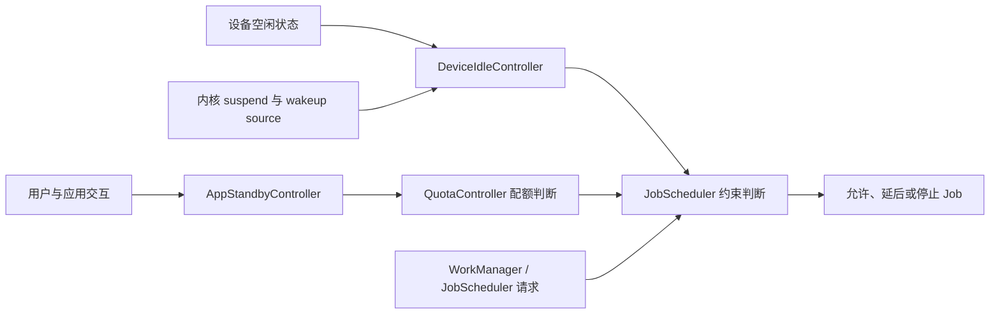

# 后台功耗治理

## 治理范围

这里讨论应用如何控制后台耗电。Doze、App Standby 和 Job 配额的系统实现见 §5.8；WakeLock、Alarm、定位与 FCM 的横向策略见 §11.2；诊断流程见 §25.1；FGS 超时和 Android 16 Job 配额的专题分析见 §25.15。

后台工作应具备四项性质：允许延后的工作交给系统调度，同一目的的工作可以合并，业务条件失效后可以取消，运行与停止原因可以观测。系统负责限制 CPU、网络、Job、Alarm 和位置访问，却不了解某次同步是否仍有业务价值，也不知道某段轨迹何时可以降低采样频率。应用必须自己定义任务有效期、停止条件和资源预算。

理解后台功耗时，不能把“进程还在”视为“任务可以持续执行”。进程存活、组件生命周期、后台启动资格、Job 配额和资源访问权限是不同条件。某项工作即使已经进入进程，也可能因约束变化、配额用完或服务超时而停止。

## Android 后台执行限制演进（Doze / App Standby / Bucket）

后台工作能否执行，至少受三组条件共同影响：

- **设备状态**：设备未充电、静止且屏幕关闭一段时间后，可能进入 Doze。系统会暂停后台网络，忽略普通 WakeLock，并延后普通 Job、同步和 Alarm，直到维护窗口或退出 Doze。
- **应用使用状态**：App Standby Buckets 根据用户近期与应用的交互情况，对 Job、Alarm 和网络施加不同限制。
- **任务接口与权限**：WorkManager、JobScheduler、AlarmManager 和前台服务各有调度语义、配额、启动资格及权限要求。

[Doze 与 App Standby 官方说明](https://developer.android.com/training/monitoring-device-state/doze-standby)将前两组条件分开定义。Doze 关注整台设备是否空闲；App Standby 关注某个应用近期是否被使用。两者可以同时影响同一个 WorkManager 任务，因为应用不可见时，WorkManager 的持久化工作会由 JobScheduler 调度。

| 版本阶段 | 后台规则变化 | App 侧治理动作 |
|----------|--------------|----------------|
| Android 6.0 | 引入 Doze 与 App Standby | 可延后工作迁到 JobScheduler 或 WorkManager；消息到达使用 FCM，避免轮询 |
| Android 8.0 | 限制后台服务和后台定位频率 | 长时间后台服务改为调度任务；区域触发使用地理围栏，机会式位置使用被动请求 |
| Android 9 | 引入 App Standby Buckets | 测试和监控记录待机分组，区分系统延迟与任务故障 |
| Android 12 | 限制应用从后台启动前台服务 | 只从用户可见状态或官方豁免场景启动 FGS，并处理 `ForegroundServiceStartNotAllowedException` |
| Android 14 | 目标版本 34 及以上必须声明 FGS 类型和对应权限；需要使用中权限的服务在创建时接受检查 | 清单声明、启动来源和运行时权限一起验证 |
| Android 15 | 目标版本 35 及以上的 `dataSync`、`mediaProcessing` FGS 获得后台运行时限 | 实现 `Service.onTimeout(int, int)`，主动保存进度并停止服务 |
| Android 16 | Job 运行配额覆盖更多情形，包括应用离开前台后继续执行的 Job，以及与 FGS 并行的 Job | 记录停止原因和待执行原因历史；不要用 FGS 规避 Job 配额 |
| Android 17 | 后台音频播放、音频焦点和音量操作受到更严格的生命周期检查 | 媒体任务按 Android 17 的音频资格要求审查，参见 §25.11 |

`restricted` 是限制最严的待机分组，但不能描述为“完全没有执行机会”。Android 13 及以上的官方规则是：不属于豁免范围的应用每天可在一次十分钟批处理时段内运行 Job，可用的 expedited Job 更少，并且每天只能触发一次 Alarm；充电时这些限制仍然存在，在“充电、设备空闲、非计费网络”同时满足时会放宽。OEM 可以调整分组算法，应用不应尝试诱导系统将自己放入某个分组。参见 [App Standby Buckets](https://developer.android.com/topic/performance/appstandby)。

### Android 17 源码中的职责边界

下面的关系图用于定位平台源码。它表达的是控制关系，不代表一次后台任务必然依次经过所有组件。



`DeviceIdleController` 管理设备空闲与维护窗口，`AppStandbyController` 管理待机分组，`QuotaController` 参与 Job 配额计算。内核负责系统休眠和 wakeup source 生命周期，并不知道 `STANDBY_BUCKET_RARE` 之类的框架层概念。分析一次唤醒时，需要将框架调度信息、应用任务日志和内核唤醒证据按时间对齐。

Android 17 / API 37 的平台源码入口如下：

- [`DeviceIdleController.java`](https://android.googlesource.com/platform/frameworks/base/+/refs/tags/android-17.0.0_r1/apex/jobscheduler/service/java/com/android/server/DeviceIdleController.java)：Doze 状态机、白名单和维护过程。
- [`AppStandbyController.java`](https://android.googlesource.com/platform/frameworks/base/+/refs/tags/android-17.0.0_r1/apex/jobscheduler/service/java/com/android/server/usage/AppStandbyController.java)：待机分组的框架实现与事件处理。
- [`QuotaController.java`](https://android.googlesource.com/platform/frameworks/base/+/refs/tags/android-17.0.0_r1/apex/jobscheduler/service/java/com/android/server/job/controllers/QuotaController.java)：Job 配额约束。
- [`JobScheduler.java`](https://android.googlesource.com/platform/frameworks/base/+/refs/tags/android-17.0.0_r1/apex/jobscheduler/framework/java/android/app/job/JobScheduler.java)：应用可见的调度接口、待执行原因和停止原因接口。
- [`UsageStatsManager.java`](https://android.googlesource.com/platform/frameworks/base/+/refs/tags/android-17.0.0_r1/core/java/android/app/usage/UsageStatsManager.java)：`ACTIVE`、`WORKING_SET`、`FREQUENT`、`RARE`、`RESTRICTED` 等待机分组常量。
- [`ServiceInfo.java`](https://android.googlesource.com/platform/frameworks/base/+/refs/tags/android-17.0.0_r1/core/java/android/content/pm/ServiceInfo.java)：`FOREGROUND_SERVICE_TYPE_*` 常量及服务类型定义。
- [`drivers/base/power/wakeup.c`](https://android.googlesource.com/kernel/common/+/refs/tags/android17-6.18-2026-06_r6/drivers/base/power/wakeup.c) 与 [`kernel/power/suspend.c`](https://android.googlesource.com/kernel/common/+/refs/tags/android17-6.18-2026-06_r6/kernel/power/suspend.c)：Android 17 对应内核基线中的 wakeup source 和系统休眠入口。

应用可以通过 `UsageStatsManager.getAppStandbyBucket()` 读取自己的当前分组。Android 16 / API 36 起，`JobScheduler.getPendingJobReasonsHistory(jobId)` 可查看某个待执行 Job 的原因历史；该历史会被截断，也不会跨重启保存，不能用作完整审计日志。

评审一个后台任务时，可以连续追问：

- 任务是否由用户刚刚发起，用户是否正在等待结果？
- 结果允许延迟到什么时刻，超过时限后还有没有执行价值？
- 网络、充电、空闲、电量等条件中，哪些是业务要求？
- 重复触发时应保留旧工作、替换旧工作，还是追加新工作？
- 页面关闭、退出账号、权限撤销或数据已被删除时，谁负责取消任务？
- 任务被系统停止后，哪些进度可以安全恢复，哪些步骤必须保证幂等？

## 后台任务最佳实践

后台任务按时效和用户可见性分类，比按业务模块分类更有用。用户正在等待的工作走即时路径；需要可靠完成但允许延后的工作走 WorkManager；周期同步和维护工作使用带约束的持久化调度；仅用于维持进程活跃的轮询应当删除。官方的[后台任务耗电优化指南](https://developer.android.com/develop/background-work/background-tasks/optimize-battery)也建议检查任务是否重复、约束是否合理，以及任务为何被系统停止。

| 任务类型 | 推荐 API | 功耗治理点 | 不建议的做法 |
|----------|----------|------------|--------------|
| 用户发起的上传、导出、下载 | 用户发起的数据传输 API、合适类型的 FGS 或 WorkManager 加急工作 | 显示进度，提供取消入口，定义失败后的恢复方式 | 从静默广播启动无类型 FGS |
| 可靠但可延后的同步 | WorkManager `OneTimeWorkRequest` | 设置网络、充电、电量不低等约束；同类任务用唯一工作合并 | 每个业务各起一个周期线程 |
| 周期性刷新 | WorkManager 周期工作或 JobScheduler | 根据数据时效设置周期；后台只同步必要数据 | 用短周期轮询模拟即时消息 |
| 缓存清理、日志压缩、索引构建 | WorkManager / JobScheduler 空闲与充电约束 | 只在空闲、充电、非低电量时运行；任务可中断 | 应用启动后立刻扫描全部文件 |
| 即时消息 | FCM | 只有会展示通知的消息使用高优先级，消息负载包含展示所需信息 | 收到推送后再发起多轮网络请求 |

下面的 WorkManager 示例用于“批量收件箱同步”。这个场景允许等待非计费网络和较高电量，重试间隔由业务策略传入，避免在公共组件中写死某个业务的退避时间。

```kotlin
fun enqueueBulkInboxSync(
    context: Context,
    retryBackoffMillis: Long,
) {
    require(
        retryBackoffMillis in
            WorkRequest.MIN_BACKOFF_MILLIS..WorkRequest.MAX_BACKOFF_MILLIS
    )

    val constraints = Constraints.Builder()
        .setRequiredNetworkType(NetworkType.UNMETERED)
        .setRequiresBatteryNotLow(true)
        .build()

    val request = OneTimeWorkRequestBuilder<InboxSyncWorker>()
        .setConstraints(constraints)
        .setBackoffCriteria(
            BackoffPolicy.EXPONENTIAL,
            retryBackoffMillis,
            TimeUnit.MILLISECONDS,
        )
        .addTag("inbox-sync")
        .build()

    WorkManager.getInstance(context).enqueueUniqueWork(
        "inbox-sync",
        ExistingWorkPolicy.KEEP,
        request,
    )
}
```

示例假定已导入 `java.util.concurrent.TimeUnit`。`UNMETERED` 和 `BatteryNotLow` 会减少高成本网络与低电量阶段的执行，但也会增加等待时间，只适合允许延迟的批量同步。`KEEP` 表示同名工作尚未结束时忽略新请求；如果新请求代表更新后的用户意图，应重新评估 `REPLACE` 或 `APPEND_OR_REPLACE`。退避只处理 Worker 返回 `Result.retry()` 的情况，不能代替网络请求自身的超时和幂等设计。

任务开始时间不能视为承诺时间。Doze、待机分组、约束和系统负载都可能推迟执行。运行后也可能因约束变化、配额或应用取消而停止。WorkManager 可读取 `WorkInfo.getStopReason()`；直接使用 JobScheduler 时，可读取 `JobParameters.getStopReason()`。Android 14 及以上，如果 Job 频繁超时，系统可能将应用放入 `restricted` 分组。

Android 16 进一步扩大了 Job 运行配额的适用范围：

- 应用在前台启动的 Job，如果应用离开可见状态后仍继续运行，会受配额约束。
- 与前台服务同时运行的 Job 也受配额约束。
- 这些变化会影响直接使用 JobScheduler 的任务，也会影响基于它实现的 WorkManager 和 DownloadManager。
- `ACTIVE` 分组拥有较宽裕的运行配额，不等于无限运行。

这些规则来自 [Android 16 后台任务行为变更](https://developer.android.com/about/versions/16/behavior-changes-all)，在 Android 17 上继续生效。

任务观测至少记录以下字段：

| 字段 | 用途 |
|------|------|
| `task_name` | 区分业务任务，避免只看到 Worker 类名 |
| `trigger_source` | 标记来自用户动作、推送、周期任务、冷启动补偿还是重试 |
| `visible_to_user` | 判断是否允许使用前台服务或加急工作 |
| `constraints` | 回放时知道任务为什么没到运行条件 |
| `standby_bucket` | 解释 Job / WorkManager 延迟和配额变化 |
| `stop_reason` | 区分配额、超时、约束变化、取消与其他系统停止原因 |
| `attempt` / `enqueue_time` / `start_time` | 区分排队延迟、执行耗时与重试次数 |
| `network_bytes` / `cpu_time_ms` | 和 §25.1 的 BatteryStats / Perfetto 数据对齐 |

统一封装的价值在于一致记录调度语义，但不应隐藏所有平台差异。业务仍需明确时效、幂等键、取消条件和数据归属；基础组件负责记录调度接口、系统约束、停止原因和资源用量。只修某个 Worker 的执行逻辑，无法解释它为什么被排队、停止或重复触发。

## 前台服务的正确使用与 Android 14+ 限制

前台服务适用于用户明确知道且希望持续进行的工作，例如导航、通话、媒体播放或运动记录。它不是进程保活接口。持续通知只说明服务正在工作，也不会取消 Doze、Job 配额和后台启动限制。

评审 FGS 时，要分别验证以下条件：

1. **业务是否适合 FGS**：工作必须对用户可感知，并有清晰的开始与停止条件。
2. **能否从当前位置启动**：目标版本 31 及以上从后台启动 FGS 受到限制，只有[官方列出的豁免场景](https://developer.android.com/develop/background-work/services/fgs/restrictions-bg-start)可以启动。
3. **服务类型与权限是否匹配**：目标版本 34 及以上必须在清单中声明类型及对应 `FOREGROUND_SERVICE_*` 权限。
4. **受保护资源能否访问**：位置、相机、麦克风和身体传感器的使用中权限有自己的可见性要求。
5. **运行时限是否满足**：部分 FGS 类型有系统时限，应用仍需设置更早的业务超时与取消入口。

下面的清单片段只展示位置型前台服务的基础声明，用于核对服务类型与权限是否一致。

```xml
<manifest xmlns:android="http://schemas.android.com/apk/res/android">
    <uses-permission android:name="android.permission.FOREGROUND_SERVICE" />
    <uses-permission android:name="android.permission.FOREGROUND_SERVICE_LOCATION" />
    <uses-permission android:name="android.permission.ACCESS_FINE_LOCATION" />

    <application>
        <service
            android:name=".TrackingForegroundService"
            android:exported="false"
            android:foregroundServiceType="location" />
    </application>
</manifest>
```

清单声明不授予运行时位置权限，也不授予任意时刻从后台启动 FGS 的资格。应用还要请求 `ACCESS_COARSE_LOCATION` 或 `ACCESS_FINE_LOCATION`，并验证系统位置开关。需要在应用处于后台时持续读取位置的场景，还要按版本与业务需要评估 `ACCESS_BACKGROUND_LOCATION`。

这里有两个相互独立的门槛，容易混淆：

- `ACCESS_BACKGROUND_LOCATION` 解决的是应用在后台时能否读取位置。
- 后台启动 FGS 的限制解决的是应用能否创建服务。

拥有后台位置权限不会自动获得通用的 FGS 后台启动豁免。反过来，即使命中某个启动豁免，如果位置权限或系统位置开关不满足，服务也不能读取位置。Android 14 及以上会在创建需要使用中权限的 FGS 时检查当前资格，失败时可能抛出 `SecurityException`。

### 时限与 Android 17 变化

- `shortService` 的系统时限约为三分钟。它适合短暂完成工作，不适合用来延长普通后台任务。
- 目标版本 35 及以上时，`dataSync` 和 `mediaProcessing` 各自在滚动的 24 小时窗口中共享六小时后台运行额度；同一应用内相同类型的所有服务共同消耗对应额度。收到 `Service.onTimeout(int, int)` 后，应保存可恢复进度并在数秒内调用 `stopSelf()`。参见 [Foreground service timeouts](https://developer.android.com/develop/background-work/services/fgs/timeout)。
- Android 17 会检查后台音频播放、音频焦点请求和音量操作是否来自有效生命周期。目标版本 37 及以上的应用要求更严：相关 FGS 需要具备使用中能力；持有精确 Alarm 权限并操作 `USAGE_ALARM` 音频流是文档列出的例外。参见 [Android 17 后台音频变化](https://developer.android.com/about/versions/17/behavior-changes-all)与 §25.11。

FGS 通知应说明具体工作及停止方式，例如“正在导航”或“正在上传所选文件”。服务在任务完成、用户取消、权限撤销、退出账号或业务时限到达时都应停止。服务内部启动的 Worker 或 Job 仍受 Job 配额约束。

## 后台定位与传感器管控

Android 8.0 及以上会限制后台应用接收位置更新的频率，官方只承诺“每小时少数几次”这一量级，不承诺固定次数。业务若依赖精确到达时间，不应从这个描述推导服务等级。区域进入或离开可使用 Geofencing API；允许延迟的轨迹可使用批量位置；只希望复用其他客户端已经计算的位置时，可使用被动请求。参见[后台位置限制](https://developer.android.com/about/versions/oreo/background-location-limits)和[位置功耗场景指南](https://developer.android.com/develop/sensors-and-location/location/battery/scenarios)。

| 场景 | 推荐策略 | 功耗边界 |
|------|----------|----------|
| 地图、导航、运动记录，用户正在查看结果 | 位置型 FGS + 与需求匹配的请求 | 通知持续可见；场景结束立即注销监听并停止服务 |
| 到店提醒、区域进入或离开 | Geofencing API | 根据业务时效设置停留延迟和响应时间，不假设秒级到达 |
| 天气、城市级推荐等机会式需求 | 被动位置或低功耗请求 | 被动请求可能长期没有结果，不能用来承诺时限 |
| 允许延迟上传的轨迹 | 批量位置 | 接受批量回调延迟，避免持续高精度上传 |
| 仅为刷新首页内容 | 前台按需获取或使用仍符合时效的最近位置 | 不在后台持续订阅位置 |

下面的函数构造被动位置请求。所有时间都由业务根据数据时效传入，函数只检查参数关系。

```kotlin
fun buildPassiveLocationRequest(
    desiredIntervalMillis: Long,
    minUpdateIntervalMillis: Long,
    maxUpdateDelayMillis: Long,
): LocationRequest {
    require(desiredIntervalMillis > 0L)
    require(minUpdateIntervalMillis in 1L..desiredIntervalMillis)
    require(maxUpdateDelayMillis >= desiredIntervalMillis)

    return LocationRequest.Builder(
        Priority.PRIORITY_PASSIVE,
        desiredIntervalMillis,
    )
        .setMinUpdateIntervalMillis(minUpdateIntervalMillis)
        .setMaxUpdateDelayMillis(maxUpdateDelayMillis)
        .build()
}
```

当前 Google Play services API 使用 `Priority.PRIORITY_PASSIVE`。这种请求不会为了自己额外计算位置，只接收其他客户端产生的位置，因此可能没有任何回调。`desiredIntervalMillis` 也不是交付期限。如果业务需要在规定时间内获得位置，应在用户可见阶段使用与精度需求匹配的优先级，并限制持续时间；不能悄悄将被动请求改成长时间 `PRIORITY_HIGH_ACCURACY`。参见 [`Priority` API](https://developers.google.com/android/reference/com/google/android/gms/location/Priority)。

传感器治理要区分普通传感器和受使用中权限约束的身体传感器。`health` 类型 FGS 需要声明 `FOREGROUND_SERVICE_HEALTH`，并满足 `HIGH_SAMPLING_RATE_SENSORS` 或相应的健康数据运行时权限。身体传感器权限边界按系统版本区分：

- API 35 及以下使用 `BODY_SENSORS`。
- API 36 及以上使用相应的传感器读取权限，例如 `READ_HEART_RATE`、`READ_SKIN_TEMPERATURE`、`READ_OXYGEN_SATURATION`。
- API 33～35 的后台身体传感器访问需要 `BODY_SENSORS_BACKGROUND`；API 36 及以上对应 `READ_HEALTH_DATA_IN_BACKGROUND`。

这些权限决定能否访问数据，FGS 后台启动资格仍需独立检查。具体类型与前提条件以[前台服务类型文档](https://developer.android.com/develop/background-work/services/fgs/service-types)为准。

定位和传感器都应按采样预算管理：

- 每个业务声明采样目的、前后台状态、精度、最短间隔、最长持续时间。
- 页面不可见后降级采样；任务结束、权限撤销、账号退出时释放监听。
- 多业务复用一个位置源，避免首页、推荐、风控、埋点各自启动一套请求。
- 在同一时间范围内关联 GNSS、传感器、CPU 和网络数据，再用 §25.1 的 BatteryStats 与 Perfetto 分析归因。

## 后台任务回归守门

后台功耗回归需要同时覆盖调度结果和资源消耗。单看“任务成功”会漏掉重复执行和过度重试；单看总耗电又难以定位责任业务。测试至少记录后台唤醒、排队与运行时长、停止原因、CPU 时间、网络流量、位置请求和 FGS 持续时间。

下面的命令用于测试机上强制进入 Doze，并检查 `restricted` 分组下的行为。将示例包名替换为待测应用；不要在日常使用的设备上保留这些测试状态。

```bash
adb shell dumpsys battery unplug
adb shell dumpsys batterystats --reset
adb shell dumpsys deviceidle force-idle
adb shell dumpsys deviceidle

adb shell dumpsys deviceidle unforce
adb shell am set-standby-bucket com.example.app restricted
adb shell am get-standby-bucket com.example.app

adb shell am set-standby-bucket com.example.app active
adb shell dumpsys battery reset
```

`force-idle` 用于验证 Doze 中任务是否被延后以及退出后能否恢复；`set-standby-bucket` 用于复现待机分组限制；末尾两条命令将待机分组和电池服务恢复到测试前的常用状态。待机分组算法允许 OEM 调整，强制分组只能验证应用在该条件下的行为，不能预测每台设备何时自动进入该分组。

回归场景不要照抄固定的息屏时长或推送条数。测试周期应覆盖本业务完整的调度、超时和重试窗口，事件数量来自线上基线或明确的容量目标。可按以下顺序组织：

1. 记录开始时间，清理测试任务并重置 BatteryStats。
2. 执行业务场景，覆盖网络变化、任务重复触发、退出账号、权限撤销和进程重启。
3. 分别在正常状态、Doze 和目标待机分组下运行。
4. 导出 bugreport、Perfetto 轨迹、WorkManager 或 JobScheduler 原因，以及应用任务日志。
5. 按时间关联每次唤醒、任务状态变化和资源用量，与稳定版本的分布比较。

不要将多种资源压成一个总分。CPU 下降可能伴随位置请求增加，网络流量减少也可能伴随 FGS 时间增长。每类资源应有独立预算，每个超限项都要能定位到任务名和责任业务。

## 小结

后台功耗治理要回答三个问题：任务为何此时执行，系统为何允许它执行，它何时必须停止。Doze 描述设备空闲，App Standby Buckets 描述应用使用状态，任务接口与权限决定具体执行资格；三者不能互相替代。

应用侧需要明确任务时效、约束、幂等、取消条件、停止原因和资源预算。评审时将 Android 17 / API 37 的框架源码与 `android17-6.18-2026-06_r6` 内核证据分层使用：框架说明调度与配额决定，内核说明休眠和唤醒事实。§25.3 的 WakeLock / Alarm 与 §25.4 的 WorkManager 分别说明一次唤醒是否有用户价值、能否延后或合并，以及如何稳定复现。
