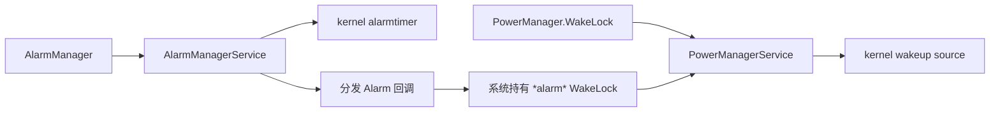

# WakeLock、Alarm 与 WorkManager 调度

WakeLock 阻止设备进入部分休眠状态，Alarm 决定未来唤醒时刻，WorkManager 在系统约束下安排可延迟工作。三者组合错误会产生频繁唤醒、锁未释放和任务积压。

## 唤醒锁、定时器与系统休眠

### 两类机制的职责

WakeLock（唤醒锁）和 Alarm（系统定时通知）解决两个不同问题：

- WakeLock 表示工作已经开始，设备暂时不能进入会中断它的休眠状态。
- Alarm 表示工作尚未开始，系统到达约定时刻后通知应用。

它们都不是进程保活接口。WakeLock 不保证进程存活，也不提供后台启动资格；Alarm 回调应只完成短小的分发工作，耗时任务需要另行调度。

持锁范围过大，会阻止系统进入低功耗状态；唤醒型 Alarm 过密，会增加设备被唤醒的次数；精确 Alarm 若未满足权限条件，调用时会抛出 `SecurityException`。

系统电源状态机见 §5.2 和 §11.3，后台任务分类见 §25.2，WorkManager（Jetpack 的持久后台任务调度库）实践见本文后半部分。这里讨论应用侧的选择、生命周期、权限和诊断。

#### Android 17 源码中的调用边界

关系图区分应用接口、系统服务和内核职责。



`PowerManagerService` 汇总框架层 WakeLock 并更新电源状态，`AlarmManagerService` 负责 Alarm 的分组、权限、空闲策略和分发。内核的 wakeup source（唤醒源）与 alarmtimer（定时唤醒机制）提供阻止休眠和定时唤醒能力，却不了解 `PendingIntent`（由系统在未来代应用执行操作的凭据）、精确 Alarm 权限或应用业务。系统可以合并多个 Alarm，设备也可能因其他来源已经处于唤醒状态，因此一次 Alarm 触发不一定对应一次内核唤醒。

源码可从三个入口核对：

- [`PowerManager.java`](https://android.googlesource.com/platform/frameworks/base/+/refs/tags/android-17.0.0_r1/core/java/android/os/PowerManager.java) 与 [`PowerManagerService.java`](https://android.googlesource.com/platform/frameworks/base/+/refs/tags/android-17.0.0_r1/services/core/java/com/android/server/power/PowerManagerService.java)
- [`AlarmManager.java`](https://android.googlesource.com/platform/frameworks/base/+/refs/tags/android-17.0.0_r1/apex/jobscheduler/framework/java/android/app/AlarmManager.java) 与 [`AlarmManagerService.java`](https://android.googlesource.com/platform/frameworks/base/+/refs/tags/android-17.0.0_r1/apex/jobscheduler/service/java/com/android/server/alarm/AlarmManagerService.java)
- [`drivers/base/power/wakeup.c`](https://android.googlesource.com/kernel/common/+/refs/tags/android17-6.18-2026-06_r6/drivers/base/power/wakeup.c) 与 [`kernel/time/alarmtimer.c`](https://android.googlesource.com/kernel/common/+/refs/tags/android17-6.18-2026-06_r6/kernel/time/alarmtimer.c)

### WakeLock 类型与使用规范

常规应用需要评估的 CPU（中央处理器）锁是 `PARTIAL_WAKE_LOCK`。它允许屏幕关闭，同时让 CPU 保持运行。`SCREEN_DIM_WAKE_LOCK`、`SCREEN_BRIGHT_WAKE_LOCK` 和 `FULL_WAKE_LOCK` 已废弃；页面需要保持亮屏时，使用 `FLAG_KEEP_SCREEN_ON` 或 View 的 `keepScreenOn`。申请 WakeLock 还需要在清单中声明 `android.permission.WAKE_LOCK`。

手动持锁之前，先检查平台接口是否已经管理唤醒周期。WorkManager 和 JobScheduler（Android 系统任务调度器）会在任务执行期间处理所需的 WakeLock；媒体、位置和部分传感器接口也有自己的电源行为。再叠加一把手动锁，通常只会扩大持锁范围。

[WakeLock 官方实践](https://developer.android.com/develop/background-work/background-tasks/awake/wakelock/best-practices)可归纳为五项约束：

- **范围小**：只覆盖必须在设备清醒时完成的同步代码。
- **超时明确**：`acquire(timeoutMillis)` 的超时是故障保护，业务仍应在工作结束时主动释放。
- **标签稳定**：标签包含包、类或方法的固定名称，不含用户信息、随机数、业务 ID 或计数器。
- **释放集中**：获取与释放写在同一个所有权范围内，异常和取消都经过 `finally`。
- **用户可感知**：需要长时间持锁的工作通常还需要合适类型的前台服务（Foreground Service，FGS）；如果 FGS 也不适合，应重新选择任务接口。

| 场景 | 推荐做法 | 不建议的做法 |
|------|----------|--------------|
| 屏幕保持常亮 | `WindowManager.LayoutParams.FLAG_KEEP_SCREEN_ON` 或 View 的 `keepScreenOn` | 用屏幕类 WakeLock 控制亮屏 |
| 用户触发且必须连续完成的短任务 | `PARTIAL_WAKE_LOCK` + 业务超时 + `try/finally` | 获取后分散到多个回调释放 |
| 可延后的后台同步 | WorkManager / JobScheduler | 用 WakeLock 保持线程池常驻 |
| 到时提醒 | AlarmManager，默认使用非精确 Alarm | 持锁等待目标时间 |
| 长时间用户可感知任务 | 合适类型的 FGS + 通知 + 取消入口 | 静默持锁运行 |

这个封装只处理一段同步代码。超时时间由调用场景传入，WakeLock 标签保持固定。

```kotlin
private const val SYNC_WAKELOCK_TAG = "com.example.app:SyncWorker"

inline fun <T> Context.withPartialWakeLock(
    timeoutMillis: Long,
    block: () -> T,
): T {
    require(timeoutMillis > 0L)

    val powerManager = getSystemService(PowerManager::class.java)
    val wakeLock = powerManager.newWakeLock(
        PowerManager.PARTIAL_WAKE_LOCK,
        SYNC_WAKELOCK_TAG,
    ).apply {
        setReferenceCounted(false)
        acquire(timeoutMillis)
    }

    return try {
        block()
    } finally {
        if (wakeLock.isHeld) {
            wakeLock.release()
        }
    }
}
```

`block()` 必须在函数返回前完成。如果它只负责启动协程、提交线程池任务或发起异步请求，函数返回时 WakeLock 就会释放。反过来，把释放分散到异步回调会增加遗漏异常、取消和超时分支的风险。可延后工作应交给 WorkManager；长时间且用户可感知的工作应使用符合类型与权限要求的 FGS。

WakeLock 默认使用引用计数：每次 `acquire()` 增加一次计数，每次 `release()` 减少一次，计数归零后才释放。示例将它关闭，是因为每次调用都创建独立对象，并且只有当前函数拥有这把锁。共享对象不适合这样处理：非引用计数模式下一次 `release()` 就会撤销此前所有 `acquire()` 的效果。

超时到达后 `block()` 仍可能继续运行，因此超时不能替代业务取消，也不能用作任务成功的判断。

### WakeLock 泄漏检测与治理

WakeLock 异常往往来自所有权不清：异常提前返回、回调没有到达、取消路径遗漏，或者异步工作已经换到其他执行器，原调用方却仍持有锁。排查需要同时查看当前状态、历史时序和线上分布。

| 工具 | 观察对象 | 用法 |
|------|----------|------|
| `adb shell dumpsys power` | 当前仍活跃的 WakeLock | 查看标签（tag）、应用 UID、进程 PID 和持有状态，适合复现场景后立刻确认 |
| `adb shell dumpsys batterystats --history` | BatteryStats（系统电量归因统计）记录的持锁与唤醒事件 | 对照测试起止时间检查异常长区间，必要时结合 bugreport（Android 系统诊断报告） |
| Perfetto（Android 系统追踪工具） | 系统挂起与恢复、CPU 调度和应用工作时序 | 判断锁是否阻止休眠，并与 Alarm 或任务触发时间对齐 |
| Play Console Android Vitals（Google Play 线上质量指标） | 线上非豁免 partial WakeLock 分布 | 按版本、设备和 WakeLock 名称查受影响会话 |

应用没有直接调用 `PowerManager.newWakeLock()`，也可能看到归因到自身的锁。AlarmManager、JobScheduler、WorkManager、位置、FCM（Firebase Cloud Messaging，Firebase 云消息）和媒体接口都可能在系统或库内部持锁。官方的[WakeLock 来源对照](https://developer.android.com/develop/background-work/background-tasks/awake/wakelock/identify-wls)会随平台和库版本更新，诊断时应以当前系统显示的名称为起点。

AlarmManager 分发广播时会持有名为 `*alarm*` 的 WakeLock，并将它归因给设置 Alarm 的应用。该锁只覆盖 `BroadcastReceiver.onReceive()`；方法返回后，系统就可以释放锁。接收器中若启动异步工作，应该将输入持久化并交给 WorkManager 或其他合适接口，不能依赖 `*alarm*` 继续保护后续工作。

Android Vitals 当前将一个应用会话中、24 小时内累计达到两小时的非豁免 partial WakeLock 记为过度使用；若最近 28 天超过 5% 的应用会话出现该问题，可能影响应用在 Google Play 的可见性。统计只计算屏幕关闭且应用处于后台或运行 FGS 时持有的锁，并对部分有明确用户价值的系统 API 提供豁免。

这个门槛用于识别严重问题，不应成为应用允许自己消耗的预算。参见 [Excessive partial wake locks](https://developer.android.com/topic/performance/vitals/excessive-wakelock)。

应用自己的审计记录不要只保存标签：

| 字段 | 用途 |
|------|------|
| `wakelock_tag` | 对应系统统计和 `dumpsys power` 输出 |
| `source_module` | 区分业务来源，避免同一标签被多个模块复用 |
| `trigger_source` | 记录来自用户动作、推送、Alarm、WorkManager 还是重试 |
| `acquire_uptime_ms` / `release_uptime_ms` | 计算持锁时长，不受系统时间调整影响 |
| `timeout_ms` | 判断是否依赖超时兜底释放 |
| `visible_to_user` | 区分用户感知任务和静默后台任务 |
| `failure_reason` | 记录异常、取消、超时、进程退出等释放路径 |

新增 WakeLock 应通过统一封装：标签固定且可定位，超时来自业务上限，每一条退出路径都能释放。单次时长和累计时长阈值应从具体场景的稳定版本与服务目标推导；下载、媒体、导航和短同步不能共用一个数字。

### AlarmManager 最佳实践

AlarmManager 用于跨越应用生命周期的时间通知。应用仍在运行时的界面计时、动画或请求超时，使用 Handler（进程内消息调度器）、协程等进程内工具；允许延后的持久化工作使用 WorkManager。用户指定的闹钟、日历事件和到时提醒，才需要评估 AlarmManager。参见 [Schedule alarms](https://developer.android.com/develop/background-work/services/alarms)。

Doze 指设备空闲时的低功耗模式。选择 API 时，同时判断是否要唤醒设备、允许多大时间偏差，以及是否需要跨进程存活。

| API | 系统行为 | 适用边界 |
|-----|----------|----------|
| `set()` | 不早于目标时间的单次非精确 Alarm；Android 12 及以上在没有额外省电限制时通常会在目标时间后一小时内分发 | 到点附近执行即可 |
| `setWindow()` | 在给定窗口内分发，便于系统合并唤醒 | 业务明确给出可接受窗口 |
| `setInexactRepeating()` | 非精确重复 Alarm，连续两次到达间隔可以变化 | 必须使用 Alarm 的粗略重复提醒；普通周期工作仍优先 WorkManager |
| `setAndAllowWhileIdle()` | Doze 中允许分发的非精确 Alarm，仍受频率限制 | 空闲状态下也要到达、但允许偏差 |
| `setExact()` | 精确单次 Alarm，受精确 Alarm 权限约束 | 用户对时刻有明确要求，但无需穿过 Doze |
| `setExactAndAllowWhileIdle()` | Doze 中允许分发的精确 Alarm，受权限和频率限制 | 闹钟、日历提醒等强时效场景 |
| `setAlarmClock()` | 用户可见的闹钟；系统必要时离开低功耗模式 | 闹钟应用的核心功能 |

目标版本 31 及以上调用 `setWindow()` 时，小于十分钟的窗口可能被系统扩展到十分钟。这个平台下限不表示业务都应该选择十分钟；窗口仍应来自产品对延迟的接受范围。

精确 Alarm 难以和其他应用的唤醒合并，只有非精确接口无法满足用户需求时才使用。

#### 先选时间基准，再选是否唤醒

- `RTC` / `RTC_WAKEUP` 使用墙上时钟，也就是用户可见且会受校时、时区和夏令时影响的系统时间，适合按当地时间提醒。用户修改时间、时区或夏令时规则时，应用要重新核对下一次触发。
- `ELAPSED_REALTIME` / `ELAPSED_REALTIME_WAKEUP` 使用 `SystemClock.elapsedRealtime()` 表示开机后持续递增的单调时间，不受墙上时钟调整影响，适合同一次开机内的延迟。
- 带 `WAKEUP` 的类型可以唤醒休眠设备；不带 `WAKEUP` 的类型会等设备下次清醒后分发。业务允许等待时，选择不唤醒设备的类型。

设备关机后 Alarm 会被清除。需要跨重启保留的提醒，应先将业务记录持久化，再在 `BOOT_COMPLETED` 后重建。每天按当地时间重复的提醒还要处理时区和夏令时变化，通常按下一次日历时间安排单次 Alarm，比固定毫秒间隔更可靠。

这个示例把允许在目标时间附近到达的提醒安排为窗口 Alarm。提醒标识（ID）写入 `Intent.data`，使 `PendingIntent` 身份稳定且不依赖 `Long.hashCode()`。

```kotlin
fun scheduleReminderWindow(
    context: Context,
    triggerAtMillis: Long,
    windowLengthMillis: Long,
    reminderId: Long,
) {
    require(windowLengthMillis > 0L)

    val alarmManager = context.getSystemService(AlarmManager::class.java)
    val intent = Intent(context, ReminderReceiver::class.java).apply {
        action = "com.example.app.ACTION_REMINDER"
        data = Uri.Builder()
            .scheme(context.packageName)
            .authority("reminder")
            .appendPath(reminderId.toString())
            .build()
        putExtra("reminder_id", reminderId)
    }
    val pendingIntent = PendingIntent.getBroadcast(
        context,
        0,
        intent,
        PendingIntent.FLAG_UPDATE_CURRENT or PendingIntent.FLAG_IMMUTABLE,
    )

    alarmManager.setWindow(
        AlarmManager.RTC_WAKEUP,
        triggerAtMillis,
        windowLengthMillis,
        pendingIntent,
    )
}
```

`Intent` 的附加字段不参与 `PendingIntent` 等价判断；只改变 `reminder_id`，可能覆盖已有 Alarm。示例使用唯一的 `data` URI（统一资源标识符）区分提醒，取消时必须重建等价的 `action`、`data`、组件、`requestCode` 和标志位。这段代码用 `RTC_WAKEUP` 表示按用户墙上时钟提醒；若设备无需被唤醒，应改用 `RTC`。

接收器只做输入校验、状态确认和短小的本地处理。下载、数据库批处理或多轮网络请求需要入队；同一提醒已删除、账号已退出或状态已过期时，应直接结束。

#### Android 17：允许空闲分发的 Listener Alarm

Android 17 / API 37 新增接受 `OnAlarmListener`（Alarm 回调监听器）与 `Executor`（回调执行器）的 `setExactAndAllowWhileIdle()`。它适合这样的场景：组件仍在运行，但不希望持续持有 WakeLock 等待下一次时机。这个示例按开机后的单调时间安排一次回调。

```kotlin
@RequiresApi(37)
fun scheduleProcessLocalIdleAlarm(
    alarmManager: AlarmManager,
    triggerElapsedRealtime: Long,
    executor: Executor,
    listener: AlarmManager.OnAlarmListener,
) {
    alarmManager.setExactAndAllowWhileIdle(
        AlarmManager.ELAPSED_REALTIME_WAKEUP,
        triggerElapsedRealtime,
        "com.example.app:socket-maintenance",
        executor,
        listener,
    )
}
```

`OnAlarmListener` 版本不要求 `SCHEDULE_EXACT_ALARM`，只在当前进程内有效。调用进程没有活动的 `Activity`、`Service` 或 `ContentProvider` 后，系统可以取消它；组件结束时也应调用 `alarmManager.cancel(listener)`。它仍受允许空闲分发的频率限制，不适合循环安排高频回调。需要在进程死亡或组件结束后仍然触发时，使用 `PendingIntent` 版本并满足精确 Alarm 权限。示例中的 `@RequiresApi` 来自 `androidx.annotation.RequiresApi`。

使用这个重载需同时满足四个条件：活跃组件仍在、设备空闲时需要唤醒、回调能快速同步完成、回调丢失后能够恢复。Android 17 的 AlarmManager 会在投递回调前获取共享 WakeLock，`onAlarm()` 返回后完成投递并释放；因此回调内通常不应再获取应用 WakeLock。把工作另起异步线程后立即返回，会失去这段系统保护。

`OnAlarmListener` 通过进程内 Binder（Android 进程间通信机制）回调交付。应用进程进入 cached（缓存进程）或 frozen（冻结）状态、监听器对应的 Binder 失效，或者拥有该监听器的组件结束时，系统可以移除 Alarm；进程死亡后仍需交付的提醒应使用 `PendingIntent`。

Android 17 还为 Listener 型允许空闲分发 Alarm 维护独立配额（quota）。AOSP 中的默认值用于解释当前实现，业务不能据此承诺固定心跳间隔。每次回调完成后，再按当前协议状态安排下一次一次性 Alarm，并记录请求时间、实际触发时间和回调完成时间，避免形成无法追踪来源的周期唤醒。

### Exact Alarm 权限变化（Android 12+）

精确 Alarm 权限经历了三次关键变化：

| 版本 | 权限规则 |
|------|----------|
| Android 12 / API 31 | 目标版本 31 及以上的应用使用基于 `PendingIntent` 的精确 Alarm，需要闹钟和提醒特殊访问权限或符合系统豁免 |
| Android 13 / API 33 | 目标版本 33 及以上可在 `SCHEDULE_EXACT_ALARM` 与 `USE_EXACT_ALARM` 中选择 |
| Android 14 / API 34 | 目标版本 33 及以上的新安装应用通常不会预先获得 `SCHEDULE_EXACT_ALARM`；备份恢复到 Android 14 的权限也会被拒绝 |

`USE_EXACT_ALARM` 会自动授予且用户不能撤销，但用途受限，并受 Google Play 政策约束，适合核心功能就是闹钟或日历的应用。`SCHEDULE_EXACT_ALARM` 是用户可授予和撤销的特殊访问权限，适用范围更广。两者都不该为普通同步任务声明。

精确 Alarm 到达属于 FGS 后台启动限制的豁免场景，但不会免除三项检查：FGS 类型、类型权限和使用中权限（while-in-use permission，一般只在应用可见或对应 FGS 满足条件时可用）。普通后台任务不能为了获得启动资格而改用精确 Alarm。

使用基于 `PendingIntent` 的 `setExact()`、`setExactAndAllowWhileIdle()` 或 `setAlarmClock()` 前，应通过 `canScheduleExactAlarms()` 检查资格。这个示例只负责安排 Alarm，并向调用层返回需要权限的结果；它不会从后台突然打开系统设置页。

```kotlin
enum class ExactAlarmScheduleResult {
    SCHEDULED,
    PERMISSION_REQUIRED,
}

fun scheduleExactReminder(
    context: Context,
    triggerAtMillis: Long,
    reminderId: Long,
): ExactAlarmScheduleResult {
    val alarmManager = context.getSystemService(AlarmManager::class.java)

    if (Build.VERSION.SDK_INT >= Build.VERSION_CODES.S &&
        !alarmManager.canScheduleExactAlarms()
    ) {
        return ExactAlarmScheduleResult.PERMISSION_REQUIRED
    }

    val intent = Intent(context, ReminderReceiver::class.java).apply {
        action = "com.example.app.ACTION_EXACT_REMINDER"
        data = Uri.Builder()
            .scheme(context.packageName)
            .authority("exact-reminder")
            .appendPath(reminderId.toString())
            .build()
        putExtra("reminder_id", reminderId)
    }
    val pendingIntent = PendingIntent.getBroadcast(
        context,
        0,
        intent,
        PendingIntent.FLAG_UPDATE_CURRENT or PendingIntent.FLAG_IMMUTABLE,
    )

    alarmManager.setExactAndAllowWhileIdle(
        AlarmManager.RTC_WAKEUP,
        triggerAtMillis,
        pendingIntent,
    )
    return ExactAlarmScheduleResult.SCHEDULED
}
```

界面层（UI）收到 `PERMISSION_REQUIRED` 后，应先解释用户功能为何需要精确时刻，再由用户动作打开 `Settings.ACTION_REQUEST_SCHEDULE_EXACT_ALARM`。用户拒绝时，根据业务改用 `setWindow()`、WorkManager 或下次进入应用时补偿；不能把 `SecurityException` 当作权限分支。

权限状态还影响已安排的 Alarm：

- `SCHEDULE_EXACT_ALARM` 被撤销时，系统会停止应用进程并删除该应用未来的精确 Alarm。
- 权限被授予时，系统发送 `ACTION_SCHEDULE_EXACT_ALARM_PERMISSION_STATE_CHANGED`。接收后仍要再次调用 `canScheduleExactAlarms()`，确认资格仍有效，再根据持久化记录重建必要 Alarm。
- 该广播只表示授予，不会在撤销时发送。应用启动、进入相关页面和安排 Alarm 前都要重新检查。
- 设备重启也会清除 Alarm，因此重建逻辑应与 `BOOT_COMPLETED` 共用同一份持久化业务数据。

审查精确 Alarm 时，逐项确认：

- 用户是否明确指定精确时间；后台同步和日志上传不属于此类。
- 时间窗口是否可以接受；可以接受就使用非精确 Alarm。
- 权限声明是否符合功能和商店政策。
- 调用前是否检查资格，拒绝后是否有可理解的降级行为。
- 提醒记录是否持久化，取消、重启、时间变化和权限变化能否得到一致结果。
- 相邻提醒是否可以合并，接收器是否只做短小工作。

### WakeLock 与 Alarm 功耗回归守门

#### Android Vitals 的 excessive 与 stuck 口径

Google Play 的 WakeLock 指标只统计特定状态下的非豁免 partial WakeLock。Excessive（过度使用）指一个应用会话在 24 小时内累计持锁达到两小时；stuck（长时间未释放）指 24 小时内至少出现一次在后台连续持锁一小时。一个未达到 stuck 阈值的高频短锁，累计后仍可能达到 excessive 阈值。内部监控至少同时保存单次最长时长、窗口累计时长、次数和重叠区间。参见 [Stuck partial wake locks](https://developer.android.com/topic/performance/vitals/stuck-wakelock)。

Vitals 根据创建锁的平台 API 判断豁免，不根据手动标签的名称判断。音频、定位或 JobScheduler 用户发起任务（user-initiated job）的系统锁可能在指标中豁免；业务自行调用 `newWakeLock()`，即使标签写成 Audio 或 Location，也不会自动获得豁免。前台服务同样不是豁免项。

Play Console 给出标签、受影响会话和持续时间分布，端侧还要补充调用现场。手动锁应使用稳定、低基数（标签取值种类少）且不含用户信息的标签，例如 `com.example.sync:message-refresh`；应用日志再关联任务类型、版本、获取和释放时的调用栈哈希、前后台与充电状态。WorkManager 或 JobScheduler 生成的 `*job*` 标签可能随系统和库版本变化。遇到系统标签时，应回查 Worker、Job、约束、重试和停止原因；源码中不一定存在完整的运行时标签。

本地复现应覆盖屏幕关闭、应用在后台或运行 FGS、设备由电池供电的区间。`dumpsys power` 显示当前持锁者，BatteryStats 和 bugreport 还原累计区间，Perfetto 的电源（power）轨道把 WakeLock、Alarm、Job、屏幕状态与线程工作按时间对齐。Play 指标未计入的耗电也可能不合理；国内渠道和企业分发仍应保留相同的内部发布门禁。

WakeLock 和 Alarm 的回归要覆盖安排、触发、取消和失败恢复。测试周期应包含业务完整的提醒或重试过程，不照抄固定息屏时长。

这些命令用于测试机上观察当前 WakeLock、Alarm 队列和 BatteryStats 历史，并验证 Doze 条件下的到达行为。

```bash
adb shell dumpsys batterystats --reset
adb shell dumpsys battery unplug
adb shell dumpsys deviceidle force-idle

adb shell dumpsys power
adb shell dumpsys alarm
adb shell dumpsys batterystats --history

adb shell dumpsys deviceidle unforce
adb shell dumpsys battery reset
```

`dumpsys power` 显示此刻仍在持锁的对象，`dumpsys alarm` 显示等待中的 Alarm 及其分组，BatteryStats 历史用于对照测试时间。结束时必须解除强制 Doze 并恢复电池服务。测试还要覆盖用户取消提醒、修改时间或时区、重启设备，以及授予和撤销精确 Alarm 权限。

| 守门项 | 检查方式 | 失败处理 |
|--------|----------|----------|
| 新增 WakeLock | 静态扫描 `newWakeLock()` 和封装入口 | 没有固定标签、超时、释放路径时退回修改 |
| Exact Alarm 新增 | 扫描 `setExact*` / `setAlarmClock()` | 没有用户精确时间需求说明和权限降级方案时退回修改 |
| 持锁配对 | 单元测试异常与取消路径，设备测试核对获取和释放 | 出现超时释放或场景结束后仍持锁时阻止发布 |
| Alarm 身份 | 安排、更新、取消多个提醒，检查 `PendingIntent` 是否互相覆盖 | 修正 action、data、组件、request code 或 flags |
| Doze 到达 | 在强制 Doze 下验证非精确、允许空闲和精确接口的差异 | 接口语义与业务时效不匹配时重新选型 |
| 线上分布 | Android Vitals 与应用任务记录按版本、设备、入口关联 | 超过场景基线时定位 WakeLock 名称和触发来源 |
| 权限状态 | 覆盖未授予、已授予、撤销、升级与备份恢复 | 任一状态导致崩溃、静默丢提醒或重复提醒时阻止发布 |

任一守门项失败，都应先修正任务接口、生命周期或权限处理，再重新运行对应场景；不能用扩大超时或放宽阈值绕过。

### WakeLock 与 Alarm 小结

WakeLock 保护一段已经开始的工作，Alarm 安排未来的时间通知。前者的重点是所有权、超时和释放；后者的重点是时间基准、精度、唤醒类型、回调身份与权限。

Android 17 的 Listener 版 `setExactAndAllowWhileIdle()` 可以在进程内组件仍存活时替代持续持锁等待，但不能跨越进程死亡。需要持久到达的用户提醒仍使用 `PendingIntent`，并遵守精确 Alarm 权限。诊断时，框架源码解释调度与归因，`android17-6.18-2026-06_r6` 内核源码解释休眠阻止和定时唤醒；两层证据要按时间关联。

## 约束任务、重试与执行窗口

必须精确定时的事件才使用 Alarm，可延迟工作交给 WorkManager。Worker 内部仍要控制 WakeLock、网络和重试总量。

本文以 Android 17（API 37，`android-17.0.0_r1`）和 WorkManager 2.11.2 稳定版为基线。WorkManager 2.11.x 的 `minSdk`（库支持的最低 Android API 级别）是 23，因此不再讨论旧版本库在 API 14–22 上使用 `AlarmManager` 的兼容路径；它还要求 `compileSdk`（编译时使用的 Android API 级别）至少为 33。

WorkManager 是 Jetpack 的持久后台任务调度库，适合应用进程退出后仍应继续、允许系统选择执行时机的工作，例如日志上传、云端同步和可恢复的数据处理。四类需求应交给其他 API：

| 需求 | 合适的机制 | 原因 |
| --- | --- | --- |
| 页面存在期间的异步计算 | 协程、线程池 | 页面退出后可以取消，不需要持久化调度 |
| 精确到时刻的提醒 | `AlarmManager` 的适用接口 | WorkManager 只保证满足条件后获得执行机会，不保证准点 |
| 持续提供用户可感知能力 | 前台服务（Foreground Service，FGS） | 任务生命周期和通知由应用明确管理 |
| 用户发起、需要进度通知的大文件传输 | 用户发起的数据传输任务（User-Initiated Data Transfer，UIDT）或直接前台服务 | Android 16 以后，长时 Worker 仍会消耗系统任务调度器 JobScheduler 的配额 |

持久化调度不等于无条件完成。用户强行停止应用、应用被卸载、业务主动取消任务，都会使任务停止；任务依赖的网络、账户或权限长期不可用，也会让它一直等待或失败。

### 依赖与版本边界

这些依赖分别支持普通 Worker（工作执行单元）、Kotlin 协程 Worker 和多进程 Worker：

```kotlin
dependencies {
    implementation("androidx.work:work-runtime-ktx:2.11.2")
    implementation("androidx.work:work-multiprocess:2.11.2") // 只有多进程场景才需要
}
```

应用不使用多进程 Worker 时不应引入 `work-multiprocess`。`work-runtime` 与 `work-multiprocess` 使用相同版本，可避免两个模块的内部协议不一致。

### WorkManager 基础架构

一次工作从入队到执行会经过三层：

- `WorkRequest` 描述 Worker 类型、输入、约束、延迟、重试和标签。
- WorkManager 将 `WorkSpec`（任务配置的内部数据库记录）、依赖关系和状态保存在自己的数据库中，并把符合调度条件的工作交给系统。
- 在 API 23–37 上，跨进程、跨重启的系统调度由 `JobScheduler` 负责；应用进程已经存活时，`GreedyScheduler`（WorkManager 的进程内机会调度器）还可以就地运行满足条件的工作。

WorkManager 向 `JobScheduler`（Android 系统任务调度器）注册的服务是 `androidx.work.impl.background.systemjob.SystemJobService`。Android 17 的系统侧由 `JobSchedulerService` 和一组约束控制器决定 Job 何时具备运行资格；配额由 `QuotaController` 等组件参与计算。WorkManager 可以把业务意图转换成 Job 约束，却不能绕过 Doze（设备空闲低功耗模式）、App Standby（应用待机）、后台限制和系统负载决策。

#### Worker 类型与线程语义

`Worker.doWork()` 在 WorkManager 配置的后台 `Executor`（线程任务执行器）上执行，适合同步阻塞接口。`CoroutineWorker.doWork()` 是挂起函数；在没有自定义 `Configuration.workerCoroutineContext` 时，它默认使用 `Dispatchers.Default`（Kotlin 协程的默认计算调度器）。网络、文件和数据库操作仍应切换到相应的调度器，挂起函数中的阻塞 I/O（输入输出）仍会占用线程。

这个 Worker 展示可取消的协程工作以及三种结果语义：

```kotlin
class ProfileSyncWorker(
    appContext: Context,
    params: WorkerParameters,
) : CoroutineWorker(appContext, params) {

    override suspend fun doWork(): Result = withContext(Dispatchers.IO) {
        val accountId = inputData.getString(KEY_ACCOUNT_ID)
            ?: return@withContext Result.failure()

        try {
            profileRepository.sync(
                accountId = accountId,
                idempotencyKey = id.toString(),
            )
            Result.success()
        } catch (e: AuthenticationRequiredException) {
            Result.failure()
        } catch (e: IOException) {
            if (runAttemptCount < MAX_ATTEMPTS) Result.retry() else Result.failure()
        }
    }

    private companion object {
        const val KEY_ACCOUNT_ID = "account_id"
        const val MAX_ATTEMPTS = 5
    }
}
```

`success()` 进入成功终态，`failure()` 进入失败终态，`retry()` 让同一个 WorkSpec 按退避策略再次运行；退避指失败后逐步延长重试间隔。代码只捕获能分类处理的异常；`CancellationException` 会继续传播，使 WorkManager 的停止信号可以取消协程。

#### 一次性任务与周期任务

一次性任务适合在条件满足后执行一次，周期任务适合长期重复检查。周期任务的最小间隔是 15 分钟；这表示最小周期，不保证每 15 分钟准点触发。

这段代码注册一个唯一的周期同步任务：

```kotlin
val syncConstraints = Constraints.Builder()
    .setRequiredNetworkType(NetworkType.CONNECTED)
    .setRequiresBatteryNotLow(true)
    .build()

val periodicSync = PeriodicWorkRequestBuilder<ProfileSyncWorker>(
    repeatInterval = 6,
    repeatIntervalTimeUnit = TimeUnit.HOURS,
)
    .setConstraints(syncConstraints)
    .setInputData(workDataOf("account_id" to accountId))
    .addTag("profile-sync")
    .build()

WorkManager.getInstance(context).enqueueUniquePeriodicWork(
    "profile-sync:$accountId",
    ExistingPeriodicWorkPolicy.UPDATE,
    periodicSync,
)
```

`UPDATE` 保留已有周期工作的入队时间，并让后续轮次采用新的约束和输入；如果旧的一轮正在执行，它不会被中断。只想保留旧配置时使用 `KEEP`，需要取消旧任务并重新计算周期时才使用 `CANCEL_AND_REENQUEUE`。

### 任务约束与系统适配

#### 约束是运行条件，不是执行时间

`Constraints` 中的条件采用 AND 关系。一个任务同时要求不计费网络、充电和存储空间充足时，三项都满足才有资格运行。资格成立后，系统仍可以因为 Doze、应用待机分组、配额或负载而推迟它。

六项常用约束分别表示：

- `setRequiredNetworkType()` 表达基础网络条件，包括 `CONNECTED`、`UNMETERED`、`NOT_ROAMING`、`METERED` 和 `TEMPORARILY_UNMETERED`。
- `setRequiresCharging(true)` 要求系统报告设备正在充电。
- `setRequiresBatteryNotLow(true)` 要求系统报告电量处于非低电量状态。
- `setRequiresStorageNotLow(true)` 要求系统报告存储处于非低存储状态。
- `setRequiresDeviceIdle(true)` 要求平台 Job 的设备空闲约束成立。设备空闲包含的条件多于息屏，也不能解释为只检查 Doze 的某一个状态。
- API 24 及以上可用 `addContentUriTrigger()` 监听本机 `content:` URI（统一资源标识符）的变化。

电量和存储的判定阈值是系统实现细节，不属于 WorkManager 公共契约。这些布尔约束无法表达电池健康度低于某值、剩余空间低于某个百分比，或只在 Wi-Fi 6 上运行。

#### 精确网络能力

WorkManager 2.10.0 增加了 `setRequiredNetworkRequest()`。它在 API 28 及以上把 `NetworkRequest`（Android 网络能力请求）交给 JobScheduler，第二个 `NetworkType` 参数用于在较低平台上表达同类约束。

这项约束要求网络已通过系统联网验证且不计费：

```kotlin
val requiredNetwork = NetworkRequest.Builder()
    .addCapability(NetworkCapabilities.NET_CAPABILITY_INTERNET)
    .addCapability(NetworkCapabilities.NET_CAPABILITY_VALIDATED)
    .addCapability(NetworkCapabilities.NET_CAPABILITY_NOT_METERED)
    .build()

val constraints = Constraints.Builder()
    .setRequiredNetworkRequest(
        requiredNetwork,
        NetworkType.UNMETERED,
    )
    .build()
```

在 API 28 以上，Worker 应使用 `WorkerParameters.network` 对应的网络执行请求，否则客户端库可能继续走默认网络，失去精确约束的意义。这个 API 描述传输类型和网络能力，不承诺吞吐、时延或信号强度。

#### 约束在运行期间也会变化

工作开始后，网络断开、电量转低或存储状态变化都可能使约束失效，WorkManager 会停止 Worker，并在条件重新满足后重新调度。业务代码必须允许同一项工作从检查点再次进入；任务已经开始，不代表一定会执行完成。

### 加急任务与配额

#### 加急不是数值优先级

WorkManager 没有 `setPriority(Int)`。普通任务的相对顺序受入队、依赖、约束和系统调度共同影响，先入队不保证先执行。需要严格顺序时，用任务链或数据库状态机。

`setExpedited()` 用于短小、对用户重要且需要尽快开始的一次性工作。它不能用于周期任务，也不等于立即执行。Android 12（API 31）及以上会申请 expedited job（加急系统任务）；API 23–30 的兼容实现可能启动前台服务，因此支持这些平台的 Worker 需要提供有效的 `ForegroundInfo`（通知与前台服务信息）。

这个请求在加急配额不足时退回普通任务：

```kotlin
val expeditedSync = OneTimeWorkRequestBuilder<ProfileSyncWorker>()
    .setInputData(workDataOf("account_id" to accountId))
    .setConstraints(
        Constraints.Builder()
            .setRequiredNetworkType(NetworkType.CONNECTED)
            .build(),
    )
    .setExpedited(OutOfQuotaPolicy.RUN_AS_NON_EXPEDITED_WORK_REQUEST)
    .build()

WorkManager.getInstance(context).enqueue(expeditedSync)
```

该策略优先保证任务不会因配额不足而被放弃，但执行时间可能退化为普通 Job。加急配额与应用待机分组、进程重要性和近期使用情况有关，Android API 没有给应用一个固定可查询的分钟数。

支持 API 23–30 时，`CoroutineWorker` 还要实现前台信息入口 `getForegroundInfo()`：

```kotlin
override suspend fun getForegroundInfo(): ForegroundInfo {
    return createForegroundInfo()
}
```

WorkManager 在需要以前台服务承载加急工作时调用它。返回的 `ForegroundInfo` 封装通知及前台服务类型；通知渠道必须已经创建，通知内容要让用户能够理解正在进行的操作。

#### 普通、加急与长时工作不要混用

普通 Worker 的一次执行通常有十分钟上限，超时后会收到停止信号。加急工作面向短任务，官方建议控制在数分钟内；这不是一个固定的三分钟承诺。

需要超过普通上限时，WorkManager 支持长时 Worker：调用 `setForeground()` 后，由 WorkManager 管理前台服务和通知。目标版本为 API 34 及以上时，必须声明与工作内容相符的前台服务类型和权限，并在 `ForegroundInfo` 中传入类型。

长时 Worker 仍有平台上限。在 Android 15 及以上系统中，目标版本 35 及以上应用的 `dataSync` 与 `mediaProcessing` 前台服务各自在滚动 24 小时窗口内共享六小时额度；同一应用内相同类型的服务共同消耗对应额度。参见 [Foreground service timeouts](https://developer.android.com/develop/background-work/services/fgs/timeout) 与 §25.2。

这个清单为数据同步型长时 Worker 补充服务类型：

```xml
<manifest
    xmlns:android="http://schemas.android.com/apk/res/android"
    xmlns:tools="http://schemas.android.com/tools">

    <uses-permission android:name="android.permission.FOREGROUND_SERVICE" />
    <uses-permission android:name="android.permission.FOREGROUND_SERVICE_DATA_SYNC" />

    <application>
        <service
            android:name="androidx.work.impl.foreground.SystemForegroundService"
            android:foregroundServiceType="dataSync"
            tools:node="merge" />
    </application>
</manifest>
```

这段声明修改的是 WorkManager 已合并进应用清单的 `SystemForegroundService`。如果任务属于位置、媒体播放等其他类型，还要满足对应类型的权限和启动前置条件。

这个 Worker 在执行长下载前进入前台：

```kotlin
class ExportWorker(
    appContext: Context,
    params: WorkerParameters,
) : CoroutineWorker(appContext, params) {

    override suspend fun doWork(): Result {
        setForeground(createForegroundInfo())
        return exportRepository.export()
    }

    private fun createForegroundInfo(): ForegroundInfo {
        val notification = buildExportNotification(applicationContext)
        return ForegroundInfo(
            EXPORT_NOTIFICATION_ID,
            notification,
            ServiceInfo.FOREGROUND_SERVICE_TYPE_DATA_SYNC,
        )
    }
}
```

`setForeground()` 应在耗时操作之前调用。前台服务类型只是声明业务类别，不会取消 JobScheduler 的配额检查；Android 16、17 上，长时 Worker 仍使用 JobScheduler，可能耗尽应用的 Job 配额。用户主动发起的大文件下载更适合用户发起的数据传输任务或直接前台服务。

#### 并发由多道门共同限制

自定义 `Configuration.executor` 只能改变 Worker 和部分内部任务使用的线程资源，不能定义系统级并发，也不是任务优先级。可运行数还受约束、依赖、WorkManager 调度器、JobScheduler 配额、进程状态和业务资源限制影响。盲目扩大线程池会增加数据库、网络和 CPU 竞争。

### 重试、取消与幂等

幂等指同一业务操作重复执行时，不会产生重复扣款、重复写入等额外副作用。

#### 退避只处理可恢复错误

这个请求使用 30 秒指数退避：

```kotlin
val upload = OneTimeWorkRequestBuilder<UploadWorker>()
    .setBackoffCriteria(
        BackoffPolicy.EXPONENTIAL,
        30,
        TimeUnit.SECONDS,
    )
    .build()
```

Worker 返回 `Result.retry()` 后才会使用这项配置。`setBackoffCriteria()` 会把输入限制在 `WorkRequest.MIN_BACKOFF_MILLIS` 与 `MAX_BACKOFF_MILLIS` 支持的范围内；业务不应依赖内部 `WorkSpec` 常量。认证失效、参数非法等永久错误应返回 `failure()`，避免无意义地消耗后台配额。

重试次数没有自动的业务上限。应结合 `runAttemptCount`、HTTP 状态、服务器 `Retry-After` 和业务截止时间决定何时结束。周期工作的某一轮返回 `failure()` 也不会取消整个周期任务，后续周期仍可运行。

#### 停止不等于回滚

WorkManager 可能因为取消、约束失效、超时或系统抢占停止 Worker。`CoroutineWorker` 会收到协程取消；`Worker` 应定期检查 `isStopped`，并可在 `onStopped()` 中释放本进程资源。

WorkManager 数据库中的状态变化与服务端写入、文件替换、支付请求等外部副作用不在同一个事务中。一个上传可能已被服务器接受，但本地还没来得及返回 `success()`。可靠实现通常需要：

- 以 WorkRequest ID（标识）或业务操作 ID 作为幂等键；
- 大任务记录可恢复检查点；
- 文件先写临时文件，再用原子重命名发布，使其他读取者只能看到完整旧文件或完整新文件；
- 服务端返回的操作结果先持久化，再向 WorkManager 返回成功。

### 任务链与依赖管理

#### 串行、并行和汇聚

这个任务图先并行下载两份数据，待两项都成功后再合并和上传：

```kotlin
val downloadProfile = OneTimeWorkRequestBuilder<DownloadProfileWorker>().build()
val downloadMessages = OneTimeWorkRequestBuilder<DownloadMessagesWorker>().build()
val merge = OneTimeWorkRequestBuilder<MergeWorker>().build()
val upload = OneTimeWorkRequestBuilder<UploadWorker>().build()

WorkManager.getInstance(context)
    .beginWith(listOf(downloadProfile, downloadMessages))
    .then(merge)
    .then(upload)
    .enqueue()
```

`enqueue()` 才会把整张有向无环图（依赖方向明确且不存在环的任务图）写入 WorkManager。`merge` 只有在两个下载都成功后才会运行；任一前置工作失败，依赖项会进入失败状态；任一前置工作被取消，依赖项会被取消。

上游失败时，下游 Worker 不会开始，因此无法由下游检查上游失败后再执行备用任务。需要继续执行备用路径时，可以让上游把可接受的业务降级结果作为 `success(Data)` 返回；不可接受的失败则在链外观察终态，再明确入队另一条工作。

#### 输入合并与 Data 边界

单个上游的 `Result.success(outputData)` 会成为下游输入的一部分。多个前置 Worker 汇聚时，`InputMerger`（输入数据合并器）负责合并：

- 默认的 `OverwritingInputMerger` 遇到同名键时只保留一个值，覆盖顺序不应成为业务依赖；
- `ArrayCreatingInputMerger` 会把同名值组成数组，适合收集多个并行结果；
- 自定义 `InputMerger` 适合有明确合并规则的结构。

这个汇聚任务显式选择数组合并：

```kotlin
val merge = OneTimeWorkRequestBuilder<MergeWorker>()
    .setInputMerger(ArrayCreatingInputMerger::class)
    .build()
```

`MergeWorker` 读取的是合并后的输入。`Data` 只支持字符串、基本类型及其数组，并且序列化后不能超过 `Data.MAX_DATA_BYTES`（10 KiB，即 10,240 字节）。大对象应存入数据库或文件，`Data` 只传主键、内容摘要或持久化 URI；跨重启使用 URI 时还要确保权限仍然有效。

#### 唯一工作策略

`enqueueUniqueWork()` 用唯一名称解决重复入队，不负责业务去重本身：

- `KEEP`：已有未完成同名链时忽略新请求；
- `REPLACE`：取消并删除现有链，再插入新请求；
- `APPEND`：把新请求附加到现有链的叶子节点；旧链已经失败或取消时，新请求会继承该终态；
- `APPEND_OR_REPLACE`：旧链可继续时追加，旧链失败或取消时新建链。

这个写法用 `KEEP` 保证同一账户同一时间只保留一条同步链：

```kotlin
WorkManager.getInstance(context).enqueueUniqueWork(
    "account-sync:$accountId",
    ExistingWorkPolicy.KEEP,
    syncRequest,
)
```

唯一名称应包含业务作用域。所有账户共用 `"sync"` 会把互不相关的请求误判为同一项工作；反过来，为每次点击生成随机名称则失去去重作用。

### 任务生命周期监控

`WorkInfo.State` 包含 `ENQUEUED`、`RUNNING`、`BLOCKED`、`SUCCEEDED`、`FAILED` 和 `CANCELLED`。前三项不是终态，后三项是终态。`BLOCKED` 表示依赖尚未满足，并不等同于设备约束未满足。

WorkManager 2.9.0 起提供 Kotlin Flow（异步数据流）查询。这段观察代码绑定到页面可见生命周期，避免 `observeForever()` 留下无法释放的观察者：

```kotlin
lifecycleScope.launch {
    repeatOnLifecycle(Lifecycle.State.STARTED) {
        WorkManager.getInstance(requireContext())
            .getWorkInfoByIdFlow(requestId)
            .filterNotNull()
            .collect { info ->
                renderState(
                    state = info.state,
                    progress = info.progress,
                    stopReason = info.stopReason,
                )
            }
    }
}
```

`progress` 只适合界面提示，不应充当业务提交记录。`stopReason` 用于诊断本次停止原因；Worker 后续仍可能重新调度，因此看到一次停止不能直接显示为永久失败。

#### 从三层排查未运行原因

排查时按 WorkManager、系统 Job、Worker 业务三层收集证据：

1. WorkManager 层确认 WorkSpec 状态、约束、依赖和入队时间。
2. JobScheduler 层确认对应 `SystemJobService` Job 是否仍在等待，以及受哪项约束或配额限制。
3. Worker 层确认是否进入 `doWork()`、返回了什么结果、是否收到停止信号。

这项自定义配置在调试构建中开启详细日志：

```kotlin
class App : Application(), Configuration.Provider {
    override val workManagerConfiguration: Configuration
        get() = Configuration.Builder()
            .setMinimumLoggingLevel(
                if (BuildConfig.DEBUG) Log.DEBUG else Log.INFO,
            )
            .build()
}
```

WorkManager 日志标签通常以 `WM-` 开头。发布版本不宜长期启用过细日志，以免增加 I/O 和暴露业务参数。

下面两条命令分别检查系统 Job 和请求 WorkManager 输出诊断信息：

```bash
adb shell dumpsys jobscheduler
adb shell am broadcast \
  -a androidx.work.diagnostics.REQUEST_DIAGNOSTICS \
  -p com.example.app
```

诊断广播会在 logcat（Android 系统日志缓冲区）中输出最近完成、正在运行和已调度工作；将包名替换为被测应用。WorkManager 2.10.0 起为交给 JobScheduler 的 Job 增加 Worker trace tag（追踪标签），Android 17 的 `dumpsys jobscheduler` 输出因此更容易关联到具体 Worker，但脚本仍不应依赖未经承诺的输出文本格式。

Perfetto（Android 系统追踪工具）适合分析 Worker 运行时占用的线程和 CPU 时间，不能单独解释任务为何尚未获得调度。Trace 区段名称属于库实现细节，升级 WorkManager 后可能改变。

#### Pending Reasons（待执行原因）与 JobDebugInfo

[Android 17 功能页](https://developer.android.com/about/versions/17/features)把一组待执行原因能力称为 JobDebugInfo，但公开 SDK 中没有同名类。应用调用的入口仍在 `JobScheduler`，历史元素类型是 `PendingJobReasonsInfo`：

| API | 起始版本 | 回答的问题 |
| --- | ---: | --- |
| `getPendingJobReason(jobId)` | 34 | 返回一个主要等待原因，适合快速提示 |
| `getPendingJobReasons(jobId)` | 36 | 当前有哪些原因同时阻止执行 |
| `getPendingJobReasonsHistory(jobId)` | 36 | 网络、电量、Doze、配额等原因怎样变化 |
| `getPendingJobReasonStats(jobId)` | 37 | 每种原因累计等待多久 |

这些方法的返回类型、异常和版本边界以 [`JobScheduler` API](https://developer.android.com/reference/android/app/job/JobScheduler) 为准。

多个原因可以同时计时，所以各项累计时长之和可能大于 Job 的实际等待时间。这些历史和统计不会跨设备重启保存；Job 成功完成或取消后，统计也会清空。

采集查询若正好与 Job 完成或取消同时发生，可能因对象已不存在而抛出 `IllegalArgumentException`，此时应转查应用自己的完成记录。查询范围还受应用 UID（系统分配的应用身份）与 `JobScheduler` namespace（命名空间）限制，使用 `forNamespace()` 调度时必须从同一命名空间查询。

原因常量只给出排查方向：`CONSTRAINT_*` 指向显式约束，`QUOTA` 指向待机分组或运行额度，`BACKGROUND_RESTRICTION` / `APP_STANDBY` 指向应用状态，`DEVICE_STATE` 还可能包含 Doze、热状态、内存压力或并发槽位。它们必须与 WorkInfo、停止原因、`dumpsys jobscheduler` 和业务阶段日志一起解释。

WorkManager 使用自己的 WorkRequest UUID（通用唯一标识符），系统 API 查询的是平台 Job ID；应用不应依赖 WorkManager 内部分配的映射。量产采集只保留取值种类少且稳定的字段，例如任务类型、API level、当前原因集合、累计等待最久的少量原因、停止原因、重试次数与按范围归类的等待时长。不要上传原始 Job ID、WorkRequest UUID、URL、文件名或完整 `dumpsys`。

发布门禁应区分合理等待和设计错误。低优先级同步等待充电或未计费网络通常说明约束生效；用户发起任务长期等待 `QUOTA`、任务反复入队却不完成，或重试放大配额消耗时，需要改用 UIDT、前台入口、唯一任务、分片与更合理的退避。

### 初始化与执行资源

默认情况下，AndroidX Startup（Jetpack 组件自动初始化库）会通过 `WorkManagerInitializer` 初始化 WorkManager。需要自定义线程池、日志级别、WorkerFactory（Worker 实例创建工厂）或默认进程时，优先让 `Application` 实现 `Configuration.Provider`，不要在自动初始化仍启用时再次调用 `WorkManager.initialize()`。

这项配置把同步 `Worker` 和 `CoroutineWorker` 的执行资源都设为应用级固定线程池：

```kotlin
class App : Application(), Configuration.Provider {
    private val workerExecutor = Executors.newFixedThreadPool(4)
    private val workerDispatcher = workerExecutor.asCoroutineDispatcher()

    override val workManagerConfiguration: Configuration
        get() = Configuration.Builder()
            .setExecutor(workerExecutor)
            .setWorkerCoroutineContext(workerDispatcher)
            .setMinimumLoggingLevel(Log.INFO)
            .build()
}
```

数字 4 只是示例，不是推荐常量。线程数要根据 Worker 是否阻塞、同一时间的网络连接数、数据库写竞争、CPU 核心数和实测队列等待确定。`setExecutor()` 只配置执行资源，系统调度与 WorkManager 内部状态还会进一步限制同时运行的 Worker 数量。

如果采用按需初始化，必须从清单中移除 AndroidX Startup 下的 WorkManager 初始化项。这条合并规则只移除 WorkManager，不影响其他 Startup initializer（初始化器）：

```xml
<provider
    android:name="androidx.startup.InitializationProvider"
    android:authorities="${applicationId}.androidx-startup"
    tools:node="merge">
    <meta-data
        android:name="androidx.work.WorkManagerInitializer"
        android:value="androidx.startup"
        tools:node="remove" />
</provider>
```

完成移除后，由 `Configuration.Provider` 提供配置并在首次获取 WorkManager 时初始化。只有无法使用 Provider 的特殊启动架构才直接调用 `WorkManager.initialize()`，且整个应用生命周期只能初始化一次。

### 多进程任务调度

多进程支持解决两个不同问题：

- `RemoteWorkManager` 把非默认进程中的入队、查询和取消请求转发到指定的 WorkManager 默认进程，减少多进程同时访问内部数据库造成的竞争；
- `RemoteListenableWorker` / `RemoteCoroutineWorker` 把某个 Worker 的执行委托给指定进程中的 `RemoteWorkerService`。

两者都需要 `androidx.work:work-multiprocess:2.11.2`。普通应用没有内存隔离、原生库隔离或现有多进程架构需求时，不要只为后台任务增加进程；额外进程会增加内存、Binder（Android 进程间通信机制）通信、初始化和状态一致性成本。

#### 指定 WorkManager 默认进程

这项配置明确把应用默认进程设为 WorkManager 的主调度进程：

```kotlin
override val workManagerConfiguration: Configuration
    get() = Configuration.Builder()
        .setDefaultProcessName(packageName)
        .build()
```

进程名必须是完整名称，并与清单中的实际进程一致。如果选择 `"$packageName:work"` 这样的专用进程，还要把 `RemoteWorkManagerService` 配置到同一进程；只调用 `setDefaultProcessName()` 不会改写清单中的 Service 进程。

这个调用可从非默认进程把请求转发到主调度进程：

```kotlin
RemoteWorkManager.getInstance(context).enqueue(request)
```

它返回 `ListenableFuture`（可监听完成状态的异步结果），供调用方观察入队操作是否完成。非默认进程不能假定自己拥有一套独立且安全的 WorkManager 数据库。

#### 在指定进程执行 RemoteCoroutineWorker

这个清单把官方 `RemoteWorkerService` 放入 `:worker_process`：

```xml
<service
    android:name="androidx.work.multiprocess.RemoteWorkerService"
    android:exported="false"
    android:process=":worker_process" />
```

`exported="false"` 限制其他应用绑定该服务。`android:process` 决定执行进程，Worker 类本身不通过清单声明进程。

这个 Worker 的逻辑会在服务所在进程执行：

```kotlin
class ThumbnailRemoteWorker(
    appContext: Context,
    params: WorkerParameters,
) : RemoteCoroutineWorker(appContext, params) {

    override suspend fun doRemoteWork(): Result {
        return thumbnailRepository.generate(inputData)
    }
}
```

`doRemoteWork()` 是远端执行入口。构造函数仍由 WorkManager 按 WorkerFactory 规则创建，因此自定义依赖注入（由框架提供 Worker 所需对象）需要同时验证远端进程的初始化路径。

这个请求通过两个保留键指定要绑定的 Service 组件：

```kotlin
val service = ComponentName(
    context.packageName,
    RemoteWorkerService::class.java.name,
)

val remoteInput = workDataOf(
    RemoteListenableWorker.ARGUMENT_PACKAGE_NAME to service.packageName,
    RemoteListenableWorker.ARGUMENT_CLASS_NAME to service.className,
    "source_uri" to sourceUri.toString(),
)

val request = OneTimeWorkRequestBuilder<ThumbnailRemoteWorker>()
    .setInputData(remoteInput)
    .build()
```

`ARGUMENT_PACKAGE_NAME` 与 `ARGUMENT_CLASS_NAME` 描述的是 `RemoteWorkerService` 的 `ComponentName`，不是 `ThumbnailRemoteWorker` 的类名。Worker 类型已经由 `OneTimeWorkRequestBuilder<ThumbnailRemoteWorker>()` 记录。若有多个远端进程，可以为 `RemoteWorkerService` 建立不同子类，并分别在清单中指定进程。

远端执行不使业务数据自动具备多进程一致性。Room 数据库、文件和进程内单例仍要按各自的多进程规则设计；尤其不能用进程内互斥锁保护跨进程写入。

### 设计检查表

提交一个 Worker 前，逐项回答这些问题：

- 工作是否需要跨进程退出或设备重启继续？如果不需要，普通协程更简单。
- 执行时间是否允许由系统决定？如果要求准点，不应使用 WorkManager。
- 每项约束是否对应业务必需条件？只为省电叠加多个约束可能让任务长期等待。
- 网络或系统中断后能否安全重入？外部副作用是否有幂等键或检查点？
- `retry()` 是否只用于可恢复错误，并且有业务结束条件？
- 周期工作是否使用稳定唯一名称，更新策略是否符合预期？
- `Data` 是否只传轻量标识，而非业务对象或文件内容？
- 长时工作是否声明正确的前台服务类型，并评估 Android 16–17 的 Job 配额？
- 多进程是否来自明确的隔离需求，远端 Service、默认进程和数据一致性是否一起验证？

## 全文小结

WakeLock 保护已经开始的短暂工作，Alarm 安排未来的时间通知，WorkManager 则在系统约束下执行可延迟且需要持久化的任务。三者不能互相代替：持锁要有明确所有权与释放，Alarm 要从时间基准、精度和是否唤醒出发，Worker 要接受执行时机与中断由系统决定。

可靠调度还需要把精确 Alarm 权限、Listener Alarm 的进程边界、Worker 约束、加急/长时配额、重试、唯一工作、任务链和多进程职责分别建模。系统停止只结束本轮执行，不会回滚外部副作用；幂等键、检查点、取消传播和分层诊断才是恢复基础。

## WorkManager 部分的参考资料

- [WorkManager 版本说明（2.11.2）](https://developer.android.com/jetpack/androidx/releases/work)
- [WorkManager API 与初始化契约](https://developer.android.com/reference/androidx/work/package-summary)
- [定义 WorkRequest、周期任务与加急任务](https://developer.android.com/develop/background-work/background-tasks/persistent/getting-started/define-work)
- [任务链与 InputMerger](https://developer.android.com/develop/background-work/background-tasks/persistent/how-to/chain-work)
- [长时 Worker 与前台服务类型](https://developer.android.com/develop/background-work/background-tasks/persistent/how-to/long-running)
- [WorkManager 调试与诊断广播](https://developer.android.com/develop/background-work/background-tasks/testing/persistent/debug)
- [CoroutineWorker 与多进程 Worker](https://developer.android.com/develop/background-work/background-tasks/persistent/threading/coroutineworker)
- [Android 17 `JobSchedulerService`](https://android.googlesource.com/platform/frameworks/base/+/refs/tags/android-17.0.0_r1/apex/jobscheduler/service/java/com/android/server/job/JobSchedulerService.java)
- [Android 17 `QuotaController`](https://android.googlesource.com/platform/frameworks/base/+/refs/tags/android-17.0.0_r1/apex/jobscheduler/service/java/com/android/server/job/controllers/QuotaController.java)
