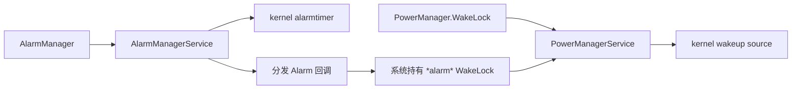

# WakeLock 与 Alarm 管理

## 两类机制的职责

WakeLock（唤醒锁）和 Alarm（系统定时通知）解决两个不同问题：

- WakeLock 表示工作已经开始，设备暂时不能进入会中断它的休眠状态。
- Alarm 表示工作尚未开始，系统到达约定时刻后通知应用。

它们都不是进程保活接口。WakeLock 不保证进程存活，也不提供后台启动资格；Alarm 回调应只完成短小的分发工作，耗时任务需要另行调度。持锁范围过大，会阻止系统进入低功耗状态；唤醒型 Alarm 过密，会增加设备被唤醒的次数；精确 Alarm 若未满足权限条件，调用时会抛出 `SecurityException`。

系统电源状态机见 §5.6 和 §11.5，后台任务分类见 §25.2，WorkManager（Jetpack 的持久后台任务调度库）实践见 §25.4。这里讨论应用侧的选择、生命周期、权限和诊断。

### Android 17 源码中的调用边界

关系图区分应用接口、系统服务和内核职责。



`PowerManagerService` 汇总框架层 WakeLock 并更新电源状态，`AlarmManagerService` 负责 Alarm 的分组、权限、空闲策略和分发。内核的 wakeup source（唤醒源）与 alarmtimer（定时唤醒机制）提供阻止休眠和定时唤醒能力，却不了解 `PendingIntent`（由系统在未来代应用执行操作的凭据）、精确 Alarm 权限或应用业务。系统可以合并多个 Alarm，设备也可能因其他来源已经处于唤醒状态，因此一次 Alarm 触发不一定对应一次内核唤醒。

源码可从三个入口核对：

- [`PowerManager.java`](https://android.googlesource.com/platform/frameworks/base/+/refs/tags/android-17.0.0_r1/core/java/android/os/PowerManager.java) 与 [`PowerManagerService.java`](https://android.googlesource.com/platform/frameworks/base/+/refs/tags/android-17.0.0_r1/services/core/java/com/android/server/power/PowerManagerService.java)
- [`AlarmManager.java`](https://android.googlesource.com/platform/frameworks/base/+/refs/tags/android-17.0.0_r1/apex/jobscheduler/framework/java/android/app/AlarmManager.java) 与 [`AlarmManagerService.java`](https://android.googlesource.com/platform/frameworks/base/+/refs/tags/android-17.0.0_r1/apex/jobscheduler/service/java/com/android/server/alarm/AlarmManagerService.java)
- [`drivers/base/power/wakeup.c`](https://android.googlesource.com/kernel/common/+/refs/tags/android17-6.18-2026-06_r6/drivers/base/power/wakeup.c) 与 [`kernel/time/alarmtimer.c`](https://android.googlesource.com/kernel/common/+/refs/tags/android17-6.18-2026-06_r6/kernel/time/alarmtimer.c)

## WakeLock 类型与使用规范

常规应用需要评估的 CPU（中央处理器）锁是 `PARTIAL_WAKE_LOCK`。它允许屏幕关闭，同时让 CPU 保持运行。`SCREEN_DIM_WAKE_LOCK`、`SCREEN_BRIGHT_WAKE_LOCK` 和 `FULL_WAKE_LOCK` 已废弃；页面需要保持亮屏时，使用 `FLAG_KEEP_SCREEN_ON` 或 View 的 `keepScreenOn`。申请 WakeLock 还需要在清单中声明 `android.permission.WAKE_LOCK`。

手动持锁之前，先检查平台接口是否已经管理唤醒周期。WorkManager 和 JobScheduler（Android 系统任务调度器）会在任务执行期间处理所需的 WakeLock；媒体、位置和部分传感器接口也有自己的电源行为。再叠加一把手动锁，通常只会扩大持锁范围。

[WakeLock 官方实践](https://developer.android.com/develop/background-work/background-tasks/awake/wakelock/best-practices)可归纳为五项约束：

- **范围小**：只覆盖必须在设备清醒时完成的同步代码。
- **超时明确**：`acquire(timeoutMillis)` 的超时是故障保护，业务仍应在工作结束时主动释放。
- **标签稳定**：标签包含包、类或方法的固定名称，不含用户信息、随机数、业务 ID 或计数器。
- **释放集中**：获取与释放写在同一个所有权范围内，异常和取消都经过 `finally`。
- **用户可感知**：需要长时间持锁的工作通常还需要合适类型的前台服务（Foreground Service，FGS）；如果 FGS 也不适合，应重新选择任务接口。

| 场景 | 推荐做法 | 不建议的做法 |
|------|----------|--------------|
| 屏幕保持常亮 | `WindowManager.LayoutParams.FLAG_KEEP_SCREEN_ON` 或 View 的 `keepScreenOn` | 用屏幕类 WakeLock 控制亮屏 |
| 用户触发且必须连续完成的短任务 | `PARTIAL_WAKE_LOCK` + 业务超时 + `try/finally` | 获取后分散到多个回调释放 |
| 可延后的后台同步 | WorkManager / JobScheduler | 用 WakeLock 保持线程池常驻 |
| 到时提醒 | AlarmManager，默认使用非精确 Alarm | 持锁等待目标时间 |
| 长时间用户可感知任务 | 合适类型的 FGS + 通知 + 取消入口 | 静默持锁运行 |

这个封装只处理一段同步代码。超时时间由调用场景传入，WakeLock 标签保持固定。

```kotlin
private const val SYNC_WAKELOCK_TAG = "com.example.app:SyncWorker"

inline fun <T> Context.withPartialWakeLock(
    timeoutMillis: Long,
    block: () -> T,
): T {
    require(timeoutMillis > 0L)

    val powerManager = getSystemService(PowerManager::class.java)
    val wakeLock = powerManager.newWakeLock(
        PowerManager.PARTIAL_WAKE_LOCK,
        SYNC_WAKELOCK_TAG,
    ).apply {
        setReferenceCounted(false)
        acquire(timeoutMillis)
    }

    return try {
        block()
    } finally {
        if (wakeLock.isHeld) {
            wakeLock.release()
        }
    }
}
```

`block()` 必须在函数返回前完成。如果它只负责启动协程、提交线程池任务或发起异步请求，函数返回时 WakeLock 就会释放。反向做法——把释放分散到异步回调——会增加遗漏异常、取消和超时分支的风险。可延后工作应交给 WorkManager；长时间且用户可感知的工作应使用符合类型与权限要求的 FGS。

WakeLock 默认使用引用计数：每次 `acquire()` 增加一次计数，每次 `release()` 减少一次，计数归零后才释放。示例将它关闭，是因为每次调用都创建独立对象，并且只有当前函数拥有这把锁。共享对象不适合这样处理：非引用计数模式下一次 `release()` 就会撤销此前所有 `acquire()` 的效果。超时到达后 `block()` 仍可能继续运行，因此超时不能替代业务取消，也不能用作任务成功的判断。

## WakeLock 泄漏检测与治理

WakeLock 异常往往来自所有权不清：异常提前返回、回调没有到达、取消路径遗漏，或者异步工作已经换到其他执行器，原调用方却仍持有锁。排查需要同时查看当前状态、历史时序和线上分布。

| 工具 | 观察对象 | 用法 |
|------|----------|------|
| `adb shell dumpsys power` | 当前仍活跃的 WakeLock | 查看标签（tag）、应用 UID、进程 PID 和持有状态，适合复现场景后立刻确认 |
| `adb shell dumpsys batterystats --history` | BatteryStats（系统电量归因统计）记录的持锁与唤醒事件 | 对照测试起止时间检查异常长区间，必要时结合 bugreport（Android 系统诊断报告） |
| Perfetto（Android 系统追踪工具） | 系统挂起与恢复、CPU 调度和应用工作时序 | 判断锁是否阻止休眠，并与 Alarm 或任务触发时间对齐 |
| Play Console Android Vitals（Google Play 线上质量指标） | 线上非豁免 partial WakeLock 分布 | 按版本、设备和 WakeLock 名称查受影响会话 |

应用没有直接调用 `PowerManager.newWakeLock()`，也可能看到归因到自身的锁。AlarmManager、JobScheduler、WorkManager、位置、FCM（Firebase Cloud Messaging，Firebase 云消息）和媒体接口都可能在系统或库内部持锁。官方的[WakeLock 来源对照](https://developer.android.com/develop/background-work/background-tasks/awake/wakelock/identify-wls)会随平台和库版本更新，诊断时应以当前系统显示的名称为起点。

AlarmManager 分发广播时会持有名为 `*alarm*` 的 WakeLock，并将它归因给设置 Alarm 的应用。该锁只覆盖 `BroadcastReceiver.onReceive()`；方法返回后，系统就可以释放锁。接收器中若启动异步工作，应该将输入持久化并交给 WorkManager 或其他合适接口，不能依赖 `*alarm*` 继续保护后续工作。

Android Vitals 当前将一个应用会话中、24 小时内累计达到两小时的非豁免 partial WakeLock 记为过度使用；若最近 28 天超过 5% 的应用会话出现该问题，可能影响应用在 Google Play 的可见性。统计只计算屏幕关闭且应用处于后台或运行 FGS 时持有的锁，并对部分有明确用户价值的系统 API 提供豁免。这个门槛用于识别严重问题，不应成为应用允许自己消耗的预算。参见 [Excessive partial wake locks](https://developer.android.com/topic/performance/vitals/excessive-wakelock)。

应用自己的审计记录不要只保存标签：

| 字段 | 用途 |
|------|------|
| `wakelock_tag` | 对应系统统计和 `dumpsys power` 输出 |
| `source_module` | 区分业务来源，避免同一标签被多个模块复用 |
| `trigger_source` | 记录来自用户动作、推送、Alarm、WorkManager 还是重试 |
| `acquire_uptime_ms` / `release_uptime_ms` | 计算持锁时长，不受系统时间调整影响 |
| `timeout_ms` | 判断是否依赖超时兜底释放 |
| `visible_to_user` | 区分用户感知任务和静默后台任务 |
| `failure_reason` | 记录异常、取消、超时、进程退出等释放路径 |

新增 WakeLock 应通过统一封装，标签固定且可定位，超时来自业务上限，每一条退出路径都能释放。单次时长和累计时长阈值应从具体场景的稳定版本与服务目标推导；下载、媒体、导航和短同步不能共用一个数字。

## AlarmManager 最佳实践

AlarmManager 用于跨越应用生命周期的时间通知。应用仍在运行时的界面计时、动画或请求超时，使用 Handler（进程内消息调度器）、协程等进程内工具；允许延后的持久化工作使用 WorkManager。用户指定的闹钟、日历事件和到时提醒，才需要评估 AlarmManager。参见 [Schedule alarms](https://developer.android.com/develop/background-work/services/alarms)。

选择 API 时，同时判断是否要唤醒设备、允许多大时间偏差，以及是否需要跨进程存活。Doze 指设备空闲时的低功耗模式。

| API | 系统行为 | 适用边界 |
|-----|----------|----------|
| `set()` | 不早于目标时间的单次非精确 Alarm；Android 12 及以上在没有额外省电限制时通常会在目标时间后一小时内分发 | 到点附近执行即可 |
| `setWindow()` | 在给定窗口内分发，便于系统合并唤醒 | 业务明确给出可接受窗口 |
| `setInexactRepeating()` | 非精确重复 Alarm，连续两次到达间隔可以变化 | 必须使用 Alarm 的粗略重复提醒；普通周期工作仍优先 WorkManager |
| `setAndAllowWhileIdle()` | Doze 中允许分发的非精确 Alarm，仍受频率限制 | 空闲状态下也要到达、但允许偏差 |
| `setExact()` | 精确单次 Alarm，受精确 Alarm 权限约束 | 用户对时刻有明确要求，但无需穿过 Doze |
| `setExactAndAllowWhileIdle()` | Doze 中允许分发的精确 Alarm，受权限和频率限制 | 闹钟、日历提醒等强时效场景 |
| `setAlarmClock()` | 用户可见的闹钟；系统必要时离开低功耗模式 | 闹钟应用的核心功能 |

目标版本 31 及以上调用 `setWindow()` 时，小于十分钟的窗口可能被系统扩展到十分钟。这个平台下限不表示业务都应该选择十分钟；窗口仍应来自产品对延迟的接受范围。精确 Alarm 难以和其他应用的唤醒合并，只有非精确接口无法满足用户需求时才使用。

### 先选时间基准，再选是否唤醒

- `RTC` / `RTC_WAKEUP` 使用墙上时钟，也就是用户可见且会受校时、时区和夏令时影响的系统时间，适合按当地时间提醒。用户修改时间、时区或夏令时规则时，应用要重新核对下一次触发。
- `ELAPSED_REALTIME` / `ELAPSED_REALTIME_WAKEUP` 使用 `SystemClock.elapsedRealtime()` 表示开机后持续递增的单调时间，不受墙上时钟调整影响，适合同一次开机内的延迟。
- 带 `WAKEUP` 的类型可以唤醒休眠设备；不带 `WAKEUP` 的类型会等设备下次清醒后分发。业务允许等待时，选择不唤醒设备的类型。

设备关机后 Alarm 会被清除。需要跨重启保留的提醒，应先将业务记录持久化，再在 `BOOT_COMPLETED` 后重建。每天按当地时间重复的提醒还要处理时区和夏令时变化，通常按下一次日历时间安排单次 Alarm，比固定毫秒间隔更可靠。

这个示例把允许在目标时间附近到达的提醒安排为窗口 Alarm。提醒标识（ID）写入 `Intent.data`，使 `PendingIntent` 身份稳定且不依赖 `Long.hashCode()`。

```kotlin
fun scheduleReminderWindow(
    context: Context,
    triggerAtMillis: Long,
    windowLengthMillis: Long,
    reminderId: Long,
) {
    require(windowLengthMillis > 0L)

    val alarmManager = context.getSystemService(AlarmManager::class.java)
    val intent = Intent(context, ReminderReceiver::class.java).apply {
        action = "com.example.app.ACTION_REMINDER"
        data = Uri.Builder()
            .scheme(context.packageName)
            .authority("reminder")
            .appendPath(reminderId.toString())
            .build()
        putExtra("reminder_id", reminderId)
    }
    val pendingIntent = PendingIntent.getBroadcast(
        context,
        0,
        intent,
        PendingIntent.FLAG_UPDATE_CURRENT or PendingIntent.FLAG_IMMUTABLE,
    )

    alarmManager.setWindow(
        AlarmManager.RTC_WAKEUP,
        triggerAtMillis,
        windowLengthMillis,
        pendingIntent,
    )
}
```

`Intent` 的附加字段不参与 `PendingIntent` 等价判断；只改变 `reminder_id`，可能覆盖已有 Alarm。示例使用唯一的 `data` URI（统一资源标识符）区分提醒，取消时必须重建等价的 `action`、`data`、组件、`requestCode` 和标志位。示例使用 `RTC_WAKEUP` 表示按用户墙上时钟提醒；若设备无需被唤醒，应改用 `RTC`。

接收器只做输入校验、状态确认和短小的本地处理。下载、数据库批处理或多轮网络请求需要入队；同一提醒已删除、账号已退出或状态已过期时，应直接结束。

### Android 17：允许空闲分发的 Listener Alarm

Android 17 / API 37 新增接受 `OnAlarmListener`（Alarm 回调监听器）与 `Executor`（回调执行器）的 `setExactAndAllowWhileIdle()`。它适合组件仍在运行、但不希望持续持有 WakeLock 等待下一次时机的场景。这个示例按开机后的单调时间安排一次回调。

```kotlin
@RequiresApi(37)
fun scheduleProcessLocalIdleAlarm(
    alarmManager: AlarmManager,
    triggerElapsedRealtime: Long,
    executor: Executor,
    listener: AlarmManager.OnAlarmListener,
) {
    alarmManager.setExactAndAllowWhileIdle(
        AlarmManager.ELAPSED_REALTIME_WAKEUP,
        triggerElapsedRealtime,
        "com.example.app:socket-maintenance",
        executor,
        listener,
    )
}
```

`OnAlarmListener` 版本不要求 `SCHEDULE_EXACT_ALARM`，只在当前进程内有效。调用进程没有活动的 `Activity`、`Service` 或 `ContentProvider` 后，系统可以取消它；组件结束时也应调用 `alarmManager.cancel(listener)`。它仍受允许空闲分发的频率限制，不适合循环安排高频回调。需要在进程死亡或组件结束后仍然触发时，使用 `PendingIntent` 版本并满足精确 Alarm 权限。示例中的 `@RequiresApi` 来自 `androidx.annotation.RequiresApi`。

使用这个重载需同时满足四个条件：活跃组件仍在、设备空闲时需要唤醒、回调能快速同步完成、回调丢失后能够恢复。Android 17 的 AlarmManager 会在投递回调前获取共享 WakeLock，`onAlarm()` 返回后完成投递并释放；因此回调内通常不应再获取应用 WakeLock。把工作另起异步线程后立即返回，会失去这段系统保护。

`OnAlarmListener` 通过进程内 Binder（Android 进程间通信机制）回调交付。应用进程进入 cached（缓存进程）或 frozen（冻结）状态、监听器对应的 Binder 失效，或者拥有该监听器的组件结束时，系统可以移除 Alarm；进程死亡后仍需交付的提醒应使用 `PendingIntent`。Android 17 还为 Listener 型允许空闲分发 Alarm 维护独立配额（quota）。AOSP 中的默认值用于解释当前实现，业务不能据此承诺固定心跳间隔。每次回调完成后，再按当前协议状态安排下一次一次性 Alarm，并记录请求时间、实际触发时间和回调完成时间，避免形成无法追踪来源的周期唤醒。

## Exact Alarm 权限变化（Android 12+）

精确 Alarm 权限经历了三次关键变化：

| 版本 | 权限规则 |
|------|----------|
| Android 12 / API 31 | 目标版本 31 及以上的应用使用基于 `PendingIntent` 的精确 Alarm，需要闹钟和提醒特殊访问权限或符合系统豁免 |
| Android 13 / API 33 | 目标版本 33 及以上可在 `SCHEDULE_EXACT_ALARM` 与 `USE_EXACT_ALARM` 中选择 |
| Android 14 / API 34 | 目标版本 33 及以上的新安装应用通常不会预先获得 `SCHEDULE_EXACT_ALARM`；备份恢复到 Android 14 的权限也会被拒绝 |

`USE_EXACT_ALARM` 会自动授予且用户不能撤销，但用途受限，并受 Google Play 政策约束，适合核心功能就是闹钟或日历的应用。`SCHEDULE_EXACT_ALARM` 是用户可授予和撤销的特殊访问权限，适用范围更广。两者都不该为普通同步任务声明。

精确 Alarm 到达属于 FGS 后台启动限制的豁免场景，但不会免除 FGS 类型、类型权限和使用中权限（while-in-use permission，一般只在应用可见或对应 FGS 满足条件时可用）检查。普通后台任务不能为了获得启动资格而改用精确 Alarm。

使用基于 `PendingIntent` 的 `setExact()`、`setExactAndAllowWhileIdle()` 或 `setAlarmClock()` 前，应通过 `canScheduleExactAlarms()` 检查资格。这个示例只负责安排 Alarm，并向调用层返回需要权限的结果；它不会从后台突然打开系统设置页。

```kotlin
enum class ExactAlarmScheduleResult {
    SCHEDULED,
    PERMISSION_REQUIRED,
}

fun scheduleExactReminder(
    context: Context,
    triggerAtMillis: Long,
    reminderId: Long,
): ExactAlarmScheduleResult {
    val alarmManager = context.getSystemService(AlarmManager::class.java)

    if (Build.VERSION.SDK_INT >= Build.VERSION_CODES.S &&
        !alarmManager.canScheduleExactAlarms()
    ) {
        return ExactAlarmScheduleResult.PERMISSION_REQUIRED
    }

    val intent = Intent(context, ReminderReceiver::class.java).apply {
        action = "com.example.app.ACTION_EXACT_REMINDER"
        data = Uri.Builder()
            .scheme(context.packageName)
            .authority("exact-reminder")
            .appendPath(reminderId.toString())
            .build()
        putExtra("reminder_id", reminderId)
    }
    val pendingIntent = PendingIntent.getBroadcast(
        context,
        0,
        intent,
        PendingIntent.FLAG_UPDATE_CURRENT or PendingIntent.FLAG_IMMUTABLE,
    )

    alarmManager.setExactAndAllowWhileIdle(
        AlarmManager.RTC_WAKEUP,
        triggerAtMillis,
        pendingIntent,
    )
    return ExactAlarmScheduleResult.SCHEDULED
}
```

界面层（UI）收到 `PERMISSION_REQUIRED` 后，应先解释用户功能为何需要精确时刻，再由用户动作打开 `Settings.ACTION_REQUEST_SCHEDULE_EXACT_ALARM`。用户拒绝时，根据业务改用 `setWindow()`、WorkManager 或下次进入应用时补偿；不能把 `SecurityException` 当作权限分支。

权限状态还影响已安排的 Alarm：

- `SCHEDULE_EXACT_ALARM` 被撤销时，系统会停止应用进程并删除该应用未来的精确 Alarm。
- 权限被授予时，系统发送 `ACTION_SCHEDULE_EXACT_ALARM_PERMISSION_STATE_CHANGED`。接收后仍要再次调用 `canScheduleExactAlarms()`，确认资格仍有效，再根据持久化记录重建必要 Alarm。
- 该广播只表示授予，不会在撤销时发送。应用启动、进入相关页面和安排 Alarm 前都要重新检查。
- 设备重启也会清除 Alarm，因此重建逻辑应与 `BOOT_COMPLETED` 共用同一份持久化业务数据。

审查精确 Alarm 时，逐项确认：

- 用户是否明确指定精确时间；后台同步和日志上传不属于此类。
- 时间窗口是否可以接受；可以接受就使用非精确 Alarm。
- 权限声明是否符合功能和商店政策。
- 调用前是否检查资格，拒绝后是否有可理解的降级行为。
- 提醒记录是否持久化，取消、重启、时间变化和权限变化能否得到一致结果。
- 相邻提醒是否可以合并，接收器是否只做短小工作。

## 扩展：功耗回归守门

### Android Vitals 的 excessive 与 stuck 口径

Google Play 的 WakeLock 指标只统计特定状态下的非豁免 partial WakeLock。Excessive（过度使用）指一个应用会话在 24 小时内累计持锁达到两小时；stuck（长时间未释放）指 24 小时内至少出现一次在后台连续持锁一小时。一个未达到 stuck 阈值的高频短锁，累计后仍可能达到 excessive 阈值。内部监控至少同时保存单次最长时长、窗口累计时长、次数和重叠区间。参见 [Stuck partial wake locks](https://developer.android.com/topic/performance/vitals/stuck-wakelock)。

Vitals 根据创建锁的平台 API 判断豁免，不根据手动标签的名称判断。音频、定位或 JobScheduler 用户发起任务（user-initiated job）的系统锁可能在指标中豁免；业务自行调用 `newWakeLock()`，即使标签写成 Audio 或 Location，也不会自动获得豁免。前台服务同样不是豁免项。

Play Console 给出标签、受影响会话和持续时间分布，端侧还要补充调用现场。手动锁应使用稳定、低基数（标签取值种类少）且不含用户信息的标签，例如 `com.example.sync:message-refresh`；应用日志再关联任务类型、版本、获取和释放时的调用栈哈希、前后台与充电状态。WorkManager 或 JobScheduler 生成的 `*job*` 标签可能随系统和库版本变化。遇到系统标签时，应回查 Worker、Job、约束、重试和停止原因；源码中不一定存在完整的运行时标签。

本地复现应覆盖屏幕关闭、应用在后台或运行 FGS、设备由电池供电的区间。`dumpsys power` 显示当前持锁者，BatteryStats 和 bugreport 还原累计区间，Perfetto 的电源（power）轨道把 WakeLock、Alarm、Job、屏幕状态与线程工作按时间对齐。Play 指标未计入的耗电也可能不合理；国内渠道和企业分发仍应保留相同的内部发布门禁。

WakeLock 和 Alarm 的回归要覆盖安排、触发、取消和失败恢复。测试周期应包含业务完整的提醒或重试过程，不照抄固定息屏时长。

这些命令用于测试机上观察当前 WakeLock、Alarm 队列和 BatteryStats 历史，并验证 Doze 条件下的到达行为。

```bash
adb shell dumpsys batterystats --reset
adb shell dumpsys battery unplug
adb shell dumpsys deviceidle force-idle

adb shell dumpsys power
adb shell dumpsys alarm
adb shell dumpsys batterystats --history

adb shell dumpsys deviceidle unforce
adb shell dumpsys battery reset
```

`dumpsys power` 显示此刻仍在持锁的对象，`dumpsys alarm` 显示等待中的 Alarm 及其分组，BatteryStats 历史用于对照测试时间。结束时必须解除强制 Doze 并恢复电池服务。测试还要覆盖用户取消提醒、修改时间或时区、重启设备，以及授予和撤销精确 Alarm 权限。

| 守门项 | 检查方式 | 失败处理 |
|--------|----------|----------|
| 新增 WakeLock | 静态扫描 `newWakeLock()` 和封装入口 | 没有固定标签、超时、释放路径时退回修改 |
| Exact Alarm 新增 | 扫描 `setExact*` / `setAlarmClock()` | 没有用户精确时间需求说明和权限降级方案时退回修改 |
| 持锁配对 | 单元测试异常与取消路径，设备测试核对获取和释放 | 出现超时释放或场景结束后仍持锁时阻止发布 |
| Alarm 身份 | 安排、更新、取消多个提醒，检查 `PendingIntent` 是否互相覆盖 | 修正 action、data、组件、request code 或 flags |
| Doze 到达 | 在强制 Doze 下验证非精确、允许空闲和精确接口的差异 | 接口语义与业务时效不匹配时重新选型 |
| 线上分布 | Android Vitals 与应用任务记录按版本、设备、入口关联 | 超过场景基线时定位 WakeLock 名称和触发来源 |
| 权限状态 | 覆盖未授予、已授予、撤销、升级与备份恢复 | 任一状态导致崩溃、静默丢提醒或重复提醒时阻止发布 |

任一守门项失败，都应先修正任务接口、生命周期或权限处理，再重新运行对应场景；不能用扩大超时或放宽阈值绕过。

## 小结

WakeLock 保护一段已经开始的工作，Alarm 安排未来的时间通知。前者的重点是所有权、超时和释放；后者的重点是时间基准、精度、唤醒类型、回调身份与权限。

Android 17 的 Listener 版 `setExactAndAllowWhileIdle()` 可以在进程内组件仍存活时替代持续持锁等待，但不能跨越进程死亡。需要持久到达的用户提醒仍使用 `PendingIntent`，并遵守精确 Alarm 权限。诊断时，框架源码解释调度与归因，`android17-6.18-2026-06_r6` 内核源码解释休眠阻止和定时唤醒；两层证据要按时间关联。
