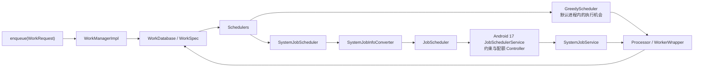

# WorkManager 实战与后台任务调度

<!-- outline-start -->
## 本节要点大纲

### 锚点(必须覆盖)

- 🔹 WorkManager 架构与约束条件
- 🔹 定期任务与链式任务
- 🔹 Expedited Work 与 Foreground Service 替代
- 🔹 WorkManager 与 JobScheduler 选型

### 扩展(可选深入)

- 🔸 (待扩展)

### OpenClaw 加工指引

> **锚点**是最低覆盖要求,加工时必须逐条落实并标注验证结果。
> **扩展**视素材丰富程度选择性深入。
> 如果从 Obsidian 素材或 AOSP 源码中发现大纲未列出但与本节强相关的知识点,
> 可**就地插入**最相关的锚点之后,并用 `[自动发现]` 标注,方便后续 review。
> 锚点内容需 L1/L2 验证,扩展内容至少 L2 验证,自动发现内容至少标注来源。
<!-- outline-end -->

## 为什么要了解 WorkManager 实战与后台任务调度

WorkManager 适合离开页面、进程退出或设备重启后仍需要可靠执行的工作，例如可延后的数据同步、日志上传和短时收尾。它不适合页面生命周期内的普通异步操作，也不保证精确时刻到达。

“可靠执行”不等于“副作用只发生一次”。Worker 可能在写入服务端后、更新本地成功状态前被终止，随后再次运行。任务应使用幂等键、可恢复进度或事务设计，不能把 WorkManager 的状态当成端到端 exactly-once 保证。

评审 WorkManager 任务时，要明确用户是否在等待、允许延迟多久、是否需要跨进程恢复、重复触发怎样合并，以及约束失效或配额用完后如何恢复。Doze、App Standby 与 Job 配额见 §25.2，WakeLock 和 Alarm 见 §25.3，平台 JobScheduler 机制见 §5.10。

## WorkManager 架构与约束条件

WorkManager 接收 `WorkRequest`，将 Worker 类型、输入数据、约束、延迟、重试策略和依赖关系写入 `WorkDatabase`。数据库记录让 WorkManager 能在进程退出或设备重启后重新安排未完成任务；它也为唯一任务、状态观察和依赖传播提供依据。

在 Android 10 到 Android 17 上，常见配置包含两类调度器：

- `GreedyScheduler` 只在应用默认进程中工作。没有延迟且没有约束的任务可以直接交给 `Processor`；除设备空闲与内容 URI 触发器外，它也能在进程存活时跟踪约束。该调度器不主动持有 WakeLock，进程退出后不能继续提供执行机会。
- `SystemJobScheduler` 将符合条件的 `WorkSpec` 转换成 `JobInfo`，交给平台 `JobScheduler`。Android 17 中，`JobSchedulerService` 及其 Controller 负责检查网络、充电、空闲、存储、配额和待机分组等系统条件。

下面的图用于区分 WorkManager 自己的状态管理与 Android 17 平台调度。两条执行路径最终都进入同一个 `Processor`。



`Schedulers` 会分别向有系统调度槽限制和无该限制的调度器提交可调度任务，因此同一个工作可能同时得到进程内执行机会和系统级安排。任一路径开始或完成工作后，WorkManager 依据工作 ID、generation、数据库状态和 `Processor` 协调其余路径；这能避免同一代 `WorkSpec` 被两个调度器独立推进，却不能替业务提供端到端的副作用去重。

`SystemJobInfoConverter` 对约束逐项映射：网络条件调用 `setRequiredNetwork()` 或 `setRequiredNetworkType()`，充电和空闲条件写入对应字段，API 26 起再写入低电量与低存储条件，API 24 起支持内容 URI 触发器。expedited 是另一项独立属性：仅在 API 31 及以上、第一次尝试且没有起始延迟时调用 `JobInfo.Builder.setExpedited(true)`，并不会改写网络类型。重试已是未来执行，转换器不会继续把它标成 expedited。

WorkManager 支持网络、电量不低、充电、设备空闲、存储不低和内容 URI 变化等约束。多个约束必须同时满足；运行中条件失效时，WorkManager 可以停止 Worker，等待条件恢复后重新安排。约束只描述可运行条件，不表示网络请求、文件写入或服务端操作具备原子性。

有两组构建期限制容易漏掉：

- `setRequiresDeviceIdle(true)` 与显式 `setBackoffCriteria()` 不能共存。`OneTimeWorkRequest.Builder` 和 `PeriodicWorkRequest.Builder` 会在 `build()` 时抛出 `IllegalArgumentException`。
- expedited 工作只能使用网络与存储条件，不能带起始延迟、充电、电量不低、设备空闲或内容 URI 触发条件；周期任务也不能标成 expedited。

源码核对分为 AndroidX 与平台两层。AndroidX 随依赖版本发布，不属于 Android 17 平台标签；平台侧统一以 `android-17.0.0_r1` 为锚点：

- AndroidX：[`Schedulers.java`](https://android.googlesource.com/platform/frameworks/support/+/androidx-main/work/work-runtime/src/main/java/androidx/work/impl/Schedulers.java)、[`GreedyScheduler.java`](https://android.googlesource.com/platform/frameworks/support/+/androidx-main/work/work-runtime/src/main/java/androidx/work/impl/background/greedy/GreedyScheduler.java)、[`SystemJobInfoConverter.java`](https://android.googlesource.com/platform/frameworks/support/+/androidx-main/work/work-runtime/src/main/java/androidx/work/impl/background/systemjob/SystemJobInfoConverter.java)、[`SystemJobScheduler.java`](https://android.googlesource.com/platform/frameworks/support/+/androidx-main/work/work-runtime/src/main/java/androidx/work/impl/background/systemjob/SystemJobScheduler.java)、[`WorkRequest.kt`](https://android.googlesource.com/platform/frameworks/support/+/androidx-main/work/work-runtime/src/main/java/androidx/work/WorkRequest.kt) 和 [`PeriodicWorkRequest.kt`](https://android.googlesource.com/platform/frameworks/support/+/androidx-main/work/work-runtime/src/main/java/androidx/work/PeriodicWorkRequest.kt)。
- Android 17：[`JobInfo.java`](https://android.googlesource.com/platform/frameworks/base/+/android-17.0.0_r1/apex/jobscheduler/framework/java/android/app/job/JobInfo.java)、[`JobSchedulerService.java`](https://android.googlesource.com/platform/frameworks/base/+/android-17.0.0_r1/apex/jobscheduler/service/java/com/android/server/job/JobSchedulerService.java)、[`QuotaController.java`](https://android.googlesource.com/platform/frameworks/base/+/android-17.0.0_r1/apex/jobscheduler/service/java/com/android/server/job/controllers/QuotaController.java)。

## 定期任务与链式任务

周期任务适用于允许延迟或跳过某一轮的同步，例如日志、配置与低优先级数据刷新。`repeatInterval` 是相邻周期的最小间隔，`flexInterval` 位于每个周期末尾；准确执行时刻仍受约束和系统优化影响。官方定义的最小周期为 15 分钟，最小 flex 为 5 分钟。代码应引用 AndroidX 常量校验调用方配置，以免库的边界与业务配置分离。

下面的函数用于注册一个可配置的指标上传任务。参数来自业务配置，函数只负责验证 WorkManager 的合法区间并建立稳定的唯一任务。

```kotlin
fun enqueueMetricsUpload(
    context: Context,
    repeatIntervalMillis: Long,
    flexIntervalMillis: Long,
    retryBackoffMillis: Long,
) {
    require(
        repeatIntervalMillis >=
            PeriodicWorkRequest.MIN_PERIODIC_INTERVAL_MILLIS,
    )
    require(
        flexIntervalMillis in
            PeriodicWorkRequest.MIN_PERIODIC_FLEX_MILLIS..repeatIntervalMillis,
    )
    require(
        retryBackoffMillis in
            WorkRequest.MIN_BACKOFF_MILLIS..WorkRequest.MAX_BACKOFF_MILLIS,
    )

    val constraints = Constraints.Builder()
        .setRequiredNetworkType(NetworkType.UNMETERED)
        .setRequiresCharging(true)
        .setRequiresBatteryNotLow(true)
        .build()

    val request = PeriodicWorkRequestBuilder<MetricsUploadWorker>(
        repeatIntervalMillis,
        TimeUnit.MILLISECONDS,
        flexIntervalMillis,
        TimeUnit.MILLISECONDS,
    )
        .setConstraints(constraints)
        .setBackoffCriteria(
            BackoffPolicy.EXPONENTIAL,
            retryBackoffMillis,
            TimeUnit.MILLISECONDS,
        )
        .addTag("metrics-upload")
        .build()

    WorkManager.getInstance(context).enqueueUniquePeriodicWork(
        "metrics-upload",
        ExistingPeriodicWorkPolicy.UPDATE,
        request,
    )
}
```

`UPDATE` 会更新同名周期任务的规格，并保留其原始入队时间；适合服务端调整间隔、flex 或约束的场景。若产品契约要求旧规格一直有效，可以明确选择 `KEEP`。示例没有设置设备空闲，因为它同时配置了退避策略。若任务必须等待空闲，应去掉显式退避配置，再让系统依据空闲条件安排。

链式任务适用于有明确成功依赖的一次性工作。`then()` 后的节点只会在所有直接前置节点成功后运行；前置节点失败或取消时，状态会传播到后续节点。周期任务不能加入链。Worker 的输出适合传递小型标识和元数据，大文件应写入持久存储，只在 `Data` 中传 URI 或业务 ID。

下面的示例表达“打包日志、上传、成功后清理”的线性依赖。唯一任务名防止同一批工作在尚未结束时重复入队。

```kotlin
val pack = OneTimeWorkRequestBuilder<PackLogsWorker>()
    .addTag("log-pipeline")
    .build()

val upload = OneTimeWorkRequestBuilder<UploadPackedLogsWorker>()
    .setConstraints(
        Constraints.Builder()
            .setRequiredNetworkType(NetworkType.CONNECTED)
            .build(),
    )
    .addTag("log-pipeline")
    .build()

val cleanup = OneTimeWorkRequestBuilder<CleanupLogsWorker>()
    .addTag("log-pipeline")
    .build()

WorkManager.getInstance(context)
    .beginUniqueWork("log-pipeline", ExistingWorkPolicy.KEEP, pack)
    .then(upload)
    .then(cleanup)
    .enqueue()
```

这条链保证清理节点只在上传节点成功后具备运行资格。它仍需处理进程在服务端写入成功后终止的情况：上传接口使用稳定批次 ID 作为幂等键，Worker 将服务端确认与本地进度持久化，清理节点核对批次状态后再删除文件。一个可独立重试的本地事务通常适合放在同一 Worker 内；跨网络或需要独立补偿的步骤再拆成节点。

## Expedited Work 与 Foreground Service 替代

Expedited Work 面向用户发起、需要尽快开始并在几分钟内完成的重要任务，例如消息发送、支付收尾或短附件上传。它受系统级执行时间配额控制，只是较少受到省电模式与 Doze 影响，不能用于规避后台限制。

配额不足时，`RUN_AS_NON_EXPEDITED_WORK_REQUEST` 将工作改按普通请求运行，`DROP_WORK_REQUEST` 则取消请求。AndroidX 的 `SystemJobScheduler` 也实现了前一种处理：平台调度失败且策略允许时，清除 `WorkSpec.expedited` 后再次安排。即使有配额，系统负载和资源状态仍可能推迟开始时间。

下面的函数用于提交一笔用户刚确认的回执上传。业务 ID 同时参与唯一任务名和请求数据，便于 Worker 对服务端操作去重。

```kotlin
fun enqueueReceiptUpload(
    context: Context,
    receiptId: String,
) {
    val constraints = Constraints.Builder()
        .setRequiredNetworkType(NetworkType.CONNECTED)
        .build()

    val request = OneTimeWorkRequestBuilder<ReceiptUploadWorker>()
        .setInputData(workDataOf("receipt_id" to receiptId))
        .setConstraints(constraints)
        .setExpedited(
            OutOfQuotaPolicy.RUN_AS_NON_EXPEDITED_WORK_REQUEST,
        )
        .addTag("receipt-upload")
        .build()

    WorkManager.getInstance(context).enqueueUniqueWork(
        "receipt-upload:$receiptId",
        ExistingWorkPolicy.KEEP,
        request,
    )
}
```

网络条件属于 expedited 允许的约束。`KEEP` 只阻止同名未完成工作再次入队，服务端仍应按 `receiptId` 去重。额度不足后的普通执行不再有低延迟预期；Worker 返回 `Result.retry()` 后的后续尝试也按普通工作处理。

Android 12 之前，WorkManager 为兼容 expedited 工作可能启动前台服务，Worker 需要实现 `getForegroundInfo()` 或 `getForegroundInfoAsync()`，否则旧版本设备可能在运行时崩溃。API 31 及以上可使用平台 expedited job；`SystemJobInfoConverter` 只在第一次、无延迟的执行中设置 `JobInfo.setExpedited(true)`。

长时间任务要按用户可见性和传输语义选择：

- WorkManager 的 long-running Worker 可以运行超过 10 分钟，并由 WorkManager 管理前台服务与通知。Android 14 起，前台服务类型、清单权限和运行时先决条件都要满足。
- Android 16 起，伴随前台服务运行的 long-running Worker 仍会占用应用的普通 JobScheduler 运行时间配额，官方建议在适合时直接使用前台服务，或为用户发起的数据传输改用 UIDT。
- UIDT 从 Android 14（API 34）开始提供，要求任务由用户操作发起、在应用可见时安排，并显示通知；它不计入普通 job 配额。低版本需要产品定义的兼容方案。

Android 17 没有对所有 targetSdk 37 前台服务施加统一的 while-in-use 条件。各类前台服务仍按自己的启动、权限与运行时规则检查；Android 17 的后台音频限制是单独的版本行为，见 §25.17，不能推广到 WorkManager 的全部 long-running Worker。

## WorkManager 与 JobScheduler 选型

选型依据是任务对时机、持久性、用户可见性和平台能力的要求。WorkManager 提供跨版本封装、唯一任务、依赖、输入输出、标签、状态观察和重试；直接使用 JobScheduler 可以访问特定平台版本才有的 `JobInfo` 能力，也便于系统应用按 job ID 观察 Controller 与配额状态。两者都受 Doze、App Standby、配额和后台执行限制。

| 场景 | 推荐选择 | 判断依据 |
|------|----------|----------|
| 只在页面存活期间有效的异步操作 | 生命周期感知协程 | 页面销毁后可以取消，不需要跨进程恢复 |
| 离开页面后仍需可靠尝试的短任务 | `OneTimeWorkRequest`；满足条件时 expedited | 需要持久记录、排重、重试和状态观察 |
| 周期日志、配置或低优先级同步 | 唯一 `PeriodicWorkRequest` + flex + 约束 | 允许延迟或跳过某一轮，可合并到省电窗口 |
| 有成功依赖的多步离线处理 | 一次性 WorkManager chain | 节点边界清楚，失败与取消传播符合业务要求 |
| 接近指定时刻的提醒 | AlarmManager | WorkManager 不保证准确时刻；精确闹钟权限见 §25.3 |
| 用户可见且持续较久的普通操作 | 前台服务 | 需要持续通知和明确的前台服务语义 |
| 用户发起的数据传输 | Android 14+ 优先评估 UIDT | 可见时安排、有通知，且不计入普通 job 配额 |
| 平台专属 `JobInfo` 能力或系统组件 | 直接使用 JobScheduler | 需要 UIDT、稳定 job ID、Android 17 pending reason 统计或系统级诊断 |

是否“重要”不足以决定 API。要把完成时限、进程退出后的恢复要求、重复执行后果、通知义务和版本兼容方案写进任务契约，再据此选择。

## Android 16 与 Android 17 的配额和诊断变化

Android 16（API 36）调整了普通 job 与 expedited job 的运行时间配额：

- ACTIVE 待机分组也开始执行一个较宽松的运行时间配额。
- job 在应用可见时启动、应用转入不可见后继续运行，后续执行时间计入配额。
- job 与前台服务并行执行时，job 的执行时间仍计入配额。

这些变化同时影响 WorkManager、JobScheduler 和 DownloadManager。文章不写死配额分钟数，因为相关值会受待机分组与系统配置影响，应用也不应依赖某个固定额度。

诊断接口按版本逐步增强：

- WorkManager 2.9.0 起可通过 `WorkInfo.getStopReason()` 读取停止原因；旧版依赖只能结合 `WorkInfo.State`、尝试次数和应用自己的阶段记录分析。
- `JobParameters.getStopReason()` 从 Android 12（API 31）提供给直接使用 JobScheduler 的任务。
- Android 16 新增 `JobScheduler.getPendingJobReasonsHistory(jobId)`，用于查看一个 job 过去未运行的原因。
- Android 17（API 37）的 JobDebugInfo 系列诊断接口新增 `JobScheduler.getPendingJobReasonStats(jobId)`，返回待执行原因到累计持续时间的映射。它能区分“曾经受某约束影响”与“该约束累计阻塞了多久”。

WorkManager 内部使用的 JobScheduler job ID 属于实现细节，业务代码不应保存它，也不应拿它调用 Android 16/17 的 job ID 诊断接口。WorkManager 任务使用 `WorkInfo`、唯一任务名、标签和应用日志；只有直接安排的 JobScheduler 任务才使用稳定的业务 job ID 与 `JobDebugInfo`。

停止原因应和任务阶段一起记录。最低限度包括：工作 ID、唯一任务名或标签、`runAttemptCount`、开始与停止时间、停止原因、约束快照、业务幂等键，以及副作用进行到哪一步。Android 14 及以上设备若频繁发生超时，系统可能把应用放入 RESTRICTED 待机分组，因此超时既是可靠性问题，也是后续后台执行机会减少的信号。

## 回归验证

单元和仪器测试使用 WorkManager 的测试初始化器与 `TestDriver`，主动满足起始延迟、周期条件和约束；这样可以确定唯一任务策略、依赖传播、重试与业务幂等逻辑。真机测试再覆盖系统调度、待机分组、Doze、网络切换与进程终止。

下面的命令用于在测试设备上切换待机分组并查看 JobScheduler 状态。把包名替换成被测应用；验证结束后恢复到 ACTIVE，避免污染后续用例。

```bash
adb shell am set-standby-bucket com.example.app restricted
adb shell am get-standby-bucket com.example.app
adb shell dumpsys jobscheduler
adb shell am set-standby-bucket com.example.app active
```

`set-standby-bucket` 只改变待机分组测试条件，不能证明某个 WorkManager 请求会立即运行或停止。测试记录需要同时保存 `WorkInfo`、应用阶段日志和 `dumpsys jobscheduler`；Android 16/17 上，直接使用 JobScheduler 的用例再采集 pending reason 历史或统计。

发布前至少验证这些失败窗口：

- 进程在网络副作用完成后、本地成功状态写入前终止，下一次执行没有重复创建服务端数据。
- 约束在 Worker 运行中失效，停止与再次安排不会破坏本地中间状态。
- expedited 配额不足后改为普通工作，界面不会一直显示“立即处理中”。
- 周期规格通过 `UPDATE` 变更后，唯一任务没有并存两份。
- 前置节点失败或取消后，链的后续节点状态与产品预期一致。
- Android 16 配额条件与 Android 14+ RESTRICTED 分组下，没有无上限重试或密集重新入队。

## 小结

WorkManager 解决的是可延后工作的持久记录、约束、排重、依赖和重试。应用仍要定义副作用幂等性、恢复点、配额不足后的用户体验和停止原因观测。AndroidX 负责工作状态与调度器协作，Android 17 的 JobScheduler 负责平台约束和配额；分清这两层，才能解释任务为什么没开始、为什么被停止，以及恢复后是否可以安全重跑。

## 延伸阅读

- [Define work requests — Android Developers](https://developer.android.com/develop/background-work/background-tasks/persistent/getting-started/define-work)：周期、flex、约束、退避和 expedited 的公开契约。
- [Update work — Android Developers](https://developer.android.com/develop/background-work/background-tasks/persistent/how-to/update-work)：`UPDATE` 对一次性与周期唯一任务的更新语义。
- [Support for long-running workers — Android Developers](https://developer.android.com/develop/background-work/background-tasks/persistent/how-to/long-running)：long-running Worker、前台服务与 Android 16 job 配额。
- [User-initiated data transfer — Android Developers](https://developer.android.com/develop/background-work/background-tasks/uidt)：Android 14+ UIDT 的使用条件、通知和约束。
- [Android 16 behavior changes for all apps](https://developer.android.com/about/versions/16/behavior-changes-all)：JobScheduler 配额变化与 pending reason 历史。
- [Android 17 features and APIs](https://developer.android.com/about/versions/17/features)：JobDebugInfo 系列的 `JobScheduler.getPendingJobReasonStats()`。
