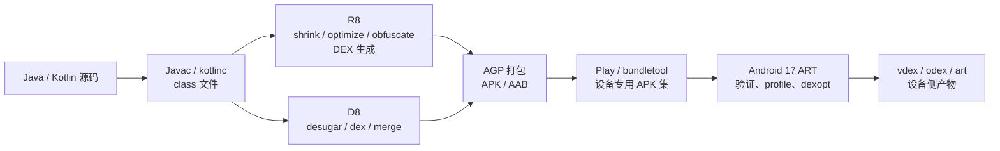
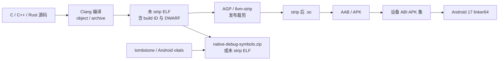
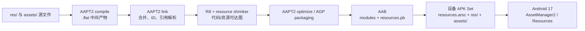

# 应用体积分析与优化：DEX、Native SO 与资源

应用体积主要由 DEX、Native SO 与资源文件组成，但治理对象不是一个孤立的 APK 数字。先固定交付制品和设备口径，再沿字节码、原生库与资源三条路径归因，最后回到下载、安装、运行时和功能兼容验证。

## 先统一制品与体积口径

体积治理不能从“删哪个目录”开始。先要固定用户拿到哪组 APK、下载多少字节、安装后占用多少空间，以及运行时映射了哪些页；这四个结果可能沿不同方向变化。

### APK 是带平台约束的 ZIP

APK 使用 ZIP 组织文件，但目录结构不能替代 Android 的安装和加载语义：

- `classes*.dex` 保存字节码。单个 DEX 的 `method_ids`（方法引用 ID 表）上限是 65,536，不是整个应用只能定义 65,536 个方法；
- `resources.arsc` 与 `res/` 组成编译资源，`assets/` 保存按原始文件接口读取的内容。静态缩减器不能仅凭业务代码判断所有 asset 是否仍被使用；
- `lib/<abi>/` 保存各 ABI（应用二进制接口）的 ELF（Executable and Linkable Format，可执行与可链接格式）库。条目是否压缩会同时影响下载字节、安装期提取和直接映射条件；
- V1/JAR 签名会在 `META-INF/` 生成清单与签名文件，V2/V3 签名位于 APK Signing Block（APK 签名块），V4 还使用独立的 `.idsig` 文件。看到 `META-INF/` 不能反推出制品只采用 V1。

未压缩条目会让 APK 文件变大，却可能避免安装期提取或支持直接映射。因此，单看 ZIP 中某个文件的字节数，不能判定下载、安装或内存是否一起改善。

### 四种数字不能互相替代

| 口径 | 回答的问题 | 常见误读 |
|---|---|---|
| 上传制品 | APK 或 AAB（Android App Bundle）本身多大 | 把 AAB 大小当作任意设备的下载量 |
| 设备交付集合 | 固定 ABI、语言、密度、SDK 与模块后，设备会获得哪些 split APK（拆分包） | 用 universal APK 代表 Play 的设备专用交付 |
| 安装占用 | 已安装 APK、提取的原生库、ART 编译产物、应用数据与缓存共占多少 | 认为下载减少 1 MB，安装空间必然同步减少 1 MB |
| 运行时映射 | DEX、SO、资源的文件页、私有脏页和共享页如何进入进程 | 用磁盘文件大小直接推导 PSS（按共享比例分摊的物理内存） |

普通单 APK 渠道交付一个完整 APK；App Bundle 渠道会生成基础 APK、按 ABI、语言或密度拆分的配置 APK，以及 Dynamic Feature APK（动态功能模块包）。比较 AAB 必须固定设备规格和模块集合。减少上传制品、设备下载量、安装占用和运行时内存是四个不同目标，应分别记录。

### 先做整包归因，再进入专项

[APK Analyzer](https://developer.android.com/studio/debug/apk-analyzer) 可查看 APK/AAB 的文件构成、DEX 包结构、资源和编译后的 manifest（应用清单），并比较两版制品。界面中的两个尺寸要分开解释：

- **Raw File Size** 是实体压缩后写入 APK ZIP 的大小，也就是它对当前 APK 文件大小的贡献，不是解压后的大小；
- **Download Size** 是工具对 Google Play 压缩传输大小的估算，适合观察变化方向，但不等于 Play Console 针对某个设备配置给出的精确结果。

先按增长目录选择后续路径：`classes*.dex` 看依赖、生成代码和 R8；`resources.arsc`、`res/` 与 `assets/` 看引用图、替代资源和素材；`lib/<abi>/` 看 ABI、符号、链接与页对齐。签名、压缩、加固和渠道重签也会改变产物，基线与候选必须使用同一发布变体、构建工具、签名流程和设备规格。每次只改变一类变量，重新生成 release 制品，才能把收益归到具体机制。

后文依次进入 DEX、Native SO 与资源三类专项；App Bundle 与按需分发的完整机制见 [25.6 App Bundle 与按需分发](06-app-bundle-delivery.md)。

## 字节码、依赖与 Profile 交付

### 先确定 DEX 的优化对象

DEX（Dalvik Executable，Dalvik 可执行格式）是 Android 保存类定义、字节码和相关数据的文件。APK 是可安装包；AAB（Android App Bundle）是供 Google Play 按设备配置生成 APK 的发布包。DEX 优化容易被“方法数”“DEX 个数”带偏。用户感知到的是下载、安装、启动和运行时内存，工程团队操作的是另一组产物指标：

| 指标 | 回答的问题 | 不能单独证明什么 |
|---|---|---|
| APK/AAB 中 DEX 的原始字节数 | Java/Kotlin 代码在发布产物中占多大空间 | 用户经 Play 下载的字节数 |
| APK 的 DEX 压缩后字节数 | 当前 APK 文件中 DEX 的 ZIP 贡献 | App Bundle 针对某台设备的交付大小 |
| 单个 DEX 的方法/字段引用数 | 是否逼近索引上限，增长来自哪些包 | 代码实际占用的字节数 |
| `classes.dex` 的启动代码覆盖 | 启动路径是否集中在首个 DEX | 整体 DEX 是否足够小 |
| 设备上的 `.vdex`、`.odex`、`.art` | 安装后验证、编译和 App Image 成本 | 商店下载大小 |

ART（Android Runtime，Android 运行时）会在安装和运行过程中生成验证或编译辅助产物：`.vdex` 保存验证及相关 DEX 数据，`.odex`/`.oat` 保存设备侧编译结果，`.art` 是 App Image（把预初始化类和对象状态映射进内存的镜像）。这些文件占设备存储，不计入商店下载的 DEX 字节。

本文的平台基线为 Android 17 / API 37 / `android-17.0.0_r1`，构建工具部分按 2026 年 8 月 15 日检索到的 Android Developers 文档核对。平台版本和 Android Gradle Plugin（AGP）/R8 版本是两条独立轴：升级 `targetSdk` 不会自动缩小 DEX，升级工具链也不能代替发布产物回归测试。

一个可执行的目标通常写成三组预算：

- 交付预算：指定设备配置下的基础模块（base）APK 与安装时动态特性模块（feature）总下载量；
- 代码预算：各模块 DEX 原始字节数、压缩字节数、引用数和增量归属；
- 性能预算：启动路径是否落在主 DEX、首次显示耗时（TTID）、完全显示耗时（TTFD）、缺页次数、类加载与安装后编译成本。缺页表示进程访问的代码页尚未驻留内存，需要从文件映射中载入。

方法引用下降而 DEX 变大，或者 DEX 变小而启动变慢，都可能发生。持续集成（CI）应同时保存体积与启动结果，避免用一个间接指标替代用户结果。

### DEX 文件里哪些内容占空间

标准 DEX 由文件头（header）、若干标识符（ID）表、类定义和数据区（data section）组成。Android 17 的 [`StandardDexFile`](https://android.googlesource.com/platform/art/+/refs/tags/android-17.0.0_r1/libdexfile/dex/standard_dex_file.h) 与官方 [DEX format](https://source.android.com/docs/core/runtime/dex-format) 给出了字段布局。

#### 固定宽度的索引区

DEX 040 及更早格式的文件头是 112 字节，DEX 041 文件头是 120 字节。主要索引项的单项大小如下：

| 区域 | 单项大小 | 保存的内容 |
|---|---:|---|
| `string_ids` | 4 字节 | 指向 `string_data_item` 的偏移 |
| `type_ids` | 4 字节 | 指向类型描述符字符串的索引 |
| `proto_ids` | 12 字节 | 方法原型的短描述、返回类型与参数列表 |
| `field_ids` | 8 字节 | 声明类、字段类型与字段名 |
| `method_ids` | 8 字节 | 声明类、方法原型与方法名 |
| `class_defs` | 32 字节 | 类、父类、接口、注解、类数据和静态值入口 |

索引区增长常由依赖、生成代码和宽泛的 keep 规则（R8 保留规则）推动。即使某个方法体很短，它仍可能增加 method、type、proto 和 string 等多处数据。跨 DEX 拆分时，每个逻辑 DEX 拥有自己的索引表，常用类型与字符串可能在不同文件重复出现。

#### 变长的数据区

数据区包含以下主要项目：

- `string_data_item`：MUTF-8（Modified UTF-8，以 UTF-16 代码单元为基础的变体编码）字符串与 UTF-16 长度；
- `type_list`：接口列表和方法参数类型；
- `annotation_*`、`encoded_array_item`：注解、静态值和其他编码值；
- `class_data_item`：字段、方法及其访问标志，以 ULEB128（无符号小端 Base-128 变长编码）保存索引差值；
- `code_item`：寄存器、参数、返回值、异常处理区间与 16 位指令单元；
- `debug_info_item`：源码行号、参数名和局部变量事件。

大型业务通常由 `code_item`、字符串、注解和类数据共同决定体积。只统计“定义方法数”会漏掉方法体大小、长字符串、泛型/注解数据和重复索引。

#### 64K 限制是引用表限制

单个 DEX 的 `method_ids` 最多有 65,536 个条目。计数包含应用代码、依赖和该 DEX 引用的 Android/Java 平台方法；它不等于源代码中声明的方法数量。`field_ids` 也使用 16 位索引并有同级上限。

APK Analyzer 同时显示 Defined Methods（定义的方法）与 Referenced Methods（引用的方法）：

- Defined Methods 只统计这个 DEX 定义的方法；
- Referenced Methods 统计该 DEX 的方法 ID 表，决定是否触发方法引用上限；
- 一个定义在其他 DEX 或平台中的方法，仍可能占当前 DEX 的引用条目。

`65,536` 解释了为什么需要 multidex（在一个 APK 中放置多个 DEX），却不能充当体积预算。两个版本的引用数相同，方法体、字符串和调试信息差异仍可让字节数相差很大。

### 从源码到发布 DEX 的构建路径

这张图区分 D8、R8、打包和 ART 的职责：



启用代码裁剪的 `release`（发布）构建由 R8 完成整程序分析、代码改写、重命名和 DEX 生成。未启用裁剪的构建、增量中间产物和部分 DEX 合并路径使用 D8。R8 可以直接生成 DEX，当前发布流程不是“R8 输出 `.class`，再由 D8 固定转换一次”。

AGP 负责编排 desugaring（把较新的 Java/Kotlin 字节码特性转换为目标 Android 版本可执行的形式）、依赖输入、默认规则、资源处理、性能配置文件（profile）改写和打包。应用项目通常不应绕开 AGP 直接调用 D8/R8；独立命令更适合复现实验和工具开发。

### R8：主要体积收益来自可删除、可改写、可重命名

R8 能做三类与 DEX 大小直接相关的工作：

1. code shrinking（代码裁剪）：从入口与 keep 规则出发构建可达图，也就是沿引用关系得到存活代码集合，再删除不可达类、字段和方法；
2. optimization（代码优化）：内联、常量传播、类合并、枚举优化、去虚化和其他代码改写；去虚化是把目标可确定的虚调用改成更直接的调用；
3. obfuscation/minification（混淆与名称压缩）：缩短类、包、字段和方法名，减少字符串与描述符占用。

R8 Full Mode（全模式）会采用更积极的整程序分析假设，自 AGP 8.0 起已经是默认模式。旧项目若仍有 `android.enableR8.fullMode=false`，删除该兼容开关才能恢复 Full Mode；无需再添加早期文档里的 `android.enableR8.fullMode=true`。

#### 发布构建配置

这个 Kotlin DSL 示例适用于仍使用 legacy（旧版）build type DSL（构建类型配置语法）的项目，用于启用发布代码与资源优化：

```kotlin
android {
    buildTypes {
        release {
            isMinifyEnabled = true
            isShrinkResources = true
            proguardFiles(
                getDefaultProguardFile(
                    "proguard-android-optimize.txt",
                ),
                "proguard-rules.pro",
            )
        }
    }
}
```

`proguard-android-optimize.txt` 启用适合应用发布的优化默认值。AGP 9.3 及以上还提供 `optimization { enable = true }` 和 `keepRules` source set（源码集目录）；旧版 DSL 仍受支持。团队应按当前 AGP 版本选择一种配置，不要在同一份说明中混用两套目录约定。

优化开关只决定 R8 是否有机会工作。若消费端规则（consumer rules，即库随 AAR 交给应用合并的规则）或应用规则保留了大部分代码，开关已经打开也不会得到预期结果。

#### Keep 规则的四个维度

一条裸 `-keep` 同时阻止 shrinking、obfuscation 和 optimization。`allowshrinking`、`allowobfuscation`、`allowoptimization` 用于放开对应能力。规则设计应回答四个问题：

1. 哪个类或成员通过反射、JNI（Java Native Interface，Java 与原生代码的调用接口）、序列化、WebView bridge（JavaScript 与应用代码之间的桥接对象）或框架回调访问？
2. 运行时依赖的是存在性、名称、签名、注解，还是可见性？
3. 类自身是否已有静态引用，只需保护动态访问的成员？
4. 这项约束应放在应用规则中，还是由库的消费端规则随 AAR 提供？

这条规则保留一个已由静态代码创建的 WebView bridge 中带注解的方法，同时允许 R8 优化方法体：

```proguard
-keepclassmembers,allowoptimization class com.example.web.AppBridge {
    @android.webkit.JavascriptInterface public <methods>;
}
```

这条规则不会保留整个业务包，也没有禁止 AppBridge 之外的代码重命名。若 JavaScript 还通过字符串查找 bridge 类名，类名本身也需要单独保护；规则范围应由调用协议决定。

这类包级规则适合作为短期止崩手段，不适合长期留在发布配置中：

```proguard
-keep class com.example.** { *; }
```

它会阻止匹配代码被删除、改名和优化。缩小范围前需要补齐反射、序列化、JNI、动态加载与关键业务测试，不能靠删除规则后“能启动”作为充分验证。

#### `@Keep` 的使用边界

`androidx.annotation.Keep` 通过 AndroidX 随库提供的消费端规则形成强保留约束。它适合表达无法从静态调用图推导的稳定运行时协议，但容易把约束藏在源码中：

- 公共 SDK 回调、反射入口或工具生成代码可使用；
- 普通业务类不应为了消除一次 R8 崩溃就整类标记；
- 注解落在类上还是成员上，会改变保留范围；
- 清理 `@Keep` 前要找到运行时入口并写出更精确的规则。

第三方库中的消费端规则与应用规则会汇总进同一个 R8 配置。一个依赖携带的包级 `-keep` 可能保留其传递依赖，因此“应用自己的规则很少”不能证明 keep 配置健康。

#### 找出是谁保留了代码

这些临时诊断规则用于输出合并配置，并追踪一个意外存活类到入口或 keep 规则的路径：

```proguard
-printconfiguration build/reports/r8/configuration.txt

-whyareyoukeeping class com.example.large.UnexpectedRoot
```

`-whyareyoukeeping` 会增加构建开销，应只在本地诊断分支使用。AGP 产物中的 `configuration.txt`、`seeds.txt` 和 `usage.txt` 也可配合 APK Analyzer：

- `configuration.txt`：应用、默认规则、各模块和依赖消费端规则的合并结果；
- `seeds.txt`：被配置阻止删除的节点；
- `usage.txt`：R8 删除的类、字段和方法；
- `mapping.txt`：原始符号到发布符号的映射，以及行号、内联等 Retrace（混淆堆栈还原）元数据。

遇到“某个 SDK 占了 2 MB”时，先看发布 DEX 中仍存活的包，再用 `-whyareyoukeeping` 找到使代码存活的根节点。源码依赖大小、AAR/JAR 文件大小与 R8 后的 DEX 贡献是三项不同指标。

#### R8 Configuration Analyzer

R8 Configuration Analyzer 需要 R8 9.3.7-dev 或更高版本，使用 AGP 时则以稳定版 AGP 9.3.0 为起点。AGP 9.3 提供独立任务：

```bash
./gradlew :app:analyzeReleaseR8Config
```

该任务把 HTML 报告写到 `app/build/reports/r8/r8-config-analyzer-release.html`。完整的 R8 发布构建也会在 `build/outputs/mapping/release/configanalyzer.html` 生成报告。报告按代码裁剪、优化和混淆三个维度展示规则影响，并定位覆盖范围过大的规则。三个分数表示有多少类、字段和方法仍可参与对应优化，不是最终节省字节数。它适合持续观察规则质量，但仍要结合发布 APK：

- 高裁剪分数（shrinking score）不代表方法体一定小；
- 某条规则覆盖很多节点，可能对应合法的运行时协议；
- 分析器没有执行应用的反射、JNI 或序列化路径；
- 规则修改后的正确性由测试、分批发布与线上崩溃监控确认。

未使用支持该分析器的工具链时，`configuration.txt`、`seeds.txt`、`usage.txt`、APK Analyzer 和 `-whyareyoukeeping` 已能完成同类排查。

### 依赖与生成代码：先看发布贡献

DEX 增长常见来源包括：

- 新增 SDK 带入大量传递依赖；
- 库通过反射、`ServiceLoader`、JNI 或消费端规则保留宽泛代码；
- 依赖注入（DI）、路由、序列化、数据库和 Compose 编译生成代码增加；
- 多个功能各自引入功能重叠的工具库；
- 仅使用大型库的一小部分 API，但内部入口把多数实现变成可达；
- core library desugaring（核心库兼容转换）为较低 `minSdk` 提供新版 Java API 的兼容实现。

R8 能删除不可达代码，但存在若干边界：

- 反射字符串、原生代码回调和外部配置不在普通静态调用图中；
- 库的消费端规则可能保护实现细节；
- 资源、应用清单（manifest）、JNI 注册和序列化协议可能成为入口；
- 一个小入口可能静态引用完整实现树；
- 多模块重复声明依赖不等于发布 DEX 一定重复，最终结果取决于构建变体（variant）解析和打包。构建变体是构建类型、产品配置等组合出的具体产物版本。

依赖治理应以相同发布构建变体的产物差异为依据。源码行数、Maven 包大小或调试 APK 只能作为线索。

### D8 选项不能替代 R8

#### `--release`

独立 D8 的 `--release` 会减少调试信息，并在存在主 DEX 类清单（main dex list）时尝试把更多类填入主 DEX。它不会执行 R8 的整程序代码裁剪、重命名和高级优化。

AGP 已按构建变体选择 D8/R8 模式。应用发布构建无需额外执行一次 `d8 --release`；对 R8 输出再做第三方 DEX 重写还可能破坏性能配置文件、布局和 Retrace 映射。

#### `--min-api`

`--min-api` 描述输出需要兼容的最低平台。较高 `minSdk` 可能减少部分字节码或核心库兼容代码，也可能让工具使用较新的指令或库 API，但它是产品兼容决策，不能被当作可随意调高的压缩级别。

DEX 版本也不应被写成“037 比 038 小”这种固定关系：

- DEX 037 增加默认接口方法支持；
- DEX 038/039 增加新的字节码和 method handle/type（方法句柄/方法类型）能力，用来描述可动态调用的方法目标和签名；
- DEX 040 扩展 SimpleName（标识符简单名称）的允许字符范围；
- DEX 041 引入可容纳多个逻辑 DEX、共享后续数据的容器格式。

具体输出由 D8/R8、`minSdk`、启用特性和工具支持共同选择。修改文件魔数（magic）、强制私有试验开关或对 DEX 做二次拼接都不属于应用体积优化方案。

#### DexArchive 与逐类 DEX

DexArchive 是增量构建中保存中间 DEX 结果的形式。`--intermediate`、`--file-per-class` 和 AGP 的增量 DEX 编译服务于构建缓存与增量速度。中间目录里大量逐类小 DEX 会在完整构建中合并，不能拿它们的总大小或文件数作为发布指标。

若 CI 只想提高构建速度，应分析 Gradle 任务、缓存命中和 D8 合并；若目标是用户下载大小，应只检查签名、优化后的 APK/AAB 或设备专用 APK 集。

### 调试信息与可追溯性

#### DEX 里没有 JVM 的 LineNumberTable

JVM 是 Java Virtual Machine（Java 虚拟机）。`LineNumberTable`、`LocalVariableTable` 是输入 `.class` 文件的 JVM 属性；D8/R8 转成 DEX 后，行号、参数名和局部变量事件位于 `debug_info_item`。把 APK 中的 DEX 描述成“包含大量 LineNumberTable”会混淆两种格式。

D8 `--release` 会移除调试所需的大部分信息，但保留生成异常堆栈所需的部分。R8 还能对行号和内联调用做编码，并把还原信息写进 `mapping.txt`。现代 R8 已改进发布构建的行号与文件名还原，无需用一个非标准的 `-strip-debug` 规则手工破坏栈信息。

体积与可诊断性的合理分工是：

- 发布 DEX 不保留局部变量调试体验；
- 发布构建保留必要的行号映射能力；
- 每次发布归档完全匹配该二进制的 `mapping.txt`；
- Play、Crashlytics 或内部崩溃平台绑定 `versionCode`、构建变体、映射文件标识和符号文件；
- 本地使用同版本 Retrace 验证一条混淆栈。

这条命令使用发布构建的符号映射文件还原一份堆栈：

```bash
"$ANDROID_HOME/cmdline-tools/latest/bin/retrace" \
  app/build/outputs/mapping/release/mapping.txt \
  trace.txt
```

`mapping.txt` 会被后续构建覆盖，CI 要在发布时复制到只增不改的发布制品仓库。映射文件必须来自同一次 R8 编译；使用相邻提交或同一 `versionName` 的另一构建变体都可能得到错误结果。

#### Kotlin Metadata

Kotlin 编译器把可空性、扩展函数、协程签名等语言信息写进 `@kotlin.Metadata`。它对普通 Kotlin 调用不是运行时必需项；`kotlin.reflect`、按 Kotlin 声明结构扫描的框架和部分序列化工具会在运行时读取。

R8 Full Mode 会依据存活代码与 keep 约束处理注解和元数据。产品只有在运行时使用 Kotlin 反射等元数据读取路径时，才应按当前官方指导保留所需的 `RuntimeVisibleAnnotations` 与 `kotlin.Metadata`，并为被反射的类或成员添加精确规则和测试。没有运行时读取时，不要仅凭“项目使用 Kotlin”就给所有类添加强 keep。

Kotlin 元数据大小只是 Kotlin 代码体积的一部分。数据类生成成员、默认参数桥接、协程状态机、lambda（匿名函数）、Compose 和代码生成都可能贡献 DEX；R8 后的发布结果才是比较对象。

#### Inline 与编译器版本

Kotlin `inline` 会在调用点展开函数体，可能减少 lambda 对象和调用，也可能因调用点很多而增加输入字节码。R8 还会做自己的内联与去重，因此不能用源代码中的 `inline` 数量推算发布 DEX。

K2 是新版 Kotlin 编译器前端。K2 或其他 Kotlin 编译器版本可能改变生成字节码、元数据与 R8 可优化性。迁移评估应固定 AGP、R8、Kotlin、JDK、依赖锁文件和构建变体，对发布 DEX、构建时间、启动与功能测试做成组比较，避免发布“升级 K2 固定节省多少”的长期结论。

### 字符串、资源 ID 与注解

DEX 的 `string_ids` 会引用类/方法/字段名称、类型描述符、源码字符串、注解值及其他常量。同一逻辑 DEX 内的相同字符串可以复用，跨传统 DEX 文件仍可能重复。

R8 缩短和重打包符号后，类名、包名、字段名与方法名字符串会变短。AGP 9.1 起应用构建默认启用 class repackaging（类重打包，把类移动到更短的包路径）；旧工具链可由 R8 配置控制。反射、序列化和 JNI 若依赖原始名称，必须提供精确规则。

`R.string.title` 在 DEX 中主要表现为资源 ID 的字段/整数引用；字符串内容保存在 `resources.arsc` 或资源拆分 APK 中。把界面（UI）文案从代码字面量迁到资源，可改善本地化与复用，但 DEX 与资源表的总变化需要用 APK/AAB 测量。

`@StringRes`、`@DrawableRes` 等类型提示注解不自动形成 R8 keep 入口。只有 R8 规则、工具默认规则或运行时可达关系会决定保留。`@Keep` 具有专门的消费端规则语义，两类注解不能混为一谈。

常量折叠也有边界：

- `const val` 和可证明的常量表达式可能在编译/R8 阶段内联；
- 反射访问字段名会限制删除或改名；
- 公共 API、库使用方和独立编译边界会限制整程序优化；
- 资源 ID 在非 `final` 场景、动态特性模块或共享资源中不一定成为编译期常量。

### Multidex：正确性、体积与启动分别处理

#### Android 12—17 已原生支持 multidex

Android 5.0 / API 21 起，ART 原生加载 APK 中的 `classes.dex`、`classes2.dex` 等文件。Android 12—17 不需要 `androidx.multidex` 安装器，也不需要为了类可见性维护旧版主 DEX 类清单（legacy main dex list）。

`minSdk <= 20` 的应用仍要处理旧版 multidex（为 Dalvik 运行时安装和加载次级 DEX 的兼容方案）：

- `MultiDex.install()` 完成前只能可靠访问主 DEX 中的类；
- 应用清单组件、Application、启动依赖及其直接依赖需要进入主 DEX；
- 主 DEX 类清单过大可能再次碰到 64K；
- 反射/JNI 提前访问不容易被自动依赖追踪识别。

这个历史边界不应套到 `minSdk >= 21` 的 Android 17 应用。

#### DEX 个数不是启动耗时公式

多个 DEX 会增加文件头、索引、对齐和重复表项等结构成本，ART 也需要打开对应的 DEX/OAT 元数据。启动开销仍取决于：

- 启动路径触达多少类和方法；
- 这些代码在 DEX 中的布局与局部性；
- Baseline/Startup Profile 是否匹配当前二进制；
- 是否已有可用的 VDEX/OAT/App Image；
- 存储速度、缺页、类验证和类初始化工作；
- R8 是否把无用代码从启动路径和安装包中删除。

把 `classes3.dex` 合回 `classes2.dex` 不保证启动变快。为了减少文件数而添加 keep、禁用优化或打乱 Startup Profile 布局，结果可能更差。

Android 17 的平台源码支持多 DEX 和 DEX 容器读取，但没有向应用承诺“多 DEX 按某种并行度加载”。调优文案不应依赖内部线程模型；可验证目标是启动关键类位置、Perfetto 跟踪和基准测试。

#### 主 DEX 与 Startup Profile

Baseline Profile（基准配置文件）列出高频类和方法，供 ART 在安装或设备空闲时选择验证与编译内容。Startup Profile（启动配置文件）是它的子集，由 R8 在构建时调整 DEX 内和 DEX 间布局，使启动关键类与方法尽量进入 `classes.dex`。这种代码局部性把启动路径排在相邻位置，减少跨页和跨 DEX 访问。

它与旧版主 DEX 类清单的目标不同：

- 旧版主 DEX 类清单保证 Dalvik 安装器加载次级 DEX 前的类可见性；
- Startup Profile 优化现代 ART 的启动代码局部性；
- Baseline Profile 供 ART 在安装或设备空闲期选择验证与预先编译（ahead-of-time，AOT）内容；
- Startup Profile 不在 APK 中形成一个独立 `startup.prof` 文件。

AGP 8.8 及以上可从 AAB 中的 `r8.json` 检查带 `"startup": true` 的 DEX。所有版本都可用 APK Analyzer 检查启动类是否进入 `classes.dex`，并用 Macrobenchmark（宏基准测试）和 Perfetto 系统跟踪验证收益。

Startup Profile 可能改变各 DEX 的字节分布，不能只比较 `classes.dex` 大小。应同时记录 DEX 总量、首个 DEX 大小、启动类覆盖和 TTID/TTFD。

### Baseline Profile、`.art` 与 `.oat` 的体积边界

Baseline Profile 会作为发布材料随应用分发，ART 或安装基础设施用它选择验证、AOT 编译和 App Image 内容。安装后可能产生 `.vdex`、`.odex`/`.oat` 与 `.art`，它们占设备存储，不属于 APK 内的 DEX 字节。

因此需要两份报告：

- 分发报告：APK/AAB、设备专用 APK 集、配置文件元数据和 DEX 大小；
- 安装报告：`pm path` 对应 APK、`/data/app` 产物、ART 编译状态和应用数据占用。

扩大 Baseline Profile 可能增加配置文件与设备侧编译产物，也可能改善启动和高频路径。缩小 DEX 不能成为删掉有效配置文件的理由；两者用“下载字节 + 安装字节 + 性能”共同评估。

对 R8 输出做字节级后处理风险很高。类名、方法签名、DEX 校验和（checksum）、配置文件规则、符号映射和签名互相对应；修改 DEX 后即使能够安装，配置文件覆盖与 Retrace 仍可能失效。

### 动态特性模块只改变交付边界

Dynamic Feature Module（动态特性模块）可以把非安装时功能的代码与资源放入功能拆分 APK（feature split），从而减少基础模块的初次下载和主安装 DEX。它不会自动减少用户获取全部功能后的总代码量。

拆分前需要确认：

- 基础模块不能依赖动态特性模块；共享接口和安装时必需实现应位于基础模块或合适的公共模块；
- 安装时模块（install-time feature）仍会进入首次安装集合；
- 按需模块（on-demand feature）首次使用会产生下载、安装、失败重试和版本一致性成本；
- 各动态特性模块的依赖与消费端规则仍需审计；
- 入口 Activity、Provider、序列化模型和导航协议要在动态特性模块未安装时安全处理。

模块化的判断依据是交付时机和依赖方向。只为减少基础模块 DEX 数字而拆模块，可能把复杂度转移到下载状态处理与跨模块接口。

### 建立可复现的测量流程

#### 固定同一份发布条件

每次对比至少固定：

1. AGP、R8、Kotlin、JDK 与 Gradle 版本；
2. 发布构建变体、`minSdk`、产品配置（flavor）和资源配置；
3. 依赖锁文件、消费端规则与生成代码输入；
4. 签名配置、Baseline/Startup Profile 与构建开关；
5. 对比产物来自执行 `clean` 后可重复的 CI 构建；
6. Android 17 设备配置或 `device-spec.json`。这个 JSON 描述设备的 SDK 版本、ABI、屏幕密度和语言等交付条件。

调试 APK、未签名的 universal APK（包含多种设备配置的通用 APK）与 Play 设备专用 APK 的大小口径不同，不能放进同一条趋势线。

#### 用 APK Analyzer 检查 DEX

这些命令用于列出 DEX、统计每个 DEX 的方法引用、观察包级字节贡献，并对比两个 APK：

```bash
apkanalyzer dex list app-release.apk
apkanalyzer dex references app-release.apk
apkanalyzer dex packages \
  --defined-only \
  --proguard-mappings app/build/outputs/mapping/release/mapping.txt \
  app-release.apk
apkanalyzer apk compare \
  --different-only \
  --files-only \
  previous-release.apk \
  app-release.apk
```

`dex packages` 输出的字节数适合定位增长包；加载同一次构建的 `mapping.txt` 后可还原原始符号。`apk compare` 展示文件级增量。命令输出应连同工具版本保存，避免未来格式变化影响解析器。

这些命令分别读取 APK 文件大小和估算下载大小：

```bash
apkanalyzer -h apk file-size app-release.apk
apkanalyzer -h apk download-size app-release.apk
```

`--human-readable` 是全局选项，因此放在 `apk file-size` 之前。估算值适合本地回归，Play 实际交付仍要按设备 APK 集核对。

#### 用 bundletool 检查 App Bundle 交付

APK Set 是以 `.apks` 为扩展名的归档，其中包含面向一种或多种设备配置的 APK 集合。这些命令生成 APK Set，并按指定 Android 17 设备规格估算首次安装下载量：

```bash
bundletool build-apks \
  --bundle=app-release.aab \
  --output=app-release.apks \
  --device-spec=pixel-android17.json

bundletool get-size total \
  --apks=app-release.apks \
  --device-spec=pixel-android17.json
```

`get-size total` 估算的是压缩传输大小，并会根据设备规格（device spec）选择基础模块、动态特性模块和配置 APK。评估按需模块时再使用 `--modules` 指定模块集合，不能拿整个 `.aab` 文件大小替代用户下载量。

#### CI 门禁应该保存什么

建议对每个发布构建变体保存：

| 制品/指标 | 用途 |
|---|---|
| APK/AAB 与 SHA-256 | 让分析结果对应唯一二进制 |
| APK 文件/估算下载大小 | 整包趋势 |
| 设备专用 APK Set 大小 | 主要设备族的交付趋势 |
| 每个 DEX 的原始/压缩字节 | 代码体积定位 |
| 每个 DEX 的方法引用数 | 索引风险 |
| `mapping`、`usage`、`seeds`、`configuration` | R8 归因与崩溃还原 |
| `r8.json` 与配置文件 | Startup Profile 是否生效 |
| 增长最大的包 | 把增量分配给模块/依赖负责人 |
| 宏基准测试结果 | 防止用启动性能换体积 |

门禁可以同时设置绝对预算和相对增量预算。阈值应来自本产品的历史波动、发布节奏和下载目标；统一规定“每次代码变更只能增加 10 KB”容易被生成代码、配置文件或依赖升级噪声干扰。

超过预算时，代码变更说明需要提供增长来源、用户价值、可替代方案和后续削减项。仅写“方法数增加不多”不足以解释 DEX 字节增长。

### 一次完整的回归排查

假设发布 APK 的 DEX 增加 1.8 MB，可按以下顺序定位并处理：

1. 用 `apk compare` 确认增长位于 DEX，排除资源、原生库与签名差异；
2. 用 `dex packages --defined-only` 找出增长最大的包；
3. 对照依赖锁文件、生成代码目录与 R8 工具版本；
4. 检查 `configuration.txt` 是否出现新的全局选项或包级 keep 规则；
5. 对意外存活的根节点使用 `-whyareyoukeeping`；
6. 缩小 keep 规则、替换依赖或调整反射协议后重新生成完整发布产物；
7. 运行反射、JNI、序列化、WebView bridge、动态特性模块和冷启动测试；
8. 用同一设备规格比较下载量，并用同一设备集执行启动基准测试；
9. 归档二进制、报告与符号映射文件。

如果增长来自合法功能，不必为了回到旧数字而使用脆弱的手工 DEX 改写。可以接受 300 KB 的必要代码，同时删除 500 KB 的宽泛 keep 规则或不再使用的 SDK。

### Android 17 源码边界

Android 17 ART 的 [`standard_dex_file.cc`](https://android.googlesource.com/platform/art/+/refs/tags/android-17.0.0_r1/libdexfile/dex/standard_dex_file.cc) 识别 DEX 035、037、038、039、040 与 041。[`dex_file.h`](https://android.googlesource.com/platform/art/+/refs/tags/android-17.0.0_r1/libdexfile/dex/dex_file.h) 定义了 v41 容器/文件头边界和传统 DEX 访问结构。

这说明 Android 17 运行时具备对应读取能力，不能据此推导应用构建默认输出 DEX 041。应用输出仍由当前 D8/R8 与 AGP 选择，公开工具配置优先于 ART 读取器的能力上限。

Android Framework 的 [`DexPathList.java`](https://android.googlesource.com/platform/libcore/+/refs/tags/android-17.0.0_r1/dalvik/src/main/java/dalvik/system/DexPathList.java) 管理类加载器（class loader）的 DEX 元素和原生库元素。它没有为应用定义“DEX 越少越快”或“并行加载 N 个 DEX”的性能契约。

Android 17 / API 37 也没有新增面向应用的 DEX 体积 API。平台继续执行安装、验证、性能配置文件处理与 dexopt（DEX 验证和编译优化）；体积削减仍发生在源码依赖、R8 配置、D8/R8 输出和 App Bundle 交付阶段。

DEX 结论不涉及内核专有机制，也不关联特定 Linux 内核源码标签。`.dex`、`.vdex`、`.oat` 和 `.art` 的读取最终依赖文件映射与页面缓存，但应用侧体积策略无需以某个内核调节器或文件系统实现为前提。

### 常见错误

#### 把 64K 写成“应用最多 64K 个方法”

限制作用于单个 DEX 的方法引用表。multidex 允许应用总引用数超过 64K，每个文件仍要满足上限。

#### 用调试 APK 评估发布体积

调试产物的优化、调试信息、性能配置文件、签名和依赖配置可能与发布产物不同。体积决策只使用可发布的构建变体。

#### 为了体积删除所有行号

现代 R8 可把行号和内联映射保存在 `mapping.txt`，发布 DEX 不需要保留完整局部变量调试信息。缺少符号映射文件得到的小幅节省，会显著增加线上诊断成本。

#### 用包级 keep 修复一个反射崩溃

宽泛规则会保护大量无关代码。应识别运行时读取的是类、成员、名称、签名还是注解，再只保护协议所需部分。

#### 把 `@StringRes` 当作 keep

资源类型注解用于静态检查，不自动保护类或字段。`@Keep`、应用清单、Android Asset Packaging Tool（AAPT，资源打包工具）规则、消费端规则与可达图才会影响 R8。

#### 手工调用 D8 再压一次 R8 输出

二次处理可能改变 DEX 校验和、布局、性能配置文件对应关系和堆栈符号映射。发布构建由 AGP 统一生成，定制工具只在完整验证流程支持时采用。

#### 只追求单 DEX

单 DEX 不等于小包，也不等于快启动。Android 12—17 原生支持 multidex；启动代码布局、R8 删除的代码量和配置文件覆盖更值得测量。

#### 把 Startup Profile 当成体积压缩

Startup Profile 调整布局，目标是启动局部性。它可能改变各 DEX 分布，DEX 总量是否变化要看构建结果。

#### 把动态特性模块当成总量删除

按需模块能减少首次交付，用户安装该功能后仍会获得对应代码。基础模块、安装时模块与按需模块三种口径需要分开报告。

### DEX 部分的延伸阅读与源码锚点

- [25.6 App Bundle 与按需分发](06-app-bundle-delivery.md)：基础模块、动态特性模块与设备专用 APK。
- [21.4 Baseline、Startup 与 Cloud Profile 编译优化](../ch21-startup/04-baseline-startup-cloud-profile.md)：主 DEX 布局、配置文件生成与启动验证。
- [1.20 Java 类加载与 ART Boot Image](../../part1-fundamentals/ch01-architecture/20-class-loading-art-boot-image.md)：`.art`、`.oat`、`.vdex` 与平台启动边界。

一手资料：

- [Dalvik executable format](https://source.android.com/docs/core/runtime/dex-format)：DEX 文件头、ID 表、数据项与 v41 容器。
- [Enable app optimization with R8](https://developer.android.com/topic/performance/app-optimization/enable-app-optimization)：R8、Full Mode 与 AGP 版本行为。
- [Use R8 in full mode](https://developer.android.com/topic/performance/app-optimization/full-mode)：属性保留、Kotlin Metadata 与反射边界。
- [Add global options](https://developer.android.com/topic/performance/app-optimization/global-options)：`LineNumberTable`、`SourceFile` 和运行时注解属性。
- [AGP 9.3.0 release notes](https://developer.android.com/build/releases/agp-9-3-0-release-notes)：AGP 9.3 稳定版与新优化 DSL。
- [R8 Configuration Analyzer](https://developer.android.com/topic/performance/app-optimization/r8-configuration-analyzer)：最低 R8/AGP 版本、Gradle 任务与报告字段。
- [Add keep rules](https://developer.android.com/topic/performance/app-optimization/add-keep-rules)：keep 选项、修饰符与 Kotlin 名称边界。
- [Troubleshoot R8 rules](https://developer.android.com/topic/performance/app-optimization/troubleshooting-rules)：`-whyareyoukeeping` 与保留路径。
- [APK Analyzer](https://developer.android.com/studio/debug/apk-analyzer)：DEX 定义/引用、符号映射、删除清单与 APK 对比。
- [`apkanalyzer` command reference](https://developer.android.com/tools/apkanalyzer)：命令行语法与 DEX 子命令。
- [D8 command reference](https://developer.android.com/tools/d8)：release、min-api、main dex 与增量模式。
- [Multidex guide](https://developer.android.com/build/multidex)：64K 引用限制、旧版兼容与 ART 原生 multidex。
- [Startup Profile DEX layout](https://developer.android.com/topic/performance/startupprofiles/dex-layout-optimizations)：启动代码布局和主 DEX。
- [Debug Baseline/Startup Profiles](https://developer.android.com/topic/performance/baselineprofiles/debug-baseline-profiles)：`r8.json` 与 DEX 检查。
- [`bundletool`](https://developer.android.com/tools/bundletool)：设备专用 APK Set 与下载大小估算。
- [`StandardDexFile` @ Android 17](https://android.googlesource.com/platform/art/+/refs/tags/android-17.0.0_r1/libdexfile/dex/standard_dex_file.cc)：ART 支持的 DEX 魔数与版本。
- [`DexFile` @ Android 17](https://android.googlesource.com/platform/art/+/refs/tags/android-17.0.0_r1/libdexfile/dex/dex_file.h)：DEX 文件头、容器与数据访问边界。

### DEX 版本与实现边界

| 版本 | 与 DEX 体积和布局相关的边界 |
|---|---|
| Android 5.0（API 21） | ART 原生支持 APK 内多个 DEX；`minSdk >= 21` 不需要旧版 multidex 库 |
| Android 7（API 24） | DEX 037 支持默认接口方法相关能力 |
| Android 8（API 26） | DEX 038 增加方法句柄/方法类型等格式能力 |
| Android 9（API 28） | DEX 039 增加相关字节码并用于平台能力 |
| Android 10（API 29） | DEX 040 读取器支持扩展标识符简单名称；应用输出仍由工具选择 |
| AGP 8.0 | R8 Full Mode 成为默认 |
| AGP 8.3 | DEX layout optimization（DEX 布局优化）默认启用，Startup Profile 可驱动主 DEX 布局 |
| AGP 8.6 | 默认平台规则开始保留 `LineNumberTable`；`SourceFile` 自 AGP 8.2 起已默认保留，发布仍需归档 `mapping.txt` |
| AGP 8.8 | AAB 内 `r8.json` 可用于检查 Startup Profile DEX 标记 |
| AGP 9.1 | 应用构建默认启用类重打包，进一步压缩 DEX 中的名称与描述符 |
| AGP 9.3 | 新 `optimization {}` DSL 同时启用代码与资源优化，并提供独立的 R8 Configuration Analyzer 任务 |
| Android 17（API 37） | ART `android-17.0.0_r1` 识别 DEX 035—041；没有应用侧“自动瘦 DEX”平台 API |

Android 平台版本表与 AGP 版本表放在一起是为了说明边界变化，二者不能按行一一对应。Android 17 应用可以使用不同受支持的 AGP/R8 组合，构建结果以实际工具版本为准。

## ABI、符号、链接与 ELF 段

DEX 优化处理 Java/Kotlin 代码和依赖，Native 库还要按 ABI、调试符号、链接方式和页对齐分析。

Native（本地代码）库是应用随包交付、由 C/C++ 等语言编译而成的 `.so` 共享库。它的优化常被简化成“做一次 `strip`，再删一个 ABI”：`strip` 是从发布二进制中移除不再需要的普通符号和调试信息，ABI（应用二进制接口）则约定指令集、调用方式和数据布局。只做这两步会漏掉三类成本：ELF（Executable and Linkable Format，可执行与可链接格式）内仍存活的代码和数据、同一库在不同交付配置中的副本，以及安装后由动态链接器（dynamic linker）映射的页面与重定位。若只看仓库里的 `.so` 文件大小，很容易把上传包、用户下载、安装占用和运行时内存混在一起。

平台锚点为 Android 17 / API 37 / `android-17.0.0_r1`；涉及文件映射与基础页时，内核锚点为 `android17-6.18-2026-06_r6`。NDK、AGP 和 Google Play 规则采用 2026 年 8 月的官方文档语义。构建工具版本与 Android 平台版本是两条独立轴，升级 `targetSdk` 不会自动缩小 `.so`。

### 先建立四种体积口径

同一个 `libcodec.so` 至少有四个值得记录的数字：

| 口径 | 回答的问题 | 常见误读 |
|---|---|---|
| 未经 `strip` 的 ELF 文件大小 | 编译、链接和 DWARF 调试格式的数据一共生成多少字节 | 直接当作用户下载量 |
| 经过 `strip` 的 ELF 文件大小 | 发布库自身保留多少代码、数据和动态链接元数据 | 忽略 ZIP 压缩与对齐 |
| APK/APKS 中的压缩或存储大小 | 指定交付产物中该 ABI 的贡献；APKS 是 `bundletool` 生成的 APK 集合归档 | 把包含多种 ABI 的 fat APK 或 AAB（Android App Bundle）总量当作单设备下载量 |
| 设备映射与安装占用 | 动态链接器映射、RELRO（重定位后只读保护）、匿名脏页和安装副本占多少 | 用磁盘字节推导 PSS（Proportional Set Size，按共享比例分摊后的物理内存） |

还要把 ABI 与模块维度带上。一个 AAB 是供应用商店按设备配置生成 APK 的发布包；它同时包含 `arm64-v8a`、`armeabi-v7a` 和 `x86_64` 时，上传制品会包含多份机器码。Google Play 生成按 ABI 划分的配置 APK（configuration APK）后，某台设备通常只获取匹配的 ABI。普通通用 APK（universal APK）则可能把多份库一起发给用户。

体积目标可拆成三组预算：

- 交付预算：代表设备配置下，基础模块（base）与安装时特性模块（install-time feature）的 Native 下载字节；
- 二进制预算：每个 ABI、模块和 `.so` 经过 `strip` 后的文件大小，以及主要节区（section）增量；
- 运行预算：加载耗时、重定位数、文件页、匿名脏页、PSS 和 Native 崩溃可还原率。

只有三组结果一起保存，团队才能判断某次“缩小”有没有把代价转移到安装空间、启动时间或故障定位。

### ELF 中哪些字节会进入发布库

ELF 有两套描述同一文件的视图：

- 程序头（program header）描述 `PT_LOAD`、`PT_DYNAMIC`、`PT_GNU_RELRO` 等运行时段（segment），Android 动态链接器按它们预留地址、映射文件和设置权限；
- 节区头（section header）描述 `.text`、`.rodata`、`.data`、`.bss`、符号表、字符串表、重定位和调试信息，链接与分析工具主要使用它们。

节区与段不是一一对应关系。一个可执行 `PT_LOAD` 段往往包含 `.text` 和相邻只读内容；多个节区也可能被装入同一个段。分析发布体积时，节区适合归因，程序头适合解释加载、权限和页对齐。

#### 常见节区的体积含义

| 节区 | 主要内容 | 文件与内存边界 |
|---|---|---|
| `.text` | AArch64/Thumb/x86 指令 | 占文件字节，通常映射为只读可执行 |
| `.rodata` | 常量表、字符串、查表数据、部分运行时类型信息（RTTI）与虚函数表（vtable） | 占文件字节，通常只读映射 |
| `.data` | 有非零初值的可写全局数据 | 同时占文件和进程私有可写页 |
| `.bss` | 零初始化全局数据，类型为 `SHT_NOBITS` | 占虚拟地址和运行内存，不携带同等文件内容 |
| `.dynsym` / `.dynstr` | 动态链接所需的可见符号与名称 | 发布库仍可能需要，不能按普通调试表删除 |
| `.symtab` / `.strtab` | 完整静态符号与名称 | 动态链接器通常不依赖，发布版本可分离 |
| `.rela.*` / `.relr.dyn` | 动态重定位记录 | 影响文件大小和加载工作 |
| `.eh_frame*` | C++ 异常、栈展开（unwind）与回溯元数据 | 删除前要核对异常和回溯需求 |
| `.debug_*` | DWARF 调试信息格式保存的文件、行号、类型和变量信息 | 应进入独立符号制品，不应留在发布 APK |

`.bss` 是最容易读错的一项。`llvm-size` 的 BSS 数值可能很大，但它不等于 APK 增加同样多的字节；它提示的是零初始化内存风险。反过来，`.rodata` 中的大模型常量、查表数据或内嵌证书会直接扩大 ELF 和交付产物。

#### 用 NDK 工具检查结构

下面的命令用于同时查看节区、段、动态依赖、导出符号和 GNU build ID。build ID 是链接器写入 ELF 的内容标识，符号服务器用它把线上地址匹配到同一次构建的符号文件：

```bash
NDK_TOOLCHAIN="$ANDROID_NDK_HOME/toolchains/llvm/prebuilt/darwin-x86_64/bin"
SO_PATH="app/build/intermediates/stripped_native_libs/release/out/lib/arm64-v8a/libapp.so"

"$NDK_TOOLCHAIN/llvm-readelf" -W -S "$SO_PATH"
"$NDK_TOOLCHAIN/llvm-readelf" -W -l "$SO_PATH"
"$NDK_TOOLCHAIN/llvm-readelf" -W -d "$SO_PATH"
"$NDK_TOOLCHAIN/llvm-nm" -D --defined-only --size-sort "$SO_PATH"
"$NDK_TOOLCHAIN/llvm-readelf" -n "$SO_PATH"
```

不同 NDK 主机目录名称可能是 `darwin-x86_64`、`linux-x86_64` 或 `windows-x86_64`。`-S` 用于节区归因，`-l` 用于检查 LOAD 段和对齐，`-d` 可检查 `DT_NEEDED` 依赖，`llvm-nm -D` 只看动态导出。build ID 要进入符号服务器索引，文件名相同不能证明二进制相同。

下面的命令用于按节区统计文件贡献：

```bash
"$NDK_TOOLCHAIN/llvm-size" -A -d "$SO_PATH"
```

`llvm-size` 适合做版本对比，但它不能解释模板实例、内联函数或某个静态归档库（archive，`.a` 文件）为什么进入最终库。需要函数级归因时，应同时保存链接映射文件（linker map，记录输入目标文件与最终地址/尺寸的对应关系）；需要源码级 DWARF 归因时，应分析 `strip` 前制品。

### Strip：发布库与符号制品分开管理

Android Gradle Plugin（AGP）默认会对发布版 Native 库执行 `strip`，移除完整符号表与调试信息。这里的目标是生成两份互相对应的制品：

1. `strip` 后 `.so` 进入 APK/AAB；
2. `strip` 前 ELF 或 Native 调试符号包（`native-debug-symbols.zip`）进入受控符号库。

下面的图展示发布二进制与符号文件的分流：



这条流水线要求符号制品和发布 `.so` 来自同一次链接。重新链接会改变地址布局和 build ID；即使源码提交、`versionName` 与 ABI 相同，也不能拿另一份 ELF 还原线上地址。

#### `SYMBOL_TABLE` 与 `FULL`

这段 Kotlin DSL 让 AGP 为发布变体生成独立的 Native 符号包：

```kotlin
android {
    buildTypes {
        release {
            ndk {
                debugSymbolLevel = "FULL"
            }
        }
    }
}
```

`SYMBOL_TABLE` 支持把崩溃地址还原到函数名，`FULL` 还可还原到源文件和行号。AGP 会把制品输出到 `build/outputs/native-debug-symbols/<variant>/native-debug-symbols.zip`，其中 `<variant>` 代表构建变体；AAB 发布时可随构建上传到 Play。符号包很大的工程可按崩溃平台能力选择级别，但不能省略制品归档。

#### `--strip-debug` 与 `--strip-all`

这两个名字不应解释成“保留全部符号”和“连动态链接符号也清空”：

- `--strip-debug` 移除 DWARF 等调试节区，仍可能留下 `.symtab`；
- `--strip-all` 会进一步移除不需要的普通符号，但必须保留动态装载、重定位和 ABI 所需的数据；
- `.dynsym`、`.dynstr`、版本信息和必要重定位属于可运行 ELF 的一部分；
- `packaging.jniLibs.keepDebugSymbols` 会阻止匹配库被 `strip`，只适合有明确发布协议的特殊库，不能作为全局诊断开关长期留在发布构建中。

若构建系统绕开 AGP，可用 NDK 随附的 `llvm-objcopy --only-keep-debug` 和 `llvm-strip` 建立分离流程。此时要验证调试文件关联信息（debug link）、build ID、签名输入和崩溃平台格式；不要在已签名 APK 上直接替换 `.so`。

#### 栈回溯还依赖 unwind 数据

完整 DWARF 不需要进入 APK，运行时 unwind（栈展开）元数据却可能影响：

- C++ 异常传播；
- tombstone（Android 系统生成的 Native 崩溃记录）、`libunwindstack` 与采样分析器（profiler）的回溯；
- 崩溃时从 PC（program counter，程序计数器）逐帧恢复调用链；
- 手写汇编和省略帧指针（frame pointer）的函数。

因此，删除 `.eh_frame`、`.ARM.exidx` 或紧凑栈展开（compact unwind）相关节区不能只按体积收益决定。先用发布构建制造受控 Native 崩溃，确认 tombstone 帧、离线符号化和 profiler 都能工作。

### ABI：构建集合与单设备交付要分开

NDK 支持 `armeabi-v7a`、`arm64-v8a`、`x86` 和 `x86_64`。应用是否保留某个 ABI，要依据设备、渠道、模拟器/ChromeOS、三方 SDK 和产品支持政策，不能引用一个缺少来源的“arm64 覆盖率”直接删除兼容性。

#### `abiFilters` 改变支持范围

下面的配置只构建并打包 `arm64-v8a`：

```kotlin
android {
    defaultConfig {
        ndk {
            abiFilters += listOf("arm64-v8a")
        }
    }
}
```

这会缩小 universal APK 和 AAB 上传制品，也会让依赖 32 位 ARM 或 x86 ABI 的设备失去 Native 实现。若应用包含任意 32 位 Native ABI，Google Play 的 64 位要求还要求提供对应的 64 位 ABI。它不要求每个应用同时支持全部四种 NDK ABI。

#### AAB 按 ABI 拆分（split）

AAB 把模块内的 `lib/<abi>/` 交给 Play 生成配置 APK。交付时，设备只下载匹配其 ABI 的 Native 配置；AAB 本身仍保存所有声明支持的 ABI，CI 应分别报告：

- AAB 上传体积；
- universal APK 体积；
- arm64、ARMv7 与 x86_64 代表设备的 APK Set（针对一份设备规格生成的一组 APK）下载体积；
- 每个 ABI 中同名库的 `strip` 后大小。

普通 APK 渠道不具备 Play 的服务端 ABI 拆分能力时，可以为每个 ABI 分别构建 APK（per-ABI APK）。多个 APK 的 `versionCode`、签名、升级兼容和渠道选择必须由发布系统管理，不能把 `abiFilters` 当成分发方案。

#### Android 17 安装期如何选择 ABI

`android-17.0.0_r1` 的 [`PackageAbiHelperImpl.derivePackageAbi()`](https://android.googlesource.com/platform/frameworks/base/+/android-17.0.0_r1/services/core/java/com/android/server/pm/PackageAbiHelperImpl.java) 会根据包是否为 multi-arch（同时包含 32 位和 64 位原生库）、设备支持的 ABI 顺序、覆盖参数，以及是否提取原生库选择不同分支：

- 需要提取时，它调用 `NativeLibraryHelper.copyNativeBinariesForSupportedAbi()`；该流程先用 `findSupportedAbi()` 选择设备 ABI 列表中排名最靠前的匹配项，再创建目录并复制、校验；
- `extractNativeLibs=false` 时，安装流程仍会选择并校验 ABI，但不会把 `.so` 复制到应用原生库目录；
- multi-arch 包会分别检查设备支持的 32 位和 64 位 ABI，不能简化成“primary ABI 找不到再尝试 secondary ABI”这一条固定路径。

这些分支可在 Android 17 的 [`NativeLibraryHelper`](https://android.googlesource.com/platform/frameworks/base/+/android-17.0.0_r1/core/java/com/android/internal/content/NativeLibraryHelper.java) 中交叉核对。未压缩且满足 ZIP/ELF 对齐要求的 `.so` 可以从 APK 直接映射，减少安装后的提取副本；对应 APK 可能因为不使用 ZIP 压缩而变大，所以发布报告必须同时保留下载量与安装占用。

#### 不同 ABI 不能只比文件字节

AArch64 使用固定 32 位指令；ARMv7 常使用编码更紧凑的 Thumb-2。相同源码的 arm64 `.text` 可能更大，也可能通过寄存器、调用约定和编译优化抵消一部分差异。x86_64 又有变长指令与不同重定位模型。

跨 ABI 对比要同时固定：

- NDK/Clang、优化级别、宏与功能开关；
- 静态依赖版本、C++ 标准库（STL）方式和运行时检测器（sanitizer）；
- 处理器特性、NEON/SIMD（单指令多数据并行）与汇编路径；
- `strip` 级别和 16 KB 对齐；
- 功能测试与性能基准。

不能用 ARMv7 的 `.so` 大小预算直接约束 arm64，也不能为了数字更小让 arm64 路径退回标量实现。

### 编译和链接：让不可达代码有机会消失

Native 体积收益大多发生在链接前后：编译器要把函数和数据放进可独立回收的单元，静态链接器（static linker）再根据可达关系丢弃未使用节区。`strip` 只移除符号与调试元数据，不会替你删除仍在 `PT_LOAD` 中的业务代码。

#### `-Os`、`-Oz` 与热路径

Clang 的语义是：

- `-O2` 开启大部分常规优化；
- `-Os` 基于 `-O2`，额外偏向代码尺寸；
- `-Oz` 比 `-Os` 更积极压缩代码；
- `-O3` 可能为了运行速度生成更多代码。

应按模块选择优化级别，并用性能剖析数据（profile）确认冷热路径。协议解析、冷门格式转换或错误处理适合评估 `-Oz`；音视频内核、图形、推理和高频循环需要同时跑性能、功耗与热测试。不要对整个工程一次性切换优化级别后只看文件大小。

#### 函数/数据独立节区与 GC

`-ffunction-sections` 和 `-fdata-sections` 让函数、数据各自成为更容易回收的输入节区（input section）；链接阶段的 `--gc-sections` 从入口和保留根出发，删除不可达节区，这里的 GC 指链接期垃圾回收，不是运行时内存回收。Android NDK 构建系统可能已经启用其中部分选项，应从详细构建命令确认，避免用重复参数推断收益。

下面的 CMake 片段展示尺寸优化、节区 GC 与 ThinLTO 的作用位置：

```cmake
target_compile_options(app_native PRIVATE
    $<$<CONFIG:Release>:-Oz>
    $<$<CONFIG:Release>:-ffunction-sections>
    $<$<CONFIG:Release>:-fdata-sections>
)

target_compile_options(app_native PRIVATE
    $<$<CONFIG:Release>:-flto=thin>
)

target_link_options(app_native PRIVATE
    $<$<CONFIG:Release>:-flto=thin>
    $<$<CONFIG:Release>:-Wl,--gc-sections>
)
```

LTO（Link Time Optimization，链接时优化）参数必须同时到达编译与链接阶段。ThinLTO 是更利于并行和增量构建的 LTO 模式，可跨编译单元（translation unit，即一个源文件经过预处理后的编译输入）做内联、去虚化和删除，也会增加链接时间、缓存和调试复杂度。不同代码库的结果方向不固定；启用前后要保存 linker map、`.text/.rodata`、构建时长、峰值内存和性能数据。

#### 导出符号会成为保留边界

默认可见符号可能被其他动态共享对象（DSO，本节可理解为另一份 `.so`）或 `dlsym()` 按名称查找，静态链接器不能随意删除。`-fvisibility=hidden` 可以改变当前编译单元的默认符号可见性（visibility）；版本脚本（version script）在最终链接层控制整个 DSO 的公开接口，还能覆盖来自静态归档库的符号，因此更适合作为发布 ABI 清单。

对 JNI（Java Native Interface，Java/Kotlin 与 Native 代码的调用边界）库，推荐从 `JNI_OnLoad()` 调用 `RegisterNatives()`。这样 JNI 方法本身不必全部以 `Java_package_Class_method` 形式导出，常见公开入口只剩 `JNI_OnLoad`；`NativeActivity` 等模型还需保留对应平台入口。

下面的 version script 只公开 `JNI_OnLoad`：

```text
LIBAPP {
  global:
    JNI_OnLoad;
  local:
    *;
};
```

`local: *;` 会隐藏清单之外的符号。若其他 DSO、插件、`dlsym()` 或外部客户使用现有 C/C++ ABI，必须把真实公开面逐项写入 `global`，并用 ABI 测试防止误删。

下面的 CMake 配置把 version script 交给静态链接器，并让拼错的符号直接失败：

```cmake
target_link_options(app_native PRIVATE
    "-Wl,--version-script,${CMAKE_CURRENT_SOURCE_DIR}/libapp.map.txt"
    "-Wl,--no-undefined-version"
)

set_target_properties(app_native PROPERTIES
    LINK_DEPENDS "${CMAKE_CURRENT_SOURCE_DIR}/libapp.map.txt"
)
```

`LINK_DEPENDS` 保证清单变化会触发重新链接。version script 不作用于 `.a` 文件本身；它在静态库被链接进最终 `.so` 时统一裁定可见性。

#### ICF、模板和内联的边界

ICF（Identical Code Folding，相同代码折叠）可以合并机器码完全相同的函数。激进模式可能让两个函数地址变成相同值，影响依赖函数地址唯一性的注册表、调试器或业务逻辑。它属于需要专项测试的链接器优化，不能把 `--icf=all` 当作通用配置照搬。

C++ 模板、仅由头文件提供实现的库（header-only）、虚函数、异常、RTTI 和大量内联常让 `.text`、`.rodata`、`.eh_frame` 增长。处理顺序建议是：

1. 用 linker map 和符号尺寸找出大实例；
2. 减少不必要的模板参数组合与重复显式实例；
3. 把稳定、较大的实现移出头文件；
4. 审查虚表、typeinfo 与异常路径；
5. 再评估 LTO、ICF 或禁用特性。

`-fno-exceptions` 和 `-fno-rtti` 会改变 C++ 语言/ABI 能力。只有整个边界不抛异常、不用 `dynamic_cast`/`typeid`，并且依赖采用兼容配置时才可启用。它们不适合在顶层 Gradle 配置里强压所有三方源码。

### 静态库、共享库与 `libc++` 的取舍

把多个 `.a` 链入一个 JNI `.so`，有利于 version script、LTO 和节区 GC 看见更完整的程序，也减少额外 DSO 的导出、重定位与加载工作。拆成多个 `.so` 可以复用稳定模块、按功能组织装载，并把独立 ABI 暴露给其他 Native 组件。

两种形态都有体积代价：

- 同一个静态库链接进多个 `.so`，可能复制代码、常量和 C++ 运行库状态；
- 多个共享库各自携带 ELF 头部、动态表、重定位、对齐空隙和初始化函数；
- `libc++_shared.so` 在一个应用的同一 ABI 下应只有一份兼容版本；
- 把 `libc++_static.a` 分别链进多个 `.so`，可能重复实现，还会带来异常、内存分配器和跨 DSO 对象所有权风险；
- 仅看源 `.a` 文件大小无法知道归档库中哪些目标文件（object）被最终链接。

调整边界时应导出最终 `DT_NEEDED` 依赖图，检查跨库对象生命周期、异常、内存分配器（allocator）、线程局部存储（TLS）、全局构造和卸载，再比较交付与加载结果。

### 16 KB page size：兼容要求与体积代价

Android 15 开始支持采用 16 KB 内存页的设备。Google Play 要求面向 Android 15/API 35 及更高版本的应用在 64 位设备上支持 16 KB 页面大小；自 2027 年 2 月 1 日起，不满足该要求的应用更新将无法发布。只要应用直接包含 Native 代码，或通过 SDK 带入 `arm64-v8a`、`x86_64` 库，就要把这些预编译库一起纳入检查；32 位 ABI 的产品支持范围仍应单独验证，不能用 Play 的 64 位要求替代。

发布库有两层独立对齐：

1. ELF 内每个 `PT_LOAD` 的 `p_align` 要支持 16 KB；
2. 未压缩 `.so` 在 APK ZIP 中的起始偏移要按 16 KB 对齐，系统才能直接从 APK 映射。

NDK r28+ 默认生成 16 KB 对齐 ELF。NDK r27 及更低版本需要显式传递 `-Wl,-z,max-page-size=16384` 与 `-Wl,-z,common-page-size=16384`，并且每个预编译 `.so` 也要来自兼容构建。AGP 8.5.1+ 处理未压缩 Native 库的 16 KB ZIP 对齐；旧 AGP 的临时压缩方案会改变下载与安装空间，不能长期代替工具链升级。

#### 对齐为什么可能增大文件

较大的段对齐可能在两个 `PT_LOAD` 之间增加文件空隙，未压缩 ZIP 条目也可能需要更多起始填充（padding）。增量由段布局、原始边界、库数量和打包顺序决定，没有“小型 SO 固定增加 5%—15%”这一通用比例。

减少这部分开销可考虑这些做法：

- 用当前 NDK/lld 重新链接，避免直接修改成品 ELF 的头部字段；
- 合理合并过碎且总是一起加载的小库，但先验证初始化、符号与依赖边界；
- 删除不可达代码和过量导出，让 `PT_LOAD` 的有效内容先变小；
- 检查最终 AAB/APK，不能只检查 CMake 输出目录；
- 同时记录 4 KB 与 16 KB 设备的启动、PSS 和崩溃结果。

这些命令分别检查 ELF LOAD 段对齐、APK ZIP 对齐和 AAB 声明：

```bash
llvm-objdump -p libapp.so | grep -A3 LOAD
zipalign -v -c -P 16 4 app-release.apk
bundletool dump config --bundle=app-release.aab | grep alignment
```

`llvm-objdump` 的 LOAD 信息应显示兼容的对齐；`zipalign` 检查发布 APK 中未压缩 ELF 的位置；AAB 配置出现 `PAGE_ALIGNMENT_16K`，才表示该 AAB 声明使用 16 KB ZIP 对齐。这三项不能互相替代。

#### Android 17 的兼容与失败路径

`android-17.0.0_r1` 的 bionic `ElfReader::LoadSegments()` 按运行时页面大小检查 `PT_LOAD`。Android 17 仍包含 `linker_phdr_16kib_compat.cpp`，可以为部分 4 KB 对齐旧库走兼容映射；该路径用于迁移，不能替代 Play 发布要求，也不会修复业务代码中的 `4096`、`>> 12` 或错误 `mmap()` 对齐。

下面的属性用于在专用 Android 17 测试设备上关闭 16 KB 兼容并让遗漏立即中止：

```bash
adb shell setprop bionic.linker.16kb.app_compat.enabled fatal
adb shell setprop pm.16kb.app_compat.disabled true
```

两项必须配合。测试需要覆盖所有延迟加载和动态特性模块路径，完成后恢复设备属性。兼容模式、原生 16 KB ELF 和 4 KB 设备都要分别回归。

内核 [`android17-6.18-2026-06_r6/mm/mmap.c`](https://android.googlesource.com/kernel/common/+/refs/tags/android17-6.18-2026-06_r6/mm/mmap.c) 提供 VMA（Virtual Memory Area，进程中一段连续虚拟地址区域）与 `mmap()` 等基础机制；缺页和文件页缓存由内核内存子系统继续处理。应用 `.so` 的段权限、重定位与链接器命名空间（namespace，用于限制库和符号的可见范围）仍由 Android bionic 动态链接器管理。不能从内核源码标签（tag）推导某个 AGP/NDK 的对齐是否合格。

### 重复 SO：同路径冲突不等于可安全去重

Gradle 合并多个 AAR 时，若同一 ABI 下出现相同 APK 路径，例如两个 `lib/arm64-v8a/libc++_shared.so`，会产生打包冲突。`packaging.jniLibs.pickFirsts` 的语义只是选中构建系统遇到的第一份文件：

- 不比较 SHA-256；
- 不检查 build ID、SONAME（共享库在 ELF 中声明的逻辑名称）、NDK 版本或导出 ABI；
- 不合并两个库的实现；
- 不保证依赖另一份版本的 SDK 仍能运行。

因此，`pickFirsts` 只能在团队证明候选文件可互换后使用。更稳的处理是统一 SDK/NDK 版本、移除供应商重复副本，或让供应商给出明确的 Native ABI 兼容说明。

下面的命令用于展开一个 APK，并按 ABI、文件名、SHA-256 与 build ID 建立清单：

```bash
SCAN_DIR="$(mktemp -d)"
unzip -q app-release.apk 'lib/*/*.so' -d "$SCAN_DIR"

find "$SCAN_DIR/lib" -type f -name '*.so' -print0 \
  | sort -z \
  | xargs -0 shasum -a 256

find "$SCAN_DIR/lib" -type f -name '*.so' -print0 \
  | sort -z \
  | xargs -0 -n1 llvm-readelf -n
```

同 SHA-256 才能证明文件字节相同；哈希值（hash）不同则要继续比较来源、build ID、动态导出与 SDK 测试。不同 ABI 的同名库本来就应有不同机器码，不能跨 ABI 视为重复。

`DT_NEEDED` 清单也不等于 APK 内一定存在一份私有副本。依赖可能来自 NDK 公共系统库，也可能来自应用随包库；Android 7 起应用不能依赖非 NDK 私有平台库，Android 17 的链接器命名空间仍会限制可见范围。

### 延迟加载与动态交付

把 `System.loadLibrary("codec")` 从 `Application` 移到功能入口，只改变加载时机，不减少 APK/AAB 中的字节。它可能缩短不使用该功能的进程启动路径，也可能把一次明显卡顿移到用户点击时；需要测量加载、重定位、构造函数和首个 Native 调用。

若目标是减少初次交付，可以把低频 Native 功能放入按需动态特性模块（on-demand Dynamic Feature Module）。模块安装完成后再调用 `System.loadLibrary()`，并处理下载失败、空间不足、版本升级和进程重建。基础模块不应直接引用尚未安装模块的实现类或 Native 入口。

#### Android 17 的 Safer Native DCL

Safer Native DCL 是 Android 对动态代码加载（Dynamic Code Loading）的加固规则。当应用以 Android 17 / API 37 或更高版本为目标时，通过 `System.load()` 加载的 Native 文件必须在加载前标记为只读，否则抛出 `UnsatisfiedLinkError`。安全写入流程可在应用私有目录排他创建临时文件并打开唯一的写入文件描述符（FD），随即撤销路径的写权限，再通过已打开的 FD 写入、调用 `fsync` 请求内核同步文件数据、校验、关闭和原子重命名，之后才加载；加载后也不应再修改同一个 inode（文件系统中标识文件对象的索引节点）。

远程下载可执行代码还涉及代码注入、完整性、回滚和 Google Play 政策。Android 官方建议尽量避免动态代码加载。若业务确有需要，至少要使用应用私有目录、可信传输、签名校验、ABI/版本绑定和失败回退，不能从外部存储直接用 `dlopen()` 加载未验证文件。

Android 17 的只读要求也不会自动让动态库可信。它缩小“加载时仍可写”的攻击面；来源认证、版本选择和完整性验证仍由应用负责。

### 汇编、SIMD 与后链接工具

ARM64 NEON 或手写汇编可以减少某些热点的指令数，也可能因为多套处理器特性路径、展开循环、常量表和对齐扩大 `.text/.rodata`。独立 `.S` 文件与内联汇编（inline assembly）的最终大小由生成机器码和链接结果决定，源码形态没有固定胜负。

优化这类代码时应保留：

- 标量（scalar）与 SIMD 两条路径的符号尺寸；
- 处理器特性分派表和重复常量；
- 热路径基准测试、功耗与温升；
- unwind 指令、CFI（Call Frame Information，调用帧信息）标注和受控崩溃回溯；
- 4 KB/16 KB 设备与各 ABI 结果。

LLVM `opt` 处理 LLVM IR（中间表示），常规 NDK/Clang 已按优化级别和 LTO 执行受支持的优化阶段（pass）流水线。手工对发布版 IR 再跑一套不受构建系统管理的 pass，会增加复现、调试和升级风险。

BOLT 是在链接完成后重新布局二进制的优化器（post-link binary optimizer），不是 Android NDK 应用构建的稳定默认阶段。只有工具链版本、AArch64/ELF 特性、重定位、unwind、签名、16 KB 对齐、性能剖析数据（profile）和符号化都能在 CI 中复现时，才适合做专项实验；不能把桌面 Linux 的 BOLT 收益直接写成 Android 发布结论。

### 建立可复现的 SO 回归报告

一次有效对比至少固定：

1. NDK、Clang/lld、CMake/ndk-build、AGP、JDK 和 Gradle；
2. 发布变体、ABI、`minSdk`、C/C++ 宏和处理器特性；
3. 静态归档库、Prefab（AAR 中分发 C/C++ 库与头文件的格式）、AAR（Android 库包）、`libc++` 方式和依赖锁文件；
4. 优化、LTO、符号可见性、version script、异常/RTTI 和 sanitizer；
5. `strip` 级别、16 KB ELF/ZIP 对齐与签名；
6. AAB 设备规格（device spec）、动态特性模块安装模式和渠道打包步骤。

#### CI 应保存的制品

| 制品或指标 | 用途 |
|---|---|
| `strip` 前/后 `.so` 与 SHA-256 | 分离代码增长和调试信息增长 |
| GNU build ID | 绑定线上地址与符号 |
| `llvm-size -A` | 节区级趋势 |
| linker map | 目标文件/归档库/符号级归因 |
| `DT_NEEDED` 与动态导出清单 | 依赖、ABI 和重定位边界 |
| `native-debug-symbols.zip` | Android vitals（Play Console 的质量指标）与离线还原 |
| APK/AAB/APKS | 还原最终交付 |
| 每个 device spec 下载量 | 避免把 AAB 总量当用户下载 |
| 16 KB ELF、ZIP 检查 | 防止兼容问题回归 |
| 启动、PSS、Native 崩溃测试 | 防止用性能和诊断能力换字节 |

单 SO 阈值适合发现突增，不能代替包级预算。一次模块重组可能让 `liba.so` 变小、`libb.so` 变大而总量不变；按 ABI 拆分也可能让上传 AAB 变大但单设备下载变小。

#### 用 link map 找增长来源

这段 CMake 配置让 lld 为发布版输出 map 文件：

```cmake
target_link_options(app_native PRIVATE
    "-Wl,-Map,${CMAKE_CURRENT_BINARY_DIR}/app_native.map"
)
```

map 文件可追踪输入节区来自哪个目标文件或归档库。它可能包含源码路径和符号名，应作为内部构建制品管理；比较两个版本时还要固定 lld 版本，因为格式与布局可能变化。

#### 一次回归排查顺序

假设 arm64 的 `libapp.so` 增加 1.2 MB，可按下面顺序处理：

1. 确认比较的是同一发布变体（release variant）的 `strip` 后 ELF，排除调试版或 sanitizer 配置差异；
2. 对比 `.text`、`.rodata`、`.data`、unwind、重定位和动态符号增量；
3. 从 linker map 找新增目标文件、归档库、模板实例或生成代码；
4. 检查 version script 和导出表是否扩大，确认 `--gc-sections`/LTO 是否仍生效；
5. 对照依赖锁、Prefab/AAR 和 `libc++` 变化；
6. 分别测量各 ABI 的 APK Set，不用 universal APK 推导全部用户；
7. 运行 ABI、JNI、异常、动态加载、16 KB、启动与 Native 崩溃符号化测试；
8. 归档二进制、build ID、map、符号包和报告。

如果新增代码属于合法功能，可以接受有证据的增长，再从过量导出、重复模板或不用的 SDK 中寻找更安全的削减项。对成品 ELF 做未知二进制重写不应成为常规补救。

### Android 17 源码边界

Android 17 bionic 的 [`linker_phdr.cpp`](https://android.googlesource.com/platform/bionic/+/refs/tags/android-17.0.0_r1/linker/linker_phdr.cpp) 读取程序头、检查 LOAD 对齐、映射段并处理 RELRO（Relocation Read-Only，完成重定位后把相关内存改为只读）。[`linker.cpp`](https://android.googlesource.com/platform/bionic/+/refs/tags/android-17.0.0_r1/linker/linker.cpp) 解析 `DT_NEEDED`、动态符号、重定位和依赖图。这些源码说明运行时消费哪些 ELF 元数据，不能据此推导编译器会自动删除业务代码。

Android 17 的 [`Runtime.java`](https://android.googlesource.com/platform/libcore/+/refs/tags/android-17.0.0_r1/ojluni/src/main/java/java/lang/Runtime.java) 区分按绝对路径加载与按库名加载；最终 Native 加载仍进入平台动态链接器。目标 API 37 的 Safer Native DCL 是 Java `System.load()` 路径的公开行为变化，不应扩大成“所有 APK 内库都要由应用手工 `chmod`”。

内核 `android17-6.18-2026-06_r6` 负责 VMA、文件映射、基础页与缺页。应用能控制的是 ELF 布局、打包对齐、装载时机和代码路径；内核不会替发布包执行 `strip`，也不会合并重复 ABI。

### 常见错误

#### 把 `.bss` 当成 APK 文件字节

`.bss` 是 `SHT_NOBITS`，主要影响虚拟地址和运行时零页/私有页。文件体积要看 ELF 文件偏移与实际节区类型。

#### 只比较未 strip SO

未经 `strip` 的文件常被 DWARF 主导。发布决策要比较经过 `strip` 的 ELF，调试信息则单独做符号制品预算。

#### 用 `strip --all` 解释成删除全部动态符号

可运行的共享对象（shared object）仍需保留 ABI、动态装载和重定位所需的数据。体积优化应先缩小公开 ABI，再由链接器和 `strip` 工具按 ELF 规则处理。

#### 认为 `System.loadLibrary()` 晚调用就能减包

延迟调用只改变装载时机。减少初次下载需要按 ABI 拆分、动态特性模块或删除代码。

#### 用 `pickFirsts` 解决不同版本 `libc++_shared.so`

它只选第一份，不检查兼容。应统一依赖来源并覆盖全部 Native SDK 路径。

#### 只检查一个 ABI

发布声明支持的每个 ABI 都要检查缺库、导出、依赖和符号；16 KB ELF/ZIP 对齐至少覆盖 Play 要求涉及的 `arm64-v8a` 与 `x86_64` 产物。一个 ABI 通过不能替另一 ABI 背书。

#### 把 16 KB 填充写成固定百分比

增长由 ELF 段和 ZIP 条目布局决定。对最终 APK/AAB 逐库测量，不能套统一比例。

#### 删除 unwind 信息换体积

这可能破坏 C++ 异常、tombstone 和 profiler。任何删减都要通过受控崩溃与线上符号化演练。

#### 把 AAB 大小当作单设备下载量

AAB 是上传制品。用户交付要用代表设备的 APK Set 与 `bundletool get-size total` 计算。

#### 认为更少的 SO 一定加载更快

合并能减少部分 ELF 头部、对齐和装载工作，也可能扩大启动时必载范围、增加重定位和构造函数。结果由 trace（性能轨迹）、PSS 与基准测试决定。

### Native SO 部分的延伸阅读与源码锚点

- [25.6 App Bundle 与按需分发](06-app-bundle-delivery.md)：ABI 配置 APK 与动态特性模块。
- [4.5 16 KB Page Size 与 Android 性能](../../part1-fundamentals/ch04-memory/05-16kb-page-size.md)：ELF/ZIP 检查、兼容模式和故障归因。
- [1.22 Dynamic Linker、VNDK 与 Native 库隔离](../../part1-fundamentals/ch01-architecture/22-dynamic-linker-vndk-isolation.md)：平台 Native 可见性，以及 linker64 加载、重定位、RELRO 与 namespace。

一手资料：

- [Android ABIs](https://developer.android.com/ndk/guides/abis)：受支持 ABI、APK 目录与设备选择。
- [Android App Bundle format](https://developer.android.com/guide/app-bundle/app-bundle-format)：ABI 配置 APK 与模块交付。
- [Google Play 64-bit requirement](https://developer.android.com/google/play/requirements/64-bit)：32/64 位 ABI 配对要求。
- [Control symbol visibility](https://developer.android.com/ndk/guides/symbol-visibility)：version script、dead-code elimination 与 JNI 导出边界。
- [JNI tips](https://developer.android.com/ndk/guides/jni-tips)：`JNI_OnLoad()` 与 `RegisterNatives()`。
- [C++ library support](https://developer.android.com/ndk/guides/cpp-support)：静态/共享 `libc++` 与跨 `.so` 运行库边界。
- [JniLibsPackaging API](https://developer.android.com/reference/tools/gradle-api/9.3/com/android/build/api/dsl/JniLibsPackaging)：`keepDebugSymbols` 与 `pickFirsts` 的打包语义。
- [Include native symbols](https://developer.android.com/build/include-native-symbols)：发布版 `strip`、`SYMBOL_TABLE`、`FULL` 与符号上传。
- [Support 16 KB page sizes](https://developer.android.com/guide/practices/page-sizes)：NDK/AGP 版本、ELF/ZIP 对齐与 Play 要求。
- [Android 17 target behavior changes](https://developer.android.com/about/versions/17/behavior-changes-17)：Safer Native DCL。
- [Android 14 behavior changes](https://developer.android.com/about/versions/14/behavior-changes-14)：动态加载文件“先设只读、再写入”的安全流程。
- [Dynamic Code Loading security](https://developer.android.com/privacy-and-security/risks/dynamic-code-loading)：远程代码的完整性与政策风险。
- [Clang command guide](https://clang.llvm.org/docs/CommandGuide/clang.html)：`-O2`、`-Os`、`-Oz` 与 LTO 选项语义。
- [AOSP `linker_phdr.cpp` @ Android 17](https://android.googlesource.com/platform/bionic/+/refs/tags/android-17.0.0_r1/linker/linker_phdr.cpp)：ELF 段映射、对齐与兼容入口。
- [AOSP `linker.cpp` @ Android 17](https://android.googlesource.com/platform/bionic/+/refs/tags/android-17.0.0_r1/linker/linker.cpp)：动态表、依赖图、符号与重定位。
- [Android Common Kernel `mm/mmap.c`](https://android.googlesource.com/kernel/common/+/refs/tags/android17-6.18-2026-06_r6/mm/mmap.c)：`android17-6.18-2026-06_r6` 的 VMA 与文件映射锚点。

### Native SO 版本与实现边界

| 版本 | 与 Native 体积和交付相关的边界 |
|---|---|
| Android 5.0（API 21） | 平台支持 split APK；AAB 后来利用该机制按 ABI/密度/语言交付配置 APK |
| Android 7.0（API 24） | 应用对非 NDK 私有平台 Native 库的访问受到限制，依赖应使用公开 NDK API 或随包实现 |
| Android 15（API 35） | AOSP 支持 16 KB 基础页设备，应用 Native 产物需要兼容 16 KB |
| Google Play 2027-02-01 | 面向 Android 15/API 35 及更高版本的应用更新若不支持 64 位设备上的 16 KB 页面大小，将无法发布 |
| NDK r28 | 默认生成 16 KB 对齐 ELF |
| AGP 8.5.1 | 正确处理未压缩 Native 库的 16 KB ZIP 对齐 |
| Android 16（API 36） | 16 KB 设备可为部分旧 ELF 启用应用兼容模式并提示用户 |
| Android 17（API 37） | 增加 `fatal` 兼容测试路径；目标 API 37 的 `System.load()` Native 文件必须先设为只读 |

Android 平台、NDK、AGP 与 Play 发布政策不能按行互相替代。项目可以运行在 Android 17 上，却仍因旧预编译库或旧打包工具不满足 16 KB；也可以用新 NDK 构建，同时因业务代码硬编码 4096 而在 16 KB 设备失败。

## 图片、语言、表和压缩格式

代码体积稳定后，资源侧继续检查密度、语言、重复文件、resources.arsc 和压缩策略。资源删除必须经过运行时引用验证。

资源优化很容易退化成一张格式替换清单：PNG 转 WebP、删几套屏幕密度资源、打开 `shrinkResources`。这张清单没有回答三个工程问题：引用图能否证明待删除资源不可达、最低系统版本能否解码新格式、AAB（Android App Bundle，供 Google Play 生成设备 APK 的发布包）上传体积与单设备下载量是否用了同一口径。

平台锚点为 Android 17 / API 37 / `android-17.0.0_r1`，构建工具行为采用 2026 年 8 月的 Android Developers 文档语义。AAPT2（Android Asset Packaging Tool 2，Android 资源编译与链接工具）、AGP 与 R8 的版本独立于 Android 平台版本；Android 17 只消费构建后的资源表，不会替应用压缩图片或删除无用资源。

### 先把资源字节分成四类

发布 APK 中与资源有关的字节主要分布在：

| 位置 | 主要内容 | 分析重点 |
|---|---|---|
| `resources.arsc` | APK 内的二进制资源表，保存 `res/values` 编译结果、资源 ID、配置、字符串池和文件路径 | 资源条目（entry）数量、配置数量、名称/值字符串、表编码 |
| `res/` | 二进制 XML、图片、字体和其他编译资源 | 单文件大小、重复内容、屏幕密度（density）/版本等目录限定符 |
| `assets/` | 保留目录层级和文件名的原始素材 | 压缩方式、运行时读取协议、是否可按需交付 |
| APK/AAB 元数据 | 应用清单（manifest）、Protocol Buffer 编码的资源表、拆分配置和签名 | 上传包、设备 APK Set 与安装字节口径 |

资源 ID 本身是 32 位整数，常用形式可写作 `0xpptteeee`：`pp`、`tt`、`eeee` 分别表示资源包（package）、类型（type）和条目（entry）字段。“资源 ID 很复杂”不会让一个条目突然变大；体积通常来自条目数量、每个条目的配置变体、字符串池、文件内容和表中空洞或编码方式。

同一个图片还可能出现三种不同数字：

- 源文件大小：设计仓库或 `src/main/res` 中的字节；
- APK ZIP 条目（entry）的原始大小和压缩大小：AAPT2 与打包后的贡献；
- 某台设备的 APK Set 下载大小：APK Set 是按一份设备配置生成的一组 APK，这里记录经过屏幕密度和语言拆分后的交付贡献。

持续集成（CI）应保存这三种数字。只看 Git 中图片大小，会漏掉 AAPT2 转换、ZIP 压缩、重复打包与设备配置。

### AAPT2 从源资源到运行时资源表

AAPT2 的主流程可拆成三个阶段：

1. `compile`：逐文件解析资源；`res/values` 生成 `.arsc.flat`，其他 XML 生成二进制 XML 中间文件，图片等资源也生成 `.flat`；
2. `link`：合并应用、构建变体覆盖层（variant overlay）与依赖资源，分配资源 ID，解析引用，生成应用清单、资源表和 APK/AAB 模块输入；
3. `optimize`：根据构建配置执行表编码、资源路径缩短、配置拆分等优化。

下面的图用于区分 AAPT2、R8/资源缩减、App Bundle 和 Android 17 运行时的职责：



`compile` 的逐文件中间产物有利于增量构建，不能拿 `.flat` 目录总量当发布体积。`link` 处理资源覆盖（overlay）与 ID；资源缩减处理可达性；App Bundle 决定某个设备获取哪些配置。四个阶段的问题要用不同证据定位。

#### AOSP Soong 与应用 AGP 的配置边界

AOSP 的 `android-17.0.0_r1` 平台模块使用 Soong 构建系统。源码中的关键调用形态能说明平台构建如何串联 AAPT2、R8 和诊断产物：

```text
aapt2 link ... --proguard <proguard-options> --output-text-symbols <R.txt>

r8 ... --no-data-resources \
  -printmapping <mapping> \
  -printconfiguration <configuration> \
  -printusage <usage>
```

第一条来自 Soong 的 [`java/aapt2.go`](https://android.googlesource.com/platform/build/soong/+/android-17.0.0_r1/java/aapt2.go)，第二条来自 [`java/dex.go`](https://android.googlesource.com/platform/build/soong/+/android-17.0.0_r1/java/dex.go)。启用协同资源缩减时，Soong 还会向 R8 传递 `--resource-input`、`--resource-output` 和 `--optimized-resource-shrinking`；[`java/app.go`](https://android.googlesource.com/platform/build/soong/+/android-17.0.0_r1/java/app.go) 则配合 non-final resource ID（非编译期常量的资源 ID）调整旧的 AAPT2 规则接入方式。

这些参数只约束 AOSP 平台模块。Soong 的 `Optimize.*` 属性、`RELEASE_*` 变量和 `R8_DUMP_*` 环境变量不是普通应用的 Gradle DSL；应用工程仍应按所用 AGP/R8 版本配置 `optimization` 或 legacy build type，并以最终 release APK/APKS 验证结果。

#### 资源合并不是内容去重器

AGP 遇到名称、类型和目录限定符（qualifier）完全相同的资源时，会按依赖、主源码集（main source set）、构建类型和产品变体覆盖层的优先级选择一个定义，再交给 AAPT2。它不会扫描所有不同名称的 PNG/WebP，再按内容哈希值（hash）自动改写引用并合并文件。

重复资源应分成两类：

- 定义冲突：同一资源键在不同源码集或依赖里有多个候选，按 overlay 规则选择；
- 内容重复：`banner_home.webp` 与 `banner_feed.webp` 字节相同但资源名不同，需要用哈希值检测，并在人工确认语义后统一引用。

内容相同也不一定能合并。不同名称可能是未来独立替换的产品契约，或被服务端、测试、主题引擎按名称查找。去重前要检查动态引用与发布协议。

### `resources.arsc` 的体积从哪里来

Android 17 的 `ResourceTypes.h` 定义了资源表常见二进制块（chunk）：

- `ResStringPool`：资源值、路径、类型名和 entry 名等字符串；
- `ResTable_package`：一个资源包的边界；
- `ResTable_typeSpec`：某类资源条目的配置标志；
- `ResTable_type`：特定配置下的条目偏移与值；
- `ResTable_entry` / `Res_value`：资源条目与简单值；
- map/bag：用于保存 `style`、数组、复数和属性等复合值的键值容器。

一个 `string` 资源不只占一条字符串。它还需要资源包、类型、条目索引、配置数据和字符串池引用。一个 `style` 包含很多子项，或者同一资源拥有大量语言、夜间模式和尺寸变体，都会增加表结构与值。

#### 配置变体是乘数

这些资源目录限定符会让同一资源 ID 拥有多个候选：

- 语言区域（locale）：`values-zh-rCN`、`values-en`；
- 屏幕密度（density）：`drawable-xhdpi`、`drawable-xxhdpi`；
- 夜间模式（night）：`values-night`、`drawable-night`；
- 最小宽度/方向：`values-sw600dp`、`layout-land`；
- API 级别：`values-v31`、`drawable-v31`。

限定符不是冗余的同义词；它们表达运行时选择规则。删掉某个候选后，Resources 会回退到其他匹配项，可能产生缩放、布局、颜色或语言错误。每次裁剪都要在对应配置设备上验证。

#### 字符串池与资源名

长资源名、长文件路径和大量互不复用的字符串会扩大键名、路径和值的字符串池。AAPT2 `optimize` 提供 `--collapse-resource-names`、`--shorten-resource-paths` 和 `--enable-sparse-encoding` 等能力：

- 名称折叠（collapse）可以让允许处理的资源键共享更短表示；
- 路径缩短（path shortening）会改写 APK 内资源文件路径，并生成映射；
- 稀疏编码（sparse encoding）用更紧凑的方式保存稀疏条目偏移，代价是单次查找可能略慢；
- `resources.cfg` 可对特殊资源声明 `no_collapse` 等指令。

这些改写发生在构建期的资源链接与打包阶段。若项目通过 `Resources.getIdentifier()`、插件协议、WebView/服务端下发名称或独立工具读取资源名，就要建立白名单和兼容测试。

#### 用 AAPT2 查看发布资源

下面的命令用于打印资源表、某个二进制 XML 和 APK 文件列表：

```bash
AAPT2="$ANDROID_HOME/build-tools/37.0.0/aapt2"
APKANALYZER="$ANDROID_HOME/cmdline-tools/latest/bin/apkanalyzer"
APK_PATH="app/build/outputs/apk/release/app-release.apk"

"$AAPT2" dump resources "$APK_PATH"
"$AAPT2" dump xmltree "$APK_PATH" \
  --file res/layout/activity_main.xml
"$APKANALYZER" files list "$APK_PATH"
```

`aapt2` 位于 SDK Build Tools，`apkanalyzer` 则由 SDK Command-Line Tools 提供，不能把两者拼到同一个目录。这里的 `37.0.0` 与 `latest` 都是路径占位；AGP 9.3 发布说明列出的 Build Tools 最低和默认版本均为 36.0.0，项目应替换成已安装并固定的实际版本。`dump resources` 适合核对资源包、类型、条目和配置，`xmltree` 可确认 APK 中的 XML 已被编译，文件列表用于找大文件与意外目录。大规模 CI 应保存结构化报告，不要依赖面向人工阅读的完整 dump 文本。

下面的命令用于比较两个 APK 的资源与文件差异：

```bash
"$AAPT2" diff previous-release.apk app-release.apk
"$APKANALYZER" apk compare \
  --different-only \
  --files-only \
  previous-release.apk \
  app-release.apk
```

`aapt2 diff` 判断两个 APK 是否存在差异，`apkanalyzer apk compare` 则直接列出文件大小变化。两者都要求发布构建条件一致，否则签名、压缩、资源 ID 重排和工具版本变化会制造噪声；出现差异后仍要结合 `dump resources`、文件哈希值和资源缩减报告解释原因。

### 资源缩减：先让代码引用图可靠

资源缩减依赖代码缩减。资源只被一段已删除代码引用时，工具需要先知道那段代码不可达，才能继续删除资源。AGP 9.3 之前使用的旧版 DSL（领域专用配置语法）可按这份发布基线配置：

```kotlin
android {
    buildTypes {
        release {
            isMinifyEnabled = true
            isShrinkResources = true
            proguardFiles(
                getDefaultProguardFile("proguard-android-optimize.txt"),
                "proguard-rules.pro",
            )
        }
    }
}
```

`isMinifyEnabled` 打开 R8 的代码缩减、优化和混淆，`isShrinkResources` 打开资源缩减。AGP 8.12/8.13 可用 `android.r8.optimizedResourceShrinking=true` 选择协同资源缩减流水线；AGP 9.0 起，在 `isShrinkResources=true` 时默认使用该流水线。

AGP 9.3+ 还提供统一的 `optimization` DSL：

```kotlin
android {
    buildTypes {
        release {
            optimization {
                enable = true
            }
        }
    }
}
```

这个配置同时启用代码与资源优化。团队应按当前 AGP 选择一种 DSL，不要把 9.3 的 `optimization` 配置块复制到旧插件项目。

#### 协同资源缩减改变了什么

传统流程更容易把代码与资源当成分开的引用图，边界处需要保守的保留规则（keep rule）。协同资源缩减把代码和资源引用放进同一张图，可以识别“只被已删除代码引用”的资源，也能避免某些代码与资源互相保留。

这不会消除动态协议风险。以下入口仍要单独审计：

- `Resources.getIdentifier()`；
- 拼接 `drawable_`、`layout_` 等资源名；
- JNI、WebView、脚本、服务端配置或主题包传入名字；
- 通知、App Widget（桌面小组件）、应用快捷方式、清单元数据与 XML 间接引用；
- 通过反射读取构建生成的 `R` 类资源常量字段；
- 插件和热修系统持有稳定资源 ID/名称。

宽泛的 R8 保留规则还会间接保留代码中的资源引用。资源缩减率下降时，要同时检查代码保留规则、AAR 消费者规则（consumer rules）和 `tools:keep`。

#### `tools:keep` 与 `tools:discard`

下面的文件可保存为 `res/raw/com.example.app.resources.keep.xml`，用于声明无法从静态图发现的动态资源和构建变体专用丢弃项：

```xml
<?xml version="1.0" encoding="utf-8"?>
<resources xmlns:tools="http://schemas.android.com/tools"
    tools:keep="@drawable/skin_*,@layout/server_page_*"
    tools:discard="@drawable/internal_preview_*" />
```

保留规则文件不会进入发布 APK，但规则具有全局作用域。文件名应包含资源包或模块前缀，降低库间冲突。`tools:discard` 适合“当前构建变体确定不用、但静态分析仍判为引用”的资源；如果运行时路径仍可能访问，强制丢弃会导致 `Resources.NotFoundException` 或空内容。

#### Safe mode 与 strict mode

资源缩减器默认使用安全模式（safe mode），会从字符串常量推测动态引用，并可能保留一组名称匹配资源。严格模式（strict mode）只相信显式引用与保留规则：

```xml
<?xml version="1.0" encoding="utf-8"?>
<resources xmlns:tools="http://schemas.android.com/tools"
    tools:shrinkMode="strict"
    tools:keep="@drawable/skin_*,@layout/server_page_*" />
```

严格模式适合已经登记所有动态调用点、并有发布路径测试的项目。它不能作为“缩减率太低”的快速开关。迁移时应先记录安全模式额外保留的原因，再逐个消除字符串协议或补充精确的保留规则。

### 图片：格式、像素和解码成本一起评估

图片优化需要固定视觉质量、目标分辨率、色彩/透明度、解码时间与峰值内存。单看编码文件字节，容易选出下载更小但首屏解码更慢的方案。

#### WebP

Android 8 / API 26 及以上平台均支持有损、无损与透明 WebP。常见迁移方式是：

- 照片、运营图评估有损 WebP；
- 透明插画比较无损 WebP 与 PNG；
- 对文字、二维码、细线和品牌色做像素/视觉验收；
- 保留 9-patch PNG 中定义拉伸区和内容区的元数据，不做普通格式替换；
- 动画资源单独评估帧数、解码器与播放需求。

“质量 80”没有跨编码器、跨图片的统一视觉含义。CI 可以保存编码器版本与参数，视觉验收使用代表图片集合、设备截图和必要的像素差阈值。

#### AVIF 的版本边界

Android 12 / API 31 起支持 AVIF 图片。对 `minSdk 26` 的应用，不能把唯一一份首屏图片直接换成无限定 AVIF；低版本需要可解码的回退资源（fallback）。

下面的目录结构让 Android 12+ 选择 AVIF，Android 8—11 继续使用 WebP：

```text
src/main/res/drawable/hero.webp
src/main/res/drawable-v31/hero.avif
```

两份文件对应同一个 `R.drawable.hero`，`Resources` 按 API 级别限定符选择。这样会增加 AAB 上传总量，并让同一通用 APK（universal APK）同时携带两份；Google Play 的屏幕密度/语言拆分不会按 API 级别自动删除所有带版本限定符的回退资源，是否值得要用设备 APK Set 测量。

AVIF 的编码收益与解码代价依图片、编码器和设备实现变化。启动页、大图列表与动画要跑冷解码、滚动和内存测试；不能用桌面编码器的单张文件比值替代 Android 设备结果。

#### VectorDrawable

VectorDrawable 适合图标、简单线条和少量路径（path）的可缩放图形，可以用一个 `anydpi` 资源替代多套位图。它不适合照片，复杂路径、裁剪区域（clip）和渐变也可能带来：

- XML/pathData 自身大于一张压缩位图；
- XML 解析并创建 Drawable（inflate）、曲线三角化（tessellation）和首次绘制成本；
- 多尺寸缓存与频繁着色（tint）的运行开销；
- 不同渲染器（renderer）和设备上的边缘与抗锯齿差异。

简单图形还可用形状（shape）、渐变（gradient）、状态选择器（selector）与内嵌 Drawable 表达。选择标准是“发布字节 + 首次显示 + 滚动/动画 + 视觉结果”，不能看到 SVG 就统一转换。

#### 屏幕密度资源

Android 的屏幕密度回退规则会缩放邻近资源。删除某套密度资源可能减少 APK，但也可能增加运行时缩放、内存和视觉模糊。需要区分：

- `drawable-<density>`：位图具有密度语义，系统按目标密度缩放；
- `drawable-nodpi`：保持原像素，不参与密度缩放；
- `drawable-anydpi`：常用于 VectorDrawable 等与密度无关的资源；
- `mipmap-*`：启动器（launcher）图标等系统可能在应用外使用的资源。

一张响应式背景如果只需要按像素缩放，可评估 `nodpi`；要求精确线宽、阴影和像素对齐的素材仍可能需要多套。启动器图标和自适应图标（adaptive icon）要遵守平台与商店要求，不能按普通页面图片裁剪。

### 语言与其他限定符

#### `localeFilters` 过滤语言

依赖库可能携带应用未支持的多国语言。下面的配置只把应用声明支持的语言纳入构建：

```kotlin
android {
    androidResources {
        localeFilters += listOf(
            "en",
            "zh-rCN",
            "b+zh+Hant",
        )
    }
}
```

`localeFilters` 自 AGP 8.8 起是应用语言过滤的当前 DSL。旧 `defaultConfig.resourceConfigurations` 已弃用，后续会移除。列表必须与产品翻译、`localeConfig` 支持语言清单和应用内语言选择一致；它会过滤依赖翻译，不会自动生成缺少的译文。误删后，`Resources` 会回退到默认字符串，造成界面混用语言。

`layout-land`、`values-night`、`sw600dp` 和版本限定符通常表达设备运行配置，不应套用语言过滤思路。AAB 默认针对语言、屏幕密度和 ABI 生成配置 APK（configuration APK）；屏幕方向、夜间模式或最小宽度等资源仍可能随目标模块交付。

#### 应用内语言选择与语言拆分

Google Play 根据设备语言交付语言配置 APK。用户切换系统语言时，设备可从 Play 补装对应的拆分 APK。若应用提供独立于系统的语言选择器，有两种策略：

- 保持语言拆分，并通过 Play Core 请求所选语言；
- 禁用语言拆分，让所有支持语言随基础模块（base）或特性模块（feature）安装。

这段 AAB 配置关闭语言拆分，但保留屏幕密度和 ABI 拆分：

```kotlin
android {
    bundle {
        language {
            enableSplit = false
        }
        density {
            enableSplit = true
        }
        abi {
            enableSplit = true
        }
    }
}
```

关闭后首装下载会增加，离线语言切换更可靠。选择应由语言数量、离线需求、渠道能力和真实 APK Set 数据决定。

### `assets/`、`res/raw/` 与压缩策略

`assets/` 保留目录和文件名，通过 `AssetManager` 按路径读取；`res/raw/` 生成资源 ID，通过 `Resources` 打开。放在哪个目录不会自动让内容变小，差异在寻址协议、限定符、资源缩减可见性和打包压缩。

#### 已压缩格式不要重复套通用压缩

JPEG、WebP、AVIF、MP3/AAC、部分视频、ZIP 等格式内部已经压缩，再套 APK 的 Deflate 通用压缩通常收益有限。`noCompress` 可以让指定扩展以未压缩条目（stored entry）打包，便于随机访问或直接映射，但下载字节可能增加。

调整前要比较：

- APK 条目的原始大小与压缩大小；
- 解压或解码 CPU、内存与首用延迟；
- 安装后是否产生额外副本；
- 是否需要随机定位（seek）、内存映射（`mmap`）或流式访问；
- Google Play 或 Play Asset Delivery（PAD）是否会重新压缩或分包。

不要把“7zip 重压签名 APK”当作标准发布阶段。APK 是有签名、对齐和安装语义的 ZIP；改写条目后必须重新执行受支持的打包、`zipalign` 与签名流程。把资产改为 Zstandard（zstd）还会引入解码器代码、内存和解压协议，只有成组测量有收益时才采用。

#### JSON、词典与模型数据

大型 JSON 通常同时携带重复键名、空白、文本数字和解析成本。可评估：

- 构建时移除不需要字段和开发数据；
- 改成 Protocol Buffers、FlatBuffers 或自定义索引等带结构定义的二进制格式；
- 按业务区域或功能拆包；
- 首屏只保留索引，详情按需加载；
- 保存数据结构版本、内容哈希值和生成工具版本，支持升级与回滚。

二进制格式不保证更小；小数据可能被结构描述和索引开销抵消。选择要覆盖体积、解析速度、随机访问、兼容和调试。

#### 音频与视频

媒体资源要从采样率、声道、码率、时长、循环点和硬件/系统解码支持入手。把提示音从立体声（stereo）改为单声道（mono）可能合理，把音乐或空间音频一律改单声道会破坏产品效果。

`res/raw` 内的媒体随安装包交付，低频长音频或教程视频更适合 CDN（内容分发网络）、动态特性模块（Dynamic Feature）或资产包（Asset Pack）。网络方案需要占位、缓存、校验、弱网和离线设计，不能只删除本地文件。

### 字体：字形集合和交付方式

完整的中日韩（CJK）字体可能成为资源目录最大文件。先统计每个字体的页面、语言、字重与斜体，再选择：

- 字符稳定的品牌数字、英文标题或图标字体可做字体子集（subset）；
- 多个静态字重可评估可变字体（variable font），Android 8/API 26 起支持；
- 低频字体可使用可信的字体提供方（Font Provider）或业务下载；
- 首屏和离线场景保留系统字体或随包回退字体；
- 字体许可证必须允许制作子集、重分发或远程提供。

字体子集需要保存字符清单、OpenType 排版特性、输入字体哈希值、工具版本和输出哈希值。只扫描现有文案会漏掉服务端文本、用户输入、日期数字、货币符号、emoji 回退字体与无障碍内容。

可变字体用一个文件承载字重、字宽和倾斜度等变化轴（axis），可能小于多份静态字体的总量，也可能因保留大量字形（glyph）和变化表而仍然较大。要比较产品实际使用的字形与变化轴，不能按文件数量判断。

Downloadable Fonts 把字体从 APK 转由字体提供方交付，不等于没有成本。首次请求、提供方可用性、证书、缓存、离线与隐私或渠道限制都要测试。

### 资源路径缩短与第三方混淆

AndResGuard 等工具通常改写资源路径、名称、`resources.arsc` 与 ZIP 压缩。它们不是 R8 的同义词，也不是 Android 运行时的公开优化 API。引入前至少验证：

- 启动器、通知、App Widget、应用快捷方式与清单资源；
- `getIdentifier()`、反射 R 字段、JNI 与 WebView 协议；
- Dynamic Feature、语言/屏幕密度拆分与 `bundletool`；
- 资源热修、换肤、渠道重签和增量更新；
- APK 签名方案、`zipalign` 与 Native 库 ZIP 条目的 16 KB 对齐；
- 映射文件（mapping）保存，以及崩溃和监控事件中的资源名还原。

AAPT2 自身已有资源名折叠、路径缩短和稀疏编码能力。应优先让 AGP 管理官方构建流程；若手工调用 `aapt2 optimize`，必须在签名之前，并保留工具版本、配置和映射文件。

下面的命令展示 AAPT2 optimize 的三个独立开关：

```bash
aapt2 optimize \
  --enable-sparse-encoding \
  --collapse-resource-names \
  --shorten-resource-paths \
  --resource-path-shortening-map=resource-path-map.txt \
  -o optimized-unsigned.apk \
  linked-unsigned.apk
```

输出仍是未签名中间 APK。项目不能对 AGP 已生成并签名的发布包盲目再跑一次；Gradle 任务的输入输出、资源保留配置、`zipalign`、签名和安装测试都要纳入流水线。

### Dynamic Feature 与 Play Asset Delivery

动态特性模块可以包含代码、资源和 Native `.so` 库，适合完整的低频功能。基础模块不能引用尚未安装的特性模块实现；资源与页面代码应一起移动，避免基础模块仍保留一份占位大图或完整文案。

Play Asset Delivery 面向游戏和大型应用素材，资产包不能包含可执行代码。三种模式的边界是：

| 模式 | 交付时机 | 应用假设 |
|---|---|---|
| install-time（安装时） | 安装应用时 | 启动即可访问，计入初装集合 |
| fast-follow（安装后自动下载） | 安装完成后自动开始 | 不阻塞进入应用，文件未必已到 |
| on-demand（按需） | 应用请求后 | 必须处理下载、失败、网络与空间 |

fast-follow 与 on-demand 资产包以归档文件（archive）交付，并在应用内部存储中展开；应用不能假定路径永远不变，也不应修改资产包内容。素材更新、清理和增量补丁（patch）依赖其完整性。

PAD、Dynamic Feature 和 CDN 是交付策略，资源缩减处理的是可达性。把未使用素材放进按需资产包仍然浪费全量下载和存储；应先删除无用素材，再决定剩余内容何时交付。

### 建立资源体积回归报告

每次比较至少固定：

1. AGP、R8、AAPT2、Gradle、JDK 与 Build Tools；
2. 发布变体（release variant）、产品风味（product flavor）、`minSdk`、目标设备和渠道；
3. 资源依赖、变体覆盖顺序（variant overlay）、生成资源与翻译输入；
4. 代码和资源缩减、保留/丢弃规则、AAPT2 `optimize` 与名称混淆；
5. AAB 拆分配置、Dynamic Feature、Asset Pack 与压缩配置；
6. 签名、`zipalign` 对齐、设备规格文件（device spec）和可重复构建条件。

#### CI 应保存什么

| 制品或指标 | 用途 |
|---|---|
| APK、AAB、APKS 归档与 SHA-256 摘要 | APKS 是 `bundletool` 输出的 APK Set 归档；摘要让报告对应唯一发布输入 |
| `resources.arsc` 大小 | 观察表结构趋势 |
| `res/` / `assets/` 增长最多的文件 | 定位文件增量 |
| 按类型和配置统计的资源项数量 | 发现语言、密度、样式配置膨胀 |
| 资源缩减报告与保留规则文件 | 解释删除和保留 |
| 资源路径/名称映射表（mapping） | 支持诊断与协议兼容 |
| 代表设备规格对应的下载量 | 区分上传包与用户交付集合 |
| 图片视觉/解码基准 | 防止用质量和首帧换字节 |
| 多语言、多密度、夜间模式和平板测试 | 防止资源限定符回退错误 |

门禁可同时设置绝对预算和相对增量预算。资源总量不变也可能出现风险：默认字符串被删、夜间模式图片错误回退、低版本只剩 AVIF、语言拆分包未补装。这些问题只能通过发布产物测试发现。

#### 一次资源增长排查

假设代表 64 位 ARM（arm64）、超高屏幕密度（xxhdpi）的简体中文设备 APK Set 增加 2 MB，可按下面顺序处理：

1. 用 `bundletool get-size total` 确认变化属于该设备交付集合；
2. 比较 APK 条目，区分增量来自 `resources.arsc`、`res/`、`assets/` 还是动态特性模块；
3. 若资源表增长，比较资源项、配置、字符串和样式；若文件增长，按路径和内容哈希排序；
4. 对照新增依赖、翻译、生成资源和资源覆盖关系；
5. 检查资源缩减是否关闭、保留规则是否扩大、R8 代码保留规则是否间接留下资源；
6. 对图片、字体和媒体做格式/内容归因；
7. 优化后运行低版本、语言、密度、夜间模式、平板、动态资源和离线测试；
8. 保存 APK Set、映射表、报告与视觉基准。

大图来自明确的产品功能时，可以接受有证据的增长，再从重复素材、未使用翻译或过宽的保留规则中削减。直接修改 `resources.arsc` 二进制字节不应成为常规补救措施。

### Android 17 源码边界

Android 17 的 [`ResourceTypes.h`](https://android.googlesource.com/platform/frameworks/base/+/refs/tags/android-17.0.0_r1/libs/androidfw/include/androidfw/ResourceTypes.h) 定义二进制 XML、字符串池（string pool）与资源表数据块（resource table chunk）。[`AssetManager2.cpp`](https://android.googlesource.com/platform/frameworks/base/+/refs/tags/android-17.0.0_r1/libs/androidfw/AssetManager2.cpp) 组合 APK 资产、加载资源表，并按设备配置查找资源值。

AAPT2 的 [`ResourceTable.cpp`](https://android.googlesource.com/platform/frameworks/base/+/refs/tags/android-17.0.0_r1/tools/aapt2/ResourceTable.cpp) 管理资源包、类型、资源项和按配置区分的值。它属于构建期工具源码；设备上的 `AssetManager2` 读取编译结果。AAPT2 的增量编译优化不等同于 Android 17 应用运行时行为变化。

Android 17 / API 37 没有向应用提供一个“调用后自动缩小资源”的 API。体积优化发生在素材、引用图、AAPT2/AGP/R8 和分发阶段，运行时只按已安装资源表与配置选择候选。

这些结论不依赖 Linux 内核专有机制，也不关联文件系统压缩或某个 CPU 调频策略（governor）。资源文件读取会经过虚拟文件系统（VFS）和页缓存（page cache），但资源格式、限定符与缩减结果由 Android 工具链和框架层决定。

### 常见错误

#### 把 `resources.arsc` 当成图片压缩包

它主要保存资源表、`values` 资源和文件路径。图片字节通常位于 APK 的 `res/` 条目中，二者要分开统计。

#### 认为 AAPT2 会按图片内容自动去重

资源合并处理相同资源键和覆盖关系。不同名称但内容哈希相同的文件，仍需由工程侧确认语义后统一引用。

#### 给 `minSdk 26` 应用只留 AVIF

AVIF 平台支持从 Android 12（API 31）开始。低版本要提供 WebP/PNG 回退资源，或由应用自行解码。

#### 把 VectorDrawable 用于复杂照片

VectorDrawable 适合路径图形。复杂路径可能扩大 XML，并增加资源实例化（inflate）和绘制成本。

#### 打开严格资源缩减模式后只测启动

动态主题、通知、桌面小组件（widget）、服务端下发页面和低频特性可能数天后才访问资源。测试必须覆盖这些动态访问约定。

#### 删除一套密度资源就认定没有性能代价

系统会回退并缩放其他密度的资源。下载量、清晰度、解码内存和绘制成本要一起测量。

#### 关闭语言拆分却仍按 AAB 默认收益估算

所有语言进入基础模块或动态特性模块后，设备下载集合会变化。要重新生成 APK Set 再估算。

#### 把 `assets/` 改名成 `res/raw/` 当作压缩

目录改变寻址和编译语义，内容字节不会因此自动变小。

#### 对签名 APK 再跑 7zip 或 AAPT2

ZIP 条目发生变化会破坏签名和对齐。所有转换必须进入受支持的签名前构建阶段。

#### 只保留资源映射表，不保存发布包

资源映射表必须与同一次构建的二进制和资源表绑定。工具版本相同也不能替代原发布 APK/APKS。

### 资源部分的延伸阅读与源码锚点

- [25.6 App Bundle 与按需分发](06-app-bundle-delivery.md)：配置 APK、Dynamic Feature 与 PAD 的交付边界。

一手资料：

- [AGP 9.3 release notes](https://developer.android.com/build/releases/agp-9-3-0-release-notes)：当前稳定版的兼容范围与资源优化变更。
- [AGP API updates](https://developer.android.com/build/releases/gradle-plugin-api-updates)：AGP 8.8—9.3 资源 DSL 的迁移路径。
- [AAPT2 command reference](https://developer.android.com/tools/aapt2)：compile、link、dump、diff 与 optimize。
- [apkanalyzer command reference](https://developer.android.com/tools/apkanalyzer)：命令位置、APK 文件列表与体积比较。
- [Enable app optimization](https://developer.android.com/topic/performance/app-optimization/enable-app-optimization)：AGP 8.12—9.3 的协同资源缩减（optimized resource shrinking）。
- [Customize resources to keep](https://developer.android.com/topic/performance/app-optimization/customize-which-resources-to-keep)：`tools:keep`、`tools:discard` 与资源缩减 DSL。
- [Tools attributes](https://developer.android.com/studio/write/tool-attributes)：safe/strict resource shrink mode。
- [Reduce app size](https://developer.android.com/topic/performance/reduce-apk-size)：APK 资源结构、WebP、VectorDrawable 与屏幕密度。
- [Reduce image download sizes](https://developer.android.com/develop/ui/views/graphics/reduce-image-sizes)：AVIF 的 Android 12 支持边界与图片编码。
- [App Bundle format](https://developer.android.com/guide/app-bundle/app-bundle-format)：语言和屏幕密度配置 APK。
- [Configure the base module](https://developer.android.com/guide/app-bundle/configure-base)：AAB split 控制与应用内语言。
- [Play Asset Delivery](https://developer.android.com/guide/playcore/asset-delivery)：install-time、fast-follow、on-demand 与非代码资产边界。
- [Font resources](https://developer.android.com/guide/topics/resources/font-resource)：bundled 与 downloadable font。
- [Variable fonts in Compose](https://developer.android.com/develop/ui/compose/text/fonts#variable-fonts)：Android 8+ variable font。
- [ApplicationAndroidResources](https://developer.android.com/reference/tools/gradle-api/9.3/com/android/build/api/dsl/ApplicationAndroidResources)：`localeFilters` 与资源打包 DSL。
- [AOSP `ResourceTypes.h` @ Android 17](https://android.googlesource.com/platform/frameworks/base/+/refs/tags/android-17.0.0_r1/libs/androidfw/include/androidfw/ResourceTypes.h)：二进制 XML 与资源表数据块。
- [AOSP `AssetManager2.cpp` @ Android 17](https://android.googlesource.com/platform/frameworks/base/+/refs/tags/android-17.0.0_r1/libs/androidfw/AssetManager2.cpp)：运行时资源表加载与配置选择。
- [AOSP `ResourceTable.cpp` @ Android 17](https://android.googlesource.com/platform/frameworks/base/+/refs/tags/android-17.0.0_r1/tools/aapt2/ResourceTable.cpp)：AAPT2 构建期资源模型。

### 资源版本与实现边界

| 版本 | 与资源体积相关的边界 |
|---|---|
| Android 5.0（API 21） | 平台支持拆分 APK；AAB 后来以此为基础按设备配置交付资源 |
| Android 8.0（API 26） | 本文适用范围的最低版本；平台支持随应用打包或下载的字体，以及可变字体使用场景 |
| Android 12（API 31） | 平台支持 AVIF 图片，低版本仍需回退资源 |
| Android 13（API 33） | 提供系统级应用语言设置；语言清单与拆分策略需要协同配置 |
| AGP 8.8 | `resourceConfigurations` 弃用；应用语言过滤迁移到 `androidResources.localeFilters` |
| AGP 8.12/8.13 | 可显式启用协同资源缩减流程 |
| AGP 9.0 | 使用旧版 DSL 启用资源缩减时，默认采用协同资源缩减流程 |
| AGP 9.3 | 新的 `optimization` DSL 同时启用代码与资源优化 |
| Android 17（API 37） | `android-17.0.0_r1` 延续二进制资源表和 `AssetManager2` 配置选择模型，没有应用侧自动缩减资源的 API |

版本表同时包含平台和构建工具，是为了说明资源格式兼容与构建能力的不同边界。不能用 AGP 版本推导设备解码格式，也不能用 Android 版本推导项目是否打开资源缩减。

## 全文小结

应用体积不是一个可以靠单项压缩解释的数字。DEX 要从可达性、保留规则和设备交付集合分析；Native SO 要区分 ELF 文件、符号制品、ABI 与页对齐；资源则要同时检查资源表、文件内容、限定符和拆分策略。三条链路最终都应落到同一套发布基线、代表设备 APK Set 和可追溯的差异报告上，再决定删除、压缩还是延迟交付。
