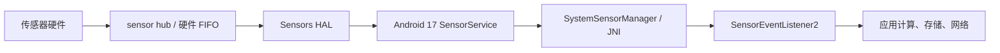

# 定位与传感器功耗优化

## 功耗边界

定位请求可能启用 GNSS、Wi-Fi 扫描、蜂窝测位和传感器融合；传感器监听又会带来采样、FIFO 交付、应用处理器唤醒与后续计算。功耗评审不能只看 API 名称，要同时检查数据从哪里产生、多久产生一次、何时交付，以及应用收到数据后做了多少 CPU、存储和网络工作。

定位与传感器 API 大多表达“期望”或“上限”，并不承诺准确的到达周期。其他客户端请求、权限精度、设备硬件、传感器 HAL、待机状态和省电策略都会改变结果。业务应定义可接受的精度、新鲜度、交付延迟、持续时间和退出条件，再选择一次性定位、连续 FLP、Geofencing、被动定位或传感器批处理。诊断工具见 §25.1，后台限制见 §25.2。

## 定位精度与功耗的权衡

官方把定位功耗归纳为精度、计算频率和交付延迟。高精度请求更可能使用高成本来源；更短的计算间隔会增加定位工作；更短的交付延迟会增加应用被唤醒的次数。`setMinUpdateDistanceMeters()` 还能减少没有足够位移时的回调，但它和其余 `LocationRequest` 参数一样，属于提供给位置服务的请求条件。

| 业务场景 | 推荐接口 | 数据契约 | 退出条件 |
|------|------|------|------|
| 天气、城市级内容 | `getLastLocation()`，缓存过旧或为空时再用 `getCurrentLocation()` | 接受粗略位置；显式校验位置年龄 | 一次结果返回或取消令牌触发 |
| 地图选点 | 短时 `PRIORITY_BALANCED_POWER_ACCURACY` 或确有需要时使用 `PRIORITY_HIGH_ACCURACY` | 页面可见；精度与刷新率跟随交互 | 页面不可见、选择完成或超时 |
| 导航、用户主动共享轨迹 | 高精度 FLP + location 前台服务 | 用户持续可见；需要连续更新 | 用户停止、会话结束或服务退出 |
| 到达区域后提醒 | Geofencing | 接受分钟级响应与位置误差 | 围栏过期、功能关闭或区域集合替换 |
| 借用系统已有位置 | `PRIORITY_PASSIVE` | 不保证有结果，也不保证新鲜 | 业务窗口结束 |
| 姿态或运动趋势 | 最低可用采样率 + 批处理 | 按事件时间处理，允许批量到达 | 生命周期结束或前台服务停止 |

`getLastLocation()` 不主动计算新位置，返回值可能为空或已经过时。判断新鲜度时优先比较 `Location.elapsedRealtimeNanos` 与当前 elapsed realtime，避免墙上时钟被用户或网络校时修改。需要一次较新结果时使用 `getCurrentLocation()` 并传入取消条件，不要为一次查询注册长期回调。

Android 8.0（API 26）起，后台应用的位置计算与交付被限制为每小时少数几次，后台 Geofencing 也按几分钟量级响应。该设备行为不以 target SDK 为前提。提高请求频率不能消除这层限制，只会让业务契约与平台行为不一致。

权限和前台服务需要按版本分别处理：

- Android 10（API 29）起，目标版本为 29 及以上的应用若要在后台访问位置，必须声明并获得 `ACCESS_BACKGROUND_LOCATION`；访问位置的前台服务还要声明 `foregroundServiceType="location"`。Geofencing 也属于后台位置用例。
- Android 11（API 30）起，系统权限对话框不再提供“始终允许”；用户需要到设置页授予后台位置。应用应先说明用途，并允许用户拒绝。
- Android 12（API 31）起，用户可以只授予 approximate location。前台被降为粗略位置时，后台位置也只有同等精度；精确度在设置中被降低还会导致应用进程重启。应用应同时请求 coarse 与 fine，并在只有 `ACCESS_COARSE_LOCATION` 时保持主要流程可用，不能通过经纬度数值猜测授权档位。
- 在 Android 14（API 34）设备上，目标版本为 34 及以上的应用还要声明 `FOREGROUND_SERVICE_LOCATION`，启动 location 前台服务时满足位置开关与 coarse/fine 运行时权限。位置权限受 while-in-use 约束；应用已在后台时，除非具备 `ACCESS_BACKGROUND_LOCATION` 或其他系统豁免，不能创建需要位置能力的前台服务。

这些版本规则一直适用于 Android 17（API 37）。Android 17 平台源码锚点用于核对框架权限、请求合并与粗略位置处理；Google Play services 的 FLP 是独立发布的组件，不能用 AOSP 文件替代其公开 API 契约。

## Fused Location Provider 最佳实践

Fused Location Provider（FLP）把 GNSS、Wi-Fi、蜂窝与传感器等来源交给 Google Play services 选择和融合。应用表达优先级、期望间隔、最小回调间隔、最小位移、最大交付延迟、精度档位和持续时间。`LocationRequest` 文档明确说明多项参数会尽力满足：权限、硬件、系统状态与其他客户端请求可能让结果更慢、更快、更粗或更细。

连续定位请求要有两层停止条件：

- 正常路径由页面、导航会话或用户开关调用 `removeLocationUpdates()`。
- 异常路径由 `setDurationMillis()` 或 `setMaxUpdates()` 限制请求寿命。

下面的函数用于构造用户可见的连续定位请求。间隔、位移和持续时间来自已评审的业务契约，函数只检查参数关系，不替产品选取一组固定数字。

```kotlin
fun buildVisibleTrackingRequest(
    intervalMillis: Long,
    minUpdateIntervalMillis: Long,
    minDistanceMeters: Float,
    durationMillis: Long,
): LocationRequest {
    require(intervalMillis > 0)
    require(minUpdateIntervalMillis in 1L..intervalMillis)
    require(minDistanceMeters >= 0f)
    require(durationMillis > 0)

    return LocationRequest.Builder(
        Priority.PRIORITY_HIGH_ACCURACY,
        intervalMillis,
    )
        .setGranularity(Granularity.GRANULARITY_PERMISSION_LEVEL)
        .setMinUpdateIntervalMillis(minUpdateIntervalMillis)
        .setMinUpdateDistanceMeters(minDistanceMeters)
        .setDurationMillis(durationMillis)
        .build()
}
```

`GRANULARITY_PERMISSION_LEVEL` 让请求遵守当前授权精度。`minUpdateIntervalMillis` 是允许的最快回调间隔，不能把它理解成固定周期；`durationMillis` 到期后位置服务会移除请求，但业务结束时仍应主动停止。若 balanced accuracy 已满足需求，应把优先级改为 `PRIORITY_BALANCED_POWER_ACCURACY`，避免默认选择高精度。

下面的代码用于把注册与解除注册绑定到同一个回调实例。它假定调用方已检查 coarse/fine 权限，并在可见生命周期开始和结束时分别调用两个函数。

```kotlin
@SuppressLint("MissingPermission")
fun startVisibleTracking(request: LocationRequest) {
    fusedLocationProviderClient.requestLocationUpdates(
        request,
        locationCallback,
        Looper.getMainLooper(),
    )
}

fun stopVisibleTracking() {
    fusedLocationProviderClient.removeLocationUpdates(locationCallback)
}
```

主线程回调只做轻量状态更新；轨迹压缩、写库和网络操作应移到受控执行器。解除注册返回 `Task<Void>`，需要严格确认停止完成的测试可以等待该任务，而不能只依据页面回调已经执行。

业务允许延迟时，`setMaxUpdateDelayMillis()` 可以让设备尝试批量交付。Google Play services 只有在最大延迟至少是请求间隔的两倍时，才把请求视为允许批处理；即使满足该关系，硬件也可以逐点交付。

下面的函数用于构造允许批量交付的低频请求。调用方需要明确最长可接受交付延迟和整个采集会话的寿命。

```kotlin
fun buildBatchedLocationRequest(
    intervalMillis: Long,
    maxUpdateDelayMillis: Long,
    durationMillis: Long,
): LocationRequest {
    require(intervalMillis > 0)
    require(maxUpdateDelayMillis / 2 >= intervalMillis)
    require(durationMillis > 0)

    return LocationRequest.Builder(
        Priority.PRIORITY_BALANCED_POWER_ACCURACY,
        intervalMillis,
    )
        .setGranularity(Granularity.GRANULARITY_PERMISSION_LEVEL)
        .setMaxUpdateDelayMillis(maxUpdateDelayMillis)
        .setDurationMillis(durationMillis)
        .build()
}
```

这段配置允许批处理，没有保证每个回调都包含多条位置。不同批次之间还可能出现时间逆序，应用应按 `elapsedRealtimeNanos` 排序和去重，并把事件发生时间与回调到达时间分别记录。`Location.time` 可用于跨设备或服务端时间展示，但不适合单机轨迹的单调排序。

FLP 参数与功耗建议可对照 [`LocationRequest`](https://developers.google.com/android/reference/com/google/android/gms/location/LocationRequest)、[`LocationRequest.Builder`](https://developers.google.com/android/reference/com/google/android/gms/location/LocationRequest.Builder) 和 [Android 定位功耗指南](https://developer.android.com/develop/sensors-and-location/location/battery)。

## Geofencing 与被动定位

Geofencing 适合“设备到达区域后再通知应用”的业务。位置服务统一维护围栏，应用无需周期性唤醒进程查询当前位置。每个应用、每个设备用户最多同时注册 100 个围栏；大量门店场景可以先维护城市或商圈范围，再按用户所在区域替换附近门店集合。

半径与响应时间属于产品正确性的一部分。官方建议典型围栏采用 100 到 150 米的最小半径，以容纳常见 Wi-Fi 定位误差；`setNotificationResponsiveness()` 取 5 分钟或更大更有利于功耗。它们是经验建议，室内定位能力、道路速度、误触成本和业务半径不同，不能直接复制成所有产品的常量。Android 8.0 及以上设备在应用处于后台时通常每隔几分钟处理一次围栏事件，低数值也不构成及时送达保证。

下面的函数把围栏半径、停留时间、响应时间和过期时间留给业务配置。构建器只验证 API 所需的基本范围。

```kotlin
fun buildDwellGeofence(
    requestId: String,
    latitude: Double,
    longitude: Double,
    radiusMeters: Float,
    loiteringDelayMillis: Int,
    responsivenessMillis: Int,
    expirationMillis: Long,
): Geofence {
    require(requestId.isNotBlank())
    require(latitude in -90.0..90.0)
    require(longitude in -180.0..180.0)
    require(radiusMeters > 0f)
    require(loiteringDelayMillis >= 0)
    require(responsivenessMillis >= 0)
    require(expirationMillis > 0)

    return Geofence.Builder()
        .setRequestId(requestId)
        .setCircularRegion(latitude, longitude, radiusMeters)
        .setTransitionTypes(Geofence.GEOFENCE_TRANSITION_DWELL)
        .setLoiteringDelay(loiteringDelayMillis)
        .setNotificationResponsiveness(responsivenessMillis)
        .setExpirationDuration(expirationMillis)
        .build()
}
```

`DWELL` 能过滤短暂穿越区域造成的频繁提醒。围栏事件通过 `PendingIntent` 交给 `BroadcastReceiver` 时，接收器应核对错误码、transition 与触发列表，再发布通知或安排有限的后台工作；不要从后台事件直接展示 Activity。功能关闭、账号退出或区域集合改变时，应按 request ID 或原 `PendingIntent` 移除旧围栏。

被动定位使用 `PRIORITY_PASSIVE`。该优先级不会因为当前请求单独计算位置，只接收系统为其他客户端生成的位置；它仍受位置权限、后台访问限制和进程调度影响，也可能收到批量数据。

下面的函数用于构造被动请求。最小回调间隔限制应用处理数据的最高频率，持续时间防止请求长期遗留。

```kotlin
fun buildPassiveLocationRequest(
    minUpdateIntervalMillis: Long,
    durationMillis: Long,
): LocationRequest {
    require(minUpdateIntervalMillis > 0)
    require(durationMillis > 0)

    return LocationRequest.Builder(
        Priority.PRIORITY_PASSIVE,
        minUpdateIntervalMillis,
    )
        .setGranularity(Granularity.GRANULARITY_PERMISSION_LEVEL)
        .setMinUpdateIntervalMillis(minUpdateIntervalMillis)
        .setDurationMillis(durationMillis)
        .build()
}
```

这里的间隔控制回调资格，不会把被动请求变成周期定位。没有其他客户端计算位置时，它可以一直没有结果；安全告警、导航和完整运动轨迹不能依赖这条路径。收到数据后还要按事件时间去重，把多条写库与上报合并处理。

定位层的公开资料包括 [Geofencing 指南](https://developer.android.com/develop/sensors-and-location/location/geofencing)、[后台定位权限](https://developer.android.com/develop/sensors-and-location/location/permissions/background) 和 [`Priority.PRIORITY_PASSIVE`](https://developers.google.com/android/reference/com/google/android/gms/location/Priority)。Android 17 平台实现统一核对以下 `android-17.0.0_r1` 源码：

- [`LocationManagerService.java`](https://android.googlesource.com/platform/frameworks/base/+/android-17.0.0_r1/services/core/java/com/android/server/location/LocationManagerService.java) 提供系统位置服务入口。
- [`LocationProviderManager.java`](https://android.googlesource.com/platform/frameworks/base/+/android-17.0.0_r1/services/core/java/com/android/server/location/provider/LocationProviderManager.java) 管理 provider 注册、请求和交付。
- [`LocationFudger.java`](https://android.googlesource.com/platform/frameworks/base/+/android-17.0.0_r1/services/core/java/com/android/server/location/fudger/LocationFudger.java) 处理粗略位置。
- [`LocationRequest.java`](https://android.googlesource.com/platform/frameworks/base/+/android-17.0.0_r1/location/java/android/location/LocationRequest.java) 定义平台请求参数；它与 Google Play services 的同名类不是同一个类型。

## 传感器批处理与采样率控制

传感器功耗包含传感器本身、sensor hub、硬件 FIFO、应用处理器唤醒、事件分发和应用计算。批处理的目标是让 sensor hub 或 FIFO 暂存事件，减少应用处理器从 suspend 中醒来的次数。它不会降低传感器的采样频率；采样频率仍由 `samplingPeriodUs` 决定。

下面的图用于说明 Android 17 传感器事件从硬件到应用的主要层次。批处理发生在 HAL 之前的 sensor hub 或硬件 FIFO，`SensorService` 负责连接、权限、速率调整和事件分发。



这条路径说明了两个独立的功耗问题：批量交付能减少应用处理器唤醒，降低 `samplingPeriodUs` 对应的采样频率才能减少事件生成与融合计算。回调后逐条写库或立即上报，还会抵消批处理带来的收益。

应用侧使用 `SensorManager.registerListener(listener, sensor, samplingPeriodUs, maxReportLatencyUs)`：

- `samplingPeriodUs` 是期望的相邻事件间隔，单位为微秒，系统可以按硬件能力调整。
- `maxReportLatencyUs` 是允许事件延迟交付的最长时间，单位也为微秒。它大于零时才允许批处理。
- `Sensor.getFifoMaxEventCount()` 为零表示该传感器不使用 FIFO，此时带最大延迟的重载与普通注册没有批处理差异。
- FIFO 可能由多个传感器共享。某个传感器的最大延迟到期或 FIFO 提前填满时，同一 FIFO 的其他事件也可能提前交付。

下面的函数用于注册一个可批处理的 continuous 或 on-change 传感器。调用方根据业务语义传入采样周期和最大交付延迟，并持有同一个 `SensorEventListener2` 以接收 flush 完成通知。

```kotlin
fun registerBatchedSensor(
    sensorManager: SensorManager,
    sensor: Sensor,
    listener: SensorEventListener2,
    samplingPeriodUs: Int,
    maxReportLatencyUs: Int,
): Boolean {
    require(sensor.reportingMode != Sensor.REPORTING_MODE_ONE_SHOT)
    require(samplingPeriodUs > 0)
    require(maxReportLatencyUs >= 0)

    return sensorManager.registerListener(
        listener,
        sensor,
        samplingPeriodUs,
        maxReportLatencyUs,
    )
}
```

返回 `false` 表示传感器不受支持或启用失败，不能把注册动作当成必然成功。one-shot 传感器要用 `requestTriggerSensor()`。如果 `fifoMaxEventCount` 为零，应用可以继续接收事件，但不要把 `maxReportLatencyUs` 当成可用的硬件批处理能力。

`SensorManager.flush(listener)` 是异步操作：调用后，FIFO 中已有事件按正常回调送达，随后才调用 `SensorEventListener2.onFlushCompleted()`。需要保存尾部事件时，应在 flush 成功后等待完成回调，再注销 listener；还要准备超时退出。`flush()` 返回 `false` 表示 listener 没有已注册传感器，或至少一个 flush 请求失败。硬件没有原生 flush 支持时，框架仍可以发送一个简单的完成事件。

### wake-up、non-wake-up 与后台状态

wake-up sensor 在 FIFO 填满或最大报告延迟到期时可以唤醒应用处理器。non-wake-up sensor 在处理器 suspend 时不会主动唤醒；其 FIFO 填满后可循环覆盖旧事件，等处理器因其他原因醒来再交付。因此，“完整保留事件”和“尽量不唤醒处理器”之间需要业务选择。

Android 9（API 28）及以上设备不会向后台应用交付 continuous、on-change 或 one-shot 传感器事件。长时间运动采集需要用户可见的前台服务，并在服务停止时解除注册。Android 17 `SensorEventConnection::hasSensorAccess()` 还会检查 UID 是否活跃、进程是否被冻结以及传感器隐私开关；保留一个 listener 不能让后台进程持续收到数据。

### Android 12 的 200 Hz 限制

200 Hz 是 target SDK 与权限相关的高采样率限制，不是“后台速率上限”。目标版本为 Android 12（API 31）及以上且没有 `HIGH_SAMPLING_RATE_SENSORS` 的应用，通过 `registerListener()` 读取以下原始传感器时最多为 200 Hz：

- 加速度计与未校准加速度计；
- 陀螺仪与未校准陀螺仪；
- 地磁场与未校准地磁场传感器。

`SensorDirectChannel` 在同一条件下被限制到 `RATE_NORMAL`，通常约为 50 Hz。需要更高速率时，应用声明普通权限 `HIGH_SAMPLING_RATE_SENSORS`；它只解除这项速率限制，不授予后台持续采样资格，也不授予心率等受保护数据权限。用户关闭系统麦克风访问开关时，上述传感器仍会被限速，即使应用已声明该权限。

Android 17 的 `SystemSensorManager` 使用 5000 微秒作为 200 Hz 周期边界；native `SensorService` 再按 target SDK、权限和麦克风隐私状态调整采样周期与 direct channel 档位。应用不应依靠 Java 侧异常判断限速，因为非调试包可以被 native 层直接限制到允许值。

### health 前台服务与 Android 17 权限

在 Android 14（API 34）设备上，目标版本为 34 及以上且需要由前台服务维持的长时间健康或运动传感器采集，必须使用 `foregroundServiceType="health"` 与 `FOREGROUND_SERVICE_HEALTH`，并满足至少一种对应运行时条件。版本差异不能只写成 `BODY_SENSORS`：

- API 35 及以下的身体传感器使用 `BODY_SENSORS`；API 33 到 API 35 若要从后台启动并读取身体传感器，还需要 `BODY_SENSORS_BACKGROUND`。
- API 36 及以上使用 `READ_HEART_RATE`、`READ_SKIN_TEMPERATURE`、`READ_OXYGEN_SATURATION` 等细分权限；后台读取对应健康数据需要 `READ_HEALTH_DATA_IN_BACKGROUND`。
- `ACTIVITY_RECOGNITION` 或清单中的 `HIGH_SAMPLING_RATE_SENSORS` 也可以满足 health FGS 的一种启动先决条件，但只能访问各自授权范围内的数据。

这些规则延续到 Android 17（API 37）。前台服务只提供合规的长时执行形态，应用仍应选择最低采样率、允许批处理、显示持续通知，并在用户停止会话后及时结束服务。

### Android 17 源码锚点

- [`SystemSensorManager.java`](https://android.googlesource.com/platform/frameworks/base/+/android-17.0.0_r1/core/java/android/hardware/SystemSensorManager.java)：应用请求、200 Hz 周期边界与 high-sampling 权限检查。
- [`SensorService.cpp`](https://android.googlesource.com/platform/frameworks/native/+/android-17.0.0_r1/services/sensorservice/SensorService.cpp)：target SDK、权限、麦克风隐私限速及传感器访问。
- [`SensorEventConnection.cpp`](https://android.googlesource.com/platform/frameworks/native/+/android-17.0.0_r1/services/sensorservice/SensorEventConnection.cpp)：事件连接、活跃 UID 检查、flush 与 wake-up 事件确认。
- [AOSP Sensors batching](https://source.android.com/docs/core/interaction/sensors/batching)：FIFO、报告延迟、suspend 与 wake-up/non-wake-up 契约。

传感器驱动和 sensor hub 固件通常由设备厂商实现，通用 AOSP 不能给出一条适用于所有设备的 Linux 驱动路径。这里不据此推断内核行为；后续若引用通用内核实现，统一使用 `android17-6.18-2026-06_r6`，不能拿旧内核分支解释 Android 17 设备。

## 后台定位、前台服务与定位现场

定位能力要同时检查运行系统、`targetSdkVersion`、权限授予、位置总开关和当前可见性：

| 版本边界 | 需要处理的规则 |
| --- | --- |
| Android 8+ | 普通后台应用的位置更新受到频率限制；持续导航或共享应使用用户可见的 location FGS |
| Android 10+ | 后台定位使用 `ACCESS_BACKGROUND_LOCATION`；location FGS 声明 `foregroundServiceType="location"` |
| Android 11+ | target 30+ 不能在一次请求中同时申请前台与后台定位，后台权限要在功能上下文中分阶段解释 |
| Android 12+ | 用户可以只授予 approximate；从后台启动 FGS 还受通用限制 |
| Android 14+ | target 34+ 声明 `FOREGROUND_SERVICE_LOCATION`，创建服务时满足 coarse/fine 与 while-in-use 前提 |

声明 location FGS 不会自动获得位置权限，也不能绕过后台启动限制。用户持续导航、运动记录或位置共享时，应从可见界面启动服务，展示停止入口，并在 `onDestroy()` 中移除同一个 callback；只关心进入/离开区域时使用 geofencing；页面附近内容在页面会话结束时停止请求。

本地排查先从活动请求而不是缓存位置开始：

```bash
adb shell dumpsys location
adb shell dumpsys location gps
adb shell dumpsys location --gnssmetrics
adb shell dumpsys powerstats
```

检查调用 UID、请求是否 active、间隔/质量以及业务拥有者是否已结束。`last location` 仍存在只说明有缓存，不能证明 provider 正在工作；listener 数量多也不自动等于泄漏。设备有 powerstats rail 时，它仍是设备级累计量，不是当前 App 的 GNSS 精确归因。

## GNSS 原始测量、Wi-Fi RTT 与 BLE 测距

这三类 API 更接近“采集测量值”，不能替代普通定位，也没有跨设备固定的精度或功耗：

- GNSS 原始测量需要 `ACCESS_FINE_LOCATION`，API 31 的 full tracking 会要求芯片关闭占空比，只在算法确需连续载波相位时开启。看到某个载波频率只证明本次观测包含该信号，不证明定位解算使用了双频。
- Wi-Fi RTT 从扫描得到的真实 `ScanResult` 构建请求。target 33+ 使用 `NEARBY_WIFI_DEVICES`，回调按 MAC 地址关联；Android 17 的 `STATUS_BUSY_TRY_LATER` 应按建议延迟退避，不能立刻循环请求。
- BLE RSSI 受人体遮挡、姿态、天线和多径影响，适合区域判定或排序，不应直接承诺米级距离。后台会被限制为低功耗扫描，所有会话必须保存同一个 `ScanCallback` 并显式 `stopScan()`。

门店场景可以先用 geofence 缩小候选区域，再在用户进入相关功能或满足后台条件时启动有界 RTT/BLE 会话。每个测量会话都要记录能力检查、权限、开始/停止、样本数、失败和重试，避免“定位已结束，扫描仍在运行”。

## 定位和传感器的回归守门

定位与传感器回归要固定设备、系统版本、权限状态、位置开关、网络条件、屏幕状态、业务持续时间和移动轨迹。只比较一次总耗电值无法定位原因；测试记录还要保存请求参数、回调次数、每批数据量、事件时间、应用处理时长和退出后的残留注册。

下面的命令用于查看 Android 17 上的平台位置请求、传感器连接和 UID 级电量归因。执行前先复现目标业务状态，执行后保存完整输出用于同版本对比。

```bash
adb shell dumpsys location
adb shell dumpsys sensorservice
adb shell dumpsys batterystats --charged
```

`dumpsys location` 用来核对 provider、请求间隔、权限级别和前后台状态；`dumpsys sensorservice` 显示活跃连接、采样周期、批处理延迟、FIFO 与 wake lock 相关信息；`batterystats` 用于把位置、传感器、唤醒和进程活动关联到应用 UID。不同厂商的字段可能不同，回归脚本应保存原始文本并只解析稳定字段。

测试范围至少覆盖以下边界：

- 只有 coarse、同时具备 fine、精度从 fine 降为 coarse 三种状态；降级导致进程重启后，请求能按持久化业务状态恢复或停止。
- 没有后台位置权限、具备后台位置权限、用户在设置页撤销权限三种状态；Geofencing 和连续定位都不应静默失败后无限重试。
- 应用可见时启动 location FGS，以及应用已在后台且没有 `ACCESS_BACKGROUND_LOCATION` 时尝试启动；后一条路径应由产品流程提前阻止并引导用户操作。
- FLP 单点交付、批量交付和跨批次时间逆序；服务端结果按事件时间排序并去重。
- 应用进入后台、进程被终止、设备进入 Doze 后的 Geofencing；验证分钟级延迟下不会重复通知或误判为丢失。
- 有 FIFO 与无 FIFO 的传感器；确认同一 `maxReportLatencyUs` 配置在两类设备上的唤醒和批量大小差异。
- Android 9+ 普通后台状态与前台服务状态；普通后台不再收到受限传感器事件，服务结束后连接被移除。
- targetSdk 31+ 在有无 `HIGH_SAMPLING_RATE_SENSORS` 时请求高于 200 Hz，并切换麦克风隐私开关；记录有效采样周期，不能只看请求值。
- flush 成功、flush 失败和等待超时；所有路径最终都会注销 listener。

回归阈值由业务基线确定。建议分别设置“位置计算或请求是否仍存在”“应用回调与唤醒是否增加”“回调后的 CPU、存储与网络成本是否增加”三类门禁。这样才能区分硬件定位成本、交付策略和应用处理代码造成的变化。

## 小结

定位优化从一次性、低精度、低频和延迟容忍度开始；只有用户可见且确有精度需要时才持续使用高精度请求。Geofencing 与被动定位能减少主动计算，但仍受后台权限和交付延迟限制。传感器侧要同时降低采样率与应用处理器唤醒，批处理只解决后者。

Android 17 的平台边界由位置服务、`SystemSensorManager` 和 native `SensorService` 共同执行；Google Play services FLP 还具有独立版本。评审时把两套实现和各自公开契约分开，才能避免用 AOSP 结论代替 FLP 行为。

## 延伸阅读

- [About background location and battery life](https://developer.android.com/develop/sensors-and-location/location/battery)
- [Request location permissions](https://developer.android.com/develop/sensors-and-location/location/permissions)
- [Request background location](https://developer.android.com/develop/sensors-and-location/location/permissions/background)
- [Create and monitor geofences](https://developer.android.com/develop/sensors-and-location/location/geofencing)
- [Foreground service types: location and health](https://developer.android.com/develop/background-work/services/fgs/service-types)
- [Sensors overview](https://developer.android.com/develop/sensors-and-location/sensors/sensors_overview)
- [`SensorManager` API reference](https://developer.android.com/reference/android/hardware/SensorManager)
