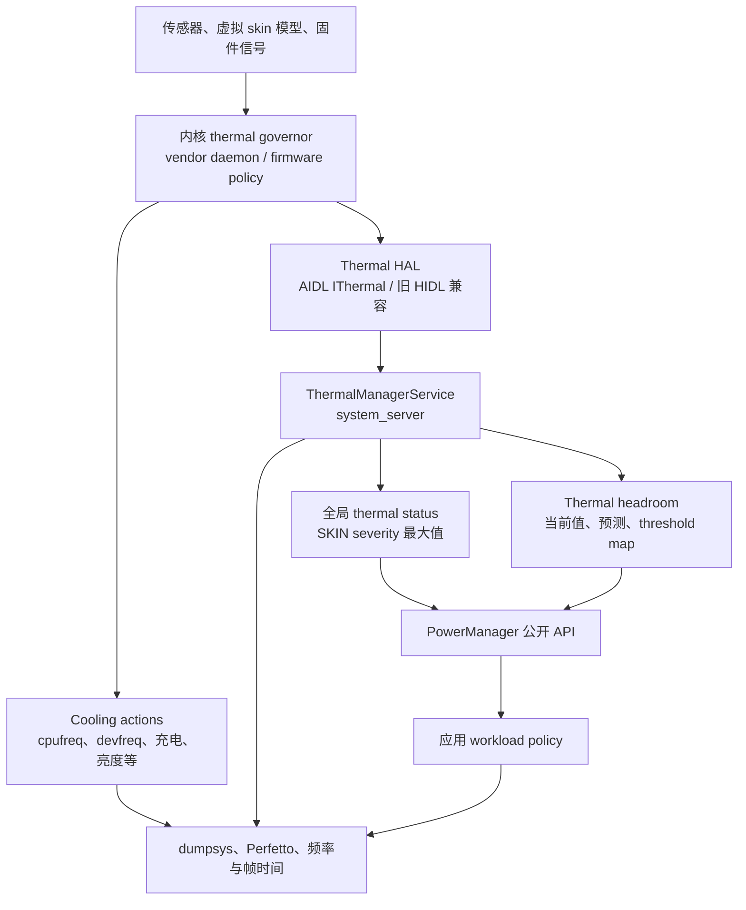

# 热节流适配与性能退化治理

热节流是设备为守住安全温度而动态控制的结果，不同机型的阈值和降级动作不会完全一致。我们把热状态和 headroom 当作趋势信号：热压力上来时提前减掉可选工作，验收看持续性能，不看瞬时峰值。

## 热治理的目标

冷机跑分反映的是短时峰值；长时间游戏、导航、视频通话、直播和端侧推理拼的是稳态吞吐，也就是设备进入热平衡后还能持续完成多少工作。持续负载通常沿这样一条路径发展：

1. CPU、GPU、ISP、NPU、modem、屏幕和充电共同产生热量；
2. 表面温度或其他热模型接近产品限制，厂商策略提高限制等级；
3. `cpufreq`/`devfreq`、固件、厂商常驻进程或 QoS 请求降低资源上限；
4. 同一份应用工作在更低的资源预算下执行，帧时间、编码时间或推理延迟随之上升；
5. 应用若继续堆积过期工作，功耗和热压力可能持续，体验进一步恶化。

频率和限制档位（cooling state，冷却设备当前的限制强度）都由系统和厂商策略决定，Thermal API 没有给应用指定这些的入口；我们能调整的只有工作量：目标帧率、渲染分辨率、画质、编码规格、相机分析速率、模型档位、并发度、预取与非紧急后台工作。

所以好的策略会提前减掉低价值工作，等设备冷却后再分阶段恢复。反过来，等 `SEVERE` 到来才一次性关掉大量能力，通常出现明显的质量跳变；热状态刚回落就把能力全部加回去，又容易在阈值附近反复振荡。

## 公开 API 的实际入口

热节流（thermal throttling）指设备为控制温度而限制 CPU、GPU、充电或其他热源的过程。Android SDK 没有公开的 `ThermalManager` Java 类，应用侧入口在 `android.os.PowerManager`：

- `getCurrentThermalStatus()`、`addThermalStatusListener()`：API 29；
- `getThermalHeadroom(forecastSeconds)`：API 30；
- `getThermalHeadroomThresholds()`：API 35；
- `addThermalHeadroomListener()`：API 36。

这四个入口逐个补齐，覆盖的都是读取：应用能读取全局热状态和表面温度对应的 thermal headroom，系统当前启用了哪组 CPU、GPU、屏幕或充电限制查不到——`PowerManager.isThermalStatusProtectionEnabled()`、`getThermalMitigations()` 或“热缓解动作（thermal mitigation）列表”这类公开接口也没有。

后面反复用到三个词，先说清楚：热状态用 0—6 的 severity（限制等级）表示；skin 指机身表面温度传感器或厂商建立的虚拟表面温度模型；thermal headroom（热余量）是接近严重热限制阈值的归一化数值。

## 热治理的系统路径

先看应用可见信号和系统内部动作的关系。图里的 governor 是内核选择冷却档位的策略，vendor daemon 执行厂商策略，firmware policy 运行在设备固件中：


```mermaid
flowchart TB
    SENSOR["传感器、虚拟 skin 模型、固件信号"]
    POLICY["内核 thermal governor<br/>vendor daemon / firmware policy"]
    CDEV["Cooling actions<br/>cpufreq、devfreq、充电、亮度等"]
    HAL["Thermal HAL<br/>AIDL IThermal / 旧 HIDL 兼容"]
    TMS["ThermalManagerService<br/>system_server"]
    STATUS["全局 thermal status<br/>SKIN severity 最大值"]
    HEADROOM["Thermal headroom<br/>当前值、预测、threshold map"]
    PM["PowerManager 公开 API"]
    APP["应用 workload policy"]
    TRACE["dumpsys、Perfetto、频率与帧时间"]

    SENSOR --> POLICY
    POLICY --> CDEV
    POLICY --> HAL
    HAL --> TMS
    TMS --> STATUS
    TMS --> HEADROOM
    STATUS --> PM
    HEADROOM --> PM
    PM --> APP
    CDEV --> TRACE
    TMS --> TRACE
    APP --> TRACE
```

限制 CPU/GPU、充电或屏幕的动作通常发生在内核、固件和厂商策略层，不需要等应用回调。`PowerManager` 递给应用的是产品级热压力信号，应用拿它决定减多少自己的工作量。

系统内部的服务是 `ThermalManagerService`：它连接 Thermal HAL，由 HAL 把厂商硬件实现转换成 Android 统一接口。另一组能力来自 Power HAL，覆盖 Performance Hint Session（性能提示会话）与 CPU/GPU capacity headroom（容量余量）。两套 HAL 可以在厂商策略中协同，但 AOSP 接口和 Binder 服务彼此独立。

Framework 服务源码在 [`services/core/java/com/android/server/power/thermal/ThermalManagerService.java`](https://android.googlesource.com/platform/frameworks/base/+/refs/tags/android-17.0.0_r1/services/core/java/com/android/server/power/thermal/ThermalManagerService.java)。旧版本资料里的 `server/power/ThermalManagerService.java` 路径不能直接套到当前源码标签。

### Thermal HAL 的当前接口

AIDL 用来生成稳定的 Binder 接口，HIDL 是更早一代的 HAL 接口体系。稳定 AIDL [`IThermal`](https://android.googlesource.com/platform/hardware/interfaces/+/refs/tags/android-17.0.0_r1/thermal/aidl/android/hardware/thermal/IThermal.aidl) 提供四类能力：

| 能力 | AIDL 方法 |
|---|---|
| 当前温度 | `getTemperatures()`、`getTemperaturesWithType()` |
| 静态温度阈值 | `getTemperatureThresholds()`、`getTemperatureThresholdsWithType()` |
| 冷却设备 | `getCoolingDevices()`、`getCoolingDevicesWithType()` |
| 事件与预测 | `registerThermalChangedCallback*()`、冷却设备变化回调、`forecastSkinTemperature()` |

限制等级变化由 `IThermalChangedCallback.notifyThrottling(Temperature)` 推送，AIDL v3 另有低频阈值更新 `notifyThresholdChanged(TemperatureThreshold)`；`sendThermalNotify()` 在这个 AIDL 里并不存在。

`android-17.0.0_r1` 冻结了 AIDL v1、v2、v3，没有 v4：v1 覆盖温度、阈值、冷却设备与热状态回调，v2 增加冷却设备变化回调，v3 增加表面温度预测与阈值变化回调。兼容旧厂商系统镜像（vendor image）的设备仍可能连接 HIDL Thermal HAL 2.0、1.1 或 1.0；AIDL 版本号和旧 HIDL“2.0”属于两套版本体系，别把 AIDL v2 当成 HIDL 2.0。

### CoolingDevice 的定位

“冷却设备”是 Thermal HAL 对限制执行器的抽象，未必是风扇：CPU 限频、GPU 限频、充电限流或屏幕亮度限制都可以表现为冷却设备。Framework 侧的原始温度、热事件与冷却设备 Binder 方法都需要特权权限 `DEVICE_POWER`，所以普通应用拿不到逐个传感器的摄氏温度，也读不到冷却档位或功率上限。

HAL `CoolingDevice.value` 的取值范围是 0 到驱动给出的 `max_state`：0 表示未限制，值越高限制越深。这个值到 MHz、亮度或充电电流的映射由驱动与产品配置决定，适合系统调试和 statsd（Android 的系统指标收集服务）使用，不适合作为普通应用的兼容协议。

## 全局热状态的含义

`ThermalManagerService.onTemperatureMapChangedLocked()` 遍历缓存温度，只考虑 `Temperature.TYPE_SKIN`，并取最高限制等级作为默认设备的全局热状态。由此带来几个直接推论：

- CPU 传感器温度很高、表面温度的限制等级还没提高时，全局热状态可能仍然较低；
- 多个表面温度传感器同时上报时，Framework 采用限制等级较高的一路；
- 全局热状态说明的是整机热缓解等级，从中推不出某个 CPU 集群的最高频率；
- 热状态的上报来源可能包含电池功率约束、充电和厂商虚拟模型，公开回调里没有原因字段。

七档状态的含义和应用侧建议如下：

| 值 | 常量 | Framework 含义 | 应用侧建议 |
|---:|---|---|---|
| 0 | `THERMAL_STATUS_NONE` | 未进入热限制 | 维持当前档位，继续观察长时趋势 |
| 1 | `THERMAL_STATUS_LIGHT` | 轻度限制，用户体验预计尚未受影响 | 停止高成本预取、减少投机工作 |
| 2 | `THERMAL_STATUS_MODERATE` | 前台体验可能开始受影响 | 降低非必要画质、采样率或后台并发 |
| 3 | `THERMAL_STATUS_SEVERE` | 系统容量明显受限 | 切到可持续帧率、码率、模型或并发档位 |
| 4 | `THERMAL_STATUS_CRITICAL` | 平台已采用强缓解动作 | 保留主要功能，减少热源并准备保存状态 |
| 5 | `THERMAL_STATUS_EMERGENCY` | 部分平台能力正在关闭 | 停止可选管线，尽快持久化重要状态 |
| 6 | `THERMAL_STATUS_SHUTDOWN` | 设备需要立即关机 | 不能依赖应用仍有执行机会 |

这张表定义响应强度，不给通用产品参数。游戏从 120 FPS 调到 90、60 还是 30，视频是否降低分辨率，要由目标设备的帧时间、功耗、温升和质量实验决定；某个状态换算不成固定的频率或画质档位。

任何 CPU、GPU、NPU 或 SKIN 传感器到达 `SHUTDOWN` 时，Framework 会以 thermal-state（热状态）原因请求关机，BATTERY 传感器则使用 battery-thermal（电池过热）原因。应用可能来不及收到 `SHUTDOWN` 回调，状态保存和媒体文件收尾不能拖到这一档才开始。

## Thermal headroom：提前量与读取边界

[`PowerManager.getThermalHeadroom()`](https://developer.android.com/reference/android/os/PowerManager#getThermalHeadroom(int)) 基于表面温度这类慢变化传感器。headroom 把当前或预测的温度位置归一化到严重热限制阈值附近，数值方向如下：

- 0 是公开值域的下界，但 API 不承诺它对应某个热状态或固定摄氏温度；
- 1 表示当前或预测将到达 `THERMAL_STATUS_SEVERE`；
- 大于 1 表示越过 `SEVERE` 的归一化位置，再往上没有到 CRITICAL、EMERGENCY 的固定映射。

另一类返回值是 `NaN`，表示设备不支持、数据不足、HAL 未就绪或调用太频繁。

`forecastSeconds` 的允许范围是 0 到 60。预测以近期工作负载趋势保持相近为前提，预测时间越远越容易受场景切换影响，所以别把一次预测值当成未来温度的承诺。

没有 HAL 预测时，Framework 的回退实现每秒读取表面温度，每个传感器最多保留 30 个样本，至少有三个样本后用线性回归拟合近期变化并外推，连续 10 秒没有查询就停止采样。若 HAL v3 支持 `forecastSkinTemperature()` 且设备只报告一组 SKIN 阈值，服务会改用 HAL 预测；应用不需要识别内部来源，按短期趋势信号处理即可。

### 使用厂商提供的阈值映射表

API 35 的 [`getThermalHeadroomThresholds()`](https://developer.android.com/reference/android/os/PowerManager#getThermalHeadroomThresholds()) 返回热状态到 headroom 的映射表。只有厂商为某个热状态提供了对应阈值，那一项才会出现；同一个 headroom 在不同机型上可能对应不同限制等级。

`SEVERE` 的归一化位置固定是 1，LIGHT、MODERATE、CRITICAL 则要读映射表，不能写成跨设备固定的 0.7、0.8 或 0.9。从 Android 16 开始，阈值映射表还可能在运行时变化，API 36 的监听器会把新映射表随回调交给应用。

`getThermalHeadroomThresholds()` 可能抛出 `UnsupportedOperationException` 或 `IllegalStateException`，产品代码应保留一条只依赖热状态的回退路径。

### API 36 headroom 监听器

`addThermalHeadroomListener()` 的回调带当前 headroom、预测 headroom、预测秒数和阈值映射表。它在表面温度跨过限制等级阈值，或温度、阈值变化足够明显时触发，并不是周期性的预测数据流。

服务端对相似回调使用 5 秒最小间隔，并以 headroom 差值 0.03、阈值表数值差 0.01 判断显著变化。这些数值是 `android-17.0.0_r1` 的实现常量，公开 API 没有把它们承诺给所有版本。

要持续拿到提前预测，仍要按保守间隔调用 `getThermalHeadroom()`。官方游戏兼容建议按 10 秒量级轮询，可减少旧设备因调用过快返回 `NaN` 的情况。

## 应用监听器的安全封装

下面的 Kotlin 示例只注册一次热状态监听器；API 36 起再注册 headroom 监听器，API 30—35 由外部调度器以低频调用 `pollForecast()`。阅读时先看 `start()` 里的版本分支，再对照 `stop()` 里成对的注销：

```kotlin
import android.content.Context
import android.os.Build
import android.os.PowerManager
import androidx.annotation.RequiresApi
import java.util.concurrent.Executor

data class ThermalSignals(
    val status: Int,
    val headroom: Float,
    val forecastHeadroom: Float,
    val forecastSeconds: Int,
    val thresholds: Map<Int, Float>,
)

@RequiresApi(29)
class AppThermalObserver(
    context: Context,
    private val callbackExecutor: Executor,
    private val onChanged: (ThermalSignals) -> Unit,
) {
    private val powerManager =
        context.getSystemService(PowerManager::class.java)

    @Volatile private var status = powerManager.currentThermalStatus
    @Volatile private var headroom = Float.NaN
    @Volatile private var forecastHeadroom = Float.NaN
    @Volatile private var forecastSeconds = 0
    @Volatile private var thresholds: Map<Int, Float> = emptyMap()
    private var started = false
    private var headroomListenerToken: Any? = null

    private val statusListener =
        PowerManager.OnThermalStatusChangedListener { newStatus ->
            status = newStatus
            publish()
        }

    fun start() {
        if (started) return
        started = true
        powerManager.addThermalStatusListener(
            callbackExecutor,
            statusListener,
        )

        if (Build.VERSION.SDK_INT >= 36) {
            headroomListenerToken = runCatching {
                Api36.register(
                    powerManager,
                    callbackExecutor,
                ) { current, forecast, seconds, map ->
                    headroom = current
                    forecastHeadroom = forecast
                    forecastSeconds = seconds
                    thresholds = map
                    publish()
                }
            }.getOrNull()
        } else if (Build.VERSION.SDK_INT >= 35) {
            thresholds = runCatching {
                Api35.readThresholds(powerManager)
            }.getOrDefault(emptyMap())
        }
    }

    @RequiresApi(30)
    fun pollForecast(seconds: Int = 10) {
        val clampedSeconds = seconds.coerceIn(0, 60)
        val value = runCatching {
            powerManager.getThermalHeadroom(clampedSeconds)
        }.getOrDefault(Float.NaN)
        if (!value.isNaN()) {
            forecastHeadroom = value
            forecastSeconds = clampedSeconds
            publish()
        }
    }

    fun stop() {
        if (!started) return
        headroomListenerToken?.let { token ->
            if (Build.VERSION.SDK_INT >= 36) {
                Api36.unregister(powerManager, token)
            }
        }
        headroomListenerToken = null
        powerManager.removeThermalStatusListener(statusListener)
        started = false
    }

    private fun publish() {
        onChanged(
            ThermalSignals(
                status,
                headroom,
                forecastHeadroom,
                forecastSeconds,
                thresholds,
            ),
        )
    }

    @RequiresApi(35)
    private object Api35 {
        fun readThresholds(
            powerManager: PowerManager,
        ): Map<Int, Float> =
            powerManager.getThermalHeadroomThresholds()
    }

    @RequiresApi(36)
    private object Api36 {
        fun register(
            powerManager: PowerManager,
            executor: Executor,
            callback: (
                Float,
                Float,
                Int,
                Map<Int, Float>,
            ) -> Unit,
        ): Any {
            val listener =
                PowerManager.OnThermalHeadroomChangedListener {
                        current,
                        forecast,
                        seconds,
                        thresholds ->
                    callback(
                        current,
                        forecast,
                        seconds,
                        thresholds,
                    )
                }
            powerManager.addThermalHeadroomListener(
                executor,
                listener,
            )
            return listener
        }

        fun unregister(
            powerManager: PowerManager,
            token: Any,
        ) {
            powerManager.removeThermalHeadroomListener(
                token as PowerManager.OnThermalHeadroomChangedListener,
            )
        }
    }
}
```

API 36 的类型被隔离在 `Api36` 中，旧系统不会进入对应分支。使用时我们把 observer 绑定到明确的生命周期，避免重复注册；`callbackExecutor` 宜用串行执行器，`pollForecast()` 也进同一控制队列，免得多个回调同时改写状态。回调中只更新状态并投递轻量事件，画质重建、编码器重配交给业务线程。

API 30—35 的 `pollForecast()` 每次只发起一次 headroom 查询。调度器统一管理调用频率，避免多个模块各自轮询；若连续得到 `NaN`，策略回退到热状态监听器，不要用无间隔循环反复查询。

## 从信号映射到工作量档位

信号到手，下一步是把它变成工作量档位。这段函数展示一种不写死设备 headroom 阈值的映射方式，判断从最严重的档位依次放宽：

```kotlin
enum class WorkloadTier {
    FULL,
    REDUCED,
    MINIMUM,
    SURVIVAL,
}

fun requestedTier(signals: ThermalSignals): WorkloadTier {
    val moderateThreshold =
        signals.thresholds[PowerManager.THERMAL_STATUS_MODERATE]
    val severeThreshold =
        signals.thresholds[PowerManager.THERMAL_STATUS_SEVERE] ?: 1.0f
    val forecast = signals.forecastHeadroom
    val forecastValid = !forecast.isNaN()

    return when {
        signals.status >= PowerManager.THERMAL_STATUS_CRITICAL ->
            WorkloadTier.SURVIVAL

        signals.status >= PowerManager.THERMAL_STATUS_SEVERE ||
            (forecastValid && forecast >= severeThreshold) ->
            WorkloadTier.MINIMUM

        signals.status >= PowerManager.THERMAL_STATUS_MODERATE ||
            (
                forecastValid &&
                    moderateThreshold != null &&
                    forecast >= moderateThreshold
                ) ->
            WorkloadTier.REDUCED

        else -> WorkloadTier.FULL
    }
}
```

这个函数只给出目标档位。生产实现还要在外面维护一个状态机：热压力升高时可以快速减少工作量；恢复则要等 headroom 低于退出阈值并持续一段冷却驻留时间，再逐级增加。退出余量（margin）用来拉开进入与退出阈值，驻留时间用来确认设备已经稳定冷却；两者都应来自产品实验，不能写成平台常量。

每个档位对应一组不可拆分的配置，所有相关模块在同一次状态切换中采用同一档位，避免渲染已经降载、相机或推理仍维持高负载的错位：

| 子系统 | `REDUCED` | `MINIMUM` / `SURVIVAL` |
|---|---|---|
| 渲染 | 减少后处理、阴影、粒子或内部渲染分辨率 | 降低目标 FPS，保留交互和 UI 可读性 |
| 相机 / 视频 | 降低分析帧率、可选滤镜与预览成本 | 选择较低但受支持的编码规格，保证媒体时间戳连续 |
| 端侧机器学习（ML） | 减少并发、批量大小（batch）、候选数或模型档位 | 暂停非用户触发推理，保留必要请求 |
| 网络 / 预取 | 延后预取和遥测批次 | 停止非紧急传输，避免反复唤醒 modem |
| 后台任务 | 延迟索引、压缩、清理 | 保存检查点，等待调度条件恢复 |

实时处理管线还需要主动丢弃过期输入。热限制把处理速度压低后，相机帧、渲染命令或推理请求若继续无限排队，端到端延迟会一路上升，这时减少工作量也来不及降低当前功耗。

## CPU、GPU 与应用性能的证据

最后一环是取证。热状态升高可能伴随 CPU/GPU 限制，但热状态本身说明不了系统采取了哪项动作：CPU 主线程变慢、GPU 帧延长、充电速度下降、屏幕亮度变化，每一项都要分别取证。

### 把热限制与卡顿连成因果链

“设备发热”和“界面卡顿”同时出现，只能建立相关性。要确认热节流导致性能退化，我们至少要按时间顺序取得这些证据：

1. 固定场景输入后，目标进程或相关系统组件形成持续负载；
2. 热状态、headroom、温度阈值事件（temperature trip，温度跨过配置阈值）或冷却档位发生可重复变化；
3. CPU/GPU 频率上限、可用容量或完成时间显示资源受到约束；
4. 工作量保持稳定时，线程执行时间、Runnable（可运行但等待 CPU 调度）时长、GPU 完成时间或帧时间随后恶化；
5. 设备降温，或主动降低单一负载变量后，限制与性能退化按预测回落。

对照一下缺了哪一环：没有第 2、3 项，观测到的 CPU/GPU 低频可能只是 DVFS（动态电压频率调整）应对普通负载变化的常规选择；没有稳定工作量与对照组，排除不了业务负载本身的变化；没有回落过程，还要检查省电模式（Battery Saver）、刷新率切换、后台争用和厂商短时提频（boost）策略。

Perfetto 取证时，我们把 `ThermalManagerService.status`、热状态与冷却设备事件、`cpu_frequency_limits`、调度器、FrameTimeline、RenderThread 与 GPU 完成栅栏（fence）放在同一时间窗口；单条异常帧或一次温度读数撑不起归因。

时间尺度也要分开：单帧和输入反馈用短时跟踪，数分钟温升用持续跟踪或周期快照；屏幕熄灭后的唤醒锁（WakeLock）、后台作业（Job）与网络重试，则回到 [25.1 功耗诊断与 OEM 后台限制](01-power-diagnosis-oem-background.md) 的 Batterystats（系统电量统计）窗口。三类结果靠同一设备、系统构建版本（build）、场景和时间戳关联；power rail 是设备级供电轨的能量统计，不能直接归因到某个 Java 方法。

### CPU 受限

CPU 频率或可用核心预算降低后，常见的表现包括：

- 主线程执行相同 slice 的 wall time 增长；
- Binder 回调、解码和业务工作线程更难在 deadline 前完成；
- 线程处于 Runnable 状态的等待时间增长，同时 CPU 持续繁忙；
- GC、JIT、序列化等原本勉强能放进帧预算的工作开始超时。

证明热限制的因果关系时，把 `ThermalManagerService.status`、`thermal zone`（内核温度源与冷却设备抽象）、冷却档位、CPU 频率上限、调度器与应用执行片段放到同一时间轴上。

### GPU 受限

GPU devfreq 或厂商固件降低预算时，GPU 完成时间延后，FrameTimeline 可能记录 GPU 错过帧截止时间。这时先减少像素量和渲染 pass（一次完整的渲染处理阶段），再评估目标 FPS。仅凭 `SEVERE` 推断 GPU 已降到某个频点，证据不足。

### 充电与其他缓解动作

Thermal HAL 指南要求设备把会限制性能的电池功率约束也报告为限制等级；厂商还可能限制充电、显示、相机、modem 或其他热源。公开热状态没有具体缓解原因字段，所以关心充电场景的应用要额外记录是否接电、是否充电，并在实验中分开充电与电池供电样本。

## Thermal API、ADPF 与 Game Mode 的分工

ADPF（Android Dynamic Performance Framework，Android 动态性能框架）把 Thermal API、Performance Hint、Game Mode 和容量余量这些协作接口收在一起。它们各提供一组不同维度的信号或意图，都不会替代系统的热安全限制。

### Performance Hint Session

`PerformanceHintManager.Session` 把一组相关线程当作一个工作单元，逐周期报告目标耗时与实际耗时。它没有 `getThermalHeadroom()`，也不返回 CPU/GPU capacity headroom。

热策略把游戏从较高 FPS 切到较低 FPS 时，新的每帧目标耗时要通过 `updateTargetWorkDuration()` 跟着更新。继续上报旧截止时间，平台收到的性能需求就与应用当前的质量策略对不上了。

API 36 的 CPU/GPU capacity headroom 位于 [`SystemHealthManager`](https://developer.android.com/reference/android/os/health/SystemHealthManager)：

- `getCpuHeadroom()` / `getGpuHeadroom()` 返回 0—100，0 表示没有更多可分配容量；
- thermal headroom 的数值方向与 capacity headroom 相反：越高越接近严重热限制；
- capacity headroom 概括近期的 CPU/GPU 可用容量，低值可能来自高负载、调度或其他约束，不一定由温度造成，也不是未来容量预测；
- 每次有效查询至少执行一次同步 Binder 调用，可能超过 1 毫秒；调用方应遵守系统报告的最小间隔，并避开渲染等关键线程。

组合信号时可以这样分工：热状态与 thermal headroom 判断要不要减少整机热负载，CPU/GPU capacity headroom 帮我们选先减 CPU 工作还是 GPU 工作，Performance Hint Session 继续准确描述剩余工作的截止时间。

### Game Mode

Game Mode 表达用户选择的 `PERFORMANCE`（性能优先）、`BATTERY`（续航优先）或 `STANDARD`（标准）偏好。应用应在 `onResume()` 重新读取模式，并选择相应的初始质量档位。热安全与稳定体验的优先级更高，性能优先模式同样受热限制约束。

续航优先模式（Battery Game Mode）只影响游戏自己的策略，与系统省电模式是两回事。Game Mode 干预（interventions）是 OEM 在应用外部施加的帧率、分辨率等优化，应用未接入 Game Mode API 时也可能被采用。跨厂商验证时要记录当前模式、应用是否声明自行支持，以及系统实际启用的干预项。

### Sustained Performance Mode

API 24 的 Sustained Performance Mode（持续性能模式）面向长时间负载。应用先调用 `PowerManager.isSustainedPerformanceModeSupported()`，受支持时通过 `Window.setSustainedPerformanceMode(true)` 请求较稳定的性能区间。它通常降低冷机峰值来换取更平稳的长时表现，但不保证固定频率或固定 FPS，也替代不了应用的工作量档位。Fixed Performance Mode 用于基准测试，不能作为线上绕过热策略的手段。

## 与后台调度、Doze 和 App Standby 的关系

热状态还会向后台调度传导：[`ThermalStatusRestriction`](https://android.googlesource.com/platform/frameworks/base/+/refs/tags/android-17.0.0_r1/apex/jobscheduler/service/java/com/android/server/job/restrictions/ThermalStatusRestriction.java) 监听 PowerManager 热状态，并随限制等级提高而收缩 JobScheduler 的可运行范围。这条规则用到几个 Job 术语，先交代含义：

- priority 是 Job 的有效优先级，bias 是系统根据应用当前重要性给出的调度权重，TOP_APP 表示应用正与用户交互；
- user-initiated job 是用户明确发起的数据传输任务，expedited job 是需要尽快执行但仍受系统配额控制的加急任务；
- overtime 表示本轮 Job 已超过正常运行时段。

限制等级越高，可运行范围越窄：

- `LIGHT` 开始限制 MIN priority，以及部分未运行或 overtime 的 LOW priority job；
- `MODERATE` 放行 user-initiated job；expedited job 仅在首次尝试，且若已运行则尚未进入 overtime 时放行；HIGH priority job 仅在已运行且未进入 overtime 时放行；
- `SEVERE` 及以上限制所有非 TOP_APP job；
- TOP_APP bias 不受这条限制规则影响。

新的停止/等待原因（stop/pending reason）功能标志和兼容开关同时生效时，应用可以收到专门的热设备状态原因（thermal device-state reason）；旧配置可能只返回通用设备状态原因，任务实现仍要支持停止、保存进度和幂等重试。

Doze（设备空闲节电）、App Standby、Battery Saver 和热限制规则是各自独立的状态机。设备可以同时处于多种限制状态，平台没有面向应用的“叠加系数”。排查延迟任务时，我们把执行/停止原因、设备空闲状态、App Standby bucket（应用待机分桶）、充电状态和热状态放在一起看。

## 线上监控

### 记录状态持续时间

线上监控从记录做起，每次热状态变化建议记下：

- `elapsedRealtime` 单调时钟时间戳、旧状态、新状态；
- 当前业务场景和工作量档位；
- 是否插电、屏幕状态、刷新率、网络类型；
- 目标 FPS / 实际 FPS、FrameTimeline 卡顿帧、编码或推理延迟；
- 设备型号、系统构建版本、应用版本和实验组。

`elapsedRealtime` 只随设备运行时间递增，不受用户改时间或网络校时影响，适合计算状态持续时间。回调日志要做去重，只记录转换和区间持续时间；headroom 适合按区间统计或抽样，不适合高频逐点上传。恢复阶段也要记录，这样才能发现策略在 LIGHT/MODERATE 边界反复切换。

线上看板按热状态和工作量档位拆分统计。把所有状态混在一起，热机样本会拉高尾延迟，冷机与热机的不同退化模式就看不清了。

### 有用的指标

下表用到的几个指标名先统一含义：

- P50/P95：第 50 和第 95 百分位，用于观察典型值与慢尾；
- GPU deadline miss：GPU 未能在帧截止时间前完成；
- dropped frame：视频丢帧；
- audio underrun：音频缓冲区来不及供数造成的断续；
- stop/pending reason：后台任务停止或等待执行的系统原因；
- tier：工作量档位。

| 目标 | 指标 |
|---|---|
| 热稳定性 | 到 LIGHT/MODERATE/SEVERE 的时间、各状态持续时间、恢复时间 |
| 渲染 | P50/P95 帧时间、卡顿帧、GPU 错过截止时间、实际 FPS |
| 媒体 | 视频丢帧、编码耗时、码率、音频缓冲区欠载 |
| ML | 单次推理延迟、队列长度、超时、模型档位 |
| 后台工作 | 热限制导致的停止/等待原因、检查点、恢复耗时 |
| 策略质量 | 工作量档位切换次数、每档驻留时间、质量指标和用户中断率 |

告警阈值应来自同设备族、同场景的基线。不同机型的散热结构和 OEM 阈值不同，直接比较原始 headroom 或“到 SEVERE 的分钟数”容易误判。

## 本地测试与 Perfetto

本地验证用这几条命令读取服务状态、查询 10 秒 headroom，并模拟 Framework 热状态回调：

```bash
adb shell dumpsys thermalservice
adb shell cmd thermalservice headroom 10
adb shell cmd thermalservice override-status 3
adb shell cmd thermalservice reset
```

`override-status 3` 只覆盖 Framework 全局热状态，用来验证应用在 `SEVERE` 回调下的 UI 和工作量档位切换；它不会让硬件升温，也不会自动压低 CPU/GPU 频率。测试结束必须执行 `reset`，即使中途失败也要先恢复。

`dumpsys thermalservice` 能显示 HAL 连接、缓存温度、冷却设备、阈值和全局热状态，所需权限与字段随构建类型变化。正式脚本不要依赖冷却设备的固定编号或名称。

热状态变化时，Framework 会写入 `ThermalManagerService.status` 这个 trace counter。这段 Perfetto SQL 用于取出该计数器轨道：

```sql
SELECT
  c.ts / 1e9 AS time_s,
  CAST(c.value AS INT) AS thermal_status
FROM counter c
JOIN counter_track t ON c.track_id = t.id
WHERE t.name = 'ThermalManagerService.status'
ORDER BY c.ts;
```

查询为空时，先检查 trace 是否启用了 power atrace 类别，再枚举 `counter_track` 中的设备轨道。完整证据还需要 CPU/GPU 频率、温度阈值事件、冷却档位、调度器、FrameTimeline 与应用执行片段。

可复现实验至少固定这些条件：

1. 设备、system/vendor 镜像的构建版本，以及应用的 `release` 或 `profileable` 构建；
2. 环境温度、气流、保护壳、手持或支架状态；
3. 屏幕亮度、刷新率、充电与网络条件；
4. 输入脚本、运行时长和任务量；
5. 冷启动温度范围与轮次间冷却条件；
6. 多轮样本及 P50/P95、状态转换时间和稳态吞吐。

回到最初的问题：性能限制是不是热造成的？只看温度曲线确认不了；只看频率下降，也排除不了普通 DVFS、设备空闲、省电模式、Power HAL 或其他 QoS 请求。热状态、冷却/频率动作与性能退化在时间上对齐，因果判断才站得住。

## OEM 差异如何处理

AOSP 定义 HAL、限制等级和公开 API，但 Qualcomm、MediaTek、Samsung 或某家整机厂采用哪个常驻进程、阈值表、豁免列表或频率策略，不在规定之列。用厂商名称制作固定的“激进/保守”表格，缺少可移植性。

同一 SoC 在不同机身、散热材料、传感器位置、电池和充电方案中的表现也不同。跨设备策略应依赖热状态与 OEM 阈值映射表，设备专项优化则保留系统构建指纹、性能跟踪和实验报告。

测试覆盖范围建议包括：

- 冷环境、常温和高环境温度；
- 充电、电池供电、Wi-Fi 与蜂窝；
- 高亮屏幕、相机、导航、视频通话、游戏和端侧推理；
- 横屏/竖屏、手持/支架、保护壳；
- 短时突发负载（burst）与长时间持续负载（sustained workload）；
- 热状态、thermal headroom、capacity headroom、频率、功耗和业务质量。

还会遇到一种兼容问题：某 OEM 构建版本的热状态长期停在 NONE，但 headroom、频率与性能已经明显变化。这时把它记录为设备兼容问题，并以 headroom 趋势和 trace 作为性能受限的补充证据。sysfs 是内核向用户空间暴露设备状态的虚拟文件系统，私有节点会随内核和厂商实现变化，应用不要把它当作跨设备接口。

## 常见错误

### 把 `ThermalManager` 当作 Java API

Java 入口是 `PowerManager`。原生侧要走 NDK 的 `AThermalManager` 句柄与 `AThermal_*` 函数，两边命名不同。

### 把 Thermal HAL 写成 Power HAL

温度、限制等级、阈值与冷却设备来自 `android.hardware.thermal.IThermal`。CPU/GPU capacity headroom 和 Performance Hint Session 属于 Power HAL/Performance Hint 路径。

### 用热状态反推固定频率

限制等级描述整机热缓解程度，厂商可以采用多种动作。要确认 CPU/GPU 频率限制，仍需冷却档位、频率/QoS 与 Perfetto 跟踪。

### 用一套热余量数字覆盖所有设备

1 只固定表示 `SEVERE` 归一化位置。其他热状态使用 OEM 阈值映射表；没有映射表时，以热状态和受控设备实验制定策略。

### 在每帧查询 thermal headroom

headroom 跟踪缓慢变化的表面温度信号，高频调用会增加开销并可能返回 `NaN`。热状态使用回调，预测查询由统一的低频调度器发起。

### 到 `SEVERE` 后只降低频率目标，不清理队列

积压的帧、相机输入、编码任务或推理请求仍会消耗资源。降载要同步限制生产速率、丢弃过期输入并保存后台任务检查点。

### 在恢复回调中立即全量提质

温度有惯性，系统解除部分限制后重新加满工作会快速回到高档。恢复策略需要滞回（进入与退出采用不同阈值）、驻留时间和逐级增加工作量。

### 假设有公开的热缓解动作列表

普通应用只能读取热状态和 headroom。原始温度、冷却设备和详细动作属于特权接口或系统诊断信息。

## 版本演进

| 平台 | 与应用热治理有关的变化 |
|---|---|
| Android 10（API 29） | `getCurrentThermalStatus()` 与热状态监听器；Framework Thermal Service 与 HIDL Thermal HAL 2.0 |
| Android 11（API 30） | Java `getThermalHeadroom(0..60)`；NDK `AThermalManager`、当前热状态及其监听器可供原生引擎使用 |
| Android 12（API 31） | NDK `AThermal_getThermalHeadroom(0..60)` 可供原生引擎使用 |
| Android 14（API 34） | Thermal HAL 从 HIDL 迁移到稳定 AIDL |
| Android 15（API 35） | `getThermalHeadroomThresholds()` |
| Android 16（API 36） | headroom 监听器；`SystemHealthManager` CPU/GPU capacity headroom |
| Android 17（API 37） | Framework 服务路径位于 `server/power/thermal/`；Thermal AIDL 冻结版本仍为 v1—v3 |

## 全文小结

热治理的目标是在设备进入热平衡后保住可持续体验，冷机峰值不构成验收标准。我们以热状态判断当前限制等级，以 headroom 观察趋势，再通过带滞回和驻留时间的状态机同步降低渲染、媒体、推理、网络和后台工作；频率、冷却档位与性能时间线则用来证明退化是否由热限制造成。所有阈值和恢复策略都必须按设备族与业务场景验证。

## 延伸阅读与源码锚点

- [5.2 DVFS、Thermal 与 Android 功耗管理](../../part1-fundamentals/ch05-cpu-power/02-dvfs-thermal-android-power.md)：调节器、冷却设备、Thermal HAL、Framework 热状态/headroom 与 Perfetto。
- [5.4 ADPF 自适应性能框架](../../part1-fundamentals/ch05-cpu-power/04-adpf.md)：Performance Hint Session、Game Mode 与 capacity headroom。
- [25.1 功耗诊断与 OEM 后台限制](01-power-diagnosis-oem-background.md)：功耗与性能实验方法，以及 BatteryUsageStats、PowerMonitor 与 UID 归因边界。
- [25.7 应用层 CPU 优化实战指南](07-application-cpu-optimization.md)：持续 CPU 异常、excessive CPU 终止与线上治理。

Android 17 源码锚点：

- [`PowerManager.java`](https://android.googlesource.com/platform/frameworks/base/+/refs/tags/android-17.0.0_r1/core/java/android/os/PowerManager.java)：热状态、headroom、阈值与监听器。
- [`ThermalManagerService.java`](https://android.googlesource.com/platform/frameworks/base/+/refs/tags/android-17.0.0_r1/services/core/java/com/android/server/power/thermal/ThermalManagerService.java)：HAL 连接、表面温度聚合、预测、shell 与跟踪计数器。
- [`IThermalService.aidl`](https://android.googlesource.com/platform/frameworks/base/+/refs/tags/android-17.0.0_r1/core/java/android/os/IThermalService.aidl)：Framework Binder 边界。
- [`IThermal.aidl`](https://android.googlesource.com/platform/hardware/interfaces/+/refs/tags/android-17.0.0_r1/thermal/aidl/android/hardware/thermal/IThermal.aidl)：Android 17 Thermal HAL。
- [`ThrottlingSeverity.aidl`](https://android.googlesource.com/platform/hardware/interfaces/+/refs/tags/android-17.0.0_r1/thermal/aidl/android/hardware/thermal/ThrottlingSeverity.aidl)：NONE 到 SHUTDOWN 的 HAL 枚举。
- [`CoolingDevice.aidl`](https://android.googlesource.com/platform/hardware/interfaces/+/refs/tags/android-17.0.0_r1/thermal/aidl/android/hardware/thermal/CoolingDevice.aidl)：冷却档位与功率字段。
- [AOSP Thermal mitigation](https://source.android.com/docs/core/power/thermal-mitigation)：HAL、Framework 与应用热状态指南。
