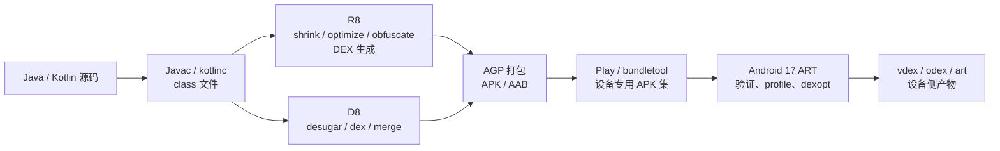

# DEX 体积优化实战

## 先确定优化对象

DEX（Dalvik Executable，Dalvik 可执行格式）是 Android 保存类定义、字节码和相关数据的文件。APK 是可安装包；AAB（Android App Bundle）是供 Google Play 按设备配置生成 APK 的发布包。DEX 优化容易被“方法数”“DEX 个数”带偏。用户感知到的是下载、安装、启动和运行时内存，工程团队操作的是另一组产物指标：

| 指标 | 回答的问题 | 不能单独证明什么 |
|---|---|---|
| APK/AAB 中 DEX 的原始字节数 | Java/Kotlin 代码在发布产物中占多大空间 | 用户经 Play 下载的字节数 |
| APK 的 DEX 压缩后字节数 | 当前 APK 文件中 DEX 的 ZIP 贡献 | App Bundle 针对某台设备的交付大小 |
| 单个 DEX 的方法/字段引用数 | 是否逼近索引上限，增长来自哪些包 | 代码实际占用的字节数 |
| `classes.dex` 的启动代码覆盖 | 启动路径是否集中在首个 DEX | 整体 DEX 是否足够小 |
| 设备上的 `.vdex`、`.odex`、`.art` | 安装后验证、编译和 App Image 成本 | 商店下载大小 |

ART（Android Runtime，Android 运行时）会在安装和运行过程中生成验证或编译辅助产物：`.vdex` 保存验证及相关 DEX 数据，`.odex`/`.oat` 保存设备侧编译结果，`.art` 是 App Image（把预初始化类和对象状态映射进内存的镜像）。这些文件占设备存储，不计入商店下载的 DEX 字节。

本文的平台基线为 Android 17 / API 37 / `android-17.0.0_r1`，构建工具部分按 2026 年 8 月 15 日检索到的 Android Developers 文档核对。平台版本和 Android Gradle Plugin（AGP）/R8 版本是两条独立轴：升级 `targetSdk` 不会自动缩小 DEX，升级工具链也不能代替发布产物回归测试。

一个可执行的目标通常写成三组预算：

- 交付预算：指定设备配置下的基础模块（base）APK 与安装时动态特性模块（feature）总下载量；
- 代码预算：各模块 DEX 原始字节数、压缩字节数、引用数和增量归属；
- 性能预算：启动路径是否落在主 DEX、首次显示耗时（TTID）、完全显示耗时（TTFD）、缺页次数、类加载与安装后编译成本。缺页表示进程访问的代码页尚未驻留内存，需要从文件映射中载入。

方法引用下降而 DEX 变大，或者 DEX 变小而启动变慢，都可能发生。持续集成（CI）应同时保存体积与启动结果，避免用一个间接指标替代用户结果。

## DEX 文件里哪些内容占空间

标准 DEX 由文件头（header）、若干标识符（ID）表、类定义和数据区（data section）组成。Android 17 的 [`StandardDexFile`](https://android.googlesource.com/platform/art/+/refs/tags/android-17.0.0_r1/libdexfile/dex/standard_dex_file.h) 与官方 [DEX format](https://source.android.com/docs/core/runtime/dex-format) 给出了字段布局。

### 固定宽度的索引区

DEX 040 及更早格式的文件头是 112 字节，DEX 041 文件头是 120 字节。主要索引项的单项大小如下：

| 区域 | 单项大小 | 保存的内容 |
|---|---:|---|
| `string_ids` | 4 字节 | 指向 `string_data_item` 的偏移 |
| `type_ids` | 4 字节 | 指向类型描述符字符串的索引 |
| `proto_ids` | 12 字节 | 方法原型的短描述、返回类型与参数列表 |
| `field_ids` | 8 字节 | 声明类、字段类型与字段名 |
| `method_ids` | 8 字节 | 声明类、方法原型与方法名 |
| `class_defs` | 32 字节 | 类、父类、接口、注解、类数据和静态值入口 |

索引区增长常由依赖、生成代码和宽泛的 keep 规则（R8 保留规则）推动。即使某个方法体很短，它仍可能增加 method、type、proto 和 string 等多处数据。跨 DEX 拆分时，每个逻辑 DEX 拥有自己的索引表，常用类型与字符串可能在不同文件重复出现。

### 变长的数据区

数据区包含以下主要项目：

- `string_data_item`：MUTF-8（Modified UTF-8，以 UTF-16 代码单元为基础的变体编码）字符串与 UTF-16 长度；
- `type_list`：接口列表和方法参数类型；
- `annotation_*`、`encoded_array_item`：注解、静态值和其他编码值；
- `class_data_item`：字段、方法及其访问标志，以 ULEB128（无符号小端 Base-128 变长编码）保存索引差值；
- `code_item`：寄存器、参数、返回值、异常处理区间与 16 位指令单元；
- `debug_info_item`：源码行号、参数名和局部变量事件。

大型业务通常由 `code_item`、字符串、注解和类数据共同决定体积。只统计“定义方法数”会漏掉方法体大小、长字符串、泛型/注解数据和重复索引。

### 64K 限制是引用表限制

单个 DEX 的 `method_ids` 最多有 65,536 个条目。计数包含应用代码、依赖和该 DEX 引用的 Android/Java 平台方法；它不等于源代码中声明的方法数量。`field_ids` 也使用 16 位索引并有同级上限。

APK Analyzer 同时显示 Defined Methods（定义的方法）与 Referenced Methods（引用的方法）：

- Defined Methods 只统计这个 DEX 定义的方法；
- Referenced Methods 统计该 DEX 的方法 ID 表，决定是否触发方法引用上限；
- 一个定义在其他 DEX 或平台中的方法，仍可能占当前 DEX 的引用条目。

`65,536` 解释了为什么需要 multidex（在一个 APK 中放置多个 DEX），却不能充当体积预算。两个版本的引用数相同，方法体、字符串和调试信息差异仍可让字节数相差很大。

## 从源码到发布 DEX 的构建路径

这张图区分 D8、R8、打包和 ART 的职责：



启用代码裁剪的 `release`（发布）构建由 R8 完成整程序分析、代码改写、重命名和 DEX 生成。未启用裁剪的构建、增量中间产物和部分 DEX 合并路径使用 D8。R8 可以直接生成 DEX，当前发布流程不是“R8 输出 `.class`，再由 D8 固定转换一次”。

AGP 负责编排 desugaring（把较新的 Java/Kotlin 字节码特性转换为目标 Android 版本可执行的形式）、依赖输入、默认规则、资源处理、性能配置文件（profile）改写和打包。应用项目通常不应绕开 AGP 直接调用 D8/R8；独立命令更适合复现实验和工具开发。

## R8：主要体积收益来自可删除、可改写、可重命名

R8 能做三类与 DEX 大小直接相关的工作：

1. code shrinking（代码裁剪）：从入口与 keep 规则出发构建可达图，也就是沿引用关系得到存活代码集合，再删除不可达类、字段和方法；
2. optimization（代码优化）：内联、常量传播、类合并、枚举优化、去虚化和其他代码改写；去虚化是把目标可确定的虚调用改成更直接的调用；
3. obfuscation/minification（混淆与名称压缩）：缩短类、包、字段和方法名，减少字符串与描述符占用。

R8 Full Mode（全模式）会采用更积极的整程序分析假设，自 AGP 8.0 起已经是默认模式。旧项目若仍有 `android.enableR8.fullMode=false`，删除该兼容开关才能恢复 Full Mode；无需再添加早期文档里的 `android.enableR8.fullMode=true`。

### 发布构建配置

这个 Kotlin DSL 示例适用于仍使用 legacy（旧版）build type DSL（构建类型配置语法）的项目，用于启用发布代码与资源优化：

```kotlin
android {
    buildTypes {
        release {
            isMinifyEnabled = true
            isShrinkResources = true
            proguardFiles(
                getDefaultProguardFile(
                    "proguard-android-optimize.txt",
                ),
                "proguard-rules.pro",
            )
        }
    }
}
```

`proguard-android-optimize.txt` 启用适合应用发布的优化默认值。AGP 9.3 及以上还提供 `optimization { enable = true }` 和 `keepRules` source set（源码集目录）；旧版 DSL 仍受支持。团队应按当前 AGP 版本选择一种配置，不要在同一份说明中混用两套目录约定。

优化开关只决定 R8 是否有机会工作。若消费端规则（consumer rules，即库随 AAR 交给应用合并的规则）或应用规则保留了大部分代码，开关已经打开也不会得到预期结果。

### Keep 规则的四个维度

一条裸 `-keep` 同时阻止 shrinking、obfuscation 和 optimization。`allowshrinking`、`allowobfuscation`、`allowoptimization` 用于放开对应能力。规则设计应回答四个问题：

1. 哪个类或成员通过反射、JNI（Java Native Interface，Java 与原生代码的调用接口）、序列化、WebView bridge（JavaScript 与应用代码之间的桥接对象）或框架回调访问？
2. 运行时依赖的是存在性、名称、签名、注解，还是可见性？
3. 类自身是否已有静态引用，只需保护动态访问的成员？
4. 这项约束应放在应用规则中，还是由库的消费端规则随 AAR 提供？

这条规则保留一个已由静态代码创建的 WebView bridge 中带注解的方法，同时允许 R8 优化方法体：

```proguard
-keepclassmembers,allowoptimization class com.example.web.AppBridge {
    @android.webkit.JavascriptInterface public <methods>;
}
```

这条规则不会保留整个业务包，也没有禁止 AppBridge 之外的代码重命名。若 JavaScript 还通过字符串查找 bridge 类名，类名本身也需要单独保护；规则范围应由调用协议决定。

这类包级规则适合作为短期止崩手段，不适合长期留在发布配置中：

```proguard
-keep class com.example.** { *; }
```

它会阻止匹配代码被删除、改名和优化。缩小范围前需要补齐反射、序列化、JNI、动态加载与关键业务测试，不能靠删除规则后“能启动”作为充分验证。

### `@Keep` 的使用边界

`androidx.annotation.Keep` 通过 AndroidX 随库提供的消费端规则形成强保留约束。它适合表达无法从静态调用图推导的稳定运行时协议，但容易把约束藏在源码中：

- 公共 SDK 回调、反射入口或工具生成代码可使用；
- 普通业务类不应为了消除一次 R8 崩溃就整类标记；
- 注解落在类上还是成员上，会改变保留范围；
- 清理 `@Keep` 前要找到运行时入口并写出更精确的规则。

第三方库中的消费端规则与应用规则会汇总进同一个 R8 配置。一个依赖携带的包级 `-keep` 可能保留其传递依赖，因此“应用自己的规则很少”不能证明 keep 配置健康。

### 找出是谁保留了代码

这些临时诊断规则用于输出合并配置，并追踪一个意外存活类到入口或 keep 规则的路径：

```proguard
-printconfiguration build/reports/r8/configuration.txt

-whyareyoukeeping class com.example.large.UnexpectedRoot
```

`-whyareyoukeeping` 会增加构建开销，应只在本地诊断分支使用。AGP 产物中的 `configuration.txt`、`seeds.txt` 和 `usage.txt` 也可配合 APK Analyzer：

- `configuration.txt`：应用、默认规则、各模块和依赖消费端规则的合并结果；
- `seeds.txt`：被配置阻止删除的节点；
- `usage.txt`：R8 删除的类、字段和方法；
- `mapping.txt`：原始符号到发布符号的映射，以及行号、内联等 Retrace（混淆堆栈还原）元数据。

遇到“某个 SDK 占了 2 MB”时，先看发布 DEX 中仍存活的包，再用 `-whyareyoukeeping` 找到使代码存活的根节点。源码依赖大小、AAR/JAR 文件大小与 R8 后的 DEX 贡献是三项不同指标。

### R8 Configuration Analyzer

R8 Configuration Analyzer 需要 R8 9.3.7-dev 或更高版本，使用 AGP 时则以稳定版 AGP 9.3.0 为起点。AGP 9.3 提供独立任务：

```bash
./gradlew :app:analyzeReleaseR8Config
```

该任务把 HTML 报告写到 `app/build/reports/r8/r8-config-analyzer-release.html`。完整的 R8 发布构建也会在 `build/outputs/mapping/release/configanalyzer.html` 生成报告。报告按代码裁剪、优化和混淆三个维度展示规则影响，并定位覆盖范围过大的规则。三个分数表示有多少类、字段和方法仍可参与对应优化，不是最终节省字节数。它适合持续观察规则质量，但仍要结合发布 APK：

- 高裁剪分数（shrinking score）不代表方法体一定小；
- 某条规则覆盖很多节点，可能对应合法的运行时协议；
- 分析器没有执行应用的反射、JNI 或序列化路径；
- 规则修改后的正确性由测试、分批发布与线上崩溃监控确认。

未使用支持该分析器的工具链时，`configuration.txt`、`seeds.txt`、`usage.txt`、APK Analyzer 和 `-whyareyoukeeping` 已能完成同类排查。

## 依赖与生成代码：先看发布贡献

DEX 增长常见来源包括：

- 新增 SDK 带入大量传递依赖；
- 库通过反射、`ServiceLoader`、JNI 或消费端规则保留宽泛代码；
- 依赖注入（DI）、路由、序列化、数据库和 Compose 编译生成代码增加；
- 多个功能各自引入功能重叠的工具库；
- 仅使用大型库的一小部分 API，但内部入口把多数实现变成可达；
- core library desugaring（核心库兼容转换）为较低 `minSdk` 提供新版 Java API 的兼容实现。

R8 能删除不可达代码，但存在若干边界：

- 反射字符串、原生代码回调和外部配置不在普通静态调用图中；
- 库的消费端规则可能保护实现细节；
- 资源、应用清单（manifest）、JNI 注册和序列化协议可能成为入口；
- 一个小入口可能静态引用完整实现树；
- 多模块重复声明依赖不等于发布 DEX 一定重复，最终结果取决于构建变体（variant）解析和打包。构建变体是构建类型、产品配置等组合出的具体产物版本。

依赖治理应以相同发布构建变体的产物差异为依据。源码行数、Maven 包大小或调试 APK 只能作为线索。

## D8 选项不能替代 R8

### `--release`

独立 D8 的 `--release` 会减少调试信息，并在存在主 DEX 类清单（main dex list）时尝试把更多类填入主 DEX。它不会执行 R8 的整程序代码裁剪、重命名和高级优化。

AGP 已按构建变体选择 D8/R8 模式。应用发布构建无需额外执行一次 `d8 --release`；对 R8 输出再做第三方 DEX 重写还可能破坏性能配置文件、布局和 Retrace 映射。

### `--min-api`

`--min-api` 描述输出需要兼容的最低平台。较高 `minSdk` 可能减少部分字节码或核心库兼容代码，也可能让工具使用较新的指令或库 API，但它是产品兼容决策，不能被当作可随意调高的压缩级别。

DEX 版本也不应被写成“037 比 038 小”这种固定关系：

- DEX 037 增加默认接口方法支持；
- DEX 038/039 增加新的字节码和 method handle/type（方法句柄/方法类型）能力，用来描述可动态调用的方法目标和签名；
- DEX 040 扩展 SimpleName（标识符简单名称）的允许字符范围；
- DEX 041 引入可容纳多个逻辑 DEX、共享后续数据的容器格式。

具体输出由 D8/R8、`minSdk`、启用特性和工具支持共同选择。修改文件魔数（magic）、强制私有试验开关或对 DEX 做二次拼接都不属于应用体积优化方案。

### DexArchive 与逐类 DEX

DexArchive 是增量构建中保存中间 DEX 结果的形式。`--intermediate`、`--file-per-class` 和 AGP 的增量 DEX 编译服务于构建缓存与增量速度。中间目录里大量逐类小 DEX 会在完整构建中合并，不能拿它们的总大小或文件数作为发布指标。

若 CI 只想提高构建速度，应分析 Gradle 任务、缓存命中和 D8 合并；若目标是用户下载大小，应只检查签名、优化后的 APK/AAB 或设备专用 APK 集。

## 调试信息与可追溯性

### DEX 里没有 JVM 的 LineNumberTable

JVM 是 Java Virtual Machine（Java 虚拟机）。`LineNumberTable`、`LocalVariableTable` 是输入 `.class` 文件的 JVM 属性；D8/R8 转成 DEX 后，行号、参数名和局部变量事件位于 `debug_info_item`。把 APK 中的 DEX 描述成“包含大量 LineNumberTable”会混淆两种格式。

D8 `--release` 会移除调试所需的大部分信息，但保留生成异常堆栈所需的部分。R8 还能对行号和内联调用做编码，并把还原信息写进 `mapping.txt`。现代 R8 已改进发布构建的行号与文件名还原，无需用一个非标准的 `-strip-debug` 规则手工破坏栈信息。

体积与可诊断性的合理分工是：

- 发布 DEX 不保留局部变量调试体验；
- 发布构建保留必要的行号映射能力；
- 每次发布归档完全匹配该二进制的 `mapping.txt`；
- Play、Crashlytics 或内部崩溃平台绑定 `versionCode`、构建变体、映射文件标识和符号文件；
- 本地使用同版本 Retrace 验证一条混淆栈。

这条命令使用发布构建的符号映射文件还原一份堆栈：

```bash
"$ANDROID_HOME/cmdline-tools/latest/bin/retrace" \
  app/build/outputs/mapping/release/mapping.txt \
  trace.txt
```

`mapping.txt` 会被后续构建覆盖，CI 要在发布时复制到只增不改的发布制品仓库。映射文件必须来自同一次 R8 编译；使用相邻提交或同一 `versionName` 的另一构建变体都可能得到错误结果。

### Kotlin Metadata

Kotlin 编译器把可空性、扩展函数、协程签名等语言信息写进 `@kotlin.Metadata`。它对普通 Kotlin 调用不是运行时必需项；`kotlin.reflect`、按 Kotlin 声明结构扫描的框架和部分序列化工具会在运行时读取。

R8 Full Mode 会依据存活代码与 keep 约束处理注解和元数据。产品只有在运行时使用 Kotlin 反射等元数据读取路径时，才应按当前官方指导保留所需的 `RuntimeVisibleAnnotations` 与 `kotlin.Metadata`，并为被反射的类或成员添加精确规则和测试。没有运行时读取时，不要仅凭“项目使用 Kotlin”就给所有类添加强 keep。

Kotlin 元数据大小只是 Kotlin 代码体积的一部分。数据类生成成员、默认参数桥接、协程状态机、lambda（匿名函数）、Compose 和代码生成都可能贡献 DEX；R8 后的发布结果才是比较对象。

### Inline 与编译器版本

Kotlin `inline` 会在调用点展开函数体，可能减少 lambda 对象和调用，也可能因调用点很多而增加输入字节码。R8 还会做自己的内联与去重，因此不能用源代码中的 `inline` 数量推算发布 DEX。

K2 是新版 Kotlin 编译器前端。K2 或其他 Kotlin 编译器版本可能改变生成字节码、元数据与 R8 可优化性。迁移评估应固定 AGP、R8、Kotlin、JDK、依赖锁文件和构建变体，对发布 DEX、构建时间、启动与功能测试做成组比较，避免发布“升级 K2 固定节省多少”的长期结论。

## 字符串、资源 ID 与注解

DEX 的 `string_ids` 会引用类/方法/字段名称、类型描述符、源码字符串、注解值及其他常量。同一逻辑 DEX 内的相同字符串可以复用，跨传统 DEX 文件仍可能重复。

R8 缩短和重打包符号后，类名、包名、字段名与方法名字符串会变短。AGP 9.1 起应用构建默认启用 class repackaging（类重打包，把类移动到更短的包路径）；旧工具链可由 R8 配置控制。反射、序列化和 JNI 若依赖原始名称，必须提供精确规则。

`R.string.title` 在 DEX 中主要表现为资源 ID 的字段/整数引用；字符串内容保存在 `resources.arsc` 或资源拆分 APK 中。把界面（UI）文案从代码字面量迁到资源，可改善本地化与复用，但 DEX 与资源表的总变化需要用 APK/AAB 测量。

`@StringRes`、`@DrawableRes` 等类型提示注解不自动形成 R8 keep 入口。只有 R8 规则、工具默认规则或运行时可达关系会决定保留。`@Keep` 具有专门的消费端规则语义，两类注解不能混为一谈。

常量折叠也有边界：

- `const val` 和可证明的常量表达式可能在编译/R8 阶段内联；
- 反射访问字段名会限制删除或改名；
- 公共 API、库使用方和独立编译边界会限制整程序优化；
- 资源 ID 在非 `final` 场景、动态特性模块或共享资源中不一定成为编译期常量。

## Multidex：正确性、体积与启动分别处理

### Android 12—17 已原生支持 multidex

Android 5.0 / API 21 起，ART 原生加载 APK 中的 `classes.dex`、`classes2.dex` 等文件。Android 12—17 不需要 `androidx.multidex` 安装器，也不需要为了类可见性维护旧版主 DEX 类清单（legacy main dex list）。

`minSdk <= 20` 的应用仍要处理旧版 multidex（为 Dalvik 运行时安装和加载次级 DEX 的兼容方案）：

- `MultiDex.install()` 完成前只能可靠访问主 DEX 中的类；
- 应用清单组件、Application、启动依赖及其直接依赖需要进入主 DEX；
- 主 DEX 类清单过大可能再次碰到 64K；
- 反射/JNI 提前访问不容易被自动依赖追踪识别。

这个历史边界不应套到 `minSdk >= 21` 的 Android 17 应用。

### DEX 个数不是启动耗时公式

多个 DEX 会增加文件头、索引、对齐和重复表项等结构成本，ART 也需要打开对应的 DEX/OAT 元数据。启动开销仍取决于：

- 启动路径触达多少类和方法；
- 这些代码在 DEX 中的布局与局部性；
- Baseline/Startup Profile 是否匹配当前二进制；
- 是否已有可用的 VDEX/OAT/App Image；
- 存储速度、缺页、类验证和类初始化工作；
- R8 是否把无用代码从启动路径和安装包中删除。

把 `classes3.dex` 合回 `classes2.dex` 不保证启动变快。为了减少文件数而添加 keep、禁用优化或打乱 Startup Profile 布局，结果可能更差。

Android 17 的平台源码支持多 DEX 和 DEX 容器读取，但没有向应用承诺“多 DEX 按某种并行度加载”。调优文案不应依赖内部线程模型；可验证目标是启动关键类位置、Perfetto 跟踪和基准测试。

### 主 DEX 与 Startup Profile

Baseline Profile（基准配置文件）列出高频类和方法，供 ART 在安装或设备空闲时选择验证与编译内容。Startup Profile（启动配置文件）是它的子集，由 R8 在构建时调整 DEX 内和 DEX 间布局，使启动关键类与方法尽量进入 `classes.dex`。这种代码局部性把启动路径排在相邻位置，减少跨页和跨 DEX 访问。

它与旧版主 DEX 类清单的目标不同：

- 旧版主 DEX 类清单保证 Dalvik 安装器加载次级 DEX 前的类可见性；
- Startup Profile 优化现代 ART 的启动代码局部性；
- Baseline Profile 供 ART 在安装或设备空闲期选择验证与预先编译（ahead-of-time，AOT）内容；
- Startup Profile 不在 APK 中形成一个独立 `startup.prof` 文件。

AGP 8.8 及以上可从 AAB 中的 `r8.json` 检查带 `"startup": true` 的 DEX。所有版本都可用 APK Analyzer 检查启动类是否进入 `classes.dex`，并用 Macrobenchmark（宏基准测试）和 Perfetto 系统跟踪验证收益。

Startup Profile 可能改变各 DEX 的字节分布，不能只比较 `classes.dex` 大小。应同时记录 DEX 总量、首个 DEX 大小、启动类覆盖和 TTID/TTFD。

## Baseline Profile、`.art` 与 `.oat` 的体积边界

Baseline Profile 会作为发布材料随应用分发，ART 或安装基础设施用它选择验证、AOT 编译和 App Image 内容。安装后可能产生 `.vdex`、`.odex`/`.oat` 与 `.art`，它们占设备存储，不属于 APK 内的 DEX 字节。

因此需要两份报告：

- 分发报告：APK/AAB、设备专用 APK 集、配置文件元数据和 DEX 大小；
- 安装报告：`pm path` 对应 APK、`/data/app` 产物、ART 编译状态和应用数据占用。

扩大 Baseline Profile 可能增加配置文件与设备侧编译产物，也可能改善启动和高频路径。缩小 DEX 不能成为删掉有效配置文件的理由；两者用“下载字节 + 安装字节 + 性能”共同评估。

对 R8 输出做字节级后处理风险很高。类名、方法签名、DEX 校验和（checksum）、配置文件规则、符号映射和签名互相对应；修改 DEX 后即使能够安装，配置文件覆盖与 Retrace 仍可能失效。

## 动态特性模块只改变交付边界

Dynamic Feature Module（动态特性模块）可以把非安装时功能的代码与资源放入功能拆分 APK（feature split），从而减少基础模块的初次下载和主安装 DEX。它不会自动减少用户获取全部功能后的总代码量。

拆分前需要确认：

- 基础模块不能依赖动态特性模块；共享接口和安装时必需实现应位于基础模块或合适的公共模块；
- 安装时模块（install-time feature）仍会进入首次安装集合；
- 按需模块（on-demand feature）首次使用会产生下载、安装、失败重试和版本一致性成本；
- 各动态特性模块的依赖与消费端规则仍需审计；
- 入口 Activity、Provider、序列化模型和导航协议要在动态特性模块未安装时安全处理。

模块化的判断依据是交付时机和依赖方向。只为减少基础模块 DEX 数字而拆模块，可能把复杂度转移到下载状态处理与跨模块接口。

## 建立可复现的测量流程

### 固定同一份发布条件

每次对比至少固定：

1. AGP、R8、Kotlin、JDK 与 Gradle 版本；
2. 发布构建变体、`minSdk`、产品配置（flavor）和资源配置；
3. 依赖锁文件、消费端规则与生成代码输入；
4. 签名配置、Baseline/Startup Profile 与构建开关；
5. 对比产物来自执行 `clean` 后可重复的 CI 构建；
6. Android 17 设备配置或 `device-spec.json`。这个 JSON 描述设备的 SDK 版本、ABI、屏幕密度和语言等交付条件。

调试 APK、未签名的 universal APK（包含多种设备配置的通用 APK）与 Play 设备专用 APK 的大小口径不同，不能放进同一条趋势线。

### 用 APK Analyzer 检查 DEX

这些命令用于列出 DEX、统计每个 DEX 的方法引用、观察包级字节贡献，并对比两个 APK：

```bash
apkanalyzer dex list app-release.apk
apkanalyzer dex references app-release.apk
apkanalyzer dex packages \
  --defined-only \
  --proguard-mappings app/build/outputs/mapping/release/mapping.txt \
  app-release.apk
apkanalyzer apk compare \
  --different-only \
  --files-only \
  previous-release.apk \
  app-release.apk
```

`dex packages` 输出的字节数适合定位增长包；加载同一次构建的 `mapping.txt` 后可还原原始符号。`apk compare` 展示文件级增量。命令输出应连同工具版本保存，避免未来格式变化影响解析器。

这些命令分别读取 APK 文件大小和估算下载大小：

```bash
apkanalyzer -h apk file-size app-release.apk
apkanalyzer -h apk download-size app-release.apk
```

`--human-readable` 是全局选项，因此放在 `apk file-size` 之前。估算值适合本地回归，Play 实际交付仍要按设备 APK 集核对。

### 用 bundletool 检查 App Bundle 交付

APK Set 是以 `.apks` 为扩展名的归档，其中包含面向一种或多种设备配置的 APK 集合。这些命令生成 APK Set，并按指定 Android 17 设备规格估算首次安装下载量：

```bash
bundletool build-apks \
  --bundle=app-release.aab \
  --output=app-release.apks \
  --device-spec=pixel-android17.json

bundletool get-size total \
  --apks=app-release.apks \
  --device-spec=pixel-android17.json
```

`get-size total` 估算的是压缩传输大小，并会根据设备规格（device spec）选择基础模块、动态特性模块和配置 APK。评估按需模块时再使用 `--modules` 指定模块集合，不能拿整个 `.aab` 文件大小替代用户下载量。

### CI 门禁应该保存什么

建议对每个发布构建变体保存：

| 制品/指标 | 用途 |
|---|---|
| APK/AAB 与 SHA-256 | 让分析结果对应唯一二进制 |
| APK 文件/估算下载大小 | 整包趋势 |
| 设备专用 APK Set 大小 | 主要设备族的交付趋势 |
| 每个 DEX 的原始/压缩字节 | 代码体积定位 |
| 每个 DEX 的方法引用数 | 索引风险 |
| `mapping`、`usage`、`seeds`、`configuration` | R8 归因与崩溃还原 |
| `r8.json` 与配置文件 | Startup Profile 是否生效 |
| 增长最大的包 | 把增量分配给模块/依赖负责人 |
| 宏基准测试结果 | 防止用启动性能换体积 |

门禁可以同时设置绝对预算和相对增量预算。阈值应来自本产品的历史波动、发布节奏和下载目标；统一规定“每次代码变更只能增加 10 KB”容易被生成代码、配置文件或依赖升级噪声干扰。

超过预算时，代码变更说明需要提供增长来源、用户价值、可替代方案和后续削减项。仅写“方法数增加不多”不足以解释 DEX 字节增长。

## 一次完整的回归排查

假设发布 APK 的 DEX 增加 1.8 MB，可按以下顺序定位并处理：

1. 用 `apk compare` 确认增长位于 DEX，排除资源、原生库与签名差异；
2. 用 `dex packages --defined-only` 找出增长最大的包；
3. 对照依赖锁文件、生成代码目录与 R8 工具版本；
4. 检查 `configuration.txt` 是否出现新的全局选项或包级 keep 规则；
5. 对意外存活的根节点使用 `-whyareyoukeeping`；
6. 缩小 keep 规则、替换依赖或调整反射协议后重新生成完整发布产物；
7. 运行反射、JNI、序列化、WebView bridge、动态特性模块和冷启动测试；
8. 用同一设备规格比较下载量，并用同一设备集执行启动基准测试；
9. 归档二进制、报告与符号映射文件。

如果增长来自合法功能，不必为了回到旧数字而使用脆弱的手工 DEX 改写。可以接受 300 KB 的必要代码，同时删除 500 KB 的宽泛 keep 规则或不再使用的 SDK。

## Android 17 源码边界

Android 17 ART 的 [`standard_dex_file.cc`](https://android.googlesource.com/platform/art/+/refs/tags/android-17.0.0_r1/libdexfile/dex/standard_dex_file.cc) 识别 DEX 035、037、038、039、040 与 041。[`dex_file.h`](https://android.googlesource.com/platform/art/+/refs/tags/android-17.0.0_r1/libdexfile/dex/dex_file.h) 定义了 v41 容器/文件头边界和传统 DEX 访问结构。

这说明 Android 17 运行时具备对应读取能力，不能据此推导应用构建默认输出 DEX 041。应用输出仍由当前 D8/R8 与 AGP 选择，公开工具配置优先于 ART 读取器的能力上限。

Android Framework 的 [`DexPathList.java`](https://android.googlesource.com/platform/libcore/+/refs/tags/android-17.0.0_r1/dalvik/src/main/java/dalvik/system/DexPathList.java) 管理类加载器（class loader）的 DEX 元素和原生库元素。它没有为应用定义“DEX 越少越快”或“并行加载 N 个 DEX”的性能契约。

Android 17 / API 37 也没有新增面向应用的 DEX 体积 API。平台继续执行安装、验证、性能配置文件处理与 dexopt（DEX 验证和编译优化）；体积削减仍发生在源码依赖、R8 配置、D8/R8 输出和 App Bundle 交付阶段。

DEX 结论不涉及内核专有机制，也不关联特定 Linux 内核源码标签。`.dex`、`.vdex`、`.oat` 和 `.art` 的读取最终依赖文件映射与页面缓存，但应用侧体积策略无需以某个内核调节器或文件系统实现为前提。

## 常见错误

### 把 64K 写成“应用最多 64K 个方法”

限制作用于单个 DEX 的方法引用表。multidex 允许应用总引用数超过 64K，每个文件仍要满足上限。

### 用调试 APK 评估发布体积

调试产物的优化、调试信息、性能配置文件、签名和依赖配置可能与发布产物不同。体积决策只使用可发布的构建变体。

### 为了体积删除所有行号

现代 R8 可把行号和内联映射保存在 `mapping.txt`，发布 DEX 不需要保留完整局部变量调试信息。缺少符号映射文件得到的小幅节省，会显著增加线上诊断成本。

### 用包级 keep 修复一个反射崩溃

宽泛规则会保护大量无关代码。应识别运行时读取的是类、成员、名称、签名还是注解，再只保护协议所需部分。

### 把 `@StringRes` 当作 keep

资源类型注解用于静态检查，不自动保护类或字段。`@Keep`、应用清单、Android Asset Packaging Tool（AAPT，资源打包工具）规则、消费端规则与可达图才会影响 R8。

### 手工调用 D8 再压一次 R8 输出

二次处理可能改变 DEX 校验和、布局、性能配置文件对应关系和堆栈符号映射。发布构建由 AGP 统一生成，定制工具只在完整验证流程支持时采用。

### 只追求单 DEX

单 DEX 不等于小包，也不等于快启动。Android 12—17 原生支持 multidex；启动代码布局、R8 删除的代码量和配置文件覆盖更值得测量。

### 把 Startup Profile 当成体积压缩

Startup Profile 调整布局，目标是启动局部性。它可能改变各 DEX 分布，DEX 总量是否变化要看构建结果。

### 把动态特性模块当成总量删除

按需模块能减少首次交付，用户安装该功能后仍会获得对应代码。基础模块、安装时模块与按需模块三种口径需要分开报告。

## 版本演进

| 版本 | 与 DEX 体积和布局相关的边界 |
|---|---|
| Android 5.0（API 21） | ART 原生支持 APK 内多个 DEX；`minSdk >= 21` 不需要旧版 multidex 库 |
| Android 7（API 24） | DEX 037 支持默认接口方法相关能力 |
| Android 8（API 26） | DEX 038 增加方法句柄/方法类型等格式能力 |
| Android 9（API 28） | DEX 039 增加相关字节码并用于平台能力 |
| Android 10（API 29） | DEX 040 读取器支持扩展标识符简单名称；应用输出仍由工具选择 |
| AGP 8.0 | R8 Full Mode 成为默认 |
| AGP 8.3 | DEX layout optimization（DEX 布局优化）默认启用，Startup Profile 可驱动主 DEX 布局 |
| AGP 8.6 | 默认平台规则开始保留 `LineNumberTable`；`SourceFile` 自 AGP 8.2 起已默认保留，发布仍需归档 `mapping.txt` |
| AGP 8.8 | AAB 内 `r8.json` 可用于检查 Startup Profile DEX 标记 |
| AGP 9.1 | 应用构建默认启用类重打包，进一步压缩 DEX 中的名称与描述符 |
| AGP 9.3 | 新 `optimization {}` DSL 同时启用代码与资源优化，并提供独立的 R8 Configuration Analyzer 任务 |
| Android 17（API 37） | ART `android-17.0.0_r1` 识别 DEX 035—041；没有应用侧“自动瘦 DEX”平台 API |

Android 平台版本表与 AGP 版本表放在一起是为了说明边界变化，二者不能按行一一对应。Android 17 应用可以使用不同受支持的 AGP/R8 组合，构建结果以实际工具版本为准。

## 延伸阅读与源码锚点

- [25.6 APK 体积分析与瘦身](06-apk-analysis.md)：APK/AAB、资源、原生库与交付口径。
- [25.7 R8 与资源优化](07-r8-resource-optimization.md)：Full Mode、keep 规则与资源优化。
- [25.8 App Bundle 与动态交付](08-app-bundle-delivery.md)：基础模块、动态特性模块与设备专用 APK。
- [21.4 Baseline Profile 与 Startup Profile 实战](../ch21-startup/04-baseline-profile-practice.md)：主 DEX 布局、配置文件生成与启动验证。
- [1.49 ART Boot Image 内存映射](../../part1-fundamentals/ch01-architecture/49-art-boot-image-memory-mapping-startup.md)：`.art`、`.oat`、`.vdex` 与平台启动边界。

一手资料：

- [Dalvik executable format](https://source.android.com/docs/core/runtime/dex-format)：DEX 文件头、ID 表、数据项与 v41 容器。
- [Enable app optimization with R8](https://developer.android.com/topic/performance/app-optimization/enable-app-optimization)：R8、Full Mode 与 AGP 版本行为。
- [Use R8 in full mode](https://developer.android.com/topic/performance/app-optimization/full-mode)：属性保留、Kotlin Metadata 与反射边界。
- [Add global options](https://developer.android.com/topic/performance/app-optimization/global-options)：`LineNumberTable`、`SourceFile` 和运行时注解属性。
- [AGP 9.3.0 release notes](https://developer.android.com/build/releases/agp-9-3-0-release-notes)：AGP 9.3 稳定版与新优化 DSL。
- [R8 Configuration Analyzer](https://developer.android.com/topic/performance/app-optimization/r8-configuration-analyzer)：最低 R8/AGP 版本、Gradle 任务与报告字段。
- [Add keep rules](https://developer.android.com/topic/performance/app-optimization/add-keep-rules)：keep 选项、修饰符与 Kotlin 名称边界。
- [Troubleshoot R8 rules](https://developer.android.com/topic/performance/app-optimization/troubleshooting-rules)：`-whyareyoukeeping` 与保留路径。
- [APK Analyzer](https://developer.android.com/studio/debug/apk-analyzer)：DEX 定义/引用、符号映射、删除清单与 APK 对比。
- [`apkanalyzer` command reference](https://developer.android.com/tools/apkanalyzer)：命令行语法与 DEX 子命令。
- [D8 command reference](https://developer.android.com/tools/d8)：release、min-api、main dex 与增量模式。
- [Multidex guide](https://developer.android.com/build/multidex)：64K 引用限制、旧版兼容与 ART 原生 multidex。
- [Startup Profile DEX layout](https://developer.android.com/topic/performance/startupprofiles/dex-layout-optimizations)：启动代码布局和主 DEX。
- [Debug Baseline/Startup Profiles](https://developer.android.com/topic/performance/baselineprofiles/debug-baseline-profiles)：`r8.json` 与 DEX 检查。
- [`bundletool`](https://developer.android.com/tools/bundletool)：设备专用 APK Set 与下载大小估算。
- [`StandardDexFile` @ Android 17](https://android.googlesource.com/platform/art/+/refs/tags/android-17.0.0_r1/libdexfile/dex/standard_dex_file.cc)：ART 支持的 DEX 魔数与版本。
- [`DexFile` @ Android 17](https://android.googlesource.com/platform/art/+/refs/tags/android-17.0.0_r1/libdexfile/dex/dex_file.h)：DEX 文件头、容器与数据访问边界。
