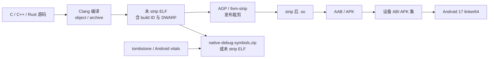

# Native SO 体积优化实战

Native（本地代码）库是应用随包交付、由 C/C++ 等语言编译而成的 `.so` 共享库。它的优化常被简化成“做一次 `strip`，再删一个 ABI”：`strip` 是从发布二进制中移除不再需要的普通符号和调试信息，ABI（应用二进制接口）则约定指令集、调用方式和数据布局。只做这两步会漏掉三类成本：ELF（Executable and Linkable Format，可执行与可链接格式）内仍存活的代码和数据、同一库在不同交付配置中的副本，以及安装后由动态链接器（dynamic linker）映射的页面与重定位。若只看仓库里的 `.so` 文件大小，很容易把上传包、用户下载、安装占用和运行时内存混在一起。

平台锚点为 Android 17 / API 37 / `android-17.0.0_r1`；涉及文件映射与基础页时，内核锚点为 `android17-6.18-2026-06_r6`。NDK、AGP 和 Google Play 规则采用 2026 年 8 月的官方文档语义。构建工具版本与 Android 平台版本是两条独立轴，升级 `targetSdk` 不会自动缩小 `.so`。

## 先建立四种体积口径

同一个 `libcodec.so` 至少有四个值得记录的数字：

| 口径 | 回答的问题 | 常见误读 |
|---|---|---|
| 未经 `strip` 的 ELF 文件大小 | 编译、链接和 DWARF 调试格式的数据一共生成多少字节 | 直接当作用户下载量 |
| 经过 `strip` 的 ELF 文件大小 | 发布库自身保留多少代码、数据和动态链接元数据 | 忽略 ZIP 压缩与对齐 |
| APK/APKS 中的压缩或存储大小 | 指定交付产物中该 ABI 的贡献；APKS 是 `bundletool` 生成的 APK 集合归档 | 把包含多种 ABI 的 fat APK 或 AAB（Android App Bundle）总量当作单设备下载量 |
| 设备映射与安装占用 | 动态链接器映射、RELRO（重定位后只读保护）、匿名脏页和安装副本占多少 | 用磁盘字节推导 PSS（Proportional Set Size，按共享比例分摊后的物理内存） |

还要把 ABI 与模块维度带上。一个 AAB 是供应用商店按设备配置生成 APK 的发布包；它同时包含 `arm64-v8a`、`armeabi-v7a` 和 `x86_64` 时，上传制品会包含多份机器码。Google Play 生成按 ABI 划分的配置 APK（configuration APK）后，某台设备通常只获取匹配的 ABI。普通通用 APK（universal APK）则可能把多份库一起发给用户。

体积目标可拆成三组预算：

- 交付预算：代表设备配置下，基础模块（base）与安装时特性模块（install-time feature）的 Native 下载字节；
- 二进制预算：每个 ABI、模块和 `.so` 经过 `strip` 后的文件大小，以及主要节区（section）增量；
- 运行预算：加载耗时、重定位数、文件页、匿名脏页、PSS 和 Native 崩溃可还原率。

只有三组结果一起保存，团队才能判断某次“缩小”有没有把代价转移到安装空间、启动时间或故障定位。

## ELF 中哪些字节会进入发布库

ELF 有两套描述同一文件的视图：

- 程序头（program header）描述 `PT_LOAD`、`PT_DYNAMIC`、`PT_GNU_RELRO` 等运行时段（segment），Android 动态链接器按它们预留地址、映射文件和设置权限；
- 节区头（section header）描述 `.text`、`.rodata`、`.data`、`.bss`、符号表、字符串表、重定位和调试信息，链接与分析工具主要使用它们。

节区与段不是一一对应关系。一个可执行 `PT_LOAD` 段往往包含 `.text` 和相邻只读内容；多个节区也可能被装入同一个段。分析发布体积时，节区适合归因，程序头适合解释加载、权限和页对齐。

### 常见节区的体积含义

| 节区 | 主要内容 | 文件与内存边界 |
|---|---|---|
| `.text` | AArch64/Thumb/x86 指令 | 占文件字节，通常映射为只读可执行 |
| `.rodata` | 常量表、字符串、查表数据、部分运行时类型信息（RTTI）与虚函数表（vtable） | 占文件字节，通常只读映射 |
| `.data` | 有非零初值的可写全局数据 | 同时占文件和进程私有可写页 |
| `.bss` | 零初始化全局数据，类型为 `SHT_NOBITS` | 占虚拟地址和运行内存，不携带同等文件内容 |
| `.dynsym` / `.dynstr` | 动态链接所需的可见符号与名称 | 发布库仍可能需要，不能按普通调试表删除 |
| `.symtab` / `.strtab` | 完整静态符号与名称 | 动态链接器通常不依赖，发布版本可分离 |
| `.rela.*` / `.relr.dyn` | 动态重定位记录 | 影响文件大小和加载工作 |
| `.eh_frame*` | C++ 异常、栈展开（unwind）与回溯元数据 | 删除前要核对异常和回溯需求 |
| `.debug_*` | DWARF 调试信息格式保存的文件、行号、类型和变量信息 | 应进入独立符号制品，不应留在发布 APK |

`.bss` 是最容易读错的一项。`llvm-size` 的 BSS 数值可能很大，但它不等于 APK 增加同样多的字节；它提示的是零初始化内存风险。反过来，`.rodata` 中的大模型常量、查表数据或内嵌证书会直接扩大 ELF 和交付产物。

### 用 NDK 工具检查结构

下面的命令用于同时查看节区、段、动态依赖、导出符号和 GNU build ID。build ID 是链接器写入 ELF 的内容标识，符号服务器用它把线上地址匹配到同一次构建的符号文件：

```bash
NDK_TOOLCHAIN="$ANDROID_NDK_HOME/toolchains/llvm/prebuilt/darwin-x86_64/bin"
SO_PATH="app/build/intermediates/stripped_native_libs/release/out/lib/arm64-v8a/libapp.so"

"$NDK_TOOLCHAIN/llvm-readelf" -W -S "$SO_PATH"
"$NDK_TOOLCHAIN/llvm-readelf" -W -l "$SO_PATH"
"$NDK_TOOLCHAIN/llvm-readelf" -W -d "$SO_PATH"
"$NDK_TOOLCHAIN/llvm-nm" -D --defined-only --size-sort "$SO_PATH"
"$NDK_TOOLCHAIN/llvm-readelf" -n "$SO_PATH"
```

不同 NDK 主机目录名称可能是 `darwin-x86_64`、`linux-x86_64` 或 `windows-x86_64`。`-S` 用于节区归因，`-l` 用于检查 LOAD 段和对齐，`-d` 可检查 `DT_NEEDED` 依赖，`llvm-nm -D` 只看动态导出。build ID 要进入符号服务器索引，文件名相同不能证明二进制相同。

下面的命令用于按节区统计文件贡献：

```bash
"$NDK_TOOLCHAIN/llvm-size" -A -d "$SO_PATH"
```

`llvm-size` 适合做版本对比，但它不能解释模板实例、内联函数或某个静态归档库（archive，`.a` 文件）为什么进入最终库。需要函数级归因时，应同时保存链接映射文件（linker map，记录输入目标文件与最终地址/尺寸的对应关系）；需要源码级 DWARF 归因时，应分析 `strip` 前制品。

## Strip：发布库与符号制品分开管理

Android Gradle Plugin（AGP）默认会对发布版 Native 库执行 `strip`，移除完整符号表与调试信息。这里的目标是生成两份互相对应的制品：

1. `strip` 后 `.so` 进入 APK/AAB；
2. `strip` 前 ELF 或 Native 调试符号包（`native-debug-symbols.zip`）进入受控符号库。

下面的图展示发布二进制与符号文件的分流：



这条流水线要求符号制品和发布 `.so` 来自同一次链接。重新链接会改变地址布局和 build ID；即使源码提交、`versionName` 与 ABI 相同，也不能拿另一份 ELF 还原线上地址。

### `SYMBOL_TABLE` 与 `FULL`

这段 Kotlin DSL 让 AGP 为发布变体生成独立的 Native 符号包：

```kotlin
android {
    buildTypes {
        release {
            ndk {
                debugSymbolLevel = "FULL"
            }
        }
    }
}
```

`SYMBOL_TABLE` 支持把崩溃地址还原到函数名，`FULL` 还可还原到源文件和行号。AGP 会把制品输出到 `build/outputs/native-debug-symbols/<variant>/native-debug-symbols.zip`，其中 `<variant>` 代表构建变体；AAB 发布时可随构建上传到 Play。符号包很大的工程可按崩溃平台能力选择级别，但不能省略制品归档。

### `--strip-debug` 与 `--strip-all`

这两个名字不应解释成“保留全部符号”和“连动态链接符号也清空”：

- `--strip-debug` 移除 DWARF 等调试节区，仍可能留下 `.symtab`；
- `--strip-all` 会进一步移除不需要的普通符号，但必须保留动态装载、重定位和 ABI 所需的数据；
- `.dynsym`、`.dynstr`、版本信息和必要重定位属于可运行 ELF 的一部分；
- `packaging.jniLibs.keepDebugSymbols` 会阻止匹配库被 `strip`，只适合有明确发布协议的特殊库，不能作为全局诊断开关长期留在发布构建中。

若构建系统绕开 AGP，可用 NDK 随附的 `llvm-objcopy --only-keep-debug` 和 `llvm-strip` 建立分离流程。此时要验证调试文件关联信息（debug link）、build ID、签名输入和崩溃平台格式；不要在已签名 APK 上直接替换 `.so`。

### 栈回溯还依赖 unwind 数据

完整 DWARF 不需要进入 APK，运行时 unwind（栈展开）元数据却可能影响：

- C++ 异常传播；
- tombstone（Android 系统生成的 Native 崩溃记录）、`libunwindstack` 与采样分析器（profiler）的回溯；
- 崩溃时从 PC（program counter，程序计数器）逐帧恢复调用链；
- 手写汇编和省略帧指针（frame pointer）的函数。

因此，删除 `.eh_frame`、`.ARM.exidx` 或紧凑栈展开（compact unwind）相关节区不能只按体积收益决定。先用发布构建制造受控 Native 崩溃，确认 tombstone 帧、离线符号化和 profiler 都能工作。

## ABI：构建集合与单设备交付要分开

NDK 支持 `armeabi-v7a`、`arm64-v8a`、`x86` 和 `x86_64`。应用是否保留某个 ABI，要依据设备、渠道、模拟器/ChromeOS、三方 SDK 和产品支持政策，不能引用一个缺少来源的“arm64 覆盖率”直接删除兼容性。

### `abiFilters` 改变支持范围

下面的配置只构建并打包 `arm64-v8a`：

```kotlin
android {
    defaultConfig {
        ndk {
            abiFilters += listOf("arm64-v8a")
        }
    }
}
```

这会缩小 universal APK 和 AAB 上传制品，也会让依赖 32 位 ARM 或 x86 ABI 的设备失去 Native 实现。若应用包含任意 32 位 Native ABI，Google Play 的 64 位要求还要求提供对应的 64 位 ABI。它不要求每个应用同时支持全部四种 NDK ABI。

### AAB 按 ABI 拆分（split）

AAB 把模块内的 `lib/<abi>/` 交给 Play 生成配置 APK。交付时，设备只下载匹配其 ABI 的 Native 配置；AAB 本身仍保存所有声明支持的 ABI，CI 应分别报告：

- AAB 上传体积；
- universal APK 体积；
- arm64、ARMv7 与 x86_64 代表设备的 APK Set（针对一份设备规格生成的一组 APK）下载体积；
- 每个 ABI 中同名库的 `strip` 后大小。

普通 APK 渠道不具备 Play 的服务端 ABI 拆分能力时，可以为每个 ABI 分别构建 APK（per-ABI APK）。多个 APK 的 `versionCode`、签名、升级兼容和渠道选择必须由发布系统管理，不能把 `abiFilters` 当成分发方案。

### 不同 ABI 不能只比文件字节

AArch64 使用固定 32 位指令；ARMv7 常使用编码更紧凑的 Thumb-2。相同源码的 arm64 `.text` 可能更大，也可能通过寄存器、调用约定和编译优化抵消一部分差异。x86_64 又有变长指令与不同重定位模型。

跨 ABI 对比要同时固定：

- NDK/Clang、优化级别、宏与功能开关；
- 静态依赖版本、C++ 标准库（STL）方式和运行时检测器（sanitizer）；
- 处理器特性、NEON/SIMD（单指令多数据并行）与汇编路径；
- `strip` 级别和 16 KB 对齐；
- 功能测试与性能基准。

不能用 ARMv7 的 `.so` 大小预算直接约束 arm64，也不能为了数字更小让 arm64 路径退回标量实现。

## 编译和链接：让不可达代码有机会消失

Native 体积收益大多发生在链接前后：编译器要把函数和数据放进可独立回收的单元，静态链接器（static linker）再根据可达关系丢弃未使用节区。`strip` 只移除符号与调试元数据，不会替你删除仍在 `PT_LOAD` 中的业务代码。

### `-Os`、`-Oz` 与热路径

Clang 的语义是：

- `-O2` 开启大部分常规优化；
- `-Os` 基于 `-O2`，额外偏向代码尺寸；
- `-Oz` 比 `-Os` 更积极压缩代码；
- `-O3` 可能为了运行速度生成更多代码。

应按模块选择优化级别，并用性能剖析数据（profile）确认冷热路径。协议解析、冷门格式转换或错误处理适合评估 `-Oz`；音视频内核、图形、推理和高频循环需要同时跑性能、功耗与热测试。不要对整个工程一次性切换优化级别后只看文件大小。

### 函数/数据独立节区与 GC

`-ffunction-sections` 和 `-fdata-sections` 让函数、数据各自成为更容易回收的输入节区（input section）；链接阶段的 `--gc-sections` 从入口和保留根出发，删除不可达节区，这里的 GC 指链接期垃圾回收，不是运行时内存回收。Android NDK 构建系统可能已经启用其中部分选项，应从详细构建命令确认，避免用重复参数推断收益。

下面的 CMake 片段展示尺寸优化、节区 GC 与 ThinLTO 的作用位置：

```cmake
target_compile_options(app_native PRIVATE
    $<$<CONFIG:Release>:-Oz>
    $<$<CONFIG:Release>:-ffunction-sections>
    $<$<CONFIG:Release>:-fdata-sections>
)

target_compile_options(app_native PRIVATE
    $<$<CONFIG:Release>:-flto=thin>
)

target_link_options(app_native PRIVATE
    $<$<CONFIG:Release>:-flto=thin>
    $<$<CONFIG:Release>:-Wl,--gc-sections>
)
```

LTO（Link Time Optimization，链接时优化）参数必须同时到达编译与链接阶段。ThinLTO 是更利于并行和增量构建的 LTO 模式，可跨编译单元（translation unit，即一个源文件经过预处理后的编译输入）做内联、去虚化和删除，也会增加链接时间、缓存和调试复杂度。不同代码库的结果方向不固定；启用前后要保存 linker map、`.text/.rodata`、构建时长、峰值内存和性能数据。

### 导出符号会成为保留边界

默认可见符号可能被其他动态共享对象（DSO，本节可理解为另一份 `.so`）或 `dlsym()` 按名称查找，静态链接器不能随意删除。`-fvisibility=hidden` 可以改变当前编译单元的默认符号可见性（visibility）；版本脚本（version script）在最终链接层控制整个 DSO 的公开接口，还能覆盖来自静态归档库的符号，因此更适合作为发布 ABI 清单。

对 JNI（Java Native Interface，Java/Kotlin 与 Native 代码的调用边界）库，推荐从 `JNI_OnLoad()` 调用 `RegisterNatives()`。这样 JNI 方法本身不必全部以 `Java_package_Class_method` 形式导出，常见公开入口只剩 `JNI_OnLoad`；`NativeActivity` 等模型还需保留对应平台入口。

下面的 version script 只公开 `JNI_OnLoad`：

```text
LIBAPP {
  global:
    JNI_OnLoad;
  local:
    *;
};
```

`local: *;` 会隐藏清单之外的符号。若其他 DSO、插件、`dlsym()` 或外部客户使用现有 C/C++ ABI，必须把真实公开面逐项写入 `global`，并用 ABI 测试防止误删。

下面的 CMake 配置把 version script 交给静态链接器，并让拼错的符号直接失败：

```cmake
target_link_options(app_native PRIVATE
    "-Wl,--version-script,${CMAKE_CURRENT_SOURCE_DIR}/libapp.map.txt"
    "-Wl,--no-undefined-version"
)

set_target_properties(app_native PROPERTIES
    LINK_DEPENDS "${CMAKE_CURRENT_SOURCE_DIR}/libapp.map.txt"
)
```

`LINK_DEPENDS` 保证清单变化会触发重新链接。version script 不作用于 `.a` 文件本身；它在静态库被链接进最终 `.so` 时统一裁定可见性。

### ICF、模板和内联的边界

ICF（Identical Code Folding，相同代码折叠）可以合并机器码完全相同的函数。激进模式可能让两个函数地址变成相同值，影响依赖函数地址唯一性的注册表、调试器或业务逻辑。它属于需要专项测试的链接器优化，不能把 `--icf=all` 当作通用配置照搬。

C++ 模板、仅由头文件提供实现的库（header-only）、虚函数、异常、RTTI 和大量内联常让 `.text`、`.rodata`、`.eh_frame` 增长。处理顺序建议是：

1. 用 linker map 和符号尺寸找出大实例；
2. 减少不必要的模板参数组合与重复显式实例；
3. 把稳定、较大的实现移出头文件；
4. 审查虚表、typeinfo 与异常路径；
5. 再评估 LTO、ICF 或禁用特性。

`-fno-exceptions` 和 `-fno-rtti` 会改变 C++ 语言/ABI 能力。只有整个边界不抛异常、不用 `dynamic_cast`/`typeid`，并且依赖采用兼容配置时才可启用。它们不适合在顶层 Gradle 配置里强压所有三方源码。

## 静态库、共享库与 `libc++` 的取舍

把多个 `.a` 链入一个 JNI `.so`，有利于 version script、LTO 和节区 GC 看见更完整的程序，也减少额外 DSO 的导出、重定位与加载工作。拆成多个 `.so` 可以复用稳定模块、按功能组织装载，并把独立 ABI 暴露给其他 Native 组件。

两种形态都有体积代价：

- 同一个静态库链接进多个 `.so`，可能复制代码、常量和 C++ 运行库状态；
- 多个共享库各自携带 ELF 头部、动态表、重定位、对齐空隙和初始化函数；
- `libc++_shared.so` 在一个应用的同一 ABI 下应只有一份兼容版本；
- 把 `libc++_static.a` 分别链进多个 `.so`，可能重复实现，还会带来异常、内存分配器和跨 DSO 对象所有权风险；
- 仅看源 `.a` 文件大小无法知道归档库中哪些目标文件（object）被最终链接。

调整边界时应导出最终 `DT_NEEDED` 依赖图，检查跨库对象生命周期、异常、内存分配器（allocator）、线程局部存储（TLS）、全局构造和卸载，再比较交付与加载结果。

## 16 KB page size：兼容要求与体积代价

Android 15 开始支持采用 16 KB 内存页的设备。Google Play 要求面向 Android 15/API 35 及更高版本的应用在 64 位设备上支持 16 KB 页面大小；自 2027 年 2 月 1 日起，不满足该要求的应用更新将无法发布。只要应用直接包含 Native 代码，或通过 SDK 带入 `arm64-v8a`、`x86_64` 库，就要把这些预编译库一起纳入检查；32 位 ABI 的产品支持范围仍应单独验证，不能用 Play 的 64 位要求替代。

发布库有两层独立对齐：

1. ELF 内每个 `PT_LOAD` 的 `p_align` 要支持 16 KB；
2. 未压缩 `.so` 在 APK ZIP 中的起始偏移要按 16 KB 对齐，系统才能直接从 APK 映射。

NDK r28+ 默认生成 16 KB 对齐 ELF。NDK r27 及更低版本需要显式传递 `-Wl,-z,max-page-size=16384` 与 `-Wl,-z,common-page-size=16384`，并且每个预编译 `.so` 也要来自兼容构建。AGP 8.5.1+ 处理未压缩 Native 库的 16 KB ZIP 对齐；旧 AGP 的临时压缩方案会改变下载与安装空间，不能长期代替工具链升级。

### 对齐为什么可能增大文件

较大的段对齐可能在两个 `PT_LOAD` 之间增加文件空隙，未压缩 ZIP 条目也可能需要更多起始填充（padding）。增量由段布局、原始边界、库数量和打包顺序决定，没有“小型 SO 固定增加 5%—15%”这一通用比例。

减少这部分开销可考虑这些做法：

- 用当前 NDK/lld 重新链接，避免直接修改成品 ELF 的头部字段；
- 合理合并过碎且总是一起加载的小库，但先验证初始化、符号与依赖边界；
- 删除不可达代码和过量导出，让 `PT_LOAD` 的有效内容先变小；
- 检查最终 AAB/APK，不能只检查 CMake 输出目录；
- 同时记录 4 KB 与 16 KB 设备的启动、PSS 和崩溃结果。

这些命令分别检查 ELF LOAD 段对齐、APK ZIP 对齐和 AAB 声明：

```bash
llvm-objdump -p libapp.so | grep -A3 LOAD
zipalign -v -c -P 16 4 app-release.apk
bundletool dump config --bundle=app-release.aab | grep alignment
```

`llvm-objdump` 的 LOAD 信息应显示兼容的对齐；`zipalign` 检查发布 APK 中未压缩 ELF 的位置；AAB 配置出现 `PAGE_ALIGNMENT_16K`，才表示该 AAB 声明使用 16 KB ZIP 对齐。这三项不能互相替代。

### Android 17 的兼容与失败路径

`android-17.0.0_r1` 的 bionic `ElfReader::LoadSegments()` 按运行时页面大小检查 `PT_LOAD`。Android 17 仍包含 `linker_phdr_16kib_compat.cpp`，可以为部分 4 KB 对齐旧库走兼容映射；该路径用于迁移，不能替代 Play 发布要求，也不会修复业务代码中的 `4096`、`>> 12` 或错误 `mmap()` 对齐。

下面的属性用于在专用 Android 17 测试设备上关闭 16 KB 兼容并让遗漏立即中止：

```bash
adb shell setprop bionic.linker.16kb.app_compat.enabled fatal
adb shell setprop pm.16kb.app_compat.disabled true
```

两项必须配合。测试需要覆盖所有延迟加载和动态特性模块路径，完成后恢复设备属性。兼容模式、原生 16 KB ELF 和 4 KB 设备都要分别回归。

内核 [`android17-6.18-2026-06_r6/mm/mmap.c`](https://android.googlesource.com/kernel/common/+/refs/tags/android17-6.18-2026-06_r6/mm/mmap.c) 提供 VMA（Virtual Memory Area，进程中一段连续虚拟地址区域）与 `mmap()` 等基础机制；缺页和文件页缓存由内核内存子系统继续处理。应用 `.so` 的段权限、重定位与链接器命名空间（namespace，用于限制库和符号的可见范围）仍由 Android bionic 动态链接器管理。不能从内核源码标签（tag）推导某个 AGP/NDK 的对齐是否合格。

## 重复 SO：同路径冲突不等于可安全去重

Gradle 合并多个 AAR 时，若同一 ABI 下出现相同 APK 路径，例如两个 `lib/arm64-v8a/libc++_shared.so`，会产生打包冲突。`packaging.jniLibs.pickFirsts` 的语义只是选中构建系统遇到的第一份文件：

- 不比较 SHA-256；
- 不检查 build ID、SONAME（共享库在 ELF 中声明的逻辑名称）、NDK 版本或导出 ABI；
- 不合并两个库的实现；
- 不保证依赖另一份版本的 SDK 仍能运行。

因此，`pickFirsts` 只能在团队证明候选文件可互换后使用。更稳的处理是统一 SDK/NDK 版本、移除供应商重复副本，或让供应商给出明确的 Native ABI 兼容说明。

下面的命令用于展开一个 APK，并按 ABI、文件名、SHA-256 与 build ID 建立清单：

```bash
SCAN_DIR="$(mktemp -d)"
unzip -q app-release.apk 'lib/*/*.so' -d "$SCAN_DIR"

find "$SCAN_DIR/lib" -type f -name '*.so' -print0 \
  | sort -z \
  | xargs -0 shasum -a 256

find "$SCAN_DIR/lib" -type f -name '*.so' -print0 \
  | sort -z \
  | xargs -0 -n1 llvm-readelf -n
```

同 SHA-256 才能证明文件字节相同；哈希值（hash）不同则要继续比较来源、build ID、动态导出与 SDK 测试。不同 ABI 的同名库本来就应有不同机器码，不能跨 ABI 视为重复。

`DT_NEEDED` 清单也不等于 APK 内一定存在一份私有副本。依赖可能来自 NDK 公共系统库，也可能来自应用随包库；Android 7 起应用不能依赖非 NDK 私有平台库，Android 17 的链接器命名空间仍会限制可见范围。

## 延迟加载与动态交付

把 `System.loadLibrary("codec")` 从 `Application` 移到功能入口，只改变加载时机，不减少 APK/AAB 中的字节。它可能缩短不使用该功能的进程启动路径，也可能把一次明显卡顿移到用户点击时；需要测量加载、重定位、构造函数和首个 Native 调用。

若目标是减少初次交付，可以把低频 Native 功能放入按需动态特性模块（on-demand Dynamic Feature Module）。模块安装完成后再调用 `System.loadLibrary()`，并处理下载失败、空间不足、版本升级和进程重建。基础模块不应直接引用尚未安装模块的实现类或 Native 入口。

### Android 17 的 Safer Native DCL

Safer Native DCL 是 Android 对动态代码加载（Dynamic Code Loading）的加固规则。当应用以 Android 17 / API 37 或更高版本为目标时，通过 `System.load()` 加载的 Native 文件必须在加载前标记为只读，否则抛出 `UnsatisfiedLinkError`。安全写入流程可在应用私有目录排他创建临时文件并打开唯一的写入文件描述符（FD），随即撤销路径的写权限，再通过已打开的 FD 写入、调用 `fsync` 请求内核同步文件数据、校验、关闭和原子重命名，之后才加载；加载后也不应再修改同一个 inode（文件系统中标识文件对象的索引节点）。

远程下载可执行代码还涉及代码注入、完整性、回滚和 Google Play 政策。Android 官方建议尽量避免动态代码加载。若业务确有需要，至少要使用应用私有目录、可信传输、签名校验、ABI/版本绑定和失败回退，不能从外部存储直接用 `dlopen()` 加载未验证文件。

Android 17 的只读要求也不会自动让动态库可信。它缩小“加载时仍可写”的攻击面；来源认证、版本选择和完整性验证仍由应用负责。

## 汇编、SIMD 与后链接工具

ARM64 NEON 或手写汇编可以减少某些热点的指令数，也可能因为多套处理器特性路径、展开循环、常量表和对齐扩大 `.text/.rodata`。独立 `.S` 文件与内联汇编（inline assembly）的最终大小由生成机器码和链接结果决定，源码形态没有固定胜负。

优化这类代码时应保留：

- 标量（scalar）与 SIMD 两条路径的符号尺寸；
- 处理器特性分派表和重复常量；
- 热路径基准测试、功耗与温升；
- unwind 指令、CFI（Call Frame Information，调用帧信息）标注和受控崩溃回溯；
- 4 KB/16 KB 设备与各 ABI 结果。

LLVM `opt` 处理 LLVM IR（中间表示），常规 NDK/Clang 已按优化级别和 LTO 执行受支持的优化阶段（pass）流水线。手工对发布版 IR 再跑一套不受构建系统管理的 pass，会增加复现、调试和升级风险。

BOLT 是在链接完成后重新布局二进制的优化器（post-link binary optimizer），不是 Android NDK 应用构建的稳定默认阶段。只有工具链版本、AArch64/ELF 特性、重定位、unwind、签名、16 KB 对齐、性能剖析数据（profile）和符号化都能在 CI 中复现时，才适合做专项实验；不能把桌面 Linux 的 BOLT 收益直接写成 Android 发布结论。

## 建立可复现的 SO 回归报告

一次有效对比至少固定：

1. NDK、Clang/lld、CMake/ndk-build、AGP、JDK 和 Gradle；
2. 发布变体、ABI、`minSdk`、C/C++ 宏和处理器特性；
3. 静态归档库、Prefab（AAR 中分发 C/C++ 库与头文件的格式）、AAR（Android 库包）、`libc++` 方式和依赖锁文件；
4. 优化、LTO、符号可见性、version script、异常/RTTI 和 sanitizer；
5. `strip` 级别、16 KB ELF/ZIP 对齐与签名；
6. AAB 设备规格（device spec）、动态特性模块安装模式和渠道打包步骤。

### CI 应保存的制品

| 制品或指标 | 用途 |
|---|---|
| `strip` 前/后 `.so` 与 SHA-256 | 分离代码增长和调试信息增长 |
| GNU build ID | 绑定线上地址与符号 |
| `llvm-size -A` | 节区级趋势 |
| linker map | 目标文件/归档库/符号级归因 |
| `DT_NEEDED` 与动态导出清单 | 依赖、ABI 和重定位边界 |
| `native-debug-symbols.zip` | Android vitals（Play Console 的质量指标）与离线还原 |
| APK/AAB/APKS | 还原最终交付 |
| 每个 device spec 下载量 | 避免把 AAB 总量当用户下载 |
| 16 KB ELF、ZIP 检查 | 防止兼容问题回归 |
| 启动、PSS、Native 崩溃测试 | 防止用性能和诊断能力换字节 |

单 SO 阈值适合发现突增，不能代替包级预算。一次模块重组可能让 `liba.so` 变小、`libb.so` 变大而总量不变；按 ABI 拆分也可能让上传 AAB 变大但单设备下载变小。

### 用 link map 找增长来源

这段 CMake 配置让 lld 为发布版输出 map 文件：

```cmake
target_link_options(app_native PRIVATE
    "-Wl,-Map,${CMAKE_CURRENT_BINARY_DIR}/app_native.map"
)
```

map 文件可追踪输入节区来自哪个目标文件或归档库。它可能包含源码路径和符号名，应作为内部构建制品管理；比较两个版本时还要固定 lld 版本，因为格式与布局可能变化。

### 一次回归排查顺序

假设 arm64 的 `libapp.so` 增加 1.2 MB，可按下面顺序处理：

1. 确认比较的是同一发布变体（release variant）的 `strip` 后 ELF，排除调试版或 sanitizer 配置差异；
2. 对比 `.text`、`.rodata`、`.data`、unwind、重定位和动态符号增量；
3. 从 linker map 找新增目标文件、归档库、模板实例或生成代码；
4. 检查 version script 和导出表是否扩大，确认 `--gc-sections`/LTO 是否仍生效；
5. 对照依赖锁、Prefab/AAR 和 `libc++` 变化；
6. 分别测量各 ABI 的 APK Set，不用 universal APK 推导全部用户；
7. 运行 ABI、JNI、异常、动态加载、16 KB、启动与 Native 崩溃符号化测试；
8. 归档二进制、build ID、map、符号包和报告。

如果新增代码属于合法功能，可以接受有证据的增长，再从过量导出、重复模板或不用的 SDK 中寻找更安全的削减项。对成品 ELF 做未知二进制重写不应成为常规补救。

## Android 17 源码边界

Android 17 bionic 的 [`linker_phdr.cpp`](https://android.googlesource.com/platform/bionic/+/refs/tags/android-17.0.0_r1/linker/linker_phdr.cpp) 读取程序头、检查 LOAD 对齐、映射段并处理 RELRO（Relocation Read-Only，完成重定位后把相关内存改为只读）。[`linker.cpp`](https://android.googlesource.com/platform/bionic/+/refs/tags/android-17.0.0_r1/linker/linker.cpp) 解析 `DT_NEEDED`、动态符号、重定位和依赖图。这些源码说明运行时消费哪些 ELF 元数据，不能据此推导编译器会自动删除业务代码。

Android 17 的 [`Runtime.java`](https://android.googlesource.com/platform/libcore/+/refs/tags/android-17.0.0_r1/ojluni/src/main/java/java/lang/Runtime.java) 区分按绝对路径加载与按库名加载；最终 Native 加载仍进入平台动态链接器。目标 API 37 的 Safer Native DCL 是 Java `System.load()` 路径的公开行为变化，不应扩大成“所有 APK 内库都要由应用手工 `chmod`”。

内核 `android17-6.18-2026-06_r6` 负责 VMA、文件映射、基础页与缺页。应用能控制的是 ELF 布局、打包对齐、装载时机和代码路径；内核不会替发布包执行 `strip`，也不会合并重复 ABI。

## 常见错误

### 把 `.bss` 当成 APK 文件字节

`.bss` 是 `SHT_NOBITS`，主要影响虚拟地址和运行时零页/私有页。文件体积要看 ELF 文件偏移与实际节区类型。

### 只比较未 strip SO

未经 `strip` 的文件常被 DWARF 主导。发布决策要比较经过 `strip` 的 ELF，调试信息则单独做符号制品预算。

### 用 `strip --all` 解释成删除全部动态符号

可运行的共享对象（shared object）仍需保留 ABI、动态装载和重定位所需的数据。体积优化应先缩小公开 ABI，再由链接器和 `strip` 工具按 ELF 规则处理。

### 认为 `System.loadLibrary()` 晚调用就能减包

延迟调用只改变装载时机。减少初次下载需要按 ABI 拆分、动态特性模块或删除代码。

### 用 `pickFirsts` 解决不同版本 `libc++_shared.so`

它只选第一份，不检查兼容。应统一依赖来源并覆盖全部 Native SDK 路径。

### 只检查一个 ABI

发布声明支持的每个 ABI 都要检查缺库、导出、依赖和符号；16 KB ELF/ZIP 对齐至少覆盖 Play 要求涉及的 `arm64-v8a` 与 `x86_64` 产物。一个 ABI 通过不能替另一 ABI 背书。

### 把 16 KB 填充写成固定百分比

增长由 ELF 段和 ZIP 条目布局决定。对最终 APK/AAB 逐库测量，不能套统一比例。

### 删除 unwind 信息换体积

这可能破坏 C++ 异常、tombstone 和 profiler。任何删减都要通过受控崩溃与线上符号化演练。

### 把 AAB 大小当作单设备下载量

AAB 是上传制品。用户交付要用代表设备的 APK Set 与 `bundletool get-size total` 计算。

### 认为更少的 SO 一定加载更快

合并能减少部分 ELF 头部、对齐和装载工作，也可能扩大启动时必载范围、增加重定位和构造函数。结果由 trace（性能轨迹）、PSS 与基准测试决定。

## 版本演进

| 版本 | 与 Native 体积和交付相关的边界 |
|---|---|
| Android 5.0（API 21） | 平台支持 split APK；AAB 后来利用该机制按 ABI/密度/语言交付配置 APK |
| Android 7.0（API 24） | 应用对非 NDK 私有平台 Native 库的访问受到限制，依赖应使用公开 NDK API 或随包实现 |
| Android 15（API 35） | AOSP 支持 16 KB 基础页设备，应用 Native 产物需要兼容 16 KB |
| Google Play 2027-02-01 | 面向 Android 15/API 35 及更高版本的应用更新若不支持 64 位设备上的 16 KB 页面大小，将无法发布 |
| NDK r28 | 默认生成 16 KB 对齐 ELF |
| AGP 8.5.1 | 正确处理未压缩 Native 库的 16 KB ZIP 对齐 |
| Android 16（API 36） | 16 KB 设备可为部分旧 ELF 启用应用兼容模式并提示用户 |
| Android 17（API 37） | 增加 `fatal` 兼容测试路径；目标 API 37 的 `System.load()` Native 文件必须先设为只读 |

Android 平台、NDK、AGP 与 Play 发布政策不能按行互相替代。项目可以运行在 Android 17 上，却仍因旧预编译库或旧打包工具不满足 16 KB；也可以用新 NDK 构建，同时因业务代码硬编码 4096 而在 16 KB 设备失败。

## 延伸阅读与源码锚点

- [25.6 APK 体积分析与瘦身](06-apk-analysis.md)：DEX、资源、Native 与 `assets` 的统一体积账。
- [25.8 App Bundle 与动态交付](08-app-bundle-delivery.md)：ABI 配置 APK 与动态特性模块。
- [20.11 16KB Page Size 兼容性与 Native 崩溃治理](../ch20-stability/11-16kb-page-size-native-compatibility.md)：ELF/ZIP 检查、兼容模式和故障归因。
- [1.40 Android 17 VNDK 隔离](../../part1-fundamentals/ch01-architecture/40-vndk-isolation-native-library-performance.md)：平台 Native 可见性。
- [1.50 Android Dynamic Linker](../../part1-fundamentals/ch01-architecture/50-dynamic-linker-native-library.md)：linker64 加载、重定位、RELRO 与 namespace。

一手资料：

- [Android ABIs](https://developer.android.com/ndk/guides/abis)：受支持 ABI、APK 目录与设备选择。
- [Android App Bundle format](https://developer.android.com/guide/app-bundle/app-bundle-format)：ABI 配置 APK 与模块交付。
- [Google Play 64-bit requirement](https://developer.android.com/google/play/requirements/64-bit)：32/64 位 ABI 配对要求。
- [Control symbol visibility](https://developer.android.com/ndk/guides/symbol-visibility)：version script、dead-code elimination 与 JNI 导出边界。
- [JNI tips](https://developer.android.com/ndk/guides/jni-tips)：`JNI_OnLoad()` 与 `RegisterNatives()`。
- [C++ library support](https://developer.android.com/ndk/guides/cpp-support)：静态/共享 `libc++` 与跨 `.so` 运行库边界。
- [JniLibsPackaging API](https://developer.android.com/reference/tools/gradle-api/9.3/com/android/build/api/dsl/JniLibsPackaging)：`keepDebugSymbols` 与 `pickFirsts` 的打包语义。
- [Include native symbols](https://developer.android.com/build/include-native-symbols)：发布版 `strip`、`SYMBOL_TABLE`、`FULL` 与符号上传。
- [Support 16 KB page sizes](https://developer.android.com/guide/practices/page-sizes)：NDK/AGP 版本、ELF/ZIP 对齐与 Play 要求。
- [Android 17 target behavior changes](https://developer.android.com/about/versions/17/behavior-changes-17)：Safer Native DCL。
- [Android 14 behavior changes](https://developer.android.com/about/versions/14/behavior-changes-14)：动态加载文件“先设只读、再写入”的安全流程。
- [Dynamic Code Loading security](https://developer.android.com/privacy-and-security/risks/dynamic-code-loading)：远程代码的完整性与政策风险。
- [Clang command guide](https://clang.llvm.org/docs/CommandGuide/clang.html)：`-O2`、`-Os`、`-Oz` 与 LTO 选项语义。
- [AOSP `linker_phdr.cpp` @ Android 17](https://android.googlesource.com/platform/bionic/+/refs/tags/android-17.0.0_r1/linker/linker_phdr.cpp)：ELF 段映射、对齐与兼容入口。
- [AOSP `linker.cpp` @ Android 17](https://android.googlesource.com/platform/bionic/+/refs/tags/android-17.0.0_r1/linker/linker.cpp)：动态表、依赖图、符号与重定位。
- [Android Common Kernel `mm/mmap.c`](https://android.googlesource.com/kernel/common/+/refs/tags/android17-6.18-2026-06_r6/mm/mmap.c)：`android17-6.18-2026-06_r6` 的 VMA 与文件映射锚点。
