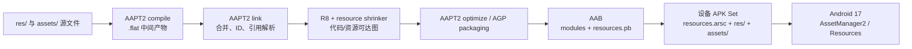

# 资源文件体积优化实战

资源优化很容易退化成一张格式替换清单：PNG 转 WebP、删几套屏幕密度资源、打开 `shrinkResources`。这张清单没有回答三个工程问题：引用图能否证明待删除资源不可达、最低系统版本能否解码新格式、AAB（Android App Bundle，供 Google Play 生成设备 APK 的发布包）上传体积与单设备下载量是否用了同一口径。

平台锚点为 Android 17 / API 37 / `android-17.0.0_r1`，构建工具行为采用 2026 年 8 月的 Android Developers 文档语义。AAPT2（Android Asset Packaging Tool 2，Android 资源编译与链接工具）、AGP 与 R8 的版本独立于 Android 平台版本；Android 17 只消费构建后的资源表，不会替应用压缩图片或删除无用资源。

## 先把资源字节分成四类

发布 APK 中与资源有关的字节主要分布在：

| 位置 | 主要内容 | 分析重点 |
|---|---|---|
| `resources.arsc` | APK 内的二进制资源表，保存 `res/values` 编译结果、资源 ID、配置、字符串池和文件路径 | 资源条目（entry）数量、配置数量、名称/值字符串、表编码 |
| `res/` | 二进制 XML、图片、字体和其他编译资源 | 单文件大小、重复内容、屏幕密度（density）/版本等目录限定符 |
| `assets/` | 保留目录层级和文件名的原始素材 | 压缩方式、运行时读取协议、是否可按需交付 |
| APK/AAB 元数据 | 应用清单（manifest）、Protocol Buffer 编码的资源表、拆分配置和签名 | 上传包、设备 APK Set 与安装字节口径 |

资源 ID 本身是 32 位整数，常用形式可写作 `0xpptteeee`：`pp`、`tt`、`eeee` 分别表示资源包（package）、类型（type）和条目（entry）字段。“资源 ID 很复杂”不会让一个条目突然变大；体积通常来自条目数量、每个条目的配置变体、字符串池、文件内容和表中空洞或编码方式。

同一个图片还可能出现三种不同数字：

- 源文件大小：设计仓库或 `src/main/res` 中的字节；
- APK ZIP 条目（entry）的原始大小和压缩大小：AAPT2 与打包后的贡献；
- 某台设备的 APK Set 下载大小：APK Set 是按一份设备配置生成的一组 APK，这里记录经过屏幕密度和语言拆分后的交付贡献。

持续集成（CI）应保存这三种数字。只看 Git 中图片大小，会漏掉 AAPT2 转换、ZIP 压缩、重复打包与设备配置。

## AAPT2 从源资源到运行时资源表

AAPT2 的主流程可拆成三个阶段：

1. `compile`：逐文件解析资源；`res/values` 生成 `.arsc.flat`，其他 XML 生成二进制 XML 中间文件，图片等资源也生成 `.flat`；
2. `link`：合并应用、构建变体覆盖层（variant overlay）与依赖资源，分配资源 ID，解析引用，生成应用清单、资源表和 APK/AAB 模块输入；
3. `optimize`：根据构建配置执行表编码、资源路径缩短、配置拆分等优化。

下面的图用于区分 AAPT2、R8/资源缩减、App Bundle 和 Android 17 运行时的职责：



`compile` 的逐文件中间产物有利于增量构建，不能拿 `.flat` 目录总量当发布体积。`link` 处理资源覆盖（overlay）与 ID；资源缩减处理可达性；App Bundle 决定某个设备获取哪些配置。四个阶段的问题要用不同证据定位。

### 资源合并不是内容去重器

AGP 遇到名称、类型和目录限定符（qualifier）完全相同的资源时，会按依赖、主源码集（main source set）、构建类型和产品变体覆盖层的优先级选择一个定义，再交给 AAPT2。它不会扫描所有不同名称的 PNG/WebP，再按内容哈希值（hash）自动改写引用并合并文件。

重复资源应分成两类：

- 定义冲突：同一资源键在不同源码集或依赖里有多个候选，按 overlay 规则选择；
- 内容重复：`banner_home.webp` 与 `banner_feed.webp` 字节相同但资源名不同，需要用哈希值检测，并在人工确认语义后统一引用。

内容相同也不一定能合并。不同名称可能是未来独立替换的产品契约，或被服务端、测试、主题引擎按名称查找。去重前要检查动态引用与发布协议。

## `resources.arsc` 的体积从哪里来

Android 17 的 `ResourceTypes.h` 定义了资源表常见二进制块（chunk）：

- `ResStringPool`：资源值、路径、类型名和 entry 名等字符串；
- `ResTable_package`：一个资源包的边界；
- `ResTable_typeSpec`：某类资源条目的配置标志；
- `ResTable_type`：特定配置下的条目偏移与值；
- `ResTable_entry` / `Res_value`：资源条目与简单值；
- map/bag：用于保存 `style`、数组、复数和属性等复合值的键值容器。

一个 `string` 资源不只占一条字符串。它还需要资源包、类型、条目索引、配置数据和字符串池引用。一个 `style` 包含很多子项，或者同一资源拥有大量语言、夜间模式和尺寸变体，都会增加表结构与值。

### 配置变体是乘数

这些资源目录限定符会让同一资源 ID 拥有多个候选：

- 语言区域（locale）：`values-zh-rCN`、`values-en`；
- 屏幕密度（density）：`drawable-xhdpi`、`drawable-xxhdpi`；
- 夜间模式（night）：`values-night`、`drawable-night`；
- 最小宽度/方向：`values-sw600dp`、`layout-land`；
- API 级别：`values-v31`、`drawable-v31`。

限定符不是冗余的同义词；它们表达运行时选择规则。删掉某个候选后，Resources 会回退到其他匹配项，可能产生缩放、布局、颜色或语言错误。每次裁剪都要在对应配置设备上验证。

### 字符串池与资源名

长资源名、长文件路径和大量互不复用的字符串会扩大键名、路径和值的字符串池。AAPT2 `optimize` 提供 `--collapse-resource-names`、`--shorten-resource-paths` 和 `--enable-sparse-encoding` 等能力：

- 名称折叠（collapse）可以让允许处理的资源键共享更短表示；
- 路径缩短（path shortening）会改写 APK 内资源文件路径，并生成映射；
- 稀疏编码（sparse encoding）用更紧凑的方式保存稀疏条目偏移，代价是单次查找可能略慢；
- `resources.cfg` 可对特殊资源声明 `no_collapse` 等指令。

这些改写发生在构建期的资源链接与打包阶段。若项目通过 `Resources.getIdentifier()`、插件协议、WebView/服务端下发名称或独立工具读取资源名，就要建立白名单和兼容测试。

### 用 AAPT2 查看发布资源

下面的命令用于打印资源表、某个二进制 XML 和 APK 文件列表：

```bash
AAPT2="$ANDROID_HOME/build-tools/37.0.0/aapt2"
APKANALYZER="$ANDROID_HOME/cmdline-tools/latest/bin/apkanalyzer"
APK_PATH="app/build/outputs/apk/release/app-release.apk"

"$AAPT2" dump resources "$APK_PATH"
"$AAPT2" dump xmltree "$APK_PATH" \
  --file res/layout/activity_main.xml
"$APKANALYZER" files list "$APK_PATH"
```

`aapt2` 位于 SDK Build Tools，`apkanalyzer` 则由 SDK Command-Line Tools 提供，不能把两者拼到同一个目录。这里的 `37.0.0` 与 `latest` 都是路径占位；AGP 9.3 发布说明列出的 Build Tools 最低和默认版本均为 36.0.0，项目应替换成已安装并固定的实际版本。`dump resources` 适合核对资源包、类型、条目和配置，`xmltree` 可确认 APK 中的 XML 已被编译，文件列表用于找大文件与意外目录。大规模 CI 应保存结构化报告，不要依赖面向人工阅读的完整 dump 文本。

下面的命令用于比较两个 APK 的资源与文件差异：

```bash
"$AAPT2" diff previous-release.apk app-release.apk
"$APKANALYZER" apk compare \
  --different-only \
  --files-only \
  previous-release.apk \
  app-release.apk
```

`aapt2 diff` 判断两个 APK 是否存在差异，`apkanalyzer apk compare` 则直接列出文件大小变化。两者都要求发布构建条件一致，否则签名、压缩、资源 ID 重排和工具版本变化会制造噪声；出现差异后仍要结合 `dump resources`、文件哈希值和资源缩减报告解释原因。

## 资源缩减：先让代码引用图可靠

资源缩减依赖代码缩减。资源只被一段已删除代码引用时，工具需要先知道那段代码不可达，才能继续删除资源。AGP 9.3 之前使用的旧版 DSL（领域专用配置语法）可按这份发布基线配置：

```kotlin
android {
    buildTypes {
        release {
            isMinifyEnabled = true
            isShrinkResources = true
            proguardFiles(
                getDefaultProguardFile("proguard-android-optimize.txt"),
                "proguard-rules.pro",
            )
        }
    }
}
```

`isMinifyEnabled` 打开 R8 的代码缩减、优化和混淆，`isShrinkResources` 打开资源缩减。AGP 8.12/8.13 可用 `android.r8.optimizedResourceShrinking=true` 选择协同资源缩减流水线；AGP 9.0 起，在 `isShrinkResources=true` 时默认使用该流水线。

AGP 9.3+ 还提供统一的 `optimization` DSL：

```kotlin
android {
    buildTypes {
        release {
            optimization {
                enable = true
            }
        }
    }
}
```

这个配置同时启用代码与资源优化。团队应按当前 AGP 选择一种 DSL，不要把 9.3 的 `optimization` 配置块复制到旧插件项目。

### 协同资源缩减改变了什么

传统流程更容易把代码与资源当成分开的引用图，边界处需要保守的保留规则（keep rule）。协同资源缩减把代码和资源引用放进同一张图，可以识别“只被已删除代码引用”的资源，也能避免某些代码与资源互相保留。

这不会消除动态协议风险。以下入口仍要单独审计：

- `Resources.getIdentifier()`；
- 拼接 `drawable_`、`layout_` 等资源名；
- JNI、WebView、脚本、服务端配置或主题包传入名字；
- 通知、App Widget（桌面小组件）、应用快捷方式、清单元数据与 XML 间接引用；
- 通过反射读取构建生成的 `R` 类资源常量字段；
- 插件和热修系统持有稳定资源 ID/名称。

宽泛的 R8 保留规则还会间接保留代码中的资源引用。资源缩减率下降时，要同时检查代码保留规则、AAR 消费者规则（consumer rules）和 `tools:keep`。

### `tools:keep` 与 `tools:discard`

下面的文件可保存为 `res/raw/com.example.app.resources.keep.xml`，用于声明无法从静态图发现的动态资源和构建变体专用丢弃项：

```xml
<?xml version="1.0" encoding="utf-8"?>
<resources xmlns:tools="http://schemas.android.com/tools"
    tools:keep="@drawable/skin_*,@layout/server_page_*"
    tools:discard="@drawable/internal_preview_*" />
```

保留规则文件不会进入发布 APK，但规则具有全局作用域。文件名应包含资源包或模块前缀，降低库间冲突。`tools:discard` 适合“当前构建变体确定不用、但静态分析仍判为引用”的资源；如果运行时路径仍可能访问，强制丢弃会导致 `Resources.NotFoundException` 或空内容。

### Safe mode 与 strict mode

资源缩减器默认使用安全模式（safe mode），会从字符串常量推测动态引用，并可能保留一组名称匹配资源。严格模式（strict mode）只相信显式引用与保留规则：

```xml
<?xml version="1.0" encoding="utf-8"?>
<resources xmlns:tools="http://schemas.android.com/tools"
    tools:shrinkMode="strict"
    tools:keep="@drawable/skin_*,@layout/server_page_*" />
```

严格模式适合已经登记所有动态调用点、并有发布路径测试的项目。它不能作为“缩减率太低”的快速开关。迁移时应先记录安全模式额外保留的原因，再逐个消除字符串协议或补充精确的保留规则。

## 图片：格式、像素和解码成本一起评估

图片优化需要固定视觉质量、目标分辨率、色彩/透明度、解码时间与峰值内存。单看编码文件字节，容易选出下载更小但首屏解码更慢的方案。

### WebP

Android 8 / API 26 及以上平台均支持有损、无损与透明 WebP。常见迁移方式是：

- 照片、运营图评估有损 WebP；
- 透明插画比较无损 WebP 与 PNG；
- 对文字、二维码、细线和品牌色做像素/视觉验收；
- 保留 9-patch PNG 中定义拉伸区和内容区的元数据，不做普通格式替换；
- 动画资源单独评估帧数、解码器与播放需求。

“质量 80”没有跨编码器、跨图片的统一视觉含义。CI 可以保存编码器版本与参数，视觉验收使用代表图片集合、设备截图和必要的像素差阈值。

### AVIF 的版本边界

Android 12 / API 31 起支持 AVIF 图片。对 `minSdk 26` 的应用，不能把唯一一份首屏图片直接换成无限定 AVIF；低版本需要可解码的回退资源（fallback）。

下面的目录结构让 Android 12+ 选择 AVIF，Android 8—11 继续使用 WebP：

```text
src/main/res/drawable/hero.webp
src/main/res/drawable-v31/hero.avif
```

两份文件对应同一个 `R.drawable.hero`，`Resources` 按 API 级别限定符选择。这样会增加 AAB 上传总量，并让同一通用 APK（universal APK）同时携带两份；Google Play 的屏幕密度/语言拆分不会按 API 级别自动删除所有带版本限定符的回退资源，是否值得要用设备 APK Set 测量。

AVIF 的编码收益与解码代价依图片、编码器和设备实现变化。启动页、大图列表与动画要跑冷解码、滚动和内存测试；不能用桌面编码器的单张文件比值替代 Android 设备结果。

### VectorDrawable

VectorDrawable 适合图标、简单线条和少量路径（path）的可缩放图形，可以用一个 `anydpi` 资源替代多套位图。它不适合照片，复杂路径、裁剪区域（clip）和渐变也可能带来：

- XML/pathData 自身大于一张压缩位图；
- XML 解析并创建 Drawable（inflate）、曲线三角化（tessellation）和首次绘制成本；
- 多尺寸缓存与频繁着色（tint）的运行开销；
- 不同渲染器（renderer）和设备上的边缘与抗锯齿差异。

简单图形还可用形状（shape）、渐变（gradient）、状态选择器（selector）与内嵌 Drawable 表达。选择标准是“发布字节 + 首次显示 + 滚动/动画 + 视觉结果”，不能看到 SVG 就统一转换。

### 屏幕密度资源

Android 的屏幕密度回退规则会缩放邻近资源。删除某套密度资源可能减少 APK，但也可能增加运行时缩放、内存和视觉模糊。需要区分：

- `drawable-<density>`：位图具有密度语义，系统按目标密度缩放；
- `drawable-nodpi`：保持原像素，不参与密度缩放；
- `drawable-anydpi`：常用于 VectorDrawable 等与密度无关的资源；
- `mipmap-*`：启动器（launcher）图标等系统可能在应用外使用的资源。

一张响应式背景如果只需要按像素缩放，可评估 `nodpi`；要求精确线宽、阴影和像素对齐的素材仍可能需要多套。启动器图标和自适应图标（adaptive icon）要遵守平台与商店要求，不能按普通页面图片裁剪。

## 语言与其他限定符

### `localeFilters` 过滤语言

依赖库可能携带应用未支持的多国语言。下面的配置只把应用声明支持的语言纳入构建：

```kotlin
android {
    androidResources {
        localeFilters += listOf(
            "en",
            "zh-rCN",
            "b+zh+Hant",
        )
    }
}
```

`localeFilters` 自 AGP 8.8 起是应用语言过滤的当前 DSL。旧 `defaultConfig.resourceConfigurations` 已弃用，后续会移除。列表必须与产品翻译、`localeConfig` 支持语言清单和应用内语言选择一致；它会过滤依赖翻译，不会自动生成缺少的译文。误删后，`Resources` 会回退到默认字符串，造成界面混用语言。

`layout-land`、`values-night`、`sw600dp` 和版本限定符通常表达设备运行配置，不应套用语言过滤思路。AAB 默认针对语言、屏幕密度和 ABI 生成配置 APK（configuration APK）；屏幕方向、夜间模式或最小宽度等资源仍可能随目标模块交付。

### 应用内语言选择与语言拆分

Google Play 根据设备语言交付语言配置 APK。用户切换系统语言时，设备可从 Play 补装对应的拆分 APK。若应用提供独立于系统的语言选择器，有两种策略：

- 保持语言拆分，并通过 Play Core 请求所选语言；
- 禁用语言拆分，让所有支持语言随基础模块（base）或特性模块（feature）安装。

这段 AAB 配置关闭语言拆分，但保留屏幕密度和 ABI 拆分：

```kotlin
android {
    bundle {
        language {
            enableSplit = false
        }
        density {
            enableSplit = true
        }
        abi {
            enableSplit = true
        }
    }
}
```

关闭后首装下载会增加，离线语言切换更可靠。选择应由语言数量、离线需求、渠道能力和真实 APK Set 数据决定。

## `assets/`、`res/raw/` 与压缩策略

`assets/` 保留目录和文件名，通过 `AssetManager` 按路径读取；`res/raw/` 生成资源 ID，通过 `Resources` 打开。放在哪个目录不会自动让内容变小，差异在寻址协议、限定符、资源缩减可见性和打包压缩。

### 已压缩格式不要重复套通用压缩

JPEG、WebP、AVIF、MP3/AAC、部分视频、ZIP 等格式内部已经压缩，再套 APK 的 Deflate 通用压缩通常收益有限。`noCompress` 可以让指定扩展以未压缩条目（stored entry）打包，便于随机访问或直接映射，但下载字节可能增加。

调整前要比较：

- APK 条目的原始大小与压缩大小；
- 解压或解码 CPU、内存与首用延迟；
- 安装后是否产生额外副本；
- 是否需要随机定位（seek）、内存映射（`mmap`）或流式访问；
- Google Play 或 Play Asset Delivery（PAD）是否会重新压缩或分包。

不要把“7zip 重压签名 APK”当作标准发布阶段。APK 是有签名、对齐和安装语义的 ZIP；改写条目后必须重新执行受支持的打包、`zipalign` 与签名流程。把资产改为 Zstandard（zstd）还会引入解码器代码、内存和解压协议，只有成组测量有收益时才采用。

### JSON、词典与模型数据

大型 JSON 通常同时携带重复键名、空白、文本数字和解析成本。可评估：

- 构建时移除不需要字段和开发数据；
- 改成 Protocol Buffers、FlatBuffers 或自定义索引等带结构定义的二进制格式；
- 按业务区域或功能拆包；
- 首屏只保留索引，详情按需加载；
- 保存数据结构版本、内容哈希值和生成工具版本，支持升级与回滚。

二进制格式不保证更小；小数据可能被结构描述和索引开销抵消。选择要覆盖体积、解析速度、随机访问、兼容和调试。

### 音频与视频

媒体资源要从采样率、声道、码率、时长、循环点和硬件/系统解码支持入手。把提示音从立体声（stereo）改为单声道（mono）可能合理，把音乐或空间音频一律改单声道会破坏产品效果。

`res/raw` 内的媒体随安装包交付，低频长音频或教程视频更适合 CDN（内容分发网络）、动态特性模块（Dynamic Feature）或资产包（Asset Pack）。网络方案需要占位、缓存、校验、弱网和离线设计，不能只删除本地文件。

## 字体：字形集合和交付方式

完整的中日韩（CJK）字体可能成为资源目录最大文件。先统计每个字体的页面、语言、字重与斜体，再选择：

- 字符稳定的品牌数字、英文标题或图标字体可做字体子集（subset）；
- 多个静态字重可评估可变字体（variable font），Android 8/API 26 起支持；
- 低频字体可使用可信的字体提供方（Font Provider）或业务下载；
- 首屏和离线场景保留系统字体或随包回退字体；
- 字体许可证必须允许制作子集、重分发或远程提供。

字体子集需要保存字符清单、OpenType 排版特性、输入字体哈希值、工具版本和输出哈希值。只扫描现有文案会漏掉服务端文本、用户输入、日期数字、货币符号、emoji 回退字体与无障碍内容。

可变字体用一个文件承载字重、字宽和倾斜度等变化轴（axis），可能小于多份静态字体的总量，也可能因保留大量字形（glyph）和变化表而仍然较大。要比较产品实际使用的字形与变化轴，不能按文件数量判断。

Downloadable Fonts 把字体从 APK 转由字体提供方交付，不等于没有成本。首次请求、提供方可用性、证书、缓存、离线与隐私或渠道限制都要测试。

## 资源路径缩短与第三方混淆

AndResGuard 等工具通常改写资源路径、名称、`resources.arsc` 与 ZIP 压缩。它们不是 R8 的同义词，也不是 Android 运行时的公开优化 API。引入前至少验证：

- 启动器、通知、App Widget、应用快捷方式与清单资源；
- `getIdentifier()`、反射 R 字段、JNI 与 WebView 协议；
- Dynamic Feature、语言/屏幕密度拆分与 `bundletool`；
- 资源热修、换肤、渠道重签和增量更新；
- APK 签名方案、`zipalign` 与 Native 库 ZIP 条目的 16 KB 对齐；
- 映射文件（mapping）保存，以及崩溃和监控事件中的资源名还原。

AAPT2 自身已有资源名折叠、路径缩短和稀疏编码能力。应优先让 AGP 管理官方构建流程；若手工调用 `aapt2 optimize`，必须在签名之前，并保留工具版本、配置和映射文件。

下面的命令展示 AAPT2 optimize 的三个独立开关：

```bash
aapt2 optimize \
  --enable-sparse-encoding \
  --collapse-resource-names \
  --shorten-resource-paths \
  --resource-path-shortening-map=resource-path-map.txt \
  -o optimized-unsigned.apk \
  linked-unsigned.apk
```

输出仍是未签名中间 APK。项目不能对 AGP 已生成并签名的发布包盲目再跑一次；Gradle 任务的输入输出、资源保留配置、`zipalign`、签名和安装测试都要纳入流水线。

## Dynamic Feature 与 Play Asset Delivery

动态特性模块可以包含代码、资源和 Native `.so` 库，适合完整的低频功能。基础模块不能引用尚未安装的特性模块实现；资源与页面代码应一起移动，避免基础模块仍保留一份占位大图或完整文案。

Play Asset Delivery 面向游戏和大型应用素材，资产包不能包含可执行代码。三种模式的边界是：

| 模式 | 交付时机 | 应用假设 |
|---|---|---|
| install-time（安装时） | 安装应用时 | 启动即可访问，计入初装集合 |
| fast-follow（安装后自动下载） | 安装完成后自动开始 | 不阻塞进入应用，文件未必已到 |
| on-demand（按需） | 应用请求后 | 必须处理下载、失败、网络与空间 |

fast-follow 与 on-demand 资产包以归档文件（archive）交付，并在应用内部存储中展开；应用不能假定路径永远不变，也不应修改资产包内容。素材更新、清理和增量补丁（patch）依赖其完整性。

PAD、Dynamic Feature 和 CDN 是交付策略，资源缩减处理的是可达性。把未使用素材放进按需资产包仍然浪费全量下载和存储；应先删除无用素材，再决定剩余内容何时交付。

## 建立资源体积回归报告

每次比较至少固定：

1. AGP、R8、AAPT2、Gradle、JDK 与 Build Tools；
2. 发布变体（release variant）、产品风味（product flavor）、`minSdk`、目标设备和渠道；
3. 资源依赖、变体覆盖顺序（variant overlay）、生成资源与翻译输入；
4. 代码和资源缩减、保留/丢弃规则、AAPT2 `optimize` 与名称混淆；
5. AAB 拆分配置、Dynamic Feature、Asset Pack 与压缩配置；
6. 签名、`zipalign` 对齐、设备规格文件（device spec）和可重复构建条件。

### CI 应保存什么

| 制品或指标 | 用途 |
|---|---|
| APK、AAB、APKS 归档与 SHA-256 摘要 | APKS 是 `bundletool` 输出的 APK Set 归档；摘要让报告对应唯一发布输入 |
| `resources.arsc` 大小 | 观察表结构趋势 |
| `res/` / `assets/` 增长最多的文件 | 定位文件增量 |
| 按类型和配置统计的资源项数量 | 发现语言、密度、样式配置膨胀 |
| 资源缩减报告与保留规则文件 | 解释删除和保留 |
| 资源路径/名称映射表（mapping） | 支持诊断与协议兼容 |
| 代表设备规格对应的下载量 | 区分上传包与用户交付集合 |
| 图片视觉/解码基准 | 防止用质量和首帧换字节 |
| 多语言、多密度、夜间模式和平板测试 | 防止资源限定符回退错误 |

门禁可同时设置绝对预算和相对增量预算。资源总量不变也可能出现风险：默认字符串被删、夜间模式图片错误回退、低版本只剩 AVIF、语言拆分包未补装。这些问题只能通过发布产物测试发现。

### 一次资源增长排查

假设代表 64 位 ARM（arm64）、超高屏幕密度（xxhdpi）的简体中文设备 APK Set 增加 2 MB，可按下面顺序处理：

1. 用 `bundletool get-size total` 确认变化属于该设备交付集合；
2. 比较 APK 条目，区分增量来自 `resources.arsc`、`res/`、`assets/` 还是动态特性模块；
3. 若资源表增长，比较资源项、配置、字符串和样式；若文件增长，按路径和内容哈希排序；
4. 对照新增依赖、翻译、生成资源和资源覆盖关系；
5. 检查资源缩减是否关闭、保留规则是否扩大、R8 代码保留规则是否间接留下资源；
6. 对图片、字体和媒体做格式/内容归因；
7. 优化后运行低版本、语言、密度、夜间模式、平板、动态资源和离线测试；
8. 保存 APK Set、映射表、报告与视觉基准。

大图来自明确的产品功能时，可以接受有证据的增长，再从重复素材、未使用翻译或过宽的保留规则中削减。直接修改 `resources.arsc` 二进制字节不应成为常规补救措施。

## Android 17 源码边界

Android 17 的 [`ResourceTypes.h`](https://android.googlesource.com/platform/frameworks/base/+/refs/tags/android-17.0.0_r1/libs/androidfw/include/androidfw/ResourceTypes.h) 定义二进制 XML、字符串池（string pool）与资源表数据块（resource table chunk）。[`AssetManager2.cpp`](https://android.googlesource.com/platform/frameworks/base/+/refs/tags/android-17.0.0_r1/libs/androidfw/AssetManager2.cpp) 组合 APK 资产、加载资源表，并按设备配置查找资源值。

AAPT2 的 [`ResourceTable.cpp`](https://android.googlesource.com/platform/frameworks/base/+/refs/tags/android-17.0.0_r1/tools/aapt2/ResourceTable.cpp) 管理资源包、类型、资源项和按配置区分的值。它属于构建期工具源码；设备上的 `AssetManager2` 读取编译结果。AAPT2 的增量编译优化不等同于 Android 17 应用运行时行为变化。

Android 17 / API 37 没有向应用提供一个“调用后自动缩小资源”的 API。体积优化发生在素材、引用图、AAPT2/AGP/R8 和分发阶段，运行时只按已安装资源表与配置选择候选。

这些结论不依赖 Linux 内核专有机制，也不关联文件系统压缩或某个 CPU 调频策略（governor）。资源文件读取会经过虚拟文件系统（VFS）和页缓存（page cache），但资源格式、限定符与缩减结果由 Android 工具链和框架层决定。

## 常见错误

### 把 `resources.arsc` 当成图片压缩包

它主要保存资源表、`values` 资源和文件路径。图片字节通常位于 APK 的 `res/` 条目中，二者要分开统计。

### 认为 AAPT2 会按图片内容自动去重

资源合并处理相同资源键和覆盖关系。不同名称但内容哈希相同的文件，仍需由工程侧确认语义后统一引用。

### 给 `minSdk 26` 应用只留 AVIF

AVIF 平台支持从 Android 12（API 31）开始。低版本要提供 WebP/PNG 回退资源，或由应用自行解码。

### 把 VectorDrawable 用于复杂照片

VectorDrawable 适合路径图形。复杂路径可能扩大 XML，并增加资源实例化（inflate）和绘制成本。

### 打开严格资源缩减模式后只测启动

动态主题、通知、桌面小组件（widget）、服务端下发页面和低频特性可能数天后才访问资源。测试必须覆盖这些动态访问约定。

### 删除一套密度资源就认定没有性能代价

系统会回退并缩放其他密度的资源。下载量、清晰度、解码内存和绘制成本要一起测量。

### 关闭语言拆分却仍按 AAB 默认收益估算

所有语言进入基础模块或动态特性模块后，设备下载集合会变化。要重新生成 APK Set 再估算。

### 把 `assets/` 改名成 `res/raw/` 当作压缩

目录改变寻址和编译语义，内容字节不会因此自动变小。

### 对签名 APK 再跑 7zip 或 AAPT2

ZIP 条目发生变化会破坏签名和对齐。所有转换必须进入受支持的签名前构建阶段。

### 只保留资源映射表，不保存发布包

资源映射表必须与同一次构建的二进制和资源表绑定。工具版本相同也不能替代原发布 APK/APKS。

## 版本演进

| 版本 | 与资源体积相关的边界 |
|---|---|
| Android 5.0（API 21） | 平台支持拆分 APK；AAB 后来以此为基础按设备配置交付资源 |
| Android 8.0（API 26） | 本文适用范围的最低版本；平台支持随应用打包或下载的字体，以及可变字体使用场景 |
| Android 12（API 31） | 平台支持 AVIF 图片，低版本仍需回退资源 |
| Android 13（API 33） | 提供系统级应用语言设置；语言清单与拆分策略需要协同配置 |
| AGP 8.8 | `resourceConfigurations` 弃用；应用语言过滤迁移到 `androidResources.localeFilters` |
| AGP 8.12/8.13 | 可显式启用协同资源缩减流程 |
| AGP 9.0 | 使用旧版 DSL 启用资源缩减时，默认采用协同资源缩减流程 |
| AGP 9.3 | 新的 `optimization` DSL 同时启用代码与资源优化 |
| Android 17（API 37） | `android-17.0.0_r1` 延续二进制资源表和 `AssetManager2` 配置选择模型，没有应用侧自动缩减资源的 API |

版本表同时包含平台和构建工具，是为了说明资源格式兼容与构建能力的不同边界。不能用 AGP 版本推导设备解码格式，也不能用 Android 版本推导项目是否打开资源缩减。

## 延伸阅读与源码锚点

- [25.6 APK 体积分析与瘦身](06-apk-analysis.md)：APK 结构与总体分析入口。
- [25.7 R8 与资源优化](07-r8-resource-optimization.md)：代码保留规则与资源缩减如何协作。
- [25.8 App Bundle 与动态交付](08-app-bundle-delivery.md)：配置 APK、Dynamic Feature 与 PAD 的交付边界。
- [25.17 DEX 体积优化](17-dex-size-optimization.md)：代码引用图与 R8 诊断。
- [25.18 Native SO 体积优化](18-native-so-size-optimization.md)：ABI、ELF 与 16 KB 对齐。

一手资料：

- [AGP 9.3 release notes](https://developer.android.com/build/releases/agp-9-3-0-release-notes)：当前稳定版的兼容范围与资源优化变更。
- [AGP API updates](https://developer.android.com/build/releases/gradle-plugin-api-updates)：AGP 8.8—9.3 资源 DSL 的迁移路径。
- [AAPT2 command reference](https://developer.android.com/tools/aapt2)：compile、link、dump、diff 与 optimize。
- [apkanalyzer command reference](https://developer.android.com/tools/apkanalyzer)：命令位置、APK 文件列表与体积比较。
- [Enable app optimization](https://developer.android.com/topic/performance/app-optimization/enable-app-optimization)：AGP 8.12—9.3 的协同资源缩减（optimized resource shrinking）。
- [Customize resources to keep](https://developer.android.com/topic/performance/app-optimization/customize-which-resources-to-keep)：`tools:keep`、`tools:discard` 与资源缩减 DSL。
- [Tools attributes](https://developer.android.com/studio/write/tool-attributes)：safe/strict resource shrink mode。
- [Reduce app size](https://developer.android.com/topic/performance/reduce-apk-size)：APK 资源结构、WebP、VectorDrawable 与屏幕密度。
- [Reduce image download sizes](https://developer.android.com/develop/ui/views/graphics/reduce-image-sizes)：AVIF 的 Android 12 支持边界与图片编码。
- [App Bundle format](https://developer.android.com/guide/app-bundle/app-bundle-format)：语言和屏幕密度配置 APK。
- [Configure the base module](https://developer.android.com/guide/app-bundle/configure-base)：AAB split 控制与应用内语言。
- [Play Asset Delivery](https://developer.android.com/guide/playcore/asset-delivery)：install-time、fast-follow、on-demand 与非代码资产边界。
- [Font resources](https://developer.android.com/guide/topics/resources/font-resource)：bundled 与 downloadable font。
- [Variable fonts in Compose](https://developer.android.com/develop/ui/compose/text/fonts#variable-fonts)：Android 8+ variable font。
- [ApplicationAndroidResources](https://developer.android.com/reference/tools/gradle-api/9.3/com/android/build/api/dsl/ApplicationAndroidResources)：`localeFilters` 与资源打包 DSL。
- [AOSP `ResourceTypes.h` @ Android 17](https://android.googlesource.com/platform/frameworks/base/+/refs/tags/android-17.0.0_r1/libs/androidfw/include/androidfw/ResourceTypes.h)：二进制 XML 与资源表数据块。
- [AOSP `AssetManager2.cpp` @ Android 17](https://android.googlesource.com/platform/frameworks/base/+/refs/tags/android-17.0.0_r1/libs/androidfw/AssetManager2.cpp)：运行时资源表加载与配置选择。
- [AOSP `ResourceTable.cpp` @ Android 17](https://android.googlesource.com/platform/frameworks/base/+/refs/tags/android-17.0.0_r1/tools/aapt2/ResourceTable.cpp)：AAPT2 构建期资源模型。
