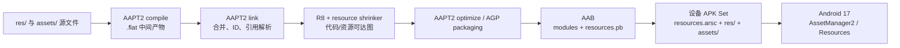

# 资源文件体积优化实战

资源优化很容易变成一张格式替换清单：PNG 转 WebP、删几套 density、打开 `shrinkResources`。这张清单没有回答三个工程问题：删掉的资源是否真的不可达、某个格式在最低系统版本能否解码、AAB 上传体积与单设备下载量是否用了同一口径。

平台锚点为 Android 17 / API 37 / `android-17.0.0_r1`，构建工具行为采用 2026 年 7 月的 Android Developers 文档语义。AAPT2、AGP 与 R8 的版本独立于 Android 平台版本；Android 17 运行资源表，不会替应用自动压缩图片或删除无用资源。

## 先把资源字节分成四类

发布 APK 中与资源有关的字节主要分布在：

| 位置 | 主要内容 | 分析重点 |
|---|---|---|
| `resources.arsc` | `res/values` 编译结果、资源 ID、配置、字符串池和文件路径 | entry 数量、配置数量、名称/值字符串、表编码 |
| `res/` | 二进制 XML、图片、字体和其他编译资源 | 单文件大小、重复内容、density/version 等限定符 |
| `assets/` | 保留目录层级和文件名的原始素材 | 压缩方式、运行时读取协议、是否可按需交付 |
| APK/AAB 元数据 | manifest、resource table proto、split 配置和签名 | 上传、设备 APK Set 与安装字节口径 |

资源 ID 本身是 32 位整数，常用形式可写作 `0xpptteeee`：package、type 和 entry 分别占据相应字段。“资源 ID 很复杂”不会让一个条目突然变大；体积通常来自资源条目数量、每个条目的配置变体、字符串池、文件内容和表中空洞/编码方式。

同一个图片还可能出现三种不同数字：

- 源文件大小：设计仓库或 `src/main/res` 中的字节；
- APK ZIP entry 的原始/压缩大小：AAPT2 与打包后的贡献；
- 某台设备 APK Set 中的下载大小：经过 density/language split 后的交付贡献。

CI 应保存这三种数字。只看 Git 中图片大小，会漏掉 AAPT2 转换、ZIP 压缩、重复打包与设备配置。

## AAPT2 从源资源到运行时资源表

AAPT2 的主流程可拆成三个阶段：

1. `compile`：逐文件解析资源；`res/values` 生成 `.arsc.flat`，其他 XML 生成二进制 XML 中间文件，图片等资源也生成 `.flat`；
2. `link`：合并应用、variant overlay 与依赖资源，分配资源 ID，解析引用，生成 manifest、资源表和 APK/AAB 模块输入；
3. `optimize`：根据构建配置执行表编码、资源路径缩短、配置拆分等优化。

下面的图用于区分 AAPT2、R8/资源缩减、App Bundle 和 Android 17 runtime 的职责：



`compile` 的逐文件中间产物有利于增量构建，不能拿 `.flat` 目录总量当发布体积。`link` 处理 overlay 与 ID；资源缩减处理可达性；App Bundle 决定某个设备获取哪些配置。四个阶段的问题要用不同证据定位。

### 资源合并不是内容去重器

AGP 遇到 name、type、qualifier 完全相同的资源时，按依赖、main source set、build type/flavor overlay 的优先级选择一个定义，再交给 AAPT2。它没有承诺扫描所有不同名称的 PNG/WebP，按内容 hash 自动改写引用并合并文件。

重复资源应分成两类：

- 定义冲突：同一资源键在不同 source set/依赖里有多个候选，按 overlay 规则选择；
- 内容重复：`banner_home.webp` 与 `banner_feed.webp` 字节相同但资源名不同，需要 hash 检测、人工确认语义后统一引用。

内容相同也不一定能合并。不同名称可能是未来独立替换的产品契约，或被服务端、测试、主题引擎按名称查找。去重前要检查动态引用与发布协议。

## `resources.arsc` 的体积从哪里来

Android 17 的 `ResourceTypes.h` 定义了资源表常见 chunk：

- `ResStringPool`：资源值、路径、类型名和 entry 名等字符串；
- `ResTable_package`：一个资源 package 的边界；
- `ResTable_typeSpec`：某个资源 type 的 entry 配置标志；
- `ResTable_type`：特定 configuration 下的 entry offset 与值；
- `ResTable_entry` / `Res_value`：资源条目与简单值；
- map/bag：style、array、plurals、attribute 等复合值。

一个 `string` 资源只占一条字符串并不准确。它还需要 package/type/entry 索引、configuration 数据和字符串池引用。一个 style 的 item 很多、同一资源拥有大量 locale/night/size 变体，都会增加表结构与值。

### 配置变体是乘数

下面这些限定符会让同一资源 ID 拥有多个候选：

- locale：`values-zh-rCN`、`values-en`；
- density：`drawable-xhdpi`、`drawable-xxhdpi`；
- night：`values-night`、`drawable-night`；
- smallest width / orientation：`values-sw600dp`、`layout-land`；
- API level：`values-v31`、`drawable-v31`。

限定符不是冗余的同义词；它们表达运行时选择规则。删掉某个候选后，Resources 会回退到其他匹配项，可能产生缩放、布局、颜色或语言错误。每次裁剪都要在对应配置设备上验证。

### 字符串池与资源名

长资源名、长文件路径和大量互不复用的字符串会扩大 key/path/value string pool。AAPT2 `optimize` 提供 `--collapse-resource-names`、`--shorten-resource-paths` 和 `--enable-sparse-encoding` 等能力：

- collapse 可以让允许处理的 key 名共享更短表示；
- path shortening 会改写 APK 内资源文件路径，并生成映射；
- sparse encoding 用更紧凑的方式保存稀疏 entry offset，代价是单次查找可能略慢；
- `resources.cfg` 可对特殊资源声明 `no_collapse` 等指令。

这些是 static linker/packager 级改写。通过 `Resources.getIdentifier()`、插件协议、WebView/服务端下发名称或独立工具读取资源名的项目，必须建立白名单和兼容测试。

### 用 AAPT2 查看发布资源

下面的命令用于打印资源表、某个二进制 XML 和 APK 文件列表：

```bash
AAPT2="$ANDROID_HOME/build-tools/37.0.0/aapt2"
APKANALYZER="$ANDROID_HOME/cmdline-tools/latest/bin/apkanalyzer"
APK_PATH="app/build/outputs/apk/release/app-release.apk"

"$AAPT2" dump resources "$APK_PATH"
"$AAPT2" dump xmltree "$APK_PATH" \
  --file res/layout/activity_main.xml
"$APKANALYZER" files list "$APK_PATH"
```

`aapt2` 位于 SDK Build Tools，`apkanalyzer` 则由 SDK Command-Line Tools 提供，不能把两者拼到同一个目录。这里的 `37.0.0` 与 `latest` 都是路径示例；可重复构建应记录并固定实际安装版本。`dump resources` 适合核对 package/type/entry/config，`xmltree` 证明 APK 中 XML 已是编译格式，文件列表用于找大文件与意外目录。大规模 CI 应保存结构化报告，避免解析面向人的完整 dump。

下面的命令用于比较两个 APK 的资源与文件差异：

```bash
"$AAPT2" diff previous-release.apk app-release.apk
"$APKANALYZER" apk compare \
  --different-only \
  --files-only \
  previous-release.apk \
  app-release.apk
```

`aapt2 diff` 判断两个 APK 是否存在差异，`apkanalyzer apk compare` 则直接列出文件大小变化。两者都要求 release 条件一致，否则签名、压缩、资源 ID 重排和工具版本变化会制造噪声；出现差异后仍要结合 `dump resources`、文件 hash 和资源缩减报告解释原因。

## 资源缩减：先让代码引用图可靠

资源缩减依赖代码缩减。资源只被一段已删除代码引用时，工具需要先知道那段代码不可达，才能继续删除资源。旧版 legacy DSL 的 release 基线如下：

```kotlin
android {
    buildTypes {
        release {
            isMinifyEnabled = true
            isShrinkResources = true
            proguardFiles(
                getDefaultProguardFile("proguard-android-optimize.txt"),
                "proguard-rules.pro",
            )
        }
    }
}
```

`isMinifyEnabled` 打开 R8 的 shrinking/optimization/obfuscation，`isShrinkResources` 打开资源缩减。AGP 8.12/8.13 可用 `android.r8.optimizedResourceShrinking=true` 选择新流水线；AGP 9.0 起，在 `isShrinkResources=true` 时默认使用 optimized resource shrinking。

AGP 9.3+ 还提供统一的 optimization DSL：

```kotlin
android {
    buildTypes {
        release {
            optimization {
                enable = true
            }
        }
    }
}
```

这个配置同时启用代码与资源优化。团队应按当前 AGP 选择一种 DSL，不要把 9.3 的 `optimization` block 复制到旧插件项目。

### Optimized resource shrinking 改变了什么

传统流程更容易把代码与资源当成分开的引用图，边界处需要保守 keep。optimized resource shrinking 把代码和资源引用放进协作图中，可以识别“只被已删除代码引用”的资源，也能避免某些代码/资源互相保留。

这不会消除动态协议风险。以下入口仍要单独审计：

- `Resources.getIdentifier()`；
- 拼接 `drawable_`、`layout_` 等资源名；
- JNI、WebView、脚本、服务端配置或主题包传入名字；
- 通知、widget、shortcut、manifest metadata 与 XML 间接引用；
- 反射读取 `R` 字段；
- 插件和热修系统持有稳定资源 ID/名称。

宽泛的 R8 keep rule 还会间接保留代码中的资源引用。看到资源缩减率下降时，要同时检查代码 keep、AAR consumer rules 和 `tools:keep`。

### `tools:keep` 与 `tools:discard`

下面的文件可保存为 `res/raw/com.example.app.resources.keep.xml`，用于声明无法从静态图发现的动态资源和 variant 专用丢弃项：

```xml
<?xml version="1.0" encoding="utf-8"?>
<resources xmlns:tools="http://schemas.android.com/tools"
    tools:keep="@drawable/skin_*,@layout/server_page_*"
    tools:discard="@drawable/internal_preview_*" />
```

keep 文件不会进入发布 APK，但规则具有全局作用域。文件名应包含 package/模块前缀，降低库间冲突。`tools:discard` 适合“当前 variant 确定不用、但静态分析仍判为引用”的资源；如果运行时路径仍可能访问，强制 discard 会变成 `Resources.NotFoundException` 或空内容。

### Safe mode 与 strict mode

资源缩减器默认 safe mode 会从字符串常量推测动态引用，并可能保留一组名称匹配资源。strict mode 只相信显式引用与 keep：

```xml
<?xml version="1.0" encoding="utf-8"?>
<resources xmlns:tools="http://schemas.android.com/tools"
    tools:shrinkMode="strict"
    tools:keep="@drawable/skin_*,@layout/server_page_*" />
```

strict mode 适合已经登记所有动态调用点、并有 release 路径测试的项目。它不能作为“缩减率太低”的快速开关。迁移时应先记录 safe mode 额外保留的原因，再逐个消除字符串协议或补精确 keep。

## 图片：格式、像素和解码成本一起评估

图片优化需要固定视觉质量、目标分辨率、色彩/透明度、解码时间与峰值内存。单看编码文件字节，容易选出下载更小但首屏解码更慢的方案。

### WebP

Android 8 / API 26 及以上平台均支持有损、无损与透明 WebP。常见迁移方式是：

- 照片、运营图评估有损 WebP；
- 透明插画比较无损 WebP 与 PNG；
- 对文字、二维码、细线和品牌色做像素/视觉验收；
- 保留 9-patch PNG 的 stretch/content 元数据，不做普通格式替换；
- 动画资源单独评估帧数、解码器与播放需求。

“质量 80”没有跨编码器、跨图片的统一视觉含义。CI 可以保存编码器版本与参数，视觉验收使用代表图片集合、设备截图和必要的像素差阈值。

### AVIF 的版本边界

Android 12 / API 31 起支持 AVIF 图片。对 `minSdk 26` 的应用，不能把唯一一份首屏图片直接换成无限定 AVIF；低版本需要可解码的 fallback。

下面的目录结构让 Android 12+ 选择 AVIF，Android 8—11 继续使用 WebP：

```text
src/main/res/drawable/hero.webp
src/main/res/drawable-v31/hero.avif
```

两份文件对应同一个 `R.drawable.hero`，Resources 按 API qualifier 选择。这样会增加 AAB 上传总量，并让同一 universal APK 同时携带两份；Google Play 的 density/language split 不会按 API level 自动删掉所有 version-qualified fallback，是否值得要用设备 APK Set 测量。

AVIF 的编码收益与解码代价依图片、编码器和设备实现变化。启动页、大图列表与动画要跑冷解码、滚动和内存测试；不能用桌面编码器的单张文件比值替代 Android 设备结果。

### VectorDrawable

VectorDrawable 适合图标、简单线条、少量 path 的可缩放图形，可以用一个 `anydpi` 资源替代多套 raster。它不适合照片，复杂 path、clip 和渐变也可能带来：

- XML/pathData 自身大于一张压缩位图；
- inflate、tessellation 和首次绘制成本；
- 多尺寸缓存与频繁 tint 的运行开销；
- 不同 renderer/设备上的边缘与抗锯齿差异。

简单图形还可用 shape、gradient、selector 与 inset drawable 表达。选择标准是“发布字节 + 首次显示 + 滚动/动画 + 视觉结果”，不是看到 SVG 就统一转换。

### density 资源

Android density fallback 会缩放邻近资源。删除某套 density 可能减少 APK，但也可能增加运行时缩放、内存和视觉模糊。需要区分：

- `drawable-<density>`：位图具有 density 语义，系统按目标 density 缩放；
- `drawable-nodpi`：保持原像素，不参与 density 缩放；
- `drawable-anydpi`：常用于 vector 等与 density 无关的资源；
- `mipmap-*`：launcher 图标等系统可能在应用外使用的资源。

一张响应式背景如果只需要按像素缩放，可评估 `nodpi`；要求精确线宽、阴影和像素对齐的素材仍可能需要多套。launcher/adaptive icon 要遵守平台与商店要求，不能按普通页面图片裁剪。

## 语言与其他限定符

### `localeFilters` 过滤语言

依赖库可能携带应用未支持的多国语言。下面的配置只把应用声明支持的语言纳入构建：

```kotlin
android {
    androidResources {
        localeFilters += listOf(
            "en",
            "zh-rCN",
            "b+zh+Hant",
        )
    }
}
```

`localeFilters` 自 AGP 8.8 起是应用语言过滤的当前 DSL。旧 `defaultConfig.resourceConfigurations` 已弃用，后续会移除。列表必须与产品翻译、localeConfig 和应用内语言选择一致；它会过滤依赖翻译，不会自动生成缺少的译文。误删后，Resources 会回退默认字符串，造成界面混用语言。

`layout-land`、`values-night`、`sw600dp` 和 version qualifier 通常表达设备运行配置，不应套用语言过滤思路。AAB 默认针对 language、screen density 和 ABI 生成 configuration APK；orientation、night 或 smallest-width 等资源仍可能随目标模块交付。

### 应用内语言选择与 language split

Google Play 根据设备语言交付 language configuration APK。用户切换系统语言时，Play 可补装对应 split。若应用提供独立于系统的语言选择器，有两种策略：

- 保持 language split，并通过 Play Core 请求所选语言；
- 禁用 language split，让所有支持语言随 base/feature 安装。

下面的 AAB 配置关闭 language split，但保留 density 和 ABI split：

```kotlin
android {
    bundle {
        language {
            enableSplit = false
        }
        density {
            enableSplit = true
        }
        abi {
            enableSplit = true
        }
    }
}
```

关闭后首装下载会增加，离线语言切换更可靠。选择应由语言数量、离线需求、渠道能力和真实 APK Set 数据决定。

## `assets/`、`res/raw/` 与压缩策略

`assets/` 保留目录和文件名，通过 `AssetManager` 按路径读取；`res/raw/` 生成资源 ID，通过 Resources 打开。放在哪个目录不会自动让内容变小，差异在寻址协议、限定符、资源缩减可见性和打包压缩。

### 已压缩格式不要重复套通用压缩

JPEG、WebP、AVIF、MP3/AAC、部分视频、ZIP 等格式内部已经压缩，APK Deflate 往往收益有限。`noCompress` 可以让指定扩展按 stored entry 打包，便于随机访问或直接映射，但下载字节可能增加。

调整前要比较：

- APK entry 的 raw/compressed size；
- 解压或解码 CPU、内存与首用延迟；
- 安装后是否产生额外副本；
- 是否需要随机 seek、mmap 或流式访问；
- Play/PAD 是否会重新压缩或分包。

不要把“7zip 重压签名 APK”当作标准发布阶段。APK 是有签名、对齐和安装语义的 ZIP；改写 entry 后必须重新执行受支持的打包、zipalign 与签名流程。把资产自定义为 zstd 也会引入 decoder 代码、内存和解压协议，只有成组测量有收益时才采用。

### JSON、词典与模型数据

大型 JSON 通常同时携带重复 key、空白、文本数字和解析成本。可评估：

- 构建时移除不需要字段和开发数据；
- 改成 protobuf/FlatBuffers/自定义索引等二进制格式；
- 按业务区域或功能拆包；
- 首屏只保留索引，详情按需加载；
- 保存 schema/version/hash，支持升级与回滚。

二进制格式不保证更小；小数据可能被 schema 和索引开销抵消。选择要覆盖体积、解析速度、随机访问、兼容和调试。

### 音频与视频

媒体资源要从采样率、声道、码率、时长、循环点和硬件/系统解码支持入手。把提示音从 stereo 改为 mono 可能合理，把音乐或空间音频一律改单声道会破坏产品效果。

`res/raw` 内的媒体随安装包交付，低频长音频或教程视频更适合 CDN、Dynamic Feature 或 Asset Pack。网络方案需要占位、缓存、校验、弱网和离线设计，不能只删除本地文件。

## 字体：字形集合和交付方式

完整 CJK 字体可能成为资源目录最大文件。先统计每个字体的页面、语言、字重与斜体，再选择：

- 字符稳定的品牌数字、英文标题或图标字体可做 subset；
- 多个静态字重可评估 variable font，Android 8/API 26 起支持；
- 低频字体可使用可信 Font Provider 或业务下载；
- 首屏和离线场景保留系统/随包 fallback；
- 字体 license 必须允许 subset、重分发或远程提供。

字体子集需要保存字符清单、OpenType feature、输入字体 hash、工具版本和输出 hash。只按当前文案扫描会漏掉服务端文本、用户输入、日期数字、货币符号、emoji fallback 与无障碍内容。

Variable font 用一个文件承载 weight/width/slant 等 axis，可能小于多份静态字体的总量，也可能因保留大量 glyph 和 variation table 仍然较大。要比较产品实际使用的字形和 axis，不能按文件数量判断。

Downloadable Fonts 把字体从 APK 转到 provider，不等于没有成本。首次请求、provider 可用性、证书、缓存、离线与隐私/渠道限制都要测试。

## 资源路径缩短与第三方混淆

AndResGuard 等工具通常改写资源路径、名称、`resources.arsc` 与 ZIP 压缩。它们不是 R8 的同义词，也不是 Android runtime 的公开优化 API。引入前至少验证：

- launcher、notification、widget、shortcut 与 manifest 资源；
- `getIdentifier()`、反射 R 字段、JNI 与 WebView 协议；
- Dynamic Feature、language/density split 与 bundletool；
- 资源热修、换肤、渠道重签和增量更新；
- APK Signature Scheme、zipalign 与 16 KB native entry；
- mapping 保存，以及 crash/埋点中资源名还原。

AAPT2 自身已有 resource name collapse、path shortening 与 sparse encoding 能力。优先让 AGP 管理官方链路；若手工调用 `aapt2 optimize`，必须在签名之前，并保留工具版本、配置和 mapping。

下面的命令展示 AAPT2 optimize 的三个独立开关：

```bash
aapt2 optimize \
  --enable-sparse-encoding \
  --collapse-resource-names \
  --shorten-resource-paths \
  --resource-path-shortening-map=resource-path-map.txt \
  -o optimized-unsigned.apk \
  linked-unsigned.apk
```

输出仍是未签名中间 APK。项目不能对 AGP 已生成并签名的 release 包盲目再跑一次；Gradle task 输入输出、资源保留配置、zipalign、签名和安装测试都要纳入流水线。

## Dynamic Feature 与 Play Asset Delivery

Dynamic Feature Module 可以包含代码、资源和 native 库，适合完整的低频功能。base 不能引用未安装 feature 的实现；资源与页面代码应一起移动，避免 base 仍保留一份占位大图或完整文案。

Play Asset Delivery 面向游戏/大型应用素材，asset pack 不能包含可执行代码。三种模式的边界是：

| 模式 | 交付时机 | 应用假设 |
|---|---|---|
| install-time | 安装应用时 | 启动即可访问，计入初装集合 |
| fast-follow | 安装完成后自动开始 | 不阻塞进入应用，文件未必已到 |
| on-demand | 应用请求后 | 必须处理下载、失败、网络与空间 |

fast-follow 与 on-demand pack 作为 archive 交付并在内部存储展开，应用不能假定路径永远不变，也不应修改 pack 内容。素材更新、清理和 patch 依赖其完整性。

PAD、Dynamic Feature 和 CDN 是交付策略，resource shrinking 是可达性优化。把未使用素材放进 on-demand pack 仍然浪费全量下载和存储；先删除，再决定剩余内容何时交付。

## 建立资源体积回归报告

每次比较至少固定：

1. AGP、R8、AAPT2、Gradle、JDK 与 Build Tools；
2. release variant、产品 flavor、`minSdk`、目标设备和渠道；
3. 资源依赖、variant overlay、生成资源与翻译输入；
4. code/resource shrinking、keep/discard、AAPT2 optimize 与混淆；
5. AAB split、Dynamic Feature、Asset Pack 与压缩配置；
6. 签名、zipalign、device spec 和可重复构建条件。

### CI 应保存什么

| 制品或指标 | 用途 |
|---|---|
| APK/AAB/APKS 与 SHA-256 | 让报告对应唯一发布输入 |
| `resources.arsc` 大小 | 观察表结构趋势 |
| `res/` / `assets/` top growth | 定位文件增量 |
| 按 type/config 的 entry 数 | 发现语言、density、style 膨胀 |
| 资源缩减报告与 keep 文件 | 解释删除和保留 |
| resource path/name mapping | 支持诊断与协议兼容 |
| 代表 device spec 下载量 | 区分上传包与用户交付 |
| 图片视觉/解码基准 | 防止用质量和首帧换字节 |
| 多语言、多 density、night、平板测试 | 防止 qualifier 回退错误 |

门禁可同时设置绝对预算和相对增量预算。资源总量不变也可能发生风险：默认字符串被删、night 图误回退、低版本只剩 AVIF、语言 split 未补装。这些只能由 release 产物测试发现。

### 一次资源增长排查

假设代表 arm64/xxhdpi/zh-CN 设备的 APK Set 增加 2 MB，可按下面顺序处理：

1. 用 `bundletool get-size total` 确认变化属于该设备交付集合；
2. 比较 APK entry，区分 `resources.arsc`、`res/`、`assets/` 或 feature；
3. 若表增长，比较 entry/config/string/style；若文件增长，按路径和 hash 排序；
4. 对照新依赖、翻译、生成资源和 overlay；
5. 检查资源缩减是否关闭、keep 是否扩大、R8 代码 keep 是否间接保留资源；
6. 对图片、字体和媒体做格式/内容归因；
7. 优化后运行低版本、语言、density、night、平板、动态资源和离线测试；
8. 保存 APK Set、mapping、报告与视觉基准。

大图来自合法功能时，可以接受有证据的增长，再从重复素材、未使用翻译或过宽 keep 中削减。手改 `resources.arsc` 字节不应成为普通补救。

## Android 17 源码边界

Android 17 的 [`ResourceTypes.h`](https://android.googlesource.com/platform/frameworks/base/+/refs/tags/android-17.0.0_r1/libs/androidfw/include/androidfw/ResourceTypes.h) 定义 binary XML、string pool 与 resource table chunk。[`AssetManager2.cpp`](https://android.googlesource.com/platform/frameworks/base/+/refs/tags/android-17.0.0_r1/libs/androidfw/AssetManager2.cpp) 组合 APK assets、加载资源表并按 configuration 查找值。

AAPT2 的 [`ResourceTable.cpp`](https://android.googlesource.com/platform/frameworks/base/+/refs/tags/android-17.0.0_r1/tools/aapt2/ResourceTable.cpp) 管理 package、type、entry 与 config value。它属于构建期工具源码；设备上的 `AssetManager2` 消费编译结果。不能把 AAPT2 增量编译优化写成 Android 17 应用运行时变化。

Android 17 / API 37 没有向应用提供一个“调用后自动缩小资源”的 API。体积优化发生在素材、引用图、AAPT2/AGP/R8 和分发阶段，运行时只按已安装资源表与配置选择候选。

这些结论不依赖 Linux kernel 专有机制，也不关联文件系统压缩或某个 governor。资源文件读取会经过通用 VFS/page cache，但资源格式、限定符与 shrink 结果由 Android 工具链和 framework 决定。

## 常见错误

### 把 `resources.arsc` 当成图片压缩包

它主要保存资源表、values 和文件路径。图片字节通常位于 APK `res/` entry，二者要分开统计。

### 认为 AAPT2 会按图片内容自动去重

资源合并处理相同键与 overlay。不同名称、相同 hash 的文件仍需工程侧确认语义并统一引用。

### 给 `minSdk 26` 应用只留 AVIF

AVIF 平台支持从 Android 12/API 31 开始。低版本要有 WebP/PNG fallback 或业务解码方案。

### 把 VectorDrawable 用于复杂照片

Vector 适合路径图形。复杂 path 可能扩大 XML，并增加 inflate 和绘制成本。

### 开 strict shrink 后只测启动

动态主题、通知、widget、服务端页面和低频 feature 可能数天后才访问资源。必须覆盖完整协议。

### 删除一套 density 就认定没有性能代价

系统会回退并缩放其他 density。下载、清晰度、解码内存和绘制要一起测量。

### 关闭 language split 却仍按 AAB 默认收益估算

所有语言进入 base/feature 后，设备下载集合会变化。要重新生成 APK Set。

### 把 `assets/` 改名成 `res/raw/` 当作压缩

目录改变寻址和编译语义，内容字节不会因此自动变小。

### 对签名 APK 再跑 7zip 或 AAPT2

ZIP entry 变化会破坏签名和对齐。所有转换必须进入受支持的签名前构建阶段。

### 只保留 resource mapping，不保存发布包

mapping 必须与同一次构建的二进制和资源表绑定。工具版本相同也不能替代原发布 APK/APKS。

## 版本演进

| 版本 | 与资源体积相关的边界 |
|---|---|
| Android 5.0（API 21） | 平台支持 split APK，后续 AAB 可按设备配置交付资源 |
| Android 8.0（API 26） | 适用范围的最低版本；平台支持 bundled/downloadable font 与 variable font 使用场景 |
| Android 12（API 31） | 平台支持 AVIF 图片，低版本仍需 fallback |
| Android 13（API 33） | 提供系统级 per-app language，语言清单与 split 策略需要协作 |
| AGP 8.8 | `resourceConfigurations` 弃用，应用语言过滤迁移到 `androidResources.localeFilters` |
| AGP 8.12/8.13 | optimized resource shrinking 可显式启用 |
| AGP 9.0 | legacy DSL 下启用 resource shrinking 时默认使用 optimized pipeline |
| AGP 9.3 | 新 optimization DSL 同时启用代码与资源优化 |
| Android 17（API 37） | `android-17.0.0_r1` 延续 binary resource table 与 AssetManager2 选择模型，无应用侧自动瘦资源 API |

版本表同时包含平台和构建工具，是为了说明资源格式兼容与构建能力的不同边界。不能用 AGP 版本推导设备解码格式，也不能用 Android 版本推导项目是否打开资源缩减。

## 延伸阅读与源码锚点

- [25.6 APK 体积分析与瘦身](06-apk-analysis.md)：APK 结构与总体分析入口。
- [25.7 R8 与资源优化](07-r8-resource-optimization.md)：代码 keep 与资源缩减协作。
- [25.8 App Bundle 与动态交付](08-app-bundle-delivery.md)：configuration APK、Dynamic Feature 与 PAD。
- [25.17 DEX 体积优化](17-dex-size-optimization.md)：代码引用图与 R8 诊断。
- [25.18 Native SO 体积优化](18-native-so-size-optimization.md)：ABI、ELF 与 16 KB 对齐。

一手资料：

- [AAPT2 command reference](https://developer.android.com/tools/aapt2)：compile、link、dump、diff 与 optimize。
- [apkanalyzer command reference](https://developer.android.com/tools/apkanalyzer)：命令位置、APK 文件列表与体积比较。
- [Enable app optimization](https://developer.android.com/topic/performance/app-optimization/enable-app-optimization)：AGP 8.12—9.3 的 optimized resource shrinking。
- [Customize resources to keep](https://developer.android.com/topic/performance/app-optimization/customize-which-resources-to-keep)：`tools:keep`、`tools:discard` 与 shrink DSL。
- [Tools attributes](https://developer.android.com/studio/write/tool-attributes)：safe/strict resource shrink mode。
- [Reduce app size](https://developer.android.com/topic/performance/reduce-apk-size)：APK 资源结构、WebP、VectorDrawable 与 density。
- [Reduce image download sizes](https://developer.android.com/develop/ui/views/graphics/reduce-image-sizes)：AVIF 的 Android 12 支持边界与图片编码。
- [App Bundle format](https://developer.android.com/guide/app-bundle/app-bundle-format)：language/density configuration APK。
- [Configure the base module](https://developer.android.com/guide/app-bundle/configure-base)：AAB split 控制与应用内语言。
- [Play Asset Delivery](https://developer.android.com/guide/playcore/asset-delivery)：install-time、fast-follow、on-demand 与非代码资产边界。
- [Font resources](https://developer.android.com/guide/topics/resources/font-resource)：bundled 与 downloadable font。
- [Variable fonts in Compose](https://developer.android.com/develop/ui/compose/text/fonts#variable-fonts)：Android 8+ variable font。
- [ApplicationAndroidResources](https://developer.android.com/reference/tools/gradle-api/9.3/com/android/build/api/dsl/ApplicationAndroidResources)：`localeFilters` 与资源打包 DSL。
- [AOSP `ResourceTypes.h` @ Android 17](https://android.googlesource.com/platform/frameworks/base/+/refs/tags/android-17.0.0_r1/libs/androidfw/include/androidfw/ResourceTypes.h)：binary XML 与 resource table chunk。
- [AOSP `AssetManager2.cpp` @ Android 17](https://android.googlesource.com/platform/frameworks/base/+/refs/tags/android-17.0.0_r1/libs/androidfw/AssetManager2.cpp)：运行时资源表加载与配置选择。
- [AOSP `ResourceTable.cpp` @ Android 17](https://android.googlesource.com/platform/frameworks/base/+/refs/tags/android-17.0.0_r1/tools/aapt2/ResourceTable.cpp)：AAPT2 构建期资源模型。
