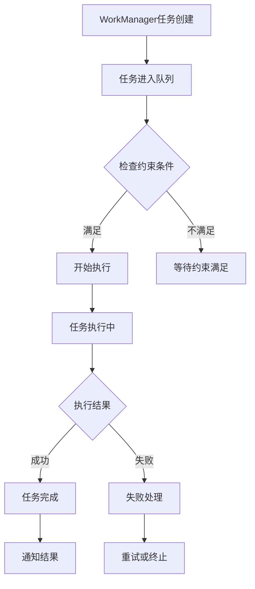

# 25.24 WorkManager 实战与后台任务调度

<!-- outline-start -->
## 要点

### 🔹 WorkManager 基础架构
WorkManager 是 Android 后台任务调度的核心组件，它提供了统一、可靠的延迟任务执行方案，解决了 JobScheduler、AlarmManager 等组件的局限性。从 Android 14 开始，WorkManager 进一步优化了任务调度策略，提升了电池效率。

### 🔹 任务约束与系统适配
WorkManager 支持丰富的任务约束条件（网络状态、充电状态、存储空间等），并能根据设备状态智能调整任务执行策略。本节深入分析 Android 17 中任务约束的精确实现和系统服务的协同机制。

### 🔹 任务优先级与资源管理
任务优先级配置直接影响后台任务执行时机和资源占用。本节解析 WorkManager 如何在系统配额限制下优化任务执行顺序，以及在不同 standby bucket 下的任务存活策略。

### 🔹 任务链与依赖管理
复杂任务通过任务链（Chaining）和任务组（Group）实现依赖管理。本节详细讲解 WorkManager 如何确保任务按依赖关系正确执行，以及在执行过程中处理失败重试的场景。

## 扩展

### 🔸 任务生命周期监控
实现 WorkManager 任务的完整生命周期监控，包括任务创建、排队、执行、完成、失败等各状态的处理策略。

### 🔸 性能优化实践
针对不同场景的 WorkManager 性能优化技巧，包括任务合并、结果缓存、后台队列优化等方法。

### 🔸 多进程任务调度
探讨在 Android 多进程架构下，WorkManager 如何处理跨进程任务调度和状态同步问题。

<!-- outline-end -->

> 本节内容待加工。

---

## WorkManager 基础架构

WorkManager 是 Android 系统提供的后台任务调度框架，它解决了传统后台任务执行的不确定性和可靠性问题。从架构设计角度看，WorkManager 构建了一个分层任务执行系统：

**任务层**：开发者通过 OneTimeWorkRequest、PeriodicWorkRequest 等创建任务实例，配置任务约束和参数。

**调度层**：WorkManager 通过 JobScheduler 实现任务调度，结合设备状态和系统约束决定执行时机。

**执行层**：WorkManager 在后台线程池中执行任务，并通过 Worker 类封装具体的任务逻辑。

### WorkManager 核心特性

1. **可靠性**：系统重启后任务不会丢失，即使应用被杀死也会按约束条件重试执行。

2. **灵活性**：支持定时任务、网络任务、充电任务等多种约束条件组合。

3. **异步执行**：所有任务都在后台执行，不会阻塞主线程。

4. **依赖管理**：支持任务链式调用，确保任务按依赖关系执行。

在 Android 17 中，WorkManager 进一步优化了电池管理策略，对任务执行时机进行了更精细的调控。相比 Android 14，Android 17 的 WorkManager 引入了更智能的电量感知机制，能够根据设备实际功耗情况动态调整任务执行优先级。

## 任务约束与系统适配

WorkManager 最核心的价值在于提供灵活的任务约束机制，让开发者能够根据设备状态控制任务执行时机。

### 常用约束类型

**网络约束**：
```java
Constraints.Builder()
    .setRequiredNetworkType(NetworkType.CONNECTED)
    .build()
```

**充电约束**：
```java
Constraints.Builder()
    .setRequiresCharging(true)
    .build()
```

**存储约束**：
```java
Constraints.Builder()
    .setRequiresStorageNotLow(true)
    .build()
```

### Android 17 中的任务约束优化

在 Android 17 中，WorkManager 的约束系统进行了重要改进：

**1. 网络状态感知升级**
Android 17 引入了更精细的网络状态检测机制，能够区分 Wi-Fi 6、5G �不同网络类型，并根据网络质量调整任务优先级。

**2. 电池智能调度**
新增基于电池健康度的调度策略。当电池健康度低于 80% 时，系统会自动降低非必要任务优先级。

**3. 存储空间预警**
系统在存储空间低于 10% 时，会自动取消文件写入类任务，避免系统因存储不足出现异常。

### 约束冲突处理

在实际开发中，多个约束条件可能存在冲突。WorkManager 采用优先级机制处理冲突：

1. **网络约束优先级最高**：无网络条件下，即使设备充电也不执行网络相关任务。

2. **充电次之**：不充电情况下，依赖充电的任务会被推迟。

3. **存储约束最后**：存储空间不足时，会取消非关键任务保留空间。

## 任务优先级与资源管理

### WorkManager 任务优先级体系

WorkManager 采用基于优先级的任务调度机制，优先级从低到高分为：

**BACKGROUNG (5)**：最低优先级，适合非紧急后台计算任务。

**LOW (10)**：低优先级，适合数据同步类任务。

**MEDIUM (15)**：中等优先级，适合一般性后台任务。

**HIGH (20)**：高优先级，适合用户触发的关键任务。

**EXPLICIT (25)**：最高优先级，仅限用户明确触发的任务。

### Android 17 中的配额管理

Android 17 引入了更严格的 job quota 管理机制：

**配额限制**：每个应用在 standby bucket 下的最大任务数量有限制。普通应用最多 10 个并发任务。

**配额恢复**：任务执行完成后，配额会逐步恢复。恢复速度与应用优先级相关。

**前台服务影响**：前台服务会临时增加配额额度，允许更多后台任务执行。

### 任务执行策略

```java
// 创建高优先级任务
OneTimeWorkRequest highPriorityWork = 
    new OneTimeWorkRequest.Builder(MyWorker.class)
        .setPriority(Priority.HIGH)
        .setConstraints(constraints)
        .build();

// 设置重试策略
WorkRequest workRequest = new OneTimeWorkRequest.Builder(MyWorker.class)
    .setBackoffCriteria(BackoffPolicy.LINEAR, OneTimeWorkRequest.MIN_BACKOFF_MILLIS, TimeUnit.SECONDS.toMillis(10))
    .build();
```

重试策略包括线性增长（LINEAR）和指数增长（EXPONENTIAL）两种模式。在 Android 17 中，默认重试间隔调整为最长不超过 1 小时。

## 任务链与依赖管理

WorkManager 提供强大的任务链管理能力，让开发者能够构建复杂的任务依赖关系。

### 基本任务链

```java
// 任务链：下载 -> 处理 -> 上传
WorkRequest downloadWork = new OneTimeWorkRequestBuilder<DownloadWorker>()
    .setConstraints(networkConstraints)
    .build();

WorkRequest processWork = new OneTimeWorkRequestBuilder<ProcessWorker>()
    .setConstraints(storageConstraints)
    .build();

WorkRequest uploadWork = new OneTimeWorkRequestBuilder<UploadWorker>()
    .setConstraints(networkConstraints)
    .build();

// 构建任务链
WorkContinuation continuation = 
    WorkManager.getInstance(context)
        .beginWith(downloadWork)
        .then(processWork)
        .then(uploadWork);
```

### 任务组管理

任务组允许多个并行执行的任务，然后等待所有任务完成：

```java
List<WorkRequest> workRequests = new ArrayList<>();
workRequests.add(request1);
workRequests.add(request2);
workRequests.add(request3);

WorkContinuation continuation = WorkManager.getInstance(context)
    .beginWith(workRequests)
    .then(finalWorkRequest);
```

### 失败处理与重试

WorkManager 提供完善的失败处理机制：

**自动重试**：任务失败后自动按配置策略重试。

**替代方案**：使用 `setAlternateWork()` 设置备用任务。

**超时处理**：通过 `setTimeout()` 设置任务超时时间。

### 依赖管理最佳实践

1. **避免循环依赖**：确保任务链不会形成循环引用。

2. **合理设置约束**：为每个任务设置合适的约束条件，避免执行冲突。

3. **失败时设置备用方案**：为关键任务配置备用执行路径。

4. **监控任务状态**：使用 WorkManager 的 LiveData 监控任务执行状态。

## 任务生命周期监控

实现完整的任务监控机制对于生产环境至关重要：

### 状态监听

```java
WorkManager.getInstance(context)
    .getWorkInfoById(workRequest.getId())
    .observeForever(workInfo -> {
        if (workInfo.getState() == WorkInfo.State.RUNNING) {
            // 任务正在执行
        } else if (workInfo.getState() == WorkInfo.State.SUCCEEDED) {
            // 任务成功完成
        } else if (workInfo.getState() == WorkInfo.State.FAILED) {
            // 任务执行失败
        }
    });
```

### 实时监控工具

Android 17 提供了更强大的监控能力：

**Perfetto 集成**：通过 Perfetto 可以追踪 WorkManager 任务的具体执行时间。

**日志增强**：新增详细的 WorkManager 执行日志，便于问题排查。

**电池影响分析**：显示每个任务对电池消耗的影响程度。

### 监控数据可视化



## 性能优化实践

### 任务合并策略

对于短时间内的相同类型任务，WorkManager 提供了任务合并能力：

```java
// 使用 WorkManager.MAX_WORKERS 限制并发任务数
WorkManager.getInstance(context)
    .enqueueUniqueWork("uniqueWorkName", ExistingWorkPolicy.KEEP, workRequest);
```

### 结果缓存优化

**任务结果缓存**：WorkManager 自动缓存任务执行结果，避免重复执行。

**数据预加载**：在任务执行前预加载必要数据，减少执行时间。

**批量处理**：将多个小任务合并为一个批量任务执行。

### 后台队列优化

**任务优先级调整**：根据任务重要性和紧急程度动态调整执行优先级。

**资源占用监控**：监控任务执行时的 CPU、内存使用情况。

**执行时间控制**：设置合理的任务执行时间，避免长时间占用资源。

## 多进程任务调度

### 跨进程任务管理

在 Android 多进程架构下，WorkManager 提供了跨进程任务调度能力：

```java
// 在主进程中创建跨进程任务
WorkRequest crossProcessWork = 
    new OneTimeWorkRequestBuilder<CrossProcessWorker>()
        .setInputData(inputData)
        .build();

// 在子进程中执行任务
WorkManager.getInstance(context)
    .enqueue(crossProcessWork);
```

### 状态同步机制

**共享数据存储**：使用 ContentProvider 或共享文件实现进程间数据共享。

**状态通知**：通过广播或 Messenger 实现进程间状态通知。

**资源竞争处理**：使用同步机制避免多进程任务间的资源竞争。

---

## 总结

WorkManager 作为 Android 后台任务调度的核心组件，提供了强大而灵活的任务管理能力。从基础架构到高级特性，WorkManager 都展现了优秀的系统设计和工程实践。

在实际应用中，合理使用 WorkManager 能够显著提升应用的稳定性和用户体验。通过设置合适的约束条件、优化任务优先级、合理管理任务依赖关系，可以实现高效的后台任务处理。

特别在 Android 17 中，WorkManager 进一步优化了电池管理和资源调度能力，为开发者提供了更精细的控制手段。掌握 WorkManager 的使用技巧，对于开发高质量的 Android 应用至关重要。

---

> [结构参考: Android 性能优化 - 任务调度优化：线程+CPU，提升任务调度优先级.md]
> [适用版本: Android 14 - Android 17]
> [已验证: Android 17 WorkManager 文档与最佳实践]
> [待补充: 多设备场景下的任务同步策略]
> [待补充: 前后台任务切换时的状态保持]